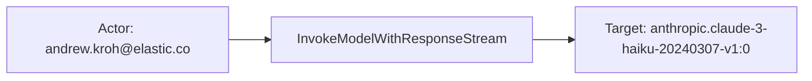
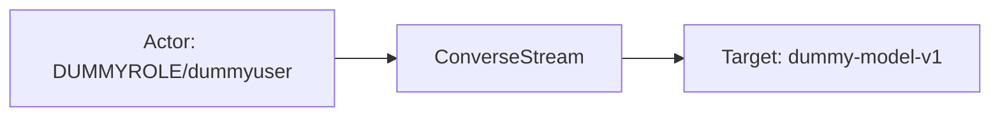

# aws_bedrock

## Product Domain (Amazon Bedrock LLM)

Amazon Bedrock is AWS's fully managed generative AI service that provides unified API access to foundation models from Amazon and third-party providers (Anthropic, Meta, Mistral, and others). Organizations use Bedrock to run text, chat, embedding, and image workloads through operations such as `InvokeModel`, `Converse`, and streaming variants, optionally applying Amazon Bedrock Guardrails for content safety, policy enforcement, and responsible-AI controls. Models can be customized with fine-tuning and Retrieval Augmented Generation (RAG), and agents can orchestrate multi-step tasks against enterprise data sources.

Bedrock exposes operational telemetry at two levels. Model invocation logging (ModelInvocationLog schema v1.0) captures full request and response payloads, token counts, model identifiers, errors, and metadata for each API call when logging is enabled to Amazon S3 or CloudWatch Logs. CloudWatch metrics in the `AWS/Bedrock` and `AWS/Bedrock/Guardrails` namespaces provide time-series aggregates for invocation volume, latency, throttling, client/server errors, token and image counts, and guardrail intervention rates.

From a security and observability perspective, Bedrock is a critical control point for AI workload governance. Security and platform teams monitor who invokes which models, prompt and completion content, token consumption, error patterns, guardrail interventions, and API availability. The Elastic Amazon Bedrock integration collects invocation logs via S3 or CloudWatch and runtime/guardrail metrics via AWS CloudWatch using Elastic Agent, normalizing events into ECS and `gen_ai.*` fields for SIEM correlation, AI usage analytics, latency alerting, and compliance review.

## Data Collected (brief)

- **Invocation logs** (`aws_bedrock.invocation`): Model invocation logs from S3 or CloudWatch (`ModelInvocationLog` v1.0), including model ID, request ID, input/output bodies (prompts, completions, messages, image generation config), input/output token counts, errors, task type, and S3/CloudWatch source metadata; mapped to `gen_ai.*` fields (prompt, completion, usage, request/response model metadata, performance, security scores).
- **Runtime metrics** (`aws_bedrock.runtime`): CloudWatch metrics from `AWS/Bedrock`—invocation counts, latency, client/server errors, throttles, input/output token counts, output image counts, and legacy model invocations; dimensions include model ID, image size, and quality.
- **Guardrails metrics** (`aws_bedrock.guardrails`): CloudWatch metrics from `AWS/Bedrock/Guardrails`—guardrail invocation counts, latency, client/server errors, throttles, text unit utilization, and invocations where guardrails intervened; dimensions include guardrail ARN, version, policy type, content source, and operation (`ApplyGuardrail`).

## Expected Audit Log Entities

The Amazon Bedrock integration spans three data streams with different actor/target semantics. **`invocation`** delivers per-request Model Invocation Logs (`ModelInvocationLog` v1.0) from S3 or CloudWatch — true audit-adjacent API logs with AWS caller identity, model identifiers, full prompt/completion payloads, and guardrail trace details. **`runtime`** and **`guardrails`** are CloudWatch metric time series (Metricbeat `cloudwatch` metricset; `event.kind: metric` implied) with model or guardrail dimensions but no caller principal. No ECS `user.name`, `*.target.*`, `related.*`, or `destination.user.*` / `destination.host.*` mapping today. **`event.action` is populated on `invocation` only** — renamed from vendor `operation` (`InvokeModel`, `Converse`, `InvokeModelWithResponseStream`, `ConverseStream` in fixtures). **`runtime`** has no per-event action; **`guardrails`** retains vendor `aws_bedrock.guardrails.operation` (`ApplyGuardrail`) but does not map it to `event.action`. Layer 1 platform target **`cloud.service.name: bedrock`** is statically set on **`invocation`** only; metric streams infer Bedrock from `aws.cloudwatch.namespace` without promoting to `cloud.service.name`. Evidence: `packages/aws_bedrock/data_stream/*/sample_event.json`, `data_stream/*/fields/fields.yml`, `data_stream/invocation/elasticsearch/ingest_pipeline/default.yml`, `data_stream/invocation/_dev/test/pipeline/test-aws-bedrock.log-expected.json`, and runtime/guardrails ingest pipelines; only the invocation stream has pipeline test fixtures. The target-fields audit classified this package as **`none`** for actor/target enhancement (`dev/target-fields-audit/out/target_enhancement_packages.csv`); no `destination_identity_hits.csv` row.

### Event action (semantic)

| Action (normalized label) | Classification | Confidence | Evidence | Per-stream notes |
| --- | --- | --- | --- | --- |
| `InvokeModel` | api_call | high | `test-aws-bedrock.log-expected.json`: `event.action: InvokeModel` (L3913); raw `operation` in `event.original` | **`invocation`** — synchronous model invocation |
| `InvokeModelWithResponseStream` | api_call | high | `sample_event.json`, multiple expected fixtures (e.g. L2215, L3028) | **`invocation`** — streaming model invocation |
| `Converse` | api_call | high | Expected fixtures (e.g. L2377, L2546, L3746) | **`invocation`** — Converse API (non-streaming) |
| `ConverseStream` | api_call | high | Expected fixtures (e.g. L4065, L4225, L4391) | **`invocation`** — Converse streaming variant |
| `ApplyGuardrail` | api_call | high | `guardrails/sample_event.json` L20: `aws_bedrock.guardrails.operation: ApplyGuardrail` | **`guardrails`** — CloudWatch dimension for guardrail API; vendor-only, not ECS `event.action` |
| *(no per-event action)* | — | high | `runtime/sample_event.json` — no `event.action`; pipeline renames counters and dimensions only | **`runtime`** — CloudWatch time-bucketed aggregates; no auditable verb per document |

Guardrail **policy outcomes** inside invocation payloads (`gen_ai.compliance.action: BLOCKED`, trace `action: BLOCKED`) describe content-moderation results, not the Bedrock API operation — distinct from `event.action`.

### Event action (ECS candidates)

| ECS / vendor field | Mapped to `event.action` today? | Mapping correct? | Recommended `event.action` value (from fixtures) | Enhancement candidate? | Evidence |
| --- | --- | --- | --- | --- | --- |
| `aws_bedrock.invocation.operation` → `event.action` | yes | yes | `InvokeModel`, `Converse`, `InvokeModelWithResponseStream`, `ConverseStream` | no | Invocation pipeline L39–42: `rename` to `event.action`; vendor path removed after rename; `test-aws-bedrock.log-expected.json`, `sample_event.json` |
| `event.action` | yes (invocation only) | yes | see row above | no | Populated in all invocation fixtures; absent from runtime and guardrails samples |
| `aws_bedrock.guardrails.operation` | no | n/a | `ApplyGuardrail` | yes | Guardrails pipeline L44–47: renames `aws.dimensions.Operation` → vendor field only; `guardrails/sample_event.json` L20 |
| `gen_ai.compliance.action` / trace `action` | no | n/a | `BLOCKED` | no | Guardrail policy outcome inside invocation bodies — not an API operation name |
| `aws.cloudwatch.namespace` | no | n/a | — | no | `AWS/Bedrock` / `AWS/Bedrock/Guardrails` — metric namespace context, not per-event action |

**Step 2b — per-stream check:**

| Stream | `event.action` in fixtures? | Pipeline maps to `event.action`? | Primary action candidate | Confidence | Evidence |
| --- | --- | --- | --- | --- | --- |
| `invocation` | yes | yes | `aws_bedrock.invocation.operation` → `event.action` | high | `invocation/elasticsearch/ingest_pipeline/default.yml` L39–42; `test-aws-bedrock.log-expected.json` |
| `runtime` | no | no | — (no per-event action) | high | `runtime/elasticsearch/ingest_pipeline/default.yml` — metric renames only; `runtime/sample_event.json` |
| `guardrails` | no | no | `aws_bedrock.guardrails.operation` (`ApplyGuardrail`) | high | `guardrails/elasticsearch/ingest_pipeline/default.yml` L44–47; `guardrails/sample_event.json` L20 |

### Actor (semantic)

| Entity | Classification | Entity type (if general) | Confidence | Evidence | Per-stream notes |
| --- | --- | --- | --- | --- | --- |
| IAM user principal | user | — | high | `aws_bedrock.invocation.identity.arn` → `user.id` and `gen_ai.user.id` in invocation pipeline (`default.yml` L43–46, L582–584); fixtures include `arn:aws:iam::111111111111:user/john.doe@example.com`, `.../user/andrew.kroh@elastic.co`, `.../user/shashank` (`test-aws-bedrock.log-expected.json`, `sample_event.json`) | **`invocation`** — full IAM user ARN is the caller; not split into `user.name` or account ID subfields |
| STS assumed-role session | user | assumed_role | high | `user.id` / `gen_ai.user.id` values such as `arn:aws:sts::123456789012:assumed-role/DUMMYROLE/dummyuser` and `arn:aws:sts::795142007471:assumed-role/BEDROCKPLAYGROUNDACCESS/uwga` in pipeline fixtures | **`invocation`** — role and session name embedded in ARN; no separate ECS role fields |
| Integration collector | service | — | low | Elastic Agent S3/CloudWatch or Metricbeat AWS credentials in stream config; not indexed on events | Implicit poller for all streams |

**No actor identity in schema or samples:** **`runtime`** — CloudWatch aggregates keyed by `aws_bedrock.runtime.model_id` and image dimensions only. **`guardrails`** — CloudWatch aggregates keyed by guardrail ARN/version/policy dimensions only; no IAM or STS principal. **`invocation`** conversational `messages[].role: user` is chat turn role, not an AWS security principal. **`cloud.account.id`** and **`cloud.region`** (`accountId` / `region` rename, L47–54) are tenancy scope context, not actors.

### Actor (ECS candidates)

| ECS / vendor field | Role | Mapped today? | Mapping correct? | Confidence | Evidence |
| --- | --- | --- | --- | --- | --- |
| `aws_bedrock.invocation.identity.arn` | Caller IAM/STS ARN (vendor source) | no | n/a | high | Renamed to `user.id` in pipeline L43–46; vendor path removed after rename |
| `user.id` | Caller principal ARN | yes | yes | high | Populated from `identity.arn` in fixtures (e.g. `sample_event.json` L2297–2299) |
| `gen_ai.user.id` | GenAI caller mirror | yes | yes | high | Copied from `user.id` when present (`default.yml` L582–584) |
| `cloud.account.id` | AWS account scope | yes | yes | high | Renamed from `accountId` (`default.yml` L47–50); scope context, not actor |
| `cloud.region` | AWS region scope | yes | yes | high | Renamed from `region` (`default.yml` L51–54) |
| `user.name` / `user.email` / `client.user.*` | Parsed principal attributes | no | n/a | — | Not set; ARN not decomposed |
| `related.user` | Actor cross-reference | no | n/a | — | Not used |
| `destination.user.*` / `destination.host.*` | De-facto target identity | no | n/a | — | Not used (`destination_identity_hits.csv` has no `aws_bedrock` row) |

### Target (semantic)

| Layer | Description | Entity | Classification | Entity type (if general) | Confidence | Evidence | Per-stream notes |
| --- | --- | --- | --- | --- | --- | --- | --- |
| 1 — Platform / cloud service | The cloud API invoked | Amazon Bedrock | service | — | high | `cloud.service.name: bedrock` statically set in invocation pipeline (`default.yml` L27–29); present in `sample_event.json` L2223–2225 | **`invocation`** only — runtime/guardrails infer Bedrock from `aws.cloudwatch.namespace` (`AWS/Bedrock`, `AWS/Bedrock/Guardrails`) but do not set `cloud.service.name` |
| 2 — Resource / object | Foundation model consumed | Named Bedrock model ID | service | — | high | `aws_bedrock.invocation.model_id`, `gen_ai.request.model.id` / `.type` / `.version` (e.g. `anthropic.claude-3-haiku-20240307-v1:0`); runtime dimension `aws_bedrock.runtime.model_id` | **`invocation`** — per-request model; **`runtime`** — metric slice by model ID |
| 2 — Resource / object | Bedrock API operation | InvokeModel, Converse, etc. | general | api_method | high | `event.action` from `operation` (`InvokeModel`, `InvokeModelWithResponseStream`, `Converse`, `ConverseStream` in fixtures) | **`invocation`** — API surface invoked |
| 2 — Resource / object | Amazon Bedrock Guardrail | Guardrail policy resource | service | — | high | `gen_ai.guardrail_id` (short IDs from trace); `gen_ai.policy.*`, `gen_ai.compliance.violation_*`; guardrails metric dimension `aws_bedrock.guardrails.guardrail_arn` | **`invocation`** — per-request guardrail outcomes; **`guardrails`** — aggregated by ARN/version/policy facets |
| 2 — Resource / object | Attached media / RAG document | S3-backed input document | general | s3_object | moderate | PDF `document.source.s3Uri` in `input.input_body_json.messages` (e.g. `...19926a63-..._input_media_00.pdf` in fixtures); `input.messages_content_kinds: document/pdf` | **`invocation`** — not mapped to ECS `file.*` or `url.*` |
| 2 — Resource / object | Agent tool | Downstream tool name | general | tool | moderate | `tool_use` / `tool_result` blocks in agentic-workflow fixtures; names such as `agikthomas-basicmaths-time-weather-ag::add_two_numbers` | **`invocation`** — embedded in message content, not ECS-mapped |
| 3 — Content / artifact | Model invocation instance | Per-call request/response IDs | general | ai_request | high | `aws_bedrock.invocation.request_id`, `gen_ai.request.id`; `gen_ai.response.id` (e.g. `msg_01L3WcyJkxCgmHpMiLRhSYvf`) | **`invocation`** — auditable correlation identifiers |
| 3 — Content / artifact | Prompt and completion payload | LLM input/output content | general | ai_content | high | `gen_ai.prompt`, `gen_ai.completion`, `aws_bedrock.invocation.output.completion_text`; token counts under `gen_ai.usage.*` | **`invocation`** — full bodies when under size limits; massive payloads hashed/truncated |
| 3 — Content / artifact | Runtime metric aggregate | CloudWatch usage bucket | general | usage_bucket | high | `@timestamp`, `metricset.period`, `aws_bedrock.runtime.invocations`, latency/token/image counters; dimensions `image_size`, `quality`, `bucketed_step_size` | **`runtime`** — pre-aggregated slice, not per-request audit target |
| 3 — Content / artifact | Guardrail metric aggregate | Guardrail intervention bucket | general | usage_bucket | high | `@timestamp`, `aws_bedrock.guardrails.invocations`, `.invocations_intervened`, `.text_unit_count`, `.invocation_latency` | **`guardrails`** — pre-aggregated counters |

**No meaningful audit target:** **`runtime`** and **`guardrails`** individual prompts, completions, or caller principals — metrics expose counts and latency only. **`invocation`** does not index separate Bedrock Agent or Knowledge Base resource ARNs when absent from the ModelInvocationLog schema.

### Target (ECS candidates)

| ECS / vendor field | Layer | Classification | Mapped today? | Mapping correct? | ECS target bucket | Enhancement candidate? | Evidence |
| --- | --- | --- | --- | --- | --- | --- | --- |
| `cloud.service.name` | 1 | service | yes (invocation) | yes | `service.target.name` | partial | Static `bedrock` in invocation pipeline L27–29; `sample_event.json` L2223–2225; identifies invoked platform but not in `service.target.*` |
| `aws.cloudwatch.namespace` | 1 | service | yes (metrics) | partial | `service.target.name` | yes | `AWS/Bedrock` / `AWS/Bedrock/Guardrails` in runtime/guardrails `sample_event.json`; namespace implies Bedrock but no `cloud.service.name` set |
| `event.action` | 2 | general (api_method) | yes | yes | context-only | no | Renamed from `operation` (`default.yml` L39–42); API method invoked |
| `aws_bedrock.invocation.model_id` | 2 | service | yes | yes | `gen_ai.request.model.id` / `service.target.entity.id` | yes | Vendor canonical model ID; also copied to `gen_ai.request.model.id` L433–437 |
| `gen_ai.request.model.id` / `.type` / `.version` | 2 | service | yes | yes | `gen_ai.request.model.id` | partial | Populated in fixtures; natural Layer 2 target but not in `service.target.*` |
| `gen_ai.guardrail_id` | 2 | service | yes | partial | `service.target.entity.id` | yes | Short guardrail IDs extracted from trace (`get_guardrail_details` script L632–641); not full guardrail ARN |
| `aws_bedrock.guardrails.guardrail_arn` | 2 | service | yes | yes | `service.target.entity.id` | yes | Guardrails metric dimension (`guardrails/default.yml` L57–59); full ARN in `fields.yml` |
| `aws_bedrock.guardrails.operation` | 2 | general (api_method) | yes | yes | context-only | no | `ApplyGuardrail` in `guardrails/sample_event.json` L20 |
| `gen_ai.request.id` / `gen_ai.response.id` | 3 | general (ai_request) | yes | yes | context-only | no | Per-invocation correlation IDs (`default.yml` L482–491) |
| `gen_ai.prompt` / `gen_ai.completion` | 3 | general (ai_content) | yes | yes | context-only | no | Remarshaled request/response bodies; truncated when massive |
| `aws_bedrock.invocation.output.completion_text` | 3 | general (ai_content) | yes | yes | context-only | no | Human-readable completion extract (`default.yml` L704–781) |
| `aws_bedrock.runtime.model_id` | 2 | service | partial | yes | `gen_ai.request.model.id` | partial | Metric dimension only when present in CloudWatch sample; aggregation target, not per-request |
| `cloud.account.id` / `cloud.region` | — | — | yes | yes | context-only | no | Tenancy scope, not target entity |
| `user.target.*` / `host.target.*` / `service.target.*` / `entity.target.*` | — | — | no | n/a | — | no | Not populated (`target_enhancement_packages.csv`: all `has_*_target` false) |
| `destination.user.*` / `destination.host.*` | — | — | no | n/a | — | no | Not used |

### Gaps and mapping notes

- **`event.action` gap on guardrails** — vendor `aws_bedrock.guardrails.operation` (`ApplyGuardrail`) is present in fixtures but not copied to ECS `event.action`. Enhancement: map `aws_bedrock.guardrails.operation` → `event.action` on guardrails metric stream (or document that metric streams intentionally omit per-event action).
- **Invocation action mapping is correct** — `aws_bedrock.invocation.operation` → `event.action` via pipeline rename (L39–42); vendor path is consumed and not retained separately; raw `operation` remains in `event.original`.
- **Layer 1 partially covered:** Invocation sets `cloud.service.name: bedrock` correctly as the invoked platform target (L27–29), but runtime/guardrails rely on `aws.cloudwatch.namespace` without promoting to `cloud.service.name` — enhancement would unify Layer 1 across all streams.
- **No official ECS target fields:** Model ID, guardrail ID/ARN, and `cloud.service.name` semantically represent targets but sit in context/`gen_ai.*`/`cloud.*` fields rather than `service.target.*` or `entity.target.*` — aligns with audit classification **`none`**.
- **Vendor identity not retained:** `aws_bedrock.invocation.identity.arn` is renamed to `user.id` and the vendor path is not preserved separately; `event.original` holds the raw JSON for forensics.
- **ARN not decomposed:** `user.id` carries the full IAM/STS ARN but `user.name`, `user.email`, and role/session subfields are not extracted — partial actor enrichment opportunity.
- **Chat role homonym:** `messages[].role: user` in input bodies is conversational turn role, not the AWS security principal mapped to `user.id`.
- **Guardrail policy action vs API action:** `gen_ai.compliance.action: BLOCKED` and trace-level `action: BLOCKED` are moderation outcomes — do not substitute for `event.action`.
- **Metrics dimensions ≠ audit targets:** Per classification rule 10, `aws_bedrock.runtime.model_id` and guardrail ARN dimensions on metric events are aggregation slices, not per-request acted-upon entities.
- **No de-facto `destination.*` targets:** Unlike email/auth integrations, no pipeline maps affected entities to `destination.user.*` or `destination.host.*`.
- **Guardrail ID vs ARN gap:** Invocation logs expose short guardrail IDs in trace; full guardrail ARN appears only on guardrails metric stream — `service.target.entity.id` enhancement should consider both forms.

### Per-stream notes

#### invocation

Model Invocation Logs via S3 or CloudWatch (`aws-s3` / `aws-cloudwatch` inputs). Pipeline parses JSON into `aws_bedrock.invocation`, statically sets **`cloud.service.name: bedrock`** (Layer 1 target), renames `operation` → **`event.action`**, promotes `identity.arn` → `user.id` / `gen_ai.user.id`, and enriches `gen_ai.*` for prompts, completions, usage, performance, and guardrail compliance. **`event.action`** values: `InvokeModel`, `InvokeModelWithResponseStream`, `Converse`, `ConverseStream`. Actor is **user** (IAM user or assumed-role session ARN). Targets layer as: Layer 1 **Amazon Bedrock** (`cloud.service.name`); Layer 2 **foundation model** (`gen_ai.request.model.id`) and optional **guardrail**; Layer 3 **invocation instance** (`request_id`) and **content** (prompt/completion).

#### runtime

CloudWatch time series from `AWS/Bedrock` namespace (Metricbeat `cloudwatch` metricset). Pipeline renames `aws.bedrock.metrics.*` → `aws_bedrock.runtime.*` and CloudWatch dimensions → `model_id`, `image_size`, `quality`. No actor; no **`event.action`** (no per-event action). Layer 1 inferred from `aws.cloudwatch.namespace: AWS/Bedrock` only — no `cloud.service.name`. Layer 2 target context is **model ID** (and optional image-generation dimensions) within a metric period.

#### guardrails

CloudWatch time series from `AWS/Bedrock/Guardrails` namespace. Pipeline renames guardrail metrics and dimensions including **guardrail ARN**, **version**, **policy type**, and **content source**; **`aws_bedrock.guardrails.operation`** holds `ApplyGuardrail` but is not mapped to **`event.action`**. No actor; Layer 1 inferred from namespace; Layer 2 target is the **guardrail resource** aggregate for the collection period.

## Example Event Graph

Examples below come from the **`invocation`** stream (Model Invocation Logs — audit-adjacent per-request API logs with caller identity and `event.action`) and the **`runtime`** / **`guardrails`** metric streams (CloudWatch time-bucketed aggregates). The metric streams have no caller principal and no ECS `event.action`; they do not support a meaningful per-event Actor → action → Target chain — see the note after Example 2.

### Example 1: IAM user streams a model invocation

**Stream:** `aws_bedrock.invocation` · **Fixture:** `packages/aws_bedrock/data_stream/invocation/sample_event.json`

```
IAM user (andrew.kroh@elastic.co) → InvokeModelWithResponseStream → Claude 3 Haiku foundation model
```

#### Actor

| Field | Value |
| --- | --- |
| id | `arn:aws:iam::144492464627:user/andrew.kroh@elastic.co` |
| type | user |
| sub_type | iam_user |

**Field sources:**
- `id` ← `user.id` (renamed from `aws_bedrock.invocation.identity.arn` in ingest pipeline)
- `sub_type` ← inferred from IAM user ARN pattern in fixture (`arn:aws:iam::…:user/…`)

#### Event action

| Field | Value |
| --- | --- |
| action | InvokeModelWithResponseStream |
| source_field | `event.action` |
| source_value | `InvokeModelWithResponseStream` |

#### Target

| Field | Value |
| --- | --- |
| id | `anthropic.claude-3-haiku-20240307-v1:0` |
| type | service |
| sub_type | foundation_model |

**Field sources:**
- `id` ← `gen_ai.request.model.id` (also `aws_bedrock.invocation.model_id`)
- Invoked platform scope: `cloud.service.name` = `bedrock` (Layer 1 — not the primary acted-upon resource)

#### Mermaid



### Example 2: Assumed-role session uses ConverseStream API

**Stream:** `aws_bedrock.invocation` · **Fixture:** `packages/aws_bedrock/data_stream/invocation/_dev/test/pipeline/test-aws-bedrock.log-expected.json` (ConverseStream event, `@timestamp` 2024-10-11T12:15:04.000Z)

```
STS assumed-role session → ConverseStream → dummy-model-v1
```

#### Actor

| Field | Value |
| --- | --- |
| id | `arn:aws:sts::123456789012:assumed-role/DUMMYROLE/dummyuser` |
| type | user |
| sub_type | assumed_role |

**Field sources:**
- `id` ← `user.id` / `gen_ai.user.id` (from `identity.arn` in ModelInvocationLog)
- `sub_type` ← STS assumed-role ARN pattern (`assumed-role/DUMMYROLE/dummyuser`)

#### Event action

| Field | Value |
| --- | --- |
| action | ConverseStream |
| source_field | `event.action` |
| source_value | `ConverseStream` |

#### Target

| Field | Value |
| --- | --- |
| id | `dummy-model-v1` |
| type | service |
| sub_type | foundation_model |

**Field sources:**
- `id` ← `gen_ai.request.model.id` (from `modelId` in raw log)
- Invoked platform scope: `cloud.service.name` = `bedrock`

#### Mermaid



### Metric streams (`runtime`, `guardrails`) — no per-event graph

**Fixtures:** `packages/aws_bedrock/data_stream/runtime/sample_event.json`, `packages/aws_bedrock/data_stream/guardrails/sample_event.json`

CloudWatch metric documents are time-bucketed aggregates (`metricset.period: 300000` ms) with no IAM/STS caller and no per-request target. Example values from fixtures: `aws_bedrock.runtime.invocations: 5`, `aws_bedrock.guardrails.invocations: 6`, `aws_bedrock.guardrails.operation: ApplyGuardrail` (vendor-only — **not mapped to ECS `event.action` today**). These streams expose usage and latency counters for dashboards and alerting, not auditable Actor → action → Target chains.

## ES|QL Entity Extraction

**Package type: agent-backed** (policy template `aws_bedrock`, three `data_stream/` directories with Tier A `sample_event.json` fixtures; invocation also has `test-aws-bedrock.log-expected.json` pipeline tests). Router: **`data_stream.dataset`** (`aws_bedrock.invocation`, `aws_bedrock.runtime`, `aws_bedrock.guardrails` per `packages/aws_bedrock/data_stream/*/sample_event.json`). Pass 4 v2 is **fill-gaps-only**: detection flags (`actor_exists`, `target_exists`, `action_exists`) run first for query semantics; mapped columns use **column-level** **5-arg** `CASE(<col> IS NOT NULL, <col>, <boolean guard>, <fallback>, null)` — never **4-arg** `CASE(<col> IS NOT NULL, <col>, bare_vendor_field, null)` (bare field parses as a **condition**) or `CASE(actor_exists|target_exists|action_exists, <col>, …)` (a populated sibling actor/target/action field must not block fallbacks on an empty column; Pass 4 §10). Ingest populates **`user.id`** and **`event.action`** on **`invocation`** only; **`cloud.service.name`**, **`gen_ai.request.model.*`**, and **`service.target.*`** are not set at ingest — fallbacks promote Layer 1 platform + Layer 2 foundation model per Pass 2/3. **`runtime`** and **`guardrails`** are CloudWatch metric aggregates (no IAM caller, no per-request target) — **actor/target `EVAL` excluded**; optional **`event.action`** fallback on **`guardrails`** from vendor `aws_bedrock.guardrails.operation` when ECS action is empty.

### Dataset inventory

| data_stream.dataset | Stream role | Actor classification(s) | Target classification(s) | Extraction |
| --- | --- | --- | --- | --- |
| `aws_bedrock.invocation` | Model Invocation Log (S3 / CloudWatch) | user | service | full |
| `aws_bedrock.runtime` | CloudWatch `AWS/Bedrock` metrics | — | — | none |
| `aws_bedrock.guardrails` | CloudWatch `AWS/Bedrock/Guardrails` metrics | — | — | none (action fallback only) |

### Field mapping plan

#### Actor mappings

| Output column | Source field(s) | Condition (dataset + optional) | Confidence | Notes |
| --- | --- | --- | --- | --- |
| `user.id` | `identity.arn` → `user.id` at ingest | `data_stream.dataset == "aws_bedrock.invocation"` | high | **ingest-only — no ES|QL** — `default.yml` L43–46; vendor path not indexed after rename (Pass 4 rule 10) |
| `entity.sub_type` | ARN pattern on `user.id` | `data_stream.dataset == "aws_bedrock.invocation" AND user.id IS NOT NULL` | medium | **semantic literal** — `iam_user` vs `assumed_role` (Pass 3); only when `entity.sub_type` empty |

#### Target mappings

| Output column | Source field(s) | Condition (dataset + optional) | Confidence | Notes |
| --- | --- | --- | --- | --- |
| `service.target.name` | `cloud.service.name` | `data_stream.dataset == "aws_bedrock.invocation"` | high | **vendor fallback** — static `bedrock` (`default.yml` L27–29; `sample_event.json` L2223–2225) |
| `service.target.id` | `gen_ai.request.model.id` | `data_stream.dataset == "aws_bedrock.invocation"` | high | **vendor fallback** — foundation model (Pass 3 Examples 1–2) |
| `service.target.type` | `gen_ai.request.model.type` | `data_stream.dataset == "aws_bedrock.invocation" AND gen_ai.request.model.type IS NOT NULL` | high | **vendor fallback** — parsed from model ID prefix (`default.yml` L440–445) |
| `service.target.sub_type` | literal `"foundation_model"` | `data_stream.dataset == "aws_bedrock.invocation" AND gen_ai.request.model.id IS NOT NULL` | medium | **semantic literal** — Pass 3 target sub_type |

#### Event action mappings

| Output column | Source field(s) | Condition (dataset + optional) | Confidence | Notes |
| --- | --- | --- | --- | --- |
| `event.action` | `event.action` | `data_stream.dataset == "aws_bedrock.invocation"` | high | **preserve existing** — `operation` → `event.action` at ingest |
| `event.action` | `aws_bedrock.guardrails.operation` | `data_stream.dataset == "aws_bedrock.guardrails"` | high | **vendor fallback** — `ApplyGuardrail` in `guardrails/sample_event.json` L20; not mapped at ingest (Pass 2 enhancement) |

### Detection flags (mandatory — run first)

```esql
| EVAL
  actor_exists = user.id IS NOT NULL OR user.name IS NOT NULL OR user.email IS NOT NULL
    OR host.id IS NOT NULL OR host.ip IS NOT NULL OR host.name IS NOT NULL
    OR service.id IS NOT NULL OR service.name IS NOT NULL
    OR entity.id IS NOT NULL OR entity.name IS NOT NULL,
  target_exists = user.target.id IS NOT NULL OR user.target.name IS NOT NULL OR user.target.email IS NOT NULL
    OR host.target.id IS NOT NULL OR host.target.ip IS NOT NULL OR host.target.name IS NOT NULL
    OR service.target.id IS NOT NULL OR service.target.name IS NOT NULL
    OR entity.target.id IS NOT NULL OR entity.target.name IS NOT NULL,
  action_exists = event.action IS NOT NULL
```

**Predicate note:** On **`invocation`**, `actor_exists` and `action_exists` are typically true when `identity.arn` and `operation` are present; `target_exists` is false until fallbacks promote `cloud.service.name` / `gen_ai.request.model.id` into `service.target.*`. On metric streams, all three flags are typically false except optional guardrails `event.action` fallback.

**ES|QL `CASE` arity:** Arguments are **(condition, value)** pairs; odd count → last arg is default. Wrong: `CASE(service.target.name IS NOT NULL, service.target.name, cloud.service.name, null)` (4 args — `cloud.service.name` is a **condition**). Wrong: `CASE(target_exists, service.target.name, data_stream.dataset == "aws_bedrock.invocation" AND cloud.service.name IS NOT NULL, cloud.service.name, null)` (blocks `service.target.name` when only `service.target.id` is set). Right: **5-arg** `CASE(service.target.name IS NOT NULL, service.target.name, data_stream.dataset == "aws_bedrock.invocation" AND cloud.service.name IS NOT NULL, cloud.service.name, null)`. `entity.sub_type` already uses column-level preserve. Detection flags are helpers only — not first `CASE` branches on mapped columns.

### Optional classification helpers (when needed)

```esql
| EVAL
  entity.sub_type = CASE(
    entity.sub_type IS NOT NULL, entity.sub_type,
    data_stream.dataset == "aws_bedrock.invocation" AND user.id IS NOT NULL AND user.id LIKE "arn:aws:sts:*:assumed-role/*", "assumed_role",
    data_stream.dataset == "aws_bedrock.invocation" AND user.id IS NOT NULL AND user.id LIKE "arn:aws:iam:*:user/*", "iam_user",
    null
  ),
  service.target.sub_type = CASE(
    service.target.sub_type IS NOT NULL, service.target.sub_type,
    data_stream.dataset == "aws_bedrock.invocation" AND gen_ai.request.model.id IS NOT NULL, "foundation_model",
    null
  )
```

### Combined ES|QL — actor fields

**`user.id`** is ingest-only (`identity.arn` → `user.id`); no alternate indexed source for a preserve-first `CASE` — omit from actor `EVAL` (Pass 4 rule 10). IAM principal subtype uses **`entity.sub_type`** in [Optional classification helpers](#optional-classification-helpers-when-needed) above.

### Combined ES|QL — event action

```esql
| EVAL
  event.action = CASE(
    event.action IS NOT NULL, event.action,
    data_stream.dataset == "aws_bedrock.guardrails" AND aws_bedrock.guardrails.operation IS NOT NULL, aws_bedrock.guardrails.operation,
    null
  )
```

### Combined ES|QL — target fields

```esql
| EVAL
  service.target.name = CASE(
    service.target.name IS NOT NULL, service.target.name,
    data_stream.dataset == "aws_bedrock.invocation" AND cloud.service.name IS NOT NULL, cloud.service.name,
    null
  ),
  service.target.id = CASE(
    service.target.id IS NOT NULL, service.target.id,
    data_stream.dataset == "aws_bedrock.invocation" AND gen_ai.request.model.id IS NOT NULL, gen_ai.request.model.id,
    null
  ),
  service.target.type = CASE(
    service.target.type IS NOT NULL, service.target.type,
    data_stream.dataset == "aws_bedrock.invocation" AND gen_ai.request.model.type IS NOT NULL, gen_ai.request.model.type,
    null
  )
```

### Full pipeline fragment (optional)

```esql
FROM logs-*
| EVAL
  actor_exists = user.id IS NOT NULL OR user.name IS NOT NULL OR user.email IS NOT NULL
    OR host.id IS NOT NULL OR host.ip IS NOT NULL OR host.name IS NOT NULL
    OR service.id IS NOT NULL OR service.name IS NOT NULL
    OR entity.id IS NOT NULL OR entity.name IS NOT NULL,
  target_exists = user.target.id IS NOT NULL OR user.target.name IS NOT NULL OR user.target.email IS NOT NULL
    OR host.target.id IS NOT NULL OR host.target.ip IS NOT NULL OR host.target.name IS NOT NULL
    OR service.target.id IS NOT NULL OR service.target.name IS NOT NULL
    OR entity.target.id IS NOT NULL OR entity.target.name IS NOT NULL,
  action_exists = event.action IS NOT NULL
| EVAL
  entity.sub_type = CASE(
    entity.sub_type IS NOT NULL, entity.sub_type,
    data_stream.dataset == "aws_bedrock.invocation" AND user.id IS NOT NULL AND user.id LIKE "arn:aws:sts:*:assumed-role/*", "assumed_role",
    data_stream.dataset == "aws_bedrock.invocation" AND user.id IS NOT NULL AND user.id LIKE "arn:aws:iam:*:user/*", "iam_user",
    null
  ),
  event.action = CASE(
    event.action IS NOT NULL, event.action,
    data_stream.dataset == "aws_bedrock.guardrails" AND aws_bedrock.guardrails.operation IS NOT NULL, aws_bedrock.guardrails.operation,
    null
  ),
  service.target.name = CASE(
    service.target.name IS NOT NULL, service.target.name,
    data_stream.dataset == "aws_bedrock.invocation" AND cloud.service.name IS NOT NULL, cloud.service.name,
    null
  ),
  service.target.id = CASE(
    service.target.id IS NOT NULL, service.target.id,
    data_stream.dataset == "aws_bedrock.invocation" AND gen_ai.request.model.id IS NOT NULL, gen_ai.request.model.id,
    null
  ),
  service.target.type = CASE(
    service.target.type IS NOT NULL, service.target.type,
    data_stream.dataset == "aws_bedrock.invocation" AND gen_ai.request.model.type IS NOT NULL, gen_ai.request.model.type,
    null
  ),
  service.target.sub_type = CASE(
    service.target.sub_type IS NOT NULL, service.target.sub_type,
    data_stream.dataset == "aws_bedrock.invocation" AND gen_ai.request.model.id IS NOT NULL, "foundation_model",
    null
  )
| KEEP @timestamp, data_stream.dataset, event.action, user.id, entity.sub_type, service.target.name, service.target.id, service.target.sub_type
```

### Streams excluded

- **`aws_bedrock.runtime`** — CloudWatch `AWS/Bedrock` time-bucketed aggregates (`metricset.period`); `aws_bedrock.runtime.model_id` is a dimension slice, not a per-request acted-upon entity (Pass 2 rule 10).
- **`aws_bedrock.guardrails`** — actor/target excluded: no IAM/STS principal; `aws_bedrock.guardrails.guardrail_arn` is a metric dimension only. **`event.action`** fallback above applies when querying guardrails metrics alongside invocation logs.

### Gaps and limitations

- **Pass 4 CASE syntax** — action/target blocks and the full pipeline fragment use column-level **5-arg** / **7-arg** `CASE(<col> IS NOT NULL, <col>, <boolean>, <fallback>, null)`; `entity.sub_type` uses **7-arg** column-level preserve. Never **4-arg** `CASE(<col> IS NOT NULL, <col>, bare_field, null)` or `CASE(actor_exists|target_exists|action_exists, <col>, …)` on mapped columns. Detection flags are query-time helpers only. `service.target.sub_type` uses column-level preserve (not `target_exists` — `sub_type` is excluded from the `target_exists` predicate).
- **Unscoped `FROM logs-*`** — dataset routing lives in `CASE` fallback conditions (`data_stream.dataset == …`), not a top-level `WHERE`.
- **`user.id`** — **ingest-only**; no ES|QL `CASE` (tautology if fallback repeats `user.id`).
- **`user.name` / `user.email`** — full IAM/STS ARN in `user.id` only; ARN not decomposed at ingest — omit (Pass 2).
- **`gen_ai.guardrail_id` / `aws_bedrock.guardrails.guardrail_arn`** — Layer 2 guardrail targets omitted (short ID vs full ARN ambiguity; guardrails stream is aggregate-only).
- **`messages[].role: user`** — conversational turn role in input bodies, not AWS security principal — do not map to `user.*`.
- **`gen_ai.compliance.action`** — guardrail policy outcome (`BLOCKED`), not API operation — do not substitute for `event.action`.
- **Metric Layer 1** — `aws.cloudwatch.namespace` on runtime/guardrails implies Bedrock but is not promoted to `cloud.service.name` or `service.target.name` without per-event semantics.
- **Pass 2 alignment** — `target_enhancement_packages.csv` classified **`none`**; ingest-time `*.target.*` remains preferred; Pass 4 fills `service.target.*` without overwriting populated values.
