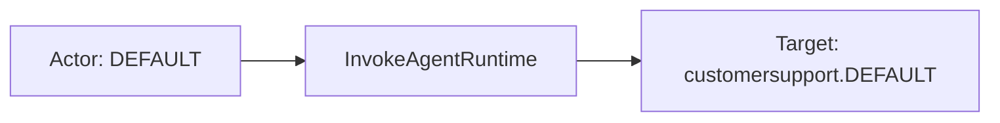
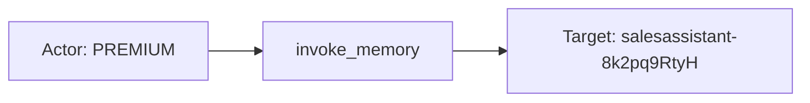
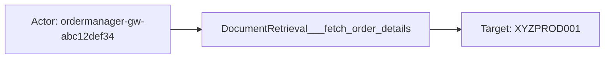

# aws_bedrock_agentcore

## Product Domain (Amazon Bedrock AgentCore)

Amazon Bedrock AgentCore is a fully managed AWS platform for building, deploying, and operating intelligent agents with any framework or foundation model, without managing underlying agent infrastructure. It is composed of modular capabilities—Runtime, Gateway, Memory, Identity, Observability, Code Interpreter, and Browser Tool—that let teams focus on agent workflows and integrations with enterprise systems and data.

Runtime hosts agent execution and exposes endpoints for invocation. Gateway routes agent requests to external tools and targets such as AWS Lambda and MCP (Model Context Protocol) servers. Memory provides durable, strategy-based storage for conversation history, user preferences, and other agent context. Identity handles workload and resource access tokens, API key retrieval, and inbound authorization for agent operations. Code Interpreter and Browser Tool extend agents with sandboxed code execution and browser automation, including human-in-the-loop takeover controls.

AWS surfaces AgentCore observability through CloudWatch metrics in the `AWS/Bedrock-AgentCore` namespace and application logs written to CloudWatch Logs (or exportable to S3). Metrics cover invocations, sessions, latency, errors, throttling, token usage, target execution, and identity operations across all major components. Application logs capture runtime prompts and payloads, memory read/write activity, and gateway tool invocations with trace and session context.

The Elastic integration collects AgentCore metrics via CloudWatch and application logs via CloudWatch or S3 using Elastic Agent. This enables platform and security teams to monitor agent performance and availability, troubleshoot errors and throttling, audit identity and authorization activity, track token consumption, and investigate agent behavior—including prompts, memory operations, and external tool calls—for operational and governance use cases.

## Data Collected (brief)

- **Metrics** (`aws_bedrock_agentcore.metrics`): CloudWatch time series from `AWS/Bedrock-AgentCore` on a configurable period (default 5m); covers Agent runtime, Gateway, Memory, Identity, Browser Tool, and Code Interpreter.
- **Runtime performance**: Invocations, sessions, latency, duration, token counts, target execution time, and target-type breakdowns (Lambda, MCP).
- **Errors and throttling**: System errors, user errors, throttles, and component-specific error/throttle signals (gateway, memory, browser, code interpreter).
- **Identity and authorization**: Inbound authorization success/failure, API key fetch outcomes, workload and resource access token fetch success/failure/throttles, and Identity Service call/throttle counts.
- **Browser Tool**: User takeover and release counts, takeover duration, and session throttles.
- **Dimensions**: Operation, Resource ARN, AgentId, EndpointName, SessionId, agent name, and endpoint name; plus AWS account and region context.
- **Runtime application logs** (`aws_bedrock_agentcore.runtime_application_logs`): Agent execution events from CloudWatch or S3—operation name, agent/endpoint identity, session and conversation IDs, request/response payloads (including prompts), resource ARN, trace/span IDs, and outcome.
- **Memory application logs** (`aws_bedrock_agentcore.memory_application_logs`): Memory operations from CloudWatch or S3—memory name/strategy, namespace, actor and session IDs, operation name, and payload details (including conversation content for preference/history strategies).
- **Gateway application logs** (`aws_bedrock_agentcore.gateway_application_logs`): Gateway routing and tool invocation events from CloudWatch or S3—gateway name, target, tool name, request ID, resource ARN, and payload/error status.

## Expected Audit Log Entities

The Amazon Bedrock AgentCore integration spans four data streams: three **application log** streams (`runtime_application_logs`, `memory_application_logs`, `gateway_application_logs`) and one **metrics** stream (`metrics`). Application logs are OpenTelemetry-style JSON from AgentCore Runtime, Memory, and Gateway components—not AWS CloudTrail administrative audit records. They capture agent invocations, memory read/write activity, and gateway tool routing with request payloads, session context, and distributed trace IDs. CloudWatch metrics in `AWS/Bedrock-AgentCore` provide audit-adjacent time-series aggregates for runtime, gateway, memory, identity, browser, and code-interpreter operations. Actor identity is an **application-scoped `actor_id`** (customer or session partition within the agent), not an IAM principal or Cognito user. The integration sets `cloud.provider`, `cloud.service.name`, `trace.id`, `span.id`, `service.name`, and `event.outcome` but does not populate ECS `user.*`, `*.target.*`, `related.*`, or `destination.*` today. No `destination.user.*` / `destination.host.*` in pipelines (`destination_identity_hits.csv` has no row for this package). **`event.action` is populated only on `gateway_application_logs`** (tool name from grok on log text, e.g. `DocumentRetrieval___fetch_order_details`); runtime and memory streams retain vendor `operation` / static `operation_name` under `aws.bedrock_agentcore.*` but do not map to ECS `event.action`. **`metrics`** has no per-event action (`event.kind: metric`; CloudWatch `Operation` dimension only). Evidence: `packages/aws_bedrock_agentcore/data_stream/*/sample_event.json`, `*/_dev/test/pipeline/*-expected.json`, `*/elasticsearch/ingest_pipeline/default.yml`, `*/fields/fields.yml`. The target-fields audit classifies this package as **`moderate_candidate`** (`dev/target-fields-audit/out/target_enhancement_packages.csv`).

### Event action (semantic)

| Action (normalized label) | Classification | Confidence | Evidence | Per-stream notes |
| --- | --- | --- | --- | --- |
| `InvokeAgentRuntime` | api_call | high | `runtime_application_logs/sample_event.json`, all `test-aws-bedrock-agentcore*.log-expected.json`: `aws.bedrock_agentcore.operation: InvokeAgentRuntime` | **`runtime_application_logs`** — vendor OTel `operation` field; AgentCore runtime API invocation |
| `invoke_agent` | api_call | high | Runtime pipeline `set_operation` (L142–145); fixtures: `operation_name: invoke_agent` | **`runtime_application_logs`** — static GenAI operation label set by pipeline; coarser than `InvokeAgentRuntime` |
| `invoke_memory` | data_access | high | Memory pipeline `set_operation` (L112–115); `test-aws-bedrock-agentcore-memory.log-expected.json`: `operation_name: invoke_memory` | **`memory_application_logs`** — static GenAI operation for memory read/write activity |
| `DocumentRetrieval___fetch_order_details` | api_call | high | `gateway_application_logs/_dev/test/pipeline/test-aws-bedrock-agentcore-gateway.log-expected.json`: `event.action` ← grok `tool.name` | **`gateway_application_logs`** — downstream tool invocation name; only stream with ECS `event.action` populated |
| `invoke_gateway` | api_call | high | Gateway pipeline `set_operation` (L151–154); gateway fixture: `operation_name: invoke_gateway` | **`gateway_application_logs`** — static GenAI operation for gateway routing; distinct from per-tool `event.action` |
| *(no per-event action)* | — | high | `metrics/sample_event.json` — no `event.action`; pipeline renames counters and splits dimensions only | **`metrics`** — CloudWatch time-bucketed aggregates; `aws.dimensions.Operation` (e.g. `InvokeAgentRuntime`) describes the metric slice, not a single auditable verb |

Runtime and memory logs expose two action facets: vendor **`operation`** (`InvokeAgentRuntime` from raw JSON) and pipeline-static **`operation_name`** (`invoke_agent`, `invoke_memory`). Gateway logs expose three facets: static **`invoke_gateway`**, grok-extracted **tool name** (mapped to `event.action`), and free-text **`payload_object.log`** (e.g. `Processing request for tool … from target …`).

### Event action (ECS candidates)

| ECS / vendor field | Mapped to `event.action` today? | Mapping correct? | Recommended `event.action` value (from fixtures) | Enhancement candidate? | Evidence |
| --- | --- | --- | --- | --- | --- |
| `aws.bedrock_agentcore.gateway.tool.name` → `event.action` | yes | yes | `DocumentRetrieval___fetch_order_details` | no | Gateway pipeline L140–144: `set_event_action_from_tool` copies tool name when grok matches `tool {name} from target {id}`; `test-aws-bedrock-agentcore-gateway.log-expected.json` |
| `aws.bedrock_agentcore.operation` | no | n/a | `InvokeAgentRuntime` | yes | Runtime raw JSON field preserved in fixtures; vendor-native API operation name — best primary candidate for runtime stream |
| `aws.bedrock_agentcore.operation_name` | no | n/a | `invoke_agent` | yes | Runtime pipeline L142–145: static `set`; GenAI-normalized label; alternate if shorter action names preferred |
| `aws.bedrock_agentcore.memory.operation_name` | no | n/a | `invoke_memory` | yes | Memory pipeline L112–115: static `set`; only action field on memory stream |
| `aws.bedrock_agentcore.gateway.operation_name` | no | n/a | `invoke_gateway` | partial | Gateway pipeline L151–154: static GenAI operation; supplementary to tool-level `event.action` |
| `aws.bedrock_agentcore.gateway.payload_object.log` | no | n/a | *(free-text)* | partial | Unstructured log line; grok source for tool name; not suitable as direct `event.action` without parsing |
| `aws.dimensions.Operation` (metrics) | no | n/a | `InvokeAgentRuntime` (when present) | no | CloudWatch dimension on metric events; aggregation slice, not per-event action |
| `event.action` | partial (gateway only) | yes (gateway) | see rows above | yes (runtime, memory) | Populated on **`gateway_application_logs`** only; absent from runtime, memory, and metrics fixtures |

**Step 2b — per-stream check:**

| Stream | `event.action` in fixtures? | Pipeline maps to `event.action`? | Primary action candidate | Confidence | Evidence |
| --- | --- | --- | --- | --- | --- |
| `runtime_application_logs` | no | no | `aws.bedrock_agentcore.operation` (`InvokeAgentRuntime`); alternate: `operation_name` (`invoke_agent`) | high | `runtime_application_logs/elasticsearch/ingest_pipeline/default.yml` L142–145 sets `operation_name` only; fixtures retain `operation` from raw JSON |
| `memory_application_logs` | no | no | `aws.bedrock_agentcore.memory.operation_name` (`invoke_memory`) | high | `memory_application_logs/elasticsearch/ingest_pipeline/default.yml` L112–115; `test-aws-bedrock-agentcore-memory.log-expected.json` |
| `gateway_application_logs` | yes | yes | `aws.bedrock_agentcore.gateway.tool.name` → `event.action` | high | `gateway_application_logs/elasticsearch/ingest_pipeline/default.yml` L132–144; `test-aws-bedrock-agentcore-gateway.log-expected.json` |
| `metrics` | no | no | — (no per-event action) | high | `metrics/elasticsearch/ingest_pipeline/default.yml` — dimension split only; `metrics/sample_event.json` |

### Actor (semantic)

| Entity | Classification | Entity type (if general) | Confidence | Evidence | Per-stream notes |
| --- | --- | --- | --- | --- | --- |
| Application actor | user | — | high | `aws.bedrock_agentcore.request_payload.actor_id` in runtime `sample_event.json` and `test-aws-bedrock-agentcore.log-expected.json` (`DEFAULT`); `aws.bedrock_agentcore.memory.actor_id` in memory samples (`DEFAULT`, `PREMIUM`); field definitions in both `fields/fields.yml` | **`runtime_application_logs`**, **`memory_application_logs`** — end-user or customer partition ID supplied by the agent application; not an AWS IAM principal |
| Agent session | general | agent_session | moderate | `aws.bedrock_agentcore.session_id`, `conversation_id` (copied from `session_id` in pipelines); raw OTel `session.id` in `event.original` | **`runtime_application_logs`**, **`memory_application_logs`** — correlates invocations within a session; supplementary to `actor_id` |
| Distributed trace context | general | trace | moderate | `trace.id`, `span.id` from OTel fields; present in runtime and gateway fixtures | **`runtime_application_logs`**, **`gateway_application_logs`** — cross-component correlation; not a security principal |

**No actor identity in schema or samples:** **`gateway_application_logs`** — gateway tool events carry `request_id` and trace context only; no `actor_id` or caller principal. **`metrics`** — CloudWatch time-series aggregates keyed by dimension labels; no user or session dimensions. AWS account (`cloud.account.id`) is tenancy scope, not an interactive actor. Elastic Agent collector credentials are not indexed on events.

### Actor (ECS candidates)

| ECS / vendor field | Role | Mapped today? | Mapping correct? | Confidence | Evidence |
| --- | --- | --- | --- | --- | --- |
| `aws.bedrock_agentcore.request_payload.actor_id` | Runtime application actor | no (vendor-only) | n/a | high | `fields.yml` description: "Actor initiating the request"; populated in runtime fixtures |
| `aws.bedrock_agentcore.memory.actor_id` | Memory operation actor | no (vendor-only) | n/a | high | Top-level memory field; `test-aws-bedrock-agentcore-memory.log-expected.json`: `PREMIUM` |
| `aws.bedrock_agentcore.session_id` / `conversation_id` | Session correlation | no (vendor-only) | n/a | high | Pipelines copy `session_id` → `conversation_id`; not ECS `session.id` |
| `trace.id` / `span.id` | Distributed trace correlation | yes | yes (context) | high | Runtime/gateway pipelines rename OTel `traceId`/`spanId` or `trace_id`/`span_id` |
| `service.name` | Agent/endpoint or component identity | yes | partial | high | Runtime: dissected into `agent_name`/`endpoint_name` (e.g. `customersupport.DEFAULT`); memory/gateway: component resource name — describes deployed service, not caller |
| `cloud.account.id` | AWS tenancy scope | yes (runtime, gateway, metrics) | yes (scope) | high | Runtime/gateway: `account_id` rename; metrics: Metricbeat collection |
| `cloud.provider` / `cloud.service.name` | Cloud platform context | yes | yes (scope) | high | Static `aws` / `bedrock-agentcore` in all log pipelines |
| Raw `attributes.actor.id` (memory) | OTel actor attribute | no (stripped) | n/a | medium | Present in memory `event.original` (`"actor.id":"PREMIUM"`) but not promoted to ECS `user.id` |
| `user.*` / `related.user` | Security principal | no | n/a | high | Absent from all fixtures and pipelines |

### Target (semantic)

| Layer | Description | Entity | Classification | Entity type (if general) | Confidence | Evidence | Per-stream notes |
| --- | --- | --- | --- | --- | --- | --- | --- |
| 1 — Platform / cloud service | Invoked AWS platform | Amazon Bedrock AgentCore | service | — | high | `cloud.service.name: bedrock-agentcore` set statically in all log pipelines | All application log streams |
| 2 — Resource / object | AgentCore component or downstream tool target | Runtime endpoint; Memory resource; Gateway; Lambda/MCP target | service / general | tool_target, memory_strategy | high | `resource_arn`, `agent_name`/`endpoint_name`, `memory_name`, `gateway_name`, `gateway.target` | Layer 2 varies by stream (see Per-stream notes) |
| 3 — Content / artifact | Prompt, response, conversation, or tool invocation | User prompt; agent response; memory conversations; gateway tool call | general | ai_content, api_request, tool | high | `request_payload.prompt`, `response_payload_object`, `payload_object.currentConversations[]`, `event.action` (tool name) | Runtime and memory carry richest Layer 3 content |

### Target (ECS candidates)

| ECS / vendor field | Layer | Classification | Mapped today? | Mapping correct? | ECS target bucket | Enhancement candidate? | Evidence |
| --- | --- | --- | --- | --- | --- | --- | --- |
| `cloud.service.name` | 1 | service | yes | yes (context) | context-only | yes | Static `bedrock-agentcore` in runtime/memory/gateway pipelines (`set_cloud_service_name`) |
| `service.name` | 2 | service | yes | partial | `service.target.name` | yes | Runtime: agent endpoint (`customersupport.DEFAULT`); memory/gateway: resource component name from OTel attributes |
| `aws.bedrock_agentcore.resource_arn` | 2 | service | no (vendor-only) | n/a | `entity.target.id` | yes | Runtime/memory/gateway ARN (e.g. `...:runtime/customersupport-3OutfrDDJ3`) |
| `aws.bedrock_agentcore.agent_name` / `endpoint_name` | 2 | service | no (vendor-only) | n/a | `service.target.name` | yes | Dissected from `service.name` in runtime pipeline |
| `aws.bedrock_agentcore.memory.memory_name` / `memory_strategy` / `namespace` | 2 | general | no (vendor-only) | n/a | `entity.target.*` | yes | Memory pipeline grok/dissect; namespace embeds actor segment (e.g. `sales/customer/PREMIUM/history`) |
| `aws.bedrock_agentcore.gateway.gateway_name` / `resource_arn` | 2 | service | no (vendor-only) | n/a | `entity.target.id` | yes | Gateway pipeline grok from ARN |
| `aws.bedrock_agentcore.gateway.tool.name` | 3 | general | no (vendor-only) | n/a | context-only | no | Grok from `payload_object.log`; copied to `event.action` |
| `aws.bedrock_agentcore.gateway.target` | 2 | general | no (vendor-only) | n/a | `entity.target.id` | yes | Grok from log pattern `tool {name} from target {id}`; fixture: `XYZPROD001` |
| `event.action` | 3 | general | yes (gateway) | yes | context-only | no | Gateway pipeline copies tool name (e.g. `DocumentRetrieval___fetch_order_details`) |
| `aws.bedrock_agentcore.operation` / `operation_name` | 3 | general | no (vendor-only) | n/a | context-only | no | Runtime: `InvokeAgentRuntime` / `invoke_agent`; gateway: `invoke_gateway`; memory: `invoke_memory` |
| `aws.bedrock_agentcore.request_payload.prompt` / `request_payload_object` | 3 | general | no (vendor-only) | n/a | context-only | no | Auditable prompt; large prompts truncated with `prompt_hash` (>32 KB) |
| `aws.bedrock_agentcore.response_payload_object` | 3 | general | no (vendor-only) | n/a | context-only | no | Response array/object in `test-aws-bedrock-agentcore-response-array.log-expected.json` |
| `aws.bedrock_agentcore.memory.payload_object.currentConversations[]` | 3 | general | no (vendor-only) | n/a | context-only | no | Conversation turns with `role: USER`/`ASSISTANT` — chat roles, not security actors |
| `aws.bedrock_agentcore.request_id` / `memory.request_id` / `gateway.request_id` | 3 | general | no (vendor-only) | n/a | context-only | no | Per-request correlation IDs |
| `aws.bedrock_agentcore.metrics.*` (dimensions) | 2 | service / general | yes (metrics) | partial | context-only | no | CloudWatch aggregates: `Invocations`, `TargetType_LAMBDA`, `TargetType_MCP`, identity token counters — metric slices, not per-event targets |
| `*.target.*` / `destination.user.*` / `destination.host.*` | — | — | no | n/a | — | n/a | Not populated; package absent from `target_fields_audit.csv` and `destination_identity_hits.csv` |

### Gaps and mapping notes

- **`event.action` gap on runtime and memory** — vendor `operation` (`InvokeAgentRuntime`) and static `operation_name` (`invoke_agent`, `invoke_memory`) are present in fixtures but not copied to ECS `event.action`. Enhancement: map `aws.bedrock_agentcore.operation` → `event.action` on runtime (prefer vendor API name over static label); map `aws.bedrock_agentcore.memory.operation_name` → `event.action` on memory.
- **Gateway action is tool-specific, not operation-level** — `event.action` holds the downstream tool name (e.g. `DocumentRetrieval___fetch_order_details`), not the gateway operation (`invoke_gateway`). Both facets are useful; consider retaining `operation_name` as vendor field when promoting tool name to `event.action`.
- **Gateway grok pattern is narrow** — pipeline extracts `tool.name` and `target` only from logs matching `Processing request for tool {name} from target {id}`. Sample event line `Executing tool LambdaUsingSDK___check_warranty_status from target SYAKFOFFNO` does not populate those fields or `event.action`; fixture uses the `Processing request for tool ...` pattern.
- **No ECS actor mapping** — canonical actor identity is vendor-only `actor_id` (`request_payload.actor_id` or `memory.actor_id`). Raw OTel `attributes.actor.id` in memory logs is not promoted to `user.id` or `gen_ai.user.id`. Enhancement: map application `actor_id` → `user.id` (or `user.name` when not UUID-like) with documentation that it is application-scoped, not IAM.
- **No ECS `*.target.*` today** — richest target identity lives under `aws.bedrock_agentcore.*` vendor fields (`resource_arn`, `gateway.target`, `agent_name`/`endpoint_name`, memory `namespace`). Enhancement: promote ARNs and gateway targets to `entity.target.id` / `service.target.name`.
- **`cloud.service.name` is Layer 1 context, not caller** — statically set to `bedrock-agentcore`; correctly identifies invoked platform but should not appear under Actor.
- **Memory `currentConversations[].role: USER`** — chat turn role, not the security actor; actor is `memory.actor_id`.
- **No IAM / Cognito / STS principal** — unlike `aws_bedrock` invocation logs (`identity.arn` → `user.id`), AgentCore application logs do not expose AWS caller identity.
- **Metrics are audit-adjacent only** — identity token fetch and inbound-authorization counters support security monitoring but lack per-request actor/target/action; CloudWatch dimensions (`Operation`, `Resource ARN`, `AgentId`, `SessionId`) are aggregation slices.
- **Target-fields audit alignment** — `moderate_candidate`: strong vendor actor/target fields in application logs (`vendor_target_special_cases.csv` flags `gateway.target`, metrics `TargetType_*`), but no ECS target tier-A mapping and no pipeline actor ECS promotion.

### Per-stream notes

#### runtime_application_logs

CloudWatch or S3 application logs from AgentCore Runtime. Pipeline parses JSON into `aws.bedrock_agentcore.*`, promotes `account_id` → `cloud.account.id`, trace/span IDs, and dissects `service.name` into agent and endpoint. **Action:** vendor `operation: InvokeAgentRuntime` retained; pipeline sets static `operation_name: invoke_agent` but **does not map to `event.action`**. Actor: **user** via application **`actor_id`** plus **agent_session** correlation (`session_id` / `conversation_id`). Target Layer 1: **Bedrock AgentCore** (`cloud.service.name`). Layer 2: **runtime resource** (`resource_arn`, `agent_name`, `endpoint_name`). Layer 3: **prompt/response content** and **`request_id`**. `event.outcome` reflects pipeline errors only; successful invocations with null response still mark success.

#### memory_application_logs

CloudWatch or S3 logs from AgentCore Memory. Pipeline groks `memory_name` from ARN, derives `memory_strategy` from `memory_strategy_id`, and flattens `body` → `payload_object`. **Action:** static `operation_name: invoke_memory`; **no `event.action`**. Actor: **`actor_id`** (often mirrored in `namespace`, e.g. `.../PREMIUM/...`). Target Layer 2: **memory resource**, **strategy**, **namespace partition**. Layer 3: **conversation content** in `payload_object.currentConversations`. `event.outcome` derives from `payload_object.isError`. No `cloud.account.id` in memory pipeline (only `cloud.provider`/`cloud.service.name`).

#### gateway_application_logs

CloudWatch or S3 logs from AgentCore Gateway. Pipeline groks `gateway_name` from ARN and extracts **`tool.name`** and **`target`** from `payload_object.log` via pattern `tool {name} from target {id}`. **Action:** **`event.action`** = tool name (e.g. `DocumentRetrieval___fetch_order_details`); static `operation_name: invoke_gateway` retained separately. Actor: none indexed — gateway acts on behalf of an agent; correlate via `trace.id` to runtime logs. Target Layer 2: **gateway resource** and external **tool target** (`gateway.target`). Layer 3: **tool invocation** content in `payload_object.log`.

#### metrics

CloudWatch metrics from `AWS/Bedrock-AgentCore` on a configurable period (default 5m). Covers runtime, gateway, memory, identity, browser tool, and code interpreter counters and latency averages. **No per-event action** — CloudWatch `Operation` dimension (when present) labels the metric slice. No actor; Layer 2 context is **CloudWatch dimension labels** and aggregate **target-type** breakdowns (Lambda vs MCP). Identity and inbound-authorization metrics support security monitoring but are not per-event audit records.

## Example Event Graph

The examples below come from the three **application log** streams (`runtime_application_logs`, `memory_application_logs`, `gateway_application_logs`). These are OpenTelemetry-style AgentCore application logs—audit-adjacent operational telemetry with prompts, memory content, and tool invocations—not AWS CloudTrail administrative audit records. The **`metrics`** stream is omitted: it contains time-bucketed CloudWatch aggregates only, with no per-event Actor → action → Target chain.

### Example 1: Agent runtime invocation

**Stream:** `aws_bedrock_agentcore.runtime_application_logs` · **Fixture:** `packages/aws_bedrock_agentcore/data_stream/runtime_application_logs/sample_event.json`

```
Application actor (DEFAULT) → InvokeAgentRuntime → Agent runtime endpoint (customersupport.DEFAULT)
```

#### Actor

| Field | Value |
| --- | --- |
| id | DEFAULT |
| type | user |

**Field sources:**
- `id` ← `aws.bedrock_agentcore.request_payload.actor_id` — application-scoped customer/session partition, not an IAM principal

#### Event action

| Field | Value |
| --- | --- |
| action | InvokeAgentRuntime |
| source_field | `aws.bedrock_agentcore.operation` |
| source_value | InvokeAgentRuntime |

**Not mapped to ECS `event.action` today** — pipeline sets static `operation_name: invoke_agent` separately.

#### Target

| Field | Value |
| --- | --- |
| id | arn:aws:bedrock-agentcore:us-east-1:627286350133:runtime/customersupport-3OutfrDDJ3 |
| name | customersupport.DEFAULT |
| type | service |
| sub_type | runtime_endpoint |

**Field sources:**
- `id` ← `aws.bedrock_agentcore.resource_arn`
- `name` ← `service.name` (dissected into `agent_name` + `endpoint_name`)

#### Mermaid



### Example 2: Memory conversation history access

**Stream:** `aws_bedrock_agentcore.memory_application_logs` · **Fixture:** `packages/aws_bedrock_agentcore/data_stream/memory_application_logs/_dev/test/pipeline/test-aws-bedrock-agentcore-memory.log-expected.json`

```
Application actor (PREMIUM) → invoke_memory → Memory resource (salesassistant, conversation_history)
```

#### Actor

| Field | Value |
| --- | --- |
| id | PREMIUM |
| type | user |

**Field sources:**
- `id` ← `aws.bedrock_agentcore.memory.actor_id` — also mirrored in `namespace` (`sales/customer/PREMIUM/history`)

#### Event action

| Field | Value |
| --- | --- |
| action | invoke_memory |
| source_field | `aws.bedrock_agentcore.memory.operation_name` |
| source_value | invoke_memory |

**Not mapped to ECS `event.action` today.**

#### Target

| Field | Value |
| --- | --- |
| id | arn:aws:bedrock-agentcore:eu-west-1:912345678012:memory/salesassistant-8k2pq9RtyH |
| name | salesassistant-8k2pq9RtyH |
| type | service |
| sub_type | memory_strategy |

**Field sources:**
- `id` ← `aws.bedrock_agentcore.memory.resource_arn`
- `name` ← `service.name`
- `sub_type` ← `aws.bedrock_agentcore.memory.memory_strategy` (`conversation_history`)

#### Mermaid



### Example 3: Gateway tool invocation

**Stream:** `aws_bedrock_agentcore.gateway_application_logs` · **Fixture:** `packages/aws_bedrock_agentcore/data_stream/gateway_application_logs/_dev/test/pipeline/test-aws-bedrock-agentcore-gateway.log-expected.json`

```
AgentCore Gateway (ordermanager-gw-abc12def34) → DocumentRetrieval___fetch_order_details → external tool target (XYZPROD001)
```

Gateway events carry no end-user `actor_id`; the gateway service routes the tool call on behalf of an upstream agent (correlate via `trace.id` to runtime logs).

#### Actor

| Field | Value |
| --- | --- |
| id | arn:aws:bedrock-agentcore:us-west-2:845123678901:gateway/ordermanager-gw-abc12def34 |
| name | ordermanager-gw-abc12def34 |
| type | service |
| sub_type | agentcore_gateway |

**Field sources:**
- `id` ← `aws.bedrock_agentcore.gateway.resource_arn`
- `name` ← `service.name` (gateway resource from OTel attributes)
- `trace.id` = `8e45f912abcd3456ef7890123456abcd` links this call to a runtime invocation — correlation context, not the actor

#### Event action

| Field | Value |
| --- | --- |
| action | DocumentRetrieval___fetch_order_details |
| source_field | `event.action` |
| source_value | DocumentRetrieval___fetch_order_details |

#### Target

| Field | Value |
| --- | --- |
| id | XYZPROD001 |
| type | general |
| sub_type | tool_target |

**Field sources:**
- `id` ← `aws.bedrock_agentcore.gateway.target` — downstream system the tool routes to (from grok on `payload_object.log`)

#### Mermaid



## ES|QL Entity Extraction

**Package type: agent-backed** (`policy_templates`, four `data_stream/` directories with Tier A `sample_event.json` and `*-expected.json` fixtures). Router: **`data_stream.dataset`** (`aws_bedrock_agentcore.{stream}` per `manifest.yml` and fixtures). Pass 4 is **fill-gaps-only**: detection flags run first; mapped columns use **column-level** `CASE(<col> IS NOT NULL, <col>, fallback, null)` — not `CASE(actor_exists, <col>, …)` / `CASE(target_exists, <col>, …)` — so partial future enrichment on one column does not block vendor fallbacks on empty siblings (Pass 4 §10). Three application log streams support **partial** extraction (vendor `actor_id` → `user.id`, not IAM); **`gateway_application_logs`** uses **service** actor (gateway resource) with **general** external tool target (Pass 3). **`metrics`** excluded — no per-event graph.

### Dataset inventory

| data_stream.dataset | Stream role | Actor classification(s) | Target classification(s) | Extraction |
| --- | --- | --- | --- | --- |
| `aws_bedrock_agentcore.runtime_application_logs` | agent runtime invocation | user | service | partial |
| `aws_bedrock_agentcore.memory_application_logs` | memory read/write | user | service | partial |
| `aws_bedrock_agentcore.gateway_application_logs` | gateway tool routing | service | general (tool_target) | partial |
| `aws_bedrock_agentcore.metrics` | CloudWatch metrics | — | — | none |

### Field mapping plan

#### Actor mappings

| Output column | Source field(s) | Condition (dataset + optional) | Confidence | Notes |
| --- | --- | --- | --- | --- |
| `user.id` | `aws.bedrock_agentcore.request_payload.actor_id` | `data_stream.dataset == "aws_bedrock_agentcore.runtime_application_logs" AND aws.bedrock_agentcore.request_payload.actor_id IS NOT NULL` | high | **vendor fallback** — application partition (`DEFAULT`); not IAM |
| `user.id` | `aws.bedrock_agentcore.memory.actor_id` | `data_stream.dataset == "aws_bedrock_agentcore.memory_application_logs" AND aws.bedrock_agentcore.memory.actor_id IS NOT NULL` | high | **vendor fallback** — e.g. `PREMIUM` |
| `service.id` | `aws.bedrock_agentcore.gateway.resource_arn` | `data_stream.dataset == "aws_bedrock_agentcore.gateway_application_logs" AND aws.bedrock_agentcore.gateway.resource_arn IS NOT NULL` | high | **vendor fallback** — gateway ARN; ingest sets `service.name` but not `service.id` |
| `service.name` | `service.name` | `data_stream.dataset == "aws_bedrock_agentcore.gateway_application_logs"` | high | **ingest-only — no ES|QL** — indexed on gateway fixtures; no alternate query-time source (Pass 4 §10) |
| `entity.type` | `"user"` / `"service"` | per dataset (see classification helpers) | medium | **semantic literal** — Pass 3 actor classification |
| `entity.sub_type` | `"agentcore_gateway"` | `data_stream.dataset == "aws_bedrock_agentcore.gateway_application_logs"` | medium | **semantic literal** — gateway service actor |

#### Target mappings

| Output column | Source field(s) | Condition (dataset + optional) | Confidence | Notes |
| --- | --- | --- | --- | --- |
| `service.target.id` | `aws.bedrock_agentcore.resource_arn` | `data_stream.dataset == "aws_bedrock_agentcore.runtime_application_logs" AND aws.bedrock_agentcore.resource_arn IS NOT NULL` | high | **vendor fallback** — runtime endpoint ARN (Pass 3 Example 1) |
| `service.target.name` | `service.name` | `data_stream.dataset == "aws_bedrock_agentcore.runtime_application_logs" AND service.name IS NOT NULL` | high | **vendor fallback** — e.g. `customersupport.DEFAULT` |
| `service.target.id` | `aws.bedrock_agentcore.memory.resource_arn` | `data_stream.dataset == "aws_bedrock_agentcore.memory_application_logs" AND aws.bedrock_agentcore.memory.resource_arn IS NOT NULL` | high | **vendor fallback** |
| `service.target.name` | `service.name` | `data_stream.dataset == "aws_bedrock_agentcore.memory_application_logs" AND service.name IS NOT NULL` | high | **vendor fallback** — e.g. `salesassistant-8k2pq9RtyH` |
| `entity.target.id` | `aws.bedrock_agentcore.gateway.target` | `data_stream.dataset == "aws_bedrock_agentcore.gateway_application_logs" AND aws.bedrock_agentcore.gateway.target IS NOT NULL` | high | **vendor fallback** — downstream tool target (Pass 3 Example 3) |
| `entity.target.type` | `"general"` | gateway + `gateway.target IS NOT NULL` | medium | **semantic literal** |
| `entity.target.sub_type` | `"tool_target"` | gateway + `gateway.target IS NOT NULL` | medium | **semantic literal** |
| `entity.target.sub_type` | `aws.bedrock_agentcore.memory.memory_strategy` | `data_stream.dataset == "aws_bedrock_agentcore.memory_application_logs" AND aws.bedrock_agentcore.memory.memory_strategy IS NOT NULL` | high | **vendor fallback** — e.g. `conversation_history` |

#### Event action mappings

| Output column | Source field(s) | Condition (dataset + optional) | Confidence | Notes |
| --- | --- | --- | --- | --- |
| `event.action` | `event.action` | `data_stream.dataset == "aws_bedrock_agentcore.gateway_application_logs"` | high | **preserve existing** — tool name from ingest grok |
| `event.action` | `aws.bedrock_agentcore.operation` | `data_stream.dataset == "aws_bedrock_agentcore.runtime_application_logs" AND aws.bedrock_agentcore.operation IS NOT NULL` | high | **vendor fallback** — `InvokeAgentRuntime`; prefer over static `operation_name` |
| `event.action` | `aws.bedrock_agentcore.memory.operation_name` | `data_stream.dataset == "aws_bedrock_agentcore.memory_application_logs" AND aws.bedrock_agentcore.memory.operation_name IS NOT NULL` | high | **vendor fallback** — `invoke_memory` |

`actor_exists` omits bare `service.name` because gateway fixtures index `service.name` without `service.id`; treating name-only as complete would block ARN → `service.id` fallback. Actor/target/action `EVAL` blocks use **column-level** `IS NOT NULL` preserve — not `CASE(actor_exists, user.id, …)` / `CASE(target_exists, service.target.id, …)` — so e.g. `entity.target.id` on gateway does not block `service.target.name` ← `service.name` on runtime/memory (Pass 4 §10).

**ES|QL `CASE` arity:** Arguments are **(condition, value)** pairs; odd count → last arg is default. Wrong: `CASE(user.id IS NOT NULL, user.id, aws.bedrock_agentcore.memory.actor_id, null)` (4 args — vendor field is a **condition**, not a value). Wrong: `CASE(actor_exists, user.id, aws.bedrock_agentcore.memory.actor_id, null)` (same). Right: **5-arg** `CASE(user.id IS NOT NULL, user.id, data_stream.dataset == "aws_bedrock_agentcore.memory_application_logs" AND aws.bedrock_agentcore.memory.actor_id IS NOT NULL, aws.bedrock_agentcore.memory.actor_id, null)`. **7-arg** when multiple dataset fallbacks apply (e.g. `user.id` runtime + memory). Do not use `CASE(action_exists, event.action, …)` — use `event.action IS NOT NULL` as the preserve branch.

### Detection flags (mandatory — run first)

```esql
| EVAL
  actor_exists = user.id IS NOT NULL OR user.name IS NOT NULL OR user.email IS NOT NULL
    OR host.id IS NOT NULL OR host.ip IS NOT NULL OR host.name IS NOT NULL
    OR service.id IS NOT NULL
    OR entity.id IS NOT NULL OR entity.name IS NOT NULL,
  target_exists = user.target.id IS NOT NULL OR user.target.name IS NOT NULL OR user.target.email IS NOT NULL
    OR host.target.id IS NOT NULL OR host.target.ip IS NOT NULL OR host.target.name IS NOT NULL
    OR service.target.id IS NOT NULL OR service.target.name IS NOT NULL
    OR entity.target.id IS NOT NULL OR entity.target.name IS NOT NULL,
  action_exists = event.action IS NOT NULL
```

### Optional classification helpers (when needed)

Actor and target type labels in **fallback** only (not indexed at ingest today):

```esql
| EVAL
  entity.type = CASE(
    entity.type IS NOT NULL, entity.type,
    data_stream.dataset IN ("aws_bedrock_agentcore.runtime_application_logs", "aws_bedrock_agentcore.memory_application_logs"), "user",
    data_stream.dataset == "aws_bedrock_agentcore.gateway_application_logs", "service",
    null
  ),
  entity.sub_type = CASE(
    entity.sub_type IS NOT NULL, entity.sub_type,
    data_stream.dataset == "aws_bedrock_agentcore.gateway_application_logs", "agentcore_gateway",
    null
  ),
  entity.target.type = CASE(
    entity.target.type IS NOT NULL, entity.target.type,
    data_stream.dataset == "aws_bedrock_agentcore.gateway_application_logs" AND aws.bedrock_agentcore.gateway.target IS NOT NULL, "general",
    data_stream.dataset IN ("aws_bedrock_agentcore.runtime_application_logs", "aws_bedrock_agentcore.memory_application_logs"), "service",
    null
  ),
  entity.target.sub_type = CASE(
    entity.target.sub_type IS NOT NULL, entity.target.sub_type,
    data_stream.dataset == "aws_bedrock_agentcore.gateway_application_logs" AND aws.bedrock_agentcore.gateway.target IS NOT NULL, "tool_target",
    data_stream.dataset == "aws_bedrock_agentcore.runtime_application_logs", "runtime_endpoint",
    data_stream.dataset == "aws_bedrock_agentcore.memory_application_logs" AND aws.bedrock_agentcore.memory.memory_strategy IS NOT NULL, aws.bedrock_agentcore.memory.memory_strategy,
    null
  )
```

### Combined ES|QL — actor fields

Omitted from actor `EVAL` (ingest-only — no alternate query-time source): `service.name` on **`gateway_application_logs`** (indexed from OTel attributes; `CASE(…, service.name, …, service.name, null)` is identity no-op per Pass 4 §10).

```esql
| EVAL
  user.id = CASE(
    user.id IS NOT NULL, user.id,
    data_stream.dataset == "aws_bedrock_agentcore.runtime_application_logs" AND aws.bedrock_agentcore.request_payload.actor_id IS NOT NULL, aws.bedrock_agentcore.request_payload.actor_id,
    data_stream.dataset == "aws_bedrock_agentcore.memory_application_logs" AND aws.bedrock_agentcore.memory.actor_id IS NOT NULL, aws.bedrock_agentcore.memory.actor_id,
    null
  ),
  service.id = CASE(
    service.id IS NOT NULL, service.id,
    data_stream.dataset == "aws_bedrock_agentcore.gateway_application_logs" AND aws.bedrock_agentcore.gateway.resource_arn IS NOT NULL, aws.bedrock_agentcore.gateway.resource_arn,
    null
  )
```

### Combined ES|QL — event action

```esql
| EVAL
  event.action = CASE(
    event.action IS NOT NULL, event.action,
    data_stream.dataset == "aws_bedrock_agentcore.runtime_application_logs" AND aws.bedrock_agentcore.operation IS NOT NULL, aws.bedrock_agentcore.operation,
    data_stream.dataset == "aws_bedrock_agentcore.memory_application_logs" AND aws.bedrock_agentcore.memory.operation_name IS NOT NULL, aws.bedrock_agentcore.memory.operation_name,
    null
  )
```

Gateway stream: ingest grok populates `event.action` when the log matches the tool pattern; column-level preserve keeps the tool name. Runtime/memory: fallback to vendor operation fields (Pass 2 enhancement candidates).

### Combined ES|QL — target fields

```esql
| EVAL
  service.target.id = CASE(
    service.target.id IS NOT NULL, service.target.id,
    data_stream.dataset == "aws_bedrock_agentcore.runtime_application_logs" AND aws.bedrock_agentcore.resource_arn IS NOT NULL, aws.bedrock_agentcore.resource_arn,
    data_stream.dataset == "aws_bedrock_agentcore.memory_application_logs" AND aws.bedrock_agentcore.memory.resource_arn IS NOT NULL, aws.bedrock_agentcore.memory.resource_arn,
    null
  ),
  service.target.name = CASE(
    service.target.name IS NOT NULL, service.target.name,
    data_stream.dataset == "aws_bedrock_agentcore.runtime_application_logs" AND service.name IS NOT NULL, service.name,
    data_stream.dataset == "aws_bedrock_agentcore.memory_application_logs" AND service.name IS NOT NULL, service.name,
    null
  ),
  entity.target.id = CASE(
    entity.target.id IS NOT NULL, entity.target.id,
    data_stream.dataset == "aws_bedrock_agentcore.gateway_application_logs" AND aws.bedrock_agentcore.gateway.target IS NOT NULL, aws.bedrock_agentcore.gateway.target,
    null
  )
```

Do not map `cloud.service.name` (`bedrock-agentcore`) to `service.target.name` — Layer 1 platform context, not the invoked resource (Pass 2/3).

### Full pipeline fragment (optional)

```esql
FROM logs-*
| EVAL
  actor_exists = user.id IS NOT NULL OR user.name IS NOT NULL OR user.email IS NOT NULL
    OR host.id IS NOT NULL OR host.ip IS NOT NULL OR host.name IS NOT NULL
    OR service.id IS NOT NULL
    OR entity.id IS NOT NULL OR entity.name IS NOT NULL,
  target_exists = user.target.id IS NOT NULL OR user.target.name IS NOT NULL OR user.target.email IS NOT NULL
    OR host.target.id IS NOT NULL OR host.target.ip IS NOT NULL OR host.target.name IS NOT NULL
    OR service.target.id IS NOT NULL OR service.target.name IS NOT NULL
    OR entity.target.id IS NOT NULL OR entity.target.name IS NOT NULL,
  action_exists = event.action IS NOT NULL
| EVAL
  user.id = CASE(
    user.id IS NOT NULL, user.id,
    data_stream.dataset == "aws_bedrock_agentcore.runtime_application_logs" AND aws.bedrock_agentcore.request_payload.actor_id IS NOT NULL, aws.bedrock_agentcore.request_payload.actor_id,
    null
  ),
  event.action = CASE(
    event.action IS NOT NULL, event.action,
    data_stream.dataset == "aws_bedrock_agentcore.runtime_application_logs" AND aws.bedrock_agentcore.operation IS NOT NULL, aws.bedrock_agentcore.operation,
    null
  ),
  service.target.id = CASE(
    service.target.id IS NOT NULL, service.target.id,
    data_stream.dataset == "aws_bedrock_agentcore.runtime_application_logs" AND aws.bedrock_agentcore.resource_arn IS NOT NULL, aws.bedrock_agentcore.resource_arn,
    null
  ),
  service.target.name = CASE(
    service.target.name IS NOT NULL, service.target.name,
    data_stream.dataset == "aws_bedrock_agentcore.runtime_application_logs" AND service.name IS NOT NULL, service.name,
    null
  )
| KEEP @timestamp, data_stream.dataset, event.action, user.id, service.target.id, service.target.name, trace.id
```

### Streams excluded

- **`aws_bedrock_agentcore.metrics`** — CloudWatch time-bucketed aggregates (`event.kind: metric`); dimensions (`Operation`, `AgentId`, `SessionId`, `TargetType_*`) are metric slices, not per-event actor/target/action.

### Gaps and limitations

- **`user.id` is application-scoped** — `DEFAULT`/`PREMIUM` are customer partitions, not Entra/IAM/Cognito principals; do not treat as security principal IDs.
- **No IAM caller identity** — unlike `aws_bedrock.invocation` (`identity.arn`); do not infer AWS principal from `cloud.account.id`.
- **Gateway grok coverage** — `aws.bedrock_agentcore.gateway.target` and `event.action` populate only when `payload_object.log` matches `Processing request for tool {name} from target {id}`; alternate patterns (e.g. `Executing tool … from target …` in `sample_event.json`) leave target/action empty at ingest and in ES|QL fallback.
- **`aws.bedrock_agentcore.operation_name`** — static GenAI labels (`invoke_agent`, `invoke_memory`, `invoke_gateway`) omitted from `event.action` fallback in favor of vendor `operation` / memory `operation_name` / gateway tool `event.action`.
- **`user.name` / `user.email` / `host.*`** — no indexed sources; `actor_id` is not UUID-like but stored as `user.id` only.
- **`service.target.name` on gateway** — Pass 3 target is external tool ID (`entity.target.id`), not gateway resource name; gateway ARN remains actor `service.id`.
- **Session correlation** — `session_id` / `conversation_id` / `trace.id` not promoted to ECS session fields; out of mandatory column set.
- **Pass 2 enhancement alignment** — ingest-time `user.id` ← `actor_id`, `*.target.*` ← ARNs, and runtime/memory `event.action` remain preferred; Pass 4 fills gaps without overwriting populated values.
- **Pass 4 CASE syntax** — all `CASE` use odd-arity defaults (`null`) or valid **3-arg** / **5-arg** / **7-arg** column-level preserve (`<col> IS NOT NULL` first branch); never **4-arg** `CASE(<col> IS NOT NULL, <col>, bare_vendor_field, null)` or `CASE(actor_exists|target_exists|action_exists, <col>, …)`. Vendor fallbacks include `IS NOT NULL` on source fields. Detection flags are helpers only — not first `CASE` branches on mapped columns. Full pipeline fragment aligned with combined `EVAL` blocks.
- **Unscoped `FROM logs-*`** — dataset routing lives in `CASE` fallback conditions (`data_stream.dataset == …`), not a top-level `WHERE`.
- **Pass 4 tautology cleanup (§10)** — `service.name` omitted from actor `EVAL` (ingest-only; no `CASE(col, col, …)`); `service.target.name` fallback promotes `service.name` (different field), not `service.target.name` again.
