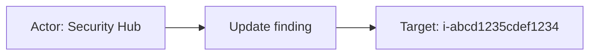

# aws_securityhub

## Product Domain

AWS Security Hub is a cloud security posture management (CSPM) and security findings aggregation service that provides a centralized view of security alerts and compliance status across an AWS organization. It collects, normalizes, and prioritizes findings from native AWS security services—Amazon GuardDuty (threat detection), Amazon Inspector (vulnerability assessment), Amazon Macie (sensitive data discovery), AWS Config (configuration compliance), AWS IAM Access Analyzer, and AWS Firewall Manager—as well as from third-party partner products integrated via the AWS Security Finding Format (ASFF) and the newer Open Cybersecurity Schema Framework (OCSF).

Security Hub evaluates AWS resources against security standards and best-practice controls, including the AWS Foundational Security Best Practices standard, CIS AWS Foundations Benchmark, PCI DSS, and NIST frameworks. Findings are scored by severity, workflow status, and compliance state, enabling security teams to triage posture misconfigurations, active threats, vulnerabilities, and data-exposure risks from a single console. Automated response actions, custom insights, and cross-account aggregation (via delegated administrator) support enterprise-scale cloud security operations.

From a SIEM perspective, Security Hub is the canonical aggregation point for AWS-native and partner security signals. Rather than integrating each AWS service separately, teams can ingest unified OCSF findings that retain source product context (GuardDuty, Inspector, Macie, Config rules, Security Hub controls) while sharing a common schema for severity, resource identity, remediation guidance, and compliance mapping.

The Elastic AWS Security Hub integration ingests findings via the Security Hub REST API (`GetFindingsV2`) and normalizes them to ECS-aligned fields for search, dashboards, cloud security workflows, and vulnerability management in Elastic Security. Elasticsearch latest transforms deduplicate findings and surface current vulnerability posture for CDR views.

## Data Collected (brief)

The integration collects one data stream via **CEL/AWS API** (`securityhub:GetFindings` on `/findingsv2`):

| Data stream | Description |
|---|---|
| **finding** (`aws_securityhub.finding`) | Security Hub findings in **OCSF format**—compliance/posture results (Security Hub controls, AWS Config rules), **vulnerability findings** (Amazon Inspector CVEs with CVSS, package, and remediation context), and threat/detection findings from GuardDuty and partner products. Includes severity, status, affected AWS resources, compliance standards/controls, remediation references, actor/evidence/malware/attack/OSINT objects where present, and vendor source metadata. |

Events are mapped to ECS fields (`cloud`, `resource`, `rule`, `vulnerability`, `threat`, `result`) with full OCSF detail under `aws_securityhub.finding.*`. **Latest transforms** maintain deduplicated finding state and a vulnerability-latest index for Elastic Security cloud CDR and vulnerability workflows.

## Expected Audit Log Entities

Single **`finding`** stream (`aws_securityhub.finding`) from Security Hub `GetFindingsV2` via CEL/API. Events are **OCSF security findings** (posture, vulnerability, and threat **state**), not platform audit logs such as CloudTrail API activity. Actor/target semantics still matter for CDR correlation and entity analytics. Fixtures cover **Compliance Finding** (`class_uid: 2003`) and **Vulnerability Finding** (`class_uid: 2002`) only; the pipeline also accepts **Detection Finding** (`2004`) and **Incident Finding** (`2006`) with `actor`/`device`/`malware`/`attacks` objects, but those classes are absent from package tests. No ECS `user.target.*`, `host.target.*`, `service.target.*`, or `entity.target.*` are populated; no `destination.user.*` / `destination.host.*` in pipelines (`destination_identity_hits.csv` has no aws_securityhub row). Target-fields audit classifies this package as **`none`** with no tier-A ECS target mappings (`dev/target-fields-audit/out/target_enhancement_packages.csv`).

**`event.action` is populated on the finding stream** — OCSF finding lifecycle verbs `Create` and `Update` from `aws_securityhub.finding.activity_name` (`default.yml` L1161–1165). These describe finding record create/update, not the underlying security operation (compliance check, CVE scan, threat detection). Elasticsearch transforms reference `activity_id: 3` (Close) for vulnerability deduplication but that value is absent from pipeline fixtures.

Evidence: `packages/aws_securityhub/data_stream/finding/sample_event.json`, `finding/_dev/test/pipeline/test-findings.log-expected.json`, `finding/elasticsearch/ingest_pipeline/default.yml`, `pipeline_object_actor.yml`, `pipeline_object_resources.yml`, `finding/fields/fields.yml`.

### Event action (semantic)

| Action (normalized label) | Classification | Confidence | Evidence | Per-stream notes |
| --- | --- | --- | --- | --- |
| `Create` | finding_lifecycle | high | `event.action: Create` with `activity_id: 1` in compliance and vulnerability fixtures (`test-findings.log-expected.json`, `sample_event.json`) | **`finding`** — new Security Hub finding record (first observation of control failure, new CVE, etc.) |
| `Update` | finding_lifecycle | high | `event.action: Update` with `activity_id: 2` on resynced Inspector CVEs and updated compliance findings | **`finding`** — finding metadata or status refreshed; not a distinct security operation replay |

Detection/incident classes (`2004`/`2006`) would use the same OCSF activity mapping when present; no fixtures today. **`activity_id: 3` (Close)** is referenced in `latest_cdr_vulnerabilities/transform.yml` for deduplication but not exercised in pipeline tests.

The mapped action is **finding lifecycle**, not evaluator behavior. Compliance evaluation (`AWS::Config::ConfigRule`), vulnerability scanning (`Inspector`), and threat detection (`GuardDuty`) are identified by `metadata.product.name`, `finding_info.analytic.*`, and `class_name` — not by `event.action`.

### Event action (ECS candidates)

| ECS / vendor field | Mapped to `event.action` today? | Mapping correct? | Recommended `event.action` value (from fixtures) | Enhancement candidate? | Evidence |
| --- | --- | --- | --- | --- | --- |
| `aws_securityhub.finding.activity_name` → `event.action` | yes | partial | `Create`, `Update` | no | `default.yml` L1161–1165 `copy_from`; vendor field removed L2016 unless `preserve_duplicate_custom_fields` tag (fixtures retain both) |
| `aws_securityhub.finding.activity_id` | no | n/a | `1` (Create), `2` (Update) | no | Numeric OCSF activity ID; paired with `activity_name` |
| `aws_securityhub.finding.type_name` | no | n/a | `Compliance Finding: Create`, `Vulnerability Finding: Update` | partial | Composite class + activity; vendor-only in fixtures |
| `aws_securityhub.finding.class_name` | no | n/a | `Compliance Finding`, `Vulnerability Finding` | partial | Finding class/type — not a verb; complements `event.action` |
| `aws_securityhub.finding.action` / `.action_id` | no | n/a | — (absent from fixtures) | partial | OCSF control/policy disposition action per `fields.yml`; distinct from finding `activity_*` |
| `finding_info.analytic.category` | no | n/a | `AWS::Config::ConfigRule` | partial | Evaluator type on compliance findings — describes who evaluated, not lifecycle verb |
| `compliance.control` / `rule.id` | no | n/a | `SQS.3`, `SSM.1` | partial | Security control evaluated — Layer 3 artifact, not `event.action` |
| `result.evaluation` | no | n/a | `passed`, `failed`, `unknown` | no | Control/check outcome; maps to `result.evaluation`, not action |
| `event.type` / `event.category` / `event.kind` | n/a (downstream) | yes | `info`; `vulnerability` (class 2002); `state` or `alert` (2004/2006) | no | Event taxonomy — do not substitute for `event.action` |

**Step 2b — per-stream check:**

| Stream | `event.action` in fixtures? | Pipeline maps to `event.action`? | Primary action candidate | Confidence | Evidence |
| --- | --- | --- | --- | --- | --- |
| `finding` | yes | yes | `aws_securityhub.finding.activity_name` → `event.action` | high | `default.yml` L1161–1165; all 10 events in `test-findings.log-expected.json` (`Create` × 5, `Update` × 5); `sample_event.json` |

### Actor (semantic)

| Entity | Classification | Entity type (if general) | Confidence | Evidence | Per-stream notes |
| --- | --- | --- | --- | --- | --- |
| Security Hub / AWS Config rule evaluator | service | — | high | `metadata.product.name: "Security Hub"`, `finding_info.analytic.category: "AWS::Config::ConfigRule"`, `event.kind: state` | **Compliance Finding** (`2003`) — automated posture check; no `actor` object in fixtures |
| Amazon Inspector vulnerability scanner | service | — | high | `metadata.product.name: "Inspector"`, `vulnerability.scanner.vendor: "Inspector"` | **Vulnerability Finding** (`2002`) — automated scan; no interactive principal |
| GuardDuty / partner threat actor (OCSF `actor`) | user | — | low | Pipeline invokes `pipeline_object_actor.yml` when `actor` present; appends `actor.user.*` / `actor.process.auid`/`euid` → `related.user` only — **not** observed in fixtures | **Detection / Incident Finding** (`2004`/`2006`) — inferred from schema; IAM user, assumed role, or process identity |
| Threat actor process / session host | host | — | low | `device.*` → `related.hosts` / `related.ip`; `pipeline_object_device.yml` when `device` present | Detection/incident only; absent from current fixtures |
| Finding assignee (workflow owner) | user | — | low | `assignee.*` appended to `related.user` (`default.yml`); vendor-only otherwise | Not the evaluator of the control/CVE — SOC workflow context |
| Resource / device owner | user | — | low | `resources[].owner.*`, `device.owner.*` → `related.user` | Owner of affected asset, not finding author |

**No actor in fixtures:** All 10 pipeline test events (compliance + vulnerability) omit `aws_securityhub.finding.actor` and `device`. Evaluation is implied by the source product (`Security Hub`, `Inspector`).

### Actor (ECS candidates)

| ECS / vendor field | Role | Mapped today? | Mapping correct? | Confidence | Evidence |
| --- | --- | --- | --- | --- | --- |
| `aws_securityhub.finding.metadata.product.name` | Source product performing evaluation | no (vendor-only) | n/a | high | `"Security Hub"` (controls), `"Inspector"` (CVEs) — canonical actor service identity |
| `aws_securityhub.finding.actor.user.*` | OCSF threat/principal identity | no (vendor-only) | n/a | low | Schema in `fields.yml`; pipeline normalizes types but never maps to `user.*` |
| `aws_securityhub.finding.actor.process.auid` / `.euid` | Process actor IDs | partial | partial | low | Appended to `related.user` only (`default.yml` append processors) |
| `related.user` (from `actor.*`, `assignee.*`, `device.owner.*`, `resources.owner.*`) | Actor + owner enrichment bag | yes | partial | medium | Mixes threat actors, assignees, and resource owners in one array — not structured actor fields |
| `user.*` | Security principal | no | n/a | high | No `user.id`/`user.name` from `actor` in pipeline; only `user.id` when resource type is `AWS::IAM::User` (target, not actor) |
| `observer.vendor` | Aggregation platform | yes | yes (context) | high | Static `"AWS Security Hub"` — collector/aggregator, not finding actor |
| `organization.name` | Vendor org | yes | yes (scope) | high | `metadata.product.vendor_name` → `"AWS"` — tenancy context, not actor |
| `cloud.account.id` | AWS account scope | yes | yes (scope) | high | `finding.cloud.account.uid` — evaluation scope, not actor |
| `event.provider` | Log/source product label | yes | yes (context) | medium | `metadata.log_provider` or `metadata.product.vendor_name` |
| `vulnerability.scanner.vendor` | Scanner product | yes | yes (context) | high | `"Inspector"` on vulnerability fixtures — reinforces service actor |

### Target (semantic)

| Layer | Description | Entity | Classification | Entity type (if general) | Confidence | Evidence | Per-stream notes |
| --- | --- | --- | --- | --- | --- | --- | --- |
| 1 — Platform / cloud service | Product that generated or evaluated the finding | AWS Security Hub; Amazon Inspector | service | — | high | `metadata.product.name`; `vulnerability.scanner.vendor` | Layer 1 is the **finding source**, not `cloud.service.name` (which holds CFN resource type — see Gaps) |
| 2 — Resource / object | AWS resource under evaluation or with the vulnerability | EC2 instance, SQS queue, Lambda function, AWS account | host / service / general | cloud_resource | high | `script_extract_fields_from_resource` promotes primary `resources[]` entry → `resource.*`, type-specific `host.*`/`user.id`/`group.id`/`orchestrator.*` | Type-dependent: EC2 → **host**; Lambda → **service**; SQS/account → **general** |
| 3 — Content / artifact | Control, CVE, or affected package on the asset | Security Hub control; CVE; OS/package | general | security_control, cve, software_package | high | `rule.id`/`rule.name` (compliance); `vulnerability.id`/`package.*` (Inspector) | CVE/package describe finding **content** on Layer 2 asset — not standalone audit targets |

### Target (ECS candidates)

| ECS / vendor field | Layer | Classification | Mapped today? | Mapping correct? | ECS target bucket | Enhancement candidate? | Evidence |
| --- | --- | --- | --- | --- | --- | --- | --- |
| `resource.id` / `resource.type` | 2 | general | yes | yes | `entity.target.id` / `.type` | yes | Primary resource from `resources[].uid`/`type` — SQS URL, instance id, Lambda name, account id |
| `host.id` / `host.name` / `host.ip` / `host.type` | 2 | host | yes (EC2 only) | yes | `host.target.*` | yes | `AWS::EC2::Instance` — e.g. SSM.1 `i-abcd1235cdef1234`, CVE fixtures with EC2 IPs |
| `cloud.service.name` | 2 | general | yes | partial | `entity.target.type` or `service.target.name` | yes | Set from `resources[].type` (CFN type e.g. `AWS::EC2::Instance`) — **not** the Layer 1 scanning product |
| `cloud.instance.id` / `cloud.machine.type` | 2 | host | yes (EC2) | yes | `host.target.*` (context) | yes | EC2 detail from `awsEc2InstanceDetails` |
| `orchestrator.cluster.name` / `.id` | 2 | general | yes | yes | context-only | no | EKS tag `aws:eks:cluster-name` or `AWS::EKS::Cluster` resource |
| `user.id` | 2 | user | partial | yes (when IAM User resource) | `user.target.id` | yes | Only when `resources[].type == AWS::IAM::User` — not in current fixtures |
| `group.id` | 2 | general | partial | yes (when IAM Group resource) | `entity.target.id` | yes | `AWS::IAM::Group` path in resource script — not in current fixtures |
| `rule.id` / `rule.name` / `rule.description` | 3 | general | yes | yes (control context) | context-only | no | Compliance controls `SQS.3`, `SSM.1`, `Redshift.3` — evaluated rule, distinct from resource |
| `result.evaluation` | 3 | general | yes | yes | context-only | no | `passed`/`failed`/`unknown` from `compliance.status_id` |
| `vulnerability.id` / `vulnerability.cve` | 3 | general | yes | yes (finding content) | context-only | no | CVE IDs on Inspector findings — artifact on asset, not entity target |
| `package.name` / `package.version` | 3 | general | yes | yes (finding content) | context-only | no | Affected packages on EC2/Lambda CVE fixtures |
| `aws_securityhub.finding.resources[]` | 2 | varies | partial | n/a | `entity.target.*` / `host.target.*` | yes | Full resource array with `data.awsEc2InstanceDetails`, `awsLambdaFunctionDetails`, tags, owner — only primary promoted to ECS |
| `aws_securityhub.finding.resources[].owner.*` | 2 | user | no | n/a | `user.target.*` | yes | Appended to `related.user` only; Lambda fixture owner account in vendor tree |
| `related.user` (resource/device owners) | 2 | user | partial | partial | `user.target.*` | yes | Owner UIDs/names in enrichment bag — de-facto target identity, not `user.target.*` |
| `related.ip` / `related.hosts` | 2 | host | partial | yes (enrichment) | context-only | no | EC2 IPs and hostnames from resources/device |

### Gaps and mapping notes

- **`event.action` maps finding lifecycle only** — `activity_name` (`Create`/`Update`) correctly reflects OCSF finding activity but not the security operation (compliance check, CVE scan, GuardDuty detection). For richer action semantics, consider a composite or alternate field such as `compliance.control`, `class_name`, or `finding_info.analytic.category` — none are copied to `event.action` today.
- **No ECS `*.target.*` today** — primary resource maps to `resource.*`/`host.*`/`user.id` but not official target fields. Target-fields audit: **`none`**, all enhancement flags false.
- **`cloud.service.name` conflates Layer 1 and Layer 2** — pipeline sets it from `resources[].type` (CFN type like `AWS::SQS::Queue`), while Layer 1 source product (`Inspector`, `Security Hub`) stays vendor-only under `metadata.product.name`. Enhancement: separate scanning product (`service.target.*`) from affected resource type.
- **Actor identity only in `related.user`** — `actor.user.*` never promotes to `user.*`; threat-actor semantics require parsing `related.user` or vendor `aws_securityhub.finding.actor.*`.
- **`user.id` from IAM User resource is a target, not actor** — resource script maps `AWS::IAM::User` → `user.id` for the evaluated object.
- **No `destination.user.*` / `destination.host.*`** — not used; resource/host targets are direct ECS fields or vendor `resources[]`.
- **Multi-resource findings** — only sole resource or `labels` containing `primary_resource` is promoted; additional resources remain vendor-only (`default.yml` comment).
- **`actor`/`device`/GuardDuty objects unverified** — pipelines exist for classes `2004`/`2006` but no fixture coverage; classifications above for detection/incident are schema-inferred.
- **Vendor `analysis_targets`** — `aws_securityhub.finding.anomaly_analyses.analysis_targets` in `fields.yml` flagged in `vendor_target_special_cases.csv`; not mapped to ECS and not in fixtures.
- **OCSF `action_id`/`action` unused** — separate from `activity_id`/`activity_name`; describes control disposition per `fields.yml` but absent from fixtures and not mapped to ECS.

### Per-stream notes

#### `finding` — Compliance Finding (`class_uid: 2003`)

Posture/state events (`event.kind: state`). **`event.action`**: `Create` (new control result) or `Update` (resynced evaluation). Actor is the automated Security Hub/Config evaluator (service). Targets: evaluated AWS resource (`AWS::SQS::Queue` for SQS.1/SQS.3, `AWS::EC2::Instance` for SSM.1, `AWS::::Account` for Redshift.3 empty evaluation) plus Layer 3 control (`rule.id`). Outcome in `result.evaluation`.

#### `finding` — Vulnerability Finding (`class_uid: 2002`)

Vulnerability/state events (`event.category: vulnerability`, `event.kind: state`). **`event.action`**: `Create` (first Inspector observation) or `Update` (CVE resync). Actor is Inspector scanner (service). Targets: affected asset — EC2 instances with `host.*` and EKS cluster tags, or Lambda functions (`AWS::Lambda::Function` with `awsLambdaFunctionDetails` vendor-only). Layer 3: CVE + affected `package.*`. `transform_unique_id` set for deduplication transforms (skipped when `activity_id: 3` Close).

## Example Event Graph

All examples come from the single **`finding`** stream (`aws_securityhub.finding`). These are OCSF security **findings** (posture and vulnerability state), not CloudTrail-style platform audit logs. `event.action` reflects finding record lifecycle (`Create`/`Update`), not the underlying Config evaluation or Inspector scan operation.

### Example 1: SQS queue passes public-access control

**Stream:** `aws_securityhub.finding` · **Fixture:** `packages/aws_securityhub/data_stream/finding/sample_event.json`

```
Security Hub (service) → Create finding → SQS queue (evaluated resource)
```

#### Actor

| Field | Value |
| --- | --- |
| id | `arn:aws:securityhub:us-east-2::productv2/aws/securityhub` |
| name | Security Hub |
| type | service |

**Field sources:**

- `id` ← `aws_securityhub.finding.metadata.product.uid`
- `name` ← `aws_securityhub.finding.metadata.product.name`

#### Event action

| Field | Value |
| --- | --- |
| action | Create |
| source_field | `event.action` |
| source_value | `Create` |

`Create` is the OCSF finding lifecycle verb (`activity_name`) — Security Hub records a new finding about the queue, not an SQS `CreateQueue` API call.

#### Target

| Field | Value |
| --- | --- |
| id | `https://sqs.us-east-2.amazonaws.com/123456789012/securityhubfinding` |
| type | general |
| sub_type | cloud_resource |

**Field sources:**

- `id` ← `resource.id` (from `aws_securityhub.finding.resources[].uid`)
- `type` / `sub_type` ← `resource.type` (`AWS::SQS::Queue`)

#### Mermaid


### Example 2: EC2 instance fails SSM management control

**Stream:** `aws_securityhub.finding` · **Fixture:** `packages/aws_securityhub/data_stream/finding/_dev/test/pipeline/test-findings.log-expected.json` (SSM.1 Update event)

```
Security Hub (service) → Update finding → EC2 instance i-abcd1235cdef1234 (evaluated resource)
```

#### Actor

| Field | Value |
| --- | --- |
| id | `arn:aws:securityhub:us-east-2::productv2/aws/securityhub` |
| name | Security Hub |
| type | service |

**Field sources:**

- `id` ← `aws_securityhub.finding.metadata.product.uid`
- `name` ← `aws_securityhub.finding.metadata.product.name`

#### Event action

| Field | Value |
| --- | --- |
| action | Update |
| source_field | `event.action` |
| source_value | `Update` |

`Update` is the OCSF finding lifecycle verb — Security Hub refreshes the compliance finding (`activity_id: 2`); `result.evaluation: failed` for control SSM.1. Not an EC2 configuration change.

#### Target

| Field | Value |
| --- | --- |
| id | `i-abcd1235cdef1234` |
| name | `i-abcd1235cdef1234` |
| type | host |
| sub_type | cloud_resource |

**Field sources:**

- `id` ← `host.id`, `resource.id` (from `aws_securityhub.finding.resources[].uid`)
- `name` ← `host.name`
- `type` ← `resource.type` (`AWS::EC2::Instance`)

#### Mermaid



### Example 3: Inspector resyncs CVE on EKS worker node

**Stream:** `aws_securityhub.finding` · **Fixture:** `packages/aws_securityhub/data_stream/finding/_dev/test/pipeline/test-findings.log-expected.json` (CVE-2023-44487 Update event)

```
Inspector (service) → Update finding → EC2 instance i-0abcdef012345678b (affected asset)
```

#### Actor

| Field | Value |
| --- | --- |
| id | `arn:aws:securityhub:us-east-2::productv2/aws/inspector` |
| name | Inspector |
| type | service |

**Field sources:**

- `id` ← `aws_securityhub.finding.metadata.product.uid`
- `name` ← `aws_securityhub.finding.metadata.product.name`, `vulnerability.scanner.vendor`

#### Event action

| Field | Value |
| --- | --- |
| action | Update |
| source_field | `event.action` |
| source_value | `Update` |

`Update` is the OCSF finding lifecycle verb — Inspector resyncs CVE finding `CVE-2023-44487`; not a new `RunInstances` or scan invocation against the host.

#### Target

| Field | Value |
| --- | --- |
| id | `i-0abcdef012345678b` |
| name | `i-0abcdef012345678b` |
| type | host |
| sub_type | cloud_resource |
| ip | `10.90.1.245` |

**Field sources:**

- `id` ← `host.id`, `resource.id`
- `name` ← `host.name`
- `type` ← `resource.type` (`AWS::EC2::Instance`); `host.type`: `t3.medium`
- `ip` ← `host.ip[0]` (fixture lists 19 private addresses)

#### Mermaid


## ES|QL Entity Extraction

**Package type: agent-backed** (CEL/API, `policy_templates` + `data_stream/finding`). Router: **`data_stream.dataset`** (`aws_securityhub.finding` only). Tier A evidence from `sample_event.json` and `test-findings.log-expected.json`. OCSF security **findings** (posture/vulnerability state), not CloudTrail audit. Pass 4 is **fill-gaps-only**: detection flags first; mapped columns use **column-level** `CASE(<col> IS NOT NULL, <col>, …)` — valid **3-arg**, **5-arg**, or **7-arg** forms only — not `CASE(actor_exists|target_exists, <col>, …)` and never **4-arg** `CASE(<col> IS NOT NULL, <col>, bare_field, null)` (bare field parses as a boolean condition). Actor fallback is the **evaluating source product** (`metadata.product.*`); target fallback promotes the **primary evaluated resource** from indexed `host.*` / `resource.*` into official `*.target.*` columns (ingest never sets `*.target.*` today). Extraction is **partial** — detection/incident classes (`2004`/`2006`) with OCSF `actor` are pipeline-supported but absent from fixtures. **Pass 4 (tautology cleanup):** no `CASE(col, col, …)` identity fallbacks; **`event.action` omitted from ES|QL** (ingest-only — `activity_name` → `event.action`, vendor field removed unless `preserve_duplicate_custom_fields`).

### Dataset inventory

| data_stream.dataset | Stream role | Actor classification(s) | Target classification(s) | Extraction |
| --- | --- | --- | --- | --- |
| `aws_securityhub.finding` | OCSF finding (compliance, vulnerability) | service | host, service, general | partial |

### Field mapping plan

#### Actor mappings

| Output column | Source field(s) | Condition (dataset + optional) | Confidence | Notes |
| --- | --- | --- | --- | --- |
| `service.id` | `aws_securityhub.finding.metadata.product.uid` | `data_stream.dataset == "aws_securityhub.finding"` | high | **vendor fallback** — product ARN; ingest does not set `service.id` today |
| `service.name` | `aws_securityhub.finding.metadata.product.name` | `data_stream.dataset == "aws_securityhub.finding"` | high | **vendor fallback** — `Security Hub`, `Inspector` |
| `service.type` | `"service"` | `data_stream.dataset == "aws_securityhub.finding"` | low | **semantic literal** — Pass 3 service actor; omit if literal unwanted |

#### Target mappings

| Output column | Source field(s) | Condition (dataset + optional) | Confidence | Notes |
| --- | --- | --- | --- | --- |
| `host.target.id` | `host.id` | `data_stream.dataset == "aws_securityhub.finding" AND resource.type == "AWS::EC2::Instance"` | high | **de-facto fallback** — promote evaluated EC2 instance |
| `host.target.name` | `host.name` | `data_stream.dataset == "aws_securityhub.finding" AND resource.type == "AWS::EC2::Instance"` | high | **de-facto fallback** |
| `host.target.ip` | `host.ip` | `data_stream.dataset == "aws_securityhub.finding" AND resource.type == "AWS::EC2::Instance"` | high | **de-facto fallback** — `host.ip` is genuinely multi-valued (19 IPs per instance in fixtures); use full multi-value field, not `MV_FIRST` — all IPs belong to the same target EC2 instance; `host.target.ip` is also an ECS `ip` array field |
| `service.target.id` | `resource.id` | `data_stream.dataset == "aws_securityhub.finding" AND resource.type == "AWS::Lambda::Function"` | high | **de-facto fallback** — Lambda function name (fixture) |
| `user.target.id` | `user.id` | `data_stream.dataset == "aws_securityhub.finding" AND resource.type == "AWS::IAM::User"` | medium | **de-facto fallback** — evaluated IAM user; **not in fixtures** |
| `entity.target.id` | `resource.id` | `data_stream.dataset == "aws_securityhub.finding" AND resource.type NOT IN ("AWS::EC2::Instance", "AWS::Lambda::Function", "AWS::IAM::User")` | high | **de-facto fallback** — SQS URL, account id, etc. |
| `entity.target.type` | `resource.type` | `data_stream.dataset == "aws_securityhub.finding"` | high | **de-facto fallback** — CFN resource type |
| `entity.target.sub_type` | `"cloud_resource"` | `data_stream.dataset == "aws_securityhub.finding"` | low | **semantic literal** — Pass 3 general target sub_type |

#### Event action mappings

| Output column | Source field(s) | Condition (dataset + optional) | Confidence | Notes |
| --- | --- | --- | --- | --- |
| `event.action` | — | — | high | **ingest-only — no ES\|QL** — `activity_name` → `event.action` (`default.yml` L1161–1165); vendor removed L2016 unless `preserve_duplicate_custom_fields` |

### Detection flags (mandatory)

`actor_exists` omits top-level `user.*` / `host.*` because ingest never promotes OCSF threat principals to ECS actor fields on fixture classes. `target_exists` checks official `*.target.*` only (ingest populates `host.*` / `resource.*`, not target namespace). **Actor/target `EVAL` blocks use column-level `IS NOT NULL` preserve** — not `CASE(actor_exists, service.id, …)` / `CASE(target_exists, host.target.id, …)` — so e.g. `entity.name` on a future detection row does not block `service.id` ← `metadata.product.uid` when `service.id` is empty (Pass 4 §10).

**ES|QL `CASE` arity:** Arguments are **(condition, value)** pairs; odd count → last arg is default. Use **5-arg** `CASE(service.id IS NOT NULL, service.id, data_stream.dataset == "…", aws_securityhub.finding.metadata.product.uid, null)` — not **3-arg** `CASE(actor_exists, service.id, aws_securityhub.finding.metadata.product.uid)` (`metadata.product.uid` is a **condition**, not a value) and not **4-arg** `CASE(actor_exists, service.id, aws_securityhub.finding.metadata.product.uid, null)`.

```esql
| EVAL
  actor_exists = service.id IS NOT NULL OR service.name IS NOT NULL
    OR entity.id IS NOT NULL OR entity.name IS NOT NULL,
  target_exists = user.target.id IS NOT NULL OR user.target.name IS NOT NULL OR user.target.email IS NOT NULL
    OR host.target.id IS NOT NULL OR host.target.ip IS NOT NULL OR host.target.name IS NOT NULL
    OR service.target.id IS NOT NULL OR service.target.name IS NOT NULL
    OR entity.target.id IS NOT NULL OR entity.target.name IS NOT NULL,
  action_exists = event.action IS NOT NULL
```

### Combined ES|QL — actor fields

```esql
| EVAL
  service.id = CASE(
    service.id IS NOT NULL, service.id,
    data_stream.dataset == "aws_securityhub.finding", aws_securityhub.finding.metadata.product.uid,
    null
  ),
  service.name = CASE(
    service.name IS NOT NULL, service.name,
    data_stream.dataset == "aws_securityhub.finding", aws_securityhub.finding.metadata.product.name,
    null
  ),
  service.type = CASE(
    service.type IS NOT NULL, service.type,
    data_stream.dataset == "aws_securityhub.finding", "service",
    null
  )
```

`event.action` is **not** listed — ingest-only on all fixture classes; `CASE(action_exists, event.action, activity_name)` would repeat the output column when populated or reference a vendor field removed at ingest.

### Combined ES|QL — target fields

`host.target.ip` uses `host.ip` directly (all values): fixtures show 19 IPs per EC2 instance from `awsEc2InstanceDetails.ipV4Addresses` — every IP belongs to the same target host, and `host.target.ip` is an ECS `ip` array. `MV_FIRST(host.ip)` would discard all but the first IP with no benefit. `host.ip[0]` array indexing is **invalid ES|QL syntax** and must not be used.

```esql
| EVAL
  host.target.id = CASE(
    host.target.id IS NOT NULL, host.target.id,
    data_stream.dataset == "aws_securityhub.finding" AND resource.type == "AWS::EC2::Instance", host.id,
    null
  ),
  host.target.name = CASE(
    host.target.name IS NOT NULL, host.target.name,
    data_stream.dataset == "aws_securityhub.finding" AND resource.type == "AWS::EC2::Instance", host.name,
    null
  ),
  host.target.ip = CASE(
    host.target.ip IS NOT NULL, host.target.ip,
    data_stream.dataset == "aws_securityhub.finding" AND resource.type == "AWS::EC2::Instance", host.ip,
    null
  ),
  service.target.id = CASE(
    service.target.id IS NOT NULL, service.target.id,
    data_stream.dataset == "aws_securityhub.finding" AND resource.type == "AWS::Lambda::Function", resource.id,
    null
  ),
  user.target.id = CASE(
    user.target.id IS NOT NULL, user.target.id,
    data_stream.dataset == "aws_securityhub.finding" AND resource.type == "AWS::IAM::User", user.id,
    null
  ),
  entity.target.id = CASE(
    entity.target.id IS NOT NULL, entity.target.id,
    data_stream.dataset == "aws_securityhub.finding"
      AND resource.type != "AWS::EC2::Instance"
      AND resource.type != "AWS::Lambda::Function"
      AND resource.type != "AWS::IAM::User", resource.id,
    null
  ),
  entity.target.type = CASE(
    entity.target.type IS NOT NULL, entity.target.type,
    data_stream.dataset == "aws_securityhub.finding", resource.type,
    null
  ),
  entity.target.sub_type = CASE(
    entity.target.sub_type IS NOT NULL, entity.target.sub_type,
    data_stream.dataset == "aws_securityhub.finding", "cloud_resource",
    null
  )
```

### Full pipeline fragment (optional)

```esql
FROM logs-*
| EVAL
  actor_exists = service.id IS NOT NULL OR service.name IS NOT NULL
    OR entity.id IS NOT NULL OR entity.name IS NOT NULL,
  target_exists = user.target.id IS NOT NULL OR user.target.name IS NOT NULL OR user.target.email IS NOT NULL
    OR host.target.id IS NOT NULL OR host.target.ip IS NOT NULL OR host.target.name IS NOT NULL
    OR service.target.id IS NOT NULL OR service.target.name IS NOT NULL
    OR entity.target.id IS NOT NULL OR entity.target.name IS NOT NULL,
  action_exists = event.action IS NOT NULL
| EVAL
  service.id = CASE(
    service.id IS NOT NULL, service.id,
    data_stream.dataset == "aws_securityhub.finding", aws_securityhub.finding.metadata.product.uid,
    null
  ),
  service.name = CASE(
    service.name IS NOT NULL, service.name,
    data_stream.dataset == "aws_securityhub.finding", aws_securityhub.finding.metadata.product.name,
    null
  ),
  service.type = CASE(
    service.type IS NOT NULL, service.type,
    data_stream.dataset == "aws_securityhub.finding", "service",
    null
  ),
  host.target.id = CASE(
    host.target.id IS NOT NULL, host.target.id,
    data_stream.dataset == "aws_securityhub.finding" AND resource.type == "AWS::EC2::Instance", host.id,
    null
  ),
  host.target.name = CASE(
    host.target.name IS NOT NULL, host.target.name,
    data_stream.dataset == "aws_securityhub.finding" AND resource.type == "AWS::EC2::Instance", host.name,
    null
  ),
  host.target.ip = CASE(
    host.target.ip IS NOT NULL, host.target.ip,
    data_stream.dataset == "aws_securityhub.finding" AND resource.type == "AWS::EC2::Instance", host.ip,
    null
  ),
  service.target.id = CASE(
    service.target.id IS NOT NULL, service.target.id,
    data_stream.dataset == "aws_securityhub.finding" AND resource.type == "AWS::Lambda::Function", resource.id,
    null
  ),
  user.target.id = CASE(
    user.target.id IS NOT NULL, user.target.id,
    data_stream.dataset == "aws_securityhub.finding" AND resource.type == "AWS::IAM::User", user.id,
    null
  ),
  entity.target.id = CASE(
    entity.target.id IS NOT NULL, entity.target.id,
    data_stream.dataset == "aws_securityhub.finding"
      AND resource.type != "AWS::EC2::Instance"
      AND resource.type != "AWS::Lambda::Function"
      AND resource.type != "AWS::IAM::User", resource.id,
    null
  ),
  entity.target.type = CASE(
    entity.target.type IS NOT NULL, entity.target.type,
    data_stream.dataset == "aws_securityhub.finding", resource.type,
    null
  ),
  entity.target.sub_type = CASE(
    entity.target.sub_type IS NOT NULL, entity.target.sub_type,
    data_stream.dataset == "aws_securityhub.finding", "cloud_resource",
    null
  )
| KEEP @timestamp, data_stream.dataset, event.action, service.name, host.target.id, host.target.name, host.target.ip, service.target.id, entity.target.id, resource.type
```

### Streams excluded

- None — single `finding` stream only; no metrics or inventory streams in this package.

### Gaps and limitations

- **`host.target.ip` multi-value reasoning** — `host.ip` is populated from `awsEc2InstanceDetails.ipV4Addresses` (19 IPs per instance in both EC2 fixtures). All IPs belong to the single target EC2 instance; dropping all but `MV_FIRST` would lose useful IP data. `host.ip` is assigned directly so all IPs are preserved in `host.target.ip`. `host.ip[0]` array indexing is **invalid ES|QL** and must not appear anywhere in the query.
- **OCSF threat `actor.user.*`** — pipeline appends to `related.user` only; no fixture-backed `user.id` actor — omit `user.*` actor columns until detection/incident fixtures exist.
- **`cloud.service.name`** — CFN resource type from `resources[].type`; do not use as `service.target.name` (Layer 1 product stays `metadata.product.name`).
- **`event.action`** — finding lifecycle (`Create`/`Update`) only; not Config evaluation or Inspector scan invocation; **ingest-only — no ES|QL** (`activity_name` copied then removed L2016).
- **Pass 4 tautology / CASE syntax (§10)** — `event.action` `EVAL` omitted; actor/target columns use column-level `CASE(<col> IS NOT NULL, <col>, …)` (5+ args with dataset/`resource.type` guards); never 3-arg `CASE(actor_exists, service.id, vendor_field)` or 4-arg with a bare vendor field as the 3rd argument.
- **Multi-resource findings** — only primary resource promoted to ECS; additional `resources[]` remain vendor-only.
- **`entity.target.sub_type`** — semantic literal; omit column from production queries if literals are undesirable.
- **Detection/incident (`2004`/`2006`)** — `actor`/`device` pipelines unverified; do not guess `user.*` actor from `related.user`.
