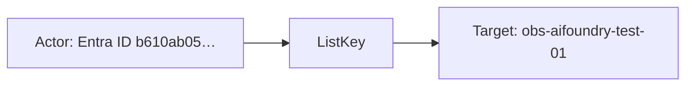
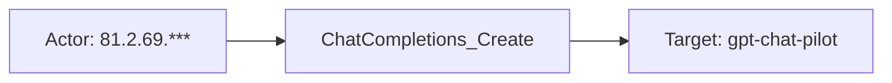
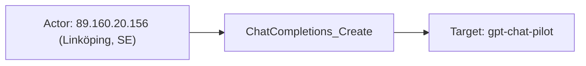

# azure_ai_foundry

## Product Domain (Azure AI Foundry)

Microsoft Azure AI Foundry (also branded Microsoft Foundry) is a unified Azure platform for building, deploying, and managing generative AI applications and model endpoints. Organizations use it to host foundation models (OpenAI and third-party), run chat and completion APIs, manage model deployments, and apply Azure-native guardrails such as content filtering, custom blocklists, jailbreak detection, and protected-material checks. Foundry resources are provisioned as Azure Cognitive Services accounts and can be exposed directly or fronted by Azure API Management (APIM) for policy enforcement, throttling, and advanced gateway logging.

The platform generates operational telemetry at two levels. Native diagnostic logging covers audit activity (administrative and key-management operations) and request/response metadata for model API calls—operation name, duration, model deployment, caller IP, and outcome—without full prompt and completion bodies by default. When APIM sits in front of Foundry deployments, gateway logs add richer HTTP-level detail, including backend request and response payloads, token usage, cache behavior, TLS metadata, and content-filter results across safety categories (hate, violence, sexual, self-harm, profanity, jailbreak, ungrounded material, and protected material).

From a security and observability perspective, Foundry is a critical control point for AI workload governance. Security and platform teams monitor who invokes models, which deployments are used, whether requests succeed or fail, how content filters act on prompts and completions, and how provisioned capacity is consumed. The Elastic integration ingests Foundry logs via Azure Event Hub and cognitive-service metrics via Azure Monitor, normalizing events into ECS-aligned fields for SIEM correlation, AI usage analytics, latency and availability alerting, and audit review.

## Data Collected (brief)

- **Logs** (`azure.ai_foundry`): Streamed from Azure Event Hub via the `azure-eventhub` input; supports agent-based deployment only.
- **Audit** (`category: Audit`): Administrative and resource operations (e.g., key listing), including asset identity, object ID, operation name, tenant/region, and Azure resource ID.
- **RequestResponse** (`category: RequestResponse`): Native model API call telemetry—operation (e.g., chat completions), duration, caller IP, correlation ID, model name/version/deployment, stream type, request/response sizes, and HTTP result signature.
- **ApiManagementGatewayLogs** (`category: GatewayLogs`): APIM gateway events with full HTTP context—client and backend URLs/methods, request/response bodies (prompts and completions), token counts, latency, cache status, TLS details, and content-filter outcomes (severity, filtered/detected flags, custom blocklists, jailbreak, profanity, protected material).
- **Metrics** (`azure.ai_foundry`): Collected from Azure Monitor (`Microsoft.CognitiveServices/accounts`) on a 5-minute period; supports agent-based and agentless deployment.
- **Usage and performance**: Model request counts; input, output, and total token totals; latency (time to first byte, time to last byte, time to response, tokens per second); model availability rate; provisioned utilization percentage.
- **Dimensions and resource context**: Model name, version, deployment name, API name, region; Azure subscription, resource group, resource ID, and namespace.

## Expected Audit Log Entities

Foundry telemetry spans one **logs** data stream (`azure.ai_foundry`, three Azure diagnostic categories) and one **metrics** data stream (`azure.ai_foundry`, Azure Monitor aggregates). **`Audit`** is true administrative audit (key management, resource operations). **`RequestResponse`** and **`GatewayLogs`** are audit-adjacent API telemetry — native Foundry call metadata and APIM gateway HTTP logs with full request/response bodies. **`Metrics`** are time-bucketed usage and performance gauges with no per-request principal. The logs pipeline maps GatewayLogs `caller_ip_address` → `source.ip` (with geo/ASN) and subscription → `cloud.account.id`, but does not populate ECS `user.*`, `*.target.*`, `related.*`, `destination.*`, or `gen_ai.*`. No ECS `*.target.*` fields are mapped today (`target_fields_audit.csv` has no `azure_ai_foundry` row; `target_enhancement_packages.csv` classifies actor/target enhancement as **`none`**). No `destination.user.*` / `destination.host.*` usage (`destination_identity_hits.csv` has no `azure_ai_foundry` row). **`event.action` is absent** in all log and metrics fixtures and no ingest pipeline maps to it (grep across `packages/azure_ai_foundry` returns no `event.action` references). Vendor operation fields (`azure.ai_foundry.operation_name`, `properties.operation_id`) hold the action verb but remain vendor-only. Evidence is from `data_stream/logs/_dev/test/pipeline/*-expected.json`, `data_stream/logs/sample_event.json`, `data_stream/logs/fields/fields.yml`, `data_stream/logs/elasticsearch/ingest_pipeline/default.yml`, `data_stream/logs/elasticsearch/ingest_pipeline/azure-shared-pipeline.yml`, `data_stream/metrics/_dev/test/pipeline/test-aifoundry.json-expected.json`, `data_stream/metrics/sample_event.json`, and `data_stream/metrics/fields/fields.yml`.

### Event action (semantic)

Each log category records a distinct operation or activity. **`Audit`** and **`RequestResponse`** expose the action at top-level `azure.ai_foundry.operation_name`. **`GatewayLogs`** use `properties.operation_id` for the Foundry/APIM API method (e.g. `ChatCompletions_Create`); the top-level `operation_name` (`Microsoft.ApiManagement/GatewayLogs`) is the Azure diagnostic envelope, not the API verb. **`Metrics`** are pre-aggregated Azure Monitor gauges with **no meaningful per-event action** (classification rule 10).

| Action (normalized label) | Classification | Confidence | Evidence | Per-stream notes |
| --- | --- | --- | --- | --- |
| `ListKey` | administration | high | `test-ai-foundry-audit.log-expected.json`: `operation_name: ListKey` | **`Audit`** — key-management admin operation against the cognitive account |
| `Create_Thread` | api_call | high | `test-ai-foundry-request-response.log-expected.json`: `operation_name: Create_Thread` | **`RequestResponse`** — Assistants thread creation |
| `ChatCompletions_Create` | api_call | high | RequestResponse fixture (`operation_name: ChatCompletions_Create`); GatewayLogs fixture (`properties.operation_id: ChatCompletions_Create`) | **`RequestResponse`**, **`GatewayLogs`** — chat completion API invocation |
| `getChatCompletions` | api_call | high | `test-ai-foundry-gateway.log-expected.json`: `properties.operation_id: getChatCompletions` | **`GatewayLogs`** — alternate APIM operation naming for chat completions |
| `Microsoft.ApiManagement/GatewayLogs` | api_call | partial | GatewayLogs top-level `operation_name` in all gateway fixtures and `sample_event.json` | **`GatewayLogs`** — Azure diagnostic category name, not the invoked Foundry API method; use `properties.operation_id` instead for `event.action` |
| `ShoeboxCallResult` | api_call | partial | RequestResponse: `azure.ai_foundry.event: ShoeboxCallResult` in fixtures | **`RequestResponse`** — Azure internal event type for native call telemetry; less specific than `operation_name` |
| (none — metric aggregates) | — | high | `metrics/sample_event.json`, `test-aifoundry.json-expected.json` — token/latency counters only | **`Metrics`** — no per-request verb; dimensions describe aggregation slice |

### Event action (ECS candidates)

| ECS / vendor field | Mapped to `event.action` today? | Mapping correct? | Recommended `event.action` value (from fixtures) | Enhancement candidate? | Evidence |
| --- | --- | --- | --- | --- | --- |
| `azure.ai_foundry.operation_name` | no | n/a | `ListKey`, `Create_Thread`, `ChatCompletions_Create` | yes | Audit and RequestResponse fixtures; `fields.yml` L16–18 ("The log action performed"); pipeline retains vendor-only after snake_case script — no rename to `event.action` |
| `azure.ai_foundry.properties.operation_id` | no | n/a | `ChatCompletions_Create`, `getChatCompletions` | yes | GatewayLogs fixtures (`test-ai-foundry-gateway.log-expected.json`); primary API action on APIM-fronted calls |
| `http.request.method` + `url.path` | no | partial | `POST` + `/deployments/gpt-chat-pilot/chat/completions` | partial | GatewayLogs: `properties.method` → `http.request.method` (`default.yml` L268–271); `uri_parts` on `properties.url` (`default.yml` L276–289); alternate when `operation_id` absent |
| `azure.ai_foundry.event` | no | n/a | `ShoeboxCallResult` | partial | RequestResponse fixtures only; Azure envelope type, not the API method |
| `event.action` | no | n/a | — | yes | Not set in any pipeline or fixture |
| `event.outcome` | yes | yes | `success`, `failure` | no | `result_type` → `event.outcome` on GatewayLogs (`default.yml` L165–172); records outcome, not action |
| `event.type` / `event.category` | no | n/a | — | no | Not set; would not substitute for `event.action` without a vendor action source |

**Step 2b — per-stream check:**

| Stream | `event.action` in fixtures? | Pipeline maps to `event.action`? | Primary action candidate | Confidence | Evidence |
| --- | --- | --- | --- | --- | --- |
| Logs — Audit | no | no | `azure.ai_foundry.operation_name` → `ListKey` | high | `test-ai-foundry-audit.log-expected.json`; no `event.action` in `event` block |
| Logs — RequestResponse | no | no | `azure.ai_foundry.operation_name` → `Create_Thread`, `ChatCompletions_Create` | high | `test-ai-foundry-request-response.log-expected.json`; alternate `azure.ai_foundry.event: ShoeboxCallResult` |
| Logs — GatewayLogs | no | no | `azure.ai_foundry.properties.operation_id` → `ChatCompletions_Create`, `getChatCompletions` | high | `test-ai-foundry-gateway.log-expected.json`, `sample_event.json`; do **not** use top-level `operation_name: Microsoft.ApiManagement/GatewayLogs` |
| Metrics | no | no | — (no per-event action) | high | `test-aifoundry.json-expected.json`; `event` block has `dataset`/`module` only; 5-minute Azure Monitor aggregates |

### Actor (semantic)

| Entity | Classification | Entity type (if general) | Confidence | Evidence | Per-stream notes |
| --- | --- | --- | --- | --- | --- |
| Entra ID principal (object ID) | user | — | high | `azure.ai_foundry.properties.object_id` on Audit `ListKey` (`test-ai-foundry-audit.log-expected.json`); field defined in `fields.yml` | **`Audit`** — administrative actor for key-management and resource operations; not mapped to ECS `user.id` |
| Asset identity | general | identity | moderate | `azure.ai_foundry.asset_identity` on Audit sample (`07628fea-67bb-424d-b160-fdc46c82d0b4`); `fields.yml` | **`Audit`** — Azure asset identity key; supplementary to object ID |
| API client (IP address) | host | — | high | GatewayLogs: `caller_ip_address` → `source.ip` with `source.geo` / `source.as` (`default.yml` L121–164; `test-ai-foundry-gateway.log-expected.json`, `sample_event.json`) | **`GatewayLogs`** — full client IP; best actor signal for model API calls |
| API client (masked IP) | host | — | moderate | RequestResponse: `azure.ai_foundry.caller_ip_address` (last octet masked, e.g. `81.2.69.***`); pipeline intentionally does **not** copy to `source.ip` (`default.yml` L120–121 comment) | **`RequestResponse`** — caller network context only; no geo enrichment |
| Client TLS context | general | tls_client | moderate | `azure.ai_foundry.properties.client_tls_version`, `client_tls_cipher_suite`, `client_protocol` (`fields.yml`; gateway fixtures) | **`GatewayLogs`** — transport fingerprint for the calling client; not a distinct ECS entity |
| Integration collector | service | — | low | Elastic Agent Event Hub consumer / Metricbeat Azure Monitor poller; credentials in stream config, not indexed | Implicit; not represented on events |

**No actor identity in samples:** **`RequestResponse`** — `properties.object_id` is empty in fixtures; no user name, API key ID, or Entra UPN. **`Metrics`** — time-bucketed resource metrics only; no caller or user dimensions. **`GatewayLogs`** `backend_request_body.messages[].role: user` is chat turn role, not a security principal.

### Actor (ECS candidates)

| ECS / vendor field | Role | Mapped today? | Mapping correct? | Confidence | Evidence |
| --- | --- | --- | --- | --- | --- |
| `azure.ai_foundry.properties.object_id` | Entra ID administrative principal | no | n/a | high | Audit `ListKey` fixture (`b610ab05-ce06-4cc1-a6dd-174b9f80468a`); `fields.yml`; pipeline retains vendor-only — no rename to `user.id` |
| `azure.ai_foundry.asset_identity` | Azure asset identity key | no | n/a | moderate | Audit fixture; supplementary actor context alongside object ID |
| `source.ip` | API client IP (GatewayLogs) | yes | yes | high | `caller_ip_address` → `source.ip` when `category == 'GatewayLogs'` (`default.yml` L121–127); geo/ASN enrichment L144–164; fixture `89.160.20.156` |
| `source.geo.*` / `source.as.*` | Client network enrichment | yes | yes | high | GeoIP/ASN processors on `source.ip` (`default.yml` L144–164); populated in gateway fixtures |
| `azure.ai_foundry.caller_ip_address` | Masked client IP (RequestResponse) | no | n/a | moderate | RequestResponse fixtures (`81.2.69.***`); intentionally not promoted to `source.ip` per pipeline comment |
| `azure.ai_foundry.properties.client_tls_version` / `.client_tls_cipher_suite` / `.client_protocol` | Client transport fingerprint | no | n/a | moderate | GatewayLogs `fields.yml` and fixtures; vendor-only |
| `user.id` / `user.*` | Actor identity | no | n/a | — | Not set in any pipeline or fixture despite Audit `object_id` availability |
| `client.user.*` | Caller principal | no | n/a | — | Not used |
| `related.user` | Actor cross-reference | no | n/a | — | Not used |
| `destination.user.*` / `destination.host.*` | De-facto target identity | no | n/a | — | Not used (`destination_identity_hits.csv` has no `azure_ai_foundry` row) |

### Target (semantic)

| Layer | Description | Entity | Classification | Entity type (if general) | Confidence | Evidence | Per-stream notes |
| --- | --- | --- | --- | --- | --- | --- | --- |
| 1 — Platform / cloud service | Azure AI Foundry / Cognitive Services platform | Microsoft Cognitive Services (Foundry) | service | — | high | `azure.resource.provider: microsoft.cognitiveservices/accounts`; `properties.api_name` (e.g. `Azure AI FOUNDRY API version 2024-02-15-preview`); no `cloud.service.name` set | **`Audit`**, **`RequestResponse`** — invoked Foundry platform on the cognitive account |
| 1 — Platform / cloud service | APIM gateway fronting Foundry | Azure API Management | service | — | high | GatewayLogs `azure.resource.id` → `microsoft.apimanagement/service/...`; `operation_name: Microsoft.ApiManagement/GatewayLogs` | **`GatewayLogs`** — distinct gateway service resource from the cognitive account |
| 2 — Resource / object | Cognitive Services (Foundry) account | Foundry account resource | service | — | high | `azure.resource.id/name/group/provider`, `cloud.account.id` ← subscription (`azure-shared-pipeline.yml` grok L10–23); Audit and RequestResponse fixtures | **`Audit`**, **`RequestResponse`**, **`Metrics`** — managed account acted upon or monitored |
| 2 — Resource / object | Model deployment endpoint | Named model deployment | service | — | high | `properties.model_deployment_name`, `model_name`, `model_version`; gateway `backend_url` path `/deployments/{name}/...`; `backend_request_body.model` (e.g. `gpt-chat-pilot`, `gpt-35-turbo`) | **`RequestResponse`**, **`GatewayLogs`**, **`Metrics`** (dimension) — consumed deployment |
| 2 — Resource / object | APIM API definition | Gateway-routed API surface | general | api | high | `properties.api_id`, `api_revision` (e.g. `azure-ai-foundry-apim-api`); client `url.*` from `uri_parts` on gateway URL (`default.yml` L276–289) | **`GatewayLogs`** — APIM API revision invoked by the client |
| 2 — Resource / object | Foundry API operation | API/admin action name | general | api_method | high | `azure.ai_foundry.operation_name` / `properties.operation_id` (e.g. `ChatCompletions_Create`, `Create_Thread`, `ListKey`) | All log categories — names the operation, not a host |
| 2 — Resource / object | Model deployment (metric dimension) | Aggregated deployment slice | service | — | high | `azure.dimensions.model_deployment_name`, `model_name`, `model_version`, `api_name`, `region` (`metrics/sample_event.json`, `metrics/fields/fields.yml`) | **`Metrics`** — aggregation dimension for token/latency counters; not per-request target |
| 3 — Content / artifact | Chat completion instance | Per-response completion ID | general | ai_completion | moderate | `properties.backend_response_body.id` (e.g. `chatcmpl-9gRL14hGa8nQstOJKvLjh7EyulsnT`); `operation_name: Create_Thread` on RequestResponse | **`GatewayLogs`**, **`RequestResponse`** — auditable per-call identifier when present |
| 3 — Content / artifact | Prompt and completion content | Request/response bodies | general | ai_content | high | `properties.backend_request_body.messages[].content`, `backend_response_body.choices[].message.content`; token counts under `backend_response_body.usage.*` | **`GatewayLogs`** — full prompt/completion text retained vendor-side; not ECS-mapped |
| 3 — Content / artifact | Content-filter / blocklist outcome | Safety policy evaluation | general | policy | moderate | `backend_response_body.choices.content_filter_results.*`, `prompt_filter_results.*`, `error.innererror.content_filter_result.*` (`fields.yml`; gateway fixtures) | **`GatewayLogs`** — policy outcomes on prompt/response content |
| 3 — Content / artifact | Time-bucket usage aggregate | Metric period counters | general | usage_bucket | high | `@timestamp`, `azure.timegrain`, `azure.ai_foundry.*.total` / `*.avg` (tokens, requests, latency, utilization) | **`Metrics`** — pre-aggregated over configurable period; not per-request audit targets |

**No meaningful audit target in metrics:** Individual prompts, completions, users, or API keys — metrics expose counts and latency percentiles only, not content or principal IDs. Per classification rule 10, model-deployment dimensions on metrics are **aggregation targets**, not per-request audit targets.

### Target (ECS candidates)

| ECS / vendor field | Layer | Classification | Mapped today? | Mapping correct? | ECS target bucket | Enhancement candidate? | Evidence |
| --- | --- | --- | --- | --- | --- | --- | --- |
| `azure.resource.id` / `.name` / `.group` / `.provider` | 2 | service | yes | yes | `cloud.resource.id` / context-only | partial | `resourceId` rename (`default.yml` L18–20); grok in `azure-shared-pipeline.yml` L10–19; cognitive account or APIM service depending on category |
| `cloud.account.id` | — | — | yes | yes | context-only | no | `azure.subscription_id` → `cloud.account.id` (`azure-shared-pipeline.yml` L21–23); Audit and RequestResponse fixtures |
| `cloud.provider` | — | — | yes | yes | context-only | no | Static `azure` (`azure-shared-pipeline.yml` L4–6) |
| `cloud.service.name` | 1 | service | no | n/a | `service.target.name` | yes | Not set; static `azure_ai_foundry` or `Microsoft.CognitiveServices` would identify invoked platform |
| `azure.ai_foundry.properties.model_deployment_name` | 2 | service | no | n/a | `gen_ai.request.model.name` / `service.target.entity.id` | yes | RequestResponse and GatewayLogs fixtures (`gpt-chat-pilot`); `fields.yml`; canonical deployment target |
| `azure.ai_foundry.properties.model_name` / `.model_version` | 2 | service | no | n/a | `gen_ai.request.model.id` / `.version` | yes | RequestResponse fixture (`gpt-35-turbo`, `0301`); gateway `backend_response_body.model` |
| `azure.ai_foundry.properties.backend_url` | 2 | service | no | n/a | `url.full` / context-only | partial | GatewayLogs fixture — backend Foundry deployment URL; identifies target endpoint, not mapped to ECS |
| `azure.ai_foundry.properties.api_id` / `.api_revision` | 2 | general (api) | no | n/a | `service.target.entity.id` | yes | GatewayLogs fixtures (`azure-ai-foundry-apim-api`, revision `1`) |
| `azure.ai_foundry.operation_name` / `.properties.operation_id` | 2 | general (api_method) | no | n/a | `event.action` | yes | All categories (e.g. `ChatCompletions_Create`, `ListKey`); not promoted to `event.action` |
| `url.domain` / `url.path` / `url.original` | 2 | general (api) | yes | yes | context-only | no | `uri_parts` on gateway client URL (`default.yml` L276–289); APIM client-facing endpoint |
| `azure.ai_foundry.properties.backend_response_body.id` | 3 | general (ai_completion) | no | n/a | `gen_ai.response.id` | yes | Gateway fixture `chatcmpl-9gRL14hGa8nQstOJKvLjh7EyulsnT` |
| `azure.ai_foundry.properties.backend_request_body.messages[].content` | 3 | general (ai_content) | no | n/a | `gen_ai.prompt` | yes | Gateway fixtures; prompt text retained vendor-side |
| `azure.ai_foundry.properties.backend_response_body.choices[].message.content` | 3 | general (ai_content) | no | n/a | `gen_ai.completion` | yes | Gateway fixtures; completion text retained vendor-side |
| `azure.ai_foundry.properties.backend_response_body.usage.*` | 3 | general (usage_bucket) | no | n/a | `gen_ai.usage.*` | yes | Token counters in gateway fixtures; pipeline renames `prompt_tokens`/`completion_tokens` → `input_tokens`/`output_tokens` (`default.yml` L187–194) but stays vendor-namespaced |
| `azure.dimensions.model_deployment_name` / `.model_name` / `.model_version` | 2 | service | no | n/a | context-only | no | Metrics sample; aggregation dimension, not per-request entity |
| `azure.ai_foundry.*.total` / `*.avg` (metrics) | 3 | general (usage_bucket) | no | n/a | context-only | no | Token, latency, availability, utilization counters in `metrics/sample_event.json` |
| `user.target.*` / `host.target.*` / `service.target.*` / `entity.target.*` | — | — | no | n/a | — | no | Not populated (`target_enhancement_packages.csv`: all `has_*_target` false) |
| `destination.user.*` / `destination.host.*` | — | — | no | n/a | — | no | Not used |
| `gen_ai.*` | 2–3 | service / general | no | n/a | `gen_ai.*` | yes | No Gen AI ECS fields set despite rich model, prompt, completion, and token data in GatewayLogs |

### Gaps and mapping notes

- **`event.action` not mapped:** `azure.ai_foundry.operation_name` (`ListKey`, `Create_Thread`, `ChatCompletions_Create`) and GatewayLogs `properties.operation_id` (`ChatCompletions_Create`, `getChatCompletions`) are the strongest action candidates but remain vendor-only. Recommended: copy category-appropriate field to `event.action` per stream (Audit/RequestResponse → `operation_name`; GatewayLogs → `properties.operation_id`).
- **GatewayLogs envelope vs API verb:** Top-level `operation_name: Microsoft.ApiManagement/GatewayLogs` is the Azure diagnostic category, not the Foundry API method — do not use it as `event.action`.
- **Audit actor not promoted:** `azure.ai_foundry.properties.object_id` holds the Entra principal on **`Audit`** events (e.g. `ListKey`) but is never copied to `user.id` or `related.user`. Best vendor source of truth for administrative actor identity.
- **RequestResponse actor gap:** `properties.object_id` is empty in fixtures; only masked `caller_ip_address` remains (vendor-only, not `source.ip`). No API key ID, UPN, or service principal in schema or samples.
- **GatewayLogs actor is network-only:** `source.ip` mapping is correct for client IP (`default.yml` L121–127) but there is no Entra or API-key caller identity even when APIM may have it upstream.
- **Zero Gen AI ECS promotion:** GatewayLogs retain full prompts, completions, model IDs, token usage, and completion IDs under `azure.ai_foundry.properties.backend_*_body.*` but nothing maps to `gen_ai.prompt`, `gen_ai.completion`, `gen_ai.request.model.id`, or `gen_ai.usage.*`.
- **Layer 1 platform gap:** `cloud.provider: azure` is set but `cloud.service.name` is absent. A static set (e.g. `azure_ai_foundry`) would identify the invoked SaaS platform per cloud/SaaS addendum.
- **No de-facto `destination.*` targets:** Unlike email/auth integrations, no pipeline maps acted-upon entities to `destination.user.*` or `destination.host.*`.
- **No official ECS target fields:** Aligns with target-fields audit classification **`none`** — no `user.target.*`, `host.target.*`, or `service.target.*` today. Model deployment name, APIM API ID, and completion ID are the strongest enhancement candidates for `service.target.entity.id` / `gen_ai.*`.
- **Chat role homonym:** `backend_request_body.messages[].role: user` is LLM message turn role, not the security principal who invoked the API.
- **Metrics are aggregation-only:** Model deployment dimensions on metrics describe time-bucket slices, not individual API invocations or content artifacts; no per-event action applies.

### Per-stream notes

#### Logs — Audit (`category: Audit`)

True administrative audit. **Action:** `ListKey` at `azure.ai_foundry.operation_name` — not mapped to `event.action`. Actor is the Entra **object ID** performing operations against the **Cognitive Services account** resource. `asset_identity` and `tenant`/`location` provide supplementary Azure context. No ECS user promotion.

#### Logs — RequestResponse (`category: RequestResponse`)

Native Foundry API telemetry without full bodies. **Action:** `Create_Thread`, `ChatCompletions_Create` at `azure.ai_foundry.operation_name` — not mapped to `event.action`. Actor is best interpreted as **host** (masked `caller_ip_address`, vendor-only). Target is the **model deployment** and **API operation** on the cognitive account. `correlation_id`, `duration_ms`, and `result_signature` support session correlation, not entity identity.

#### Logs — GatewayLogs (`category: GatewayLogs`)

APIM-fronted calls with full HTTP context. **Action:** `ChatCompletions_Create` or `getChatCompletions` at `properties.operation_id` — not mapped to `event.action`; top-level `operation_name: Microsoft.ApiManagement/GatewayLogs` is the diagnostic envelope only. Actor is **host** at `source.ip` (geo/ASN enriched). Targets span Layer 1 **APIM gateway**, Layer 2 **APIM API** and **backend Foundry deployment** (`backend_url`), and Layer 3 **AI completion** IDs plus prompt/completion content. Request/response bodies and content-filter results remain under `azure.ai_foundry.properties.*` — not ECS-mapped.

#### Metrics (`azure.ai_foundry`)

Azure Monitor gauges for model requests, tokens, latency, availability, and provisioned utilization. **No per-event action** — time-bucket aggregates only. Target is the **model deployment** dimension set on a **Cognitive Services account** within a time grain. No actor fields; aggregation dimensions only.

## Example Event Graph

The examples below come from the **`logs`** data stream (`azure.ai_foundry`) pipeline fixtures. **`Audit`** is true administrative audit; **`RequestResponse`** and **`GatewayLogs`** are audit-adjacent API telemetry. **`Metrics`** are time-bucketed aggregates with no per-event Actor → action → Target chain (see per-stream notes above).

### Example 1: Administrative key listing

**Stream:** `azure.ai_foundry` · **Fixture:** `packages/azure_ai_foundry/data_stream/logs/_dev/test/pipeline/test-ai-foundry-audit.log-expected.json`

```
Entra ID principal → ListKey → Cognitive Services (Foundry) account
```

#### Actor

| Field | Value |
| --- | --- |
| id | b610ab05-ce06-4cc1-a6dd-174b9f80468a |
| type | user |

**Field sources:**
- `id` ← `azure.ai_foundry.properties.object_id` (Entra ID object ID; not promoted to `user.id` today)

#### Event action

| Field | Value |
| --- | --- |
| action | ListKey |
| source_field | `azure.ai_foundry.operation_name` |
| source_value | ListKey |

`event.action` is absent in the fixture — action derived from vendor field; **not mapped to ECS today**.

#### Target

| Field | Value |
| --- | --- |
| id | /subscriptions/12cabcb4-86e8-404f-a3d2-1dc9982f45ca/resourcegroups/obs-aifoundry-service-rs/providers/microsoft.cognitiveservices/accounts/obs-aifoundry-test-01 |
| name | obs-aifoundry-test-01 |
| type | service |
| sub_type | cognitive_account |

**Field sources:**
- `id` ← `azure.resource.id`
- `name` ← `azure.resource.name`

#### Mermaid



### Example 2: Native chat completion call

**Stream:** `azure.ai_foundry` · **Fixture:** `packages/azure_ai_foundry/data_stream/logs/_dev/test/pipeline/test-ai-foundry-request-response.log-expected.json` (second event)

```
API client (masked IP) → ChatCompletions_Create → gpt-chat-pilot deployment
```

#### Actor

| Field | Value |
| --- | --- |
| ip | 81.2.69.*** |
| type | host |

**Field sources:**
- `ip` ← `azure.ai_foundry.caller_ip_address` (masked; intentionally not copied to `source.ip`)

#### Event action

| Field | Value |
| --- | --- |
| action | ChatCompletions_Create |
| source_field | `azure.ai_foundry.operation_name` |
| source_value | ChatCompletions_Create |

`event.action` is absent in the fixture — action derived from vendor field; **not mapped to ECS today**.

#### Target

| Field | Value |
| --- | --- |
| name | gpt-chat-pilot |
| type | service |
| sub_type | foundation_model |

**Field sources:**
- `name` ← `azure.ai_foundry.properties.model_deployment_name`
- Model identity also available at `azure.ai_foundry.properties.model_name` (`gpt-35-turbo`) and `.model_version` (`0301`)

#### Mermaid



### Example 3: APIM gateway chat completion

**Stream:** `azure.ai_foundry` · **Fixture:** `packages/azure_ai_foundry/data_stream/logs/_dev/test/pipeline/test-ai-foundry-gateway.log-expected.json` (first event)

```
API client (IP) → ChatCompletions_Create → gpt-chat-pilot deployment
```

#### Actor

| Field | Value |
| --- | --- |
| ip | 89.160.20.156 |
| type | host |
| geo | Linköping, Sweden |

**Field sources:**
- `ip` ← `source.ip` (from `caller_ip_address` when `category == GatewayLogs`)
- `geo` ← `source.geo.city_name`, `source.geo.country_name`

#### Event action

| Field | Value |
| --- | --- |
| action | ChatCompletions_Create |
| source_field | `azure.ai_foundry.properties.operation_id` |
| source_value | ChatCompletions_Create |

`event.action` is absent in the fixture — action derived from vendor field; **not mapped to ECS today**. Do not use top-level `azure.ai_foundry.operation_name` (`Microsoft.ApiManagement/GatewayLogs`) — that is the Azure diagnostic envelope, not the API verb.

#### Target

| Field | Value |
| --- | --- |
| name | gpt-chat-pilot |
| type | service |
| sub_type | foundation_model |

**Field sources:**
- `name` ← `azure.ai_foundry.properties.backend_request_body.model` and `azure.ai_foundry.properties.backend_url` path segment `/deployments/gpt-chat-pilot/...`
- Per-call completion ID available at `azure.ai_foundry.properties.backend_response_body.id` (`chatcmpl-9gRL14hGa8nQstOJKvLjh7EyulsnT`)

#### Mermaid



## ES|QL Entity Extraction

**Package type: agent-backed** (Event Hub logs + Azure Monitor metrics). Router: **`data_stream.dataset`** (`azure.ai_foundry` per `data_stream/metrics/manifest.yml` and metrics `sample_event.json`; logs dashboards filter the same value). Secondary discriminator: **`data_stream.type`** (`logs` vs `metrics`) and **`azure.ai_foundry.category`** on logs (Audit, RequestResponse, GatewayLogs). Pass 4 applies **fill-gaps-only** `EVAL`/`CASE` enrichment — no ingest pipeline changes. Logs categories **Audit**, **RequestResponse**, and **GatewayLogs** get actor/target/action fallbacks; metrics and runtime log categories are excluded. **Pass 4 (CASE syntax):** column-level `IS NOT NULL` preserve on all mapped outputs (including `event.action`); **`source.ip` excluded from `actor_exists`** so GatewayLogs client IP can promote to `host.ip`; no `CASE(col, col, …)` or `CASE(actor_exists|target_exists|action_exists, col, …)` on mapped columns — valid **3-arg** / **5-arg** / **7-arg** `CASE` only; `action_exists` is a query-time helper, not the first `CASE` branch on `event.action`.

### Dataset inventory

| data_stream.dataset | Stream role | Actor classification(s) | Target classification(s) | Extraction |
| --- | --- | --- | --- | --- |
| `azure.ai_foundry` + `data_stream.type == "logs"` + category Audit | admin audit | user | service (cognitive account) | full |
| `azure.ai_foundry` + `data_stream.type == "logs"` + category GatewayLogs | APIM API telemetry | host | service (model deployment) + general (completion id) | full |
| `azure.ai_foundry` + `data_stream.type == "logs"` + category RequestResponse | native API telemetry | host | service (model deployment when present) | partial |
| `azure.ai_foundry` + `data_stream.type == "logs"` + PlatformLogs / ConsoleLogs / AppLogs | runtime output | — | — | none |
| `azure.ai_foundry` + `data_stream.type == "metrics"` | Azure Monitor aggregates | — | — | none |

### Field mapping plan

**Detection predicate (tuned):** `actor_exists` checks official actor ECS columns only — **`source.ip` is excluded** because GatewayLogs maps the API client to `source.ip`, not `host.ip` (`default.yml` L121–127). `service.*` is omitted from `actor_exists` — no indexed service actor in fixtures. `target_exists` checks official `*.target.*` columns only (not populated at ingest today). Mapped columns use **column-level** `IS NOT NULL` preserve (not blind `CASE(actor_exists|target_exists|action_exists, col, …)` when another sibling column can satisfy the flag while the mapped column stays empty).

#### Actor mappings

| Output column | Source field(s) | Condition (dataset + optional) | Confidence | Notes |
| --- | --- | --- | --- | --- |
| `user.id` | `user.id` | `data_stream.dataset == "azure.ai_foundry" AND data_stream.type == "logs"` | high | **preserve existing** — column-level `user.id IS NOT NULL` |
| `user.id` | `azure.ai_foundry.properties.object_id` | `… AND azure.ai_foundry.category == "Audit"` | high | **vendor fallback** — Entra principal (`test-ai-foundry-audit.log-expected.json`) |
| `host.ip` | `host.ip` | `data_stream.dataset == "azure.ai_foundry" AND data_stream.type == "logs"` | high | **preserve existing** — column-level `host.ip IS NOT NULL` |
| `host.ip` | `source.ip` | `… AND azure.ai_foundry.category == "GatewayLogs"` | high | **vendor fallback** — client IP already on `source.ip` (`test-ai-foundry-gateway.log-expected.json`) |
| `host.ip` | `azure.ai_foundry.caller_ip_address` | `… AND azure.ai_foundry.category == "RequestResponse"` | medium | **vendor fallback** — masked IP; not promoted to `source.ip` at ingest |

#### Target mappings

| Output column | Source field(s) | Condition (dataset + optional) | Confidence | Notes |
| --- | --- | --- | --- | --- |
| `service.target.id` | `service.target.id` | `data_stream.dataset == "azure.ai_foundry" AND data_stream.type == "logs"` | high | **preserve existing** — column-level `service.target.id IS NOT NULL` |
| `service.target.id` | `azure.resource.id` | `… AND azure.ai_foundry.category == "Audit"` | high | **vendor fallback** — cognitive account ARM id (Pass 3 Example 1) |
| `service.target.id` | `azure.ai_foundry.properties.model_deployment_name` | `… AND azure.ai_foundry.category == "RequestResponse"` | high | **vendor fallback** — deployment name as id when ARM id absent |
| `service.target.id` | `azure.ai_foundry.properties.backend_request_body.model` | `… AND azure.ai_foundry.category == "GatewayLogs"` | high | **vendor fallback** — backend deployment model (`test-ai-foundry-gateway.log-expected.json`) |
| `service.target.name` | `service.target.name` | `data_stream.dataset == "azure.ai_foundry" AND data_stream.type == "logs"` | high | **preserve existing** — column-level `service.target.name IS NOT NULL` |
| `service.target.name` | `azure.resource.name` | `… AND azure.ai_foundry.category == "Audit"` | high | **vendor fallback** — account name (Pass 3 Example 1) |
| `service.target.name` | `azure.ai_foundry.properties.model_deployment_name` | `… AND azure.ai_foundry.category == "RequestResponse"` | high | **vendor fallback** — e.g. `gpt-chat-pilot` (Pass 3 Example 2) |
| `service.target.name` | `azure.ai_foundry.properties.backend_request_body.model` | `… AND azure.ai_foundry.category == "GatewayLogs"` | high | **vendor fallback** — when `model_deployment_name` absent on gateway events |
| `entity.target.id` | `entity.target.id` | `data_stream.dataset == "azure.ai_foundry" AND data_stream.type == "logs"` | high | **preserve existing** — column-level `entity.target.id IS NOT NULL` |
| `entity.target.id` | `azure.ai_foundry.properties.backend_response_body.id` | `… AND azure.ai_foundry.category == "GatewayLogs"` | medium | **vendor fallback** — per-call completion id (`chatcmpl-…`) |

#### Event action mappings

| Output column | Source field(s) | Condition (dataset + optional) | Confidence | Notes |
| --- | --- | --- | --- | --- |
| `event.action` | `event.action` | `data_stream.dataset == "azure.ai_foundry" AND data_stream.type == "logs"` | high | **preserve existing** — column-level `event.action IS NOT NULL` (not `CASE(action_exists, …)`) |
| `event.action` | `azure.ai_foundry.operation_name` | `… AND azure.ai_foundry.category == "Audit"` | high | **vendor fallback** — e.g. `ListKey`; do not use on GatewayLogs |
| `event.action` | `azure.ai_foundry.operation_name` | `… AND azure.ai_foundry.category == "RequestResponse"` | high | **vendor fallback** — e.g. `ChatCompletions_Create`, `Create_Thread` |
| `event.action` | `azure.ai_foundry.properties.operation_id` | `… AND azure.ai_foundry.category == "GatewayLogs"` | high | **vendor fallback** — e.g. `ChatCompletions_Create`; not top-level `operation_name` envelope |

### Detection flags (mandatory — run first)

```esql
| EVAL
  actor_exists = user.id IS NOT NULL OR user.name IS NOT NULL OR user.email IS NOT NULL
    OR host.id IS NOT NULL OR host.ip IS NOT NULL OR host.name IS NOT NULL
    OR entity.id IS NOT NULL OR entity.name IS NOT NULL,
  target_exists = user.target.id IS NOT NULL OR user.target.name IS NOT NULL OR user.target.email IS NOT NULL
    OR host.target.id IS NOT NULL OR host.target.ip IS NOT NULL OR host.target.name IS NOT NULL
    OR service.target.id IS NOT NULL OR service.target.name IS NOT NULL
    OR entity.target.id IS NOT NULL OR entity.target.name IS NOT NULL,
  action_exists = event.action IS NOT NULL
```

**Semantics:** `source.ip` is intentionally **not** in `actor_exists` so GatewayLogs documents with only `source.ip` still receive `host.ip` ← `source.ip`. `actor_exists` / `target_exists` / `action_exists` are query-time helpers only — mapped columns use column-level `CASE(<col> IS NOT NULL, <col>, …)` (not `CASE(actor_exists|target_exists|action_exists, <col>, …)`).

### Combined ES|QL — actor fields

```esql
| EVAL
  user.id = CASE(
    user.id IS NOT NULL, user.id,
    data_stream.dataset == "azure.ai_foundry" AND data_stream.type == "logs" AND azure.ai_foundry.category == "Audit", azure.ai_foundry.properties.object_id,
    null
  ),
  host.ip = CASE(
    host.ip IS NOT NULL, host.ip,
    data_stream.dataset == "azure.ai_foundry" AND data_stream.type == "logs" AND azure.ai_foundry.category == "GatewayLogs", source.ip,
    data_stream.dataset == "azure.ai_foundry" AND data_stream.type == "logs" AND azure.ai_foundry.category == "RequestResponse", azure.ai_foundry.caller_ip_address,
    null
  )
```

### Combined ES|QL — event action

```esql
| EVAL
  event.action = CASE(
    event.action IS NOT NULL, event.action,
    data_stream.dataset == "azure.ai_foundry" AND data_stream.type == "logs" AND azure.ai_foundry.category == "Audit", azure.ai_foundry.operation_name,
    data_stream.dataset == "azure.ai_foundry" AND data_stream.type == "logs" AND azure.ai_foundry.category == "RequestResponse", azure.ai_foundry.operation_name,
    data_stream.dataset == "azure.ai_foundry" AND data_stream.type == "logs" AND azure.ai_foundry.category == "GatewayLogs", azure.ai_foundry.properties.operation_id,
    null
  )
```

### Combined ES|QL — target fields

```esql
| EVAL
  service.target.id = CASE(
    service.target.id IS NOT NULL, service.target.id,
    data_stream.dataset == "azure.ai_foundry" AND data_stream.type == "logs" AND azure.ai_foundry.category == "Audit", azure.resource.id,
    data_stream.dataset == "azure.ai_foundry" AND data_stream.type == "logs" AND azure.ai_foundry.category == "RequestResponse", azure.ai_foundry.properties.model_deployment_name,
    data_stream.dataset == "azure.ai_foundry" AND data_stream.type == "logs" AND azure.ai_foundry.category == "GatewayLogs", azure.ai_foundry.properties.backend_request_body.model,
    null
  ),
  service.target.name = CASE(
    service.target.name IS NOT NULL, service.target.name,
    data_stream.dataset == "azure.ai_foundry" AND data_stream.type == "logs" AND azure.ai_foundry.category == "Audit", azure.resource.name,
    data_stream.dataset == "azure.ai_foundry" AND data_stream.type == "logs" AND azure.ai_foundry.category == "RequestResponse", azure.ai_foundry.properties.model_deployment_name,
    data_stream.dataset == "azure.ai_foundry" AND data_stream.type == "logs" AND azure.ai_foundry.category == "GatewayLogs", azure.ai_foundry.properties.backend_request_body.model,
    null
  ),
  entity.target.id = CASE(
    entity.target.id IS NOT NULL, entity.target.id,
    data_stream.dataset == "azure.ai_foundry" AND data_stream.type == "logs" AND azure.ai_foundry.category == "GatewayLogs", azure.ai_foundry.properties.backend_response_body.id,
    null
  )
```

### Full pipeline fragment (optional)

```esql
FROM logs-*
| EVAL
  actor_exists = user.id IS NOT NULL OR user.name IS NOT NULL OR user.email IS NOT NULL
    OR host.id IS NOT NULL OR host.ip IS NOT NULL OR host.name IS NOT NULL
    OR entity.id IS NOT NULL OR entity.name IS NOT NULL,
  target_exists = user.target.id IS NOT NULL OR user.target.name IS NOT NULL OR user.target.email IS NOT NULL
    OR host.target.id IS NOT NULL OR host.target.ip IS NOT NULL OR host.target.name IS NOT NULL
    OR service.target.id IS NOT NULL OR service.target.name IS NOT NULL
    OR entity.target.id IS NOT NULL OR entity.target.name IS NOT NULL,
  action_exists = event.action IS NOT NULL
| EVAL
  user.id = CASE(
    user.id IS NOT NULL, user.id,
    data_stream.dataset == "azure.ai_foundry" AND data_stream.type == "logs" AND azure.ai_foundry.category == "Audit", azure.ai_foundry.properties.object_id,
    null
  ),
  host.ip = CASE(
    host.ip IS NOT NULL, host.ip,
    data_stream.dataset == "azure.ai_foundry" AND data_stream.type == "logs" AND azure.ai_foundry.category == "GatewayLogs", source.ip,
    data_stream.dataset == "azure.ai_foundry" AND data_stream.type == "logs" AND azure.ai_foundry.category == "RequestResponse", azure.ai_foundry.caller_ip_address,
    null
  ),
  event.action = CASE(
    event.action IS NOT NULL, event.action,
    data_stream.dataset == "azure.ai_foundry" AND data_stream.type == "logs" AND azure.ai_foundry.category == "Audit", azure.ai_foundry.operation_name,
    data_stream.dataset == "azure.ai_foundry" AND data_stream.type == "logs" AND azure.ai_foundry.category == "RequestResponse", azure.ai_foundry.operation_name,
    data_stream.dataset == "azure.ai_foundry" AND data_stream.type == "logs" AND azure.ai_foundry.category == "GatewayLogs", azure.ai_foundry.properties.operation_id,
    null
  ),
  service.target.id = CASE(
    service.target.id IS NOT NULL, service.target.id,
    data_stream.dataset == "azure.ai_foundry" AND data_stream.type == "logs" AND azure.ai_foundry.category == "Audit", azure.resource.id,
    data_stream.dataset == "azure.ai_foundry" AND data_stream.type == "logs" AND azure.ai_foundry.category == "RequestResponse", azure.ai_foundry.properties.model_deployment_name,
    data_stream.dataset == "azure.ai_foundry" AND data_stream.type == "logs" AND azure.ai_foundry.category == "GatewayLogs", azure.ai_foundry.properties.backend_request_body.model,
    null
  ),
  service.target.name = CASE(
    service.target.name IS NOT NULL, service.target.name,
    data_stream.dataset == "azure.ai_foundry" AND data_stream.type == "logs" AND azure.ai_foundry.category == "Audit", azure.resource.name,
    data_stream.dataset == "azure.ai_foundry" AND data_stream.type == "logs" AND azure.ai_foundry.category == "RequestResponse", azure.ai_foundry.properties.model_deployment_name,
    data_stream.dataset == "azure.ai_foundry" AND data_stream.type == "logs" AND azure.ai_foundry.category == "GatewayLogs", azure.ai_foundry.properties.backend_request_body.model,
    null
  ),
  entity.target.id = CASE(
    entity.target.id IS NOT NULL, entity.target.id,
    data_stream.dataset == "azure.ai_foundry" AND data_stream.type == "logs" AND azure.ai_foundry.category == "GatewayLogs", azure.ai_foundry.properties.backend_response_body.id,
    null
  )
| KEEP @timestamp, data_stream.dataset, data_stream.type, azure.ai_foundry.category, event.action, user.id, host.ip, service.target.id, service.target.name, entity.target.id
```

### Streams excluded

- **`azure.ai_foundry` + `data_stream.type == "metrics"`** — 5-minute Azure Monitor aggregates (`metrics/sample_event.json`); no per-request actor, target, or action.
- **PlatformLogs, ConsoleLogs, AppLogs** — runtime/stamp output without security-principal semantics (per Pass 2 per-stream notes).

### Gaps and limitations

- **`user.name` / `user.email` / `user.domain` omitted** — Audit fixtures expose `object_id` only; no UPN or email in package evidence.
- **`host.target.*` / `user.target.*` omitted** — no de-facto `destination.*` or official ECS target fields at ingest (`target_enhancement_packages.csv`: none).
- **`gen_ai.*` omitted** — prompt/completion/model usage remain vendor-only under `azure.ai_foundry.properties.backend_*_body.*` despite Pass 2 enhancement candidates.
- **`service.target.type` / `entity.target.sub_type` omitted** — stream/category routing is sufficient; Pass 3 sub_types (`cognitive_account`, `foundation_model`) are illustrative only.
- **RequestResponse `Create_Thread`** — no `model_deployment_name` in first fixture event; `service.target.*` fallbacks null until deployment fields present.
- **RequestResponse `properties.object_id` empty** in fixtures — actor is masked `caller_ip_address` only.
- **GatewayLogs top-level `operation_name: Microsoft.ApiManagement/GatewayLogs`** — diagnostic envelope; excluded from `event.action` fallback (use `properties.operation_id`).
- **`cloud.service.name` / Layer-1 platform literal omitted** — not indexed; static platform target would be low-confidence without ingest change.
- **Aligns with Pass 2 `Mapping correct?` = n/a** rows — vendor fields used only in ES|QL fallback branches, not ingest renames.
- **Pass 4 CASE syntax (§10)** — no `CASE(col, col, …)` identity fallbacks; `source.ip` excluded from `actor_exists`; actor/target/action `EVAL` use column-level `CASE(<col> IS NOT NULL, <col>, …)` (5+ args with dataset/category guards) — not `CASE(actor_exists|target_exists|action_exists, <col>, …)`; `event.action` preserve is `event.action IS NOT NULL`, not `action_exists`. Never 4-arg `CASE(flag, col, bare_field, null)` (bare field parses as a condition).
