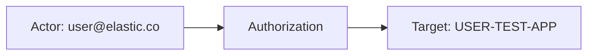
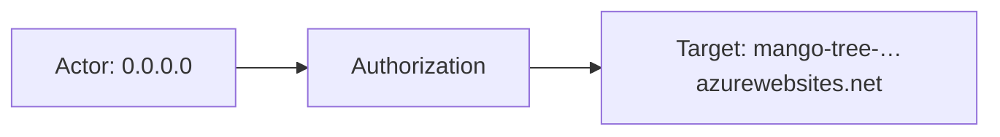
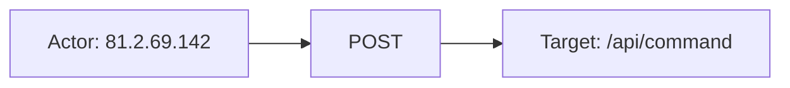

# azure_app_service

## Product Domain (Azure App Service PaaS)

Azure App Service is a fully managed Platform-as-a-Service (PaaS) offering for hosting web applications, REST APIs, and mobile backends without managing underlying infrastructure. Teams deploy code or containers to App Service plans that run on Windows or Linux, with built-in scaling, deployment slots, custom domains, TLS, and integration with Azure Monitor and Diagnostic Settings. The platform supports multiple runtimes (.NET, Java, Node.js, Python, PHP, Ruby, and custom containers) and is commonly used for customer-facing web apps, internal APIs, and microservices fronted by Azure Front Door or Application Gateway.

Operational and security visibility for App Service relies on diagnostic log categories exported from each web app or function app. These logs capture HTTP request traffic, publishing and deployment activity, platform health events, application stdout/stderr, custom application logging, and IPsec/VNet access audits. Organizations route this telemetry through Azure Event Hubs (often via Diagnostic Settings) for centralized ingestion into a SIEM or observability stack.

The Elastic **Azure App Service** integration consumes those diagnostic logs from Event Hub using the Elastic Agent `azure-eventhub` input. Ingest pipelines parse JSON payloads by log category, map HTTP and audit fields into ECS-aligned documents, enrich events with Azure resource metadata (subscription, resource group, resource ID), and support Kibana dashboards for monitoring application health, traffic patterns, and security-relevant publishing or network access activity.

## Data Collected (brief)

Logs only (no metrics). One data stream:

| Data stream | Description |
|---|---|
| **app_service_logs** | Azure App Service diagnostic logs ingested via Event Hub |

Log categories handled by category-specific ingest pipelines:

| Category | Description |
|---|---|
| **AppServiceHTTPLogs** | HTTP request/response metadata: client IP, method, URI, status codes, bytes sent/received, latency, user agent, X-Forwarded-* and Azure Front Door headers |
| **AppServiceAuditLogs** | Publishing access events (FTP, WebDeploy, etc.): user, protocol, client IP, success/failure |
| **AppServiceIPSecAuditLogs** | IPsec and VNet service-endpoint access audit events |
| **AppServicePlatformLogs** | Platform-level events for the App Service stamp and runtime environment |
| **AppServiceConsoleLogs** | Application or container stdout/stderr output |
| **AppServiceAppLogs** | Application-level logging emitted by the hosted app |

Events include `azure.app_service.*` fields (category, level, host, container ID, stamp metadata), `azure.resource.*` identifiers, and optional geo enrichment. Collection requires Azure Event Hub and Storage Account configuration (connection string or Microsoft Entra ID client secret authentication).

## Expected Audit Log Entities

One **`app_service_logs`** data stream ingests six Azure diagnostic log categories via Event Hub. **True audit categories** are **AppServiceAuditLogs** (SCM/publishing authorization — FTP, WebDeploy, AAD) and **AppServiceIPSecAuditLogs** (IPsec and VNet service-endpoint access decisions). **Audit-adjacent** categories are **AppServiceHTTPLogs** (HTTP request telemetry), **AppServicePlatformLogs**, **AppServiceConsoleLogs**, and **AppServiceAppLogs** (platform/runtime/application output without security-principal audit semantics).

The integration has audit logs. Actor and target identity remain almost entirely under `azure.app_service.properties.*` and `azure.resource.*`. No ECS `user.target.*`, `host.target.*`, `service.target.*`, or `entity.target.*` fields are mapped (`target_fields_audit.csv` — no rows; `target_enhancement_packages.csv` — `actor: none`, all target buckets false). No `destination.user.*` or `destination.host.*` pipeline mappings (`destination_identity_hits.csv` — not listed).

**`event.action` is absent in all fixtures and pipelines.** Vendor `OperationName` is renamed to `azure.app_service.operation_name` on audit, IPSec audit, console, and platform categories; HTTP logs expose `azure.app_service.properties.cs_method` and `cs_uri_stem` instead. `azure-shared-pipeline.yml` lowercases `event.outcome` if present but no inner pipeline sets it. Evidence: `packages/azure_app_service/data_stream/app_service_logs/sample_event.json`, `_dev/test/pipeline/test-appservice*-raw.log-expected.json`, `elasticsearch/ingest_pipeline/appservice-*-inner-pipeline.yml`, `azure-shared-pipeline.yml`, `fields/fields.yml`.

### Event action (semantic)

Azure App Service diagnostic logs name operations via Azure `OperationName` (audit/IPSec/platform/console) or IIS-style HTTP fields (method + URI stem). Audit categories share the coarse label `Authorization`; HTTP logs express per-request verbs as HTTP methods.

| Action (normalized label) | Classification | Confidence | Evidence | Per-stream notes |
| --- | --- | --- | --- | --- |
| `Authorization` | authentication | high | Audit fixture: `operation_name: Authorization`, `protocol: AAD`; IPSec fixture: same `operation_name` with `result: Denied` | **AppServiceAuditLogs**, **AppServiceIPSecAuditLogs** — publishing or network-perimeter authorization decision; protocol (`AAD`, `FTP`) and `result` (`Denied`/`Allowed`) refine semantics but are separate fields |
| `POST` (HTTP request) | api_call | high | HTTP fixture: `cs_method: POST`, `cs_uri_stem: /api/command`, `sc_status: 200` | **AppServiceHTTPLogs** — IIS access log verb; no `operation_name` on this category |
| `ContainerLogs` | administration | medium | Platform fixture: `operation_name: ContainerLogs` | **AppServicePlatformLogs** — container lifecycle wrapper; inner `EventName` in `azure.app_service.log` is more specific |
| `SiteStopRequested` | administration | high | Platform fixture message: `EventName:SiteStopRequested - Reason:SiteNotStartableDuringChangeNotification` | **AppServicePlatformLogs** — parsed from `properties.message` / `azure.app_service.log`; vendor-only |
| `ContainerStopped` | administration | high | Platform fixture message: `EventName:ContainerStopped` | **AppServicePlatformLogs** — container stop event embedded in platform log text |
| `Microsoft.Web/sites/log` | data_access | medium | Console fixture + `sample_event.json`: `operation_name: Microsoft.Web/sites/log` | **AppServiceConsoleLogs** — generic console/stdout log operation; `result_description` may embed HTTP access lines |
| Application log message | general | low | AppLogs fixture: `result_description: Exception on /favicon.ico [GET]`, `hi there` | **AppServiceAppLogs** — freeform application output; no structured operation field |

### Event action (ECS candidates)

| ECS / vendor field | Mapped to `event.action` today? | Mapping correct? | Recommended `event.action` value (from fixtures) | Enhancement candidate? | Evidence |
| --- | --- | --- | --- | --- | --- |
| `azure.app_service.operation_name` | no | n/a | `Authorization` | **yes** | ← `OperationName` (`appservice-auditlogs-inner-pipeline.yml` L12–13, `appservice-ipsecauditlogs-inner-pipeline.yml` L12–13); audit + IPSec fixtures |
| `azure.app_service.properties.protocol` (composite) | no | n/a | `Authorization-AAD` | partial | Audit fixture `protocol: AAD`; qualifies `Authorization` when publishing auth method matters |
| `azure.app_service.properties.result` (composite) | no | n/a | `Authorization-Denied` | partial | IPSec fixture `result: Denied`; outcome qualifier, not standalone action — pair with `operation_name` or map to `event.outcome` |
| `azure.app_service.properties.cs_method` | no | n/a | `POST` | **yes** | ← `CsMethod` (`appservice-httplogs-inner-pipeline.yml` L32–33); HTTP fixture |
| `azure.app_service.properties.cs_method` + `.cs_uri_stem` (composite) | no | n/a | `POST /api/command` | **yes** | HTTP fixture; richer HTTP surface when method alone is ambiguous |
| `azure.app_service.operation_name` (platform/console) | no | n/a | `ContainerLogs`, `Microsoft.Web/sites/log` | **yes** | ← `operationName` (`appservice-platformlogs-inner-pipeline.yml` L8–10, `appservice-consolelogs-inner-pipeline.yml` L12–13); platform/console fixtures |
| `azure.app_service.log` (`EventName:` grok) | no | n/a | `SiteStopRequested`, `ContainerStopped` | **yes** | Platform fixtures: message JSON in `properties.message` → `azure.app_service.log`; finer than `ContainerLogs` |
| `azure.app_service.result_description` | no | n/a | `Exception on /favicon.ico [GET]` | partial | AppLogs fixture; unstructured; grok `[METHOD]` optional |
| `event.outcome` ← `properties.result` | no | n/a | `success` / `failure` | **yes** | HTTP `result: Success`; IPSec `result: Denied` — natural `event.outcome`, not `event.action`; `azure-shared-pipeline.yml` L78–80 lowercases only |

**Step 2b — per-category check (`app_service_logs` data stream):**

| Category | `event.action` in fixtures? | Pipeline maps to `event.action`? | Primary action candidate | Confidence | Evidence |
| --- | --- | --- | --- | --- | --- |
| AppServiceAuditLogs | no | no | `azure.app_service.operation_name` | high | `test-appserviceauditlogs-raw.log-expected.json`: `Authorization` |
| AppServiceIPSecAuditLogs | no | no | `azure.app_service.operation_name` | high | `test-appserviceipsecauditlogs-raw.log-expected.json`: `Authorization` |
| AppServiceHTTPLogs | no | no | `azure.app_service.properties.cs_method` (+ optional `cs_uri_stem`) | high | `test-appservicehttplogs-raw.log-expected.json`: `POST`, `/api/command` |
| AppServicePlatformLogs | no | no | `EventName` in `azure.app_service.log`; fallback `azure.app_service.operation_name` | high | `test-appservicesplatformlogs-raw.log-expected.json`: `ContainerLogs`, `SiteStopRequested`, `ContainerStopped` |
| AppServiceConsoleLogs | no | no | `azure.app_service.operation_name` | medium | `test-appserviceconsolelogs-raw.log-expected.json`, `sample_event.json`: `Microsoft.Web/sites/log` |
| AppServiceAppLogs | no | no | `azure.app_service.result_description` (unstructured) | low | `test-appserviceapplogs-raw.log-expected.json`; no operation field |

### Actor (semantic)

| Entity | Classification | Entity type (if general) | Confidence | Evidence | Per-stream notes |
| --- | --- | --- | --- | --- | --- |
| Publishing user (Entra ID) | user | — | high | `azure.app_service.properties.user`, `user_display_name`, `protocol` (`appservice-auditlogs-inner-pipeline.yml`, `fields.yml`); fixture: object ID `100320021ACECD34`, email `user@elastic.co`, protocol `AAD` | **AppServiceAuditLogs** — identity that authenticated for SCM/publishing access; `user_display_name` populated for AAD-backed auth |
| Publishing client endpoint | host | — | high | `azure.app_service.properties.client_ip`, `client_port` (grok split from `UserAddress`); fixture: `0.0.0.0:5432` | **AppServiceAuditLogs** — source IP and port of the publishing session |
| Remote HTTP client (network) | host | — | high | `azure.app_service.properties.client_ip`, `client_port` (grok split from `CIp`); fixture: `0.0.0.0:52580` | **AppServiceIPSecAuditLogs** — caller attempting site access; no user identity in category |
| Azure Front Door / proxy chain | general | cdn-proxy | low | `azure.app_service.properties.xforwarded_for`, `xforwarded_host`, `xazurefdid`, `xfdhealth_probe` (`appservice-ipsecauditlogs-inner-pipeline.yml`, `fields.yml`); fixture: all empty strings | **AppServiceIPSecAuditLogs** — upstream proxy or Front Door context when headers are present; sparse in package fixtures |
| HTTP request client | host | — | high | `azure.app_service.properties.client_ip` ← `CIp` (`appservice-httplogs-inner-pipeline.yml`); fixture: `81.2.69.142` | **AppServiceHTTPLogs** — request telemetry actor; not an audit category |
| HTTP authenticated user | user | — | moderate | `azure.app_service.properties.cs_username` (`fields.yml`: "authenticated user on HTTP request"); fixture: `-` (unauthenticated) | **AppServiceHTTPLogs** — populated when Windows/IIS auth succeeds; absent in package fixtures |

**AppServicePlatformLogs**, **AppServiceConsoleLogs**, and **AppServiceAppLogs** carry no security-principal actor — only stamp/container/host metadata (`azure.app_service.host`, `container_id`, `event_stamp_name`).

### Actor (ECS candidates)

| ECS / vendor field | Role | Mapped today? | Mapping correct? | Confidence | Evidence |
| --- | --- | --- | --- | --- | --- |
| `azure.app_service.properties.user` | Entra object ID of publishing principal | no | n/a | high | ← `Properties.User` (`appservice-auditlogs-inner-pipeline.yml`); fixture `100320021ACECD34`; vendor-only |
| `azure.app_service.properties.user_display_name` | Entra UPN/email of publishing principal | no | n/a | high | ← `Properties.UserDisplayName`; fixture `user@elastic.co`; vendor-only |
| `azure.app_service.properties.protocol` | Publishing auth protocol (AAD, FTP, etc.) | no | n/a | high | ← `Properties.Protocol`; fixture `AAD`; vendor-only |
| `azure.app_service.properties.client_ip` | Publishing or HTTP client IP | no | n/a | high | ← `UserAddress`/`CIp` with grok port split; audit fixture `0.0.0.0`, HTTP fixture `81.2.69.142`; vendor-only |
| `azure.app_service.properties.client_port` | Client source port | no | n/a | high | Grok from `UserAddress`/`CIp`; audit fixtures `5432`, `52580`; vendor-only |
| `azure.app_service.properties.cs_username` | HTTP authenticated user | no | n/a | moderate | ← `CsUsername` (`appservice-httplogs-inner-pipeline.yml`); HTTP fixture `-`; vendor-only |
| `azure.app_service.properties.xforwarded_for` / `.xforwarded_host` / `.xazurefdid` / `.xfdhealth_probe` | Upstream proxy / Front Door context | no | n/a | low | IPSec audit pipeline; empty in fixtures |
| `cloud.provider` | Cloud scope (Azure) | yes | yes | high | Static `azure` (`azure-shared-pipeline.yml`); all fixtures — scope context, not actor |
| `cloud.account.id` | Subscription tenancy scope | yes | yes | high | ← `azure.subscription_id` grok from `ResourceId` (`azure-shared-pipeline.yml`); scope context, not actor |
| `user.*`, `source.ip`, `client.user.*` | — | no | n/a | — | Not mapped despite semantically equivalent vendor fields |

### Target (semantic)

| Layer | Description | Entity | Classification | Entity type (if general) | Confidence | Evidence | Per-stream notes |
| --- | --- | --- | --- | --- | --- | --- | --- |
| 1 — Platform / cloud service | Azure App Service PaaS | Azure App Service | service | — | high | `azure.resource.provider` → `MICROSOFT.WEB/SITES` (`azure-shared-pipeline.yml`); `cloud.provider: azure` | **AppServiceAuditLogs**, **AppServiceIPSecAuditLogs** — invoked platform; `cloud.service.name` not set |
| 2 — Resource / object | App Service web app (Azure resource) | Web app / function app | host | — | high | `azure.resource.id`, `azure.resource.name`, `azure.resource.group`, `azure.resource.provider`; fixtures: `USER-TEST-APP`, `MANGO-TREE-3004D00656084194B08980B8DB637B86` | **AppServiceAuditLogs**, **AppServiceIPSecAuditLogs** — site whose publishing surface or network perimeter was accessed |
| 2 — Resource / object | Site hostname / HTTP endpoint | Site FQDN | general | dns-host | high | `azure.app_service.properties.cs_host`; fixture: `mango-tree-3004d00656084194b08980b8db637b86.azurewebsites.net` | **AppServiceIPSecAuditLogs** — host header evaluated against IPsec/VNet rules; also on **AppServiceHTTPLogs** (`user-test.scm.azurewebsites.net`) |
| 2 — Resource / object | IPsec / access-control decision | Network policy outcome | general | network-policy | high | `azure.app_service.properties.result`, `details`, `service_endpoint`; fixture: `Denied`, `Denied by 0.0.0.0/0 rule.`, `service_endpoint: False` | **AppServiceIPSecAuditLogs** — allow/deny outcome and rule text |
| 2 — Resource / object | Publishing authorization surface | SCM/publishing endpoint | general | scm-endpoint | moderate | `azure.app_service.operation_name` (`Authorization`); `azure.app_service.properties.protocol`; category `AppServiceAuditLogs` | **AppServiceAuditLogs** — auth event against site publishing surface; no URI or deployment slot in fixtures |
| 3 — Content / artifact | HTTP request path | URI stem | general | url_path | moderate | `azure.app_service.properties.cs_uri_stem`, `cs_uri_query`, `cs_method`; HTTP fixture: `POST /api/command` | **AppServiceHTTPLogs** — request target path; audit-adjacent telemetry |

### Target (ECS candidates)

| ECS / vendor field | Layer | Classification | Mapped today? | Mapping correct? | ECS target bucket | Enhancement candidate? | Evidence |
| --- | --- | --- | --- | --- | --- | --- | --- |
| `azure.resource.id` | 2 | host | no | n/a | `entity.target.id` | **yes** | Grok from `ResourceId` (`azure-shared-pipeline.yml`); full ARM path in audit fixtures |
| `azure.resource.name` | 2 | host | no | n/a | `host.target.name` | **yes** | ← grok `NAME` from resource ID; fixtures `USER-TEST-APP`, `MANGO-TREE-...` |
| `azure.resource.group` | 2 | general | no | n/a | context-only | no | Resource group scope; tenancy context |
| `azure.resource.provider` | 1 | service | no | n/a | `service.target.name` | **yes** | `MICROSOFT.WEB/SITES` in fixtures — platform service type |
| `azure.app_service.properties.cs_host` | 2 | host | no | n/a | `host.target.name` | **yes** | ← `CsHost` (IPSec + HTTP pipelines); site FQDN — de-facto host target, not mapped to `destination.domain` |
| `azure.app_service.properties.result` | 2 | general | no | n/a | context-only | no | Authorization outcome (`Denied`/`Allowed`); policy decision metadata |
| `azure.app_service.properties.details` | 2/3 | general | no | n/a | context-only | no | Rule text / additional decision context; fixture `Denied by 0.0.0.0/0 rule.` |
| `azure.app_service.properties.service_endpoint` | 2 | general | no | n/a | context-only | no | VNet service-endpoint path indicator; fixture `False` |
| `azure.app_service.properties.cs_uri_stem` | 3 | general | no | n/a | context-only | no | HTTP request path (`/api/command`); fields.yml describes as "target of the request" |
| `azure.app_service.operation_name` | 2 | general | no | n/a | context-only | **yes** (→ `event.action`) | `Authorization` on audit categories — operation label; natural `event.action` source, not ECS-mapped |
| `cloud.provider`, `cloud.account.id` | — | general | yes | yes | context-only | no | Tenancy scope (`azure-shared-pipeline.yml`); not acted-upon targets |
| `destination.*`, `url.*`, `host.target.*`, `user.target.*`, `service.target.*` | — | — | no | n/a | — | — | Not populated by any pipeline |

### Gaps and mapping notes

- **No `event.action` mapping** — `azure.app_service.operation_name` (`Authorization`, `ContainerLogs`, `Microsoft.Web/sites/log`) and HTTP `cs_method` (`POST`) name the operation but remain vendor-only. Primary enhancement: copy `operation_name` → `event.action` on audit/IPSec/platform/console categories; `cs_method` (optionally with `cs_uri_stem`) on **AppServiceHTTPLogs**.
- **No ECS actor normalization** — publishing Entra object ID (`azure.app_service.properties.user`), UPN (`user_display_name`), and client IP (`client_ip`) remain vendor-only despite clear mappings to `user.id`, `user.email`, and `source.ip`.
- **No ECS target normalization** — App Service resource identity (`azure.resource.*`) and site hostname (`cs_host`) are the canonical Layer 1/2 targets but are not promoted to `host.target.*`, `entity.target.id`, or `destination.domain`.
- **No `destination.user.*` or `destination.host.*`** — package absent from `destination_identity_hits.csv`; no de-facto target pattern in use today.
- **No official ECS `*.target.*` fields** — `target_enhancement_packages.csv` confirms `actor: none` and all target buckets false; enhancement priority for audit categories is **`strong_candidate`** for `user.id`/`user.email` (actor) and `host.target.name`/`entity.target.id` (Layer 2 resource).
- **`cloud.service.name` not set** — Layer 1 platform service is inferable from `azure.resource.provider` (`MICROSOFT.WEB/SITES`) only; static `cloud.service.name: app_service` would improve cross-Azure integration correlation.
- **`properties.result` conflates action and outcome** — on **AppServiceIPSecAuditLogs** `result: Denied` is an authorization outcome; on **AppServiceHTTPLogs** `result: Success` is HTTP success. Map to `event.outcome`, not `event.action`; keep `operation_name` / `cs_method` as action sources.
- **`user_display_name` vs `user`** — for AAD publishing, `user` holds Entra object ID (→ `user.id`) and `user_display_name` holds email/UPN (→ `user.email`); do not conflate.
- **AppServiceIPSecAuditLogs has no user actor** — only client IP; user attribution requires pairing with Entra sign-in or HTTP access logs.
- **AppServiceHTTPLogs** — request telemetry with actor (`client_ip`, optional `cs_username`) and content target (`cs_uri_stem`, `cs_host`); useful for access investigation but not categorized as platform audit logs.
- For cross-integration user attribution on **AppServiceAuditLogs**, pair Entra object IDs with Microsoft Entra ID / Azure Activity Log data.

### Per-stream notes

#### `app_service_logs` — AppServiceAuditLogs

SCM/publishing authorization audit. **Action:** `Authorization` (`azure.app_service.operation_name`); protocol `AAD` refines auth method. **Actor:** Entra **user** (`user`, `user_display_name`) plus **host** client endpoint (`client_ip`, `client_port`). **Target:** Layer 1 App Service platform, Layer 2 **web app resource** (`azure.resource.*`), Layer 2 publishing surface (`protocol`). No ECS user, source, or `event.action` mapping.

#### `app_service_logs` — AppServiceIPSecAuditLogs

Network perimeter audit. **Action:** `Authorization` with outcome `Denied` in fixture (`result`, `details`). **Actor:** remote **host** client (`client_ip`, `client_port`); optional Front Door/proxy context (`xforwarded_*`, `xazurefdid`). **Target:** Layer 2 **web app resource**, Layer 2 **site hostname** (`cs_host`), Layer 2 **policy decision** (`result`, `details`, `service_endpoint`). No user identity in category.

#### `app_service_logs` — AppServiceHTTPLogs (audit-adjacent)

HTTP access telemetry, not platform audit. **Action:** HTTP method `POST` on `/api/command` (`cs_method`, `cs_uri_stem`); `result: Success` is outcome, not action. **Actor:** **host** (`client_ip`); optional **user** (`cs_username` when authenticated). **Target:** Layer 2 site (`cs_host`), Layer 3 request path (`cs_uri_stem`). Same vendor-only identity pattern — no ECS `source.*`/`url.*`/`user.*`/`event.action` promotion.

#### `app_service_logs` — AppServicePlatformLogs / AppServiceConsoleLogs / AppServiceAppLogs

Runtime/platform/application output. **Action:** platform `ContainerLogs` with embedded `EventName:SiteStopRequested` / `ContainerStopped`; console `Microsoft.Web/sites/log`; app logs freeform `result_description`. No security-principal actor or audit target semantics; stamp/container metadata only (`azure.app_service.host`, `container_id`, `event_stamp_name`).

## Example Event Graph

Examples below come from the single **`app_service_logs`** data stream. **AppServiceAuditLogs** and **AppServiceIPSecAuditLogs** are true platform audit categories; **AppServiceHTTPLogs** is audit-adjacent HTTP request telemetry. `event.action` is not populated in any fixture — actions are derived from `azure.app_service.operation_name` or `azure.app_service.properties.cs_method`.

### Example 1: Entra ID publishing authorization

**Stream:** `azure.app_service.app_service_logs` · **Fixture:** `packages/azure_app_service/data_stream/app_service_logs/_dev/test/pipeline/test-appserviceauditlogs-raw.log-expected.json`

```
Entra user (user@elastic.co) → Authorization → App Service web app (USER-TEST-APP)
```

#### Actor

| Field | Value |
| --- | --- |
| id | 100320021ACECD34 |
| name | user@elastic.co |
| type | user |
| ip | 0.0.0.0 |

**Field sources:**
- `id` ← `azure.app_service.properties.user`
- `name` ← `azure.app_service.properties.user_display_name`
- `ip` ← `azure.app_service.properties.client_ip`
- Auth method: `azure.app_service.properties.protocol` = `AAD` (Entra ID-backed publishing)

#### Event action

| Field | Value |
| --- | --- |
| action | Authorization |
| source_field | `azure.app_service.operation_name` |
| source_value | Authorization |

Not mapped to `event.action` in ECS today.

#### Target

| Field | Value |
| --- | --- |
| id | /SUBSCRIPTIONS/12CABCB5-36E8-104F-A3D2-1DC9982F45CA/RESOURCEGROUPS/USER-TEST/PROVIDERS/MICROSOFT.WEB/SITES/USER-TEST-APP |
| name | USER-TEST-APP |
| type | host |
| sub_type | web_app |

**Field sources:**
- `id` ← `azure.resource.id`
- `name` ← `azure.resource.name`
- `sub_type` ← `azure.resource.provider` (`MICROSOFT.WEB/SITES`)

#### Mermaid



### Example 2: IPsec access denied

**Stream:** `azure.app_service.app_service_logs` · **Fixture:** `packages/azure_app_service/data_stream/app_service_logs/_dev/test/pipeline/test-appserviceipsecauditlogs-raw.log-expected.json`

```
Remote client (0.0.0.0) → Authorization → Site hostname (mango-tree-…azurewebsites.net)
```

#### Actor

| Field | Value |
| --- | --- |
| type | host |
| ip | 0.0.0.0 |

**Field sources:**
- `ip` ← `azure.app_service.properties.client_ip` (port `52580` in `azure.app_service.properties.client_port`)

No user identity in this category — client IP only.

#### Event action

| Field | Value |
| --- | --- |
| action | Authorization |
| source_field | `azure.app_service.operation_name` |
| source_value | Authorization |

Outcome `Denied` is in `azure.app_service.properties.result` — not mapped to `event.action` or `event.outcome` today.

#### Target

| Field | Value |
| --- | --- |
| id | /SUBSCRIPTIONS/0E073EC1-C22F-4488-ADDE-DA35ED609CCD/RESOURCEGROUPS/LUCIAN.DEACONESCU_RG_6914/PROVIDERS/MICROSOFT.WEB/SITES/MANGO-TREE-3004D00656084194B08980B8DB637B86 |
| name | mango-tree-3004d00656084194b08980b8db637b86.azurewebsites.net |
| type | host |
| sub_type | web_app |

**Field sources:**
- `id` ← `azure.resource.id`
- `name` ← `azure.app_service.properties.cs_host` (site FQDN evaluated against IPsec rules; `azure.resource.name` is `MANGO-TREE-3004D00656084194B08980B8DB637B86`)
- `sub_type` ← `azure.resource.provider` (`MICROSOFT.WEB/SITES`)

Policy context: `azure.app_service.properties.result` = `Denied`, `details` = `Denied by 0.0.0.0/0 rule.`

#### Mermaid



### Example 3: HTTP POST to SCM endpoint (audit-adjacent)

**Stream:** `azure.app_service.app_service_logs` · **Fixture:** `packages/azure_app_service/data_stream/app_service_logs/_dev/test/pipeline/test-appservicehttplogs-raw.log-expected.json`

```
HTTP client (81.2.69.142) → POST → Request path (/api/command on user-test.scm.azurewebsites.net)
```

#### Actor

| Field | Value |
| --- | --- |
| type | host |
| ip | 81.2.69.142 |

**Field sources:**
- `ip` ← `azure.app_service.properties.client_ip`

`azure.app_service.properties.cs_username` is `-` (unauthenticated) in this fixture.

#### Event action

| Field | Value |
| --- | --- |
| action | POST |
| source_field | `azure.app_service.properties.cs_method` |
| source_value | POST |

Not mapped to `event.action` in ECS today. HTTP outcome `Success` is in `azure.app_service.properties.result`, not the action.

#### Target

| Field | Value |
| --- | --- |
| id | /SUBSCRIPTIONS/12CA3CB4-86E8-404F-A352-1DC1000F45CA/RESOURCEGROUPS/USER-TEST/PROVIDERS/MICROSOFT.WEB/SITES/APP-TEST |
| name | user-test.scm.azurewebsites.net/api/command |
| type | general |
| sub_type | url_path |

**Field sources:**
- `id` ← `azure.resource.id` (Layer 2 web app resource)
- `name` ← `azure.app_service.properties.cs_host` + `azure.app_service.properties.cs_uri_stem` (site FQDN + request path)
- `sub_type` ← HTTP request path target (`cs_uri_stem`: `/api/command`)

#### Mermaid



## ES|QL Entity Extraction

**Package type: agent-backed** (Elastic Agent `azure-eventhub` input). Query-time extraction applies to the single logs data stream, routed by **`data_stream.dataset == "azure_app_service.app_service_logs"`** (`sample_event.json`, dashboard filter) with **`azure.app_service.category`** as the secondary discriminator (six diagnostic categories share one dataset). Pass 4 is **fill-gaps-only**: column-level `IS NOT NULL` preserve on each mapped output before vendor fallbacks so a populated `user.email` does not block `user.id` ← `azure.app_service.properties.user`, and a populated `host.target.id` does not block category-specific `host.target.name` fallbacks. True audit categories (**AppServiceAuditLogs**, **AppServiceIPSecAuditLogs**) and audit-adjacent **AppServiceHTTPLogs** receive actor, action, and target enrichment; platform/console/app log categories are excluded. **Pass 4 (tautology cleanup):** no `CASE(col, col, …)` identity fallbacks; mapped columns use column-level preserve (not blind `CASE(actor_exists, user.name, …)` when `user.email` can set `actor_exists` while `user.name` stays empty). **Pass 4 CASE syntax:** combined actor/action/target blocks use odd-arity `CASE` (condition/value pairs + trailing `null`); the audit pipeline fragment uses **3-arg** `CASE(col IS NOT NULL, col, fallback)` — not **4-arg** `CASE(col IS NOT NULL, col, bare_field, null)` where the bare field parses as a boolean condition.

### Dataset inventory

| data_stream.dataset | Stream role | Actor classification(s) | Target classification(s) | Extraction |
| --- | --- | --- | --- | --- |
| `azure_app_service.app_service_logs` — AppServiceAuditLogs | publishing audit | user, host | host, service | full |
| `azure_app_service.app_service_logs` — AppServiceIPSecAuditLogs | network audit | host | host | full |
| `azure_app_service.app_service_logs` — AppServiceHTTPLogs | HTTP telemetry | host, user | host, general | partial |
| `azure_app_service.app_service_logs` — Platform/Console/AppLogs | runtime output | — | — | none |

### Field mapping plan

#### Actor mappings

| Output column | Source field(s) | Condition (dataset + optional) | Confidence | Notes |
| --- | --- | --- | --- | --- |
| `user.id` | `azure.app_service.properties.user` | `data_stream.dataset == "azure_app_service.app_service_logs" AND azure.app_service.category == "AppServiceAuditLogs"` | high | **preserve existing** — `user.id IS NOT NULL`; vendor fallback — Entra object ID |
| `user.email` | `azure.app_service.properties.user_display_name` | same | high | **preserve existing** — `user.email IS NOT NULL`; vendor fallback — UPN/email |
| `user.name` | `azure.app_service.properties.user_display_name` | `data_stream.dataset == "azure_app_service.app_service_logs" AND azure.app_service.category == "AppServiceAuditLogs"` | high | **preserve existing** — `user.name IS NOT NULL` (not `actor_exists`); vendor fallback — display name |
| `user.name` | `azure.app_service.properties.cs_username` | `data_stream.dataset == "azure_app_service.app_service_logs" AND azure.app_service.category == "AppServiceHTTPLogs" AND azure.app_service.properties.cs_username != "-"` | medium | **preserve existing** — `user.name IS NOT NULL`; vendor fallback — IIS auth user when present |
| `host.ip` | `azure.app_service.properties.client_ip` | `data_stream.dataset == "azure_app_service.app_service_logs" AND azure.app_service.category IN ("AppServiceAuditLogs", "AppServiceIPSecAuditLogs", "AppServiceHTTPLogs")` | high | **preserve existing** — `host.ip IS NOT NULL`; vendor fallback — not promoted to `source.ip` at ingest |

#### Target mappings

| Output column | Source field(s) | Condition (dataset + optional) | Confidence | Notes |
| --- | --- | --- | --- | --- |
| `host.target.id` | `azure.resource.id` | `data_stream.dataset == "azure_app_service.app_service_logs" AND azure.app_service.category IN ("AppServiceAuditLogs", "AppServiceIPSecAuditLogs", "AppServiceHTTPLogs")` | high | **preserve existing** — `host.target.id IS NOT NULL`; vendor fallback — web app ARM resource (Pass 3 Examples 1–3) |
| `host.target.name` | `azure.resource.name` | `data_stream.dataset == "azure_app_service.app_service_logs" AND azure.app_service.category == "AppServiceAuditLogs"` | high | **preserve existing** — `host.target.name IS NOT NULL` (not `target_exists`); vendor fallback — app resource name (`USER-TEST-APP`) |
| `host.target.name` | `azure.app_service.properties.cs_host` | `data_stream.dataset == "azure_app_service.app_service_logs" AND azure.app_service.category IN ("AppServiceIPSecAuditLogs", "AppServiceHTTPLogs")` | high | **preserve existing** — `host.target.name IS NOT NULL`; vendor fallback — site FQDN (Pass 3 Examples 2–3) |
| `service.target.name` | `azure.resource.provider` | `data_stream.dataset == "azure_app_service.app_service_logs" AND azure.app_service.category IN ("AppServiceAuditLogs", "AppServiceIPSecAuditLogs", "AppServiceHTTPLogs")` | high | **preserve existing** — `service.target.name IS NOT NULL`; vendor fallback — Layer 1 platform type (`MICROSOFT.WEB/SITES`) |
| `entity.target.name` | `azure.app_service.properties.cs_uri_stem` | `data_stream.dataset == "azure_app_service.app_service_logs" AND azure.app_service.category == "AppServiceHTTPLogs"` | high | **preserve existing** — `entity.target.name IS NOT NULL`; vendor fallback — HTTP request path (`/api/command`) |

#### Event action mappings

| Output column | Source field(s) | Condition (dataset + optional) | Confidence | Notes |
| --- | --- | --- | --- | --- |
| `event.action` | `azure.app_service.operation_name` | `data_stream.dataset == "azure_app_service.app_service_logs" AND azure.app_service.category IN ("AppServiceAuditLogs", "AppServiceIPSecAuditLogs")` | high | preserve existing; vendor fallback — `Authorization` in audit fixtures |
| `event.action` | `azure.app_service.properties.cs_method` | `data_stream.dataset == "azure_app_service.app_service_logs" AND azure.app_service.category == "AppServiceHTTPLogs"` | high | preserve existing; vendor fallback — HTTP verb (`POST`); do not use `properties.result` (outcome) |

### Detection flags (mandatory — run first)

Predicate tuned for this integration: no indexed `user.*` / `host.*` / `*.target.*` / `event.action` at ingest today. **`actor_exists` / `target_exists` are query-time helpers only** — mapped columns use **column-level** `IS NOT NULL` preserve so one populated actor/target field does not block fallbacks on sibling columns (e.g. `user.email` without `user.id`, or `host.target.id` without `host.target.name`).

```esql
| EVAL
  actor_exists = user.id IS NOT NULL OR user.email IS NOT NULL OR user.name IS NOT NULL OR host.ip IS NOT NULL,
  target_exists = host.target.id IS NOT NULL OR host.target.name IS NOT NULL
    OR service.target.id IS NOT NULL OR service.target.name IS NOT NULL
    OR entity.target.id IS NOT NULL OR entity.target.name IS NOT NULL,
  action_exists = event.action IS NOT NULL
```

**Semantics:** Do not use `CASE(actor_exists, user.name, …)` or `CASE(target_exists, host.target.name, …)` on mapped outputs — use `user.name IS NOT NULL` / `host.target.name IS NOT NULL` (and the same pattern per column), including `event.action IS NOT NULL` for `event.action`.

**ES|QL `CASE` arity:** Arguments are **(condition, value)** pairs; odd count → last arg is default. Use **3-arg** `CASE(user.name IS NOT NULL, user.name, azure.app_service.properties.user_display_name)` or **5-arg** / **7-arg** with dataset guards — not **4-arg** `CASE(user.name IS NOT NULL, user.name, azure.app_service.properties.user_display_name, null)` (the 3rd arg is a **condition**, not a fallback).

### Optional classification helpers (when needed)

```esql
| EVAL
  entity.target.type = CASE(
    entity.target.type IS NOT NULL, entity.target.type,
    data_stream.dataset == "azure_app_service.app_service_logs" AND azure.app_service.category IN ("AppServiceAuditLogs", "AppServiceIPSecAuditLogs"), "host",
    data_stream.dataset == "azure_app_service.app_service_logs" AND azure.app_service.category == "AppServiceHTTPLogs", "general",
    null
  ),
  entity.target.sub_type = CASE(
    entity.target.sub_type IS NOT NULL, entity.target.sub_type,
    data_stream.dataset == "azure_app_service.app_service_logs" AND azure.app_service.category IN ("AppServiceAuditLogs", "AppServiceIPSecAuditLogs"), "web_app",
    data_stream.dataset == "azure_app_service.app_service_logs" AND azure.app_service.category == "AppServiceHTTPLogs", "url_path",
    null
  )
```

### Combined ES|QL — actor fields

```esql
| EVAL
  user.id = CASE(
    user.id IS NOT NULL, user.id,
    data_stream.dataset == "azure_app_service.app_service_logs" AND azure.app_service.category == "AppServiceAuditLogs", azure.app_service.properties.user,
    null
  ),
  user.email = CASE(
    user.email IS NOT NULL, user.email,
    data_stream.dataset == "azure_app_service.app_service_logs" AND azure.app_service.category == "AppServiceAuditLogs", azure.app_service.properties.user_display_name,
    null
  ),
  user.name = CASE(
    user.name IS NOT NULL, user.name,
    data_stream.dataset == "azure_app_service.app_service_logs" AND azure.app_service.category == "AppServiceAuditLogs", azure.app_service.properties.user_display_name,
    data_stream.dataset == "azure_app_service.app_service_logs" AND azure.app_service.category == "AppServiceHTTPLogs" AND azure.app_service.properties.cs_username != "-", azure.app_service.properties.cs_username,
    null
  ),
  host.ip = CASE(
    host.ip IS NOT NULL, host.ip,
    data_stream.dataset == "azure_app_service.app_service_logs" AND azure.app_service.category IN ("AppServiceAuditLogs", "AppServiceIPSecAuditLogs", "AppServiceHTTPLogs"), azure.app_service.properties.client_ip,
    null
  )
```

### Combined ES|QL — event action

```esql
| EVAL
  event.action = CASE(
    event.action IS NOT NULL, event.action,
    data_stream.dataset == "azure_app_service.app_service_logs" AND azure.app_service.category IN ("AppServiceAuditLogs", "AppServiceIPSecAuditLogs"), azure.app_service.operation_name,
    data_stream.dataset == "azure_app_service.app_service_logs" AND azure.app_service.category == "AppServiceHTTPLogs", azure.app_service.properties.cs_method,
    null
  )
```

### Combined ES|QL — target fields

```esql
| EVAL
  host.target.id = CASE(
    host.target.id IS NOT NULL, host.target.id,
    data_stream.dataset == "azure_app_service.app_service_logs" AND azure.app_service.category IN ("AppServiceAuditLogs", "AppServiceIPSecAuditLogs", "AppServiceHTTPLogs"), azure.resource.id,
    null
  ),
  host.target.name = CASE(
    host.target.name IS NOT NULL, host.target.name,
    data_stream.dataset == "azure_app_service.app_service_logs" AND azure.app_service.category == "AppServiceAuditLogs", azure.resource.name,
    data_stream.dataset == "azure_app_service.app_service_logs" AND azure.app_service.category == "AppServiceIPSecAuditLogs", azure.app_service.properties.cs_host,
    data_stream.dataset == "azure_app_service.app_service_logs" AND azure.app_service.category == "AppServiceHTTPLogs", azure.app_service.properties.cs_host,
    null
  ),
  service.target.name = CASE(
    service.target.name IS NOT NULL, service.target.name,
    data_stream.dataset == "azure_app_service.app_service_logs" AND azure.app_service.category IN ("AppServiceAuditLogs", "AppServiceIPSecAuditLogs", "AppServiceHTTPLogs"), azure.resource.provider,
    null
  ),
  entity.target.name = CASE(
    entity.target.name IS NOT NULL, entity.target.name,
    data_stream.dataset == "azure_app_service.app_service_logs" AND azure.app_service.category == "AppServiceHTTPLogs", azure.app_service.properties.cs_uri_stem,
    null
  )
```

### Full pipeline fragment (optional)

```esql
FROM logs-*
| EVAL
  actor_exists = user.id IS NOT NULL OR user.email IS NOT NULL OR user.name IS NOT NULL OR host.ip IS NOT NULL,
  target_exists = host.target.id IS NOT NULL OR host.target.name IS NOT NULL
    OR service.target.id IS NOT NULL OR service.target.name IS NOT NULL
    OR entity.target.id IS NOT NULL OR entity.target.name IS NOT NULL,
  action_exists = event.action IS NOT NULL
| EVAL
  user.id = CASE(
    user.id IS NOT NULL, user.id,
    data_stream.dataset == "azure_app_service.app_service_logs" AND azure.app_service.category == "AppServiceAuditLogs", azure.app_service.properties.user,
    null
  ),
  user.email = CASE(
    user.email IS NOT NULL, user.email,
    data_stream.dataset == "azure_app_service.app_service_logs" AND azure.app_service.category == "AppServiceAuditLogs", azure.app_service.properties.user_display_name,
    null
  ),
  user.name = CASE(
    user.name IS NOT NULL, user.name,
    data_stream.dataset == "azure_app_service.app_service_logs" AND azure.app_service.category == "AppServiceAuditLogs", azure.app_service.properties.user_display_name,
    data_stream.dataset == "azure_app_service.app_service_logs" AND azure.app_service.category == "AppServiceHTTPLogs" AND azure.app_service.properties.cs_username != "-", azure.app_service.properties.cs_username,
    null
  ),
  host.ip = CASE(
    host.ip IS NOT NULL, host.ip,
    data_stream.dataset == "azure_app_service.app_service_logs" AND azure.app_service.category IN ("AppServiceAuditLogs", "AppServiceIPSecAuditLogs", "AppServiceHTTPLogs"), azure.app_service.properties.client_ip,
    null
  ),
  event.action = CASE(
    event.action IS NOT NULL, event.action,
    data_stream.dataset == "azure_app_service.app_service_logs" AND azure.app_service.category IN ("AppServiceAuditLogs", "AppServiceIPSecAuditLogs"), azure.app_service.operation_name,
    data_stream.dataset == "azure_app_service.app_service_logs" AND azure.app_service.category == "AppServiceHTTPLogs", azure.app_service.properties.cs_method,
    null
  ),
  host.target.id = CASE(
    host.target.id IS NOT NULL, host.target.id,
    data_stream.dataset == "azure_app_service.app_service_logs" AND azure.app_service.category IN ("AppServiceAuditLogs", "AppServiceIPSecAuditLogs", "AppServiceHTTPLogs"), azure.resource.id,
    null
  ),
  host.target.name = CASE(
    host.target.name IS NOT NULL, host.target.name,
    data_stream.dataset == "azure_app_service.app_service_logs" AND azure.app_service.category == "AppServiceAuditLogs", azure.resource.name,
    data_stream.dataset == "azure_app_service.app_service_logs" AND azure.app_service.category == "AppServiceIPSecAuditLogs", azure.app_service.properties.cs_host,
    data_stream.dataset == "azure_app_service.app_service_logs" AND azure.app_service.category == "AppServiceHTTPLogs", azure.app_service.properties.cs_host,
    null
  ),
  service.target.name = CASE(
    service.target.name IS NOT NULL, service.target.name,
    data_stream.dataset == "azure_app_service.app_service_logs" AND azure.app_service.category IN ("AppServiceAuditLogs", "AppServiceIPSecAuditLogs", "AppServiceHTTPLogs"), azure.resource.provider,
    null
  ),
  entity.target.name = CASE(
    entity.target.name IS NOT NULL, entity.target.name,
    data_stream.dataset == "azure_app_service.app_service_logs" AND azure.app_service.category == "AppServiceHTTPLogs", azure.app_service.properties.cs_uri_stem,
    null
  )
| KEEP @timestamp, data_stream.dataset, azure.app_service.category, event.action, user.id, user.email, user.name, host.ip, host.target.id, host.target.name, service.target.name
```

### Streams excluded

- **AppServicePlatformLogs** — container/stamp lifecycle (`ContainerLogs`, `EventName` in `azure.app_service.log`); no security-principal actor or durable audit target.
- **AppServiceConsoleLogs** — stdout/stderr wrapper (`Microsoft.Web/sites/log`); no principal actor.
- **AppServiceAppLogs** — unstructured application output (`result_description`); no structured actor/target identity.

### Gaps and limitations

- **Vendor fields not promoted at ingest** — all fallbacks use `azure.app_service.properties.*` and `azure.resource.*`; Pass 4 does not modify pipelines.
- **`user.domain`** — not indexed; not extractable from fixtures without email parse.
- **`host.id` / `host.name` (actor)** — client endpoint is `host.ip` only; `client_port` is vendor-only context.
- **IPSec category has no user actor** — client IP only; user attribution requires Entra or HTTP correlation.
- **`properties.result` is outcome** — `Denied` / `Success` should map to `event.outcome` at ingest, not `event.action` or target identity.
- **HTTP composite target name** — Pass 3 combines `cs_host` + `cs_uri_stem`; ES|QL maps them to separate `host.target.name` and `entity.target.name` columns (no `CONCAT` in mandatory set).
- **Front Door / proxy actor context** — `xforwarded_*`, `xazurefdid` empty in IPSec fixture; omitted to avoid false positives.
- **Platform/console action candidates** — `operation_name` / `azure.app_service.log` `EventName` exist but streams are excluded from entity EVAL.
- **Alignment with Pass 2** — `event.action`, `user.id`, `user.email`, and `host.target.*` are ingest enhancement candidates; this section supplies query-time fallback only when those columns are empty.
- **Pass 4 tautology cleanup** — no `CASE(col, col, …)` identity fallbacks; actor/target columns use column-level `IS NOT NULL` preserve (not `CASE(actor_exists, user.name, …)` / `CASE(target_exists, host.target.name, …)`) so partial ingest or prior EVAL steps do not block vendor fallbacks; `entity.target.type` / `entity.target.sub_type` use the same column-level pattern.
- **Pass 4 CASE syntax** — combined actor/action/target blocks use odd-arity `CASE` (condition/value pairs + trailing `null`); full pipeline fragment aligns with combined blocks (dataset guards on every fallback branch).
- **Unscoped `FROM logs-*`** — dataset routing lives in `CASE` fallback conditions (`data_stream.dataset == "azure_app_service.app_service_logs"` + category), not a top-level `WHERE`.
