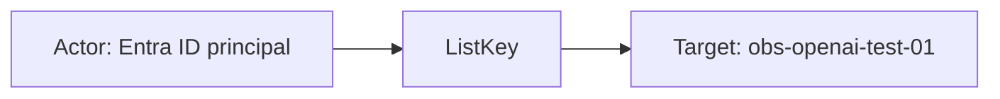
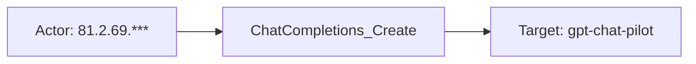
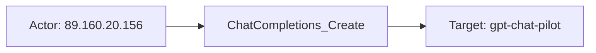

# azure_openai

## Product Domain (Azure OpenAI Service)

Microsoft Azure OpenAI Service is a managed Azure offering for deploying and consuming OpenAI foundation models (chat, completions, embeddings, and related APIs) within an organization's Azure tenancy. Resources are provisioned as Cognitive Services accounts with model deployments, quota management, and Azure-native content filtering (hate, violence, sexual, self-harm, profanity, jailbreak, protected material, and custom blocklists). Organizations use Azure OpenAI to build copilots and AI applications while retaining Azure identity, networking, and compliance controls.

The platform emits operational telemetry at two levels. Native diagnostic logging covers audit activity (administrative and key-management operations) and request/response metadata for model API calls—operation name, duration, model deployment, caller IP, and HTTP outcome—without full prompt and completion bodies by default. When Azure API Management (APIM) fronts OpenAI deployments, gateway logs add richer HTTP-level detail, including backend request and response payloads, token usage, cache behavior, TLS metadata, and content-filter results across safety categories.

From a security and observability perspective, Azure OpenAI is a critical control point for AI workload governance. Security and platform teams monitor who invokes models, which deployments are used, whether requests succeed or fail, how content filters act on prompts and completions, and how provisioned throughput (PTU) capacity is consumed. The Elastic integration ingests OpenAI logs via Azure Event Hub and cognitive-service metrics via Azure Monitor, normalizing events into ECS-aligned fields for SIEM correlation, AI usage analytics, latency and availability alerting, quota monitoring, and audit review.

## Data Collected (brief)

- **Logs** (`azure.open_ai`): Streamed from Azure Event Hub via the `azure-eventhub` input; agent-based deployment only.
- **Audit** (`category: Audit`): Administrative and resource operations (e.g., key listing), including asset identity, object ID, operation name, tenant/region, and Azure resource ID.
- **RequestResponse** (`category: RequestResponse`): Native model API call telemetry—operation (e.g., chat completions, thread creation), duration, caller IP, correlation ID, model name/version/deployment, stream type, request/response sizes, and HTTP result signature.
- **ApiManagementGatewayLogs** (`category: GatewayLogs`): APIM gateway events with full HTTP context—client and backend URLs/methods, request/response bodies (prompts and completions), token counts, latency, cache status, TLS details, and content-filter outcomes (severity, filtered/detected flags, custom blocklists, jailbreak, profanity, protected material).
- **Metrics** (`azure.open_ai`): Collected from Azure Monitor (`Microsoft.CognitiveServices/accounts`) on a 5-minute period; supports agent-based and agentless deployment.
- **Usage and performance**: API request counts; input, output, active, and total token totals; time to response (streaming latency); fine-tuned training hours; PTU utilization percentage and context-token cache match rate (provisioned deployments).
- **Dimensions and resource context**: Model name, version, deployment name, API name, operation name, region, status code, stream type; Azure subscription, resource group, resource ID, and namespace.

## Expected Audit Log Entities

OpenAI telemetry spans one **logs** data stream (`azure.open_ai`, three Azure diagnostic categories) and one **metrics** data stream (`azure.open_ai`, Azure Monitor aggregates). **`Audit`** is true administrative audit (key management, resource operations). **`RequestResponse`** and **`GatewayLogs`** are audit-adjacent API telemetry — native OpenAI call metadata and APIM gateway HTTP logs with full request/response bodies. **`Metrics`** are time-bucketed usage and performance gauges with no per-request principal. The logs pipeline maps GatewayLogs `caller_ip_address` → `source.ip` (with geo/ASN) and subscription → `cloud.account.id`, but does not populate ECS `user.*`, `*.target.*`, `related.*`, `destination.*`, or `gen_ai.*`. No ECS `*.target.*` fields are mapped today (`target_fields_audit.csv` has no `azure_openai` row; `target_enhancement_packages.csv` classifies actor/target enhancement as **`none`**). No `destination.user.*` / `destination.host.*` usage (`destination_identity_hits.csv` has no `azure_openai` row). **`event.action` is absent** in all log and metrics fixtures and no ingest pipeline maps to it (grep across `packages/azure_openai` returns no `event.action` references). Vendor operation fields (`azure.open_ai.operation_name`, `properties.operation_id`) hold the action verb but remain vendor-only. Evidence is from `packages/azure_openai/data_stream/logs/_dev/test/pipeline/test-open-ai-*-expected.json`, `data_stream/logs/sample_event.json`, `data_stream/logs/fields/fields.yml`, `data_stream/logs/elasticsearch/ingest_pipeline/default.yml`, `data_stream/logs/elasticsearch/ingest_pipeline/azure-shared-pipeline.yml`, `data_stream/metrics/_dev/test/pipeline/test-openai-request.json-expected.json`, `data_stream/metrics/sample_event.json`, and `data_stream/metrics/fields/fields.yml`.

### Event action (semantic)

Each log category records a distinct operation or activity. **`Audit`** and **`RequestResponse`** expose the action at top-level `azure.open_ai.operation_name`. **`GatewayLogs`** use `properties.operation_id` for the OpenAI/APIM API method (e.g. `ChatCompletions_Create`); the top-level `operation_name` (`Microsoft.ApiManagement/GatewayLogs`) is the Azure diagnostic envelope, not the API verb. **`Metrics`** are pre-aggregated Azure Monitor gauges with **no meaningful per-event action** (classification rule 10).

| Action (normalized label) | Classification | Confidence | Evidence | Per-stream notes |
| --- | --- | --- | --- | --- |
| `ListKey` | administration | high | `test-open-ai-audit.log-expected.json`: `operation_name: ListKey` | **`Audit`** — key-management admin operation against the cognitive account |
| `Create_Thread` | api_call | high | `test-open-ai-request-response.log-expected.json`: `operation_name: Create_Thread` | **`RequestResponse`** — Assistants thread creation |
| `ChatCompletions_Create` | api_call | high | RequestResponse fixture (`operation_name: ChatCompletions_Create`); GatewayLogs fixture (`properties.operation_id: ChatCompletions_Create`) | **`RequestResponse`**, **`GatewayLogs`** — chat completion API invocation |
| `Microsoft.ApiManagement/GatewayLogs` | api_call | partial | GatewayLogs top-level `operation_name` in all gateway fixtures and `sample_event.json` | **`GatewayLogs`** — Azure diagnostic category name, not the invoked OpenAI API method; use `properties.operation_id` instead for `event.action` |
| `ShoeboxCallResult` | api_call | partial | RequestResponse: `azure.open_ai.event: ShoeboxCallResult` in fixtures | **`RequestResponse`** — Azure internal event type for native call telemetry; less specific than `operation_name` |
| (none — metric aggregates) | — | high | `metrics/sample_event.json`, `test-openai-request.json-expected.json` — token/latency counters only | **`Metrics`** — no per-request verb; dimensions describe aggregation slice |

### Event action (ECS candidates)

| ECS / vendor field | Mapped to `event.action` today? | Mapping correct? | Recommended `event.action` value (from fixtures) | Enhancement candidate? | Evidence |
| --- | --- | --- | --- | --- | --- |
| `azure.open_ai.operation_name` | no | n/a | `ListKey`, `Create_Thread`, `ChatCompletions_Create` | yes | Audit and RequestResponse fixtures; `fields.yml` L13–15 ("The log action performed"); pipeline retains vendor-only after snake_case script — no rename to `event.action` |
| `azure.open_ai.properties.operation_id` | no | n/a | `ChatCompletions_Create` | yes | GatewayLogs fixtures (`test-open-ai-gateway.log-expected.json`); primary API action on APIM-fronted calls |
| `http.request.method` + `url.path` | no | partial | `POST` + `/deployments/gpt-chat-pilot/chat/completions` | partial | GatewayLogs: `properties.method` → `http.request.method` (`default.yml` L265–268); `uri_parts` on `properties.url` (`default.yml` L273–286); alternate when `operation_id` absent |
| `azure.open_ai.event` | no | n/a | `ShoeboxCallResult` | partial | RequestResponse fixtures only; Azure envelope type, not the API method |
| `event.action` | no | n/a | — | yes | Not set in any pipeline or fixture |
| `event.outcome` | yes | yes | `success`, `failure` | no | `result_type` → `event.outcome` on GatewayLogs (`default.yml` L162–169); records outcome, not action |
| `event.type` / `event.category` | no | n/a | — | no | Not set; would not substitute for `event.action` without a vendor action source |

**Step 2b — per-stream check:**

| Stream | `event.action` in fixtures? | Pipeline maps to `event.action`? | Primary action candidate | Confidence | Evidence |
| --- | --- | --- | --- | --- | --- |
| Logs — Audit | no | no | `azure.open_ai.operation_name` → `ListKey` | high | `test-open-ai-audit.log-expected.json`; no `event.action` in `event` block |
| Logs — RequestResponse | no | no | `azure.open_ai.operation_name` → `Create_Thread`, `ChatCompletions_Create` | high | `test-open-ai-request-response.log-expected.json`; alternate `azure.open_ai.event: ShoeboxCallResult` |
| Logs — GatewayLogs | no | no | `azure.open_ai.properties.operation_id` → `ChatCompletions_Create` | high | `test-open-ai-gateway.log-expected.json`, `sample_event.json`; do **not** use top-level `operation_name: Microsoft.ApiManagement/GatewayLogs` |
| Metrics | no | no | — (no per-event action) | high | `test-openai-request.json-expected.json`; `event` block has `dataset`/`module` only; 5-minute Azure Monitor aggregates |

### Actor (semantic)

| Entity | Classification | Entity type (if general) | Confidence | Evidence | Per-stream notes |
| --- | --- | --- | --- | --- | --- |
| Entra ID principal (object ID) | user | — | high | `azure.open_ai.properties.object_id` on Audit `ListKey` (`test-open-ai-audit.log-expected.json`: `b610ab05-ce06-4cc1-a6dd-174b9f80468a`); defined in `fields.yml` | **`Audit`** — administrative actor for key-management and resource operations; not mapped to ECS `user.id` |
| Asset identity | general | identity | moderate | `azure.open_ai.asset_identity` on Audit sample (`07628fea-67bb-424d-b160-fdc46c82d0b4`); `fields.yml` | **`Audit`** — Azure asset identity key; supplementary to object ID |
| API client (IP address) | host | — | high | GatewayLogs: `caller_ip_address` → `source.ip` with `source.geo.*` / `source.as.*` (`default.yml` L117–161; `test-open-ai-gateway.log-expected.json`: `89.160.20.156`) | **`GatewayLogs`** — full client IP; best actor signal for model API calls |
| API client (masked IP) | host | — | moderate | RequestResponse: `azure.open_ai.caller_ip_address` (last octet masked, e.g. `81.2.69.***`); pipeline intentionally does **not** copy to `source.ip` (`default.yml` L117 comment) | **`RequestResponse`** — caller network context only; no geo enrichment |
| Client TLS context | general | tls_client | moderate | `azure.open_ai.properties.client_tls_version`, `client_tls_cipher_suite`, `client_protocol` (`fields.yml`; gateway fixtures) | **`GatewayLogs`** — transport fingerprint for the calling client; not a distinct ECS entity |
| Integration collector | service | — | low | Elastic Agent Event Hub consumer / Metricbeat Azure Monitor poller; credentials in stream config, not indexed | Implicit; not represented on events |

**No actor identity in samples:** **`RequestResponse`** — `properties.object_id` is empty in fixtures; no user name, API key ID, or Entra UPN. **`Metrics`** — time-bucketed resource metrics only; no caller or user dimensions. **`GatewayLogs`** `backend_request_body.messages[].role: user` is chat turn role, not a security principal.

### Actor (ECS candidates)

| ECS / vendor field | Role | Mapped today? | Mapping correct? | Confidence | Evidence |
| --- | --- | --- | --- | --- | --- |
| `azure.open_ai.properties.object_id` | Entra ID administrative principal | no | n/a | high | Audit `ListKey` fixture (`b610ab05-ce06-4cc1-a6dd-174b9f80468a`); `fields.yml`; pipeline retains vendor-only — no rename to `user.id` |
| `azure.open_ai.asset_identity` | Azure asset identity key | no | n/a | moderate | Audit fixture; supplementary actor context alongside object ID |
| `source.ip` | API client IP (GatewayLogs) | yes | yes | high | `caller_ip_address` → `source.ip` when `category == 'GatewayLogs'` (`default.yml` L117–124); geo/ASN enrichment L141–161; fixture `89.160.20.156` |
| `source.geo.*` / `source.as.*` | Client network enrichment | yes | yes | high | GeoIP/ASN processors on `source.ip` (`default.yml` L141–161); populated in gateway fixtures |
| `azure.open_ai.caller_ip_address` | Masked client IP (RequestResponse) | no | n/a | moderate | RequestResponse fixtures (`81.2.69.***`); intentionally not promoted to `source.ip` per pipeline comment |
| `azure.open_ai.properties.client_tls_version` / `.client_tls_cipher_suite` / `.client_protocol` | Client transport fingerprint | no | n/a | moderate | GatewayLogs `fields.yml` and fixtures; vendor-only |
| `user.id` / `user.*` | Actor identity | no | n/a | — | Not set in any pipeline or fixture despite Audit `object_id` availability |
| `client.user.*` | Caller principal | no | n/a | — | Not used |
| `related.user` | Actor cross-reference | no | n/a | — | Not used |
| `destination.user.*` / `destination.host.*` | De-facto target identity | no | n/a | — | Not used (`destination_identity_hits.csv` has no `azure_openai` row) |

### Target (semantic)

| Layer | Description | Entity | Classification | Entity type (if general) | Confidence | Evidence | Per-stream notes |
| --- | --- | --- | --- | --- | --- | --- | --- |
| 1 — Platform / cloud service | Invoked Azure AI platform | Azure OpenAI / Cognitive Services | service | — | high | `azure.resource.provider: microsoft.cognitiveservices/accounts`; `azure.namespace: Microsoft.CognitiveServices/accounts` on metrics | **`Audit`**, **`RequestResponse`**, **`Metrics`** — managed OpenAI platform; no ECS `cloud.service.name` set |
| 1 — Platform / cloud service | APIM gateway fronting OpenAI | Azure API Management | service | — | high | GatewayLogs `azure.resource.provider: microsoft.apimanagement/service` (`test-open-ai-gateway.log-expected.json`) | **`GatewayLogs`** — distinct Layer 1 from cognitive account |
| 2 — Resource / object | Cognitive Services (OpenAI) account | OpenAI account resource | service | — | high | `azure.resource.id/name/group` on Audit and RequestResponse fixtures; grok from `resourceId` in `azure-shared-pipeline.yml` | **`Audit`**, **`RequestResponse`** — Azure resource acted upon or emitting the call |
| 2 — Resource / object | Model deployment | Deployed foundation model endpoint | service | — | high | `properties.model_deployment_name`, `model_name`, `model_version`; gateway `backend_url` path `/deployments/{name}/...`; `backend_request_body.model` | **`RequestResponse`**, **`GatewayLogs`** — e.g. `gpt-chat-pilot`, `gpt-35-turbo` |
| 2 — Resource / object | APIM API definition | Gateway-routed API surface | general | api | high | `properties.api_id`, `api_revision`; client `url.*` from gateway request URL (`default.yml` uri_parts L273–286) | **`GatewayLogs`** — e.g. `azure-openai-service-api` |
| 2 — Resource / object | OpenAI / admin API operation | API method or admin action | general | api_method | high | `azure.open_ai.operation_name` / `properties.operation_id` (e.g. `ChatCompletions_Create`, `Create_Thread`, `ListKey`) | All log categories — names the operation, not a host |
| 2 — Resource / object | Model deployment (metric dimension) | Aggregated deployment slice | service | — | high | `azure.dimensions.model_deployment_name`, `feature_name`, `model_version`, `api_name`, `region` (`metrics/sample_event.json`, `metrics/fields/fields.yml`) | **`Metrics`** — aggregation dimension for token/latency counters; not per-request target |
| 3 — Content / artifact | Chat completion / thread instance | Per-request AI artifact | general | ai_completion | moderate | `properties.backend_response_body.id` (e.g. `chatcmpl-9gRL14hGa8nQstOJKvLjh7EyulsnT`); `operation_name: Create_Thread` on RequestResponse | **`GatewayLogs`**, **`RequestResponse`** — correlatable invocation ID; not mapped to ECS |
| 3 — Content / artifact | Prompt and completion content | Prompt / model output text | general | ai_content | high | `properties.backend_request_body.messages[].content`, `backend_response_body.choices[].message.content`; token usage under `backend_response_body.usage` | **`GatewayLogs`** — full bodies retained vendor-only |
| 3 — Content / artifact | Content-filter / blocklist outcome | Safety policy evaluation | general | policy | moderate | `properties.backend_response_body.choices.content_filter_results.*`, `prompt_filter_results.*`, `error.innererror.content_filter_result.*` (`fields.yml`; gateway fixtures) | **`GatewayLogs`** — policy targets on prompt/response content |
| 3 — Content / artifact | Time-bucket metric aggregate | Azure Monitor usage slice | general | usage_bucket | high | `@timestamp`, `azure.timegrain`, `azure.open_ai.*.total` / `*.avg`; dimensions `azure.dimensions.*` | **`Metrics`** — pre-aggregated counters; not per-request audit targets |

**No meaningful audit target in metrics:** Individual prompts, completions, users, or API keys — metrics expose counts and latency percentiles keyed by model-deployment dimensions only, not content or principal IDs. Per classification rule 10, metric dimensions are **aggregation targets**, not per-request audit targets.

### Target (ECS candidates)

| ECS / vendor field | Layer | Classification | Mapped today? | Mapping correct? | ECS target bucket | Enhancement candidate? | Evidence |
| --- | --- | --- | --- | --- | --- | --- | --- |
| `azure.resource.id` / `.name` / `.group` / `.provider` | 2 | service | yes | yes | `cloud.resource.id` / context-only | partial | `resourceId` rename (`default.yml` L18–20); grok in `azure-shared-pipeline.yml` L10–19; cognitive account or APIM service depending on category |
| `cloud.account.id` | — | — | yes | yes | context-only | no | `azure.subscription_id` → `cloud.account.id` (`azure-shared-pipeline.yml` L21–23); Audit and RequestResponse fixtures |
| `cloud.provider` | — | — | yes | yes | context-only | no | Static `azure` (`azure-shared-pipeline.yml` L4–6) |
| `cloud.service.name` | 1 | service | no | n/a | `service.target.name` | yes | Not set; static `azure_openai` or `Microsoft.CognitiveServices` would identify invoked platform |
| `azure.open_ai.properties.model_deployment_name` | 2 | service | no | n/a | `gen_ai.request.model.name` / `service.target.entity.id` | yes | RequestResponse and GatewayLogs fixtures (`gpt-chat-pilot`); `fields.yml`; canonical deployment target |
| `azure.open_ai.properties.model_name` / `.model_version` | 2 | service | no | n/a | `gen_ai.request.model.id` / `.version` | yes | RequestResponse fixture (`gpt-35-turbo`, `0301`); gateway `backend_response_body.model` |
| `azure.open_ai.properties.backend_url` | 2 | service | no | n/a | `url.full` / context-only | partial | GatewayLogs fixture — backend OpenAI deployment URL; identifies target endpoint, not mapped to ECS |
| `azure.open_ai.properties.api_id` / `.api_revision` | 2 | general (api) | no | n/a | `service.target.entity.id` | yes | GatewayLogs fixtures (`azure-openai-service-api`, revision `1`) |
| `azure.open_ai.operation_name` / `.properties.operation_id` | 2 | general (api_method) | no | n/a | `event.action` | yes | All categories (e.g. `ChatCompletions_Create`, `ListKey`); not promoted to `event.action` |
| `url.domain` / `url.path` / `url.original` | 2 | general (api) | yes | yes | context-only | no | `uri_parts` on gateway client URL (`default.yml` L273–286); APIM client-facing endpoint |
| `azure.open_ai.properties.backend_response_body.id` | 3 | general (ai_completion) | no | n/a | `gen_ai.response.id` | yes | Gateway fixture `chatcmpl-9gRL14hGa8nQstOJKvLjh7EyulsnT` |
| `azure.open_ai.properties.backend_request_body.messages[].content` | 3 | general (ai_content) | no | n/a | `gen_ai.prompt` | yes | Gateway fixtures; prompt text retained vendor-side |
| `azure.open_ai.properties.backend_response_body.choices[].message.content` | 3 | general (ai_content) | no | n/a | `gen_ai.completion` | yes | Gateway fixtures; completion text retained vendor-side |
| `azure.open_ai.properties.backend_response_body.usage.*` | 3 | general (usage_bucket) | no | n/a | `gen_ai.usage.*` | yes | Token counters in gateway fixtures; pipeline renames `prompt_tokens`/`completion_tokens` → `input_tokens`/`output_tokens` (`default.yml` L184–191) but stays vendor-namespaced |
| `azure.dimensions.model_deployment_name` / `.feature_name` / `.model_version` | 2 | service | no | n/a | context-only | no | Metrics sample; aggregation dimension, not per-request entity |
| `azure.open_ai.*.total` / `*.avg` (metrics) | 3 | general (usage_bucket) | no | n/a | context-only | no | Token, latency, availability, utilization counters in `metrics/sample_event.json` |
| `user.target.*` / `host.target.*` / `service.target.*` / `entity.target.*` | — | — | no | n/a | — | no | Not populated (`target_enhancement_packages.csv`: all `has_*_target` false) |
| `destination.user.*` / `destination.host.*` | — | — | no | n/a | — | no | Not used |
| `gen_ai.*` | 2–3 | service / general | no | n/a | `gen_ai.*` | yes | No Gen AI ECS fields set despite rich model, prompt, completion, and token data in GatewayLogs |

### Gaps and mapping notes

- **`event.action` not mapped:** `azure.open_ai.operation_name` (`ListKey`, `Create_Thread`, `ChatCompletions_Create`) and GatewayLogs `properties.operation_id` (`ChatCompletions_Create`) are the strongest action candidates but remain vendor-only. Recommended: copy category-appropriate field to `event.action` per stream (Audit/RequestResponse → `operation_name`; GatewayLogs → `properties.operation_id`).
- **GatewayLogs envelope vs API verb:** Top-level `operation_name: Microsoft.ApiManagement/GatewayLogs` is the Azure diagnostic category, not the OpenAI API method — do not use it as `event.action`.
- **Audit actor not promoted:** `azure.open_ai.properties.object_id` holds the Entra principal on **`Audit`** events (e.g. `ListKey`) but is never copied to `user.id` or `related.user`. Best vendor source of truth for administrative actor identity.
- **RequestResponse actor gap:** `properties.object_id` is empty in fixtures; only masked `caller_ip_address` remains (vendor-only, not `source.ip`). No API key ID, UPN, or service principal in schema or samples.
- **GatewayLogs actor is network-only:** `source.ip` mapping is correct for client IP (`default.yml` L117–124) but there is no Entra or API-key caller identity even when APIM may have it upstream.
- **Zero Gen AI ECS promotion:** GatewayLogs retain full prompts, completions, model IDs, token usage, and completion IDs under `azure.open_ai.properties.backend_*_body.*` but nothing maps to `gen_ai.prompt`, `gen_ai.completion`, `gen_ai.request.model.id`, or `gen_ai.usage.*`.
- **Layer 1 platform gap:** `cloud.provider: azure` is set but `cloud.service.name` is absent. A static set (e.g. `azure_openai`) would identify the invoked SaaS platform per cloud/SaaS addendum.
- **Asymmetric caller IP handling:** GatewayLogs promote full `caller_ip_address` → `source.ip` with geo/ASN; RequestResponse keeps masked IP vendor-only by design (`default.yml` L117). Do not treat RequestResponse `caller_ip_address` as equivalent to `source.ip`.
- **No de-facto `destination.*` targets:** Unlike email/auth integrations, no pipeline maps acted-upon entities to `destination.user.*` or `destination.host.*`.
- **No official ECS target fields:** Aligns with target-fields audit classification **`none`** — no `user.target.*`, `host.target.*`, or `service.target.*` today. Model deployment name, APIM API ID, and completion ID are the strongest enhancement candidates for `service.target.entity.id` / `gen_ai.*`.
- **Chat role homonym:** `backend_request_body.messages[].role: user` is LLM message turn role, not the security principal who invoked the API.
- **Metrics are aggregation-only:** Model deployment dimensions on metrics describe time-bucket slices, not individual API invocations or content artifacts; no per-event action applies.

### Per-stream notes

#### Logs — Audit (`category: Audit`)

True administrative audit. **Action:** `ListKey` at `azure.open_ai.operation_name` — not mapped to `event.action`. Actor is the Entra **object ID** performing operations against the **Cognitive Services account** resource. `asset_identity` and `tenant`/`location` provide supplementary Azure context. No ECS user promotion.

#### Logs — RequestResponse (`category: RequestResponse`)

Native OpenAI API telemetry without full bodies. **Action:** `Create_Thread`, `ChatCompletions_Create` at `azure.open_ai.operation_name` — not mapped to `event.action`. Actor is best interpreted as **host** (masked `caller_ip_address`, vendor-only). Target is the **model deployment** and **API operation** on the cognitive account. `correlation_id`, `duration_ms`, and `result_signature` support session correlation, not entity identity.

#### Logs — GatewayLogs (`category: GatewayLogs`)

APIM-fronted calls with full HTTP context. **Action:** `ChatCompletions_Create` at `properties.operation_id` — not mapped to `event.action`; top-level `operation_name: Microsoft.ApiManagement/GatewayLogs` is the diagnostic envelope only. Actor is **host** at `source.ip` (geo/ASN enriched). Targets span Layer 1 **APIM gateway**, Layer 2 **APIM API** and **backend OpenAI deployment** (`backend_url`), and Layer 3 **AI completion** IDs plus prompt/completion content. Request/response bodies and content-filter results remain under `azure.open_ai.properties.*` — not ECS-mapped.

#### Metrics (`azure.open_ai`)

Azure Monitor gauges for model requests, tokens, latency, availability, fine-tuned training hours, and provisioned utilization. **No per-event action** — time-bucket aggregates only. Target is the **model deployment** dimension set on a **Cognitive Services account** within a time grain. No actor fields; aggregation dimensions only.

## Example Event Graph

The examples below come from the **logs** data stream (`azure.open_ai`) pipeline fixtures — one per diagnostic category. **Audit** is true administrative audit; **RequestResponse** and **GatewayLogs** are audit-adjacent API telemetry. **`event.action` is not populated** in any fixture; actions are derived from vendor operation fields. Metrics are omitted — they are time-bucketed aggregates with no per-request actor or action.

### Example 1: Administrative key listing

**Stream:** `azure.open_ai` · **Fixture:** `packages/azure_openai/data_stream/logs/_dev/test/pipeline/test-open-ai-audit.log-expected.json`

```
Entra ID principal → ListKey → Azure OpenAI cognitive account obs-openai-test-01
```

#### Actor

| Field | Value |
| --- | --- |
| id | b610ab05-ce06-4cc1-a6dd-174b9f80468a |
| type | user |

**Field sources:**
- `id` ← `azure.open_ai.properties.object_id` (Entra ID object ID; not mapped to ECS `user.id` today)

#### Event action

| Field | Value |
| --- | --- |
| action | ListKey |
| source_field | `azure.open_ai.operation_name` |
| source_value | ListKey |

Not mapped to ECS `event.action` today.

#### Target

| Field | Value |
| --- | --- |
| id | /subscriptions/12cabcb4-86e8-404f-a3d2-1dc9982f45ca/resourcegroups/obs-openai-service-rs/providers/microsoft.cognitiveservices/accounts/obs-openai-test-01 |
| name | obs-openai-test-01 |
| type | service |
| sub_type | cognitive_account |

**Field sources:**
- `id` ← `azure.resource.id`
- `name` ← `azure.resource.name`

#### Mermaid



### Example 2: Native chat completion call

**Stream:** `azure.open_ai` · **Fixture:** `packages/azure_openai/data_stream/logs/_dev/test/pipeline/test-open-ai-request-response.log-expected.json` (second event)

```
API client (masked IP) → ChatCompletions_Create → Azure OpenAI model deployment gpt-chat-pilot
```

#### Actor

| Field | Value |
| --- | --- |
| ip | 81.2.69.*** |
| type | host |

**Field sources:**
- `ip` ← `azure.open_ai.caller_ip_address` (masked; intentionally not promoted to `source.ip`)

#### Event action

| Field | Value |
| --- | --- |
| action | ChatCompletions_Create |
| source_field | `azure.open_ai.operation_name` |
| source_value | ChatCompletions_Create |

Not mapped to ECS `event.action` today.

#### Target

| Field | Value |
| --- | --- |
| id | gpt-chat-pilot |
| name | gpt-35-turbo |
| type | service |
| sub_type | model_deployment |

**Field sources:**
- `id` ← `azure.open_ai.properties.model_deployment_name`
- `name` ← `azure.open_ai.properties.model_name` (version `0301` at `azure.open_ai.properties.model_version`)

#### Mermaid



### Example 3: APIM gateway chat completion

**Stream:** `azure.open_ai` · **Fixture:** `packages/azure_openai/data_stream/logs/_dev/test/pipeline/test-open-ai-gateway.log-expected.json` (first event)

```
API client (IP) → ChatCompletions_Create → Azure OpenAI model deployment gpt-chat-pilot
```

#### Actor

| Field | Value |
| --- | --- |
| ip | 89.160.20.156 |
| type | host |
| geo | Linköping, Sweden |

**Field sources:**
- `ip` ← `source.ip` (from `caller_ip_address` on GatewayLogs)
- `geo` ← `source.geo.city_name`, `source.geo.country_name`

#### Event action

| Field | Value |
| --- | --- |
| action | ChatCompletions_Create |
| source_field | `azure.open_ai.properties.operation_id` |
| source_value | ChatCompletions_Create |

Not mapped to ECS `event.action` today. Do not use top-level `azure.open_ai.operation_name` (`Microsoft.ApiManagement/GatewayLogs`) — that is the Azure diagnostic envelope, not the API verb.

#### Target

| Field | Value |
| --- | --- |
| id | gpt-chat-pilot |
| name | gpt-35-turbo |
| type | service |
| sub_type | model_deployment |

**Field sources:**
- `id` ← `azure.open_ai.properties.backend_request_body.model` / `url.path` deployment segment
- `name` ← `azure.open_ai.properties.backend_response_body.model`



## ES|QL Entity Extraction

**Package type: agent-backed** (Elastic Agent Event Hub + Azure Monitor). Query-time extraction applies to the **logs** data stream only, routed by `data_stream.dataset == "azure.open_ai"` with **`azure.open_ai.category`** as the secondary discriminator (Audit, RequestResponse, GatewayLogs share one dataset). The **metrics** stream uses the same dataset value but is excluded — time-bucketed Azure Monitor aggregates with no per-request principal, action, or target. Pass 4 is fill-gaps-only: existing `user.*`, `host.*`, `service.target.*`, and `event.action` values are never overwritten. **Pass 4 (tautology cleanup):** column-level `IS NOT NULL` preserve on mapped outputs; **`source.ip` excluded from `actor_exists`** so GatewayLogs client IP can promote to `host.ip`; no `CASE(col, col, …)` fallback branches — ingest-populated values are preserved via detection flags or column guards only.

### Dataset inventory

| data_stream.dataset | Stream role | Actor classification(s) | Target classification(s) | Extraction |
| --- | --- | --- | --- | --- |
| `azure.open_ai` | logs — Audit | user | service | partial |
| `azure.open_ai` | logs — RequestResponse | host | service | partial |
| `azure.open_ai` | logs — GatewayLogs | host | service | partial |
| `azure.open_ai` | metrics | — | — | none |

### Field mapping plan

**Detection predicate (tuned):** `actor_exists` checks official actor ECS columns only — **`source.ip` is excluded** because GatewayLogs maps the API client to `source.ip`, not `host.ip` (`default.yml` L117–124). `target_exists` checks official `*.target.*` columns only (not populated at ingest today).

#### Actor mappings

| Output column | Source field(s) | Condition (dataset + optional) | Confidence | Notes |
| --- | --- | --- | --- | --- |
| `user.id` | `user.id` | `data_stream.dataset == "azure.open_ai"` | high | **preserve existing** — column-level `user.id IS NOT NULL` |
| `user.id` | `azure.open_ai.properties.object_id` | `data_stream.dataset == "azure.open_ai" AND azure.open_ai.category == "Audit"` | high | **vendor fallback** — Entra admin principal (`ListKey` fixture) |
| `host.ip` | `host.ip` | `data_stream.dataset == "azure.open_ai"` | high | **preserve existing** — column-level `host.ip IS NOT NULL` |
| `host.ip` | `source.ip` | `data_stream.dataset == "azure.open_ai" AND azure.open_ai.category == "GatewayLogs"` | high | **vendor fallback** — `caller_ip_address` → `source.ip` at ingest; promotes to `host.ip` |
| `host.ip` | `azure.open_ai.caller_ip_address` | `data_stream.dataset == "azure.open_ai" AND azure.open_ai.category == "RequestResponse"` | medium | **vendor fallback** — masked IP; not promoted to `source.ip` at ingest |

#### Target mappings

| Output column | Source field(s) | Condition (dataset + optional) | Confidence | Notes |
| --- | --- | --- | --- | --- |
| `service.target.id` | `service.target.id` | `data_stream.dataset == "azure.open_ai"` | high | **preserve existing** — column-level `service.target.id IS NOT NULL` |
| `service.target.id` | `azure.resource.id` | `data_stream.dataset == "azure.open_ai" AND azure.open_ai.category == "Audit"` | high | **vendor fallback** — cognitive account ARM id (Pass 3 Example 1) |
| `service.target.name` | `service.target.name` | `data_stream.dataset == "azure.open_ai"` | high | **preserve existing** — column-level `service.target.name IS NOT NULL` |
| `service.target.name` | `azure.resource.name` | `data_stream.dataset == "azure.open_ai" AND azure.open_ai.category == "Audit"` | high | **vendor fallback** — account name (Pass 3 Example 1) |
| `service.target.id` | `azure.open_ai.properties.model_deployment_name` | `data_stream.dataset == "azure.open_ai" AND azure.open_ai.category == "RequestResponse"` | high | **vendor fallback** — model deployment endpoint |
| `service.target.name` | `azure.open_ai.properties.model_name` | `data_stream.dataset == "azure.open_ai" AND azure.open_ai.category == "RequestResponse"` | high | **vendor fallback** — e.g. `gpt-35-turbo` (Pass 3 Example 2) |
| `service.target.id` | `azure.open_ai.properties.backend_request_body.model` | `data_stream.dataset == "azure.open_ai" AND azure.open_ai.category == "GatewayLogs"` | high | **vendor fallback** — fixture has `model`, not `model_deployment_name` |
| `service.target.name` | `azure.open_ai.properties.backend_response_body.model` | `data_stream.dataset == "azure.open_ai" AND azure.open_ai.category == "GatewayLogs"` | high | **vendor fallback** — e.g. `gpt-35-turbo` (Pass 3 Example 3) |

#### Event action mappings

| Output column | Source field(s) | Condition (dataset + optional) | Confidence | Notes |
| --- | --- | --- | --- | --- |
| `event.action` | `event.action` | `data_stream.dataset == "azure.open_ai"` | high | **preserve existing** — not set in fixtures today |
| `event.action` | `azure.open_ai.operation_name` | `data_stream.dataset == "azure.open_ai" AND azure.open_ai.category IN ("Audit", "RequestResponse")` | high | **vendor fallback** — e.g. `ListKey`, `ChatCompletions_Create` |
| `event.action` | `azure.open_ai.properties.operation_id` | `data_stream.dataset == "azure.open_ai" AND azure.open_ai.category == "GatewayLogs"` | high | **vendor fallback** — do **not** use top-level `azure.open_ai.operation_name` (`Microsoft.ApiManagement/GatewayLogs`) |

### Detection flags (mandatory — run first)

```esql
| EVAL
  actor_exists = user.id IS NOT NULL OR user.name IS NOT NULL OR user.email IS NOT NULL
    OR host.id IS NOT NULL OR host.ip IS NOT NULL OR host.name IS NOT NULL
    OR entity.id IS NOT NULL OR entity.name IS NOT NULL,
  target_exists = user.target.id IS NOT NULL OR user.target.name IS NOT NULL OR user.target.email IS NOT NULL
    OR host.target.id IS NOT NULL OR host.target.ip IS NOT NULL OR host.target.name IS NOT NULL
    OR service.target.id IS NOT NULL OR service.target.name IS NOT NULL
    OR entity.target.id IS NOT NULL OR entity.target.name IS NOT NULL,
  action_exists = event.action IS NOT NULL
```

**Semantics:** `source.ip` is intentionally **not** in `actor_exists` so GatewayLogs documents with only `source.ip` still receive `host.ip` ← `source.ip`. Mapped columns use column-level `IS NOT NULL` preserve (not blind `CASE(actor_exists, col, …)` when another actor column can be set).

### Combined ES|QL — actor fields

```esql
| EVAL
  user.id = CASE(
    user.id IS NOT NULL, user.id,
    data_stream.dataset == "azure.open_ai" AND azure.open_ai.category == "Audit", azure.open_ai.properties.object_id,
    null
  ),
  host.ip = CASE(
    host.ip IS NOT NULL, host.ip,
    data_stream.dataset == "azure.open_ai" AND azure.open_ai.category == "GatewayLogs", source.ip,
    data_stream.dataset == "azure.open_ai" AND azure.open_ai.category == "RequestResponse", azure.open_ai.caller_ip_address,
    null
  )
```

### Combined ES|QL — event action

```esql
| EVAL
  event.action = CASE(
    event.action IS NOT NULL, event.action,
    data_stream.dataset == "azure.open_ai" AND azure.open_ai.category IN ("Audit", "RequestResponse"), azure.open_ai.operation_name,
    data_stream.dataset == "azure.open_ai" AND azure.open_ai.category == "GatewayLogs", azure.open_ai.properties.operation_id,
    null
  )
```

### Combined ES|QL — target fields

```esql
| EVAL
  service.target.id = CASE(
    service.target.id IS NOT NULL, service.target.id,
    data_stream.dataset == "azure.open_ai" AND azure.open_ai.category == "Audit", azure.resource.id,
    data_stream.dataset == "azure.open_ai" AND azure.open_ai.category == "RequestResponse", azure.open_ai.properties.model_deployment_name,
    data_stream.dataset == "azure.open_ai" AND azure.open_ai.category == "GatewayLogs", azure.open_ai.properties.backend_request_body.model,
    null
  ),
  service.target.name = CASE(
    service.target.name IS NOT NULL, service.target.name,
    data_stream.dataset == "azure.open_ai" AND azure.open_ai.category == "Audit", azure.resource.name,
    data_stream.dataset == "azure.open_ai" AND azure.open_ai.category == "RequestResponse", azure.open_ai.properties.model_name,
    data_stream.dataset == "azure.open_ai" AND azure.open_ai.category == "GatewayLogs", azure.open_ai.properties.backend_response_body.model,
    null
  )
```

### Full pipeline fragment (optional)

```esql
FROM logs-*
| EVAL
  actor_exists = user.id IS NOT NULL OR user.name IS NOT NULL OR user.email IS NOT NULL
    OR host.id IS NOT NULL OR host.ip IS NOT NULL OR host.name IS NOT NULL
    OR entity.id IS NOT NULL OR entity.name IS NOT NULL,
  target_exists = user.target.id IS NOT NULL OR user.target.name IS NOT NULL OR user.target.email IS NOT NULL
    OR host.target.id IS NOT NULL OR host.target.ip IS NOT NULL OR host.target.name IS NOT NULL
    OR service.target.id IS NOT NULL OR service.target.name IS NOT NULL
    OR entity.target.id IS NOT NULL OR entity.target.name IS NOT NULL,
  action_exists = event.action IS NOT NULL
| EVAL
  user.id = CASE(
    user.id IS NOT NULL, user.id,
    data_stream.dataset == "azure.open_ai" AND azure.open_ai.category == "Audit", azure.open_ai.properties.object_id,
    null
  ),
  host.ip = CASE(
    host.ip IS NOT NULL, host.ip,
    data_stream.dataset == "azure.open_ai" AND azure.open_ai.category == "GatewayLogs", source.ip,
    data_stream.dataset == "azure.open_ai" AND azure.open_ai.category == "RequestResponse", azure.open_ai.caller_ip_address,
    null
  ),
  event.action = CASE(
    event.action IS NOT NULL, event.action,
    data_stream.dataset == "azure.open_ai" AND azure.open_ai.category IN ("Audit", "RequestResponse"), azure.open_ai.operation_name,
    data_stream.dataset == "azure.open_ai" AND azure.open_ai.category == "GatewayLogs", azure.open_ai.properties.operation_id,
    null
  ),
  service.target.id = CASE(
    service.target.id IS NOT NULL, service.target.id,
    data_stream.dataset == "azure.open_ai" AND azure.open_ai.category == "Audit", azure.resource.id,
    data_stream.dataset == "azure.open_ai" AND azure.open_ai.category == "RequestResponse", azure.open_ai.properties.model_deployment_name,
    data_stream.dataset == "azure.open_ai" AND azure.open_ai.category == "GatewayLogs", azure.open_ai.properties.backend_request_body.model,
    null
  ),
  service.target.name = CASE(
    service.target.name IS NOT NULL, service.target.name,
    data_stream.dataset == "azure.open_ai" AND azure.open_ai.category == "Audit", azure.resource.name,
    data_stream.dataset == "azure.open_ai" AND azure.open_ai.category == "RequestResponse", azure.open_ai.properties.model_name,
    data_stream.dataset == "azure.open_ai" AND azure.open_ai.category == "GatewayLogs", azure.open_ai.properties.backend_response_body.model,
    null
  )
| KEEP @timestamp, data_stream.dataset, azure.open_ai.category, event.action, user.id, host.ip, service.target.id, service.target.name
```

### Streams excluded

- **`azure.open_ai` (metrics)** — Azure Monitor time-bucketed gauges (tokens, latency, utilization); no per-request actor, action, or target entity.

### Gaps and limitations

- **`user.email` / `user.name` / `user.domain`** — not indexed on any log category; Audit exposes only Entra `object_id`.
- **`service.target.name` Layer 1 platform** — `cloud.service.name` is absent; static literal `"azure_openai"` would require ingest enrichment, not fixture-grounded ES|QL.
- **RequestResponse masked IP** — `81.2.69.***` is not a routable address; use for display only.
- **GatewayLogs APIM vs cognitive account** — `azure.resource` on GatewayLogs fixtures is APIM (`microsoft.apimanagement/service`); model deployment target uses `backend_*_body.model`, not account resource ID.
- **`gen_ai.*`** — rich prompt/completion/model usage in GatewayLogs remains vendor-only; outside mandatory actor/target column set.
- **Alignment with Pass 2** — `event.action` and `user.id` are enhancement candidates at ingest; Pass 4 supplies query-time fallback only when those columns are empty.
- **Pass 4 tautology cleanup** — no `CASE(col, col, …)` identity fallbacks; `source.ip` excluded from `actor_exists`; `user.id` / `host.ip` / `service.target.*` use column-level `IS NOT NULL` preserve so a populated `host.ip` does not block Audit `user.id` ← `object_id` or GatewayLogs `host.ip` ← `source.ip`.
- **Pass 4 CASE syntax** — combined actor/action/target blocks use odd-arity `CASE` (condition/value pairs + trailing `null`); full pipeline fragment aligns with combined blocks (dataset guards on every fallback branch).
- **Unscoped `FROM logs-*`** — dataset routing lives in `CASE` fallback conditions (`data_stream.dataset == "azure.open_ai"` + category), not a top-level `WHERE`.
- **`entity.target.type` / `entity.target.sub_type` omitted** — stream/category routing is sufficient; Pass 3 sub_types (`cognitive_account`, `model_deployment`) are illustrative only.
