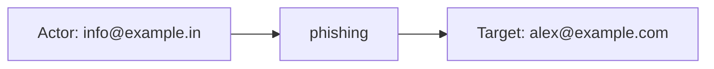
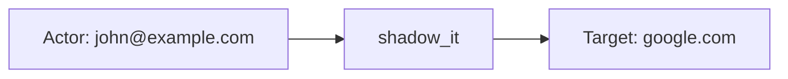
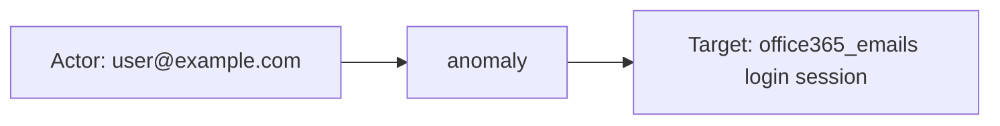

# checkpoint_email

## Product Domain

Check Point Harmony Email & Collaboration (formerly Avanan) is a cloud-native email and collaboration security platform that protects SaaS workloads rather than sitting inline in the SMTP path. It monitors email, file sharing, and messaging across Microsoft 365 (Exchange, OneDrive, SharePoint, Teams), Google Workspace (Gmail, Drive), Dropbox, Box, Citrix ShareFile, and Slack. The service scans messages, attachments, links, and shared files for malware, phishing, spam, data loss, account anomalies, and shadow IT usage, then applies remediation such as quarantine, blocking, or alerting before threats reach users.

The platform is part of Check Point's Harmony suite and is managed through the Infinity Portal, with regional Cloudinfra API gateways for programmatic access. Security events are generated when detections fire across connected SaaS tenants—covering threat types such as malware, phishing, spam, DLP violations, malicious URLs, login anomalies, and unauthorized application use. Analysts triage events in the Harmony portal, where each alert includes severity, confidence, workflow state, and links back to the affected SaaS entity.

From a security operations perspective, Harmony Email & Collaboration provides a centralized view of email-borne and collaboration-app threats across cloud mailboxes and adjacent productivity tools. Because many organizations have moved off traditional on-premises gateways, this API-driven telemetry complements gateway logs by capturing post-delivery inspection, SaaS-native DLP, and cross-application abuse that only a cloud CASB/SASE-style email security layer can observe.

## Data Collected (brief)

This integration collects **event** logs (`checkpoint_email.event`) from the Harmony Email & Collaboration Smart API via Elastic Agent CEL input with OAuth (Client ID/Secret from the Infinity Portal). A single data stream polls the `query_event` endpoint on a configurable interval and maps JSON security alerts into ECS.

Events include threat and policy metadata: event type (e.g., malware, phishing, spam, DLP, anomaly, shadow IT, malicious URL), severity and confidence indicator, workflow state, SaaS source (`google_mail`, `office365_emails`, etc.), sender/recipient addresses, email subject, scan type, entity IDs and portal links, customer/organization ID, description and raw entity data, performed actions, and available analyst actions (dismiss, severity change). Fields are normalized to ECS categories (`email`, `threat`, `malware` where applicable) with `event.kind: alert`, plus `observer.vendor`/`observer.product` for Check Point Harmony Email & Collaboration.

## Expected Audit Log Entities

Harmony Email & Collaboration emits **security detection alerts** across connected SaaS tenants — not traditional admin audit logs (no portal login, config change, or IAM action stream). A single **`event`** data stream (`checkpoint_email.event`) polls the Smart API `query_event` endpoint. Events are audit-adjacent: threat detections (phishing, spam, malware, malicious URL), DLP violations, login/geo anomalies, shadow IT, and user-reported phishing. The pipeline (`packages/checkpoint_email/data_stream/event/elasticsearch/ingest_pipeline/default.yml`) groks embedded JSON entities from `checkpoint_email.event.data` for email-threat, user-reported, and geo-anomaly patterns; other principals remain in the unresolved `data` string. **No ECS `user.target.*`, `host.target.*`, `service.target.*`, or `entity.target.*` fields are populated** (`dev/target-fields-audit/out/target_fields_audit.csv` — no rows for this package). The target-fields audit classifies this package as **`strong_candidate`** with **`pipeline_dest_identity=true`**, **`pipeline_actor=true`**, and **`fixture_strong=true`** (`dev/target-fields-audit/out/target_enhancement_packages.csv`). **`destination.user.*`** is listed in **`destination_identity_hits.csv`** (lines 261, 267, 269 of `default.yml`). **`event.action` is absent in all fixtures** (`sample_event.json`, `test-event.log-expected.json`); the pipeline never sets it — vendor detection type (`checkpoint_email.event.type`) and remediation actions (`checkpoint_email.event.actions.action_type`) retain the operation semantics in vendor fields only. Evidence: `packages/checkpoint_email/data_stream/event/sample_event.json`, `data_stream/event/_dev/test/pipeline/test-event.log-expected.json`, and `data_stream/event/fields/fields.yml`.

### Event action (semantic)

What operation or activity does the stream record?

| Action (normalized label) | Classification | Confidence | Evidence | Per-stream notes |
| --- | --- | --- | --- | --- |
| `phishing`, `spam`, `malware`, `malicious_url`, `suspicious_phishing` | detection | high | `checkpoint_email.event.type` ← API `json.type` (`default.yml:450–452`); fixtures: `phishing`, `spam`, `malware`, `malicious_url`, `suspicious_phishing` in `test-event.log-expected.json` | Primary **detection category** — what threat class was identified |
| `dlp` | detection / data_access | high | `checkpoint_email.event.type: dlp`; DLP fixtures (`Resume` subject, PII leak descriptions) | Data-loss policy violation detected |
| `anomaly` | detection | high | `checkpoint_email.event.type: anomaly`; geo-suspicious login fixtures (Google `sunny@example.io`, O365 `user@example.com`) | Login/geo behavioral anomaly — not an admin operation |
| `shadow_it` | detection | high | `checkpoint_email.event.type: shadow_it`; `sample_event.json`, shadow IT fixtures (`john@example.com` using `google.com`) | Unauthorized SaaS application usage detected |
| `alert` | detection | high | `checkpoint_email.event.type: alert`; user-reported phishing fixture (`user@example.com` reported message) | End-user reported phishing — detection trigger |
| `logged in` | authentication | high | `checkpoint_email.event.user.action` ← grok `_temp.user_action.label` (`default.yml:319–321`); O365 geo fixture `ae5ce6faee2541898877dec2779ebc42` | **`anomaly`** (O365 geo only) — SaaS login verb embedded in `data`, not in `event.action` |
| `login_success` (embedded) | authentication | medium | Embedded `google_event_login` label `performed activity (login_success)` in `data`; Google geo-suspicious fixtures | **`anomaly`** (Google geo) — login activity in vendor `data` only; no ECS action field |
| `quarantine_email`, `restore_email`, `move_to_spam`, `google_mail_email_change_subject`, `office365_emails_decline_report_phishing` | remediation | high | `checkpoint_email.event.actions[].action_type` ← API `actions[].actionType` (`default.yml:101–144`); fixtures: quarantined shadow_it, phishing subject change, spam header action, user-reported decline | **Remediation performed** on the SaaS entity — distinct from detection type; multi-valued array |
| `dismiss`, `severityChange` | administration | medium | `checkpoint_email.event.available_event_actions[].action_name` ← API `availableEventActions[].actionName` (`default.yml:151–172`); DLP fixture with four severity-change options | Analyst workflow actions **available** for the alert — not yet performed |
| `avanan_ap_scan`, `clicktime_protection_scan`, `ms_defender_scan` | detection | medium | `checkpoint_email.event.scan_type` ← grok `_temp.scan_information.entity_type` (`default.yml:218–220`); phishing/spam/malicious_url/suspicious_phishing fixtures | Which inline scan engine triggered — sub-action detail for email-threat events |

Detection alerts name the **threat category** (`type`) as the primary semantic action. Remediation verbs (`actions.action_type`) and analyst options (`available_event_actions.action_name`) are secondary action layers on the same alert document.

### Event action (ECS candidates)

| ECS / vendor field | Mapped to `event.action` today? | Mapping correct? | Recommended `event.action` value (from fixtures) | Enhancement candidate? | Evidence |
| --- | --- | --- | --- | --- | --- |
| `checkpoint_email.event.type` ← `json.type` | **no** | n/a | `phishing`, `spam`, `malware`, `dlp`, `anomaly`, `shadow_it`, `malicious_url`, `alert`, `suspicious_phishing` | **yes** | `default.yml:450–452` rename only; all fixtures populate vendor `type`; never copied to `event.action` |
| `checkpoint_email.event.scan_type` | **no** | n/a | `avanan_ap_scan`, `clicktime_protection_scan`, `ms_defender_scan` | partial | `default.yml:218–220`; email-threat sub-detail — use as secondary field or composite with `type` |
| `checkpoint_email.event.user.action` | **no** | n/a | `logged in` | **yes** | `default.yml:319–321`; O365 geo anomaly fixture only — SaaS login verb |
| `checkpoint_email.event.actions[].action_type` | **no** | n/a | `quarantine_email`, `restore_email`, `move_to_spam`, `google_mail_email_change_subject`, `office365_emails_decline_report_phishing` | partial | `default.yml:101–144`; remediation array — consider `event.action` for primary detection type and retain these under vendor or `event.action` array for remediation |
| `checkpoint_email.event.available_event_actions[].action_name` | **no** | n/a | `dismiss`, `severityChange` | no | `default.yml:151–172`; workflow options, not performed action |
| Embedded `google_event_login` label in `data` | **no** | n/a | `login_success` (normalize from `performed activity (login_success)`) | **yes** | Google geo-suspicious fixtures; vendor-only — grok does not promote to ECS |
| `event.type` (ECS) | yes (partial substitute) | **no** | `[info]`, `[indicator]` | no | `default.yml:81–92` static append — ECS event **shape**, not security operation; do not substitute for `event.action` |
| `event.category` | yes (partial substitute) | partial | `email`, `threat`, `malware` | no | Category enrichment from `json.type`; complements but does not replace action verb |
| `checkpoint_email.event.confidence_indicator` | **no** | n/a | — | no | Detection confidence (`detected`, `malicious`, `alert`) — metadata, not action |

**Per-stream action check (Step 2b):**

| Stream | `event.action` in fixtures? | Pipeline maps to `event.action`? | Primary action candidate | Confidence | Evidence |
| --- | --- | --- | --- | --- | --- |
| `event` | **no** | **no** | `checkpoint_email.event.type` | high | `sample_event.json`, all `test-event.log-expected.json` documents; `default.yml` has no `event.action` set/rename |

### Actor (semantic)

| Entity | Classification | Entity type (if general) | Confidence | Evidence | Per-stream notes |
| --- | --- | --- | --- | --- | --- |
| Email sender | user | — | high | `source.user.email` / `.name` / `.domain` ← API `senderAddress` → `checkpoint_email.event.sender_address` (dissect); mirrored to `email.sender.address` and `related.user`. Fixtures: phishing (`info@example.in`), spam (`support@example.in`), DLP leaker (`alice@example.io`, `sandy@example.io`), malicious_url (`info@example.com`), M365 malware (`external@example.com`) in `test-event.log-expected.json`. | Email-borne threat and DLP events when `senderAddress` is populated |
| Geo/login anomaly subject | user | — | high | `user.email` / `.name` / `.domain` ← grok `_temp.user_address` on `data` → `checkpoint_email.event.user.address` → `user.email` (dissect). Fixture: `ae5ce6faee2541898877dec2779ebc42` (`user@example.com` logged in from New Zealand, `type=anomaly`). | **`anomaly`** — O365 geo pattern only; Google geo-suspicious login (`sunny@example.io`) stays vendor-only in `data` |
| User-reported phishing reporter | user | — | high | Reporter identity embedded in `data` as `office365_emails_user` / `google_user` label; grok maps reporter to `_temp.destination_user` → **`destination.user.*`** (see mapping note — semantically actor, not target). Fixture: user-reported alert (`user@example.com`, `type=alert`, `event.id=45abcdef012345678998765432100abd`). | **`alert`** — reporter is the human actor; ECS actor fields not populated |
| SaaS mailbox user (unparsed) | user | — | medium | Embedded `google_user` / `office365_emails_user` in `checkpoint_email.event.data` for shadow IT, Google geo-suspicious login, and some DLP events — not promoted to ECS `user.*` or `source.user.*`. Fixtures: shadow_it (`john@example.com` in `sample_event.json`), geo-suspicious login (`sunny@example.io`). | **`shadow_it`**, **`anomaly`** (Google), DLP without grok match |
| System alert sender | service | — | high | `source.user.email` from API `senderAddress` when value is a platform noreply address (e.g. `google-workspace-alerts-noreply@google.com`). Fixtures: shadow_it events in `test-event.log-expected.json` and `sample_event.json`. | Not a human actor — automated SaaS notification envelope |
| Detection platform | service | — | high | `observer.vendor` / `observer.product` statically set (`Check Point`, `Harmony Email & Collaboration`). All fixtures. | Observer identity — enforcing CASB/email-security service, not the caller |

### Actor (ECS candidates)

| ECS / vendor field | Role | Mapped today? | Mapping correct? | Confidence | Evidence |
| --- | --- | --- | --- | --- | --- |
| `source.user.email`, `source.user.name`, `source.user.domain` | Email sender / leaker | yes | yes | high | ← `json.senderAddress` rename → dissect (`default.yml:385–400`); phishing/spam/DLP/malicious_url fixtures |
| `user.email`, `user.name`, `user.domain` | Geo/login anomaly subject | yes | yes | high | ← grok `_temp.user_address` on `data` → `checkpoint_email.event.user.address` → `user.email` (`default.yml:278–303`); O365 geo fixture `ae5ce6faee2541898877dec2779ebc42` |
| `email.sender.address` | Sender mailbox (email field set) | yes | yes | high | Copy from `checkpoint_email.event.sender_address` (`default.yml:401–405`) |
| `related.user` | Actor/target cross-reference | yes | partial | high | Appends sender, destination, and geo-anomaly user (`default.yml:272–277`, `304–309`, `406–411`); does not distinguish actor vs target roles |
| `checkpoint_email.event.sender_address` | Vendor sender copy | yes (vendor) | n/a | high | Retained when `preserve_duplicate_custom_fields` tag set; removed otherwise |
| `checkpoint_email.event.user.address`, `.action`, `.country` | Geo-anomaly user context | yes (vendor) | n/a | high | From grok on `data` (`default.yml:286–322`); O365 geo fixture |
| `checkpoint_email.event.data` (embedded `google_user`, `office365_emails_user`) | Unparsed SaaS user identity | yes (vendor) | n/a | medium | Canonical actor for shadow IT and Google geo events; only in unresolved `data` string |
| `checkpoint_email.event.saas` | Connected SaaS platform name | yes (vendor) | n/a | high | ← `json.saas` (`default.yml:379–383`); `google_mail`, `office365_emails` — scope/platform context, not actor |
| `organization.name` | Customer tenant scope | yes | n/a | high | ← `json.customerId` (`default.yml:179–188`); tenant context, not actor |
| `observer.vendor`, `observer.product` | Detection platform | yes | yes | high | Static set (`default.yml:93–100`); observer, not human actor |

### Target (semantic)

| Layer | Description | Entity | Classification | Entity type (if general) | Confidence | Evidence | Per-stream notes |
| --- | --- | --- | --- | --- | --- | --- | --- |
| 1 — Platform / cloud service | Connected SaaS workload under protection | Google Mail, Microsoft 365 Email, etc. | service | — | high | `checkpoint_email.event.saas` ← API `saas` (`google_mail`, `office365_emails`). All fixtures; `sample_event.json`. | Identifies which protected tenant/workload produced the alert |
| 2 — Resource / object | Mailbox owner / recipient | SaaS mailbox user | user | — | high | `destination.user.email` / `.name` / `.domain` ← grok `_temp.destination_user` ("X's mailbox") → `checkpoint_email.event.destination_address` (`default.yml:248–271`). Fixtures: phishing (`alex@example.com`), spam, malicious_url (`boss@example.io`), M365 malware, suspicious_phishing. | Primary de-facto user target for email-threat events |
| 2 — Resource / object | SaaS entity under inspection | Message, login session, scan artifact | general | saas_entity | high | `checkpoint_email.event.entity_id`, `event.id` ← API `entityId` / `eventId`. All fixtures. | Primary correlation ID for portal link (`event.url` ← `entity_link`) |
| 2 — Resource / object | Login / management event (anomaly) | SaaS login session | general | login_session | medium | Embedded `google_event_login`, `office365_mgmnt_event` in `data`; referenced by `entity_id` but not ECS-mapped. Fixtures: Google geo-suspicious login, O365 geo anomaly. | Layer 2 target for **`anomaly`** events |
| 2 — Resource / object | Shadow IT application / domain | External app or DNS target | general | saas_application | medium | Embedded `av_dns_info` in `data` (e.g. `google.com (Search Engine)`). Fixture: shadow_it in `sample_event.json`. | Layer 2 target for **`shadow_it`**; SaaS user is actor, external app is acted-upon resource |
| 2 — Resource / object | Customer organization | Harmony customer tenant | general | organization | high | `organization.name` ← `customerId`. All fixtures. | Tenant scope — context, not granular target |
| 3 — Content / artifact | Email message subject | Email message | general | email_message | high | `email.subject`, `checkpoint_email.event.email_subject` ← grok `_temp.email_subject.label` on `data`. Fixtures: phishing (`Support: Link`), spam, DLP (`Resume`), M365 malware (`Cogito, ergo sum`). | Message content identity; supplements Layer 2 entity |
| 3 — Content / artifact | Detection scan engine | Inline scan module | general | scan_engine | medium | `checkpoint_email.event.scan_type` ← embedded scan entity `entity_type` (`avanan_ap_scan`, `clicktime_protection_scan`, `ms_defender_scan`). Fixtures: phishing, spam, malicious_url, suspicious_phishing. | Which Harmony/Avanan engine triggered |
| 3 — Content / artifact | Remediation / analyst actions | Quarantine, dismiss, severity change | general | remediation_action | medium | `checkpoint_email.event.actions`, `.available_event_actions` with `action_type`, `related_entity_id`. Fixtures: quarantined shadow_it, phishing with subject change, spam with header action. | Actions performed on or available for the Layer 2 entity |

### Target (ECS candidates)

| ECS / vendor field | Layer | Classification | Mapped today? | Mapping correct? | ECS target bucket | Enhancement candidate? | Evidence |
| --- | --- | --- | --- | --- | --- | --- | --- |
| `destination.user.email`, `.name`, `.domain` | 2 | user | yes | partial | `user.target.email` / `.name` | **yes** | ← grok `_temp.destination_user.label` on `data` ("X's mailbox") → `checkpoint_email.event.destination_address` → `destination.user.email` + dissect (`default.yml:241–271`); also `email.to.address`, `related.user`. **De-facto target** for email-threat events. **Listed in `destination_identity_hits.csv`**. Fixtures: phishing, spam, malicious_url, M365 malware |
| `destination.user.*` (user-reported phishing) | 2 | user | yes | **no** | `user.email` (actor) | yes | Grok pattern `^User #... reported a phishing email` maps **reporter** to `_temp.destination_user` → `destination.user.*` (`default.yml:202`, `248–271`). Fixture: `type=alert`, reporter `user@example.com` — semantically **actor**, not mailbox target; actor/target conflation |
| `email.to.address` | 2 | user | yes | yes | `user.target.email` | yes | Append from `checkpoint_email.event.destination_address` (`default.yml:254–259`); parallel recipient identity to `destination.user.email` |
| `email.subject`, `checkpoint_email.event.email_subject` | 3 | general (email_message) | yes | yes | context | no | ← grok `_temp.email_subject.label` (`default.yml:222–239`); message artifact |
| `checkpoint_email.event.entity_id`, `event.id` | 2 | general (saas_entity) | yes | yes | `entity.target.id` | yes | ← API `entityId` / `eventId` (`default.yml:333–378`); primary SaaS object ID |
| `checkpoint_email.event.saas` | 1 | service | yes (vendor) | n/a | `cloud.service.name` / `service.target.name` | yes | ← API `saas` (`default.yml:379–383`); protected SaaS platform — no `cloud.service.name` mapping today |
| `checkpoint_email.event.scan_type` | 3 | general (scan_engine) | yes (vendor) | n/a | `service.target.name` | yes | ← embedded scan entity `entity_type` (`default.yml:217–221`); detection engine invoked |
| `checkpoint_email.event.data` (embedded entities) | 2–3 | general (varies) | yes (vendor) | n/a | `entity.target.*` / `user.target.*` | yes | Unparsed targets: `google_mail_email` / `office365_emails_email` (messages), `google_event_login` / `office365_mgmnt_event` (sessions), `av_dns_info` (shadow IT), `avanan_dlp` (DLP engine). Only email-threat/geo patterns grok-parsed |
| `checkpoint_email.event.actions`, `.available_event_actions` | 3 | general (remediation_action) | yes (vendor) | n/a | context | no | Performed/available analyst actions tied to `related_entity_id` |
| `organization.name` | — | general (organization) | yes | n/a | context-only | no | Customer tenant scope; not granular target |
| `event.url` | 2 | general (portal_link) | yes | yes | context | no | ← `checkpoint_email.event.entity_link`; portal deep link to inspected entity |
| `user.email` (geo anomaly) | 2 | user | yes | partial | `user.target.email` | yes | O365 geo anomaly: affected user who logged in (`default.yml:278–303`). Semantically the **subject of the anomaly** (target) but stored in actor field set `user.*` — actor/target field-set tension |
| `observer.vendor`, `observer.product` | 1 | service | yes | n/a | context-only | no | Detection platform identity; observer, not acted-upon target |

### Gaps and mapping notes

- **`event.action` gap:** Vendor `json.type` → `checkpoint_email.event.type` names the detection operation (`phishing`, `dlp`, `anomaly`, …) but is never copied to ECS `event.action`. **Primary enhancement:** map `checkpoint_email.event.type` → `event.action` for all alert events. For O365 geo anomalies, also consider `checkpoint_email.event.user.action` (`logged in`) as a secondary or stream-specific action. Remediation verbs in `checkpoint_email.event.actions.action_type` are a separate action layer — do not conflate with detection type.
- **No official ECS target fields:** Aligns with `target_enhancement_packages.csv` (`strong_candidate`, all ECS target tiers false). Primary enhancement path: promote de-facto targets to `user.target.*` and `entity.target.id`.
- **`destination.user.*` is the primary de-facto user target** for email-threat events — grok extracts the mailbox owner from "X's mailbox" text in `data`, not from network flow semantics. **Listed in `destination_identity_hits.csv`**. Mapping is **correct** for phishing, spam, malware, malicious_url, and M365 attachment events. **`Enhancement candidate: yes`** → migrate to `user.target.email` / `.name` / `.domain`.
- **User-reported phishing conflates actor and target:** Grok pattern for `^User #... reported a phishing email` places the **reporter** in `_temp.destination_user` → `destination.user.*` (`default.yml:202`). The reporter is semantically the **actor**; the reported message (`email.subject`, `entity_id`) is the target. **`Mapping correct? no`** for `destination.user.*` on `type=alert` events. Consider routing reporter to `user.*` / `source.user.*` and leaving `destination.user.*` empty or mapping a distinct recipient if available.
- **`user.email` on geo anomaly holds target semantics in actor field set:** O365 geo pattern maps the affected login user to `user.*` (`default.yml:292–303`), not `user.target.*` or `destination.user.*`. The user is the **subject of the detection** (Layer 2 target), not the initiator — partial actor/target conflation.
- **Google geo-suspicious and shadow IT actors remain vendor-only:** `sunny@example.io` (Google geo login) and `john@example.com` (shadow IT) appear only in `checkpoint_email.event.data` embedded `google_user` entities — no ECS `user.*` promotion despite being the human subject of the alert.
- **DLP events often lack parsed recipient:** When `data` is empty or does not match grok patterns, leaker may appear only in `description`/`message` and sender in `source.user.*` (`alice@example.io`, `sandy@example.io` fixtures); `destination.user.*` not populated.
- **`related.user` aggregates actor and target identities** (sender, recipient, geo user) without role distinction — useful for correlation but not for actor/target analytics.
- **`checkpoint_email.event.saas` identifies Layer 1 protected platform** (`google_mail`, `office365_emails`) but is not mapped to `cloud.service.name` — enhancement candidate for SaaS target service identity.
- **Vendor-only target identity in `checkpoint_email.event.data`:** Login sessions (`google_event_login`, `office365_mgmnt_event`), shadow IT domains (`av_dns_info`), and DLP engine references (`avanan_dlp`) are best sources for future `entity.target.*` / `service.target.*` migration.
- **Alignment with target-fields audit:** `strong_candidate` with `pipeline_dest_identity=true` and `pipeline_actor=true` matches evidence — rich sender/recipient identity via `source.user.*` and `destination.user.*`, zero official `*.target.*` fields, strong fixture coverage for de-facto targets.

### Per-stream notes

- **`checkpoint_email.event`:** Single stream; all event types share one pipeline. Email-borne threats (`phishing`, `spam`, `malware`, `malicious_url`, `suspicious_phishing`) consistently populate `source.user.*` (sender) and `destination.user.*` (mailbox owner) when grok matches; **`checkpoint_email.event.type`** holds the detection action (`phishing`, `spam`, …) but **`event.action` is empty**. **`anomaly`** splits: O365 geo → `user.*` + `checkpoint_email.event.user.action: logged in`; Google geo-suspicious → vendor-only in `data` with embedded `login_success`. **`shadow_it`** → external app in `data`, SaaS user vendor-only, system noreply as `source.user.*`. **`dlp`** → sender often mapped; recipient/subject parsing depends on `data` content. **`alert`** (user-reported) → reporter wrongly in `destination.user.*`. Remediation history in `checkpoint_email.event.actions` (e.g. `quarantine_email`) when state is `remediated`. No metrics or inventory streams — all events are detection alerts with `event.kind: alert`.

## Example Event Graph

All examples come from the single **`checkpoint_email.event`** stream (`packages/checkpoint_email/data_stream/event/`). These are **audit-adjacent security detection alerts** — threat, DLP, anomaly, and shadow-IT findings from the Harmony Smart API, not admin audit logs. **`event.action` is absent in all fixtures**; detection category is read from `checkpoint_email.event.type`.

### Example 1: Phishing email to mailbox

**Stream:** `checkpoint_email.event` · **Fixture:** `packages/checkpoint_email/data_stream/event/_dev/test/pipeline/test-event.log-expected.json` (event `abaabcdef01234567894115b9e64da71`)

```
info@example.in → phishing → alex@example.com (mailbox)
```

#### Actor

| Field | Value |
| --- | --- |
| id | info@example.in |
| name | info |
| type | user |

**Field sources:**

- `id` ← `source.user.email` ← `checkpoint_email.event.sender_address`
- `name` ← `source.user.name` (dissect from sender address)

#### Event action

| Field | Value |
| --- | --- |
| action | phishing |
| source_field | `checkpoint_email.event.type` |
| source_value | `phishing` |

**Not mapped to ECS `event.action` today** — vendor detection type only.

#### Target

| Field | Value |
| --- | --- |
| id | alex@example.com |
| name | alex |
| type | user |
| sub_type | email_recipient |

**Field sources:**

- `id` ← `destination.user.email` ← grok `_temp.destination_user` on `checkpoint_email.event.data` ("alex@example.com's mailbox")
- `name` ← `destination.user.name`

#### Mermaid



### Example 2: Shadow IT — unauthorized SaaS app

**Stream:** `checkpoint_email.event` · **Fixture:** `packages/checkpoint_email/data_stream/event/sample_event.json`

```
john@example.com → shadow_it → google.com (Search Engine)
```

#### Actor

| Field | Value |
| --- | --- |
| id | john@example.com |
| name | john@example.com |
| type | user |

**Field sources:**

- `id`, `name` ← embedded `google_user` label in `checkpoint_email.event.data` — **not promoted to ECS `user.*` or `source.user.*`**; `source.user.*` holds the automated noreply envelope (`google-workspace-alerts-noreply@google.com`), not the human subject.

#### Event action

| Field | Value |
| --- | --- |
| action | shadow_it |
| source_field | `checkpoint_email.event.type` |
| source_value | `shadow_it` |

**Not mapped to ECS `event.action` today.**

#### Target

| Field | Value |
| --- | --- |
| id | google.com |
| name | google.com (Search Engine) |
| type | general |
| sub_type | saas_application |

**Field sources:**

- `id`, `name` ← embedded `av_dns_info` label in `checkpoint_email.event.data`

#### Mermaid



### Example 3: O365 geo-login anomaly

**Stream:** `checkpoint_email.event` · **Fixture:** `packages/checkpoint_email/data_stream/event/_dev/test/pipeline/test-event.log-expected.json` (event `ae5ce6faee2541898877dec2779ebc42`)

```
user@example.com → anomaly → login session (office365_emails)
```

#### Actor

| Field | Value |
| --- | --- |
| id | user@example.com |
| name | user |
| type | user |
| geo | New Zealand |

**Field sources:**

- `id` ← `user.email` ← grok `_temp.user_address` on `checkpoint_email.event.data` → `checkpoint_email.event.user.address`
- `name` ← `user.name`
- `geo` ← `checkpoint_email.event.user.country`

The affected user is also the **subject of the detection** (Layer 2 target semantics) but is stored in the actor field set `user.*`, not `destination.user.*` or `user.target.*`.

#### Event action

| Field | Value |
| --- | --- |
| action | anomaly |
| source_field | `checkpoint_email.event.type` |
| source_value | `anomaly` |

**Not mapped to ECS `event.action` today.** Embedded login verb `logged in` is available in `checkpoint_email.event.user.action` but is not the primary detection category.

#### Target

| Field | Value |
| --- | --- |
| id | 61a845f1-ec40-4097-93d5-b482dc50820c |
| name | office365_emails |
| type | service |

**Field sources:**

- `id` ← `checkpoint_email.event.entity_id` (SaaS login/management event)
- `name` ← `checkpoint_email.event.saas`

#### Mermaid



## ES|QL Entity Extraction

**Package type: agent-backed** (policy template `checkpoint_email`, single `data_stream/event` with Tier A fixtures and ingest pipeline). Query-time extraction routes on **`data_stream.dataset == "checkpoint_email.event"`**; secondary discriminator **`checkpoint_email.event.type`** guards actor/target conflation (user-reported `alert`, geo `anomaly`). Pass 4 is **fill-gaps-only**: detection flags run first; mapped columns use **column-level** `CASE(<col> IS NOT NULL, <col>, …)` — not `CASE(actor_exists|target_exists|action_exists, <col>, …)` — so `source.user.email` setting `actor_exists` does not block `user.email` fallbacks when `user.email` is empty (Pass 4 §10). Email-threat events promote **`destination.user.*`** (de-facto mailbox owner) to **`user.target.*`** when `type` is not `alert`. Ingest does not populate ECS `*.target.*` or `event.action` today.

### Dataset inventory

| data_stream.dataset | Stream role | Actor classification(s) | Target classification(s) | Extraction |
| --- | --- | --- | --- | --- |
| `checkpoint_email.event` | Detection alerts (all `checkpoint_email.event.type` values) | user / service (noreply envelope) | user (mailbox), service (geo), general (entity/message) | partial — type-guarded |

### Field mapping plan

#### Actor mappings

| Output column | Source field(s) | Condition (dataset + optional) | Confidence | Notes |
| --- | --- | --- | --- | --- |
| `user.email` | `user.email` | `… AND checkpoint_email.event.type == "anomaly"` | high | **ingest-only — no ES\|QL** — O365 geo (`default.yml:292–296`); preserve via `actor_exists` only |
| `user.email` | `source.user.email` | `… AND checkpoint_email.event.type IN ("phishing", "spam", "malware", "malicious_url", "suspicious_phishing", "dlp")` | high | **vendor fallback** — sender/leaker at ingest |
| `user.email` | `destination.user.email` | `… AND checkpoint_email.event.type == "alert"` | medium | **de-facto destination.*** — reporter wrongly in `destination.user.*`; promote to actor only when `user.email` / `source.user.email` empty |
| `user.name` | `user.name` | `… AND checkpoint_email.event.type == "anomaly"` | high | **ingest-only — no ES\|QL** — dissect from `user.email` at ingest; preserve via `actor_exists` only |
| `user.name` | `source.user.name` | `… AND checkpoint_email.event.type IN ("phishing", "spam", "malware", "malicious_url", "suspicious_phishing", "dlp")` | high | **vendor fallback** |
| `user.name` | `destination.user.name` | `… AND checkpoint_email.event.type == "alert"` | medium | reporter display name |
| `user.domain` | `user.domain` | `… AND checkpoint_email.event.type == "anomaly"` | high | **ingest-only — no ES\|QL** — dissect from `user.email` at ingest; preserve via `actor_exists` only |
| `user.domain` | `source.user.domain` | `… AND checkpoint_email.event.type IN ("phishing", "spam", "malware", "malicious_url", "suspicious_phishing", "dlp")` | high | **vendor fallback** |
| `user.domain` | `destination.user.domain` | `… AND checkpoint_email.event.type == "alert"` | medium | reporter domain |

#### Target mappings

| Output column | Source field(s) | Condition (dataset + optional) | Confidence | Notes |
| --- | --- | --- | --- | --- |
| `user.target.email` | `destination.user.email` | `… AND checkpoint_email.event.type IN ("phishing", "spam", "malware", "malicious_url", "suspicious_phishing") AND checkpoint_email.event.type != "alert"` | high | **de-facto destination.*** — mailbox owner; excludes user-reported `alert` |
| `user.target.name` | `destination.user.name` | same | high | **de-facto destination.*** |
| `user.target.domain` | `destination.user.domain` | same | high | **de-facto destination.*** |
| `entity.target.id` | `checkpoint_email.event.entity_id` | `… AND checkpoint_email.event.entity_id IS NOT NULL` | high | **vendor fallback** — SaaS entity / portal correlation |
| `entity.target.name` | `email.subject` | `… AND email.subject IS NOT NULL` | high | **vendor fallback** — message artifact (Pass 3 Layer 3) |
| `entity.target.type` | literals | email-threat types → `"user"`; `anomaly` → `"service"`; `shadow_it` → `"general"` | medium | **semantic literal** in fallback only |
| `entity.target.sub_type` | `"email_recipient"` | email-threat types with `destination.user.email` | high | **semantic literal** — Pass 3 mailbox target |
| `service.target.name` | `checkpoint_email.event.saas` | `… AND checkpoint_email.event.type == "anomaly"` | high | **vendor fallback** — protected SaaS on geo alerts (Pass 3 example 3) |

**Omitted (Gaps):** `user.target.*` for `type=alert` (reporter conflation); `user.target.*` for `anomaly` (affected user stays in `user.*` per ingest); `service.target.name` on email-threat rows (Pass 3 user mailbox target); shadow IT / Google geo actors (vendor-only in `data`).

### Detection flags (mandatory — run first)

```esql
| EVAL
  actor_exists = user.email IS NOT NULL OR user.name IS NOT NULL OR user.domain IS NOT NULL
    OR source.user.email IS NOT NULL OR source.user.name IS NOT NULL
    OR service.id IS NOT NULL OR service.name IS NOT NULL
    OR entity.id IS NOT NULL OR entity.name IS NOT NULL,
  target_exists = user.target.id IS NOT NULL OR user.target.name IS NOT NULL OR user.target.email IS NOT NULL
    OR host.target.id IS NOT NULL OR host.target.ip IS NOT NULL OR host.target.name IS NOT NULL
    OR service.target.id IS NOT NULL OR service.target.name IS NOT NULL
    OR entity.target.id IS NOT NULL OR entity.target.name IS NOT NULL OR entity.target.type IS NOT NULL,
  action_exists = event.action IS NOT NULL
```

**Semantics:** `actor_exists` includes **`source.user.*`** because email-threat senders are indexed there, not under `user.*`. No ECS `*.target.*` at ingest — `target_exists` is false on Tier A fixtures; de-facto `destination.user.*` → `user.target.*` applies in fallback branches only. Actor/target/action `EVAL` blocks use **column-level** preserve — not `CASE(actor_exists, user.email, …)` / `CASE(target_exists, user.target.email, …)` / `CASE(action_exists, event.action, …)`.

**ES|QL `CASE` arity:** Arguments are **(condition, value)** pairs; odd count → last arg is default. Wrong: `CASE(user.email IS NOT NULL, user.email, source.user.email, null)` (4 args — `source.user.email` is a **condition**). Wrong: `CASE(actor_exists, user.email, …, source.user.email, null)` — when `actor_exists` is true from `source.user.email` but `user.email` is empty, preserve returns null. Right: **5-arg** / **7-arg** `CASE(user.email IS NOT NULL, user.email, data_stream.dataset == "checkpoint_email.event" AND … AND source.user.email IS NOT NULL, source.user.email, null)`. `actor_exists` / `target_exists` / `action_exists` are helpers only — not first `CASE` branches on mapped columns.

### Optional classification helpers (when needed)

`entity.target.type` and `entity.target.sub_type` are set in the **target** `EVAL` fallback branch only (never `target.entity.type`).

### Combined ES|QL — actor fields

```esql
| EVAL
  user.email = CASE(
    user.email IS NOT NULL, user.email,
    data_stream.dataset == "checkpoint_email.event" AND checkpoint_email.event.type IN ("phishing", "spam", "malware", "malicious_url", "suspicious_phishing", "dlp") AND source.user.email IS NOT NULL, source.user.email,
    data_stream.dataset == "checkpoint_email.event" AND checkpoint_email.event.type == "alert" AND destination.user.email IS NOT NULL, destination.user.email,
    null
  ),
  user.name = CASE(
    user.name IS NOT NULL, user.name,
    data_stream.dataset == "checkpoint_email.event" AND checkpoint_email.event.type IN ("phishing", "spam", "malware", "malicious_url", "suspicious_phishing", "dlp") AND source.user.name IS NOT NULL, source.user.name,
    data_stream.dataset == "checkpoint_email.event" AND checkpoint_email.event.type == "alert" AND destination.user.name IS NOT NULL, destination.user.name,
    null
  ),
  user.domain = CASE(
    user.domain IS NOT NULL, user.domain,
    data_stream.dataset == "checkpoint_email.event" AND checkpoint_email.event.type IN ("phishing", "spam", "malware", "malicious_url", "suspicious_phishing", "dlp") AND source.user.domain IS NOT NULL, source.user.domain,
    data_stream.dataset == "checkpoint_email.event" AND checkpoint_email.event.type == "alert" AND destination.user.domain IS NOT NULL, destination.user.domain,
    null
  )
```

### Combined ES|QL — event action

`event.action` is absent in all Tier A fixtures; fallback maps vendor detection category.

```esql
| EVAL
  event.action = CASE(
    event.action IS NOT NULL, event.action,
    data_stream.dataset == "checkpoint_email.event" AND checkpoint_email.event.type IS NOT NULL, checkpoint_email.event.type,
    null
  )
```

Remediation verbs in `checkpoint_email.event.actions.action_type` remain a separate layer (Pass 2) — not wired here to avoid overriding detection `type`.

### Combined ES|QL — target fields

```esql
| EVAL
  user.target.email = CASE(
    user.target.email IS NOT NULL, user.target.email,
    data_stream.dataset == "checkpoint_email.event" AND checkpoint_email.event.type IN ("phishing", "spam", "malware", "malicious_url", "suspicious_phishing") AND checkpoint_email.event.type != "alert" AND destination.user.email IS NOT NULL, destination.user.email,
    null
  ),
  user.target.name = CASE(
    user.target.name IS NOT NULL, user.target.name,
    data_stream.dataset == "checkpoint_email.event" AND checkpoint_email.event.type IN ("phishing", "spam", "malware", "malicious_url", "suspicious_phishing") AND checkpoint_email.event.type != "alert" AND destination.user.name IS NOT NULL, destination.user.name,
    null
  ),
  user.target.domain = CASE(
    user.target.domain IS NOT NULL, user.target.domain,
    data_stream.dataset == "checkpoint_email.event" AND checkpoint_email.event.type IN ("phishing", "spam", "malware", "malicious_url", "suspicious_phishing") AND checkpoint_email.event.type != "alert" AND destination.user.domain IS NOT NULL, destination.user.domain,
    null
  ),
  entity.target.id = CASE(
    entity.target.id IS NOT NULL, entity.target.id,
    data_stream.dataset == "checkpoint_email.event" AND checkpoint_email.event.entity_id IS NOT NULL, checkpoint_email.event.entity_id,
    null
  ),
  entity.target.name = CASE(
    entity.target.name IS NOT NULL, entity.target.name,
    data_stream.dataset == "checkpoint_email.event" AND email.subject IS NOT NULL, email.subject,
    null
  ),
  entity.target.type = CASE(
    entity.target.type IS NOT NULL, entity.target.type,
    data_stream.dataset == "checkpoint_email.event" AND checkpoint_email.event.type IN ("phishing", "spam", "malware", "malicious_url", "suspicious_phishing"), "user",
    data_stream.dataset == "checkpoint_email.event" AND checkpoint_email.event.type == "anomaly", "service",
    data_stream.dataset == "checkpoint_email.event" AND checkpoint_email.event.type == "shadow_it", "general",
    null
  ),
  entity.target.sub_type = CASE(
    entity.target.sub_type IS NOT NULL, entity.target.sub_type,
    data_stream.dataset == "checkpoint_email.event" AND checkpoint_email.event.type IN ("phishing", "spam", "malware", "malicious_url", "suspicious_phishing") AND destination.user.email IS NOT NULL, "email_recipient",
    null
  ),
  service.target.name = CASE(
    service.target.name IS NOT NULL, service.target.name,
    data_stream.dataset == "checkpoint_email.event" AND checkpoint_email.event.type == "anomaly" AND checkpoint_email.event.saas IS NOT NULL, checkpoint_email.event.saas,
    null
  )
```

### Full pipeline fragment (optional)

```esql
FROM logs-*
| EVAL
  actor_exists = user.email IS NOT NULL OR user.name IS NOT NULL OR user.domain IS NOT NULL
    OR source.user.email IS NOT NULL OR source.user.name IS NOT NULL
    OR service.id IS NOT NULL OR service.name IS NOT NULL
    OR entity.id IS NOT NULL OR entity.name IS NOT NULL,
  target_exists = user.target.id IS NOT NULL OR user.target.name IS NOT NULL OR user.target.email IS NOT NULL
    OR host.target.id IS NOT NULL OR host.target.ip IS NOT NULL OR host.target.name IS NOT NULL
    OR service.target.id IS NOT NULL OR service.target.name IS NOT NULL
    OR entity.target.id IS NOT NULL OR entity.target.name IS NOT NULL OR entity.target.type IS NOT NULL,
  action_exists = event.action IS NOT NULL
| EVAL
  user.email = CASE(user.email IS NOT NULL, user.email, data_stream.dataset == "checkpoint_email.event" AND checkpoint_email.event.type IN ("phishing", "spam", "malware", "malicious_url", "suspicious_phishing", "dlp") AND source.user.email IS NOT NULL, source.user.email, data_stream.dataset == "checkpoint_email.event" AND checkpoint_email.event.type == "alert" AND destination.user.email IS NOT NULL, destination.user.email, null),
  user.name = CASE(user.name IS NOT NULL, user.name, data_stream.dataset == "checkpoint_email.event" AND checkpoint_email.event.type IN ("phishing", "spam", "malware", "malicious_url", "suspicious_phishing", "dlp") AND source.user.name IS NOT NULL, source.user.name, data_stream.dataset == "checkpoint_email.event" AND checkpoint_email.event.type == "alert" AND destination.user.name IS NOT NULL, destination.user.name, null),
  user.domain = CASE(user.domain IS NOT NULL, user.domain, data_stream.dataset == "checkpoint_email.event" AND checkpoint_email.event.type IN ("phishing", "spam", "malware", "malicious_url", "suspicious_phishing", "dlp") AND source.user.domain IS NOT NULL, source.user.domain, data_stream.dataset == "checkpoint_email.event" AND checkpoint_email.event.type == "alert" AND destination.user.domain IS NOT NULL, destination.user.domain, null)
| EVAL
  event.action = CASE(event.action IS NOT NULL, event.action, data_stream.dataset == "checkpoint_email.event" AND checkpoint_email.event.type IS NOT NULL, checkpoint_email.event.type, null)
| EVAL
  user.target.email = CASE(user.target.email IS NOT NULL, user.target.email, data_stream.dataset == "checkpoint_email.event" AND checkpoint_email.event.type IN ("phishing", "spam", "malware", "malicious_url", "suspicious_phishing") AND checkpoint_email.event.type != "alert" AND destination.user.email IS NOT NULL, destination.user.email, null),
  user.target.name = CASE(user.target.name IS NOT NULL, user.target.name, data_stream.dataset == "checkpoint_email.event" AND checkpoint_email.event.type IN ("phishing", "spam", "malware", "malicious_url", "suspicious_phishing") AND checkpoint_email.event.type != "alert" AND destination.user.name IS NOT NULL, destination.user.name, null),
  user.target.domain = CASE(user.target.domain IS NOT NULL, user.target.domain, data_stream.dataset == "checkpoint_email.event" AND checkpoint_email.event.type IN ("phishing", "spam", "malware", "malicious_url", "suspicious_phishing") AND checkpoint_email.event.type != "alert" AND destination.user.domain IS NOT NULL, destination.user.domain, null),
  entity.target.id = CASE(entity.target.id IS NOT NULL, entity.target.id, data_stream.dataset == "checkpoint_email.event" AND checkpoint_email.event.entity_id IS NOT NULL, checkpoint_email.event.entity_id, null),
  entity.target.name = CASE(entity.target.name IS NOT NULL, entity.target.name, data_stream.dataset == "checkpoint_email.event" AND email.subject IS NOT NULL, email.subject, null),
  entity.target.type = CASE(entity.target.type IS NOT NULL, entity.target.type, data_stream.dataset == "checkpoint_email.event" AND checkpoint_email.event.type IN ("phishing", "spam", "malware", "malicious_url", "suspicious_phishing"), "user", data_stream.dataset == "checkpoint_email.event" AND checkpoint_email.event.type == "anomaly", "service", data_stream.dataset == "checkpoint_email.event" AND checkpoint_email.event.type == "shadow_it", "general", null),
  entity.target.sub_type = CASE(entity.target.sub_type IS NOT NULL, entity.target.sub_type, data_stream.dataset == "checkpoint_email.event" AND checkpoint_email.event.type IN ("phishing", "spam", "malware", "malicious_url", "suspicious_phishing") AND destination.user.email IS NOT NULL, "email_recipient", null),
  service.target.name = CASE(service.target.name IS NOT NULL, service.target.name, data_stream.dataset == "checkpoint_email.event" AND checkpoint_email.event.type == "anomaly" AND checkpoint_email.event.saas IS NOT NULL, checkpoint_email.event.saas, null)
| KEEP @timestamp, data_stream.dataset, event.action, checkpoint_email.event.type, user.email, user.name, user.domain, user.target.email, user.target.name, user.target.domain, entity.target.id, entity.target.name, entity.target.type, entity.target.sub_type, service.target.name, email.subject
```

### Streams excluded

None — single detection-alert stream; no metrics or inventory datasets.

### Gaps and limitations

- **`type=alert` user-reported phishing:** Ingest maps reporter to `destination.user.*` (Pass 2 **Mapping correct? no**); Pass 4 promotes reporter to `user.email` in actor fallback and **excludes** `destination.user.*` → `user.target.*` — reported message remains `entity.target.id` / `email.subject`.
- **Geo `anomaly`:** Affected user stays in `user.*` (ingest); target is `service.target.name` + `entity.target.id` per Pass 3 — not duplicated to `user.target.*`. Actor `user.email` / `user.name` / `user.domain` are **ingest-only — no ES|QL** fallback (no alternate query-time source; `actor_exists` preserves ingest values).
- **Shadow IT / Google geo actors:** Human subjects only in `checkpoint_email.event.data` — no fixture-grounded `user.*` fallback.
- **DLP recipient:** `destination.user.*` often absent when grok fails — `user.target.*` omitted for those rows.
- **`checkpoint_email.event.actions.action_type`:** Remediation array not mapped to `event.action` (separate from detection `type`).
- **Ingest enhancement preferred:** Promote `destination.user.*` → `user.target.*` and `checkpoint_email.event.type` → `event.action` at pipeline time; this block is query-time fill-gaps only.
- **Pass 4 CASE syntax** — combined actor/action/target blocks and the full pipeline fragment use column-level **5-arg** / **7-arg** / **9-arg** `CASE(<col> IS NOT NULL, <col>, …)` with trailing `null`; never **4-arg** `CASE(<col> IS NOT NULL, <col>, bare_field, null)` or `CASE(actor_exists|target_exists|action_exists, <col>, …)` where a bare field parses as a boolean condition. `actor_exists` / `target_exists` / `action_exists` are detection helpers only.
