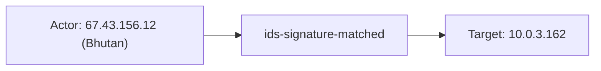
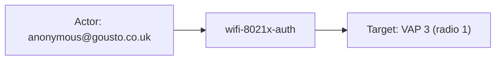

# cisco_meraki

## Product Domain

Cisco Meraki is a cloud-managed networking platform that delivers secure, scalable, and centrally administered networks through an out-of-band cloud architecture. Organizations deploy Meraki hardware—MX Security Appliances (firewall/SD-WAN/VPN), MR wireless access points, MS switches, MV cameras, and related devices—and manage them from the Meraki Dashboard web UI or mobile app rather than per-device CLI configuration. Policy, firmware, monitoring, and alerting are orchestrated from the cloud, making Meraki a core product in the cloud-managed networking and SASE-adjacent security domain.

MX appliances provide perimeter firewalling, intrusion detection/prevention, content filtering, site-to-site and client VPN (including AnyConnect), SD-WAN, and cellular failover. MR access points deliver enterprise Wi-Fi with 802.1X, WPA, splash authentication, and AirMarshal wireless security. MS switches handle Layer-2/Layer-3 switching with port-level visibility. Each Meraki network generates operational and security telemetry that security and network teams use for threat detection, access troubleshooting, VPN monitoring, wireless forensics, and compliance auditing across distributed sites.

## Data Collected (brief)

This integration collects Cisco Meraki telemetry through two data streams. The **log** stream (`cisco_meraki.log`) ingests syslog from MX Security Appliances and MR Access Points via Elastic Agent **UDP**, **TCP**, or **logfile** input. Parsed event types include **firewall/flow** logs (L3 allow/deny, VPN/cellular/bridge flows), **IP flow** start/end, **security/IDS** events (signature matches, file scanning, disposition changes), **URL** filtering, **AirMarshal** wireless threats (rogue SSID, spoofing, packet floods), **Wi-Fi** association/disassociation and **802.1X/WPA/splash** authentication, **AnyConnect/client VPN** sessions, **site-to-site VPN** connectivity changes, and general **events** (DHCP, port status, DFS, martian VLAN). Events are mapped to ECS with source/destination/client network fields and GeoIP enrichment.

The **events** stream (`cisco_meraki.events`) receives Meraki Dashboard **webhook** alerts over HTTPS via Elastic Agent **http_endpoint** input. Payloads include organization, network, and device context (IDs, names, tags, URLs), alert type/level, timestamps, and type-specific `alertData` (e.g., cellular failover, settings changes, usage alerts). MS switch syslog is not recognized by the log parser.

## Expected Audit Log Entities

Meraki telemetry spans two streams: **`log`** (MX/MR syslog — flows, IDS, URL filtering, Wi-Fi auth, VPN, AirMarshal) and **`events`** (Dashboard webhook alerts). Both are **audit-adjacent network and device telemetry**, not SaaS admin-audit logs — there is no Dashboard user/principal who changed a setting in syslog output. Authentication-adjacent events (802.1X, WPA, splash, VPN) carry **user** actors; most traffic/security events identify **host** endpoints by IP/MAC. The reporting appliance is always **`observer.*`** (log source), not the traffic actor. **No ECS `*.target.*` fields** are populated (`dev/target-fields-audit/out/target_fields_audit.csv` — no rows for this package). The target-fields audit classified this package as **`moderate_candidate_network_dest`** with **`pipeline_dest_network=true`**, **`pipeline_actor=true`**, and **`pipeline_dest_identity=false`** (`dev/target-fields-audit/out/target_enhancement_packages.csv`); **`destination.user.*` / `destination.host.*`** are absent from pipelines and **`destination_identity_hits.csv`**.

**`event.action` is populated on most `log` subtypes** via a centralized eventmap in `default.yml` (`cisco_meraki.event_subtype` → normalized action); unmapped subtypes fall back to the raw subtype string. **`ip_flow_start` / `ip_flow_end`** events have **no `event.action`** (no `event_subtype` set). The **`events`** webhook stream sets **`event.action`** from Dashboard **`alertType`** display text (e.g. `Cellular came up`). Evidence: `packages/cisco_meraki/data_stream/log/sample_event.json`, `data_stream/events/sample_event.json`, pipeline fixtures under `data_stream/log/_dev/test/pipeline/` and `data_stream/events/_dev/test/pipeline/`, and ingest pipelines `default.yml`, `flows.yml`, `ipflows.yml`, `urls.yml`, `security.yml`, `events.yml`, `airmarshal.yml`, `events/default.yml`.

### Event action (semantic)

| Action (normalized label) | Classification | Confidence | Evidence | Per-stream notes |
| --- | --- | --- | --- | --- |
| `layer3-firewall-allowed-flow` | data_access | high | `test-flows.log-expected.json` `flow_allowed`; `default.yml:109-113` | **`log`** — L3 flow allow |
| `layer3-firewall-denied-flow` | data_access | high | `default.yml:114-118`; eventmap entry | **`log`** — L3 flow deny (fixture sparse) |
| `ip-session-initiated` | data_access | high | `test-flows.log-expected.json` `ip_session_initiated`; `default.yml:104-108` | **`log`** — session start on flows without allow/deny op |
| `ids-signature-matched` | detection | high | `sample_event.json`, `test-security-events.log-expected.json`; `default.yml:131-134` | **`log`** — `security_event` and `ids-alerts` |
| `malicious-file-actioned` | detection | high | EICAR fixture `test-security-events.log-expected.json`; `default.yml:135-139` | **`log`** — AMP file scan block |
| `issued-retrospective-malicious-disposition` | detection | high | disposition-change fixture; `default.yml:140-144` | **`log`** — retrospective AMP disposition |
| `http-access` / `http-access-error` | data_access | high | `test-urls.log-expected.json`; `default.yml:119-130` | **`log`** — URL filtering |
| `rogue-ssid-detected` / `ssid-spoofing-detected` | detection | high | `test-airmarshal-events.log-expected.json`; `default.yml:205-208` | **`log`** — AirMarshal |
| `wifi-wpa-authentication` / `wifi-8021x-auth` / `splash-authentication` | authentication | high | `test-events.log-expected.json` `wpa_auth`, `8021x_eap_success`, `splash_auth`; `default.yml:157-202` | **`log`** — Wi-Fi auth subtypes |
| `wifi-wpa-failed-auth-or-deauth` / `wifi-8021x-failed-authentication-attempt` | authentication | high | `test-events.log-expected.json` `wpa_deauth`, `8021x_eap_failure`; `default.yml:164-177` | **`log`** — failed Wi-Fi auth |
| `anyconnect_vpn_connect` / `anyconnect_vpn_disconnect` | authentication | high | `test-events.log-expected.json`; `default.yml:88-95` | **`log`** — AnyConnect session lifecycle |
| `site-to-site-vpn` | configuration_change | partial | Mapped for `Site-to-Site VPN` **and** `client_vpn_connect` (`default.yml:84-103`) — conflates VPN types | **`log`** — VPN connectivity |
| `vpn-connectivity-change` | configuration_change | high | `test-events.log-expected.json` `vpn_connectivity_change`; `default.yml:68-73` | **`log`** |
| `dhcp-offer` / `dhcp-no-offer` | data_access | high | DHCP fixtures; `default.yml:74-83` | **`log`** |
| `dynamic-frequency-selection-detected` | configuration_change | high | DFS fixture; `default.yml:214-215` | **`log`** |
| Raw subtype fallback (`8021x_auth`, `martian_vlan`, `port_status_changed`, `arp_blocked`, `anyconnect_vpn_session_manager`, …) | varies | high | Unmapped in eventmap → `ctx.event.action = ctx.cisco_meraki.event_subtype` (`default.yml:222-224`); fixtures in `test-events.log-expected.json` | **`log`** — operational/device events without normalized labels |
| Dashboard alert display text (`Cellular came up`, `Failover event detected`, `Insight Alert`) | configuration_change / detection | high | `events/sample_event.json`, `test-mx-events.json-expected.json`; `events/default.yml:231` | **`events`** — human-readable Meraki alert names |
| *(absent)* | — | high | No `event.action` in `test-ip-flow.log-expected.json`; `ipflows.yml` does not set `event_subtype` | **`log`** — `ip_flow_start` / `ip_flow_end` gap |

### Event action (ECS candidates)

| ECS / vendor field | Mapped to `event.action` today? | Mapping correct? | Recommended `event.action` value (from fixtures) | Enhancement candidate? | Evidence |
| --- | --- | --- | --- | --- | --- |
| `event.action` ← `cisco_meraki.event_subtype` via eventmap | yes (most `log` subtypes) | yes (mapped entries) | e.g. `ids-signature-matched`, `http-access`, `wifi-wpa-authentication` | no | `default.yml:62-241`; all `log` *-expected.json with action |
| `event.action` ← raw `cisco_meraki.event_subtype` (fallback) | yes | partial | e.g. `8021x_auth`, `martian_vlan`, `port_status_changed` | yes — add eventmap entries for normalized labels | `default.yml:222-224`; `test-events.log-expected.json` |
| `cisco_meraki.event_subtype` | indirect (source) | yes | Vendor canonical subtype before normalization | no | Set in sub-pipelines (`flows.yml`, `security.yml`, `events.yml`, …) |
| `cisco_meraki.event_type` | no | n/a | e.g. `ip_flow_start`, `flows`, `security_event` — stream-level type, not per-event verb | yes — derive action for IP flows | `test-ip-flow.log-expected.json`; no `event.action` |
| `cisco_meraki.firewall.action` | no | n/a | e.g. `allow`, `deny` — firewall rule outcome, not event verb | yes — could supplement `layer3-firewall-*-flow` | `flows.yml:18`; vendor-only in fixtures |
| `cisco_meraki.security.action` | no | n/a | e.g. `block`, `allow` — AMP/IDS disposition on scan events | yes — distinct from subtype action | `security.yml:80`; `test-security-events.log-expected.json` |
| `cisco_meraki.security.decision` | no | n/a | e.g. `blocked`, `allowed` — IDS decision | yes — enrichment, not primary action | `security.yml:51-52`; `sample_event.json` |
| `cisco_meraki.anyconnect_vpn_session_manager.action` | no | n/a | e.g. `added tunnel`, `session disconnected` — granular VPN ops | yes — sub-action under session-manager subtype | `events.yml:357-381`; nested in fixtures |
| `json.alertType` → `event.action` | yes | yes | e.g. `Cellular came up`, `Failover event detected` | no | `events/default.yml:231`; `events/sample_event.json` |
| `json.alertTypeId` | no (drives category/type only) | n/a | e.g. `cellular_up`, `vrrp`, `settings_changed` — stable machine ID | yes — prefer as normalized `event.action` over display text | `events/default.yml:226-249`; webhook payload |
| `client_vpn_connect` eventmap entry | yes | **no** | Maps to `site-to-site-vpn` instead of client-VPN-specific label | **yes** — fix eventmap action | `default.yml:96-103`; `test-events.log-expected.json` `client_vpn_connect` |

### Actor (semantic)

| Entity | Classification | Entity type (if general) | Confidence | Evidence | Per-stream notes |
| --- | --- | --- | --- | --- | --- |
| Flow originator (internal/external endpoint) | host | — | high | `source.ip`, `source.port`, `source.mac` ← `src`/`sport`/`mac` (`flows.yml`; `test-flows.log-expected.json` `flow_allowed`); NAT at `source.nat.ip`/`source.nat.port` (`ipflows.yml`; `test-ip-flow.log-expected.json`) | **`log`** — `flows`, `ip_flow_start`, `ip_flow_end` |
| HTTP/URL filtering client | host | — | high | `source.ip`, `source.port` ← `src` (`urls.yml`); client MAC vendor-only in `cisco_meraki.urls.mac` (`test-urls.log-expected.json` `http_access_error`) | **`log`** — `urls` |
| IDS / security-event initiator | host | — | high | `source.ip`, `source.port` ← `src`/`sport` (`security.yml`, `idsalerts.yml`; `sample_event.json`, `test-security-events.log-expected.json` `ids_alerted`) | **`log`** — `security_event` |
| File-scan downloading host | host | — | high | `source.ip`, `source.port`; MAC retained in `cisco_meraki.security.mac` only (`security.yml`; EICAR fixture in `test-security-events.log-expected.json`) | **`log`** — `security_filtering_file_scanned` |
| Wireless client (association, WPA, splash) | host | — | high | `client.mac`; optional `client.ip` (`events.yml` ← `client_mac`/`client_ip`; `test-events.log-expected.json` `wpa_auth`, `splash_auth`) | **`log`** — Wi-Fi client events |
| 802.1X authenticating user | user | — | high | `identity` → `user.name`/`user.email`/`user.domain` (`events.yml:254-257`); wireless client at `client.mac`, `client.ip` (`8021x_eap_success` fixture: `anonymous@gousto.co.uk`) | **`log`** — `8021x_*` subtypes |
| VPN user (Client VPN / AnyConnect) | user | — | high | `user.name`/`user.email` ← `user id '…'` grok (`events.yml:307-409`); remote client endpoint at `client.ip` with GeoIP/ASN (`client_vpn_connect` `jwick@wwvpn.net`, AnyConnect connect/disconnect fixtures) | **`log`** — `client_vpn_connect`, `anyconnect_vpn_connect`, `anyconnect_vpn_disconnect` |
| AnyConnect session-manager user | user | — | moderate | `cisco_meraki.anyconnect_vpn_session_manager.user_name` ← grok `User[…]` (`events.yml:337-345`); **not** copied to ECS `user.*` (session-manager fixtures in `test-events.log-expected.json`) | **`log`** — `anyconnect_vpn_session_manager` |
| DHCP client | host | — | high | `client.mac`, `client.ip` on lease; MAC-only on no-offer (`events.yml:81-97`; `dhcp_offer`/`dhcp_no_offer` fixtures) | **`log`** — `dhcp_*` |
| ARP offender | host | — | high | `source.mac`, `source.ip` ← grok on blocked ARP (`events.yml:121-143`; `arp_blocked` fixture) | **`log`** — `arp_blocked` |
| Martian-VLAN misbehaving host | host | — | high | `client.ip`, `client.mac` ← `cisco_meraki.martian_vlan.Client`/`MAC` (`events.yml:422-439`) | **`log`** — `martian_vlan` (client detail) |
| AirMarshal rogue/threat BSSID | host | — | high | `source.mac` ← `src`/`bssid` (`airmarshal.yml`; `test-airmarshal-events.log-expected.json` `rogue_ssid_detected`) | **`log`** — `airmarshal_events` |

Operational events (DFS, port status, carrier change, Site-to-Site VPN raw, `vpn_connectivity_change`, martian_vlan summary) and **`events`** webhook alerts have **no distinct human or client actor** beyond the logging **`observer.*`** appliance identity.

### Actor (ECS candidates)

| ECS / vendor field | Role | Mapped today? | Mapping correct? | Confidence | Evidence |
| --- | --- | --- | --- | --- | --- |
| `source.ip`, `source.port`, `source.mac` | Flow/IDS/URL initiator endpoint | yes | yes | high | `flows.yml`, `urls.yml`, `security.yml`; traffic fixtures |
| `source.nat.ip`, `source.nat.port` | NAT'd flow originator | yes | yes | high | `ipflows.yml`; `test-ip-flow.log-expected.json` |
| `client.ip`, `client.mac` | Wireless/DHCP/VPN remote client endpoint | yes | yes | high | `events.yml`; Wi-Fi, DHCP, VPN fixtures |
| `user.name`, `user.email`, `user.domain` | 802.1X identity or VPN username | yes | yes | high | ← `identity` kv or `user id '…'` grok (`events.yml:254-498`); 802.1X and VPN fixtures |
| `related.user` | Enrichment array for normalized user | yes | yes | high | Appends `user.name`/`user.email` (`events.yml:499-510`) |
| `related.ip` | Enrichment array for endpoint IPs | yes | yes | high | Appends `source.ip`, `client.ip`, DHCP server IPs (`events.yml:511-519`, `282-298`) |
| `cisco_meraki.anyconnect_vpn_session_manager.user_name` | VPN session user (vendor copy) | yes (vendor) | n/a | high | Grok from session-manager message; also present on connect/disconnect as ECS `user.*` — inconsistent |
| `cisco_meraki.urls.mac`, `cisco_meraki.security.mac` | Client MAC on URL/file-scan events | yes (vendor) | n/a | moderate | Vendor-retained; not mapped to `client.mac` or `source.mac` |
| `cisco_meraki.*.identity` (802.1X kv blobs) | Raw identity before ECS rename | yes (vendor) | n/a | high | Renamed to `user.name` when subtype matches 802.1X list |
| `observer.hostname`, `observer.name`, `observer.serial_number`, `observer.product`, `observer.mac` | Reporting MX/MR/MV appliance | yes | yes | high | `default.yml` dissect; `events/default.yml` webhook mapping — **observer identity, not actor** |

### Target (semantic)

| Layer | Description | Entity | Classification | Entity type (if general) | Confidence | Evidence | Per-stream notes |
| --- | --- | --- | --- | --- | --- | --- | --- |
| 2 — Resource / object | Session remote peer (IP/port/NAT) | Remote host / server | host | — | high | `destination.ip`, `destination.port`, `destination.nat.*` ← `dst`/`dport` (`flows.yml`, `ipflows.yml`, `urls.yml`, `security.yml`); flow/URL/IDS fixtures | **`log`** — flows, URLs, IDS |
| 2 — Resource / object | IDS victim / internal endpoint | Internal host | host | — | high | `destination.ip`, `destination.port` on ingress IDS; affected MAC in `cisco_meraki.security.dhost` (vendor only) (`sample_event.json`, `test-security-events.log-expected.json`) | **`log`** — `ids_alerted` |
| 2 — Resource / object | VPN tunnel assignment / MX gateway | VPN service endpoint | host or service | — | high | `network.forwarded_ip` ← assigned tunnel IP; `observer.hostname` is enforcement MX (`events.yml`; AnyConnect/client VPN fixtures) | **`log`** — VPN connect/disconnect |
| 2 — Resource / object | AnyConnect peer / assigned tunnel IP | Remote VPN endpoint | host | — | moderate | `cisco_meraki.anyconnect_vpn_session_manager.peer_ip`, `.ip` (filter apply); not mapped to ECS `destination.*` or `client.ip` | **`log`** — session-manager |
| 2 — Resource / object | Wireless network segment (VAP/radio) | Wi-Fi SSID/VAP | service | — | medium | `cisco_meraki.*.vap`, `.radio` kv blobs; AP at `observer.hostname` — no ECS service target | **`log`** — WPA/802.1X/splash |
| 2 — Resource / object | DHCP server (legitimate or rogue) | DHCP server | general | dhcp-server | high | `server.mac`/`server.ip` on lease; rogue `server_ip`/`server_mac` in `cisco_meraki.multiple_dhcp_servers_detected.*` (`events.yml`; DHCP fixtures) | **`log`** — `dhcp_*`, `multiple_dhcp_servers_detected` |
| 2 — Resource / object | Protected VLAN segment | VLAN | general | vlan-segment | medium | `observer.ingress.vlan.id` (ARP block); `cisco_meraki.martian_vlan.VLAN` (martian VLAN) | **`log`** — `arp_blocked`, `martian_vlan` |
| 2 — Resource / object | AirMarshal observed wireless MAC | Wireless peer/victim | host | — | high | `destination.mac` ← `dst` (`airmarshal.yml`; rogue SSID fixtures) | **`log`** — `airmarshal_events` |
| 2 — Resource / object | Alerted Meraki device / network | Managed device or site | general | device / network | high | `observer.name`, `.serial_number`, `.product`, `.mac`; `network.name`, `organization.id`/`organization.name` (`events/default.yml`; `sample_event.json`, `test-mx-events.json-expected.json`) | **`events`** — webhook alerts |
| 2 — Resource / object | Site-to-Site VPN peer | Remote VPN gateway | host or service | — | low | Raw peer info in `cisco_meraki.site_to_site_vpn.raw` or `.connectivity_change.*` — not parsed to ECS | **`log`** — Site-to-Site VPN, `vpn_connectivity_change` |
| 3 — Content / artifact | Requested URL / web resource | HTTP URL | general | url | high | `url.domain`, `url.original`, `url.path`, `url.scheme` ← `uri_parts` on request URL (`urls.yml`; bitbucket.org fixture) | **`log`** — `urls` |
| 3 — Content / artifact | Malicious / scanned file | File object | general | file | high | `file.name`, `file.hash.sha256` ← `name`/`sha256` (`security.yml`; EICAR and disposition-change fixtures) | **`log`** — file scan / disposition change |
| 3 — Content / artifact | IDS signature / alert message | Detection rule | general | ids_signature | high | `message`, `cisco_meraki.security.signature`; `event.action` e.g. `ids-signature-matched` | **`log`** — IDS |

Layer 1 (invoked cloud/SaaS platform) does not apply in ECS — Meraki Dashboard is the management plane but webhook alerts do not record **who** triggered a change, only **what device/network** changed state.

### Target (ECS candidates)

| ECS / vendor field | Layer | Classification | Mapped today? | Mapping correct? | ECS target bucket | Enhancement candidate? | Evidence |
| --- | --- | --- | --- | --- | --- | --- | --- |
| `destination.ip`, `destination.port`, `destination.nat.ip`, `destination.nat.port` | 2 | host | yes | partial | context-only (network peer) | no | ← `dst`/`dport`/NAT kv (`flows.yml`, `ipflows.yml`, `urls.yml`, `security.yml`); correct for flow semantics, not audit `host.target.*` |
| `destination.mac` | 2 | host | yes | partial | `host.target.mac` | yes | ← `dst` on AirMarshal (`airmarshal.yml`); wireless peer MAC — network-context destination, semantically a target endpoint |
| `network.forwarded_ip` | 2 | host | yes | partial | `host.target.ip` | yes | Assigned VPN tunnel IP (`events.yml`); tunnel resource on MX, not generic destination peer |
| `network.protocol`, `network.vlan.id` | 2 | service | yes | yes | context-only | no | Protocol/VLAN context on flows, IDS, AirMarshal |
| `url.*` | 3 | general | yes | yes | context-only | no | `uri_parts` on URL request (`urls.yml`, `security.yml`) |
| `file.name`, `file.hash.sha256` | 3 | general | yes | yes | context-only | no | File-scan and disposition-change events (`security.yml`) |
| `server.ip`, `server.mac` | 2 | general | yes | yes | `service.target.name` | yes | DHCP server identity on lease/rogue-server events (`events.yml`) |
| `observer.ingress.vlan.id` | 2 | general | yes | yes | context-only | no | Protected VLAN on ARP block (`events.yml:124`) |
| `cisco_meraki.security.dhost` | 2 | host | yes (vendor) | n/a | `host.target.mac` | **yes** | IDS victim MAC; vendor-only while `destination.ip` holds IP peer |
| `cisco_meraki.*.vap`, `.radio`, `.channel` | 2 | service | yes (vendor) | n/a | `service.target.name` | yes | Wireless segment context; vendor-only |
| `cisco_meraki.anyconnect_vpn_session_manager.peer_ip`, `.ip`, `.tunnel_id` | 2 | host / service | yes (vendor) | n/a | `host.target.ip` / `service.target.entity.id` | **yes** | VPN peer and tunnel metadata; not ECS-mapped |
| `cisco_meraki.site_to_site_vpn.raw`, `.connectivity_change.*` | 2 | host or service | yes (vendor) | n/a | `host.target.ip` | yes | Site-to-Site VPN peer context; unparsed |
| `cisco_meraki.martian_vlan.VLAN`, `.details` | 2 | general | yes (vendor) | n/a | context-only | no | VLAN segment violation context |
| `cisco_meraki.event.alertData.*` (`local`, `remote`, `connection`, …) | 2 | host | yes (vendor) | n/a | `host.target.ip` | yes | Webhook type-specific endpoints; flattened vendor-only (`sample_event.json` cellular_up) |
| `observer.name`, `observer.serial_number`, `network.name`, `organization.id` | 2 | general | yes | n/a | context-only | no | Alerted device/network scope (`events/default.yml`); observer is log source, network/org is tenancy scope |

### Gaps and mapping notes

- **No ECS `user.target.*`, `host.target.*`, `service.target.*`, or `entity.target.*`** — target-fields audit confirms zero official target fields; enhancement priority is **`moderate_candidate_network_dest`** (network `destination.*` only, no `destination.user.*`).
- **`destination.ip`/`destination.port`** on flows, URLs, and IDS are **network session peers**, not de-facto audit user/host targets — unlike email/auth integrations, Meraki does not reuse `destination.user.*` for identity (`destination_identity_hits.csv` — no rows for this package).
- **`cisco_meraki.security.dhost`** holds the IDS **victim MAC** but is not copied to `host.target.mac` or `destination.mac` — best vendor source for Layer 2 host target enhancement.
- **`cisco_meraki.anyconnect_vpn_session_manager.user_name`** and **`peer_ip`** are parsed to vendor fields only; connect/disconnect subtypes for the same user **do** map to ECS `user.*`/`client.ip` — inconsistent actor mapping across VPN event shapes.
- **`client.mac`** on 802.1X/WPA events is the **wireless client host** (actor-side endpoint); **`user.*`** from `identity` is the **authenticating user** — distinct roles, correctly not conflated, but neither maps to `*.target.*`.
- **`user.name` → `user.email` rename** when `@` present (`events.yml:481-485`) is semantically correct for email-style VPN/802.1X identities.
- **Webhook `events` stream** retains rich device/network target context under **`cisco_meraki.event.*`** and **`observer.*`** but records **no Dashboard admin actor** — settings-change alerts (`settings_changed`) describe configuration impact on `observer.name`, not who changed it.
- **`organization.*`** and **`network.name`** are tenancy/scope context, not actors or granular targets.
- **`related.user`** and **`related.ip`** aggregate identities without distinguishing actor vs target roles.
- **`event.action` gaps:** **`ip_flow_start` / `ip_flow_end`** have no action — recommend mapping from `cisco_meraki.event_type` (e.g. `ip-flow-start`, `ip-flow-end`). **`client_vpn_connect`** incorrectly maps to `site-to-site-vpn` in eventmap (`default.yml:96-103`). ~15 operational subtypes use **raw subtype fallback** (`8021x_auth`, `martian_vlan`, `port_status_changed`, …) — add eventmap entries for consistent normalized actions. **`cisco_meraki.security.action`** / **`decision`** and **`anyconnect_vpn_session_manager.action`** capture secondary verbs but stay vendor-only. Webhook stream uses display **`alertType`** strings; **`alertTypeId`** would be a more stable normalized action source.

### Per-stream notes

#### `log` — flows / IP flows (`cisco_meraki.event_type=flows`)

Default actor is the **flow originator** (`source.ip`, optional `source.mac`, NAT fields). Primary target is the **session peer** (`destination.ip`/`port`). Actions: **`layer3-firewall-allowed-flow`**, **`layer3-firewall-denied-flow`**, or **`ip-session-initiated`** via eventmap. Audit-adjacent allow/deny telemetry, not admin audit.

#### `log` — IP flows (`ip_flow_start` / `ip_flow_end`)

Session timing telemetry with source/destination NAT fields. **`event.action` absent** — only `cisco_meraki.event_type` distinguishes start vs end.

#### `log` — URLs / security / AirMarshal

URL events: **host actor** at `source.*`, Layer 3 **url.*** target plus remote server at `destination.ip`; actions **`http-access`** / **`http-access-error`**. IDS: **external source** → **internal destination** on ingress; action **`ids-signature-matched`**; victim MAC only in **`cisco_meraki.security.dhost`**. AirMarshal: rogue BSSID as **`source.mac`**, observed peer as **`destination.mac`**; actions **`rogue-ssid-detected`** / **`ssid-spoofing-detected`**.

#### `log` — events (Wi-Fi, VPN, DHCP, operational)

802.1X/VPN subtypes populate **`user.*`** (actor) and **`client.*`** (endpoint) with auth actions (`wifi-8021x-auth`, `anyconnect_vpn_connect`, …). VPN adds **`network.forwarded_ip`** as tunnel-assignment target. Session-manager messages keep user/peer in **vendor fields only** with raw subtype action. Operational subtypes (port, DFS, carrier) target local hardware via **`cisco_meraki.*`** blobs and raw subtype actions.

#### `events` — Dashboard webhooks

Device/network **state-change alerts** — target is the **`observer.*`** appliance and optional **`cisco_meraki.event.alertData.*`** endpoints. **`event.action`** = Dashboard **`alertType`** display string (e.g. `Cellular came up`). No caller/principal actor; not equivalent to Meraki Dashboard audit logs API.

## Example Event Graph

The examples below come from the **`log`** syslog stream (MX/MR security and authentication telemetry) and the **`events`** Dashboard webhook stream. These are audit-adjacent network and device events — not Meraki Dashboard admin audit logs. Syslog events carry endpoint or user actors; webhook alerts report appliance state changes without a Dashboard principal.

### Example 1: Ingress IDS signature match

**Stream:** `cisco_meraki.log` · **Fixture:** `packages/cisco_meraki/data_stream/log/sample_event.json`

```
Host (67.43.156.12, Bhutan) → ids-signature-matched → Host (10.0.3.162)
```

#### Actor

| Field | Value |
| --- | --- |
| id | 67.43.156.12 |
| type | host |
| geo | Bhutan |
| ip | 67.43.156.12 |

**Field sources:**
- `id`, `ip` ← `source.ip`
- `geo` ← `source.geo.country_name`

#### Event action

| Field | Value |
| --- | --- |
| action | ids-signature-matched |
| source_field | `event.action` |
| source_value | ids-signature-matched |

#### Target

| Field | Value |
| --- | --- |
| id | 10.0.3.162 |
| type | host |
| ip | 10.0.3.162 |

**Field sources:**
- `id`, `ip` ← `destination.ip`
- Victim MAC `D0-AB-D5-7B-43-73` is in `cisco_meraki.security.dhost` only (not copied to ECS `destination.mac` or `host.target.*`)

#### Mermaid



### Example 2: 802.1X Wi-Fi authentication success

**Stream:** `cisco_meraki.log` · **Fixture:** `packages/cisco_meraki/data_stream/log/_dev/test/pipeline/test-events.log-expected.json` (event at `@timestamp` 2021-12-10T10:41:01.230Z)

```
User (anonymous@gousto.co.uk) → wifi-8021x-auth → Wi-Fi VAP (radio 1, vap 3)
```

#### Actor

| Field | Value |
| --- | --- |
| id | anonymous@gousto.co.uk |
| name | anonymous |
| type | user |

**Field sources:**
- `id` ← `user.email`
- `name` ← `user.name`
- Wireless client endpoint `54-8D-5A-EA-30-E9` ← `client.mac` (`client.ip` is `0.0.0.0` in fixture)

#### Event action

| Field | Value |
| --- | --- |
| action | wifi-8021x-auth |
| source_field | `event.action` |
| source_value | wifi-8021x-auth |

#### Target

| Field | Value |
| --- | --- |
| id | 3 |
| name | VAP 3 (radio 1) |
| type | service |
| sub_type | wifi_vap |

**Field sources:**
- `id` ← `cisco_meraki.8021x_eap_success.vap`
- `name` ← composed from `cisco_meraki.8021x_eap_success.vap`, `cisco_meraki.8021x_eap_success.radio`
- Reporting AP is `observer.hostname` (`1_2_AP_1`) — log source, not the authentication target

#### Mermaid



### Example 3: Dashboard cellular failover alert

**Stream:** `cisco_meraki.events` · **Fixture:** `packages/cisco_meraki/data_stream/events/sample_event.json`

```
(no actor) → Cellular came up → MX appliance (My appliance)
```

#### Actor

No distinct actor in this fixture — Meraki Dashboard webhooks describe device/network state changes without recording an admin or client principal.

#### Event action

| Field | Value |
| --- | --- |
| action | Cellular came up |
| source_field | `event.action` |
| source_value | Cellular came up |

#### Target

| Field | Value |
| --- | --- |
| id | Q234-ABCD-5678 |
| name | My appliance |
| type | general |
| sub_type | managed_device |
| ip | 192.168.1.2 |

**Field sources:**
- `id` ← `observer.serial_number`
- `name` ← `observer.name`
- `ip` ← `cisco_meraki.event.alertData.local` (cellular local endpoint on the alerted MX)
- Cellular peer `1.2.3.5` is in `cisco_meraki.event.alertData.remote` (vendor-only)

#### Mermaid


## ES|QL Entity Extraction

**Package type: agent-backed** (policy template `cisco_meraki`, `data_stream/log` + `data_stream/events` with Tier A fixtures and ingest pipelines). Router: **`data_stream.dataset`** (`cisco_meraki.log`, `cisco_meraki.events` per `manifest.yml`) with secondary **`event.action`** / **`cisco_meraki.event_subtype`** / **`cisco_meraki.event_type`** within `log`. Pass 4 is **fill-gaps-only**: detection flags (`actor_exists`, `target_exists`, `action_exists`) run first; actor/target/action **`EVAL` blocks use column-level preserve** (`<col> IS NOT NULL`) with dataset guards — not `CASE(actor_exists, <col>, …)` — so `host.ip` ← `source.ip` still applies when `user.name` is set but `host.ip` is empty. No ECS `*.target.*` at ingest today — fallbacks promote **`destination.*`**, **`network.forwarded_ip`**, vendor `cisco_meraki.*`, and **`observer.*`** (webhooks) into `host.target.*`, `service.target.*`, and `entity.target.*`. **`observer.*`** on syslog is the reporting appliance (log source), not the traffic actor. Wi-Fi auth targets use **`service.target.name`** ← vendor `vap` (Pass 3), not self-referential `user.*`.

### Dataset inventory

| data_stream.dataset | Stream role | Actor classification(s) | Target classification(s) | Extraction |
| --- | --- | --- | --- | --- |
| `cisco_meraki.log` | Flows / IP flows / URLs / IDS / AirMarshal | host | host (session peer), general (url/file) | partial |
| `cisco_meraki.log` | Wi-Fi / VPN / 802.1X / DHCP | user, host | service (wifi_vap), host (tunnel/peer) | partial |
| `cisco_meraki.events` | Dashboard webhooks | — | general (managed_device) | partial |

### Field mapping plan

#### Actor mappings

| Output column | Source field(s) | Condition (dataset + optional) | Confidence | Notes |
| --- | --- | --- | --- | --- |
| `user.name` | `user.name` | `data_stream.dataset == "cisco_meraki.log"` | high | **preserve existing** — 802.1X/VPN at ingest |
| `user.name` | `cisco_meraki.anyconnect_vpn_session_manager.user_name` | `data_stream.dataset == "cisco_meraki.log" AND cisco_meraki.event_subtype == "anyconnect_vpn_session_manager"` | high | **vendor fallback** — session-manager only |
| `user.email` | `user.email` | `data_stream.dataset == "cisco_meraki.log"` | high | **ingest-only — no ES|QL** (`events.yml:481-490`; no query-time vendor path) |
| `user.domain` | `user.domain` | `data_stream.dataset == "cisco_meraki.log"` | high | **ingest-only — no ES|QL** (dissect from `user.email` at ingest; no alternate source) |
| `host.ip` | `host.ip` | `data_stream.dataset == "cisco_meraki.log"` | high | **preserve existing** |
| `host.ip` | `source.ip` | `data_stream.dataset == "cisco_meraki.log" AND source.ip IS NOT NULL AND user.name IS NULL` | high | **vendor fallback** — flow/IDS/URL originator |
| `host.ip` | `client.ip` | `data_stream.dataset == "cisco_meraki.log" AND client.ip IS NOT NULL AND client.ip != "0.0.0.0" AND user.name IS NULL` | high | **vendor fallback** — wireless/DHCP endpoint |

#### Target mappings

| Output column | Source field(s) | Condition (dataset + optional) | Confidence | Notes |
| --- | --- | --- | --- | --- |
| `host.target.ip` | `host.target.ip` | `data_stream.dataset == "cisco_meraki.log"` | high | **preserve existing** |
| `host.target.ip` | `network.forwarded_ip` | `data_stream.dataset == "cisco_meraki.log" AND network.forwarded_ip IS NOT NULL` | high | **vendor fallback** — VPN tunnel assignment (Pass 3) |
| `host.target.ip` | `destination.ip` | `data_stream.dataset == "cisco_meraki.log" AND destination.ip IS NOT NULL` | high | **de-facto destination.*** session peer |
| `host.target.ip` | `cisco_meraki.anyconnect_vpn_session_manager.peer_ip` | `data_stream.dataset == "cisco_meraki.log" AND cisco_meraki.anyconnect_vpn_session_manager.peer_ip IS NOT NULL` | high | **vendor fallback** — VPN peer when no `destination.ip` |
| `host.target.ip` | `cisco_meraki.event.alertData.local` | `data_stream.dataset == "cisco_meraki.events"` | high | **vendor fallback** — cellular local endpoint |
| `service.target.name` | `service.target.name` | `data_stream.dataset == "cisco_meraki.log"` | high | **preserve existing** |
| `service.target.name` | `network.protocol` | `data_stream.dataset == "cisco_meraki.log" AND event.action IN ("http-access", "http-access-error", "ids-signature-matched")` | medium | **vendor fallback** — L4 protocol context |
| `service.target.name` | `cisco_meraki.8021x_eap_success.vap` | `data_stream.dataset == "cisco_meraki.log" AND event.action == "wifi-8021x-auth"` | high | **vendor fallback** — Wi-Fi VAP (Pass 3) |
| `service.target.name` | `cisco_meraki.wpa_auth.vap` | `data_stream.dataset == "cisco_meraki.log" AND event.action == "wifi-wpa-authentication"` | high | **vendor fallback** |
| `service.target.name` | `cisco_meraki.splash_auth.vap` | `data_stream.dataset == "cisco_meraki.log" AND event.action == "splash-authentication"` | high | **vendor fallback** |
| `service.target.name` | `server.mac` | `data_stream.dataset == "cisco_meraki.log" AND event.action IN ("dhcp-offer", "dhcp-no-offer") AND server.mac IS NOT NULL` | high | **vendor fallback** — DHCP server identity |
| `entity.target.id` | `entity.target.id` | `data_stream.dataset IN ("cisco_meraki.log", "cisco_meraki.events")` | high | **preserve existing** |
| `entity.target.id` | `destination.mac` | `data_stream.dataset == "cisco_meraki.log" AND event.action IN ("rogue-ssid-detected", "ssid-spoofing-detected") AND destination.mac IS NOT NULL` | high | **de-facto destination.*** — AirMarshal wireless peer |
| `entity.target.id` | `observer.serial_number` | `data_stream.dataset == "cisco_meraki.events"` | high | **vendor fallback** — alerted appliance |
| `entity.target.name` | `entity.target.name` | `data_stream.dataset IN ("cisco_meraki.log", "cisco_meraki.events")` | high | **preserve existing** |
| `entity.target.name` | `url.domain` | `data_stream.dataset == "cisco_meraki.log" AND event.action IN ("http-access", "http-access-error") AND url.domain IS NOT NULL` | high | **vendor fallback** — requested URL |
| `entity.target.name` | `file.name` | `data_stream.dataset == "cisco_meraki.log" AND event.action IN ("malicious-file-actioned", "issued-retrospective-malicious-disposition") AND file.name IS NOT NULL` | high | **vendor fallback** — scanned file |
| `entity.target.name` | `observer.name` | `data_stream.dataset == "cisco_meraki.events"` | high | **vendor fallback** — managed device |
| `entity.target.type` | `entity.target.type` | all datasets | high | **preserve existing** |
| `entity.target.type` | literal `"service"` / `"host"` / `"general"` | dataset + `event.action` / `destination.ip` guards | high | **semantic literal** — classification helper |
| `entity.target.sub_type` | `entity.target.sub_type` | all datasets | high | **preserve existing** |
| `entity.target.sub_type` | literal `"wifi_vap"` / `"managed_device"` | Wi-Fi auth / webhook guards | high | **semantic literal** |

#### Event action mappings

| Output column | Source field(s) | Condition (dataset + optional) | Confidence | Notes |
| --- | --- | --- | --- | --- |
| `event.action` | `event.action` | all datasets | high | **preserve existing** — eventmap + webhook `alertType` |
| `event.action` | literal `"ip-flow-start"` / `"ip-flow-end"` | `data_stream.dataset == "cisco_meraki.log" AND cisco_meraki.event_type IN ("ip_flow_start", "ip_flow_end")` | high | **semantic fallback** — Pass 2 gap; no ingest action today |

### Detection flags (mandatory — run first)

Standard actor/target/action predicates. **`observer.*` is excluded from `actor_exists`** — reporting MX/MR identity is not the traffic principal.

**Semantics:** `actor_exists` / `target_exists` / `action_exists` are query-time helpers for documentation and optional downstream use. Actor/target/action **`EVAL` blocks use column-level preserve** (`<col> IS NOT NULL`) — not `CASE(actor_exists, <col>, …)` / `CASE(target_exists, <col>, …)` — so one populated `entity.target.name` does not block `host.target.ip` / `service.target.name` fallbacks (Pass 4 §10).

**ES|QL `CASE` arity:** Arguments are **(condition, value)** pairs; odd count → last arg is default. Wrong: `CASE(user.name IS NOT NULL, user.name, user.full_name, null)` (4 args — 3rd arg is a **condition**). Wrong: `CASE(target_exists, host.target.ip, network.forwarded_ip, destination.ip, null)` (6 args — `network.forwarded_ip` is a **condition**). Right: **5-arg** `CASE(host.target.ip IS NOT NULL, host.target.ip, data_stream.dataset == "cisco_meraki.log" AND network.forwarded_ip IS NOT NULL, network.forwarded_ip, null)` or **3-arg** `CASE(host.ip IS NOT NULL, host.ip, source.ip)`.

```esql
| EVAL
  actor_exists = user.id IS NOT NULL OR user.name IS NOT NULL OR user.email IS NOT NULL
    OR host.id IS NOT NULL OR host.ip IS NOT NULL OR host.name IS NOT NULL
    OR service.id IS NOT NULL OR service.name IS NOT NULL
    OR entity.id IS NOT NULL OR entity.name IS NOT NULL,
  target_exists = user.target.id IS NOT NULL OR user.target.name IS NOT NULL OR user.target.email IS NOT NULL
    OR host.target.id IS NOT NULL OR host.target.ip IS NOT NULL OR host.target.name IS NOT NULL
    OR service.target.id IS NOT NULL OR service.target.name IS NOT NULL
    OR entity.target.id IS NOT NULL OR entity.target.name IS NOT NULL,
  action_exists = event.action IS NOT NULL
```

### Combined ES|QL — actor fields

```esql
| EVAL
  user.name = CASE(
    user.name IS NOT NULL, user.name,
    data_stream.dataset == "cisco_meraki.log" AND cisco_meraki.event_subtype == "anyconnect_vpn_session_manager" AND cisco_meraki.anyconnect_vpn_session_manager.user_name IS NOT NULL, cisco_meraki.anyconnect_vpn_session_manager.user_name,
    null
  ),
  host.ip = CASE(
    host.ip IS NOT NULL, host.ip,
    data_stream.dataset == "cisco_meraki.log" AND source.ip IS NOT NULL AND user.name IS NULL, source.ip,
    data_stream.dataset == "cisco_meraki.log" AND client.ip IS NOT NULL AND client.ip != "0.0.0.0" AND user.name IS NULL, client.ip,
    null
  )
```

### Combined ES|QL — event action

```esql
| EVAL
  event.action = CASE(
    event.action IS NOT NULL, event.action,
    data_stream.dataset == "cisco_meraki.log" AND cisco_meraki.event_type == "ip_flow_start", "ip-flow-start",
    data_stream.dataset == "cisco_meraki.log" AND cisco_meraki.event_type == "ip_flow_end", "ip-flow-end",
    null
  )
```

### Combined ES|QL — target fields

```esql
| EVAL
  host.target.ip = CASE(
    host.target.ip IS NOT NULL, host.target.ip,
    data_stream.dataset == "cisco_meraki.log" AND network.forwarded_ip IS NOT NULL, network.forwarded_ip,
    data_stream.dataset == "cisco_meraki.log" AND destination.ip IS NOT NULL, destination.ip,
    data_stream.dataset == "cisco_meraki.log" AND cisco_meraki.anyconnect_vpn_session_manager.peer_ip IS NOT NULL, cisco_meraki.anyconnect_vpn_session_manager.peer_ip,
    data_stream.dataset == "cisco_meraki.events" AND cisco_meraki.event.alertData.local IS NOT NULL, cisco_meraki.event.alertData.local,
    null
  ),
  service.target.name = CASE(
    service.target.name IS NOT NULL, service.target.name,
    data_stream.dataset == "cisco_meraki.log" AND event.action == "wifi-8021x-auth" AND `cisco_meraki.8021x_eap_success.vap` IS NOT NULL, `cisco_meraki.8021x_eap_success.vap`,
    data_stream.dataset == "cisco_meraki.log" AND event.action == "wifi-wpa-authentication" AND cisco_meraki.wpa_auth.vap IS NOT NULL, cisco_meraki.wpa_auth.vap,
    data_stream.dataset == "cisco_meraki.log" AND event.action == "splash-authentication" AND cisco_meraki.splash_auth.vap IS NOT NULL, cisco_meraki.splash_auth.vap,
    data_stream.dataset == "cisco_meraki.log" AND event.action IN ("http-access", "http-access-error", "ids-signature-matched") AND network.protocol IS NOT NULL, network.protocol,
    data_stream.dataset == "cisco_meraki.log" AND event.action IN ("dhcp-offer", "dhcp-no-offer") AND server.mac IS NOT NULL, server.mac,
    null
  ),
  entity.target.id = CASE(
    entity.target.id IS NOT NULL, entity.target.id,
    data_stream.dataset == "cisco_meraki.log" AND event.action IN ("rogue-ssid-detected", "ssid-spoofing-detected") AND destination.mac IS NOT NULL, destination.mac,
    data_stream.dataset == "cisco_meraki.events" AND observer.serial_number IS NOT NULL, observer.serial_number,
    null
  ),
  entity.target.name = CASE(
    entity.target.name IS NOT NULL, entity.target.name,
    data_stream.dataset == "cisco_meraki.log" AND event.action IN ("http-access", "http-access-error") AND url.domain IS NOT NULL, url.domain,
    data_stream.dataset == "cisco_meraki.log" AND event.action IN ("malicious-file-actioned", "issued-retrospective-malicious-disposition") AND file.name IS NOT NULL, file.name,
    data_stream.dataset == "cisco_meraki.events" AND observer.name IS NOT NULL, observer.name,
    null
  ),
  entity.target.type = CASE(
    entity.target.type IS NOT NULL, entity.target.type,
    data_stream.dataset == "cisco_meraki.log" AND event.action IN ("wifi-wpa-authentication", "wifi-8021x-auth", "splash-authentication"), "service",
    data_stream.dataset == "cisco_meraki.log" AND destination.ip IS NOT NULL, "host",
    data_stream.dataset == "cisco_meraki.events", "general",
    null
  ),
  entity.target.sub_type = CASE(
    entity.target.sub_type IS NOT NULL, entity.target.sub_type,
    data_stream.dataset == "cisco_meraki.log" AND event.action IN ("wifi-wpa-authentication", "wifi-8021x-auth", "splash-authentication"), "wifi_vap",
    data_stream.dataset == "cisco_meraki.events", "managed_device",
    null
  )
```

### Full pipeline fragment (optional)

```esql
FROM logs-*
| EVAL
  actor_exists = user.name IS NOT NULL OR user.email IS NOT NULL OR host.ip IS NOT NULL,
  target_exists = host.target.ip IS NOT NULL OR service.target.name IS NOT NULL OR entity.target.id IS NOT NULL OR entity.target.name IS NOT NULL,
  action_exists = event.action IS NOT NULL
| EVAL
  user.name = CASE(
    user.name IS NOT NULL, user.name,
    data_stream.dataset == "cisco_meraki.log" AND cisco_meraki.event_subtype == "anyconnect_vpn_session_manager" AND cisco_meraki.anyconnect_vpn_session_manager.user_name IS NOT NULL, cisco_meraki.anyconnect_vpn_session_manager.user_name,
    null
  ),
  host.ip = CASE(
    host.ip IS NOT NULL, host.ip,
    data_stream.dataset == "cisco_meraki.log" AND source.ip IS NOT NULL AND user.name IS NULL, source.ip,
    data_stream.dataset == "cisco_meraki.log" AND client.ip IS NOT NULL AND client.ip != "0.0.0.0" AND user.name IS NULL, client.ip,
    null
  ),
  event.action = CASE(
    event.action IS NOT NULL, event.action,
    data_stream.dataset == "cisco_meraki.log" AND cisco_meraki.event_type == "ip_flow_start", "ip-flow-start",
    data_stream.dataset == "cisco_meraki.log" AND cisco_meraki.event_type == "ip_flow_end", "ip-flow-end",
    null
  ),
  host.target.ip = CASE(
    host.target.ip IS NOT NULL, host.target.ip,
    data_stream.dataset == "cisco_meraki.log" AND network.forwarded_ip IS NOT NULL, network.forwarded_ip,
    data_stream.dataset == "cisco_meraki.log" AND destination.ip IS NOT NULL, destination.ip,
    data_stream.dataset == "cisco_meraki.log" AND cisco_meraki.anyconnect_vpn_session_manager.peer_ip IS NOT NULL, cisco_meraki.anyconnect_vpn_session_manager.peer_ip,
    data_stream.dataset == "cisco_meraki.events" AND cisco_meraki.event.alertData.local IS NOT NULL, cisco_meraki.event.alertData.local,
    null
  ),
  service.target.name = CASE(
    service.target.name IS NOT NULL, service.target.name,
    data_stream.dataset == "cisco_meraki.log" AND event.action == "wifi-8021x-auth" AND `cisco_meraki.8021x_eap_success.vap` IS NOT NULL, `cisco_meraki.8021x_eap_success.vap`,
    data_stream.dataset == "cisco_meraki.log" AND event.action == "wifi-wpa-authentication" AND cisco_meraki.wpa_auth.vap IS NOT NULL, cisco_meraki.wpa_auth.vap,
    data_stream.dataset == "cisco_meraki.log" AND event.action == "splash-authentication" AND cisco_meraki.splash_auth.vap IS NOT NULL, cisco_meraki.splash_auth.vap,
    data_stream.dataset == "cisco_meraki.log" AND event.action IN ("http-access", "http-access-error", "ids-signature-matched") AND network.protocol IS NOT NULL, network.protocol,
    data_stream.dataset == "cisco_meraki.log" AND event.action IN ("dhcp-offer", "dhcp-no-offer") AND server.mac IS NOT NULL, server.mac,
    null
  ),
  entity.target.id = CASE(
    entity.target.id IS NOT NULL, entity.target.id,
    data_stream.dataset == "cisco_meraki.log" AND event.action IN ("rogue-ssid-detected", "ssid-spoofing-detected") AND destination.mac IS NOT NULL, destination.mac,
    data_stream.dataset == "cisco_meraki.events" AND observer.serial_number IS NOT NULL, observer.serial_number,
    null
  ),
  entity.target.name = CASE(
    entity.target.name IS NOT NULL, entity.target.name,
    data_stream.dataset == "cisco_meraki.log" AND event.action IN ("http-access", "http-access-error") AND url.domain IS NOT NULL, url.domain,
    data_stream.dataset == "cisco_meraki.log" AND event.action IN ("malicious-file-actioned", "issued-retrospective-malicious-disposition") AND file.name IS NOT NULL, file.name,
    data_stream.dataset == "cisco_meraki.events" AND observer.name IS NOT NULL, observer.name,
    null
  ),
  entity.target.type = CASE(
    entity.target.type IS NOT NULL, entity.target.type,
    data_stream.dataset == "cisco_meraki.log" AND event.action IN ("wifi-wpa-authentication", "wifi-8021x-auth", "splash-authentication"), "service",
    data_stream.dataset == "cisco_meraki.log" AND destination.ip IS NOT NULL, "host",
    data_stream.dataset == "cisco_meraki.events", "general",
    null
  ),
  entity.target.sub_type = CASE(
    entity.target.sub_type IS NOT NULL, entity.target.sub_type,
    data_stream.dataset == "cisco_meraki.log" AND event.action IN ("wifi-wpa-authentication", "wifi-8021x-auth", "splash-authentication"), "wifi_vap",
    data_stream.dataset == "cisco_meraki.events", "managed_device",
    null
  )
| KEEP @timestamp, data_stream.dataset, event.action, user.name, host.ip, host.target.ip, service.target.name, entity.target.id, entity.target.name, entity.target.type, entity.target.sub_type
```

### Streams excluded

*(none — both `cisco_meraki.log` and `cisco_meraki.events` receive partial extraction; sub-routing is by `event.action` / `cisco_meraki.event_type` within `log`)*

### Gaps and limitations

- **`cisco_meraki.security.dhost`** — IDS victim MAC vendor-only; not promoted to `host.target.*` (no `host.target.mac` in mandatory set).
- **`cisco_meraki.event.alertData.remote`** — webhook cellular peer vendor-only; local endpoint maps to `host.target.ip`.
- **Wi-Fi VAP display name** — `service.target.name` uses `vap` only; `radio` not composed in ES|QL.
- **`client_vpn_connect` → `site-to-site-vpn`** — ingest eventmap error (`default.yml:96-103`); `action_exists` preserves wrong label — fix at ingest, not Pass 4.
- **`user.id`** — not populated in fixtures; omitted.
- **`user.email` / `user.domain`** — populated at ingest only (`events.yml:481-498`); omitted from Pass 4 actor `EVAL` (no tautological `CASE(actor_exists, user.email, user.email)`).
- **Webhook `events` stream** — no Dashboard admin actor; `observer.*` is alerted device target, not caller.
- **Operational subtypes** (port status, DFS, martian VLAN summary) — `observer.*` / vendor blobs only; no distinct actor/target columns beyond raw subtype `event.action`.
- **Pass 2 alignment** — ingest-time `host.target.*` ← `destination.*` / `cisco_meraki.security.dhost` remains preferred; Pass 4 fills gaps without overwriting populated values.
