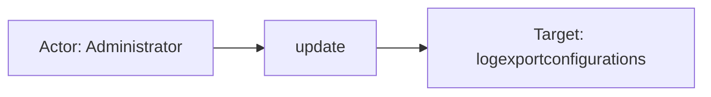
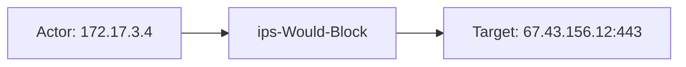

# cisco_umbrella

## Product Domain

Cisco Umbrella (now part of Cisco Secure Access) is a cloud-delivered security platform that protects users and workloads wherever they connect—on corporate networks, roaming endpoints, or direct internet access. Its foundation is DNS-layer security: Umbrella resolves and inspects DNS queries before connections are established, blocking requests to malicious domains, command-and-control infrastructure, and disallowed content categories based on Cisco Talos threat intelligence and organizational policy. Because DNS is the first step in nearly every internet connection, this approach provides broad coverage with minimal latency and no need to backhaul traffic through on-premises appliances.

Beyond DNS filtering, Umbrella extends into a full Secure Service Edge (SSE) stack. A cloud-delivered secure web gateway (SWG) proxies and inspects HTTP/HTTPS traffic for malware, data loss, and acceptable-use policy violations. Cloud firewall and intrusion prevention (IPS) capabilities enforce layer-3/4 and signature-based rules on user-generated traffic. Data loss prevention (DLP), remote browser isolation (RBI), and Advanced Malware Protection (AMP) file inspection add depth for sensitive data and file-based threats. Identity-aware policies tie enforcement to users, devices, networks, and roaming clients, supporting zero-trust network access (ZTNA) and private resource access alongside internet-bound traffic.

Umbrella is deployed as a cloud service with no customer-managed proxies in the data path for most use cases. Administrators configure policies, destination lists, and identity mappings in the Umbrella dashboard; enforcement occurs at Umbrella's globally distributed data centers. Organizations export detailed activity logs to Amazon S3 (self-managed or Cisco-managed buckets) for retention, compliance, and SIEM integration. Security teams use these logs for threat hunting, incident investigation, policy tuning, and correlating DNS, web, firewall, and IPS events with broader enterprise telemetry.

## Data Collected (brief)

This integration collects Cisco Umbrella logs into a single **log** data stream via Elastic Agent **aws-s3** input from a self-managed or Cisco-managed Amazon S3 bucket (with optional SQS notification queue). It supports Umbrella log schema version 13. Eight log categories are parsed into ECS: **DNS** (`dnslogs`), **proxy/SWG** (`proxylogs`), **firewall** (`firewalllogs`, `cloudfirewalllogs`), **IP-layer** (`iplogs`), **IPS/intrusion** (`intrusionlogs`), **DLP** (`dlplogs`), and **audit/administration** (`auditlogs`). Events include identity and policy context, allow/block actions, DNS query and response details, HTTP/HTTPS proxy metadata, firewall session data, IPS signatures and severity, DLP matches, AMP file-inspection verdicts, and configuration-change audit records, with vendor-specific fields under `cisco.umbrella.*`.

## Expected Audit Log Entities

Classifications below are grounded in the single `log` data stream under `packages/cisco_umbrella/data_stream/log/` — `sample_event.json`, pipeline test `*-expected.json` fixtures, `fields/fields.yml`, and `elasticsearch/ingest_pipeline/default.yml`. Log category is determined by S3 object path: **dnslogs**, **proxylogs**, **firewalllogs**, **cloudfirewalllogs**, **iplogs**, **intrusionlogs**, **dlplogs**, and **auditlogs** (eight S3 log types, schema v13).

Only **auditlogs** is a true Umbrella admin audit trail (`event.category: configuration`, `event.type: creation`/`change`/`deletion`). The other seven categories are inline enforcement telemetry (DNS, SWG, firewall, IPS, DLP) — audit-adjacent for identity and policy correlation but not configuration-change audit events.

No stream populates ECS `user.target.*`, `host.target.*`, `service.target.*`, or `entity.target.*`. The package is classified **strong_candidate** in `dev/target-fields-audit/out/target_enhancement_packages.csv` (actor and target vendor signals present; no official target fields mapped). `destination.user.*` / `destination.host.*` are **not** used — package absent from `destination_identity_hits.csv`; `destination.ip`/`destination.port` hold network/session peers only.

Seven of eight log categories populate `event.action` in the ingest pipeline. **iplogs** has no vendor action column and no pipeline branch — connection metadata only. Traffic streams prefix vendor verdict or HTTP method (`dns-request-`, `proxy-request-`, `fw-connection-`, `ips-`, `dlp-`); **auditlogs** maps the CSV action column directly (`create`, `update`, `delete`).

| Stream | `event.action` in fixtures? | Pipeline maps to `event.action`? | Primary action candidate | Confidence | Evidence |
| --- | --- | --- | --- | --- | --- |
| **auditlogs** | yes | yes | CSV column 6 → `event.action` | high | `create`, `update`, `delete` in `test-umbrella-auditlogs.log-expected.json`; drives `event.type` (L690–698) |
| **dnslogs** | yes | yes | `cisco.umbrella.action` → `dns-request-{{{cisco.umbrella.action}}}` | high | `dns-request-Allowed`, `dns-request-Blocked` in `test-umbrella-dnslogs.log-expected.json`; gsub spaces→hyphens (L616–624) |
| **proxylogs** | yes | yes | `http.request.method` → `proxy-request-{{{http.request.method}}}` | high | `proxy-request-GET`, `proxy-request-HEAD` in `test-umbrella-proxylogs.log-expected.json` (L625–628); vendor `cisco.umbrella.action` (`ALLOWED`) drives `event.type` only |
| **firewalllogs** / **cloudfirewalllogs** | yes | yes | `cisco.umbrella.action` → `fw-connection-{{{cisco.umbrella.action}}}` | high | `fw-connection-ALLOW`, `fw-connection-BLOCK` in `test-umbrella-cloudfirewalllogs.log-expected.json` (L629–632) |
| **intrusionlogs** | yes | yes | `cisco.umbrella.action` → `ips-{{{cisco.umbrella.action}}}` | high | `ips-Would-Block` in `test-umbrella-intrusionlogs.log-expected.json` (L633–636) |
| **dlplogs** | yes | yes | `cisco.umbrella.action` → `dlp-{{{cisco.umbrella.action}}}` | high | `dlp-BLOCK` in `test-umbrella-dlplogs.log-expected.json` (L637–640) |
| **iplogs** | no | no | No action column in CSV schema | high | `test-umbrella-iplogs.log-expected.json` — `event.type: connection` only; no `cisco.umbrella.action` field |

### Event action (semantic)

What operation or activity does each stream record?

| Action (normalized label) | Classification | Confidence | Evidence | Per-stream notes |
| --- | --- | --- | --- | --- |
| `create` | configuration_change | high | `test-umbrella-auditlogs.log-expected.json`, `sample_event.json` | Admin creates config object (`onpremlogentry`, etc.); appends `event.type: creation` |
| `update` | configuration_change | high | `test-umbrella-auditlogs.log-expected.json` (`logexportconfigurations` version change) | Admin modifies existing object; appends `event.type: change` |
| `delete` | configuration_change | high | `test-umbrella-auditlogs.log-expected.json` (`roamingdevices` delete) | Admin removes object; appends `event.type: deletion` |
| `dns-request-allowed` | data_access | high | `test-umbrella-dnslogs.log-expected.json` | DNS query permitted by policy |
| `dns-request-blocked` | data_access | high | `test-umbrella-dnslogs.log-expected.json` | DNS query denied; also sets `event.type: denied` |
| `proxy-request-get` / `proxy-request-head` | data_access | high | `test-umbrella-proxylogs.log-expected.json` | SWG HTTP method for the proxied request; allow/block in `event.type` via `cisco.umbrella.action` |
| `fw-connection-allow` | data_access | high | `test-umbrella-cloudfirewalllogs.log-expected.json` | Cloud firewall session permitted |
| `fw-connection-block` | data_access | high | `test-umbrella-cloudfirewalllogs.log-expected.json` | Cloud firewall session denied; `event.type: denied` |
| `ips-would-block` | detection | high | `test-umbrella-intrusionlogs.log-expected.json` | IPS signature match in monitor/would-block mode; `event.kind: alert` |
| `dlp-block` | data_access | high | `test-umbrella-dlplogs.log-expected.json` | DLP policy block on file transfer |
| (no per-event action) | data_access | high | `test-umbrella-iplogs.log-expected.json` | IP-layer connection log — no allow/block verdict column in schema v13 CSV |

### Event action (ECS candidates)

| ECS / vendor field | Mapped to `event.action` today? | Mapping correct? | Recommended `event.action` value (from fixtures) | Enhancement candidate? | Evidence |
| --- | --- | --- | --- | --- | --- |
| `event.action` ← audit CSV column 6 | yes | yes | `create`, `update`, `delete` | no | `default.yml` L270–278 CSV target_fields; L690–698 derives `event.type` from action |
| `event.action` ← `cisco.umbrella.action` (dns) | yes | yes | `dns-request-Allowed`, `dns-request-Blocked` | no | `default.yml` L616–624; gsub normalizes spaces in vendor action before prefix |
| `event.action` ← `http.request.method` (proxy) | yes | partial | `proxy-request-GET`, `proxy-request-HEAD` | partial | `default.yml` L625–628; records HTTP verb, not SWG verdict — `cisco.umbrella.action` (`ALLOWED`/`BLOCKED`) only feeds `event.type` |
| `cisco.umbrella.action` (proxy alternate) | no | n/a | `proxy-request-ALLOWED`, `proxy-request-BLOCKED` | yes | Vendor action in proxy CSV L81; would align proxy with DNS/firewall prefix pattern |
| `event.action` ← `cisco.umbrella.action` (firewall) | yes | yes | `fw-connection-ALLOW`, `fw-connection-BLOCK` | no | `default.yml` L629–632; shared branch for `firewalllogs` and `cloudfirewalllogs` |
| `event.action` ← `cisco.umbrella.action` (ips) | yes | yes | `ips-Would-Block` | no | `default.yml` L633–636 |
| `event.action` ← `cisco.umbrella.action` (dlp) | yes | yes | `dlp-BLOCK` | no | `default.yml` L637–640 |
| (none — iplogs) | no | n/a | — | no | IP logs CSV (L54–64) has no action column; no meaningful per-event action to map |
| `cisco.umbrella.file_action` / `isolate_action` | no | n/a | vendor-only in proxy CSV | partial | Proxy extended fields L107–108; secondary AMP/RBI actions not promoted to `event.action` |
| `event.type` ← `cisco.umbrella.action` | no (not `event.action`) | yes | `allowed`, `denied` | partial | L649–653; normalized outcome — distinct from prefixed `event.action` on traffic streams |

### Actor (semantic)

| Entity | Classification | Entity type (if general) | Confidence | Evidence | Per-stream notes |
| --- | --- | --- | --- | --- | --- |
| Umbrella dashboard/API administrator | user | — | high | Audit CSV → `user.email`/`user.name`/`user.id`; `related.user` | **auditlogs** only; `sample_event.json` (`admin@company.com`, `Administrator`); `source.ip` is admin workstation, not actor identity |
| On-prem connector / system actor | service | — | medium | `onpremlogentry` create with `user.email`/`user.name` = `null`, no `user` block | **auditlogs**; `onpremUser: SYSTEM` only inside unparsed `cisco.umbrella.audit.after` blob |
| AD-authenticated end user | user | — | high | Identity script maps `AD Users` → `user.*`; grok extracts email from identity string | **dnslogs**; fixtures: `elasticuser`, `ElasticUser@elastic.co`, `Do_redacted.Mc_redacted@example.com` |
| Roaming / AnyConnect / mobile endpoint | host | — | high | `Roaming Computers`, `Anyconnect Roaming Client`, `Mobile Devices` → `host.name` (lowercased) | **dnslogs**; fixtures: `elastic machine`, `5cd133btpt`, `c4dde8eb61890000` |
| Site / internal network identity | general | network-segment | medium | `Sites`, `Internal Networks`, `Networks` → `network.name` only | **dnslogs**, **proxylogs**, **firewalllogs**/**cloudfirewalllogs**; no `user.*`/`host.name` when identity is segment-only |
| Requesting endpoint IP | host | — | high | `source.ip`, `source.nat.ip` (Umbrella resolver egress) | All traffic streams; primary actor when identity ECS mapping absent |
| Umbrella policy identity (unmapped) | general | policy-identity | medium | `cisco.umbrella.identity` / `identities` / `policy_identity_type` retained vendor-only | **proxylogs**, **iplogs**; singular `Roaming Computer` in proxy fixtures does **not** trigger plural `Roaming Computers` host script — no `host.name` despite identity present |
| Tunnel / CDFW device context | general | network-segment | medium | `CDFW Tunnel Device`, `Network Tunnels` → `network.name` | **firewalllogs**/**cloudfirewalllogs**, **intrusionlogs**; `Passive Monitor`, `HQ`, `Firewall Tunnel 1` |
| DLP engine process | service | — | low | `event.provider` = `Real Time`; no human principal in fixtures | **dlplogs** only |

### Actor (ECS candidates)

| ECS / vendor field | Role | Mapped today? | Mapping correct? | Confidence | Evidence |
| --- | --- | --- | --- | --- | --- |
| `user.email` / `user.name` / `user.id` | Admin or AD user actor | yes | yes | high | **auditlogs**: CSV direct map (`default.yml` audit branch); **dnslogs**: identity script + grok on `AD Users` |
| `user.full_name` | AD user display name | yes | yes | high | **dnslogs**: grok from identity string when `@` present |
| `host.name` / `host.hostname` / `host.domain` | Endpoint actor | yes | yes | high | **dnslogs**: identity script for device types; grok splits FQDN hostname/domain |
| `network.name` | Site/network/tunnel actor context | yes | partial | medium | Identity script for segment types; array field — actor context not principal when user/host also present |
| `source.ip` / `source.nat.ip` | Flow origin / client IP (context) | yes | partial | high | All traffic streams; session endpoint, not human actor when `user.*` populated |
| `source.port` / `source.bytes` / `source.packets` | Flow origin metadata | yes | n/a | high | **firewalllogs**/**cloudfirewalllogs**, **iplogs**, **intrusionlogs** |
| `related.user` / `related.hosts` / `related.ip` | Actor enrichment | yes | yes | high | Appended from `user.name`, `host.name`, flow IPs across streams |
| `organization.id` | Umbrella org tenancy (scope) | yes | n/a | high | **dnslogs**, **firewalllogs**/**cloudfirewalllogs**, **intrusionlogs**, **dlplogs** — scope, not actor |
| `observer.vendor` / `observer.product` / `observer.type` | Inspecting service (context) | yes | n/a | high | Static `Cisco`/`Umbrella`; per-path `dns`/`proxy`/`firewall`/`idps`/`dlp` — observer, not event actor |
| `cisco.umbrella.identity` | Canonical Umbrella identity string | yes (vendor) | n/a | high | All traffic streams; often duplicate of mapped `user.*`/`host.name` or unmapped in **proxylogs**/**iplogs** |
| `cisco.umbrella.identities` / `identity_types` | Identity array + type labels | yes (vendor) | n/a | high | Drive identity script; source of truth when ECS user/host not populated |
| `cisco.umbrella.policy_identity_type` | Matched policy identity label | yes (vendor) | n/a | medium | **dnslogs**, **proxylogs**; policy context |
| `file.owner` | File owner / uploader | yes | n/a | low | **dlplogs** CSV column mapped to ECS but empty in fixtures — potential user actor unproven |

### Target (semantic)

| Layer | Description | Entity | Classification | Entity type (if general) | Confidence | Evidence | Per-stream notes |
| --- | --- | --- | --- | --- | --- | --- | --- |
| 1 — Platform / cloud service | Cisco Umbrella / Secure Access cloud | Umbrella DNS resolver, SWG, cloud firewall, IPS, DLP | service | — | high | `observer.product: Umbrella`; `cisco.umbrella.datacenter` (`ams1.edc`, `DEN1`); no `cloud.service.name` set | Scope/enforcement plane across all streams |
| 1 — Platform / cloud service | Cloud/SaaS application under policy | Dropbox, web apps | service | — | high | `network.application` (`dropbox` in **dlplogs**); `cisco.umbrella.application_category_name` | **dlplogs**, **firewalllogs**/**cloudfirewalllogs** (when `network.application` populated) |
| 1 — Platform / cloud service | FTD enforcement component | Firepower Threat Defense | service | — | medium | `cisco.umbrella.enforced_by: FTD`; `ftd_enforcement_id`/`ftd_enforcement_name` | **intrusionlogs** v2 extended fields |
| 2 — Resource / object | Configuration object changed by admin | Log export config, roaming device, on-prem log entry | general | configuration_object | high | `cisco.umbrella.audit.type` (`logexportconfigurations`, `roamingdevices`, `onpremlogentry`); before/after KV pairs | **auditlogs** only |
| 2 — Resource / object | DNS query destination | Queried domain name | general | dns_name | high | `dns.question.name`, `dns.question.registered_domain`; `related.hosts` | **dnslogs** |
| 2 — Resource / object | Web/URL destination | Requested URL / domain | general | url | high | `url.domain`, `url.path`, `url.original`, `url.scheme` | **proxylogs** |
| 2 — Resource / object | Remote network peer / session endpoint | Destination host IP:port | host | — | high | `destination.ip`, `destination.port`, `destination.bytes`/`destination.packets` | **proxylogs**, **firewalllogs**/**cloudfirewalllogs**, **iplogs**, **intrusionlogs**, **dlplogs** (extended) |
| 2 — Resource / object | Firewall / DNS / DLP / IPS policy rule | Matched rule | general | policy_rule | high | `rule.id` (**dnslogs**, **firewalllogs**/**cloudfirewalllogs**, **intrusionlogs**); `rule.name` (**dlplogs**) | Enforcement rule that acted on the request |
| 2 — Resource / object | Sensitive file | Uploaded/inspected file | general | file | high | `file.name`, `file.hash.sha256`, `file.mime_type`, `file.size` | **proxylogs** (AMP), **dlplogs** |
| 2 — Resource / object | Private ZTNA resource | Private application resource | general | private_resource | medium | `cisco.umbrella.private_resource_name`, `private_resource_group_name`, `private_app_id` | **dlplogs** extended fixture; **firewalllogs** when `private_flow: TRUE` |
| 2 — Resource / object | Destination list / FQDN list | Umbrella destination list | general | destination_list | low | `cisco.umbrella.destination_lists_id`, `cisco.umbrella.fqdns` | **proxylogs**, **firewalllogs**/**cloudfirewalllogs**; sparse fixture coverage |
| 3 — Content / artifact | IPS signature / CVE | Snort/Suricata-style alert | general | ips_signature | high | `cisco.umbrella.message`, `sid`, `gid`, `cves`, `classification`, `signature_list_id` | **intrusionlogs** |
| 3 — Content / artifact | Malware / AMP verdict | File inspection result | general | malware_verdict | medium | `cisco.umbrella.amp_disposition`, `amp_malware_name`, `av_detections`, `sha_sha256` | **proxylogs** |
| 3 — Content / artifact | DLP classifier match | Data identifier / classification | general | dlp_match | high | `cisco.umbrella.data_identifier`, `data_classification`, `file_label` | **dlplogs** |
| 3 — Content / artifact | Config before/after state | Object state delta | general | config_delta | high | `cisco.umbrella.audit.before_values`/`after_values` | **auditlogs**; KV-parsed where possible; `global_settings` type skips KV |

### Target (ECS candidates)

| ECS / vendor field | Layer | Classification | Mapped today? | Mapping correct? | ECS target bucket | Enhancement candidate? | Evidence |
| --- | --- | --- | --- | --- | --- | --- | --- |
| `observer.product` | 1 | service | yes | partial | context | no | Static `Umbrella` — enforcement platform, not remote SaaS target |
| `cisco.umbrella.datacenter` | 1 | service | yes (vendor) | n/a | context | no | Processing POP (`ams1.edc`, `DEN1`) |
| `network.application` | 1 | service | yes | yes | `service.target.name` | yes | **dlplogs**: `Dropbox` → `dropbox`; **firewalllogs** when present |
| `cisco.umbrella.enforced_by` / `ftd_enforcement_*` | 1 | service | yes (vendor) | n/a | `service.target.name` | yes | **intrusionlogs** v2; FTD as enforcing component |
| `cisco.umbrella.audit.type` | 2 | general (config object) | yes (vendor) | n/a | `entity.target.type` | yes | Canonical admin target class; no ECS equivalent |
| `cisco.umbrella.audit.before_values` / `after_values` | 2–3 | general (config object) | yes (vendor) | partial | `entity.target.*` | yes | KV-parsed object state; `roamingdevices` deviceKey/label; `onpremlogentry` host uninstall blob poorly parsed |
| `dns.question.name` / `dns.question.registered_domain` | 2 | general (dns_name) | yes | yes | context | no | **dnslogs**: queried name in `related.hosts` |
| `url.domain` / `url.original` / `url.path` | 2 | general (url) | yes | yes | context | no | **proxylogs**: `uri_parts` from `url.original` |
| `destination.ip` / `destination.port` / `destination.domain` | 2 | host | yes | yes (network context) | context | no | Remote peer across traffic streams — network session target, not audit `*.target.*` |
| `rule.id` | 2 | general (policy_rule) | yes | yes | `entity.target.name` | yes | **dnslogs**, **firewalllogs**/**cloudfirewalllogs**, **intrusionlogs**, **proxylogs** (`ruleset_id` vendor-only) |
| `rule.name` | 2 | general (policy_rule) | yes | yes | `entity.target.name` | yes | **dlplogs**: `rule-1` |
| `file.name` / `file.hash.sha256` / `file.size` / `file.mime_type` | 2–3 | general (file) | yes | yes | `entity.target.name` | yes | **proxylogs**, **dlplogs** |
| `cisco.umbrella.blocked_categories` / `categories` | 3 | general (content_category) | yes (vendor) | n/a | context | no | Umbrella content/security category labels |
| `cisco.umbrella.message` / `sid` / `gid` / `cves` / `classification` | 3 | general (ips_signature) | yes (vendor) | n/a | context | no | **intrusionlogs** signature metadata |
| `cisco.umbrella.amp_disposition` / `sha_sha256` / `av_detections` | 3 | general (malware_verdict) | yes (vendor) | n/a | context | no | **proxylogs** file inspection |
| `cisco.umbrella.data_identifier` / `data_classification` / `file_label` | 3 | general (dlp_match) | yes (vendor) | n/a | `entity.target.name` | yes | **dlplogs** classifier match |
| `cisco.umbrella.private_resource_name` / `private_app_id` | 2 | general (private_resource) | yes (vendor) | n/a | `entity.target.name` | yes | **dlplogs**, **firewalllogs** ZTNA context |
| `cisco.umbrella.fqdns` / `destination_lists_id` | 2 | general (destination_list) | yes (vendor) | n/a | `entity.target.name` | yes | Parsed to arrays; limited fixture proof |
| `cisco.umbrella.policy_resource_id` | 2 | general (policy_rule) | yes (vendor) | n/a | `entity.target.name` | yes | **intrusionlogs** IPS policy resource ID |

### Gaps and mapping notes

- **No official ECS target fields** — zero `*.target.*` mappings; aligns with target-fields-audit **strong_candidate** classification.
- **`destination.*` is network context only** — unlike email/auth integrations, Umbrella uses `destination.ip`/`destination.port` for remote peers and resolved servers; no `destination.user.*`/`destination.host.*` usage (package absent from `destination_identity_hits.csv`).
- **Proxy `event.action` uses HTTP method, not verdict** — `proxy-request-GET` records the request verb while allow/block lives in `event.type` via `cisco.umbrella.action`; consider `proxy-request-{action}` prefix pattern for consistency with DNS/firewall streams.
- **iplogs has no action** — IP-layer CSV schema lacks an action/verdict column; `event.type: connection` only — no enhancement candidate unless Umbrella adds action to schema.
- **Proxy identity mapping gap** — singular `Roaming Computer` in vendor `identity_types` does not match pipeline's plural `Roaming Computers` check; `cisco.umbrella.identity` retains actor name but ECS `host.name`/`user.*` stay empty in **proxylogs** fixtures.
- **`cisco.umbrella.identity` not promoted for iplogs/DLP** — **iplogs** retains identity string vendor-only; **dlplogs** has `file.owner` CSV column mapped to ECS but empty in fixtures.
- **Audit target detail vendor-only** — `cisco.umbrella.audit.type` plus before/after blobs are the canonical admin targets; KV parsing fails for nested multiline values (`onpremlogentry`, `roamingdevices` delete) — highest-value enhancement source for `entity.target.*`.
- **`source.ip` vs actor** — always present on traffic streams; correct as flow origin but must not override `user.*`/`host.name` when identity script populated (**dnslogs**).
- **`organization.id` is tenancy scope** — not an actor; present on several log types for org context.
- **No `cloud.service.name`** — Umbrella platform identified via `observer.product` only; SaaS targets live in `network.application` or `url.*` without ECS service-target mapping.
- **`rule.id` vs `rule.name` split** — numeric rule IDs on DNS/firewall/IPS; named DLP rules on **dlplogs**; no unified ECS target rule field semantics.
- **Secondary proxy actions unmapped** — `cisco.umbrella.file_action`, `isolate_action`, `amp_disposition` describe AMP/RBI outcomes but are not copied to `event.action`.

### Per-stream notes

#### auditlogs

True admin audit stream. Pipeline CSV-maps admin email/name, object type, action, client IP, before/after state; KV-parses before/after into `cisco.umbrella.audit.before_values`/`after_values` (skipped for `global_settings`). Fixtures: `logexportconfigurations` update (`version: 4` → `5`); `onpremlogentry` create (null admin, SYSTEM in after blob); `roamingdevices` delete (device config in `before_values`). `event.action` is the raw CSV verb (`create`/`update`/`delete`); `event.type` derived from action lowercase match.

#### dnslogs

Identity-aware DNS enforcement (`observer.type: dns`). Richest actor mapping — identity script populates `user.*`, `host.name`, or `network.name` from paired `identities`/`identity_types`. `event.action`: `dns-request-{Allowed|Blocked}` from `cisco.umbrella.action`. `dns.question.name` is primary target; blocked queries add `rule.id` and `cisco.umbrella.blocked_categories`. `source.ip`/`source.nat.ip` always present.

#### proxylogs

SWG/HTTP proxy access (`observer.type: proxy`). Session-centric; `source.ip`/`source.nat.ip` primary actor when identity ECS mapping fails. `event.action`: `proxy-request-{GET|HEAD|…}` from `http.request.method`; allow/block in `event.type` via `cisco.umbrella.action` (`ALLOWED`/`BLOCKED`). `url.*` from `uri_parts`; AMP/file fields (`file.name`, `cisco.umbrella.amp_disposition`, `sha_sha256`) as secondary targets. Identity singular/plural mismatch prevents `host.name` population despite `cisco.umbrella.identity: Elastic Machine`.

#### firewalllogs / cloudfirewalllogs

Layer-3/4 cloud firewall sessions (`observer.type: firewall`). Shared CSV ingest branch; **cloudfirewalllogs** fixtures in `test-umbrella-cloudfirewalllogs.log-expected.json`, **firewalllogs** deploy sample in `_dev/deploy/tf/files/test-umbrella-firewalllogs.log`. `event.action`: `fw-connection-{ALLOW|BLOCK}`. Actor via `source.*` and tunnel `network.name`; target via `destination.ip`/`destination.port` and `rule.id`. Extended v2 fields: `private_app_id`, `private_flow`, `posture_id`, `traffic_source`, `content_category_ids`.

#### iplogs

Simplified IP-layer connections (`observer.type: firewall`). Minimal schema — `cisco.umbrella.identity` vendor-only (`elasticuser`); actor/target are flow endpoints `source.ip`/`destination.ip` with `cisco.umbrella.categories` for classification. No `event.action` — CSV has no action column; `event.type: connection` only.

#### intrusionlogs

IPS/IDPS alerts (`observer.type: idps`, `event.kind: alert`). `event.action`: `ips-{Would-Block|…}` from `cisco.umbrella.action`. Flow endpoints plus signature metadata. v2 extended fields: `policy_resource_id`, `enforced_by`, `ftd_enforcement_id`/`ftd_enforcement_name`, `operation_mode`, `ips_config_id`, `egress`, `casi_category_ids`. `event.severity` mapped from vendor LOW/MEDIUM/HIGH/CRITICAL.

#### dlplogs

Data-loss-prevention blocks (`observer.type: dlp`, `event.category` includes `file`). `event.action`: `dlp-{BLOCK|…}` from `cisco.umbrella.action`. Weak human actor — `network.name` only; `file.owner` unpopulated in fixtures. Targets: file (`file.*`, `cisco.umbrella.file_label`), exfil channel (`network.application`, `url.*`), DLP rule (`rule.name`, `cisco.umbrella.data_identifier`). Extended fixture adds `private_resource_name`, `destination.ip`/`destination.port` for ZTNA/private-app DLP.

## Example Event Graph

Examples below come from the single `log` data stream (`cisco_umbrella.log`), parsed from S3 object paths **auditlogs**, **dnslogs**, and **intrusionlogs**. Only **auditlogs** is a true admin audit trail; DNS and IPS events are inline enforcement telemetry (audit-adjacent).

### Example 1: Admin updates log export configuration

**Stream:** `cisco_umbrella.log` · **Fixture:** `packages/cisco_umbrella/data_stream/log/sample_event.json`

```
Administrator (admin@company.com) → update → logexportconfigurations
```

#### Actor

| Field | Value |
| --- | --- |
| id | admin@company.com |
| name | Administrator |
| type | user |
| ip | 81.2.69.144 |
| geo | London, United Kingdom |

**Field sources:**
- `id` ← `user.id` / `user.email`
- `name` ← `user.name`
- `ip` ← `source.ip` (admin workstation; identity is in `user.*`, not source IP alone)
- `geo` ← `source.geo.city_name`, `source.geo.country_name`

#### Event action

| Field | Value |
| --- | --- |
| action | update |
| source_field | `event.action` |
| source_value | update |

#### Target

| Field | Value |
| --- | --- |
| id | logexportconfigurations |
| name | logexportconfigurations |
| type | general |
| sub_type | configuration_object |

**Field sources:**
- `id` / `name` ← `cisco.umbrella.audit.type`
- Object state delta in `cisco.umbrella.audit.after_values` (`includeAuditLog: 1`)

#### Mermaid



### Example 2: AD user DNS query blocked

**Stream:** `cisco_umbrella.log` · **Fixture:** `packages/cisco_umbrella/data_stream/log/_dev/test/pipeline/test-umbrella-dnslogs.log-expected.json` (event 2)

```
elasticuser @ elastic machine → dns-request-Blocked → elastic.co
```

#### Actor

| Field | Value |
| --- | --- |
| id | elasticuser |
| name | elasticuser |
| type | user |
| ip | 192.168.1.1 |

**Field sources:**
- `id` / `name` ← `user.name` (identity script maps `AD Users` → `user.*`)
- Endpoint context: `host.name` = `elastic machine` ← identity script (`Roaming Computers`)
- `ip` ← `source.ip` (client before Umbrella resolver NAT at `source.nat.ip`)

#### Event action

| Field | Value |
| --- | --- |
| action | dns-request-Blocked |
| source_field | `event.action` |
| source_value | dns-request-Blocked |

#### Target

| Field | Value |
| --- | --- |
| id | elastic.co |
| name | elastic.co |
| type | general |
| sub_type | dns_name |

**Field sources:**
- `id` / `name` ← `dns.question.name` (`elastic.co`)
- Block context: `cisco.umbrella.blocked_categories` = `BlockedCategories`

#### Mermaid


### Example 3: IPS signature match (would-block mode)

**Stream:** `cisco_umbrella.log` · **Fixture:** `packages/cisco_umbrella/data_stream/log/_dev/test/pipeline/test-umbrella-intrusionlogs.log-expected.json` (event 1)

```
172.17.3.4 → ips-Would-Block → 67.43.156.12:443
```

#### Actor

| Field | Value |
| --- | --- |
| id | 172.17.3.4 |
| type | host |
| ip | 172.17.3.4 |

**Field sources:**
- `id` / `ip` ← `source.ip`, `source.port` (33010)
- Tunnel identity context (not primary actor): `network.name` = `Firewall Tunnel 1` ← `cisco.umbrella.identities` / identity script (`Network Tunnels`)

#### Event action

| Field | Value |
| --- | --- |
| action | ips-Would-Block |
| source_field | `event.action` |
| source_value | ips-Would-Block |

#### Target

| Field | Value |
| --- | --- |
| id | 67.43.156.12 |
| name | SERVER-ORACLE BEA WebLogic Server Plug-ins Certificate overflow attempt |
| type | host |
| ip | 67.43.156.12 |
| geo | Bhutan |

**Field sources:**
- `id` / `ip` ← `destination.ip`, `destination.port` (443)
- `name` ← `cisco.umbrella.message` (IPS signature description; `sid` 16606, `cves` cve-2009-1016)
- `geo` ← `destination.geo.country_name`

#### Mermaid



## ES|QL Entity Extraction

**Package type: agent-backed** (single `log` data stream, Tier A fixtures). Primary router: **`data_stream.dataset == "cisco_umbrella.log"`**; secondary discriminators: **`observer.type`** (`dns`, `proxy`, `firewall`, `idps`, `dlp`), **`event.category`** (`configuration` for auditlogs), and **`event.action`** prefixes (`dns-request-`, `proxy-request-`, `fw-connection-`, `ips-`, `dlp-`). Pass 4 is **fill-gaps-only**: detection flags (`actor_exists`, `target_exists`, `action_exists`) are query-time helpers; **mapped columns use column-level preserve** (`<col> IS NOT NULL`) — not `CASE(actor_exists, <col>, …)` / `CASE(target_exists, <col>, …)` — so one populated sibling (e.g. `user.id` on dnslogs) does not block `host.ip` / `entity.target.*` fallbacks on empty columns (Pass 4 §10). Ingest does not populate ECS `*.target.*` today; fallbacks promote vendor/de-facto fields (`cisco.umbrella.audit.type`, `dns.question.name`, `destination.ip`, `network.application`, `file.name`) into `entity.target.*`, `host.target.*`, and `service.target.*`. Eight S3 log categories share one dataset — no streams excluded; category guards replace per-stream datasets.

### Dataset inventory

| data_stream.dataset | Stream role (`observer.type` / path) | Actor classification(s) | Target classification(s) | Extraction |
| --- | --- | --- | --- | --- |
| `cisco_umbrella.log` | DNS (`dns`) | user, host | general (dns_name) | partial |
| `cisco_umbrella.log` | SWG/proxy (`proxy`) | host | general (url), host (session peer) | partial |
| `cisco_umbrella.log` | Firewall / IP (`firewall`) | host | host (session peer) | partial |
| `cisco_umbrella.log` | IPS (`idps`) | host | host (session peer), general (ips_signature) | partial |
| `cisco_umbrella.log` | DLP (`dlp`) | general (network-segment) | general (file), service (application) | partial |
| `cisco_umbrella.log` | Admin audit (`configuration`) | user | general (configuration_object) | partial |

### Field mapping plan

#### Actor mappings

| Output column | Source field(s) | Condition (dataset + optional) | Confidence | Notes |
| --- | --- | --- | --- | --- |
| `user.id` | `user.id` (ingest) | `data_stream.dataset == "cisco_umbrella.log"` | high | **ingest-only — no ES\|QL** — auditlogs CSV; no alternate query-time source |
| `user.name` | `user.name` (ingest) | `data_stream.dataset == "cisco_umbrella.log"` | high | **ingest-only — no ES\|QL** — identity script + grok on dnslogs |
| `user.email` | `user.email` (ingest) | `data_stream.dataset == "cisco_umbrella.log"` | high | **ingest-only — no ES\|QL** — audit + dnslogs grok |
| `host.name` | `host.name` (ingest) | `data_stream.dataset == "cisco_umbrella.log"` | high | **ingest-only — no ES\|QL** — roaming/device identity script on dnslogs |
| `host.ip` | `host.ip` | `host.ip IS NOT NULL` | high | **preserve existing** — column-level |
| `host.ip` | `source.ip` | `data_stream.dataset == "cisco_umbrella.log" AND observer.type IN ("dns", "proxy", "firewall", "idps", "dlp") AND user.id IS NULL AND user.name IS NULL AND host.name IS NULL AND source.ip IS NOT NULL` | high | **vendor fallback** — flow origin when identity ECS empty (IPS, iplogs, proxy gap) |
| `entity.name` | `entity.name` | `entity.name IS NOT NULL` | high | **preserve existing** — column-level |
| `entity.name` | `network.name` | `data_stream.dataset == "cisco_umbrella.log" AND network.name IS NOT NULL AND user.id IS NULL AND user.name IS NULL AND host.name IS NULL` | medium | **vendor fallback** — site/tunnel segment actor (dlplogs, intrusion tunnel context) |
| `entity.type` | `entity.type` | `entity.type IS NOT NULL` | high | **preserve existing** — column-level |
| `entity.type` | literal `"network-segment"` | same as `entity.name` fallback row | medium | **semantic literal** — general actor classification |

#### Target mappings

| Output column | Source field(s) | Condition (dataset + optional) | Confidence | Notes |
| --- | --- | --- | --- | --- |
| `entity.target.id` | `entity.target.id` | `entity.target.id IS NOT NULL` | high | **preserve existing** — column-level |
| `entity.target.id` | `cisco.umbrella.audit.type` | `data_stream.dataset == "cisco_umbrella.log" AND event.category == "configuration"` | high | **vendor fallback** — admin config object (Pass 3 Ex. 1) |
| `entity.target.name` | `entity.target.name` | `entity.target.name IS NOT NULL` | high | **preserve existing** — column-level |
| `entity.target.name` | `cisco.umbrella.audit.type` | `data_stream.dataset == "cisco_umbrella.log" AND event.category == "configuration"` | high | **vendor fallback** |
| `entity.target.sub_type` | `entity.target.sub_type` | `entity.target.sub_type IS NOT NULL` | high | **preserve existing** — column-level |
| `entity.target.sub_type` | literal `"configuration_object"` | `data_stream.dataset == "cisco_umbrella.log" AND event.category == "configuration"` | high | **semantic literal** |
| `entity.target.id` | `dns.question.name` | `data_stream.dataset == "cisco_umbrella.log" AND observer.type == "dns" AND dns.question.name IS NOT NULL` | high | **vendor fallback** — queried domain (Pass 3 Ex. 2) |
| `entity.target.name` | `dns.question.name` | `data_stream.dataset == "cisco_umbrella.log" AND observer.type == "dns" AND dns.question.name IS NOT NULL` | high | **vendor fallback** |
| `entity.target.sub_type` | literal `"dns_name"` | `data_stream.dataset == "cisco_umbrella.log" AND observer.type == "dns"` | high | **semantic literal** |
| `host.target.ip` | `host.target.ip` | `host.target.ip IS NOT NULL` | high | **preserve existing** — column-level |
| `host.target.ip` | `destination.ip` | `data_stream.dataset == "cisco_umbrella.log" AND observer.type IN ("proxy", "firewall", "idps", "dlp") AND destination.ip IS NOT NULL` | high | **de-facto destination.*** — session peer (Pass 3 Ex. 3) |
| `host.target.name` | `host.target.name` | `host.target.name IS NOT NULL` | high | **preserve existing** — column-level |
| `host.target.name` | `cisco.umbrella.message` | `data_stream.dataset == "cisco_umbrella.log" AND observer.type == "idps" AND cisco.umbrella.message IS NOT NULL` | high | **vendor fallback** — IPS signature label alongside `host.target.ip` |
| `service.target.name` | `service.target.name` | `service.target.name IS NOT NULL` | high | **preserve existing** — column-level |
| `service.target.name` | `network.application` | `data_stream.dataset == "cisco_umbrella.log" AND network.application IS NOT NULL` | high | **vendor fallback** — SaaS channel (dlplogs `dropbox`) |
| `entity.target.name` | `file.name` | `data_stream.dataset == "cisco_umbrella.log" AND observer.type IN ("proxy", "dlp") AND file.name IS NOT NULL` | high | **vendor fallback** — inspected file |

### Detection flags (mandatory — run first)

`actor_exists` checks official actor ECS columns only — **`source.ip` is excluded** so flow-origin IP still falls through to `host.ip`. `target_exists` checks official `*.target.*` columns only (ingest does not populate them today).

**Semantics:** `actor_exists` / `target_exists` / `action_exists` are query-time helpers for documentation and optional downstream use. Actor/target **`EVAL` blocks use column-level preserve** (`<col> IS NOT NULL`) — not `CASE(actor_exists, <col>, …)` / `CASE(target_exists, <col>, …)` — so dnslogs `user.id` does not block `host.ip` ← `source.ip` when `host.ip` is empty, and one populated `entity.target.name` does not block `host.target.ip` / `service.target.name` fallbacks (Pass 4 §10).

**ES|QL `CASE` arity:** Arguments are **(condition, value)** pairs; odd count → last arg is default. Wrong: `CASE(user.name IS NOT NULL, user.name, user.full_name, null)` (4 args — 3rd arg is a **condition**). Right: **3-arg** `CASE(host.ip IS NOT NULL, host.ip, source.ip)` or **5-arg** `CASE(host.ip IS NOT NULL, host.ip, data_stream.dataset == "cisco_umbrella.log" AND source.ip IS NOT NULL, source.ip, null)`.

```esql
| EVAL
  actor_exists = user.id IS NOT NULL OR user.name IS NOT NULL OR user.email IS NOT NULL
    OR host.id IS NOT NULL OR host.ip IS NOT NULL OR host.name IS NOT NULL
    OR service.id IS NOT NULL OR service.name IS NOT NULL
    OR entity.id IS NOT NULL OR entity.name IS NOT NULL,
  target_exists = user.target.id IS NOT NULL OR user.target.name IS NOT NULL OR user.target.email IS NOT NULL
    OR host.target.id IS NOT NULL OR host.target.ip IS NOT NULL OR host.target.name IS NOT NULL
    OR service.target.id IS NOT NULL OR service.target.name IS NOT NULL
    OR entity.target.id IS NOT NULL OR entity.target.name IS NOT NULL,
  action_exists = event.action IS NOT NULL
```

### Combined ES|QL — actor fields

Ingest-populated `user.id`, `user.name`, `user.email`, and `host.name` are omitted here (no alternate query-time source).

```esql
| EVAL
  host.ip = CASE(
    host.ip IS NOT NULL, host.ip,
    data_stream.dataset == "cisco_umbrella.log" AND observer.type IN ("dns", "proxy", "firewall", "idps", "dlp") AND user.id IS NULL AND user.name IS NULL AND host.name IS NULL AND source.ip IS NOT NULL, source.ip,
    null
  ),
  entity.name = CASE(
    entity.name IS NOT NULL, entity.name,
    data_stream.dataset == "cisco_umbrella.log" AND network.name IS NOT NULL AND user.id IS NULL AND user.name IS NULL AND host.name IS NULL, network.name,
    null
  ),
  entity.type = CASE(
    entity.type IS NOT NULL, entity.type,
    data_stream.dataset == "cisco_umbrella.log" AND network.name IS NOT NULL AND user.id IS NULL AND user.name IS NULL AND host.name IS NULL, "network-segment",
    null
  )
```

### Combined ES|QL — target fields

```esql
| EVAL
  entity.target.id = CASE(
    entity.target.id IS NOT NULL, entity.target.id,
    data_stream.dataset == "cisco_umbrella.log" AND event.category == "configuration" AND cisco.umbrella.audit.type IS NOT NULL, cisco.umbrella.audit.type,
    data_stream.dataset == "cisco_umbrella.log" AND observer.type == "dns" AND dns.question.name IS NOT NULL, dns.question.name,
    null
  ),
  entity.target.name = CASE(
    entity.target.name IS NOT NULL, entity.target.name,
    data_stream.dataset == "cisco_umbrella.log" AND event.category == "configuration" AND cisco.umbrella.audit.type IS NOT NULL, cisco.umbrella.audit.type,
    data_stream.dataset == "cisco_umbrella.log" AND observer.type == "dns" AND dns.question.name IS NOT NULL, dns.question.name,
    data_stream.dataset == "cisco_umbrella.log" AND observer.type IN ("proxy", "dlp") AND file.name IS NOT NULL, file.name,
    null
  ),
  entity.target.sub_type = CASE(
    entity.target.sub_type IS NOT NULL, entity.target.sub_type,
    data_stream.dataset == "cisco_umbrella.log" AND event.category == "configuration", "configuration_object",
    data_stream.dataset == "cisco_umbrella.log" AND observer.type == "dns", "dns_name",
    data_stream.dataset == "cisco_umbrella.log" AND observer.type IN ("proxy", "dlp") AND file.name IS NOT NULL, "file",
    null
  ),
  host.target.ip = CASE(
    host.target.ip IS NOT NULL, host.target.ip,
    data_stream.dataset == "cisco_umbrella.log" AND observer.type IN ("proxy", "firewall", "idps", "dlp") AND destination.ip IS NOT NULL, destination.ip,
    null
  ),
  host.target.name = CASE(
    host.target.name IS NOT NULL, host.target.name,
    data_stream.dataset == "cisco_umbrella.log" AND observer.type == "idps" AND cisco.umbrella.message IS NOT NULL, cisco.umbrella.message,
    null
  ),
  service.target.name = CASE(
    service.target.name IS NOT NULL, service.target.name,
    data_stream.dataset == "cisco_umbrella.log" AND network.application IS NOT NULL, network.application,
    null
  )
```

### Full pipeline fragment (optional)

```esql
FROM logs-*
| EVAL
  actor_exists = user.id IS NOT NULL OR user.name IS NOT NULL OR host.name IS NOT NULL OR entity.name IS NOT NULL,
  target_exists = entity.target.id IS NOT NULL OR host.target.ip IS NOT NULL OR service.target.name IS NOT NULL,
  action_exists = event.action IS NOT NULL
| EVAL
  host.ip = CASE(
    host.ip IS NOT NULL, host.ip,
    data_stream.dataset == "cisco_umbrella.log" AND observer.type IN ("dns", "proxy", "firewall", "idps", "dlp") AND user.id IS NULL AND user.name IS NULL AND host.name IS NULL AND source.ip IS NOT NULL, source.ip,
    null
  ),
  entity.name = CASE(
    entity.name IS NOT NULL, entity.name,
    data_stream.dataset == "cisco_umbrella.log" AND network.name IS NOT NULL AND user.id IS NULL AND user.name IS NULL AND host.name IS NULL, network.name,
    null
  ),
  entity.type = CASE(
    entity.type IS NOT NULL, entity.type,
    data_stream.dataset == "cisco_umbrella.log" AND network.name IS NOT NULL AND user.id IS NULL AND user.name IS NULL AND host.name IS NULL, "network-segment",
    null
  ),
  entity.target.id = CASE(
    entity.target.id IS NOT NULL, entity.target.id,
    data_stream.dataset == "cisco_umbrella.log" AND event.category == "configuration" AND cisco.umbrella.audit.type IS NOT NULL, cisco.umbrella.audit.type,
    data_stream.dataset == "cisco_umbrella.log" AND observer.type == "dns" AND dns.question.name IS NOT NULL, dns.question.name,
    null
  ),
  entity.target.name = CASE(
    entity.target.name IS NOT NULL, entity.target.name,
    data_stream.dataset == "cisco_umbrella.log" AND event.category == "configuration" AND cisco.umbrella.audit.type IS NOT NULL, cisco.umbrella.audit.type,
    data_stream.dataset == "cisco_umbrella.log" AND observer.type == "dns" AND dns.question.name IS NOT NULL, dns.question.name,
    data_stream.dataset == "cisco_umbrella.log" AND observer.type IN ("proxy", "dlp") AND file.name IS NOT NULL, file.name,
    null
  ),
  entity.target.sub_type = CASE(
    entity.target.sub_type IS NOT NULL, entity.target.sub_type,
    data_stream.dataset == "cisco_umbrella.log" AND event.category == "configuration", "configuration_object",
    data_stream.dataset == "cisco_umbrella.log" AND observer.type == "dns", "dns_name",
    data_stream.dataset == "cisco_umbrella.log" AND observer.type IN ("proxy", "dlp") AND file.name IS NOT NULL, "file",
    null
  ),
  host.target.ip = CASE(
    host.target.ip IS NOT NULL, host.target.ip,
    data_stream.dataset == "cisco_umbrella.log" AND observer.type IN ("proxy", "firewall", "idps", "dlp") AND destination.ip IS NOT NULL, destination.ip,
    null
  ),
  host.target.name = CASE(
    host.target.name IS NOT NULL, host.target.name,
    data_stream.dataset == "cisco_umbrella.log" AND observer.type == "idps" AND cisco.umbrella.message IS NOT NULL, cisco.umbrella.message,
    null
  ),
  service.target.name = CASE(
    service.target.name IS NOT NULL, service.target.name,
    data_stream.dataset == "cisco_umbrella.log" AND network.application IS NOT NULL, network.application,
    null
  )
| KEEP @timestamp, data_stream.dataset, observer.type, event.action, user.id, user.name, host.ip, entity.name, entity.target.id, entity.target.name, host.target.ip, service.target.name
```

### Streams excluded

*(none — single dataset; use `observer.type` / `event.category` guards per S3 log category)*

### Gaps and limitations

- **`user.id` / `user.name` / `user.email` / `host.name` actor EVAL omitted** — ingest-only; tautological `CASE(actor_exists, col, …, col, null)` removed per Pass 4 rule #10.
- **Pass 4 CASE syntax (§10)** — actor/target `EVAL` use `CASE(<col> IS NOT NULL, <col>, …)` (5+ args with dataset guards); never `CASE(actor_exists, host.ip, …)` / `CASE(target_exists, host.target.ip, …)` when a sibling column sets the flag; pipeline fragment uses `IS NOT NULL` on fallback sources (`destination.ip`, `network.application`), not bare fields as 3rd args in 4-arg forms.
- **`event.action` ES|QL block omitted** — seven categories already populate `event.action` at ingest; **iplogs** has no vendor action column (no defensible fallback).
- **Proxy identity mapping gap** — singular `Roaming Computer` in vendor `identity_types` does not populate `host.name`; no defensible ES|QL fallback without ingest fix (`cisco.umbrella.identity` vendor-only).
- **`url.*` targets** — SWG URL targets (`url.domain`, `url.original`) omitted; add `entity.target.*` when proxy URL normalization is required.
- **`rule.id` / `rule.name`** — policy rule metadata omitted to avoid conflating with entity identity.
- **`user.domain`** — not indexed; could derive from `user.email` when present.
- **iplogs** — no `event.action`; actor/target are flow endpoints (`source.ip` / `destination.ip`) only.
- **Audit SYSTEM actor** — null `user.*` on some creates; vendor blob only — omitted to avoid guessing.
- **`entity.target.type` / `target.entity.type`** — omitted; `observer.type` + `entity.target.sub_type` literals are sufficient; never emit misnamed `target.entity.type`.
