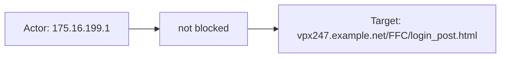
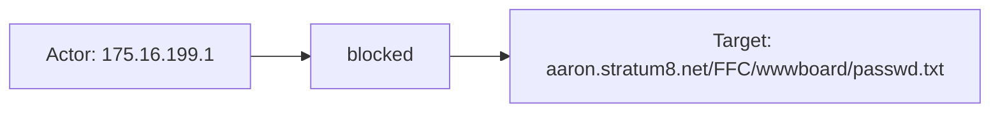
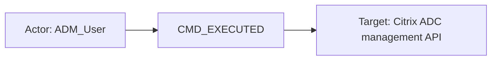

# citrix_waf

## Product Domain

Citrix Web App Firewall (also known as NetScaler Web App Firewall or Citrix Application Firewall) is an enterprise web application firewall built into the Citrix ADC (Application Delivery Controller) platform, formerly branded as NetScaler. Rather than a standalone appliance, the WAF is a licensed feature of the ADC that inspects HTTP/HTTPS traffic at Layer 7 as part of the same platform that provides load balancing, SSL/TLS termination, and application delivery. Organizations deploy it in front of web applications, APIs, and internal web assets to filter malicious requests and responses before they reach backend servers.

The WAF uses a hybrid security model combining negative controls (signature-based detection for known attacks such as SQL injection, cross-site scripting, and OWASP Top 10 threats) with positive controls (profiles and dynamic learning that define allowed application behavior and block deviations). Security is enforced through policies, profiles, and signature objects bound to protected virtual servers. Events are session-aware, tracking cookies, form fields, and per-session URLs, and can result in actions such as block, log, transform, or permit. The product is available across hardware, virtual (VPX), cloud, and containerized ADC form factors.

Typical use cases include threat detection and response for web-based attacks, security posture assessment of WAF policy effectiveness, compliance and audit logging of web transactions, and operational troubleshooting to distinguish legitimate application issues from security-driven blocks. Security operations teams correlate WAF events with broader SIEM data to investigate blocked requests, tune policies, and maintain an audit trail of application-layer security activity.

## Data Collected (brief)

This integration collects Citrix Web App Firewall logs into a single **log** data stream via syslog (TCP or UDP) or log file input from Citrix ADC / NetScaler appliances. Logs are parsed from Common Event Format (CEF) or native Citrix format and include application firewall violations, signature matches, policy check results (e.g., start URL, field consistency, safe commerce), and audit events. Key fields cover security check names, WAF profile and session identifiers, event severity and action taken, HTTP request metadata (method, URL, request ID), client/source network details (IP, port, optional geolocation), and CEF device metadata. A pre-built Kibana dashboard provides overview visualizations for WAF activity.

## Expected Audit Log Entities

The integration has a single **log** data stream (`citrix_waf.log`) that ingests Citrix ADC / NetScaler syslog. **CEF APPFW** events (`citrix.cef_format: true`, `citrix.device_event_class_id: APPFW`) are the primary WAF audit trail — structured security-check violations with HTTP client, URL, profile, and enforcement action mapped to ECS. **Native-format** events cover the same APPFW checks plus audit-adjacent subsystems (SSL handshake logs, TCP connection lifecycle, ADC management **API**, and **AAA** authentication) where identity, action, and target details remain largely in `citrix.extended.message` / `citrix.detail` without ECS entity mapping.

No ECS `*.target.*` fields are populated. `target-fields-audit` classifies this package as `none` (`target_enhancement_packages.csv`: no `user.target.*`, `host.target.*`, `service.target.*`, or `entity.target.*`). The package does not appear in `destination_identity_hits.csv` — pipelines never set `destination.user.*` or `destination.host.*`.

**Event action:** `event.action` is populated **only for CEF APPFW** events via CEF `act` (enforcement disposition: `blocked`, `not blocked`, `transformed`). All native-format subsystems (APPFW, SSLLOG, TCP, API, AAA) leave `event.action` empty; the best action candidates are `citrix.name` (native header event name) and, for native APPFW, the trailing enforcement token (`<blocked>`) in `citrix.extended.message`. The security-check identifier `citrix.name` (e.g. `APPFW_STARTURL`, `APPFW_SIGNATURE_MATCH`) is distinct from enforcement disposition and is not copied to `event.action` today.

### Event action (semantic)

WAF events carry two action dimensions: (1) **enforcement disposition** — what the WAF did to the request (`blocked`, `not blocked`, `transformed`); (2) **security check / event type** — which check or subsystem fired (`APPFW_STARTURL`, `SSL_HANDSHAKE_SUCCESS`, `CMD_EXECUTED`). Only dimension (1) maps to `event.action` today, and only on the CEF path.

| Action (normalized label) | Classification | Confidence | Evidence | Per-stream notes |
| --- | --- | --- | --- | --- |
| `blocked` | detection | high | CEF `act=blocked` → `event.action: "blocked"` in `test-citrix-waf-cef.log-expected.json` (APPFW_STARTURL, APPFW_SIGNATURE_MATCH fixtures) | **log / CEF APPFW** |
| `not blocked` | detection | high | CEF `act=not blocked` → `event.action: "not blocked"` (APPFW_STARTURL, APPFW_FIELDCONSISTENCY, APPFW_SIGNATURE_MATCH fixtures) | **log / CEF APPFW** |
| `transformed` | configuration_change | high | CEF `act=transformed` → `event.action: "transformed"` (APPFW_SAFECOMMERCE, APPFW_SAFECOMMERCE_XFORM fixtures) | **log / CEF APPFW** |
| `APPFW_STARTURL` | detection | high | CEF header `citrix.name: "APPFW_STARTURL"` in all STARTURL fixtures; not mapped to `event.action` | **log / CEF APPFW** — security check name, not enforcement |
| `APPFW_FIELDCONSISTENCY` | detection | high | CEF `citrix.name: "APPFW_FIELDCONSISTENCY"` | **log / CEF APPFW** |
| `APPFW_SAFECOMMERCE` / `APPFW_SAFECOMMERCE_XFORM` | detection | high | CEF `citrix.name` in SAFECOMMERCE fixtures | **log / CEF APPFW** |
| `APPFW_SIGNATURE_MATCH` | detection | high | CEF `citrix.name: "APPFW_SIGNATURE_MATCH"` + `citrix.signature_violation_category` | **log / CEF APPFW** |
| `APPFW_cross-site scripting` (native) | detection | medium | `citrix.name: "APPFW_cross-site scripting"` in native APPFW XSS fixture; extended message ends with `<blocked>` | **log / native APPFW** — check name + inline enforcement token |
| `SSL_HANDSHAKE_SUCCESS` | data_access | high | `citrix.name: "SSL_HANDSHAKE_SUCCESS"` in native SSLLOG fixture | **log / native SSLLOG** |
| `CONN_DELINK` / `CONN_TERMINATE` | data_access | high | `citrix.name` in native TCP fixtures (`CONN_DELINK`, `CONN_TERMINATE`) | **log / native TCP** — connection lifecycle, not security enforcement |
| `CMD_EXECUTED` | administration | high | `citrix.name: "CMD_EXECUTED"`; extended message `Command "logout"` in API fixture | **log / native API** |
| Authentication rejected (AAA) | authentication | low | Extended message `"Authentication is rejected for sshah …"` in AAA fixture; `citrix.name` is generic `Message` | **log / native AAA** — auth outcome in free text, not structured action field |

### Event action (ECS candidates)

| ECS / vendor field | Mapped to `event.action` today? | Mapping correct? | Recommended `event.action` value (from fixtures) | Enhancement candidate? | Evidence |
| --- | --- | --- | --- | --- | --- |
| `citrix.extended_kv.act` → `event.action` | yes (CEF APPFW only) | yes | `blocked`, `not blocked`, `transformed` | no | `cef.yml` L61–65: `act` rename to `event.action`; all 10 CEF fixtures in `test-citrix-waf-cef.log-expected.json` and `sample_event.json` |
| `citrix.name` (CEF header) | no | n/a | `APPFW_STARTURL`, `APPFW_FIELDCONSISTENCY`, `APPFW_SIGNATURE_MATCH`, `APPFW_SAFECOMMERCE`, `APPFW_SAFECOMMERCE_XFORM` | yes — copy as secondary action or `event.type`/`rule.name` enrichment | CEF dissect in `cef.yml` L12; populated in all CEF fixtures; identifies security check, not enforcement |
| `citrix.name` (native header) | no | n/a | `APPFW_cross-site scripting`, `SSL_HANDSHAKE_SUCCESS`, `CONN_DELINK`, `CONN_TERMINATE`, `CMD_EXECUTED`, `Message` | yes — primary native action candidate | `native.yml` L23 grok → `citrix.name`; all native fixtures |
| `citrix.extended.message` enforcement token (native APPFW) | no | n/a | `blocked` (from trailing `<blocked>`) | yes — parse and map to `event.action` for parity with CEF | Native APPFW XSS fixture: `…"Bad tag: script" <blocked>` |
| `citrix.extended.message` Command (native API) | no | n/a | `logout` (from `Command "logout"`) | yes — alternative to `citrix.name` for API events | Native API fixture: `Command "logout" - Status "Success"` |
| `citrix.extended.message` auth text (native AAA) | no | n/a | `authentication-rejected` (inferred from message text) | yes — requires grok/dissect; low confidence due to generic `citrix.name: Message` | AAA rejection fixture: `"Authentication is rejected for sshah …"` |
| `http.request.method` | no | n/a | `GET` | no — HTTP method is request context, not WAF action | CEF only; `cef.yml` L48–53 |
| `event.type`, `event.category` | no | n/a | — | no | Not set in any pipeline or fixture |

**Per-stream action summary (Step 2b):**

| Stream | `event.action` in fixtures? | Pipeline maps to `event.action`? | Primary action candidate | Confidence | Evidence |
| --- | --- | --- | --- | --- | --- |
| log / CEF APPFW | yes | yes | `citrix.extended_kv.act` | high | `blocked`, `not blocked`, `transformed` in all CEF fixtures |
| log / native APPFW | no | no | `citrix.name` + `<blocked>` in `citrix.extended.message` | medium | `APPFW_cross-site scripting`, trailing `<blocked>` |
| log / native SSLLOG | no | no | `citrix.name` | high | `SSL_HANDSHAKE_SUCCESS` |
| log / native TCP | no | no | `citrix.name` | high | `CONN_DELINK`, `CONN_TERMINATE` |
| log / native API | no | no | `citrix.name` (`CMD_EXECUTED`) or `Command` in extended message | high | `CMD_EXECUTED`, `Command "logout"` |
| log / native AAA | no | no | auth outcome text in `citrix.extended.message` | low | `"Authentication is rejected for sshah …"`; `citrix.name: Message` |

### Actor (semantic)

| Entity | Classification | Entity type (if general) | Confidence | Evidence | Per-stream notes |
| --- | --- | --- | --- | --- | --- |
| HTTP client (WAF violator) | host | — | high | CEF `src`/`spt` → `source.ip`/`source.port` (`cef.yml`); all 10 CEF fixtures in `test-citrix-waf-cef.log-expected.json` and `sample_event.json` (e.g. `source.ip: "175.16.199.1"`, `source.port: 54711`) | **log / CEF APPFW** only |
| HTTP client (native APPFW) | host | — | medium | Client IP embedded in `citrix.extended.message` (e.g. `175.16.199.1` leading token in native APPFW XSS fixture); `native.yml` does not map to `source.*` | **log / native APPFW** |
| TLS client | host | — | medium | `ClientIP 172.25.184.157` in `citrix.extended.message` (`test-citrix-waf-native.log-expected.json`, `SSLLOG SSL_HANDSHAKE_SUCCESS`) | **log / native SSLLOG** |
| TCP connection initiator | host | — | medium | `Source 192.168.10.10:52187` in extended message (`TCP CONN_DELINK` fixture) | **log / native TCP** |
| ADC administrator (API caller) | user | — | high | `User - ADM_User` in extended message (`API CMD_EXECUTED` fixture) | **log / native API** |
| Authenticating user (AAA rejection) | user | — | low | Username `sshah` in free text: `"Authentication is rejected for sshah (client ip : 81.2.69.144 …)"` (`AAA Message` fixture) | **log / native AAA** (some AAA messages have no user actor, e.g. `sslvpn_aaad_login_handler`) |
| Anonymous HTTP session | general | session | high | `citrix.session_id` ← CEF `cs3` (e.g. `IliG4Dxp1SjOhKVRDVBXmqvAaIcA000` in `sample_event.json`); session cookie ID, not a named principal | **log / CEF APPFW** |

**Not an actor:** `client.ip` is the syslog-sending ADC appliance IP parsed from the syslog header (`default.yml` grok `%{IP:client.ip:ip}`), not the HTTP/TLS client. `citrix.host` is the ADC hostname in native headers. `citrix.ppe_id` identifies the packet-processing engine, not a security principal.

### Actor (ECS candidates)

| ECS / vendor field | Role | Mapped today? | Mapping correct? | Confidence | Evidence |
| --- | --- | --- | --- | --- | --- |
| `source.ip` | HTTP client IP (WAF actor) | yes (CEF only) | yes | high | `cef.yml`: `citrix.extended_kv.src` → `source.ip`; populated in all CEF fixtures, absent in native APPFW fixtures |
| `source.port` | HTTP client port | yes (CEF only) | yes | high | `cef.yml`: `citrix.extended_kv.spt` → `source.port` |
| `source.geo.*`, `source.as.*` | Geo/ASN enrichment of HTTP client | yes (CEF only) | yes | high | `default.yml` geoip on `source.ip` after CEF pipeline |
| `client.ip` | Syslog sender (ADC appliance) | yes | n/a | high | `default.yml` grok; always `81.2.69.144` in fixtures — collector context, not WAF actor |
| `client.geo.*`, `client.as.*` | Geo/ASN of ADC syslog sender | yes | n/a | high | `default.yml` geoip on `client.ip` |
| `citrix.session_id` | Anonymous HTTP session identifier | yes (CEF only) | yes | high | `cef.yml`: `cs3` → `citrix.session_id`; vendor-only, not mapped to ECS user |
| `citrix.extended.message` | Unstructured actor hints (native) | yes (native) | n/a | medium | Native APPFW client IP, API `User - ADM_User`, AAA username, SSL `ClientIP`, TCP `Source` — all vendor-only |
| `citrix.host` | ADC hostname (log source) | yes (native) | n/a | high | Parsed in `native.yml` HEADER grok; observer context, not event actor |
| `user.*`, `source.user.*`, `client.user.*` | — | no | n/a | — | Declared in `ecs.yml` but never populated in `sample_event.json` or pipeline fixtures |

### Target (semantic)

| Layer | Description | Entity | Classification | Entity type (if general) | Confidence | Evidence | Per-stream notes |
| --- | --- | --- | --- | --- | --- | --- | --- |
| 1 — Platform / appliance | Citrix ADC WAF subsystem enforcing the check | Citrix NetScaler Application Firewall (`APPFW`) | service | — | high | CEF header: `citrix.device_product: "NetScaler"`, `citrix.device_event_class_id: "APPFW"`, `citrix.device_vendor: "Citrix"`; native APPFW same class ID | CEF + native APPFW |
| 1 — Platform / appliance | ADC SSL termination subsystem | SSL virtual server / TLS endpoint | service | — | medium | `VserverServiceIP 10.254.14.94 - VserverServicePort 443` in native SSLLOG extended message | **log / native SSLLOG** |
| 1 — Platform / appliance | ADC management plane | Citrix ADC REST/API | service | — | high | `device_event_class_id: API`, `Command "logout"` in extended message | **log / native API** |
| 1 — Platform / appliance | ADC authentication virtual server | AAA vserver | service | — | medium | `vserver ip: 192.168.10.10` in AAA rejection message | **log / native AAA** |
| 2 — Resource / object | Protected web application (virtual server + URL) | Backend web app at requested URL | service | — | high | CEF: `url.domain`, `url.path`, `url.scheme` from `request` via `cef.yml` + `uri_parts` in `default.yml` (e.g. `url.domain: "vpx247.example.net"`, `url.path: "/FFC/login_post.html"`) | **log / CEF APPFW** |
| 2 — Resource / object | Protected web application (native) | Request URL in unstructured message | service | — | medium | `http://aaron.stratum8.net/FFC/login.php?…` in native APPFW extended message; not parsed to `url.*` | **log / native APPFW** |
| 2 — Resource / object | WAF security profile / policy | Named WAF profile bound to vserver | general | waf_profile | high | `citrix.profile_name` ← CEF `cs1` (e.g. `"profile1"`, `"pr_ffc"`) | **log / CEF APPFW** |
| 2 — Resource / object | WAF security check | Named check that fired | general | security_check | high | `citrix.name` (e.g. `APPFW_STARTURL`, `APPFW_SIGNATURE_MATCH`, `APPFW_FIELDCONSISTENCY`) | CEF + native APPFW |
| 2 — Resource / object | Signature violation category | Signature rule grouping | general | signature_category | high | `citrix.signature_violation_category` ← CEF `cs6` (signature-match events in CEF fixtures) | **log / CEF APPFW** (signature events) |
| 2 — Resource / object | ADC virtual server (TCP) | Front-end vserver IP:port | service | — | medium | `Vserver 81.2.69.144:80` in native TCP `CONN_DELINK` extended message | **log / native TCP** |
| 2 — Resource / object | Backend server (TCP) | Destination endpoint behind ADC | host | — | medium | `Destination 192.168.10.51:35341` in native TCP `CONN_TERMINATE` extended message | **log / native TCP** |
| 3 — Content / artifact | HTTP transaction instance | Specific request being inspected | general | http_transaction | high | `http.request.id` ← CEF `cn2`, `http.request.method` ← CEF `method` | **log / CEF APPFW** |
| 3 — Content / artifact | Violation detail message | Human-readable check failure text | general | violation_message | high | `message` ← CEF `msg` (e.g. `"Disallow Illegal URL."`, `"Field consistency check failed for field passwd"`) | **log / CEF APPFW** |

### Target (ECS candidates)

| ECS / vendor field | Layer | Classification | Mapped today? | Mapping correct? | ECS target bucket | Enhancement candidate? | Evidence |
| --- | --- | --- | --- | --- | --- | --- | --- |
| `url.original`, `url.domain`, `url.path`, `url.scheme`, `url.query` | 2 | service | yes (CEF only) | yes | context-only (`url.*` is request target, not `service.target.*`) | yes → `service.target.entity.id` or dedicated URL target field | `cef.yml` `request` → `url.original`; `default.yml` `uri_parts`; e.g. `url.domain: "aaron.stratum8.net"` in CEF fixtures |
| `citrix.profile_name` | 2 | general (waf_profile) | yes (CEF only) | yes | n/a (vendor-only) | yes → `service.target.name` or custom entity | `cef.yml`: `cs1` → `citrix.profile_name` |
| `citrix.name` | 2 | general (security_check) | yes | yes | n/a (vendor-only) | yes → could enrich `event.action` (check name) or rule metadata | CEF dissect + native grok; e.g. `APPFW_SIGNATURE_MATCH`, `APPFW_cross-site scripting` |
| `citrix.signature_violation_category` | 2 | general (signature_category) | yes (CEF only) | yes | n/a (vendor-only) | yes → rule/threat taxonomy field | `cef.yml`: `cs6` → `citrix.signature_violation_category` |
| `http.request.id`, `http.request.method` | 3 | general (http_transaction) | yes (CEF only) | yes | context-only | no | `cef.yml`: `cn2` → `http.request.id`, `method` → `http.request.method` |
| `message` | 3 | general (violation_message) | yes (CEF only) | yes | context-only | no | `cef.yml`: `msg` → `message` |
| `citrix.device_product`, `citrix.device_event_class_id` | 1 | service | yes | yes | context-only | no | CEF dissect header fields; identify NetScaler APPFW subsystem |
| `citrix.extended.message` (native URL/vserver) | 2 | service / host | yes (native) | n/a | n/a (unparsed) | yes — parse native APPFW URL to `url.*`; TCP Destination/Vserver to `destination.*` or `host.target.*` | Native fixtures: APPFW URL, SSL vserver IP, TCP Source/Destination/Vserver all vendor-only |
| `destination.*`, `user.target.*`, `host.target.*`, `service.target.*` | — | — | no | n/a | — | n/a | Not set in any pipeline; `target_enhancement_packages.csv`: `citrix_waf,none` |

### Gaps and mapping notes

- **CEF vs native split:** Only CEF APPFW events get structured ECS actor (`source.ip`/`source.port`), target (`url.*`, `http.request.*`), and action (`event.action`) fields. Native APPFW, SSL, TCP, API, and AAA events retain identity and action in `citrix.extended.message` — the richest source for enhancement but unparsed today.
- **`event.action` gaps:** CEF APPFW maps enforcement disposition (`blocked`, `not blocked`, `transformed`) correctly via `act`. Native subsystems have no `event.action` — recommend mapping `citrix.name` as primary candidate (`SSL_HANDSHAKE_SUCCESS`, `CMD_EXECUTED`, `CONN_DELINK`); for native APPFW, also parse trailing `<blocked>` / enforcement token for parity with CEF. Security check name (`citrix.name` e.g. `APPFW_STARTURL`) is not copied to `event.action` on any path — consider as complementary field or rule metadata, not a replacement for enforcement disposition.
- **No official ECS target fields:** Protected application URL (`url.*`) and WAF profile (`citrix.profile_name`) semantically represent targets but sit in context/vendor namespaces. No `*.target.*` or `destination.*` mapping exists; aligns with `target_enhancement_packages.csv` (`none`).
- **`client.ip` conflation risk:** Always the ADC syslog sender, not the HTTP client. Analysts must use `source.ip` (CEF) or parse `citrix.extended.message` (native) for the true WAF actor endpoint.
- **Admin/API actor unmapped:** Native `API CMD_EXECUTED` exposes `User - ADM_User` in vendor message with no `user.name` mapping — enhancement candidate for ADC admin audit correlation.
- **AAA dual semantics:** Some AAA messages name a user actor (`sshah` rejection); others are subsystem diagnostics (`sslvpn_aaad_login_handler`, `ns_aaa_login_handler`) with no distinct actor beyond the ADC itself. Auth outcome is action-relevant but only in free text.
- **TCP native events:** `Source`/`Destination`/`Vserver` in extended message are network-session peers and virtual-server endpoints — could map to `source.*`/`destination.*` for session telemetry but are not audit-target fields today.
- **ECS declarations without population:** `ecs.yml` lists `user.*`, `source.user.*`, `client.user.*`, `server.*`, and `observer.*` but no pipeline step or fixture populates them for this package.

### Per-stream notes

**log / CEF APPFW** — Primary WAF audit path. Nine distinct security checks in fixtures: `APPFW_STARTURL`, `APPFW_FIELDCONSISTENCY`, `APPFW_SAFECOMMERCE`, `APPFW_SIGNATURE_MATCH`, `APPFW_SAFECOMMERCE_XFORM`. Actor = HTTP client at `source.ip`; target Layer 2 = `url.*` + `citrix.profile_name`; Layer 3 = `http.request.id` + `message`. Action = `event.action` enforcement disposition (`blocked`, `not blocked`, `transformed`); security check name in `citrix.name` (not mapped to `event.action`).

**log / native APPFW** — Same WAF semantics as CEF but unstructured. Actor host IP and target URL only in `citrix.extended.message`. No `source.ip`, `url.*`, or `event.action` in fixtures. Action candidates: `citrix.name` (`APPFW_cross-site scripting`) + `<blocked>` enforcement token in extended message.

**log / native SSLLOG, TCP** — Connection/session telemetry (TLS handshake success, connection delink/terminate). Audit-adjacent; actor/target identity in extended message only (`ClientIP`, `VserverServiceIP`, `Source`, `Destination`). Action candidate: `citrix.name` (`SSL_HANDSHAKE_SUCCESS`, `CONN_DELINK`, `CONN_TERMINATE`).

**log / native API, AAA** — ADC management and authentication audit-adjacent logs. API events have a clear **user** admin actor in vendor text; action candidate `citrix.name: CMD_EXECUTED` or `Command "logout"`. AAA mix of user rejection events and subsystem handler messages; action only in free text (`Authentication is rejected for sshah`).

## Example Event Graph

Examples below come from the single `citrix_waf.log` data stream. CEF APPFW events are true WAF audit logs with structured ECS actor, action, and target fields; native-format subsystems (APPFW, API, AAA, SSL, TCP) are audit-adjacent and retain identity in `citrix.extended.message`.

### Example 1: CEF start-URL violation (logged, not blocked)

**Stream:** `citrix_waf.log` · **Fixture:** `packages/citrix_waf/data_stream/log/sample_event.json`

```
HTTP client (175.16.199.1) → not blocked → vpx247.example.net/FFC/login_post.html
```

#### Actor

| Field | Value |
| --- | --- |
| id | 175.16.199.1 |
| type | host |
| geo | Changchun, CN |
| ip | 175.16.199.1 |

**Field sources:**

- `id ← source.ip`
- `geo ← source.geo.city_name, source.geo.country_name`
- `ip ← source.ip`

#### Event action

| Field | Value |
| --- | --- |
| action | not blocked |
| source_field | `event.action` |
| source_value | not blocked |

#### Target

| Field | Value |
| --- | --- |
| id | 535 |
| name | vpx247.example.net/FFC/login_post.html |
| type | service |
| sub_type | protected_web_app |

**Field sources:**

- `id ← http.request.id`
- `name ← url.domain, url.path`
- `sub_type ← semantic (protected web application behind WAF virtual server)`

#### Mermaid (optional)



### Example 2: CEF signature match (blocked)

**Stream:** `citrix_waf.log` · **Fixture:** `packages/citrix_waf/data_stream/log/_dev/test/pipeline/test-citrix-waf-cef.log-expected.json` (APPFW_SIGNATURE_MATCH, `act=blocked`)

```
HTTP client (175.16.199.1) → blocked → aaron.stratum8.net/FFC/wwwboard/passwd.txt
```

#### Actor

| Field | Value |
| --- | --- |
| id | 175.16.199.1 |
| type | host |
| geo | Changchun, CN |
| ip | 175.16.199.1 |

**Field sources:**

- `id ← source.ip`
- `geo ← source.geo.city_name, source.geo.country_name`
- `ip ← source.ip`

#### Event action

| Field | Value |
| --- | --- |
| action | blocked |
| source_field | `event.action` |
| source_value | blocked |

#### Target

| Field | Value |
| --- | --- |
| id | 841 |
| name | aaron.stratum8.net/FFC/wwwboard/passwd.txt |
| type | service |
| sub_type | protected_web_app |

**Field sources:**

- `id ← http.request.id`
- `name ← url.domain, url.path`
- `sub_type ← semantic (protected web application; signature category `web-cgi` in `citrix.signature_violation_category` describes the matched rule, not the target entity)`

#### Mermaid (optional)



### Example 3: Native API admin command (audit-adjacent)

**Stream:** `citrix_waf.log` · **Fixture:** `packages/citrix_waf/data_stream/log/_dev/test/pipeline/test-citrix-waf-native.log-expected.json` (API CMD_EXECUTED)

```
ADC administrator (ADM_User) → CMD_EXECUTED → Citrix ADC management API
```

#### Actor

| Field | Value |
| --- | --- |
| name | ADM_User |
| type | user |

**Field sources:**

- `name ← citrix.extended.message` (`User - ADM_User`; not mapped to `user.name` today)

#### Event action

| Field | Value |
| --- | --- |
| action | CMD_EXECUTED |
| source_field | `citrix.name` |
| source_value | CMD_EXECUTED |

Action derived from native header event name; **not mapped to ECS `event.action` today**. The executed command (`logout`) appears only in `citrix.extended.message`.

#### Target

| Field | Value |
| --- | --- |
| name | Citrix ADC management API |
| type | service |

**Field sources:**

- `name ← semantic (citrix.device_event_class_id: API; Command "logout" in citrix.extended.message)`

#### Mermaid (optional)



## ES|QL Entity Extraction

**Package type: agent-backed** (single `log` data stream, Tier A fixtures). Router: `data_stream.dataset == "citrix_waf.log"`. Secondary discriminators: `citrix.cef_format`, `citrix.device_event_class_id`, `citrix.name`. **CEF APPFW** events already populate `source.ip`, `url.*`, `http.request.*`, and `event.action` (enforcement disposition); Pass 4 fills normalized `host.*` / `*.target.*` columns without overwriting ingest values. **Native-format** subsystems (APPFW, SSL, TCP, API, AAA) get partial fallbacks only where fixtures support a field path or Pass 3 semantic literals apply. **Pass 4 (tautology cleanup):** mapped columns use **column-level** `CASE(<col> IS NOT NULL, <col>, fallback, null)` — not `CASE(actor_exists, host.ip, …, host.ip, null)` when `actor_exists` is true from `source.ip` while `host.ip` is still empty (Pass 4 §10). No ECS `*.target.*` at ingest; preserve branches use per-column `IS NOT NULL`, not blind `target_exists` on empty target columns.

### Dataset inventory

| data_stream.dataset | Stream role | Actor classification(s) | Target classification(s) | Extraction |
| --- | --- | --- | --- | --- |
| `citrix_waf.log` (CEF APPFW) | WAF audit | host | service (protected URL) | full |
| `citrix_waf.log` (native API) | admin audit-adjacent | user | service | partial |
| `citrix_waf.log` (native APPFW/SSL/TCP/AAA) | telemetry / auth-adjacent | host, user | service, host | partial / none |

### Field mapping plan

#### Actor mappings

| Output column | Source field(s) | Condition (dataset + optional) | Confidence | Notes |
| --- | --- | --- | --- | --- |
| `host.ip` | `source.ip` | `data_stream.dataset == "citrix_waf.log" AND TO_BOOLEAN(citrix.cef_format) == true AND source.ip IS NOT NULL AND host.ip IS NULL` | high | **vendor fallback** — HTTP client indexed as `source.ip` (CEF `src`); column-level preserve on `host.ip` |
| `user.name` | `"ADM_User"` | `data_stream.dataset == "citrix_waf.log" AND citrix.name == "CMD_EXECUTED" AND user.name IS NULL` | low | **semantic literal** — native API fixture only; username not in `user.name` today |

#### Target mappings

| Output column | Source field(s) | Condition (dataset + optional) | Confidence | Notes |
| --- | --- | --- | --- | --- |
| `service.target.id` | `http.request.id` | `data_stream.dataset == "citrix_waf.log" AND TO_BOOLEAN(citrix.cef_format) == true AND http.request.id IS NOT NULL AND service.target.id IS NULL` | high | **vendor fallback** — Pass 3 Example 1–2; no ingest `*.target.*` |
| `service.target.name` | `CONCAT(url.domain, url.path)` | `data_stream.dataset == "citrix_waf.log" AND TO_BOOLEAN(citrix.cef_format) == true AND url.domain IS NOT NULL AND service.target.name IS NULL` | high | **vendor fallback** — protected web app (domain + path) |
| `service.target.name` | `"Citrix ADC management API"` | `data_stream.dataset == "citrix_waf.log" AND citrix.device_event_class_id == "API" AND service.target.name IS NULL` | low | **semantic literal** — Pass 3 Example 3 |
| `service.target.name` | `"Citrix NetScaler APPFW"` | `data_stream.dataset == "citrix_waf.log" AND citrix.device_event_class_id == "APPFW" AND (citrix.cef_format IS NULL OR TO_BOOLEAN(citrix.cef_format) == false) AND service.target.name IS NULL` | low | **semantic literal** — native APPFW subsystem (Layer 1) |
| `entity.target.type` | `"service"` | `data_stream.dataset == "citrix_waf.log" AND (TO_BOOLEAN(citrix.cef_format) == true OR citrix.device_event_class_id IN ("API", "APPFW")) AND entity.target.type IS NULL` | medium | classification helper — column-level preserve |
| `entity.target.sub_type` | `"protected_web_app"` | `data_stream.dataset == "citrix_waf.log" AND TO_BOOLEAN(citrix.cef_format) == true AND url.domain IS NOT NULL AND entity.target.sub_type IS NULL` | low | **semantic literal** — Pass 3 CEF WAF examples |

#### Event action mappings

| Output column | Source field(s) | Condition (dataset + optional) | Confidence | Notes |
| --- | --- | --- | --- | --- |
| `event.action` | `event.action` | `event.action IS NOT NULL` | high | **preserve existing** — CEF `act` → `event.action` at ingest |
| `event.action` | `citrix.name` | `data_stream.dataset == "citrix_waf.log" AND (citrix.cef_format IS NULL OR TO_BOOLEAN(citrix.cef_format) == false) AND citrix.name IS NOT NULL AND event.action IS NULL` | high | **vendor fallback** — native subsystems only; never replace CEF enforcement disposition |

### Detection flags (mandatory — run first)

`actor_exists` includes `source.ip` because this integration maps the HTTP client to `source.*`, not `host.ip`, at ingest time. Mapped actor/target/action columns below use **column-level** `IS NOT NULL` preserve (Pass 4 §10), not blind `CASE(actor_exists, host.ip, …)` when `source.ip` alone is set.

**ES|QL `CASE` arity:** Arguments are **(condition, value)** pairs; odd count → last arg is default. Wrong: `CASE(host.ip IS NOT NULL, host.ip, source.ip, null)` (4 args — `source.ip` is a **condition**, not a value). Wrong: `CASE(actor_exists, host.ip, source.ip, null)` (same). Right: **5-arg** `CASE(host.ip IS NOT NULL, host.ip, data_stream.dataset == "citrix_waf.log" AND TO_BOOLEAN(citrix.cef_format) == true AND source.ip IS NOT NULL, source.ip, null)`. **9-arg** when multiple target fallbacks apply (`service.target.name`). Do not use `CASE(actor_exists|target_exists|action_exists, <col>, …)` as the first branch on mapped columns.

```esql
| EVAL
  actor_exists = user.id IS NOT NULL OR user.name IS NOT NULL OR user.email IS NOT NULL
    OR host.id IS NOT NULL OR host.ip IS NOT NULL OR host.name IS NOT NULL
    OR source.ip IS NOT NULL
    OR service.id IS NOT NULL OR service.name IS NOT NULL
    OR entity.id IS NOT NULL OR entity.name IS NOT NULL,
  target_exists = user.target.id IS NOT NULL OR user.target.name IS NOT NULL OR user.target.email IS NOT NULL
    OR host.target.id IS NOT NULL OR host.target.ip IS NOT NULL OR host.target.name IS NOT NULL
    OR service.target.id IS NOT NULL OR service.target.name IS NOT NULL
    OR entity.target.id IS NOT NULL OR entity.target.name IS NOT NULL
    OR entity.target.type IS NOT NULL OR entity.target.sub_type IS NOT NULL,
  action_exists = event.action IS NOT NULL
```

### Combined ES|QL — actor fields

```esql
| EVAL
  host.ip = CASE(
    host.ip IS NOT NULL, host.ip,
    data_stream.dataset == "citrix_waf.log" AND TO_BOOLEAN(citrix.cef_format) == true AND source.ip IS NOT NULL, source.ip,
    null
  ),
  user.name = CASE(
    user.name IS NOT NULL, user.name,
    data_stream.dataset == "citrix_waf.log" AND citrix.name == "CMD_EXECUTED", "ADM_User",
    null
  )
```

### Combined ES|QL — event action

```esql
| EVAL
  event.action = CASE(
    event.action IS NOT NULL, event.action,
    data_stream.dataset == "citrix_waf.log" AND (citrix.cef_format IS NULL OR TO_BOOLEAN(citrix.cef_format) == false) AND citrix.name IS NOT NULL, citrix.name,
    null
  )
```

### Combined ES|QL — target fields

```esql
| EVAL
  service.target.id = CASE(
    service.target.id IS NOT NULL, service.target.id,
    data_stream.dataset == "citrix_waf.log" AND TO_BOOLEAN(citrix.cef_format) == true AND http.request.id IS NOT NULL, http.request.id,
    null
  ),
  service.target.name = CASE(
    service.target.name IS NOT NULL, service.target.name,
    data_stream.dataset == "citrix_waf.log" AND TO_BOOLEAN(citrix.cef_format) == true AND url.domain IS NOT NULL, CONCAT(url.domain, url.path),
    data_stream.dataset == "citrix_waf.log" AND citrix.device_event_class_id == "API", "Citrix ADC management API",
    data_stream.dataset == "citrix_waf.log" AND citrix.device_event_class_id == "APPFW" AND (citrix.cef_format IS NULL OR TO_BOOLEAN(citrix.cef_format) == false), "Citrix NetScaler APPFW",
    null
  ),
  entity.target.type = CASE(
    entity.target.type IS NOT NULL, entity.target.type,
    data_stream.dataset == "citrix_waf.log" AND TO_BOOLEAN(citrix.cef_format) == true, "service",
    data_stream.dataset == "citrix_waf.log" AND citrix.device_event_class_id IN ("API", "APPFW"), "service",
    null
  ),
  entity.target.sub_type = CASE(
    entity.target.sub_type IS NOT NULL, entity.target.sub_type,
    data_stream.dataset == "citrix_waf.log" AND TO_BOOLEAN(citrix.cef_format) == true AND url.domain IS NOT NULL, "protected_web_app",
    null
  )
```

### Full pipeline fragment (optional)

```esql
FROM logs-*
| EVAL
  actor_exists = user.id IS NOT NULL OR user.name IS NOT NULL OR user.email IS NOT NULL
    OR host.id IS NOT NULL OR host.ip IS NOT NULL OR host.name IS NOT NULL
    OR source.ip IS NOT NULL
    OR service.id IS NOT NULL OR service.name IS NOT NULL
    OR entity.id IS NOT NULL OR entity.name IS NOT NULL,
  target_exists = user.target.id IS NOT NULL OR user.target.name IS NOT NULL OR user.target.email IS NOT NULL
    OR host.target.id IS NOT NULL OR host.target.ip IS NOT NULL OR host.target.name IS NOT NULL
    OR service.target.id IS NOT NULL OR service.target.name IS NOT NULL
    OR entity.target.id IS NOT NULL OR entity.target.name IS NOT NULL
    OR entity.target.type IS NOT NULL OR entity.target.sub_type IS NOT NULL,
  action_exists = event.action IS NOT NULL
| EVAL
  host.ip = CASE(
    host.ip IS NOT NULL, host.ip,
    data_stream.dataset == "citrix_waf.log" AND TO_BOOLEAN(citrix.cef_format) == true AND source.ip IS NOT NULL, source.ip,
    null
  ),
  user.name = CASE(
    user.name IS NOT NULL, user.name,
    data_stream.dataset == "citrix_waf.log" AND citrix.name == "CMD_EXECUTED", "ADM_User",
    null
  ),
  event.action = CASE(
    event.action IS NOT NULL, event.action,
    data_stream.dataset == "citrix_waf.log" AND (citrix.cef_format IS NULL OR TO_BOOLEAN(citrix.cef_format) == false) AND citrix.name IS NOT NULL, citrix.name,
    null
  ),
  service.target.id = CASE(
    service.target.id IS NOT NULL, service.target.id,
    data_stream.dataset == "citrix_waf.log" AND TO_BOOLEAN(citrix.cef_format) == true AND http.request.id IS NOT NULL, http.request.id,
    null
  ),
  service.target.name = CASE(
    service.target.name IS NOT NULL, service.target.name,
    data_stream.dataset == "citrix_waf.log" AND TO_BOOLEAN(citrix.cef_format) == true AND url.domain IS NOT NULL, CONCAT(url.domain, url.path),
    data_stream.dataset == "citrix_waf.log" AND citrix.device_event_class_id == "API", "Citrix ADC management API",
    data_stream.dataset == "citrix_waf.log" AND citrix.device_event_class_id == "APPFW" AND (citrix.cef_format IS NULL OR TO_BOOLEAN(citrix.cef_format) == false), "Citrix NetScaler APPFW",
    null
  ),
  entity.target.type = CASE(
    entity.target.type IS NOT NULL, entity.target.type,
    data_stream.dataset == "citrix_waf.log" AND TO_BOOLEAN(citrix.cef_format) == true, "service",
    data_stream.dataset == "citrix_waf.log" AND citrix.device_event_class_id IN ("API", "APPFW"), "service",
    null
  ),
  entity.target.sub_type = CASE(
    entity.target.sub_type IS NOT NULL, entity.target.sub_type,
    data_stream.dataset == "citrix_waf.log" AND TO_BOOLEAN(citrix.cef_format) == true AND url.domain IS NOT NULL, "protected_web_app",
    null
  )
| KEEP @timestamp, data_stream.dataset, event.action, citrix.name, host.ip, source.ip, service.target.id, service.target.name, entity.target.type, entity.target.sub_type, message
```

### Streams excluded

*(none — single `citrix_waf.log` dataset; native APPFW/SSL/TCP/AAA lack structured fields for full extraction — see Gaps)*

### Gaps and limitations

- **Native APPFW/SSL/TCP/AAA** — actor/target identity in unparsed `citrix.extended.message`; no fixture-grounded ES|QL paths except `citrix.name` → `event.action` and API/APPFW semantic `service.target.name` literals.
- **`citrix.profile_name`** — WAF profile target (Pass 2 Layer 2) omitted when `url.*` is present to avoid competing with Pass 3 protected-URL target on the same event.
- **`citrix.name` on CEF** — security check name; must not replace ingest `event.action` (`blocked` / `not blocked` / `transformed`); `action_exists` preserves CEF disposition.
- **`client.ip`** — syslog sender (ADC appliance), not HTTP client; never map as actor.
- **`user.name` on API events** — admin username only in vendor message today; literal until pipeline maps `citrix.extended.message`.
- **AAA authentication rejection** — username `sshah` in free text only; omit `user.*` actor columns.
- **`host.target.*` / TCP `Destination`** — unparsed in native fixtures; no de-facto `destination.*` mapping in package.
- **Alignment with Pass 2** — package classified `target_enhancement_packages.csv: none`; query-time `*.target.*` fills graph columns only, not ingest ECS target fields.
- **Pass 4 CASE syntax** — actor/action/target blocks and the full pipeline fragment use odd-arity `CASE` (condition/value pairs + trailing `null`); column-level **5-arg** / **7-arg** / **9-arg** preserve (`<col> IS NOT NULL` first branch). Never **4-arg** `CASE(<col> IS NOT NULL, <col>, bare_field, null)` or `CASE(actor_exists|target_exists|action_exists, <col>, …)` (bare field parses as a condition). `actor_exists` / `target_exists` / `action_exists` are helpers only. Fragment aligned with combined `EVAL` blocks.
- **Pass 4 tautology cleanup (§10)** — `host.ip` uses `source.ip` fallback with column-level preserve (not `CASE(actor_exists, host.ip, …)` when `source.ip` alone is set); `user.name` / `*.target.*` / `event.action` use per-column `IS NOT NULL` preserve; no `CASE(col, col, …)` identity branches.
