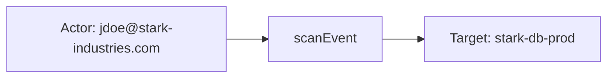
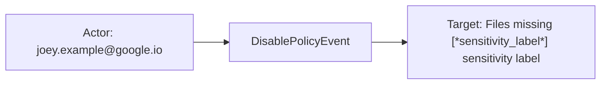
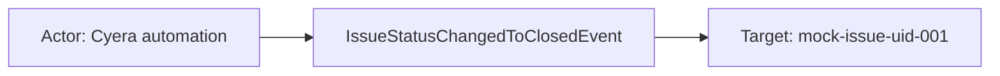

# cyera

## Product Domain

Cyera is a cloud data security platform focused on Data Security Posture Management (DSPM). It discovers, classifies, monitors, and protects sensitive data across multi-cloud and SaaS environments—including AWS, Azure, GCP, Microsoft 365, Snowflake, and other data stores. Rather than treating data risk as a separate silo from cloud security, Cyera maps where sensitive data resides, how it is classified, who owns it, and what policy violations or exposure conditions put that data at risk.

Core capabilities span several domains. **Data discovery and inventory** continuously finds structured and unstructured datastores (databases, object storage, SaaS drives, data warehouses) and tracks metadata such as provider, region, encryption, public accessibility, logging, and ownership. **Data classification** applies sensitivity labels and data-class taxonomy (e.g., financial, PII, PCI) with context on identifiability, tokenization, geo-location, and compliance frameworks. **Risk and issue management** surfaces prioritized findings when sensitive data is exposed, misconfigured, or stored in violation of policy—linking severity, risk status, affected records, remediation guidance, and compliance frameworks (PCI DSS, SOC 2, ISO 27001). **Activity and remediation events** record platform actions such as issue lifecycle changes, M365 sensitivity-label remediation, scan state updates, and report generation.

From a security operations perspective, Cyera is a primary source of data-centric risk intelligence. Teams use it to understand data sprawl, prioritize remediation by sensitivity and record count at risk, correlate datastore posture with active issues, and track remediation workflows tied to ITSM tickets. The Elastic Cyera integration ingests these signals into Elastic Security for unified search, dashboards, and data-security posture workflows.

## Data Collected (brief)

The integration collects four data streams from Cyera via **CEL API** (OAuth Client ID/Client Secret):

| Data stream | Description |
|---|---|
| **classification** (`cyera.classification`) | Data-class taxonomy—classification name, category, sensitivity level, group/level, identifiability, tokenization, geo context, compliance frameworks, and collections |
| **datastore** (`cyera.datastore`) | Discovered data repositories—type, provider, cloud account, region, sensitivity, record counts by sensitivity, encryption/logging/public-access state, owners, scanning state, and open issue counts |
| **issue** (`cyera.issue`) | Active data-security risks—severity, status, risk status, affected records/objects at risk, linked datastore and data classes, remediation advice, compliance frameworks, and ITSM ticket links |
| **event** (`cyera.event`) | Platform activity events—issue lifecycle, M365 sensitivity-label remediation, classification changes, scan/report actions, affected data classes, and policy/project context |

Events are normalized to ECS where applicable (cloud, user, service fields) with vendor details under `cyera.<data-stream>.*`. Elasticsearch latest transforms deduplicate classification, datastore, and issue records for current-state views in Kibana dashboards.

## Expected Audit Log Entities

Only **`event`** (`cyera.event`) is a true platform activity log: Cyera issue lifecycle, policy administration, scan/report actions, and M365 sensitivity-label remediation with optional user attribution. **`classification`**, **`datastore`**, and **`issue`** are inventory and risk-state snapshots (audit-adjacent for entity analytics, not per-action audit). No stream populates ECS `user.target.*`, `host.target.*`, `service.target.*`, or `entity.target.*`; no `destination.user.*` / `destination.host.*` in pipelines (`destination_identity_hits.csv` has no cyera row). The target-fields audit classifies cyera as **`moderate_candidate`** with `fixture_strong=true` and no ECS target tier-A mapping (`dev/target-fields-audit/out/target_enhancement_packages.csv`).

**`event.action` is absent in all streams** — no fixture or pipeline sets it. On **`event`**, the vendor operation name is preserved as `cyera.event.type` (`json.type` rename, `event/default.yml` L566–570); inventory streams have no meaningful per-event action.

Evidence: `packages/cyera/data_stream/*/sample_event.json`, `*/_dev/test/pipeline/*-expected.json`, `*/elasticsearch/ingest_pipeline/default.yml`, `*/fields/fields.yml`.

### Event action (semantic)

| Action (normalized label) | Classification | Confidence | Evidence | Per-stream notes |
| --- | --- | --- | --- | --- |
| `scanEvent` | data_access | high | `test-event.log-expected.json` L184; `test-event.log` L1 | **`event`** — datastore scan / classification activity with affected record counts |
| `IssueStatusChangedToClosedEvent` | configuration_change | high | `test-event.log-expected.json` L273; `issue.resolution.value: BySystem` | **`event`** — issue lifecycle closure (system-driven in fixture) |
| `M365SensitivityLabelRemediationFinishedEvent` | configuration_change | high | `sample_event.json` L47; `test-event.log-expected.json` L328 | **`event`** — M365 label remediation completion |
| `DisablePolicyEvent` | configuration_change | high | `test-event.log-expected.json` L356; `user: joey.example@google.io` | **`event`** — policy disabled by portal user |
| `CreateSensitivityLabelPolicyEvent` | configuration_change | high | `test-event.log-expected.json` L386 | **`event`** — policy creation (no user in fixture) |
| *(no per-event action)* | — | high | `event.kind: event` on classification/datastore; static inventory fields only | **`classification`**, **`datastore`** — CEL API inventory sync, not discrete platform mutations |
| *(no per-event action)* | — | high | `event.kind: alert`; risk-state fields (`severity`, `risk_status`) | **`issue`** — open finding snapshot, not an activity log entry |

### Event action (ECS candidates)

| ECS / vendor field | Mapped to `event.action` today? | Mapping correct? | Recommended `event.action` value (from fixtures) | Enhancement candidate? | Evidence |
| --- | --- | --- | --- | --- | --- |
| `cyera.event.type` | no | n/a | `scanEvent`, `IssueStatusChangedToClosedEvent`, `M365SensitivityLabelRemediationFinishedEvent`, `DisablePolicyEvent`, `CreateSensitivityLabelPolicyEvent` | **yes** | `json.type` → `cyera.event.type` (`event/default.yml` L566–570); primary vendor operation name |
| `event.action` | no | n/a | — | **yes** | Absent from all `sample_event.json`, `*-expected.json`; no pipeline `set`/`rename` to `event.action` |
| `cyera.event.issue.resolution.value` | no | n/a | `BySystem`, `Mitigated`, `In Progress` | no | Resolution detail on lifecycle events — subordinate to `cyera.event.type`, not a standalone action |
| `cyera.event.issue.risk_status` | no | n/a | `Mitigated`, `RemediationInProgress`, `Unmitigated` | no | Post-action state on issue events — outcome/status, not the verb |
| `event.kind` | yes (static) | partial | `alert` (event, issue), `event` (classification, datastore) | no | Kind distinguishes alert vs inventory record, not the operation performed |
| `event.severity` | yes (`issue` only) | n/a | numeric severity on issue snapshots | no | Risk priority on finding state — not an audit action |

Per-stream `event.action` check:

| Stream | `event.action` in fixtures? | Pipeline maps to `event.action`? | Primary action candidate | Confidence | Evidence |
| --- | --- | --- | --- | --- | --- |
| **event** | no | no | `cyera.event.type` | high | Five distinct types in `test-event.log-expected.json`; pipeline rename only |
| **classification** | no | no | *(none — inventory sync)* | high | Taxonomy record poll; no vendor `type` field |
| **datastore** | no | no | *(none — inventory sync)* | high | Datastore discovery poll; no vendor action field |
| **issue** | no | no | *(none — state snapshot)* | high | Risk finding record; no platform mutation verb |

### Actor (semantic)

| Entity | Classification | Entity type (if general) | Confidence | Evidence | Per-stream notes |
| --- | --- | --- | --- | --- | --- |
| Cyera portal operator / analyst | user | — | high | `json.user` → `user.name` + `related.user` (`event/default.yml`); `test-event.log-expected.json`: `jdoe@stark-industries.com` (`scanEvent`), `joey.example@google.io` (`DisablePolicyEvent`) | **`event`** — canonical human actor when `user` present |
| Cyera platform automation | service | — | high | No ECS `user.*` when `user` omitted; `issue.resolution.value: BySystem` (`IssueStatusChangedToClosedEvent`); `M365SensitivityLabelRemediationFinishedEvent`, `CreateSensitivityLabelPolicyEvent` fixtures | **`event`** — system-driven lifecycle, remediation, policy creation |
| Datastore owner (inventory metadata) | user | — | high | `owner` / `datastoreOwners[].email` → `user.email`, dissect → `user.name`/`user.domain`, `user.id` from `userId` (`datastore/default.yml`); `test-datastore.log-expected.json`: `some@admin.com` | **`datastore`** — ownership contact, not actor of a platform action |
| Issue / datastore owner (risk metadata) | user | — | high | `owner` → `user.email`/`user.name`; `datastoreOwners[].email` + `owner_type` → `user.roles`, `related.user` (`issue/default.yml`); `test-issue.log-expected.json`: owner `muskan`, roles `application-owner` | **`issue`** — accountability contact, not audit actor |
| Cyera classification poller | service | — | high | Static `observer.vendor`/`observer.product: Cyera` (`classification/default.yml`) | **`classification`** — API inventory sync; no human principal |

**No audit actor identity:** **`classification`**, **`datastore`**, **`issue`** — no acting user or service principal tied to a discrete platform mutation in those streams.

### Actor (ECS candidates)

| ECS / vendor field | Role | Mapped today? | Mapping correct? | Confidence | Evidence |
| --- | --- | --- | --- | --- | --- |
| `user.name` | Event portal user | yes (`event`) | partial | high | `json.user` copy; full email stored as `user.name` — no dissect to `user.email`/`user.domain` on event stream |
| `related.user` | Event actor enrichment | yes (`event`) | partial | high | Appends `cyera.event.user`; mixes actor email with no actor/target distinction |
| `cyera.event.user` | Vendor event actor | yes (removed unless `preserve_duplicate_custom_fields`) | n/a | high | Canonical vendor actor; stripped by default `remove_custom_duplicate_fields` step |
| `user.email` / `user.name` / `user.domain` | Datastore owner | yes (`datastore`) | no (not actor) | high | `json.owner` dissect; ownership metadata, not audit actor |
| `user.id` | Platform user id on datastore | yes (`datastore`) | no (not actor) | high | `json.userId` → `cyera.datastore.user.id` → `user.id`; fixture UUID |
| `user.email` / `user.name` / `user.roles` | Issue owner + datastore owners | yes (`issue`) | no (not actor) | high | `owner` dissect; `datastoreOwners[].owner_type` → `user.roles`; `related.user` holds owner UIDs and emails |
| `user.roles` | Classification data-subject role context | yes (`classification`) | no (not actor) | medium | `json.context.role` → `cyera.classification.context.role` → `user.roles`; taxonomy metadata |
| `observer.vendor` / `observer.product` | Cyera scanner identity | yes (`classification`) | yes (context) | high | Static `Cyera` |
| `cloud.account.id` / `cloud.account.name` | Cloud tenancy scope | yes (event, datastore, issue) | yes (scope) | high | Account fields — scope context, not actors |
| `service.name` | Datastore display name | yes (`datastore`) | no | medium | `json.name` → `service.name` — inventory label, not invoking service |

No `source.ip`, `client.user.*`, or `user.id` on the **event** stream.

### Target (semantic)

| Layer | Description | Entity | Classification | Entity type (if general) | Confidence | Evidence | Per-stream notes |
| --- | --- | --- | --- | --- | --- | --- | --- |
| 1 — Platform / cloud service | Invoked cloud datastore or SaaS platform | Azure SQL, OneDrive, aws-rds-instance | service | — | high | `datastore.infrastructure` / `issue.infrastructure` → `cloud.service.name`; fixtures: `Azure SQL`, `OneDrive`, `aws-rds-instance` | **`event`**, **`datastore`**, **`issue`** |
| 2 — Resource / object | Datastore, issue, policy, classification, cloud account, project | stark-db-prod, mock-issue-uid-001, sensitivity policy | general | datastore, issue, policy, data_class, cloud_account, project | high | `cyera.event.datastore.*`, `cyera.event.issue.*`, `cyera.event.policy.*`, `cyera.issue.*`, `cyera.datastore.*` | Type varies by `cyera.event.type` and stream |
| 3 — Content / artifact | Report delivery, ITSM ticket, M365 label run, affected record counts | Daily Sensitive Data Report, AZ-INC-45321, label assignment counts | general | report, itsm_ticket, m365_remediation, data_class_records | high | `cyera.event.report.*`, `recipients[]`, `vendor.ticket_id`, `affected.data_class_appearances[]`, M365 assignment counters | **`event`** scan/remediation events |

### Target (ECS candidates)

| ECS / vendor field | Layer | Classification | Mapped today? | Mapping correct? | ECS target bucket | Enhancement candidate? | Evidence |
| --- | --- | --- | --- | --- | --- | --- | --- |
| `cloud.service.name` | 1 | service | yes (event, datastore, issue) | yes | `service.target.name` | yes | `infrastructure` copy; `Azure SQL`, `OneDrive`, `aws-rds-instance` in fixtures |
| `cloud.provider` | 1 | service | yes | yes (scope) | context-only | no | `cloudProvider` / `provider` lowercase copy |
| `cloud.account.id` / `cloud.account.name` | 2 | general | yes | yes (scope) | context-only | no | Event account + datastore/issue `inPlatformIdentifier` |
| `cloud.region` | 2 | general | yes (datastore, issue) | yes (scope) | context-only | no | `regions[]` append |
| `cyera.event.datastore.*` | 2 | general | yes (vendor) | n/a | `entity.target.*` | yes | `name`/`uid`/`vpc_id`/`arn` context; `stark-db-prod` / `ds-12345` in scanEvent fixture |
| `cyera.event.issue.*` / `issue_uid` / `issues[]` | 2 | general | yes (vendor) | n/a | `entity.target.*` | yes | Issue lifecycle targets; `mock-issue-uid-001`, `mock-issue-uid-002` |
| `cyera.event.policy.*` | 2 | general | yes (vendor) | n/a | `entity.target.*` | yes | `DisablePolicyEvent`, embedded issue/scan policy context |
| `cyera.event.affected.data_class_appearances[]` | 2–3 | general | yes (vendor) | n/a | `entity.target.*` | yes | Classification UIDs + record counts at risk |
| `cyera.event.target_classifications[]` / `target_sensitivity.*` | 2 | general | yes (vendor) | n/a | `entity.target.*` | yes | Vendor "target" naming — destination sensitivity taxonomy, not ECS target fields |
| `cyera.event.project.*` | 2 | general | yes (vendor) | n/a | context-only | no | `Finance Data Governance` / `proj-1122` |
| `related.hosts` | 2 | host | yes (`event`) | partial | `host.target.name` | yes | `domain_name` append only — M365 tenant domain (`stark-industries.com`), not FQDN host |
| `cyera.event.report.*` / `recipients[]` | 3 | general | yes (vendor) | n/a | context-only | no | Scheduled report artifact + delivery recipients |
| `cyera.event.vendor.ticket_id` / `vendor.link` | 3 | general | yes (vendor) | n/a | context-only | no | ITSM correlation (`AZ-INC-45321`) |
| `cyera.datastore.*` (`uid`, `arn`, `name`, `type`) | 2 | general | yes (vendor) | n/a | `entity.target.*` | yes | Inventory subject; `event.kind: event` |
| `cyera.issue.*` (`uid`, `datastore_uid`, `datastore_name`) | 2 | general | yes (vendor) | n/a | `entity.target.*` | yes | Risk finding + linked datastore |
| `cyera.classification.*` | 2 | general | yes (vendor) | n/a | `entity.target.*` | yes | Data-class taxonomy record |
| `service.name` | 2 | general | yes (`datastore`) | **no** | context-only | no | Copies datastore `name` — semantically inventory object, not cloud service |
| `user.email` / `user.name` (datastore/issue owners) | 2 | user | yes | **no** | `user.target.*` | yes | Owner emails on inventory/issue records — accountability targets, not actors |

### Gaps and mapping notes

- **`event.action` not mapped** — `cyera.event.type` holds the canonical vendor operation (`scanEvent`, `IssueStatusChangedToClosedEvent`, etc.) but is never copied to `event.action`. Recommended enhancement: `set event.action` from `cyera.event.type` on the **event** stream (preserve vendor PascalCase or lowercase per ECS convention).
- **No ECS `*.target.*` today** — richest target identity lives under `cyera.*` vendor fields (`datastore`, `issue`, `policy`, `target_classifications`) or generic `cloud.service.name`. Enhancement: promote typed targets to `entity.target.*`, `service.target.name`, or `user.target.*` by object type.
- **Event `user.name` stores full email without dissect** — unlike **datastore**/**issue** pipelines, event stream does not split `user.email`/`user.domain`; `user.name: jdoe@stark-industries.com` is partial ECS mapping.
- **`cyera.event.user` removed by default** — duplicate-removal step strips vendor actor unless `preserve_duplicate_custom_fields` tag present; ECS `user.name` remains.
- **`service.name` on datastore conflates inventory name with service** — `json.name` (datastore label) copied to `service.name`; should not be read as Layer 1 cloud service (use `cloud.service.name` from `infrastructure`).
- **`user.*` on datastore/issue is ownership, not audit actor/target mapping** — owner emails and Cyera user IDs populate `user.*`/`related.user` on state snapshots; semantically Layer 2 accountability targets (`user.target.*`), not actors.
- **`target_classifications` vendor naming** — flagged in `vendor_target_special_cases.csv`; Cyera destination sensitivity labels, not ECS target entity fields.
- **No `destination.user.*` / `destination.host.*`** — cyera absent from `destination_identity_hits.csv`.
- **`event.kind` always `alert`** on event stream — human and system-origin platform events share `alert`, not `event`.
- **Target-fields audit alignment** — `moderate_candidate`: strong fixtures (`fixture_strong=true`) but no tier-A ECS target fields and heuristic `pipeline_actor=false` despite event `user.name` mapping.

### Per-stream notes

#### `event`

True platform activity log. **Action:** `cyera.event.type` names the operation (`scanEvent`, `IssueStatusChangedToClosedEvent`, `M365SensitivityLabelRemediationFinishedEvent`, `DisablePolicyEvent`, `CreateSensitivityLabelPolicyEvent`); `event.action` is empty — primary enhancement candidate. Actor: portal **user** when `json.user` present; **service** (Cyera automation) when absent (`BySystem` resolution, M365 remediation, policy creation without user). Target Layer 1: `cloud.service.name` from embedded datastore infrastructure. Layer 2: typed by `cyera.event.type` — datastore (`scanEvent`), issue (`IssueStatusChangedToClosedEvent`, remediation), policy (`DisablePolicyEvent`, `CreateSensitivityLabelPolicyEvent`), data classes (`affected.data_class_appearances`, `target_classifications`). Layer 3: report delivery (`report.*`, `recipients[]`), ITSM ticket (`vendor.*`), M365 label assignment counters.

#### `classification`

Data-class taxonomy inventory (`event.kind: event`). No audit actor; no per-event action (inventory sync). Layer 2 target: the classification record (`cyera.classification.*`). `observer.vendor: Cyera` identifies the polling integration only.

#### `datastore`

Discovered datastore inventory (`event.kind: event`). No audit actor; no per-event action (discovery poll). Layer 1: `cloud.service.name` from `infrastructure`. Layer 2: repository identity (`uid`, `arn`, `azure_id`, `type`, encryption/logging posture). Owner emails in `user.*` are accountability metadata.

#### `issue`

Open data-security risk state (`event.kind: alert`). No audit actor; no per-event action (finding snapshot, not platform mutation). Layer 1: `cloud.service.name` (e.g. `OneDrive`). Layer 2: issue finding (`cyera.issue.uid`, severity, risk status) plus linked datastore (`datastore_uid`, `datastore_name`). Owner and `datastore_owners[]` in `user.*`/`related.user` are remediation contacts.

## Example Event Graph

Examples below come from the **`event`** stream (`cyera.event`) — the only true platform activity log. The **classification**, **datastore**, and **issue** streams are inventory and risk-state snapshots (CEL API polls); they have no per-event Actor → action → Target chain. `event.action` is absent in all fixtures; actions are derived from `cyera.event.type`.

### Example 1: Datastore scan with sensitive data findings

**Stream:** `cyera.event` · **Fixture:** `packages/cyera/data_stream/event/_dev/test/pipeline/test-event.log-expected.json`

```
Portal analyst (jdoe@stark-industries.com) → scanEvent → cloud datastore stark-db-prod (Azure SQL)
```

#### Actor

| Field | Value |
| --- | --- |
| name | jdoe@stark-industries.com |
| type | user |

**Field sources:**
- `name ← user.name` (from `json.user`)

#### Event action

| Field | Value |
| --- | --- |
| action | scanEvent |
| source_field | `cyera.event.type` |
| source_value | `scanEvent` |

**Not mapped to ECS today** — pipeline renames `json.type` to `cyera.event.type` only; `event.action` is empty in fixture.

#### Target

| Field | Value |
| --- | --- |
| id | ds-12345 |
| name | stark-db-prod |
| type | general |
| sub_type | cloud_datastore |

**Field sources:**
- `id` ← `cyera.event.datastore.uid`
- `name` ← `cyera.event.datastore.name`
- Platform backing the datastore: `cloud.service.name` = `Azure SQL` (from `cyera.event.datastore.infrastructure`) — Layer 1 scope, not the primary acted-upon object

#### Mermaid



### Example 2: Portal user disables sensitivity-label policy

**Stream:** `cyera.event` · **Fixture:** `packages/cyera/data_stream/event/_dev/test/pipeline/test-event.log-expected.json`

```
Portal operator (joey.example@google.io) → DisablePolicyEvent → sensitivity-label policy
```

#### Actor

| Field | Value |
| --- | --- |
| name | joey.example@google.io |
| type | user |

**Field sources:**
- `name ← user.name` (from `json.user`)

#### Event action

| Field | Value |
| --- | --- |
| action | DisablePolicyEvent |
| source_field | `cyera.event.type` |
| source_value | `DisablePolicyEvent` |

**Not mapped to ECS today.**

#### Target

| Field | Value |
| --- | --- |
| id | 019862ad-xxxx-75f4-9ccd-de236d0d4d80 |
| name | Files missing [*sensitivity_label*] sensitivity label |
| type | general |
| sub_type | policy |

**Field sources:**
- `id ← cyera.event.policy.uid`
- `name ← cyera.event.policy.name`

#### Mermaid



### Example 3: Platform automation closes data-security issue

**Stream:** `cyera.event` · **Fixture:** `packages/cyera/data_stream/event/_dev/test/pipeline/test-event.log-expected.json`

```
Cyera platform automation → IssueStatusChangedToClosedEvent → data-security issue (mock-issue-uid-001)
```

#### Actor

| Field | Value |
| --- | --- |
| type | service |

**Field sources:**
- No `user.*` in fixture; `cyera.event.issue.resolution.value: BySystem` indicates system-driven closure — Cyera platform automation, not a portal user.

#### Event action

| Field | Value |
| --- | --- |
| action | IssueStatusChangedToClosedEvent |
| source_field | `cyera.event.type` |
| source_value | `IssueStatusChangedToClosedEvent` |

**Not mapped to ECS today.**

#### Target

| Field | Value |
| --- | --- |
| id | mock-issue-uid-001 |
| name | Mock Policy - Missing Label |
| type | general |
| sub_type | issue |

**Field sources:**
- `id ← cyera.event.issue.uid`
- `name ← cyera.event.policy.name` (linked policy context on the closed issue)

#### Mermaid



## ES|QL Entity Extraction

**Package type: agent-backed** (`policy_templates`, four `data_stream/` dirs with Tier A fixtures). Router: **`data_stream.dataset`**. Only **`cyera.event`** carries a per-action Actor → operation → Target chain; **`cyera.classification`**, **`cyera.datastore`**, and **`cyera.issue`** are inventory/risk snapshots (excluded). Pass 4 is **fill-gaps-only**: detection flags first; mapped columns use preserve-first `CASE` with valid arity — **5-arg** `CASE(exists_flag, col, <boolean>, fallback, null)` or **3-arg** `CASE(exists_flag, col, fallback)` when the fragment is already scoped to `cyera.event`; never **4-arg** `CASE(flag, col, vendor_field, null)` (the vendor field parses as a condition). Fallback sources must differ from the output column (Pass 4 §10). Secondary routing on **`cyera.event.type`** selects vendor target paths (`cyera.event.datastore.*`, `cyera.event.policy.*`, `cyera.event.issue.*`). Portal **user** when ingest sets `user.name` (`json.user`); **service** actor literal `"Cyera"` when `user.name` is null (Pass 3 system-driven events). Do not map inventory-stream `user.*` as audit actors. **Pass 4 (tautology cleanup):** `user.name` omitted from actor `EVAL` — ingest-only, no alternate query-time source; no `CASE(col, col, …)` identity branches.

### Dataset inventory

| data_stream.dataset | Stream role | Actor classification(s) | Target classification(s) | Extraction |
| --- | --- | --- | --- | --- |
| `cyera.event` | platform activity | user, service | general, service | partial |
| `cyera.classification` | taxonomy inventory | — | — | none |
| `cyera.datastore` | datastore inventory | — | — | none |
| `cyera.issue` | risk finding snapshot | — | — | none |

### Field mapping plan

#### Actor mappings

| Output column | Source field(s) | Condition (dataset + optional) | Confidence | Notes |
| --- | --- | --- | --- | --- |
| `user.name` | `json.user` → `user.name` (`event/default.yml`) | `data_stream.dataset == "cyera.event"` | high | **ingest-only — no ES\|QL** — portal email in `user.name`; no alternate indexed source; **omit** — `CASE(actor_exists, user.name, user.name, null)` is identity no-op |
| `service.name` | `"Cyera"` | `data_stream.dataset == "cyera.event" AND user.name IS NULL` | medium | **semantic literal**; fallback when no portal user (`BySystem`, M365 remediation, policy create) |

#### Target mappings

| Output column | Source field(s) | Condition (dataset + optional) | Confidence | Notes |
| --- | --- | --- | --- | --- |
| `entity.target.id` | `cyera.event.datastore.uid` | `data_stream.dataset == "cyera.event" AND cyera.event.type == "scanEvent"` | high | **vendor fallback** |
| `entity.target.name` | `cyera.event.datastore.name` | `data_stream.dataset == "cyera.event" AND cyera.event.type == "scanEvent"` | high | **vendor fallback** |
| `entity.target.id` | `cyera.event.policy.uid` | `data_stream.dataset == "cyera.event" AND cyera.event.type == "DisablePolicyEvent"` | high | **vendor fallback** |
| `entity.target.name` | `cyera.event.policy.name` | `data_stream.dataset == "cyera.event" AND cyera.event.type == "DisablePolicyEvent"` | high | **vendor fallback** |
| `entity.target.id` | `cyera.event.issue.uid` | `data_stream.dataset == "cyera.event" AND cyera.event.type IN ("IssueStatusChangedToClosedEvent", "M365SensitivityLabelRemediationFinishedEvent")` | high | **vendor fallback** |
| `entity.target.name` | `cyera.event.policy.name` | `data_stream.dataset == "cyera.event" AND cyera.event.type IN ("IssueStatusChangedToClosedEvent", "M365SensitivityLabelRemediationFinishedEvent")` | high | **vendor fallback** — linked policy name on issue events |
| `service.target.name` | `cloud.service.name` | `data_stream.dataset == "cyera.event" AND cyera.event.type == "scanEvent"` | high | **vendor fallback** — promote Layer 1 `cloud.service.name` → `service.target.name` when `NOT target_exists` (e.g. `Azure SQL`) |

#### Event action

| Output column | Source field(s) | Condition (dataset + optional) | Confidence | Notes |
| --- | --- | --- | --- | --- |
| `event.action` | `cyera.event.type` | `data_stream.dataset == "cyera.event" AND cyera.event.type IS NOT NULL` | high | **vendor fallback** — ingest renames `json.type` only; `event.action` absent in all fixtures |

`actor_exists` omits `user.id` — event stream has no indexed `user.id` (Pass 2).

### Detection flags (mandatory — run first)

```esql
| EVAL
  actor_exists = user.name IS NOT NULL
    OR service.id IS NOT NULL OR service.name IS NOT NULL
    OR entity.id IS NOT NULL OR entity.name IS NOT NULL,
  target_exists = user.target.id IS NOT NULL OR user.target.name IS NOT NULL OR user.target.email IS NOT NULL
    OR host.target.id IS NOT NULL OR host.target.ip IS NOT NULL OR host.target.name IS NOT NULL
    OR service.target.id IS NOT NULL OR service.target.name IS NOT NULL
    OR entity.target.id IS NOT NULL OR entity.target.name IS NOT NULL,
  action_exists = event.action IS NOT NULL
```

### Optional classification helpers (when needed)

Set in **fallback** only when `NOT target_exists`:

```esql
| EVAL
  entity.target.type = CASE(
    entity.target.type IS NOT NULL, entity.target.type,
    data_stream.dataset == "cyera.event" AND cyera.event.type == "scanEvent", "general",
    data_stream.dataset == "cyera.event" AND cyera.event.type == "DisablePolicyEvent", "general",
    data_stream.dataset == "cyera.event" AND cyera.event.type == "IssueStatusChangedToClosedEvent", "general",
    data_stream.dataset == "cyera.event" AND cyera.event.type == "M365SensitivityLabelRemediationFinishedEvent", "general",
    null
  ),
  entity.target.sub_type = CASE(
    entity.target.sub_type IS NOT NULL, entity.target.sub_type,
    data_stream.dataset == "cyera.event" AND cyera.event.type == "scanEvent", "cloud_datastore",
    data_stream.dataset == "cyera.event" AND cyera.event.type == "DisablePolicyEvent", "policy",
    data_stream.dataset == "cyera.event" AND cyera.event.type == "IssueStatusChangedToClosedEvent", "issue",
    data_stream.dataset == "cyera.event" AND cyera.event.type == "M365SensitivityLabelRemediationFinishedEvent", "m365_remediation",
    null
  )
```

### Combined ES|QL — actor fields

`user.name` is **ingest-only** (`json.user` copy) — omitted per Pass 4 §10 (no alternate query-time source).

```esql
| EVAL
  service.name = CASE(
    service.name IS NOT NULL, service.name,
    data_stream.dataset == "cyera.event" AND user.name IS NULL, "Cyera",
    null
  )
```

**ES|QL `CASE` arity:** Arguments are **(condition, value)** pairs; odd count → last arg is default. Wrong: `CASE(event.action IS NOT NULL, event.action, cyera.event.type, null)` (4 args — `cyera.event.type` is a **condition**). Right: **3-arg** `CASE(event.action IS NOT NULL, event.action, cyera.event.type)` or **5-arg** with a boolean guard before the vendor field. Mapped columns use `<col> IS NOT NULL` preserve — not `CASE(actor_exists|target_exists|action_exists, <col>, …)`.

### Combined ES|QL — event action

```esql
| EVAL
  event.action = CASE(
    event.action IS NOT NULL, event.action,
    data_stream.dataset == "cyera.event" AND cyera.event.type IS NOT NULL, cyera.event.type,
    null
  )
```

### Combined ES|QL — target fields

```esql
| EVAL
  entity.target.id = CASE(
    entity.target.id IS NOT NULL, entity.target.id,
    data_stream.dataset == "cyera.event" AND cyera.event.type == "scanEvent", cyera.event.datastore.uid,
    data_stream.dataset == "cyera.event" AND cyera.event.type == "DisablePolicyEvent", cyera.event.policy.uid,
    data_stream.dataset == "cyera.event" AND cyera.event.type == "IssueStatusChangedToClosedEvent", cyera.event.issue.uid,
    data_stream.dataset == "cyera.event" AND cyera.event.type == "M365SensitivityLabelRemediationFinishedEvent", cyera.event.issue.uid,
    null
  ),
  entity.target.name = CASE(
    entity.target.name IS NOT NULL, entity.target.name,
    data_stream.dataset == "cyera.event" AND cyera.event.type == "scanEvent", cyera.event.datastore.name,
    data_stream.dataset == "cyera.event" AND cyera.event.type == "DisablePolicyEvent", cyera.event.policy.name,
    data_stream.dataset == "cyera.event" AND cyera.event.type IN ("IssueStatusChangedToClosedEvent", "M365SensitivityLabelRemediationFinishedEvent"), cyera.event.policy.name,
    null
  ),
  service.target.name = CASE(
    service.target.name IS NOT NULL, service.target.name,
    data_stream.dataset == "cyera.event" AND cyera.event.type == "scanEvent", cloud.service.name,
    null
  )
```

### Full pipeline fragment (optional)

```esql
FROM logs-*
| EVAL
  actor_exists = user.name IS NOT NULL
    OR service.id IS NOT NULL OR service.name IS NOT NULL
    OR entity.id IS NOT NULL OR entity.name IS NOT NULL,
  target_exists = user.target.id IS NOT NULL OR user.target.name IS NOT NULL
    OR service.target.id IS NOT NULL OR service.target.name IS NOT NULL
    OR entity.target.id IS NOT NULL OR entity.target.name IS NOT NULL,
  action_exists = event.action IS NOT NULL
| EVAL
  service.name = CASE(
    service.name IS NOT NULL, service.name,
    data_stream.dataset == "cyera.event" AND user.name IS NULL, "Cyera",
    null
  ),
  event.action = CASE(event.action IS NOT NULL, event.action, data_stream.dataset == "cyera.event", cyera.event.type, null)
| EVAL
  entity.target.id = CASE(
    entity.target.id IS NOT NULL, entity.target.id,
    data_stream.dataset == "cyera.event" AND cyera.event.type == "scanEvent", cyera.event.datastore.uid,
    data_stream.dataset == "cyera.event" AND cyera.event.type == "DisablePolicyEvent", cyera.event.policy.uid,
    data_stream.dataset == "cyera.event" AND cyera.event.type IN ("IssueStatusChangedToClosedEvent", "M365SensitivityLabelRemediationFinishedEvent"), cyera.event.issue.uid,
    null
  ),
  entity.target.name = CASE(
    entity.target.name IS NOT NULL, entity.target.name,
    data_stream.dataset == "cyera.event" AND cyera.event.type == "scanEvent", cyera.event.datastore.name,
    data_stream.dataset == "cyera.event" AND cyera.event.type == "DisablePolicyEvent", cyera.event.policy.name,
    data_stream.dataset == "cyera.event" AND cyera.event.type IN ("IssueStatusChangedToClosedEvent", "M365SensitivityLabelRemediationFinishedEvent"), cyera.event.policy.name,
    null
  ),
  service.target.name = CASE(
    service.target.name IS NOT NULL, service.target.name,
    data_stream.dataset == "cyera.event" AND cyera.event.type == "scanEvent", cloud.service.name,
    null
  )
| KEEP @timestamp, data_stream.dataset, event.action, cyera.event.type, user.name, service.name, entity.target.id, entity.target.name, service.target.name
```

### Streams excluded

- **`cyera.classification`** — data-class taxonomy inventory poll; no acting user or per-event target.
- **`cyera.datastore`** — discovered datastore inventory; `user.*` is owner metadata, not audit actor/target.
- **`cyera.issue`** — open risk finding snapshot; owners are remediation contacts, not platform actors.

### Gaps and limitations

- **`CreateSensitivityLabelPolicyEvent`** — fixture has no `cyera.event.policy.*`; omit `entity.target.id`/`name` until Tier A evidence exists.
- **`user.email` / `user.domain`** — event stream stores full email in `user.name` without dissect (unlike datastore/issue pipelines).
- **`cyera.event.target_classifications[]`** — vendor destination sensitivity labels, not ECS targets; do not map to `entity.target.*`.
- **`user.*` on datastore/issue** — ownership metadata; excluded per Pass 2 **Mapping correct?** = no for actor role.
- **`service.name` on datastore stream** — inventory label (`json.name`); excluded; use `cloud.service.name` for Layer 1 only.
- **Ingest enhancement** — Pass 2 recommends `set event.action` from `cyera.event.type`; ES|QL above is query-time until ingest changes.
- **Pass 2 alignment** — no indexed `*.target.*` today; all target columns are vendor fallbacks when `NOT target_exists`.
- **Pass 4 tautology cleanup (§10)** — `user.name` omitted from actor `EVAL` (ingest-only); no `CASE(actor_exists, user.name, …, user.name, null)` or dataset-routed `user.name` fallback; `event.action` and `entity.target.*` / `service.target.name` use distinct fallback sources (`cyera.event.type`, vendor `cyera.event.*`, `cloud.service.name`).
- **Pass 4 CASE syntax** — `event.action` and all mapped target columns use column-level `IS NOT NULL` preserve; **3-arg** / **5-arg** / **7-arg** only (no flag-first `CASE` on mapped outputs, no **4-arg** bare-field-before-`null`). Full pipeline fragment aligned with combined `EVAL` blocks.
