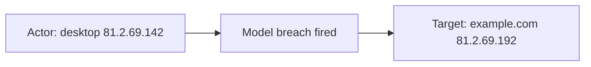
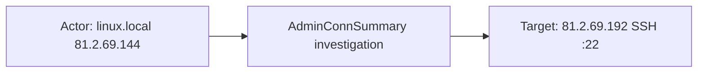
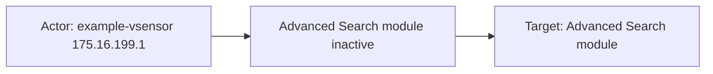

# darktrace

## Product Domain

Darktrace is an AI-powered network cyber defense platform that detects and investigates emerging threats that evade signature-based security tools. Powered by Enterprise Immune System technology, it uses unsupervised machine learning and mathematical models to establish a baseline of normal behavior for every user, device, and network connection, then flags deviations in real time. Deployed passively via physical or virtual sensors (vSensors) and network taps, Darktrace performs deep packet inspection and protocol analysis across east-west and north-south traffic without relying on predefined rules or threat intelligence feeds.

At the core of Darktrace's detection model are **models**—configurable logic that defines conditions for alerting on pattern-of-life anomalies, potentially malicious behavior, and compliance violations. When a model's thresholds are met, a **model breach** is generated with contextual device, connection, and filter details. **AI Analyst** layers automated investigation on top of model breaches: it reviews detections, correlates related activity into incidents, assigns attack-phase context, and produces human-readable summaries and titles for analyst triage. Optional **Antigena** response actions can autonomously contain threats at the network level.

Darktrace is categorized as network security monitoring with NIDS-like capabilities, but its detection philosophy differs from signature-driven IDS platforms such as Suricata or Snort. Rather than matching known attack patterns, it learns what is normal for each environment and surfaces subtle indicators of compromise—beaconing, lateral movement, data exfiltration, insider misuse, and zero-day activity—that traditional perimeter defenses miss. The Threat Visualizer console provides visualization, investigation workflows, and syslog/API export for downstream SIEM integration.

## Data Collected (brief)

The integration collects Darktrace alert logs via Elastic Agent over **HTTP JSON API**, **TCP syslog**, or **UDP syslog** into three data streams:

| Data stream | Description |
|---|---|
| **ai_analyst_alert** | AI Analyst incident events—investigations of suspicious activity with titles, summaries, AIA scores, attack phases, breach devices, related model breaches, activity periods, and structured detail sections (e.g., connection counts, targeted IPs, ports) |
| **model_breach_alert** | Model breach alerts when behavioral models fire—breaching device identity (IP, hostname, MAC, subnet, type), model metadata (name, category, tags, MITRE mappings), breach score, and triggered components with filter logic (beaconing, rare domains/IPs, JA3, ASN, ports, protocols) |
| **system_status_alert** | Platform health and operational alerts—probe/sensor status, traffic monitoring changes, and errors from Darktrace Security Modules (hostname, priority, status, resolution state); syslog only (not available via REST API) |

Events are parsed into ECS fields (`event`, `host`, `rule`, `threat`, `message`, `related`) with Darktrace-specific fields under `darktrace.*`. AI Analyst and model breach alerts map to threat/network categories with risk scores; system status alerts cover infrastructure health rather than threat detections.

## Expected Audit Log Entities

Darktrace exports are **network behavioral detections**, not identity-centric audit logs. The three data streams are **audit-adjacent** at best: `ai_analyst_alert` and `model_breach_alert` describe ML-driven threat findings (breaching device + connection context); `system_status_alert` is operational platform health (probe/sensor status). There is no IAM-style caller principal, no `source.*` / `destination.*` ECS mapping, and no populated ECS `*.target.*` fields (`target_fields_audit.csv` has no darktrace row). Endpoints land on `host.*` and `related.*`, with rich connection and filter context retained under `darktrace.*`.

**Event action:** `event.action` is populated **only** on `model_breach_alert` when Antigena response metadata is present (`automatic` in `test-model-breach-alert.log-expected.json`; absent in `sample_event.json` where `antigena: {}`). `ai_analyst_alert` and `system_status_alert` have no `event.action` in fixtures or pipelines — vendor fields `summariser`, `title`, `model.name`, and `alert_name` are the primary action candidates. `event.type` (`indicator`, `connection`, `info`) and `event.category` (`threat`, `network`) describe event class, not the operation verb.

### Event action (semantic)

| Action (normalized label) | Classification | Confidence | Evidence | Per-stream notes |
| --- | --- | --- | --- | --- |
| Model breach fired | detection | high | `rule.name` ← `model.name`: `Compromise::Beaconing Activity To External Rare` (`model_breach_alert/sample_event.json`; `default.yml` L908–913) | Default per-event action when no Antigena response; maps to `rule.name`, not `event.action` |
| Antigena automatic containment | configuration_change | high | `event.action`: `automatic` ← `model.actions.antigena.action` (`test-model-breach-alert.log-expected.json`; `default.yml` L535–542) | `model_breach_alert` only; overlays breach detection when Antigena block is configured |
| AI Analyst investigation opened | detection | high | `event.reason` ← `title`: `Extensive Unusual SSH Connections`; `summariser`: `AdminConnSummary` (`ai_analyst_alert/sample_event.json`; `default.yml` L768–786) | Investigation narrative action; title mapped to `event.reason`, not `event.action` |
| Platform module health degradation | configuration_change | moderate | `alert_name`: `Advanced Search`; `name`: `advanced_search` (`system_status_alert/sample_event.json`; `default.yml` L160–190) | Operational alert type, not threat detection |

### Event action (ECS candidates)

| ECS / vendor field | Mapped to `event.action` today? | Mapping correct? | Recommended `event.action` value (from fixtures) | Enhancement candidate? | Evidence |
| --- | --- | --- | --- | --- | --- |
| `event.action` | yes (conditional) | partial | `automatic` | no | `copy_from: darktrace.model_breach_alert.model.actions.antigena.action` (`model_breach_alert/default.yml` L539–542); only when Antigena action present |
| `darktrace.model_breach_alert.model.actions.antigena.action` | yes (via `event.action`) | partial | `automatic` | no | Vendor source for Antigena response verb; empty `{}` in most beaconing breaches (`sample_event.json`) |
| `rule.name` / `darktrace.model_breach_alert.model.name` | no | n/a | `Compromise::Beaconing Activity To External Rare` | yes | Primary breach-detection action candidate when Antigena absent; already on `rule.name` (`default.yml` L908–913) |
| `darktrace.ai_analyst_alert.summariser` | no | n/a | `AdminConnSummary` | yes | Investigation template / summariser type (`ai_analyst_alert/default.yml` L768–769; `sample_event.json`) |
| `darktrace.ai_analyst_alert.title` / `event.reason` | no (maps to `event.reason`) | partial | `Extensive Unusual SSH Connections` | yes | Human-readable incident action; `title` → `event.reason` not `event.action` (`default.yml` L780–786) |
| `darktrace.system_status_alert.alert_name` / `name` | no | n/a | `Advanced Search` / `advanced_search` | yes | Platform health alert identifier (`system_status_alert/default.yml` L160–190; `sample_event.json`) |
| `event.type` | no | n/a | `indicator`, `connection`, `info` | no | Event class (`threat`/`network`/`info`), not operation verb — do not substitute for `event.action` |
| `event.category` | no | n/a | `threat`, `network` | no | Static or script-derived category (`ai_analyst_alert/default.yml` L38–39; `model_breach_alert/default.yml` L38–57) |

**Per-stream action check:**

| Stream | `event.action` in fixtures? | Pipeline maps to `event.action`? | Primary action candidate | Confidence | Evidence |
| --- | --- | --- | --- | --- | --- |
| `ai_analyst_alert` | no | no | `darktrace.ai_analyst_alert.summariser` (`AdminConnSummary`); alternate `darktrace.ai_analyst_alert.title` | high | `test-ai-analyst-alert.log-expected.json`; `default.yml` L768–786 |
| `model_breach_alert` | yes (Antigena events only) | yes | `darktrace.model_breach_alert.model.actions.antigena.action`; fallback `rule.name` / `model.name` | high | `test-model-breach-alert.log-expected.json` `action: automatic`; `sample_event.json` no action |
| `system_status_alert` | no | no | `darktrace.system_status_alert.alert_name` (`Advanced Search`) | moderate | `sample_event.json`; `default.yml` L160–190 |

### Actor (semantic)

| Entity | Classification | Entity type (if general) | Confidence | Evidence | Per-stream notes |
| --- | --- | --- | --- | --- | --- |
| Breaching / originating network device | host | — | high | `breachDevices` / `device` → `host.id` (`did`), `host.ip`, `host.hostname`, `host.mac`, `host.type`; vendor mirror `darktrace.*.breach_devices.*` / `darktrace.model_breach_alert.device.*` (`ai_analyst_alert/default.yml` L84–273; `model_breach_alert/default.yml` L137–492; `test-ai-analyst-alert.log-expected.json` `did: 10`, `linux.local`, `81.2.69.144`; `sample_event.json` desktop `did: 3`, `81.2.69.142`) | Primary actor for `ai_analyst_alert`, `model_breach_alert` |
| Device echoed in investigation details | host | — | high | `details` device sections (`header: "Breaching Device"`, `type: device`) enrich `related.ip` / `related.hosts` but do not overwrite `host.*` (`ai_analyst_alert/default.yml` L313–521; fixture IPs `175.16.199.1`, `81.2.69.192`) | `ai_analyst_alert` only |
| Historic device IPs | host | — | moderate | `device.ips.*` loop appends past IPs to `related.ip` (`model_breach_alert/default.yml` L242–321) | `model_breach_alert` only |
| Probe / vSensor / master instance | host | — | high | `hostname` / `ip_address` → `host.hostname`, `host.ip`; `related.hosts`, `related.ip` (`system_status_alert/default.yml` L109–147; `sample_event.json` `example-vsensor`, `175.16.199.1`) | `system_status_alert`; on disconnection alerts `hostname`/`ip_address` may refer to master, not child (`fields.yml` description) |
| Model configurator / editor | user | — | moderate | `model.created.by`, `model.edited.by` → `related.user`, `rule.author` (`model_breach_alert/default.yml` L651–744; `sample_event.json` `"System"`) | Admin metadata, not the network actor |
| Acknowledging analyst | user | — | moderate | `acknowledged.username` → `related.user` when breach acknowledged (`model_breach_alert/default.yml` L1122–1128; `fields.yml`) | `model_breach_alert` only; no `user.name` |
| User-triggered investigation | — | — | low | `darktrace.ai_analyst_alert.is_user_triggered` boolean only; pipeline does not map analyst identity (`ai_analyst_alert/default.yml` L611–619; `fields.yml`) | Flag without principal fields |
| External trigger | — | — | low | `darktrace.ai_analyst_alert.is_external_triggered` boolean; no external principal mapped (`fields.yml`) | `ai_analyst_alert` only |
| Probe child identifier | general | device | moderate | `darktrace.system_status_alert.child_id` — unique probe ID (`system_status_alert/default.yml` L163–171; `sample_event.json` `child_id: 1`) | `system_status_alert` only |

No **service** actor is populated. Darktrace sensor identity appears only in syslog envelope (`log.syslog.hostname`: `example.cloud.darktrace.com`) — collector transport context, not the traffic actor. Antigena `event.action` (`automatic`) describes the **response verb**, not a separate actor entity — see Event action section.

### Actor (ECS candidates)

| ECS / vendor field | Role | Mapped today? | Mapping correct? | Confidence | Evidence |
| --- | --- | --- | --- | --- | --- |
| `host.id` | Breaching device Darktrace ID | yes | yes | high | `breachDevices[].did` / `device.did` → string `host.id` (`ai_analyst_alert/default.yml` L104–118; `model_breach_alert/default.yml` L150–160) |
| `host.ip` | Breaching device address | yes | yes | high | `breachDevices[].ip` / `device.ip`/`ip6` (`ai_analyst_alert/default.yml` L190–214; `model_breach_alert/default.yml` L200–241) |
| `host.hostname` | Breaching device hostname | yes | yes | high | Non-IP hostname from `breachDevices` / `device.hostname` (`ai_analyst_alert/default.yml` L124–134; `model_breach_alert/default.yml` L176–185; fixture `linux.local`) |
| `host.mac` | Breaching device MAC | yes | yes | high | Normalized MAC from breach device arrays (`ai_analyst_alert/default.yml` L220–243; `model_breach_alert/default.yml` L337–349) |
| `host.type` | Device class label | yes | yes | high | `device.type_name` → `host.type` (`model_breach_alert/default.yml` L481–488; `sample_event.json` `desktop`) |
| `host.name` | Device identifier (non-IP) | yes | yes | moderate | `identifier` when not parseable as IP (`ai_analyst_alert/default.yml` L154–184) |
| `related.ip` | Correlation IPs (actor + detail peers) | yes | partial | high | Aggregates breaching device, detail-section devices, and historic IPs — mixes actor and target endpoints (`ai_analyst_alert/default.yml` L140–456; `model_breach_alert/default.yml` L186–261) |
| `related.hosts` | Correlation hostnames | yes | partial | high | From `host.hostname`, detail `identifier`/`hostname` (`ai_analyst_alert/default.yml` L145–184; `system_status_alert/default.yml` L128–131) |
| `related.user` | Model admin / acknowledging analyst | yes | partial | moderate | `model.created.by`, `model.edited.by`, `acknowledged.username` — config/ack metadata, not network actor (`model_breach_alert/default.yml` L654–744, L1122–1128) |
| `rule.author` | Model creator | yes | partial | moderate | `model.created.by` only (`model_breach_alert/default.yml` L659–663) |
| `darktrace.ai_analyst_alert.breach_devices.*` | Canonical breaching device (vendor) | yes (vendor) | n/a | high | Full vendor device tree retained (`ai_analyst_alert/default.yml` L269–271) |
| `darktrace.model_breach_alert.device.*` | Canonical breaching device (vendor) | yes (vendor) | n/a | high | Includes `ips`, `tags`, `credentials`, `sid` (`model_breach_alert/default.yml`; `fields.yml`) |
| `darktrace.ai_analyst_alert.is_user_triggered` | Analyst-initiated flag | yes (vendor) | n/a | low | Boolean only; no username (`fields.yml`) |
| `darktrace.system_status_alert.child_id` | Probe identifier | yes (vendor) | n/a | moderate | Numeric probe ID (`fields.yml`; `sample_event.json`) |

### Target (semantic)

| Layer | Description | Entity | Classification | Entity type (if general) | Confidence | Evidence | Per-stream notes |
| --- | --- | --- | --- | --- | --- | --- | --- |
| 1 — Network protocol / service | Application protocol or destination port in connection context | SSH (:22), HTTPS (:443), DNS (:53), TCP (protocol 6) | service | — | moderate | `"Destination port": 22` in AI Analyst `details`; triggered filter `filter_type: "Destination port"` / `"Application protocol"` / `"Protocol"` with `trigger.value` (`test-ai-analyst-alert.log-expected.json`; `sample_event.json` beaconing filters) | Not mapped to `destination.port` or `network.protocol` |
| 2 — Host / endpoint peer | Remote or internal IP/hostname that satisfied model logic or appears in investigation | External server, lateral-movement victim, rare external IP | host | — | high | AI Analyst `"Targeted IP ranges include"` → `related.ip` (`81.2.69.192`, `175.16.199.3`); model breach display filters `Destination IP` (`81.2.69.192`), `Connection hostname` (`example.com`) in `triggered_filters.trigger.value` (`ai_analyst_alert/default.yml` L335–456; `sample_event.json`) | Peers live in `related.ip` or vendor filters — no `destination.ip` |
| 2 — Connection attributes | ASN, JA3, direction, beacon score | AS12345, JA3 hash, outbound flow | general | asn, ja3_hash, flow_metric | moderate | Display/comparator filters: `ASN`, `JA3 hash`, `Direction`, `Beaconing score`, `Rare external IP` (`sample_event.json`; `fields.yml`) | Model-evidence metadata; vendor-only |
| 3 — Detection rule / incident | Behavioral model, MITRE technique, incident grouping | Darktrace model, AI Analyst incident | general | detection-rule, technique, incident | high | `rule.name`/`rule.uuid`/`rule.category` ← `model.*`; `rule.name` ← `related_breaches.model_name`; `threat.technique.*` ← `mitre_techniques`; `threat.group.id` ← `current_group`/`activity_id`; `threat.enrichments.matched.id` ← `children` (`model_breach_alert/default.yml`; `ai_analyst_alert/default.yml` L281–311, L745–766) | Layer 3 correlation, not network endpoint |
| 3 — Platform component (operational) | Degraded Darktrace module on probe/sensor | Advanced Search, probe module | general | platform_module | high | `darktrace.system_status_alert.alert_name` / `name` (e.g. `advanced_search`, `"Advanced Search"`) on same `host.*` as actor (`sample_event.json`) | `system_status_alert` only; not a threat target |
| 3 — Resource URL | Support / ticket link embedded in alert | Support portal URL | general | url | moderate | `event.url` ← `incident_event_url` / `breach_url` / `system_status_alert.url` (`ai_analyst_alert/default.yml` L569–583; `model_breach_alert/default.yml` L81–95; `system_status_alert/default.yml` L94–108) | Reference link, not acted-upon resource |

**system_status_alert** has no threat/network peer targets — operational telemetry only (`event.type: info`, no `event.category: threat`).

### Target (ECS candidates)

| ECS / vendor field | Layer | Classification | Mapped today? | Mapping correct? | ECS target bucket | Enhancement candidate? | Evidence |
| --- | --- | --- | --- | --- | --- | --- | --- |
| `related.ip` | 2 | host | yes | partial | context-only | yes → `host.target.ip` | Detail-section and filter IPs appended alongside actor IP — conflates actor and target (`ai_analyst_alert/default.yml` L335–456; fixture `81.2.69.192`, `175.16.199.3`) |
| `related.hosts` | 2 | host | yes | partial | context-only | yes → `host.target.hostname` | Hostnames from detail devices (`ai_analyst_alert/default.yml` L374–434; fixture `linux.local`) |
| `darktrace.ai_analyst_alert.details` | 1/2 | service/host | yes (vendor) | n/a | — | yes | `"Destination port": 22`, `"Targeted IP ranges include"` device arrays — richest target context, vendor-only (`test-ai-analyst-alert.log-expected.json`) |
| `darktrace.model_breach_alert.triggered_components.triggered_filters.trigger.value` | 1/2 | host/service/general | yes (vendor) | n/a | — | yes → `destination.ip`/`destination.domain`/`destination.port` or `host.target.*` | Display filters: `Destination IP` `81.2.69.192`, `Connection hostname` `example.com`, port `443`, JA3, ASN (`sample_event.json`) |
| `darktrace.model_breach_alert.triggered_components.triggered_filters.filter_type` | 1/2 | general | yes (vendor) | n/a | — | no | Labels filter semantics (`Connection hostname`, `Rare external IP`, etc.) |
| `rule.name`, `rule.uuid`, `rule.category`, `rule.description`, `rule.ruleset` | 3 | general | yes | yes | context-only | no | Behavioral model metadata ← `model.*` / `related_breaches.model_name` (`model_breach_alert/default.yml` L647–981; `ai_analyst_alert/default.yml` L745–766) |
| `threat.technique.id`, `threat.technique.name` | 3 | general | yes | yes | context-only | no | MITRE from `mitre_techniques` (`model_breach_alert/default.yml` L493–534) |
| `threat.group.id` | 3 | general | yes | yes | context-only | partial → `entity.target.id` | Incident correlation ID (`ai_analyst_alert/default.yml` L305–311, L535–539) |
| `threat.enrichments.matched.id` | 3 | general | yes | yes | context-only | no | Child incident UUIDs (`ai_analyst_alert/default.yml` L281–284) |
| `darktrace.model_breach_alert.aianalyst_data.uuid` | 3 | general | yes (vendor) | n/a | — | no | Cross-reference to AI Analyst incident (`sample_event.json`) |
| `darktrace.model_breach_alert.model.logic.target_score` | — | — | yes (vendor) | no | — | no | Model scoring threshold (numeric `1`), **not** an entity target — false positive in `vendor_target_special_cases.csv` |
| `event.url` | 3 | general | yes | yes | context-only | no | Incident/breach/support URLs (`ai_analyst_alert/default.yml` L569–583; `system_status_alert/default.yml` L94–108) |
| `darktrace.system_status_alert.alert_name` / `name` | 3 | general | yes (vendor) | n/a | — | no | Platform module identifier (`sample_event.json` `advanced_search`) |

No `destination.user.*`, `destination.host.*`, `source.*`, `cloud.service.name`, or ECS `*.target.*` fields are mapped today. Package absent from `destination_identity_hits.csv`.

### Gaps and mapping notes

- **Not audit logs** — Darktrace alerts describe ML-detected network behavior; actor is the breaching device (`host.*`), not an IAM principal. `target_enhancement_packages.csv` classifies darktrace as **moderate_candidate** with `fixture_strong: true` but no pipeline destination-identity or ECS Tier-A target mappings.
- **`related.ip` conflates actor and target** — Breaching device IPs and targeted peer IPs from `details` share one correlation array; cannot distinguish actor from target without parsing `darktrace.ai_analyst_alert.details` or filter `filter_type`.
- **Connection targets vendor-only** — External IPs, hostnames, ports, JA3, and ASN from model breach display filters remain under `darktrace.model_breach_alert.triggered_components.*`; no `destination.ip`, `destination.domain`, or `destination.port` ECS mapping despite clear network-peer semantics.
- **`related.user` is admin metadata, not actor** — `model.created.by` / `model.edited.by` (`"System"`) and `acknowledged.username` populate `related.user` but identify model configurators or acknowledging analysts, not the device performing suspicious connections.
- **`darktrace.model_breach_alert.model.logic.target_score`** — Vendor field name contains "target" but holds model logic scoring threshold; not an ECS target entity (`vendor_target_special_cases.csv` false positive).
- **No de-facto `destination.*` targets** — Unlike firewall or auth integrations, pipelines never map peer endpoints to `destination.user.*` or `destination.host.*`; enhancement would require new pipeline steps from `details` device arrays and display-filter values.
- **AI Analyst vs model breach actor IP mismatch** — In fixtures, `breach_devices` IP (`81.2.69.144`) can differ from the IP emphasized in `details`/`summary` (`175.16.199.1`); both appear in `related.ip` but only breach-device fields populate `host.ip`.
- **`event.action` gaps** — Only Antigena response metadata maps to `event.action` on `model_breach_alert`; most breaches (including `sample_event.json`) have empty `antigena: {}` and no action field. Recommended primary candidates: `rule.name` / `model.name` for breach detection, `summariser` or `title` for AI Analyst, `alert_name` for system status. `event.reason` ← `title` partially captures AI Analyst action but is not the ECS action field.

### Per-stream notes

**ai_analyst_alert** — AI-generated incident narrative with structured `details` sections (connection counts, targeted IPs, ports). Richest target context is vendor-only in `details`; ECS surface is breaching device on `host.*` plus mixed `related.*`. No `event.action`; `summariser` (`AdminConnSummary`) and `title` (`Extensive Unusual SSH Connections` → `event.reason`) name the investigation type.

**model_breach_alert** — Single breaching device on `host.*` with exhaustive triggered-filter evidence for connection targets. Adds `rule.*`, optional `threat.technique.*`, MITRE mappings. `event.action` populated only when Antigena configured (`automatic`); otherwise `rule.name` (`Compromise::Beaconing Activity To External Rare`) is the de-facto detection action. Connection-category events when metric label contains "connection" (`default.yml` L44–58).

**system_status_alert** — Platform health only (probe down, module inactive). Same `host.*` serves as both affected component and sole entity; no threat targets. No `event.action`; `alert_name` (`Advanced Search`) identifies the operational alert type. Syslog-only stream per README.

## Example Event Graph

Darktrace alerts are **audit-adjacent network behavioral detections**, not identity-centric audit logs. The examples below are drawn from all three data streams (`model_breach_alert`, `ai_analyst_alert`, `system_status_alert`) using package fixtures only.

### Example 1: Beaconing to rare external endpoint

**Stream:** `darktrace.model_breach_alert` · **Fixture:** `packages/darktrace/data_stream/model_breach_alert/sample_event.json`

```
Breaching desktop (81.2.69.142) → Model breach fired → External host example.com (81.2.69.192)
```

#### Actor

| Field | Value |
| --- | --- |
| id | 3 |
| type | host |
| sub_type | desktop |
| ip | 81.2.69.142 |

**Field sources:**

- `id` ← `host.id` ← `darktrace.model_breach_alert.device.did`
- `type` ← `host.type` ← `darktrace.model_breach_alert.device.type_name`
- `ip` ← `host.ip` ← `darktrace.model_breach_alert.device.ip`

#### Event action

| Field | Value |
| --- | --- |
| action | Model breach fired |
| source_field | `rule.name` |
| source_value | `Compromise::Beaconing Activity To External Rare` |

`event.action` is absent in this fixture (`antigena: {}`); action is derived from the behavioral model name on `rule.name`, **not mapped to ECS `event.action` today**.

#### Target

| Field | Value |
| --- | --- |
| id | 81.2.69.192 |
| name | example.com |
| type | host |

**Field sources:**

- `id` ← `darktrace.model_breach_alert.triggered_components[].triggered_filters[]` where `filter_type: Destination IP`, `trigger.value: 81.2.69.192`
- `name` ← same structure where `filter_type: Connection hostname`, `trigger.value: example.com`
- Target peer is vendor-only; not mapped to `destination.ip` or `destination.domain` — only breaching device IP appears on `related.ip` alongside target IPs in other streams.

#### Mermaid



### Example 2: AI Analyst SSH lateral-movement investigation

**Stream:** `darktrace.ai_analyst_alert` · **Fixture:** `packages/darktrace/data_stream/ai_analyst_alert/_dev/test/pipeline/test-ai-analyst-alert.log-expected.json`

```
Breaching device linux.local (81.2.69.144) → AdminConnSummary investigation → Targeted internal host 81.2.69.192 (SSH :22)
```

#### Actor

| Field | Value |
| --- | --- |
| id | 10 |
| name | linux.local |
| type | host |
| ip | 81.2.69.144 |

**Field sources:**

- `id` ← `host.id` ← `darktrace.ai_analyst_alert.breach_devices[].did`
- `name` ← `host.hostname` ← `darktrace.ai_analyst_alert.breach_devices[].hostname`
- `ip` ← `host.ip` ← `darktrace.ai_analyst_alert.breach_devices[].ip`
- Investigation `details` emphasize a different IP (`175.16.199.1`) for the breaching device; that IP appears in `related.ip` but does not overwrite `host.ip`.

#### Event action

| Field | Value |
| --- | --- |
| action | AdminConnSummary investigation |
| source_field | `darktrace.ai_analyst_alert.summariser` |
| source_value | `AdminConnSummary` |

No `event.action` in fixture; human-readable title `Extensive Unusual SSH Connections` maps to `event.reason`, not `event.action`.

#### Target

| Field | Value |
| --- | --- |
| id | 81.2.69.192 |
| name | SSH |
| type | service |
| sub_type | ssh |

**Field sources:**

- `id` ← `darktrace.ai_analyst_alert.details[]` key `Targeted IP ranges include`, first peer `ip: 81.2.69.192`
- `name` / `sub_type` ← same `details` section key `Destination port`, `values: [22]` (SSH)
- Additional targeted IPs (`175.16.199.1`, `175.16.199.3`) are in the same details array and merged into `related.ip` with the actor IP.

#### Mermaid



### Example 3: vSensor platform module health alert

**Stream:** `darktrace.system_status_alert` · **Fixture:** `packages/darktrace/data_stream/system_status_alert/sample_event.json`

```
Probe example-vsensor (175.16.199.1) → Advanced Search module inactive → Advanced Search platform module
```

#### Actor

| Field | Value |
| --- | --- |
| name | example-vsensor |
| type | host |
| ip | 175.16.199.1 |

**Field sources:**

- `name` ← `host.hostname` ← `darktrace.system_status_alert.hostname`
- `ip` ← `host.ip` ← `darktrace.system_status_alert.ip_address`
- `id` omitted — no `host.id` in fixture; probe identified by `darktrace.system_status_alert.child_id: 1` (vendor-only)

#### Event action

| Field | Value |
| --- | --- |
| action | Advanced Search module inactive |
| source_field | `darktrace.system_status_alert.alert_name` |
| source_value | `Advanced Search` |

No `event.action` in fixture; operational alert type from vendor `alert_name`, **not mapped to ECS `event.action` today**.

#### Target

| Field | Value |
| --- | --- |
| id | advanced_search |
| name | Advanced Search |
| type | general |
| sub_type | platform_module |

**Field sources:**

- `id` ← `darktrace.system_status_alert.name` (`advanced_search`)
- `name` ← `darktrace.system_status_alert.alert_name` (`Advanced Search`)
- Operational telemetry only — no network threat peer; affected module is the sole non-actor entity.

#### Mermaid



## ES|QL Entity Extraction

**Package type: agent-backed** (policy template `darktrace`, three data streams in `manifest.yml`; Tier A fixtures in `sample_event.json` and `*-expected.json`). Router: **`data_stream.dataset`** (`darktrace.ai_analyst_alert`, `darktrace.model_breach_alert`, `darktrace.system_status_alert`). Pass 4 is **fill-gaps-only**: detection flags (`actor_exists`, `target_exists`, `action_exists`) run first; mapped columns use **column-level** `CASE(<col> IS NOT NULL, <col>, fallback, null)` — not `CASE(actor_exists, host.ip, …, host.ip, null)` (Pass 4 §10). Ingest populates **breaching device** on `host.id` / `host.ip` / `host.mac` / `host.type` for threat streams — **ingest-only — no ES|QL** on those columns (no flat vendor alternate at query time). No ECS `*.target.*` at ingest except Pass 4 fallbacks below. Network peer targets (Pass 3 Examples 1–2) live in nested `darktrace.*.details` / `triggered_components` — omitted from target fallbacks. **`rule.name`** feeds **`event.action`** on model breaches, not `entity.target.*` (model is action context, not network target). **`related.user`** excluded from `actor_exists` (admin metadata). **`log.syslog.hostname`** is collector transport, not traffic actor. **Pass 4 (tautology cleanup):** no `CASE(col, col, …)` identity fallbacks on ingest-populated `host.*`; only `host.name` ← `host.hostname` when `host.name` is empty.

### Dataset inventory

| data_stream.dataset | Stream role | Actor classification(s) | Target classification(s) | Extraction |
| --- | --- | --- | --- | --- |
| `darktrace.ai_analyst_alert` | AI Analyst incident | host | service (semantic) | partial |
| `darktrace.model_breach_alert` | Model breach | host | host (vendor-nested only) | partial |
| `darktrace.system_status_alert` | Platform health | host | general (platform_module) | partial |

### Field mapping plan

#### Actor mappings

| Output column | Source field(s) | Condition (dataset + optional) | Confidence | Notes |
| --- | --- | --- | --- | --- |
| `host.id` | — | `STARTS_WITH(data_stream.dataset, "darktrace.")` | high | **ingest-only — no ES\|QL** — `device.did` / `breach_devices[].did` → `host.id` (`model_breach_alert/default.yml` L150–160; `ai_analyst_alert/default.yml` L104–118); omit — `CASE(actor_exists, host.id, …, host.id, null)` is identity no-op |
| `host.ip` | — | `STARTS_WITH(data_stream.dataset, "darktrace.")` | high | **ingest-only — no ES\|QL** — breach device IP at ingest; omit — no flat query-time vendor path |
| `host.name` | `host.name` | `host.name IS NOT NULL` | high | **column-level preserve** |
| `host.name` | `host.hostname` | `STARTS_WITH(data_stream.dataset, "darktrace.") AND host.hostname IS NOT NULL` | high | **vendor fallback** — promote hostname when `host.name` empty (`system_status_alert/sample_event.json` `example-vsensor`; `test-ai-analyst-alert.log-expected.json` `linux.local`) |
| `host.mac` | — | `data_stream.dataset == "darktrace.model_breach_alert"` | high | **ingest-only — no ES\|QL** — MAC normalized at ingest; omit |
| `host.type` | — | `data_stream.dataset == "darktrace.model_breach_alert"` | high | **ingest-only — no ES\|QL** — `device.type_name` → `host.type` (`sample_event.json` `desktop`); omit |

#### Target mappings

| Output column | Source field(s) | Condition (dataset + optional) | Confidence | Notes |
| --- | --- | --- | --- | --- |
| `entity.target.id` | `entity.target.id` | `entity.target.id IS NOT NULL` | high | **column-level preserve** |
| `entity.target.id` | `darktrace.system_status_alert.name` | `data_stream.dataset == "darktrace.system_status_alert"` | high | **vendor fallback** — platform module ID (`sample_event.json` `advanced_search`) |
| `entity.target.name` | `entity.target.name` | `entity.target.name IS NOT NULL` | high | **column-level preserve** |
| `entity.target.name` | `darktrace.system_status_alert.alert_name` | `data_stream.dataset == "darktrace.system_status_alert"` | high | **vendor fallback** — Pass 3 Example 3 (`Advanced Search`) |
| `entity.target.sub_type` | `entity.target.sub_type` | `entity.target.sub_type IS NOT NULL` | high | **column-level preserve** |
| `entity.target.sub_type` | literal `"platform_module"` | `data_stream.dataset == "darktrace.system_status_alert"` | high | **semantic literal** |
| `service.target.name` | `service.target.name` | `service.target.name IS NOT NULL` | low | **column-level preserve** |
| `service.target.name` | literal `"SSH"` | `data_stream.dataset == "darktrace.ai_analyst_alert" AND darktrace.ai_analyst_alert.summariser == "AdminConnSummary"` | low | **semantic literal** — Pass 3 Example 2; port `22` only in nested `details` |

#### Event action mappings

| Output column | Source field(s) | Condition (dataset + optional) | Confidence | Notes |
| --- | --- | --- | --- | --- |
| `event.action` | `event.action` | `event.action IS NOT NULL` | high | **column-level preserve** — Antigena only (`test-model-breach-alert.log-expected.json` `automatic`) |
| `event.action` | `rule.name` | `data_stream.dataset == "darktrace.model_breach_alert" AND rule.name IS NOT NULL` | high | **vendor fallback** — model breach verb when Antigena absent (`sample_event.json` `Compromise::Beaconing…`) |
| `event.action` | `darktrace.ai_analyst_alert.summariser` | `data_stream.dataset == "darktrace.ai_analyst_alert" AND darktrace.ai_analyst_alert.summariser IS NOT NULL` | high | **vendor fallback** — investigation template (`AdminConnSummary` in fixture) |
| `event.action` | `darktrace.system_status_alert.alert_name` | `data_stream.dataset == "darktrace.system_status_alert"` | moderate | **vendor fallback** — operational alert type (`Advanced Search`) |

### Detection flags (mandatory — run first)

`actor_exists` omits `user.*` and `service.*` — no IAM principal; `related.user` is model admin / ack metadata. `target_exists` checks official `*.target.*` columns only (ingest does not populate them today). Actor/target `EVAL` blocks use **column-level** `IS NOT NULL` preserve — not `CASE(actor_exists, host.ip, …)` / `CASE(target_exists, entity.target.id, …)` — so partial future enrichment does not block vendor fallbacks (Pass 4 §10).

**Semantics:** `actor_exists` / `target_exists` / `action_exists` are query-time helpers only. Mapped columns use **column-level** `<col> IS NOT NULL` as the first `CASE` branch so populated `host.id` / `host.ip` siblings do not block `host.name` ← `host.hostname` or vendor `event.action` / `entity.target.*` fallbacks.

**ES|QL `CASE` arity:** Arguments are **(condition, value)** pairs; odd count → last arg is default. Wrong: `CASE(host.name IS NOT NULL, host.name, host.hostname, null)` (4 args — `host.hostname` is a **condition**, not a value). Wrong: `CASE(actor_exists, host.name, host.hostname, null)` (4 args — `host.hostname` parses as condition). Right: **3-arg** `CASE(event.action IS NOT NULL, event.action, rule.name)` or **5-arg** `CASE(host.name IS NOT NULL, host.name, STARTS_WITH(data_stream.dataset, "darktrace.") AND host.hostname IS NOT NULL, host.hostname, null)`. Do not use `CASE(actor_exists, host.name, …)` when `host.hostname` can set `actor_exists` while `host.name` is still empty (Pass 4 §10).

```esql
| EVAL
  actor_exists = host.id IS NOT NULL OR host.ip IS NOT NULL OR host.name IS NOT NULL
    OR host.hostname IS NOT NULL OR host.mac IS NOT NULL OR host.type IS NOT NULL,
  target_exists = host.target.id IS NOT NULL OR host.target.ip IS NOT NULL OR host.target.name IS NOT NULL
    OR service.target.id IS NOT NULL OR service.target.name IS NOT NULL
    OR entity.target.id IS NOT NULL OR entity.target.name IS NOT NULL,
  action_exists = event.action IS NOT NULL
```

### Combined ES|QL — actor fields

Omitted from actor `EVAL` (ingest-only — no alternate query-time source): `host.id`, `host.ip`, `host.mac`, `host.type` (breaching device promoted at ingest; nested `darktrace.*.device` / `breach_devices` not flat for ES|QL).

```esql
| EVAL
  host.name = CASE(
    host.name IS NOT NULL, host.name,
    STARTS_WITH(data_stream.dataset, "darktrace.") AND host.hostname IS NOT NULL, host.hostname,
    null
  )
```

### Combined ES|QL — event action

```esql
| EVAL
  event.action = CASE(
    event.action IS NOT NULL, event.action,
    data_stream.dataset == "darktrace.model_breach_alert" AND rule.name IS NOT NULL, rule.name,
    data_stream.dataset == "darktrace.ai_analyst_alert" AND darktrace.ai_analyst_alert.summariser IS NOT NULL, darktrace.ai_analyst_alert.summariser,
    data_stream.dataset == "darktrace.system_status_alert" AND darktrace.system_status_alert.alert_name IS NOT NULL, darktrace.system_status_alert.alert_name,
    null
  )
```

### Combined ES|QL — target fields

```esql
| EVAL
  entity.target.id = CASE(
    entity.target.id IS NOT NULL, entity.target.id,
    data_stream.dataset == "darktrace.system_status_alert" AND darktrace.system_status_alert.name IS NOT NULL, darktrace.system_status_alert.name,
    null
  ),
  entity.target.name = CASE(
    entity.target.name IS NOT NULL, entity.target.name,
    data_stream.dataset == "darktrace.system_status_alert" AND darktrace.system_status_alert.alert_name IS NOT NULL, darktrace.system_status_alert.alert_name,
    null
  ),
  entity.target.sub_type = CASE(
    entity.target.sub_type IS NOT NULL, entity.target.sub_type,
    data_stream.dataset == "darktrace.system_status_alert", "platform_module",
    null
  ),
  service.target.name = CASE(
    service.target.name IS NOT NULL, service.target.name,
    data_stream.dataset == "darktrace.ai_analyst_alert" AND darktrace.ai_analyst_alert.summariser == "AdminConnSummary", "SSH",
    null
  )
```

### Full pipeline fragment (optional)

```esql
FROM logs-*
| EVAL
  actor_exists = host.id IS NOT NULL OR host.ip IS NOT NULL OR host.name IS NOT NULL
    OR host.hostname IS NOT NULL OR host.mac IS NOT NULL OR host.type IS NOT NULL,
  target_exists = host.target.id IS NOT NULL OR host.target.ip IS NOT NULL OR host.target.name IS NOT NULL
    OR service.target.id IS NOT NULL OR service.target.name IS NOT NULL
    OR entity.target.id IS NOT NULL OR entity.target.name IS NOT NULL,
  action_exists = event.action IS NOT NULL
| EVAL
  host.name = CASE(
    host.name IS NOT NULL, host.name,
    STARTS_WITH(data_stream.dataset, "darktrace.") AND host.hostname IS NOT NULL, host.hostname,
    null
  ),
  event.action = CASE(
    event.action IS NOT NULL, event.action,
    data_stream.dataset == "darktrace.model_breach_alert" AND rule.name IS NOT NULL, rule.name,
    data_stream.dataset == "darktrace.ai_analyst_alert" AND darktrace.ai_analyst_alert.summariser IS NOT NULL, darktrace.ai_analyst_alert.summariser,
    data_stream.dataset == "darktrace.system_status_alert" AND darktrace.system_status_alert.alert_name IS NOT NULL, darktrace.system_status_alert.alert_name,
    null
  ),
  entity.target.id = CASE(
    entity.target.id IS NOT NULL, entity.target.id,
    data_stream.dataset == "darktrace.system_status_alert" AND darktrace.system_status_alert.name IS NOT NULL, darktrace.system_status_alert.name,
    null
  ),
  entity.target.name = CASE(
    entity.target.name IS NOT NULL, entity.target.name,
    data_stream.dataset == "darktrace.system_status_alert" AND darktrace.system_status_alert.alert_name IS NOT NULL, darktrace.system_status_alert.alert_name,
    null
  ),
  entity.target.sub_type = CASE(
    entity.target.sub_type IS NOT NULL, entity.target.sub_type,
    data_stream.dataset == "darktrace.system_status_alert", "platform_module",
    null
  ),
  service.target.name = CASE(
    service.target.name IS NOT NULL, service.target.name,
    data_stream.dataset == "darktrace.ai_analyst_alert" AND darktrace.ai_analyst_alert.summariser == "AdminConnSummary", "SSH",
    null
  )
| KEEP @timestamp, data_stream.dataset, event.action, host.id, host.ip, host.name, host.hostname, entity.target.id, entity.target.name, service.target.name, rule.name
```

### Streams excluded

None — all three streams receive partial extraction (actor preserve, action/target fallbacks where defensible).

### Gaps and limitations

- **Network peer targets vendor-only** — Pass 3 external host `81.2.69.192` / `example.com` live in `darktrace.model_breach_alert.triggered_components[].triggered_filters[]` (`filter_type: Destination IP`, `Connection hostname`); `darktrace.ai_analyst_alert.details` keyed sections — not flat ECS fields; ES|QL cannot parse nested arrays reliably → **`host.target.*` omitted** for `ai_analyst_alert` and `model_breach_alert`.
- **`rule.name` / `rule.uuid` not entity targets** — behavioral model is action/detection context (Pass 3 Example 1), not the network target; do not map to `entity.target.*`.
- **`related.ip` conflates actor and target** — breaching device and peer IPs merged at ingest; not used as target source (Pass 2 **Mapping correct?** partial).
- **`darktrace.model_breach_alert.model.logic.target_score`** — model scoring threshold homonym; not an entity target.
- **`related.user`** — `model.created.by` / `acknowledged.username` (`System`); admin metadata, not network actor.
- **`threat.group.id` / `threat.enrichments.matched.id`** — incident correlation (Layer 3); omitted to avoid conflating with Pass 3 host/service targets.
- **`event.reason` ← `title`** on AI Analyst — narrative label, not substituted for `event.action` fallback (`summariser` used instead).
- **Pass 2 enhancement alignment** — ingest-time `host.target.*` from display filters / `details` device arrays remains preferred; Pass 4 fills gaps without overwriting populated values.
- **Pass 4 tautology cleanup (§10)** — `host.id`, `host.ip`, `host.mac`, `host.type` omitted from actor `EVAL` (ingest-only); `host.name` uses column-level preserve + `host.hostname` fallback only; target/action columns use column-level `IS NOT NULL` preserve, not `CASE(flag, col, …, col, null)`.
- **Pass 4 CASE syntax** — all `CASE` use odd-arity defaults (`null`) or valid **3-arg** preserve/fallback; mapped columns use column-level **5-arg** / **7-arg** / **9-arg** `CASE(<col> IS NOT NULL, <col>, <boolean>, <fallback>, null)` — never **4-arg** `CASE(actor_exists|target_exists, col, bare_field, null)` or `CASE(col IS NOT NULL, col, bare_field, null)` (bare field parses as a condition). Vendor fallbacks include `IS NOT NULL` on source fields where applicable. `actor_exists` / `target_exists` / `action_exists` are helpers only — not first `CASE` branches on mapped columns. Full pipeline fragment aligned with combined `EVAL` blocks.
