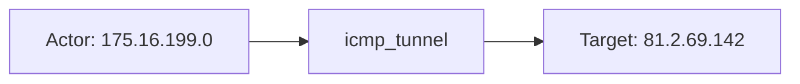
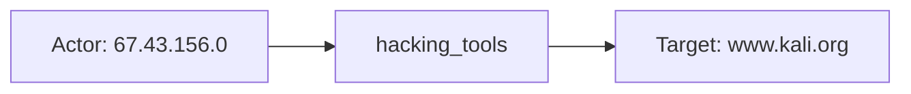

# extrahop

## Product Domain

ExtraHop is a network detection and response (NDR) platform that delivers agentless, wire-data visibility through its RevealX product line. RevealX sensors and appliances passively analyze live network traffic at line rate—reconstructing protocols, baselining device and application behavior, and applying machine-learning and rule-based analytics to surface threats that evade endpoint and log-centric controls. The cloud-hosted **RevealX 360** console centralizes detection management, investigation workflows, and REST API access for downstream SIEM integration.

Unlike signature-only IDS platforms, ExtraHop correlates behavioral anomalies across east-west and north-south traffic—covering lateral movement, command-and-control, data exfiltration, ransomware precursors, and protocol abuse—using risk scoring, MITRE ATT&CK mappings, and contextual participant metadata (devices, IPs, hostnames, roles). Analysts triage detections, assign ownership, link tickets, and group related activity into **investigations** with assessments, notes, and lifecycle status tracking within RevealX.

The Elastic integration polls the [RevealX 360 REST API](https://docs.extrahop.com/current/rx360-rest-api/) via Elastic Agent (CEL input) or Agentless, authenticating with OAuth client credentials. It targets RevealX 360 v25.2+ and installs Kibana dashboards plus latest transforms to deduplicate polled detection and investigation records for SOC triage and case-management workflows.

## Data Collected (brief)

The integration collects RevealX 360 alert and case data over the **RevealX 360 REST API** (Client ID / Client Secret) into two log data streams:

| Data stream | Description |
|---|---|
| **detection** | Network detections identified by ExtraHop—title, type, categories, description, risk score, status, resolution, assignee, MITRE tactics/techniques, participants (offender/victim devices, IPs, hostnames, roles), recommended factors, ticket linkage, and deep links back to RevealX |
| **investigation** | Investigation cases grouping related detections—name, description, status, assessment, assignee, investigation types, linked detection IDs, notes, creation/update/interaction timestamps, and lifecycle fields (start/end time, created_by) |

Events map to ECS (`event`, `threat`, `user`, `device`, `related`, `observer`) with ExtraHop-specific fields under `extrahop.detection.*` and `extrahop.investigation.*`. Detection events carry `event.category: threat` with MITRE and risk metadata; investigation events represent analyst case records rather than raw wire telemetry. Latest transforms maintain deduplicated destination indices; investigation source data uses a 30-day ILM policy due to polling overlap. Bundled Kibana dashboards cover detection triage (type, category, status, resolution, assignee) and investigation trends (status, assessment, assignee workload).

## Expected Audit Log Entities

Neither stream is a true identity or platform audit log. **`detection`** (`extrahop.detection`) exports wire-derived NDR threat indicators with offender/victim participant metadata — audit-adjacent security telemetry, not admin/API action records. **`investigation`** (`extrahop.investigation`) exports analyst case-management records (status, assessment, notes, linked detection IDs) — workflow metadata with no network endpoints. No ECS `user.target.*`, `host.target.*`, `service.target.*`, or `entity.target.*` fields are populated; no `destination.user.*` / `destination.host.*` in pipelines (`destination_identity_hits.csv` has no extrahop row). The target-fields audit classifies extrahop as **`moderate_candidate_network_dest`** with `pipeline_dest_network=true` (`destination.port` only), `pipeline_actor=false`, and no tier-A ECS target mapping (`dev/target-fields-audit/out/target_enhancement_packages.csv`).

**`event.action` is absent on both streams.** Pipelines set `event.type` (`indicator` on detection, `info` on investigation) and `event.category` (`threat` on detection only) but never map vendor operation or detection-type fields to `event.action`. Primary action candidates are `extrahop.detection.type` (wire threat rule code) and, secondarily, case/detection workflow fields (`status`, `resolution`, `assessment`).

Evidence: `packages/extrahop/data_stream/*/sample_event.json`, `*/_dev/test/pipeline/*-expected.json`, `*/elasticsearch/ingest_pipeline/default.yml`, `*/fields/fields.yml`.

### Event action (semantic)

| Action (normalized label) | Classification | Confidence | Evidence | Per-stream notes |
| --- | --- | --- | --- | --- |
| `icmp_tunnel` | detection | high | `extrahop.detection.type: icmp_tunnel`; title `ICMP Tunnel` in `sample_event.json` and `test-pipeline-detection.log-expected.json` | **`detection`** — protocol-tunneling behavior identified on the wire |
| `hacking_tools` | detection | high | `extrahop.detection.type: hacking_tools`; `properties.hacking_tool_name: Kali Linux` in pipeline test | **`detection`** — adversary tool usage on the network |
| `expiring_cert_individual` | detection | high | `extrahop.detection.type: expiring_cert_individual`; title `Expiring SSL/TLS Server Certificate` in pipeline test | **`detection`** — certificate hygiene / hardening finding |
| `open` / `closed` | administration | moderate | `extrahop.investigation.status: closed` (BloodHound fixture), `open` (investigation id 4) in `test-investigation.log-expected.json` | **`investigation`** — case lifecycle state from polled snapshot, not a discrete audit verb |
| `action_taken` / `no_action_taken` | administration | moderate | `extrahop.detection.resolution: action_taken` (`sample_event.json`), `no_action_taken` (expiring-cert fixture) | **`detection`** — analyst triage outcome on the detection record, not the underlying wire activity |
| *(no per-event verb)* | — | high | No `event.action` in any fixture; investigation has no vendor field naming a performed operation | **`investigation`** — polled case record; `event.type: info` describes document kind, not an action |

Wire-derived detections name the **observed threat behavior** via `type` (rule code), not a portal/API operation. Investigation events are periodic case-state exports — `status` and `assessment` are the closest workflow labels but describe record state rather than a single auditable action.

### Event action (ECS candidates)

| ECS / vendor field | Mapped to `event.action` today? | Mapping correct? | Recommended `event.action` value (from fixtures) | Enhancement candidate? | Evidence |
| --- | --- | --- | --- | --- | --- |
| `json.type` → `extrahop.detection.type` | no | n/a | `icmp_tunnel`, `hacking_tools`, `expiring_cert_individual` | yes | `detection/default.yml` rename L449–453; fixture values in `sample_event.json`, `test-pipeline-detection.log-expected.json` |
| `extrahop.detection.title` | no (vendor-only) | n/a | `ICMP Tunnel`, `Expiring SSL/TLS Server Certificate` | partial | Human-readable label; promoted to `message` L444–448 — alternate display form of `type`, not a separate verb |
| `extrahop.detection.status` | no (vendor-only) | n/a | `open` | partial | Rename L423–427; triage workflow state, not wire activity |
| `extrahop.detection.resolution` | no (vendor-only) | n/a | `action_taken`, `no_action_taken` | partial | Rename L387–391; analyst disposition on detection |
| `extrahop.investigation.status` | no (vendor-only) | n/a | `closed`, `open` | partial | Vendor-only in `investigation/default.yml`; `test-investigation.log-expected.json` |
| `extrahop.investigation.assessment` | no (vendor-only) | n/a | `benign_true_positive`, `false_positive` | partial | Case assessment label — complements `status`, not a substitute for action |
| `event.type` / `event.category` | n/a (downstream) | partial | `indicator` + `threat` (detection); `info` (investigation) | no | Pipeline append/set L47–54 (detection), L39–42 (investigation); document taxonomy, not `event.action` |

**Step 2b — per-stream check:**

| Stream | `event.action` in fixtures? | Pipeline maps to `event.action`? | Primary action candidate | Confidence | Evidence |
| --- | --- | --- | --- | --- | --- |
| `detection` | no | no | `extrahop.detection.type` (`icmp_tunnel`, `hacking_tools`, `expiring_cert_individual`) | high | No pipeline `event.action` grep hit; `detection/default.yml` renames `json.type` only |
| `investigation` | no | no | omit or `extrahop.investigation.status` (`open`/`closed`) | low | No pipeline `event.action`; state snapshot — `status`/`assessment` are workflow labels |

### Actor (semantic)

| Entity | Classification | Entity type (if general) | Confidence | Evidence | Per-stream notes |
| --- | --- | --- | --- | --- | --- |
| Offending network participant | host | — | high | `participants[].role: offender` → `extrahop.detection.participants.*` (`object_type`, `object_value`, `hostname`, `object_id`); IPs/hostnames also in `related.ip` / `related.hosts` | **`detection`** — ICMP tunnel offender `175.16.199.0` / `09i2TY0xVtw7DPECOJQte01i7IK8B9FV.rx.tours`; hacking-tools offender `67.43.156.0` (`test-pipeline-detection.log-expected.json`) |
| Participant account context | user | — | moderate | `participants[].username` → `related.user` only (e.g. `administrator@ATTACK.LOCAL` on expiring-cert detection); not copied to ECS `user.*` | **`detection`** — account tied to offending device, not portal login actor |
| Assigned analyst (detection triage) | user | — | high | `assignee` → ECS `user.name` + `related.user` (`detection/default.yml`); `sam.joe` in `sample_event.json`, `john.doe` in pipeline test | **`detection`** — SOC assignee, not wire threat actor |
| RevealX sensor / appliance | general | device | moderate | Observing NDR appliance → `device.id` ← `appliance_id`; vendor duplicate `extrahop.detection.appliance_id` when preserved | **`detection`** — collection/observer context (`device.id: "6"` in `sample_event.json`) |
| Investigation creator | user | — | high | `created_by` dissected to `user.name` / `user.domain` when `user@domain` format | **`investigation`** — `integration@example.com` → `user.name: integration`, `user.domain: example.com` (`test-investigation.log-expected.json`) |
| Investigation assignee / last actor | user | — | moderate | `assignee`, `last_interaction_by` → `related.user` only; not mapped to ECS `user.*` | **`investigation`** — `user1`, `john.doe`, `tom.latham` in pipeline tests |
| API / service principal creator | user | service_account | moderate | Non-email `created_by` (e.g. `rest_api_id_1njj2`) stays vendor-only + `related.user`; dissect skipped, ECS `user.*` empty | **`investigation`** — REST API identity in fixture id `54` |

**No wire threat actor on investigation stream.** Investigation events carry `event.type: info` with no `event.category: threat` and no participant or IP fields. **`source.port`** / **`destination.port`** on detection events are connection tuple context (client/server ports), not actor identity — and there is no `source.ip` / `destination.ip` mapping.

### Actor (ECS candidates)

| ECS / vendor field | Role | Mapped today? | Mapping correct? | Confidence | Evidence |
| --- | --- | --- | --- | --- | --- |
| `extrahop.detection.participants[]` (role=offender) | Wire threat source host/IP | no (vendor-only) | n/a | high | Full participant tree retained; offender `object_value`/`hostname` in fixtures |
| `extrahop.detection.participants[].username` | Account on participant device | no (vendor-only) | n/a | high | `administrator@ATTACK.LOCAL` on expiring-cert offender; only `related.user` overlap |
| `user.name` | Detection assignee; investigation creator | yes (stream-dependent) | partial | high | Detection: `assignee` copy — SOC triage user, not threat actor; Investigation: `created_by` dissect — correct for case creator |
| `user.domain` | Investigation creator domain | yes | yes | high | `created_by` dissect pattern `%{user.name}@%{user.domain}` (`investigation/default.yml`) |
| `related.user` | Assignees, creators, participant usernames | yes | partial | high | Detection append assignee + participant username; investigation append assignee, created_by, last_interaction_by — mixes SOC actors and participant accounts |
| `related.ip` / `related.hosts` | All participant IPs/hostnames (offender + victim) | yes | partial | high | Foreach on `participants[].object_value` / `hostname` — no role distinction |
| `device.id` | RevealX appliance / sensor | yes | yes (observer) | high | `json.appliance_id` → `extrahop.detection.appliance_id` → `device.id` |
| `source.port` | Client-side connection port | yes | yes (network context) | high | `properties.client_port` copy (e.g. `63855` hacking-tools fixture); no paired `source.ip` |
| `destination.port` | Server-side connection port | yes | yes (network context) | high | `properties.server_port` copy (e.g. `443` hacking-tools fixture); no paired `destination.ip` |
| `extrahop.investigation.created_by` | Case creator (incl. API principals) | no (vendor-only) | n/a | high | `rest_api_id_1njj2` when email dissect fails |
| `extrahop.investigation.assignee` / `last_interaction_by` | Case workflow actors | no (vendor-only) | n/a | high | Only `related.user` promotion |
| `extrahop.detection.is_user_created` | User-created detection flag | no (vendor-only) | n/a | low | Boolean only; no creator username on detection events |

### Target (semantic)

| Layer | Description | Entity | Classification | Entity type (if general) | Confidence | Evidence | Per-stream notes |
| --- | --- | --- | --- | --- | --- | --- | --- |
| 1 — Platform / cloud service | NDR platform producing the detection | ExtraHop RevealX / RevealX 360 | service | — | medium | SaaS console URLs in `event.url` / `extrahop.*.url`; no `cloud.service.name` mapping | **`detection`**, **`investigation`** — platform context only, not mapped to ECS service fields |
| 2 — Resource / object | Network endpoint or device acted upon | Offender/victim devices, IPs, hostnames | host | — | high | `participants[].role: victim` (and offender as threat source) → `extrahop.detection.participants.*`; `related.ip` / `related.hosts` | **`detection`** — victim `81.2.69.142` (ICMP tunnel); external victims `www.kali.org`, `cdimage.kali.org`, `kali.download` (hacking-tools) |
| 2 — Resource / object | Linked detection under investigation | Detection record by ID | general | detection | high | `extrahop.investigation.detections[]` (e.g. `25769803958` in `sample_event.json`) | **`investigation`** — join **detection** stream for participant detail |
| 2 — Resource / object | Investigation case record | SOC case / incident | general | incident | high | `message` / `extrahop.investigation.name`, `status`, `assessment`, `description`, `notes` | **`investigation`** — BloodHound enumeration case in `sample_event.json` |
| 3 — Content / artifact | Detection indicator instance | RevealX detection rule hit | general | detection_rule | high | `message` / `extrahop.detection.title`, `extrahop.detection.type`, `event.risk_score`, `threat.indicator.*`, MITRE `threat.tactic.*` / `threat.technique.*` | **`detection`** — `icmp_tunnel`, `hacking_tools`, `expiring_cert_individual` in fixtures |
| 3 — Content / artifact | Certificate / tool / ticket context | TLS cert, hacking tool name, ITSM ticket | general | certificate, software, incident | moderate | `extrahop.detection.properties.certificate`, `hacking_tool_name`, `ticket_id` / `ticket_url` | **`detection`** — cert on expiring-cert fixture; `Kali Linux` on hacking-tools; `ticket_id: "2996"` in `sample_event.json` |

### Target (ECS candidates)

| ECS / vendor field | Layer | Classification | Mapped today? | Mapping correct? | ECS target bucket | Enhancement candidate? | Evidence |
| --- | --- | --- | --- | --- | --- | --- | --- |
| `extrahop.detection.participants[]` (role=victim) | 2 | host | no (vendor-only) | n/a | `host.target.*` | yes | Victim device/IP/hostname with `object_id`, `external`, `endpoint`; canonical acted-upon endpoint |
| `extrahop.detection.participants[]` (role=offender) | 2 | host | no (vendor-only) | n/a | `host.target.*` or context-only | yes | Offender is threat source — may map to `source.*` or `host.target.*` depending on detection semantics |
| `extrahop.detection.participants[].username` | 2 | user | no (vendor-only) | n/a | `user.target.name` | yes | Account on participant device; only `related.user` today |
| `related.ip` / `related.hosts` | 2 | host | yes | partial | `host.target.*` | yes | Aggregates offender + victim without role split |
| `destination.port` | 2 | service | yes | partial | context-only | no | `properties.server_port` → port only (e.g. `443`); no `destination.ip` — network tuple context, not de-facto target identity |
| `source.port` | 2 | service | yes | partial | context-only | no | `properties.client_port` — initiator port without IP |
| `message` / `extrahop.detection.title` / `type` | 3 | general | yes | yes | context-only | no | Detection title and type code |
| `event.risk_score` / `threat.indicator.description` | 3 | general | yes | yes | context-only | no | Risk and indicator narrative |
| `threat.tactic.*` / `threat.technique.*` | 3 | general | yes | yes | context-only | no | MITRE mappings from `mitre_tactics` / `mitre_techniques` |
| `extrahop.detection.properties.certificate` | 3 | general | no (vendor-only) | n/a | context-only | no | Cert fingerprint string; not mapped to `tls.*` |
| `extrahop.detection.properties.hacking_tool_name` | 3 | general | no (vendor-only) | n/a | context-only | no | `Kali Linux` in hacking-tools fixture |
| `extrahop.detection.ticket_id` / `ticket_url` | 3 | general | no (vendor-only) | n/a | context-only | no | External ITSM linkage |
| `event.url` | 3 | general | yes | yes (console link) | context-only | no | RevealX console deep link — analyst navigation, not network peer |
| `extrahop.investigation.detections[]` | 2 | general | no (vendor-only) | n/a | `entity.target.id` | yes | Linked detection IDs; participant detail requires cross-stream join |
| `extrahop.investigation.name` / `status` / `assessment` | 2 | general | no (vendor-only) | n/a | context-only | no | Case record fields; `message` promoted from `name` |

### Gaps and mapping notes

- **`event.action` absent on both streams** — richest verb-like field is vendor-only `extrahop.detection.type` (rule/threat code). Enhancement: copy to `event.action` on detection; investigation is state sync — mapping `status` is optional and low value.
- **No ECS `*.target.*` today** — richest target identity is vendor-only `extrahop.detection.participants[]` with `role` (offender/victim). Enhancement: promote victim (and optionally offender) participants to `host.target.*` / `user.target.*` by `object_type` and `role`; split `related.ip` / `related.hosts` by role instead of aggregating all participants.
- **`user.name` on detection is SOC assignee, not threat actor** — pipeline copies `assignee` to ECS `user.*` (`set_user_name_from_detection_assignee`); wire threat identity stays in `extrahop.detection.participants[]` only.
- **`related.user` mixes roles** — detection assignee, participant usernames, and investigation workflow users share one array with no actor/target distinction.
- **No `source.ip` / `destination.ip`** — participant `object_value` IPs land in `related.ip` only; ports mapped to `source.port` / `destination.port` without paired addresses. `destination.port` is network tuple context, not a de-facto target host field (`pipeline_dest_network=true` in target-fields audit).
- **Investigation stream has no network targets** — threat actor/target detail requires joining linked detection IDs from `extrahop.investigation.detections[]` to the **detection** stream.
- **Investigation creator mapping is email-only** — non-email `created_by` values (`rest_api_id_1njj2`) skip dissect; ECS `user.*` empty while identity remains in vendor field and `related.user`.
- **No `destination.user.*` / `destination.host.*`** — extrahop not in `destination_identity_hits.csv`.
- **Target-fields audit alignment** — `moderate_candidate_network_dest`: `pipeline_dest_network=true` (port-only), no tier-A ECS target fields, no pipeline actor identity mapping (`pipeline_actor=false`).

### Per-stream notes

#### `detection`

NDR threat indicator (`event.category: threat`, `event.type: indicator`). **`event.action` not mapped** — primary candidate `extrahop.detection.type` (e.g. `icmp_tunnel`, `hacking_tools`). Wire actors/targets: `participants[]` with `role: offender` (threat source) and `role: victim` (acted-upon endpoint). SOC assignee → ECS `user.name`. Observer appliance → `device.id`. Partial connection context: `source.port` / `destination.port` when `properties.client_port` / `server_port` present. MITRE and risk on `threat.*` / `event.risk_score`.

#### `investigation`

Analyst case record (`event.type: info`). **No meaningful per-event action** — polled `status`/`assessment` are workflow state. Actor: email-format `created_by` → ECS `user.*`; assignee and `last_interaction_by` in `related.user` only. Target Layer 2: the case itself plus linked detection IDs in `extrahop.investigation.detections[]` — no participant or IP fields on the event. Cross-stream correlation required for network entity detail.

## Example Event Graph

Examples below come from the **detection** stream only. Detection events are wire-derived NDR threat indicators — not true identity or platform audit logs. The **investigation** stream exports polled analyst case-management snapshots; it has no meaningful per-event Actor → action → Target chain (see note below).

### Example 1: ICMP tunnel (C2 protocol abuse)

**Stream:** `extrahop.detection` · **Fixture:** `packages/extrahop/data_stream/detection/sample_event.json`

```
Offending external host (175.16.199.0) → icmp_tunnel → Internal victim device (81.2.69.142)
```

#### Actor

| Field | Value |
| --- | --- |
| id | 25769803780 |
| name | 09i2TY0xVtw7DPECOJQte01i7IK8B9FV.rx.tours |
| type | host |
| ip | 175.16.199.0 |

**Field sources:**
- `id ← extrahop.detection.participants[].object_id` (role=offender)
- `name ← extrahop.detection.participants[].hostname`
- `type ← extrahop.detection.participants[].object_type` (`ipaddr` → host)
- `ip ← extrahop.detection.participants[].object_value`

#### Event action

| Field | Value |
| --- | --- |
| action | icmp_tunnel |
| source_field | `extrahop.detection.type` |
| source_value | icmp_tunnel |

**Not mapped to ECS `event.action` today** — derived from vendor detection rule code.

#### Target

| Field | Value |
| --- | --- |
| id | 25769803807 |
| type | host |
| ip | 81.2.69.142 |

**Field sources:**
- `id ← extrahop.detection.participants[].object_id` (role=victim)
- `type ← extrahop.detection.participants[].object_type` (`device` → host)
- `ip ← extrahop.detection.participants[].object_value`

#### Mermaid



### Example 2: Hacking tool domain access

**Stream:** `extrahop.detection` · **Fixture:** `packages/extrahop/data_stream/detection/_dev/test/pipeline/test-pipeline-detection.log-expected.json`

```
Internal client device (67.43.156.0) → hacking_tools → External hacking-tool host (www.kali.org)
```

#### Actor

| Field | Value |
| --- | --- |
| id | 17179869303 |
| type | host |
| ip | 67.43.156.0 |

**Field sources:**
- `id ← extrahop.detection.participants[].object_id` (role=offender, endpoint=client)
- `type ← extrahop.detection.participants[].object_type` (`device` → host)
- `ip ← extrahop.detection.participants[].object_value`

#### Event action

| Field | Value |
| --- | --- |
| action | hacking_tools |
| source_field | `extrahop.detection.type` |
| source_value | hacking_tools |

**Not mapped to ECS `event.action` today** — derived from vendor detection rule code (`extrahop.detection.properties.hacking_tool_name: Kali Linux` provides additional context).

#### Target

| Field | Value |
| --- | --- |
| id | 17179869185 |
| name | www.kali.org |
| type | host |
| ip | 89.160.20.112 |

**Field sources:**
- `id ← extrahop.detection.participants[].object_id` (role=victim, endpoint=server)
- `name ← extrahop.detection.participants[].hostname`
- `type ← extrahop.detection.participants[].object_type` (`ipaddr` → host)
- `ip ← extrahop.detection.participants[].object_value`

Note: fixture lists three victim participants (`www.kali.org`, `cdimage.kali.org`, `kali.download`); primary target shown is the first.

#### Mermaid



### Note: investigation stream (no per-event graph)

The **investigation** stream (`extrahop.investigation`) exports polled case records — status, assessment, assignee, and linked detection IDs — not discrete audit actions. **`status`** (e.g. `closed` in `sample_event.json`) is a workflow snapshot, not a verb performed by **`created_by`** (`integration@example.com`); **`last_interaction_by`** (`user1` in the same fixture) is a closer proxy for who last touched the case but still does not name a specific operation. No coherent Actor → action → Target chain applies. Join **`extrahop.investigation.detections[]`** to the **detection** stream for wire participant detail.

## ES|QL Entity Extraction

ExtraHop is an agent-backed integration (CEL input, policy template `extrahop`) with two data streams — `extrahop.detection` and `extrahop.investigation` — routed by `data_stream.dataset`. The detection stream is the only one that carries wire-derived threat telemetry; the investigation stream contains polled case-management snapshots with no participant or network endpoint fields and is excluded from extraction. The single actionable extraction at query time is `extrahop.detection.type` → `event.action` on the detection stream. All actor and target identity fields (`host.*`, `host.target.*`, `user.target.name`) rely on `extrahop.detection.participants`, which is an **array of objects** flattened by ES|QL into independent multi-value fields (`participants.role`, `participants.object_id`, `participants.object_value`, `participants.hostname`, `participants.username`). After flattening the positional relationship between sibling sub-fields is lost and order is not guaranteed, so `MV_FILTER(participants.object_id, participants.role == "offender")` is invalid cross-field syntax — no role-discriminated actor or target value can be extracted at query time. All participant-derived actor and target columns are documented as ingest-only in Gaps.

### Dataset inventory

| data_stream.dataset | Stream role | Actor classification(s) | Target classification(s) | Extraction |
| --- | --- | --- | --- | --- |
| `extrahop.detection` | NDR threat indicator | host (offender participant) — ingest-only | host (victim participant) — ingest-only | partial (action only) |
| `extrahop.investigation` | case workflow snapshot | — | — | none |

### Field mapping plan

Actor and target identity fields all derive from `extrahop.detection.participants`, which is an array of objects. ES|QL flattens this into independent multi-value fields (`participants.role`, `participants.object_id`, `participants.object_value`, `participants.hostname`, `participants.username`) with no guaranteed positional correspondence between sibling sub-fields. `MV_FILTER(participants.object_id, participants.role == "offender")` is an invalid cross-field condition in ES|QL; all participant-derived columns are therefore ingest-only. The only valid query-time extraction is `event.action` from `extrahop.detection.type`. `user.name` on the detection stream is the SOC assignee (`assignee` → ingest pipeline `set_user_name_from_detection_assignee`), not a wire threat actor; it is excluded from `actor_exists`.

#### Actor mappings

| Output column | Source field(s) | Condition | Confidence | Notes |
| --- | --- | --- | --- | --- |
| `host.id` | `extrahop.detection.participants.object_id` (role=offender) | — | — | **ingest-only** — `participants` is array-of-objects; `participants.role` and `participants.object_id` are independent multi-value fields after ES|QL flattening; cross-field `MV_FILTER` is invalid; needs ingest-time array-of-objects handling |
| `host.ip` | `extrahop.detection.participants.object_value` (role=offender) | — | — | **ingest-only** — same constraint; fixture `175.16.199.0` (ICMP tunnel offender) |
| `host.name` | `extrahop.detection.participants.hostname` (role=offender) | — | — | **ingest-only** — same constraint; fixture `09i2TY0xVtw7DPECOJQte01i7IK8B9FV.rx.tours` |
| `user.name` | `extrahop.detection.assignee` | — | — | **ingest-only (SOC assignee)** — pipeline sets `user.name` from `assignee`; this is the triage analyst, not a wire threat actor; excluded from `actor_exists` |

#### Target mappings

| Output column | Source field(s) | Condition | Confidence | Notes |
| --- | --- | --- | --- | --- |
| `host.target.id` | `extrahop.detection.participants.object_id` (role=victim) | — | — | **ingest-only** — array-of-objects; cross-field `MV_FILTER` invalid; fixture `25769803807` (ICMP tunnel victim) |
| `host.target.ip` | `extrahop.detection.participants.object_value` (role=victim) | — | — | **ingest-only** — same constraint; fixture `81.2.69.142` |
| `host.target.name` | `extrahop.detection.participants.hostname` (role=victim) | — | — | **ingest-only** — same constraint; fixture `www.kali.org` (hacking-tools; three victims) |
| `user.target.name` | `extrahop.detection.participants.username` (role=victim) | — | — | **ingest-only** — same constraint; expiring-cert `administrator@ATTACK.LOCAL` is on **offender** only |

### Detection flags (mandatory — run first)

`actor_exists` omits `user.*` — `user.name` on `extrahop.detection` is SOC assignee, not wire threat actor. `device.id` is observer appliance — also omitted. Because all participant-derived `host.*` and `*.target.*` fields are ingest-only and not currently populated at index time, `actor_exists` and `target_exists` will evaluate to `false` for all extrahop events at query time; they are included as standard harness flags.

```esql
| EVAL
  actor_exists = host.id IS NOT NULL OR host.ip IS NOT NULL OR host.name IS NOT NULL
    OR entity.id IS NOT NULL OR entity.name IS NOT NULL,
  target_exists = host.target.id IS NOT NULL OR host.target.ip IS NOT NULL OR host.target.name IS NOT NULL
    OR user.target.id IS NOT NULL OR user.target.name IS NOT NULL OR user.target.email IS NOT NULL
    OR entity.target.id IS NOT NULL OR entity.target.name IS NOT NULL,
  action_exists = event.action IS NOT NULL
```

### Combined ES|QL — actor fields

No valid actor field can be extracted at query time. All actor identity columns (`host.id`, `host.ip`, `host.name`) depend on `extrahop.detection.participants` role discrimination, which requires invalid cross-field `MV_FILTER` syntax in ES|QL. Actor EVAL block is omitted. See Gaps.

### Combined ES|QL — event action

```esql
| EVAL
  event.action = CASE(
    event.action IS NOT NULL, event.action,
    data_stream.dataset == "extrahop.detection" AND extrahop.detection.type IS NOT NULL, extrahop.detection.type,
    null
  )
```

### Combined ES|QL — target fields

No valid target field can be extracted at query time. All target identity columns (`host.target.id`, `host.target.ip`, `host.target.name`, `user.target.name`) depend on `extrahop.detection.participants` role discrimination, which requires invalid cross-field `MV_FILTER` syntax in ES|QL. Target EVAL block is omitted. See Gaps.

### Gaps and limitations

- **`host.id` / `host.ip` / `host.name` (actor)** — `extrahop.detection.participants.{object_id,object_value,hostname}` are flattened multi-value fields with no guaranteed correspondence to `participants.role`; cannot isolate "offender" values at query time — **needs ingest-time array-of-objects handling**.
- **`host.target.id` / `host.target.ip` / `host.target.name` (target)** — same constraint; cannot isolate "victim" values at query time — **needs ingest-time array-of-objects handling**.
- **`user.target.name` (target)** — `extrahop.detection.participants.username` with `role == "victim"` cannot be isolated at query time; additionally, `administrator@ATTACK.LOCAL` in the expiring-cert fixture is on the **offender** participant only — **needs ingest-time array-of-objects handling**.
- **`user.name` is SOC assignee, not threat actor** — pipeline copies `assignee` → `user.name` at ingest; excluded from `actor_exists` and actor EVAL; wire threat actor identity remains in vendor `participants.*` only.
- **`event.action` not mapped at ingest** — `extrahop.detection.type` (e.g. `icmp_tunnel`, `hacking_tools`, `expiring_cert_individual`) is the richest verb-like field and is the only valid query-time extraction; fill via EVAL above.
- **Multiple victims per detection** — hacking-tools fixture has three victim participants; even with valid ingest-time extraction, all victim IPs / hostnames should be promoted as a multi-value set rather than using `MV_FIRST`.
- **No `source.ip` / `destination.ip`** — participant IPs land in `related.ip` aggregate only; `source.port` / `destination.port` are connection-tuple context without paired addresses.
- **`device.id` is observer appliance** — RevealX sensor ID (`appliance_id` → `device.id`); platform context, not wire traffic actor; excluded from `actor_exists`.
- **`extrahop.investigation` stream excluded** — polled case-management snapshots with no participant or network endpoint fields; no per-event Actor → action → Target chain; join `extrahop.investigation.detections[]` to the detection stream for wire entity detail.
