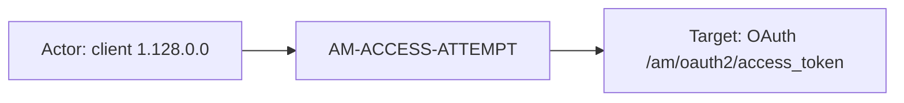
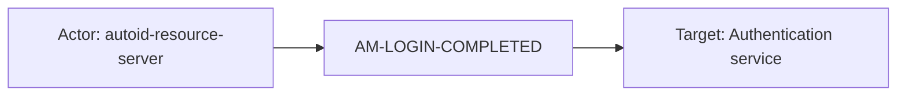
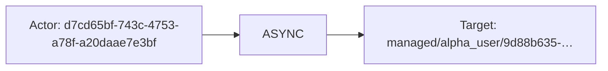

# forgerock

## Product Domain (ForgeRock IAM)

ForgeRock Identity Platform is an identity and access management (IAM) and identity governance and administration (IGA) platform. Organizations use it—typically as ForgeRock Identity Cloud—to centralize authentication, authorization, user lifecycle, and federation across applications and APIs. The platform is built around two core services: Access Management (AM), which handles sign-on, sessions, OAuth/OIDC, and policy enforcement in realms; and Identity Management (IDM), which manages identity objects, provisioning, synchronization with external repositories, and administrative configuration.

Security-relevant activity is recorded as audit and debug logs across AM and IDM topics—access attempts, authentication outcomes, configuration changes, identity object lifecycle events, and sync operations. These logs capture who acted, what changed, when it occurred, and the outcome, supporting compliance, SSO troubleshooting, and detection of unauthorized access or misconfiguration.

The Elastic ForgeRock integration polls the Identity Cloud REST API with API key credentials via Elastic Agent (httpjson input). Events are normalized into ECS-aligned fields with `forgerock.*` vendor fields preserved, enabling search, dashboards, and correlation with broader SIEM data.

## Data Collected (brief)

- **Access Management audit logs**: `forgerock.am_access` (API access attempts), `forgerock.am_authentication` (login and auth module events), `forgerock.am_activity` (session, user profile, and device profile changes), and `forgerock.am_config` (AM configuration changes).
- **Identity Management audit logs**: `forgerock.idm_access` (REST endpoint and scheduled-task access), `forgerock.idm_authentication` (authentication to `/openidm` endpoints), `forgerock.idm_activity` (managed/system object changes such as users and passwords), `forgerock.idm_config` (IDM configuration changes), and `forgerock.idm_sync` (live and implicit sync between mapped repositories).
- **Debug logs**: `forgerock.am_core` and `forgerock.idm_core` for Access Management and Identity Management platform debug output.
- **Common context**: Event name, topic, realm, user/principal, object IDs, operations, tracking/transaction IDs, HTTP request details (method, path, headers, client IP), response status and elapsed time, and ECS `event.action`, `event.category`, and `event.outcome` where applicable.

## Expected Audit Log Entities

Nine streams are true IAM audit logs (four AM: access, authentication, activity, config; five IDM: access, authentication, activity, config, sync). Two streams (`am_core`, `idm_core`) are platform debug output—audit-adjacent for correlation only. Events arrive as JSON from the Identity Cloud REST API and normalize to ECS with rich `forgerock.*` vendor fields retained. No stream populates ECS `user.target.*`, `host.target.*`, `service.target.*`, or `entity.target.*`; no `destination.user.*` / `destination.host.*` in pipelines (forgerock absent from `destination_identity_hits.csv`). The target-fields audit classifies forgerock as **`moderate_candidate`** with `fixture_strong=true` and no tier-A ECS target mapping (`dev/target-fields-audit/out/target_enhancement_packages.csv`).

**`event.action` is populated on four AM audit streams only** (`am_access`, `am_authentication`, `am_activity`, `am_config`) via `forgerock.eventName` → `event.action`. All five IDM audit streams and both debug streams leave `event.action` empty despite vendor fields naming the operation (`forgerock.eventName`, `forgerock.operation`, `forgerock.action`, `forgerock.request.operation`). On `am_activity`, `forgerock.operation` additionally maps to `event.reason` (CRUD qualifier, not the primary action label).

Evidence: all 11 data streams under `packages/forgerock/data_stream/` — 73 pipeline test events across `*/_dev/test/pipeline/*-expected.json`, plus `sample_event.json`, `*/elasticsearch/ingest_pipeline/default.yml`, and `*/fields/forgerock-fields.yml`.

### Event action (semantic)

ForgeRock audit payloads carry a native **`eventName`** on every stream. AM pipelines copy it to `event.action`; IDM pipelines retain it vendor-only. AM activity/config events also carry an **`operation`** field (CREATE, UPDATE, PATCH, DELETE) that refines the change type. IDM sync events carry **`action`** (ASYNC, UPDATE) for reconciliation mode.

| Action (normalized label) | Classification | Confidence | Evidence | Per-stream notes |
| --- | --- | --- | --- | --- |
| `AM-ACCESS-ATTEMPT` / `AM-ACCESS-OUTCOME` | data_access | high | `test-am-access.log-expected.json` (14 events); `sample_event.json` | **`am_access`** — OAuth/API access attempt/outcome pair; pipeline sets `event.type: [access]` |
| `AM-LOGIN-COMPLETED` / `AM-LOGIN-MODULE-COMPLETED` | authentication | high | `test-am-authentication.log-expected.json` (7 events) | **`am_authentication`** — login completion vs auth-module step; pipeline sets `event.category: [authentication]` |
| `AM-SESSION-CREATED` / `AM-SESSION-IDLE_TIMED_OUT` / `AM-SESSION-DESTROYED` | session | high | `test-am-activity.log-expected.json` | **`am_activity`** — session lifecycle; `event.reason` carries CRUD (`CREATE`/`DELETE`) from `forgerock.operation` |
| `AM-IDENTITY-CHANGE` | administration | high | `test-am-activity.log-expected.json` | **`am_activity`** — user/profile/device changes; `event.reason`: `UPDATE` |
| `AM-CONFIG-CHANGE` | configuration_change | high | `test-am-config.log-expected.json` (4 events); `sample_event.json` | **`am_config`** — AM service config DN changes; pipeline sets `event.category: [configuration]`; vendor `operation` (CREATE/UPDATE) retained but not mapped |
| `access` | data_access | high | `test-idm-access.log-expected.json` (4 events); `sample_event.json` | **`idm_access`** — REST endpoint access; vendor-only; alternate: `forgerock.request.operation: READ` |
| `authentication` | authentication | high | `test-idm-authentication.log-expected.json` (1 event); `sample_event.json` | **`idm_authentication`** — IDM login; vendor-only; alternate: `forgerock.method: MANAGED_USER` |
| `activity` / `relationship_created` | administration | high | `test-idm-activity.log-expected.json` (6 events) | **`idm_activity`** — managed-object CRUD and relationship creation; vendor-only; alternate: `forgerock.operation` (PATCH, CREATE) |
| `CONFIG` | configuration_change | high | `test-idm-config.log-expected.json` (3 events); `sample_event.json` | **`idm_config`** — IDM sync mapping config; vendor-only; alternate: `forgerock.operation: UPDATE` (removed by pipeline) |
| `sync` + `ASYNC` / `UPDATE` | provisioning | high | `test-idm-sync.log-expected.json` (5 events); `sample_event.json` | **`idm_sync`** — repository reconciliation; `forgerock.action` is the specific sync mode; `forgerock.eventName: sync` is generic topic label |
| *(debug message text)* | general | medium | `test-am-core.log-expected.json`, `test-idm-core.log-expected.json` | **`am_core`**, **`idm_core`** — no per-event action; `event.reason` ← debug `message`/`payload` only |

### Event action (ECS candidates)

| ECS / vendor field | Mapped to `event.action` today? | Mapping correct? | Recommended `event.action` value (from fixtures) | Enhancement candidate? | Evidence |
| --- | --- | --- | --- | --- | --- |
| `forgerock.eventName` → `event.action` | yes (4 AM streams) | yes | `AM-ACCESS-ATTEMPT`, `AM-LOGIN-COMPLETED`, `AM-SESSION-CREATED`, `AM-CONFIG-CHANGE`, … | no | `am_access/default.yml` L44–45; `am_authentication` L44–45; `am_activity` L41–42; `am_config` L44–45 |
| `forgerock.eventName` (vendor-only) | no (5 IDM audit streams) | n/a | `access`, `authentication`, `activity`, `relationship_created`, `CONFIG`, `sync` | yes | Retained under `forgerock.*` in all IDM expected fixtures; no pipeline `set` to `event.action` |
| `forgerock.operation` → `event.reason` | yes (`am_activity` only) | partial | `CREATE`, `UPDATE`, `DELETE` | partial | `am_activity/default.yml` L57–58 — CRUD qualifier, not the session/identity event name; correct as `event.reason`, not `event.action` |
| `forgerock.operation` (vendor-only) | no | n/a | `CREATE`, `UPDATE`, `PATCH` | yes | **`am_config`**, **`idm_activity`**, **`idm_config`** fixtures; `idm_config` pipeline removes field without ECS mapping |
| `forgerock.action` (vendor-only) | no | n/a | `ASYNC`, `UPDATE` | yes | **`idm_sync`** — primary sync-mode candidate; more specific than `eventName: sync` |
| `forgerock.request.operation` (vendor-only) | no | n/a | `READ` | yes | **`idm_access`** fixtures — CREST operation alongside `http.request.method: GET` |
| `forgerock.method` (vendor-only) | no | n/a | `MANAGED_USER` | partial | **`idm_authentication`** — auth method qualifier; secondary to `eventName: authentication` |
| `forgerock.message` / `forgerock.payload` → `event.reason` | no (`event.action`) | n/a | — | no | **`am_core`**, **`idm_core`** debug pipelines — free-text reason, not structured action |
| `event.type` / `event.category` | n/a (downstream) | yes | `[access]`, `[authentication]`, `[configuration]` | no | Set statically on AM access/auth/config; category is not a substitute for `event.action` |

**Step 2b — per-stream check:**

| Stream | `event.action` in fixtures? | Pipeline maps to `event.action`? | Primary action candidate | Confidence | Evidence |
| --- | --- | --- | --- | --- | --- |
| `am_access` | yes (14/14) | yes | `forgerock.eventName` | high | `set` L44–45; values `AM-ACCESS-ATTEMPT`, `AM-ACCESS-OUTCOME` |
| `am_authentication` | yes (7/7) | yes | `forgerock.eventName` | high | `set` L44–45; values `AM-LOGIN-COMPLETED`, `AM-LOGIN-MODULE-COMPLETED` |
| `am_activity` | yes (16/16) | yes | `forgerock.eventName` | high | `set` L41–42; values `AM-SESSION-CREATED`, `AM-IDENTITY-CHANGE`, …; alternate `forgerock.operation` → `event.reason` |
| `am_config` | yes (4/4) | yes | `forgerock.eventName` | high | `set` L44–45; value `AM-CONFIG-CHANGE`; alternate `forgerock.operation` (CREATE/UPDATE) vendor-only |
| `idm_access` | no | no | `forgerock.eventName` (`access`) | high | Vendor retained; alternate `forgerock.request.operation` (`READ`) |
| `idm_authentication` | no | no | `forgerock.eventName` (`authentication`) | high | Vendor retained; alternate `forgerock.method` (`MANAGED_USER`) |
| `idm_activity` | no | no | `forgerock.eventName` (`activity`, `relationship_created`) | high | Vendor retained; alternate `forgerock.operation` (PATCH, CREATE) |
| `idm_config` | no | no | `forgerock.eventName` (`CONFIG`) | high | Vendor retained; alternate `forgerock.operation` (`UPDATE`, removed by pipeline) |
| `idm_sync` | no | no | `forgerock.action` (`ASYNC`, `UPDATE`) | high | Vendor retained; `forgerock.eventName: sync` is generic fallback |
| `am_core` | no | no | — (no per-event action) | high | Debug stream; `event.reason` ← `forgerock.message` only |
| `idm_core` | no | no | — (no per-event action) | high | Debug stream; `event.reason` ← `forgerock.payload` / `payload.message` only |

### Actor (semantic)

| Entity | Classification | Entity type (if general) | Confidence | Evidence | Per-stream notes |
| --- | --- | --- | --- | --- | --- |
| Authenticated IAM principal | user | — | high | `userId` → `user.id` (`*/default.yml` copy_from); AM DN and IDM UUID forms in fixtures | **`am_activity`** 13/16, **`am_config`** 4/4, **`idm_*`** activity/config/sync/auth 100%; **`am_access`** 4/14 (outcome only); **`am_authentication`** 4/7 (login completed) |
| Delegated / effective principal | user | — | high | `runAs` → `user.effective.id` | **`am_activity`** 11/16, **`am_config`** 4/4, **`idm_activity`** 6/6, **`idm_config`** 3/3; empty on session timeout events |
| Human-readable auth account | user | service_account | medium | `forgerock.principal[]` vendor-only (`autoid-resource-server`, `openidm-admin`) | **`am_authentication`** 7/7, **`idm_authentication`** 1/1; not promoted to `user.name` |
| HTTP/API client endpoint | host | — | high | `forgerock.client.ip/port` → `client.ip`/`client.port`; `forgerock.client.host` → `client.domain` (AM access only) | **`am_access`** 14/14, **`idm_access`** 4/4 |
| Anonymous REST caller | user | — | medium | `user.id: "anonymous"` for unauthenticated ping reads | **`idm_access`** 4/4 |
| IDM authorization roles | general | idm_role | medium | `forgerock.roles[]` (e.g. `internal/role/openidm-reg`) | **`idm_access`** 4/4 only; caller auth context, not mapped to ECS |
| AM/IDM server node | host | — | medium | `forgerock.server.*` → `server.ip`/`server.domain` | **`am_access`** 2/14, **`idm_access`** 4/4; platform node handling request, not remote actor |

**No actor identity:** **`am_core`** (5 fixtures) and **`idm_core`** (8 fixtures) — debug logger/thread/message only. **`am_access`** attempt events (10/14) and **`am_authentication`** module-completed events (3/7) omit `userId` until paired outcome/completed events.

### Actor (ECS candidates)

| ECS / vendor field | Role | Mapped today? | Mapping correct? | Confidence | Evidence |
| --- | --- | --- | --- | --- | --- |
| `user.id` | Authenticated principal | yes (stream-dependent) | yes | high | `forgerock.userId` copy; removed from vendor tree after ingest on most streams |
| `user.effective.id` | Delegated/run-as identity | yes | yes | high | `forgerock.runAs` copy on activity/config streams |
| `user.name` | Human principal name | no | n/a | medium | `forgerock.principal[]` retained vendor-only on auth streams |
| `client.ip` / `client.port` | Calling client endpoint | yes | yes | high | `forgerock.client.ip/port` convert/copy on access streams |
| `client.domain` | Client hostname | yes (AM only) | yes | high | `forgerock.client.host` → `client.domain` (`am_access/default.yml`) |
| `server.ip` / `server.domain` | AM/IDM node | yes | yes (context) | medium | `forgerock.server.*` on access streams — platform context, not actor |
| `forgerock.principal[]` | Auth account names | no (vendor-only) | n/a | high | `am_authentication`, `idm_authentication` fixtures |
| `forgerock.entries[]` | Auth module/tree metadata | no (vendor-only) | n/a | medium | Flattened module chain; includes `info.ipAddress` not mapped to ECS |
| `forgerock.roles[]` | IDM caller roles | no (vendor-only) | n/a | medium | `idm_access` fixtures |
| `forgerock.realm` | Auth/access realm scope | no (vendor-only) | n/a | high | AM streams; scopes context, not actor |
| `forgerock.trackingIds[]` | Session/token correlation | no (vendor-only) | n/a | high | Links auth → access → activity events |
| `observer.vendor` | Log source product | yes | yes (context) | high | Static `ForgeRock Identity Platform` on all pipelines |
| `transaction.id` | Request correlation | yes | yes (context) | high | `forgerock.transactionId` copy |

### Target (semantic)

| Layer | Description | Entity | Classification | Entity type (if general) | Confidence | Evidence | Per-stream notes |
| --- | --- | --- | --- | --- | --- | --- | --- |
| 1 — Platform / cloud service | Invoked IAM subsystem | AM OAuth, Authentication, Session, Users; IDM REST | service | — | high | `forgerock.component` → `service.name` on AM access/auth/activity | **`am_access`**, **`am_authentication`**, **`am_activity`**; IDM streams lack `component` mapping |
| 2 — Resource / object | Identity, session, or config object acted upon | Managed user, AM session, LDAP config DN, sync mapping | user / general | session, am_config_dn, managed_object | high | `forgerock.objectId`, `forgerock.sourceObjectId`, `forgerock.targetObjectId` | **`am_activity`**, **`am_config`**, **`idm_activity`**, **`idm_config`**, **`idm_sync`** |
| 3 — Content / artifact | API call, OAuth grant, sync transaction | REST endpoint URL, token scope, sync situation | general | api_request, oauth_token, sync_event | high | `http.request.Path`, `forgerock.request.detail.*`, `forgerock.response.detail.*`, `forgerock.situation` | **`am_access`**, **`idm_access`**, **`idm_sync`** |

### Target (ECS candidates)

| ECS / vendor field | Layer | Classification | Mapped today? | Mapping correct? | ECS target bucket | Enhancement candidate? | Evidence |
| --- | --- | --- | --- | --- | --- | --- | --- |
| `service.name` | 1 | service | yes (AM) | yes | `service.target.name` | yes | `forgerock.component` → `service.name` (`OAuth`, `Authentication`, `Session`, `Users`) |
| `http.request.Path` | 3 | general | yes | yes (api_request) | context-only | no | Full URL path on access streams; e.g. `/am/oauth2/access_token`, `/openidm/info/ping` |
| `http.request.method` / `http.response.status_code` | 3 | general | yes | yes | context-only | no | REST operation metadata on access streams |
| `event.reason` | 3 | general | yes (`am_activity`, core) | partial | context-only | no | `forgerock.operation` on **`am_activity`** (CRUD); debug message on core streams — not primary action label |
| `forgerock.objectId` | 2 | user / general | no (vendor-only) | n/a | `user.target.id` / `entity.target.id` | yes | Session IDs, identity DNs, managed paths, config DNs — type-dependent |
| `forgerock.before.*` / `forgerock.after.*` | 2 | general | no (vendor-only) | n/a | context-only | no | Object state snapshots on activity streams |
| `forgerock.changedFields` | 2 | general | no (vendor-only) | n/a | context-only | no | Modified field list on activity/config streams |
| `forgerock.sourceObjectId` | 2 | user | no (vendor-only) | n/a | `user.target.id` | yes | Source managed object on all **`idm_sync`** fixtures (`managed/alpha_user/…`) |
| `forgerock.targetObjectId` | 2 | user | no (vendor-only) | n/a | `user.target.id` | yes | Target repo object when link confirmed (1/5 sync fixtures) |
| `forgerock.mapping` / `forgerock.situation` | 3 | general | no (vendor-only) | n/a | context-only | no | Sync mapping name and reconciliation outcome |
| `forgerock.request.detail.*` | 3 | general | no (vendor-only) | n/a | context-only | no | OAuth grant_type, scope on **`am_access`** |
| `forgerock.response.detail.*` | 3 | general | no (vendor-only) | n/a | context-only | no | Token scope, `client_id`, `username` on OAuth outcomes |
| `forgerock.trackingIds[]` | 2 | general | no (vendor-only) | n/a | `entity.target.id` | yes | Session/OAuth token alias across AM event chain |
| `forgerock.realm` | 1 | service | no (vendor-only) | n/a | context-only | no | AM realm scope (`/`, `/alpha`) |
| `server.ip` / `server.domain` | 1 | host | yes | yes (context) | context-only | no | AM/IDM node — platform endpoint, not acted-upon target |

### Gaps and mapping notes

- **No ECS `*.target.*` today** — richest target identity is vendor-only: `forgerock.objectId`, `forgerock.sourceObjectId`, `forgerock.targetObjectId`. Enhancement: promote typed targets to `user.target.*` (managed users, sync objects), `entity.target.id` (sessions, config DNs), or `service.target.name` (AM component).
- **`service.name` is Layer 1 target, not actor** — AM subsystem (`OAuth`, `Session`, etc.) identifies what was invoked/changed; do not treat as caller identity.
- **`forgerock.principal[]` not mapped to `user.name`** — human-readable auth account names remain vendor-only while `user.id` carries DN/UUID form.
- **`user.id` and target object can share identity paths** — on authentication streams the logging-in principal is actor; on activity/sync streams the same field shape (`managed/…`, DN) often describes the **target** object when present in `forgerock.objectId` instead. Disambiguation requires event type, not field name alone.
- **Sync source/target naming ≠ ECS source/destination** — `forgerock.sourceObjectId` / `forgerock.targetObjectId` are IDM repository sync endpoints, not network peers. No ECS `source.*` or `destination.*` mapping.
- **No `destination.user.*` / `destination.host.*`** — forgerock not in `destination_identity_hits.csv`; no de-facto target pattern under `destination.*`.
- **Partial actor on multi-stage events** — access attempts and auth module steps lack `userId`; correlate via `transaction.id` / `forgerock.trackingIds[]` to outcome events.
- **`event.action` gaps on five IDM audit streams + two debug streams** — `forgerock.eventName` is present in every IDM fixture but not copied to `event.action`; recommended primary candidates per stream in Step 2b table. On **`idm_sync`**, prefer `forgerock.action` (`ASYNC`, `UPDATE`) over generic `eventName: sync`. On **`idm_activity`**, consider composite `{eventName}.{operation}` or map `relationship_created` distinctly from generic `activity`.
- **`forgerock.operation` inconsistently mapped** — copied to `event.reason` on **`am_activity`** only; retained vendor-only on **`am_config`** and **`idm_activity`**; removed without ECS mapping on **`idm_config`**. Enhancement: map to `event.reason` on config/activity streams for CRUD context.
- **Target-fields audit alignment** — `moderate_candidate`: strong vendor target fields and fixtures (`fixture_strong=true`) but no tier-A ECS target mapping and heuristic `pipeline_actor=false` (simple `userId` copy not flagged by scan).

### Per-stream notes

#### `am_access`

True access audit. **Action:** `event.action` ← `forgerock.eventName` (`AM-ACCESS-ATTEMPT`, `AM-ACCESS-OUTCOME`); `event.type: [access]`. Actor: `client.*` always; `user.id` on outcomes (4/14). Target Layer 1: `service.name` ← component (`OAuth`, `Authentication`). Layer 3: `http.request.Path` (primary API target). OAuth grant/scope/token detail under `forgerock.request.detail.*` / `forgerock.response.detail.*`.

#### `am_authentication`

True authentication audit. **Action:** `event.action` ← `forgerock.eventName` (`AM-LOGIN-COMPLETED`, `AM-LOGIN-MODULE-COMPLETED`); `event.category: [authentication]`. Actor: `user.id` on login completed (4/7); `forgerock.principal[]` + `forgerock.entries[]` on all 7. Target Layer 1: `service.name`. Layer 2/3: session/token via `forgerock.trackingIds[]` (links to activity/access). No explicit `objectId`.

#### `am_activity`

True activity audit. **Action:** `event.action` ← `forgerock.eventName` (session/identity events); `event.reason` ← `forgerock.operation` (CREATE/UPDATE/DELETE). Actor: `user.id` + `user.effective.id` (runAs). Target Layer 2: `forgerock.objectId` — session IDs (`AM-SESSION-*`) or identity DNs (`AM-IDENTITY-CHANGE`). Layer 1: `service.name` ← component (`Session`, `Users`). Optional before/after snapshots.

#### `am_config`

True configuration audit. **Action:** `event.action` ← `forgerock.eventName` (`AM-CONFIG-CHANGE`); `event.category: [configuration]`; vendor `forgerock.operation` (CREATE/UPDATE) not mapped to ECS. Actor: `user.id` + `user.effective.id`. Target Layer 2: AM config DN in `forgerock.objectId` (4/4).

#### `idm_access`

True REST access audit. **Action:** `event.action` absent — candidate `forgerock.eventName: access`; alternate `forgerock.request.operation: READ`. Actor: `user.id` (including `anonymous`), `client.*`, `forgerock.roles[]`. Target Layer 3: `http.request.Path` (ping in fixtures).

#### `idm_authentication`

True authentication audit. **Action:** `event.action` absent — candidate `forgerock.eventName: authentication`; alternate `forgerock.method: MANAGED_USER`. `event.category: [authentication]` set; `event.outcome` from `result`. Actor: `user.id`, `forgerock.principal[]`, `forgerock.entries[]`. No explicit object target — self-referential login.

#### `idm_activity`

True activity audit. **Action:** `event.action` absent — candidate `forgerock.eventName` (`activity`, `relationship_created`); alternate `forgerock.operation` (PATCH, CREATE). Actor: `user.id` + `user.effective.id`. Target Layer 2: `forgerock.objectId` — managed users/orgs/relationships (`managed/alpha_user/…`, `internal/role/…`).

#### `idm_config`

True configuration audit. **Action:** `event.action` absent — candidate `forgerock.eventName: CONFIG`; alternate `forgerock.operation: UPDATE` (removed by pipeline). `event.category: [configuration]` set. Actor: `user.id` + `user.effective.id`. Target Layer 2: config node (`forgerock.objectId: sync`) with `forgerock.changedFields`.

#### `idm_sync`

True sync audit. **Action:** `event.action` absent — primary candidate `forgerock.action` (`ASYNC`, `UPDATE`); fallback `forgerock.eventName: sync`. Actor: `user.id` (sync initiator). Target Layer 2: `forgerock.sourceObjectId` (5/5), `forgerock.targetObjectId` (1/5). Layer 3: `forgerock.mapping`, `forgerock.situation`.

#### `am_core`

Debug-only — not IAM audit. **Action:** no per-event action; `event.reason` ← `forgerock.message`. No actor/target semantics. `log.logger`, `process.name`, optional `error.stack_trace`; `transaction.id` on some events for correlation.

#### `idm_core`

Debug-only — not IAM audit. **Action:** no per-event action; `event.reason` ← `forgerock.payload` (string or `payload.message`). No actor/target semantics. Structured debug fields under `forgerock.idm_core.*` after pipeline rename.

## Example Event Graph

These examples come from nine IAM audit streams (four AM, five IDM) in `packages/forgerock/`; `am_core` and `idm_core` debug streams are omitted because they lack per-event actor/action/target semantics.

### Example 1: OAuth token access attempt

**Stream:** `forgerock.am_access` · **Fixture:** `packages/forgerock/data_stream/am_access/_dev/test/pipeline/test-am-access.log-expected.json`

```
HTTP client (1.128.0.0) → AM-ACCESS-ATTEMPT → OAuth service (/am/oauth2/access_token)
```

#### Actor

| Field | Value |
| --- | --- |
| ip | 1.128.0.0 |
| type | host |

**Field sources:**
- `ip` ← `client.ip`

#### Event action

| Field | Value |
| --- | --- |
| action | AM-ACCESS-ATTEMPT |
| source_field | `event.action` |
| source_value | AM-ACCESS-ATTEMPT |

#### Target

| Field | Value |
| --- | --- |
| name | OAuth |
| type | service |

**Field sources:**
- `name` ← `service.name` ← `forgerock.component`
- API endpoint context ← `http.request.Path` (`https://openam-chico-poc.forgeblocks.com/am/oauth2/access_token`)

#### Mermaid



### Example 2: AM login completed

**Stream:** `forgerock.am_authentication` · **Fixture:** `packages/forgerock/data_stream/am_authentication/sample_event.json`

```
Service account (autoid-resource-server) → AM-LOGIN-COMPLETED → Authentication service
```

#### Actor

| Field | Value |
| --- | --- |
| id | id=autoid-resource-server,ou=agent,ou=am-config |
| name | autoid-resource-server |
| type | user |
| sub_type | service_account |

**Field sources:**
- `id` ← `user.id`
- `name` ← `forgerock.principal[]` (vendor-only; not mapped to `user.name` today)

#### Event action

| Field | Value |
| --- | --- |
| action | AM-LOGIN-COMPLETED |
| source_field | `event.action` |
| source_value | AM-LOGIN-COMPLETED |

#### Target

| Field | Value |
| --- | --- |
| name | Authentication |
| type | service |

**Field sources:**
- `name` ← `service.name`

#### Mermaid



### Example 3: IDM repository sync (async)

**Stream:** `forgerock.idm_sync` · **Fixture:** `packages/forgerock/data_stream/idm_sync/sample_event.json`

```
Sync initiator (d7cd65bf-…) → ASYNC → managed alpha_user object
```

#### Actor

| Field | Value |
| --- | --- |
| id | d7cd65bf-743c-4753-a78f-a20daae7e3bf |
| type | user |

**Field sources:**
- `id` ← `user.id`

#### Event action

| Field | Value |
| --- | --- |
| action | ASYNC |
| source_field | `forgerock.action` |
| source_value | ASYNC |

Action derived from `forgerock.action` — **not mapped to ECS `event.action` today** (generic `forgerock.eventName: sync` is the vendor fallback).

#### Target

| Field | Value |
| --- | --- |
| id | managed/alpha_user/9d88b635-9b7a-48d3-9a57-1978b99a5f41 |
| type | user |
| sub_type | managed_object |

**Field sources:**
- `id` ← `forgerock.sourceObjectId` (vendor-only; not mapped to `user.target.id` today)

#### Mermaid



## ES|QL Entity Extraction

**Package type: agent-backed** (policy template `forgerock`, eleven `data_stream/` directories with Tier A fixtures and ingest pipelines). Router: **`data_stream.dataset`** (`forgerock.<stream>` per stream manifest). Nine IAM audit streams get fill-gaps extraction; **`forgerock.am_core`** and **`forgerock.idm_core`** are excluded (debug). Pass 4 is **fill-gaps-only**: detection flags (`actor_exists`, `target_exists`, `action_exists`) run first for query semantics; **mapped columns use column-level preserve** (`<col> IS NOT NULL`) — valid **3-arg**, **5-arg**, or **7-arg** `CASE` only — not `CASE(actor_exists, <col>, …)` / `CASE(target_exists, <col>, …)` and never **4-arg** `CASE(<col> IS NOT NULL, <col>, bare_field, null)` (bare field parses as a boolean condition). No ECS `*.target.*` at ingest today — fallbacks promote `service.name` → `service.target.name`, vendor `forgerock.objectId` / `sourceObjectId` / `targetObjectId` → `user.target.*` / `entity.target.*`, and `client.ip` → `host.ip` on client-only access attempts (Pass 3). AM login targets the invoked subsystem (`service.target.name` from `service.name`), not self-referential `user.target.*`.

### Dataset inventory

| data_stream.dataset | Stream role | Actor classification(s) | Target classification(s) | Extraction |
| --- | --- | --- | --- | --- |
| `forgerock.am_access` | AM API access audit | host (client) / user (outcome) | service, general (API path) | partial |
| `forgerock.am_authentication` | AM login audit | user | service | full |
| `forgerock.am_activity` | AM session/identity audit | user | user, service, general (session) | full |
| `forgerock.am_config` | AM config audit | user | general (config DN) | full |
| `forgerock.idm_access` | IDM REST access audit | user / host (client) | general (API path) | partial |
| `forgerock.idm_authentication` | IDM login audit | user | service | partial |
| `forgerock.idm_activity` | IDM object CRUD audit | user | user, general | full |
| `forgerock.idm_config` | IDM config audit | user | general | full |
| `forgerock.idm_sync` | IDM repository sync | user | user | full |
| `forgerock.am_core` | AM debug | — | — | none |
| `forgerock.idm_core` | IDM debug | — | — | none |

### Field mapping plan

#### Actor mappings

| Output column | Source field(s) | Condition (dataset + optional) | Confidence | Notes |
| --- | --- | --- | --- | --- |
| `user.id` | `user.id` (ingest ← `forgerock.userId`) | `data_stream.dataset IN ("forgerock.am_activity", "forgerock.am_config", "forgerock.am_authentication", "forgerock.am_access", "forgerock.idm_access", "forgerock.idm_authentication", "forgerock.idm_activity", "forgerock.idm_config", "forgerock.idm_sync")` | high | **ingest-only — no ES|QL**; no query-time vendor path after pipeline rename; omitted from actor `EVAL` (Pass 4 #10) |
| `user.name` | `MV_FIRST(forgerock.principal)` | `data_stream.dataset IN ("forgerock.am_authentication", "forgerock.idm_authentication")` | medium | **vendor fallback**; column-level preserve (`user.name IS NOT NULL` first) because `user.id` alone sets `actor_exists` |
| `user.effective.id` | `user.effective.id` (ingest ← `forgerock.runAs`) | `data_stream.dataset IN ("forgerock.am_activity", "forgerock.am_config", "forgerock.idm_activity", "forgerock.idm_config")` | high | **ingest-only — no ES|QL**; no alternate source at query time; omitted from actor `EVAL` |
| `host.ip` | `client.ip` | `data_stream.dataset IN ("forgerock.am_access", "forgerock.idm_access")` | high | **vendor fallback**; HTTP client as actor when `host.ip` empty (Pass 3 Example 1) |

`actor_exists` uses standard user/host/service/entity predicates; **`client.ip` is not in `actor_exists`** so client-only access attempts still receive `host.ip` fallback.

#### Target mappings

| Output column | Source field(s) | Condition (dataset + optional) | Confidence | Notes |
| --- | --- | --- | --- | --- |
| `service.target.name` | `service.name` | `data_stream.dataset IN ("forgerock.am_access", "forgerock.am_authentication", "forgerock.am_activity") AND service.name IS NOT NULL` | high | **vendor fallback** ← `forgerock.component`; login → Authentication/OAuth (Pass 3) |
| `service.target.name` | `"Identity Management"` | `data_stream.dataset == "forgerock.idm_authentication"` | low | **semantic literal**; no `component` on IDM auth fixtures |
| `user.target.id` | `forgerock.sourceObjectId` | `data_stream.dataset == "forgerock.idm_sync"` | high | **vendor fallback**; Pass 3 Example 3 |
| `user.target.id` | `forgerock.targetObjectId` | `data_stream.dataset == "forgerock.idm_sync" AND forgerock.targetObjectId IS NOT NULL` | high | **vendor fallback**; confirmed link (1/5 fixtures) |
| `user.target.id` | `forgerock.objectId` | `data_stream.dataset IN ("forgerock.am_activity", "forgerock.idm_activity") AND STARTS_WITH(forgerock.objectId, "managed/")` | medium | **vendor fallback**; managed-object heuristic |
| `entity.target.id` | `forgerock.objectId` | `data_stream.dataset IN ("forgerock.am_activity", "forgerock.am_config", "forgerock.idm_activity", "forgerock.idm_config") AND forgerock.objectId IS NOT NULL AND NOT STARTS_WITH(forgerock.objectId, "managed/")` | high | **vendor fallback**; sessions, AM identity DNs, config nodes |
| `entity.target.id` | `http.request.Path` | `data_stream.dataset IN ("forgerock.am_access", "forgerock.idm_access") AND http.request.Path IS NOT NULL` | medium | **vendor fallback**; Layer 3 API endpoint |

#### Event action mappings

| Output column | Source field(s) | Condition (dataset + optional) | Confidence | Notes |
| --- | --- | --- | --- | --- |
| `event.action` | `event.action` | `data_stream.dataset IN ("forgerock.am_access", "forgerock.am_authentication", "forgerock.am_activity", "forgerock.am_config")` | high | **preserve existing**; ingest ← `forgerock.eventName` |
| `event.action` | `forgerock.action` | `data_stream.dataset == "forgerock.idm_sync" AND forgerock.action IS NOT NULL` | high | **vendor fallback**; prefer over generic `eventName: sync` (Pass 2) |
| `event.action` | `forgerock.eventName` | `data_stream.dataset IN ("forgerock.idm_access", "forgerock.idm_authentication", "forgerock.idm_activity", "forgerock.idm_config", "forgerock.idm_sync")` | high | **vendor fallback**; IDM audit streams |

### Detection flags (mandatory — run first)

```esql
| EVAL
  actor_exists = user.id IS NOT NULL OR user.name IS NOT NULL OR user.email IS NOT NULL
    OR host.id IS NOT NULL OR host.ip IS NOT NULL OR host.name IS NOT NULL
    OR service.id IS NOT NULL OR service.name IS NOT NULL
    OR entity.id IS NOT NULL OR entity.name IS NOT NULL,
  target_exists = user.target.id IS NOT NULL OR user.target.name IS NOT NULL OR user.target.email IS NOT NULL
    OR host.target.id IS NOT NULL OR host.target.ip IS NOT NULL OR host.target.name IS NOT NULL
    OR service.target.id IS NOT NULL OR service.target.name IS NOT NULL
    OR entity.target.id IS NOT NULL OR entity.target.name IS NOT NULL,
  action_exists = event.action IS NOT NULL
```

No `*.target.*` populated at ingest — `target_exists` is typically false until fallback `EVAL`s run in the same query.

**Semantics:** `actor_exists` / `target_exists` / `action_exists` are query-time helpers. Actor/target/action **`EVAL` blocks use column-level preserve** (`<col> IS NOT NULL`) — not `CASE(actor_exists, host.ip, …)` / `CASE(target_exists, service.target.name, …)` — so e.g. `user.id` on auth streams does not block `user.name` ← `MV_FIRST(forgerock.principal)` when `user.name` is empty (Pass 4 §10).

### Optional classification helpers (when needed)

Set in **fallback** only (column-level preserve on `entity.target.type` / `entity.target.sub_type`):

```esql
| EVAL
  entity.type = CASE(
    entity.type IS NOT NULL, entity.type,
    data_stream.dataset IN ("forgerock.am_access", "forgerock.idm_access") AND user.id IS NULL AND client.ip IS NOT NULL, "host",
    data_stream.dataset IN ("forgerock.am_access", "forgerock.idm_access", "forgerock.am_authentication", "forgerock.idm_authentication", "forgerock.am_activity", "forgerock.am_config", "forgerock.idm_activity", "forgerock.idm_config", "forgerock.idm_sync"), "user",
    null
  ),
  entity.target.type = CASE(
    entity.target.type IS NOT NULL, entity.target.type,
    data_stream.dataset IN ("forgerock.am_access", "forgerock.am_authentication", "forgerock.am_activity") AND service.name IS NOT NULL, "service",
    data_stream.dataset == "forgerock.idm_authentication", "service",
    data_stream.dataset == "forgerock.idm_sync", "user",
    data_stream.dataset IN ("forgerock.am_activity", "forgerock.idm_activity") AND STARTS_WITH(forgerock.objectId, "managed/"), "user",
    data_stream.dataset IN ("forgerock.am_activity", "forgerock.am_config", "forgerock.idm_activity", "forgerock.idm_config"), "general",
    null
  ),
  entity.target.sub_type = CASE(
    entity.target.sub_type IS NOT NULL, entity.target.sub_type,
    data_stream.dataset IN ("forgerock.am_activity", "forgerock.idm_activity") AND STARTS_WITH(forgerock.objectId, "managed/"), "managed_object",
    null
  )
```

### Combined ES|QL — actor fields

```esql
| EVAL
  user.name = CASE(
    user.name IS NOT NULL, user.name,
    data_stream.dataset IN ("forgerock.am_authentication", "forgerock.idm_authentication"), MV_FIRST(forgerock.principal),
    null
  ),
  host.ip = CASE(
    host.ip IS NOT NULL, host.ip,
    data_stream.dataset IN ("forgerock.am_access", "forgerock.idm_access") AND client.ip IS NOT NULL, client.ip,
    null
  )
```

`user.id` and `user.effective.id` are populated at ingest only — no `CASE` emitted when fallback would re-read the same column (Pass 4 #10).

### Combined ES|QL — event action

```esql
| EVAL
  event.action = CASE(
    event.action IS NOT NULL, event.action,
    data_stream.dataset == "forgerock.idm_sync" AND forgerock.action IS NOT NULL, forgerock.action,
    data_stream.dataset IN ("forgerock.idm_access", "forgerock.idm_authentication", "forgerock.idm_activity", "forgerock.idm_config", "forgerock.idm_sync") AND forgerock.eventName IS NOT NULL, forgerock.eventName,
    null
  )
```

AM audit streams already populate `event.action` at ingest — `action_exists` preserves them.

### Combined ES|QL — target fields

```esql
| EVAL
  service.target.name = CASE(
    service.target.name IS NOT NULL, service.target.name,
    data_stream.dataset IN ("forgerock.am_access", "forgerock.am_authentication", "forgerock.am_activity") AND service.name IS NOT NULL, service.name,
    data_stream.dataset == "forgerock.idm_authentication", "Identity Management",
    null
  ),
  user.target.id = CASE(
    user.target.id IS NOT NULL, user.target.id,
    data_stream.dataset == "forgerock.idm_sync" AND forgerock.sourceObjectId IS NOT NULL, forgerock.sourceObjectId,
    data_stream.dataset IN ("forgerock.am_activity", "forgerock.idm_activity") AND STARTS_WITH(forgerock.objectId, "managed/"), forgerock.objectId,
    data_stream.dataset == "forgerock.idm_sync" AND forgerock.targetObjectId IS NOT NULL, forgerock.targetObjectId,
    null
  ),
  entity.target.id = CASE(
    entity.target.id IS NOT NULL, entity.target.id,
    data_stream.dataset IN ("forgerock.am_activity", "forgerock.am_config", "forgerock.idm_activity", "forgerock.idm_config") AND forgerock.objectId IS NOT NULL AND NOT STARTS_WITH(forgerock.objectId, "managed/"), forgerock.objectId,
    data_stream.dataset IN ("forgerock.am_access", "forgerock.idm_access") AND http.request.Path IS NOT NULL, http.request.Path,
    null
  )
```

### Full pipeline fragment (optional)

```esql
FROM logs-*
| EVAL
  actor_exists = user.id IS NOT NULL OR user.name IS NOT NULL OR user.email IS NOT NULL
    OR host.id IS NOT NULL OR host.ip IS NOT NULL OR host.name IS NOT NULL
    OR service.id IS NOT NULL OR service.name IS NOT NULL
    OR entity.id IS NOT NULL OR entity.name IS NOT NULL,
  target_exists = user.target.id IS NOT NULL OR user.target.name IS NOT NULL OR user.target.email IS NOT NULL
    OR host.target.id IS NOT NULL OR host.target.ip IS NOT NULL OR host.target.name IS NOT NULL
    OR service.target.id IS NOT NULL OR service.target.name IS NOT NULL
    OR entity.target.id IS NOT NULL OR entity.target.name IS NOT NULL,
  action_exists = event.action IS NOT NULL
| EVAL
  user.name = CASE(user.name IS NOT NULL, user.name, data_stream.dataset IN ("forgerock.am_authentication", "forgerock.idm_authentication"), MV_FIRST(forgerock.principal), null),
  host.ip = CASE(host.ip IS NOT NULL, host.ip, data_stream.dataset IN ("forgerock.am_access", "forgerock.idm_access") AND client.ip IS NOT NULL, client.ip, null)
| EVAL
  event.action = CASE(event.action IS NOT NULL, event.action, data_stream.dataset == "forgerock.idm_sync" AND forgerock.action IS NOT NULL, forgerock.action, data_stream.dataset IN ("forgerock.idm_access", "forgerock.idm_authentication", "forgerock.idm_activity", "forgerock.idm_config", "forgerock.idm_sync") AND forgerock.eventName IS NOT NULL, forgerock.eventName, null)
| EVAL
  service.target.name = CASE(service.target.name IS NOT NULL, service.target.name, data_stream.dataset IN ("forgerock.am_access", "forgerock.am_authentication", "forgerock.am_activity") AND service.name IS NOT NULL, service.name, data_stream.dataset == "forgerock.idm_authentication", "Identity Management", null),
  user.target.id = CASE(user.target.id IS NOT NULL, user.target.id, data_stream.dataset == "forgerock.idm_sync" AND forgerock.sourceObjectId IS NOT NULL, forgerock.sourceObjectId, data_stream.dataset IN ("forgerock.am_activity", "forgerock.idm_activity") AND STARTS_WITH(forgerock.objectId, "managed/"), forgerock.objectId, data_stream.dataset == "forgerock.idm_sync" AND forgerock.targetObjectId IS NOT NULL, forgerock.targetObjectId, null),
  entity.target.id = CASE(entity.target.id IS NOT NULL, entity.target.id, data_stream.dataset IN ("forgerock.am_activity", "forgerock.am_config", "forgerock.idm_activity", "forgerock.idm_config") AND forgerock.objectId IS NOT NULL AND NOT STARTS_WITH(forgerock.objectId, "managed/"), forgerock.objectId, data_stream.dataset IN ("forgerock.am_access", "forgerock.idm_access") AND http.request.Path IS NOT NULL, http.request.Path, null)
| KEEP @timestamp, data_stream.dataset, event.action, user.id, user.name, host.ip, service.target.name, user.target.id, entity.target.id
```

### Streams excluded

- **`forgerock.am_core`** — AM platform debug logger output; `event.reason` ← free-text message; no actor/target audit semantics.
- **`forgerock.idm_core`** — IDM debug output; structured debug fields only; no per-event actor/target graph.

### Gaps and limitations

- **`user.id` / `user.effective.id`:** Ingest-only actor columns; no ES|QL `CASE` (no alternate query-time source after `forgerock.userId` / `forgerock.runAs` rename).
- **`forgerock.principal[]` → `user.name`:** Medium confidence MV_FIRST; not mapped at ingest (Pass 2 enhancement candidate); column-level preserve used because `user.id` alone satisfies `actor_exists`.
- **`user.id` vs target object ambiguity:** Same DN/UUID shape on auth (actor) and activity (target) streams — dataset + `STARTS_WITH(forgerock.objectId, "managed/")` guard reduces false positives; not foolproof for AM identity DNs (`fr-idm-uuid=…`).
- **Partial actor on multi-stage events:** `am_access` attempts and auth module steps omit `userId` — correlate via `transaction.id` / `forgerock.trackingIds[]`.
- **`idm_authentication` no `service.name`:** Semantic literal `"Identity Management"` for login service target (Pass 3).
- **`forgerock.sourceObjectId` / `targetObjectId`:** IDM sync repository endpoints — not network `source.*`/`destination.*` (Pass 2).
- **`client.domain`:** Mapped on AM access only (`forgerock.client.host` → `client.domain`) — omitted from actor EVAL.
- **`user.target.email` / `user.target.name`:** No indexed source; omitted.
- **Pass 2 enhancement alignment** — ingest-time `*.target.*` and IDM `event.action` ← `forgerock.eventName` remain preferred; Pass 4 fills gaps without overwriting populated values.
- **Pass 4 CASE syntax (§10)** — actor/target/action `EVAL` use column-level `IS NOT NULL` preserve (not `CASE(actor_exists, …)` / `CASE(target_exists, …)`); pipeline fragment aligned with combined blocks (no **4-arg** `CASE(flag, col, bare_field, null)`); `user.name` uses **5-arg** with dataset guard in fragment (auth streams only).
