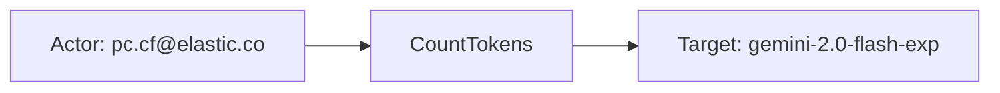
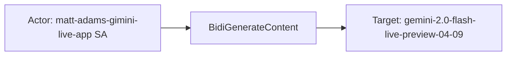
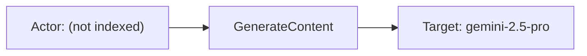

# gcp_vertexai

## Product Domain (Google Cloud Vertex AI)

Google Cloud Vertex AI is a unified machine learning platform for building, deploying, and operating ML models and generative AI applications at enterprise scale. It consolidates model training, feature management, model registry, batch and online prediction, and MLOps workflows into a single Google Cloud service (`aiplatform.googleapis.com`). Organizations use Vertex AI to host custom models, consume publisher models from Model Garden (including Gemini and other foundation models), and expose them through endpoints for real-time or batch inference.

The platform supports multiple deployment models. Provisioned Throughput provides dedicated capacity for high-volume, latency-sensitive workloads, while pay-as-you-go (shared) serving suits variable or batch workloads. Core resources include endpoints, deployed models, publisher models, and regional locations. Prediction traffic can be routed through methods such as RawPredict, StreamRawPredict, and ChatCompletions, with observability surfaced through Cloud Monitoring metrics and optional request-response logging to BigQuery.

From a security and governance perspective, Vertex AI emits Cloud Audit Logs for API operations such as prediction, token counting, and resource management. These logs capture authentication identity, IAM authorization decisions, request and response metadata, and affected resource names. For generative AI workloads, Vertex AI can export detailed prompt-response interaction logs—including prompts, model outputs, token usage, latency, and safety ratings—to BigQuery for analysis, cost tracking, and compliance review.

The Elastic GCP Vertex AI integration collects Cloud Monitoring metrics, Cloud Audit Logs via Pub/Sub, and prompt-response logs from BigQuery using Elastic Agent. This enables observability teams to monitor model invocation rates, token consumption, latency, and error rates, while security and platform teams can audit API access patterns and inspect generative AI interactions across GCP projects.

## Data Collected (brief)

- **Metrics** (`gcp_vertexai.metrics`): Cloud Monitoring time series for Vertex AI endpoints and Model Garden publisher models, including invocation counts, token and character counts, prediction and first-token latencies, error counts, throughput consumption, and online prediction resource utilization (CPU, memory, network, replicas).
- **Audit logs** (`gcp_vertexai.auditlogs`): Vertex AI Cloud Audit Logs delivered via Pub/Sub, including API method, authenticated principal, IAM authorization results, request/response payloads, resource names, service metadata, and source IP with user-agent enrichment.
- **Prompt-response logs** (`gcp_vertexai.prompt_response_logs`): Generative AI interaction records exported to BigQuery, including full request contents (prompts, generation config, safety settings), model responses (candidates, finish reasons, safety ratings), token usage metadata, request latency, model and endpoint identifiers, and request IDs.

## Expected Audit Log Entities

The GCP Vertex AI integration spans three data streams with different actor/target semantics. **`auditlogs`** delivers true Cloud Audit Logs (`type.googleapis.com/google.cloud.audit.AuditLog`) via Pub/Sub with authenticated principals, IAM authorization, and resource names; the pipeline maps identity to ECS `client.user.*`, network context to `source.*` / `user_agent.*`, and appends `related.user` / `related.ip`. **`prompt_response_logs`** are BigQuery-exported generative AI interaction records—audit-adjacent content logs rich in model and prompt/response context but without an authenticated caller principal in schema or samples; the pipeline statically sets `cloud.service.name: vertex-ai`. **`metrics`** are Cloud Monitoring time series with monitored-resource labels, not audit events. **`event.action` is populated on both log streams** — audit logs map GCP `methodName` (e.g. `PredictionService.CountTokens`, `LlmBidiService.BidiGenerateContent`); prompt-response logs copy `api_method` (e.g. `GenerateContent`). **`metrics`** has no per-event action (`event.action` absent; time-bucketed counters only). No ECS `user.target.*`, `host.target.*`, `service.target.*`, or `destination.user.*` / `destination.host.*` fields are populated today. Evidence is from `data_stream/*/fields/fields.yml`, `data_stream/*/sample_event.json`, `data_stream/auditlogs/_dev/test/pipeline/test-vertexai.log-expected.json`, and ingest pipelines. The target-fields audit classified this package as **`strong_candidate`** with pipeline actor mapping on audit logs (`dev/target-fields-audit/out/target_enhancement_packages.csv`: `pipeline_actor=true`, all `ecs_target_tierA_audit` / `pipeline_dest_*` false); no `destination_identity_hits.csv` row.

### Event action (semantic)

| Action (normalized label) | Classification | Confidence | Evidence | Per-stream notes |
| --- | --- | --- | --- | --- |
| `google.cloud.aiplatform.internal.PredictionService.CountTokens` | data_access | high | `auditlogs/sample_event.json`, `test-vertexai.log-expected.json` (2 fixtures) | **`auditlogs`** — token-count API call on a publisher model; IAM permission `aiplatform.endpoints.predict` |
| `google.cloud.aiplatform.v1beta1.LlmBidiService.BidiGenerateContent` | data_access | high | `test-vertexai.log-expected.json` (3 fixtures) | **`auditlogs`** — bidirectional generative content session (Gemini Live); includes aborted (`status.code: 10`) and successful completions |
| `GenerateContent` | data_access | high | `prompt_response_logs/sample_event.json`: `event.action: GenerateContent`, `api_method: GenerateContent` | **`prompt_response_logs`** — BigQuery-exported generative inference; shorter label than full GCP `methodName` on audit stream |
| *(no per-event action)* | — | high | `metrics/sample_event.json` — no `event.action`; pipeline renames counters only | **`metrics`** — Cloud Monitoring aggregates (`token_count`, `model_invocation_count`, etc.); dimensions describe the slice, not a single API verb |

Audit **`auditlogs`** actions are full GCP API method names (`protoPayload.methodName`). Prompt-response logs use the shorter **`api_method`** facet from BigQuery export. These can correlate semantically (e.g. `GenerateContent` audit equivalent may appear as a longer `methodName` on the audit stream) but fixture sets do not share a common request ID for join proof.

### Event action (ECS candidates)

| ECS / vendor field | Mapped to `event.action` today? | Mapping correct? | Recommended `event.action` value (from fixtures) | Enhancement candidate? | Evidence |
| --- | --- | --- | --- | --- | --- |
| `json.protoPayload.methodName` → `event.action` | yes | yes | `google.cloud.aiplatform.internal.PredictionService.CountTokens`, `google.cloud.aiplatform.v1beta1.LlmBidiService.BidiGenerateContent` | no | Audit pipeline L98–101: rename to `event.action`; all five `test-vertexai.log-expected.json` events |
| `gcp.vertexai.prompt_response_logs.api_method` → `event.action` | yes | yes | `GenerateContent` | no | Prompt-response pipeline L36–39: `copy_from` when `api_method` present; `sample_event.json` |
| `gcp.vertexai.audit.authorization_info[].permission` | no | n/a | `aiplatform.endpoints.predict` | partial | IAM permission evaluated alongside method; supplementary context, not a substitute for `methodName` |
| `gcp.vertexai.audit.authorization_info[].permission_type` | no | n/a | `DATA_READ` | no | Access class facet on audit fixtures; describes permission category, not the API operation |
| `log.logger` (audit log name suffix) | no | n/a | `cloudaudit.googleapis.com%2Fdata_access` | no | Distinguishes data-access vs admin-activity audit streams; log taxonomy, not per-call action |
| `event.type` / `event.category` | partial | partial | `[access, allowed]` / `[network, configuration]` (intended) | partial | Audit pipeline L154–165 appends when single `authorization_info` entry — but runs **before** `authorizationInfo` rename (L309–311), so fixtures omit these fields; ordering fix needed for outcome facets |
| `event.action` | yes (log streams) | yes | see rows above | no | Populated on **`auditlogs`** and **`prompt_response_logs`**; absent on **`metrics`** |

**Step 2b — per-stream check:**

| Stream | `event.action` in fixtures? | Pipeline maps to `event.action`? | Primary action candidate | Confidence | Evidence |
| --- | --- | --- | --- | --- | --- |
| `auditlogs` | yes | yes | `protoPayload.methodName` → `event.action` | high | `auditlogs/elasticsearch/ingest_pipeline/default.yml` L98–101; `sample_event.json`, `test-vertexai.log-expected.json` |
| `prompt_response_logs` | yes | yes | `gcp.vertexai.prompt_response_logs.api_method` → `event.action` | high | `prompt_response_logs/elasticsearch/ingest_pipeline/default.yml` L36–39; `sample_event.json` |
| `metrics` | no | no | — (no per-event action) | high | `metrics/elasticsearch/ingest_pipeline/default.yml` — counter renames only; `metrics/sample_event.json` |

### Actor (semantic)

| Entity | Classification | Entity type (if general) | Confidence | Evidence | Per-stream notes |
| --- | --- | --- | --- | --- | --- |
| Authenticated human user | user | — | high | `client.user.email` ← `gcp.vertexai.audit.authentication_info.principal_email` in audit pipeline (L291–295); fixtures `pc.cf@elastic.co`, `aff.brgd@elastic.co` in `test-vertexai.log-expected.json` | **`auditlogs`** — Google account email of API caller |
| Service account principal | user | service_account | high | `client.user.email` + `client.user.id` ← `principal_email` / `principal_subject` (L291–301); e.g. `serviceAccount:matt-adams-gimini-live-app@elastic-abs.iam.gserviceaccount.com` in BidiGenerateContent fixtures | **`auditlogs`** — workload identity for programmatic API calls |
| Service account key | general | gcp_service_account_key | moderate | `gcp.vertexai.audit.authentication_info.service_account_key_name` (IAM key resource URI); populated in BidiGenerateContent fixtures | **`auditlogs`** — OAuth credential used; supplementary to SA actor |
| Delegated / third-party identity | user | — | low | `gcp.vertexai.audit.authentication_info.service_account_delegation_info`, `third_party_principal`, `authority_selector` in `auditlogs/fields/fields.yml` | **`auditlogs`** — schema-supported; not populated in current fixtures |
| API caller (network endpoint) | host | — | high | `source.ip`, `source.geo.*`, `source.as.*` ← `requestMetadata.callerIp` (L222–263); IPv4 and IPv6 callers in fixtures | **`auditlogs`** — client IP of the HTTP/gRPC request; network origin, not a security principal |
| Client software | general | user_agent | moderate | `user_agent.original` ← `callerSuppliedUserAgent`; parsed device/OS/name (Chrome, Python/websockets) | **`auditlogs`** — application context, not an actor |
| GCP project (scope) | general | gcp_project | moderate | `cloud.project.id` ← `json.resource.labels.project_id` (audit pipeline L51–53); also on prompt-response samples | **`auditlogs`**, **`prompt_response_logs`** — tenancy scope, not an interactive actor |
| Integration collector | service | — | low | Elastic Agent GCP credentials in stream config; not indexed on events | Implicit poller for all streams |

**No actor identity in schema or samples:** **`prompt_response_logs`** — no `client.user.*`, `user.*`, or authentication fields; `full_request.contents[].role: user` is conversational turn role, not a GCP principal. **`metrics`** — time-series aggregates only; no caller or user dimensions. **`prompt_response_logs`** `host.*` in `sample_event.json` is Elastic Agent collection metadata, not an event actor.

### Actor (ECS candidates)

| ECS / vendor field | Role | Mapped today? | Mapping correct? | Confidence | Evidence |
| --- | --- | --- | --- | --- | --- |
| `client.user.email` | Authenticated principal email | yes | yes | high | Audit pipeline L291–295: `authentication_info.principal_email` → `client.user.email`; fixtures show human and SA emails |
| `client.user.id` | Principal subject (SA / third-party) | yes | yes | high | Audit pipeline L298–301: `principal_subject` → `client.user.id`; SA fixtures include `serviceAccount:…` form |
| `gcp.vertexai.audit.authentication_info.principal_email` | Vendor actor email (retained) | yes (vendor) | yes | high | Renamed from protoPayload L72–74; coexists with ECS copy on `client.user.email` |
| `gcp.vertexai.audit.authentication_info.principal_subject` | Vendor principal subject (retained) | yes (vendor) | yes | high | Renamed L76–78; coexists with ECS copy on `client.user.id` |
| `gcp.vertexai.audit.authentication_info.service_account_key_name` | OAuth key credential | yes (vendor) | yes | moderate | Renamed L80–82; supplementary credential facet, not promoted to ECS |
| `related.user` | Actor cross-reference | partial | partial | moderate | Pipeline L270–274 appends `client.user.email`; not present in current `test-vertexai.log-expected.json` fixtures despite populated `client.user.email` |
| `related.ip` | Caller IP cross-reference | yes | yes | high | Pipeline L266–269 appends `source.ip`; populated in all audit fixtures |
| `source.ip` / `source.geo.*` / `source.as.*` | Caller network endpoint | yes | yes | high | Pipeline L222–263 from `callerIp`; geo/ASN enrichment |
| `user_agent.original` (+ parsed) | Client application | yes | yes | moderate | Pipeline L233–238 from `callerSuppliedUserAgent` |
| `user.id` / `user.*` | Actor identity | no | n/a | — | Not set; audit uses `client.user.*` per ECS Client field set for API callers |
| `destination.user.*` / `destination.host.*` | De-facto target identity | no | n/a | — | Not used (`destination_identity_hits.csv` has no `gcp_vertexai` row) |

### Target (semantic)

| Layer | Description | Entity | Classification | Entity type (if general) | Confidence | Evidence | Per-stream notes |
| --- | --- | --- | --- | --- | --- | --- | --- |
| 1 — Platform / cloud service | Invoked Google Cloud ML API | Vertex AI (`aiplatform.googleapis.com`) | service | — | high | `gcp.vertexai.audit.service_name: aiplatform.googleapis.com` in audit samples; `cloud.service.name: vertex-ai` statically set in prompt-response pipeline (L22–24) | **`auditlogs`** — vendor `service_name` only; **`prompt_response_logs`** — ECS-mapped Layer 1 |
| 2 — Resource / object | Publisher model or endpoint acted upon | Vertex AI model / endpoint resource | service | — | high | `gcp.vertexai.audit.resource_name`, `authorization_info[].resource` (e.g. `projects/.../publishers/google/models/gemini-2.0-flash-exp`); `gcp.vertexai.prompt_response_logs.model`, `full_request.model` | **`auditlogs`** — IAM-evaluated resource; **`prompt_response_logs`** — consumed model path |
| 2 — Resource / object | Deployed model / custom endpoint | Deployed model or endpoint ID | service | — | moderate | `gcp.vertexai.prompt_response_logs.deployed_model_id`, `endpoint`, `full_request.endpoint` in field schema; `gcp.labels.resource.endpoint_id`, `gcp.labels.metrics.deployed_model_id` on metrics | **`prompt_response_logs`** — absent in `sample_event.json`; **`metrics`** — label dimensions for endpoint slices |
| 2 — Resource / object | IAM authorization evaluation | Resource + permission pair | service | — | high | `gcp.vertexai.audit.authorization_info[].resource`, `.permission` (e.g. `aiplatform.endpoints.predict`), `.granted` driving `event.type` | **`auditlogs`** — allow/deny outcome on the accessed resource |
| 3 — Content / artifact | Generative AI interaction instance | Request / response pair | general | ai_request | high | `gcp.vertexai.prompt_response_logs.request_id`, `full_response.response_id` | **`prompt_response_logs`** — correlatable with **`auditlogs`** via timing/project, not a shared ID in fixtures |
| 3 — Content / artifact | Prompt and completion content | Prompt / model output text | general | ai_content | high | `full_request.contents[].parts[].text`, `full_response.candidates[].content.parts[].text`; token usage under `full_response.usage_metadata` | **`prompt_response_logs`** — compliance and safety review artifacts |
| 3 — Content / artifact | Model version facet | Model version string | general | model_version | high | `gcp.vertexai.prompt_response_logs.model_version`; `full_response.model_version` (e.g. `gemini-2.5-pro`) | **`prompt_response_logs`** — version dimension of Layer 2 model |
| 3 — Content / artifact | Time-bucket metric aggregate | Cloud Monitoring slice | general | usage_bucket | high | `@timestamp`, `metricset.period`, `gcp.vertexai.publisher.*` / `gcp.vertexai.prediction.online.*` counters; label dimensions `gcp.labels.resource.*`, `gcp.labels.metrics.*` | **`metrics`** — pre-aggregated counters/histograms, not per-invocation audit targets |

**No meaningful audit target:** **`metrics`** individual prediction requests, prompts, or caller principals — metrics expose counts and latency keyed by label dimensions only. Per classification rule 10, model ID and endpoint labels are **aggregation targets**, not per-request audit targets.

### Target (ECS candidates)

| ECS / vendor field | Layer | Classification | Mapped today? | Mapping correct? | ECS target bucket | Enhancement candidate? | Evidence |
| --- | --- | --- | --- | --- | --- | --- | --- |
| `cloud.service.name` | 1 | service | partial | yes | `service.target.name` | yes (auditlogs) | Static `vertex-ai` in prompt-response pipeline L22–24; **`auditlogs`** has vendor `gcp.vertexai.audit.service_name` only (`aiplatform.googleapis.com`) |
| `service.name` / `service.type` | 1 | service | partial | yes | `service.target.name` | partial | Prompt-response pipeline L27–33 sets `service.name: vertex-ai`, `service.type: ai-platform`; not set on auditlogs or metrics |
| `gcp.vertexai.audit.service_name` | 1 | service | yes (vendor) | yes | `cloud.service.name` / `service.target.name` | yes | Audit samples and fixtures; canonical invoked API name, not promoted to ECS |
| `gcp.vertexai.audit.resource_name` | 2 | service | yes (vendor) | yes | `service.target.entity.id` / `gen_ai.request.model.id` | yes | Primary audit target URI (model, endpoint, dataset); e.g. `projects/.../models/gemini-2.0-flash-exp` in `sample_event.json` |
| `gcp.vertexai.audit.authorization_info[].resource` | 2 | service | yes (vendor) | yes | `service.target.entity.id` | yes | IAM-evaluated resource; mirrors `resource_name` in fixtures |
| `gcp.vertexai.audit.request.endpoint` / `.setup.model` | 2 | service | yes (vendor) | yes | `gen_ai.request.model.id` | yes | Request payload model path in CountTokens and BidiGenerateContent fixtures |
| `gcp.vertexai.prompt_response_logs.model` | 2 | service | yes (vendor) | yes | `gen_ai.request.model.id` | yes | e.g. `publishers/google/models/gemini-2.5-pro` in `sample_event.json`; not copied to ECS |
| `gcp.vertexai.prompt_response_logs.full_request.model` | 2 | service | yes (vendor) | yes | `gen_ai.request.model.id` | yes | Full resource path in prompt-response sample |
| `gcp.vertexai.prompt_response_logs.model_version` | 3 | general (model_version) | yes (vendor) | yes | `gen_ai.request.model.version` | partial | Version facet; natural ECS home is `gen_ai.request.model.version` |
| `gcp.vertexai.prompt_response_logs.request_id` | 3 | general (ai_request) | yes (vendor) | yes | context-only | partial | Interaction instance ID; correlate with auditlogs for caller attribution |
| `gcp.vertexai.prompt_response_logs.full_request.contents` / `full_response.candidates` | 3 | general (ai_content) | yes (vendor) | yes | `gen_ai.prompt` / `gen_ai.completion` | yes | Full prompt/response bodies retained vendor-only; no `gen_ai.*` promotion |
| `cloud.project.id` / `cloud.account.id` | — | general (gcp_project) | partial | yes | context-only | no | Tenancy scope on audit and prompt-response streams; metrics use `cloud.account.id` |
| `gcp.labels.resource.model_user_id` / `.endpoint_id` | 2 | service | yes (vendor) | yes | context-only | no | Metrics label dimensions (e.g. `gemini-1.5-flash-002`); aggregation targets, not per-request |
| `gcp.vertexai.prediction.online.target_replicas` | — | general (capacity_metric) | yes (vendor) | n/a | context-only | no | Capacity metric label per `vendor_target_special_cases.csv`; not an audit target entity |
| `gen_ai.request.model.id` / `gen_ai.*` | 2–3 | service / general | no | n/a | `gen_ai.request.model.id` | yes | Not set in any pipeline despite rich model and content fields on prompt-response logs |
| `user.target.*` / `host.target.*` / `service.target.*` / `entity.target.*` | — | — | no | n/a | — | no | Not populated (`target_fields_audit.csv` has no `gcp_vertexai` row) |
| `destination.user.*` / `destination.host.*` | — | — | no | n/a | — | no | Not used |

### Gaps and mapping notes

- **`event.action` well mapped on log streams:** Audit `methodName` → `event.action` (L98–101) and prompt-response `api_method` → `event.action` (L36–39) are correct primary mappings with fixture proof. **`metrics`** appropriately has no action. Optional enhancement: copy `authorization_info[].permission` as a secondary facet or normalize long GCP method names (e.g. strip service prefix) for dashboard grouping — not a gap today.
- **`event.type` / `event.category` pipeline ordering:** Intended allow/deny outcome facets (L154–165) reference `gcp.vertexai.audit.authorization_info` before the field is renamed from `json.protoPayload.authorizationInfo` (L309–311), so fixtures omit `event.type` / `event.category` despite populated authorization data — fix processor order or source field path.
- **Strong actor mapping on auditlogs only:** `pipeline_actor=true` in `target_enhancement_packages.csv`; `client.user.email` / `client.user.id` correctly trace to GCP `authenticationInfo` fields. No actor ECS promotion on **`prompt_response_logs`** — correlate `request_id` + project with **`auditlogs`** for caller identity.
- **Layer 1 gap on auditlogs:** `gcp.vertexai.audit.service_name` holds `aiplatform.googleapis.com` but is not copied to `cloud.service.name` (unlike prompt-response pipeline which statically sets `vertex-ai`). Static pipeline set would close Layer 1 ECS coverage for audit events.
- **No `gen_ai.*` normalization:** Prompt-response logs retain full model paths, prompts, completions, token usage, and safety ratings under `gcp.vertexai.prompt_response_logs.*` only. Natural enhancement: promote model ID → `gen_ai.request.model.id`, content → `gen_ai.prompt` / `gen_ai.completion`, usage → `gen_ai.usage.*`.
- **Resource URI not in official target fields:** `resource_name` and `authorization_info[].resource` semantically represent Layer 2 service targets but remain vendor-only. Enhancement candidate for `service.target.entity.id` or `gen_ai.request.model.id`.
- **`related.user` fixture drift:** Pipeline appends `related.user` from `client.user.email` (L270–274) but current `test-vertexai.log-expected.json` omits `related.user` despite populated `client.user.email` — verify fixture freshness.
- **No de-facto `destination.*` targets:** Unlike email/auth integrations, no pipeline maps affected entities to `destination.user.*` or `destination.host.*` (`destination_identity_hits.csv` has no row).
- **Metrics `target_replicas` is not an audit target:** Renamed from `gcp.metrics.prediction.online.target_replicas.value` (`vendor_target_special_cases.csv`); capacity planning metric, not ECS target semantics.
- **Conversational `role: user` vs security principal:** `full_request.contents[].role: user` in prompt-response logs is LLM message role; do not map to ECS `user.*` actor fields.

### Per-stream notes

#### auditlogs

Cloud Audit Logs via Pub/Sub (`gcp-pubsub` input). Pipeline promotes `principal_email` → `client.user.email`, `principal_subject` → `client.user.id`, caller IP → `source.ip`, and sets **`event.action`** from `methodName` (e.g. `PredictionService.CountTokens`, `LlmBidiService.BidiGenerateContent`). Actor is best interpreted as **user** (human or service account) plus optional **service_account_key** credential; target is Layer 1 **Vertex AI API** (`service_name`) and Layer 2 **resource** named in `resource_name` / `authorization_info[].resource` (publisher models, endpoints). Data-access log type (`cloudaudit.googleapis.com%2Fdata_access`) dominates fixtures; admin activity logs follow the same field model.

#### prompt_response_logs

BigQuery table export via `gcp/metrics` input with `table_id`. Pipeline renames `gcp.vertexai_logs` → `gcp.vertexai.prompt_response_logs`, sets `cloud.service.name: vertex-ai`, `service.name: vertex-ai`, **`event.action`** from `api_method` (`GenerateContent`), and normalizes nested JSON to snake_case. No ECS actor promotion—security use cases rely on correlating `request_id` with **`auditlogs`**. Target is Layer 1 **Vertex AI** (ECS-mapped), Layer 2 **publisher model**, and Layer 3 **interaction content** (prompts, completions, token usage).

#### metrics

Cloud Monitoring time series for publisher online serving and endpoint online prediction. Pipeline renames `gcp.metrics.*` → `gcp.vertexai.*` counters/histograms. No actor and **no `event.action`** — label dimensions (`gcp.labels.resource.*`, `gcp.labels.metrics.*`) describe which model, endpoint, method, and traffic type the metric slice represents. Per-request audit targets and per-event actions do not apply.

## Example Event Graph

Examples below come from **`auditlogs`** (true Cloud Audit Logs via Pub/Sub) and **`prompt_response_logs`** (BigQuery-exported generative AI interaction records — audit-adjacent content logs without an indexed caller principal). The **`metrics`** stream is time-bucketed Cloud Monitoring counters only; it has no per-event Actor → action → Target chain.

### Example 1: Human user counts tokens on a publisher model

**Stream:** `gcp_vertexai.auditlogs` · **Fixture:** `packages/gcp_vertexai/data_stream/auditlogs/_dev/test/pipeline/test-vertexai.log-expected.json` (event 1)

```
User (pc.cf@elastic.co) → google.cloud.aiplatform.internal.PredictionService.CountTokens → Publisher model (gemini-2.0-flash-exp)
```

#### Actor

| Field | Value |
| --- | --- |
| id | pc.cf@elastic.co |
| name | pc.cf@elastic.co |
| type | user |
| geo | Milton, United States |
| ip | 216.160.83.56 |

**Field sources:**
- `id` ← `client.user.email`
- `name` ← `client.user.email`
- `geo` ← `source.geo.city_name`, `source.geo.country_name`
- `ip` ← `source.ip`

#### Event action

| Field | Value |
| --- | --- |
| action | google.cloud.aiplatform.internal.PredictionService.CountTokens |
| source_field | `event.action` |
| source_value | google.cloud.aiplatform.internal.PredictionService.CountTokens |

#### Target

| Field | Value |
| --- | --- |
| id | projects/elastic-abs/locations/us-central1/publishers/google/models/gemini-2.0-flash-exp |
| name | gemini-2.0-flash-exp |
| type | service |
| sub_type | foundation_model |

**Field sources:**
- `id` ← `gcp.vertexai.audit.resource_name`, `gcp.vertexai.audit.authorization_info[].resource`
- `name` ← derived from resource URI tail segment in fixture

#### Mermaid (optional)



### Example 2: Service account opens a Gemini Live session

**Stream:** `gcp_vertexai.auditlogs` · **Fixture:** `packages/gcp_vertexai/data_stream/auditlogs/_dev/test/pipeline/test-vertexai.log-expected.json` (event 3)

```
Service account (matt-adams-gimini-live-app@elastic-abs.iam.gserviceaccount.com) → google.cloud.aiplatform.v1beta1.LlmBidiService.BidiGenerateContent → Publisher model (gemini-2.0-flash-live-preview-04-09)
```

#### Actor

| Field | Value |
| --- | --- |
| id | serviceAccount:matt-adams-gimini-live-app@elastic-abs.iam.gserviceaccount.com |
| name | matt-adams-gimini-live-app@elastic-abs.iam.gserviceaccount.com |
| type | user |
| sub_type | service_account |
| geo | Changchun, China |
| ip | 175.16.199.14 |

**Field sources:**
- `id` ← `client.user.id`
- `name` ← `client.user.email`
- `geo` ← `source.geo.city_name`, `source.geo.country_name`
- `ip` ← `source.ip`

#### Event action

| Field | Value |
| --- | --- |
| action | google.cloud.aiplatform.v1beta1.LlmBidiService.BidiGenerateContent |
| source_field | `event.action` |
| source_value | google.cloud.aiplatform.v1beta1.LlmBidiService.BidiGenerateContent |

#### Target

| Field | Value |
| --- | --- |
| id | projects/elastic-abs/locations/us-central1/publishers/google/models/gemini-2.0-flash-live-preview-04-09 |
| name | gemini-2.0-flash-live-preview-04-09 |
| type | service |
| sub_type | foundation_model |

**Field sources:**
- `id` ← `gcp.vertexai.audit.resource_name`, `gcp.vertexai.audit.authorization_info[].resource`
- `name` ← derived from resource URI tail segment in fixture

#### Mermaid (optional)



### Example 3: Generative content inference (prompt-response log)

**Stream:** `gcp_vertexai.prompt_response_logs` · **Fixture:** `packages/gcp_vertexai/data_stream/prompt_response_logs/sample_event.json`

```
(no indexed GCP principal) → GenerateContent → Publisher model (gemini-2.5-pro) + interaction (request_id 5374205265901353984)
```

No authenticated caller is indexed on this stream; correlate `gcp.vertexai.prompt_response_logs.request_id` with **`auditlogs`** for actor attribution.

#### Actor

**Field sources:** no `client.user.*` or `user.*` fields populated in fixture; `full_request.contents[].role: user` is conversational turn role, not a GCP security principal.

#### Event action

| Field | Value |
| --- | --- |
| action | GenerateContent |
| source_field | `event.action` |
| source_value | GenerateContent |

#### Target

| Field | Value |
| --- | --- |
| id | projects/elastic-sa/locations/us-central1/publishers/google/models/gemini-2.5-pro |
| name | gemini-2.5-pro |
| type | service |
| sub_type | foundation_model |

**Field sources:**
- `id` ← `gcp.vertexai.prompt_response_logs.full_request.model`
- `name` ← `gcp.vertexai.prompt_response_logs.model` (short form: `publishers/google/models/gemini-2.5-pro`); interaction instance `gcp.vertexai.prompt_response_logs.request_id: 5374205265901353984`

#### Mermaid (optional)



## ES|QL Entity Extraction

**Package type: agent-backed** (policy templates `GCP Vertex AI Metrics` / `GCP Vertex AI  Logs`, three `data_stream/` dirs with Tier A `sample_event.json` and `auditlogs` `*-expected.json`). Router: **`data_stream.dataset`** (`gcp_vertexai.auditlogs`, `gcp_vertexai.prompt_response_logs`, `gcp_vertexai.metrics` per fixtures). Pass 4 is **fill-gaps-only**: detection flags run first; mapped columns use **column-level** **5-arg** / **7-arg** / **9-arg** `CASE(<col> IS NOT NULL, <col>, <boolean guard>, <fallback>, null)` — never **4-arg** `CASE(<col> IS NOT NULL, <col>, bare_vendor_field, null)` (bare field parses as a **condition**) or `CASE(actor_exists, <col>, …)` / `CASE(target_exists, <col>, …)` — so ingest `service.name` on prompt-response logs does not block `user.id` ← `client.user.id` or `host.ip` ← `source.ip` on empty columns (Pass 4 §10). Ingest maps audit principals to **`client.user.*`** (ECS Client field set), not `user.*` — fallbacks promote `client.user.*` → `user.*` when the output column is null. **`event.action`** is populated on both log streams at ingest (`methodName`, `api_method`); **ingest-only — no ES|QL** action block. **`gcp_vertexai.metrics`** excluded (Cloud Monitoring aggregates). **Pass 4 (tautology cleanup):** no `CASE(col, col, …)`; vendor fallbacks (`client.user.*`, `source.ip`, `gcp.vertexai.audit.*`, `gcp.vertexai.prompt_response_logs.*`) differ from output columns; removed duplicate optional-classification `EVAL`.

### Dataset inventory

| data_stream.dataset | Stream role | Actor classification(s) | Target classification(s) | Extraction |
| --- | --- | --- | --- | --- |
| `gcp_vertexai.auditlogs` | Cloud Audit Logs | user, host | service | full |
| `gcp_vertexai.prompt_response_logs` | GenAI interaction logs | — | service, general (ai_request) | partial |
| `gcp_vertexai.metrics` | Cloud Monitoring | — | — | none |

### Field mapping plan

#### Actor mappings

| Output column | Source field(s) | Condition (dataset + optional) | Confidence | Notes |
| --- | --- | --- | --- | --- |
| `user.id` | `client.user.id` | `data_stream.dataset == "gcp_vertexai.auditlogs" AND client.user.id IS NOT NULL` | high | **column-level preserve** (`user.id IS NOT NULL`); **vendor fallback** — SA `principal_subject` form in BidiGenerateContent fixtures |
| `user.name` | `client.user.email` | `data_stream.dataset == "gcp_vertexai.auditlogs" AND client.user.email IS NOT NULL` | high | **column-level preserve** (`user.name IS NOT NULL`); **vendor fallback** — human or SA email (`test-vertexai.log-expected.json`) |
| `user.email` | `client.user.email` | same | high | **column-level preserve**; **vendor fallback** |
| `host.ip` | `source.ip` | `data_stream.dataset == "gcp_vertexai.auditlogs" AND source.ip IS NOT NULL` | high | **column-level preserve** (`host.ip IS NOT NULL`); **vendor fallback** — API caller network origin (Pass 3 Examples 1–2) |

#### Target mappings

| Output column | Source field(s) | Condition (dataset + optional) | Confidence | Notes |
| --- | --- | --- | --- | --- |
| `service.target.name` | literal `"Vertex AI"` | `data_stream.dataset == "gcp_vertexai.auditlogs"` | high | **column-level preserve** (`service.target.name IS NOT NULL`); **semantic literal** — Layer 1 platform (Pass 3); not `gcp.vertexai.audit.service_name` |
| `service.target.name` | `cloud.service.name` | `data_stream.dataset == "gcp_vertexai.prompt_response_logs" AND cloud.service.name IS NOT NULL` | high | **column-level preserve**; **vendor fallback** — `cloud.service.name` → `service.target.name` (`vertex-ai` in `sample_event.json`; distinct from ingest `service.name`) |
| `service.target.id` | `gcp.vertexai.audit.resource_name` | `data_stream.dataset == "gcp_vertexai.auditlogs" AND gcp.vertexai.audit.resource_name IS NOT NULL` | high | **column-level preserve** (`service.target.id IS NOT NULL`); **vendor fallback** — publisher model / endpoint URI (Pass 3 Examples 1–2) |
| `service.target.id` | `gcp.vertexai.prompt_response_logs.full_request.model` | `data_stream.dataset == "gcp_vertexai.prompt_response_logs" AND gcp.vertexai.prompt_response_logs.full_request.model IS NOT NULL` | high | **column-level preserve**; **vendor fallback** — full model path (`sample_event.json`) |
| `entity.target.name` | `gcp.vertexai.prompt_response_logs.model` | `data_stream.dataset == "gcp_vertexai.prompt_response_logs" AND gcp.vertexai.prompt_response_logs.model IS NOT NULL` | high | **column-level preserve** (`entity.target.name IS NOT NULL`); **vendor fallback** — short model name |
| `entity.target.id` | `gcp.vertexai.prompt_response_logs.request_id` | `data_stream.dataset == "gcp_vertexai.prompt_response_logs" AND gcp.vertexai.prompt_response_logs.request_id IS NOT NULL` | medium | **column-level preserve** (`entity.target.id IS NOT NULL`); **vendor fallback** — correlate with `auditlogs` for caller (Pass 3 Example 3) |
| `entity.target.sub_type` | literal `"foundation_model"` | both log datasets when model resource fields present | high | **column-level preserve** (`entity.target.sub_type IS NOT NULL`); **semantic literal** — Pass 3 target `sub_type` |

#### Event action mappings

| Output column | Source field(s) | Condition (dataset + optional) | Confidence | Notes |
| --- | --- | --- | --- | --- |
| `event.action` | *(ingest)* | `data_stream.dataset IN ("gcp_vertexai.auditlogs", "gcp_vertexai.prompt_response_logs")` | high | **preserve existing** — `methodName` / `api_method` already copied at ingest; no ES\|QL fallback |

### Detection flags (mandatory — run first)

```esql
| EVAL
  actor_exists = user.id IS NOT NULL OR user.name IS NOT NULL OR user.email IS NOT NULL
    OR host.id IS NOT NULL OR host.ip IS NOT NULL OR host.name IS NOT NULL
    OR service.id IS NOT NULL OR service.name IS NOT NULL
    OR entity.id IS NOT NULL OR entity.name IS NOT NULL,
  target_exists = user.target.id IS NOT NULL OR user.target.name IS NOT NULL OR user.target.email IS NOT NULL
    OR host.target.id IS NOT NULL OR host.target.ip IS NOT NULL OR host.target.name IS NOT NULL
    OR service.target.id IS NOT NULL OR service.target.name IS NOT NULL
    OR entity.target.id IS NOT NULL OR entity.target.name IS NOT NULL,
  action_exists = event.action IS NOT NULL
```

**Predicate note:** `actor_exists` intentionally excludes `client.user.*` so audit events with only ECS Client principal fields still receive `user.*` promotion. `target_exists` is typically false today (no ingest `*.target.*`). `action_exists` is true on both log streams after ingest. **Actor/target `EVAL` blocks use column-level `IS NOT NULL` preserve** — not `CASE(actor_exists, <col>, …)` / `CASE(target_exists, <col>, …)` — so ingest `service.name` on prompt-response logs does not block `client.user.*` → `user.*` or `source.ip` → `host.ip` when those output columns are empty (Pass 4 §10).

**ES|QL `CASE` arity:** Arguments are **(condition, value)** pairs; odd count → last arg is default. Wrong: `CASE(user.id IS NOT NULL, user.id, client.user.id, null)` (4 args — `client.user.id` is a **condition**). Wrong: `CASE(actor_exists, user.id, client.user.id, null)` (same). Right: **5-arg** `CASE(user.id IS NOT NULL, user.id, data_stream.dataset == "gcp_vertexai.auditlogs" AND client.user.id IS NOT NULL, client.user.id, null)`. **7-arg** when two dataset fallbacks apply (e.g. `service.target.name` audit literal vs `cloud.service.name`). **9-arg** for `service.target.id` and `entity.target.sub_type`. Detection flags are helpers only — not first `CASE` branches on mapped columns.

### Combined ES|QL — actor fields

```esql
| EVAL
  user.id = CASE(
    user.id IS NOT NULL, user.id,
    data_stream.dataset == "gcp_vertexai.auditlogs" AND client.user.id IS NOT NULL, client.user.id,
    null
  ),
  user.name = CASE(
    user.name IS NOT NULL, user.name,
    data_stream.dataset == "gcp_vertexai.auditlogs" AND client.user.email IS NOT NULL, client.user.email,
    null
  ),
  user.email = CASE(
    user.email IS NOT NULL, user.email,
    data_stream.dataset == "gcp_vertexai.auditlogs" AND client.user.email IS NOT NULL, client.user.email,
    null
  ),
  host.ip = CASE(
    host.ip IS NOT NULL, host.ip,
    data_stream.dataset == "gcp_vertexai.auditlogs" AND source.ip IS NOT NULL, source.ip,
    null
  )
```

### Combined ES|QL — target fields

```esql
| EVAL
  service.target.name = CASE(
    service.target.name IS NOT NULL, service.target.name,
    data_stream.dataset == "gcp_vertexai.auditlogs", "Vertex AI",
    data_stream.dataset == "gcp_vertexai.prompt_response_logs" AND cloud.service.name IS NOT NULL, cloud.service.name,
    null
  ),
  service.target.id = CASE(
    service.target.id IS NOT NULL, service.target.id,
    data_stream.dataset == "gcp_vertexai.auditlogs" AND gcp.vertexai.audit.resource_name IS NOT NULL, gcp.vertexai.audit.resource_name,
    data_stream.dataset == "gcp_vertexai.prompt_response_logs" AND gcp.vertexai.prompt_response_logs.full_request.model IS NOT NULL, gcp.vertexai.prompt_response_logs.full_request.model,
    null
  ),
  entity.target.name = CASE(
    entity.target.name IS NOT NULL, entity.target.name,
    data_stream.dataset == "gcp_vertexai.prompt_response_logs" AND gcp.vertexai.prompt_response_logs.model IS NOT NULL, gcp.vertexai.prompt_response_logs.model,
    null
  ),
  entity.target.id = CASE(
    entity.target.id IS NOT NULL, entity.target.id,
    data_stream.dataset == "gcp_vertexai.prompt_response_logs" AND gcp.vertexai.prompt_response_logs.request_id IS NOT NULL, gcp.vertexai.prompt_response_logs.request_id,
    null
  ),
  entity.target.sub_type = CASE(
    entity.target.sub_type IS NOT NULL, entity.target.sub_type,
    data_stream.dataset == "gcp_vertexai.auditlogs" AND gcp.vertexai.audit.resource_name IS NOT NULL, "foundation_model",
    data_stream.dataset == "gcp_vertexai.prompt_response_logs" AND gcp.vertexai.prompt_response_logs.model IS NOT NULL, "foundation_model",
    null
  )
```

### Full pipeline fragment (optional)

```esql
FROM logs-*
| EVAL
  actor_exists = user.id IS NOT NULL OR user.name IS NOT NULL OR user.email IS NOT NULL
    OR host.id IS NOT NULL OR host.ip IS NOT NULL OR host.name IS NOT NULL
    OR service.id IS NOT NULL OR service.name IS NOT NULL
    OR entity.id IS NOT NULL OR entity.name IS NOT NULL,
  target_exists = user.target.id IS NOT NULL OR user.target.name IS NOT NULL OR user.target.email IS NOT NULL
    OR host.target.id IS NOT NULL OR host.target.ip IS NOT NULL OR host.target.name IS NOT NULL
    OR service.target.id IS NOT NULL OR service.target.name IS NOT NULL
    OR entity.target.id IS NOT NULL OR entity.target.name IS NOT NULL,
  action_exists = event.action IS NOT NULL
| EVAL
  user.id = CASE(user.id IS NOT NULL, user.id, data_stream.dataset == "gcp_vertexai.auditlogs" AND client.user.id IS NOT NULL, client.user.id, null),
  user.name = CASE(user.name IS NOT NULL, user.name, data_stream.dataset == "gcp_vertexai.auditlogs" AND client.user.email IS NOT NULL, client.user.email, null),
  user.email = CASE(user.email IS NOT NULL, user.email, data_stream.dataset == "gcp_vertexai.auditlogs" AND client.user.email IS NOT NULL, client.user.email, null),
  host.ip = CASE(host.ip IS NOT NULL, host.ip, data_stream.dataset == "gcp_vertexai.auditlogs" AND source.ip IS NOT NULL, source.ip, null),
  service.target.name = CASE(service.target.name IS NOT NULL, service.target.name, data_stream.dataset == "gcp_vertexai.auditlogs", "Vertex AI", data_stream.dataset == "gcp_vertexai.prompt_response_logs" AND cloud.service.name IS NOT NULL, cloud.service.name, null),
  service.target.id = CASE(service.target.id IS NOT NULL, service.target.id, data_stream.dataset == "gcp_vertexai.auditlogs" AND gcp.vertexai.audit.resource_name IS NOT NULL, gcp.vertexai.audit.resource_name, data_stream.dataset == "gcp_vertexai.prompt_response_logs" AND gcp.vertexai.prompt_response_logs.full_request.model IS NOT NULL, gcp.vertexai.prompt_response_logs.full_request.model, null),
  entity.target.name = CASE(entity.target.name IS NOT NULL, entity.target.name, data_stream.dataset == "gcp_vertexai.prompt_response_logs" AND gcp.vertexai.prompt_response_logs.model IS NOT NULL, gcp.vertexai.prompt_response_logs.model, null),
  entity.target.id = CASE(entity.target.id IS NOT NULL, entity.target.id, data_stream.dataset == "gcp_vertexai.prompt_response_logs" AND gcp.vertexai.prompt_response_logs.request_id IS NOT NULL, gcp.vertexai.prompt_response_logs.request_id, null),
  entity.target.sub_type = CASE(entity.target.sub_type IS NOT NULL, entity.target.sub_type, data_stream.dataset == "gcp_vertexai.auditlogs" AND gcp.vertexai.audit.resource_name IS NOT NULL, "foundation_model", data_stream.dataset == "gcp_vertexai.prompt_response_logs" AND gcp.vertexai.prompt_response_logs.model IS NOT NULL, "foundation_model", null)
| KEEP @timestamp, data_stream.dataset, event.action, user.id, user.name, user.email, host.ip, service.target.name, service.target.id, entity.target.name, entity.target.id, entity.target.sub_type
```

### Streams excluded

- **`gcp_vertexai.metrics`** — Cloud Monitoring time series; label dimensions (`gcp.labels.resource.*`, `gcp.labels.metrics.*`) are aggregation slices, not per-request audit targets; no `event.action` or caller principal.

### Gaps and limitations

- **Pass 4 tautology cleanup (§10)** — column-level `IS NOT NULL` preserve on all mapped columns; no `CASE(col, col, …)`; `event.action` **ingest-only — no ES|QL**; removed duplicate optional-classification `EVAL` (`entity.target.sub_type` lives in target block only); `cloud.service.name` → `service.target.name` is a cross-field promotion, not identity no-op.
- **Pass 4 CASE syntax** — combined actor/target blocks and the full pipeline fragment use odd-arity `CASE` (condition/value pairs + trailing `null`); column-level **5-arg** / **7-arg** / **9-arg** preserve (`<col> IS NOT NULL` first branch). Never **4-arg** `CASE(<col> IS NOT NULL, <col>, bare_vendor_field, null)` or `CASE(actor_exists|target_exists|action_exists, <col>, …)` where a bare field parses as a boolean condition. Full pipeline fragment aligned with combined `EVAL` blocks.
- **Unscoped `FROM logs-*`** — dataset routing lives in `CASE` fallback conditions (`data_stream.dataset == …` / `IN (…)`), not a top-level `WHERE`.
- **prompt_response_logs actor gap** — no `client.user.*` / `user.*` in schema or samples; correlate `entity.target.id` (`request_id`) + `cloud.project.id` with **`gcp_vertexai.auditlogs`** for caller identity (Pass 3 Example 3).
- **`user.domain`** — not indexed; derive from email omitted (low value for SA `serviceAccount:` subjects).
- **`gen_ai.*` omitted** — prompt/completion/token fields remain vendor-only (`gcp.vertexai.prompt_response_logs.*`); ingest promotion is the preferred fix (Pass 2).
- **`gcp.vertexai.audit.service_name`** (`aiplatform.googleapis.com`) — not mapped to `service.target.name`; semantic literal `"Vertex AI"` used for Layer 1 (Pass 3 platform target vs API hostname).
- **`host.target.*` / `user.target.*`** — no de-facto `destination.*` or ingest targets (`destination_identity_hits.csv` has no row).
- **Conversational `role: user`** in `full_request.contents` — LLM turn role, not a GCP security principal.
- **Pass 2 alignment** — ingest-time `cloud.service.name` on auditlogs, `gen_ai.request.model.id`, and `*.target.*` remain preferred; Pass 4 fills gaps without overwriting populated values.
