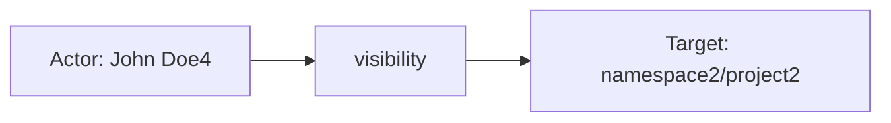
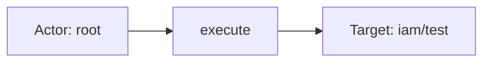
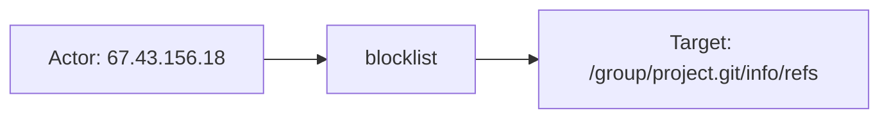

# gitlab

## Product Domain

GitLab is a DevSecOps platform that provides source code management, CI/CD pipelines, and integrated security capabilities in a single application. Organizations use GitLab to host Git repositories, manage merge requests and code review workflows, run automated builds and deployments, and enforce security scanning across the software development lifecycle. The platform is structured around hierarchical namespaces (groups and subgroups), projects, users, and roles, with both self-managed (Community Edition and Enterprise Edition) and SaaS (GitLab.com) deployment models.

At its core, GitLab functions as a complete software delivery toolchain. Source code management covers repository hosting, branching, merge requests, and code review. CI/CD capabilities include pipeline configuration, job execution via GitLab Runners, artifact storage, and deployment to environments including Kubernetes and GitLab Pages for static site hosting. Security and compliance features span vulnerability scanning, secret detection, audit logging, access controls, and protected branches or paths. Background processing is handled by Sidekiq workers, while Gitaly provides Git repository storage services.

From a security and operations perspective, GitLab generates extensive structured logs across its Rails web application, REST/GraphQL API, authentication layer, audit subsystem, and background job infrastructure. These logs capture user and administrative activity, configuration changes, API access patterns, authentication anomalies, rate-limiting events, and application performance metrics. Security teams monitor GitLab instances to detect unauthorized access, policy violations, repository exposure changes, and abusive API or Git protocol requests.

The Elastic GitLab integration ingests these server-side log files via Elastic Agent filestream input, parsing JSON-formatted logs into ECS-aligned fields. This enables security operations to correlate GitLab activity with broader SIEM data, investigate audit trails for group and project changes, detect authentication abuse, and monitor API and web application behavior on self-hosted GitLab instances.

## Data Collected (brief)

- **API logs** (`gitlab.api`): HTTP requests to the GitLab REST API, including method, path, route, status, duration, database/Redis/Gitaly performance metrics, correlation IDs, and user/project metadata.
- **Application logs** (`gitlab.application`): Internal application events such as user creation, project deletion, merge request processing, and worker activity, with caller IDs, feature categories, and user/project context.
- **Audit logs** (`gitlab.audit`): Changes to group or project settings and memberships, including entity type, target details, author, and before/after values (e.g., visibility changes).
- **Auth logs** (`gitlab.auth`): Authentication-related events including protected-path abuse, rate-limit violations (Rack Attack), remote IP, request method/path, and rate-limiting gate details.
- **Pages logs** (`gitlab.pages`): GitLab Pages static site hosting activity, including HTTP request metadata, response status, duration, and daemon events.
- **Production logs** (`gitlab.production`): Rails web controller requests with action, controller, status, duration, GraphQL query details, and database/Redis performance metrics.
- **Sidekiq logs** (`gitlab.sidekiq`): Background job execution for long-running or scheduled workers, including job class, queue, duration, retry status, and Gitaly/database call statistics.

## Expected Audit Log Entities

Seven filestream data streams ingest self-hosted GitLab JSON logs. Only **`gitlab.audit`** is a native audit trail (`author_*`, `target_*`, `entity_*`, `change`/`from`/`to`). **`gitlab.application`** is audit-adjacent (lifecycle messages with actor meta). **`gitlab.api`**, **`gitlab.production`**, **`gitlab.auth`**, and **`gitlab.pages`** are HTTP/access telemetry. **`gitlab.sidekiq`** is background job execution. No stream populates ECS `user.target.*`, `host.target.*`, `service.target.*`, or `entity.target.*`; no `destination.user.*` / `destination.host.*` in pipelines (`destination_identity_hits.csv` has no gitlab row). The target-fields audit classifies gitlab as **`moderate_candidate`** with `pipeline_actor=true`, `fixture_strong=true`, and no ECS target tier-A mapping (`dev/target-fields-audit/out/target_enhancement_packages.csv`).

**`event.action` is populated only on `gitlab.production`** — pipeline rename `gitlab.production.action` → `event.action` (`production/default.yml` L77–80). All other streams retain vendor operation names under `gitlab.*` or derive coarse `event.type` / `event.outcome` from message grok on **`gitlab.application`** without setting `event.action`. Evidence: `packages/gitlab/data_stream/*/sample_event.json`, `*/_dev/test/pipeline/*-expected.json`, `*/elasticsearch/ingest_pipeline/default.yml`, `*/fields/fields.yml`.

### Event action (semantic)

GitLab logs express operations differently per stream: Rails controller actions on production, Rack Attack gate names on auth, REST route templates on API, Sidekiq job lifecycle on sidekiq, and audit attribute changes on audit. Only production promotes the Rails `action` field to ECS.

| Action (normalized label) | Classification | Confidence | Evidence | Per-stream notes |
| --- | --- | --- | --- | --- |
| `index` | api_call | high | `test-gitlab-production.log-expected.json`: `MetricsController#index`, `RootController#index`, `Dashboard::GroupsController#index` | **`gitlab.production`** — mapped to `event.action` |
| `activity` | data_access | high | Production fixture: `DashboardController#activity` → `event.action: activity` | **`gitlab.production`** |
| `execute` | api_call | high | Production fixture: `GraphqlController#execute` with `operation_name: getDashboardIssues` | **`gitlab.production`** — GraphQL handler action |
| `create` | administration | high | Production fixture: `RegistrationsController#create`; application message `User "test23" … was created` | **`gitlab.production`** mapped; **`gitlab.application`** vendor message only |
| `new` | authentication | high | Production fixtures: `SessionsController#new`, `RegistrationsController#new` | **`gitlab.production`** — sign-in/sign-up form renders |
| `manifest` | api_call | medium | Production fixture: `PwaController#manifest` | **`gitlab.production`** |
| `opensearch` | api_call | medium | Production fixture: `SearchController#opensearch` | **`gitlab.production`** |
| `issues` / `users` | data_access | medium | Production fixtures: `DashboardController#issues`, `UsersController#users` | **`gitlab.production`** |
| `SessionsController#create` | authentication | high | Audit login fixture: `gitlab.audit.meta.caller_id`; application login message `Successful Login: username=root` | **`gitlab.audit`**, **`gitlab.application`** — not mapped to `event.action` |
| `visibility` (attribute change) | configuration_change | high | Audit fixture: `change=visibility`, `from=Private`, `to=Public` on Project | **`gitlab.audit`** — `gitlab.audit.change` vendor-only |
| `Successful Login` / `Failed Login` | authentication | high | Application fixtures: grok on `gitlab.application.message`; sets `event.outcome` success/failure | **`gitlab.application`** — message text, not `event.action` |
| `User/Group/Project … was created/removed` | administration | high | Application fixtures: grok sets `event.type: creation/deletion` | **`gitlab.application`** — lifecycle verbs in message |
| `GET /api/:version/geo/proxy` | api_call | high | API fixture: `event.provider` ← `meta.caller_id`; `route=/api/:version/geo/proxy` | **`gitlab.api`** — HTTP route template as provider, not `event.action` |
| `blocklist` / `throttle` | detection | high | Auth fixtures: `gitlab.auth.env`; `matched=throttle_unauthenticated_api`, `throttle_authenticated_api` | **`gitlab.auth`** — Rack Attack gate |
| `Rack_Attack` | detection | high | Auth fixtures: `gitlab.auth.message` on all blocklist/throttle events | **`gitlab.auth`** — generic event label |
| `access` | api_call | high | Pages HTTP fixtures: `gitlab.pages.msg=access`, `method=GET`, `uri=/` | **`gitlab.pages`** — static site HTTP access |
| `done` / `start` | api_call | high | Sidekiq fixtures: `job_status=done/start`; `class=UpdateAllMirrorsWorker`, `MergeRequestCleanupRefsWorker` | **`gitlab.sidekiq`** — job lifecycle phase |

### Event action (ECS candidates)

| ECS / vendor field | Mapped to `event.action` today? | Mapping correct? | Recommended `event.action` value (from fixtures) | Enhancement candidate? | Evidence |
| --- | --- | --- | --- | --- | --- |
| `gitlab.production.action` → `event.action` | yes | yes | `index`, `activity`, `execute`, `create`, `new`, `manifest`, `opensearch`, `issues`, `users` | no | `production/default.yml` L77–80; all production pipeline fixtures |
| `event.provider` ← `meta.caller_id` | n/a (provider, not action) | yes | `GraphqlController#execute`, `RootController#index`, `GET /api/:version/projects` | partial | Production + API pipelines; complements but does not replace `event.action` |
| `gitlab.audit.meta.caller_id` | no | n/a | `SessionsController#create` | yes | Login audit fixture; Rails handler names the operation |
| `gitlab.audit.change` | no | n/a | `visibility` | yes | Visibility-change audit fixture; attribute-level action |
| `gitlab.audit.change` + `target_type` (composite) | no | n/a | `visibility-change-on-Project` | yes | Combines verb + entity type when `change` alone is ambiguous |
| `gitlab.application.message` (grok) | no | partial | `Successful Login`, `Failed Login`, `User "test23" … was created`, `Group "elastic_group" was removed` | yes | Grok extracts identity + sets `event.outcome`/`event.type`; message prefix is natural action label |
| `gitlab.application.meta.caller_id` / `meta.root_caller_id` | no | n/a | `ProjectCacheWorker`, `ProjectsController#create`, `Admin::GroupsController#destroy` | yes | Worker/controller chain; alternate to message text |
| `gitlab.api.meta.caller_id` / `route` | no | partial | `GET /api/:version/geo/proxy`, `/api/:version/projects` | yes | `meta.caller_id` → `event.provider`; `route` is route template |
| `http.request.method` + `url.path` | partial (ECS, not action) | partial | `GET /api/v4/projects` | partial | Mapped on api/auth/pages/production; HTTP surface when no vendor action field |
| `gitlab.auth.env` | no | n/a | `blocklist`, `throttle` | yes | Primary Rack Attack gate discriminator |
| `gitlab.auth.matched` | no | n/a | `throttle_unauthenticated_api`, `throttle_authenticated_api` | yes | Finer-grained rate-limit rule name |
| `gitlab.auth.message` | no | n/a | `Rack_Attack` | partial | Generic; prefer `env` or `matched` |
| `gitlab.pages.msg` | no | n/a | `access` | yes | HTTP access events; daemon startup uses free-text `msg` |
| `gitlab.sidekiq.job_status` + `class` | no | n/a | `UpdateAllMirrorsWorker:done`, `MergeRequestCleanupRefsWorker:start` | yes | Job class + lifecycle phase |
| `event.type` / `event.outcome` (application) | n/a (downstream) | partial | `creation`, `deletion`; `success`/`failure` on login | partial | Derived from message grok — do not substitute for `event.action` |

**Step 2b — per-stream check:**

| Stream | `event.action` in fixtures? | Pipeline maps to `event.action`? | Primary action candidate | Confidence | Evidence |
| --- | --- | --- | --- | --- | --- |
| `gitlab.audit` | no | no | `gitlab.audit.meta.caller_id` (login); `gitlab.audit.change` (setting edits) | high | `test-audit.log-expected.json`; no `event.action` in pipeline |
| `gitlab.application` | no | no | `gitlab.application.message` (grok prefix); alternate `meta.root_caller_id` | high | `test-application.log-expected.json`; grok + `event.outcome`/`event.type` only |
| `gitlab.api` | no | no | `gitlab.api.meta.caller_id` or `route` | high | `test-gitlab-api.log-expected.json`; `event.provider` only |
| `gitlab.auth` | no | no | `gitlab.auth.env` + `gitlab.auth.matched` | high | `test-auth.log-expected.json`: `blocklist`, `throttle_*` |
| `gitlab.pages` | no | no | `gitlab.pages.msg` (`access`); `http.request.method` + `gitlab.pages.uri` | high | `test-pages.log-expected.json` |
| `gitlab.production` | yes (all fixtures) | yes | `gitlab.production.action` | high | `production/default.yml` L77–80; `test-gitlab-production.log-expected.json` |
| `gitlab.sidekiq` | no | no | `gitlab.sidekiq.class` + `gitlab.sidekiq.job_status` | high | `test-gitlab-sidekiq.log-expected.json` |

### Actor (semantic)

| Entity | Classification | Entity type (if general) | Confidence | Evidence | Per-stream notes |
| --- | --- | --- | --- | --- | --- |
| Audit author (administrator) | user | — | high | `author_id` → `user.id`, `author_name` → `user.name` (`audit/default.yml`); login fixture: `author_name=Administrator`, visibility fixture: `John Doe4` | **`gitlab.audit`** — canonical audit actor |
| Audit session user (request meta) | user | — | high | `gitlab.audit.meta.user` / `meta.user_id` / `meta.client_id` (`user/1`); login fixture: session `root` vs author `Administrator`; **not** copied to ECS `user.*` | **`gitlab.audit`** — request-context principal; may differ from author |
| Application / worker acting user | user | — | high | `meta.user_id` → `user.id`, `meta.user` → `user.name`; `related.user` also gets `meta.gl_user_id`, `user_id` | **`gitlab.application`** — actor when meta present; grok can overwrite `user.*` on lifecycle messages (see Gaps) |
| REST API authenticated caller | user | — | medium | `user_id` → `user.id`, `username` → `user.name`; `related.user` from `user_id`/`username`/`meta.gl_user_id` | **`gitlab.api`** — only when `user_id` present; anonymous geo proxy calls have `meta.client_id=ip/…` only |
| Rails web authenticated caller | user | — | medium | `user_id` → `user.id`, `username` → `user.name` | **`gitlab.production`** — authenticated dashboard/API/GraphQL; anonymous PWA/sign-in pages omit `user.*` |
| Auth rate-limit subject | user | — | low | `user_id` → `user.id`; `meta.user` expanded but not renamed to ECS | **`gitlab.auth`** — one throttled fixture (`user_id=2`, `meta.user=test`); most Rack Attack events are IP-only |
| Client source IP | host | — | high | `meta.remote_ip` / `remote_ip` → `client.ip` + `source` copy (audit, application, auth); `remote_ip` → `source.ip` (api, production, pages) | All streams except **`gitlab.sidekiq`** (no IP in fixtures) — network origin, not GitLab identity |
| Sidekiq worker / cron initiator | service | Sidekiq worker | medium | `gitlab.sidekiq.class`, `meta.caller_id`, `meta.root_caller_id=Cronjob`, `meta.client_id=ip/` | **`gitlab.sidekiq`**, **`gitlab.application`** (worker messages) — no ECS `user.*`; system-initiated |
| Pages daemon OS user | user | — | low | `uid` → `user.id` on daemon startup | **`gitlab.pages`** — OS unprivileged user (`998`), not a GitLab account |

**No actor identity:** **`gitlab.sidekiq`** fixtures (cron `UpdateAllMirrorsWorker`, `MergeRequestCleanupRefsWorker`) carry worker class and correlation ID only. **`gitlab.auth`** blocklist/throttle events are predominantly IP + `url.path` with no user.

### Actor (ECS candidates)

| ECS / vendor field | Role | Mapped today? | Mapping correct? | Confidence | Evidence |
| --- | --- | --- | --- | --- | --- |
| `user.id` | Audit author; API/production caller; application meta actor | yes (stream-dependent) | yes (audit, api, production); partial (application) | high | Audit: `author_id` rename; API: `user_id` rename; production: `user_id` rename; application: `meta.user_id` rename — grok overwrites on User create/remove messages |
| `user.name` | Audit author; API/production username; application meta actor | yes (stream-dependent) | yes (audit, api, production); partial (application) | high | Same pipeline sources; application grok sets target username on `User "…" was created/removed` |
| `user.email` | Login/lifecycle subject | partial | partial | medium | Application grok only (`User "…" (email) was created/removed`); encodes **target** user on admin create, not actor |
| `client.ip` / `source.ip` | Client network origin | yes | yes | high | Audit/application/auth: `meta.remote_ip` → `client.ip` + `source` copy; api/production/pages: `remote_ip` → `source.ip` |
| `related.user` | Actor + target enrichment bag | yes | partial | high | Audit appends author + User-type `target_id`/`target_details`/`entity_id`; application/api append meta ids; conflates actor and target |
| `gitlab.audit.meta.user` / `meta.user_id` | Session user (distinct from author) | no (vendor-only) | n/a | high | Login audit fixture: `meta.user=root` while `user.name=Administrator` |
| `gitlab.audit.meta.client_id` | Auth mode (`user/{id}` vs `ip/…`) | no | n/a | high | `user/1` on authenticated audit login |
| `gitlab.application.meta.user` / `meta.user_id` | Acting user for workers/controllers | partial | yes when grok does not run | high | Mapped to `user.*`; survives in `related.user` when grok overwrites |
| `gitlab.application.meta.caller_id` / `meta.root_caller_id` | Controller/worker class chain | no | n/a | medium | e.g. `ProjectsController#create` → `ProjectCacheWorker`; `Cronjob` root on batch workers |
| `gitlab.api.meta.user` / `meta.user_id` | Request-context user (duplicate of top-level on authed calls) | no | n/a | medium | Stays vendor-only; ECS uses top-level `user_id`/`username` |
| `gitlab.auth.meta.user` | Throttled API username | no | n/a | low | Dot-expanded only; `user.id` comes from top-level `user_id` |
| `gitlab.production.meta.user` / `meta.user_id` | Request-context user | no | n/a | medium | Vendor-only; ECS uses top-level `user_id`/`username` |
| `organization.id` | GitLab organization scope | partial | yes (scope) | low | `meta.organization_id` → `organization.id` on api, application, production when present |
| `event.provider` | Controller/route handler | yes | yes (context) | medium | API: `meta.caller_id`; production: `meta.caller_id` → `event.provider` |
| `process.pid` / `process.name` | Rails/Puma/Sidekiq process | yes | yes (context) | medium | api/production/auth/sidekiq pipelines |

### Target (semantic)

| Layer | Description | Entity | Classification | Entity type (if general) | Confidence | Evidence | Per-stream notes |
| --- | --- | --- | --- | --- | --- | --- | --- |
| 1 — Platform service | GitLab Rails/API/Pages instance handling the request | Self-hosted GitLab | service | — | medium | `host.name` ← `url.domain` (api) or Pages bind; `event.provider` ← controller/route; no `cloud.service.name` | **`gitlab.api`**, **`gitlab.production`**, **`gitlab.pages`** — invoked application tier |
| 2 — Resource / object | GitLab domain entity acted upon | User, Project, Group, etc. | general | User, Project, Group, MergeRequest, … | high (audit); medium (application); low (HTTP) | Audit: `target_type`/`target_id`/`target_details`, `entity_type`/`entity_id`; application: grok `group.name`, `project_name`, `model`/`model_id`; production: `params.new_user.*`, `assignee_username` | **`gitlab.audit`** canonical; other streams infer from path/params/message |
| 3 — Content / artifact | Attribute change, HTTP resource, or job instance | visibility change; URL path; Sidekiq JID | general | setting_change, url_endpoint, background_job | high (audit change); medium (HTTP); low (sidekiq) | Audit: `change`/`from`/`to` (e.g. visibility Private→Public); HTTP: `url.path`, `gitlab.pages.uri`; sidekiq: `jid`, `class` | Layer 3 complements Layer 2 on audit setting edits |

### Target (ECS candidates)

| ECS / vendor field | Layer | Classification | Mapped today? | Mapping correct? | ECS target bucket | Enhancement candidate? | Evidence |
| --- | --- | --- | --- | --- | --- | --- | --- |
| `gitlab.audit.target_type` | 2 | general | no | n/a | `entity.target.*` (type discriminator) | yes | `User`, `Project` in fixtures; production also emits Group, DeployKey, etc. |
| `gitlab.audit.target_id` | 2 | general | no | n/a | `entity.target.id` | yes | `target_id=1` (User login), `2` (Project visibility) |
| `gitlab.audit.target_details` | 2 | general | no | n/a | `entity.target.name` | yes | `Administrator`, `namespace2/project2` |
| `gitlab.audit.entity_type` / `entity_id` | 2 | general | no | n/a | `entity.target.*` | yes | Changed entity; often equals target on same-object edits |
| `gitlab.audit.change` / `from` / `to` | 3 | general | no | n/a | context-only | no | Attribute delta (e.g. `change=visibility`) |
| `related.user` (User-type audit targets) | 2 | user | partial | partial | `user.target.*` | yes | Pipeline appends `target_id`/`target_details`/`entity_id` when type=User — de-facto target bag, not `user.target.*` |
| `group.name` (application grok) | 2 | general | yes | yes | `entity.target.name` (Group) | yes | `Group "elastic_group" was created/removed` fixtures |
| `gitlab.application.project_name` (grok) | 2 | general | yes | yes | `entity.target.name` (Project) | yes | Project create/delete messages |
| `gitlab.application.meta.project` / `project_id` | 2 | general | no | n/a | `entity.target.name` / `.id` | yes | Worker context, e.g. `root/test_1` |
| `gitlab.application.model` / `model_id` | 2 | general | no | n/a | `entity.target.*` | yes | e.g. `ProjectStatistics` / `1` |
| `gitlab.application.mergeability.merge_request_id` | 2 | general | no | n/a | `entity.target.id` | yes | MR mergeability worker events |
| `url.path` / `gitlab.pages.uri` | 3 | general | yes | yes (HTTP resource) | context-only | no | API route, Git upload-pack path, Pages URI — endpoint, not typed GitLab entity |
| `gitlab.production.params.new_user.*` | 2 | user | no | n/a | `user.target.*` | yes | Registration create: username/email in params map |
| `host.name` (api/pages) | 1 | service | yes | yes (server endpoint) | context-only | no | `localhost`, `127.0.0.1:8090` — serving host, not acted-upon resource |
| `gitlab.api.target_duration_s` / `gitlab.production.target_duration_s` / `gitlab.sidekiq.target_duration_s` | — | — | yes | no (misnamed) | n/a | no | Rails performance SLA seconds — **not** entity targets |
| `gitlab.sidekiq.target_scheduling_latency_s` | — | — | yes | no (misnamed) | n/a | no | Sidekiq scheduling metric, not entity target |
| `gitlab.sidekiq.class` / `jid` | 3 | service | no | n/a | context-only | no | Background job identity; worker is actor, job is artifact |

### Gaps and mapping notes

- **`event.action` populated on production only** — six of seven streams leave vendor operation names unmapped. Primary enhancement candidates: audit `meta.caller_id` / `change`; application message grok prefix; API `meta.caller_id` or `route`; auth `env` + `matched`; pages `msg`; sidekiq `class` + `job_status`.
- **Application uses `event.type`/`event.outcome` without `event.action`** — login grok sets `event.outcome: success/failure` and lifecycle messages set `event.type: creation/deletion`, but no normalized action string (e.g. `user-created`, `login-failed`).
- **API duplicates action semantics in `event.provider`** — `meta.caller_id` (e.g. `GET /api/:version/projects`) names the operation but is classified as provider, not action.
- **No ECS `*.target.*` today** — audit `target_*` / `entity_*` remain vendor-only except User IDs/names appended to `related.user`. Enhancement: map typed targets to `entity.target.*` or `user.target.*` / `service.target.*` by `target_type`.
- **`user.*` actor/target conflation on application lifecycle grok** — grok runs after `meta.user_id` → `user.id` rename; on `User "test23" … was created`, `user.name`/`user.email` hold the **created user** (target) while `related.user` retains actor `root`/`1`. On cron `User "test11" … was removed` with no meta, `user.*` is target-only with no actor ECS field.
- **Audit login: author vs session user** — `user.*` = author (`Administrator`); session user `root` stays in `gitlab.audit.meta.user` only. User-type target also lands in `related.user`, mixing actor and target in one array.
- **`meta.user` not promoted on api/production/auth/audit** — duplicate identity stays vendor-only even when top-level `user_id`/`username` absent; auth throttling exposes `meta.user=test` without ECS `user.name`.
- **No `destination.user.*` / `destination.host.*`** — production pipeline geo-enriches `destination.ip` if present in raw JSON, but fixtures do not populate it; not used as de-facto audit target.
- **Performance homonyms** — `target_duration_s` / `target_scheduling_latency_s` flagged in `vendor_target_special_cases.csv` as false-positive `*target*` paths.
- **Target-fields audit alignment** — `moderate_candidate`: strong vendor audit targets and actor pipeline mappings, but no tier-A ECS target fields and no destination-identity pattern.

### Per-stream notes

#### `gitlab.audit`

True audit stream. Actor: `author_*` → `user.*`. Target: `target_*` + `entity_*` + `change`/`from`/`to` vendor-only. **Action:** no `event.action`; login → `meta.caller_id=SessionsController#create`; visibility change → `change=visibility`. Login event: target User equals session subject; visibility event: target Project with attribute change. `meta.feature_category=system_access`.

#### `gitlab.application`

Audit-adjacent lifecycle and worker logs. Actor from `meta.user_*` when present; login/logout grok extracts username + `source.ip`. **Action:** message grok drives `event.outcome`/`event.type` but not `event.action`; candidates are message prefix (`Successful Login`, `was created`) or `meta.root_caller_id`. Group/project/user CRUD via message grok → `group.name`, `project_name`, or target `user.name`/`user.email`. Workers chain `meta.caller_id` → `meta.root_caller_id` (e.g. `GroupDestroyWorker` ← `Admin::GroupsController#destroy`).

#### `gitlab.api`

REST request telemetry. Authenticated calls: `user_id`/`username` → `user.*`, token metadata vendor-only (`token_type`, `token_id`). Anonymous calls: `source.ip` only. **Action:** no `event.action`; `meta.caller_id` → `event.provider` (e.g. `GET /api/:version/projects`); `route` holds path template. `url.path` + `route` identify API surface; `meta.project` when scoped.

#### `gitlab.production`

Rails controller/GraphQL access. **`event.action`** ← `gitlab.production.action` (`index`, `execute`, `create`, …); **`event.provider`** ← `meta.caller_id`. `params` map holds form targets (registration, assignee filters). GraphQL `operation_name` and variables in vendor fields. Mix of authenticated (`root`) and anonymous requests.

#### `gitlab.auth`

Rack Attack blocklist/throttle/protected-path abuse. Mostly IP + HTTP method/path (`/group/project.git/info/refs`, `/api/v4/users?…`). **Action:** `env` (`blocklist`, `throttle`) + `matched` rate-limit rule; generic `message=Rack_Attack`. Rate-limited authenticated API is the only user-identified fixture.

#### `gitlab.pages`

GitLab Pages daemon and HTTP access logs. Access events: `source.ip`, `host.name`, `gitlab.pages.uri`, status/duration; **`msg=access`**. Daemon startup maps OS `uid` → `user.id` (low-confidence GitLab actor). No GitLab user accounts on access fixtures.

#### `gitlab.sidekiq`

Background job start/done/retry. Actor is the worker (`class`, `meta.caller_id`); optional `meta.root_caller_id=Cronjob`. **Action:** `job_status` (`start`, `done`) + worker `class`; no `event.action`. No user identity in fixtures. `target_duration_s` is a Sidekiq/Rails SLA metric, not an entity.

## Example Event Graph

Examples below come from **`gitlab.audit`** (native audit trail), **`gitlab.production`** (Rails web access with ECS `event.action`), and **`gitlab.auth`** (Rack Attack rate-limit/blocklist telemetry). Audit events are true audit logs; production and auth streams are audit-adjacent HTTP/access telemetry.

### Example 1: Project visibility change

**Stream:** `gitlab.audit` · **Fixture:** `packages/gitlab/data_stream/audit/sample_event.json`

```
John Doe4 → visibility → namespace2/project2 (Project)
```

#### Actor

| Field | Value |
| --- | --- |
| id | 3 |
| name | John Doe4 |
| type | user |

**Field sources:**
- `id` ← `user.id` (renamed from `author_id`)
- `name` ← `user.name` (renamed from `author_name`)

#### Event action

| Field | Value |
| --- | --- |
| action | visibility |
| source_field | `gitlab.audit.change` |
| source_value | visibility |

Not mapped to ECS `event.action` today.

#### Target

| Field | Value |
| --- | --- |
| id | 2 |
| name | namespace2/project2 |
| type | general |
| sub_type | Project |

**Field sources:**
- `id` ← `gitlab.audit.target_id`
- `name` ← `gitlab.audit.target_details`
- `sub_type` ← `gitlab.audit.target_type`

#### Mermaid (optional)



### Example 2: GraphQL dashboard query

**Stream:** `gitlab.production` · **Fixture:** `packages/gitlab/data_stream/production/_dev/test/pipeline/test-gitlab-production.log-expected.json`

```
root → execute → iam/test (Project)
```

#### Actor

| Field | Value |
| --- | --- |
| id | 1 |
| name | root |
| type | user |
| ip | 192.168.65.1 |

**Field sources:**
- `id` ← `user.id` (renamed from `user_id`)
- `name` ← `user.name` (renamed from `username`)
- `ip` ← `source.ip` (renamed from `remote_ip`)

#### Event action

| Field | Value |
| --- | --- |
| action | execute |
| source_field | `event.action` |
| source_value | execute |

#### Target

| Field | Value |
| --- | --- |
| name | iam/test |
| type | general |
| sub_type | Project |

**Field sources:**
- `name` ← `gitlab.production.graphql[].variables` (`projectPath` in `getDashboardIssues` operation)
- `sub_type` inferred from GraphQL `operation_name: getDashboardIssues` scoped to a project path

#### Mermaid (optional)



### Example 3: Git protocol blocklist

**Stream:** `gitlab.auth` · **Fixture:** `packages/gitlab/data_stream/auth/_dev/test/pipeline/test-auth.log-expected.json`

```
67.43.156.18 → blocklist → /group/project.git/info/refs
```

#### Actor

| Field | Value |
| --- | --- |
| type | host |
| geo | Bhutan |
| ip | 67.43.156.18 |

**Field sources:**
- `ip` ← `source.ip` / `client.ip` (renamed from `remote_ip`)
- `geo` ← `source.geo.country_name`

#### Event action

| Field | Value |
| --- | --- |
| action | blocklist |
| source_field | `gitlab.auth.env` |
| source_value | blocklist |

Not mapped to ECS `event.action` today.

#### Target

| Field | Value |
| --- | --- |
| name | /group/project.git/info/refs |
| type | general |
| sub_type | git_endpoint |

**Field sources:**
- `name` ← `url.path`
- `sub_type` inferred from Git smart-HTTP path (`service=git-upload-pack` in `url.query`)

#### Mermaid (optional)



## ES|QL Entity Extraction

**Package type: agent-backed** (`policy_templates`, seven filestream data streams with Tier A fixtures per `packages/gitlab/data_stream/*/sample_event.json` and `*-expected.json`). Router: **`data_stream.dataset`** (`gitlab.api`, `gitlab.application`, `gitlab.audit`, `gitlab.auth`, `gitlab.pages`, `gitlab.production`, `gitlab.sidekiq`). Secondary discriminators: **`gitlab.audit.meta.caller_id`**, **`gitlab.audit.target_type`**, **`gitlab.audit.change`**, **`event.action`** (production only at ingest). Pass 4 is **fill-gaps-only**: detection flags (`actor_exists`, `target_exists`, `action_exists`) run first for query semantics; mapped columns use **column-level** `CASE(<col> IS NOT NULL, <col>, …)` — valid **5-arg**, **7-arg**, or **9-arg** paired branches with a trailing `null` default — not `CASE(actor_exists|target_exists|action_exists, <col>, …)` (a populated sibling actor/target/action field must not block fallbacks on an empty column; Pass 4 §10). Ingest does not populate ECS `*.target.*` today — fallbacks promote vendor audit fields and grok lifecycle targets. **`gitlab.audit` login** (`SessionsController#create`) → **`service.target.name`** `"GitLab"` (Pass 3 platform target), not self-referential `user.target.*` from `target_details`. **`gitlab.sidekiq`** excluded.

### Dataset inventory

| data_stream.dataset | Stream role | Actor classification(s) | Target classification(s) | Extraction |
| --- | --- | --- | --- | --- |
| `gitlab.audit` | audit | user, host | user, service, general (Project/Group) | full |
| `gitlab.application` | audit-adjacent lifecycle | user, host | user, general (Group/Project) | partial |
| `gitlab.api` | REST telemetry | user, host | general (route/API surface) | partial |
| `gitlab.auth` | Rack Attack | host | general (git endpoint) | partial |
| `gitlab.pages` | static site access | host | general (URI) | partial |
| `gitlab.production` | Rails web access | user, host | — | partial (actor/action only) |
| `gitlab.sidekiq` | background jobs | service | — | none |

### Field mapping plan

#### Actor mappings

| Output column | Source field(s) | Condition (dataset + optional) | Confidence | Notes |
| --- | --- | --- | --- | --- |
| `user.id` | `user.id` | `data_stream.dataset IN ("gitlab.audit", "gitlab.application", "gitlab.api", "gitlab.production")` | high | **ingest-only — no ES|QL** — audit `author_id`, api/production `user_id`, application `meta.user_id`; no query-time vendor path when empty |
| `user.name` | `user.name` | `data_stream.dataset IN ("gitlab.audit", "gitlab.application", "gitlab.api", "gitlab.production")` | high | **ingest-only — no ES|QL** — application grok may hold **target** user on `User "…" was created` (see Gaps) |
| `host.ip` | `host.ip` | `data_stream.dataset IN ("gitlab.api", "gitlab.auth", "gitlab.pages", "gitlab.production")` | high | **preserve existing** |
| `host.ip` | `source.ip` | `data_stream.dataset IN ("gitlab.api", "gitlab.auth", "gitlab.pages", "gitlab.production") AND source.ip IS NOT NULL` | high | **vendor fallback** — `remote_ip` rename |
| `host.ip` | `client.ip` | `data_stream.dataset IN ("gitlab.audit", "gitlab.application", "gitlab.auth") AND client.ip IS NOT NULL` | high | **vendor fallback** — `meta.remote_ip` rename |

#### Target mappings

| Output column | Source field(s) | Condition (dataset + optional) | Confidence | Notes |
| --- | --- | --- | --- | --- |
| `service.target.name` | `service.target.name` | `data_stream.dataset == "gitlab.audit"` | high | **preserve existing** |
| `service.target.name` | `"GitLab"` | `data_stream.dataset == "gitlab.audit" AND gitlab.audit.meta.caller_id == "SessionsController#create"` | medium | **semantic literal** — login platform target (Pass 3); not `target_details` User |
| `user.target.id` | `user.target.id` | `data_stream.dataset == "gitlab.audit"` | high | **preserve existing** |
| `user.target.id` | `TO_STRING(gitlab.audit.target_id)` | `data_stream.dataset == "gitlab.audit" AND gitlab.audit.target_type == "User" AND gitlab.audit.meta.caller_id != "SessionsController#create"` | high | **vendor fallback** |
| `user.target.name` | `user.target.name` | `data_stream.dataset == "gitlab.audit"` | high | **preserve existing** |
| `user.target.name` | `gitlab.audit.target_details` | `data_stream.dataset == "gitlab.audit" AND gitlab.audit.target_type == "User" AND gitlab.audit.meta.caller_id != "SessionsController#create"` | high | **vendor fallback** |
| `entity.target.id` | `entity.target.id` | `data_stream.dataset == "gitlab.audit"` | high | **preserve existing** |
| `entity.target.id` | `TO_STRING(gitlab.audit.target_id)` | `data_stream.dataset == "gitlab.audit" AND gitlab.audit.target_type == "Project"` | high | **vendor fallback** — visibility fixture `target_id=2` |
| `entity.target.name` | `entity.target.name` | `data_stream.dataset IN ("gitlab.audit", "gitlab.application", "gitlab.api", "gitlab.auth", "gitlab.pages")` | high | **preserve existing** |
| `entity.target.name` | `gitlab.audit.target_details` | `data_stream.dataset == "gitlab.audit" AND gitlab.audit.target_type == "Project"` | high | **vendor fallback** |
| `entity.target.name` | `group.name` | `data_stream.dataset == "gitlab.application" AND group.name IS NOT NULL` | high | **vendor fallback** — grok Group create/remove (`test-application.log-expected.json`) |
| `entity.target.name` | `gitlab.application.project_name` | `data_stream.dataset == "gitlab.application" AND gitlab.application.project_name IS NOT NULL` | high | **vendor fallback** — grok project CRUD |
| `entity.target.name` | `gitlab.application.meta.project` | `data_stream.dataset == "gitlab.application" AND gitlab.application.project_name IS NULL AND gitlab.application.meta.project IS NOT NULL` | medium | **vendor fallback** — worker context (e.g. `elastic_group/rag_ai`) |
| `entity.target.name` | `gitlab.api.route` | `data_stream.dataset == "gitlab.api" AND gitlab.api.route IS NOT NULL` | medium | **vendor fallback** — REST route template as API surface |
| `entity.target.name` | `url.path` | `data_stream.dataset == "gitlab.auth"` | high | **vendor fallback** — Git smart-HTTP endpoint (Pass 3 blocklist example) |
| `entity.target.name` | `gitlab.pages.uri` | `data_stream.dataset == "gitlab.pages" AND gitlab.pages.msg == "access"` | high | **vendor fallback** — Pages HTTP resource |
| `entity.target.sub_type` | `entity.target.sub_type` | `data_stream.dataset == "gitlab.audit"` | high | **preserve existing** |
| `entity.target.sub_type` | `gitlab.audit.target_type` | `data_stream.dataset == "gitlab.audit" AND gitlab.audit.target_type IS NOT NULL AND gitlab.audit.meta.caller_id != "SessionsController#create"` | high | **vendor fallback** — `User`, `Project`, … |
| `entity.target.sub_type` | `"git_endpoint"` | `data_stream.dataset == "gitlab.auth"` | medium | **semantic literal** — Pass 3 git protocol path target |

#### Event action mappings

| Output column | Source field(s) | Condition (dataset + optional) | Confidence | Notes |
| --- | --- | --- | --- | --- |
| `event.action` | `event.action` | `data_stream.dataset == "gitlab.production"` | high | **preserve existing** — ingest `gitlab.production.action` rename |
| `event.action` | `gitlab.audit.change` | `data_stream.dataset == "gitlab.audit" AND gitlab.audit.change IS NOT NULL` | high | **vendor fallback** — e.g. `visibility` |
| `event.action` | `gitlab.audit.meta.caller_id` | `data_stream.dataset == "gitlab.audit" AND gitlab.audit.change IS NULL` | high | **vendor fallback** — e.g. `SessionsController#create` login |
| `event.action` | `gitlab.application.meta.root_caller_id` | `data_stream.dataset == "gitlab.application" AND gitlab.application.meta.root_caller_id IS NOT NULL` | medium | **vendor fallback** — worker chain root |
| `event.action` | `gitlab.application.meta.caller_id` | `data_stream.dataset == "gitlab.application" AND gitlab.application.meta.root_caller_id IS NULL AND gitlab.application.meta.caller_id IS NOT NULL` | medium | **vendor fallback** |
| `event.action` | `gitlab.auth.env` | `data_stream.dataset == "gitlab.auth"` | high | **vendor fallback** — `blocklist`, `throttle` |
| `event.action` | `gitlab.api.route` | `data_stream.dataset == "gitlab.api" AND gitlab.api.route IS NOT NULL` | medium | **vendor fallback** — route template when no ingest action |
| `event.action` | `gitlab.pages.msg` | `data_stream.dataset == "gitlab.pages" AND gitlab.pages.msg IS NOT NULL` | high | **vendor fallback** — e.g. `access` |

### Detection flags (mandatory — run first)

Standard predicate covers user/host/service/entity actor columns populated at ingest on audit, api, application, and production streams. **`host.ip` is included** in `actor_exists` (client/source network origin on HTTP streams). No ECS `*.target.*` at ingest — `target_exists` is false until Pass 4 fallbacks run on the same query. **Actor/target/action `EVAL` blocks use column-level preserve** (`<col> IS NOT NULL`) — not `CASE(actor_exists, host.ip, …)` / `CASE(target_exists, entity.target.name, …)` / `CASE(action_exists, event.action, …)` — so e.g. `user.id` on audit does not block `host.ip` ← `source.ip` when `host.ip` is empty (Pass 4 §10).

```esql
| EVAL
  actor_exists = user.id IS NOT NULL OR user.name IS NOT NULL OR user.email IS NOT NULL
    OR host.id IS NOT NULL OR host.ip IS NOT NULL OR host.name IS NOT NULL
    OR service.id IS NOT NULL OR service.name IS NOT NULL
    OR entity.id IS NOT NULL OR entity.name IS NOT NULL,
  target_exists = user.target.id IS NOT NULL OR user.target.name IS NOT NULL OR user.target.email IS NOT NULL
    OR host.target.id IS NOT NULL OR host.target.ip IS NOT NULL OR host.target.name IS NOT NULL
    OR service.target.id IS NOT NULL OR service.target.name IS NOT NULL
    OR entity.target.id IS NOT NULL OR entity.target.name IS NOT NULL,
  action_exists = event.action IS NOT NULL
```

**ES|QL `CASE` arity:** Arguments are **(condition, value)** pairs; odd count → last arg is default. Never **4-arg** `CASE(host.ip IS NOT NULL, host.ip, source.ip, null)` — the 3rd arg `source.ip` is a **condition**, not a value. Use **5-arg** `CASE(host.ip IS NOT NULL, host.ip, data_stream.dataset IN (…), source.ip, null)` or **7-arg** multi-fallback chains. Never **4-arg** `CASE(actor_exists, host.ip, source.ip, null)` (`source.ip` parses as a condition).

### Combined ES|QL — actor fields

`user.id` and `user.name` omitted — ingest populates them on audit/api/application/production streams; no alternate indexed source for Pass 4 fallback (avoids `CASE(user.id IS NOT NULL, user.id, …, user.id, null)` tautology).

```esql
| EVAL
  host.ip = CASE(
    host.ip IS NOT NULL, host.ip,
    data_stream.dataset IN ("gitlab.api", "gitlab.auth", "gitlab.pages", "gitlab.production") AND source.ip IS NOT NULL, source.ip,
    data_stream.dataset IN ("gitlab.audit", "gitlab.application", "gitlab.auth") AND client.ip IS NOT NULL, client.ip,
    null
  )
```

### Combined ES|QL — event action

```esql
| EVAL
  event.action = CASE(
    event.action IS NOT NULL, event.action,
    data_stream.dataset == "gitlab.audit" AND gitlab.audit.change IS NOT NULL, gitlab.audit.change,
    data_stream.dataset == "gitlab.audit", gitlab.audit.meta.caller_id,
    data_stream.dataset == "gitlab.application" AND gitlab.application.meta.root_caller_id IS NOT NULL, gitlab.application.meta.root_caller_id,
    data_stream.dataset == "gitlab.application" AND gitlab.application.meta.caller_id IS NOT NULL, gitlab.application.meta.caller_id,
    data_stream.dataset == "gitlab.auth", gitlab.auth.env,
    data_stream.dataset == "gitlab.api" AND gitlab.api.route IS NOT NULL, gitlab.api.route,
    data_stream.dataset == "gitlab.pages" AND gitlab.pages.msg IS NOT NULL, gitlab.pages.msg,
    null
  )
```

### Combined ES|QL — target fields

```esql
| EVAL
  service.target.name = CASE(
    service.target.name IS NOT NULL, service.target.name,
    data_stream.dataset == "gitlab.audit" AND gitlab.audit.meta.caller_id == "SessionsController#create", "GitLab",
    null
  ),
  user.target.id = CASE(
    user.target.id IS NOT NULL, user.target.id,
    data_stream.dataset == "gitlab.audit" AND gitlab.audit.target_type == "User" AND gitlab.audit.meta.caller_id != "SessionsController#create", TO_STRING(gitlab.audit.target_id),
    null
  ),
  user.target.name = CASE(
    user.target.name IS NOT NULL, user.target.name,
    data_stream.dataset == "gitlab.audit" AND gitlab.audit.target_type == "User" AND gitlab.audit.meta.caller_id != "SessionsController#create", gitlab.audit.target_details,
    null
  ),
  entity.target.id = CASE(
    entity.target.id IS NOT NULL, entity.target.id,
    data_stream.dataset == "gitlab.audit" AND gitlab.audit.target_type == "Project", TO_STRING(gitlab.audit.target_id),
    null
  ),
  entity.target.name = CASE(
    entity.target.name IS NOT NULL, entity.target.name,
    data_stream.dataset == "gitlab.audit" AND gitlab.audit.target_type == "Project", gitlab.audit.target_details,
    data_stream.dataset == "gitlab.application" AND group.name IS NOT NULL, group.name,
    data_stream.dataset == "gitlab.application" AND gitlab.application.project_name IS NOT NULL, gitlab.application.project_name,
    data_stream.dataset == "gitlab.application" AND gitlab.application.meta.project IS NOT NULL, gitlab.application.meta.project,
    data_stream.dataset == "gitlab.api" AND gitlab.api.route IS NOT NULL, gitlab.api.route,
    data_stream.dataset == "gitlab.auth", url.path,
    data_stream.dataset == "gitlab.pages" AND gitlab.pages.msg == "access", gitlab.pages.uri,
    null
  ),
  entity.target.sub_type = CASE(
    entity.target.sub_type IS NOT NULL, entity.target.sub_type,
    data_stream.dataset == "gitlab.audit" AND gitlab.audit.target_type IS NOT NULL AND gitlab.audit.meta.caller_id != "SessionsController#create", gitlab.audit.target_type,
    data_stream.dataset == "gitlab.auth", "git_endpoint",
    null
  )
```

### Full pipeline fragment (optional)

```esql
FROM logs-*
| EVAL
  actor_exists = user.id IS NOT NULL OR user.name IS NOT NULL OR user.email IS NOT NULL
    OR host.id IS NOT NULL OR host.ip IS NOT NULL OR host.name IS NOT NULL
    OR service.id IS NOT NULL OR service.name IS NOT NULL
    OR entity.id IS NOT NULL OR entity.name IS NOT NULL,
  target_exists = user.target.id IS NOT NULL OR user.target.name IS NOT NULL OR user.target.email IS NOT NULL
    OR host.target.id IS NOT NULL OR host.target.ip IS NOT NULL OR host.target.name IS NOT NULL
    OR service.target.id IS NOT NULL OR service.target.name IS NOT NULL
    OR entity.target.id IS NOT NULL OR entity.target.name IS NOT NULL,
  action_exists = event.action IS NOT NULL
| EVAL
  host.ip = CASE(
    host.ip IS NOT NULL, host.ip,
    data_stream.dataset IN ("gitlab.api", "gitlab.auth", "gitlab.pages", "gitlab.production") AND source.ip IS NOT NULL, source.ip,
    data_stream.dataset IN ("gitlab.audit", "gitlab.application", "gitlab.auth") AND client.ip IS NOT NULL, client.ip,
    null
  ),
  event.action = CASE(
    event.action IS NOT NULL, event.action,
    data_stream.dataset == "gitlab.audit" AND gitlab.audit.change IS NOT NULL, gitlab.audit.change,
    data_stream.dataset == "gitlab.audit", gitlab.audit.meta.caller_id,
    data_stream.dataset == "gitlab.application" AND gitlab.application.meta.root_caller_id IS NOT NULL, gitlab.application.meta.root_caller_id,
    data_stream.dataset == "gitlab.application" AND gitlab.application.meta.caller_id IS NOT NULL, gitlab.application.meta.caller_id,
    data_stream.dataset == "gitlab.auth", gitlab.auth.env,
    data_stream.dataset == "gitlab.api" AND gitlab.api.route IS NOT NULL, gitlab.api.route,
    data_stream.dataset == "gitlab.pages" AND gitlab.pages.msg IS NOT NULL, gitlab.pages.msg,
    null
  ),
  service.target.name = CASE(
    service.target.name IS NOT NULL, service.target.name,
    data_stream.dataset == "gitlab.audit" AND gitlab.audit.meta.caller_id == "SessionsController#create", "GitLab",
    null
  ),
  user.target.id = CASE(
    user.target.id IS NOT NULL, user.target.id,
    data_stream.dataset == "gitlab.audit" AND gitlab.audit.target_type == "User" AND gitlab.audit.meta.caller_id != "SessionsController#create", TO_STRING(gitlab.audit.target_id),
    null
  ),
  user.target.name = CASE(
    user.target.name IS NOT NULL, user.target.name,
    data_stream.dataset == "gitlab.audit" AND gitlab.audit.target_type == "User" AND gitlab.audit.meta.caller_id != "SessionsController#create", gitlab.audit.target_details,
    null
  ),
  entity.target.id = CASE(
    entity.target.id IS NOT NULL, entity.target.id,
    data_stream.dataset == "gitlab.audit" AND gitlab.audit.target_type == "Project", TO_STRING(gitlab.audit.target_id),
    null
  ),
  entity.target.name = CASE(
    entity.target.name IS NOT NULL, entity.target.name,
    data_stream.dataset == "gitlab.audit" AND gitlab.audit.target_type == "Project", gitlab.audit.target_details,
    data_stream.dataset == "gitlab.application" AND group.name IS NOT NULL, group.name,
    data_stream.dataset == "gitlab.application" AND gitlab.application.project_name IS NOT NULL, gitlab.application.project_name,
    data_stream.dataset == "gitlab.application" AND gitlab.application.meta.project IS NOT NULL, gitlab.application.meta.project,
    data_stream.dataset == "gitlab.api" AND gitlab.api.route IS NOT NULL, gitlab.api.route,
    data_stream.dataset == "gitlab.auth", url.path,
    data_stream.dataset == "gitlab.pages" AND gitlab.pages.msg == "access", gitlab.pages.uri,
    null
  ),
  entity.target.sub_type = CASE(
    entity.target.sub_type IS NOT NULL, entity.target.sub_type,
    data_stream.dataset == "gitlab.audit" AND gitlab.audit.target_type IS NOT NULL AND gitlab.audit.meta.caller_id != "SessionsController#create", gitlab.audit.target_type,
    data_stream.dataset == "gitlab.auth", "git_endpoint",
    null
  )
| KEEP @timestamp, data_stream.dataset, event.action, user.id, user.name, host.ip, service.target.name, entity.target.name, entity.target.sub_type
```

### Streams excluded

- **`gitlab.sidekiq`** — background job execution metrics; `class`/`jid` describe workers and job artifacts, not human actor/target audit semantics (`test-gitlab-sidekiq.log-expected.json`).

### Gaps and limitations

- **`user.id` / `user.name` actor columns** — populated at ingest only; omitted from actor `EVAL` (no vendor fallback distinct from output column per Pass 4 tautology rule).
- **`gitlab.application` grok conflation** — on `User "…" was created`, ingest `user.name`/`user.email` hold the **created user** (target) while actor may only appear in `related.user`; Pass 4 does not remap ingest `user.*` to `user.target.*` (would overwrite when `user.id` / `user.name` are already populated).
- **Pass 4 CASE syntax (§10)** — actor/target/action `EVAL` uses column-level `CASE(<col> IS NOT NULL, <col>, …)`; detection flags remain query-time helpers only; full pipeline fragment aligned with combined blocks.
- **Unscoped `FROM logs-*`** — dataset routing lives in `CASE` fallback conditions (`data_stream.dataset IN (…)`), not a top-level `WHERE`.
- **`gitlab.audit.meta.user`** — session user (`root`) distinct from author (`Administrator`); remains vendor-only — no `user.name` fallback from `gitlab.audit.meta.user`.
- **`gitlab.production` GraphQL project targets** — `gitlab.production.graphql.variables` is a Ruby-hash string after ingest (`test-gitlab-production.log-expected.json`); omit `entity.target.*` — unstable for ES|QL parsing.
- **`gitlab.auth.matched`** — finer throttle rule names not used as `event.action` (prefer `gitlab.auth.env`).
- **`target_duration_s` / `target_scheduling_latency_s`** — Rails/Sidekiq performance metrics (`vendor_target_special_cases.csv`), not entity targets.
- **Group / DeployKey / MergeRequest audit `target_type`** — extend `entity.target.*` `CASE` branches when Tier A fixtures confirm additional types.
- **Pass 2 alignment** — ingest-time `user.target.*` / `entity.target.*` from audit `target_*` and `event.action` on non-production streams remain preferred; Pass 4 fills gaps without overwriting populated values.
