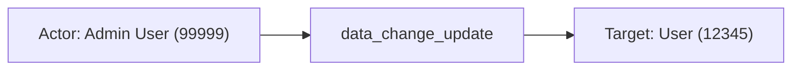
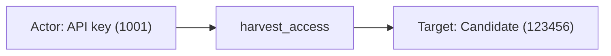
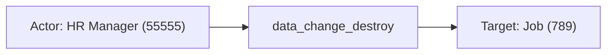

# greenhouse

## Product Domain (Greenhouse ATS/recruiting)

Greenhouse is a cloud-based Applicant Tracking System (ATS) used by organizations to manage end-to-end recruiting and hiring workflows. Teams use it to post jobs, source and track candidates, run structured interview processes, coordinate offers, and report on hiring pipeline metrics. The platform is delivered as SaaS and is structured around organizations (tenants), users with role-based permissions, jobs and job posts, candidates and applications, interview plans, scorecards, and configurable hiring workflows.

At its core, Greenhouse functions as a system of record for recruiting data—candidate profiles, application stages, interview feedback, offer details, and administrative configuration such as email templates, permissions, and integrations. Recruiters and hiring managers interact primarily through the Greenhouse Recruiting web UI, while developers and integrations access data through the Harvest API (including Harvest V3 with OAuth 2.0). The Audit Log add-on (available on Expert tier) records who accessed or changed information in Greenhouse Recruiting over a rolling 30-day window.

From a security and compliance perspective, Greenhouse audit logs capture administrative actions, data lifecycle changes, and Harvest API access. Events identify the performer (user, API key, or internal system action), the request or action taken, the affected resource, and contextual metadata such as IP address and before/after values for data changes. Security teams monitor Greenhouse to detect unauthorized configuration changes, sensitive recruiting data access, API abuse, and privileged user activity.

The Elastic Greenhouse integration ingests audit logs via Elastic Agent using a CEL input that polls the Greenhouse Audit Log API with Harvest V3 OAuth Client Credentials authentication. Collection is interval-based with optional filters for performer IDs and event types, rate-limit handling, and ECS normalization for SIEM correlation, identity monitoring, and audit trail analysis.

## Data Collected (brief)

- **Audit logs** (`greenhouse.audit`): Security and compliance events from the Greenhouse Audit Log API, retained by Greenhouse for up to 30 days.
- **Event types**: `action` (general Recruiting actions), `data_change_create`, `data_change_update`, `data_change_destroy` (resource lifecycle changes with before/after metadata), and `harvest_access` (Harvest API data access).
- **Performer details**: User ID, name, email, performer type (`user`, `api_key`, `greenhouse_internal`), source IP, and API key type when applicable.
- **Request and target context**: Request ID and action type (Recruiting action name or Harvest API URL), target resource ID and type, organization ID, and event timestamp mapped to ECS fields (`user.*`, `organization.id`, `source.ip`, `event.*`).

## Expected Audit Log Entities

The Greenhouse integration exposes a single true audit stream — **`greenhouse.audit`** — polling the Greenhouse Audit Log API (Expert tier add-on). There are no metrics, inventory, or audit-adjacent detection streams. Events record a **performer** (Recruiting UI user, Harvest API key, or internal Greenhouse automation), an **event action** (Greenhouse event type and/or Recruiting action name / Harvest API path), and an **event target** (resource changed or accessed). **`event.action` is populated on all fixtures** — copied from `greenhouse.audit.event.type` (`action`, `data_change_create`, `data_change_update`, `data_change_destroy`, `harvest_access`); the more granular operation name remains vendor-only in `greenhouse.audit.request.type`. **No ECS `user.target.*`, `host.target.*`, `service.target.*`, or `entity.target.*` fields are populated** (`dev/target-fields-audit/out/target_fields_audit.csv` — no rows for this package). **No `destination.user.*` or `destination.host.*` de-facto targets** (`destination_identity_hits.csv` — not listed). The target-fields audit classifies this package as **`moderate_candidate`** with **`fixture_strong=true`** and no pipeline destination-identity or official ECS target mapping (`dev/target-fields-audit/out/target_enhancement_packages.csv`). Vendor target identity remains under `greenhouse.audit.event.*`. Evidence: `packages/greenhouse/data_stream/audit/sample_event.json`, `data_stream/audit/_dev/test/pipeline/test-audit-events.json-expected.json` (5 fixtures), `data_stream/audit/elasticsearch/ingest_pipeline/default.yml`, and `data_stream/audit/fields/fields.yml`.

### Event action (semantic)

| Action (normalized label) | Classification | Confidence | Evidence | Per-stream notes |
| --- | --- | --- | --- | --- |
| `action` | administration | high | `sample_event.json`, expected fixture 0: `event.action: "action"`; `request.type: "email_settings#create_organization_email"` | **`greenhouse.audit`** — general Recruiting UI action; coarse event-type label |
| `data_change_create` | configuration_change | high | Expected fixture 1: `event.action: "data_change_create"`; `request.type: "email_settings#create_organization_email"` | Resource creation with before/after in `event.meta` |
| `data_change_update` | configuration_change | high | Expected fixture 2: `event.action: "data_change_update"`; `request.type: "users#update"` | Role change on target User `12345` |
| `harvest_access` | data_access | high | Expected fixture 3: `event.action: "harvest_access"`; `request.type: "/v1/candidates/123456"` | Harvest API data read by API key performer |
| `data_change_destroy` | configuration_change | high | Expected fixture 4: `event.action: "data_change_destroy"`; `request.type: "jobs#destroy"` | Job deletion |
| `email_settings#create_organization_email` | configuration_change | high | `request.type` in fixtures 0–1 | Granular Recruiting action — vendor-only, not mapped to `event.action` |
| `users#update` | administration | high | `request.type` in fixture 2 | Granular Recruiting action — vendor-only |
| `jobs#destroy` | configuration_change | high | `request.type` in fixture 4 | Granular Recruiting action — vendor-only |
| `/v1/candidates/123456` | api_call | high | `request.type` in fixture 3 | Harvest API endpoint path — vendor-only |

Greenhouse uses a two-level action model: **`event.type`** (audit event class) maps to ECS **`event.action`**, while **`request.type`** (Recruiting controller action or Harvest URL) carries the specific operation but stays under `greenhouse.audit.request.type`. Pipeline also derives **`event.type`** (`creation`, `change`, `deletion`, `access`, `info`) and **`event.category`** (`configuration`, `iam`) from the same vendor event type — complementary to but distinct from `event.action`.

### Event action (ECS candidates)

| ECS / vendor field | Mapped to `event.action` today? | Mapping correct? | Recommended `event.action` value (from fixtures) | Enhancement candidate? | Evidence |
| --- | --- | --- | --- | --- | --- |
| `greenhouse.audit.event.type` → `event.action` | yes | partial | `action`, `data_change_create`, `data_change_update`, `data_change_destroy`, `harvest_access` | no | Pipeline `default.yml` L62–65: `set` with `copy_from`; all 5 fixtures and `sample_event.json` |
| `greenhouse.audit.request.type` | no | n/a | `email_settings#create_organization_email`, `users#update`, `jobs#destroy`, `/v1/candidates/123456` | **yes** | Retained vendor-only (`fields.yml` L15–18); granular Recruiting action or Harvest API path — stronger per-event verb than `event.type` |
| `event.type` | no | n/a | `creation`, `change`, `deletion`, `access`, `info` | no | Derived from `event.type` vendor field (`default.yml` L68–96); ECS event taxonomy, not operation name |
| `event.category` | no | n/a | `configuration`, `iam` | no | Appended from event type and performer type (`default.yml` L98–112); category, not action |

**Step 2b — per-stream check:**

| Stream | `event.action` in fixtures? | Pipeline maps to `event.action`? | Primary action candidate | Confidence | Evidence |
| --- | --- | --- | --- | --- | --- |
| `greenhouse.audit` | yes | yes | `greenhouse.audit.event.type` → `event.action` (primary); alternate granular: `greenhouse.audit.request.type` | high | `default.yml` L62–65; `sample_event.json` L24; `test-audit-events.json-expected.json` (all 5 events) |

### Actor (semantic)

| Entity | Classification | Entity type (if general) | Confidence | Evidence | Per-stream notes |
| --- | --- | --- | --- | --- | --- |
| Recruiting UI user | user | — | high | `greenhouse.audit.performer.type: "user"` in 4 fixtures and `sample_event.json`. Pipeline maps `performer.id` → `user.id`, `performer.meta.username` → `user.email`, `performer.meta.name` → `user.full_name`; `event.category` includes `iam`. Examples: `12345` (Allison Jamie), `99999` (Admin User), `55555` (HR Manager). | **`greenhouse.audit`** — human performer for Recruiting actions and data changes |
| Harvest API key | service | api_key | high | `performer.type: "api_key"` in 1 fixture (`harvest_access`). `performer.id` → `user.id` (`1001`); `performer.meta.api_key_type: "harvest"` retained vendor-side. No email or full name; `event.category` is `configuration` only. | Integration principal, not a human account — mapped to ECS `user.id` |
| Greenhouse internal automation | service | internal_automation | low | Documented in `fields.yml` as `performer.type: "greenhouse_internal"`; not observed in fixtures or `sample_event.json`. | Expected for platform-initiated changes when present in production |

### Actor (ECS candidates)

| ECS / vendor field | Role | Mapped today? | Mapping correct? | Confidence | Evidence |
| --- | --- | --- | --- | --- | --- |
| `user.id` | Performer identifier (user or API key) | yes | partial | high | ← `greenhouse.audit.performer.id` convert (`default.yml:115–119`); fixtures for all performer types. **Partial** for `api_key` performers — ECS `user.id` holds API key ID, not a human user |
| `user.email` | Performer email | yes | yes | high | ← `greenhouse.audit.performer.meta.username` (`default.yml:120–123`); populated for `user` performers only |
| `user.full_name` | Performer display name | yes | yes | high | ← `greenhouse.audit.performer.meta.name` (`default.yml:124–127`); populated for `user` performers only |
| `source.ip` | Performer network origin | yes | yes | high | ← `greenhouse.audit.performer.ip_address` convert + geo/ASN enrichment (`default.yml:129–165`); network context, not a separate actor entity |
| `related.user` | Performer cross-reference | yes | partial | high | Appends `user.id` and `user.email` (`default.yml:191–200`); performer only — does not include target user on `users#update` |
| `related.ip` | Performer IP cross-reference | yes | yes | high | ← `source.ip` append (`default.yml:201–205`) |
| `greenhouse.audit.performer.type` | Performer class | yes (vendor) | n/a | high | Retained after pipeline removes duplicate performer id/meta; distinguishes `user`, `api_key`, `greenhouse_internal` |
| `greenhouse.audit.performer.meta.api_key_type` | API key flavor | yes (vendor) | n/a | high | Retained for `api_key` performers (`harvest` in fixture); canonical integration identity detail |
| `organization.id` | Tenant scope | yes | n/a | high | ← `greenhouse.audit.organization_id` convert (`default.yml:167–177`); organization boundary, not actor |

### Target (semantic)

| Layer | Description | Entity | Classification | Entity type (if general) | Confidence | Evidence | Per-stream notes |
| --- | --- | --- | --- | --- | --- | --- | --- |
| 1 — Platform / cloud service | Greenhouse ATS SaaS platform | Greenhouse Recruiting / Harvest API | service | — | medium | Integration context (`event.module: greenhouse`, API host `auditlog.us.greenhouse.io` in manifest); no `cloud.service.name` or `cloud.provider` pipeline mapping. | Implicit Layer 1 — platform not explicitly ECS-mapped |
| 2 — Resource / object | Organization email setting | OrganizationEmail | general | organization_email | high | `greenhouse.audit.event.target_type: "OrganizationEmail"`, `target_id: "1234"` on `data_change_create` (`email_settings#create_organization_email`). | `data_change_create` |
| 2 — Resource / object | Recruiting user account | User | user | — | high | `target_type: "User"`, `target_id: "12345"` on `data_change_update` (`users#update`). Actor (`99999`, Admin User) differs from target user (`12345`). | Role change target — not promoted to ECS `user.target.*` |
| 2 — Resource / object | Candidate record | Candidate | general | candidate | high | `target_type: "Candidate"`, `target_id: "123456"` on `harvest_access`; `request.type: "/v1/candidates/123456"`. | Harvest API data access |
| 2 — Resource / object | Job posting | Job | general | job | high | `target_type: "Job"`, `target_id: "789"` on `data_change_destroy` (`jobs#destroy`). | Job deletion |
| 2 — Resource / object | Action label (no resource ID) | Global Email Added | general | action_label | high | `target_type: "Global Email Added"` on `action` event with no `target_id`; `request.type: "email_settings#create_organization_email"`. Per `fields.yml`, non–data-change `target_type` may be a display label rather than a resource class. | `action` events may omit `target_id` |
| 3 — Content / artifact | Before/after field values | Data change delta | general | field_delta | high | `greenhouse.audit.event.meta` flattened — e.g. `role: ["Basic", "Site Admin"]`, `value: ["johnny.c@omniva-corp.com"]`, `name: ["Software Engineer"]`. | `data_change_*` events only |
| 3 — Content / artifact | Request / action identifier | Recruiting action or Harvest URL | general | api_request | high | `greenhouse.audit.request.type` — Recruiting action name (`users#update`, `jobs#destroy`, `email_settings#create_organization_email`) or Harvest API path (`/v1/candidates/123456`). `event.id` ← `request.id`. | Describes what was invoked or changed |

### Target (ECS candidates)

| ECS / vendor field | Layer | Classification | Mapped today? | Mapping correct? | ECS target bucket | Enhancement candidate? | Evidence |
| --- | --- | --- | --- | --- | --- | --- | --- |
| `greenhouse.audit.event.target_type` | 2 | varies | yes (vendor) | n/a | `entity.target.type` / type-specific `*.target.*` | **yes** | Canonical resource class or action label; `User`, `Candidate`, `Job`, `OrganizationEmail`, display labels on `action` events. `fields.yml:66–69` |
| `greenhouse.audit.event.target_id` | 2 | varies | yes (vendor) | n/a | `entity.target.id` / `user.target.id` (when `target_type: User`) | **yes** | ← API integer converted to string (`default.yml:179–188`); absent on some `action` events |
| `greenhouse.audit.event.meta` | 3 | general (field_delta) | yes (vendor) | n/a | context | no | Before/after values for `data_change_*`; recruiting field deltas |
| `greenhouse.audit.request.type` | 3 | general (api_request) | yes (vendor) | n/a | context | **yes** (as `event.action`) | Recruiting action name or Harvest API path; granular operation verb — enhancement candidate for `event.action` |
| `event.id` | 3 | general (request_id) | yes | yes | context | no | ← `greenhouse.audit.request.id` (`default.yml:58–61`); request correlation ID |
| `organization.id` | — | general (organization) | yes | n/a | context-only | no | Tenant scope (`default.yml:167–177`); not the acted-upon resource |
| `cloud.service.name` | 1 | service | no | n/a | `service.target.name` | **yes** | Greenhouse ATS platform not mapped; SaaS integration with no static `cloud.service.name` set in pipeline |

### Gaps and mapping notes

- **`event.action` is coarse, not granular:** Pipeline maps `greenhouse.audit.event.type` → `event.action` (`default.yml` L62–65) — correct for audit event class (`data_change_update`, `harvest_access`) but omits the specific Recruiting action or Harvest URL in `greenhouse.audit.request.type` (`users#update`, `/v1/candidates/123456`). Enhancement: copy or concatenate `request.type` into `event.action` (or a dedicated ECS field) for SIEM rule precision.
- **No official ECS target fields:** Aligns with `target_enhancement_packages.csv` (`moderate_candidate`, all ECS target tiers false). Primary enhancement path: promote `greenhouse.audit.event.target_type` + `target_id` to `entity.target.*` and type-specific buckets (`user.target.id` when `target_type: User`, etc.).
- **No de-facto `destination.*` targets:** Unlike email/auth integrations, this package does not use `destination.user.*` or `destination.host.*`; target identity is vendor-only under `greenhouse.audit.event.*`.
- **Actor/target separation on user updates:** `users#update` fixture maps performer Admin User (`99999`) to ECS `user.*` while the affected User (`12345`) remains only in `greenhouse.audit.event.target_id` — correct performer mapping, but target user lacks ECS promotion.
- **API key performers use actor field set:** `performer.type: api_key` maps to `user.id` without email/name (`default.yml:115–127`). Semantically a **service** actor stored in ECS `user.*` — **`Mapping correct? partial`**; consider `service.id` or dedicated vendor normalization.
- **`related.user` includes performer only:** Target user IDs (e.g. `12345` on `users#update`) are not appended to `related.user` — limits cross-entity correlation without querying vendor fields.
- **Performer fields removed post-mapping:** Pipeline removes `greenhouse.audit.performer.id`, `.ip_address`, and performer meta name/username after ECS copy (`default.yml:235–244`) unless `preserve_duplicate_custom_fields` tag is set — vendor actor detail partially stripped.
- **`target_type` semantics vary by event type:** For `data_change_*` and `harvest_access`, `target_type` is a resource class name; for `action` events it may be a human-readable label (`Global Email Added`) with no `target_id` — affects how Layer 2 targets should map to ECS.
- **Additional production resource types expected:** Applications, scorecards, interview plans, and other Greenhouse objects are documented in the Audit Log API but not represented in current fixtures.
- **Alignment with target-fields audit:** `moderate_candidate` with `fixture_strong=true` matches evidence — clear vendor target fields (`greenhouse.audit.event.target_id`, `target_type`) in pipeline and fixtures, zero official `*.target.*` or `destination.*` identity mapping.

### Per-stream notes

- **`greenhouse.audit`:** Single audit stream covering `action`, `data_change_create`, `data_change_update`, `data_change_destroy`, and `harvest_access` event types. **`event.action`** populated from vendor `event.type`; granular operation in **`greenhouse.audit.request.type`**. Performer always maps to ECS `user.*` (human or API key); targets stay vendor-namespaced. `source.ip` with optional geo/ASN enrichment describes performer origin. No metrics or inventory streams — all events are audit trail records with `event.kind: event`.

## Example Event Graph

Examples below come from the single **`greenhouse.audit`** stream — true audit logs from the Greenhouse Audit Log API (Expert tier add-on), covering Recruiting UI actions, data lifecycle changes, and Harvest API access.

### Example 1: Admin updates user role

**Stream:** `greenhouse.audit` · **Fixture:** `packages/greenhouse/data_stream/audit/_dev/test/pipeline/test-audit-events.json-expected.json` (fixture 2)

```
Admin User (99999) → data_change_update → User (12345)
```

#### Actor

| Field | Value |
| --- | --- |
| id | 99999 |
| name | Admin User |
| type | user |
| ip | 10.0.0.50 |

**Field sources:**

- `id` ← `user.id`
- `name` ← `user.full_name`
- `ip` ← `source.ip`

#### Event action

| Field | Value |
| --- | --- |
| action | data_change_update |
| source_field | `event.action` |
| source_value | `data_change_update` |

Granular Recruiting operation `users#update` is retained in `greenhouse.audit.request.type` but not mapped to `event.action`.

#### Target

| Field | Value |
| --- | --- |
| id | 12345 |
| type | user |

**Field sources:**

- `id` ← `greenhouse.audit.event.target_id`
- `type` ← `greenhouse.audit.event.target_type` (`User`)

Target user is not promoted to ECS `user.target.*`; performer (`99999`) and target (`12345`) are distinct.

#### Mermaid



### Example 2: Harvest API key accesses candidate record

**Stream:** `greenhouse.audit` · **Fixture:** `packages/greenhouse/data_stream/audit/_dev/test/pipeline/test-audit-events.json-expected.json` (fixture 3)

```
API key (1001) → harvest_access → Candidate (123456)
```

#### Actor

| Field | Value |
| --- | --- |
| id | 1001 |
| type | service |
| sub_type | api_key |
| geo | Madrid, Spain |
| ip | 203.0.113.42 |

**Field sources:**

- `id` ← `user.id` (API key performer mapped to ECS `user.id`)
- `sub_type` ← `greenhouse.audit.performer.type` (`api_key`); `greenhouse.audit.performer.meta.api_key_type: harvest`
- `geo` ← `source.geo.city_name`, `source.geo.country_name`
- `ip` ← `source.ip`

#### Event action

| Field | Value |
| --- | --- |
| action | harvest_access |
| source_field | `event.action` |
| source_value | `harvest_access` |

Harvest API path `/v1/candidates/123456` is in `greenhouse.audit.request.type` but not mapped to `event.action`.

#### Target

| Field | Value |
| --- | --- |
| id | 123456 |
| type | general |
| sub_type | candidate |

**Field sources:**

- `id` ← `greenhouse.audit.event.target_id`
- `sub_type` ← `greenhouse.audit.event.target_type` (`Candidate`)

#### Mermaid



### Example 3: HR Manager deletes job posting

**Stream:** `greenhouse.audit` · **Fixture:** `packages/greenhouse/data_stream/audit/_dev/test/pipeline/test-audit-events.json-expected.json` (fixture 4)

```
HR Manager (55555) → data_change_destroy → Job (789)
```

#### Actor

| Field | Value |
| --- | --- |
| id | 55555 |
| name | HR Manager |
| type | user |
| ip | 172.16.0.100 |

**Field sources:**

- `id` ← `user.id`
- `name` ← `user.full_name`
- `ip` ← `source.ip`

#### Event action

| Field | Value |
| --- | --- |
| action | data_change_destroy |
| source_field | `event.action` |
| source_value | `data_change_destroy` |

Granular Recruiting operation `jobs#destroy` is in `greenhouse.audit.request.type` but not mapped to `event.action`.

#### Target

| Field | Value |
| --- | --- |
| id | 789 |
| name | Software Engineer |
| type | general |
| sub_type | job |

**Field sources:**

- `id` ← `greenhouse.audit.event.target_id`
- `name` ← `greenhouse.audit.event.meta.name` (deleted job title from before/after delta)
- `sub_type` ← `greenhouse.audit.event.target_type` (`Job`)

#### Mermaid



## ES|QL Entity Extraction

**Package type: agent-backed** (policy template `greenhouse`, single `data_stream/audit` with Tier A fixtures and ingest pipeline). Query-time extraction routes on **`data_stream.dataset == "greenhouse.audit"`** only. Pass 4 is **fill-gaps-only**: detection flags are query-time helpers; mapped columns use **column-level** `CASE(<col> IS NOT NULL, <col>, …)` or valid **5-arg** / **7-arg** forms — never **4-arg** `CASE(<col> IS NOT NULL, <col>, bare_field, null)` (bare field parses as a **condition**, not a fallback). Performer maps to actor `user.*` at ingest (human and API key); targets remain vendor-only under `greenhouse.audit.event.*` until promoted to `user.target.*` / `entity.target.*` in fallback branches. API key performers are semantically **service** actors (Pass 3) but ingest stores the key ID in `user.id` — `service.id` / `entity.type` actor normalization is documented in Gaps because `user.id` satisfies `actor_exists`.

### Dataset inventory

| data_stream.dataset | Stream role | Actor classification(s) | Target classification(s) | Extraction |
| --- | --- | --- | --- | --- |
| `greenhouse.audit` | audit (Recruiting + Harvest API) | user / service (api_key) | user / general (resource by `target_type`) | full |

### Field mapping plan

#### Actor mappings

| Output column | Source field(s) | Condition (dataset + optional) | Confidence | Notes |
| --- | --- | --- | --- | --- |
| `user.id` | `greenhouse.audit.performer.id` → `user.id` | `data_stream.dataset == "greenhouse.audit"` | high | **ingest-only — no ES|QL** — pipeline `convert` to `user.id`; vendor `performer.id` not retained in Tier A fixtures |
| `user.name` | `user.full_name` | `data_stream.dataset == "greenhouse.audit" AND greenhouse.audit.performer.type == "user"` | high | **vendor fallback** — `CASE(user.name IS NOT NULL, user.name, …, user.full_name, null)`; ingest indexes display name as `user.full_name` |
| `user.email` | `performer.meta.username` → `user.email` | `data_stream.dataset == "greenhouse.audit" AND greenhouse.audit.performer.type == "user"` | high | **ingest-only — no ES|QL** — pipeline `set` from `performer.meta.username`; no query-time vendor path in fixtures |
| `host.ip` | `source.ip` | `host.ip IS NOT NULL` → preserve; else `data_stream.dataset == "greenhouse.audit" AND source.ip IS NOT NULL` | high | **vendor fallback** — performer origin; `host.ip` not set at ingest; do not gate on `actor_exists` (`source.ip` satisfies `actor_exists` while `host.ip` is empty) |

#### Target mappings

| Output column | Source field(s) | Condition (dataset + optional) | Confidence | Notes |
| --- | --- | --- | --- | --- |
| `user.target.id` | `greenhouse.audit.event.target_id` | `data_stream.dataset == "greenhouse.audit" AND greenhouse.audit.event.target_type == "User"` | high | **vendor fallback** — fixture 2: `12345` on `users#update`; actor `99999` unchanged |
| `entity.target.id` | `greenhouse.audit.event.target_id` | `data_stream.dataset == "greenhouse.audit" AND greenhouse.audit.event.target_id IS NOT NULL AND greenhouse.audit.event.target_type != "User"` | high | **vendor fallback** — Candidate, Job, OrganizationEmail |
| `entity.target.type` | `greenhouse.audit.event.target_type` | `data_stream.dataset == "greenhouse.audit" AND greenhouse.audit.event.target_type IS NOT NULL` | high | **vendor fallback** — resource class or action display label |
| `entity.target.name` | `greenhouse.audit.event.meta.name`, `greenhouse.audit.event.target_type` | `meta.name` present, or `target_id` null with `target_type` set | medium | **vendor fallback** — job title delta; label-only `action` events |
| `entity.target.sub_type` | literals from `target_type` | `Candidate`, `Job`, `OrganizationEmail` | high | **semantic literal** in fallback — normalized sub_type |

**Omitted (Gaps):** `user.target.name` (no `meta.name` on User fixture — role in `meta.role` only); `service.target.name` (platform not indexed); `service.id` / `entity.type` for `api_key` (blocked when `user.id` satisfies `actor_exists`).

### Detection flags (mandatory — run first)

```esql
| EVAL
  actor_exists = user.id IS NOT NULL OR user.email IS NOT NULL OR user.full_name IS NOT NULL
    OR host.ip IS NOT NULL,
  target_exists = user.target.id IS NOT NULL OR user.target.name IS NOT NULL OR user.target.email IS NOT NULL
    OR host.target.id IS NOT NULL OR host.target.ip IS NOT NULL OR host.target.name IS NOT NULL
    OR service.target.id IS NOT NULL OR service.target.name IS NOT NULL
    OR entity.target.id IS NOT NULL OR entity.target.name IS NOT NULL OR entity.target.type IS NOT NULL,
  action_exists = event.action IS NOT NULL
```

**Semantics:** `actor_exists` includes `user.full_name` (ingest display name) rather than `user.name`; it does **not** include `source.ip` (performer network origin is mapped to `host.ip` separately). Mapped columns use column-level preserve (`<col> IS NOT NULL` or `target_exists` / `action_exists` only where the flag matches the column). Ingest-only `user.id` / `user.email` have no ES|QL block. No ECS `*.target.*` at ingest today — `target_exists` is false on all Tier A fixtures; vendor fallbacks apply.

### Optional classification helpers (when needed)

`entity.target.sub_type` is set in the **target** `EVAL` fallback branch only (never `target.entity.type`).

### Combined ES|QL — actor fields

`user.id` and `user.email` omitted — ingest always populates them from `performer.id` / `performer.meta.username` with no alternate indexed vendor path (rule #10).

**ES|QL `CASE` arity:** Arguments are **(condition, value)** pairs; odd count → last arg is default. Wrong: `CASE(user.name IS NOT NULL, user.name, user.full_name, null)` (4 args — `user.full_name` is a **condition**). Right: **5-arg** `CASE(user.name IS NOT NULL, user.name, data_stream.dataset == "greenhouse.audit" AND …, user.full_name, null)` or **3-arg** when `WHERE` scopes the stream. Do not use `CASE(actor_exists, host.ip, source.ip, null)` — `actor_exists` is true from `user.id` / `user.full_name` while `host.ip` is still empty.

```esql
| EVAL
  user.name = CASE(
    user.name IS NOT NULL, user.name,
    data_stream.dataset == "greenhouse.audit" AND greenhouse.audit.performer.type == "user", user.full_name,
    null
  ),
  host.ip = CASE(
    host.ip IS NOT NULL, host.ip,
    data_stream.dataset == "greenhouse.audit" AND source.ip IS NOT NULL, source.ip,
    null
  )
```

### Combined ES|QL — event action

`event.action` is populated at ingest from `greenhouse.audit.event.type` on all fixtures; fallback covers missing values only.

```esql
| EVAL
  event.action = CASE(
    event.action IS NOT NULL, event.action,
    data_stream.dataset == "greenhouse.audit" AND greenhouse.audit.event.type IS NOT NULL, greenhouse.audit.event.type,
    null
  )
```

Granular `greenhouse.audit.request.type` (`users#update`, `/v1/candidates/123456`) is an ingest enhancement candidate (Pass 2) — not wired here to avoid overriding coarse `event.action` when present.

### Combined ES|QL — target fields

```esql
| EVAL
  user.target.id = CASE(
    user.target.id IS NOT NULL, user.target.id,
    data_stream.dataset == "greenhouse.audit" AND greenhouse.audit.event.target_type == "User", greenhouse.audit.event.target_id,
    null
  ),
  entity.target.id = CASE(
    entity.target.id IS NOT NULL, entity.target.id,
    data_stream.dataset == "greenhouse.audit" AND greenhouse.audit.event.target_id IS NOT NULL AND greenhouse.audit.event.target_type != "User", greenhouse.audit.event.target_id,
    null
  ),
  entity.target.type = CASE(
    entity.target.type IS NOT NULL, entity.target.type,
    data_stream.dataset == "greenhouse.audit" AND greenhouse.audit.event.target_type IS NOT NULL, greenhouse.audit.event.target_type,
    null
  ),
  entity.target.name = CASE(
    entity.target.name IS NOT NULL, entity.target.name,
    data_stream.dataset == "greenhouse.audit" AND greenhouse.audit.event.meta.name IS NOT NULL, TO_STRING(greenhouse.audit.event.meta.name),
    data_stream.dataset == "greenhouse.audit" AND greenhouse.audit.event.target_type IS NOT NULL AND greenhouse.audit.event.target_id IS NULL, greenhouse.audit.event.target_type,
    null
  ),
  entity.target.sub_type = CASE(
    entity.target.sub_type IS NOT NULL, entity.target.sub_type,
    data_stream.dataset == "greenhouse.audit" AND greenhouse.audit.event.target_type == "Candidate", "candidate",
    data_stream.dataset == "greenhouse.audit" AND greenhouse.audit.event.target_type == "Job", "job",
    data_stream.dataset == "greenhouse.audit" AND greenhouse.audit.event.target_type == "OrganizationEmail", "organization_email",
    null
  )
```

### Full pipeline fragment (optional)

```esql
FROM logs-*
| EVAL
  actor_exists = user.id IS NOT NULL OR user.email IS NOT NULL OR user.full_name IS NOT NULL OR host.ip IS NOT NULL,
  target_exists = user.target.id IS NOT NULL OR user.target.name IS NOT NULL OR user.target.email IS NOT NULL
    OR host.target.id IS NOT NULL OR host.target.ip IS NOT NULL OR host.target.name IS NOT NULL
    OR service.target.id IS NOT NULL OR service.target.name IS NOT NULL
    OR entity.target.id IS NOT NULL OR entity.target.name IS NOT NULL OR entity.target.type IS NOT NULL,
  action_exists = event.action IS NOT NULL
| EVAL
  user.name = CASE(user.name IS NOT NULL, user.name, data_stream.dataset == "greenhouse.audit" AND greenhouse.audit.performer.type == "user", user.full_name, null),
  host.ip = CASE(host.ip IS NOT NULL, host.ip, data_stream.dataset == "greenhouse.audit" AND source.ip IS NOT NULL, source.ip, null)
| EVAL
  event.action = CASE(event.action IS NOT NULL, event.action, data_stream.dataset == "greenhouse.audit" AND greenhouse.audit.event.type IS NOT NULL, greenhouse.audit.event.type, null)
| EVAL
  user.target.id = CASE(user.target.id IS NOT NULL, user.target.id, data_stream.dataset == "greenhouse.audit" AND greenhouse.audit.event.target_type == "User", greenhouse.audit.event.target_id, null),
  entity.target.id = CASE(entity.target.id IS NOT NULL, entity.target.id, data_stream.dataset == "greenhouse.audit" AND greenhouse.audit.event.target_id IS NOT NULL AND greenhouse.audit.event.target_type != "User", greenhouse.audit.event.target_id, null),
  entity.target.type = CASE(entity.target.type IS NOT NULL, entity.target.type, data_stream.dataset == "greenhouse.audit" AND greenhouse.audit.event.target_type IS NOT NULL, greenhouse.audit.event.target_type, null),
  entity.target.name = CASE(entity.target.name IS NOT NULL, entity.target.name, data_stream.dataset == "greenhouse.audit" AND greenhouse.audit.event.meta.name IS NOT NULL, TO_STRING(greenhouse.audit.event.meta.name), data_stream.dataset == "greenhouse.audit" AND greenhouse.audit.event.target_type IS NOT NULL AND greenhouse.audit.event.target_id IS NULL, greenhouse.audit.event.target_type, null),
  entity.target.sub_type = CASE(entity.target.sub_type IS NOT NULL, entity.target.sub_type, data_stream.dataset == "greenhouse.audit" AND greenhouse.audit.event.target_type == "Candidate", "candidate", data_stream.dataset == "greenhouse.audit" AND greenhouse.audit.event.target_type == "Job", "job", data_stream.dataset == "greenhouse.audit" AND greenhouse.audit.event.target_type == "OrganizationEmail", "organization_email", null)
| KEEP @timestamp, data_stream.dataset, event.action, user.id, user.name, host.ip, user.target.id, entity.target.id, entity.target.type, entity.target.name, entity.target.sub_type
```

### Streams excluded

None — single audit stream only; no metrics or inventory datasets in this integration.

### Gaps and limitations

- **`user.id` / `user.email` ingest-only:** No ES|QL `CASE` — fallback would repeat the output column (`user.id` / `user.email`); `greenhouse.audit.performer.id` is not retained after pipeline `convert` in Tier A fixtures.
- **API key → `service.id` / `entity.type`:** Ingest maps `api_key` performer to `user.id`; `actor_exists` is true, so preserve-first blocks query-time `service.id` / `entity.type` normalization — align with Pass 2 partial mapping; prefer ingest fix.
- **`service.target.name` omitted:** Greenhouse ATS platform not indexed as `cloud.service.name`; literal `"Greenhouse"` is low-confidence semantic only.
- **`user.target.name` omitted:** `users#update` fixture has `meta.role` delta, not `meta.name` — no defensible User target display name in Tier A fixtures.
- **`action` events without `target_id`:** `target_type` may be a display label (`Global Email Added`) — `entity.target.name` falls back to `target_type` when ID absent.
- **`greenhouse.audit.request.type` not mapped to `event.action`:** Granular verb stays vendor-only unless ingest enhancement lands (Pass 2 **yes**).
- **`greenhouse_internal` performer type:** Documented in `fields.yml` but not in fixtures — `performer.type` guards may omit until production evidence.
- **`entity.target.name` from meta arrays:** `meta.name` may be multivalue before/after delta — `TO_STRING` coerces for display; ingest normalization preferred.
- **Pass 2 enhancement alignment:** Promoting `target_type` + `target_id` to `*.target.*` at ingest remains preferred; this block is query-time fill-gaps only.
- **Pass 4 CASE syntax:** `user.name` / `host.ip` / `event.action` use column-level preserve (`<col> IS NOT NULL`); `host.ip` never gates on `actor_exists` (fixtures set `source.ip` without `host.ip`). Target columns use column-level preserve, not `CASE(target_exists, col, …)` alone. Pipeline fragment uses valid **3-arg** / **5-arg** forms scoped by `WHERE data_stream.dataset == "greenhouse.audit"`. No **4-arg** `CASE(col IS NOT NULL, col, bare_field, null)`.
