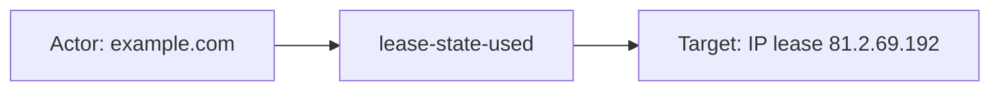
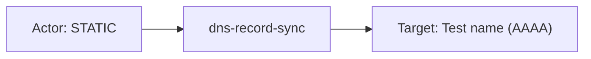

# infoblox_bloxone_ddi

## Product Domain

Infoblox BloxOne DDI is Infoblox's cloud-native platform for DNS, DHCP, and IP address management (DDI)—the core network services that underpin all IP-based communication. BloxOne DDI centralizes authoritative DNS zones and resource records, DHCP lease lifecycle, and IPAM inventory in the Infoblox Cloud Services Portal (CSP), while on-premises BloxOne DDI Hosts can serve DNS protocol traffic at the edge. Organizations use it to automate address assignment, maintain accurate DNS authority, enforce consistent naming and zone policy, and gain visibility into how clients obtain and use IP addresses across hybrid and multi-site environments.

The platform spans three tightly coupled domains. **DNS Data** holds authoritative zone content—A/AAAA, CNAME, MX, TXT, and other record types with TTL, inheritance, and view/zone metadata. **DNS Config** defines resolver and zone-serving policy: recursion, forwarders, DNSSEC validation, EDNS/ECS behavior, ACLs for query/update/transfer, and cache TTL limits. **DHCP Lease** tracks active and historical leases—assigned addresses, MAC and client identifiers, hostname, lease state and lifetime, fingerprinting, and IPAM space linkage. Together these datasets form the operational and security-relevant audit trail for DDI infrastructure: what names resolve, how DNS is configured, and which hosts hold which addresses.

Security and network teams monitor BloxOne DDI to detect unauthorized DNS changes, track IP-to-host mappings for incident response, correlate DHCP activity with asset inventory, and validate that DNS/DHCP policy matches organizational standards. Because DNS and DHCP are high-value targets for lateral movement, persistence, and reconnaissance, visibility into BloxOne DDI state complements broader SIEM, NDR, and endpoint telemetry. The Elastic integration polls BloxOne DDI REST APIs (v1) from Elastic Agent and surfaces the data in ECS-aligned logs with bundled Kibana dashboards.

## Data Collected (brief)

Logs only (no metrics). Elastic Agent **httpjson** input polls the Infoblox Cloud Services Portal (`https://csp.infoblox.com` by default) with an API key. Three data streams:

| Data stream | Description |
|---|---|
| **dns_data** | Authoritative DNS resource records—zone/view, record type, RDATA (addresses, CNAME, MX, etc.), TTL, inheritance, disabled state, and timestamps |
| **dns_config** | DNS view/resolver configuration—recursion, forwarders, DNSSEC, ECS/EDNS, ACLs (query, recursion, transfer, update), cache TTLs, and zone authority SOA fields |
| **dhcp_lease** | DHCP lease events—assigned IP, MAC/hardware address, client ID, hostname, lease start/end, state, protocol (IPv4/IPv6), fingerprint, HA group, and IPAM space |

Events are mapped to ECS (`dns.*`, `host.*`, `client.*`, `network.*`, `event.*`, `related.*`) with full vendor detail under `infoblox_bloxone_ddi.*`. Collection is poll-based with configurable interval and initial lookback (default 24h / 1m).

## Expected Audit Log Entities

This integration does **not** ingest Infoblox CSP audit or admin-activity logs. All three data streams (`dns_data`, `dns_config`, `dhcp_lease`) poll BloxOne DDI REST API inventory endpoints via **httpjson** and emit periodic state snapshots—authoritative DNS records, DNS view/resolver configuration, and active DHCP leases. Events describe **what exists** in DDI at poll time, not **who changed it**. Actor/target semantics below are **inventory-oriented** and audit-adjacent; pair with a separate CSP audit source for audit-grade identity. No ECS `user.target.*`, `host.target.*`, `service.target.*`, or `entity.target.*` fields are populated (`dev/target-fields-audit/out/target_fields_audit.csv` has no `infoblox_bloxone_ddi` row). The package does not appear in `dev/target-fields-audit/out/destination_identity_hits.csv` (no `destination.user.*` / `destination.host.*` pipeline usage). Target-fields audit classified this package as **`moderate_candidate`** (`dev/target-fields-audit/out/target_enhancement_packages.csv`: `fixture_strong=true`, no pipeline actor/target/destination identity heuristics).

**`event.action` is absent in all streams** — no fixture populates it and no ingest pipeline maps to it. Pipelines statically set `event.category: [network]` and `event.type: [protocol]` on every stream; those are classification metadata, not operation verbs. Vendor fields named `action` (inheritance blocks) and `state`/`type` (DHCP lease) describe configuration inheritance or inventory state, not auditable operations.

**Event action (Step 2b per stream):**

| Stream | `event.action` in fixtures? | Pipeline maps to `event.action`? | Primary action candidate | Confidence | Evidence |
| --- | --- | --- | --- | --- | --- |
| **dns_data** | no | no | n/a — no per-event action (DNS record inventory sync) | high | Static `event.category: [network]`, `event.type: [protocol]` only (`dns_data/.../default.yml` L8–15); no vendor operation/action field on record objects |
| **dns_config** | no | no | n/a — no per-event action (DNS view config inventory sync) | high | Same static ECS event fields (`dns_config/.../default.yml` L8–15); view objects synced, not mutated in-event |
| **dhcp_lease** | no | no | n/a — no per-event action (DHCP lease inventory sync) | high | Static `event.category`/`event.type` (`dhcp_lease/.../default.yml` L8–15); `state`/`type` vendor fields describe lease snapshot, not DHCP transaction verbs |

### Event action (semantic)

| Action (normalized label) | Classification | Confidence | Evidence | Per-stream notes |
| --- | --- | --- | --- | --- |
| (no per-event action) | inventory | high | Static `event.kind: event`, `event.category: [network]`, `event.type: [protocol]` on all streams | **dns_data**, **dns_config**, **dhcp_lease** — poll-based state sync; no logged create/update/delete verb |
| `inherit` / `override` (inheritance metadata) | configuration_change | low | `infoblox_bloxone_ddi.dns_data.inheritance.sources.ttl.action: "inherit"` in `test-pipeline-dns-data.log-expected.json`; `infoblox_bloxone_ddi.dns_config.inheritance.sources.*.action: "inherit"` / `"override"` in `dns_config/sample_event.json` | **dns_data**, **dns_config** — per-setting inheritance mode on a config block, not an event-level operation; multiple values per document |
| `STATIC` (record source) | configuration_change | low | `infoblox_bloxone_ddi.dns_data.source: ["STATIC"]` in fixtures | **dns_data** — record creation origin enum, not a poll-time action |
| `used` (lease state) | inventory | moderate | `infoblox_bloxone_ddi.dhcp_lease.state: "used"` in `test-pipeline-dhcp-lease.log-expected.json` (event 2–3) | **dhcp_lease** — current lease lifecycle state at poll time, not a DHCP assign/renew/release event |
| `DHCPv4: DHCPv4 lease` (lease type label) | inventory | moderate | `infoblox_bloxone_ddi.dhcp_lease.type` in fixture event 2 | **dhcp_lease** — descriptive lease category string, not an operation name |

None of the vendor fields above represent a true audit verb (who performed what operation). For correlation with change detection, compare successive poll snapshots or ingest Infoblox CSP audit logs separately.

### Event action (ECS candidates)

| ECS / vendor field | Mapped to `event.action` today? | Mapping correct? | Recommended `event.action` value (from fixtures) | Enhancement candidate? | Evidence |
| --- | --- | --- | --- | --- | --- |
| `event.action` | no (all streams) | n/a | n/a — not populated | yes | Absent from `sample_event.json`, all `*-expected.json`, and all three `default.yml` pipelines (grep confirms no `event.action` set/rename) |
| `event.category` | no | n/a | n/a — not a substitute for action | no | Static `[network]` (`default.yml` L11–12 on each stream); classification only |
| `event.type` | no | n/a | n/a — not a substitute for action | no | Static `[protocol]` (`default.yml` L14–15); classification only |
| `infoblox_bloxone_ddi.dns_data.type` | no | n/a | n/a — DNS RR type (`AAAA`, …), not operation | no | `json.type` → vendor field → `dns.question.type` / `dns.answers.type` (`dns_data/.../default.yml` L374–424); e.g. `"AAAA"` in fixtures |
| `infoblox_bloxone_ddi.dns_data.source` | no | n/a | n/a — record origin enum, not operation | no | `json.source` → vendor (`default.yml` L360–361); e.g. `["STATIC"]` — describes how record was created, not poll action |
| `infoblox_bloxone_ddi.dns_data.inheritance.sources.*.action` | no | n/a | n/a — per-field inheritance mode | no | e.g. `"inherit"` on TTL block (`default.yml` L99); config metadata, not event verb |
| `infoblox_bloxone_ddi.dns_config.inheritance.sources.*.action` | no | n/a | n/a — per-setting inheritance mode | no | `"inherit"`, `"override"` throughout `dns_config/.../default.yml` (e.g. L391–413); not mappable to single `event.action` per document |
| `infoblox_bloxone_ddi.dhcp_lease.state` | no | partial | `used` (if forced) | yes | `json.state` → vendor (`dhcp_lease/.../default.yml` L200–201); lease state snapshot — could label inventory as `lease-state-used` but does not capture assign/renew/release |
| `infoblox_bloxone_ddi.dhcp_lease.type` | no | partial | `DHCPv4: DHCPv4 lease` (if forced) | yes | `json.type` → vendor (L204–205); descriptive type string in fixture event 2 — poor fit for `event.action` |
| (static inventory label) | no | n/a | `inventory-sync` (recommended if enhancement added) | yes | No vendor operation field exists; a pipeline `set: event.action: inventory-sync` (or stream-specific `dns-record-sync`, `dns-config-sync`, `dhcp-lease-sync`) would at least distinguish inventory polls from true audit events |

### Actor (semantic)

| Entity | Classification | Entity type (if general) | Confidence | Evidence | Per-stream notes |
| --- | --- | --- | --- | --- | --- |
| DHCP client (lease holder) | host | — | moderate | `client.user.id` ← `json.client_id`; `host.name`/`host.hostname` ← `json.host`/`json.hostname`; `infoblox_bloxone_ddi.dhcp_lease.hardware` (normalized MAC) | **`dhcp_lease`** only — endpoint that obtained the lease; no human/admin principal |
| Configuration provenance object | general | config-source | low | `infoblox_bloxone_ddi.dns_data.source` (e.g. `STATIC`), `inheritance.sources.*.source` / `.display.name` | **`dns_data`**, **`dns_config`** — describes where a setting was inherited from, not an interactive actor |
| ACL / forwarder peer | host | — | low | `query_acl.address`, `forwarders.address`, `match_clients_acl.address` in vendor namespace | **`dns_config`** — policy peers referenced by the view, not principals of a logged action |

**No audit actor:** `dns_data` and `dns_config` carry no ECS `user.*`, `source.*`, or admin identity. **`dhcp_lease`** has no operator who granted the lease—only the client endpoint. **`agent.*` / `elastic_agent.*`** identify the Elastic Agent poller, not a BloxOne DDI operator.

### Actor (ECS candidates)

| ECS / vendor field | Role | Mapped today? | Mapping correct? | Confidence | Evidence |
| --- | --- | --- | --- | --- | --- |
| `client.user.id` | DHCP client identifier | yes (`dhcp_lease`) | partial | moderate | `json.client_id` → `client.user.id` (`dhcp_lease/elasticsearch/ingest_pipeline/default.yml` L49–55); populated when non-empty (`sample_event.json`, `test-pipeline-dhcp-lease.log-expected.json`); omitted when `client_id` is empty (third pipeline test) — DHCP client ID stored under ECS **client** user field, not `user.id` |
| `host.name` | DHCP client host resource path | yes (`dhcp_lease`) | yes | high | `json.host` → `host.name` (pipeline L95–101); e.g. `"admin"`, `"dhcp/host/123456"` in fixtures |
| `host.hostname` | DHCP client FQDN / hostname option | yes (`dhcp_lease`) | yes | high | `json.hostname` → `host.hostname` (pipeline L109–115); e.g. `"Host1"`, `"system_name.contoso.com"` |
| `infoblox_bloxone_ddi.dhcp_lease.client_id` | Vendor DHCP client ID | yes (with `preserve_duplicate_custom_fields`) | n/a | high | Renamed from `json.client_id`; duplicate of `client.user.id` when both retained |
| `infoblox_bloxone_ddi.dhcp_lease.hardware` | Client MAC / hardware address | yes | n/a | high | `json.hardware` normalized (gsub `:`/`.` → `-`, uppercase); host endpoint identifier, vendor-only |
| `infoblox_bloxone_ddi.dhcp_lease.fingerprint.*` | Client OS/device fingerprint | yes | n/a | moderate | Vendor-only DHCP fingerprint strings |
| `infoblox_bloxone_ddi.dns_data.source` | Record creation source enum | yes | n/a | low | e.g. `["STATIC"]` in `sample_event.json` — config origin, not security principal |
| `infoblox_bloxone_ddi.dns_data.inheritance.sources.*` | Inherited-setting provenance | yes | n/a | low | `source`, `display.name`, `action` on TTL and other blocks — policy inheritance metadata |
| `infoblox_bloxone_ddi.dns_config.inheritance.sources.*` | View-setting provenance | yes | n/a | low | Same pattern across ACL, forwarder, DNSSEC blocks in `dns_config` pipeline |
| `agent.id`, `agent.name` | Elastic Agent collector | yes | n/a | high | `data_stream/*/fields/agent.yml` — collection context, not event actor |

No ECS `user.*`, `source.ip`, or `related.user` populated in any stream fixture.

### Target (semantic)

| Layer | Description | Entity | Classification | Entity type (if general) | Confidence | Evidence | Per-stream notes |
| --- | --- | --- | --- | --- | --- | --- | --- |
| 1 — Platform / cloud service | Infoblox BloxOne DDI (CSP) | BloxOne DDI SaaS platform | service | — | low | Product context only — no `cloud.service.name` or `service.name` set by pipelines | All streams — implied collection target, not mapped |
| 2 — Resource / object | Authoritative DNS resource record | DNS RR in zone/view | general | dns-record | high | `event.id`, `dns.question.*`, `infoblox_bloxone_ddi.dns_data.zone`/`view`/`view_name` | **`dns_data`** — inventory object keyed by record ID |
| 2 — Resource / object | DNS view / resolver configuration | DNS view | service | — | high | `event.id` (view resource path), `infoblox_bloxone_ddi.dns_config.name`, `ip_spaces` | **`dns_config`** — e.g. `"dns/view/01234567-..."` in pipeline tests |
| 2 — Resource / object | DHCP-leased endpoint | Client host / IP allocation | host | — | high | `infoblox_bloxone_ddi.dhcp_lease.address` → `related.ip`; `host.name`/`host.hostname` | **`dhcp_lease`** — assigned address is primary inventory target |
| 3 — Content / artifact | DNS RDATA payload | Record answer data (A/CNAME/MX/SRV…) | general | dns-rdata | high | `dns.answers.data`/`type`/`ttl`; `infoblox_bloxone_ddi.dns_data.rdata.*` | **`dns_data`** — answer content, not a separate security entity |
| 3 — Content / artifact | Lease lifecycle snapshot | Active lease state and timestamps | general | dhcp-lease-state | high | `event.start`, `event.end`, `infoblox_bloxone_ddi.dhcp_lease.state`/`type` | **`dhcp_lease`** — lease period and state at poll time |

Supplementary **host** references in **`dns_config`**: forwarders, custom root NS, and ACL entries (`forwarders.fqdn`, `custom_root_ns.fqdn`, `query_acl.address`) are policy peers, not primary inventory targets. Supplementary **general** (entity type: ipam-scope) via `infoblox_bloxone_ddi.dhcp_lease.space` and `ha_group` path strings.

### Target (ECS candidates)

| ECS / vendor field | Layer | Classification | Mapped today? | Mapping correct? | ECS target bucket | Enhancement candidate? | Evidence |
| --- | --- | --- | --- | --- | --- | --- | --- |
| `event.id` | 2 | general | yes (all streams) | yes | context-only | no | `json.id` → `event.id` in each pipeline; record/view resource ID |
| `dns.question.name` | 2 | general | yes (`dns_data`) | yes | context-only | no | `infoblox_bloxone_ddi.dns_data.absolute.name.spec` → `dns.question.name` (pipeline L427–429) |
| `dns.question.registered_domain` | 2 | general | yes (`dns_data`) | yes | context-only | no | From `absolute.zone.name` |
| `dns.question.subdomain` | 2 | general | yes (`dns_data`) | yes | context-only | no | From `name_in.zone` |
| `dns.question.type` | 2 | general | yes (`dns_data`) | yes | context-only | no | From record `type` |
| `dns.answers.data` / `.type` / `.ttl` | 3 | general | yes (`dns_data`) | yes | context-only | no | From `rdata_value`, `type`, `ttl` |
| `related.ip` | 2 | host | yes (all streams) | partial | context-only | no | Appended from RDATA addresses, ACL/forwarder IPs, lease address — enrichment array, not explicit target |
| `infoblox_bloxone_ddi.dns_data.id` | 2 | general | yes | n/a | context-only | no | Vendor record ID; also copied to `event.id` then removed unless `preserve_duplicate_custom_fields` |
| `infoblox_bloxone_ddi.dns_data.zone` / `.view` / `.view_name` | 2 | general | yes | n/a | context-only | no | Zone/view scope for the record |
| `infoblox_bloxone_ddi.dns_data.rdata.address` | 2 | host | yes | n/a | context-only | no | A/AAAA RDATA IP — referenced host in record content |
| `infoblox_bloxone_ddi.dns_data.rdata.cname` / `.exchange` | 3 | general | yes | n/a | context-only | no | CNAME/MX RDATA targets in DNS semantics |
| `infoblox_bloxone_ddi.dns_data.rdata.target` | 3 | general | yes | n/a | context-only | no | SRV/NAPTR **DNS RDATA** target hostname (e.g. `"."` in pipeline test) — not an ECS entity target; flagged in `out/vendor_target_special_cases.csv` |
| `infoblox_bloxone_ddi.dns_config.name` | 2 | service | yes | n/a | context-only | no | DNS view display name |
| `infoblox_bloxone_ddi.dns_config.ip_spaces` | 2 | general | yes | n/a | context-only | no | Linked IPAM space path strings |
| `infoblox_bloxone_ddi.dns_config.zone_authority.*` | 3 | general | yes | n/a | context-only | no | SOA authority fields on the view |
| `infoblox_bloxone_ddi.dhcp_lease.address` | 2 | host | yes | n/a | context-only | yes | Assigned lease IP → `related.ip`; inventory subject; candidate for `host.target.ip` if audit semantics added |
| `host.name`, `host.hostname` | 2 | host | yes (`dhcp_lease`) | partial | context-only | yes | Overlap with actor — leased endpoint identity; candidate for `host.target.name` |
| `related.hosts` | 2 | host | yes (`dhcp_lease`) | partial | context-only | no | Appended from `host.name` and `host.hostname` |
| `infoblox_bloxone_ddi.dhcp_lease.space` / `.ha_group` | 2 | general | yes | n/a | context-only | no | IPAM space and HA group resource paths |
| `event.start`, `event.end` | 3 | general | yes (`dhcp_lease`) | yes | context-only | no | Lease period from `starts`/`ends` |

No `destination.user.*`, `destination.host.*`, or official ECS `*.target.*` fields anywhere in the package.

### Gaps and mapping notes

- **Inventory sync, not audit events:** All three streams poll REST inventory APIs. No caller, session, or mutation outcome is recorded. Pair with Infoblox CSP audit logging for who-changed-what.
- **`event.action` gap on all streams:** No pipeline mapping and no fixture population. Vendor data lacks a true operation field; `event.category`/`event.type` are static network/protocol labels and must not substitute for `event.action`. If enhancement is desired, add stream-specific static values (`dns-record-sync`, `dns-config-sync`, `dhcp-lease-sync`) or derive change verbs externally by diffing successive polls.
- **`infoblox_bloxone_ddi.dhcp_lease.state` / `.type` are state descriptors, not actions:** `state: "used"` and `type: "DHCPv4: DHCPv4 lease"` describe the lease snapshot at poll time — poor candidates for `event.action` without a true DHCP transaction log (assign, renew, release).
- **Inheritance `action` fields are config metadata:** `inherit` / `override` on `inheritance.sources.*` blocks appear many times per `dns_config` document and describe per-setting inheritance mode, not a single auditable operation.
- **`client.user.id` for DHCP client ID:** Pipeline maps `json.client_id` to ECS `client.user.id` — semantically a DHCP client identifier on a **host** endpoint, not an interactive user principal (`partial` mapping).
- **Actor/target overlap on `dhcp_lease`:** The same `host.name`/`host.hostname`/`related.ip` fields describe both the DHCP client (actor) and the leased endpoint (target). No disambiguation in ECS today.
- **`infoblox_bloxone_ddi.dns_data.rdata.target` homonym:** Vendor field name contains "target" but holds SRV/NAPTR DNS RDATA hostnames — not an audit entity target (`vendor_target_special_cases.csv`).
- **Inheritance and `source` metadata not promoted to actor ECS:** `inheritance.sources.*.source`/`display.name` and `dns_data.source` (e.g. `STATIC`) could hint at config provenance but are not mapped to `user.*` or `related.user`.
- **No `cloud.service.name`:** Layer 1 platform service (BloxOne DDI CSP) is implied by product context only; pipelines set `event.category: [network]`, `event.type: [protocol]` — no SaaS/cloud ECS fields.
- **ACL/forwarder IPs in `related.ip`:** `dns_config` appends policy peer addresses to `related.ip` for correlation — network/policy context, not de-facto audit targets.
- **Target-fields audit alignment:** Classified **`moderate_candidate`** with strong fixtures but no existing ECS target-tier-A, destination identity, or pipeline actor heuristics. Official `*.target.*` migration would apply mainly to `dhcp_lease` host/IP inventory subjects if audit semantics were introduced.

### Per-stream notes

#### dns_data

Polls authoritative DNS resource records. Richest DNS ECS mapping: `dns.question.*` and `dns.answers[]` from record metadata and RDATA. `event.id` is the record resource ID. **No `event.action`.** Static `event.category: [network]`, `event.type: [protocol]`. `infoblox_bloxone_ddi.dns_data.type` is the DNS RR type (e.g. `AAAA`), not an operation. `infoblox_bloxone_ddi.dns_data.source` and inheritance blocks describe static/import provenance, not actors or poll-time actions. RDATA may embed referenced hosts (`rdata.address`, `rdata.cname`, `rdata.exchange`, `rdata.target`).

#### dns_config

Polls DNS view/resolver configuration objects. `event.id` is the view resource path (e.g. `"dns/view/01234567-89ab-cdef-fedc-ba9876543210"`). **No `event.action`.** Inheritance `action` values (`inherit`, `override`) are per-setting metadata scattered across ACL, forwarder, DNSSEC, and cache blocks — not event-level verbs. ACL arrays (`query_acl`, `recursion_acl`, `transfer_acl`, `update_acl`, `match_clients_acl`, `match_destinations_acl`), forwarders, and DNSSEC settings are configuration content—not network flow peers. `related.ip` and `related.hash` aggregate peer IPs and TSIG algorithms for search.

#### dhcp_lease

Polls active DHCP lease inventory. Strongest actor/target identity: `client.user.id`, `host.name`, `host.hostname`, normalized MAC (`hardware`), assigned IP (`address` → `related.ip`), lease lifecycle (`event.start`/`event.end`, `state`). **No `event.action`.** `infoblox_bloxone_ddi.dhcp_lease.state` (e.g. `"used"`) and `.type` (e.g. `"DHCPv4: DHCPv4 lease"`) are inventory state labels, not DHCP transaction verbs. Third pipeline test shows empty `client_id` omits `client.user.id` while `host.*` and hardware remain. `options` holds raw DHCP option payloads (vendor-parsed JSON).

## Example Event Graph

Examples below come from all three data streams (`dns_data`, `dns_config`, `dhcp_lease`). These are **audit-adjacent inventory snapshots** polled from BloxOne DDI REST APIs—not CSP admin audit logs. No fixture populates `event.action`; derived action labels describe poll-time inventory semantics and are **not mapped to ECS today**.

### Example 1: DHCP client holds active lease

**Stream:** `infoblox_bloxone_ddi.dhcp_lease` · **Fixture:** `packages/infoblox_bloxone_ddi/data_stream/dhcp_lease/_dev/test/pipeline/test-pipeline-dhcp-lease.log-expected.json` (event 2)

```
DHCP client (abc3212caabc / example.com) → lease-state-used → IP lease 81.2.69.192
```

#### Actor

| Field | Value |
| --- | --- |
| id | abc3212caabc |
| name | example.com |
| type | host |

**Field sources:**
- `id ← client.user.id` (from `json.client_id`)
- `name ← host.hostname`
- `host.name` (`admin`) is the DHCP host label on the lease record — client identity, not the lease resource

#### Event action

| Field | Value |
| --- | --- |
| action | lease-state-used |
| source_field | `infoblox_bloxone_ddi.dhcp_lease.state` |
| source_value | `used` |

**Not mapped to ECS today** — `state` is a lease lifecycle snapshot at poll time, not a DHCP assign/renew/release verb.

#### Target

| Field | Value |
| --- | --- |
| id | 81.2.69.192 |
| type | general |
| sub_type | ip_lease |
| ip | 81.2.69.192 |

**Field sources:**
- `id` / `ip` ← `infoblox_bloxone_ddi.dhcp_lease.address` (also in `related.ip`)
- `sub_type` ← `infoblox_bloxone_ddi.dhcp_lease.type` (`DHCPv4: DHCPv4 lease`)

Inventory poll — client identity and assigned IP share one lease row; target is the leased address resource, not the client host entity.

#### Mermaid



### Example 2: Static AAAA record in authoritative zone

**Stream:** `infoblox_bloxone_ddi.dns_data` · **Fixture:** `packages/infoblox_bloxone_ddi/data_stream/dns_data/_dev/test/pipeline/test-pipeline-dns-data.log-expected.json` (event 2)

```
Config source STATIC → dns-record-sync → AAAA record Test name
```

#### Actor

| Field | Value |
| --- | --- |
| name | STATIC |
| type | general |
| sub_type | config-source |

**Field sources:**
- `name ← infoblox_bloxone_ddi.dns_data.source[0]`

No interactive admin or DHCP client—record origin enum stands in for configuration provenance only.

#### Event action

| Field | Value |
| --- | --- |
| action | dns-record-sync |
| source_field | `event.category` |
| source_value | `["network"]` |

**Not mapped to ECS today** — static poll classification only; no vendor operation field exists on record objects.

#### Target

| Field | Value |
| --- | --- |
| id | 12abcddcba32ab |
| name | Test name |
| type | general |
| sub_type | dns-record |

**Field sources:**
- `id ← event.id` (record resource ID)
- `name ← dns.question.name`

#### Mermaid



### Example 3: DNS view resolver configuration snapshot

**Stream:** `infoblox_bloxone_ddi.dns_config` · **Fixture:** `packages/infoblox_bloxone_ddi/data_stream/dns_config/_dev/test/pipeline/test-pipeline-dns-config.log-expected.json` (event 3)

```
(no audit actor) → dns-config-sync → DNS view default-Contoso
```

#### Actor

| Field | Value |
| --- | --- |
| type | general |

**Field sources:** No ECS `user.*`, `client.*`, or admin identity in fixture—inventory poll only; actor node omitted beyond entity class.

#### Event action

| Field | Value |
| --- | --- |
| action | dns-config-sync |
| source_field | `event.type` |
| source_value | `["protocol"]` |

**Not mapped to ECS today** — static poll classification; `inheritance.sources.*.action` values (`inherit`/`override`) are per-setting metadata, not event-level verbs.

#### Target

| Field | Value |
| --- | --- |
| id | dns/view/01234567-89ab-cdef-fedc-ba9876543210 |
| name | default-Contoso |
| type | service |

**Field sources:**
- `id ← event.id` (DNS view resource path)
- `name ← infoblox_bloxone_ddi.dns_config.name`

#### Mermaid


## ES|QL Entity Extraction

**Package type: agent-backed** (Elastic Agent **httpjson**; three data streams in `manifest.yml`). Router: **`data_stream.dataset`** (`infoblox_bloxone_ddi.dns_data`, `infoblox_bloxone_ddi.dns_config`, `infoblox_bloxone_ddi.dhcp_lease`). Poll-based REST **inventory snapshots** — not CSP admin audit logs. Pass 4 is **fill-gaps-only**: detection flags (`actor_exists`, `target_exists`, `action_exists`) run first for query semantics; mapped columns use **column-level** `CASE(<col> IS NOT NULL, <col>, …)` — valid **3-arg**, **5-arg**, or **7-arg** forms only — not `CASE(actor_exists, <col>, …)` / `CASE(target_exists, <col>, …)` and never **4-arg** `CASE(<col> IS NOT NULL, <col>, bare_field, null)` (bare field parses as a boolean condition). No ECS `*.target.*` at ingest today; fallbacks promote inventory subjects per Pass 3 (`dhcp_lease` leased IP, `dns_data` RR, `dns_config` DNS view). **`dhcp_lease`** actor identity uses ingest `host.name` / `host.hostname` / `client.user.id` (not `user.*`). **`dns_config`** has no actor fallback. **`host.name`** omitted from actor `EVAL` — ingest-only (`json.host`); `actor_exists` still includes `host.name IS NOT NULL`.

### Dataset inventory

| data_stream.dataset | Stream role | Actor classification(s) | Target classification(s) | Extraction |
| --- | --- | --- | --- | --- |
| `infoblox_bloxone_ddi.dns_data` | DNS record inventory | general (config-source) | general (dns-record) | partial |
| `infoblox_bloxone_ddi.dns_config` | DNS view config inventory | — | service (dns view) | partial |
| `infoblox_bloxone_ddi.dhcp_lease` | DHCP lease inventory | host | host (leased IP) | partial |

### Field mapping plan

#### Actor mappings

| Output column | Source field(s) | Condition (dataset + optional) | Confidence | Notes |
| --- | --- | --- | --- | --- |
| `host.name` | — | `data_stream.dataset == "infoblox_bloxone_ddi.dhcp_lease"` | high | **ingest-only — no ES\|QL** — `json.host` → `host.name` (`dhcp_lease/.../default.yml` L95–101); no alternate query-time source |
| `entity.id` | `client.user.id` | `data_stream.dataset == "infoblox_bloxone_ddi.dhcp_lease" AND client.user.id IS NOT NULL` | moderate | **vendor fallback** — DHCP client ID in `client` namespace (Pass 3) |
| `entity.name` | `host.hostname` | `data_stream.dataset == "infoblox_bloxone_ddi.dhcp_lease" AND host.hostname IS NOT NULL` | high | **vendor fallback** — client FQDN when `entity.name` empty |
| `entity.type` | literal `"host"` | `data_stream.dataset == "infoblox_bloxone_ddi.dhcp_lease"` | high | **semantic literal** |
| `entity.name` | `MV_FIRST(infoblox_bloxone_ddi.dns_data.source)` | `data_stream.dataset == "infoblox_bloxone_ddi.dns_data" AND infoblox_bloxone_ddi.dns_data.source IS NOT NULL` | low | **vendor fallback** — array field (e.g. `STATIC` in fixtures); config provenance, not principal |
| `entity.type` | literal `"general"` | `data_stream.dataset == "infoblox_bloxone_ddi.dns_data" AND infoblox_bloxone_ddi.dns_data.source IS NOT NULL` | low | **semantic literal** |
| `entity.sub_type` | literal `"config-source"` | `data_stream.dataset == "infoblox_bloxone_ddi.dns_data" AND infoblox_bloxone_ddi.dns_data.source IS NOT NULL` | low | **semantic literal** |

#### Target mappings

| Output column | Source field(s) | Condition (dataset + optional) | Confidence | Notes |
| --- | --- | --- | --- | --- |
| `entity.target.id` | `entity.target.id` | `entity.target.id IS NOT NULL` | high | **column-level preserve** |
| `entity.target.id` | `event.id` | `data_stream.dataset == "infoblox_bloxone_ddi.dns_data"` | high | **vendor fallback** — record resource ID |
| `entity.target.id` | `event.id` | `data_stream.dataset == "infoblox_bloxone_ddi.dns_config"` | high | **vendor fallback** — view resource path |
| `entity.target.name` | `entity.target.name` | `entity.target.name IS NOT NULL` | high | **column-level preserve** |
| `entity.target.name` | `dns.question.name` | `data_stream.dataset == "infoblox_bloxone_ddi.dns_data"` | high | **vendor fallback** — RR name (Pass 3) |
| `entity.target.name` | `infoblox_bloxone_ddi.dns_config.name` | `data_stream.dataset == "infoblox_bloxone_ddi.dns_config"` | high | **vendor fallback** — view display name |
| `entity.target.type` | `entity.target.type` | `entity.target.type IS NOT NULL` | high | **column-level preserve** |
| `entity.target.type` | literal `"general"` | `data_stream.dataset == "infoblox_bloxone_ddi.dns_data"` | high | **semantic literal** |
| `entity.target.type` | literal `"service"` | `data_stream.dataset == "infoblox_bloxone_ddi.dns_config"` | medium | **semantic literal** — DNS view (Pass 3) |
| `entity.target.sub_type` | `entity.target.sub_type` | `entity.target.sub_type IS NOT NULL` | high | **column-level preserve** |
| `entity.target.sub_type` | literal `"dns-record"` | `data_stream.dataset == "infoblox_bloxone_ddi.dns_data"` | high | **semantic literal** |
| `entity.target.sub_type` | literal `"ip_lease"` | `data_stream.dataset == "infoblox_bloxone_ddi.dhcp_lease"` | high | **semantic literal** — Pass 3 leased-address resource |
| `host.target.ip` | `host.target.ip` | `host.target.ip IS NOT NULL` | high | **column-level preserve** |
| `host.target.ip` | `infoblox_bloxone_ddi.dhcp_lease.address` | `data_stream.dataset == "infoblox_bloxone_ddi.dhcp_lease"` | high | **vendor fallback** — assigned lease IP (fixture event 2) |
| `host.target.name` | `host.target.name` | `host.target.name IS NOT NULL` | high | **column-level preserve** |
| `host.target.name` | `host.hostname` | `data_stream.dataset == "infoblox_bloxone_ddi.dhcp_lease" AND host.hostname IS NOT NULL` | high | **vendor fallback** — overlaps client hostname on same row (Pass 2) |
| `service.target.name` | `service.target.name` | `service.target.name IS NOT NULL` | high | **column-level preserve** |
| `service.target.name` | `infoblox_bloxone_ddi.dns_config.name` | `data_stream.dataset == "infoblox_bloxone_ddi.dns_config"` | high | **vendor fallback** — parallel to `entity.target.name` for service-class queries |

### Detection flags (mandatory — run first)

`actor_exists` includes **`client.user.id`** and **`host.hostname`** (DHCP client identity is not under `user.*`). `user.*` omitted — never indexed. `target_exists` checks official `*.target.*` only (ingest does not populate them today). **Actor/target `EVAL` blocks use column-level preserve** (`<col> IS NOT NULL`) — not `CASE(actor_exists, <col>, …)` / `CASE(target_exists, <col>, …)` — so e.g. `host.name` on `dhcp_lease` does not block `entity.id` ← `client.user.id` when `entity.id` is empty (Pass 4 §10).

**ES|QL `CASE` arity:** Arguments are **(condition, value)** pairs; odd count → last arg is default. Use **5-arg** `CASE(entity.id IS NOT NULL, entity.id, data_stream.dataset == "…", client.user.id, null)` — not **4-arg** `CASE(actor_exists, entity.id, client.user.id, null)` (`client.user.id` is a **condition**, not a value).

```esql
| EVAL
  actor_exists = client.user.id IS NOT NULL
    OR host.id IS NOT NULL OR host.ip IS NOT NULL OR host.name IS NOT NULL OR host.hostname IS NOT NULL
    OR service.id IS NOT NULL OR service.name IS NOT NULL
    OR entity.id IS NOT NULL OR entity.name IS NOT NULL,
  target_exists = user.target.id IS NOT NULL OR user.target.name IS NOT NULL OR user.target.email IS NOT NULL
    OR host.target.id IS NOT NULL OR host.target.ip IS NOT NULL OR host.target.name IS NOT NULL
    OR service.target.id IS NOT NULL OR service.target.name IS NOT NULL
    OR entity.target.id IS NOT NULL OR entity.target.name IS NOT NULL,
  action_exists = event.action IS NOT NULL
```

### Combined ES|QL — actor fields

Omitted from actor `EVAL` (ingest-only — no alternate query-time source): `host.name`.

```esql
| EVAL
  entity.id = CASE(
    entity.id IS NOT NULL, entity.id,
    data_stream.dataset == "infoblox_bloxone_ddi.dhcp_lease" AND client.user.id IS NOT NULL, client.user.id,
    null
  ),
  entity.name = CASE(
    entity.name IS NOT NULL, entity.name,
    data_stream.dataset == "infoblox_bloxone_ddi.dhcp_lease" AND host.hostname IS NOT NULL, host.hostname,
    data_stream.dataset == "infoblox_bloxone_ddi.dns_data" AND infoblox_bloxone_ddi.dns_data.source IS NOT NULL, MV_FIRST(infoblox_bloxone_ddi.dns_data.source),
    null
  ),
  entity.type = CASE(
    entity.type IS NOT NULL, entity.type,
    data_stream.dataset == "infoblox_bloxone_ddi.dhcp_lease", "host",
    data_stream.dataset == "infoblox_bloxone_ddi.dns_data" AND infoblox_bloxone_ddi.dns_data.source IS NOT NULL, "general",
    null
  ),
  entity.sub_type = CASE(
    entity.sub_type IS NOT NULL, entity.sub_type,
    data_stream.dataset == "infoblox_bloxone_ddi.dns_data" AND infoblox_bloxone_ddi.dns_data.source IS NOT NULL, "config-source",
    null
  )
```

### Combined ES|QL — target fields

```esql
| EVAL
  entity.target.id = CASE(
    entity.target.id IS NOT NULL, entity.target.id,
    data_stream.dataset == "infoblox_bloxone_ddi.dns_data", event.id,
    data_stream.dataset == "infoblox_bloxone_ddi.dns_config", event.id,
    null
  ),
  entity.target.name = CASE(
    entity.target.name IS NOT NULL, entity.target.name,
    data_stream.dataset == "infoblox_bloxone_ddi.dns_data", dns.question.name,
    data_stream.dataset == "infoblox_bloxone_ddi.dns_config", infoblox_bloxone_ddi.dns_config.name,
    null
  ),
  entity.target.type = CASE(
    entity.target.type IS NOT NULL, entity.target.type,
    data_stream.dataset == "infoblox_bloxone_ddi.dns_data", "general",
    data_stream.dataset == "infoblox_bloxone_ddi.dns_config", "service",
    null
  ),
  entity.target.sub_type = CASE(
    entity.target.sub_type IS NOT NULL, entity.target.sub_type,
    data_stream.dataset == "infoblox_bloxone_ddi.dns_data", "dns-record",
    data_stream.dataset == "infoblox_bloxone_ddi.dhcp_lease", "ip_lease",
    null
  ),
  host.target.ip = CASE(
    host.target.ip IS NOT NULL, host.target.ip,
    data_stream.dataset == "infoblox_bloxone_ddi.dhcp_lease", infoblox_bloxone_ddi.dhcp_lease.address,
    null
  ),
  host.target.name = CASE(
    host.target.name IS NOT NULL, host.target.name,
    data_stream.dataset == "infoblox_bloxone_ddi.dhcp_lease" AND host.hostname IS NOT NULL, host.hostname,
    null
  ),
  service.target.name = CASE(
    service.target.name IS NOT NULL, service.target.name,
    data_stream.dataset == "infoblox_bloxone_ddi.dns_config", infoblox_bloxone_ddi.dns_config.name,
    null
  )
```

### Full pipeline fragment (optional)

```esql
FROM logs-*
| EVAL
  actor_exists = client.user.id IS NOT NULL
    OR host.id IS NOT NULL OR host.ip IS NOT NULL OR host.name IS NOT NULL OR host.hostname IS NOT NULL
    OR service.id IS NOT NULL OR service.name IS NOT NULL
    OR entity.id IS NOT NULL OR entity.name IS NOT NULL,
  target_exists = user.target.id IS NOT NULL OR user.target.name IS NOT NULL OR user.target.email IS NOT NULL
    OR host.target.id IS NOT NULL OR host.target.ip IS NOT NULL OR host.target.name IS NOT NULL
    OR service.target.id IS NOT NULL OR service.target.name IS NOT NULL
    OR entity.target.id IS NOT NULL OR entity.target.name IS NOT NULL,
  action_exists = event.action IS NOT NULL
| EVAL
  entity.id = CASE(entity.id IS NOT NULL, entity.id, data_stream.dataset == "infoblox_bloxone_ddi.dhcp_lease" AND client.user.id IS NOT NULL, client.user.id, null),
  entity.name = CASE(entity.name IS NOT NULL, entity.name, data_stream.dataset == "infoblox_bloxone_ddi.dhcp_lease" AND host.hostname IS NOT NULL, host.hostname, data_stream.dataset == "infoblox_bloxone_ddi.dns_data" AND infoblox_bloxone_ddi.dns_data.source IS NOT NULL, MV_FIRST(infoblox_bloxone_ddi.dns_data.source), null),
  entity.type = CASE(entity.type IS NOT NULL, entity.type, data_stream.dataset == "infoblox_bloxone_ddi.dhcp_lease", "host", data_stream.dataset == "infoblox_bloxone_ddi.dns_data" AND infoblox_bloxone_ddi.dns_data.source IS NOT NULL, "general", null),
  entity.sub_type = CASE(entity.sub_type IS NOT NULL, entity.sub_type, data_stream.dataset == "infoblox_bloxone_ddi.dns_data" AND infoblox_bloxone_ddi.dns_data.source IS NOT NULL, "config-source", null)
| EVAL
  entity.target.id = CASE(entity.target.id IS NOT NULL, entity.target.id, data_stream.dataset == "infoblox_bloxone_ddi.dns_data", event.id, data_stream.dataset == "infoblox_bloxone_ddi.dns_config", event.id, null),
  entity.target.name = CASE(entity.target.name IS NOT NULL, entity.target.name, data_stream.dataset == "infoblox_bloxone_ddi.dns_data", dns.question.name, data_stream.dataset == "infoblox_bloxone_ddi.dns_config", infoblox_bloxone_ddi.dns_config.name, null),
  entity.target.type = CASE(entity.target.type IS NOT NULL, entity.target.type, data_stream.dataset == "infoblox_bloxone_ddi.dns_data", "general", data_stream.dataset == "infoblox_bloxone_ddi.dns_config", "service", null),
  entity.target.sub_type = CASE(entity.target.sub_type IS NOT NULL, entity.target.sub_type, data_stream.dataset == "infoblox_bloxone_ddi.dns_data", "dns-record", data_stream.dataset == "infoblox_bloxone_ddi.dhcp_lease", "ip_lease", null),
  host.target.ip = CASE(host.target.ip IS NOT NULL, host.target.ip, data_stream.dataset == "infoblox_bloxone_ddi.dhcp_lease", infoblox_bloxone_ddi.dhcp_lease.address, null),
  host.target.name = CASE(host.target.name IS NOT NULL, host.target.name, data_stream.dataset == "infoblox_bloxone_ddi.dhcp_lease" AND host.hostname IS NOT NULL, host.hostname, null),
  service.target.name = CASE(service.target.name IS NOT NULL, service.target.name, data_stream.dataset == "infoblox_bloxone_ddi.dns_config", infoblox_bloxone_ddi.dns_config.name, null)
| KEEP @timestamp, data_stream.dataset, host.name, entity.id, entity.name, entity.target.id, entity.target.name, host.target.ip, service.target.name
```

### Streams excluded

*(none — all three streams are inventory polls with partial actor/target promotion)*

### Gaps and limitations

- **Not audit events** — no admin caller, session, or mutation verb; pair with Infoblox CSP audit for who-changed-what.
- **`host.name` ES|QL** — **ingest-only** on `dhcp_lease`; do not emit `CASE(actor_exists, host.name, host.name, null)` or dataset-routed `host.name` fallback (identity no-op; `actor_exists` already includes `host.name IS NOT NULL`).
- **`event.action` omitted** — absent in all fixtures and pipelines; `dhcp_lease.state` / `.type` and inheritance `action` are state/metadata, not operations (Pass 2). Ingest enhancement (`dns-record-sync`, `dhcp-lease-sync`, …) preferred over ES|QL guessing.
- **`client.user.id` vs `user.id`** — DHCP client ID stays in `client`; promoted to `entity.id` only when `entity.id` empty and `actor_exists` false.
- **Column-level preserve (§10)** — `actor_exists` / `target_exists` are helpers only; each column uses `<col> IS NOT NULL` as the first `CASE` branch so `host.name` does not block `entity.id` ← `client.user.id`. Anti-pattern: `CASE(actor_exists, entity.id, client.user.id, null)` (4 args — `client.user.id` is a condition).
- **`client.user.id` queries** — use `client.user.id` directly when `entity.id` promotion is not needed; column-level preserve skips fallback only when `entity.id` is already non-null.
- **Actor/target overlap on `dhcp_lease`** — `host.hostname` may populate both client context and `host.target.name` (Pass 3 Example 1).
- **`infoblox_bloxone_ddi.dns_data.rdata.target`** — SRV/NAPTR RDATA homonym; not mapped (`vendor_target_special_cases.csv`).
- **`user.*`, `user.email`, `user.domain`, `host.ip` (actor)** — not indexed in any stream fixture.
- **`cloud.service.name` / Layer 1 platform** — BloxOne CSP implied only; no pipeline mapping.
- **Pass 2 enhancement alignment** — official `*.target.*` at ingest remains the long-term fix; this block is query-time fill-gaps only.
