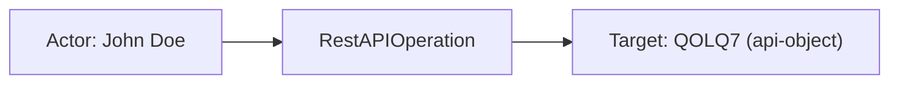
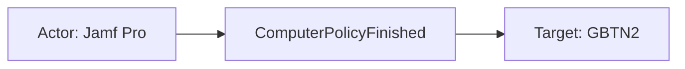
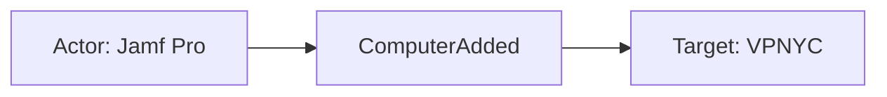

# jamf_pro

## Product Domain (Jamf Pro Apple MDM)

Jamf Pro is an enterprise Apple device management platform (Mobile Device Management, MDM) used to deploy, configure, secure, and maintain Mac computers, iPhones, iPads, and Apple TV devices at scale. Organizations rely on Jamf Pro to enroll devices through Automated Device Enrollment (ADE/DEP), push configuration profiles and policies, manage software patching, enforce security baselines, and maintain an authoritative inventory of their Apple fleet. The platform centers on the Jamf Pro Server (historically JSS), which communicates with managed endpoints via the Jamf agent and Apple MDM protocols.

Core concepts in the Jamf Pro domain include computers and mobile devices (identified by UDID, serial number, and management ID), smart groups and static groups for targeting, configuration profiles, policies, patch management, and user/location metadata tied to hardware assets. Devices report check-ins and inventory updates; administrators trigger remote commands, policy runs, and patch deployments. Jamf Pro also exposes a REST API (OAuth2 client credentials) for programmatic access and supports webhooks that push real-time notifications when significant lifecycle or operational events occur.

From a security and operations perspective, Jamf Pro generates two primary telemetry types: periodic computer inventory snapshots and event-driven webhook notifications. Inventory captures hardware, OS, security posture (FileVault, SIP, Gatekeeper, firewall), installed applications, user accounts, disk encryption, and optional sections such as configuration profiles and group memberships. Webhook events cover device enrollment and check-in, policy and patch completion, smart group membership changes, mobile device lifecycle, REST API operations, SCEP challenges, and Jamf server startup/shutdown. Security teams use this data to monitor fleet compliance, detect enrollment anomalies, track policy execution, and correlate Apple endpoint activity with broader SIEM investigations.

The Elastic Jamf Pro integration ingests both streams via Elastic Agent: inventory is polled from the `/v1/computers-inventory` API (CEL input), and events are received passively from Jamf Pro webhooks over an HTTP endpoint listener. Data is normalized into ECS-aligned fields with Kibana dashboards for inventory overview, hardware details, geographic distribution, and real-time webhook activity.

## Data Collected (brief)

- **Inventory** (`jamf_pro.inventory`): Periodic computer asset records from the Jamf Pro API, one document per Mac. Default sections include general device metadata (name, UDID, enrollment dates, last contact, MDM capability, site), hardware (model, serial, CPU/RAM, Apple Silicon), and operating system (version, build, FileVault status). Optional sections: user/location, disk encryption, purchasing, applications, storage, configuration profiles, security settings, local user accounts, certificates, group memberships, and more.
- **Events** (`jamf_pro.events`): Real-time webhook notifications from Jamf Pro, including computer and mobile device lifecycle (added, enrolled, unenrolled, check-in, inventory completed), policy and patch execution (policy finished, patch policy completed, patch software title updated), smart group membership changes (computer, mobile device, user), push notifications, REST API operations, SCEP challenges, device added to DEP, JSS startup/shutdown, and mobile device commands.
- **Host and user context**: Device identifiers (UDID, serial, MAC, management ID), IP addresses with geo enrichment, OS version/build, assigned user name/email, building/department/room, and webhook metadata (event type, timestamp, webhook name/ID).

## Expected Audit Log Entities

Jamf Pro webhooks are **operational lifecycle and MDM activity notifications** — audit-adjacent, not a dedicated administrative audit log with explicit actor principals. Most events describe what happened to a managed Apple endpoint or Jamf configuration object without naming the administrator, API client, or policy that triggered the change. **`jamf_pro.events`** is the only stream with actor/target/action semantics below; **`jamf_pro.inventory`** is periodic asset inventory (`event.kind: asset`) with no per-action caller or affected-object audit model. **`event.action`** is populated on **all 22** events-stream fixtures from `jamf_pro.events.webhook.webhook_event` (PascalCase Jamf webhook type names, e.g. `ComputerAdded`, `RestAPIOperation`); inventory has no `event.action`. No ECS `user.target.*`, `host.target.*`, `service.target.*`, or `entity.target.*` fields are populated; no `destination.user.*` / `destination.host.*` in the events pipeline (`destination_identity_hits.csv` has no jamf_pro row). Target-fields audit classifies jamf_pro as **`moderate_candidate`** with `fixture_strong=true` (vendor `target_device`/`target_user` in SCEP fixtures) and `pipeline_actor=false` (`dev/target-fields-audit/out/target_enhancement_packages.csv`).

Evidence: `packages/jamf_pro/data_stream/events/sample_event.json`, all 22 `_dev/test/pipeline/*-expected.json` fixtures, `data_stream/events/elasticsearch/ingest_pipeline/default.yml`, `data_stream/events/fields/fields.yml`, `data_stream/inventory/sample_event.json`, `data_stream/inventory/elasticsearch/ingest_pipeline/default.yml`.

### Event action (semantic)

Jamf webhook **`webhookEvent`** is the canonical per-notification action — the pipeline copies it verbatim to ECS `event.action`. Secondary vendor fields (`rest_api_operation_type`, `event_actions.action`) add sub-operation detail on two event types but are not promoted to ECS.

| Action (normalized label) | Classification | Confidence | Evidence | Per-stream notes |
| --- | --- | --- | --- | --- |
| `ComputerAdded`, `ComputerCheckIn`, `ComputerInventoryCompleted`, `ComputerPushCapabilityChanged` | administration / device_lifecycle | high | `event.action` in all four fixtures; e.g. `test-computer-added.json-expected.json`: `ComputerAdded` | **`jamf_pro.events`** — Mac lifecycle and inventory reporting |
| `MobileDeviceEnrolled`, `MobileDeviceUnEnrolled`, `MobileDeviceCheckIn`, `MobileDeviceInventoryCompleted`, `MobileDeviceCommandCompleted`, `MobileDevicePushSent` | administration / device_lifecycle | high | `event.action` in all six mobile fixtures; e.g. `MobileDeviceEnrolled`, `MobileDeviceCommandCompleted` | Same stream — iOS/iPadOS lifecycle and MDM command completion |
| `ComputerPolicyFinished`, `ComputerPatchPolicyCompleted`, `PatchSoftwareTitleUpdated` | configuration_change | high | `ComputerPolicyFinished`, `ComputerPatchPolicyCompleted`, `PatchSoftwareTitleUpdated` in fixtures | Policy/patch execution and catalog updates; sub-action in `event_actions.action` (`MCNFPQ`) on patch-completed only |
| `SmartGroupComputerMembershipChange`, `SmartGroupMobileDeviceMembershipChange`, `SmartGroupUserMembershipChange` | configuration_change | high | All three smart-group fixtures set `event.action` to matching webhook type | Group membership delta events; no operator identity in payload |
| `RestAPIOperation` | api_call | high | `test-rest-api-operation.json-expected.json`: `event.action: RestAPIOperation`; vendor `rest_api_operation_type: ZSE6D5` retained | Only event with explicit API operator (`authorized_username`); sub-operation type vendor-only |
| `SCEPChallenge` | authentication | high | `test-scep-challenge.json-expected.json`: `event.action: SCEPChallenge` | Certificate enrollment challenge; explicit `target_user`/`target_device` blocks |
| `DeviceAddedToDEP` | administration | high | `test-device-added-to-dep.json-expected.json`: `DeviceAddedToDEP` | Automated Device Enrollment record added |
| `PushSent` | administration | high | `test-push-sent.json-expected.json`: `PushSent` | Generic push dispatch; minimal payload (`management_id`, `type`) |
| `JSSStartup`, `JSSShutdown` | administration | high | `test-jss-startup.json-expected.json` / `test-jss-shutdown.json-expected.json` | Jamf Pro Server instance lifecycle; no managed device target |

**No per-event action:** **`jamf_pro.inventory`** — periodic asset sync (`event.kind: asset`); documents describe current computer state, not a discrete MDM operation.

### Event action (ECS candidates)

| ECS / vendor field | Mapped to `event.action` today? | Mapping correct? | Recommended `event.action` value (from fixtures) | Enhancement candidate? | Evidence |
| --- | --- | --- | --- | --- | --- |
| `jamf_pro.events.webhook.webhook_event` → `event.action` | yes (22/22 fixtures) | yes | `ComputerAdded`, `ComputerCheckIn`, `RestAPIOperation`, `SCEPChallenge`, … (full webhook enum) | no | `default.yml` L175–178 `copy_from`; `sample_event.json` L24; every `*-expected.json` |
| `jamf_pro.events.event.rest_api_operation_type` | no | n/a | `ZSE6D5` (fixture label) | partial | `RestAPIOperation` fixture; sub-operation within REST API call — could append or secondary-map for finer granularity |
| `jamf_pro.events.event.event_actions.action` | no | n/a | `MCNFPQ` | partial | `ComputerPatchPolicyCompleted` fixture only; patch step action, not webhook type |
| `jamf_pro.events.event.type` | no | n/a | push type on `PushSent` | partial | `PushSent` fixture; push channel/type, not webhook event name |
| `jamf_pro.events.event.successful` / `.operation_successful` | no | n/a | — | no | Outcome flags on policy/patch/REST events; belong in `event.outcome`, not `event.action` |
| `event.type` / `event.category` | n/a | n/a | — | no | Not set by events pipeline; do not substitute for `event.action` |

**Step 2b — per-stream check:**

| Stream | `event.action` in fixtures? | Pipeline maps to `event.action`? | Primary action candidate | Confidence | Evidence |
| --- | --- | --- | --- | --- | --- |
| `events` | yes (22/22) | yes | `jamf_pro.events.webhook.webhook_event` | high | `default.yml` L175–178; all pipeline test fixtures |
| `inventory` | no | no | n/a (asset sync) | n/a | `event.kind: asset` only (`inventory/default.yml` L241–243); no webhook envelope |

### Actor (semantic)

| Entity | Classification | Entity type (if general) | Confidence | Evidence | Per-stream notes |
| --- | --- | --- | --- | --- | --- |
| Assigned device user (computer, flat payload) | user | — | medium | `ComputerAdded`, `ComputerInventoryCompleted`, `ComputerPushCapabilityChanged`: `username`/`email_address` → ECS `user.name`/`user.email`; `related.user` populated | **`jamf_pro.events`** — device ownership/location context, not the party that triggered the webhook |
| Assigned device user (computer, nested `computer`) | user | — | medium | `ComputerCheckIn`, `ComputerPolicyFinished`, `ComputerPatchPolicyCompleted`: `event.computer.username`/`email_address` → ECS `user.*` (same semantics as flat) | Same stream; overlaps semantically with the affected endpoint |
| Assigned device user (mobile device) | user | — | medium | `MobileDeviceEnrolled`, `MobileDeviceUnEnrolled`, `MobileDeviceCheckIn`, `MobileDeviceInventoryCompleted`, `MobileDeviceCommandCompleted`, `MobileDevicePushSent`: flat `username` → ECS `user.name`; email absent in fixtures | Same stream |
| REST API operator | user | — | medium | `RestAPIOperation` only: `authorized_username` in `jamf_pro.events.event.authorized_username`; **not** mapped to ECS `user.*` | Same stream — only explicit human operator field in the integration |
| Reporting managed endpoint (network origin) | host | — | medium | Device IP at `host.ip`/`host.address` with GeoIP on most computer/mobile lifecycle events; nested `computer.ip_address` → `source.ip` on check-in/policy/patch events | Endpoint is telemetry source, not an authenticated actor; no `source.user.*` |
| Jamf Pro Server instance | general | jamf-server | low | `JSSStartup`/`JSSShutdown`: `host_address`, `jss_url`, `institution`, `is_cluster_master` describe the server instance | Operational scope, not a human or API actor |

Seven event types carry no username or operator field: `SmartGroupComputerMembershipChange`, `SmartGroupMobileDeviceMembershipChange`, `SmartGroupUserMembershipChange`, `DeviceAddedToDEP`, `PatchSoftwareTitleUpdated`, `PushSent`, `SCEPChallenge`. Actor identity is genuinely absent from those vendor payloads (SCEP includes `target_user`/`target_device` as targets, not actors).

### Actor (ECS candidates)

| ECS / vendor field | Role | Mapped today? | Mapping correct? | Confidence | Evidence |
| --- | --- | --- | --- | --- | --- |
| `user.name` | Assigned device user display name | yes (14/22 fixtures) | partial | medium | `copy_from: jamf_pro.events.event.username` then `event.computer.username` (L101–109); represents device-user context, not admin actor |
| `user.email` | Assigned device user email | yes (10/22) | partial | medium | `copy_from: jamf_pro.events.event.email_address` then `event.computer.email_address` (L111–119) |
| `related.user` | User identity enrichment bag | yes (14/22) | partial | medium | Appends `user.name` and `user.email` (L161–169); actor-only bag — no target user IDs |
| `host.ip` / `host.address` / `host.geo` | Reporting endpoint IP | yes (16/22) | partial | medium | `event.ip_address` → `host.ip` (L81–86); `event.computer.reported_ip_address` overrides (L88–95); geoip on `host.ip` (L155–159); endpoint context, not actor |
| `source.ip` | Nested computer network address | partial (3/22) | yes | medium | `convert` on `event.computer.ip_address` → `source.ip` (L180–186); `ComputerCheckIn`, `ComputerPolicyFinished`, `ComputerPatchPolicyCompleted` only |
| `jamf_pro.events.event.authorized_username` | REST API operator | no (vendor-only) | n/a | high | `RestAPIOperation` fixture; canonical human operator, not promoted to ECS |
| `jamf_pro.events.event.computer.*` (identity fields) | Device + assigned-user vendor block | no (vendor-only, partial ECS copy) | n/a | high | Full nested computer retained; only `username`/`email_address`/`device_name`/`udid`/`reported_ip_address`/`ip_address`/`os_version` copied to ECS |

No ECS `client.user.*`, `client.*`, or service-account mapping exists for API callers. Unlike IAM-style audit logs, Jamf webhooks rarely identify *who* initiated an action.

### Target (semantic)

| Layer | Description | Entity | Classification | Entity type (if general) | Confidence | Evidence | Per-stream notes |
| --- | --- | --- | --- | --- | --- | --- | --- |
| 1 — Platform / cloud service | Jamf Pro MDM platform handling the operation | Jamf Pro | service | — | medium | No `cloud.service.name` or `cloud.provider` in pipeline; platform inferred from integration context and `event.action` (e.g. `ComputerPolicyFinished`, `RestAPIOperation`) | On-prem or hosted Jamf Pro Server — not cloud-provider scoped |
| 2 — Resource / object | Managed Apple endpoint acted upon | Mac or mobile device | host | — | high | Nested `event.computer.*` or flat device fields (`device_name`, `udid`, `serial_number`, `management_id`, `imei`); ECS `host.name`/`host.id` only when nested `computer` block present | Primary target across lifecycle, policy, and patch events |
| 2 — Resource / object | Jamf configuration or catalog object | Smart group, policy, patch title, REST API entity, DEP record | general | smart-group, policy, patch-policy, software-title, api-object, dep-device | high | Vendor-only fields: `name`/`jssid`/`smart_group`, `policy_id`, `patch_policy_id`/`patch_policy_name`, `object_id`/`object_type_name`, DEP serial/model fields | No ECS `*.target.*` mapping |
| 2 — Resource / object | SCEP enrollment subject | Device + user | host / user | — | high | `SCEPChallenge`: explicit `target_device` (UDID, serial, model, OS) and `target_user` (username, email, uid, uuid, dn) | Only fixture with Jamf-native `target_*` blocks |
| 2 — Resource / object | Assigned user on device events | End-user account tied to hardware | user | — | medium | Same `username`/`email_address` promoted to ECS `user.*` on device lifecycle events | Functionally device-user context overlapping Layer 2 host target |
| 3 — Content / artifact | Policy/patch execution outcome | success flag, deployed version, action | general | policy-outcome, patch-deployment | high | `ComputerPolicyFinished`: `policy_id`, `successful`; `ComputerPatchPolicyCompleted`: `deployed_version`, `event_actions.action`, `successful` | Describes operation result on Layer 2 object |
| 3 — Content / artifact | Push notification dispatch | push type, management ID | general | push | medium | `PushSent`: `management_id`, `type` only; `MobileDevicePushSent`: full mobile device block as target | Minimal payload on generic push event |
| 3 — Content / artifact | Webhook delivery metadata | webhook name, ID, timestamp | general | webhook-envelope | high | `jamf_pro.events.webhook.{webhook_event,id,name,event_timestamp}` on every event | Scopes the notification, not a durable entity |

### Target (ECS candidates)

| ECS / vendor field | Layer | Classification | Mapped today? | Mapping correct? | ECS target bucket | Enhancement candidate? | Evidence |
| --- | --- | --- | --- | --- | --- | --- | --- |
| `host.name` / `host.id` | 2 | host | partial (3/22) | yes | `host.target.name` / `host.target.id` | yes | `copy_from: event.computer.device_name` / `event.computer.udid` (L140–148); nested-computer events only — flat Mac and all mobile payloads skip these |
| `host.ip` / `host.geo` / `host.address` | 2 | host | yes (16/22) | partial | `host.target.ip` | yes | `event.ip_address` or `event.computer.reported_ip_address` → `host.ip` + geoip; populated for flat and nested payloads but semantically the affected endpoint |
| `jamf_pro.events.event.device_name` / `.udid` / `.serial_number` | 2 | host | no | n/a | `host.target.name` / `host.target.id` | yes | Flat computer/mobile payloads retain vendor identity; not copied to ECS `host.name`/`host.id` |
| `jamf_pro.events.event.computer.*` | 2 | host | partial | partial | `host.target.*` | yes | Full nested computer block retained; serial, MAC, model, management_id vendor-only |
| `user.name` / `user.email` | 2 | user | yes (14/22) | partial | `user.target.name` / `user.target.email` | yes | Assigned device user copied to actor ECS fields; on device events this is also the de-facto affected user |
| `jamf_pro.events.event.target_device.*` | 2 | host | no | n/a | `host.target.*` | yes | `SCEPChallenge` fixture; explicit vendor target block (`udid`, `serial_number`, `device_name`, `model`, OS) |
| `jamf_pro.events.event.target_user.*` | 2 | user | no | n/a | `user.target.*` | yes | `SCEPChallenge` fixture; explicit vendor target block (`username`, `email`, `uid`, `uuid`, `dn`) |
| `jamf_pro.events.event.{name,jssid,smart_group}` | 2 | general | no | n/a | `entity.target.*` | yes | Smart group membership change fixtures; group identity and membership deltas |
| `jamf_pro.events.event.policy_id` | 2 | general | no | n/a | `entity.target.id` | yes | `ComputerPolicyFinished`; policy object acted upon |
| `jamf_pro.events.event.{patch_policy_id,patch_policy_name,software_title_id}` | 2 | general | no | n/a | `entity.target.*` | yes | `ComputerPatchPolicyCompleted`, `PatchSoftwareTitleUpdated` |
| `jamf_pro.events.event.{object_id,object_name,object_type_name,rest_api_operation_type}` | 2 | general | no | n/a | `entity.target.*` | yes | `RestAPIOperation`; REST API resource target |
| `jamf_pro.events.event.{serial_number,model,asset_tag,description}` | 2 | general | no | n/a | `entity.target.*` | yes | `DeviceAddedToDEP`; DEP enrollment record |
| `jamf_pro.events.event.{successful,deployed_version,event_actions.action}` | 3 | general | no | n/a | context-only | no | Policy/patch outcome metadata |
| `event.action` | 1 | service | yes | yes (action context) | context-only | no | Webhook event type copied verbatim from `webhook.webhook_event` (PascalCase, e.g. `ComputerAdded`) |
| `jamf_pro.events.event.{jss_url,host_address,institution,is_cluster_master}` | 2 | general | no | n/a | `entity.target.*` (server instance) | yes | `JSSStartup`/`JSSShutdown`; Jamf server as operational target |

No `destination.user.*` or `destination.host.*` de-facto targets — unlike email/auth integrations, Jamf does not use destination fields for acted-upon entities.

### Gaps and mapping notes

- **No ECS `*.target.*` today** — all affected entities stay vendor-side under `jamf_pro.events.event.*` or partially in `host.*`/`user.*`. Enhancement: map nested `computer.udid`/`device_name` and flat `udid`/`device_name` to `host.target.*`; map assigned user fields to `user.target.*` (separate from actor); map SCEP `target_device`/`target_user` to official target buckets.
- **`user.*` conflates actor and target on device events** — pipeline promotes assigned device user to ECS `user.*` (actor field set) when semantically the user is often the affected party (`Mapping correct?`: partial). Only `RestAPIOperation.authorized_username` is a true operator, and it stays vendor-only.
- **`host.name`/`host.id` mapping gap for flat payloads** — pipeline copies only from `event.computer.*` (L140–148); flat Mac events (`ComputerAdded`, etc.) and all mobile events retain `device_name`/`udid` vendor-side without ECS `host.name`/`host.id`.
- **Vendor `target_*` blocks unmapped** — `SCEPChallenge` is the only fixture with explicit Jamf-native `target_user` and `target_device`; flagged in `vendor_target_special_cases.csv` as `likely_user_target_or_entity` / `likely_host_target_or_entity`.
- **No `destination.user.*` / `destination.host.*`** — pipeline has no destination-identity processors; target-fields audit `pipeline_dest_identity=false`.
- **`related.user` is actor/context-only** — appends assigned user name/email; smart group `group_added_user_ids`/`group_removed_user_ids` and device membership deltas are not in `related.*`.
- **Actor absent on 7/22 event types** — smart group, DEP, patch catalog, push, JSS, and SCEP events carry targets or scope only; no administrator or API client identity in vendor payload.
- **Target-fields audit alignment** — `moderate_candidate` with `fixture_strong=true` (SCEP vendor targets) and `pipeline_actor=false` despite `user.*` population; reflects that assigned device user is not a security principal actor.
- **`event.action` well covered on events stream** — all 22 webhook fixtures populate `event.action` from `webhook.webhook_event` (`default.yml` L175–178); mapping is semantically correct. Optional enhancement: normalize PascalCase to lowercase/snake_case for ECS convention, or map secondary sub-actions (`rest_api_operation_type`, `event_actions.action`) when finer granularity is needed.
- **No `event.action` on inventory** — correct for asset sync; `event.kind: asset` only.

### Per-stream notes

#### `jamf_pro.events`

Real-time webhook notifications received via HTTP endpoint listener. 22 pipeline test fixtures covering computer/mobile lifecycle, policy/patch execution, smart group membership, REST API operations, SCEP, DEP, push, and JSS startup/shutdown. **`event.action`** is set on every fixture from `jamf_pro.events.webhook.webhook_event` (PascalCase Jamf webhook enum). Dual payload shapes: flat device fields at event root vs nested `event.computer` object — ECS mapping differs (`host.name`/`host.id` and `source.ip` only for nested computer). Webhook metadata (`jamf_pro.events.webhook.*`) scopes every event. Targets are predominantly managed Apple endpoints; configuration objects (smart groups, policies, patch titles, REST API entities) remain vendor-namespaced.

#### `jamf_pro.inventory`

Periodic computer asset records polled from `/v1/computers-inventory` API (`event.kind: asset`). Maps inventory subject to `host.*`, `user.*` (from `user_and_location`), and `os.*` — these describe the **asset record**, not audit actor/target semantics for a specific action. Actor/target classification for audit purposes does not apply; use inventory fields for fleet compliance and asset correlation instead.

## Example Event Graph

Examples below come from **`jamf_pro.events`** webhook fixtures — operational MDM lifecycle notifications that are audit-adjacent but rarely name the administrator or API client that triggered the change. The **`jamf_pro.inventory`** stream is periodic asset sync (`event.kind: asset`) with no per-event actor/action/target chain; no graph examples are shown for inventory.

### Example 1: REST API operation

**Stream:** `jamf_pro.events` · **Fixture:** `packages/jamf_pro/data_stream/events/_dev/test/pipeline/test-rest-api-operation.json-expected.json`

```
REST API operator (John Doe) → RestAPIOperation → Jamf API object (QOLQ7)
```

#### Actor

| Field | Value |
| --- | --- |
| name | John Doe |
| type | user |

**Field sources:**
- `name ← jamf_pro.events.event.authorized_username` (vendor-only; not promoted to ECS `user.*`)

#### Event action

| Field | Value |
| --- | --- |
| action | RestAPIOperation |
| source_field | `event.action` |
| source_value | `RestAPIOperation` |

#### Target

| Field | Value |
| --- | --- |
| id | 380 |
| name | QOLQ7 |
| type | general |
| sub_type | api-object |

**Field sources:**
- `id ← jamf_pro.events.event.object_id`
- `name ← jamf_pro.events.event.object_name`
- `sub_type ← jamf_pro.events.event.object_type_name` (value `I1YH0`)

#### Mermaid



### Example 2: Policy finished on managed Mac

**Stream:** `jamf_pro.events` · **Fixture:** `packages/jamf_pro/data_stream/events/_dev/test/pipeline/test-computer-policy-finished.json-expected.json`

No administrator or API operator is indexed — the assigned device user is scope metadata on the Mac, not the actor who executed the policy.

```
Jamf Pro (service) → ComputerPolicyFinished → Mac GBTN2
```

#### Actor

| Field | Value |
| --- | --- |
| name | Jamf Pro |
| type | service |

**Field sources:**
- `name` ← semantic — MDM policy engine that ran the policy; **not indexed** as an actor principal in fixture (no `authorized_username` or API caller)

#### Event action

| Field | Value |
| --- | --- |
| action | ComputerPolicyFinished |
| source_field | `event.action` |
| source_value | `ComputerPolicyFinished` |

#### Target

| Field | Value |
| --- | --- |
| id | 5836625775 |
| name | GBTN2 |
| type | host |
| ip | 89.160.20.156 |
| geo | Linköping, Sweden |

**Field sources:**
- `id ← host.id` ← `jamf_pro.events.event.computer.udid`
- `name ← host.name` ← `jamf_pro.events.event.computer.device_name`
- `ip ← host.ip` ← `jamf_pro.events.event.computer.reported_ip_address`
- `geo ← host.geo.city_name, host.geo.country_name`

**Scope context (not target):** assigned user John Doe (`user.name`, `jamf_pro.events.event.computer.username`); policy `217` (`jamf_pro.events.event.policy_id`).

#### Mermaid



### Example 3: Computer added to Jamf

**Stream:** `jamf_pro.events` · **Fixture:** `packages/jamf_pro/data_stream/events/sample_event.json`

Enrollment webhooks name the device being added, not the administrator or enrollment agent that performed the add. Using the assigned user as actor would read “user adds themselves to inventory.”

```
Jamf Pro (service) → ComputerAdded → Mac VPNYC
```

#### Actor

| Field | Value |
| --- | --- |
| name | Jamf Pro |
| type | service |

**Field sources:**
- `name` ← semantic — MDM enrollment/inventory service; **not indexed** as an actor principal in fixture (flat payload has no `authorized_username`)

#### Event action

| Field | Value |
| --- | --- |
| action | ComputerAdded |
| source_field | `event.action` |
| source_value | `ComputerAdded` |

#### Target

| Field | Value |
| --- | --- |
| id | 7265694772 |
| name | VPNYC |
| type | host |
| ip | 89.160.20.156 |
| geo | Linköping, Sweden |

**Field sources:**
- `id ← jamf_pro.events.event.udid` (vendor-only; flat payload — `host.id` not populated)
- `name ← jamf_pro.events.event.device_name` (vendor-only; flat payload — `host.name` not populated)
- `ip ← host.ip` ← `jamf_pro.events.event.ip_address`
- `geo ← host.geo.city_name, host.geo.country_name`

**Scope context (not target):** assigned user John Doe (`user.name`, `jamf_pro.events.event.username`).

#### Mermaid



## ES|QL Entity Extraction

**Package type: agent-backed** (`policy_templates`, `data_stream/events` and `data_stream/inventory` with Tier A fixtures). Router: **`data_stream.dataset`** (`jamf_pro.events`, `jamf_pro.inventory` per `sample_event.json`). Secondary discriminator: **`event.action`** (PascalCase `webhook_event` copied to `event.action` on all 22 events fixtures). Pass 4 is **fill-gaps-only**: detection flags run first; mapped columns use **column-level** `CASE(<col> IS NOT NULL, <col>, …)` with valid **3-arg** / **5-arg** / **7-arg** / **9-arg** / **13-arg** forms — never **4-arg** `CASE(actor_exists, col, bare_field, null)` or `CASE(col IS NOT NULL, col, bare_field, null)` (bare field parses as a **condition**, not a value). Do not use `CASE(actor_exists, <col>, …)` / `CASE(target_exists, <col>, …)` on mapped columns (Pass 4 §10). Ingest promotes assigned device users to `user.name` / `user.email` (scope metadata, not operators) — **ingest-only — no ES|QL** on those columns; **`user.name` preserve is gated to `RestAPIOperation` only** so ingest assigned-user `user.name` is not treated as operator identity. **`actor_exists` excludes ingest `user.*`** except `RestAPIOperation` with promoted `user.name`. **`service.name`** `"Jamf Pro"` literal when operator absent (Pass 3). **`event.action`** ingest-only (all 22 fixtures). **`jamf_pro.inventory`** excluded (asset sync). **Pass 4 (tautology cleanup):** no `CASE(col, col, …)` identity fallbacks.

### Dataset inventory

| data_stream.dataset | Stream role | Actor classification(s) | Target classification(s) | Extraction |
| --- | --- | --- | --- | --- |
| `jamf_pro.events` | MDM webhooks | user, service | host, user, general | full |
| `jamf_pro.inventory` | asset inventory | — | — | none |

### Field mapping plan

#### Actor mappings

| Output column | Source field(s) | Condition (dataset + optional) | Confidence | Notes |
| --- | --- | --- | --- | --- |
| `user.name` | `jamf_pro.events.event.authorized_username` | `data_stream.dataset == "jamf_pro.events" AND event.action == "RestAPIOperation"` | high | **column-level preserve** (`user.name IS NOT NULL AND event.action == "RestAPIOperation"`); **vendor fallback** — only explicit operator; device-event ingest `user.name` is **not** preserved (assigned user scope) |
| `service.name` | `"Jamf Pro"` | `data_stream.dataset == "jamf_pro.events" AND event.action != "RestAPIOperation"` | medium | **column-level preserve** (`service.name IS NOT NULL`); **semantic literal** — MDM engine when operator absent (Pass 3) |

#### Target mappings

| Output column | Source field(s) | Condition (dataset + optional) | Confidence | Notes |
| --- | --- | --- | --- | --- |
| `host.target.id` | `host.id` | `data_stream.dataset == "jamf_pro.events" AND host.id IS NOT NULL` | high | **column-level preserve** (`host.target.id IS NOT NULL`); **vendor fallback** — nested `event.computer` (3/22 fixtures) |
| `host.target.id` | `jamf_pro.events.event.udid` | `data_stream.dataset == "jamf_pro.events" AND host.id IS NULL AND jamf_pro.events.event.udid IS NOT NULL` | high | **column-level preserve**; **vendor fallback** — flat/mobile payloads |
| `host.target.id` | `jamf_pro.events.event.target_device.udid` | `data_stream.dataset == "jamf_pro.events" AND event.action == "SCEPChallenge"` | high | **column-level preserve**; **vendor fallback** — explicit `target_device` block |
| `host.target.name` | `host.name` | `data_stream.dataset == "jamf_pro.events" AND host.name IS NOT NULL` | high | **column-level preserve** (`host.target.name IS NOT NULL`); **vendor fallback** — nested computer |
| `host.target.name` | `jamf_pro.events.event.device_name` | `data_stream.dataset == "jamf_pro.events" AND host.name IS NULL AND jamf_pro.events.event.device_name IS NOT NULL` | high | **column-level preserve**; **vendor fallback** — flat/mobile |
| `host.target.name` | `jamf_pro.events.event.target_device.device_name` | `data_stream.dataset == "jamf_pro.events" AND event.action == "SCEPChallenge"` | high | **column-level preserve**; **vendor fallback** — SCEP fixture |
| `host.target.ip` | `host.ip` | `data_stream.dataset == "jamf_pro.events" AND host.ip IS NOT NULL` | high | **column-level preserve** (`host.target.ip IS NOT NULL`); **de-facto** — affected endpoint IP at ingest (`host.ip` → `host.target.ip`) |
| `user.target.name` | `jamf_pro.events.event.target_user.username` | `data_stream.dataset == "jamf_pro.events" AND event.action == "SCEPChallenge"` | high | **column-level preserve** (`user.target.name IS NOT NULL`); **vendor fallback** — not ingest `user.*` (SCEP has no assigned user) |
| `user.target.email` | `jamf_pro.events.event.target_user.email` | `data_stream.dataset == "jamf_pro.events" AND event.action == "SCEPChallenge"` | high | **column-level preserve** (`user.target.email IS NOT NULL`); **vendor fallback** |
| `entity.target.id` | `jamf_pro.events.event.object_id` | `data_stream.dataset == "jamf_pro.events" AND event.action == "RestAPIOperation"` | high | **column-level preserve** (`entity.target.id IS NOT NULL`); **vendor fallback** |
| `entity.target.id` | `jamf_pro.events.event.policy_id` | `data_stream.dataset == "jamf_pro.events" AND event.action == "ComputerPolicyFinished"` | high | **column-level preserve**; **vendor fallback** |
| `entity.target.id` | `jamf_pro.events.event.jssid` | `data_stream.dataset == "jamf_pro.events" AND event.action IN ("SmartGroupComputerMembershipChange", "SmartGroupMobileDeviceMembershipChange", "SmartGroupUserMembershipChange")` | high | **column-level preserve**; **vendor fallback** — smart group ID |
| `entity.target.id` | `jamf_pro.events.event.serial_number` | `data_stream.dataset == "jamf_pro.events" AND event.action == "DeviceAddedToDEP"` | high | **column-level preserve**; **vendor fallback** |
| `entity.target.id` | `jamf_pro.events.event.patch_policy_id` | `data_stream.dataset == "jamf_pro.events" AND event.action == "ComputerPatchPolicyCompleted"` | high | **column-level preserve**; **vendor fallback** |
| `entity.target.name` | `jamf_pro.events.event.object_name` | `data_stream.dataset == "jamf_pro.events" AND event.action == "RestAPIOperation"` | high | **column-level preserve** (`entity.target.name IS NOT NULL`); **vendor fallback** |
| `entity.target.name` | `jamf_pro.events.event.name` | `data_stream.dataset == "jamf_pro.events" AND event.action IN ("SmartGroupComputerMembershipChange", "SmartGroupMobileDeviceMembershipChange", "SmartGroupUserMembershipChange")` | high | **column-level preserve**; **vendor fallback** |
| `entity.target.name` | `jamf_pro.events.event.jss_url` | `data_stream.dataset == "jamf_pro.events" AND event.action IN ("JSSStartup", "JSSShutdown")` | medium | **column-level preserve**; **vendor fallback** — server instance target |
| `entity.target.sub_type` | `jamf_pro.events.event.object_type_name` | `data_stream.dataset == "jamf_pro.events" AND event.action == "RestAPIOperation"` | high | **column-level preserve** (`entity.target.sub_type IS NOT NULL`); **vendor fallback** — API object type label |

### Detection flags (mandatory — run first)

`actor_exists` **omits ingest `user.name` / `user.email`** on device lifecycle events — those fields hold assigned device user scope, not operators (`Pass 2` partial mapping). Only `RestAPIOperation` may count `user.name` if promoted later. **`host.ip` / `host.name` / `host.id` are excluded** from `actor_exists` (reporting endpoint context, not authenticated principals). **Actor/target `EVAL` blocks use column-level preserve** (`<col> IS NOT NULL`, with `event.action` guard on `user.name`) — not `CASE(actor_exists, <col>, …)` / `CASE(target_exists, <col>, …)` — so `target_exists` from one `*.target.*` column does not block `host.target.name` fallbacks when only `host.id` is populated (Pass 4 §10).

**ES|QL `CASE` arity:** Arguments are **(condition, value)** pairs; odd count → last arg is default. Use **5-arg** `CASE(user.name IS NOT NULL AND event.action == "RestAPIOperation", user.name, data_stream.dataset == "jamf_pro.events" AND event.action == "RestAPIOperation", jamf_pro.events.event.authorized_username, null)` — not **4-arg** `CASE(actor_exists, user.name, jamf_pro.events.event.authorized_username, null)` (`authorized_username` is a **condition**) or `CASE(user.name IS NOT NULL, user.name, jamf_pro.events.event.authorized_username, null)` (bare vendor field as 3rd arg is a **condition**).

```esql
| EVAL
  actor_exists = (user.name IS NOT NULL AND event.action == "RestAPIOperation")
    OR service.id IS NOT NULL OR service.name IS NOT NULL
    OR entity.id IS NOT NULL OR entity.name IS NOT NULL,
  target_exists = user.target.id IS NOT NULL OR user.target.name IS NOT NULL OR user.target.email IS NOT NULL
    OR host.target.id IS NOT NULL OR host.target.ip IS NOT NULL OR host.target.name IS NOT NULL
    OR service.target.id IS NOT NULL OR service.target.name IS NOT NULL
    OR entity.target.id IS NOT NULL OR entity.target.name IS NOT NULL,
  action_exists = event.action IS NOT NULL
```

### Combined ES|QL — actor fields

Omitted from actor `EVAL` (ingest-only — no alternate query-time source): device-event `user.name`, `user.email` (assigned user scope; Pass 2 partial).

```esql
| EVAL
  user.name = CASE(
    user.name IS NOT NULL AND event.action == "RestAPIOperation", user.name,
    data_stream.dataset == "jamf_pro.events" AND event.action == "RestAPIOperation", jamf_pro.events.event.authorized_username,
    null
  ),
  service.name = CASE(
    service.name IS NOT NULL, service.name,
    data_stream.dataset == "jamf_pro.events" AND event.action != "RestAPIOperation", "Jamf Pro",
    null
  )
```

### Combined ES|QL — event action

Omitted — `event.action` is populated on all 22 events-stream fixtures via ingest `copy_from: jamf_pro.events.webhook.webhook_event` (`default.yml` L175–178). No query-time fallback when `action_exists` is true.

### Combined ES|QL — target fields

```esql
| EVAL
  host.target.id = CASE(
    host.target.id IS NOT NULL, host.target.id,
    data_stream.dataset == "jamf_pro.events" AND host.id IS NOT NULL, host.id,
    data_stream.dataset == "jamf_pro.events" AND jamf_pro.events.event.udid IS NOT NULL, jamf_pro.events.event.udid,
    data_stream.dataset == "jamf_pro.events" AND event.action == "SCEPChallenge", jamf_pro.events.event.target_device.udid,
    null
  ),
  host.target.name = CASE(
    host.target.name IS NOT NULL, host.target.name,
    data_stream.dataset == "jamf_pro.events" AND host.name IS NOT NULL, host.name,
    data_stream.dataset == "jamf_pro.events" AND jamf_pro.events.event.device_name IS NOT NULL, jamf_pro.events.event.device_name,
    data_stream.dataset == "jamf_pro.events" AND event.action == "SCEPChallenge", jamf_pro.events.event.target_device.device_name,
    null
  ),
  host.target.ip = CASE(
    host.target.ip IS NOT NULL, host.target.ip,
    data_stream.dataset == "jamf_pro.events" AND host.ip IS NOT NULL, host.ip,
    null
  ),
  user.target.name = CASE(
    user.target.name IS NOT NULL, user.target.name,
    data_stream.dataset == "jamf_pro.events" AND event.action == "SCEPChallenge", jamf_pro.events.event.target_user.username,
    null
  ),
  user.target.email = CASE(
    user.target.email IS NOT NULL, user.target.email,
    data_stream.dataset == "jamf_pro.events" AND event.action == "SCEPChallenge", jamf_pro.events.event.target_user.email,
    null
  ),
  entity.target.id = CASE(
    entity.target.id IS NOT NULL, entity.target.id,
    data_stream.dataset == "jamf_pro.events" AND event.action == "RestAPIOperation", jamf_pro.events.event.object_id,
    data_stream.dataset == "jamf_pro.events" AND event.action == "ComputerPolicyFinished", jamf_pro.events.event.policy_id,
    data_stream.dataset == "jamf_pro.events" AND event.action IN ("SmartGroupComputerMembershipChange", "SmartGroupMobileDeviceMembershipChange", "SmartGroupUserMembershipChange"), jamf_pro.events.event.jssid,
    data_stream.dataset == "jamf_pro.events" AND event.action == "DeviceAddedToDEP", jamf_pro.events.event.serial_number,
    data_stream.dataset == "jamf_pro.events" AND event.action == "ComputerPatchPolicyCompleted", jamf_pro.events.event.patch_policy_id,
    null
  ),
  entity.target.name = CASE(
    entity.target.name IS NOT NULL, entity.target.name,
    data_stream.dataset == "jamf_pro.events" AND event.action == "RestAPIOperation", jamf_pro.events.event.object_name,
    data_stream.dataset == "jamf_pro.events" AND event.action IN ("SmartGroupComputerMembershipChange", "SmartGroupMobileDeviceMembershipChange", "SmartGroupUserMembershipChange"), jamf_pro.events.event.name,
    data_stream.dataset == "jamf_pro.events" AND event.action IN ("JSSStartup", "JSSShutdown"), jamf_pro.events.event.jss_url,
    null
  ),
  entity.target.sub_type = CASE(
    entity.target.sub_type IS NOT NULL, entity.target.sub_type,
    data_stream.dataset == "jamf_pro.events" AND event.action == "RestAPIOperation", jamf_pro.events.event.object_type_name,
    null
  )
```

### Full pipeline fragment (optional)

```esql
FROM logs-*
| EVAL
  actor_exists = (user.name IS NOT NULL AND event.action == "RestAPIOperation")
    OR service.id IS NOT NULL OR service.name IS NOT NULL
    OR entity.id IS NOT NULL OR entity.name IS NOT NULL,
  target_exists = user.target.id IS NOT NULL OR user.target.name IS NOT NULL OR user.target.email IS NOT NULL
    OR host.target.id IS NOT NULL OR host.target.ip IS NOT NULL OR host.target.name IS NOT NULL
    OR service.target.id IS NOT NULL OR service.target.name IS NOT NULL
    OR entity.target.id IS NOT NULL OR entity.target.name IS NOT NULL,
  action_exists = event.action IS NOT NULL
| EVAL
  user.name = CASE(user.name IS NOT NULL AND event.action == "RestAPIOperation", user.name, data_stream.dataset == "jamf_pro.events" AND event.action == "RestAPIOperation", jamf_pro.events.event.authorized_username, null),
  service.name = CASE(service.name IS NOT NULL, service.name, data_stream.dataset == "jamf_pro.events" AND event.action != "RestAPIOperation", "Jamf Pro", null),
  host.target.id = CASE(host.target.id IS NOT NULL, host.target.id, data_stream.dataset == "jamf_pro.events" AND host.id IS NOT NULL, host.id, data_stream.dataset == "jamf_pro.events" AND jamf_pro.events.event.udid IS NOT NULL, jamf_pro.events.event.udid, data_stream.dataset == "jamf_pro.events" AND event.action == "SCEPChallenge", jamf_pro.events.event.target_device.udid, null),
  host.target.name = CASE(host.target.name IS NOT NULL, host.target.name, data_stream.dataset == "jamf_pro.events" AND host.name IS NOT NULL, host.name, data_stream.dataset == "jamf_pro.events" AND jamf_pro.events.event.device_name IS NOT NULL, jamf_pro.events.event.device_name, data_stream.dataset == "jamf_pro.events" AND event.action == "SCEPChallenge", jamf_pro.events.event.target_device.device_name, null),
  host.target.ip = CASE(host.target.ip IS NOT NULL, host.target.ip, data_stream.dataset == "jamf_pro.events" AND host.ip IS NOT NULL, host.ip, null),
  user.target.name = CASE(user.target.name IS NOT NULL, user.target.name, data_stream.dataset == "jamf_pro.events" AND event.action == "SCEPChallenge", jamf_pro.events.event.target_user.username, null),
  user.target.email = CASE(user.target.email IS NOT NULL, user.target.email, data_stream.dataset == "jamf_pro.events" AND event.action == "SCEPChallenge", jamf_pro.events.event.target_user.email, null),
  entity.target.id = CASE(entity.target.id IS NOT NULL, entity.target.id, data_stream.dataset == "jamf_pro.events" AND event.action == "RestAPIOperation", jamf_pro.events.event.object_id, data_stream.dataset == "jamf_pro.events" AND event.action == "ComputerPolicyFinished", jamf_pro.events.event.policy_id, data_stream.dataset == "jamf_pro.events" AND event.action IN ("SmartGroupComputerMembershipChange", "SmartGroupMobileDeviceMembershipChange", "SmartGroupUserMembershipChange"), jamf_pro.events.event.jssid, data_stream.dataset == "jamf_pro.events" AND event.action == "DeviceAddedToDEP", jamf_pro.events.event.serial_number, data_stream.dataset == "jamf_pro.events" AND event.action == "ComputerPatchPolicyCompleted", jamf_pro.events.event.patch_policy_id, null),
  entity.target.name = CASE(entity.target.name IS NOT NULL, entity.target.name, data_stream.dataset == "jamf_pro.events" AND event.action == "RestAPIOperation", jamf_pro.events.event.object_name, data_stream.dataset == "jamf_pro.events" AND event.action IN ("SmartGroupComputerMembershipChange", "SmartGroupMobileDeviceMembershipChange", "SmartGroupUserMembershipChange"), jamf_pro.events.event.name, data_stream.dataset == "jamf_pro.events" AND event.action IN ("JSSStartup", "JSSShutdown"), jamf_pro.events.event.jss_url, null),
  entity.target.sub_type = CASE(entity.target.sub_type IS NOT NULL, entity.target.sub_type, data_stream.dataset == "jamf_pro.events" AND event.action == "RestAPIOperation", jamf_pro.events.event.object_type_name, null)
| KEEP @timestamp, data_stream.dataset, event.action, user.name, service.name, host.target.name, host.target.id, host.target.ip, user.target.name, entity.target.id, entity.target.name
```

### Streams excluded

- **`jamf_pro.inventory`** — periodic computer asset records (`event.kind: asset`); describes fleet state, not a discrete MDM operation with actor/target/action.

### Gaps and limitations

- **Pass 4 CASE syntax** — all `CASE` use odd-arity defaults (`null`); column-level **5-arg** / **7-arg** / **9-arg** / **13-arg** preserve (`<col> IS NOT NULL`, not `CASE(actor_exists|target_exists, <col>, …)`); `user.name` preserve gated with `event.action == "RestAPIOperation"` so ingest assigned-user `user.name` is not a no-op preserve; full pipeline fragment aligned with combined `EVAL` blocks.
- **Pass 4 tautology cleanup** — no `CASE(col, col, …)` identity fallbacks; device-event `user.email` omitted from actor `EVAL`; `event.action` ingest-only.
- **Ingest `user.*` on device events** — assigned device user remains in `user.*` at ingest (Pass 2 partial); Pass 4 does not promote it to `user.target.*` on lifecycle events (Pass 3: scope context, not target).
- **`PushSent` / `PatchSoftwareTitleUpdated`** — minimal vendor payloads; no host identity fields in fixtures — host target columns omitted when fields absent.
- **`user.id` / `user.domain`** — not indexed; `target_user.uuid` vendor-only on SCEP.
- **`service.target.*`** — platform (Jamf Pro) modeled as **service actor** literal, not service target.
- **7/22 event types** — no operator in vendor payload; rely on `service.name` `"Jamf Pro"` actor literal.
- **Pass 2 alignment** — ingest-time `host.target.*` / `user.target.*` from nested `computer.*`, flat `udid`/`device_name`, and SCEP `target_*` blocks remain the preferred long-term fix; Pass 4 fills gaps without overwriting populated values.
