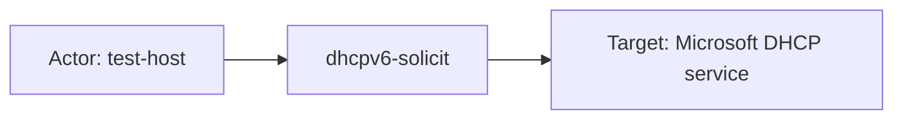

# microsoft_dhcp

## Product Domain (Windows Server DHCP)

Windows Server DHCP is the Dynamic Host Configuration Protocol service built into Microsoft Windows Server. It automatically assigns IPv4 and IPv6 addresses, subnet masks, default gateways, DNS servers, and other network parameters to clients on a local network. DHCP is a foundational infrastructure service: every new device, workstation, or guest endpoint that joins the network typically depends on it for address assignment and name resolution integration.

The service operates through scopes (address pools), leases (time-bound address grants), reservations, and options configured on one or more DHCP servers. Windows Server DHCP supports high availability via failover clustering, split scopes, and DHCP failover partnerships. It integrates with Active Directory for authorization (rogue-server detection), DNS dynamic updates for client hostname registration, Network Access Protection (NAP) policy enforcement, and relay-agent scenarios where requests traverse intermediate hops.

From a security and operations perspective, DHCP activity reveals who joined the network, which addresses were assigned or denied, when leases expired or were released, DNS update success or failure, scope exhaustion, unauthorized server detection, and policy-driven packet drops. Security teams monitor DHCP logs to detect rogue DHCP servers, suspicious lease patterns, address-pool exhaustion, DNS registration abuse, and network access policy violations. Network and infrastructure teams use the same signals for troubleshooting connectivity, capacity planning, and audit trails of IP assignment.

The Elastic **Microsoft DHCP** integration ingests the comma-delimited audit logs written by the Windows DHCP Server role on Windows Server 2008 and later. Elastic Agent reads log files from the DHCP service directory (by default `DhcpSrvLog-*.log` for IPv4 and `DhcpV6SrvLog-*.log` for IPv6), parses events into ECS-aligned fields, and maps Microsoft event IDs to structured `event.action`, `event.category`, `event.type`, and `event.outcome` values. The integration is categorized under security and network, reflecting its value for both threat detection and network visibility.

## Data Collected (brief)

Logs only (no metrics). One data stream:

| Data stream | Description |
|---|---|
| **log** | Microsoft DHCP Server audit logs from `DhcpSrvLog-*.log` (IPv4) and `DhcpV6SrvLog-*.log` (IPv6), collected via Elastic Agent logfile input |

Parsed events include lease lifecycle (new, renew, release, deny, expire, delete), BOOTP assignments, DNS dynamic update requests and failures, NAP policy drops, rogue/unauthorized server detection, failover standby drops, IP cleanup operations, and log service start/stop/pause. Key ECS fields: `event.code`, `event.action`, `event.outcome`, `source.ip`, `source.mac`, `source.domain`, `user.name`, and `observer.*` (DHCP server identity). Vendor-specific fields under `microsoft.dhcp.*` capture transaction IDs, NAP correlation IDs, relay-agent info, DHCID, vendor/user class options, DNS error codes, DUID (v6), and subnet prefix length.

## Expected Audit Log Entities

The integration has one **`log`** data stream of true Windows Server DHCP audit logs (not metrics or inventory sync). IPv4 (`DhcpSrvLog-*.log`) and IPv6 (`DhcpV6SrvLog-*.log`) share ECS fields but route to separate sub-pipelines via `log.file.path` (`default.yml` → `dhcp.yml` / `dhcpv6.yml`). Client-initiated transactions map the DHCP **client** into ECS **`source.*`**; the collecting Windows Server appears as **`observer.*`** / **`host.*`** (Elastic Agent metadata in `sample_event.json`). **No ECS `*.target.*` fields are populated** and the package is **not listed in `destination_identity_hits.csv`** — there is no `destination.user.*` or `destination.host.*` de-facto target pattern. Target-fields audit classified this package as **`none`** (`dev/target-fields-audit/out/target_enhancement_packages.csv`).

**`event.action` is populated for most Microsoft DHCP event IDs** via painless lookup tables in `dhcp.yml` and `dhcpv6.yml` that map `event.code` (CSV column 1) to normalized action labels. Fixtures confirm populated actions (`dhcp-new`, `dhcp-dns-update`, `dhcpv6-solicit`, `rogue-server-detection`, etc.) in `sample_event.json`, `test-log.log-expected.json`, and `test-logv6.log-expected.json`. **Gaps:** eight IPv4 codes (`13`, `14`, `20`–`23`, `33`, `36`) and DHCPv6 code **`1103`** (AD authorization) have categorization params but **no `action` key** — those events leave `event.action` empty despite a descriptive `message` column.

### Event action (semantic)

Windows DHCP audit logs record lease lifecycle, DNS dynamic updates, NAP/failover drops, rogue-server authorization, log service control, and database cleanup. The pipeline normalizes Microsoft numeric event IDs into ECS `event.action` strings.

| Action (normalized label) | Classification | Confidence | Evidence | Per-stream notes |
| --- | --- | --- | --- | --- |
| `dhcp-new` | configuration_change | high | Code `10`; fixtures `test-log.log-expected.json` (`192.168.2.10`, `192.168.10.40`) | **`log`** (IPv4) — new lease assigned |
| `dhcp-renew` | configuration_change | high | Code `11`; `dhcp.yml:79-85` | **`log`** (IPv4) — lease renewed |
| `dhcp-release` | configuration_change | high | Code `12`; `dhcp.yml:87-93` | **`log`** (IPv4) — client released lease |
| `dhcp-deny` | configuration_change | high | Code `15`; `dhcp.yml:109-116` | **`log`** (IPv4) — lease denied |
| `dhcp-delete` | configuration_change | high | Code `16`; `dhcp.yml:118-124` | **`log`** (IPv4) — lease deleted from database |
| `dhcp-expire` | configuration_change | high | Codes `17`/`18`; fixture code `17` (`67.43.156.15`) | **`log`** (IPv4) — lease expired (with/without DNS record cleanup) |
| `dhcp-dns-update` | configuration_change | high | Codes `30`–`35`, `32`; fixtures codes `30`/`31`/`35`; `sample_event.json` code `35` | **`log`** (IPv4) — DNS dynamic update request/success/failure |
| `rogue-server-detection` | administration | high | Codes `50`–`64`; fixtures codes `55`, `60`, `63` | **`log`** (IPv4) — AD authorization / unauthorized DHCP server detection |
| `ip-cleanup-start` / `ip-cleanup-end` | administration | high | Codes `24`/`25`; fixture code `24` | **`log`** (IPv4) — IP address cleanup batch operations |
| `log-start` / `log-end` / `log-pause` | administration | high | Codes `00`–`02`; fixtures codes `00`/`01` | **`log`** (IPv4) — DHCP audit log service lifecycle |
| *(missing)* IP in use / scope exhausted / BOOTP / NAP drop / failover drop | configuration_change / detection | moderate | Codes `13`, `14`, `20`–`23`, `33`, `36`; fixture code `36` has `message` but **no `event.action`** | **`log`** (IPv4) — pipeline params omit `action` key; `message` CSV column holds vendor text |
| `dhcpv6-solicit` / `dhcpv6-request` | configuration_change | high | Codes `11000`/`11002`; fixtures in `test-logv6.log-expected.json` | **`log`** (IPv6) — DHCPv6 client protocol messages |
| `dhcpv6-advertise` / `dhcpv6-confirm` / `dhcpv6-renew` / `dhcpv6-rebind` / `dhcpv6-decline` / `dhcpv6-release` / `dhcpv6-info-request` | configuration_change | high | Codes `11001`–`11008`; `dhcpv6.yml:47-101` | **`log`** (IPv6) — full DHCPv6 message-type coverage in pipeline |
| `ipv6-dns-update-request` / `ipv6-dns-update-failed` / `ipv6-dns-update-successful` / `ipv6-dns-update-request-failed` | configuration_change | high | Codes `11022`–`11024`, `11028`–`11029`; `dhcpv6.yml:181-218` | **`log`** (IPv6) — IPv6 DNS dynamic update lifecycle |
| `dhcpv6-scope-full` / `dhcpv6-bad-address` / `dhcpv6-address-in-use` / `dhcpv6-client-deleted` / `dhcpv6-expired` / `dhcpv6-lease-expired-deleted` | configuration_change | high | Codes `11009`, `11014`–`11019`; `dhcpv6.yml:102-167` | **`log`** (IPv6) — scope exhaustion, bad address, lease expiry |
| `dhcpv6-cleanup-start` / `dhcpv6-cleanup-end` | administration | high | Codes `11020`/`11021`; `dhcpv6.yml:169-180` | **`log`** (IPv6) — IPv6 lease database cleanup |
| `dhcpv6-stateless-clients-pruged` / `dhcpv6-stateless-clients-expired` | administration | high | Codes `11030`/`11031`; fixture code `11030` | **`log`** (IPv6) — stateless client record purge (note pipeline typo `pruged`) |
| `log-start` / `log-stop` / `log-pause` / `log-file` | administration | high | Codes `11010`–`11013`; fixtures `11010`/`11011` | **`log`** (IPv6) — DHCPv6 log service lifecycle |
| *(missing)* `Authorized(servicing)` | administration | high | Code **`1103`**; fixtures `test-logv6.log-expected.json` — `message: Authorized(servicing)`, **`event.action` absent** | **`log`** (IPv6) — AD authorization for DHCPv6 server; not in `dhcpv6.yml` params |

### Event action (ECS candidates)

| ECS / vendor field | Mapped to `event.action` today? | Mapping correct? | Recommended `event.action` value (from fixtures) | Enhancement candidate? | Evidence |
| --- | --- | --- | --- | --- | --- |
| `event.action` | yes (most codes) | yes | `dhcp-dns-update` (code `35`, `sample_event.json`); `dhcp-new` (code `10`); `dhcpv6-solicit`/`dhcpv6-request` (codes `11000`/`11002`); `rogue-server-detection` (code `55`) | no | ← painless script `dhcp.yml:43-371`, `dhcpv6.yml:35-242` copies `action` from params keyed by `event.code` |
| `event.code` | n/a (source key) | yes | `10`, `35`, `11000`, `1103` | no | ← CSV column 1 (`dhcp.yml:8`, `dhcpv6.yml:7`); primary lookup key for action derivation |
| `message` | no | n/a | `Packet dropped because of Client ID hash mismatch or standby server.` (code `36`); `Authorized(servicing)` (code `1103`) | **yes** (fallback only) | ← CSV column 4; human-readable vendor description when `action` param missing — not copied to `event.action` today |
| *(proposed)* code `13` action | no | n/a | `dhcp-address-in-use` | **yes** | `dhcp.yml:94-100` — params have `reason`/`type` only |
| *(proposed)* code `14` action | no | n/a | `dhcp-scope-exhausted` | **yes** | `dhcp.yml:100-107` |
| *(proposed)* code `20`/`21` action | no | n/a | `dhcp-bootp-new` / `dhcp-bootp-dynamic-new` | **yes** | `dhcp.yml:138-151` |
| *(proposed)* code `22`/`23` action | no | n/a | `dhcp-bootp-deny` / `dhcp-bootp-delete` | **yes** | `dhcp.yml:152-167` |
| *(proposed)* code `33` action | no | n/a | `dhcp-nap-drop` | **yes** | `dhcp.yml:204-210` — NAP policy packet drop |
| *(proposed)* code `36` action | no | n/a | `dhcp-failover-drop` | **yes** | `dhcp.yml:228-235`; fixture code `36` confirms empty `event.action` |
| *(proposed)* code `1103` action | no | n/a | `dhcpv6-authorized` or `rogue-server-detection` | **yes** | Not in `dhcpv6.yml` params; fixtures show code `1103` with `source.domain: test.local` on authorization row |

### Actor (semantic)

| Entity | Classification | Entity type (if general) | Confidence | Evidence | Per-stream notes |
| --- | --- | --- | --- | --- | --- |
| DHCP client (IPv4) | host | — | high | `source.ip`, `source.mac`, `source.address`, `source.domain` ← CSV columns (`dhcp.yml`); fixtures: `dhcp-new` code `10` (`192.168.2.10`, MAC `00-00-00-00-00-00`), `dhcp-dns-update` code `30`/`35` (`172.28.43.169` / `057182593757.test.com`), failover drop code `36` (`172.28.52.0`, MAC `76-69-1E-D4-5C-90`) | **`log`** (IPv4) — lease lifecycle (`10`–`18`, `20`–`23`), DNS updates (`30`–`35`), NAP/failover drops (`33`, `36`); client initiating or affected by the transaction |
| DHCP client (IPv6) | host | — | high | `source.ip` (IPv6), `source.address`, `source.domain`, `microsoft.dhcp.duid.hex` / `duid.length` (`dhcpv6.yml`); fixtures: `dhcpv6-solicit` / `dhcpv6-request` codes `11000`/`11002` with `2a02:cf40:…:6fc6`, DUID `0004A34473BFC27FC55B25E86AF0E1761DAA` | **`log`** (IPv6) — DUID is the stable client identifier when MAC is absent |
| User-class option (IPv4) | user | — | low | `user.name` ← CSV column (`dhcp.yml`, `ecs.yml`); optional `microsoft.dhcp.user.string` / `user.hex` | **`log`** (IPv4) — DHCP user-class option, not an interactive security principal; **no populated `user.name` in package fixtures** |
| Vendor-class fingerprint | general | device-class | moderate | `microsoft.dhcp.vendor.string`, `vendor.hex` (`fields.yml`, `dhcp.yml`); fixtures: `MSFT 5.0` (code `10`), `COM. COM OfficeTele … Switch` (code `10` with long client-id MAC) | **`log`** (IPv4 assign/renew) — client hardware/software class hint; supplements identity when hostname is empty |
| DHCP relay agent | general | network-relay | moderate | `microsoft.dhcp.relay_agent_info` (`dhcp.yml`); fixture: `0x0106766C323E3580` on code `10` assign (`192.168.10.40`) | **`log`** (IPv4 relay scenarios) — intermediate hop that forwarded the client request |
| DHCP server (observer) | host | — | high | `observer.hostname`, `observer.ip`, `observer.mac`, `host.name`, `host.ip`, `host.mac` (`default.yml`, `sample_event.json`, `ecs.yml`) | **`log`** — Windows Server running the DHCP role; sole actor on **log service** (`00`–`02`, `11010`–`11011`), **IP cleanup** (`24`–`25`, `11020`–`11021`, `11030`), and **rogue detection retries** with empty client columns (code `63`) |
| Active Directory domain (auth context) | general | ad-domain | moderate | `source.address`, `source.domain` on rogue/authorization rows (`dhcp.yml`, `dhcpv6.yml`); fixtures: `domain.local` (code `55`), `DOMAIN.LOCAL` → lowercase `domain.local` (code `60`), `test.local` (DHCPv6 code `1103`) | **`log`** — rogue-server detection (`50`–`64`, DHCPv6 `1103`); AD domain against which server authorization is evaluated, not a DHCP client |

### Actor (ECS candidates)

| ECS / vendor field | Role | Mapped today? | Mapping correct? | Confidence | Evidence |
| --- | --- | --- | --- | --- | --- |
| `source.ip` | DHCP client endpoint / leased address | yes | partial | high | ← CSV IP column (`dhcp.yml`, `dhcpv6.yml`); populated in lease, DNS, and drop fixtures; semantically the client initiator but **same field holds the leased IP target** on assign events |
| `source.mac` | IPv4 client hardware ID | yes | yes | high | ← CSV MAC column, uppercased and hyphenated (`dhcp.yml:399-410`); `00-00-00-00-00-00`, `76-69-1E-D4-5C-90`, long client-id MAC on code `10` fixture |
| `source.address`, `source.domain` | Client hostname or AD domain name | yes | partial | high | ← CSV hostname column, lowercased; copied to `source.domain` (`dhcp.yml:28-34`); `host.test.com` on assign, `domain.local` on rogue auth — hostname is client identity; domain name on rogue events is AD auth context, not client hostname |
| `user.name` | DHCP user-class option string | yes (pipeline) | partial | low | ← CSV user column (`dhcp.yml:15`); declared in `ecs.yml`; **no fixture populates field** — not an interactive account per ECS User field set |
| `microsoft.dhcp.duid.hex`, `microsoft.dhcp.duid.length` | IPv6 client DUID | yes (vendor) | n/a | high | ← CSV columns (`dhcpv6.yml`); solicit/request fixtures |
| `microsoft.dhcp.vendor.string`, `microsoft.dhcp.vendor.hex` | Client vendor-class option | yes (vendor) | n/a | moderate | ← CSV columns (`dhcp.yml`); `MSFT 5.0`, HP switch string in code `10` fixtures |
| `microsoft.dhcp.user.string`, `microsoft.dhcp.user.hex` | Client user-class option (vendor copy) | yes (vendor) | n/a | low | ← CSV columns (`dhcp.yml`); schema present, no fixture coverage |
| `microsoft.dhcp.relay_agent_info` | Relay-agent option 82 | yes (vendor) | n/a | moderate | ← CSV column (`dhcp.yml`); `0x0106766C323E3580` on relay assign fixture |
| `microsoft.dhcp.transaction_id` | DHCP transaction correlation | yes (vendor) | n/a | high | ← CSV column; `17739`, `3096562285`, `3327778676` in assign fixtures — transaction artifact, not an actor identity |
| `observer.hostname`, `observer.ip`, `observer.mac` | Logging DHCP server | yes | yes | high | Elastic Agent metadata in `sample_event.json`; observer identity for the Windows Server host, not the DHCP client actor on client events |
| `host.name`, `host.ip`, `host.mac`, `host.hostname`, `host.domain` | Collecting agent host enrichment | yes | yes | high | Copied from `observer.*` / `agent.*` in `default.yml:25-66`; server-side context, not client actor |

### Target (semantic)

| Layer | Description | Entity | Classification | Entity type (if general) | Confidence | Evidence | Per-stream notes |
| --- | --- | --- | --- | --- | --- | --- | --- |
| 1 — Platform / service | Windows Server DHCP role providing address assignment | Microsoft DHCP Server | service | — | moderate | `observer.*` / `host.*` identify the server; `event.action`/`event.code` categorize service operations; no `cloud.service.name` or `service.name` set | **`log`** — on-premises infrastructure service; Layer 1 inferred from observer + event type, not a dedicated ECS service target field |
| 2 — Resource / object | Leased IPv4/IPv6 address | IP lease | host | — | high | `source.ip` on assign/renew/release/deny/expire/BOOTP/DHCPv6 events; fixtures: `192.168.2.10`, `192.168.10.40`, `67.43.156.15` (expire code `17`), IPv6 `2a02:cf40:…:6fc6` | **`log`** — address granted, renewed, released, denied, or expired; **colocated with client identity in `source.*`** |
| 2 — Resource / object | DNS hostname / dynamic registration | FQDN | general | dns-name | high | `source.address`, `source.domain` on DNS update and assign rows; `event.action: dhcp-dns-update` / `ipv6-dns-update-*` (codes `30`–`35`, `11022`–`11029`); fixtures: `host.test.com`, `057182593757.test.com`, `hostname.test.com` | **`log`** — FQDN being registered, updated, or failing update |
| 2 — Resource / object | DHCP scope / lease database | Address pool / DB | general | dhcp-scope | low | Implicit on scope-exhaustion (`14`, `22`, `11009`), lease delete/expire (`16`–`18`, `11016`–`11019`), database cleanup (`24`–`25`, `11020`–`11021`), stateless purge (`11030`); no dedicated ECS target field | **`log`** — capacity/housekeeping events; infer from `event.code` and `message` only |
| 2 — Resource / object | AD DHCP authorization state | AD domain authorization | general | ad-domain | moderate | `source.domain` on rogue-server events (codes `55`, `60`; DHCPv6 `1103` with `test.local`); `event.action: rogue-server-detection` | **`log`** — directory authorization being checked or changed |
| 2 — Resource / object | NAP / quarantine policy outcome | NAP policy result | general | nap-policy | low | `microsoft.dhcp.result`, `result_description`, `correlation_id`, `probation_time`; fixtures: `NoQuarantine` / `No Quarantine Information` (`result: 0`/`6`) on most rows | **`log`** — policy enforcement (`33`, quarantine-related result codes) |
| 2 — Resource / object | Unauthorized / peer DHCP server | Competing DHCP server | host | — | low | Described in `event.reason` for codes `57`, `61`, `62` (`dhcp.yml`); **not mapped** to ECS or `microsoft.dhcp.*` | **`log`** — rogue-server detection; vendor message only |
| 3 — Content / artifact | DHCID DNS record | DHCID record | general | dhcp-dns-record | moderate | `microsoft.dhcp.dhc_id` (`fields.yml`, CSV column in both pipelines) | **`log`** — DHCID tying client to DNS record; schema present, sparse fixture coverage |
| 3 — Content / artifact | DNS update outcome / error | DNS error code | general | dns-error | high | `microsoft.dhcp.dns_error_code` (`dhcp.yml`); fixtures: `0` (success), `10054` (failed update code `31`) | **`log`** — server-side DNS outcome for dynamic update events |

### Target (ECS candidates)

| ECS / vendor field | Layer | Classification | Mapped today? | Mapping correct? | ECS target bucket | Enhancement candidate? | Evidence |
| --- | --- | --- | --- | --- | --- | --- | --- |
| `source.ip` | 2 | host | yes | partial | `host.target.ip` | **yes** | ← CSV IP column; on assign/renew events this is the **leased address** (target) while also representing the client endpoint (actor) — actor/target conflation in one field |
| `source.address`, `source.domain` | 2/3 | general | yes | partial | `host.target.name` | **yes** | ← CSV hostname column; DNS FQDN target on update/assign events (`host.test.com`, `057182593757.test.com`); on rogue events holds AD domain name (`domain.local`) — context/target varies by event type |
| `source.mac` | 2 | host | yes | partial | `host.target.mac` | yes | ← CSV MAC; client hardware ID that also identifies the lease holder; same conflation as `source.ip` |
| `microsoft.dhcp.dhc_id` | 3 | general | yes (vendor) | n/a | `entity.target.id` | yes | ← CSV column (`dhcp.yml`, `dhcpv6.yml`); DHCID DNS record identifier; vendor-only |
| `microsoft.dhcp.dns_error_code` | 3 | general | yes (vendor) | n/a | context-only | no | ← CSV column; DNS update outcome artifact (`10054` on code `31` fixture) |
| `microsoft.dhcp.result`, `microsoft.dhcp.result_description` | 2 | general | yes (vendor) | n/a | context-only | no | Derived from CSV result column + painless script (`dhcp.yml:372-390`); NAP/quarantine policy outcome |
| `microsoft.dhcp.correlation_id`, `microsoft.dhcp.probation_time` | 2 | general | yes (vendor) | n/a | context-only | no | ← CSV columns (`dhcp.yml`); NAP correlation metadata |
| `microsoft.dhcp.subnet_prefix` | 2 | general | yes (vendor) | n/a | context-only | no | ← CSV column (`dhcpv6.yml`); IPv6 prefix length context |
| `microsoft.dhcp.error_code` | 3 | general | yes (vendor) | n/a | context-only | no | ← CSV column (`dhcpv6.yml`); DHCPv6 server error code |
| `event.reason` | 2 | host | yes | partial | context-only | no | Set from event-code script (`dhcp.yml:44-371`); describes unauthorized peer DHCP servers (codes `57`, `61`, `62`) — prose only, no structured target identity |
| `observer.hostname`, `observer.ip`, `host.name`, `host.ip` | 1 | host | yes | n/a | context-only | no | Elastic Agent metadata (`default.yml`, `sample_event.json`); identifies the **logging DHCP server**, not the acted-upon target on client lease events |

### Gaps and mapping notes

- **No ECS `user.target.*`, `host.target.*`, `service.target.*`, or `destination.*` fields** — target-fields audit classifies enhancement priority as **`none`**; package absent from **`destination_identity_hits.csv`**.
- **`event.action` gaps (IPv4)** — codes `13`, `14`, `20`–`23`, `33`, `36` have `event.category`/`event.type`/`event.reason` from the painless script but **no `action` key**; fixture code `36` confirms empty `event.action`. Recommended additions: `dhcp-address-in-use`, `dhcp-scope-exhausted`, `dhcp-bootp-new`, `dhcp-bootp-dynamic-new`, `dhcp-bootp-deny`, `dhcp-bootp-delete`, `dhcp-nap-drop`, `dhcp-failover-drop`.
- **`event.action` gap (IPv6)** — code **`1103`** (`Authorized(servicing)`) is absent from `dhcpv6.yml` params; fixtures show only `message` and `event.code`. Recommend `dhcpv6-authorized` or align with IPv4 `rogue-server-detection` family.
- **Action derivation is code-driven, not message-driven** — `event.action` ← painless lookup on `event.code` (`dhcp.yml:366-371`, `dhcpv6.yml:237-242`); the CSV `message` column maps to top-level `message`, not `event.action`.
- **Actor/target conflation in `source.*`** — Microsoft CSV maps client IP, hostname, and MAC into `source.ip`, `source.address`/`source.domain`, and `source.mac`. On lease-assignment events the same `source.ip` is both the **client endpoint (actor)** and the **leased address (target)**. Disambiguate with `event.action`/`event.code` and pair `source.ip` with `source.mac` (v4) or `microsoft.dhcp.duid.*` (v6).
- **`source.address`/`source.domain` dual semantics** — on client events these hold the client hostname/FQDN (Layer 2/3 DNS target); on rogue-server detection events they hold the **AD domain name** (`domain.local`, `test.local`) as authorization context — not a network client hostname.
- **`user.name`** maps the DHCP **user-class option**, not an interactive security principal — **Mapping correct?: partial**; no fixture populates the field today.
- **`observer.*` / `host.*`** represent the Windows Server running the DHCP role (Layer 1 context and actor on server-only events like log start/stop and cleanup), not the DHCP client.
- **Unauthorized peer DHCP servers** (codes `57`, `61`, `62`) appear only in `event.reason` prose — no ECS or `microsoft.dhcp.*` structured target identity; vendor gap for rogue-server IP/hostname.
- **`microsoft.dhcp.dhc_id`** is the best vendor candidate for Layer 3 DHCID record target migration to `entity.target.id` — schema and pipeline mapping exist but fixtures do not populate it.
- For human user attribution beyond DHCP user-class options, rely on complementary integrations (Windows Security / Entra ID, endpoint agents).

### Per-stream notes

- **`log` (IPv4 — `DhcpSrvLog-*.log`)** — Full CSV schema via `dhcp.yml`: MAC, user-class, vendor-class, relay-agent, NAP/quarantine, DNS error codes, rogue-server detection (`50`–`64`). Richest actor/target identity. **`event.action`** covers lease lifecycle (`dhcp-new`, `dhcp-renew`, `dhcp-release`, `dhcp-deny`, `dhcp-delete`, `dhcp-expire`), DNS updates (`dhcp-dns-update`), rogue auth (`rogue-server-detection`), cleanup (`ip-cleanup-*`), and log service (`log-start`/`log-end`/`log-pause`). Eight codes lack action mapping (see gaps).
- **`log` (IPv6 — `DhcpV6SrvLog-*.log`)** — Slimmer CSV via `dhcpv6.yml`: DUID replaces MAC, `subnet_prefix` and `error_code` instead of NAP/relay columns. DHCPv6 protocol actions (`dhcpv6-solicit` through `dhcpv6-info-request`) and granular IPv6 DNS update actions (`ipv6-dns-update-*`). Rogue authorization code **`1103`** missing from action lookup table.

## Example Event Graph

Examples below come from the single **`log`** data stream (true Windows Server DHCP audit logs). IPv4 events route through `dhcp.yml` (`DhcpSrvLog-*.log`); IPv6 events route through `dhcpv6.yml` (`DhcpV6SrvLog-*.log`).

### Example 1: IPv4 new lease assigned

**Stream:** `microsoft_dhcp.log` · **Fixture:** `packages/microsoft_dhcp/data_stream/log/_dev/test/pipeline/test-log.log-expected.json`

```
DHCP client (host.test.com) → dhcp-new → IP lease 192.168.2.10
```

#### Actor

| Field | Value |
| --- | --- |
| id | `00-00-00-00-00-00` |
| name | `host.test.com` |
| type | host |

**Field sources:**

- `id` ← `source.mac`
- `name` ← `source.address`
- On assign events, `source.ip` holds the newly leased address — treat as target resource, not actor network identity.

#### Event action

| Field | Value |
| --- | --- |
| action | `dhcp-new` |
| source_field | `event.action` |
| source_value | `dhcp-new` |

#### Target

| Field | Value |
| --- | --- |
| id | `192.168.2.10` |
| type | general |
| sub_type | ip_lease |
| ip | `192.168.2.10` |

**Field sources:**

- `id` / `ip` ← `source.ip` (leased address granted to the client)
- `sub_type` ← `event.action: dhcp-new`, `event.reason: A new IP address was leased to a client.`

#### Mermaid


### Example 2: IPv4 DNS dynamic update failed

**Stream:** `microsoft_dhcp.log` · **Fixture:** `packages/microsoft_dhcp/data_stream/log/sample_event.json`

```
DHCP client (host.test.com) → dhcp-dns-update → DNS dynamic update service
```

#### Actor

| Field | Value |
| --- | --- |
| id | `00-00-00-00-00-00` |
| name | `host.test.com` |
| type | host |
| ip | `192.168.2.1` |

**Field sources:**

- `id` ← `source.mac`
- `name` ← `source.address`
- `ip` ← `source.ip`

#### Event action

| Field | Value |
| --- | --- |
| action | `dhcp-dns-update` |
| source_field | `event.action` |
| source_value | `dhcp-dns-update` |

#### Target

| Field | Value |
| --- | --- |
| name | DNS dynamic update service |
| type | service |
| sub_type | dns |

**Field sources:**

- **semantic — not indexed in fixture** — inferred from `event.reason: DNS update request failed.` and successful-code-30 reason `DNS update request to the named DNS server.` (`dhcp.yml`); no DNS server hostname or IP in this row
- Client FQDN `host.test.com` in `source.domain` identifies the actor-side host requesting registration, not the DNS service being contacted

#### Mermaid


### Example 3: IPv6 client solicit

**Stream:** `microsoft_dhcp.log` · **Fixture:** `packages/microsoft_dhcp/data_stream/log/_dev/test/pipeline/test-logv6.log-expected.json`

```
DHCPv6 client (test-host) → dhcpv6-solicit → Microsoft DHCP service
```

#### Actor

| Field | Value |
| --- | --- |
| id | `0004A34473BFC27FC55B25E86AF0E1761DAA` |
| name | `test-host` |
| type | host |

**Field sources:**

- `id` ← `microsoft.dhcp.duid.hex` (stable IPv6 client identifier; MAC absent in fixture)
- `name` ← `source.address`
- `source.ip` (`2a02:cf40:add:4002:91f2:a9b2:e09a:6fc6`) is the client link address in the solicit log row — not the DHCP server target

#### Event action

| Field | Value |
| --- | --- |
| action | `dhcpv6-solicit` |
| source_field | `event.action` |
| source_value | `dhcpv6-solicit` |

#### Target

| Field | Value |
| --- | --- |
| name | Microsoft DHCP service |
| type | service |
| sub_type | dhcp |

**Field sources:**

- **semantic — not indexed in fixture** — solicit events (`event.code: 11000`) describe a client requesting lease service; no server IP or hostname in the log row
- `log.file.path: DhcpV6SrvLog-Thu.txt` and `message: DHCPV6 Solicit` confirm Windows Server DHCPv6 server context

#### Mermaid



## ES|QL Entity Extraction

**Package type: agent-backed** (single `log` data stream from `manifest.yml`; Tier A fixtures in `sample_event.json`, `test-log.log-expected.json`, `test-logv6.log-expected.json`). Router: **`data_stream.dataset == "microsoft_dhcp.log"`** with secondary **`event.action`** (and `event.code` when action is absent) to split DHCP **client** (`source.*`, `microsoft.dhcp.duid.*`) from **leased IP / DNS / AD authorization** targets on rows where Microsoft maps both roles into `source.*`. Pass 4 is **fill-gaps-only**: detection flags run first; every `CASE` uses valid **3-arg** (`CASE(boolean, value, default)`), **5-arg** (`CASE(col IS NOT NULL, col, boolean, fallback, null)`), or **7+ arg** multi-branch forms — never **4-arg** `CASE(flag, col, bare_field, null)` where the bare field parses as a **condition**, not a fallback. Target and ingest-absent actor columns use **column-level** `<col> IS NOT NULL` preserve — not `CASE(target_exists, host.target.ip, …)` (another `*.target.*` column can set `target_exists` while `host.target.ip` is still empty). **`host.name` / `host.ip`** use **vendor fallbacks only** (no `host.name IS NOT NULL` / `CASE(actor_exists, host.name, …)` preserve — Agent copies collecting-server identity into `host.*` / `observer.*`, `default.yml` L25–53). **`host.ip` / `host.name` are excluded from `actor_exists`**. No ECS `*.target.*` at ingest today.

### Dataset inventory

| data_stream.dataset | Stream role | Actor classification(s) | Target classification(s) | Extraction |
| --- | --- | --- | --- | --- |
| `microsoft_dhcp.log` | IPv4 lease lifecycle (`dhcp-new`, `dhcp-renew`, …) | host | host (leased IP) | partial |
| `microsoft_dhcp.log` | IPv4 DNS dynamic update (`dhcp-dns-update`) | host | service (dns) | partial |
| `microsoft_dhcp.log` | IPv6 protocol / lease (`dhcpv6-*`, `ipv6-dns-update-*`) | host | host, service (dhcp) | partial |
| `microsoft_dhcp.log` | Rogue / AD authorization (`rogue-server-detection`, code `1103`) | general (ad-domain) | general (ad-domain) | partial |
| `microsoft_dhcp.log` | Server-only (log service, cleanup, stateless purge) | — | — | none |

### Field mapping plan

#### Actor mappings

| Output column | Source field(s) | Condition (dataset + optional) | Confidence | Notes |
| --- | --- | --- | --- | --- |
| `host.name` | `source.address` | `data_stream.dataset == "microsoft_dhcp.log" AND event.action != "rogue-server-detection" AND event.code != "1103" AND source.address IS NOT NULL` | high | **vendor fallback** — client hostname/FQDN; fixtures `host.test.com`, `test-host`; **ingest-only — no ES\|QL preserve** on `host.name` (Agent `agent.name` copy) |
| `host.ip` | `source.ip` | `data_stream.dataset == "microsoft_dhcp.log" AND event.action NOT IN ("dhcp-new", "dhcp-renew", "dhcp-release", "dhcp-deny", "dhcp-delete", "dhcp-expire", "dhcpv6-bad-address", "dhcpv6-address-in-use", "dhcpv6-client-deleted", "dhcpv6-expired", "dhcpv6-lease-expired-deleted", "log-start", "log-end", "log-pause", "log-stop", "ip-cleanup-start", "ip-cleanup-end", "dhcpv6-cleanup-start", "dhcpv6-cleanup-end", "dhcpv6-stateless-clients-pruged", "dhcpv6-stateless-clients-expired", "rogue-server-detection") AND (source.mac IS NOT NULL OR microsoft.dhcp.duid.hex IS NOT NULL)` | high | **vendor fallback** — client link address; omit on assign/expire where `source.ip` is the lease (Pass 3); **ingest-only — no ES\|QL preserve** on `host.ip` (`observer.ip` copy) |
| `entity.id` | `microsoft.dhcp.duid.hex` | `data_stream.dataset == "microsoft_dhcp.log" AND microsoft.dhcp.duid.hex IS NOT NULL` | high | **vendor fallback** — IPv6 client DUID; fixture `0004A34473BFC27FC55B25E86AF0E1761DAA` |
| `entity.id` | `source.mac` | `data_stream.dataset == "microsoft_dhcp.log" AND source.mac IS NOT NULL AND source.mac != "00-00-00-00-00-00"` | high | **vendor fallback** — hardware ID when non-zero; fixtures `76-69-1E-D4-5C-90` |
| `entity.type` | literal `"host"` | `data_stream.dataset == "microsoft_dhcp.log" AND (source.mac IS NOT NULL OR microsoft.dhcp.duid.hex IS NOT NULL) AND event.action != "rogue-server-detection"` | high | **semantic literal** — DHCP client classification |
| `entity.name` | `source.domain` | `data_stream.dataset == "microsoft_dhcp.log" AND (event.action == "rogue-server-detection" OR event.code == "1103") AND source.domain IS NOT NULL` | high | **vendor fallback** — AD domain auth context; fixtures `domain.local`, `test.local` |

#### Target mappings

| Output column | Source field(s) | Condition (dataset + optional) | Confidence | Notes |
| --- | --- | --- | --- | --- |
| `host.target.ip` | `host.target.ip` | `host.target.ip IS NOT NULL` | high | **preserve existing** — column-level |
| `host.target.ip` | `source.ip` | `data_stream.dataset == "microsoft_dhcp.log" AND event.action IN ("dhcp-new", "dhcp-renew", "dhcp-release", "dhcp-deny", "dhcp-delete", "dhcp-expire", "dhcpv6-bad-address", "dhcpv6-address-in-use", "dhcpv6-client-deleted", "dhcpv6-expired", "dhcpv6-lease-expired-deleted")` | high | **vendor fallback** — leased address; fixtures `192.168.2.10`, `67.43.156.15`, IPv6 `2a02:cf40:…:6fc6` on lifecycle rows |
| `host.target.name` | `host.target.name` | `host.target.name IS NOT NULL` | high | **preserve existing** — column-level |
| `host.target.name` | `source.address` | `data_stream.dataset == "microsoft_dhcp.log" AND event.action IN ("dhcp-new", "dhcp-dns-update", "ipv6-dns-update-request", "ipv6-dns-update-successful", "ipv6-dns-update-failed", "ipv6-dns-update-request-failed") AND source.address IS NOT NULL` | high | **vendor fallback** — FQDN being registered/assigned |
| `service.target.name` | literal `"DNS dynamic update service"` | `data_stream.dataset == "microsoft_dhcp.log" AND event.action == "dhcp-dns-update"` | low | **semantic literal** — Pass 3 Example 2; not indexed |
| `service.target.name` | literal `"Microsoft DHCP service"` | `data_stream.dataset == "microsoft_dhcp.log" AND event.action == "dhcpv6-solicit"` | low | **semantic literal** — Pass 3 Example 3; not indexed |
| `entity.target.name` | `source.domain` | `data_stream.dataset == "microsoft_dhcp.log" AND (event.action == "rogue-server-detection" OR event.code == "1103") AND source.domain IS NOT NULL` | high | **vendor fallback** — AD authorization target |
| `entity.target.type` | literal `"general"` | `data_stream.dataset == "microsoft_dhcp.log" AND (event.action == "rogue-server-detection" OR event.code == "1103")` | medium | **semantic literal** |
| `entity.target.sub_type` | literal `"ad-domain"` | `data_stream.dataset == "microsoft_dhcp.log" AND (event.action == "rogue-server-detection" OR event.code == "1103")` | medium | **semantic literal** |
| `entity.target.type` | literal `"host"` | `data_stream.dataset == "microsoft_dhcp.log" AND event.action IN ("dhcp-new", "dhcp-renew", "dhcp-release", "dhcp-deny", "dhcp-delete", "dhcp-expire")` | high | **semantic literal** — leased IP resource |
| `entity.target.sub_type` | literal `"ip_lease"` | `data_stream.dataset == "microsoft_dhcp.log" AND event.action IN ("dhcp-new", "dhcp-renew", "dhcp-release", "dhcp-deny", "dhcp-delete", "dhcp-expire")` | high | **semantic literal** — Pass 3 Example 1 |
| `entity.target.type` | literal `"service"` | `data_stream.dataset == "microsoft_dhcp.log" AND event.action IN ("dhcp-dns-update", "ipv6-dns-update-request", "ipv6-dns-update-successful", "ipv6-dns-update-failed", "ipv6-dns-update-request-failed", "dhcpv6-solicit")` | low | **semantic literal** |
| `entity.target.sub_type` | literal `"dns"` / `"dhcp"` | `data_stream.dataset == "microsoft_dhcp.log" AND event.action IN ("dhcp-dns-update", "ipv6-dns-update-request", "ipv6-dns-update-successful", "ipv6-dns-update-failed", "ipv6-dns-update-request-failed")` OR `event.action == "dhcpv6-solicit"` | low | **semantic literal** — sub_type `"dns"` vs `"dhcp"` split in ES\|QL block |

### Detection flags (mandatory — run first)

`actor_exists` omits **`host.ip` and `host.name`** — Agent metadata populates those with the collecting Windows Server, not the DHCP client. `target_exists` checks official `*.target.*` columns only (ingest does not populate them today).

```esql
| EVAL
  actor_exists = user.id IS NOT NULL OR user.name IS NOT NULL OR user.email IS NOT NULL
    OR entity.id IS NOT NULL OR entity.name IS NOT NULL
    OR service.id IS NOT NULL OR service.name IS NOT NULL,
  target_exists = user.target.id IS NOT NULL OR user.target.name IS NOT NULL OR user.target.email IS NOT NULL
    OR host.target.id IS NOT NULL OR host.target.ip IS NOT NULL OR host.target.name IS NOT NULL
    OR service.target.id IS NOT NULL OR service.target.name IS NOT NULL
    OR entity.target.id IS NOT NULL OR entity.target.name IS NOT NULL,
  action_exists = event.action IS NOT NULL
```

### Optional classification helpers (when needed)

Set `entity.target.type` / `entity.target.sub_type` in the target `EVAL` fallback branch only (correct ECS names — not `target.entity.type`).

### Combined ES|QL — actor fields

Do not preserve ingest `host.name` / `host.ip` (Agent/observer metadata). `entity.id` / `entity.name` / `entity.type` use column-level preserve when indexed; pipeline does not set them today.

**ES|QL `CASE` arity:** Arguments are **(condition, value)** pairs; odd count → last arg is default. Wrong: `CASE(entity.id IS NOT NULL, entity.id, source.mac, null)` (4 args — `source.mac` is a **condition**). Right: `CASE(entity.id IS NOT NULL, entity.id, data_stream.dataset == "microsoft_dhcp.log" AND source.mac IS NOT NULL, source.mac, null)` (5 args).

```esql
| EVAL
  host.name = CASE(
    data_stream.dataset == "microsoft_dhcp.log" AND event.action != "rogue-server-detection" AND event.code != "1103" AND source.address IS NOT NULL, source.address,
    null
  ),
  host.ip = CASE(
    data_stream.dataset == "microsoft_dhcp.log" AND event.action NOT IN ("dhcp-new", "dhcp-renew", "dhcp-release", "dhcp-deny", "dhcp-delete", "dhcp-expire", "dhcpv6-bad-address", "dhcpv6-address-in-use", "dhcpv6-client-deleted", "dhcpv6-expired", "dhcpv6-lease-expired-deleted", "log-start", "log-end", "log-pause", "log-stop", "ip-cleanup-start", "ip-cleanup-end", "dhcpv6-cleanup-start", "dhcpv6-cleanup-end", "dhcpv6-stateless-clients-pruged", "dhcpv6-stateless-clients-expired", "rogue-server-detection") AND (source.mac IS NOT NULL OR microsoft.dhcp.duid.hex IS NOT NULL) AND source.ip IS NOT NULL, source.ip,
    null
  ),
  entity.id = CASE(
    entity.id IS NOT NULL, entity.id,
    data_stream.dataset == "microsoft_dhcp.log" AND microsoft.dhcp.duid.hex IS NOT NULL, microsoft.dhcp.duid.hex,
    data_stream.dataset == "microsoft_dhcp.log" AND source.mac IS NOT NULL AND source.mac != "00-00-00-00-00-00", source.mac,
    null
  ),
  entity.type = CASE(
    entity.type IS NOT NULL, entity.type,
    data_stream.dataset == "microsoft_dhcp.log" AND (source.mac IS NOT NULL OR microsoft.dhcp.duid.hex IS NOT NULL) AND event.action != "rogue-server-detection", "host",
    null
  ),
  entity.name = CASE(
    entity.name IS NOT NULL, entity.name,
    data_stream.dataset == "microsoft_dhcp.log" AND (event.action == "rogue-server-detection" OR event.code == "1103") AND source.domain IS NOT NULL, source.domain,
    null
  )
```

### Combined ES|QL — target fields

```esql
| EVAL
  host.target.ip = CASE(
    host.target.ip IS NOT NULL, host.target.ip,
    data_stream.dataset == "microsoft_dhcp.log" AND event.action IN ("dhcp-new", "dhcp-renew", "dhcp-release", "dhcp-deny", "dhcp-delete", "dhcp-expire", "dhcpv6-bad-address", "dhcpv6-address-in-use", "dhcpv6-client-deleted", "dhcpv6-expired", "dhcpv6-lease-expired-deleted") AND source.ip IS NOT NULL, source.ip,
    null
  ),
  host.target.name = CASE(
    host.target.name IS NOT NULL, host.target.name,
    data_stream.dataset == "microsoft_dhcp.log" AND event.action IN ("dhcp-new", "dhcp-dns-update", "ipv6-dns-update-request", "ipv6-dns-update-successful", "ipv6-dns-update-failed", "ipv6-dns-update-request-failed") AND source.address IS NOT NULL, source.address,
    null
  ),
  service.target.name = CASE(
    service.target.name IS NOT NULL, service.target.name,
    data_stream.dataset == "microsoft_dhcp.log" AND event.action == "dhcp-dns-update", "DNS dynamic update service",
    data_stream.dataset == "microsoft_dhcp.log" AND event.action == "dhcpv6-solicit", "Microsoft DHCP service",
    null
  ),
  entity.target.name = CASE(
    entity.target.name IS NOT NULL, entity.target.name,
    data_stream.dataset == "microsoft_dhcp.log" AND (event.action == "rogue-server-detection" OR event.code == "1103") AND source.domain IS NOT NULL, source.domain,
    null
  ),
  entity.target.type = CASE(
    entity.target.type IS NOT NULL, entity.target.type,
    data_stream.dataset == "microsoft_dhcp.log" AND (event.action == "rogue-server-detection" OR event.code == "1103"), "general",
    data_stream.dataset == "microsoft_dhcp.log" AND event.action IN ("dhcp-new", "dhcp-renew", "dhcp-release", "dhcp-deny", "dhcp-delete", "dhcp-expire"), "host",
    data_stream.dataset == "microsoft_dhcp.log" AND event.action IN ("dhcp-dns-update", "ipv6-dns-update-request", "ipv6-dns-update-successful", "ipv6-dns-update-failed", "ipv6-dns-update-request-failed", "dhcpv6-solicit"), "service",
    null
  ),
  entity.target.sub_type = CASE(
    entity.target.sub_type IS NOT NULL, entity.target.sub_type,
    data_stream.dataset == "microsoft_dhcp.log" AND (event.action == "rogue-server-detection" OR event.code == "1103"), "ad-domain",
    data_stream.dataset == "microsoft_dhcp.log" AND event.action IN ("dhcp-new", "dhcp-renew", "dhcp-release", "dhcp-deny", "dhcp-delete", "dhcp-expire"), "ip_lease",
    data_stream.dataset == "microsoft_dhcp.log" AND event.action IN ("dhcp-dns-update", "ipv6-dns-update-request", "ipv6-dns-update-successful", "ipv6-dns-update-failed", "ipv6-dns-update-request-failed"), "dns",
    data_stream.dataset == "microsoft_dhcp.log" AND event.action == "dhcpv6-solicit", "dhcp",
    null
  )
```

### Full pipeline fragment (optional)

```esql
FROM logs-*
| EVAL
  actor_exists = user.id IS NOT NULL OR user.name IS NOT NULL OR user.email IS NOT NULL
    OR entity.id IS NOT NULL OR entity.name IS NOT NULL
    OR service.id IS NOT NULL OR service.name IS NOT NULL,
  target_exists = user.target.id IS NOT NULL OR user.target.name IS NOT NULL OR user.target.email IS NOT NULL
    OR host.target.id IS NOT NULL OR host.target.ip IS NOT NULL OR host.target.name IS NOT NULL
    OR service.target.id IS NOT NULL OR service.target.name IS NOT NULL
    OR entity.target.id IS NOT NULL OR entity.target.name IS NOT NULL,
  action_exists = event.action IS NOT NULL
| EVAL
  host.name = CASE(data_stream.dataset == "microsoft_dhcp.log" AND event.action != "rogue-server-detection" AND event.code != "1103" AND source.address IS NOT NULL, source.address, null),
  host.ip = CASE(data_stream.dataset == "microsoft_dhcp.log" AND event.action NOT IN ("dhcp-new", "dhcp-renew", "dhcp-release", "dhcp-deny", "dhcp-delete", "dhcp-expire", "dhcpv6-bad-address", "dhcpv6-address-in-use", "dhcpv6-client-deleted", "dhcpv6-expired", "dhcpv6-lease-expired-deleted", "log-start", "log-end", "log-pause", "log-stop", "ip-cleanup-start", "ip-cleanup-end", "dhcpv6-cleanup-start", "dhcpv6-cleanup-end", "dhcpv6-stateless-clients-pruged", "dhcpv6-stateless-clients-expired", "rogue-server-detection") AND (source.mac IS NOT NULL OR microsoft.dhcp.duid.hex IS NOT NULL) AND source.ip IS NOT NULL, source.ip, null),
  entity.id = CASE(
    entity.id IS NOT NULL, entity.id,
    data_stream.dataset == "microsoft_dhcp.log" AND microsoft.dhcp.duid.hex IS NOT NULL, microsoft.dhcp.duid.hex,
    data_stream.dataset == "microsoft_dhcp.log" AND source.mac IS NOT NULL AND source.mac != "00-00-00-00-00-00", source.mac,
    null
  ),
  entity.type = CASE(
    entity.type IS NOT NULL, entity.type,
    data_stream.dataset == "microsoft_dhcp.log" AND (source.mac IS NOT NULL OR microsoft.dhcp.duid.hex IS NOT NULL) AND event.action != "rogue-server-detection", "host",
    null
  ),
  entity.name = CASE(
    entity.name IS NOT NULL, entity.name,
    data_stream.dataset == "microsoft_dhcp.log" AND (event.action == "rogue-server-detection" OR event.code == "1103") AND source.domain IS NOT NULL, source.domain,
    null
  )
| EVAL
  host.target.ip = CASE(host.target.ip IS NOT NULL, host.target.ip, data_stream.dataset == "microsoft_dhcp.log" AND event.action IN ("dhcp-new", "dhcp-renew", "dhcp-release", "dhcp-deny", "dhcp-delete", "dhcp-expire", "dhcpv6-bad-address", "dhcpv6-address-in-use", "dhcpv6-client-deleted", "dhcpv6-expired", "dhcpv6-lease-expired-deleted") AND source.ip IS NOT NULL, source.ip, null),
  host.target.name = CASE(host.target.name IS NOT NULL, host.target.name, data_stream.dataset == "microsoft_dhcp.log" AND event.action IN ("dhcp-new", "dhcp-dns-update", "ipv6-dns-update-request", "ipv6-dns-update-successful", "ipv6-dns-update-failed", "ipv6-dns-update-request-failed") AND source.address IS NOT NULL, source.address, null),
  service.target.name = CASE(service.target.name IS NOT NULL, service.target.name, data_stream.dataset == "microsoft_dhcp.log" AND event.action == "dhcp-dns-update", "DNS dynamic update service", data_stream.dataset == "microsoft_dhcp.log" AND event.action == "dhcpv6-solicit", "Microsoft DHCP service", null),
  entity.target.name = CASE(entity.target.name IS NOT NULL, entity.target.name, data_stream.dataset == "microsoft_dhcp.log" AND (event.action == "rogue-server-detection" OR event.code == "1103") AND source.domain IS NOT NULL, source.domain, null),
  entity.target.type = CASE(entity.target.type IS NOT NULL, entity.target.type, data_stream.dataset == "microsoft_dhcp.log" AND (event.action == "rogue-server-detection" OR event.code == "1103"), "general", data_stream.dataset == "microsoft_dhcp.log" AND event.action IN ("dhcp-new", "dhcp-renew", "dhcp-release", "dhcp-deny", "dhcp-delete", "dhcp-expire"), "host", data_stream.dataset == "microsoft_dhcp.log" AND event.action IN ("dhcp-dns-update", "ipv6-dns-update-request", "ipv6-dns-update-successful", "ipv6-dns-update-failed", "ipv6-dns-update-request-failed", "dhcpv6-solicit"), "service", null),
  entity.target.sub_type = CASE(entity.target.sub_type IS NOT NULL, entity.target.sub_type, data_stream.dataset == "microsoft_dhcp.log" AND (event.action == "rogue-server-detection" OR event.code == "1103"), "ad-domain", data_stream.dataset == "microsoft_dhcp.log" AND event.action IN ("dhcp-new", "dhcp-renew", "dhcp-release", "dhcp-deny", "dhcp-delete", "dhcp-expire"), "ip_lease", data_stream.dataset == "microsoft_dhcp.log" AND event.action IN ("dhcp-dns-update", "ipv6-dns-update-request", "ipv6-dns-update-successful", "ipv6-dns-update-failed", "ipv6-dns-update-request-failed"), "dns", data_stream.dataset == "microsoft_dhcp.log" AND event.action == "dhcpv6-solicit", "dhcp", null)
| KEEP @timestamp, data_stream.dataset, event.action, event.code, host.name, host.ip, entity.id, entity.name, host.target.ip, host.target.name, service.target.name, entity.target.type, entity.target.sub_type
```

### Streams excluded

- **Server-only events** (`log-start`, `log-end`, `log-pause`, `log-stop`, `ip-cleanup-start`, `ip-cleanup-end`, `dhcpv6-cleanup-start`, `dhcpv6-cleanup-end`, `dhcpv6-stateless-clients-pruged`, `dhcpv6-stateless-clients-expired`) — no DHCP client in `source.*`; `observer.*` / Agent `host.*` is the logging server, not mapped as client actor to avoid false positives.

### Gaps and limitations

- **`host.name` / `host.ip` ES|QL (Pass 4 tautology)** — ingest copies Agent/observer identity (`default.yml` L25–53); do not emit `CASE(actor_exists, host.name, …)` or `CASE(actor_exists, host.ip, …)`; query-time maps `source.address` / `source.ip` only when `event.action` guards apply.
- **`entity.id` ES|QL** — pipeline does not set `entity.id`; omit `CASE(actor_exists, entity.id, entity.id, …)`; fallbacks `microsoft.dhcp.duid.hex` / `source.mac` only.
- **`source.*` actor/target conflation** — `source.ip` is both client link and leased address; `event.action` guards reduce error but fail on IPv4 codes `13`, `14`, `20`–`23`, `33`, `36` and DHCPv6 code `1103` where **`event.action` is empty** (Pass 2 enhancement candidates).
- **`event.action` block omitted** — action is ingest-derived from `event.code` for most rows; no safe query-time fallback without parsing `message` (would guess on codes `36`, `1103`).
- **`user.name`** — DHCP user-class option; no fixture population; omitted.
- **Unauthorized peer DHCP servers** — codes `57`, `61`, `62` describe competitors in `event.reason` only; no structured target identity.
- **`microsoft.dhcp.dhc_id`** — pipeline maps DHCID; fixtures do not populate; omitted from `entity.target.id`.
- **Zero MAC `00-00-00-00-00-00`** — common in fixtures; `entity.id` falls through to DUID on IPv6 only.
- **Pass 2 alignment** — ingest-time promotion of `source.*` → `host.target.*` remains the preferred long-term fix; Pass 4 fills gaps without overwriting populated values.
- **Pass 4 CASE syntax** — actor `host.name` / `host.ip` use odd-arity vendor-only `CASE` (no `host.name IS NOT NULL` preserve — Agent metadata); `entity.id` / `entity.type` / `entity.name` and all `*.target.*` columns use column-level **5-arg** / **7-arg** `CASE(<col> IS NOT NULL, <col>, …, null)`, not **4-arg** `CASE(target_exists, host.target.ip, source.ip, null)` (`source.ip` parses as a condition). Full pipeline fragment aligned with combined `EVAL` blocks.
