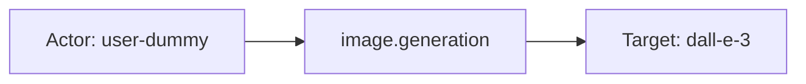

# openai

## Product Domain (OpenAI API/LLM platform observability)

OpenAI provides a commercial API platform for foundation models and related AI services, including chat/completion models, embeddings, image generation, audio transcription and speech synthesis, content moderation, vector stores, and code interpreter sessions. Organizations consume these capabilities programmatically via API keys scoped to projects and users, with usage aggregated at the organization level for billing, capacity planning, and operational oversight.

The OpenAI Usage API exposes time-bucketed metrics that describe how an organization consumes each API surface—request counts, token volumes, audio seconds, image counts, vector store storage, and similar usage dimensions—broken down by model, project, user, and API key where applicable. This is observability data about API consumption patterns, not the content of prompts, responses, or generated artifacts.

The Elastic OpenAI integration polls the Usage API with an organization Admin key via Elastic Agent (CEL input), normalizes usage records into ECS-aligned metric events, and ships them to Elasticsearch for dashboards, alerting, and troubleshooting. It supports configurable collection intervals and bucket widths (1m, 1h, 1d) to balance granularity, storage, and API limits. Primary use cases include tracking token and request trends per model, monitoring spend drivers, detecting usage spikes, and correlating consumption by project, user, or API key.

## Data Collected (brief)

- **Usage metrics** (eight data streams): `completions`, `embeddings`, `images`, `moderations`, `audio_transcriptions`, `audio_speeches`, `vector_stores`, and `code_interpreter_sessions`, collected from the OpenAI Usage API.
- **Common dimensions** (`openai.base.*`): Time bucket start/end, model name, project ID, user ID, API key ID, request count, and usage object type.
- **Completions**: Input/output/cached/audio token counts and batch flag.
- **Embeddings and moderations**: Input token counts.
- **Images**: Image count, size, and source (generation, edit, variation).
- **Audio**: Transcription seconds and text-to-speech character counts.
- **Vector stores**: Storage usage in bytes.
- **Code interpreter**: Session counts.

## Expected Audit Log Entities

The OpenAI integration collects **Usage API metrics only** (`event.kind: metric` on all eight data streams). It polls the [OpenAI Usage API](https://platform.openai.com/docs/api-reference/usage) with an organization Admin key via CEL input; there are no audit logs, authentication events, or administrative action records. All streams are **audit-adjacent usage metrics** — time-bucketed aggregates keyed by consumption dimensions (model, project, user, API key), not per-request audit events. Actor/target semantics below describe **who consumed which API surface** within each bucket, not principals or objects from an auditable action. **`event.action` is absent** in all `sample_event.json` files and no ingest pipeline maps to it (grep across `packages/openai` returns no `event.action` references). No ECS `user.*`, `*.target.*`, `related.*`, `destination.*`, `cloud.*`, or `gen_ai.*` fields are populated; pipelines only set `ecs.version`, `event.kind`, and rename vendor JSON into `openai.*`. Evidence is from `data_stream/*/sample_event.json`, `data_stream/*/fields/fields.yml`, `data_stream/*/elasticsearch/ingest_pipeline/default.yml`, and `data_stream/*/agent/stream/cel.yml.hbs` `group_by` settings; the package has no `*-expected.json` pipeline test fixtures. The target-fields audit classified this package as **`none`** for actor/target enhancement (`dev/target-fields-audit/out/target_enhancement_packages.csv`); no `destination.user.*` / `destination.host.*` usage (`destination_identity_hits.csv` has no `openai` row).

### Event action (semantic)

These streams record **pre-aggregated usage over configurable time buckets** (`1m`/`1h`/`1d`), not individual API invocations. Per classification rule 10, metrics streams (`event.kind: metric`) have **no meaningful per-event action** — there is no verb naming what happened on a single request. The closest vendor signals are the **API surface identifier** (`openai.base.usage_object_type`) and, on the images stream, the **image operation facet** (`openai.images.source`).

| Action (normalized label) | Classification | Confidence | Evidence | Per-stream notes |
| --- | --- | --- | --- | --- |
| `completions_usage` (from `organization.usage.completions.result`) | api_call | moderate | `completions/sample_event.json`: `usage_object_type: organization.usage.completions.result` | Aggregate completion/chat usage within bucket; not a single `ChatCompletion` call |
| `embeddings_usage` (from `organization.usage.embeddings.result`) | api_call | moderate | `embeddings/sample_event.json`: `organization.usage.embeddings.result` | Aggregate embedding API usage |
| `moderations_usage` (from `organization.usage.moderations.result`) | api_call | moderate | `moderations/sample_event.json`: `organization.usage.moderations.result` | Aggregate moderation API usage |
| `images_usage` (from `organization.usage.images.result`) | api_call | moderate | `images/sample_event.json`: `organization.usage.images.result` | Aggregate image API usage; sub-facet `openai.images.source` distinguishes operation type |
| `image.generation` / `image.edit` / `image.variation` | api_call | moderate | `images/sample_event.json`: `source: image.generation`; `fields.yml` documents all three values | Image API sub-operation dimension within bucket; CEL `group_by` includes `source` |
| `audio_transcriptions_usage` (from `organization.usage.audio_transcriptions.result`) | api_call | moderate | `audio_transcriptions/sample_event.json` | Aggregate Whisper transcription usage (seconds) |
| `audio_speeches_usage` (from `organization.usage.audio_speeches.result`) | api_call | moderate | `audio_speeches/sample_event.json` | Aggregate TTS usage (characters) |
| `vector_stores_usage` (from `organization.usage.vector_stores.*`) | api_call | moderate | `vector_stores/sample_event.json`: `organization.usage.vector_stores.<dummy>` | Project-scoped storage aggregate; no per-store operation |
| `code_interpreter_sessions_usage` (from `organization.usage.code_interpreter_sessions.*`) | api_call | moderate | `code_interpreter_sessions/sample_event.json`: `organization.usage.code_interpreter_sessions.<dummy>` | Session-count aggregate; no per-session operation |

If `event.action` were populated for SIEM-style filtering, a derived label from `openai.base.usage_object_type` (e.g. strip `organization.usage.` prefix and `.result` suffix → `completions`, `embeddings`) or the `data_stream.dataset` suffix (`openai.completions` → `completions`) would be the most defensible mapping — but neither is implemented today.

### Event action (ECS candidates)

| ECS / vendor field | Mapped to `event.action` today? | Mapping correct? | Recommended `event.action` value (from fixtures) | Enhancement candidate? | Evidence |
| --- | --- | --- | --- | --- | --- |
| `openai.base.usage_object_type` | no | n/a | `completions`, `embeddings`, `moderations`, `images`, `audio_transcriptions`, `audio_speeches`, `vector_stores`, `code_interpreter_sessions` (derived from `organization.usage.*.result`) | yes | Pipeline rename from API `object` field (e.g. `completions/default.yml` L49–52); all eight `sample_event.json` files |
| `openai.images.source` | no | n/a | `image.generation`, `image.edit`, `image.variation` | partial | `images/sample_event.json`: `image.generation`; sub-operation facet on images stream only; CEL `group_by` includes `source` |
| `data_stream.dataset` | no | n/a | `openai.completions`, `openai.embeddings`, … | partial | Set by agent on every sample; stream discriminator, not vendor operation name |
| `openai.completions.batch` | no | n/a | — | no | Boolean batch-mode dimension; qualifies completions usage, not a standalone action verb |
| `event.action` | no | n/a | — | yes | Not set in any pipeline or sample |
| `event.type` / `event.category` | no | n/a | — | no | Not set; would not substitute for `event.action` without a vendor action source |

**Step 2b — per-stream check:**

| Stream | `event.action` in fixtures? | Pipeline maps to `event.action`? | Primary action candidate | Confidence | Evidence |
| --- | --- | --- | --- | --- | --- |
| `completions` | no | no | `openai.base.usage_object_type` → `completions` | moderate | `completions/sample_event.json`; pipeline sets `event.kind: metric` only (`default.yml` L10–12) |
| `embeddings` | no | no | `openai.base.usage_object_type` → `embeddings` | moderate | `embeddings/sample_event.json`; same pipeline pattern |
| `moderations` | no | no | `openai.base.usage_object_type` → `moderations` | moderate | `moderations/sample_event.json` |
| `images` | no | no | `openai.base.usage_object_type` → `images`; alternate `openai.images.source` | moderate | `images/sample_event.json`; `source: image.generation` adds sub-operation facet |
| `audio_transcriptions` | no | no | `openai.base.usage_object_type` → `audio_transcriptions` | moderate | `audio_transcriptions/sample_event.json` |
| `audio_speeches` | no | no | `openai.base.usage_object_type` → `audio_speeches` | moderate | `audio_speeches/sample_event.json` |
| `vector_stores` | no | no | `openai.base.usage_object_type` → `vector_stores` | moderate | `vector_stores/sample_event.json`; CEL `group_by: ["project_id"]` only |
| `code_interpreter_sessions` | no | no | `openai.base.usage_object_type` → `code_interpreter_sessions` | moderate | `code_interpreter_sessions/sample_event.json`; CEL `group_by: ["project_id"]` only |

### Actor (semantic)

| Entity | Classification | Entity type (if general) | Confidence | Evidence | Per-stream notes |
| --- | --- | --- | --- | --- | --- |
| API consumer (org user) | user | — | moderate | `openai.base.user_id` in six stream `sample_event.json` files and model-usage `fields/fields.yml` base schema; CEL `group_by` includes `user_id` on model-usage streams | **`completions`**, **`embeddings`**, **`moderations`**, **`images`**, **`audio_transcriptions`**, **`audio_speeches`** — opaque OpenAI user identifier (e.g. `"user-dummy"`); consumption dimension, not an authenticated audit principal |
| API credential | general | api_key | moderate | `openai.base.api_key_id` in same six samples and base field definitions; CEL `group_by` includes `api_key_id` on model-usage streams | Same six streams — identifies which org API key drove usage; supplementary to user, not a human actor |
| Organization project (scope) | general | project | low | `openai.base.project_id` in all samples where populated (empty string when unscoped); CEL `group_by` always includes `project_id` | **All streams** — billing/project partition, not an interactive principal |
| Integration collector | service | — | low | Admin key in CEL state (`access_token` from `admin_token`); redacted via `redact.fields`, never indexed | Implicit Elastic Agent poller; not represented on events |

**No actor identity in schema or samples:** **`vector_stores`**, **`code_interpreter_sessions`** — CEL `group_by: ["project_id"]` only; field schemas omit `user_id`, `api_key_id`, and `model`; samples carry project and bucket timestamps only.

### Actor (ECS candidates)

| ECS / vendor field | Role | Mapped today? | Mapping correct? | Confidence | Evidence |
| --- | --- | --- | --- | --- | --- |
| `openai.base.user_id` | API consumer user ID | no | n/a | moderate | Defined in model-usage `fields/fields.yml`; populated in six `sample_event.json` files; pipeline renames from API JSON (e.g. `completions/elasticsearch/ingest_pipeline/default.yml` L38–40) but never copied to ECS `user.id` |
| `openai.base.api_key_id` | API key credential ID | no | n/a | moderate | Same six streams; pipeline rename L41–44; no ECS credential or `user.*` enrichment |
| `openai.base.project_id` | Project / billing scope | no | n/a | low | All streams; pipeline rename L33–36; organizational context, not a security principal |
| `user.id` / `user.*` | Actor identity | no | n/a | — | Not set in any pipeline or sample |
| `client.user.*` | Caller principal | no | n/a | — | Not used |
| `related.user` | Actor cross-reference | no | n/a | — | Not used |
| `destination.user.*` / `destination.host.*` | De-facto target identity | no | n/a | — | Not used (`destination_identity_hits.csv` has no `openai` row) |

### Target (semantic)

| Layer | Description | Entity | Classification | Entity type (if general) | Confidence | Evidence | Per-stream notes |
| --- | --- | --- | --- | --- | --- | --- | --- |
| 1 — Platform / cloud service | OpenAI API platform consumed by the organization | OpenAI API | service | — | moderate | `openai.base.usage_object_type` discriminates API surface (`organization.usage.completions.result`, `organization.usage.embeddings.result`, etc.) in all samples; no `cloud.service.name` set | **All streams** — invoked SaaS platform; inferred from usage object type, not ECS-mapped |
| 2 — Resource / object | Foundation model endpoint | Named OpenAI model | service | — | high | `openai.base.model` in six model-usage samples (e.g. `gpt-4o-mini-2024-07-18`, `dall-e-3`, `whisper-1`, `tts-1`, `text-embedding-ada-002-v2`, `text-moderation:2023-10-25`) | **`completions`**, **`embeddings`**, **`moderations`**, **`images`**, **`audio_transcriptions`**, **`audio_speeches`** — aggregation dimension for model consumption, not per-invocation target |
| 2 — Resource / object | Vector store storage (aggregate) | Vector store usage | general | vector_store | moderate | `openai.vector_stores.usage_bytes`; `usage_object_type: organization.usage.vector_stores.*` | **`vector_stores`** — org/project-level storage consumption; no per-store ID in schema or samples |
| 2 — Resource / object | Code interpreter sessions (aggregate) | Code interpreter workload | general | code_interpreter_session | moderate | `openai.code_interpreter_sessions.sessions`; `usage_object_type: organization.usage.code_interpreter_sessions.*` | **`code_interpreter_sessions`** — session count aggregate; no session or user identifiers |
| 3 — Content / artifact | Time-bucket usage aggregate | Usage bucket | general | usage_bucket | high | `openai.base.start_time`, `openai.base.end_time`, `@timestamp`; `openai.base.num_model_requests` where present | **All streams** — metrics pre-aggregated over configurable bucket width (`1m`/`1h`/`1d`); not per-request audit targets |
| 3 — Content / artifact | Image API usage facets | Image generation dimensions | general | image | moderate | `openai.images.images`, `openai.images.size`, `openai.images.source` (`image.generation`, `image.edit`, `image.variation`); CEL `group_by` adds `size,source` | **`images`** — grouped image API usage, not individual image assets |
| 3 — Content / artifact | Batch inference mode | Batch vs interactive completion | general | batch_job | low | `openai.completions.batch` (boolean); CEL `group_by` includes `batch` | **`completions`** — distinguishes batch vs interactive completion usage within the bucket |

**No meaningful audit target:** Individual prompts, completions, files, vector-store objects, or session instances — the Usage API exposes counts and volumes only, not content or resource IDs. Per classification rule 10, model ID and API-key dimensions are **aggregation targets**, not per-request audit targets.

### Target (ECS candidates)

| ECS / vendor field | Layer | Classification | Mapped today? | Mapping correct? | ECS target bucket | Enhancement candidate? | Evidence |
| --- | --- | --- | --- | --- | --- | --- | --- |
| `openai.base.model` | 2 | service | no | n/a | `gen_ai.request.model.id` / `service.target.entity.id` | yes | Six model-usage samples; pipeline rename (e.g. `completions/default.yml` L29–32); canonical consumed-model dimension |
| `openai.base.usage_object_type` | 1 | service | no | n/a | `service.target.name` / `event.action` | partial | All samples; pipeline rename L49–52; identifies API surface (`organization.usage.*`) but not promoted to ECS |
| `openai.base.num_model_requests` | 3 | general (usage_bucket) | no | n/a | context-only | no | Request count within bucket; metric counter, not entity identity |
| `openai.completions.*` (token counters) | 3 | general (usage_bucket) | no | n/a | context-only | no | `input_tokens`, `output_tokens`, `input_cached_tokens`, audio token fields in `completions/sample_event.json` |
| `openai.embeddings.input_tokens` / `openai.moderations.input_tokens` | 3 | general (usage_bucket) | no | n/a | context-only | no | Token volume counters in respective samples |
| `openai.images.images` / `.size` / `.source` | 3 | general (image) | no | n/a | context-only | no | Image count and dimension facets in `images/sample_event.json` |
| `openai.audio_transcriptions.seconds` | 3 | general (usage_bucket) | no | n/a | context-only | no | Audio duration counter |
| `openai.audio_speeches.characters` | 3 | general (usage_bucket) | no | n/a | context-only | no | TTS character counter |
| `openai.vector_stores.usage_bytes` | 2 | general (vector_store) | no | n/a | context-only | no | Storage byte counter; no store ID |
| `openai.code_interpreter_sessions.sessions` | 2 | general (code_interpreter_session) | no | n/a | context-only | no | Session count counter |
| `openai.completions.batch` | 3 | general (batch_job) | no | n/a | context-only | no | Boolean batch-mode dimension |
| `cloud.service.name` | 1 | service | no | n/a | `service.target.name` | yes | Not set anywhere; static `openai` would identify invoked SaaS platform |
| `gen_ai.request.model.id` | 2 | service | no | n/a | `gen_ai.request.model.id` | yes | Not set; natural ECS home for `openai.base.model` |
| `event.action` | 1 | service | no | n/a | context-only | yes | Not set; natural home for derived API-surface label from `usage_object_type` |
| `user.target.*` / `host.target.*` / `service.target.*` / `entity.target.*` | — | — | no | n/a | — | no | Not populated (`target_enhancement_packages.csv`: all `has_*_target` false) |
| `destination.user.*` / `destination.host.*` | — | — | no | n/a | — | no | Not used |

### Gaps and mapping notes

- **Metrics-only package:** All eight streams set `event.kind: metric` in ingest pipelines; no audit log stream exists. Actor/target ECS enhancement is low priority per `target_enhancement_packages.csv` classification **`none`**.
- **No `event.action` mapping:** Vendor `openai.base.usage_object_type` names the consumed API surface (`organization.usage.completions.result`, etc.) but is not copied to ECS `event.action`. Recommended primary candidate per stream: derive a short label from `usage_object_type` or use `data_stream.dataset` suffix. On **`images`**, `openai.images.source` adds a sub-operation facet (`image.generation`, `image.edit`, `image.variation`) suitable as a secondary action dimension.
- **No per-event action semantics:** Time-bucketed aggregates cannot represent individual API verbs (e.g. `ChatCompletion`, `CreateEmbedding`). Do not infer per-request `event.action` from metric counters.
- **Zero ECS entity promotion:** Pipelines rename Usage API JSON into `openai.base.*` and stream-specific counters only. No `user.id` from `openai.base.user_id`, no `gen_ai.request.model.id` from `openai.base.model`, no static `cloud.provider` / `cloud.service.name`.
- **Consumption dimensions ≠ audit principals:** `openai.base.user_id` and `openai.base.api_key_id` identify who drove usage within a bucket but are not authenticated caller records (no email, name, or session context). Treat as observability attribution, not SIEM actor identity.
- **Aggregation targets, not per-request targets:** Model ID, image size/source, and batch flag are CEL `group_by` dimensions for time-bucketed metrics. They describe what was consumed in aggregate, not individual API invocations or content artifacts.
- **Sparse actor dimensions on two streams:** `vector_stores` and `code_interpreter_sessions` group by `project_id` only; field schemas omit user, API key, and model. Lowest confidence for any actor or granular target mapping.
- **No de-facto `destination.*` targets:** Unlike email/auth integrations, no pipeline maps affected entities to `destination.user.*` or `destination.host.*`.
- **Layer 1 SaaS gap:** `openai.base.usage_object_type` holds the API surface identifier but is not promoted to `cloud.service.name` or `service.target.*`. A static pipeline set of `cloud.service.name: openai` would close Layer 1 ECS coverage.

### Per-stream notes

#### completions, embeddings, moderations, audio_transcriptions, audio_speeches

Model-usage streams share `openai.base.*` dimensions (`model`, `project_id`, `user_id`, `api_key_id`, `num_model_requests`, bucket timestamps). CEL `group_by` includes `project_id,user_id,api_key_id,model` (plus `batch` on completions). Pipelines rename API JSON into `openai.base.*` and stream-specific token/second/character counters; no ECS entity promotion. Actor is best interpreted as **user** + **api_key** credential pair; target is the named **model** (`service`) within a time bucket. **Action:** no `event.action`; primary candidate is `usage_object_type` for the API surface (e.g. `completions`, `embeddings`).

#### images

Same base actor dimensions plus image-specific target facets: `openai.images.source` (generation/edit/variation), `openai.images.size`, and `openai.images.images` count. CEL groups by `project_id,user_id,api_key_id,model,size,source`. **Action:** `openai.images.source` is the only stream with a sub-operation facet beyond `usage_object_type`.

#### vector_stores, code_interpreter_sessions

Project-scoped platform usage without user, API key, or model breakdown in field definitions or samples. CEL `group_by: ["project_id"]` only. Target is aggregate storage (`usage_bytes`) or session counts (`sessions`) at org/project level. No actor identity in schema or samples. **Action:** `usage_object_type` only; no sub-operation dimension.

## Example Event Graph

These examples come from `sample_event.json` fixtures across three OpenAI Usage API data streams (`completions`, `images`, `vector_stores`). All streams emit **audit-adjacent usage metrics** (`event.kind: metric`) — time-bucketed aggregates keyed by consumption dimensions, not per-request audit logs. There is no `event.action` in any fixture; action labels below are derived from vendor fields and are **not mapped to ECS today**.

### Example 1: Completion model usage in a daily bucket

**Stream:** `openai.completions` · **Fixture:** `packages/openai/data_stream/completions/sample_event.json`

```
User (user-dummy) → completions_usage → Foundation model (gpt-4o-mini-2024-07-18)
```

#### Actor

| Field | Value |
| --- | --- |
| id | user-dummy |
| type | user |

**Field sources:**
- `id ← openai.base.user_id`

#### Event action

| Field | Value |
| --- | --- |
| action | completions_usage |
| source_field | `openai.base.usage_object_type` |
| source_value | `organization.usage.completions.result` |

Derived label from vendor usage-object type; **not mapped to `event.action` today**.

#### Target

| Field | Value |
| --- | --- |
| id | gpt-4o-mini-2024-07-18 |
| type | service |
| sub_type | foundation_model |

**Field sources:**
- `id ← openai.base.model`

#### Mermaid


### Example 2: Image generation usage by model

**Stream:** `openai.images` · **Fixture:** `packages/openai/data_stream/images/sample_event.json`

```
User (user-dummy) → image.generation → Foundation model (dall-e-3)
```

#### Actor

| Field | Value |
| --- | --- |
| id | user-dummy |
| type | user |

**Field sources:**
- `id ← openai.base.user_id`

#### Event action

| Field | Value |
| --- | --- |
| action | image.generation |
| source_field | `openai.images.source` |
| source_value | `image.generation` |

Sub-operation facet within the images usage bucket; **not mapped to `event.action` today** (parent API surface is `organization.usage.images.result` on `openai.base.usage_object_type`).

#### Target

| Field | Value |
| --- | --- |
| id | dall-e-3 |
| name | dall-e-3 |
| type | service |
| sub_type | foundation_model |

**Field sources:**
- `id ← openai.base.model`
- `name ← openai.base.model`

#### Mermaid



### Example 3: Project-scoped vector store storage aggregate

**Stream:** `openai.vector_stores` · **Fixture:** `packages/openai/data_stream/vector_stores/sample_event.json`

```
Project scope (unscoped) → vector_stores_usage → Vector store storage (aggregate)
```

This stream groups by `project_id` only; fixtures carry no `user_id`, `api_key_id`, or per-store ID. The graph shows org/project-level storage consumption within a time bucket, not a single store operation.

#### Actor

| Field | Value |
| --- | --- |
| type | general |
| sub_type | project |

**Field sources:**
- `sub_type ← openai.base.project_id` (empty string in fixture — unscoped org-level bucket; no interactive principal)

#### Event action

| Field | Value |
| --- | --- |
| action | vector_stores_usage |
| source_field | `openai.base.usage_object_type` |
| source_value | `organization.usage.vector_stores.<dummy>` |

Derived label from vendor usage-object type; **not mapped to `event.action` today**.

#### Target

| Field | Value |
| --- | --- |
| type | general |
| sub_type | vector_store |

**Field sources:**
- `sub_type ← openai.vector_stores.usage_bytes` (16 bytes in fixture — aggregate storage counter; no store entity ID in schema or sample)

#### Mermaid


## ES|QL Entity Extraction

**Package type: agent-backed** (policy template `openai`, eight Usage API metric data streams with Tier A `sample_event.json` fixtures and ingest pipelines; no `*-expected.json` pipeline tests). Router: **`data_stream.dataset`** values `openai.{stream}` from `packages/openai/data_stream/*/manifest.yml` (confirmed in all eight `sample_event.json` files). All streams set `event.kind: metric`. Pass 4 is **fill-gaps-only**: detection flags run first; mapped columns use **column-level** **5-arg** / **7-arg** / **9-arg** `CASE(<col> IS NOT NULL, <col>, <boolean guard>, <fallback>, null)` — never **4-arg** `CASE(<col> IS NOT NULL, <col>, bare_vendor_field, null)` (bare field parses as a **condition**) or `CASE(actor_exists, <col>, …)` / `CASE(target_exists, <col>, …)` — so one populated sibling (e.g. `entity.id` from `api_key_id` or `service.target.id` from a future ingest promotion) does not block `user.id` / `service.target.name` / `entity.target.sub_type` fallbacks on empty columns (Pass 4 §10). **Pass 4 (CASE syntax):** all fenced `CASE` use odd-arity defaults (`null`) with `(condition, value)` pairs only. Ingest does not populate ECS `user.*`, `*.target.*`, or `event.action` today — fallbacks promote **`openai.base.*`** consumption dimensions per Pass 2/3 (user + API key actor; foundation **model** as `service.target.*`; platform literal on project-only streams). **`vector_stores`** and **`code_interpreter_sessions`** group by `project_id` only — no `user_id` / `api_key_id` / `model` in schema or samples. **Pass 4 (tautology cleanup):** no `CASE(col, col, …)` identity fallbacks; vendor paths (`openai.base.user_id`, `openai.base.model`, etc.) differ from output columns. Treat extraction as **audit-adjacent consumption attribution** (time-bucket aggregates), not per-request audit logs.

### Dataset inventory

| data_stream.dataset | Stream role | Actor classification(s) | Target classification(s) | Extraction |
| --- | --- | --- | --- | --- |
| `openai.completions` | Completion usage metrics | user, general (api_key) | service (model) | partial |
| `openai.embeddings` | Embedding usage metrics | user, general (api_key) | service (model) | partial |
| `openai.moderations` | Moderation usage metrics | user, general (api_key) | service (model) | partial |
| `openai.images` | Image usage metrics | user, general (api_key) | service (model) | partial |
| `openai.audio_transcriptions` | Transcription usage metrics | user, general (api_key) | service (model) | partial |
| `openai.audio_speeches` | TTS usage metrics | user, general (api_key) | service (model) | partial |
| `openai.vector_stores` | Storage usage metrics | general (project) | general (vector_store) | partial |
| `openai.code_interpreter_sessions` | Session count metrics | general (project) | general (code_interpreter) | partial |

### Field mapping plan

#### Actor mappings

| Output column | Source field(s) | Condition (dataset + optional) | Confidence | Notes |
| --- | --- | --- | --- | --- |
| `user.id` | `openai.base.user_id` | `data_stream.dataset IN ("openai.completions", "openai.embeddings", "openai.moderations", "openai.images", "openai.audio_transcriptions", "openai.audio_speeches") AND openai.base.user_id IS NOT NULL` | moderate | **column-level preserve** (`user.id IS NOT NULL`); **vendor fallback** — consumption dimension, not audit principal |
| `entity.id` | `openai.base.api_key_id` | same six datasets AND `openai.base.api_key_id IS NOT NULL` | moderate | **column-level preserve** (`entity.id IS NOT NULL`); **vendor fallback** — API credential |
| `entity.type` | literal `"api_key"` | same six datasets AND `openai.base.api_key_id IS NOT NULL` | moderate | **column-level preserve** (`entity.type IS NOT NULL`); **semantic literal** |
| `entity.id` | `openai.base.project_id` | `data_stream.dataset IN ("openai.vector_stores", "openai.code_interpreter_sessions") AND openai.base.project_id IS NOT NULL AND openai.base.project_id != ""` | low | **column-level preserve**; **vendor fallback** — scoped project; empty `project_id` in fixtures = org-level bucket |
| `entity.type` | literal `"project"` | `data_stream.dataset IN ("openai.vector_stores", "openai.code_interpreter_sessions")` | low | **column-level preserve**; **semantic literal** — Pass 3 Example 3 actor |

#### Target mappings

| Output column | Source field(s) | Condition (dataset + optional) | Confidence | Notes |
| --- | --- | --- | --- | --- |
| `service.target.id` | `openai.base.model` | six model-usage datasets AND `openai.base.model IS NOT NULL` | high | **column-level preserve** (`service.target.id IS NOT NULL`); **vendor fallback** — foundation model (Pass 3 Examples 1–2) |
| `service.target.name` | `openai.base.model` | same | high | **column-level preserve** (`service.target.name IS NOT NULL`); **vendor fallback** |
| `service.target.name` | literal `"OpenAI API"` | `STARTS_WITH(data_stream.dataset, "openai.")` | low | **column-level preserve**; **semantic literal** — Layer 1 platform when no model dimension |
| `entity.target.sub_type` | literal `"vector_store"` | `data_stream.dataset == "openai.vector_stores"` | moderate | **column-level preserve** (`entity.target.sub_type IS NOT NULL`); aggregate storage; no per-store ID |
| `entity.target.sub_type` | literal `"code_interpreter_session"` | `data_stream.dataset == "openai.code_interpreter_sessions"` | moderate | **column-level preserve**; session-count aggregate |
| `entity.target.sub_type` | literal `"foundation_model"` | six model-usage datasets AND `openai.base.model IS NOT NULL` | moderate | **column-level preserve**; Pass 3 model target sub_type |

#### Event action mappings

| Output column | Source field(s) | Condition (dataset + optional) | Confidence | Notes |
| --- | --- | --- | --- | --- |
| `event.action` | `openai.images.source` | `data_stream.dataset == "openai.images" AND openai.images.source IS NOT NULL` | moderate | **column-level preserve** (`event.action IS NOT NULL`); **vendor fallback** — sub-operation facet (Pass 3 Example 2: `image.generation`) |
| `event.action` | literal `"completions"` | `data_stream.dataset == "openai.completions"` | moderate | **semantic literal** — dataset suffix; aligns with Pass 2 `usage_object_type` candidate |
| `event.action` | literal `"embeddings"` | `data_stream.dataset == "openai.embeddings"` | moderate | same pattern |
| `event.action` | literal `"moderations"` | `data_stream.dataset == "openai.moderations"` | moderate | same pattern |
| `event.action` | literal `"images"` | `data_stream.dataset == "openai.images" AND openai.images.source IS NULL` | moderate | API surface when no `source` facet |
| `event.action` | literal `"audio_transcriptions"` | `data_stream.dataset == "openai.audio_transcriptions"` | moderate | same pattern |
| `event.action` | literal `"audio_speeches"` | `data_stream.dataset == "openai.audio_speeches"` | moderate | same pattern |
| `event.action` | literal `"vector_stores"` | `data_stream.dataset == "openai.vector_stores"` | moderate | same pattern |
| `event.action` | literal `"code_interpreter_sessions"` | `data_stream.dataset == "openai.code_interpreter_sessions"` | moderate | same pattern |

`openai.base.usage_object_type` (e.g. `organization.usage.completions.result`) is the primary Pass 2 vendor action candidate but requires string parsing in ES|QL; **`data_stream.dataset` suffix literals** are used instead (fixture-verified on all eight samples).

### Detection flags (mandatory — run first)

```esql
| EVAL
  actor_exists = user.id IS NOT NULL OR user.name IS NOT NULL OR user.email IS NOT NULL
    OR host.id IS NOT NULL OR host.ip IS NOT NULL OR host.name IS NOT NULL
    OR service.id IS NOT NULL OR service.name IS NOT NULL
    OR entity.id IS NOT NULL OR entity.name IS NOT NULL,
  target_exists = user.target.id IS NOT NULL OR user.target.name IS NOT NULL OR user.target.email IS NOT NULL
    OR host.target.id IS NOT NULL OR host.target.ip IS NOT NULL OR host.target.name IS NOT NULL
    OR service.target.id IS NOT NULL OR service.target.name IS NOT NULL
    OR entity.target.id IS NOT NULL OR entity.target.name IS NOT NULL,
  action_exists = event.action IS NOT NULL
```

**Predicate note:** At ingest today, `actor_exists` / `target_exists` / `action_exists` are typically false on OpenAI usage events — fallbacks apply without overwriting populated ECS fields if pipelines add `user.*` / `*.target.*` / `event.action` later. **Actor/target/action `EVAL` blocks use column-level preserve** (`<col> IS NOT NULL`) — not `CASE(actor_exists, <col>, …)` / `CASE(target_exists, <col>, …)` — so `entity.id` from `api_key_id` does not block `user.id` ← `openai.base.user_id`, and `service.target.id` alone does not block `service.target.name` ← `openai.base.model` or `"OpenAI API"` (Pass 4 §10).

**ES|QL `CASE` arity:** Arguments are **(condition, value)** pairs; odd count → last arg is default. Wrong: `CASE(user.id IS NOT NULL, user.id, openai.base.user_id, null)` (4 args — `openai.base.user_id` is a **condition**). Wrong: `CASE(actor_exists, user.id, openai.base.user_id, null)` (same). Right: **5-arg** `CASE(user.id IS NOT NULL, user.id, data_stream.dataset IN ("openai.completions", …) AND openai.base.user_id IS NOT NULL, openai.base.user_id, null)`. **7-arg** when multiple fallbacks apply (e.g. `entity.id` api_key vs project). Do not use `CASE(action_exists, event.action, …)` — use `event.action IS NOT NULL` as the preserve branch.

### Combined ES|QL — actor fields

```esql
| EVAL
  user.id = CASE(
    user.id IS NOT NULL, user.id,
    data_stream.dataset IN ("openai.completions", "openai.embeddings", "openai.moderations", "openai.images", "openai.audio_transcriptions", "openai.audio_speeches") AND openai.base.user_id IS NOT NULL, openai.base.user_id,
    null
  ),
  entity.id = CASE(
    entity.id IS NOT NULL, entity.id,
    data_stream.dataset IN ("openai.completions", "openai.embeddings", "openai.moderations", "openai.images", "openai.audio_transcriptions", "openai.audio_speeches") AND openai.base.api_key_id IS NOT NULL, openai.base.api_key_id,
    data_stream.dataset IN ("openai.vector_stores", "openai.code_interpreter_sessions") AND openai.base.project_id IS NOT NULL AND openai.base.project_id != "", openai.base.project_id,
    null
  ),
  entity.type = CASE(
    entity.type IS NOT NULL, entity.type,
    data_stream.dataset IN ("openai.completions", "openai.embeddings", "openai.moderations", "openai.images", "openai.audio_transcriptions", "openai.audio_speeches") AND openai.base.api_key_id IS NOT NULL, "api_key",
    data_stream.dataset IN ("openai.vector_stores", "openai.code_interpreter_sessions"), "project",
    null
  )
```

### Combined ES|QL — event action

```esql
| EVAL
  event.action = CASE(
    event.action IS NOT NULL, event.action,
    data_stream.dataset == "openai.images" AND openai.images.source IS NOT NULL, openai.images.source,
    data_stream.dataset == "openai.completions", "completions",
    data_stream.dataset == "openai.embeddings", "embeddings",
    data_stream.dataset == "openai.moderations", "moderations",
    data_stream.dataset == "openai.images", "images",
    data_stream.dataset == "openai.audio_transcriptions", "audio_transcriptions",
    data_stream.dataset == "openai.audio_speeches", "audio_speeches",
    data_stream.dataset == "openai.vector_stores", "vector_stores",
    data_stream.dataset == "openai.code_interpreter_sessions", "code_interpreter_sessions",
    null
  )
```

### Combined ES|QL — target fields

```esql
| EVAL
  service.target.id = CASE(
    service.target.id IS NOT NULL, service.target.id,
    data_stream.dataset IN ("openai.completions", "openai.embeddings", "openai.moderations", "openai.images", "openai.audio_transcriptions", "openai.audio_speeches") AND openai.base.model IS NOT NULL, openai.base.model,
    null
  ),
  service.target.name = CASE(
    service.target.name IS NOT NULL, service.target.name,
    data_stream.dataset IN ("openai.completions", "openai.embeddings", "openai.moderations", "openai.images", "openai.audio_transcriptions", "openai.audio_speeches") AND openai.base.model IS NOT NULL, openai.base.model,
    data_stream.dataset IN ("openai.completions", "openai.embeddings", "openai.moderations", "openai.images", "openai.audio_transcriptions", "openai.audio_speeches", "openai.vector_stores", "openai.code_interpreter_sessions"), "OpenAI API",
    null
  ),
  entity.target.sub_type = CASE(
    entity.target.sub_type IS NOT NULL, entity.target.sub_type,
    data_stream.dataset == "openai.vector_stores", "vector_store",
    data_stream.dataset == "openai.code_interpreter_sessions", "code_interpreter_session",
    data_stream.dataset IN ("openai.completions", "openai.embeddings", "openai.moderations", "openai.images", "openai.audio_transcriptions", "openai.audio_speeches") AND openai.base.model IS NOT NULL, "foundation_model",
    null
  )
```

### Full pipeline fragment (optional)

```esql
FROM logs-*, metrics-*
| EVAL
  actor_exists = user.id IS NOT NULL OR user.name IS NOT NULL OR user.email IS NOT NULL
    OR host.id IS NOT NULL OR host.ip IS NOT NULL OR host.name IS NOT NULL
    OR service.id IS NOT NULL OR service.name IS NOT NULL
    OR entity.id IS NOT NULL OR entity.name IS NOT NULL,
  target_exists = user.target.id IS NOT NULL OR user.target.name IS NOT NULL OR user.target.email IS NOT NULL
    OR host.target.id IS NOT NULL OR host.target.ip IS NOT NULL OR host.target.name IS NOT NULL
    OR service.target.id IS NOT NULL OR service.target.name IS NOT NULL
    OR entity.target.id IS NOT NULL OR entity.target.name IS NOT NULL,
  action_exists = event.action IS NOT NULL
| EVAL
  user.id = CASE(
    user.id IS NOT NULL, user.id,
    data_stream.dataset IN ("openai.completions", "openai.embeddings", "openai.moderations", "openai.images", "openai.audio_transcriptions", "openai.audio_speeches") AND openai.base.user_id IS NOT NULL, openai.base.user_id,
    null
  ),
  entity.id = CASE(
    entity.id IS NOT NULL, entity.id,
    data_stream.dataset IN ("openai.completions", "openai.embeddings", "openai.moderations", "openai.images", "openai.audio_transcriptions", "openai.audio_speeches") AND openai.base.api_key_id IS NOT NULL, openai.base.api_key_id,
    data_stream.dataset IN ("openai.vector_stores", "openai.code_interpreter_sessions") AND openai.base.project_id IS NOT NULL AND openai.base.project_id != "", openai.base.project_id,
    null
  ),
  entity.type = CASE(
    entity.type IS NOT NULL, entity.type,
    data_stream.dataset IN ("openai.completions", "openai.embeddings", "openai.moderations", "openai.images", "openai.audio_transcriptions", "openai.audio_speeches") AND openai.base.api_key_id IS NOT NULL, "api_key",
    data_stream.dataset IN ("openai.vector_stores", "openai.code_interpreter_sessions"), "project",
    null
  ),
  event.action = CASE(
    event.action IS NOT NULL, event.action,
    data_stream.dataset == "openai.images" AND openai.images.source IS NOT NULL, openai.images.source,
    data_stream.dataset == "openai.completions", "completions",
    data_stream.dataset == "openai.embeddings", "embeddings",
    data_stream.dataset == "openai.moderations", "moderations",
    data_stream.dataset == "openai.images", "images",
    data_stream.dataset == "openai.audio_transcriptions", "audio_transcriptions",
    data_stream.dataset == "openai.audio_speeches", "audio_speeches",
    data_stream.dataset == "openai.vector_stores", "vector_stores",
    data_stream.dataset == "openai.code_interpreter_sessions", "code_interpreter_sessions",
    null
  ),
  service.target.id = CASE(
    service.target.id IS NOT NULL, service.target.id,
    data_stream.dataset IN ("openai.completions", "openai.embeddings", "openai.moderations", "openai.images", "openai.audio_transcriptions", "openai.audio_speeches") AND openai.base.model IS NOT NULL, openai.base.model,
    null
  ),
  service.target.name = CASE(
    service.target.name IS NOT NULL, service.target.name,
    data_stream.dataset IN ("openai.completions", "openai.embeddings", "openai.moderations", "openai.images", "openai.audio_transcriptions", "openai.audio_speeches") AND openai.base.model IS NOT NULL, openai.base.model,
    data_stream.dataset IN ("openai.completions", "openai.embeddings", "openai.moderations", "openai.images", "openai.audio_transcriptions", "openai.audio_speeches", "openai.vector_stores", "openai.code_interpreter_sessions"), "OpenAI API",
    null
  ),
  entity.target.sub_type = CASE(
    entity.target.sub_type IS NOT NULL, entity.target.sub_type,
    data_stream.dataset == "openai.vector_stores", "vector_store",
    data_stream.dataset == "openai.code_interpreter_sessions", "code_interpreter_session",
    data_stream.dataset IN ("openai.completions", "openai.embeddings", "openai.moderations", "openai.images", "openai.audio_transcriptions", "openai.audio_speeches") AND openai.base.model IS NOT NULL, "foundation_model",
    null
  )
| KEEP @timestamp, data_stream.dataset, event.kind, event.action, user.id, entity.id, entity.type, service.target.id, service.target.name, entity.target.sub_type, openai.base.num_model_requests
```

### Streams excluded

None — all eight streams receive **partial** consumption attribution. None are audit-grade per-event Actor → action → Target pairs (`event.kind: metric` on every stream).

### Gaps and limitations

- **Pass 4 tautology cleanup (§10)** — column-level `IS NOT NULL` preserve on all mapped columns; no `CASE(col, col, …)`; removed duplicate optional-classification `EVAL` (logic lives in actor/target blocks); `event.action` uses `event.action IS NOT NULL` preserve with `openai.images.source` / dataset-suffix literals only — not `CASE(action_exists, event.action, …, event.action, null)`.
- **Pass 4 CASE syntax** — combined actor/action/target blocks and the full pipeline fragment use odd-arity `CASE` (condition/value pairs + trailing `null`); column-level **5-arg** / **7-arg** / **9-arg** / **13-arg** preserve (`<col> IS NOT NULL` first branch). Never **4-arg** `CASE(<col> IS NOT NULL, <col>, bare_vendor_field, null)` or `CASE(actor_exists|target_exists|action_exists, <col>, …)` where a bare field parses as a boolean condition. `service.target.name` uses **7-arg** (model fallback, then dataset-`IN` platform literal).
- **Unscoped `FROM logs-*, metrics-*`** — dataset routing lives in `CASE` fallback conditions (`data_stream.dataset IN (…)`), not a top-level `WHERE`.
- **Metrics-only** — time-bucket aggregates cannot represent individual API verbs (`ChatCompletion`, etc.); `event.action` literals name the API surface or image sub-facet, not a single request.
- **No ECS promotion at ingest** — `openai.base.user_id`, `openai.base.model`, and `openai.base.usage_object_type` require ES|QL vendor fallbacks; ingest-time mapping remains the preferred long-term fix (Pass 2 enhancement candidates).
- **`vector_stores` / `code_interpreter_sessions`** — no `user_id`, `api_key_id`, or `model` in field schemas or samples; actor is project scope only; empty `project_id` yields no `entity.id`.
- **`user.email` / `user.name` / `user.domain`** — not exposed by Usage API dimensions; intentionally omitted.
- **`openai.base.usage_object_type`** — fixture-verified on all streams but not parsed into `event.action` in ES|QL (use dataset suffix literals or future `REPLACE`/`SPLIT` if needed).
- **`openai.images.source`** — mapped to `event.action` when present, not to target columns (Pass 3 sub-operation vs model target).
- **Per-request content targets** (prompts, files, store IDs, sessions) — not exposed by Usage API; intentionally omitted.
- **Target-fields audit `none`** — no `destination.*` or ingest `*.target.*`; query-time promotion is observability attribution only.
