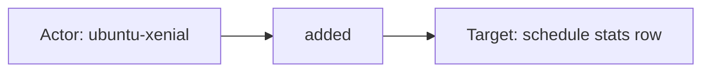
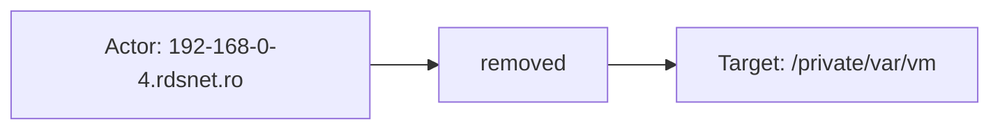

# osquery

## Product Domain (osquery endpoint visibility)

osquery is an open-source endpoint visibility platform that exposes operating system state through a SQL query interface. The `osqueryd` daemon runs scheduled or ad hoc queries against tables backed by live OS APIs—processes, users, files, network sockets, launch agents, kernel modules, and hundreds of other artifacts on Linux, macOS, and Windows. Security and IT teams deploy osquery to answer inventory, compliance, threat-hunting, and configuration-drift questions without installing separate agents for each use case.

Query results are written as structured JSON logs by osquery's filesystem logging driver. Organizations typically organize queries into packs (for example compliance baselines, monitoring schedules, or rootkit detection) and rely on differential actions (`added`, `removed`, `changed`) to track state changes over time. Because the schema is query-driven, the same integration can ingest everything from asset inventory to CIS benchmark checks to custom hunt queries.

The Elastic **Osquery Logs** integration targets this endpoint-visibility slice of the security domain. Elastic Agent tailing `osqueryd` result logs on each host, decodes the JSON, and normalizes common column values into ECS fields while preserving the full query payload under `osquery.result.*`. Kibana dashboards and saved searches support compliance and operational review. Collection is agent-based and scoped to hosts where osquery is installed and configured; it complements log, metrics, and EDR integrations by providing deep, SQL-addressable host state on demand.

## Data Collected (brief)

Logs only (no metrics or alerts). One data stream:

| Data stream | Description |
|---|---|
| **result** | JSON result logs from `osqueryd` (default path `/var/log/osquery/osqueryd.results.log*`), collected via Elastic Agent **logfile** input |

Each event includes the query name, differential action, collection timestamps, host identifier, and query-specific row data in `osquery.result.columns.*`. Decorations such as `host_uuid` and `username` are mapped under `osquery.result.decorations.*`. The ingest pipeline promotes common osquery columns to ECS where applicable (`file.*`, `process.*`, `user.*`, `url.*`, `rule.name`, `related.*`). Events are tagged `osquery` and indexed as `osquery.result`.

## Expected Audit Log Entities

The **Osquery Logs** integration ingests **scheduled query result logs**, not administrative audit records. The single **`result`** stream is inventory and compliance telemetry—query rows and differential snapshots from local OS tables, not "who did what to whom." Actor/target semantics below describe **collection context and query-result subjects** useful for correlation, not principals or objects from an audit trail. For authentication, privilege use, or kernel audit trails, use System, Auditd, Sysmon, or EDR integrations. Evidence is from `data_stream/result/sample_event.json`, `data_stream/result/_dev/test/pipeline/test-osquery.log` (2,213 events across 25 query packs), `data_stream/result/elasticsearch/ingest_pipeline/default.yml`, `data_stream/result/fields/fields.yml`, and `data_stream/result/fields/ecs.yml`. No ECS `*.target.*` fields are declared or populated. The target-fields audit classified this package as **`none`** for actor/target enhancement (`out/target_enhancement_packages.csv`). `osquery` does not appear in `out/destination_identity_hits.csv` (no `destination.user.*` / `destination.host.*` usage).

**`event.action` is populated** on every result row. The ingest pipeline copies osquery's differential action label from `osquery.result.action` to `event.action` (`default.yml` L70–73). Fixtures show `added` (`sample_event.json`; 2,209 of 2,213 test-log events) and `removed` (4 events, e.g. `pack_it-compliance_mounts` on `/private/var/vm`). Osquery also supports `changed` (`fields.yml`) but no `changed` rows appear in the test fixture. These values describe **query-result state deltas** (row appeared/disappeared/changed between scheduled runs), not security audit verbs such as login, file-modify, or policy-update. `event.type` is statically set to `[info]` (`default.yml` L68–69) — event classification, not an operation name. Query identity is mapped separately to `rule.name` ← `osquery.result.name`.

### Event action (semantic)

Osquery differential logging records **how a query row changed** since the last execution, not who performed an OS action. The action vocabulary is osquery-native: `added`, `removed`, and (when enabled) `changed`.

| Action (normalized label) | Classification | Confidence | Evidence | Per-stream notes |
| --- | --- | --- | --- | --- |
| `added` | detection | high | `sample_event.json` (`event.action: added`); 2,209/`"action":"added"` rows in `test-osquery.log` | **`result`** — row newly present in query output (compliance hit, new mount, schedule stat, etc.) |
| `removed` | detection | high | 4× `"action":"removed"` in `test-osquery.log` (e.g. `pack_it-compliance_mounts`, path `/private/var/vm`) | **`result`** — row no longer returned by query |
| `changed` | detection | moderate | Documented in `fields.yml` (`osquery.result.action`); osquery differential spec | **`result`** — row value changed between runs; **not present** in test fixture |

There is no per-event security or administrative verb. Pair with `rule.name` (query/pack name) and `osquery.result.columns.*` to interpret *what* changed, not *who* changed it.

### Event action (ECS candidates)

| ECS / vendor field | Mapped to `event.action` today? | Mapping correct? | Recommended `event.action` value (from fixtures) | Enhancement candidate? | Evidence |
| --- | --- | --- | --- | --- | --- |
| `osquery.result.action` | yes | yes | `added`, `removed` | no | Vendor source; retained under `osquery.result.*`; copied by `default.yml` L70–73 |
| `event.action` | yes | partial | `added` (`sample_event.json`); `removed` (test log) | no | Correct for osquery differential semantics; **not** an audit-grade operation verb |
| `event.type` | no | n/a | `[info]` (static) | no | `default.yml` L68–69 — ECS event type, not action |
| `event.kind` | no | n/a | `event` (static) | no | `default.yml` L65–66 — document kind, not action |
| `osquery.result.name` | no | n/a | e.g. `pack_osquery-monitoring_schedule` | no | Mapped to `rule.name` (`default.yml` L157–158) — identifies query/pack, not differential verb |
| `rule.name` | no | n/a | — | no | Query context field; correctly separate from `event.action` |

**Step 2b — per-stream check:**

| Stream | `event.action` in fixtures? | Pipeline maps to `event.action`? | Primary action candidate | Confidence | Evidence |
| --- | --- | --- | --- | --- | --- |
| `result` | yes | yes | `osquery.result.action` | high | `sample_event.json`: `added`; `default.yml` L70–73; `test-osquery.log`: `added` (2,209), `removed` (4) |

No `event.action` enhancement recommended — mapping is complete for osquery differential actions. Do not substitute `rule.name` or `event.type` for `event.action`.

### Actor (semantic)

| Entity | Classification | Entity type (if general) | Confidence | Evidence | Per-stream notes |
| --- | --- | --- | --- | --- | --- |
| Monitored endpoint | host | — | high | `osquery.result.decorations.host_uuid` → `host.id`; `osquery.result.host_identifier` → `host.hostname`; `related.hosts` (`default.yml`; `ubuntu-xenial` / `192-168-0-4.rdsnet.ro` in test log) | **`result`** — host where `osqueryd` runs; implicit collection scope on every event |
| Interactive user (decoration) | user | — | high | `osquery.result.decorations.username` → `user.name`, `related.user` (`default.yml`; `ubuntu`, `tsg` in all 2,213 test events) | **`result`** — logged-in or configured decoration user; not proof of who triggered the query |
| osquery daemon process | general | process | moderate | `osquery.result.decorations.name`/`path`/`pid` (`fields.yml`; `osqueryd`, `/usr/bin/osqueryd`, `10917` on `system_info` query in test log) | **`result`** — optional decoration when enabled; **not** mapped to ECS `process.*` |
| Column-level process name | general | process | moderate | `osquery.result.columns.process` → `process.name` (`default.yml`; `pack_it-compliance_alf_explicit_auths`, `pack_it-compliance_alf_services`) | **`result`** — process named in query row (e.g. ALF exception auth); only `process.name` promoted |
| Column-level account owner | user | — | low | `osquery.result.columns.username`, `uid`, `gid`, `groupname`, `user_uuid` in `fields.yml`; present on browser-plugin, extension, and disk-encryption rows in test log | **`result`** — file/plugin owner from osquery table; **not** mapped to ECS `user.*` (only decoration username is) |
| Scheduled query / pack | general | detection-rule | high | `osquery.result.name` → `rule.name` (e.g. `pack_osquery-monitoring_schedule`, `pack_it-compliance_mounts` in test log) | **`result`** — identifies which query produced the row; compliance or hunt context, not a human actor |
| Elastic Agent collector | service | — | low | `agent.*`, `elastic_agent.*` in `sample_event.json` | **`result`** — log shipper; not an osquery principal |

**No audit actor identity:** osquery results carry no administrator, API caller, or session principal. Differential `event.action` values (see Event action above) describe query-result state, not who triggered an OS change.

### Actor (ECS candidates)

| ECS / vendor field | Role | Mapped today? | Mapping correct? | Confidence | Evidence |
| --- | --- | --- | --- | --- | --- |
| `host.id` | Collection host UUID | yes | yes | high | `default.yml` set from `osquery.result.decorations.host_uuid`; `sample_event.json` |
| `host.hostname` | osquery host identifier | yes | yes | high | `default.yml` set from `osquery.result.host_identifier`; `sample_event.json` |
| `host.name`, `host.ip`, `host.os.*` | Agent-enriched host metadata | yes | n/a | high | `sample_event.json`, `agent.yml` — Elastic Agent scope, not osquery decoration |
| `user.name` | Decoration username | yes | partial | high | `default.yml` from `osquery.result.decorations.username` — configured/logged-in user context, not query trigger |
| `related.user` | Enrichment array | yes | yes | high | `default.yml` append from `user.name` |
| `related.hosts` | Enrichment array | yes | yes | high | `default.yml` append from `host.hostname` |
| `process.name` | Column process name | yes | partial | moderate | `default.yml` from `osquery.result.columns.process` — row subject, not daemon actor |
| `rule.name` | Query/pack name | yes | partial | high | `default.yml` from `osquery.result.name` — detection/compliance context, not ECS rule engine |
| `osquery.result.decorations.name`/`path`/`pid` | osqueryd process decoration | yes (vendor) | n/a | moderate | `fields.yml`; present on `system_info` in test log; no ECS `process.*` promotion |
| `osquery.result.decorations.username` | Canonical decoration user | yes (vendor) | yes | high | Source for `user.name`; retained under vendor namespace |
| `osquery.result.host_identifier` | Canonical host identifier string | yes (vendor) | yes | high | Source for `host.hostname`; retained under vendor namespace |
| `osquery.result.columns.username`, `uid`, `gid`, `groupname`, `user_uuid` | Row-level account owner | yes (vendor) | n/a | moderate | `fields.yml`; query-dependent; no ECS user mapping |
| `agent.id`, `agent.name` | Elastic Agent collector | yes | n/a | low | `sample_event.json` — shipper, not event actor |
| `cloud.*`, `container.*` | Deployment scope | yes | n/a | moderate | `agent.yml`; agent metadata when present |

### Target (semantic)

| Layer | Description | Entity | Classification | Entity type (if general) | Confidence | Evidence | Per-stream notes |
| --- | --- | --- | --- | --- | --- | --- | --- |
| 2 — Resource / object | File on disk | File path / inode | general | file | high | `osquery.result.columns.path`/`filename`/`directory`/`inode`/`mode`/`size`/`atime`/`mtime`/`ctime` → ECS `file.*` (`default.yml`, `fields.yml`; majority of file-column rows, e.g. `pack_ossec-rootkit_*`, `pack_it-compliance_keychain_items`) | **`result`** — primary subject for rootkit hunts and compliance file checks |
| 2 — Resource / object | Installed software package | Debian/Homebrew/macOS package | general | software-package | high | `columns.name`, `version`, `arch`, `source`, `revision` (`pack_it-compliance_deb_packages`); `path`/`version` (`pack_it-compliance_homebrew_packages`); `package_id`/`installer_name` (`pack_it-compliance_package_receipts`) | **`result`** — package inventory; no ECS `package.*` promotion |
| 2 — Resource / object | macOS application / bundle | Installed application | general | application | high | `bundle_identifier`, `bundle_name`, `display_name`, `bundle_executable`, `bundle_version` (`pack_it-compliance_installed_applications` in test log) | **`result`** — installed app inventory |
| 2 — Resource / object | Browser plugin / extension | Browser add-on | general | browser-extension | high | `identifier`, `name`, `path`, `author`, `update_url` (`pack_it-compliance_browser_plugins`, `pack_it-compliance_chrome_extensions`, `pack_it-compliance_firefox_addons`) | **`result`** — extension inventory |
| 2 — Resource / object | Launch daemon / agent | launchd item | service | launchd | high | `label`, `program`, `program_arguments`, `path`, `run_at_load`, `start_interval` (`pack_it-compliance_launchd`) | **`result`** — persistence and startup item visibility |
| 2 — Resource / object | Kernel module | Loaded module | general | kernel-module | moderate | `name`, `address`, `size`, `status`, `used_by` (`pack_it-compliance_kernel_modules`) | **`result`** — loaded module snapshot |
| 2 — Resource / object | Filesystem mount | Mount point | general | mount | moderate | `device`, `path`, `type`, block/inode counters (`pack_it-compliance_mounts`; `removed` action on `/private/var/vm` in test log) | **`result`** — mount-point inventory |
| 2 — Resource / object | USB device | Attached hardware | general | usb-device | moderate | `vendor`, `model`, `serial`, `usb_address`, `usb_port`, `class` (`pack_it-compliance_usb_devices`) | **`result`** — attached hardware |
| 2 — Resource / object | Keychain item | macOS keychain entry | general | credential-store | moderate | `label`, `path`, `type`, `created`, `modified` (`pack_it-compliance_keychain_items`) | **`result`** — keychain inventory |
| 2 — Resource / object | Disk encryption volume | Encrypted volume | general | encrypted-volume | moderate | `uuid`, `encrypted`, `name`, `type`, `uid`, `user_uuid` (`pack_it-compliance_disk_encryption`) | **`result`** — FileVault/volume encryption state |
| 2 — Resource / object | Firewall / SIP posture | Host security config | general | security-config | moderate | ALF: `global_state`, `stealth_enabled`, `allow_signed_enabled` (`pack_it-compliance_alf`); SIP: `config_flag`, `enabled` (`pack_it-compliance_sip_config`); ALF exceptions: `path`, `state` | **`result`** — host security configuration, not a network peer |
| 2 — Resource / object | Monitored endpoint (attribute snapshot) | Local host | host | — | moderate | `cpu_brand`, `physical_memory`, `hostname` (`system_info`); `build`, `version`, `platform` (`pack_it-compliance_os_version`) | **`result`** — endpoint attribute snapshot; measured object, not audit target of an action |
| 3 — Content / artifact | Remote URL (extension source) | Download/update URL | general | url | low | `columns.source_url` → `url.full` when value is not the string `null` (`default.yml`; URL rows in test log) | **`result`** — browser-addon download/update URL only |
| 3 — Content / artifact | Query schedule row (monitoring) | Per-query execution stats | general | query-schedule | moderate | `columns.name` (sub-query), `executions`, `interval`, `last_executed`, `wall_time` (`pack_osquery-monitoring_schedule`; matches `sample_event.json`) | **`result`** — meta-artifact: osquery pack execution stats, not an OS object |

**No meaningful audit target:** Differential `event.action` (`added`/`removed`/`changed`) and static `event.type: info` describe **state appearance/disappearance** in query results, not authorization outcomes. Layer 1 (platform/cloud service) does not apply—on-host SQL inventory, not a SaaS API invocation.

### Target (ECS candidates)

| ECS / vendor field | Layer | Classification | Mapped today? | Mapping correct? | ECS target bucket | Enhancement candidate? | Evidence |
| --- | --- | --- | --- | --- | --- | --- | --- |
| `file.path`, `file.name`, `file.directory`, `file.inode`, `file.mode`, `file.size`, `file.type`, `file.uid`, `file.gid`, `file.accessed`, `file.created`, `file.mtime` | 2 | general | yes | yes | context-only | no | `default.yml` from `osquery.result.columns.*`; `ecs.yml`; file-column rows in test log |
| `process.name` | 2 | general | yes | partial | context-only | no | `default.yml` from `columns.process` — row subject (ALF auth), not `process.target.*` |
| `url.full` | 3 | general | yes | yes | context-only | no | `default.yml` from `columns.source_url` when not `null` |
| `rule.name` | 3 | general | yes | partial | context-only | no | `default.yml` from `osquery.result.name` — query/pack identifier |
| `host.hostname`, `host.id` | 2 | host | yes | n/a | context-only | no | Measurement subject (monitored endpoint), not `host.target.*` |
| `osquery.result.columns.*` (unmapped) | 2 | varies | yes (vendor) | n/a | context-only | no | Full query row retained; schema varies by SQL — packages, apps, launchd, mounts, USB, keychain, etc. (`fields.yml`) |
| `event.action` | 3 | general | yes | partial | context-only | no | `default.yml` L70–73 from `osquery.result.action` — differential verb, not audit target |
| `osquery.result.action` | 3 | general | yes (vendor) | yes | context-only | no | Canonical differential label; source for `event.action` |
| `osquery.result.name` | 3 | general | yes (vendor) | n/a | context-only | no | Canonical query name; also mapped to `rule.name` |

No `user.target.*`, `host.target.*`, `service.target.*`, `entity.target.*`, or `destination.*` identity fields anywhere in the package.

### Gaps and mapping notes

- **`event.action` mapped and semantically correct for osquery:** `osquery.result.action` → `event.action` (`default.yml` L70–73). Values are differential state labels (`added`, `removed`, `changed`), not security audit verbs — no further mapping needed; do not overload with `rule.name` or query pack names.
- **Inventory telemetry, not audit events:** Query result logs report OS state snapshots and differential changes. No administrator, API caller, or authorization outcome is recorded.
- **Fixed ECS promotion subset:** Pipeline maps only file, decoration user/host, column process name, source URL, and query name. Most row identity (`columns.username`, `uid`, `bundle_identifier`, `label`, etc.) stays vendor-only under `osquery.result.columns.*`.
- **`user.name` from decoration only:** Column-level account owners are not promoted to ECS `user.*`; only `osquery.result.decorations.username` maps to `user.name`. Do not treat decoration user as the actor who triggered the query.
- **`file.uid`/`file.gid` vs user identity:** File ownership columns map to `file.uid`/`file.gid`, not `user.id` — correct for file metadata, not account target identity.
- **`process.name` ambiguity:** Maps from row `columns.process` (ALF exception subject) and is not the osqueryd daemon (`decorations.name`/`pid` stay vendor-only).
- **No de-facto targets under `destination.*`:** Package does not use `destination.user.*` or `destination.host.*`; aligns with `destination_identity_hits.csv` absence.
- **No ECS `*.target.*` fields:** Aligns with target-fields audit classification **`none`**. Enhancement to official target buckets is not applicable without log-based audit semantics.
- **Pair with audit integrations:** System auth logs, Auditd, Sysmon, or Elastic Defend for audit-grade actor/target coverage.

### Per-stream notes

#### result

Single log stream tailing `osqueryd` JSON result logs. Every event includes `osquery.result.name` (query/pack), `osquery.result.action` → `event.action` (`added`/`removed`/`changed`), and host decorations. The ingest pipeline copies the raw JSON under `osquery.result.*`, promotes a **fixed subset** of file/process/user/url columns to ECS, and sets `rule.name` from the query name. Target identity is **entirely query-dependent**: IT-compliance packs in the test fixture cover macOS posture (ALF, SIP, launchd, keychain, apps, extensions, mounts, USB); rootkit packs emit file-path hits; `pack_osquery-monitoring_schedule` reports per-query execution metrics. Because schemas vary by SQL, most row fields stay vendor-namespaced—pair with `event.action` + `rule.name` filters or custom ingest for richer ECS entity mapping.

## Example Event Graph

Examples below come from the single **`result`** stream. These are scheduled query result logs (inventory and compliance telemetry), not administrative audit records. `event.action` values (`added`, `removed`) describe differential state in query output, not who performed an OS change.

### Example 1: Query schedule execution stats

**Stream:** `osquery.result` · **Fixture:** `packages/osquery/data_stream/result/sample_event.json`

```
Monitored host (ubuntu-xenial) → added → query schedule stats row (pack_ossec-rootkit_55808.a_worm)
```

#### Actor

| Field | Value |
| --- | --- |
| id | 72E1287B-D1BC-4FC6-B9D8-64F4352776A9 |
| name | ubuntu-xenial |
| type | host |

**Field sources:**
- `id ← osquery.result.decorations.host_uuid` (mapped to `host.id`)
- `name ← osquery.result.host_identifier` (mapped to `host.hostname`)

#### Event action

| Field | Value |
| --- | --- |
| action | added |
| source_field | `event.action` |
| source_value | added |

Differential label — the host did not perform an add operation; the row newly appeared in scheduled query output (`osquery.result.name`: `pack_osquery-monitoring_schedule`).

#### Target

| Field | Value |
| --- | --- |
| id | pack_ossec-rootkit_55808.a_worm |
| name | pack_ossec-rootkit_55808.a_worm |
| type | general |
| sub_type | query-schedule |

**Field sources:**
- `id ← osquery.result.columns.name` (sub-query name within `pack_osquery-monitoring_schedule`)
- `name ← osquery.result.columns.name`
- Query pack context ← `rule.name` / `osquery.result.name` (`pack_osquery-monitoring_schedule`)

#### Mermaid



### Example 2: Rootkit hunt file row appeared

**Stream:** `osquery.result` · **Fixture:** `packages/osquery/data_stream/result/_dev/test/pipeline/test-osquery.log` (line 61, `pack_ossec-rootkit_adore_worm`)

```
Monitored host (ubuntu-xenial) → added → file /usr/bin/adore
```

#### Actor

| Field | Value |
| --- | --- |
| id | 72E1287B-D1BC-4FC6-B9D8-64F4352776A9 |
| name | ubuntu-xenial |
| type | host |

**Field sources:**
- `id ← osquery.result.decorations.host_uuid`
- `name ← osquery.result.host_identifier`

#### Event action

| Field | Value |
| --- | --- |
| action | added |
| source_field | `event.action` |
| source_value | added |

#### Target

| Field | Value |
| --- | --- |
| id | /usr/bin/adore |
| name | adore |
| type | general |
| sub_type | file |

**Field sources:**
- `id ← osquery.result.columns.path` (mapped to `file.path`)
- `name ← osquery.result.columns.filename` (mapped to `file.name`)

#### Mermaid


### Example 3: Mount point no longer in query results

**Stream:** `osquery.result` · **Fixture:** `packages/osquery/data_stream/result/_dev/test/pipeline/test-osquery.log` (line 1, `pack_it-compliance_mounts`)

```
Monitored host (192-168-0-4.rdsnet.ro) → removed → mount /private/var/vm
```

#### Actor

| Field | Value |
| --- | --- |
| id | 4AB2906D-5516-5794-AF54-86D1D7F533F3 |
| name | 192-168-0-4.rdsnet.ro |
| type | host |

**Field sources:**
- `id ← osquery.result.decorations.host_uuid`
- `name ← osquery.result.host_identifier`

#### Event action

| Field | Value |
| --- | --- |
| action | removed |
| source_field | `event.action` |
| source_value | removed |

#### Target

| Field | Value |
| --- | --- |
| id | /private/var/vm |
| name | /private/var/vm |
| type | general |
| sub_type | mount |

**Field sources:**
- `id ← osquery.result.columns.path` (mapped to `file.path`)
- `name ← osquery.result.columns.path`
- `sub_type ← rule.name` / query pack `pack_it-compliance_mounts` (mount inventory)

#### Mermaid



## ES|QL Entity Extraction

**Package type: agent-backed** (`policy_templates`, single `data_stream/result` with Tier A fixtures: `sample_event.json`, `test-osquery.log` / `test-osquery.log-expected.json`, ingest pipeline `default.yml`). Router: **`data_stream.dataset == "osquery.result"`** per `sample_event.json`; scope with `FROM logs-osquery-*` or unscoped `FROM logs-*`. Pass 4 is **fill-gaps-only**, but this integration ingests **scheduled query result logs** (inventory, compliance, hunt telemetry), not administrative audit records. Cross-package queries do not use `WHERE data_stream.dataset` — embed `data_stream.dataset == "osquery.result"` in every CASE fallback branch when EVAL is added. `event.action` is populated at ingest from `osquery.result.action` (`added` / `removed` / `changed`) — differential row state, not security verbs. No ECS `*.target.*` at collection (target-fields audit **`none`**). Pass 3 confirms **no per-event Actor → action → Target audit graph** — collection host and query-row subjects are correlation context only. Package does not use `destination.*` identity fields (`destination_identity_hits.csv` absence). **No preserve-first `EVAL` blocks are produced** — document `osquery.result` under **Streams excluded** rather than promoting decoration `user.name`, ingest `file.*`, or vendor `osquery.result.columns.*` to audit `user.target.*` / `entity.target.*`. **Pass 4 tautology cleanup (§10):** ingest-populated `host.id`, `host.hostname`, `user.name`, `event.action`, and query-dependent `file.*` / `process.name` have no alternate query-time source (vendor paths renamed or retained under `osquery.result.*` only) — omit from actor/target/action `EVAL`; do not emit `CASE(actor_exists, col, …, col, null)`, `CASE(action_exists, event.action, …, event.action, null)`, or `CASE(target_exists, file.path, …, file.path, null)` / `entity.target.id` ← `file.path` mislabels row context as audit target.

### Dataset inventory

| data_stream.dataset | Stream role | Actor classification(s) | Target classification(s) | Extraction |
| --- | --- | --- | --- | --- |
| `osquery.result` | query result / inventory | — | — | none |

### Field mapping plan

No actor or target destination columns are populated. Audit-adjacent fields on `osquery.result` describe collection scope (`host.id`, `host.hostname`), decoration context (`user.name`), differential verbs (`event.action`), or query-row subjects (`file.*`, `process.name`, `url.full`, `rule.name`) — not principals or acted-upon resources in an audit trail (Pass 2/3). Columns below are **ingest-only — omit from ES|QL** (no alternate indexed source for audit extraction; fallback would repeat the same column per §10).

#### Actor mappings

| Output column | Source field(s) | Condition (dataset + optional) | Confidence | Notes |
| --- | --- | --- | --- | --- |
| — | — | — | — | No audit actor on `osquery.result`; `host.*` is collection scope |
| `host.id` | `osquery.result.decorations.host_uuid` → `host.id` | `data_stream.dataset == "osquery.result"` | high | **ingest-only — no ES\|QL** — `default.yml` L144–146; `sample_event.json`; omit — `CASE(actor_exists, host.id, …, host.id, null)` is identity no-op |
| `host.hostname` | `osquery.result.host_identifier` → `host.hostname` | `data_stream.dataset == "osquery.result"` | high | **ingest-only — no ES\|QL** — `default.yml` L140–142; omit — no flat query-time vendor path distinct from output |
| `user.name` | `osquery.result.decorations.username` → `user.name` | `data_stream.dataset == "osquery.result"` | high | **ingest-only — no ES\|QL** — decoration context, not query trigger (`default.yml` L132–134); omit — `CASE(actor_exists, user.name, …, user.name, null)`; column-level `osquery.result.columns.username` is vendor-only and must not wire as fallback |
| `process.name` | `osquery.result.columns.process` → `process.name` | `data_stream.dataset == "osquery.result"` | moderate | **ingest-only — no ES\|QL** — row subject (ALF exception), not daemon actor; omit from actor `EVAL` |

#### Target mappings

| Output column | Source field(s) | Condition (dataset + optional) | Confidence | Notes |
| --- | --- | --- | --- | --- |
| — | — | — | — | No audit target; query-result subjects are context-only (Pass 3) |
| `entity.target.id` / `entity.target.name` | — | `data_stream.dataset == "osquery.result"` | high | **omit** — `file.path` / `columns.path` are row inventory, not `entity.target.*`; `CASE(target_exists, entity.target.id, file.path, null)` mislabels hunt/compliance rows |
| `user.target.*` / `host.target.*` / `service.target.*` | — | `data_stream.dataset == "osquery.result"` | high | **omit** — no ECS `*.target.*` at ingest; promotion from `file.*` or `user.name` duplicates measurement dimensions |

#### Event action mappings

| Output column | Source field(s) | Condition (dataset + optional) | Confidence | Notes |
| --- | --- | --- | --- | --- |
| `event.action` | `osquery.result.action` → `event.action` | `data_stream.dataset == "osquery.result"` | high | **ingest-only — no ES\|QL** — `default.yml` L70–73; every fixture row has `added` or `removed`; omit — `CASE(action_exists, event.action, …, event.action, null)` or `osquery.result.action` fallback is identity no-op; do not substitute `rule.name` |

### Detection flags (mandatory — run first)

Not applicable — stream excluded (inventory/compliance telemetry; no defensible preserve-first fallback without misclassifying decoration user, file row, or mount/package columns as audit actor/target). Do not emit detection flags solely to wrap tautological `CASE` on ingest-populated `host.*`, `user.name`, or `event.action`.

### Combined ES|QL — actor fields

Not applicable — stream excluded (inventory/compliance telemetry). Do not emit `CASE(actor_exists, host.id, host.id, null)`, `CASE(actor_exists, host.hostname, host.hostname, null)`, `CASE(actor_exists, user.name, user.name, null)`, or `CASE(actor_exists, user.name, data_stream.dataset == "osquery.result", osquery.result.decorations.username, null)` when decoration username is already copied to `user.name` at ingest.

### Combined ES|QL — event action

Not applicable — `event.action` ingest-only on every fixture row (`default.yml` L70–73). Do not emit `CASE(action_exists, event.action, event.action, null)` or `CASE(action_exists, event.action, data_stream.dataset == "osquery.result", osquery.result.action, null)` — vendor field is template source only; do not substitute `rule.name` or pack names for differential verbs.

### Combined ES|QL — target fields

Not applicable — stream excluded (inventory/compliance telemetry). Do not emit `CASE(target_exists, entity.target.id, file.path, null)`, `CASE(target_exists, user.target.name, user.name, null)`, or promote `osquery.result.columns.*` to `*.target.*` across 25+ query packs.

### Streams excluded

- **`osquery.result`** — Scheduled `osqueryd` JSON result logs (`logfile` input). `event.action` (`added`/`removed`/`changed`) describes query-row state deltas, not who changed OS state. `host.id` / `host.hostname` ← decorations identify where `osqueryd` runs, not audit principals. `file.*` / `process.name` / `url.full` are promoted row context, not `*.target.*`. Pair with System, Auditd, Sysmon, or Elastic Defend for audit-grade actor/target coverage.

### Gaps and limitations

- **Inventory telemetry by design:** No administrator, API caller, or authorization outcome in result logs; Pass 2/3 semantics forbid cross-integration actor/target `EVAL`.
- **Target-fields audit `none`:** No ECS `*.target.*` or `destination.*` fields; query-time promotion would guess wrong across 25+ query packs in `test-osquery.log`.
- **Pass 4 tautology cleanup (§10):** `host.id`, `host.hostname`, `user.name`, `event.action`, and ingest-promoted `file.*` / `process.name` omitted from all `EVAL` blocks — ingest-only with no distinct query-time fallback; `osquery.result.columns.username` stays vendor-only (do not wire as `user.name` fallback).
- **CASE arity (esql-entity-mapping §Syntax):** Forbidden **4-arg** `CASE(action_exists, event.action, osquery.result.action, null)` and `CASE(actor_exists, user.name, osquery.result.decorations.username, null)` — 3rd argument parses as a **condition**, not a fallback value; even **5-arg** `CASE(action_exists, event.action, data_stream.dataset == "osquery.result", osquery.result.action, null)` is an identity no-op because ingest already copies the vendor field. Valid **3-arg** `CASE(user.name IS NOT NULL, user.name, osquery.result.decorations.username)` is still omitted (decoration copied at ingest). Forbidden **4-arg** `CASE(target_exists, entity.target.id, file.path, null)` — `file.path` is a condition, not `entity.target.id`; row inventory must not map to `*.target.*`.
- **Query-dependent row schema:** `osquery.result.columns.*` varies by SQL; ingest promotes only a fixed subset (`file.*`, `process.name`, `url.full`, `rule.name`).
- **`process.name` ambiguity:** Maps from row `columns.process` (ALF exception subject), not `osqueryd` daemon (`decorations.name`/`pid` unmapped to ECS `process.*`).
- **Pass 2 alignment:** `event.action` ← `osquery.result.action` is complete at ingest; do not overload with `rule.name`. Enhancement to `*.target.*` requires audit semantics this package does not collect.
