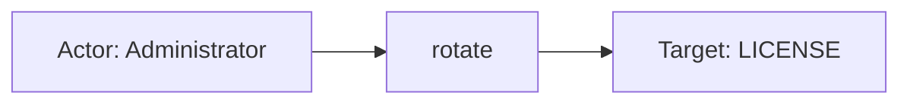
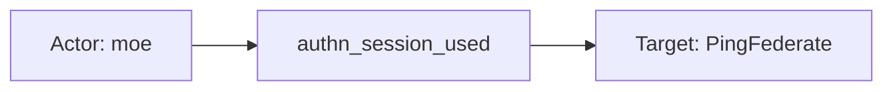

# ping_federate

## Product Domain (PingFederate SSO/IAM)

PingFederate is Ping Identity’s enterprise federated identity server for single sign-on (SSO), identity federation, and access management. Organizations deploy it on-premises or in hybrid environments to act as an identity provider (IdP), service provider (SP), or both—brokering trust between applications, partners, and user directories via standards such as SAML 2.0, OAuth 2.0, and OpenID Connect.

At its core, PingFederate manages authentication and authorization flows, token and session lifecycle, connection/partner configuration, and administrative operations through the Administrative Console and Administrative API. Security-relevant activity falls into two log families: admin audit records (who changed what in the platform) and security audit records (authentication, authorization, and federation transactions). These logs support compliance, SSO troubleshooting, and detection of unauthorized access or misconfiguration.

The Elastic PingFederate integration ingests both log types via Elastic Agent—admin logs from `admin.log` (pipe-delimited format, filestream only) and audit logs in CEF format (filestream, TCP, or UDP/syslog). Events are parsed into ECS-aligned fields for search, dashboards, and correlation with broader SIEM data.

## Data Collected (brief)

- **Admin logs** (`ping_federate.admin`): Actions in the Administrative Console and via the Administrative API, collected from `admin.log` via filestream.
- **Admin context**: Administrator username, roles, source IP, PingFederate component, event type and detail ID, and message; mapped to ECS `user`, `source`, and `event.action`/`event.category`.
- **Audit logs** (`ping_federate.audit`): Authentication, authorization, and federation transactions in CEF format, via filestream, TCP, or UDP.
- **Federation details**: Subject/user, protocol (e.g., SAML20), IdP/SP role, connection/partner ID, target application URL, attributes, local user ID, tracking ID, and transaction status (success/failure).
- **Outcome and timing**: Event code (e.g., `AUTHN_SESSION_DELETED`), outcome, severity, response time, client source IP, and observer hostname/version.

## Expected Audit Log Entities

Both data streams are true audit logs: **`ping_federate.admin`** (Administrative Console/API changes) and **`ping_federate.audit`** (CEF security audit for authentication, authorization, and federation transactions). There are no metrics, inventory-sync, or network-telemetry streams. No ECS `user.target.*`, `host.target.*`, `service.target.*`, or `entity.target.*` fields are populated. The target-fields audit classifies ping_federate as **`strong_candidate`** with `pipeline_dest_identity=true` but no tier-A ECS targets (`dev/target-fields-audit/out/target_enhancement_packages.csv`).

**`event.action` is populated on both streams.** Admin events map `ping_federate.admin.event.type` → `event.action` (lowercased; e.g. `rotate`). Audit events map CEF signature `cef.name` → `ping_federate.audit.event` → `event.action` (lowercased; e.g. `authn_session_deleted`). The Agent also sets `event.code` on audit events with the uppercase CEF signature (e.g. `AUTHN_SESSION_DELETED`) — complementary to `event.action`, not a substitute.

**`destination.user.*` de-facto target check:** The Agent CEF input pre-parses CEF `duid=` / `destinationUserId` into transient `destination.user.id` (visible in `test-audit.json` input fixtures). The audit pipeline copies `cef.extensions.destinationUserId` → `ping_federate.audit.subject` → **`user.name`** (actor) and then **removes** `destination.user.id` (`default.yml` L347–352). Final documents have **no** `destination.user.*` — the CEF "destination user" label is misleading; it is the federated **subject/actor**, not an acted-upon target. The actual user target (`SP Local User ID`) stays vendor-only as `ping_federate.audit.local_user_id`.

Evidence: `packages/ping_federate/data_stream/admin/sample_event.json`, `admin/_dev/test/pipeline/test-admin.log-expected.json` (1 fixture), `audit/sample_event.json`, `audit/_dev/test/pipeline/test-audit.json-expected.json` (4 fixtures), `audit/elasticsearch/ingest_pipeline/default.yml`, `admin/elasticsearch/ingest_pipeline/default.yml`, `fields/fields.yml`.

### Event action (semantic)

PingFederate records a native operation name per event. Admin logs carry a pipe-delimited **event type** (`ROTATE`, `CREATE`, `MODIFY`, …); audit logs carry a CEF **signature ID** (`AUTHN_SESSION_DELETED`, `SSO`, `OAuth`, …). Both pipelines copy the vendor value to `event.action` and lowercase it.

| Action (normalized label) | Classification | Confidence | Evidence | Per-stream notes |
| --- | --- | --- | --- | --- |
| `rotate` | configuration_change | high | `test-admin.log-expected.json`; `sample_event.json` `event.action: rotate` | **`ping_federate.admin`** — `LICENSE` component rotation; pipeline sets `event.category: [configuration]`, `event.type: [change]` |
| `authn_session_deleted` | session | high | `test-audit.json-expected.json` events 1, 3; `sample_event.json` | **`ping_federate.audit`** — session teardown; pipeline sets `event.category: [session]`, `event.type: [end]` |
| `authn_session_used` | session | high | `test-audit.json-expected.json` event 2 | Session activity; pipeline sets `event.category: [session]`, `event.type: [info]` |
| `unknown_type` | general | high | `test-audit.json-expected.json` event 4 | Minimal CEF with no extensions; no category/type enrichment |

Pipeline category rules support additional admin actions not covered by fixtures: `login_attempt`, `logout`, `password_change` (authentication); `import`, `create`, `delete`, `modify` (configuration); `role_change`, `activate` (iam); any type containing `session` (session). Audit pipeline supports `sso`, `slo`, `oauth`, `authn_attempt`, `authn_request`, `authn_session_created`, `sri_revoked` — confidence **medium** (pipeline logic only; deploy sample logs show `AUTHN_ATTEMPT`).

### Event action (ECS candidates)

| ECS / vendor field | Mapped to `event.action` today? | Mapping correct? | Recommended `event.action` value (from fixtures) | Enhancement candidate? | Evidence |
| --- | --- | --- | --- | --- | --- |
| `ping_federate.admin.event.type` → `event.action` | yes | yes | `rotate` | no | `set` + `lowercase` admin pipeline L214–221; grok extracts from pipe-delimited log |
| `cef.name` → `ping_federate.audit.event` → `event.action` | yes | yes | `authn_session_deleted`, `authn_session_used`, `unknown_type` | no | Audit pipeline L37–50: `rename` cef.name, then `set` + `lowercase` |
| `event.code` (Agent CEF) | no (separate field) | yes | `AUTHN_SESSION_DELETED`, `AUTHN_SESSION_USED`, `UNKNOWN_TYPE` | no | Uppercase CEF signature on audit fixtures; complements lowercased `event.action` |
| `ping_federate.admin.component` | no | n/a | — | partial | Subsystem context (`LICENSE`, `USER`, `SSO`, …); could enrich action as `{component}.{type}` but not mapped |
| `event.category` / `event.type` | n/a (downstream) | yes | Derived from action + component rules | no | Admin/audit pipelines append category/type based on `event.type` or `ping_federate.audit.event`; not independent action sources |
| `ping_federate.audit.status` | no | n/a | — | no | Outcome qualifier (`success`, `failure`, `in progress`); maps to `event.outcome`, not the operation name |

**Step 2b — per-stream check:**

| Stream | `event.action` in fixtures? | Pipeline maps to `event.action`? | Primary action candidate | Confidence | Evidence |
| --- | --- | --- | --- | --- | --- |
| `ping_federate.admin` | yes | yes | `ping_federate.admin.event.type` (grok `event.type` column) | high | `set` L214–217 + `lowercase` L219–221; fixture value `rotate` |
| `ping_federate.audit` | yes (all 4 events) | yes | `cef.name` → `ping_federate.audit.event` | high | `rename` L37–40 + `set` L42–46 + `lowercase` L47–50 |

### Actor (semantic)

| Entity | Classification | Entity type (if general) | Confidence | Evidence | Per-stream notes |
| --- | --- | --- | --- | --- | --- |
| Administrator or API user | user | — | high | `ping_federate.admin.user` → `user.name` (`Administrator` in fixture); comma-split roles → `user.roles` (`UserAdmin`, `Admin`, `CryptoAdmin`, `ExpressionAdmin`); `related.user` includes admin username | **`ping_federate.admin`** — canonical actor for config/IAM changes |
| Admin client source IP | host | — | high | `ping_federate.admin.ip` → `source.ip` + geoip (`81.2.69.142` in fixture); `related.ip` | Network origin of admin session |
| Federated end-user subject | user | — | high | CEF `destinationUserId` / raw `duid=` → `ping_federate.audit.subject` → `user.name` (`joe`, `moe` in audit fixtures; `sample_event.json`) | **`ping_federate.audit`** — authenticating/accessing user; CEF field name says "destination" but pipeline maps to actor ECS `user.name` |
| Client source IP | host | — | high | CEF `sourceAddress` → `ping_federate.audit.ip` → `source.ip` + geoip (all audit fixtures with subject) | Browser/client network origin |
| PingFederate federation role | general | federation-role | medium | `ping_federate.audit.role` → `user.roles` (`IdP` in full `AUTHN_SESSION_DELETED` fixture; absent for minimal `moe` events) | Transaction role (IdP/SP), **not** admin RBAC — semantically imprecise under `user.roles` |

**`ping_federate.audit` — no actor:** `UNKNOWN_TYPE` fixture (event 4) has no subject, source IP, or `user.*` populated.

### Actor (ECS candidates)

| ECS / vendor field | Role | Mapped today? | Mapping correct? | Confidence | Evidence |
| --- | --- | --- | --- | --- | --- |
| `user.name` | Admin or federated subject username | yes | yes | high | **admin:** `ping_federate.admin.user` copy (L176–179); **audit:** `cef.extensions.destinationUserId` → subject → `user.name` (L223–231) |
| `user.roles` | Admin RBAC roles or federation IdP/SP role | yes | partial | high | **admin:** comma-split `ping_federate.admin.roles` (L186–213); **audit:** `ping_federate.audit.role` → `user.roles` (L271–302) — federation role is not an ECS user role |
| `source.ip` / `source.geo` | Client network origin | yes | yes | high | Both pipelines: vendor IP → `source.ip` + geoip (admin L245–254; audit L316–325) |
| `related.user` | Actor enrichment bag | yes | partial | high | Appends admin username, audit subject, and **`local_user_id`** (audit L216–221, L232–237) — `local_user_id` is a **target**, not actor |
| `related.ip` | IP enrichment bag | yes | yes | high | Client IP and observer IP appended |
| `ping_federate.admin.user` / `.roles` | Admin identity (vendor) | yes (with `preserve_duplicate_custom_fields`) | yes | high | Retained in sample_event; removed in default ingest unless tag set |
| `ping_federate.audit.subject` | Federated user (vendor) | yes (with tag) | yes | high | Canonical vendor actor; copied to `user.name` then removed by default |
| `destination.user.id` | CEF-parsed subject ID | no (removed) | n/a | high | Set by Agent CEF input from `destinationUserId`; explicitly removed L350 — **not** a persisted de-facto target |

### Target (semantic)

| Layer | Description | Entity | Classification | Entity type (if general) | Confidence | Evidence | Per-stream notes |
| --- | --- | --- | --- | --- | --- | --- | --- |
| 1 — Platform / cloud service | PingFederate IAM server processing the transaction | PingFederate | service | — | medium | `observer.product: PingFederate`, `observer.vendor: Ping Identity`; no `cloud.service.name` | On-prem/hybrid deployment; observer is the platform node, not the remote SP |
| 2 — Resource / object | PingFederate subsystem or federation object acted upon | varies | varies | see rows below | high | Admin: `component` + `event.type`; Audit: connection, application URL, local user | No ECS `*.target.*` mapping |
| 3 — Content / artifact | Human-readable detail, attributes, correlation handles | message, attributes, tracking ID | general | audit_detail, assertion-attributes, correlation_id | medium | `message`, `ping_federate.audit.attributes`, `ping_federate.audit.tracking_id` | Session tracking ID is correlation, not a durable entity |

**Layer 2 — admin stream (`ping_federate.admin`):**

| Entity | Classification | Entity type (if general) | Confidence | Evidence |
| --- | --- | --- | --- | --- |
| PingFederate subsystem under administration | general | configuration-component | high | `ping_federate.admin.component` (`LICENSE` in fixture; pipeline supports `USER`, `SSO`, `OAuth`, etc.) + `ping_federate.admin.event.type` (`ROTATE`, `CREATE`, `MODIFY`, `DELETE`, …) + `event.id` ← `event.detail_id` |
| IAM user account (when component=USER) | user | — | medium | Expected from pipeline category rules (`CREATE`+`USER`, `ROLE_CHANGE`, `ACTIVATE` → `event.category: iam`); not observed in fixtures |

**Layer 2 — audit stream (`ping_federate.audit`):**

| Entity | Classification | Entity type (if general) | Confidence | Evidence |
| --- | --- | --- | --- | --- |
| Service provider / relying party application | general | application | high | `url.full` ← `ping_federate.audit.app` (CEF cs1 *Target Application URL*; populated in full fixture; empty in minimal `moe` session events) |
| Federation partner / connection | general | federation-connection | high | `ping_federate.audit.connection_id` (CEF cs2; `sp:cloud:saml2` in full fixture) |
| SP-linked local account (account linking) | user | — | medium | `ping_federate.audit.local_user_id` (CEF cs5; `idlocal` in full fixture) — distinct from federated subject actor |
| Federation protocol | general | protocol | high | `ping_federate.audit.protocol` (CEF cs3; `SAML20`) |

Minimal `AUTHN_SESSION_USED`/`AUTHN_SESSION_DELETED` fixtures for `moe` and `UNKNOWN_TYPE` expose actor only — no Layer 2 federation targets.

### Target (ECS candidates)

| ECS / vendor field | Layer | Classification | Mapped today? | Mapping correct? | ECS target bucket | Enhancement candidate? | Evidence |
| --- | --- | --- | --- | --- | --- | --- | --- |
| `ping_federate.admin.component` | 2 | general | yes (vendor) | n/a | `entity.target.name` / `service.target.name` | yes | Subsystem under change (`LICENSE`, `USER`, …); paired with `event.type` |
| `ping_federate.admin.event.type` / `event.action` | 2 | general | yes | yes (action context) | context-only | no | Operation on the component (`rotate`, `create`, `modify`, …) |
| `event.id` ← `event.detail_id` | 2 | general | yes | yes | context-only | no | Unique sub-transaction identifier |
| `message` | 3 | general | yes | yes | context-only | no | Human-readable change detail (`- Login was successful`) |
| `url.full` / `ping_federate.audit.app` | 2 | general | yes | yes | `service.target.entity.id` (URL) | yes | CEF cs1 *Target Application URL* — primary SP/relying-party target |
| `ping_federate.audit.connection_id` | 2 | general | yes (vendor) | n/a | `entity.target.id` / `service.target.entity.id` | yes | CEF cs2 partner/connection identifier |
| `ping_federate.audit.local_user_id` | 2 | user | yes (vendor) | n/a | `user.target.id` | yes | CEF cs5 SP local user — account-linking target; wrongly mixed into `related.user` with actor |
| `ping_federate.audit.protocol` | 2 | general | yes (vendor) | n/a | context-only | no | Protocol context (`SAML20`) |
| `ping_federate.audit.attributes` | 3 | general | yes (vendor) | n/a | context-only | no | SAML/OAuth attribute bag; not parsed to ECS |
| `ping_federate.audit.tracking_id` | 3 | general | yes (vendor) | n/a | context-only | no | Session correlation handle (`tid:ae14b5ce8`) |
| `observer.hostname` / `ping_federate.audit.host.name` | 1 | service | yes | yes (observer) | context-only | no | PingFederate node (`dvchost`); observer role, not remote application target |
| `destination.user.id` | — | user | no (removed) | n/a | would be `user.target.id` if retained | no | Transient CEF parse of federated **subject**; remapped to `user.name` (actor) and stripped — **not** a de-facto target |

### Gaps and mapping notes

- **`event.action` mapping is correct on both streams:** Admin `event.type` and audit CEF `cef.name` are copied to `event.action` and lowercased. No primary enhancement needed. Optional: composite action label `{component}.{type}` (e.g. `license.rotate`) from `ping_federate.admin.component` + `event.action` for finer-grained admin queries.
- **No ECS `*.target.*` today** — admin targets stay in `ping_federate.admin.component`; audit federation targets stay vendor-namespaced except `url.full`. Enhancement: map `local_user_id` → `user.target.id`, `connection_id` → `entity.target.id` or `service.target.entity.id`, `app`/`url.full` → `service.target.entity.id`.
- **`destination.user.id` is not a de-facto target** — listed in `destination_identity_hits.csv` only because the pipeline **removes** it (L350). CEF `destinationUserId`/`duid` is the federated subject mapped to **`user.name`** (actor). Do not migrate to `user.target.*`.
- **`related.user` conflates actor and target** — audit pipeline appends both `ping_federate.audit.subject` (actor) and `ping_federate.audit.local_user_id` (SP local account target) to the same bag.
- **`user.roles` on audit events holds federation role** — `IdP`/`SP` copied to ECS `user.roles` is semantically imprecise (`Mapping correct?`: partial); admin RBAC roles on the admin stream map correctly.
- **Outcome parsing quirk** — full audit fixture has CEF `msg=success` in input but `ping_federate.audit.status: failure` in expected output (status derived from alternate CEF `message` extension path); verify against production CEF field usage.
- **Target-fields audit alignment** — `strong_candidate` with `ecs_target_tierA_audit=false`, `pipeline_dest_identity=true` (remove-step reference), `pipeline_actor=false` (heuristic missed explicit `user.name` mapping), `fixture_strong=false`. Stakeholder matrix: identified potential, categories authentication/iam.

### Per-stream notes

#### `ping_federate.admin`

Pipe-delimited `admin.log` grok extracts administrator, roles, IP, component, event type, detail ID, and message. **`event.action`** ← lowercased `event.type` (`rotate` in fixture). Categories inferred from `event.type` + `component` (authentication, configuration, iam, session). Single pipeline fixture (`LICENSE`/`ROTATE`); broader components (`USER`, `SSO`, `OAuth`) and actions (`create`, `modify`, `login_attempt`, …) supported but unverified in tests. Observer vendor/product statically set.

#### `ping_federate.audit`

CEF pre-parsed by Agent; pipeline maps federation fields from CEF extensions. **`event.action`** ← lowercased CEF signature (`authn_session_deleted`, `authn_session_used`, `unknown_type` in fixtures); **`event.code`** retains uppercase signature. Session lifecycle (`AUTHN_SESSION_*`) and auth/federation events (`SSO`, `SLO`, `OAuth`, `AUTHN_ATTEMPT`, `AUTHN_REQUEST`, `SRI_REVOKED`) categorized; fixtures cover `AUTHN_SESSION_*` and `UNKNOWN_TYPE` only. Deploy sample logs also show `AUTHN_ATTEMPT` with IPv6 client source and richer connection/protocol fields.

## Example Event Graph

Both streams are true audit logs: **`ping_federate.admin`** (Administrative Console/API changes) and **`ping_federate.audit`** (CEF security audit for authentication and federation). Examples below use pipeline expected fixtures and `sample_event.json`.

### Example 1: Administrator rotates license component

**Stream:** `ping_federate.admin` · **Fixture:** `packages/ping_federate/data_stream/admin/_dev/test/pipeline/test-admin.log-expected.json`

```
Administrator (admin user) → rotate → LICENSE subsystem
```

#### Actor

| Field | Value |
| --- | --- |
| name | Administrator |
| type | user |
| geo | London, United Kingdom |
| ip | 81.2.69.142 |

**Field sources:**
- `name` ← `user.name` ← `ping_federate.admin.user`
- `geo` ← `source.geo.city_name`, `source.geo.country_name`
- `ip` ← `source.ip` ← `ping_federate.admin.ip`

#### Event action

| Field | Value |
| --- | --- |
| action | rotate |
| source_field | `event.action` |
| source_value | rotate |

#### Target

| Field | Value |
| --- | --- |
| name | LICENSE |
| type | general |
| sub_type | configuration-component |

**Field sources:**
- `name` ← `ping_federate.admin.component`

#### Mermaid



### Example 2: Federated user session deleted (SAML federation)

**Stream:** `ping_federate.audit` · **Fixture:** `packages/ping_federate/data_stream/audit/_dev/test/pipeline/test-audit.json-expected.json` (event 1)

```
joe (federated subject) → authn_session_deleted → http://www.google.ca&landingpage=pageA (SP application)
```

#### Actor

| Field | Value |
| --- | --- |
| name | joe |
| type | user |
| geo | London, United Kingdom |
| ip | 81.2.69.142 |

**Field sources:**
- `name` ← `user.name` ← `ping_federate.audit.subject` ← CEF `destinationUserId` (federated subject, not a target)
- `geo` ← `source.geo.city_name`, `source.geo.country_name`
- `ip` ← `source.ip` ← `ping_federate.audit.ip` ← CEF `sourceAddress`

#### Event action

| Field | Value |
| --- | --- |
| action | authn_session_deleted |
| source_field | `event.action` |
| source_value | authn_session_deleted |

#### Target

| Field | Value |
| --- | --- |
| id | sp:cloud:saml2 |
| name | http://www.google.ca&landingpage=pageA |
| type | general |
| sub_type | application |

**Field sources:**
- `id` ← `ping_federate.audit.connection_id` (federation partner/connection)
- `name` ← `url.full` ← `ping_federate.audit.app` (CEF cs1 *Target Application URL*)

SP local account `ping_federate.audit.local_user_id` (`idlocal`) is a secondary user target in the same event but omitted here for clarity.

#### Mermaid


### Example 3: Session activity without federation context

**Stream:** `ping_federate.audit` · **Fixture:** `packages/ping_federate/data_stream/audit/_dev/test/pipeline/test-audit.json-expected.json` (event 2)

```
moe (federated subject) → authn_session_used → PingFederate (session platform)
```

Minimal CEF — no SP application URL or connection ID in the fixture; the session is consumed on the PingFederate IdP node.

#### Actor

| Field | Value |
| --- | --- |
| name | moe |
| type | user |
| geo | London, United Kingdom |
| ip | 81.2.69.142 |

**Field sources:**
- `name` ← `user.name` ← `ping_federate.audit.subject`
- `geo` ← `source.geo.city_name`, `source.geo.country_name`
- `ip` ← `source.ip` ← `ping_federate.audit.ip`

#### Event action

| Field | Value |
| --- | --- |
| action | authn_session_used |
| source_field | `event.action` |
| source_value | authn_session_used |

#### Target

| Field | Value |
| --- | --- |
| name | PingFederate |
| type | service |

**Field sources:**
- `name` ← `observer.product` — **semantic — not indexed as a target field**; the only federation target surrogate in this minimal CEF event
- Session correlation: `ping_federate.audit.tracking_id` ← CEF `externalId` → `tid:ae14b5cea` (context only, not the primary target)

#### Mermaid



## ES|QL Entity Extraction

**Package type: agent-backed** (`policy_templates` + `data_stream/admin`, `data_stream/audit` in `manifest.yml`). Router: **`data_stream.dataset`** (`ping_federate.admin`, `ping_federate.audit`). Pass 4 v2 is **fill-gaps-only**: detection flags run first; mapped columns use **column-level** `CASE(<col> IS NOT NULL, <col>, boolean_condition, fallback, null)` — valid **3-arg** / **5-arg** / **7-arg** / **9-arg** forms only; never **4-arg** `CASE(actor_exists, col, bare_field, null)` (bare field parses as a **condition**, not a value). Do not use `CASE(actor_exists|target_exists, <col>, …)` on mapped columns (Pass 4 §10). Ingest maps federated subjects to **`user.name`** and **`event.action`** on both streams — **`user.name` ingest-only — no ES|QL**; ES|QL adds **`host.ip`** from `source.ip` when `host.ip` is empty, and lifts vendor federation/admin targets into `*.target.*`.

**`destination.user` de-facto target check (Pass 4 v2):** Agent CEF input sets transient **`destination.user.id`** from CEF `destinationUserId`/`duid=` (visible in `test-audit.json` input only). The audit pipeline copies that value to **`ping_federate.audit.subject`** → **`user.name`** (actor) and **removes** `destination.user.id` (`default.yml` L347–352). Tier-A fixtures and `sample_event.json` have **no** persisted `destination.user.*`. This is **not** a de-facto target — do **not** map `destination.user.id` → `user.target.id` (would duplicate actor `joe`/`moe` on session events). The real user target is **`ping_federate.audit.local_user_id`** (CEF cs5) → **`user.target.id`** fallback only.

### Dataset inventory

| data_stream.dataset | Stream role | Actor classification(s) | Target classification(s) | Extraction |
| --- | --- | --- | --- | --- |
| `ping_federate.admin` | admin audit | user, host | general | full |
| `ping_federate.audit` | federation/security audit | user, host | user, service, general | full |

### Field mapping plan

#### Actor mappings

| Output column | Source field(s) | Condition (dataset + optional) | Confidence | Notes |
| --- | --- | --- | --- | --- |
| `user.name` | `user.name` | `user.name IS NOT NULL` | high | **ingest-only — no ES|QL** — pipeline sets on both streams; omit from actor `EVAL` |
| `host.ip` | `host.ip` | `host.ip IS NOT NULL` | high | **column-level preserve** — not `CASE(actor_exists, host.ip, …)` (`user.name` can set `actor_exists` while `host.ip` is empty) |
| `host.ip` | `source.ip` | `data_stream.dataset IN ("ping_federate.admin", "ping_federate.audit") AND source.ip IS NOT NULL` | high | **vendor fallback** — client IP indexed as `source.ip`, not `host.ip` |

#### Target mappings

| Output column | Source field(s) | Condition (dataset + optional) | Confidence | Notes |
| --- | --- | --- | --- | --- |
| `entity.target.name` | `entity.target.name` | `entity.target.name IS NOT NULL` | high | **column-level preserve** |
| `entity.target.name` | `ping_federate.admin.component` | `data_stream.dataset == "ping_federate.admin" AND ping_federate.admin.component IS NOT NULL` | high | **vendor fallback** — subsystem under change (`LICENSE`, `USER`, …) |
| `entity.target.sub_type` | `entity.target.sub_type` | `entity.target.sub_type IS NOT NULL` | high | **column-level preserve** |
| `entity.target.sub_type` | `"configuration-component"` | `data_stream.dataset == "ping_federate.admin"` | low | **semantic literal** — Pass 3 Example 1 |
| `entity.target.id` | `entity.target.id` | `entity.target.id IS NOT NULL` | high | **column-level preserve** |
| `entity.target.id` | `ping_federate.audit.connection_id` | `data_stream.dataset == "ping_federate.audit" AND ping_federate.audit.connection_id IS NOT NULL` | high | **vendor fallback** — federation partner/connection |
| `entity.target.type` | `entity.target.type` | `entity.target.type IS NOT NULL` | high | **column-level preserve** |
| `entity.target.type` | `"general"` | `data_stream.dataset == "ping_federate.admin"` | low | **semantic literal** |
| `entity.target.type` | `"general"` | `data_stream.dataset == "ping_federate.audit" AND url.full IS NOT NULL` | low | **semantic literal** — SP application URL target (Pass 3 Example 2) |
| `service.target.name` | `service.target.name` | `service.target.name IS NOT NULL` | high | **column-level preserve** |
| `service.target.name` | `url.full` | `data_stream.dataset == "ping_federate.audit" AND url.full IS NOT NULL` | high | **vendor fallback** — CEF cs1 *Target Application URL* |
| `service.target.name` | `"PingFederate"` | `data_stream.dataset == "ping_federate.audit" AND url.full IS NULL AND ping_federate.audit.connection_id IS NULL` | low | **semantic literal** — minimal session events (Pass 3 Example 3) |
| `user.target.id` | `user.target.id` | `user.target.id IS NOT NULL` | high | **column-level preserve** |
| `user.target.id` | `ping_federate.audit.local_user_id` | `data_stream.dataset == "ping_federate.audit" AND ping_federate.audit.local_user_id IS NOT NULL` | high | **vendor fallback** — SP local account; distinct from federated subject actor |
| `destination.user.id` | — | — | — | **excluded** — transient CEF parse of **actor** subject; stripped at ingest; **not** `user.target.id` |

### Detection flags (mandatory — run first)

`actor_exists` checks official actor ECS columns only — **`source.ip` is excluded** so client IPs on `source.ip` still fall through to `host.ip`. `target_exists` checks official `*.target.*` columns only (ingest does not populate them today). **Actor/target `EVAL` blocks use column-level preserve** (`<col> IS NOT NULL`, not `CASE(actor_exists|target_exists, <col>, …)`) so a populated `user.name` does not block `host.ip` from `source.ip`, and a future single `*.target.*` column does not block sibling target fallbacks (Pass 4 §10).

```esql
| EVAL
  actor_exists = user.id IS NOT NULL OR user.name IS NOT NULL OR user.email IS NOT NULL
    OR host.id IS NOT NULL OR host.ip IS NOT NULL OR host.name IS NOT NULL
    OR service.id IS NOT NULL OR service.name IS NOT NULL
    OR entity.id IS NOT NULL OR entity.name IS NOT NULL,
  target_exists = user.target.id IS NOT NULL OR user.target.name IS NOT NULL OR user.target.email IS NOT NULL
    OR host.target.id IS NOT NULL OR host.target.ip IS NOT NULL OR host.target.name IS NOT NULL
    OR service.target.id IS NOT NULL OR service.target.name IS NOT NULL
    OR entity.target.id IS NOT NULL OR entity.target.name IS NOT NULL,
  action_exists = event.action IS NOT NULL
```

### Combined ES|QL — actor fields

```esql
| EVAL
  host.ip = CASE(
    host.ip IS NOT NULL, host.ip,
    data_stream.dataset IN ("ping_federate.admin", "ping_federate.audit") AND source.ip IS NOT NULL, source.ip,
    null
  )
```

### Combined ES|QL — target fields

```esql
| EVAL
  entity.target.name = CASE(
    entity.target.name IS NOT NULL, entity.target.name,
    data_stream.dataset == "ping_federate.admin" AND ping_federate.admin.component IS NOT NULL, ping_federate.admin.component,
    null
  ),
  entity.target.id = CASE(
    entity.target.id IS NOT NULL, entity.target.id,
    data_stream.dataset == "ping_federate.audit" AND ping_federate.audit.connection_id IS NOT NULL, ping_federate.audit.connection_id,
    null
  ),
  entity.target.type = CASE(
    entity.target.type IS NOT NULL, entity.target.type,
    data_stream.dataset == "ping_federate.admin", "general",
    data_stream.dataset == "ping_federate.audit" AND ping_federate.audit.local_user_id IS NOT NULL, "user",
    data_stream.dataset == "ping_federate.audit" AND url.full IS NOT NULL, "general",
    data_stream.dataset == "ping_federate.audit", "service",
    null
  ),
  entity.target.sub_type = CASE(
    entity.target.sub_type IS NOT NULL, entity.target.sub_type,
    data_stream.dataset == "ping_federate.admin", "configuration-component",
    null
  ),
  service.target.name = CASE(
    service.target.name IS NOT NULL, service.target.name,
    data_stream.dataset == "ping_federate.audit" AND url.full IS NOT NULL, url.full,
    data_stream.dataset == "ping_federate.audit" AND url.full IS NULL AND ping_federate.audit.connection_id IS NULL, "PingFederate",
    null
  ),
  user.target.id = CASE(
    user.target.id IS NOT NULL, user.target.id,
    data_stream.dataset == "ping_federate.audit" AND ping_federate.audit.local_user_id IS NOT NULL, ping_federate.audit.local_user_id,
    null
  )
```

**Event action:** both streams populate `event.action` at ingest (`ping_federate.admin.event.type`, CEF `cef.name`); no vendor fallback block — `action_exists` covers indexed documents.

### Full pipeline fragment (optional)

```esql
FROM logs-*
| EVAL
  actor_exists = user.id IS NOT NULL OR user.name IS NOT NULL OR user.email IS NOT NULL
    OR host.id IS NOT NULL OR host.ip IS NOT NULL OR host.name IS NOT NULL
    OR service.id IS NOT NULL OR service.name IS NOT NULL
    OR entity.id IS NOT NULL OR entity.name IS NOT NULL,
  target_exists = user.target.id IS NOT NULL OR user.target.name IS NOT NULL OR user.target.email IS NOT NULL
    OR host.target.id IS NOT NULL OR host.target.ip IS NOT NULL OR host.target.name IS NOT NULL
    OR service.target.id IS NOT NULL OR service.target.name IS NOT NULL
    OR entity.target.id IS NOT NULL OR entity.target.name IS NOT NULL,
  action_exists = event.action IS NOT NULL
| EVAL
  host.ip = CASE(host.ip IS NOT NULL, host.ip, data_stream.dataset IN ("ping_federate.admin", "ping_federate.audit") AND source.ip IS NOT NULL, source.ip, null),
  entity.target.name = CASE(entity.target.name IS NOT NULL, entity.target.name, data_stream.dataset == "ping_federate.admin" AND ping_federate.admin.component IS NOT NULL, ping_federate.admin.component, null),
  entity.target.id = CASE(entity.target.id IS NOT NULL, entity.target.id, data_stream.dataset == "ping_federate.audit" AND ping_federate.audit.connection_id IS NOT NULL, ping_federate.audit.connection_id, null),
  entity.target.type = CASE(entity.target.type IS NOT NULL, entity.target.type, data_stream.dataset == "ping_federate.admin", "general", data_stream.dataset == "ping_federate.audit" AND ping_federate.audit.local_user_id IS NOT NULL, "user", data_stream.dataset == "ping_federate.audit" AND url.full IS NOT NULL, "general", data_stream.dataset == "ping_federate.audit", "service", null),
  entity.target.sub_type = CASE(entity.target.sub_type IS NOT NULL, entity.target.sub_type, data_stream.dataset == "ping_federate.admin", "configuration-component", null),
  service.target.name = CASE(service.target.name IS NOT NULL, service.target.name, data_stream.dataset == "ping_federate.audit" AND url.full IS NOT NULL, url.full, data_stream.dataset == "ping_federate.audit" AND url.full IS NULL AND ping_federate.audit.connection_id IS NULL, "PingFederate", null),
  user.target.id = CASE(user.target.id IS NOT NULL, user.target.id, data_stream.dataset == "ping_federate.audit" AND ping_federate.audit.local_user_id IS NOT NULL, ping_federate.audit.local_user_id, null)
| KEEP @timestamp, data_stream.dataset, event.action, user.name, host.ip, entity.target.name, entity.target.id, entity.target.type, service.target.name, user.target.id
```

### Streams excluded

- None — both manifest data streams are audit logs with actor/target semantics.

### Gaps and limitations

- **`user.id` / `user.email` / `user.domain`** — not indexed on either stream; omit from actor normalization.
- **Pass 4 CASE syntax** — column-level `IS NOT NULL` preserve on all mapped columns; odd-arity defaults (`null`); no `CASE(actor_exists|target_exists, <col>, …)`; full pipeline fragment aligned with combined `EVAL` blocks.
- **`user.name` ingest-only (§10)** — pipeline sets `user.name` on both streams; omitted from actor `EVAL` (no `CASE(user.name, …)` or vendor re-read of `ping_federate.audit.subject` when ingest already populated actor).
- **`destination.user.id` / `destination.user.*`** — **not** a de-facto target; CEF `destinationUserId` is the federated **actor** (`user.name`). Never map to `user.target.*` even if Agent pre-parse is visible before ingest.
- **`user.target.name`** — no indexed SP local display name; only `ping_federate.audit.local_user_id` → `user.target.id`.
- **`user.roles` on audit** — federation IdP/SP role (`IdP`/`SP`), not admin RBAC; omit from actor ES|QL.
- **`related.user` conflates actor and target** — ES|QL does not rewrite `related.user`; use `user.target.id` for SP local account.
- **Admin IAM user targets** — pipeline supports `component == USER` actions but fixtures cover `LICENSE` only.
- **Ingest enhancement** — mapping `local_user_id` / `connection_id` / `app` to `*.target.*` at ingest would make `target_exists` true and reduce query-time fallback need (`Enhancement candidate?` in Pass 2).
