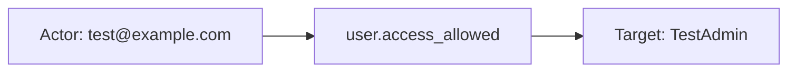

# ping_one

## Product Domain

PingOne is Ping Identity’s cloud-native identity and access management (IAM) platform. Organizations use PingOne to centralize user identity lifecycle, authentication, authorization, and access policies across applications, APIs, and workforce populations. The platform is organized around environments (tenant boundaries), user populations, applications (including worker and OIDC clients), roles, groups, and administrative configuration—supporting use cases from workforce SSO and MFA to customer identity (CIAM) and API security.

At its core, PingOne provides directory services, sign-on flows, password and credential management, role-based access control, and integrations via webhooks and REST APIs. Administrative and security-relevant activity is recorded as audit events that describe who performed an action (actors), what was affected (resources such as users, environments, or organizations), the action type (authentication, access control, user or configuration changes), and the outcome (success or failure). These events are essential for compliance, identity threat detection, and investigating unauthorized access or policy changes.

The Elastic PingOne integration ingests audit activity via two paths: polling the PingOne Audit REST API with OAuth worker credentials, or receiving real-time webhook payloads on an Elastic Agent HTTP endpoint (Ping Activity Format JSON). Events are normalized into ECS-aligned fields for search, dashboards, and correlation with broader SIEM data—enabling security teams to monitor sign-on behavior, access decisions, identity administration, and configuration changes across PingOne environments.

## Data Collected (brief)

- **Audit logs** (`ping_one.audit`): Identity and access audit events from PingOne, collected via REST API polling or HTTP endpoint webhooks.
- **Action details**: Action type and description (e.g., `USER.ACCESS_ALLOWED`, authentication, password checks, create/update/delete operations) with ECS `event.action`, `event.category`, and `event.type` enrichment.
- **Actors**: User and client/application context—IDs, names, environment and population references, and resource URLs for the initiating party.
- **Resources**: Affected entities (USER, ORGANIZATION, ENVIRONMENT) with IDs, names, environment/population scope, and API href links.
- **Outcome and timing**: Result status and description (`SUCCESS`/`FAILED`), event ID, `recorded_at`/`created_at` timestamps, and correlation/transaction identifiers.
- **Source context**: Source IP address and user agent when present; ECS user and client fields derived from actor and resource data.

## Expected Audit Log Entities

The **`ping_one.audit`** stream is the only data stream and is a true IAM audit log: PingOne Activity Format JSON with dual actors (`actors.user`, `actors.client`), affected `resources[]`, action type, and outcome. There are no metrics, inventory-sync, or network-telemetry streams. No ECS `user.target.*`, `host.target.*`, `service.target.*`, or `entity.target.*` fields are populated; no `destination.user.*` / `destination.host.*` in the pipeline (`destination_identity_hits.csv` has no ping_one row). The target-fields audit classifies ping_one as **`none`** with all heuristic flags false (`dev/target-fields-audit/out/target_enhancement_packages.csv`).

**`event.action` is populated on every fixture and `sample_event.json`** via pipeline copy from `ping_one.audit.action.type` with lowercase normalization (`default.yml` L247–257). Vendor-native action strings use PingOne dot notation (e.g. `USER.ACCESS_ALLOWED`, `APPLICATION.CREATED`); ECS stores the lowercased form (e.g. `user.access_allowed`, `application.created`). The pipeline also derives `event.category`, `event.type`, and `event.outcome` from the action string and result status — these enrich the action but do not replace it.

Evidence: `packages/ping_one/data_stream/audit/sample_event.json`, `_dev/test/pipeline/test-pipeline-audit.log-expected.json` (99 fixtures), `elasticsearch/ingest_pipeline/default.yml`, `fields/fields.yml`.

### Event action (semantic)

PingOne audit events record a vendor **`action.type`** string naming the IAM operation performed against one or more `resources[]`. The pipeline copies and lowercases it to ECS `event.action`. Fixture coverage spans 96 distinct actions across identity lifecycle, authentication, access control, application/OIDC configuration, PingOne Authorize objects, provisioning, risk/MFA, and environment administration.

| Action (normalized label) | Classification | Confidence | Evidence | Per-stream notes |
| --- | --- | --- | --- | --- |
| `user.access_allowed` | access | high | 3 fixtures + `sample_event.json`; vendor `USER.ACCESS_ALLOWED` | Script adds `event.category: [iam, configuration]`, `event.type: [user, info, access]` |
| `password.check_succeeded` / `password.check_failed` | authentication | high | 1 fixture each; vendor `PASSWORD.CHECK_*` | `password.check_succeeded` adds `event.category: [authentication]`; actor absent in both fixtures |
| `password.set` / `password.reset` | authentication | high | 1 fixture each | Self-service password events; actor absent on `password.set` |
| `user.created` / `user.updated` / `user.deleted` | administration | high | 1 fixture each | User directory lifecycle; `USER.CREATED` separates actor admin from target user in vendor data |
| `application.created` / `.updated` / `.deleted` | configuration_change | high | 1 fixture each | OIDC/worker application lifecycle |
| `action.created` / `action.updated` | configuration_change | high | 1 fixture each | Sign-on policy action lifecycle (`SIGN_ON_POLICY` target); actor absent on `action.created` |
| `role_assignment.created` | administration | high | 1 fixture | RBAC assignment; actor absent |
| `secret.read` | data_access | high | 1 fixture | Credential/secret read operation |
| `environment.created` / `.updated` | configuration_change | high | 1 fixture each | Tenant/environment boundary changes |
| `authorize_*.*` / `policy.*` / `group.*` / `population.*` / … | configuration_change | high | 70+ additional unique actions in fixtures | IAM/Authorize/provisioning/risk configuration CRUD; pattern `{resource_type}.{created\|updated\|deleted}` |

Action strings follow `{ENTITY}.{OPERATION}` vendor convention (e.g. `PROVISIONING_RULE.DELETED`, `DECISION_ENDPOINT.CREATED`). Lowercasing to ECS is consistent but loses the original casing — vendor value remains in `event.original` and, when tagged `preserve_duplicate_custom_fields`, in `ping_one.audit.action.type`.

### Event action (ECS candidates)

| ECS / vendor field | Mapped to `event.action` today? | Mapping correct? | Recommended `event.action` value (from fixtures) | Enhancement candidate? | Evidence |
| --- | --- | --- | --- | --- | --- |
| `ping_one.audit.action.type` → `event.action` | yes | yes | `user.access_allowed`, `application.created`, `password.check_failed`, … (96 unique lowercased values) | no | `rename` L247–250; `set` + `copy_from` L251–254; `lowercase` L255–257 |
| `json.action.type` (raw) | yes (source) | yes | `USER.ACCESS_ALLOWED`, `APPLICATION.CREATED`, … | no | Preserved in `event.original`; canonical vendor source before rename |
| `ping_one.audit.action.description` | no | n/a | Human label only (e.g. `Action Created`, `Passed role access control`) | no | Renamed L258–261; describes outcome/context, not a separate operation name |
| `event.type` / `event.category` / `event.outcome` | n/a (downstream) | partial | Derived from action string + result status | partial | Do not substitute for `event.action`; conditional `append`/`set` on action substrings (L27–84, L282–291) |
| `ping_one.audit.resources[].type` | no | n/a | Target entity type (USER, APPLICATION, …) | no | Qualifies *what* was acted upon, not the verb — complementary to `event.action` |

**Step 2b — per-stream check:**

| Stream | `event.action` in fixtures? | Pipeline maps to `event.action`? | Primary action candidate | Confidence | Evidence |
| --- | --- | --- | --- | --- | --- |
| `ping_one.audit` | yes (99/99) | yes | `ping_one.audit.action.type` ← `json.action.type` | high | `rename` + `set` + `lowercase` L247–257; all `test-pipeline-audit.log-expected.json` events + `sample_event.json` |

### Actor (semantic)

| Entity | Classification | Entity type (if general) | Confidence | Evidence | Per-stream notes |
| --- | --- | --- | --- | --- | --- |
| Human actor (administrator or end user) | user | — | high | `actors.user.type: "USER"` in 92 fixtures and `sample_event.json`; pipeline copies `ping_one.audit.actors.user.id/name` → `user.id`/`user.name`; `@` in name → `user.email`/`user.domain` via rename + dissect | **`ping_one.audit`** — canonical security principal when `actors` block present |
| Initiating PingOne application (OIDC/worker app, Admin Console) | general | application | high | `actors.client.type: "CLIENT"` in same 92 events; pipeline copies `ping_one.audit.actors.client.id/name` → `client.user.id`/`client.user.name`; examples: `PingOne Admin Console`, `adminui`, `TestAdmin` | **`ping_one.audit`** — application that issued the API call; `href` points at environment application resource |
| Client source IP | host | — | medium | `ping_one.audit.source.ip_address` → `source.ip` + geo enrichment; 1 of 99 fixtures (`175.16.199.1`, sign-on/access event) | Network origin of the session, not a PingOne identity |
| Client user agent | host | — | low | `ping_one.audit.source.user_agent` → `user_agent.*` via `user_agent` processor; same single fixture | Browser/client software context |

Seven fixtures omit `actors` entirely (`action.created`, `action.updated`, `application.created`, `password.check_failed`, `password.check_succeeded`, `password.set`, `role_assignment.created`). These are self-service or system-generated events with target `resources[]` only — no ECS `user.*` or `client.user.*` is populated.

### Actor (ECS candidates)

| ECS / vendor field | Role | Mapped today? | Mapping correct? | Confidence | Evidence |
| --- | --- | --- | --- | --- | --- |
| `user.id` | Human actor user ID | yes (92/99 fixtures) | yes | high | `json.actors.user.id` rename + `copy_from` in `default.yml` L186–192 |
| `user.name` / `user.email` / `user.domain` | Human actor display name or email | yes (92/99) | yes | high | `actors.user.name` → `user.name`; rename to `user.email` when `@` present; dissect local-part/domain (L194–211) |
| `client.user.id` / `client.user.name` | Initiating application identity | yes (92/99) | partial | high | `actors.client.*` → `client.user.*` (L146–160); ECS `client.user` holds an **application** actor, not a human client user — naming is ECS-conventional but semantically imprecise |
| `related.user` | Actor enrichment bag | yes | partial | high | Appends `user.id`, `user.name`, `user.email`, `client.user.id`, `client.user.name` (L173–246); does **not** include resource/target user IDs |
| `source.ip` / `source.geo` | Client network origin | partial | yes | medium | `json.source.ipAddress` → `ping_one.audit.source.ip_address` → `source.ip` + geoip (L301–320); 1 fixture |
| `user_agent.*` | Client browser/software | partial | yes | low | `json.source.userAgent` → `user_agent` processor (L327–335); 1 fixture |
| `ping_one.audit.actors.user.environment.id` | Actor tenant scope | no (vendor-only) | n/a | high | Retained after ECS copy; environment boundary for the acting user |
| `ping_one.audit.actors.user.population.id` | Actor directory population | no (vendor-only) | n/a | high | User population within environment |
| `ping_one.audit.actors.client.environment.id` / `.href` | Client app scope and API link | no (vendor-only) | n/a | high | Application resource context |
| `ping_one.audit.actors.user.href` / `.type` | Actor API link and type discriminator | no (vendor-only) | n/a | high | `type: USER` confirms human actor |

### Target (semantic)

| Layer | Description | Entity | Classification | Entity type (if general) | Confidence | Evidence | Per-stream notes |
| --- | --- | --- | --- | --- | --- | --- | --- |
| 1 — Platform / cloud service | PingOne IAM SaaS platform handling the action | PingOne | service | — | medium | No `cloud.service.name` or `cloud.provider` in pipeline; platform inferred from `event.action` (e.g. `user.access_allowed`, `application.created`) and integration context | IAM configuration and authentication events against the PingOne tenant |
| 2 — Resource / object | PingOne configuration or identity object acted upon | User, Application, Group, Policy, … | varies | see rows below | high | `ping_one.audit.resources[]` with `type` discriminator; 30 distinct types across 99 fixtures | Canonical vendor target; not mapped to ECS `*.target.*` |
| 3 — Content / artifact | Operation outcome text and correlation handles | result description; correlation ID | general | audit_outcome, correlation_id | medium | `ping_one.audit.result.description`, `ping_one.audit.correlation.id`, `ping_one.audit.internal_correlation.transaction_id` | Describes outcome, not a durable entity |

**Layer 2 resource types observed in fixtures** (by frequency):

| Entity | Classification | Entity type (if general) | Count | Example actions |
| --- | --- | --- | --- | --- |
| End-user account | user | — | 11 | `USER.CREATED/UPDATED/DELETED`, `USER.ACCESS_ALLOWED`, `PASSWORD.*`, `ROLE_ASSIGNMENT.CREATED` |
| OIDC/worker application | general | application | 10 | `APPLICATION.CREATED/UPDATED/DELETED`, `FLOW.*` |
| Identity provider | general | identity-provider | 6 | IdP lifecycle events |
| Generic resource placeholder | general | resource | 5 | `RESOURCE.*` actions |
| Sign-on policy | general | sign-on-policy | 4 | `ACTION.CREATED/UPDATED`, policy lifecycle |
| Provisioning rule | general | provisioning | 4 | `PROVISIONING_IDENTITY_RULE.*` |
| PingOne Authorize objects | general | authorization-policy | 3+ each | `POLICYSET`, `CONDITION`, `ATTRIBUTE`, `AUTHORIZE_*`, `DECISION_ENDPOINT`, `SERVICE` |
| Group / membership | general | group | 3 + 2 | `GROUP.*`, `MEMBER_OF_GROUP.*` |
| Population (directory) | general | population | 3 | Directory boundary within environment |
| Environment (tenant) | general | environment | 2 | `ENVIRONMENT.CREATED/UPDATED` |
| Risk / MFA / other | general | risk-policy, mfa-settings, gateway, … | 1–3 each | `RISK_POLICY`, `FIDO Policy`, `GATEWAY`, `IMAGE`, `KEY`, etc. |

`ORGANIZATION` is documented in `fields.yml` as a resource type option but not observed as `resources[].type` in fixtures.

### Target (ECS candidates)

| ECS / vendor field | Layer | Classification | Mapped today? | Mapping correct? | ECS target bucket | Enhancement candidate? | Evidence |
| --- | --- | --- | --- | --- | --- | --- | --- |
| `ping_one.audit.resources[].type` | 2 | varies | no | n/a | `entity.target.*` (type discriminator) | yes | 30 types in fixtures; canonical target classifier |
| `ping_one.audit.resources[].id` | 2 | varies | no | n/a | `entity.target.id` / `user.target.id` / `service.target.entity.id` | yes | Resource UUID; e.g. user `123abc…` on `USER.CREATED` |
| `ping_one.audit.resources[].name` | 2 | varies | no | n/a | `entity.target.name` / `user.target.name` | yes | Display name or email; created user `djcdjh` vs actor admin `example@gmail.com` on `USER.CREATED` |
| `ping_one.audit.resources[].environment.id` | 2 | general | no | n/a | context-only (tenant scope) | no | Environment/tenant boundary for the affected object |
| `ping_one.audit.resources[].population.id` | 2 | general | no | n/a | context-only | no | Directory population scope on user resources |
| `url.*` (from resource `href`) | 2 | general | yes | partial | context-only | no | `uri_parts` on `resources[].href` during foreach (L262–269); root-level `url.domain`/`url.path` reflect **last** parsed resource href; `href` stripped from stored resources unless `preserve_duplicate_custom_fields` |
| `event.action` | 1 | general (iam_operation) | yes | yes | context-only | no | Lowercased `action.type` (e.g. `user.created`, `sign_on_policy.updated` via `action.updated`); names the IAM verb performed |
| `ping_one.audit.action.description` | 3 | general | no | n/a | context-only | no | Human-readable action label |
| `ping_one.audit.result.status` / `.description` | 3 | general | partial | yes | context-only | no | `result.status` → `event.outcome`; description vendor-only after duplicate removal |
| `ping_one.audit.correlation.id` | 3 | general | no | n/a | context-only | no | Transaction correlation across related audit messages |

When `resources[].type` is `USER`, the affected user is the audit target but remains vendor-only — e.g. on `USER.ACCESS_ALLOWED` the actor `user.id` and target `resources[].id` are the **same** identity in 7 fixtures (`sample_event.json`), while on `USER.CREATED` the actor admin (`example@gmail.com`) differs from the created user target (`djcdjh`). Neither case populates `user.target.*` or `destination.user.*`.

### Gaps and mapping notes

- **`event.action` well mapped** — all 99 fixtures populate ECS `event.action` from vendor `action.type` with lowercase normalization; no enhancement needed. Human-readable `ping_one.audit.action.description` is retained vendor-side but not copied to ECS.
- **No ECS `*.target.*` today** — all affected entities stay in `ping_one.audit.resources[]`. Enhancement: map by `resources[].type` to `user.target.*` (USER), `service.target.*` (APPLICATION, SERVICE), or `entity.target.*` (GROUP, SIGN_ON_POLICY, ENVIRONMENT, etc.).
- **No `destination.user.*` / `destination.host.*`** — unlike email/auth integrations, PingOne does not use destination fields as de-facto targets; target identity is vendor-only.
- **`client.user.*` holds application actors** — `actors.client` (OIDC app, Admin Console) maps to ECS `client.user.id/name`, which reads as a human client user in ECS semantics but represents an **application** principal (`Mapping correct?`: partial).
- **Actor/target conflation risk on self-access events** — `USER.ACCESS_ALLOWED` and some password events have the same user as actor (`user.*`) and target (`resources[]` type USER) with identical IDs; only the actor is promoted to ECS `user.*`.
- **Admin-create separation works in vendor data** — `USER.CREATED` fixture: actor `user.name=example@gmail.com`, target `resources[].name=djcdjh`; ECS captures actor only.
- **`related.user` is actor-only** — resource user IDs/names are not appended; unlike GitLab audit, no de-facto target bag in `related.user`.
- **Actor-absent events (7 fixtures)** — password checks, role assignment, and some config creates omit `actors`; only the affected resource is known — actor identity is genuinely missing from the vendor payload.
- **Target-fields audit alignment** — classified `none` with no tier-A ECS targets, no destination-identity pipeline, and `pipeline_actor=false` in CSV despite clear `user.*`/`client.user.*` actor mappings in `default.yml`.

### Per-stream notes

#### `ping_one.audit`

Single audit stream collected via REST API polling (`httpjson`) or real-time webhooks (`http_endpoint`). Dual actor model: human `actors.user` → ECS `user.*`; initiating application `actors.client` → ECS `client.user.*`. Targets are always `ping_one.audit.resources[]` (array; one entry in most fixtures). **`event.action`** carries the lowercased PingOne operation (e.g. `user.access_allowed`, `application.created`) from vendor `action.type`; dashboard panels filter on `event.action` for password and access events. IAM configuration changes dominate the fixture set (policies, Authorize objects, applications, populations). Authentication-oriented events (`PASSWORD.*`, `USER.ACCESS_ALLOWED`) use `USER` as target type; source IP/user agent appear on sign-on events only. Resource `href` URLs are parsed to root-level `url.*` then removed from stored vendor fields unless `preserve_duplicate_custom_fields` tag is set.

## Example Event Graph

All examples come from the single **`ping_one.audit`** stream — true PingOne IAM audit logs (Activity Format JSON) collected via REST API polling or HTTP webhook.

### Example 1: Sign-on access allowed

**Stream:** `ping_one.audit` · **Fixture:** `packages/ping_one/data_stream/audit/_dev/test/pipeline/test-pipeline-audit.log-expected.json` (event `@timestamp` `2025-09-19T15:00:04.408Z`)

```
User (test@example.com) → user.access_allowed → Application TestAdmin
```

#### Actor

| Field | Value |
| --- | --- |
| id | `123abcdef-abcd-1234-5678-01234567890` |
| name | `test@example.com` |
| type | user |
| ip | `175.16.199.1` |
| geo | Changchun, China |

**Field sources:**

- `id ← user.id` ← `ping_one.audit.actors.user.id`
- `name ← user.email` ← `ping_one.audit.actors.user.name` (dissected to `user.name`/`user.email`)
- `ip ← source.ip` ← `ping_one.audit.source.ip_address`
- `geo ← source.geo.city_name, source.geo.country_name`

#### Event action

| Field | Value |
| --- | --- |
| action | `user.access_allowed` |
| source_field | `event.action` |
| source_value | `user.access_allowed` |

#### Target

| Field | Value |
| --- | --- |
| id | `123abc123-abcd-1234-5678-efg123abc12` |
| name | `TestAdmin` |
| type | service |
| sub_type | pingone_application |

**Field sources:**

- `id ← client.user.id` ← `ping_one.audit.actors.client.id`
- `name ← client.user.name` ← `ping_one.audit.actors.client.name`
- `ping_one.audit.resources[]` echoes the subject user (same ID as actor) — vendor resource typing, not the sign-on service target; only the human actor is promoted to ECS `user.*`.

#### Mermaid



### Example 2: Administrator creates user

**Stream:** `ping_one.audit` · **Fixture:** `packages/ping_one/data_stream/audit/_dev/test/pipeline/test-pipeline-audit.log-expected.json` (event `@timestamp` `2022-07-13T21:03:54.524Z`)

```
User (example@gmail.com) → user.created → User (djcdjh)
```

#### Actor

| Field | Value |
| --- | --- |
| id | `123abc123-12ab-1234-1abc-abc123abc12` |
| name | `example@gmail.com` |
| type | user |

**Field sources:**

- `id ← user.id` ← `ping_one.audit.actors.user.id`
- `name ← user.email` ← `ping_one.audit.actors.user.name`

#### Event action

| Field | Value |
| --- | --- |
| action | `user.created` |
| source_field | `event.action` |
| source_value | `user.created` |

#### Target

| Field | Value |
| --- | --- |
| id | `123abc123-12ab-1234-1abc-abc123abc12` |
| name | `djcdjh` |
| type | user |

**Field sources:**

- `id ← ping_one.audit.resources[].id` (type `USER`)
- `name ← ping_one.audit.resources[].name`

Admin actor (`example@gmail.com`) differs from the created user target (`djcdjh`); ECS captures the actor only — target remains vendor-only in `ping_one.audit.resources[]`.

#### Mermaid


### Example 3: Failed password check (no actor)

**Stream:** `ping_one.audit` · **Fixture:** `packages/ping_one/data_stream/audit/_dev/test/pipeline/test-pipeline-audit.log-expected.json` (event `@timestamp` `2022-07-07T13:12:36.168Z`)

```
(unknown) → password.check_failed → User (example@gmail.com)
```

#### Actor

No actor fields are populated — the vendor payload omits the `actors` block, so ECS `user.*` and `client.user.*` are absent.

#### Event action

| Field | Value |
| --- | --- |
| action | `password.check_failed` |
| source_field | `event.action` |
| source_value | `password.check_failed` |

#### Target

| Field | Value |
| --- | --- |
| id | `123abc123-12ab-1234-1abc-abc123abc12` |
| name | `example@gmail.com` |
| type | user |

**Field sources:**

- `id ← ping_one.audit.resources[].id` (type `USER`)
- `name ← ping_one.audit.resources[].name`

Self-service authentication event — the affected user account is known, but the initiating party is not recorded in the vendor audit payload.

## ES|QL Entity Extraction

**Package type: agent-backed** (policy template `ping_one`, single `audit` data stream; Tier A fixtures in `sample_event.json` and `test-pipeline-audit.log-expected.json`). Router: **`data_stream.dataset == "ping_one.audit"`** with secondary **`event.action`** discriminators. Pass 4 v2 is **fill-gaps-only**: detection flags preserve existing `user.*`, `host.*`, `*.target.*`, and `event.action` before fallbacks. Human `actors.user` → ECS `user.*` at ingest; initiating application `actors.client` → ECS `client.user.*` (semantically **general/application**). Targets remain vendor-only in `ping_one.audit.resources[]` until promoted. On **`user.access_allowed`**, Pass 3 target is the initiating **application** (`client.user.*` → `service.target.*`), **not** the self-referential `resources[]` USER row (same ID as actor — tautology guard). **Pass 4 (tautology cleanup):** no `CASE(col, col, …)` identity fallbacks; human **`user.id`**, **`user.name`**, **`user.email`**, and **`user.domain`** are **ingest-only — no ES|QL** (`default.yml` L186–246; no alternate query-time source). **Pass 4 (CASE syntax):** mapped columns use column-level `CASE(<col> IS NOT NULL, <col>, …)` — not `CASE(actor_exists|target_exists|action_exists, <col>, …)`; valid **3-arg** / **5-arg** / **7-arg** forms only — never **4-arg** `CASE(<col> IS NOT NULL, <col>, bare_field, null)` (bare field parses as a **condition**).

### Dataset inventory

| data_stream.dataset | Stream role | Actor classification(s) | Target classification(s) | Extraction |
| --- | --- | --- | --- | --- |
| `ping_one.audit` | IAM audit (all action types) | user, general (application), host | user, service, general | partial |

### Field mapping plan

#### Actor mappings

| Output column | Source field(s) | Condition (dataset + optional) | Confidence | Notes |
| --- | --- | --- | --- | --- |
| `user.id` | `user.id` (ingest) | `data_stream.dataset == "ping_one.audit"` | high | **ingest-only — no ES\|QL** — `actors.user.id` → `user.id` at ingest; no query-time vendor path |
| `user.name` | `user.name` (ingest) | `data_stream.dataset == "ping_one.audit"` | high | **ingest-only — no ES\|QL** — pipeline rename/copy; no alternate source |
| `user.email` | `user.email` (ingest) | `data_stream.dataset == "ping_one.audit"` | high | **ingest-only — no ES\|QL** — dissect when `@` in vendor name at ingest |
| `user.domain` | `user.domain` (ingest) | `data_stream.dataset == "ping_one.audit"` | high | **ingest-only — no ES\|QL** — dissect from `user.name` at ingest |
| `entity.id` | `client.user.id` | `data_stream.dataset == "ping_one.audit" AND client.user.id IS NOT NULL` | high | **vendor fallback** — OIDC/worker application principal |
| `entity.name` | `client.user.name` | `data_stream.dataset == "ping_one.audit" AND client.user.name IS NOT NULL` | high | **vendor fallback**; ingest uses `client.user` namespace |
| `entity.type` | literal `"application"` | `data_stream.dataset == "ping_one.audit" AND client.user.id IS NOT NULL` | high | **semantic literal** |
| `entity.sub_type` | literal `"pingone_application"` | `data_stream.dataset == "ping_one.audit" AND client.user.id IS NOT NULL` | high | **semantic literal** |
| `host.ip` | `source.ip` | `data_stream.dataset == "ping_one.audit" AND source.ip IS NOT NULL` | medium | **vendor fallback** — sign-on client IP (1 fixture) |

**`actor_exists` predicate (tuned):** `user.id`, `user.name`, `user.email`, `host.ip` only — excludes `entity.*` and `client.user.*` so application `entity.id` / `entity.name` can populate alongside human `user.*` when both are present (Pass 3 Example 1).

#### Target mappings

| Output column | Source field(s) | Condition (dataset + optional) | Confidence | Notes |
| --- | --- | --- | --- | --- |
| `service.target.id` | `service.target.id` | `data_stream.dataset == "ping_one.audit"` | high | **preserve existing** |
| `service.target.id` | `client.user.id` | `data_stream.dataset == "ping_one.audit" AND event.action == "user.access_allowed" AND client.user.id IS NOT NULL` | high | **vendor fallback** — sign-on application target (Pass 3); **not** `user.target.*` |
| `service.target.name` | `service.target.name` | `data_stream.dataset == "ping_one.audit"` | high | **preserve existing** |
| `service.target.name` | `client.user.name` | `data_stream.dataset == "ping_one.audit" AND event.action == "user.access_allowed" AND client.user.name IS NOT NULL` | high | **vendor fallback** — e.g. `TestAdmin` |
| `service.target.type` | `service.target.type` | `data_stream.dataset == "ping_one.audit"` | high | **preserve existing** |
| `service.target.type` | literal `"pingone_application"` | `data_stream.dataset == "ping_one.audit" AND event.action == "user.access_allowed"` | high | **semantic literal** |
| `user.target.id` | `user.target.id` | `data_stream.dataset == "ping_one.audit"` | high | **preserve existing** |
| `user.target.id` | `ping_one.audit.resources.id` | `data_stream.dataset == "ping_one.audit" AND event.action IN ("user.created", "user.updated", "user.deleted", "password.check_failed", "password.check_succeeded", "password.set", "password.reset", "role_assignment.created") AND event.action != "user.access_allowed"` | high | **vendor fallback** — USER resource; excludes sign-on tautology |
| `user.target.name` | `user.target.name` | `data_stream.dataset == "ping_one.audit"` | high | **preserve existing** |
| `user.target.name` | `ping_one.audit.resources.name` | same as `user.target.id` row | high | **vendor fallback** |
| `entity.target.id` | `entity.target.id` | `data_stream.dataset == "ping_one.audit"` | high | **preserve existing** |
| `entity.target.id` | `ping_one.audit.resources.id` | `data_stream.dataset == "ping_one.audit" AND STARTS_WITH(event.action, "application.") AND event.action != "user.access_allowed"` | high | **vendor fallback** — APPLICATION config resources |
| `entity.target.name` | `entity.target.name` | `data_stream.dataset == "ping_one.audit"` | high | **preserve existing** |
| `entity.target.name` | `ping_one.audit.resources.name` | same as `entity.target.id` (application prefix) | high | **vendor fallback** |

#### Event action mappings

| Output column | Source field(s) | Condition (dataset + optional) | Confidence | Notes |
| --- | --- | --- | --- | --- |
| `event.action` | `event.action` | `data_stream.dataset == "ping_one.audit"` | high | **preserve existing** — populated on all 99 fixtures at ingest |

### Detection flags (mandatory — run first)

```esql
| EVAL
  actor_exists = user.id IS NOT NULL OR user.name IS NOT NULL OR user.email IS NOT NULL
    OR host.ip IS NOT NULL,
  target_exists = user.target.id IS NOT NULL OR user.target.name IS NOT NULL OR user.target.email IS NOT NULL
    OR host.target.id IS NOT NULL OR host.target.ip IS NOT NULL OR host.target.name IS NOT NULL
    OR service.target.id IS NOT NULL OR service.target.name IS NOT NULL
    OR entity.target.id IS NOT NULL OR entity.target.name IS NOT NULL,
  action_exists = event.action IS NOT NULL
```

**Semantics:** `actor_exists` omits `entity.*` / `client.user.*` so application identity can be promoted to `entity.id` / `entity.name` without blocking on human `user.id`. `target_exists` checks official `*.target.*` only (none at ingest today). **Actor/target/action `EVAL` blocks use column-level preserve** (`<col> IS NOT NULL`) — not `CASE(actor_exists|target_exists|action_exists, <col>, …)` — so one populated sibling column does not block fallbacks on empty columns (Pass 4 §10). Ingest-only human `user.*` columns are omitted from actor `EVAL`.

**ES|QL `CASE` arity:** Arguments are **(condition, value)** pairs; odd count → last arg is default. Wrong: `CASE(host.ip IS NOT NULL, host.ip, source.ip, null)` (4 args — `source.ip` is a **condition**, not a value). Wrong: `CASE(actor_exists, host.ip, source.ip, null)` (4 args — `source.ip` parses as condition). Right: **5-arg** `CASE(host.ip IS NOT NULL, host.ip, data_stream.dataset == "ping_one.audit" AND source.ip IS NOT NULL, source.ip, null)` or **3-arg** `CASE(event.action IS NOT NULL, event.action, null)`.

### Optional classification helpers (when needed)

`entity.target.type` is set in the **target** fallback branch only (never `target.entity.type`):

```esql
| EVAL
  entity.target.type = CASE(
    entity.target.type IS NOT NULL, entity.target.type,
    data_stream.dataset == "ping_one.audit" AND event.action == "user.access_allowed", "service",
    data_stream.dataset == "ping_one.audit" AND event.action IN ("user.created", "user.updated", "user.deleted", "password.check_failed", "password.check_succeeded", "password.set", "password.reset", "role_assignment.created"), "user",
    data_stream.dataset == "ping_one.audit" AND STARTS_WITH(event.action, "application."), "general",
    null
  )
```

### Combined ES|QL — actor fields

```esql
| EVAL
  entity.id = CASE(
    entity.id IS NOT NULL, entity.id,
    data_stream.dataset == "ping_one.audit" AND client.user.id IS NOT NULL, client.user.id,
    null
  ),
  entity.name = CASE(
    entity.name IS NOT NULL, entity.name,
    data_stream.dataset == "ping_one.audit" AND client.user.name IS NOT NULL, client.user.name,
    null
  ),
  entity.type = CASE(
    entity.type IS NOT NULL, entity.type,
    data_stream.dataset == "ping_one.audit" AND client.user.id IS NOT NULL, "application",
    null
  ),
  entity.sub_type = CASE(
    entity.sub_type IS NOT NULL, entity.sub_type,
    data_stream.dataset == "ping_one.audit" AND client.user.id IS NOT NULL, "pingone_application",
    null
  ),
  host.ip = CASE(
    host.ip IS NOT NULL, host.ip,
    data_stream.dataset == "ping_one.audit" AND source.ip IS NOT NULL, source.ip,
    null
  )
```

### Combined ES|QL — event action

`event.action` is populated at ingest on all fixtures; block documents preserve-only behavior.

```esql
| EVAL
  event.action = CASE(
    event.action IS NOT NULL, event.action,
    null
  )
```

No vendor fallback: `ping_one.audit.action.type` is removed at ingest unless `preserve_duplicate_custom_fields` tag is set (`default.yml` L350–358).

### Combined ES|QL — target fields

```esql
| EVAL
  service.target.id = CASE(
    service.target.id IS NOT NULL, service.target.id,
    data_stream.dataset == "ping_one.audit" AND event.action == "user.access_allowed" AND client.user.id IS NOT NULL, client.user.id,
    null
  ),
  service.target.name = CASE(
    service.target.name IS NOT NULL, service.target.name,
    data_stream.dataset == "ping_one.audit" AND event.action == "user.access_allowed" AND client.user.name IS NOT NULL, client.user.name,
    null
  ),
  service.target.type = CASE(
    service.target.type IS NOT NULL, service.target.type,
    data_stream.dataset == "ping_one.audit" AND event.action == "user.access_allowed", "pingone_application",
    null
  ),
  user.target.id = CASE(
    user.target.id IS NOT NULL, user.target.id,
    data_stream.dataset == "ping_one.audit" AND event.action IN ("user.created", "user.updated", "user.deleted", "password.check_failed", "password.check_succeeded", "password.set", "password.reset", "role_assignment.created") AND event.action != "user.access_allowed" AND ping_one.audit.resources.id IS NOT NULL, ping_one.audit.resources.id,
    null
  ),
  user.target.name = CASE(
    user.target.name IS NOT NULL, user.target.name,
    data_stream.dataset == "ping_one.audit" AND event.action IN ("user.created", "user.updated", "user.deleted", "password.check_failed", "password.check_succeeded", "password.set", "password.reset", "role_assignment.created") AND event.action != "user.access_allowed" AND ping_one.audit.resources.name IS NOT NULL, ping_one.audit.resources.name,
    null
  ),
  entity.target.id = CASE(
    entity.target.id IS NOT NULL, entity.target.id,
    data_stream.dataset == "ping_one.audit" AND STARTS_WITH(event.action, "application.") AND event.action != "user.access_allowed" AND ping_one.audit.resources.id IS NOT NULL, ping_one.audit.resources.id,
    null
  ),
  entity.target.name = CASE(
    entity.target.name IS NOT NULL, entity.target.name,
    data_stream.dataset == "ping_one.audit" AND STARTS_WITH(event.action, "application.") AND event.action != "user.access_allowed" AND ping_one.audit.resources.name IS NOT NULL, ping_one.audit.resources.name,
    null
  )
```

### Full pipeline fragment (optional)

```esql
FROM logs-*
| EVAL
  actor_exists = user.id IS NOT NULL OR user.name IS NOT NULL OR user.email IS NOT NULL OR host.ip IS NOT NULL,
  target_exists = user.target.id IS NOT NULL OR user.target.name IS NOT NULL OR user.target.email IS NOT NULL
    OR host.target.id IS NOT NULL OR host.target.ip IS NOT NULL OR host.target.name IS NOT NULL
    OR service.target.id IS NOT NULL OR service.target.name IS NOT NULL
    OR entity.target.id IS NOT NULL OR entity.target.name IS NOT NULL,
  action_exists = event.action IS NOT NULL
| EVAL
  entity.id = CASE(entity.id IS NOT NULL, entity.id, data_stream.dataset == "ping_one.audit" AND client.user.id IS NOT NULL, client.user.id, null),
  entity.name = CASE(entity.name IS NOT NULL, entity.name, data_stream.dataset == "ping_one.audit" AND client.user.name IS NOT NULL, client.user.name, null),
  entity.type = CASE(entity.type IS NOT NULL, entity.type, data_stream.dataset == "ping_one.audit" AND client.user.id IS NOT NULL, "application", null),
  entity.sub_type = CASE(entity.sub_type IS NOT NULL, entity.sub_type, data_stream.dataset == "ping_one.audit" AND client.user.id IS NOT NULL, "pingone_application", null),
  host.ip = CASE(host.ip IS NOT NULL, host.ip, data_stream.dataset == "ping_one.audit" AND source.ip IS NOT NULL, source.ip, null)
| EVAL
  event.action = CASE(event.action IS NOT NULL, event.action, null)
| EVAL
  service.target.id = CASE(service.target.id IS NOT NULL, service.target.id, data_stream.dataset == "ping_one.audit" AND event.action == "user.access_allowed" AND client.user.id IS NOT NULL, client.user.id, null),
  service.target.name = CASE(service.target.name IS NOT NULL, service.target.name, data_stream.dataset == "ping_one.audit" AND event.action == "user.access_allowed" AND client.user.name IS NOT NULL, client.user.name, null),
  service.target.type = CASE(service.target.type IS NOT NULL, service.target.type, data_stream.dataset == "ping_one.audit" AND event.action == "user.access_allowed", "pingone_application", null),
  user.target.id = CASE(user.target.id IS NOT NULL, user.target.id, data_stream.dataset == "ping_one.audit" AND event.action IN ("user.created", "user.updated", "user.deleted", "password.check_failed", "password.check_succeeded", "password.set", "password.reset", "role_assignment.created") AND event.action != "user.access_allowed" AND ping_one.audit.resources.id IS NOT NULL, ping_one.audit.resources.id, null),
  user.target.name = CASE(user.target.name IS NOT NULL, user.target.name, data_stream.dataset == "ping_one.audit" AND event.action IN ("user.created", "user.updated", "user.deleted", "password.check_failed", "password.check_succeeded", "password.set", "password.reset", "role_assignment.created") AND event.action != "user.access_allowed" AND ping_one.audit.resources.name IS NOT NULL, ping_one.audit.resources.name, null),
  entity.target.id = CASE(entity.target.id IS NOT NULL, entity.target.id, data_stream.dataset == "ping_one.audit" AND STARTS_WITH(event.action, "application.") AND event.action != "user.access_allowed" AND ping_one.audit.resources.id IS NOT NULL, ping_one.audit.resources.id, null),
  entity.target.name = CASE(entity.target.name IS NOT NULL, entity.target.name, data_stream.dataset == "ping_one.audit" AND STARTS_WITH(event.action, "application.") AND event.action != "user.access_allowed" AND ping_one.audit.resources.name IS NOT NULL, ping_one.audit.resources.name, null)
| KEEP @timestamp, data_stream.dataset, event.action, user.id, user.email, entity.id, entity.name, entity.type, entity.sub_type, host.ip, service.target.id, service.target.name, service.target.type, user.target.id, user.target.name, entity.target.id, entity.target.name
```

### Streams excluded

None — single audit stream (`ping_one.audit` per `packages/ping_one/data_stream/audit/manifest.yml`).

### Gaps and limitations

- **`ping_one.audit.resources[]` is multivalued** — ES|QL uses flattened paths (`ping_one.audit.resources.id`); multi-resource events may need `MV_FIRST()` or ingest-time promotion.
- **30 resource types** — only USER lifecycle/password/role-assignment, sign-on `service.target.*`, and `application.*` prefix routing covered; GROUP, SIGN_ON_POLICY, ENVIRONMENT, Authorize objects, etc. omitted to avoid false positives.
- **Actor-absent events (7 fixtures)** — password checks, role assignment, some config creates; `user.*` intentionally empty; `user.target.*` still promoted from `resources[]` where action matches.
- **`client.user.*` naming** — ECS field set reads as human client but holds application principals; mapped to `entity.*` (actor) and `service.target.*` (sign-on target).
- **`user.access_allowed` tautology** — vendor `resources[]` echoes subject user (same ID as `user.id`); `event.action != "user.access_allowed"` on `user.target.*` plus service target from `client.user.*` per Pass 3.
- **`event.action` ingest-only** — no ES|QL fallback when `action_exists` is false; vendor `ping_one.audit.action.type` stripped post-pipeline.
- **Pass 2 enhancement alignment** — ingest-time `user.target.*` / `entity.target.*` from `resources[].type` remain preferred; Pass 4 fills gaps without overwriting populated values.
- **Pass 4 tautology cleanup (§10)** — human `user.id` / `user.name` / `user.email` / `user.domain` omitted from actor `EVAL` (ingest-only; no `CASE(col, col, …)`); `entity.*` and `host.ip` use column-level or vendor fallbacks only.
- **Pass 4 CASE syntax** — all `CASE` use odd-arity defaults (`null`) or paired `(boolean, value)` branches only; column-level **3-arg** / **5-arg** / **7-arg** preserve (`<col> IS NOT NULL`, not `CASE(actor_exists|target_exists|action_exists, <col>, …)`); never **4-arg** `CASE(<col> IS NOT NULL, <col>, bare_field, null)` (bare field parses as a condition). Full pipeline fragment aligned with combined `EVAL` blocks. Detection flags are query-time helpers only — not used as the first `CASE` branch on mapped columns.
