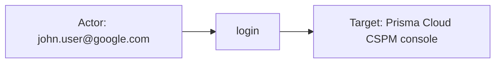

# prisma_cloud

## Product Domain (Prisma Cloud CSPM/CWPP)

Palo Alto Prisma Cloud is a cloud-native security platform that unifies Cloud Security Posture Management (CSPM) and Cloud Workload Protection Platform (CWPP) in a single console. CSPM provides continuous visibility and governance over public cloud infrastructure across AWS, Azure, GCP, Oracle Cloud Infrastructure, and Alibaba Cloud—detecting misconfigurations, policy violations, compliance gaps, and cloud-native risks. CWPP (delivered via Prisma Cloud Compute, formerly Twistlock) extends protection to runtime workloads including Linux, Windows, Kubernetes, Red Hat OpenShift, and serverless functions (AWS Lambda, Azure Functions, GCP Cloud Functions), covering vulnerability management, compliance scanning, anomaly detection, and runtime defense.

Prisma Cloud operates as a SOC enablement platform for hybrid and multi-cloud estates. CSPM evaluates cloud resources against built-in and custom policies, maps findings to compliance frameworks, and surfaces attack-path and network-exposure risks. CWPP deploys Defenders on hosts and containers to scan images, inventory packages and binaries, enforce runtime policies, and detect incidents such as malware, unauthorized processes, and suspicious network activity. Compute can be consumed as a managed tab within Prisma Cloud (CSPM-integrated) or as a self-hosted Prisma Cloud Compute (CWP) deployment.

From a security operations perspective, Prisma Cloud telemetry supports cloud posture management, vulnerability prioritization, compliance reporting, runtime threat detection, and audit of both platform administration and workload incidents. Security teams correlate CSPM alerts and misconfiguration findings with CWPP host scans and incident audits to trace risk from cloud misconfiguration through to active workload compromise.

## Data Collected (brief)

The integration collects Prisma Cloud data via Elastic Agent **CEL/API** (REST) for CSPM and CWPP streams, with optional **TCP/UDP** syslog ingestion for CWPP host-related events. Seven data streams cover the platform:

| Data stream | Module | Description |
|---|---|---|
| **alert** | CSPM | Policy violation alerts—cloud resource context, policy metadata, severity, compliance mappings, status, and remediation guidance |
| **audit** | CSPM | Prisma Cloud console audit logs—administrator login and actions, resource, result, and client IP |
| **misconfiguration** | CSPM | Per-resource policy scan results—pass/fail status, scanned policies, cloud account/region, and alert severity counts |
| **vulnerability** | CSPM | CVE findings on cloud and host assets—CVSS, EPSS, CISA KEV, package/version, exploitability, and internet exposure |
| **host** | CWPP | Host and container scan inventory—OS, packages, binaries, image metadata, vulnerability/compliance distributions, and cloud metadata |
| **host_profile** | CWPP | Runtime behavioral profiles—observed processes, ports, network connections, and application activity per host |
| **incident_audit** | CWPP | Runtime security incidents—custom rule triggers, attack types, container/host context, MITRE techniques, and acknowledgment status |

CSPM streams (alert, audit, misconfiguration, vulnerability) poll regional Prisma Cloud API endpoints. CWPP streams (host, host_profile, incident_audit) use the Compute API or syslog forwarding. Events are mapped to ECS fields (`cloud`, `host`, `vulnerability`, `rule`, `event`, etc.) with vendor details under `prisma_cloud.<data-stream>.*`. Elasticsearch transforms enrich misconfiguration and vulnerability data for downstream workflows. Bundled Kibana dashboards visualize alerts, audit activity, host posture, host profiles, incidents, misconfigurations, and vulnerabilities.

## Expected Audit Log Entities

Prisma Cloud exposes two audit-oriented data streams: **`audit`** (CSPM console audit — administrator login and platform actions) and **`incident_audit`** (CWPP runtime incident audit — Defender-detected workload violations, not human admin activity). The remaining five streams (`alert`, `misconfiguration`, `vulnerability`, `host`, `host_profile`) are findings or inventory, not audit logs; actor/target/action semantics below focus on the two audit streams. **`alert`** is audit-adjacent only — it references `modifiedBy` / attribution usernames in `related.user` on cloud-resource findings, but those events are posture alerts, not platform audit records.

Neither audit stream populates ECS `*.target.*` fields or `destination.user.*` / `destination.host.*` (confirmed in `dev/target-fields-audit/out/target_fields_audit.csv`; package absent from `destination_identity_hits.csv`). **`event.action`** is populated on **`audit`** only (`login` from `actionType`); **`incident_audit`** has no `event.action` in fixtures or pipeline — vendor attack/rule fields are action candidates. Analysis grounded in `packages/prisma_cloud/data_stream/*/sample_event.json`, `*-expected.json`, `fields/fields.yml`, and ingest pipelines.

| Stream | `event.action` in fixtures? | Pipeline maps to `event.action`? | Primary action candidate | Confidence | Evidence |
| --- | --- | --- | --- | --- | --- |
| **audit** | yes (`login`) | yes | `prisma_cloud.audit.action.type` ← `json.actionType` | high | All 5 fixtures + `sample_event.json`; `audit/default.yml` L116–147 |
| **incident_audit** | no | no | `prisma_cloud.incident_audit.data[].attack.type` (e.g. `cloudMetadataProbing`) | high | `sample_event.json`, `test-incident-audit.log-expected.json`; mapped to `threat.technique.subtechnique.name` only (L158–171) |
| **alert** | no | no | n/a — posture finding, not audit verb | — | `event.category`/`event.type` only; no operation field |
| **misconfiguration** | no | no | n/a — scan result sync | — | Policy pass/fail inventory |
| **vulnerability** | no | no | n/a — CVE finding sync | — | Vulnerability inventory |
| **host** | no | no | n/a — host inventory sync | — | CWPP asset state |
| **host_profile** | no | no | n/a — behavioral profile sync | — | Runtime profile inventory |

### Event action (semantic)

| Action (normalized label) | Classification | Confidence | Evidence | Per-stream notes |
| --- | --- | --- | --- | --- |
| `login` | authentication | high | `event.action: login` in all **`audit`** fixtures; vendor `actionType: LOGIN` | Only action type in package tests; pipeline lowercases and hyphen-joins multi-word types (e.g. `USER CREATE` → `user-create`) |
| `cloudMetadataProbing` | detection | high | `prisma_cloud.incident_audit.data[].attack.type` in **`incident_audit`** fixture | Runtime attack sub-type; describes violation class, not enforcement effect |
| `exploitationForPrivilegeEscalation` | detection | high | `data[].attack.techniques[]` → `threat.technique.name` | MITRE-style technique label; alternate action candidate |
| Rule trigger (e.g. `Rule xyz`) | detection | medium | `prisma_cloud.incident_audit.custom_rule_name`, `data[].rule_name` → `rule.name` | Custom runtime rule that fired; policy name rather than attack taxonomy |
| `block` / `prevent` | configuration_change | low | `data[].effect[]` in fixture | Enforcement outcome on the rule, not the detected activity — context only |

**`audit`** fixtures cover LOGIN only; production CSPM audit API supports additional `actionType` values (policy edits, user management, etc.) not represented in tests. **`incident_audit`** records runtime detections — the verb is the attack/violation type, not a human admin operation. Inventory streams (`host`, `host_profile`, `misconfiguration`, `vulnerability`) have no per-event action.

### Event action (ECS candidates)

| ECS / vendor field | Mapped to `event.action` today? | Mapping correct? | Recommended `event.action` value (from fixtures) | Enhancement candidate? | Evidence |
| --- | --- | --- | --- | --- | --- |
| `prisma_cloud.audit.action.type` | yes (via pipeline) | yes | `login` (from `LOGIN`) | no | `json.actionType` rename (L116–119) → lowercase to `event.action` (L120–147); retained only with `preserve_duplicate_custom_fields` tag |
| `prisma_cloud.audit.action.value` | no | n/a | — (free-text narrative) | no | Human-readable description (*"logged in via access key"*); not suitable as normalized action |
| `event.category` (`authentication`) | no | n/a | — | no | Derived from action type containing login/logout (L148–153); category, not action |
| `prisma_cloud.incident_audit.data[].attack.type` | no | n/a | `cloudMetadataProbing` | yes | Vendor attack sub-type; today → `threat.technique.subtechnique.name` (L158–171) |
| `prisma_cloud.incident_audit.data[].attack.techniques[]` | no | n/a | `exploitationForPrivilegeEscalation` | yes (alternate) | → `threat.technique.name` (L134–151); broader technique label |
| `prisma_cloud.incident_audit.custom_rule_name` | no | n/a | `Rule xyz` (placeholder) | yes (alternate) | → `rule.name` (L603–612); rule/policy name, not attack taxonomy |
| `prisma_cloud.incident_audit.data[].rule_name` | no | n/a | `string` (placeholder) | yes (alternate) | Nested audit row rule name → `rule.name` (L482–492) |
| `prisma_cloud.incident_audit.data[].type[]` | no | n/a | `processes` | no | Audit artifact discriminator (process/network/filesystem/kubernetes), not the security action |
| `prisma_cloud.incident_audit.type` | no | n/a | `host` | no | Envelope workload scope (host/container/function), not an operation verb |
| `prisma_cloud.incident_audit.category` | no | n/a | `malware` | no | → `event.category` when contains malware (L556–560); category, not action |
| `prisma_cloud.incident_audit.data[].effect[]` | no | n/a | `block`, `prevent` | no | Rule enforcement effect; outcome context, not detected activity |

### Actor (semantic)

| Entity | Classification | Entity type (if general) | Confidence | Evidence | Per-stream notes |
| --- | --- | --- | --- | --- | --- |
| Prisma Cloud administrator or API access-key principal | user | — | high | `json.user` → `prisma_cloud.audit.user`; email-shaped values → `user.email`/`user.name`/`user.domain` via dissect; role context in `prisma_cloud.audit.action.value` (*"with role 'System Admin':'System Admin'"*); `related.user` holds local-part and full identifier | **`audit`** — all five pipeline fixtures and `sample_event.json` (`john.user@google.com`) |
| Client source IP (login origin) | host | — | medium | `json.ipAddress` → `prisma_cloud.audit.ip_address` → `host.ip`, `related.ip` when present and not `"RedLock Internal IP"` | **`audit`** — network origin of the session; absent when IP is internal placeholder or omitted (fixtures 2–3, 5) |
| Offending workload process | general | process | high | `prisma_cloud.incident_audit.data[].process_path`, `pid`, `command`, `interactive`; fixture `type: ["processes"]` | **`incident_audit`** — runtime violator; not mapped to ECS `process.*` |
| OS/service account on workload | user | — | moderate | `prisma_cloud.incident_audit.data[].user` (*"Service user"* per `fields.yml`) → `related.user` only | **`incident_audit`** — supplementary identity of the process owner; no ECS `user.*` promotion |

Four of five **`audit`** fixtures include `user`; one omits it entirely (IP-only failed login with `resourceName`/`resourceType` still set). **`incident_audit`** has no Prisma Cloud console administrator or API caller — incidents are Defender runtime detections on protected workloads.

### Actor (ECS candidates)

| ECS / vendor field | Role | Mapped today? | Mapping correct? | Confidence | Evidence |
| --- | --- | --- | --- | --- | --- |
| `user.email` / `user.name` / `user.domain` | Human/API principal | yes (4/5 audit fixtures) | yes | high | `json.user` rename → `prisma_cloud.audit.user`; `copy_from` + dissect when `@` present (`audit/default.yml` L77–97) |
| `prisma_cloud.audit.user` | Canonical actor identifier | yes (vendor retained with tag) | yes | high | Raw vendor user string; preserved when `preserve_duplicate_custom_fields` tag set |
| `related.user` | Actor enrichment bag | yes | yes | high | Appends `user.name` and full `prisma_cloud.audit.user` (L98–109) |
| `host.ip` | Client source IP | partial | no | medium | `json.ipAddress` → `prisma_cloud.audit.ip_address` → `host.ip` (L54–70); semantically a **client** IP, not the host running the event — should be `source.ip` |
| `related.ip` | Client source IP (related bag) | partial | yes | medium | Same pipeline step as `host.ip` (L71–76) |
| `prisma_cloud.audit.ip_address` | Client source IP (vendor) | yes | yes | high | Vendor canonical; removed unless `preserve_duplicate_custom_fields` |
| `prisma_cloud.audit.action.value` | Actor role/context (free text) | yes (vendor-only) | n/a | high | Embeds role names (*System Admin*) and auth method (*access key*); not parsed to ECS |
| `prisma_cloud.incident_audit.data[].process_path` / `.pid` / `.command` | Offending process | no (vendor-only) | n/a | high | Process identity stays under vendor `data[]`; no ECS `process.*` mapping |
| `prisma_cloud.incident_audit.data[].user` | Workload service user | partial | partial | moderate | Appended to `related.user` only (`incident_audit/default.yml` L513–517); describes process owner, not a security principal |
| `related.user` (incident) | Workload user bag | partial | partial | moderate | Holds `data[].user` values only; no console actor |

### Target (semantic)

| Layer | Description | Entity | Classification | Entity type (if general) | Confidence | Evidence | Per-stream notes |
| --- | --- | --- | --- | --- | --- | --- | --- |
| 1 — Platform / cloud service | SaaS platform or runtime enforcement surface | Prisma Cloud CSPM console/API; Prisma Cloud Compute (Defender) | service | — | medium | No `cloud.service.name` in either audit pipeline; platform inferred from integration context and `event.category` (`authentication` on login; `malware` on incident fixture) | Layer 1 is implicit — not mapped to ECS |
| 2 — Resource / object | Configuration object or protected workload | Login session/user account; host, container, or function under enforcement | varies | see below | high | **`audit`:** `prisma_cloud.audit.resource.type`/`name` (`Login` / email in all fixtures). **`incident_audit`:** envelope `type` (`host`, `container`, `function`) plus `hostname`, `container.*`, `function.*`, `resource_id`, `vm_id`, `cloud.*` | Primary acted-upon entity |
| 3 — Content / artifact | Violation detail or outcome text | Process/file/network artifact; rule outcome; login result | general | process, file, network_peer, runtime_rule, audit_outcome | high | **`incident_audit`:** `data[].type` discriminator (`processes`, `network`, `kubernetes`, `filesystem`); `custom_rule_name`, `effect`, `attack.*`. **`audit`:** `prisma_cloud.audit.result` → `event.outcome`; free-text `action.value` | Layer 3 nested under Layer 2 workload or login event |

**Layer 2 detail by stream:**

| Entity | Classification | Entity type (if general) | Confidence | Evidence |
| --- | --- | --- | --- | --- |
| User account / login session (`resourceType: Login`) | user | — | high | `prisma_cloud.audit.resource.name` = `john.user@google.com`; actor and target are the same identity on login events in all audit fixtures |
| CSPM configuration object (inferred) | general | platform_resource | medium | API supports arbitrary `resourceType`/`resourceName`; only `Login` present in package tests |
| Protected host (`type: host`) | host | — | high | `prisma_cloud.incident_audit.hostname` → `host.hostname`; `fqdn` → `host.domain`; `vm_id`, `resource_id`, `cloud.account.id`/`provider`/`region` |
| Protected container (`type: container` or `data[].container.value: true`) | general | container | high | `container.id`, `container.name`, `container.image.name` from envelope and `data[]` (`container123`, `nginx`, `docker.io/library/nginx:latest`) |
| Serverless function (`type: function`) | general | serverless_function | high | `prisma_cloud.incident_audit.function.id`/`.value`, `runtime`, `data[].request_id` (`fields.yml`; placeholder fixtures) |
| Runtime custom rule (enforcement policy) | general | runtime_rule | high | `custom_rule_name`, `data[].rule_name` → `rule.name`; `effect` (`block`, `prevent`); not the acted-upon workload |

### Target (ECS candidates)

| ECS / vendor field | Layer | Classification | Mapped today? | Mapping correct? | ECS target bucket | Enhancement candidate? | Evidence |
| --- | --- | --- | --- | --- | --- | --- | --- |
| `prisma_cloud.audit.resource.type` | 2 | varies | no | n/a | `entity.target.type` | yes | `Login` in all audit fixtures; discriminator for non-login mutations in production |
| `prisma_cloud.audit.resource.name` | 2 | user (login) | no | n/a | `user.target.email` / `user.target.name` | yes | Login target email; same value as actor on authentication events |
| `prisma_cloud.audit.action.value` | 3 | general | no | n/a | context-only | no | Human-readable action including role and method |
| `prisma_cloud.audit.result` / `event.outcome` | 3 | general | partial | yes | context-only | no | Outcome of login attempt (`success`/`failure`) |
| `host.hostname` / `host.domain` | 2 | host | yes | yes | `host.target.hostname` / `host.target.domain` | yes | Incident envelope + `data[].fqdn`/`hostname` → ECS host fields (`incident_audit/default.yml` L618–654, L249–275) |
| `container.id` / `container.name` / `container.image.name` | 2 | general | yes | yes | `entity.target.id` / container fields | yes | Envelope and nested `data[]` container context (L582–601, L204–335) |
| `prisma_cloud.incident_audit.function.id` / `.value` | 2 | general | no | n/a | `entity.target.id` / `service.target.entity.id` | yes | Serverless function scope; vendor-only at envelope level |
| `prisma_cloud.incident_audit.resource_id` / `.vm_id` | 2 | host | no | n/a | `entity.target.id` | yes | Cloud resource identifiers; vendor-only |
| `cloud.account.id` / `cloud.provider` / `cloud.region` | 2 | general | partial | yes | context-only (cloud scope) | no | Tenancy/region of affected workload, not the target entity itself |
| `prisma_cloud.incident_audit.data[].process_path` / `.filepath` / `.md5` | 3 | general | no | n/a | `entity.target.name` (artifact) | yes | Process or file under inspection; vendor-only |
| `prisma_cloud.incident_audit.data[].ip` / `.port` / `.domain` | 3 | general | partial | partial | `destination.ip` / `destination.domain` (de-facto) | yes | Fields.yml: *"connection destination"*; `ip` → `related.ip` only (L358–379) — network peer/target not promoted to `destination.*` |
| `rule.name` / `threat.technique.*` | 3 | general | partial | yes | context-only | no | Policy and MITRE context for the violation, not the acted-upon entity |
| `prisma_cloud.incident_audit.custom_rule_name` | 3 | general | no | n/a | context-only | no | Runtime rule name; duplicated to `rule.name` then vendor field removed unless tag set |

### Gaps and mapping notes

- **No ECS `*.target.*` today** — neither stream maps acted-upon entities to official target fields. `target-fields-audit` classifies `prisma_cloud` as `moderate_candidate` with `ecs_target_tierA_audit=false`, `pipeline_dest_identity=false`, `pipeline_actor=false` (despite clear `user.*` actor mapping on **`audit`**), `fixture_strong=true`.
- **`event.action` gap on `incident_audit`** — vendor `data[].attack.type` (`cloudMetadataProbing`) and `custom_rule_name` clearly name the detected activity but map to `threat.technique.*` / `rule.name` only; recommend copying `attack.type` to `event.action` as primary candidate.
- **No `destination.user.*` / `destination.host.*`** — package absent from `destination_identity_hits.csv`. Network destination fields in **`incident_audit`** (`data[].ip`, `.port`, `.domain`) stay vendor-only or `related.ip`; enhancement candidate for de-facto `destination.*` → `host.target.*` / network target migration.
- **`host.ip` misused for client source on `audit`** — client login IP mapped to `host.ip` instead of `source.ip` (`Mapping correct?`: no); conflates session origin with host identity.
- **Login actor/target conflation on `audit`** — same email populates `user.*` (actor) and `prisma_cloud.audit.resource.name` (target) on LOGIN events; only actor is promoted to ECS `user.*`.
- **Role context vendor-only** — admin role names appear in `prisma_cloud.audit.action.value` free text, not in `user.roles` or a structured vendor field.
- **`incident_audit` envelope vs `data[]` nesting** — incident-level host/container/function scope coexists with per-audit detail rows; correlate via `prisma_cloud.incident_audit._id` / `data[]._id` and `data[].type` discriminators.
- **Non-login CSPM audit targets unverified** — fixtures cover LOGIN only; production mutations (policies, accounts, users) require live `resourceType`/`resourceName` values.
- **`alert` stream (audit-adjacent)** — `modifiedBy` and attribution usernames append to `related.user`; misconfigured cloud resource is the finding target under `prisma_cloud.alert.resource.*` with optional `cloud.service.name` — not an audit log entity.

### Per-stream notes

#### `prisma_cloud.audit`

CSPM console audit collected via CEL/API polling. Human administrator or API access-key holder is the actor (`user.*` when email-shaped). Client IP optionally enriches `host.ip`/`related.ip`. `actionType` → `event.action` (`login`) with `event.category: authentication`. All fixtures are failed/successful LOGIN attempts targeting the same user email in `resource.name`. No `cloud.service.name`, `source.ip`, or ECS target fields.

#### `prisma_cloud.incident_audit`

CWPP runtime incident audit via Compute API or syslog. No platform admin actor — the violator is the workload process (`data[].process_path`) with optional OS service user in `related.user`. No `event.action`; primary action candidate is `data[].attack.type` (`cloudMetadataProbing`). Incident envelope scopes host/container/function; nested `data[]` rows carry type-specific artifacts (process, network, filesystem, kubernetes). Workload identity maps to ECS `host.*`, `container.*`, `cloud.*`, and `rule.name`/`threat.technique.*`; process/file/network targets remain vendor-only. Category `malware` set when envelope `category` contains malware.

## Example Event Graph

Examples below come from the two audit-oriented streams — **`prisma_cloud.audit`** (CSPM console audit logs) and **`prisma_cloud.incident_audit`** (CWPP runtime incident audit). Both are true audit records; the remaining five streams are findings or inventory and have no per-event Actor → action → Target chain.

### Example 1: Successful CSPM console login

**Stream:** `prisma_cloud.audit` · **Fixture:** `packages/prisma_cloud/data_stream/audit/sample_event.json`

On LOGIN events, vendor `resourceName` repeats the user email — repeating that as the graph target would read “user logs in to themselves.” The natural reading is: a **user authenticates to the Prisma Cloud CSPM console**; the vendor login resource is session metadata, not a distinct target identity.

```
Administrator (john.user@google.com) → login → Prisma Cloud CSPM console (service)
```

#### Actor

| Field | Value |
| --- | --- |
| id | john.user@google.com |
| name | john.user |
| type | user |
| ip | 81.2.69.192 |

**Field sources:**

- `id` ← `user.email`, `prisma_cloud.audit.user`
- `name` ← `user.name`
- `ip` ← `host.ip`, `prisma_cloud.audit.ip_address` (client login origin; mapped to `host.ip` today, not `source.ip`)

#### Event action

| Field | Value |
| --- | --- |
| action | login |
| source_field | `event.action` |
| source_value | login |

#### Target

| Field | Value |
| --- | --- |
| name | Prisma Cloud CSPM console |
| type | service |

**Field sources:**

- `name` ← semantic — SaaS platform being authenticated to; **not indexed** in fixture (`cloud.service.name` absent; `prisma_cloud.audit.resource.name` repeats the user email)
- `type` ← service — authentication target is the CSPM console, not the user account

**Scope context (not target):** vendor login resource `prisma_cloud.audit.resource.name: john.user@google.com` with `resource.type: Login`; role `System Admin` appears in `prisma_cloud.audit.action.value`.

#### Mermaid



### Example 2: Failed CSPM login from client IP (no user field)

**Stream:** `prisma_cloud.audit` · **Fixture:** `packages/prisma_cloud/data_stream/audit/_dev/test/pipeline/test-audit.log-expected.json` (fixture 5)

```
Client IP (81.2.69.142) → login → Prisma Cloud CSPM console (service)
```

#### Actor

| Field | Value |
| --- | --- |
| id | 81.2.69.142 |
| type | host |
| ip | 81.2.69.142 |

**Field sources:**

- `id` ← `host.ip`, `prisma_cloud.audit.ip_address`
- `ip` ← `host.ip`, `related.ip`

This fixture omits `json.user`; the only identity signal is the client source IP. No ECS `user.*` fields are populated.

#### Event action

| Field | Value |
| --- | --- |
| action | login |
| source_field | `event.action` |
| source_value | login |

`event.outcome` is `failure` (`prisma_cloud.audit.result`: `fail`).

#### Target

| Field | Value |
| --- | --- |
| name | Prisma Cloud CSPM console |
| type | service |

**Field sources:**

- `name` ← semantic — SaaS platform being authenticated to; **not indexed** in fixture (`cloud.service.name` absent)
- `type` ← service — failed login attempt against the CSPM console

**Scope context (not target):** attempted account `john.user@google.com` in `prisma_cloud.audit.resource.name` and `prisma_cloud.audit.action.value`; vendor `resource.type: Login`.

#### Mermaid


### Example 3: CWPP runtime cloud-metadata probing on container

**Stream:** `prisma_cloud.incident_audit` · **Fixture:** `packages/prisma_cloud/data_stream/incident_audit/sample_event.json`

```
Workload process (pid 0 on nginx container) → cloudMetadataProbing → Protected host/container (gke-tp-cluster… / nginx)
```

#### Actor

| Field | Value |
| --- | --- |
| id | string |
| type | general |
| sub_type | process |

**Field sources:**

- `id` ← `prisma_cloud.incident_audit.data[].process_path` (placeholder value `string` in fixture)
- `sub_type` ← `prisma_cloud.incident_audit.data[].type` (`processes`)

No Prisma Cloud console administrator is present — the violator is the runtime process detected by Defender. Process identity stays vendor-only; no ECS `process.*` mapping today.

#### Event action

| Field | Value |
| --- | --- |
| action | cloudMetadataProbing |
| source_field | `prisma_cloud.incident_audit.data[].attack.type` |
| source_value | cloudMetadataProbing |

**Not mapped to ECS `event.action` today** — pipeline copies this value to `threat.technique.subtechnique.name` only. Custom rule `Rule xyz` (`rule.name`) and MITRE technique `exploitationForPrivilegeEscalation` (`threat.technique.name`) provide additional context.

#### Target

| Field | Value |
| --- | --- |
| id | gke-tp-cluster-tp-pool1-9658xxxx-j87v |
| name | nginx |
| type | host |
| sub_type | container |

**Field sources:**

- `id` ← `prisma_cloud.incident_audit.data[].hostname`, `host.hostname`
- `name` ← `container.name` (`nginx`), `prisma_cloud.incident_audit.data[].container.name`
- `sub_type` ← envelope `prisma_cloud.incident_audit.type` (`host`) with nested `data[].container.value: true` and `container.id: container123`

#### Mermaid


## ES|QL Entity Extraction

**Package type: agent-backed** (CEL/API and optional syslog; Tier A fixtures). Router: **`data_stream.dataset`** per `manifest.yml` — seven streams; actor/target/action extraction applies only to **`prisma_cloud.audit`** and **`prisma_cloud.incident_audit`**. Five findings/inventory streams are excluded. Neither stream indexes ECS `*.target.*` today; login events use a **service** semantic target (Pass 3), not `prisma_cloud.audit.resource.name` (actor/target tautology). Pass 4 is **fill-gaps-only**; every `CASE` uses valid **5-arg** (`CASE(<col> IS NOT NULL, <col>, data_stream.dataset == "…", <fallback>, null)`) or **7-arg** multi-branch forms — never **4-arg** `CASE(actor_exists, col, bare_field, null)` / `CASE(target_exists, col, bare_field, null)` where the bare field parses as a **condition**, not a fallback value. Mapped columns use **column-level preserve** (`<col> IS NOT NULL`), not `CASE(actor_exists, …)` / `CASE(target_exists, …)`, so `actor_exists` true from `user.email` does not skip `user.id` fallback and one populated `*.target.*` column does not block sibling target fallbacks. Client login IP is ingest-only as `host.ip` (misnamed client origin) — **omit from ES|QL**.

### Dataset inventory

| data_stream.dataset | Stream role | Actor classification(s) | Target classification(s) | Extraction |
| --- | --- | --- | --- | --- |
| `prisma_cloud.audit` | CSPM console audit | user, host | service | full |
| `prisma_cloud.incident_audit` | CWPP runtime audit | general (process) | host, general (container) | full |
| `prisma_cloud.alert` | posture finding | — | — | none |
| `prisma_cloud.misconfiguration` | scan state | — | — | none |
| `prisma_cloud.vulnerability` | CVE sync | — | — | none |
| `prisma_cloud.host` | inventory | — | — | none |
| `prisma_cloud.host_profile` | profile sync | — | — | none |

### Field mapping plan

#### Actor mappings

| Output column | Source field(s) | Condition (dataset + optional) | Confidence | Notes |
| --- | --- | --- | --- | --- |
| `user.id` | `user.email` | `data_stream.dataset == "prisma_cloud.audit" AND user.email IS NOT NULL` | high | column-level preserve (`user.id IS NOT NULL`); fallback copies email as id — `actor_exists` can be true from email while `user.id` is empty |
| `user.name` | `user.name` | `data_stream.dataset == "prisma_cloud.audit"` | high | **ingest-only — no ES\|QL** (dissect from `prisma_cloud.audit.user` at ingest) |
| `user.email` | `user.email` | `data_stream.dataset == "prisma_cloud.audit"` | high | **ingest-only — no ES\|QL** (`copy_from` `prisma_cloud.audit.user`) |
| `user.domain` | `user.domain` | `data_stream.dataset == "prisma_cloud.audit"` | high | **ingest-only — no ES\|QL** (dissect at ingest) |
| `host.ip` | `host.ip` | `data_stream.dataset == "prisma_cloud.audit"` | medium | **ingest-only — no ES\|QL** (`prisma_cloud.audit.ip_address` → `host.ip`; vendor IP removed unless `preserve_duplicate_custom_fields`) |
| `entity.name` | `prisma_cloud.incident_audit.data.process_path` | `data_stream.dataset == "prisma_cloud.incident_audit" AND prisma_cloud.incident_audit.data.process_path IS NOT NULL` | high | column-level preserve; vendor fallback — offending process; `data` is an array of objects flattened by ES\|QL to multi-value; fixture has one element so direct field reference is safe |
| `entity.type` | `"process"` | `data_stream.dataset == "prisma_cloud.incident_audit"` | high | column-level preserve; semantic literal in fallback |

#### Target mappings

| Output column | Source field(s) | Condition (dataset + optional) | Confidence | Notes |
| --- | --- | --- | --- | --- |
| `service.target.name` | `"Prisma Cloud CSPM console"` | `data_stream.dataset == "prisma_cloud.audit" AND event.action == "login"` | high | column-level preserve; semantic literal — Pass 3; not `user.target.*` from `resource.name` |
| `host.target.name` | `MV_FIRST(container.name)` | `data_stream.dataset == "prisma_cloud.incident_audit" AND container.name IS NOT NULL` | high | column-level preserve; `container.name` is multi-value in fixtures (envelope `containerName` + `data[].containerName` both appended); `MV_FIRST` selects the envelope-level name |
| `host.target.name` | `host.hostname` | `data_stream.dataset == "prisma_cloud.incident_audit" AND host.hostname IS NOT NULL` | high | column-level preserve; fallback when no container name — protected node hostname |
| `entity.target.id` | `container.id` | `data_stream.dataset == "prisma_cloud.incident_audit" AND container.id IS NOT NULL` | high | column-level preserve; `container.id` is scalar (envelope `containerID` set via `copy_from`); fallback to `container.id` |
| `entity.target.sub_type` | `"container"` | `data_stream.dataset == "prisma_cloud.incident_audit" AND container.id IS NOT NULL` | high | column-level preserve; classification literal in fallback only |

#### Event action mappings

| Output column | Source field(s) | Condition (dataset + optional) | Confidence | Notes |
| --- | --- | --- | --- | --- |
| `event.action` | `event.action` | `data_stream.dataset == "prisma_cloud.audit"` | high | **ingest-only — no ES\|QL** (`actionType` → `event.action` at ingest) |
| `event.action` | `prisma_cloud.incident_audit.data.attack.type` | `data_stream.dataset == "prisma_cloud.incident_audit"` | high | column-level preserve; vendor fallback — `data.attack.type` is the flattened multi-value path (no `[]`); not mapped at ingest today |

**Detection predicate:** `actor_exists` includes `entity.id` / `entity.name` because **`incident_audit`** actors are general (process), not `user.*`. `target_exists` uses official `*.target.*` columns only (none populated in fixtures). Pass 4 omits ingest-only actor columns (`user.name`, `user.email`, `user.domain`, `host.ip`) and audit `event.action` from `EVAL` per rules #10/#11.

**Semantics:** `actor_exists` / `target_exists` / `action_exists` are query-time helpers only. Actor/target/action `EVAL` blocks use **column-level** `CASE(<col> IS NOT NULL, <col>, …)` — not `CASE(actor_exists, user.id, user.email, null)` (4 args — `user.email` is a condition) or `CASE(target_exists, host.target.name, container.name, null)` when `service.target.name` alone is set.

### Detection flags (mandatory — run first)

```esql
| EVAL
  actor_exists = user.id IS NOT NULL OR user.name IS NOT NULL OR user.email IS NOT NULL
    OR host.id IS NOT NULL OR host.ip IS NOT NULL OR host.name IS NOT NULL
    OR service.id IS NOT NULL OR service.name IS NOT NULL
    OR entity.id IS NOT NULL OR entity.name IS NOT NULL,
  target_exists = user.target.id IS NOT NULL OR user.target.name IS NOT NULL OR user.target.email IS NOT NULL
    OR host.target.id IS NOT NULL OR host.target.ip IS NOT NULL OR host.target.name IS NOT NULL
    OR service.target.id IS NOT NULL OR service.target.name IS NOT NULL
    OR entity.target.id IS NOT NULL OR entity.target.name IS NOT NULL,
  action_exists = event.action IS NOT NULL
```

### Combined ES|QL — actor fields

**ES|QL `CASE` arity:** Arguments are **(condition, value)** pairs; odd count → last arg is default. Use **5-arg** `CASE(user.id IS NOT NULL, user.id, data_stream.dataset == "…", user.email, null)` — not **4-arg** `CASE(actor_exists, user.id, user.email, null)` or `CASE(user.id IS NOT NULL, user.id, user.email, null)` (3rd arg `user.email` is a **condition**, not a value).

```esql
| EVAL
  user.id = CASE(
    user.id IS NOT NULL, user.id,
    data_stream.dataset == "prisma_cloud.audit" AND user.email IS NOT NULL, user.email,
    null
  ),
  entity.name = CASE(
    entity.name IS NOT NULL, entity.name,
    data_stream.dataset == "prisma_cloud.incident_audit" AND prisma_cloud.incident_audit.data.process_path IS NOT NULL, prisma_cloud.incident_audit.data.process_path,
    null
  ),
  entity.type = CASE(
    entity.type IS NOT NULL, entity.type,
    data_stream.dataset == "prisma_cloud.incident_audit", "process",
    null
  )
```

### Combined ES|QL — event action

```esql
| EVAL
  event.action = CASE(
    event.action IS NOT NULL, event.action,
    data_stream.dataset == "prisma_cloud.incident_audit" AND prisma_cloud.incident_audit.data.attack.type IS NOT NULL, prisma_cloud.incident_audit.data.attack.type,
    null
  )
```

### Combined ES|QL — target fields

```esql
| EVAL
  service.target.name = CASE(
    service.target.name IS NOT NULL, service.target.name,
    data_stream.dataset == "prisma_cloud.audit" AND event.action == "login", "Prisma Cloud CSPM console",
    null
  ),
  host.target.name = CASE(
    host.target.name IS NOT NULL, host.target.name,
    data_stream.dataset == "prisma_cloud.incident_audit" AND container.name IS NOT NULL, MV_FIRST(container.name),
    data_stream.dataset == "prisma_cloud.incident_audit" AND host.hostname IS NOT NULL, host.hostname,
    null
  ),
  entity.target.id = CASE(
    entity.target.id IS NOT NULL, entity.target.id,
    data_stream.dataset == "prisma_cloud.incident_audit" AND container.id IS NOT NULL, container.id,
    null
  ),
  entity.target.sub_type = CASE(
    entity.target.sub_type IS NOT NULL, entity.target.sub_type,
    data_stream.dataset == "prisma_cloud.incident_audit" AND container.id IS NOT NULL, "container",
    null
  )
```

### Full pipeline fragment (optional)

```esql
FROM logs-*
| EVAL
  actor_exists = user.id IS NOT NULL OR user.name IS NOT NULL OR user.email IS NOT NULL
    OR host.id IS NOT NULL OR host.ip IS NOT NULL OR host.name IS NOT NULL
    OR service.id IS NOT NULL OR service.name IS NOT NULL
    OR entity.id IS NOT NULL OR entity.name IS NOT NULL,
  target_exists = user.target.id IS NOT NULL OR user.target.name IS NOT NULL OR user.target.email IS NOT NULL
    OR host.target.id IS NOT NULL OR host.target.ip IS NOT NULL OR host.target.name IS NOT NULL
    OR service.target.id IS NOT NULL OR service.target.name IS NOT NULL
    OR entity.target.id IS NOT NULL OR entity.target.name IS NOT NULL,
  action_exists = event.action IS NOT NULL
| EVAL
  user.id = CASE(user.id IS NOT NULL, user.id, data_stream.dataset == "prisma_cloud.audit" AND user.email IS NOT NULL, user.email, null),
  entity.name = CASE(entity.name IS NOT NULL, entity.name, data_stream.dataset == "prisma_cloud.incident_audit" AND prisma_cloud.incident_audit.data.process_path IS NOT NULL, prisma_cloud.incident_audit.data.process_path, null),
  entity.type = CASE(entity.type IS NOT NULL, entity.type, data_stream.dataset == "prisma_cloud.incident_audit", "process", null),
  event.action = CASE(event.action IS NOT NULL, event.action, data_stream.dataset == "prisma_cloud.incident_audit" AND prisma_cloud.incident_audit.data.attack.type IS NOT NULL, prisma_cloud.incident_audit.data.attack.type, null),
  service.target.name = CASE(service.target.name IS NOT NULL, service.target.name, data_stream.dataset == "prisma_cloud.audit" AND event.action == "login", "Prisma Cloud CSPM console", null),
  host.target.name = CASE(host.target.name IS NOT NULL, host.target.name, data_stream.dataset == "prisma_cloud.incident_audit" AND container.name IS NOT NULL, MV_FIRST(container.name), data_stream.dataset == "prisma_cloud.incident_audit" AND host.hostname IS NOT NULL, host.hostname, null),
  entity.target.id = CASE(entity.target.id IS NOT NULL, entity.target.id, data_stream.dataset == "prisma_cloud.incident_audit" AND container.id IS NOT NULL, container.id, null),
  entity.target.sub_type = CASE(entity.target.sub_type IS NOT NULL, entity.target.sub_type, data_stream.dataset == "prisma_cloud.incident_audit" AND container.id IS NOT NULL, "container", null)
| KEEP @timestamp, data_stream.dataset, event.action, user.id, user.email, entity.name, entity.type, service.target.name, host.target.name, entity.target.id, entity.target.sub_type
```

### Streams excluded

- **`prisma_cloud.alert`**, **`misconfiguration`**, **`vulnerability`**, **`host`**, **`host_profile`** — findings/inventory; no per-event actor/target/action audit chain (Pass 2).

### Gaps and limitations

- **Ingest-only actor fields on `audit`** — `user.name`, `user.email`, `user.domain`, and `host.ip` are populated at ingest with no alternate query-time source; omitted from `EVAL` (rules #10/#11). **`user.id`** uses column-level preserve and `user.email` fallback because `actor_exists` can be true while `user.id` is still empty.
- **`event.action` on `audit`** — ingest-only; `EVAL` applies only to `incident_audit` vendor fallback.
- **`host.ip` vs `source.ip` on audit** — client login IP mis-mapped at ingest; no ES|QL rename (`prisma_cloud.audit.ip_address` removed at ingest by default).
- **`prisma_cloud.audit.resource.name`** — repeats user email on LOGIN; intentionally omitted from `user.target.*` (service literal instead).
- **`incident_audit.data` array flattening** — `prisma_cloud.incident_audit.data` is an array of audit-row objects; after ingest, ES|QL flattens it to multi-value fields (`prisma_cloud.incident_audit.data.process_path`, `prisma_cloud.incident_audit.data.attack.type`, etc.). The `[]` notation is invalid in ES|QL — use bare dot-path. Fixture has one element; `MV_FIRST()` can be used when single-value semantics are required but direct use is also valid.
- **`container.name` multi-value** — the pipeline appends both envelope `containerName` and each `data[].containerName` into `container.name`, yielding a multi-value field (e.g., `["nginx", "Example Container"]` in fixtures). `MV_FIRST(container.name)` selects the envelope-level name as the primary target identifier.
- **`entity.target.name` from `data.domain`** — network peer target omitted (medium confidence; vendor-only at ingest; `data.domain` is multi-value after flattening).
- **Non-login CSPM audit targets** — fixtures cover LOGIN only; production `resource.type` / `resource.name` need live validation before `entity.target.*` routing.
- **Pass 4 CASE syntax** — all `CASE` in actor/target/action blocks use column-level **5-arg** / **7-arg** preserve (`<col> IS NOT NULL` first branch); never **4-arg** `CASE(actor_exists, col, vendor_field, null)` or `CASE(col IS NOT NULL, col, vendor_field, null)` (bare field as 3rd arg is a condition). Detection flags are helpers only; do not gate `user.id` on `actor_exists` when `user.email` alone satisfies the flag.
- **`rule.name` / `threat.technique.*`** — violation context only; not mapped to target columns.
