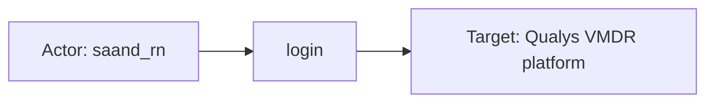
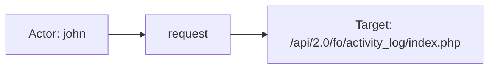
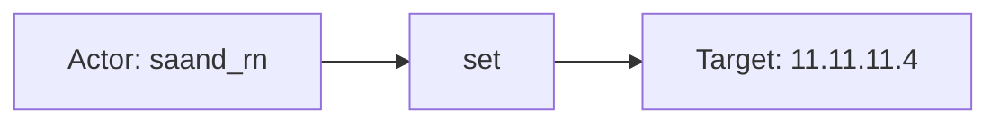

# qualys_vmdr

## Product Domain

Qualys Vulnerability Management, Detection and Response (VMDR) is a cloud-based vulnerability management platform from Qualys. It provides continuous visibility into security weaknesses across an organization's IT assets—on-premises hosts, cloud workloads, and containers—by identifying, prioritizing, and tracking vulnerabilities before they can be exploited. VMDR sits in the security and IT operations domain as a centralized system for vulnerability assessment, risk scoring, and remediation workflow.

The platform discovers and scans assets using Qualys Cloud Agents, internal scanners, and external scanners, then correlates findings against Qualys's vulnerability knowledge base (QIDs). Key capabilities include CVE and CVSS-based risk scoring, Qualys Detection Score (QDS) prioritization, MITRE ATT&CK mapping, threat intelligence correlation, PCI compliance flags, and remediation guidance. Asset host detections can include cloud provider metadata (AWS, Azure, GCP, Alibaba Cloud) for cloud security posture use cases.

Typical use cases include vulnerability prioritization and remediation tracking for security teams, compliance reporting (e.g., PCI), cloud security posture management (CDR), and audit of platform user activity. Security operations teams use VMDR data to correlate findings with other telemetry, track remediation status over time, and focus patching efforts on the highest-risk vulnerabilities across the estate.

## Data Collected (brief)

This integration collects data from Qualys VMDR via REST API into three data streams: **Asset Host Detection** (per-host vulnerability findings enriched with knowledge base details such as CVEs, CVSS, solutions, and threat intel), **Knowledge Base** (vulnerability reference records keyed by QID), and **User Activity** (audit log of user actions within the Qualys platform). Elastic Agent polls these APIs on configurable intervals and maps findings to ECS vulnerability and host fields.

## Expected Audit Log Entities

Only the **user_activity** stream is a true audit log: it exports the Qualys User Activity Log API (`/api/2.0/fo/activity_log/`) and records who did what inside the VMDR console/API (`Action`, `Module`, `Details`, user identity). **asset_host_detection** and **knowledge_base** are vulnerability inventory and reference sync, not audit trails; actor/target semantics below describe inventory subjects where useful. No ECS `user.target.*`, `host.target.*`, `service.target.*`, or `entity.target.*` fields are populated in any stream (confirmed in package pipelines, fixtures, and `dev/target-fields-audit/out/target_fields_audit.csv`). The package does not appear in `destination_identity_hits.csv` — no `destination.user.*` or `destination.host.*` pipeline mappings. Prior audit scan: `target_enhancement_packages.csv` row `qualys_vmdr,none,false,...` (no enhancement signals).

**Event action (Step 2b per stream):**

| Stream | `event.action` in fixtures? | Pipeline maps to `event.action`? | Primary action candidate | Confidence | Evidence |
| --- | --- | --- | --- | --- | --- |
| **user_activity** | yes | yes — `Action` → `event.action` (L57–60) | `qualys_vmdr.user_activity.Action` (already mapped) | high | `login`, `request`, `set`, `add`, `create` in `sample_event.json`, `test-yes-preserve-custom.log-expected.json` |
| **asset_host_detection** | no | no | n/a — no per-event action (finding sync) | high | Static `event.kind: alert`, `event.category: vulnerability`; vendor `vulnerability.status`/`type` describe finding state, not audit verbs |
| **knowledge_base** | no | no | n/a — no per-event action (reference catalog sync) | high | Static `event.kind: alert`, `event.category: vulnerability`; QID records synced, not user operations |

### Event action (semantic)

| Action (normalized label) | Classification | Confidence | Evidence | Per-stream notes |
| --- | --- | --- | --- | --- |
| `login` | authentication | high | `event.action: "login"`, `message: "user_logged in"`, `event.provider: "auth"` | **user_activity** — console/API session start |
| `request` | api_call | high | `event.action: "request"`, `message: "API: /api/2.0/fo/activity_log/index.php"` | **user_activity** — REST API invocation against Qualys |
| `set` | configuration_change | high | `event.action: "set"`, `message: "comment=[vvv] for 11.11.11.4"`, `event.provider: "host_attribute"` | **user_activity** — host attribute update |
| `add` | configuration_change | high | `event.action: "add"`, `message: "11.11.11.4 added to both VM-PC license"`, `event.provider: "option"` | **user_activity** — license/option change |
| `create` | configuration_change | high | `event.action: "create"`, `message: "New Network: 'abc'"`, `event.provider: "network"` | **user_activity** — VMDR network creation |
| (no per-event action) | detection / inventory | high | `event.kind: alert`, `event.category: [vulnerability]` only | **asset_host_detection**, **knowledge_base** — state sync, not auditable operations |

Pipeline derives `event.category` and `event.type` from `event.action` on **user_activity** only: `login` → `authentication`/`info`; `request` → `api`/`info`; `add`/`set`/`create` → `configuration` with `change` or `creation` type (L136–175).

### Event action (ECS candidates)

| ECS / vendor field | Mapped to `event.action` today? | Mapping correct? | Recommended `event.action` value (from fixtures) | Enhancement candidate? | Evidence |
| --- | --- | --- | --- | --- | --- |
| `event.action` | yes (**user_activity**) | yes | `login`, `request`, `set`, `add`, `create` | no | `set` from `qualys_vmdr.user_activity.Action` (`user_activity/.../default.yml` L57–60) |
| `qualys_vmdr.user_activity.Action` | yes (via copy to ECS) | yes | same as above | no | Vendor canonical; retained when `preserve_duplicate_custom_fields` tag set |
| `event.provider` | no | n/a | n/a — module context, not verb | yes (composite only) | `Module` → `event.provider` (L61–64); could combine with `Action` for richer labels (e.g. `host_attribute-set`) but not required |
| `event.type` / `event.category` | no | n/a | n/a — derived from action, not substitutes | no | Appended from `event.action` (L136–175); classification metadata, not action source |
| `qualys_vmdr.asset_host_detection.vulnerability.status` | no | n/a | n/a — finding state (`Active`), not operation | no | Vendor-only (`default.yml` L1452–1457); `"Active"` in fixtures — not an audit verb |
| `qualys_vmdr.asset_host_detection.vulnerability.type` | no | n/a | n/a — detection classification (`Confirmed`), not operation | no | Vendor-only (L1458–1463); describes finding certainty, not who did what |
| (none applicable) | no | n/a | n/a | no | **knowledge_base** — reference record sync; no vendor action/operation field |

### Actor (semantic)

| Entity | Classification | Entity type (if general) | Confidence | Evidence | Per-stream notes |
| --- | --- | --- | --- | --- | --- |
| Qualys platform user (console/API operator) | user | — | high | Every `user_activity` event carries `User Name` / `User Role`; mapped to `user.name`, `user.roles` (`sample_event.json`, `test-yes-preserve-custom.log-expected.json`) | **user_activity** — actor across all observed modules (`auth`, `host_attribute`, `option`, `network`) |
| Qualys platform user client IP | host | — | high | `User IP` → `source.ip` + `related.ip` (`user_activity/elasticsearch/ingest_pipeline/default.yml`; fixtures show `10.113.195.136`, `10.113.14.208`) | **user_activity** — network endpoint of the acting user, not the acted-upon asset |
| Automated vulnerability scanner / agent | service | — | high | `qualys_vmdr.asset_host_detection.vulnerability.latest_vulnerability_detection_source` (`"Cloud Agent"`), `vulnerability_detection_sources` (`"Cloud Agent"`, `"Internal Scanner"`) in `asset_host_detection/sample_event.json`, `test-asset-host-detection.log-expected.json` | **asset_host_detection** — detection mechanism, not a human principal; no `user.*` on findings |
| KB customization author (metadata only) | user | — | moderate | `qualys_vmdr.knowledge_base.last.customization.user_login` (`"user_login"`) in `test-knowledge-base.log-expected.json` | **knowledge_base** — who last customized a QID record; not an auditable action event in this stream |

**user_activity** has a human actor on every event. **asset_host_detection** and **knowledge_base** have no per-event human caller; treat scanner/agent identity as **service** where detection source is present.

### Actor (ECS candidates)

| ECS / vendor field | Role | Mapped today? | Mapping correct? | Confidence | Evidence |
| --- | --- | --- | --- | --- | --- |
| `user.name` | Actor — Qualys login name | yes | yes | high | `copy_from: qualys_vmdr.user_activity.User_Name` (`user_activity/.../default.yml` L69–72); `"john"`, `"saand_rn"` in fixtures |
| `user.roles` | Actor — platform role | yes | yes | high | `append` from `User_Role` (L77–79); `"Reader"`, `"Manager"` in fixtures |
| `source.ip` | Actor client endpoint | yes | yes | high | `convert` from `User_IP` → `source.ip` (L80–84); geoip enrichment follows |
| `related.user` | Actor enrichment | yes | yes | high | `append` from `user.name` (L73–76) |
| `related.ip` | Actor client enrichment | yes | yes | high | `append` from `source.ip` (L85–88) |
| `qualys_vmdr.user_activity.User_Name` | Actor — vendor canonical | yes (vendor) | n/a | high | Retained when `preserve_duplicate_custom_fields` tag set (`sample_event.json`) |
| `qualys_vmdr.user_activity.User_Role` | Actor role — vendor | yes (vendor) | n/a | high | Same |
| `qualys_vmdr.user_activity.User_IP` | Actor IP — vendor | yes (vendor) | n/a | high | Same |
| `qualys_vmdr.knowledge_base.last.customization.user_login` | KB editor (metadata) | yes (vendor) | partial | moderate | Vendor-only; not mapped to `user.*`; describes KB record editor, not an audit event actor |
| `qualys_vmdr.asset_host_detection.vulnerability.latest_vulnerability_detection_source` | Detection service | yes (vendor) | n/a | high | `"Cloud Agent"` in `sample_event.json`; not mapped to ECS actor fields |
| `vulnerability.scanner.vendor` | Scanner product (observer context) | yes | partial | high | Static `Qualys` (`asset_host_detection/.../default.yml` L80–83); observer/scanner context, not the human actor |
| `observer.vendor` | Observing product | yes | n/a | high | Static `Qualys VMDR` on **asset_host_detection** only |

### Target (semantic)

| Layer | Description | Entity | Classification | Entity type (if general) | Confidence | Evidence | Per-stream notes |
| --- | --- | --- | --- | --- | --- | --- | --- |
| 1 — Platform / cloud service | SaaS platform or API surface acted upon | Qualys VMDR / Qualys REST API | service | — | high | `auth` + `login`: `message: "user_logged in"`; `auth` + `request`: `message: "API: /api/2.0/fo/activity_log/index.php"` (`test-yes-preserve-custom.log-expected.json`) | **user_activity** only; no `cloud.service.name` or `service.name` set in pipeline |
| 2 — Resource / object | Configuration object or asset subject of change | Scanned host (by IP), VMDR network, license scope | host / general | network (for `network` module) | high (when inferable) | `host_attribute` + `set`: `"comment=[vvv] for 11.11.11.4"`; `option` + `add`: `"11.11.11.4 added to both VM-PC license"`; `network` + `create`: `"New Network: 'abc'"` | **user_activity** — target only in free-text `message`; not structured ECS fields |
| 2 — Resource / object | Scanned IT asset | Host / cloud workload | host | — | high | `host.id`, `host.name`, `host.ip`, `resource.id`, `resource.name`; cloud: `cloud.instance.id`, `cloud.service.name` (`"EC2"`) when `provider_cloud_data` tag set | **asset_host_detection** — inventory subject, not audit target |
| 2 — Resource / object | Vulnerability definition (QID) | Qualys QID / CVE reference | general | vulnerability_definition | high | `event.id` / `qualys_vmdr.knowledge_base.qid` (`"11830"`, `"284008"`); `vulnerability.id` CVE list | **knowledge_base** — reference record, not an acted-upon runtime resource |
| 3 — Content / artifact | Free-text audit detail or finding payload | Activity `Details` string; per-host detection instance | general | audit_detail / vuln_finding | high | `message` ← `Details` on **user_activity**; `event.id` ← `unique_vuln_id`, `vulnerability.qid` on **asset_host_detection** | Layer 3 is the only structured target ID on findings (`event.id`); audit stream relies on unparsed `message` |

### Target (ECS candidates)

| ECS / vendor field | Layer | Classification | Mapped today? | Mapping correct? | ECS target bucket | Enhancement candidate? | Evidence |
| --- | --- | --- | --- | --- | --- | --- | --- |
| `message` | 3 | general | audit_detail | yes | partial | context-only | yes | `copy_from: qualys_vmdr.user_activity.Details` (L65–68); embeds host IP, network name, API path — should parse to `host.target.*` / `service.target.*` where module permits |
| `event.provider` | 2 | general | config_module | yes | yes | context-only | yes | `Module` → `event.provider` (`auth`, `host_attribute`, `option`, `network`); aids target inference but is not a target identity field |
| `host.id` | 2 | host | — | yes | yes | host.target.id | yes | `json.ID` → `qualys_vmdr.asset_host_detection.id` → `host.id` + `resource.id` (`asset_host_detection/.../default.yml` L167–185); inventory subject, not audit acted-upon host |
| `host.name` / `host.hostname` / `host.ip` | 2 | host | — | yes | yes | host.target.* | yes | DNS/FQDN/IP mapping (L138–356); `"adfssrvr.adfs.local"`, `"10.50.2.111"` in `sample_event.json` |
| `resource.id` / `resource.name` | 2 | host | — | yes | yes | entity.target.id / host.target.name | yes | Copied from Qualys host ID and FQDN (L171–180) |
| `cloud.service.name` | 1 | service | — | conditional | yes | service.target.name | yes | `CLOUD_SERVICE` → `cloud.service.name` when `provider_cloud_data` tag (L236–245); e.g. `"EC2"` — cloud workload type, not Qualys platform |
| `cloud.instance.id` | 2 | host | — | conditional | yes | host.target.id (cloud) | yes | `cloud_resource_id` → `cloud.instance.id` (L225–234) |
| `cloud.provider` | 1 | service | — | conditional | yes | context-only | no | `CLOUD_PROVIDER` lowercased → `cloud.provider` (L246–256) |
| `event.id` | 3 | general | vuln_instance | yes | yes | entity.target.id | yes | `unique_vuln_id` → `event.id` on **asset_host_detection** (L1226–1235); detection instance ID |
| `vulnerability.qid` / `qualys_vmdr.*.vulnerability.qid` | 2 | general | vulnerability | yes | yes | entity.target.id | yes | QID on detection; KB stream uses `event.id` ← `qid` |
| `qualys_vmdr.asset_host_detection.ec2_instance_id` | 2 | host | — | yes (vendor) | n/a | host.target.id | yes | Vendor cloud instance ID; not copied to ECS when only vendor namespace retained |
| `qualys_vmdr.user_activity.Details` | 3 | general | audit_detail | yes (vendor) | n/a | context-only | yes | Canonical target text for audit events; only duplicated to `message` |
| `destination.user.*` / `destination.host.*` | — | — | no | n/a | n/a | n/a | no | Not present in pipelines or fixtures; package absent from `destination_identity_hits.csv` |

### Gaps and mapping notes

- **`event.action` well mapped on audit stream:** **user_activity** copies vendor `Action` → `event.action` with correct semantics (`login`, `request`, `set`, `add`, `create`). No enhancement needed for action mapping on this stream.
- **No `event.action` on inventory streams:** **asset_host_detection** and **knowledge_base** are finding/reference sync — vendor `vulnerability.status`/`type` (`Active`, `Confirmed`) describe finding state, not audit verbs; do not map to `event.action`.
- **Audit target not structured:** **user_activity** records the acted-upon entity only in `Details` → `message`. Host IPs (`11.11.11.4`), network names (`'abc'`), and API paths are not parsed into `host.target.*`, `service.target.*`, or `entity.target.*`. Best enhancement source: grok/dissect on `message` keyed by `event.provider` + `event.action`.
- **No ECS `*.target.*` today:** Aligns with `target_enhancement_packages.csv` (`priority=none`, all signal flags false) and no row in `target_fields_audit.csv` for this package.
- **No `destination.*` de-facto targets:** Package not in `destination_identity_hits.csv`; no migration from `destination.user.*` / `destination.host.*` applicable.
- **`source.ip` is actor client, not target:** `User IP` correctly maps to `source.ip` (actor workstation/VPN egress). Do not interpret as scanned-asset or platform target IP.
- **`host.domain` ← NETBIOS on findings:** `host.domain` is populated from `NETBIOS` (`asset_host_detection/.../default.yml` L197–201), which is NetBIOS name semantics — acceptable for inventory but not equivalent to DNS domain; unrelated to audit actor/target.
- **`cloud.service.name` on findings is workload type, not Qualys:** When `provider_cloud_data` tag is set, `cloud.service.name` reflects Qualys `CLOUD_SERVICE` (e.g. `"EC2"`) for the **scanned cloud asset**, not the Qualys VMDR SaaS platform invoked in **user_activity** auth events.
- **Scanner vs actor on findings:** `vulnerability.scanner.vendor: Qualys` and `observer.vendor: Qualys VMDR` describe the observing product; automated `Cloud Agent` / `Internal Scanner` strings are detection-source **service** actors, not ECS-mapped principals.
- **KB `user_login` is not audit actor:** `qualys_vmdr.knowledge_base.last.customization.user_login` is customization metadata on reference records; no corresponding `user.*` ECS mapping and no audit `event.action` — do not conflate with **user_activity** platform audit.

### Per-stream notes

#### user_activity

True audit stream. Pipeline JSON-parses activity log rows, maps `Action` → `event.action`, `Module` → `event.provider`, platform user → `user.name` / `user.roles`, client IP → `source.ip`, and copies `Details` → `message`. Observed actions: `login`, `request` (auth/API), `set`, `add`, `create` (configuration). Target entity varies by `event.provider` and must be inferred from `message` text — auth events target Qualys VMDR (**service**); configuration modules target hosts (**host**) or VMDR networks (**general**). Pipeline removes incoming `cloud` and `host` fields (L127–131) — audit events never carry structured host targets.

#### asset_host_detection

Per-host vulnerability finding sync (`event.kind: alert`, `event.category: vulnerability`). Not an audit log; no per-event `event.action`. **Host** is the inventory subject (`host.*`, `resource.*`); **vulnerability** (`vulnerability.*`, `event.id`) is the finding on that host. Vendor `vulnerability.status`/`type` remain vendor-only. Optional cloud enrichment via `provider_cloud_data` tag populates `cloud.provider`, `cloud.service.name`, `cloud.instance.id`. Automated scanners appear as vendor detection-source strings only.

#### knowledge_base

Vulnerability reference catalog keyed by QID (`event.id`). Not an audit log and no meaningful per-event actor/target audit semantics or `event.action`. Each record describes a vulnerability definition (`vulnerability.id`, `vulnerability.category`, rich `qualys_vmdr.knowledge_base.*` tree). Optional `last.customization.user_login` indicates who last edited the KB entry, not a logged platform action in this stream.

## Example Event Graph

Examples below come from the **user_activity** audit stream (`qualys_vmdr.user_activity`), the only stream with true Actor → action → Target semantics. **asset_host_detection** and **knowledge_base** are vulnerability inventory and reference-catalog sync with no per-event `event.action`; those streams do not yield meaningful audit event graphs.

### Example 1: Console login

**Stream:** `qualys_vmdr.user_activity` · **Fixture:** `packages/qualys_vmdr/data_stream/user_activity/_dev/test/pipeline/test-yes-preserve-custom.log-expected.json`

```
saand_rn (user) → login → Qualys VMDR platform (service)
```

#### Actor

| Field | Value |
| --- | --- |
| id | saand_rn |
| name | saand_rn |
| type | user |
| ip | 10.113.195.136 |

**Field sources:**

- `id` ← `user.name`
- `name` ← `user.name`
- `ip` ← `source.ip` (`qualys_vmdr.user_activity.User_IP`)

#### Event action

| Field | Value |
| --- | --- |
| action | login |
| source_field | `event.action` |
| source_value | login |

#### Target

| Field | Value |
| --- | --- |
| name | Qualys VMDR platform |
| type | service |

**Field sources:**

- `name` ← semantic — SaaS platform being authenticated to; **not indexed** in fixture (`cloud.service.name` absent; `message` only states `"user_logged in"`)
- `type` ← inferred from `event.provider: auth` + `event.action: login`

**Scope context (not target):** `message` / `qualys_vmdr.user_activity.Details` = `"user_logged in"` describes the auth outcome, not the platform identity.

#### Mermaid



### Example 2: REST API request

**Stream:** `qualys_vmdr.user_activity` · **Fixture:** `packages/qualys_vmdr/data_stream/user_activity/sample_event.json`

```
john (user) → request → /api/2.0/fo/activity_log/index.php (service)
```

#### Actor

| Field | Value |
| --- | --- |
| id | john |
| name | john |
| type | user |
| ip | 10.113.195.136 |

**Field sources:**

- `id` ← `user.name`
- `name` ← `user.name`
- `ip` ← `source.ip` (`qualys_vmdr.user_activity.User_IP`)

#### Event action

| Field | Value |
| --- | --- |
| action | request |
| source_field | `event.action` |
| source_value | request |

#### Target

| Field | Value |
| --- | --- |
| name | API: /api/2.0/fo/activity_log/index.php |
| type | service |

**Field sources:**

- `name` ← `message` (`qualys_vmdr.user_activity.Details`)
- `type` ← inferred from `event.provider: auth` + API path in `message` — Qualys REST API endpoint; not mapped to `service.name` or `url.path` today

#### Mermaid



### Example 3: Host attribute update

**Stream:** `qualys_vmdr.user_activity` · **Fixture:** `packages/qualys_vmdr/data_stream/user_activity/_dev/test/pipeline/test-yes-preserve-custom.log-expected.json`

```
saand_rn (user) → set → 11.11.11.4 (host)
```

#### Actor

| Field | Value |
| --- | --- |
| id | saand_rn |
| name | saand_rn |
| type | user |
| ip | 10.113.14.208 |

**Field sources:**

- `id` ← `user.name`
- `name` ← `user.name`
- `ip` ← `source.ip` (`qualys_vmdr.user_activity.User_IP`)

#### Event action

| Field | Value |
| --- | --- |
| action | set |
| source_field | `event.action` |
| source_value | set |

#### Target

| Field | Value |
| --- | --- |
| ip | 11.11.11.4 |
| name | comment=[vvv] for 11.11.11.4 |
| type | host |

**Field sources:**

- `ip` ← embedded in `message` (`qualys_vmdr.user_activity.Details`: `"comment=[vvv] for 11.11.11.4"`) — not parsed into `host.target.ip` or `host.ip` today
- `name` ← `message`
- `type` ← inferred from `event.provider: host_attribute` + host IP in `message`

#### Mermaid



## ES|QL Entity Extraction

**Package type: agent-backed** (`policy_templates`, three `data_stream/` directories with Tier A fixtures and ingest pipelines). Router: **`data_stream.dataset`** (`qualys_vmdr.user_activity`, `qualys_vmdr.asset_host_detection`, `qualys_vmdr.knowledge_base` per `manifest.yml`). Pass 4 is **fill-gaps-only**: detection flags (`actor_exists`, `target_exists`, `action_exists`) run first for query semantics; **mapped columns use column-level preserve** (`<col> IS NOT NULL`) — valid **5-arg** / **7-arg** / **9-arg** `CASE` only — not `CASE(actor_exists, <col>, …)` / `CASE(target_exists, <col>, …)` and never **4-arg** `CASE(<col> IS NOT NULL, <col>, bare_field, null)` (bare field parses as a boolean condition). **`qualys_vmdr.user_activity`** gets full audit actor/target enrichment with secondary routing on **`event.action`** — on **`login`**, map **`service.target.name`** `"Qualys VMDR"` (Pass 3 platform target), not self-referential `user.name`; on **`request`**, promote API path from **`message`**. **`qualys_vmdr.asset_host_detection`** lifts inventory host + vuln instance into `host.target.*` / `entity.target.id` and detection source into `service.name` when ECS tiers are empty. **`destination.user.*` / `destination.host.*`:** not present in pipelines or fixtures (package absent from `destination_identity_hits.csv`) — no de-facto target migration.

### Dataset inventory

| data_stream.dataset | Stream role | Actor classification(s) | Target classification(s) | Extraction |
| --- | --- | --- | --- | --- |
| `qualys_vmdr.user_activity` | audit | user, host (client IP) | service, host (unparsed in message) | full |
| `qualys_vmdr.asset_host_detection` | vulnerability inventory | service (detection source) | host, general (vuln instance) | partial |
| `qualys_vmdr.knowledge_base` | reference catalog | user (metadata only) | general (QID definition) | none |

### Field mapping plan

#### Actor mappings

| Output column | Source field(s) | Condition (dataset + optional) | Confidence | Notes |
| --- | --- | --- | --- | --- |
| `user.id` | `user.name` | `data_stream.dataset == "qualys_vmdr.user_activity" AND user.name IS NOT NULL` | high | **column-level preserve** + **vendor fallback** — not `CASE(actor_exists, user.id, …)` (`user.name` can set `actor_exists` while `user.id` is empty) |
| `user.name` | — | `data_stream.dataset == "qualys_vmdr.user_activity"` | high | **ingest-only — no ES|QL** — pipeline maps `User_Name` → `user.name`; no alternate query-time source |
| `host.ip` | `source.ip` | `data_stream.dataset == "qualys_vmdr.user_activity" AND source.ip IS NOT NULL` | high | **column-level preserve** + **fallback** — actor client (`User_IP` → `source.ip`); not scanned asset |
| `service.name` | `qualys_vmdr.asset_host_detection.vulnerability.latest_vulnerability_detection_source` | `data_stream.dataset == "qualys_vmdr.asset_host_detection" AND qualys_vmdr.asset_host_detection.vulnerability.latest_vulnerability_detection_source IS NOT NULL` | medium | **column-level preserve** + **vendor fallback**; e.g. `"Cloud Agent"` — detection mechanism, not human principal |

#### Target mappings

| Output column | Source field(s) | Condition (dataset + optional) | Confidence | Notes |
| --- | --- | --- | --- | --- |
| `service.target.name` | `"Qualys VMDR"` | `data_stream.dataset == "qualys_vmdr.user_activity" AND event.action == "login"` | low | **semantic literal**; fallback only when `NOT target_exists` |
| `service.target.name` | `message` | `data_stream.dataset == "qualys_vmdr.user_activity" AND event.action == "request" AND message IS NOT NULL` | high | **column-level preserve** + **fallback** — API path from `Details` (fixture: `/api/2.0/fo/activity_log/index.php`) |
| `host.target.id` | `host.id` | `data_stream.dataset == "qualys_vmdr.asset_host_detection" AND host.id IS NOT NULL` | high | **column-level preserve** + **fallback** — inventory subject; not audit acted-upon host |
| `host.target.name` | `host.name` | `data_stream.dataset == "qualys_vmdr.asset_host_detection" AND host.name IS NOT NULL` | high | **column-level preserve** + **fallback** |
| `host.target.ip` | `host.ip` | `data_stream.dataset == "qualys_vmdr.asset_host_detection" AND host.ip IS NOT NULL` | high | **column-level preserve** + **fallback**; `host.ip` may be multivalue in fixtures |
| `entity.target.id` | `event.id` | `data_stream.dataset == "qualys_vmdr.asset_host_detection" AND event.id IS NOT NULL` | high | **column-level preserve** + **fallback** — `unique_vuln_id` detection instance |

`actor_exists` uses `user.name` and `source.ip` (not `user.id`) because ingest maps Qualys `User_Name` → `user.name` only. **Actor/target `EVAL` blocks use column-level preserve** (`<col> IS NOT NULL`, not `CASE(actor_exists|target_exists, <col>, …)`) so a populated `user.name` does not block `user.id` ← `user.name` or `host.ip` ← `source.ip`, and one populated `host.target.id` does not block sibling `host.target.name` / `entity.target.id` fallbacks (Pass 4 §10).

**ES|QL `CASE` arity:** Arguments are **(condition, value)** pairs; odd count → last arg is default. Wrong: `CASE(user.id IS NOT NULL, user.id, user.name, null)` (4 args — `user.name` is a **condition**, not a value). Wrong: `CASE(actor_exists, user.id, user.name, null)` (same). Right: **5-arg** `CASE(user.id IS NOT NULL, user.id, data_stream.dataset == "qualys_vmdr.user_activity" AND user.name IS NOT NULL, user.name, null)`.

### Detection flags (mandatory — run first)

```esql
| EVAL
  actor_exists = user.name IS NOT NULL OR user.roles IS NOT NULL
    OR source.ip IS NOT NULL
    OR service.name IS NOT NULL OR entity.id IS NOT NULL OR entity.name IS NOT NULL,
  target_exists = user.target.id IS NOT NULL OR user.target.name IS NOT NULL OR user.target.email IS NOT NULL
    OR host.target.id IS NOT NULL OR host.target.ip IS NOT NULL OR host.target.name IS NOT NULL
    OR service.target.id IS NOT NULL OR service.target.name IS NOT NULL
    OR entity.target.id IS NOT NULL OR entity.target.name IS NOT NULL,
  action_exists = event.action IS NOT NULL
```

### Optional classification helpers (when needed)

Set in **fallback** only when `entity.target.type` is empty:

```esql
| EVAL
  entity.target.type = CASE(
    entity.target.type IS NOT NULL, entity.target.type,
    data_stream.dataset == "qualys_vmdr.user_activity" AND event.action == "login", "service",
    data_stream.dataset == "qualys_vmdr.user_activity" AND event.action == "request", "service",
    data_stream.dataset == "qualys_vmdr.user_activity" AND event.provider == "host_attribute", "host",
    data_stream.dataset == "qualys_vmdr.asset_host_detection", "host",
    null
  )
```

### Combined ES|QL — actor fields

```esql
| EVAL
  user.id = CASE(
    user.id IS NOT NULL, user.id,
    data_stream.dataset == "qualys_vmdr.user_activity" AND user.name IS NOT NULL, user.name,
    null
  ),
  host.ip = CASE(
    host.ip IS NOT NULL, host.ip,
    data_stream.dataset == "qualys_vmdr.user_activity" AND source.ip IS NOT NULL, source.ip,
    null
  ),
  service.name = CASE(
    service.name IS NOT NULL, service.name,
    data_stream.dataset == "qualys_vmdr.asset_host_detection" AND qualys_vmdr.asset_host_detection.vulnerability.latest_vulnerability_detection_source IS NOT NULL, qualys_vmdr.asset_host_detection.vulnerability.latest_vulnerability_detection_source,
    null
  )
```

### Combined ES|QL — event action

Omitted — **`qualys_vmdr.user_activity`** always sets `event.action` from vendor `Action` at ingest (`user_activity/.../default.yml` L57–60). No `event.action` on **`asset_host_detection`** or **`knowledge_base`** (inventory/reference sync).

### Combined ES|QL — target fields

```esql
| EVAL
  service.target.name = CASE(
    service.target.name IS NOT NULL, service.target.name,
    data_stream.dataset == "qualys_vmdr.user_activity" AND event.action == "login", "Qualys VMDR",
    data_stream.dataset == "qualys_vmdr.user_activity" AND event.action == "request" AND message IS NOT NULL, message,
    null
  ),
  host.target.id = CASE(
    host.target.id IS NOT NULL, host.target.id,
    data_stream.dataset == "qualys_vmdr.asset_host_detection" AND host.id IS NOT NULL, host.id,
    null
  ),
  host.target.name = CASE(
    host.target.name IS NOT NULL, host.target.name,
    data_stream.dataset == "qualys_vmdr.asset_host_detection" AND host.name IS NOT NULL, host.name,
    null
  ),
  host.target.ip = CASE(
    host.target.ip IS NOT NULL, host.target.ip,
    data_stream.dataset == "qualys_vmdr.asset_host_detection" AND host.ip IS NOT NULL, host.ip,
    null
  ),
  entity.target.id = CASE(
    entity.target.id IS NOT NULL, entity.target.id,
    data_stream.dataset == "qualys_vmdr.asset_host_detection" AND event.id IS NOT NULL, event.id,
    null
  )
```

### Full pipeline fragment (optional)

```esql
FROM logs-*
| EVAL
  actor_exists = user.name IS NOT NULL OR user.roles IS NOT NULL OR source.ip IS NOT NULL
    OR service.name IS NOT NULL,
  target_exists = user.target.id IS NOT NULL OR user.target.name IS NOT NULL
    OR host.target.id IS NOT NULL OR host.target.ip IS NOT NULL OR host.target.name IS NOT NULL
    OR service.target.id IS NOT NULL OR service.target.name IS NOT NULL
    OR entity.target.id IS NOT NULL OR entity.target.name IS NOT NULL,
  action_exists = event.action IS NOT NULL
| EVAL
  user.id = CASE(user.id IS NOT NULL, user.id, data_stream.dataset == "qualys_vmdr.user_activity" AND user.name IS NOT NULL, user.name, null),
  host.ip = CASE(host.ip IS NOT NULL, host.ip, data_stream.dataset == "qualys_vmdr.user_activity" AND source.ip IS NOT NULL, source.ip, null),
  service.name = CASE(service.name IS NOT NULL, service.name, data_stream.dataset == "qualys_vmdr.asset_host_detection" AND qualys_vmdr.asset_host_detection.vulnerability.latest_vulnerability_detection_source IS NOT NULL, qualys_vmdr.asset_host_detection.vulnerability.latest_vulnerability_detection_source, null)
| EVAL
  service.target.name = CASE(
    service.target.name IS NOT NULL, service.target.name,
    data_stream.dataset == "qualys_vmdr.user_activity" AND event.action == "login", "Qualys VMDR",
    data_stream.dataset == "qualys_vmdr.user_activity" AND event.action == "request" AND message IS NOT NULL, message,
    null
  ),
  host.target.id = CASE(host.target.id IS NOT NULL, host.target.id, data_stream.dataset == "qualys_vmdr.asset_host_detection" AND host.id IS NOT NULL, host.id, null),
  host.target.name = CASE(host.target.name IS NOT NULL, host.target.name, data_stream.dataset == "qualys_vmdr.asset_host_detection" AND host.name IS NOT NULL, host.name, null),
  host.target.ip = CASE(host.target.ip IS NOT NULL, host.target.ip, data_stream.dataset == "qualys_vmdr.asset_host_detection" AND host.ip IS NOT NULL, host.ip, null),
  entity.target.id = CASE(entity.target.id IS NOT NULL, entity.target.id, data_stream.dataset == "qualys_vmdr.asset_host_detection" AND event.id IS NOT NULL, event.id, null)
| KEEP @timestamp, data_stream.dataset, event.action, event.provider, user.id, user.name, host.ip, service.target.name, host.target.id, entity.target.id, message
```

### Streams excluded

- **`qualys_vmdr.knowledge_base`** — QID reference-catalog sync; no per-event `event.action`, no audit actor/target chain; `qualys_vmdr.knowledge_base.last.customization.user_login` is KB metadata only.

### Gaps and limitations

- **`user.name`** — **ingest-only**; omit from actor `EVAL` (no tautological `CASE(actor_exists, user.name, …, user.name, null)`).
- **`event.action` fallback** — not needed on **user_activity**; ingest always maps `Action` → `event.action`. Inventory streams have no action candidates.
- **`user.email` / `user.domain`** — not indexed; mark **gap — not extractable** unless future pipeline adds email.
- **Host/network targets on `user_activity`** — host IPs (`11.11.11.4`) and network names (`'abc'`) exist only in unparsed `message`/`Details`; omit `host.target.*` / `entity.target.*` at query time — prefer ingest grok keyed by `event.provider` + `event.action` (Pass 2 enhancement).
- **`set` / `add` / `create` configuration targets** — free-text `message` only; `entity.target.type` may classify as `host` for `host_attribute` but no reliable `host.target.ip` without ingest parsing.
- **`source.ip` is actor client** — maps to `host.ip` in actor fallback only; never to `host.target.ip` on audit events.
- **`cloud.service.name` on findings** — reflects scanned cloud workload type (e.g. EC2), not Qualys VMDR platform on **user_activity** login.
- **Pass 2 enhancement alignment** — structured `host.target.*` / `entity.target.*` from `Details` at ingest remains preferred; Pass 4 fills gaps without overwriting populated values.
- **Pass 4 CASE syntax** — column-level `IS NOT NULL` preserve on all mapped columns; odd-arity defaults (`null`); no `CASE(actor_exists|target_exists, <col>, …)`; vendor fallbacks guarded with `IS NOT NULL` on source fields; full pipeline fragment aligned with combined `EVAL` blocks (includes `host.target.ip`). Detection flags are helpers only.
- **Unscoped `FROM logs-*`** — dataset routing lives in `CASE` fallback conditions (`data_stream.dataset == …`), not a top-level `WHERE`.
