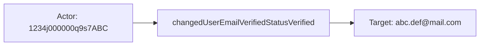
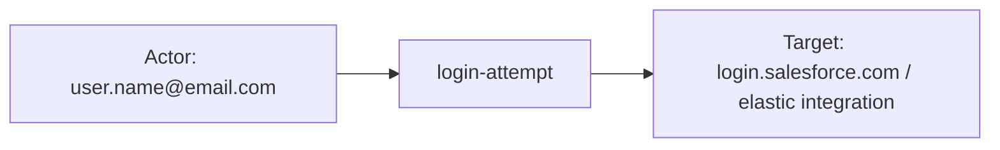
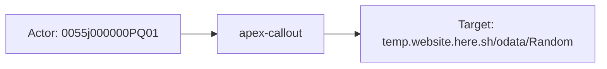

# salesforce

## Product Domain (Salesforce CRM SaaS)

Salesforce is a cloud-based customer relationship management (CRM) platform delivered as SaaS. Organizations use it to manage sales pipelines, marketing campaigns, customer service cases, commerce operations, and IT workflows from a unified, multi-tenant environment accessible via web UI, mobile apps, and APIs. The platform is structured around orgs (tenants), users with profiles and permission sets, standard and custom objects, and an extensible application layer built on Apex (Salesforce's proprietary programming language) and declarative automation.

At its core, Salesforce functions as a system of record for customer and business data, with deep customization through metadata configuration in Setup (security settings, connected apps, permission sets, workflows, and integrations). Developers extend the platform with Apex classes, triggers, REST/SOAP APIs, and external callouts. Real-Time Event Monitoring and EventLogFile provide audit and performance telemetry for authentication, application execution, and administrative changes—critical surfaces for security and operational visibility.

From a security and compliance perspective, Salesforce generates structured logs for user authentication (login and logout), Apex execution (callouts, triggers, REST/SOAP API usage), and Setup changes (SetupAuditTrail). These events capture user identity, session context, client IP, API version, TLS details, transaction security policy outcomes, and configuration change descriptions. Security teams monitor Salesforce orgs to detect unauthorized access, anomalous login patterns, privileged Setup modifications, and application performance or abuse.

The Elastic Salesforce integration ingests these logs via Elastic Agent using the Salesforce input, querying the REST API with SOQL over EventLogFile, Real-Time Event Monitoring platform events (`LoginEvent`, `LogoutEvent`), and the `SetupAuditTrail` object. OAuth 2.0 authentication is supported through a Connected App using JWT bearer or Username-Password flows. Collection is interval-based with cursors for deduplication and optional historical backfill. Events are normalized into ECS-aligned fields for SIEM correlation, authentication monitoring, audit trail analysis, and Apex performance observability.

## Data Collected (brief)

- **Login events** (`salesforce.login`): User authentication activity from EventLogFile or `LoginEvent` platform events, including username, user ID, login status, client IP, browser/user agent, TLS cipher and protocol, API type/version, login key, session context, transaction security policy evaluation, and request timing metrics.
- **Logout events** (`salesforce.logout`): User session termination from EventLogFile or `LogoutEvent` platform events, including user ID, login key, session type/level, client IP, platform and application type, user-initiated vs timeout logout, and API metadata.
- **Apex events** (`salesforce.apex`): Apex execution telemetry from EventLogFile, covering event types such as `ApexCallout`, `ApexExecution`, `ApexRestApi`, `ApexSoap`, `ApexTrigger`, and `ExternalCustomApexCallout`, with CPU/run time, SOQL query details, trigger/class names, HTTP method and URL for callouts, request/response sizes, and user/org identifiers.
- **Setup audit trail** (`salesforce.setupaudittrail`): Administrative changes in the org Setup area (up to 180 days), including action type, section (e.g., Manage Users, Connected Apps), display description, created-by user/context, and delegate user for Login-As actions.

## Expected Audit Log Entities

The integration has four data streams with mixed audit semantics. **`salesforce.setupaudittrail`** is a true administrative audit log (Setup changes, up to 180 days). **`salesforce.login`** and **`salesforce.logout`** are authentication audit-adjacent events from Real-Time Event Monitoring (`LoginEvent`/`LogoutEvent` Object API) or EventLogFile CSV. **`salesforce.apex`** is Apex execution telemetry (callouts, triggers, REST/SOAP) — performance and API-usage observability rather than IAM configuration audit. No ECS `user.target.*`, `host.target.*`, `service.target.*`, or `entity.target.*` fields are populated; no `destination.user.*` / `destination.host.*` in any pipeline (`destination_identity_hits.csv` has no salesforce row). The target-fields audit classifies salesforce as **`none`** with all heuristic flags false (`dev/target-fields-audit/out/target_enhancement_packages.csv`).

Evidence: `packages/salesforce/data_stream/{setupaudittrail,login,logout,apex}/sample_event.json`, `_dev/test/pipeline/*-expected.json`, `elasticsearch/ingest_pipeline/*.yml`, `fields/fields.yml`.

**Event action:** `event.action` is populated on **all four streams**. **`setupaudittrail`** copies vendor-native Setup action names (`insertConnectedApplication`, `changedUserEmailVerifiedStatusVerified`) from `Action`. **`login`** and **`logout`** use static pipeline values (`login-attempt`, `logout`) rather than vendor `EVENT_TYPE` (`Login`, `Logout`). **`apex`** normalizes `EVENT_TYPE` to slug labels (`apex-callout`, `apex-trigger`, `apex-execution`, `apex-rest`, `apex-soap`, `apex-external-custom-callout`); vendor `salesforce.apex.action` (e.g. `query` on ExternalCustomApexCallout) is retained but not copied to `event.action`.

### Event action (semantic)

Salesforce events carry action at two levels: (1) **stream-level operation** — what class of activity occurred (login, logout, Setup change, Apex callout); (2) **Setup-specific admin action** or **Apex sub-operation** — granular vendor action on setupaudittrail (`Action`) or external callout query type (`salesforce.apex.action`). Level (1) maps to `event.action` on all streams today; level (2) is vendor-only except on setupaudittrail where vendor `Action` *is* `event.action`.

| Action (normalized label) | Classification | Confidence | Evidence | Per-stream notes |
| --- | --- | --- | --- | --- |
| `insertConnectedApplication` | administration | high | `event.action: "insertConnectedApplication"` in `setupaudittrail/sample_event.json` and `test-setupaudittrail.log-expected.json` | **`setupaudittrail`** — connected app creation in Setup |
| `changedUserEmailVerifiedStatusVerified` | administration | high | `event.action: "changedUserEmailVerifiedStatusVerified"` in `test-setupaudittrail.log-expected.json` | **`setupaudittrail`** — user email verification status change |
| `login-attempt` | authentication | high | Static pipeline value; all login fixtures (`test-login-eventlogfile.log-expected.json`, `test-login-object.log-expected.json`, `login/sample_event.json`) | **`login`** — Object and EventLogFile; outcome in `event.outcome`, not action |
| `logout` | authentication | high | Static pipeline value; `logout/sample_event.json`, `test-logout-eventlogfile.log-expected.json`, `test-logout-object.log-expected.json` | **`logout`** — Object and EventLogFile |
| `apex-callout` | api_call | high | `EVENT_TYPE: ApexCallout` → `event.action: "apex-callout"` in `apex/sample_event.json`, `test-apex.log-expected.json` | **`apex`** — outbound HTTP callout |
| `apex-execution` | api_call | high | `EVENT_TYPE: ApexExecution` → `event.action: "apex-execution"` in `test-apex.log-expected.json` | **`apex`** — Apex code execution |
| `apex-trigger` | api_call | high | `EVENT_TYPE: ApexTrigger` → `event.action: "apex-trigger"` in `test-apex.log-expected.json` | **`apex`** — trigger firing |
| `apex-rest` | api_call | high | `EVENT_TYPE: ApexRestApi` → `event.action: "apex-rest"` in `test-apex.log-expected.json` | **`apex`** — Apex REST API |
| `apex-soap` | api_call | high | `EVENT_TYPE: ApexSoap` → `event.action: "apex-soap"` in `test-apex.log-expected.json` | **`apex`** — Apex SOAP API |
| `apex-external-custom-callout` | api_call | high | `EVENT_TYPE: ExternalCustomApexCallout` → `event.action: "apex-external-custom-callout"` in `test-apex.log-expected.json` | **`apex`** — external custom connector callout |
| `query` (Apex sub-action) | data_access | high | `salesforce.apex.action: "query"` in ExternalCustomApexCallout fixture; **not** mapped to `event.action` | **`apex`** — sub-operation within external callout |

### Event action (ECS candidates)

| ECS / vendor field | Mapped to `event.action` today? | Mapping correct? | Recommended `event.action` value (from fixtures) | Enhancement candidate? | Evidence |
| --- | --- | --- | --- | --- | --- |
| `Action` → `event.action` | yes | yes | `insertConnectedApplication`, `changedUserEmailVerifiedStatusVerified` | no | `setupaudittrail/default.yml` L88–91: rename `json.Action`; both values in `test-setupaudittrail.log-expected.json` |
| Static `login-attempt` | yes | partial | `login-attempt` (normalized); vendor `Login` in `salesforce.login.event_type` unused | partial — consider appending vendor `LoginType` or `Status` for failed-login distinction | `login/default.yml` L43–45: static set after sub-pipelines; vendor `EVENT_TYPE: Login` in ELF fixtures only |
| `salesforce.login.event_type` | no | n/a | `Login` | yes — alternate if static label removed | ELF pipeline `eventlogfile.yml` L94–96; `login/sample_event.json` |
| `salesforce.login.type` / `json.LoginType` | no | n/a | varies by Object login | yes — enrich static action with login channel (UI, API, SSO) | Object pipeline `object.yml` L54–57; not in ELF fixtures |
| Static `logout` | yes | partial | `logout` (normalized); vendor `Logout` in `salesforce.logout.event_type` unused | partial — static label is semantically correct | `logout/default.yml` L43–45 |
| `salesforce.logout.event_type` | no | n/a | `Logout` | yes — alternate if static label removed | ELF pipeline `eventlogfile.yml` L51–53; `logout/sample_event.json` |
| `salesforce.apex.event_type` → `event.action` | yes | yes | `apex-callout`, `apex-execution`, `apex-trigger`, `apex-rest`, `apex-soap`, `apex-external-custom-callout` | no | `apex/default.yml` L174–191: painless map from lowercased `event_type` |
| `salesforce.apex.action` | no | n/a | `query` (ExternalCustomApexCallout fixture) | yes — sub-action for external callouts; could append to `event.action` or use `event.type` | Painless rename `ACTION` → `salesforce.apex.action` L79–114; fixture in `test-apex.log-expected.json` |
| `http.request.method` | no | n/a | `GET` (ApexCallout fixtures) | no — HTTP method is callout context, not Apex event class | `apex/default.yml` L261–264; paired with `event.action: apex-callout` |
| `event.type`, `event.category` | partial | yes | `event.type: ["admin"]` (setupaudittrail); `["authentication"]` category on login/logout; `["network"]` on apex callouts | no | Complements but does not replace `event.action`; distinct semantics per ECS Event field set |

**Per-stream action summary (Step 2b):**

| Stream | `event.action` in fixtures? | Pipeline maps to `event.action`? | Primary action candidate | Confidence | Evidence |
| --- | --- | --- | --- | --- | --- |
| `salesforce.setupaudittrail` | yes | yes | `Action` → `event.action` | high | `insertConnectedApplication`, `changedUserEmailVerifiedStatusVerified` in sample + expected fixtures |
| `salesforce.login` (Object + EventLogFile) | yes | yes (static) | static `login-attempt` | high | All login fixtures; vendor `EVENT_TYPE`/`LoginType` not used for action |
| `salesforce.logout` (Object + EventLogFile) | yes | yes (static) | static `logout` | high | All logout fixtures; vendor `EVENT_TYPE: Logout` retained vendor-only |
| `salesforce.apex` | yes | yes | `salesforce.apex.event_type` → normalized slug | high | Six event types mapped in `default.yml` L179–185; all present in `test-apex.log-expected.json` |

### Actor (semantic)

| Entity | Classification | Entity type (if general) | Confidence | Evidence | Per-stream notes |
| --- | --- | --- | --- | --- | --- |
| Setup change author | user | — | high | `CreatedById` → `salesforce.setup_audit_trail.created_by_id` + `user.id`; fixtures: `0055j000000utlPAAQ`, `1234j000000q9s7ABC` | **`setupaudittrail`** — canonical admin actor for Setup changes |
| Login-As delegate | user | — | high | `DelegateUser` → `salesforce.setup_audit_trail.delegate_user`; fixture: `user1` on `insertConnectedApplication` | **`setupaudittrail`** — admin acting via Login-As; vendor-only, not mapped to ECS `user.*` |
| Automated / platform actor context | service | — | medium | `CreatedByContext` → `salesforce.setup_audit_trail.created_by_context`; fixture: `Einstein` | **`setupaudittrail`** — cloud-to-cloud or platform automation; supplementary to `created_by_id` |
| Managed-package actor | service | — | low | `ResponsibleNamespacePrefix` → `salesforce.setup_audit_trail.responsible_namespace_prefix`; field defined, null in fixtures | **`setupaudittrail`** — installed package namespace that initiated the change |
| Authenticating user | user | — | high | `UserId`/`USER_ID_DERIVED` → `user.id`; `Username`/`USER_NAME` → `user.email`; `UserType`/`USER_TYPE` → `user.roles`; fixtures: `user.name@email.com`, `salesforceinstance@devtest.in` | **`login`**, **`logout`** — primary actor from Object platform events and EventLogFile |
| SSO / IdP context | general | identity provider | medium | `AuthServiceId` → `salesforce.login.auth.service_id`; `AuthMethodReference` → `salesforce.login.auth.method_reference` | **`login`** (Object only) — third-party SSO metadata; vendor-only |
| Client source IP | host | — | high | `SourceIp`/`CLIENT_IP`/`SOURCE_IP` → `source.ip` (+ geo); `salesforce.login.client.ip` on EventLogFile login; `related.ip` on login/apex | **`login`**, **`logout`**, **`apex`** — network origin, not a Salesforce identity |
| Client user agent / platform | host | — | high | Object: `Browser`/`Platform` → `user_agent.*`; EventLogFile login: `BROWSER_TYPE` → full UA parse; logout ELF: `browser_type`/`platform_type` vendor-only | **`login`**, **`logout`** — client environment context |
| Apex execution user | user | — | high | `USER_ID` → `user.id`; `USER_ID_DERIVED` → `salesforce.apex.user_id_derived` (vendor-only); fixtures: `0055j000000utlP`, `0055j000000PQ01` | **`apex`** — Salesforce user whose session triggered Apex execution |

### Actor (ECS candidates)

| ECS / vendor field | Role | Mapped today? | Mapping correct? | Confidence | Evidence |
| --- | --- | --- | --- | --- | --- |
| `user.id` | Setup author or auth/Apex session user | yes | partial | high | setupaudittrail: `copy_from` `created_by_id` (`default.yml` L120–124); login/logout: `UserId`/`USER_ID_DERIVED` rename; apex: `USER_ID` rename — on setupaudittrail, `user.id` is always the author even when display text names a different affected user |
| `user.email` / `user.name` / `user.domain` | Auth user email or dissected display identity | yes | partial | high | login/logout: `Username`/`USER_NAME` → `user.email` (correct actor); setupaudittrail: dissect of `display` `For user %{user.name}, …` overwrites into `user.email`/`user.name`/`user.domain` (L125–140) — semantically the **target user** on Manage Users actions, not the author |
| `user.roles` | Salesforce user type | yes | yes | high | login Object: append `UserType`; login ELF: set from `USER_TYPE`; apex: append `USER_TYPE`; logout ELF: `salesforce.logout.user.roles` only (not ECS `user.roles`) |
| `related.user` | Identity enrichment bag | yes | partial | high | setupaudittrail: appends `user.id`, `user.name`, `user.email` (L141–158) — mixes author ID with target email/name when display pattern matches |
| `source.ip` / `source.geo` | Client network origin | yes | yes | high | login Object: `SourceIp` convert + geo from LoginGeo fields; login ELF: `SOURCE_IP` (skips `Salesforce.com IP`); logout/apex: `CLIENT_IP` with same skip rule |
| `user_agent.*` | Client browser/OS | partial | yes | high | login Object: `Browser`/`Platform` → `user_agent.name`/`user_agent.os.name`; login ELF: `user_agent` processor on `BROWSER_TYPE` |
| `salesforce.setup_audit_trail.delegate_user` | Login-As delegate actor | no (vendor-only) | n/a | high | `DelegateUser` rename; fixture `user1`; should map to secondary actor, not target |
| `salesforce.setup_audit_trail.created_by_context` | Automation/service context | no (vendor-only) | n/a | medium | `CreatedByContext`; fixture `Einstein` |
| `salesforce.setup_audit_trail.created_by_issuer` | Reserved issuer identity | no (vendor-only) | n/a | low | Defined in fields.yml; null in fixtures |
| `salesforce.login.auth.service_id` / `.method_reference` | SSO IdP reference | no (vendor-only) | n/a | medium | Object login pipeline; ELF maps `AUTHENTICATION_METHOD_REFERENCE` to `auth.service_id` only |
| `salesforce.apex.user_id_derived` | Derived session user ID | no (vendor-only) | n/a | high | Painless rename in apex pipeline; often differs from `user.id` (`USER_ID`) in same event |

### Target (semantic)

| Layer | Description | Entity | Classification | Entity type (if general) | Confidence | Evidence | Per-stream notes |
| --- | --- | --- | --- | --- | --- | --- | --- |
| 1 — Platform / cloud service | Salesforce CRM SaaS org being accessed or configured | Salesforce CRM | service | — | medium | No `cloud.service.name` or `cloud.provider` in pipeline; platform inferred from integration context and `event.module: salesforce` | All streams operate within a Salesforce org tenant |
| 2 — Resource / object | Setup entity, org tenant, connected app, Apex artifact, or external endpoint | Setup config, org, connected app, Apex class/trigger, SObject | varies | setup_entity, org, connected_app, apex_artifact, sobject | high | setupaudittrail: `event.action` + `section` + `display`; login: `salesforce.login.application`, `organization_id`; apex: `class_name`, `trigger_name`, `entity_name`, `event.url` | Primary audit targets; mostly vendor-namespaced |
| 3 — Content / artifact | Session handles, policy outcomes, callout request/response metadata | login key, transaction-security policy, HTTP callout | general | session, policy, api_request | medium | `salesforce.login.key`, `salesforce.login.transaction_security.*`, `http.request.*`/`http.response.*` on apex callouts | Correlation and payload context, not durable identity |

**Layer 2 detail by stream:**

| Entity | Classification | Entity type (if general) | Confidence | Evidence | Per-stream notes |
| --- | --- | --- | --- | --- | --- |
| Setup configuration object | general | setup_entity | high | `Action` → `event.action` (`insertConnectedApplication`, `changedUserEmailVerifiedStatusVerified`); `Section` → `salesforce.setup_audit_trail.section`; `Display` → `salesforce.setup_audit_trail.display` | **`setupaudittrail`** — target type implied by action + section + display text; no separate target ID |
| Affected Salesforce user | user | — | medium | Display `For user {email}, …` dissected into `user.email`/`user.name`; fixtures: `user@elastic.co`, `abc.def@mail.com` | **`setupaudittrail`** — Manage Users actions; conflated into ECS `user.*` (see gaps) |
| Salesforce organization (tenant) | general | org | high | `ORGANIZATION_ID` → `salesforce.{login,logout,apex}.organization_id`; fixture: `00D5j000000VI3n` | **`login`**, **`logout`**, **`apex`** (EventLogFile) — org scope, not Setup object |
| Login endpoint / My Domain | general | URL | high | Object: `LoginUrl` → `event.url` (`login.salesforce.com`, custom My Domain); ELF: `URI` → `event.url` (`/index.jsp`) | **`login`** — authentication entry point |
| Connected application | general | connected_app | medium | `Application` → `salesforce.login.application`; fixtures: `elastic integration`, `testing_salesforce` | **`login`** (Object only) — OAuth connected app used for login |
| External HTTP endpoint (Apex callout) | general | URL | high | `URL` → `event.url`; fixture: `https://temp.website.here.sh/odata/Random`; `METHOD` → `http.request.method` | **`apex`** (`ApexCallout`, `ExternalCustomApexCallout`) |
| Apex class / trigger / SObject | general | apex_artifact / sobject | medium | `salesforce.apex.class_name` (`ContactResource`), `trigger_name` (`HelloWorldTrigger`), `entity_name` (`Book__c`, `HealthcareBlog`) | **`apex`** — varies by `event.action` |

### Target (ECS candidates)

| ECS / vendor field | Layer | Classification | Mapped today? | Mapping correct? | ECS target bucket | Enhancement candidate? | Evidence |
| --- | --- | --- | --- | --- | --- | --- | --- |
| `event.action` | 2 | general | yes | yes (action context) | context-only | no | setupaudittrail: `Action` rename (`insertConnectedApplication`, …); apex: derived from `event_type` (`apex-callout`, `apex-trigger`, …); login/logout: static `login-attempt`/`logout` |
| `salesforce.setup_audit_trail.section` | 2 | general | no | n/a | `entity.target.type` (Setup section) | yes | `Connected Apps`, `Manage Users` in fixtures |
| `salesforce.setup_audit_trail.display` | 2 | general | no | n/a | `entity.target.description` | yes | Full human-readable change description; canonical Setup target narrative |
| `user.email` / `user.name` (from display dissect) | 2 | user | yes | no | `user.target.email` / `user.target.name` | yes | setupaudittrail pipeline L125–140: parses **affected user** from display text but writes to actor ECS fields; fixture author `0055j000000utlPAAQ` vs target email `user@elastic.co` |
| `salesforce.setup_audit_trail.delegate_user` | 2 | user | no | n/a | `user.target.name` (Login-As subject) or secondary actor | partial | yes | Fixture `user1` on connected-app insert — delegate is actor proxy, not target |
| `salesforce.login.organization_id` | 2 | general | partial | yes | context-only (tenant scope) | no | ELF login fixture `00D5j000000VI3n`; org being authenticated into |
| `salesforce.logout.organization_id` | 2 | general | partial | yes | context-only (tenant scope) | no | ELF logout pipeline only |
| `salesforce.apex.organization_id` | 2 | general | no | n/a | context-only (tenant scope) | no | All apex fixtures |
| `event.url` | 2 | general | partial | yes | context-only / `entity.target.reference` | partial | login: login host or URI path; apex callout: external URL; apex execution: internal URI (`/home/home.jsp`, `APEXSOAP`) |
| `salesforce.login.application` | 2 | general | partial | yes | `service.target.entity.name` (connected app) | yes | Object login fixtures: `elastic integration`, `testing_salesforce` |
| `salesforce.login.key` / `.history_id` / `.geo_id` | 3 | general | partial | yes | context-only | no | Session correlation handles on login |
| `salesforce.login.transaction_security.policy.id` / `.outcome` | 3 | general | no | n/a | context-only | no | Defined in fields.yml; null in fixtures |
| `salesforce.apex.class_name` / `.method_name` | 2 | general | no | n/a | `service.target.entity.name` | yes | ApexSoap fixture: `ContactResource` / `getContactIdAndNames` |
| `salesforce.apex.trigger_name` / `.trigger_id` | 2 | general | no | n/a | `service.target.entity.id` | yes | ApexTrigger fixture: `HelloWorldTrigger` / `01q5j000000ClvF` |
| `salesforce.apex.entity` / `.entity_name` | 2 | general | no | n/a | `entity.target.name` | yes | `HealthcareBlog`, `Book__c` in fixtures |
| `http.request.method` / `.bytes`, `http.response.*` | 3 | general | partial | yes | context-only | no | Apex callout/REST fixtures |

No `cloud.service.name`, `cloud.provider`, or `destination.user.*` / `destination.host.*` candidates exist in this package.

### Gaps and mapping notes

- **`event.action` gaps on login/logout:** Static `login-attempt` / `logout` labels are semantically correct but discard vendor `EVENT_TYPE` (`Login`, `Logout`) and Object `LoginType`. Enhancement: enrich with `salesforce.login.type` or map vendor event type as secondary context; distinguish failed vs successful login via `event.outcome` (already set) rather than action label.
- **`salesforce.apex.action` not promoted:** ExternalCustomApexCallout events carry sub-operation `query` in vendor field but `event.action` stays at event-class level (`apex-external-custom-callout`). Enhancement: append sub-action or map to `event.type`.
- **No ECS `*.target.*` today** — Setup targets stay in `salesforce.setup_audit_trail.*`; Apex targets in `salesforce.apex.*`; login targets mostly vendor-only. Enhancement: map display-dissected identity to `user.target.*`, connected apps to `service.target.entity.name`, Apex artifacts to `entity.target.*` / `service.target.*`.
- **No `destination.user.*` / `destination.host.*`** — unlike email/auth integrations, Salesforce does not use destination fields as de-facto targets; target identity is vendor-only or mis-mapped into `user.*`.
- **Actor/target conflation on setupaudittrail** — pipeline sets `user.id` from `created_by_id` (author) then dissects `display` into `user.email`/`user.name` (often the **affected user**). Fixture `insertConnectedApplication`: author `0055j000000utlPAAQ` but `user.email=user@elastic.co` is the verification target (`Mapping correct?`: no for `user.email`/`user.name` on this stream).
- **`related.user` mixes actor and target** — appends author `user.id` plus dissected target `user.name`/`user.email` without distinction.
- **`salesforce.setup_audit_trail.delegate_user` unmapped** — Login-As delegate is vendor-only; should enrich actor model (`user.*` secondary or dedicated field), not target.
- **Login actor/target overlap** — on successful self-login, the same `user.*` describes principal and implicit org target; no separate target user field. Failed logins still populate actor from `UserId`/`Username`.
- **Logout Object stream gaps** — `user.email`/`user.id` mapped but `user.roles` not populated (ELF stores roles under `salesforce.logout.user.roles` only).
- **Apex is telemetry, not IAM audit** — actor is session user; targets are execution artifacts (URL, class, trigger, SObject). `USER_ID` vs `user_id_derived` divergence is vendor-only for the derived ID.
- **Target-fields audit alignment** — classified `none` with all heuristic flags false despite clear `user.*` actor mappings and rich vendor target fields; audit CSV understates setupaudittrail actor/target split and login connected-app targets.

### Per-stream notes

#### `salesforce.setupaudittrail`

True admin audit from `SetupAuditTrail` SOQL. **Action:** vendor `Action` → `event.action` with native Setup operation names (`insertConnectedApplication`, `changedUserEmailVerifiedStatusVerified`). Actor: `created_by_id` → `user.id`. Supplementary actor context: `delegate_user`, `created_by_context`, `responsible_namespace_prefix` (vendor-only). Target: `event.action` + `section` + `display` text; affected users parsed from display pattern into ECS `user.email`/`user.name` (mis-mapped). Event type `admin`.

#### `salesforce.login`

Authentication events from Object (`LoginEvent`) or EventLogFile CSV. **Action:** static `event.action: login-attempt`; vendor `salesforce.login.event_type: Login` (ELF) and `salesforce.login.type` (Object) not used for action; `event.outcome` captures success/failure. Dual pipeline routing via `event.provider`. Actor: `user.id`, `user.email`, `user.roles`, `source.ip`, `user_agent.*`. Target Layer 2: org (`organization_id`), login URL (`event.url`), connected app (`salesforce.login.application`, Object only). Layer 3: session keys, transaction-security policy fields.

#### `salesforce.logout`

Session termination; mirrors login actor semantics on Object source (`user.id`, `user.email`, `source.ip`). **Action:** static `event.action: logout`; vendor `salesforce.logout.event_type: Logout` retained but not copied. EventLogFile adds org ID, session type/level, platform/browser metadata (mostly vendor-only). No separate target beyond org scope.

#### `salesforce.apex`

Apex execution telemetry from EventLogFile (`ApexCallout`, `ApexExecution`, `ApexTrigger`, `ApexRestApi`, `ApexSoap`, `ExternalCustomApexCallout`). **Action:** `salesforce.apex.event_type` normalized to slug (`apex-callout`, `apex-trigger`, etc.); sub-operation `salesforce.apex.action` (e.g. `query`) vendor-only. Actor: `user.id` from `USER_ID`. Target varies by event type: external URL for callouts, class/trigger/SObject for code events, internal URI for execution/REST/SOAP. Performance metrics (`run_time`, `cpu_time`, SOQL counts) are observability dimensions, not audit targets.

## Example Event Graph

The examples below come from pipeline expected fixtures across three streams: **`salesforce.setupaudittrail`** (true admin audit), **`salesforce.login`** (authentication audit-adjacent), and **`salesforce.apex`** (Apex execution telemetry). Logout is omitted here because it mirrors login semantics with a static `logout` action and no distinct target beyond org scope.

### Example 1: Setup user email verification change

**Stream:** `salesforce.setupaudittrail` · **Fixture:** `packages/salesforce/data_stream/setupaudittrail/_dev/test/pipeline/test-setupaudittrail.log-expected.json`

```
Admin user (1234j000000q9s7ABC) → changedUserEmailVerifiedStatusVerified → affected user (abc.def@mail.com)
```

#### Actor

| Field | Value |
| --- | --- |
| id | `1234j000000q9s7ABC` |
| type | user |

**Field sources:**
- `id` ← `user.id` (from `salesforce.setup_audit_trail.created_by_id` / vendor `CreatedById`)

#### Event action

| Field | Value |
| --- | --- |
| action | `changedUserEmailVerifiedStatusVerified` |
| source_field | `event.action` |
| source_value | `changedUserEmailVerifiedStatusVerified` |

#### Target

| Field | Value |
| --- | --- |
| name | `abc.def@mail.com` |
| type | user |
| sub_type | setup_entity |

**Field sources:**
- `name` ← `user.email` (dissected from `salesforce.setup_audit_trail.display`: "For user abc.def@mail.com, …")
- `sub_type` ← `salesforce.setup_audit_trail.section` (`Manage Users`)

Note: the pipeline writes the affected user's email into ECS `user.email`, conflating actor and target on this stream (see Gaps).

#### Mermaid



### Example 2: Successful OAuth connected-app login

**Stream:** `salesforce.login` · **Fixture:** `packages/salesforce/data_stream/login/_dev/test/pipeline/test-login-object.log-expected.json`

```
User (user.name@email.com) → login-attempt → Salesforce login endpoint + connected app
```

#### Actor

| Field | Value |
| --- | --- |
| id | `0056j000000utlQAAR` |
| name | `user.name@email.com` |
| type | user |
| geo | Surat, Gujarat, India |
| ip | `89.160.20.112` |

**Field sources:**
- `id` ← `user.id` (vendor `UserId`)
- `name` ← `user.email` (vendor `Username`)
- `geo` ← `source.geo.city_name`, `source.geo.region_name`, `source.geo.country_name`
- `ip` ← `source.ip` (vendor `SourceIp`)

#### Event action

| Field | Value |
| --- | --- |
| action | `login-attempt` |
| source_field | `event.action` |
| source_value | `login-attempt` |

#### Target

| Field | Value |
| --- | --- |
| name | `login.salesforce.com` |
| type | service |
| sub_type | connected_app |

**Field sources:**
- `name` ← `event.url` (vendor `LoginUrl`)
- `sub_type` ← `salesforce.login.application` (`elastic integration`)

On successful self-login, the same `user.*` fields describe the principal; the org tenant (`salesforce.login.organization_id`) is implicit scope rather than a separate target identity in fixtures.

#### Mermaid



### Example 3: Apex outbound HTTP callout

**Stream:** `salesforce.apex` · **Fixture:** `packages/salesforce/data_stream/apex/_dev/test/pipeline/test-apex.log-expected.json`

```
Session user (0055j000000PQ01) → apex-callout → external OData endpoint
```

#### Actor

| Field | Value |
| --- | --- |
| id | `0055j000000PQ01` |
| type | user |
| geo | London, England, United Kingdom |
| ip | `81.2.69.142` |

**Field sources:**
- `id` ← `user.id` (vendor `USER_ID`)
- `geo` ← `source.geo.city_name`, `source.geo.region_name`, `source.geo.country_name`
- `ip` ← `source.ip` (vendor `CLIENT_IP`)

#### Event action

| Field | Value |
| --- | --- |
| action | `apex-callout` |
| source_field | `event.action` |
| source_value | `apex-callout` |

#### Target

| Field | Value |
| --- | --- |
| name | `https://temp.website.here.sh/odata/Random` |
| type | general |
| sub_type | URL |

**Field sources:**
- `name` ← `event.url` (vendor `URL`)
- `sub_type` inferred from callout semantics; HTTP method `GET` is in `http.request.method` (context, not target identity)

This is Apex execution telemetry rather than IAM configuration audit; the external URL is the primary resource acted upon.

#### Mermaid



## ES|QL Entity Extraction

**Package type: agent-backed** (policy template `salesforce`, four `data_stream/` directories with fixtures and ingest pipelines). Query-time extraction routes on **`data_stream.dataset`** (`salesforce.login`, `salesforce.logout`, `salesforce.setupaudittrail`, `salesforce.apex`). Pass 4 is fill-gaps-only: detection flags preserve existing `*.target.*` and indexed actor columns that are not conflated with setup targets. **`salesforce.setupaudittrail`** promotes display-dissected identity from `user.*` → `user.target.*`; **`salesforce.login`** / **`salesforce.apex`** fill `host.ip` and target columns from vendor fields; **`salesforce.logout`** gets `host.ip` + semantic `service.target.name` only.

### Dataset inventory

| data_stream.dataset | Stream role | Actor classification(s) | Target classification(s) | Extraction |
| --- | --- | --- | --- | --- |
| `salesforce.setupaudittrail` | admin audit | user | user, general | full |
| `salesforce.login` | authentication | user, host | service, general | full |
| `salesforce.logout` | authentication | user, host | service | partial |
| `salesforce.apex` | Apex telemetry | user, host | general, service | full |

### Field mapping plan

#### Actor mappings

| Output column | Source field(s) | Condition (dataset + optional) | Confidence | Notes |
| --- | --- | --- | --- | --- |
| `user.id` | `salesforce.setup_audit_trail.created_by_id` | `data_stream.dataset == "salesforce.setupaudittrail"` | high | **vendor fallback** when `user.id` empty; login/logout/apex `user.id` from `UserId`/`USER_ID` at ingest — **ingest-only — no ES\|QL** |
| `user.email` | — | `data_stream.dataset IN ("salesforce.login", "salesforce.logout")` | high | **ingest-only** — `Username`/`USER_NAME` → `user.email`; **omit from ES\|QL** |
| `user.name` | `user.email` | `user.name IS NOT NULL` → preserve; else `data_stream.dataset IN ("salesforce.login", "salesforce.logout")` | high | Column-level preserve — do not gate on `actor_exists` when `user.email` holds principal identity |
| `user.roles` | — | `data_stream.dataset IN ("salesforce.login", "salesforce.apex")` | high | **ingest-only** — `USER_TYPE`/`UserType` at ingest; **omit from ES\|QL** |
| `host.ip` | `source.ip` | `data_stream.dataset IN ("salesforce.login", "salesforce.logout", "salesforce.apex")` | high | **vendor fallback** — package indexes `source.ip`, not `host.ip` |

**`actor_exists` predicate (tuned):** `user.id`, `user.roles`, `host.ip` only. Omits `user.email` / `user.name` because on **`salesforce.setupaudittrail`** those fields often hold **affected-user** identity from display dissect, not the author.

#### Target mappings

| Output column | Source field(s) | Condition (dataset + optional) | Confidence | Notes |
| --- | --- | --- | --- | --- |
| `user.target.email` | `user.email` | `data_stream.dataset == "salesforce.setupaudittrail" AND salesforce.setup_audit_trail.display IS NOT NULL` | medium | **vendor fallback** — display dissect wrote affected user to `user.email` |
| `user.target.name` | `user.name` | same | medium | **vendor fallback** |
| `user.target.domain` | `user.domain` | same | medium | **vendor fallback** — dissected domain in fixtures |
| `service.target.name` | `"Salesforce"` | `data_stream.dataset == "salesforce.login" AND event.action == "login-attempt"` | high | **semantic literal** — platform target (Pass 3); skipped when connected app present |
| `service.target.name` | `salesforce.login.application` | `data_stream.dataset == "salesforce.login" AND salesforce.login.application IS NOT NULL` | high | **vendor fallback** — connected app (`elastic integration`, `testing_salesforce`) |
| `service.target.name` | `"Salesforce"` | `data_stream.dataset == "salesforce.logout" AND event.action == "logout"` | low | **semantic literal** — org/session scope only in fixtures |
| `entity.target.name` | `event.url` | `data_stream.dataset == "salesforce.login" AND event.action == "login-attempt"` | high | **vendor fallback** — login host / My Domain (`login.salesforce.com`, custom domain) |
| `entity.target.name` | `event.url` | `data_stream.dataset == "salesforce.apex" AND event.action IN ("apex-callout", "apex-external-custom-callout")` | high | **vendor fallback** — external URL (`https://temp.website.here.sh/odata/Random`) |
| `entity.target.name` | `salesforce.apex.entity` | `data_stream.dataset == "salesforce.apex" AND event.action == "apex-external-custom-callout"` | high | **vendor fallback** — SObject connector entity (`HealthcareBlog`) |
| `entity.target.name` | `salesforce.apex.class_name` | `data_stream.dataset == "salesforce.apex" AND event.action IN ("apex-soap", "apex-rest", "apex-execution")` | high | **vendor fallback** — Apex class (`ContactResource`) |
| `entity.target.name` | `salesforce.apex.trigger_name` | `data_stream.dataset == "salesforce.apex" AND event.action == "apex-trigger"` | high | **vendor fallback** — trigger name (`HelloWorldTrigger`) |
| `entity.target.name` | `salesforce.apex.entity_name` | `data_stream.dataset == "salesforce.apex" AND salesforce.apex.entity_name IS NOT NULL` | high | **vendor fallback** — SObject (`Book__c`) |
| `service.target.id` | `salesforce.apex.trigger_id` | `data_stream.dataset == "salesforce.apex" AND event.action == "apex-trigger"` | high | **vendor fallback** — trigger ID (`01q5j000000ClvF`) |
| `entity.target.type` | literals / `salesforce.setup_audit_trail.section` | per-stream discriminators below | medium | **semantic literal** / section router in fallback only |

### Detection flags (mandatory — run first)

```esql
| EVAL
  actor_exists = user.id IS NOT NULL OR user.roles IS NOT NULL OR host.ip IS NOT NULL,
  target_exists = user.target.id IS NOT NULL OR user.target.name IS NOT NULL OR user.target.email IS NOT NULL
    OR host.target.id IS NOT NULL OR host.target.ip IS NOT NULL OR host.target.name IS NOT NULL
    OR service.target.id IS NOT NULL OR service.target.name IS NOT NULL
    OR entity.target.id IS NOT NULL OR entity.target.name IS NOT NULL,
  action_exists = event.action IS NOT NULL
```

**Semantics:** `actor_exists` / `target_exists` are query-time helpers only — mapped columns use **column-level** `CASE(<col> IS NOT NULL, <col>, …)` (5-arg), not `CASE(actor_exists, col, …)` or `CASE(target_exists, col, …)`, so a flag true from another column does not skip vendor fallback. `user.name` preserves via `user.name IS NOT NULL`, else `user.email` on login/logout.

### Optional classification helpers (when needed)

`entity.target.type` and `entity.target.sub_type` are set in the **target** `EVAL` fallback branch only (never `target.entity.type`).

### Combined ES|QL — actor fields

```esql
| EVAL
  user.id = CASE(
    user.id IS NOT NULL, user.id,
    data_stream.dataset == "salesforce.setupaudittrail", salesforce.setup_audit_trail.created_by_id,
    null
  ),
  user.name = CASE(
    user.name IS NOT NULL, user.name,
    data_stream.dataset IN ("salesforce.login", "salesforce.logout"), user.email,
    null
  ),
  host.ip = CASE(
    host.ip IS NOT NULL, host.ip,
    data_stream.dataset IN ("salesforce.login", "salesforce.logout", "salesforce.apex"), source.ip,
    null
  )
```

`user.id` on login/logout/apex, `user.email`, and `user.roles` are **not** listed — ingest always sets them (`UserId`/`USER_NAME`/`USER_TYPE`). A `CASE(actor_exists, user.id, …, user.id, null)` branch would be a no-op when empty.

### Combined ES|QL — event action

Omitted — `event.action` is populated at ingest on all four streams (static `login-attempt`/`logout`, `Action` rename on setupaudittrail, Apex `event_type` slug map). No alternate indexed vendor path at query time for fallback.

### Combined ES|QL — target fields

```esql
| EVAL
  user.target.email = CASE(
    user.target.email IS NOT NULL, user.target.email,
    data_stream.dataset == "salesforce.setupaudittrail" AND salesforce.setup_audit_trail.display IS NOT NULL, user.email,
    null
  ),
  user.target.name = CASE(
    user.target.name IS NOT NULL, user.target.name,
    data_stream.dataset == "salesforce.setupaudittrail" AND salesforce.setup_audit_trail.display IS NOT NULL, user.name,
    null
  ),
  user.target.domain = CASE(
    user.target.domain IS NOT NULL, user.target.domain,
    data_stream.dataset == "salesforce.setupaudittrail" AND salesforce.setup_audit_trail.display IS NOT NULL, user.domain,
    null
  ),
  service.target.name = CASE(
    service.target.name IS NOT NULL, service.target.name,
    data_stream.dataset == "salesforce.login" AND event.action == "login-attempt" AND salesforce.login.application IS NOT NULL, salesforce.login.application,
    data_stream.dataset == "salesforce.login" AND event.action == "login-attempt", "Salesforce",
    data_stream.dataset == "salesforce.logout" AND event.action == "logout", "Salesforce",
    null
  ),
  service.target.id = CASE(
    service.target.id IS NOT NULL, service.target.id,
    data_stream.dataset == "salesforce.apex" AND event.action == "apex-trigger", salesforce.apex.trigger_id,
    null
  ),
  entity.target.name = CASE(
    entity.target.name IS NOT NULL, entity.target.name,
    data_stream.dataset == "salesforce.login" AND event.action == "login-attempt", event.url,
    data_stream.dataset == "salesforce.apex" AND event.action == "apex-callout", event.url,
    data_stream.dataset == "salesforce.apex" AND event.action == "apex-external-custom-callout" AND salesforce.apex.entity IS NOT NULL, salesforce.apex.entity,
    data_stream.dataset == "salesforce.apex" AND event.action IN ("apex-soap", "apex-rest", "apex-execution") AND salesforce.apex.class_name IS NOT NULL, salesforce.apex.class_name,
    data_stream.dataset == "salesforce.apex" AND event.action == "apex-trigger" AND salesforce.apex.trigger_name IS NOT NULL, salesforce.apex.trigger_name,
    data_stream.dataset == "salesforce.apex" AND salesforce.apex.entity_name IS NOT NULL, salesforce.apex.entity_name,
    null
  ),
  entity.target.type = CASE(
    entity.target.type IS NOT NULL, entity.target.type,
    data_stream.dataset == "salesforce.login" AND event.action == "login-attempt", "service",
    data_stream.dataset == "salesforce.setupaudittrail" AND salesforce.setup_audit_trail.section == "Manage Users", "user",
    data_stream.dataset == "salesforce.setupaudittrail" AND salesforce.setup_audit_trail.section == "Connected Apps", "connected_app",
    data_stream.dataset == "salesforce.apex" AND event.action IN ("apex-callout", "apex-external-custom-callout"), "URL",
    data_stream.dataset == "salesforce.apex" AND event.action == "apex-trigger", "apex_artifact",
    data_stream.dataset == "salesforce.apex" AND event.action IN ("apex-soap", "apex-rest", "apex-execution"), "apex_artifact",
    null
  ),
  entity.target.sub_type = CASE(
    entity.target.sub_type IS NOT NULL, entity.target.sub_type,
    data_stream.dataset == "salesforce.login" AND event.action == "login-attempt" AND salesforce.login.application IS NOT NULL, "connected_app",
    data_stream.dataset == "salesforce.setupaudittrail", salesforce.setup_audit_trail.section,
    null
  )
```

### Full pipeline fragment (optional)

```esql
FROM logs-*
| EVAL
  actor_exists = user.id IS NOT NULL OR user.roles IS NOT NULL OR host.ip IS NOT NULL,
  target_exists = user.target.id IS NOT NULL OR user.target.name IS NOT NULL OR user.target.email IS NOT NULL
    OR host.target.id IS NOT NULL OR host.target.ip IS NOT NULL OR host.target.name IS NOT NULL
    OR service.target.id IS NOT NULL OR service.target.name IS NOT NULL
    OR entity.target.id IS NOT NULL OR entity.target.name IS NOT NULL,
  action_exists = event.action IS NOT NULL
| EVAL
  user.id = CASE(user.id IS NOT NULL, user.id, data_stream.dataset == "salesforce.setupaudittrail", salesforce.setup_audit_trail.created_by_id, null),
  user.name = CASE(user.name IS NOT NULL, user.name, data_stream.dataset IN ("salesforce.login", "salesforce.logout"), user.email, null),
  host.ip = CASE(host.ip IS NOT NULL, host.ip, data_stream.dataset IN ("salesforce.login", "salesforce.logout", "salesforce.apex"), source.ip, null)
| EVAL
  user.target.email = CASE(user.target.email IS NOT NULL, user.target.email, data_stream.dataset == "salesforce.setupaudittrail" AND salesforce.setup_audit_trail.display IS NOT NULL, user.email, null),
  user.target.name = CASE(user.target.name IS NOT NULL, user.target.name, data_stream.dataset == "salesforce.setupaudittrail" AND salesforce.setup_audit_trail.display IS NOT NULL, user.name, null),
  user.target.domain = CASE(user.target.domain IS NOT NULL, user.target.domain, data_stream.dataset == "salesforce.setupaudittrail" AND salesforce.setup_audit_trail.display IS NOT NULL, user.domain, null),
  service.target.name = CASE(service.target.name IS NOT NULL, service.target.name, data_stream.dataset == "salesforce.login" AND event.action == "login-attempt" AND salesforce.login.application IS NOT NULL, salesforce.login.application, data_stream.dataset == "salesforce.login" AND event.action == "login-attempt", "Salesforce", data_stream.dataset == "salesforce.logout" AND event.action == "logout", "Salesforce", null),
  service.target.id = CASE(service.target.id IS NOT NULL, service.target.id, data_stream.dataset == "salesforce.apex" AND event.action == "apex-trigger", salesforce.apex.trigger_id, null),
  entity.target.name = CASE(entity.target.name IS NOT NULL, entity.target.name, data_stream.dataset == "salesforce.login" AND event.action == "login-attempt", event.url, data_stream.dataset == "salesforce.apex" AND event.action == "apex-callout", event.url, data_stream.dataset == "salesforce.apex" AND event.action == "apex-external-custom-callout" AND salesforce.apex.entity IS NOT NULL, salesforce.apex.entity, data_stream.dataset == "salesforce.apex" AND event.action IN ("apex-soap", "apex-rest", "apex-execution") AND salesforce.apex.class_name IS NOT NULL, salesforce.apex.class_name, data_stream.dataset == "salesforce.apex" AND event.action == "apex-trigger" AND salesforce.apex.trigger_name IS NOT NULL, salesforce.apex.trigger_name, data_stream.dataset == "salesforce.apex" AND salesforce.apex.entity_name IS NOT NULL, salesforce.apex.entity_name, null),
  entity.target.type = CASE(entity.target.type IS NOT NULL, entity.target.type, data_stream.dataset == "salesforce.login" AND event.action == "login-attempt", "service", data_stream.dataset == "salesforce.setupaudittrail" AND salesforce.setup_audit_trail.section == "Manage Users", "user", data_stream.dataset == "salesforce.setupaudittrail" AND salesforce.setup_audit_trail.section == "Connected Apps", "connected_app", data_stream.dataset == "salesforce.apex" AND event.action IN ("apex-callout", "apex-external-custom-callout"), "URL", data_stream.dataset == "salesforce.apex" AND event.action == "apex-trigger", "apex_artifact", data_stream.dataset == "salesforce.apex" AND event.action IN ("apex-soap", "apex-rest", "apex-execution"), "apex_artifact", null),
  entity.target.sub_type = CASE(entity.target.sub_type IS NOT NULL, entity.target.sub_type, data_stream.dataset == "salesforce.login" AND event.action == "login-attempt" AND salesforce.login.application IS NOT NULL, "connected_app", data_stream.dataset == "salesforce.setupaudittrail", salesforce.setup_audit_trail.section, null)
| KEEP @timestamp, data_stream.dataset, event.action, user.id, user.name, host.ip, user.target.email, user.target.name, user.target.domain, service.target.name, service.target.id, entity.target.name, entity.target.type, entity.target.sub_type
```

### Streams excluded

None — all four datasets receive at least partial extraction. **`salesforce.logout`** is **partial** (semantic `service.target.name` + shared `host.ip`; no `user.target.*` or URL target in fixtures).

### Gaps and limitations

- **setupaudittrail ingest conflation** — `user.email`/`user.name` on actor ECS fields often describe the affected user; `user.target.*` promotion copies them only when `target_exists` is false.
- **`user.id` on setupaudittrail** — author from `created_by_id` at ingest; never promoted to `user.target.id` (no affected-user ID in fixtures).
- **`salesforce.setup_audit_trail.delegate_user`** — Login-As delegate; vendor-only, not `user.target.*`.
- **`event.action`** — ingest-only on all streams; no ES|QL block.
- **`user.domain` on login/logout** — not indexed; derive from email only if needed (not in ES|QL).
- **`host.target.*` / `user.target.*` on login** — self-login tautology avoided; platform/connected-app targets use `service.target.*` and `entity.target.name` ← `event.url` per Pass 3.
- **`salesforce.apex.user_id_derived`** — vendor-only; not wired to `user.id`.
- **Pass 2 enhancement rows** (`salesforce.setup_audit_trail.display` → description, `cloud.service.name`) — no indexed ECS source; omitted rather than guessed.
