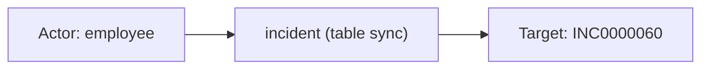
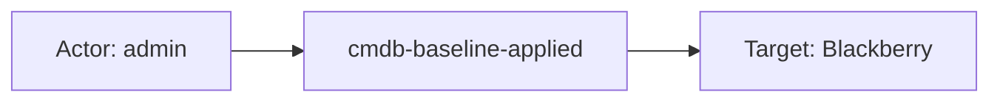
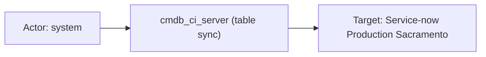

# servicenow

## Product Domain (ServiceNow ITSM/ITOM)

ServiceNow is a cloud-based enterprise platform for IT service management (ITSM), IT operations management (ITOM), and broader digital workflow automation. Organizations use it as a system of record for service delivery—handling incidents, problems, changes, service requests, and knowledge articles—while maintaining a Configuration Management Database (CMDB) that maps IT assets, applications, infrastructure, and their relationships. The platform is built on a multi-tenant instance model where data lives in relational tables exposed through REST Table APIs, workflow engines, and integrations with discovery and monitoring tools.

At its core, ServiceNow ITSM covers the service lifecycle: incidents for unplanned interruptions, problems for root-cause analysis, change requests and tasks for controlled modifications, and the service catalog for standardized fulfillment (`sc_req_item`). ITOM extends this with CMDB configuration items (servers, VMs, databases, business applications, ESX/Hyper-V hosts, hardware), CI relationships, asset lifecycle records (`alm_hardware`), and location/organizational metadata. User and group tables (`sys_user`, `sys_user_group`, `sys_user_grmember`) underpin assignment, approval, and access context across workflows.

From a security and operations perspective, ServiceNow table records capture who created or updated records, assignment and escalation history, priority/severity/impact, workflow state, and rich asset attributes (IP addresses, hostnames, OS versions, serial numbers, business criticality). Security teams monitor ServiceNow data to correlate IT tickets with infrastructure changes, track CMDB drift, investigate unauthorized configuration updates, and enrich SIEM investigations with authoritative service and asset context.

The Elastic ServiceNow integration ingests table records via Elastic Agent using three collection modes: REST API polling (CEL input with Basic Auth or OAuth2), AWS S3 bucket polling, or AWS SQS notifications for S3 object delivery. Records are normalized into ECS-aligned fields for supported default tables, with table-specific ingest pipelines and Kibana dashboards for incidents, problems, changes, CMDB CIs, service catalog, users, knowledge, and hardware assets.

## Data Collected (brief)

- **Event records** (`servicenow.event`): Table rows from ServiceNow default or custom tables, each tagged by table name (e.g., `incident`, `cmdb_ci_server`). Fields are stored as `.value` and `.display_value` pairs matching the Table API schema, with `@timestamp` derived from a configurable timestamp field (default `sys_updated_on`).
- **ITSM workflows**: Incidents, problems, change requests, change tasks, and service catalog request items—covering priority, severity, state, assignment, SLA timing, caller/requester, resolution notes, and approval history.
- **CMDB and ITOM assets**: Configuration items across servers (Linux/Windows), VMs, databases, application servers, business applications, infrastructure services, CI relationships (`cmdb_rel_ci`), hardware/computer records, ESX/Hyper-V hosts, and task-to-CI associations (`task_ci`).
- **Identity and organization**: Users, groups, group memberships, departments, and locations (`cmn_location`) with optional sensitive-field redaction (phone, address, etc.).
- **Knowledge and asset management**: Knowledge base articles (`kb_knowledge`) and hardware asset lifecycle records (`alm_hardware`), including warranty, cost, and install status.
- **Collection metadata**: Input type (`cel` or `aws-s3`), S3 bucket/object context when applicable, `sys_id` for deduplication, and ECS mappings for host, user, event, and related entity fields on supported tables.

## Expected Audit Log Entities

The ServiceNow integration does **not** ingest dedicated audit tables (`sys_audit`, `sysevent`, login history). The single stream **`servicenow.event`** delivers Table API **row snapshots** — each event is the current state of a record at poll time (`@timestamp` from configurable field, default `sys_updated_on`), not a discrete audit action. ITSM/CMDB/identity tables are **inventory and workflow state sync**, audit-adjacent at best: `sys_created_by` / `sys_updated_by` proxy who last touched the row but carry no field-level before/after deltas.

No ECS `user.target.*`, `host.target.*`, `service.target.*`, or `entity.target.*` fields are populated. No `destination.user.*` / `destination.host.*` in pipelines (not in `destination_identity_hits.csv`). Target-fields audit classifies servicenow as **`none`** — no pipeline actor/target tier-A mapping (`dev/target-fields-audit/out/target_enhancement_packages.csv`).

**`event.action` is absent** in all fixtures and no ingest pipeline maps to it (grep across `packages/servicenow` returns no `event.action` references). Vendor fields `table_name`, `state`, `sys_class_name`, and `applied` (on `task_ci`) hold the closest operation context but remain vendor-only. Pipelines set `event.kind`, `event.type`, and `event.category` from table name — these describe record class, not the verb that caused the poll snapshot.

Evidence: `packages/servicenow/data_stream/event/sample_event.json`, `_dev/test/pipeline/test-event.log-expected.json` (plus `test-event-aws.log-expected.json`, `test-event-mmdd.log-expected.json`, `test-event-aws-with-display-values.log-expected.json`), `elasticsearch/ingest_pipeline/default.yml` and table-specific pipelines, `fields/fields.yml`.

### Event action (semantic)

Each ingested event is a **Table API row snapshot** at poll time, not a discrete security or workflow action. There is no native audit verb (create/update/delete/login) in the payload — only the record's current field values. The closest semantic signals are the **table polled** (`table_name`), **record class** (`sys_class_name`), **workflow state** (`state`), and on `task_ci` whether a CMDB baseline was **applied** (`applied` + `xml` deltas).

| Action (normalized label) | Classification | Confidence | Evidence | Per-stream notes |
| --- | --- | --- | --- | --- |
| (table record sync) | data_access | high | All fixtures — poll delivers full row; `@timestamp` from `sys_updated_on` | **`event`** — no per-event verb; ingestion action is implicit Table API read/sync |
| `Closed` / `In Progress` / workflow state | configuration_change | partial | Fixtures: incident `state.display_value: Closed` (`INC0000060`); change_request `state: Closed`; problem state values | **`event`** — **state snapshot**, not the action that closed/opened the ticket; do not treat as `event.action` without delta context |
| `Approved` / `Not Yet Requested` / `Requested` | administration | partial | Fixtures: change_request `approval: Approved`; sc_req_item `approval: Requested`; incident `approval: Not Yet Requested` | **ITSM task tables** — approval status snapshot, not an approval event |
| CMDB baseline applied | configuration_change | high | `task_ci` fixture: `applied: true`, `xml` with `<update_ci>` / `<add_relationships>` oldValue/newValue pairs | **`task_ci`** — closest to a named change operation; baseline XML encodes field deltas but is not parsed into ECS |
| `info` / `change` (ECS type) | — | partial | `default.yml` L143–152: `event.type: info` for CMDB tables; `change` for `change_task`; table pipelines append `info` | Pipeline-derived record classification — not a vendor action verb |
| (none — inventory/asset sync) | — | high | CMDB CI fixtures (`cmdb_ci_server`, `alm_hardware`): `event.kind: asset`, `event.type: info` | **CMDB/asset tables** — asset state sync; no meaningful per-event action beyond table sync |

### Event action (ECS candidates)

| ECS / vendor field | Mapped to `event.action` today? | Mapping correct? | Recommended `event.action` value (from fixtures) | Enhancement candidate? | Evidence |
| --- | --- | --- | --- | --- | --- |
| `event.action` | no | n/a | — | yes | Not set in any pipeline or fixture |
| `servicenow.event.table_name` | no | n/a | `incident`, `cmdb_ci_server`, `task_ci`, `sys_user`, … | yes | Primary sync-context candidate; fixtures tag every row (e.g. `sample_event.json`: `table_name: incident`); `default.yml` L70–72 rename only — no copy to `event.action` |
| `servicenow.event.sys_class_name.display_value` | no | n/a | `Incident`, `Change Request`, `Server`, `User` | partial | Record class label; alternate when table name is generic (`cmdb_ci`); fixture: incident `sys_class_name: Incident` |
| `servicenow.event.state.display_value` | no | partial | `Closed` | partial | Workflow state snapshot — **not** an action verb; use only as suffix if composing `table-sync` + state (e.g. `incident-state-closed`) |
| `servicenow.event.approval.value` | no | partial | `approved`, `not requested`, `requested` | partial | ITSM approval status; fixture on change_request, sc_req_item, incident |
| `servicenow.event.applied.value` | no | n/a | `true` | yes | **`task_ci`** only — CMDB change applied flag; fixture `applied: true` with baseline `xml` |
| `event.type` | no | n/a | `info`, `change` | no | `default.yml` L143–152, table pipelines — record category, not action; do not substitute for `event.action` |
| `event.category` | no | n/a | `configuration`, `threat`, `host`, `iam`, `database`, `package` | no | Table-routed categories (`default.yml` L154–193; `pipeline_incident.yml` L13–15); describes record domain |
| `event.severity` | yes | yes | `3` (incident) | no | `pipeline_incident.yml` L206–208: `severity.value` → `event.severity`; records priority, not action |
| `servicenow.event.sys_updated_by.*` | no | n/a | — | no | Identifies last modifier (actor), not the operation performed |

**Step 2b — per-stream check:**

| Stream | `event.action` in fixtures? | Pipeline maps to `event.action`? | Primary action candidate | Confidence | Evidence |
| --- | --- | --- | --- | --- | --- |
| `event` (all tables) | no | no | `servicenow.event.table_name` → e.g. `incident`, `cmdb_ci_server` | high | All fixtures; no `event.action` in `event` block; recommend static prefix `table-sync-` + table name if mapped |
| `event` — `task_ci` | no | no | `servicenow.event.applied.value` → `cmdb-baseline-applied` when true | medium | `test-event.log-expected.json` task_ci row; baseline `xml` has `<update_ci>` / `<add_relationships>` deltas |
| `event` — ITSM tasks | no | no | `servicenow.event.state.display_value` as context only (e.g. `Closed`) | partial | Incident/change/problem/sc_req_item fixtures; state is snapshot, not verb |

### Actor (semantic)

| Entity | Classification | Entity type (if general) | Confidence | Evidence | Per-stream notes |
| --- | --- | --- | --- | --- | --- |
| Record creator | user | — | high | `sys_created_by` → `servicenow.event.sys_created_by` + `related.user`; fixtures: `employee`, `admin`, `glide.maint` | **All tables** — creator username; may be bootstrap/service account |
| Record last updater | user | — | high | `sys_updated_by` → `servicenow.event.sys_updated_by` + `related.user`; fixtures: `admin`, `system`, `employee`, `developer.program.hop@snc` | **All tables** — last modifier on polled snapshot; closest proxy for change actor |
| Task opener | user | — | high | `opened_by` → `user.name` (`default.yml` set_user_name_from_opened_by_display_value) + `related.user`; fixtures: `Joe Employee`, `Don Goodliffe` | **ITSM task tables** (`incident`, `problem`, `change_request`, `change_task`, `sc_req_item`) — ECS `user.name` is opener, not last updater |
| Incident caller / requester | user | — | high | `caller_id` → `related.user` only (`pipeline_incident.yml`); fixture: `Joe Employee` on `INC0000060` | **`incident`** — affected/requesting user; semantically a **target** user, not action initiator |
| Assignee | user | — | high | `assigned_to` → `related.user`; fixtures: `David Loo`, `Carol Coughlin` | **Task tables**, **`alm_hardware`** — current owner, not initiator |
| Resolver / closer / reopener | user | — | high | `resolved_by`, `closed_by`, `reopened_by` → `related.user`; fixture: `David Loo` (`resolved_by`), `Joe Employee` (`closed_by`) | **`incident`**, **`problem`**, **`change_request`** — lifecycle participants |
| CMDB / asset steward | user | — | medium | `managed_by`, `owned_by`, `supported_by`, `attested_by` → `related.user`; fixture: `Bow Ruggeri` (`managed_by` on `cmdb_ci_server`) | **CMDB CI**, **`alm_hardware`** — operational ownership context |
| Problem confirmer | user | — | medium | `confirmed_by` → `related.user` (`pipeline_problem.yml`); fixture: `Problem Coordinator A` | **`problem`** only |
| Knowledge author | user | — | high | `author` → `user.full_name` (`pipeline_kb_knowledge.yml`); fixture: `Ron Kettering` | **`kb_knowledge`** — article author |
| Department / location head | user | — | high | `dept_head` → `user.full_name` + `related.user` (`pipeline_cmn_location.yml`); fixture: `Nelly Jakuboski` | **`cmn_department`**, **`cmn_location`** |
| Group membership subject | user | — | high | `user` → `user.name` (`pipeline_sys_user.yml`); fixture: `Arron Ubhi` | **`sys_user_grmember`** — member linked to group |
| Platform / integration account | service | — | medium | `sys_updated_by` / `sys_created_by` values `system`, `glide.maint`; `internal_integration_user` on `sys_user` | **CMDB**, **hardware** fixtures — automated accounts in `related.user` only |

**No discrete audit actor:** Row snapshots lack login session, impersonation, or API-call principal context. Elastic Agent collection credentials are not event actors.

### Actor (ECS candidates)

| ECS / vendor field | Role | Mapped today? | Mapping correct? | Confidence | Evidence |
| --- | --- | --- | --- | --- | --- |
| `user.name` | Task opener; group member | yes (table-dependent) | partial | high | `opened_by.display_value` copy (`default.yml`); overridden on `sys_user_grmember` by `user.display_value` (`pipeline_sys_user.yml`); on **`incident`**, opener ≠ `sys_updated_by` |
| `user.full_name` | KB author; dept/location head | yes | yes | high | `author.display_value` (`pipeline_kb_knowledge.yml`); `dept_head.display_value` (`pipeline_cmn_location.yml`) |
| `user.email` / `user.domain` | User account email | yes | yes | high | `email.display_value` + dissect (`default.yml`); fixture: `survey.user@email.com` on **`sys_user`** |
| `related.user` | Creator, updater, assignee, caller, stewards, CI names | yes | partial | high | Global append processors (`default.yml` L4657–4758); table pipelines add `caller_id`, `confirmed_by`, `caused_by`; **conflates actors, targets, and CI `name` values** |
| `servicenow.event.sys_created_by.*` | Record creator (vendor canonical) | no (vendor-only) | n/a | high | Retained under vendor namespace; also mirrored in `related.user` |
| `servicenow.event.sys_updated_by.*` | Last modifier (vendor canonical) | no (vendor-only) | n/a | high | Same; primary change-actor signal when correlating polls |
| `servicenow.event.opened_by.*` | Task opener reference | no (vendor-only) | n/a | high | `value` holds sys_id; `display_value` drives ECS `user.name` |
| `servicenow.event.caller_id.*` | Incident requester | no (vendor-only) | n/a | high | `pipeline_incident.yml` appends display_value to `related.user` only |
| `servicenow.event.internal_integration_user.*` | Integration account flag | no (vendor-only) | n/a | medium | `pipeline_sys_user.yml` — boolean on **`sys_user`** rows |
| `related.ip` | CMDB asset IP (context) | yes | yes (context) | medium | `ip_address` append (`default.yml`); asset attribute, not actor endpoint |

### Target (semantic)

| Layer | Description | Entity | Classification | Entity type (if general) | Confidence | Evidence | Per-stream notes |
| --- | --- | --- | --- | --- | --- | --- | --- |
| 1 — Platform / cloud service | SaaS platform holding the record | ServiceNow instance | service | — | medium | `servicenow.event.sys_domain`, `table_name`; no `cloud.service.name` in pipeline | Conceptual Layer 1 — instance/tenant scope, not mapped to ECS service target |
| 2 — Resource / object | Table row acted upon | ITSM ticket, CMDB CI, user account, org unit | user / host / general | incident, cmdb_ci, sys_user, … | high | `sys_id` → `event.id`; `table_name` / `sys_class_name`; CMDB: `host.*`, `device.*`; user: `sys_user` row | Primary target is the **ingested row**; linked refs (`cmdb_ci`, `business_service`) stay vendor-only |
| 3 — Content / artifact | Description, baseline, ticket text | Ticket description, KB body, change baseline XML | general | ticket_description, kb_article, cmdb_baseline | high | `description` → `message`; `short_description`, `work_notes`, `xml` vendor-only; fixture: incident `message` on `INC0000060` | Layer 3 is record payload, not a separate audit event |

### Target (ECS candidates)

| ECS / vendor field | Layer | Classification | Mapped today? | Mapping correct? | ECS target bucket | Enhancement candidate? | Evidence |
| --- | --- | --- | --- | --- | --- | --- | --- |
| `event.id` | 2 | general | yes | yes | `entity.target.id` | yes | `sys_id.display_value` copy (`default.yml`); canonical record identifier |
| `servicenow.event.table_name` | 2 | general | no | n/a | context-only | no | Tags + routing to table pipelines; defines target type |
| `servicenow.event.number` / `task_effective_number` | 2 | general | no | n/a | context-only | no | Fixtures: `INC0000060`, `PRB0000050`, `CHG0000024`, `RITM0000002` |
| `host.hostname` | 2 | host | partial | yes | `host.target.name` | yes | `host_name.display_value` copy; empty in `cmdb_ci_server` fixture — populated when field present |
| `host.ip` | 2 | host | partial | yes | `host.target.ip` | yes | `ip_address.display_value` copy + `related.ip`; fixtures: `10.10.20.21`, `1.128.0.0` |
| `host.os.name` / `host.os.version` | 2 | host | yes | yes | `host.target.os.*` | yes | `os` / `os_version` copy; fixture: Linux/Windows/ESXi on CMDB CIs |
| `host.geo.*` | 2 | general | yes | partial | context-only | no | `location` → `host.geo.name`; `city`/`country`/`time_zone` on **`cmn_location`** — org location, not host geo |
| `device.model.name` / `device.manufacturer` / `device.id` | 2 | host | yes | yes | `host.target.*` | yes | **`alm_hardware`**, CMDB hardware rows; fixture: `Gateway DX Series` |
| `organization.name` | 2 | general | yes | yes | context-only | no | `company.display_value` copy; fixture: `ACME North America` |
| `message` | 3 | general | partial | yes | context-only | no | `description.display_value` copy; incident/department fixtures; `short_description` **not** mapped |
| `servicenow.event.cmdb_ci.*` | 2 | host | no | n/a | `host.target.*` | yes | Incident fixture: `Storage Area Network 001`; impacted CI reference, not ECS `host.name` |
| `servicenow.event.business_service.*` | 2 | service | no | n/a | `service.target.*` | yes | Incident fixture: `Email`; business service impacted |
| `servicenow.event.caller_id.*` | 2 | user | no | n/a | `user.target.*` | yes | Incident requester in `related.user` only — de-facto target user, not `destination.user.*` |
| `servicenow.event.name.*` | 2 | host / general | no | n/a | `entity.target.name` | yes | CMDB CI name; erroneously also appended to `related.user` (`default.yml` L4724–4728) |
| `servicenow.event.user_name.*` / `roles` / `active` | 2 | user | no | n/a | `user.target.*` | yes | **`sys_user`** identity record; `user.email` mapped, `user.name` not set from `user_name` |
| `servicenow.event.parent` / `child` / `type` | 2 | general | no | n/a | `entity.target.*` | yes | **`cmdb_rel_ci`** relationship edge |
| `servicenow.event.task` / `ci_item` / `xml` | 2–3 | general | no | n/a | `entity.target.*` | yes | **`task_ci`** — change-to-CI link; optional baseline XML with CMDB deltas |
| `event.provider` | 1 | service | partial | partial | context-only | no | `source.display_value` copy — discovery/integration source on CMDB rows, not ServiceNow platform |

### Gaps and mapping notes

- **Not true audit logs** — no `sys_audit`/`sysevent`; row snapshots lack action type, outcome, and field-level change history (except partial `task_ci` baseline XML). For ACL/script/impersonation trails, ingest audit tables separately.
- **`event.action` gaps** — no pipeline mapping; recommend primary candidate `servicenow.event.table_name` with normalized prefix (e.g. `table-sync-incident`). Do **not** map `state` or `approval` directly to `event.action` without change detection — they are current-state fields on snapshots. For **`task_ci`**, consider `cmdb-baseline-applied` when `applied: true` and parse `xml` for specific operations (`update_ci`, `add_relationships`) in a future enhancement.
- **No ECS `*.target.*` or `destination.*` de-facto targets** — target identity lives in generic ECS fields (`event.id`, `host.*`, `user.email`) and vendor `servicenow.event.*`; enhancement candidates above.
- **`user.name` actor/target ambiguity** — global pipeline sets from `opened_by`, but on **`incident`** the requester (`caller_id`) and last updater (`sys_updated_by`) differ; `caller_id` is semantically a **user target** stuck in `related.user`.
- **`related.user` conflation** — mixes creators, updaters, assignees, callers, stewards, department names (`Sales`), and CI/service names (`Service-now Production Sacramento`, `SAP Enterprise Services`) via blanket `name.display_value` append; no actor vs target distinction.
- **`host.geo.*` on CMDB/location rows** — maps physical site address (`location`), not the CI's network endpoint; `host.ip` is the asset IP when present.
- **Target-fields audit alignment** — `none`: inventory/workflow sync semantics; actor fields exist (`related.user`, conditional `user.name`) but no tier-A ECS target mapping and no `destination.user`/`destination.host` pattern.

### Per-stream notes

#### `event`

Single data stream; semantics driven by `servicenow.event.table_name` and table-specific sub-pipelines (`pipeline_incident`, `pipeline_problem`, `pipeline_change_request`, `pipeline_sc_req_item`, `pipeline_kb_knowledge`, `pipeline_sys_user`, `pipeline_cmdb_ci_business_app`, `pipeline_cmn_location`, `pipeline_alm_hardware`, `pipeline_task_ci`). Collection via CEL REST polling or AWS S3/SQS; `@timestamp` from configured timestamp field (default `sys_updated_on`). Deduplicate on `event.id` (`sys_id`) + `@timestamp` for polling updates.

**ITSM tables** (`incident`, `problem`, `change_request`, `change_task`, `sc_req_item`): `event.kind: event`. **Action:** no `event.action`; vendor `state`/`approval` are workflow snapshots (fixtures: `Closed`, `Approved`). Actor: `user.name` = opener; `sys_updated_by` in `related.user`. Target Layer 2: ticket (`event.id`, vendor `number`); linked CI (`cmdb_ci.*` vendor-only); Layer 3: `message` from `description`.

**CMDB CI tables** (`cmdb_ci_server`, `cmdb_ci_vm`, …): `event.kind: asset` or `event`. **Action:** table sync only (`event.type: info`, `event.category: host`/`configuration` per table). Target Layer 2: infrastructure asset via `host.*`/`device.*`; actor limited to `sys_updated_by`/`sys_created_by` in `related.user`.

**Identity tables** (`sys_user`, `sys_user_group`, `sys_user_grmember`): `event.kind: asset`, `event.category: iam`. **Action:** table sync only. Target Layer 2: user/group/membership record; `user.email` on **`sys_user`**; group member → `user.name`.

**`task_ci`**: Associates change/incident task with CI. **Action:** `applied: true` + baseline `xml` (`update_ci`, `add_relationships`) — best change-delta signal; not mapped to `event.action`. Closest the integration gets to naming a configuration change operation.

## Example Event Graph

These examples come from the single **`servicenow.event`** stream (Table API row snapshots via CEL or AWS S3/SQS). They are **not true audit logs** — each event is the current state of a record at poll time, audit-adjacent at best.

### Example 1: Closed incident snapshot

**Stream:** `servicenow.event` · **Fixture:** `packages/servicenow/data_stream/event/_dev/test/pipeline/test-event.log-expected.json`

```
employee (last updater) → incident (table sync) → INC0000060 (closed incident ticket)
```

#### Actor

| Field | Value |
| --- | --- |
| id | employee |
| type | user |

**Field sources:**
- `id ← servicenow.event.sys_updated_by.display_value` — last modifier on the polled row snapshot (not necessarily the user who closed the ticket; `closed_by` is Joe Employee in the same fixture)

#### Event action

| Field | Value |
| --- | --- |
| action | incident |
| source_field | `servicenow.event.table_name` |
| source_value | `incident` |

**Not mapped to ECS today.** Workflow context (`state.display_value: Closed`, `approval.value: not requested`) is a current-state snapshot, not the verb that closed the ticket.

#### Target

| Field | Value |
| --- | --- |
| id | 1c741bd70b2322007518478d83673af3 |
| name | INC0000060 |
| type | general |
| sub_type | incident |

**Field sources:**
- `id ← event.id` (from `servicenow.event.sys_id.display_value`)
- `name ← servicenow.event.number.display_value`
- `sub_type ← servicenow.event.sys_class_name.display_value` (`Incident`)

#### Mermaid



### Example 2: CMDB baseline applied on change task

**Stream:** `servicenow.event` · **Fixture:** `packages/servicenow/data_stream/event/_dev/test/pipeline/test-event.log-expected.json`

```
admin → cmdb-baseline-applied → Blackberry (CI linked to CHG0000031)
```

#### Actor

| Field | Value |
| --- | --- |
| id | admin |
| type | user |

**Field sources:**
- `id ← servicenow.event.sys_updated_by.display_value`

#### Event action

| Field | Value |
| --- | --- |
| action | cmdb-baseline-applied |
| source_field | `servicenow.event.applied.value` |
| source_value | `true` |

**Not mapped to ECS today.** Baseline `xml` in the same fixture encodes `<update_ci>` and `<add_relationships>` field deltas but is not parsed into ECS.

#### Target

| Field | Value |
| --- | --- |
| id | 27d3f35cc0a8000b001df42d019a418f |
| name | Blackberry |
| type | host |

**Field sources:**
- `id ← servicenow.event.ci_item.value`
- `name ← servicenow.event.ci_item.display_value`
- Change task reference: `servicenow.event.task.display_value` = `CHG0000031` (vendor-only context for the CI link row)

#### Mermaid



### Example 3: CMDB server asset sync

**Stream:** `servicenow.event` · **Fixture:** `packages/servicenow/data_stream/event/_dev/test/pipeline/test-event.log-expected.json`

```
system (integration account) → cmdb_ci_server (table sync) → Service-now Production Sacramento
```

#### Actor

| Field | Value |
| --- | --- |
| id | system |
| type | service |
| sub_type | service_account |

**Field sources:**
- `id ← servicenow.event.sys_updated_by.display_value` — automated platform account, not a human operator endpoint

#### Event action

| Field | Value |
| --- | --- |
| action | cmdb_ci_server |
| source_field | `servicenow.event.table_name` |
| source_value | `cmdb_ci_server` |

**Not mapped to ECS today.** Pipeline sets `event.kind: asset`, `event.type: info`, `event.category: host` — record classification only.

#### Target

| Field | Value |
| --- | --- |
| id | 106c5c13c61122750194a1e96cfde951 |
| name | Service-now Production Sacramento |
| type | host |
| geo | 5052 Clairemont Drive, San Diego,CA |

**Field sources:**
- `id ← event.id` (from `servicenow.event.sys_id.display_value`)
- `name ← servicenow.event.name.display_value`
- `geo ← host.geo.name` (from `servicenow.event.location.display_value` — physical site address, not network endpoint)
- `host.os.name ← Linux Red Hat`, `host.os.version ← Enterprise Server 3` (asset attributes on the same fixture row)

#### Mermaid



## ES|QL Entity Extraction

**Package type: agent-backed** (policy template `servicenow`, single `data_stream/event` with Tier A fixtures: `sample_event.json`, `test-event.log-expected.json`, and table-specific ingest pipelines). Router: **`data_stream.dataset == "servicenow.event"`**. Pass 4 is **fill-gaps-only**: detection flags preserve existing `user.*`, `host.*`, `*.target.*`, and `event.action` before fallbacks. Table API **row snapshots** (ITSM, CMDB, identity, hardware) are inventory/workflow sync — not discrete audit logs (`sys_audit` / `sysevent` are not ingested). Pass 3 semantics apply for correlation only; **`sys_updated_by` / `opened_by` are poll-time modifiers**, not verified audit principals. **Actor and target `EVAL` are omitted** (would misrepresent snapshots); **`event.action` only** is filled from `servicenow.event.table_name` and `task_ci` `applied` when absent at ingest. **Pass 4 (tautology + CASE syntax):** no `CASE(col, col, …)` identity fallbacks — ingest-populated `user.name`, `user.full_name`, `user.email`, `host.*`, and `event.id` are **ingest-only — no ES|QL** (no alternate query-time audit source); do not emit `CASE(actor_exists, user.name, …, user.name, null)` or promote `event.id` / `host.ip` to `*.target.*`. `event.action` uses **column-level** `CASE(event.action IS NOT NULL, event.action, …)` (7-arg) — not `CASE(action_exists, event.action, …)`; detection flags are helpers only. Fallback branches use literal `"cmdb-baseline-applied"` and `servicenow.event.table_name`, never `event.action` in the fallback path.

### Dataset inventory

| data_stream.dataset | Stream role | Actor classification(s) | Target classification(s) | Extraction |
| --- | --- | --- | --- | --- |
| `servicenow.event` | table row sync (all polled tables) | user, service (snapshot proxy) | user, host, general (record subject) | partial (action only) |

### Field mapping plan

No actor or target output columns — generic ECS (`user.name`, `user.email`, `host.*`, `event.id`) and vendor `servicenow.event.*` describe record state, not normalized audit actor/target identity. See **Streams excluded** and **Gaps**.

#### Actor mappings

| Output column | Source field(s) | Condition (dataset + optional) | Confidence | Notes |
| --- | --- | --- | --- | --- |
| — | — | — | — | No audit actor `EVAL` — snapshot proxies only |
| `user.name` | — | `data_stream.dataset == "servicenow.event"` | high | **ingest-only — no ES\|QL** — `opened_by.display_value` (`default.yml`); `sys_user_grmember` override (`pipeline_sys_user.yml`); **omit** — `CASE(actor_exists, user.name, user.name, null)` is identity no-op |
| `user.full_name` | — | `data_stream.dataset == "servicenow.event"` | high | **ingest-only — no ES\|QL** — `author` / `dept_head` (`pipeline_kb_knowledge.yml`, `pipeline_cmn_location.yml`); **omit** |
| `user.email` | — | `data_stream.dataset == "servicenow.event"` | high | **ingest-only — no ES\|QL** — `email.display_value` + dissect (`default.yml`); **`sys_user`** fixtures only; **omit** |
| `user.id` | — | — | high | **omit** — not mapped at ingest; vendor `sys_updated_by.value` is sys_id, not ECS `user.id`; no defensible fallback without misclassifying snapshot modifier |

#### Target mappings

| Output column | Source field(s) | Condition (dataset + optional) | Confidence | Notes |
| --- | --- | --- | --- | --- |
| — | — | — | — | No audit target `EVAL` — record subject is inventory/workflow state |
| `entity.target.id` / `host.target.*` / `user.target.*` | — | — | high | **omit** — `event.id`, `host.*`, `servicenow.event.caller_id.*` describe the synced row, not audit targets; `CASE(target_exists, event.id, event.id, null)` or `user.id` → `user.target.id` would duplicate inventory subject |

**Event action (fill-gaps only):**

| Output column | Source field(s) | Condition (dataset + optional) | Confidence | Notes |
| --- | --- | --- | --- | --- |
| `event.action` | `"cmdb-baseline-applied"` | `data_stream.dataset == "servicenow.event" AND TO_BOOLEAN(servicenow.event.applied.value) == true` | medium | **semantic literal** — Pass 3 Example 2; `task_ci` fixture only |
| `event.action` | `servicenow.event.table_name` | `data_stream.dataset == "servicenow.event" AND servicenow.event.table_name IS NOT NULL` | high | **vendor fallback** — sync context (`incident`, `cmdb_ci_server`, …); not a security verb; fallback ≠ output column (maps vendor field into `event.action`) |
| `event.action` | — | — | high | **preserve** — `CASE(event.action IS NOT NULL, event.action, …)` only; never `CASE(…, event.action, …, event.action, null)` in fallback |

Do **not** map `servicenow.event.state.*` or `servicenow.event.approval.*` to `event.action` (workflow snapshots per Pass 2).

### Detection flags (mandatory — run first)

```esql
| EVAL
  actor_exists = user.id IS NOT NULL OR user.name IS NOT NULL OR user.full_name IS NOT NULL OR user.email IS NOT NULL
    OR host.id IS NOT NULL OR host.ip IS NOT NULL OR host.name IS NOT NULL
    OR service.id IS NOT NULL OR service.name IS NOT NULL
    OR entity.id IS NOT NULL OR entity.name IS NOT NULL,
  target_exists = user.target.id IS NOT NULL OR user.target.name IS NOT NULL OR user.target.email IS NOT NULL
    OR host.target.id IS NOT NULL OR host.target.ip IS NOT NULL OR host.target.name IS NOT NULL
    OR service.target.id IS NOT NULL OR service.target.name IS NOT NULL
    OR entity.target.id IS NOT NULL OR entity.target.name IS NOT NULL,
  action_exists = event.action IS NOT NULL
```

**Semantics:** `actor_exists` includes `user.full_name` (`kb_knowledge`, `cmn_location` pipelines) and `user.name` (ITSM `opened_by`, `sys_user_grmember`). No ECS `*.target.*` at ingest — `target_exists` is false on all Tier A fixtures. Actor/target columns are not mapped below; flags support cross-integration queries and future ingest promotion. Populated ingest-only columns must not drive tautological `CASE(actor_exists, col, …, col, null)` actor/target branches.

**ES|QL `CASE` arity:** Arguments are **(condition, value)** pairs; odd count → last arg is default. Wrong: `CASE(event.action IS NOT NULL, event.action, servicenow.event.table_name, null)` (4 args — `servicenow.event.table_name` is a **condition**). Right: **7-arg** `CASE(event.action IS NOT NULL, event.action, data_stream.dataset == "servicenow.event" AND …, <fallback>, …, null)`. Do not use `CASE(action_exists, event.action, …)` for preserve — `action_exists` is equivalent here but column-level preserve is required when other flags could be true (Pass 4 §10). Never **4-arg** `CASE(actor_exists, user.name, user.full_name, null)` (`user.full_name` parses as a condition).

### Combined ES|QL — actor fields

Not applicable — actor normalization excluded (table sync / inventory; see Gaps). Do not emit `CASE(actor_exists, user.name, user.name, null)`, `CASE(actor_exists, user.email, user.email, null)`, or `sys_updated_by` → `user.id` without ingest tier-A mapping — ingest-only with no alternate query-time source (`default.yml`, table pipelines).

### Combined ES|QL — event action

`event.action` is absent in all fixtures and pipelines today; fallback supplies Pass 3 sync labels only when `event.action` is null. **Column-level preserve** — fallbacks use literal `"cmdb-baseline-applied"` and `servicenow.event.table_name`, not `event.action` (Pass 4 rule #10).

```esql
| EVAL
  event.action = CASE(
    event.action IS NOT NULL, event.action,
    data_stream.dataset == "servicenow.event" AND TO_BOOLEAN(servicenow.event.applied.value) == true, "cmdb-baseline-applied",
    data_stream.dataset == "servicenow.event" AND servicenow.event.table_name IS NOT NULL, servicenow.event.table_name,
    null
  )
```

Prefer ingest-time mapping (`table-sync-` + `table_name`, or parsed `xml` verbs) before relying on query-time `table_name` alone.

### Combined ES|QL — target fields

Not applicable — target normalization excluded (inventory subject ≠ audit target; see Gaps). Do not emit `CASE(target_exists, host.ip, host.ip, null)` or promote `event.id` / `host.hostname` to `host.target.*` / `entity.target.id` — ingest-only inventory subject fields with no alternate audit target source.

### Full pipeline fragment (optional)

```esql
FROM logs-*
| EVAL
  actor_exists = user.id IS NOT NULL OR user.name IS NOT NULL OR user.full_name IS NOT NULL OR user.email IS NOT NULL
    OR host.id IS NOT NULL OR host.ip IS NOT NULL OR host.name IS NOT NULL
    OR service.id IS NOT NULL OR service.name IS NOT NULL
    OR entity.id IS NOT NULL OR entity.name IS NOT NULL,
  target_exists = user.target.id IS NOT NULL OR user.target.name IS NOT NULL OR user.target.email IS NOT NULL
    OR host.target.id IS NOT NULL OR host.target.ip IS NOT NULL OR host.target.name IS NOT NULL
    OR service.target.id IS NOT NULL OR service.target.name IS NOT NULL
    OR entity.target.id IS NOT NULL OR entity.target.name IS NOT NULL,
  action_exists = event.action IS NOT NULL
| EVAL
  event.action = CASE(
    event.action IS NOT NULL, event.action,
    data_stream.dataset == "servicenow.event" AND TO_BOOLEAN(servicenow.event.applied.value) == true, "cmdb-baseline-applied",
    data_stream.dataset == "servicenow.event" AND servicenow.event.table_name IS NOT NULL, servicenow.event.table_name,
    null
  )
| KEEP @timestamp, data_stream.dataset, event.action, servicenow.event.table_name, servicenow.event.sys_updated_by.display_value, user.name, event.id
```

### Streams excluded (actor / target)

- **`servicenow.event`** (all tables) — Polled row state via REST/S3; no field-level change history except unparsed `task_ci` baseline `xml`. `state` / `approval` are workflow snapshots, not verbs. For ACL/script/impersonation trails, ingest `sys_audit` separately.

### Gaps and limitations

- **Target-fields audit `none`:** No ECS `*.target.*` or `destination.*`; wiring `event.id`, `host.*`, or `servicenow.event.caller_id.*` into `*.target.*` at query time would misrepresent poll snapshots as audit targets.
- **`user.name` actor/target ambiguity:** Global pipeline sets `user.name` from `opened_by` while `caller_id` (incident requester) shares `related.user` — actor `CASE` from `sys_updated_by` would guess wrong across tables.
- **`related.user` conflation:** Mixes creators, updaters, assignees, callers, stewards, and CI/service names — unsuitable for `user.target.*` without ingest split.
- **`event.action` from `table_name`:** Labels sync context (`incident`, `cmdb_ci_server`), not who performed a change; `cmdb-baseline-applied` covers only `applied.value == true` on `task_ci`.
- **`task_ci` baseline XML:** `<update_ci>` / `<add_relationships>` deltas are unparsed — no reliable per-operation `event.action` at query time.
- **Enhancement path:** Ingest audit tables or add change-detection ingest processors (and tier-A `*.target.*`) before full actor/target ES|QL normalization.
- **No tautological CASE (Pass 4 #10):** `user.name`, `user.full_name`, `user.email`, `host.*`, and `event.id` are ingest-only record-subject columns; there is no query-time vendor path for audit actor/target extraction. `event.action` ES|QL is limited to column-level preserve plus `servicenow.event.applied.value` / `servicenow.event.table_name` fallbacks — not `CASE(…, event.action, …, event.action, null)`.
- **Pass 4 CASE syntax** — `event.action` uses **7-arg** `CASE(event.action IS NOT NULL, event.action, data_stream.dataset == "servicenow.event" AND …, <fallback>, …, null)`; never **4-arg** `CASE(action_exists, event.action, servicenow.event.table_name, null)` (`table_name` parses as a condition). Detection flags (`actor_exists`, `target_exists`, `action_exists`) are query-time helpers only — not used as the first `CASE` branch on mapped columns. Full pipeline fragment aligned with the combined `event.action` block. No actor/target `EVAL` blocks (ingest-only columns; no alternate audit sources in `packages/servicenow` fixtures).
