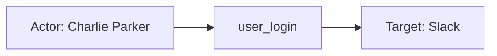
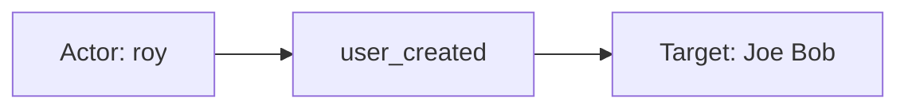
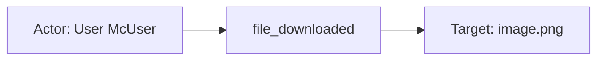

# slack

## Product Domain

Slack is a cloud-based team collaboration and messaging platform used by organizations as their primary hub for workplace communication. Users interact through workspaces—dedicated environments where teams organize conversations in channels (public or private), direct messages, and shared resources such as files and apps. Slack supports integrations with third-party tools, custom workflows, and OAuth-based applications, making it both a communication layer and an operational workflow surface for modern enterprises.

At the organizational level, Slack is structured around workspaces and, for larger customers, Enterprise Grid. Enterprise Grid lets a company manage multiple connected workspaces under a single enterprise account, with centralized administration, shared channels across org boundaries, and unified identity and access controls. Core entities in the Slack domain include users (with roles such as member, guest, admin, and owner), user groups, channels, files, installed apps, workflows, and information barriers that restrict communication between user groups.

From a security and compliance perspective, Slack records administrative and user activity as audit events. These events capture who performed an action (the actor), what was affected (the entity—user, file, channel, app, role, message, and others), and contextual metadata such as IP address, user agent, session identifier, and workspace or enterprise scope. Slack also surfaces anomaly detections—for example, logins from unusual locations or ASNs—and file security events such as malicious content detection. The Audit Logs API, which exposes this history, is available only on Slack Enterprise Grid plans.

The Elastic Slack integration focuses on ingesting these audit logs for search, observability, and security use cases. It polls Slack's REST API using an OAuth token with the `auditlogs:read` scope, normalizes events into ECS-aligned fields, and enriches them with geo-IP and user-agent parsing. This enables security teams to monitor authentication activity, identity and access changes, file handling, app installations, and anomalous behavior across Slack workspaces or an entire enterprise grid.

## Data Collected (brief)

- **Audit logs** (`slack.audit`): Administrative and security-relevant activity from Slack Enterprise Grid workspaces, collected via the Slack Audit Logs API.
- **Event actions**: User authentication (login, logout, failed login, session invalidation), user lifecycle and role changes, user group membership and configuration, file operations (upload, download, share, public links, blocked downloads, malicious content detection), and anomaly alerts.
- **Actor and entity details**: User IDs, names, emails, and teams; entity types including workspace, enterprise, user, file, channel, app, workflow, usergroup, barrier, message, and role—with type-specific attributes (file type, channel privacy, app scopes, and similar).
- **Context and enrichment**: Workspace or enterprise name, domain, and ID; session ID; source IP with geo-IP and ASN enrichment; user agent; anomaly reasons and prior IP/user-agent values; file hashes and private URLs where applicable.

## Expected Audit Log Entities

The integration exposes a single true audit stream — **`slack.audit`** — polling Slack Enterprise Grid Audit Logs API (`auditlogs:read`). There are no metrics, inventory, or finding streams. Slack events carry a native **`action`** (operation performed), **`actor`** (who performed it), **`entity`** (what was affected), and **`context`** (workspace/enterprise scope, session, client IP/UA). Evidence: `packages/slack/data_stream/audit/sample_event.json`, `packages/slack/data_stream/audit/_dev/test/pipeline/test-audit.log-expected.json`, `packages/slack/data_stream/audit/elasticsearch/ingest_pipeline/default.yml`, `packages/slack/data_stream/audit/fields/fields.yml`, `dev/target-fields-audit/out/target_enhancement_packages.csv` (`slack`, `moderate_candidate`, all `has_*_target` false, `has_vendor_target_fields: true`).

**`event.action` is populated** on every fixture and `sample_event.json` via pipeline rename `slack.action` → `event.action` (`default.yml` L28–31). Vendor-native action strings are preserved verbatim (e.g. `user_login`, `file_downloaded`, `anomaly`). A downstream Painless script (`default.yml` L260–447) enriches `event.category`, `event.type`, and `event.outcome` for ~30 known actions; **`anomaly`** is not in that lookup table and receives only default `event.type: ["info"]`.

No ECS `user.target.*`, `host.target.*`, `service.target.*`, or `entity.target.*` fields are populated (`target_fields_audit.csv` has no `slack` row). The package does not use `destination.user.*` or `destination.host.*` de-facto target fields (`destination_identity_hits.csv` has no `slack` row). Target identity lives almost entirely under `slack.audit.entity.*`.

### Event action (semantic)

Slack audit events record a vendor **`action`** string naming the operation. The pipeline copies it directly to ECS `event.action` without normalization. Fixture-covered actions span authentication, IAM, file access, anomaly detection, and malware.

| Action (normalized label) | Classification | Confidence | Evidence | Per-stream notes |
| --- | --- | --- | --- | --- |
| `user_login` | authentication | high | `test-audit.log-expected.json` event 1; `event.original` `"action":"user_login"` | Script sets `event.category: [authentication, session]`, `event.type: [info, start]`, `event.outcome: success` |
| `user_created` | administration | high | `test-audit.log-expected.json` event 2 | Script sets `event.category: [iam]`, `event.type: [creation, user]` |
| `file_downloaded` | data_access | high | `test-audit.log-expected.json` event 3 | Script sets `event.category: [file]`, `event.type: [access]` |
| `anomaly` | detection | high | `test-audit.log-expected.json` events 4–5; `sample_event.json` | Slack anomaly alert (ASN/IP/UA/session fingerprint); **not** in categorization script — no `event.category` / `event.outcome` enrichment |
| `file_malicious_content_detected` | detection | high | `test-audit.log-expected.json` event 6 | Script sets `event.category: [file, malware]`, `event.type: [info]` |

The pipeline categorization script (`default.yml` L264–437) defines additional actions not covered by fixtures but supported at ingest: authentication (`user_login_failed`, `user_logout`, `user_session_invalidated`, `user_session_reset_by_admin`), IAM lifecycle and role changes (`user_deactivated`, `user_reactivated`, `role_change_to_*`, `user_email_updated`), user-group operations (`user_added_to_usergroup`, `role_modified_on_usergroup`, etc.), and file operations (`file_uploaded`, `file_downloaded_blocked`, `file_public_link_created`, `file_shared`, etc.). Confidence for unfixtured actions is **medium** — derived from pipeline params only.

### Event action (ECS candidates)

| ECS / vendor field | Mapped to `event.action` today? | Mapping correct? | Recommended `event.action` value (from fixtures) | Enhancement candidate? | Evidence |
| --- | --- | --- | --- | --- | --- |
| `slack.action` → `event.action` | yes | yes | `user_login`, `user_created`, `file_downloaded`, `anomaly`, `file_malicious_content_detected` | no | `rename` L28–31; all six pipeline fixtures + `sample_event.json` |
| `event.original` JSON `action` | yes (source) | yes | Same vendor values in raw payload | no | Preserved in `event.original`; canonical source before rename |
| Painless categorization params (`event.action` key) | n/a (downstream) | partial | Maps ~30 actions to `event.category` / `event.type` / `event.outcome` | yes (for `anomaly`) | Script L437–447 keys off `event.action`; **`anomaly` absent** — fixtures show only `event.type: [info]` with no category/outcome |
| `event.type` / `event.category` / `event.outcome` | n/a | partial | Derived from action, not independent action sources | partial | Do not substitute for `event.action`; they are enrichments keyed on it |
| `slack.audit.details.reason` | no | n/a | — | no | Anomaly sub-signals (`asn`, `ip_address`, …); qualifies the `anomaly` action, not a separate operation name |

**Step 2b — per-stream check:**

| Stream | `event.action` in fixtures? | Pipeline maps to `event.action`? | Primary action candidate | Confidence | Evidence |
| --- | --- | --- | --- | --- | --- |
| `slack.audit` | yes (all events) | yes | `slack.action` (vendor JSON `action`) | high | `rename` L28–31; six `test-audit.log-expected.json` events + `sample_event.json` |

### Actor (semantic)

| Entity | Classification | Entity type (if general) | Confidence | Evidence | Per-stream notes |
| --- | --- | --- | --- | --- | --- |
| Slack user principal | user | — | high | Every fixture and `sample_event.json` show `actor.type: "user"` with `actor.user.id/name/email`. Actions span auth (`user_login`), IAM (`user_created`), file access (`file_downloaded`), anomaly detection, and malware (`file_malicious_content_detected`). | `slack.audit` only stream |

No `host` or `service` actor types appear in pipeline tests or `sample_event.json`. When `actor.user.team` is present (mobile file download, self-referential anomaly), it remains vendor-only under `slack.audit.actor.user.team`.

### Actor (ECS candidates)

| ECS / vendor field | Role | Mapped today? | Mapping correct? | Confidence | Evidence |
| --- | --- | --- | --- | --- | --- |
| `user.id` | Actor Slack user ID | yes | yes | high | `rename`: `slack.actor.user.id` → `user.id` (`default.yml` L42–44); populated in all fixtures |
| `user.full_name` | Actor display name | yes | yes | high | `rename`: `slack.actor.user.name` → `user.full_name` (L45–48) |
| `user.email` | Actor email | yes | yes | high | `rename`: `slack.actor.user.email` → `user.email` (L49–52) |
| `slack.audit.actor.type` | Actor type discriminator | yes (vendor) | n/a | high | `rename`: `slack.actor` → `slack.audit.actor` (L53–56); always `"user"` in fixtures |
| `slack.audit.actor.user.team` | Actor workspace team ID | yes (vendor) | n/a | high | Retained after user renames; present in `file_downloaded`, both `anomaly`, and `file_malicious_content_detected` fixtures |
| `source.ip` / `source.address` | Client/session IP (context) | yes | yes | high | `slack.context.ip_address` → `source.address` → `source.ip` with geo-IP/ASN (L133–136, 209–225) |
| `user_agent.*` | Client user-agent (context) | yes | yes | high | `slack.context.ua` → `user_agent.original` + `user_agent` processor (L122–127) |
| `slack.audit.context.session_id` | Authenticated session ID (context) | yes (vendor) | n/a | medium | `slack.context.session_id` rename (L238–245); in file download, anomaly, and malware fixtures |
| `related.user` | Actor cross-reference | yes | partial | high | Appends actor `user.id` and `user.email` only (L246–255); entity user never appended |

### Target (semantic)

| Layer | Description | Entity | Classification | Entity type (if general) | Confidence | Evidence | Per-stream notes |
| --- | --- | --- | --- | --- | --- | --- | --- |
| 1 — Platform / cloud service | Slack workspace or Enterprise Grid tenant (organizational scope) | Slack workspace / enterprise | service | — | medium | `slack.audit.context.type` (`workspace` or `enterprise`), `context.id`, `context.name`, `context.domain` in every fixture; not mapped to `cloud.service.name` | Scope context — distinct from Layer 2 entity unless `entity_type` is workspace/enterprise |
| 2 — Resource / object | Native Slack entity acted upon | Slack user | user | — | high | `entity.type: "user"` in `user_login`, `user_created`, both `anomaly` events; flattened to `slack.audit.entity` with `entity_type`, `id`, `name`, `email`, optional `team` | When actor ≠ entity (`user_created`, one `anomaly`), affected user is target only in vendor namespace |
| 2 — Resource / object | File acted upon | Slack file | general | file | high | `entity.type: "file"` in `file_downloaded`, `file_malicious_content_detected`; `slack.audit.entity.id/name/title/filetype` | Actor is the downloader/uploader; file is the acted-upon object |
| 2 — Resource / object | Other Slack entity types | Channel, app, workflow, usergroup, barrier, message, role, account_type_role | general | channel, app, workflow, usergroup, barrier, message, role, account_type_role | medium–low | Pipeline rename paths for each `slack.entity.*` → `slack.audit.entity` (L58–115); `fields.yml` documents type-specific attributes; no fixture coverage | Confidence `medium` for channel/app/workflow/usergroup/workspace/enterprise (pipeline + fields); `low` for barrier/message/role/account_type_role |
| 3 — Content / artifact | File URL, hash, anomaly metadata | File URL / hash / geo string | general | url, file_hash, geo_location | high (file); medium (anomaly) | `uri_parts` on `slack.audit.details.url_private` → `url.*` (`file_downloaded`); `file.hash.md5` + `related.hash` from `details.md5_hash` (malware); `slack.audit.details.location/reason/previous_ip_address/previous_user_agent` (anomaly) | Artifacts enrich Layer 2 targets; not standalone ECS target entities |

### Target (ECS candidates)

| ECS / vendor field | Layer | Classification | Mapped today? | Mapping correct? | ECS target bucket | Enhancement candidate? | Evidence |
| --- | --- | --- | --- | --- | --- | --- | --- |
| `slack.audit.entity.id` | 2 | varies | yes (vendor) | n/a | `user.target.id` / `entity.target.id` / `resource.id` (by `entity_type`) | yes | Canonical target ID; never copied to ECS `*.target.*` |
| `slack.audit.entity.name` | 2 | varies | yes (vendor) | n/a | `user.target.full_name` / `entity.target.name` | yes | Target display name; vendor-only |
| `slack.audit.entity.email` | 2 | user | yes (vendor) | n/a | `user.target.email` | yes | Populated when `entity_type: "user"`; e.g. `jbob@example.com` in `user_created` / `anomaly` |
| `slack.audit.entity.team` | 2 | user | yes (vendor) | n/a | `user.target.*` (custom) | yes | Target user's workspace team; not mapped to ECS |
| `slack.audit.entity.entity_type` | 2 | varies | yes (vendor) | n/a | — (discriminator) | no | `rename`: `slack.entity.type` → `entity_type` (L118–120) |
| `slack.audit.entity.filetype` / `.title` | 2 | general (file) | yes (vendor) | n/a | `file.*` / `entity.target.*` | partial | File metadata; partial ECS via `file.hash.md5` only |
| `file.hash.md5` | 3 | general (file_hash) | yes | partial | context / `file.hash.*` | no | `set` from `slack.audit.details.md5` when `entity_type == "file"` (L171–175); hash of target file, not a target identity field |
| `url.*` | 3 | general (url) | yes | partial | context-only | no | Parsed from `slack.audit.details.url_private` on file download (L206–208) |
| `slack.audit.context.id/name/domain/type` | 1 | service | yes (vendor) | n/a | `cloud.account.id` / `service.target.*` / `organization.*` | yes | Organizational scope in every event; not promoted to ECS cloud/service target fields |
| `cloud.service.name` | 1 | service | no | n/a | `service.target.name` | yes | Not set anywhere in pipeline; static `slack` would identify invoked SaaS platform |
| `destination.user.*` / `destination.host.*` | — | — | no | n/a | — | no | Not used |

### Gaps and mapping notes

- **`event.action` mapping is correct and complete:** Vendor `action` → `event.action` rename (L28–31) preserves Slack-native operation names on all fixtures. No enhancement needed for the primary action field.
- **`anomaly` lacks categorization enrichment:** The Painless lookup table (L264–437) has no entry for `action: anomaly`. Fixtures show only default `event.type: [info]` with no `event.category` or `event.outcome`. Enhancement: add `anomaly` → `category: [intrusion_detection]` or `[threat]` (or Slack-appropriate taxonomy) and `type: [info]`.
- **Actor-only ECS promotion:** Pipeline renames actor user fields to `user.*` but never maps entity user fields to `user.target.*`. When actor ≠ entity (`user_created`, anomaly with different users), only the actor appears in ECS `user.*`; the affected user is vendor-only under `slack.audit.entity.*`.
- **`related.user` is actor-only:** Append processors (L246–255) add actor `user.id` and `user.email` only. Target user IDs/emails are omitted even when semantically distinct — e.g. `asdfasdf` / `jbob@example.com` missing from `related.user` in `user_created`.
- **No official ECS target fields:** Aligns with `target_enhancement_packages.csv` row (`slack`, `moderate_candidate`, all `has_*_target` false, `has_vendor_target_fields: true`). Primary enhancement path: map `slack.audit.entity.*` to `user.target.*` (user entities) or `entity.target.*` / `resource.*` (file, channel, app, etc.) based on `entity_type`.
- **Layer 1 SaaS gap:** No `cloud.provider` or `cloud.service.name` static set despite SaaS audit semantics. `slack.audit.context.*` holds workspace/enterprise scope but is organizational context, not the ECS-modeled invoked service.
- **Context vs target for workspace/enterprise:** `slack.audit.context` appears in every event as scope. Pipeline also supports `entity_type: workspace` / `enterprise` as Layer 2 targets (rename paths L58–66) but fixtures show workspace/enterprise only as context, not as `entity.type`.
- **No de-facto `destination.*` targets:** Unlike email/auth integrations, Slack does not map affected users to `destination.user.*`.
- **Actor team not in ECS:** `slack.audit.actor.user.team` retained vendor-only; could enrich `user.*` or `organization.id` if desired.

### Per-stream notes

**`slack.audit`:** Sole data stream. All six pipeline test events plus `sample_event.json` confirm `event.action` populated from vendor `action`, user actors, and user/file entity targets. Action semantics: authentication (`user_login`), IAM (`user_created`), file access (`file_downloaded`), anomaly detection (`anomaly`), malware (`file_malicious_content_detected`). Supported but unfixture-covered entity types (channel, app, workflow, usergroup, barrier, message, role, account_type_role) and action types (see categorization script L264–437) inherit confidence from pipeline logic and `fields.yml` definitions only.

## Example Event Graph

Examples below come from the single **`slack.audit`** data stream — true Slack Enterprise Grid audit logs collected via the Audit Logs API.

### Example 1: Enterprise user login

**Stream:** `slack.audit` · **Fixture:** `packages/slack/data_stream/audit/_dev/test/pipeline/test-audit.log-expected.json` (event 1)

For `user_login`, Slack sets `entity` to the same user as `actor` — repeating that as the graph target would read “user logs in to themselves.” The natural reading is: a **user authenticates to the Slack service**; Birdland in `context` is org scope, not the thing being accessed.

```
Charlie Parker (user) → user_login → Slack (service)
```

#### Actor

| Field | Value |
| --- | --- |
| id | W123AB456 |
| name | Charlie Parker |
| type | user |
| geo | London, United Kingdom |
| ip | 81.2.69.143 |

**Field sources:**
- `id` ← `user.id` ← `slack.actor.user.id`
- `name` ← `user.full_name` ← `slack.actor.user.name`
- `type` ← `slack.audit.actor.type`
- `geo` ← `source.geo.city_name`, `source.geo.country_name`
- `ip` ← `source.ip` ← `slack.context.ip_address`

#### Event action

| Field | Value |
| --- | --- |
| action | user_login |
| source_field | `event.action` |
| source_value | user_login |

#### Target

| Field | Value |
| --- | --- |
| name | Slack |
| type | service |
| sub_type | enterprise_grid |

**Field sources:**
- `name` ← semantic — SaaS platform being authenticated to; **not indexed** in fixture (`cloud.service.name` absent per Pass 2)
- `type` ← service — authentication target is the application, not the user account
- `sub_type` ← inferred from `slack.audit.context.type: enterprise` (Enterprise Grid tier)

**Scope context (not target):** login occurred under enterprise org **Birdland** (`slack.audit.context.id: E1701NCCA`, `context.name`, `context.domain: birdland`). Vendor `entity` also self-references Charlie Parker — ignore as target on auth events.

#### Mermaid (optional)



### Example 2: Admin creates workspace user

**Stream:** `slack.audit` · **Fixture:** `packages/slack/data_stream/audit/_dev/test/pipeline/test-audit.log-expected.json` (event 2)

```
roy (user) → user_created → Joe Bob (user)
```

#### Actor

| Field | Value |
| --- | --- |
| id | e65b0f5c |
| name | roy |
| type | user |
| geo | London, United Kingdom |
| ip | 81.2.69.143 |

**Field sources:**
- `id` ← `user.id`
- `name` ← `user.full_name`
- `type` ← `slack.audit.actor.type`
- `geo` ← `source.geo.city_name`, `source.geo.country_name`
- `ip` ← `source.ip`

#### Event action

| Field | Value |
| --- | --- |
| action | user_created |
| source_field | `event.action` |
| source_value | user_created |

#### Target

| Field | Value |
| --- | --- |
| id | asdfasdf |
| name | Joe Bob |
| type | user |

**Field sources:**
- `id` ← `slack.audit.entity.id`
- `name` ← `slack.audit.entity.name`
- `type` ← `slack.audit.entity.entity_type`
- Target identity is vendor-only today — not mapped to ECS `user.target.*`.

#### Mermaid (optional)



### Example 3: Mobile file download

**Stream:** `slack.audit` · **Fixture:** `packages/slack/data_stream/audit/_dev/test/pipeline/test-audit.log-expected.json` (event 3)

```
User McUser (user) → file_downloaded → image.png (file)
```

#### Actor

| Field | Value |
| --- | --- |
| id | 2f52269c-4f38-4f08-b56d-c2b968681dbd |
| name | User McUser |
| type | user |
| geo | London, United Kingdom |
| ip | 81.2.69.144 |

**Field sources:**
- `id` ← `user.id`
- `name` ← `user.full_name`
- `type` ← `slack.audit.actor.type`
- `geo` ← `source.geo.city_name`, `source.geo.country_name`
- `ip` ← `source.ip`

#### Event action

| Field | Value |
| --- | --- |
| action | file_downloaded |
| source_field | `event.action` |
| source_value | file_downloaded |

#### Target

| Field | Value |
| --- | --- |
| id | 7edc4c42-f925-47af-979a-22c10e1fefed |
| name | image.png |
| type | general |
| sub_type | file |

**Field sources:**
- `id` ← `slack.audit.entity.id`
- `name` ← `slack.audit.entity.name`
- `type` / `sub_type` ← `slack.audit.entity.entity_type` (`file`)

#### Mermaid (optional)



## ES|QL Entity Extraction

**Package type: agent-backed** (`policy_templates`, `data_stream/audit` with Tier A fixtures). Router: **`data_stream.dataset`** embedded in every `CASE` fallback (queries are unscoped `FROM logs-*`, not filtered by dataset). Single stream **`slack.audit`** (Audit Logs API). Pass 4 is **fill-gaps-only**: detection flags run first for query semantics; target and classification columns use **column-level** `CASE(<col> IS NOT NULL, <col>, …)` — not `CASE(target_exists, <col>, …)`. **`user.id` / `user.email` are ingest-only** (no query-time `slack.actor.user.*`) — omitted from actor `EVAL` (no `CASE(actor_exists, user.id, user.id, …)` or email equivalent). **`user.name` uses column-level preserve** (`user.name IS NOT NULL`, then `user.full_name`) — not `actor_exists`, because display name indexes as `user.full_name`. Secondary routing on `event.action` and `slack.audit.entity.entity_type` — on `user_login`, map **`service.target.name`** `"Slack"` (Pass 3), not self-referential `slack.audit.entity` user; on other events with `entity_type == "user"`, vendor **`slack.audit.entity.*`** → `user.target.*`.

### Dataset inventory

| data_stream.dataset | Stream role | Actor classification(s) | Target classification(s) | Extraction |
| --- | --- | --- | --- | --- |
| `slack.audit` | audit | user | user, service, general (file) | full |

### Field mapping plan

#### Actor mappings

| Output column | Source field(s) | Condition (dataset + optional) | Confidence | Notes |
| --- | --- | --- | --- | --- |
| `user.id` | — | — | high | **ingest-only** — pipeline renames `slack.actor.user.id` → `user.id`; no query-time vendor path; **omit from ES\|QL** |
| `user.name` | `user.full_name` | `user.name IS NOT NULL` → preserve; else `data_stream.dataset == "slack.audit"` | high | Column-level preserve — `actor_exists` must not gate this (identity can be in `user.full_name` while `user.name` is empty) |
| `user.email` | — | — | high | **ingest-only** — pipeline renames `slack.actor.user.email` → `user.email`; **omit from ES\|QL** |

#### Target mappings

| Output column | Source field(s) | Condition (dataset + optional) | Confidence | Notes |
| --- | --- | --- | --- | --- |
| `service.target.name` | `"Slack"` | `data_stream.dataset == "slack.audit" AND event.action == "user_login"` | low | **semantic literal**; fallback only when `NOT target_exists` |
| `user.target.id` | `slack.audit.entity.id` | `data_stream.dataset == "slack.audit" AND slack.audit.entity.entity_type == "user" AND event.action != "user_login"` | high | **vendor fallback**; not on login (actor = entity tautology) |
| `user.target.name` | `slack.audit.entity.name` | same as `user.target.id` | high | **vendor fallback** |
| `user.target.email` | `slack.audit.entity.email` | same as `user.target.id` | high | **vendor fallback** |
| `entity.target.id` | `slack.audit.entity.id` | `data_stream.dataset == "slack.audit" AND slack.audit.entity.entity_type == "file"` | high | **vendor fallback** |
| `entity.target.name` | `slack.audit.entity.name` | `data_stream.dataset == "slack.audit" AND slack.audit.entity.entity_type == "file"` | high | **vendor fallback** |

`actor_exists` uses `user.full_name` (not `user.name`) because the package indexes display name as `user.full_name`.

### Detection flags (mandatory — run first)

```esql
| EVAL
  actor_exists = user.id IS NOT NULL OR user.full_name IS NOT NULL OR user.email IS NOT NULL,
  target_exists = user.target.id IS NOT NULL OR user.target.name IS NOT NULL OR user.target.email IS NOT NULL
    OR host.target.id IS NOT NULL OR host.target.ip IS NOT NULL OR host.target.name IS NOT NULL
    OR service.target.id IS NOT NULL OR service.target.name IS NOT NULL
    OR entity.target.id IS NOT NULL OR entity.target.name IS NOT NULL,
  action_exists = event.action IS NOT NULL
```

**Semantics:** `actor_exists` includes `user.full_name` (not `user.name`) because ingest renames `slack.actor.user.name` → `user.full_name` only. Target columns and optional `entity.target.*` helpers use column-level `IS NOT NULL` preserve — `target_exists` is a helper flag only. Actor `EVAL` emits **`user.name` only**, with **`user.name IS NOT NULL`** column-level preserve — never `CASE(actor_exists, user.name, …)` when `user.full_name` may hold the identity.

### Optional classification helpers (when needed)

Set in **fallback** only when `NOT target_exists`:

```esql
| EVAL
  entity.target.type = CASE(
    entity.target.type IS NOT NULL, entity.target.type,
    data_stream.dataset == "slack.audit" AND event.action == "user_login", "service",
    data_stream.dataset == "slack.audit" AND slack.audit.entity.entity_type == "user" AND event.action != "user_login", "user",
    data_stream.dataset == "slack.audit" AND slack.audit.entity.entity_type == "file", "general",
    null
  ),
  entity.target.sub_type = CASE(
    entity.target.sub_type IS NOT NULL, entity.target.sub_type,
    data_stream.dataset == "slack.audit" AND slack.audit.entity.entity_type == "file", "file",
    null
  )
```

### Combined ES|QL — actor fields

```esql
| EVAL
  user.name = CASE(
    user.name IS NOT NULL, user.name,
    data_stream.dataset == "slack.audit", user.full_name,
    null
  )
```

`user.id` and `user.email` are **not** listed here — ingest always sets them from `slack.actor.user.*` (renamed away at index time). A `CASE(actor_exists, user.id, user.id, null)` branch would be a no-op when empty and must not be emitted. Do not gate `user.name` on `actor_exists` when `user.full_name` carries the display name.

**ES|QL `CASE` arity:** Arguments are **(condition, value)** pairs. With **4** args, the 3rd arg is a **boolean condition**, not a fallback value — `CASE(user.name IS NOT NULL, user.name, user.full_name, null)` would mean “else if `user.full_name` is truthy, return `null`”. For if/else use **3** args (odd count → last arg is default): `CASE(user.name IS NOT NULL, user.name, user.full_name)`.

### Combined ES|QL — event action

Omitted — `event.action` is populated on every fixture via ingest rename `slack.action` → `event.action` (`default.yml` L28–31). No indexed `slack.action` at query time for fallback.

### Combined ES|QL — target fields

```esql
| EVAL
  service.target.name = CASE(
    service.target.name IS NOT NULL, service.target.name,
    data_stream.dataset == "slack.audit" AND event.action == "user_login", "Slack",
    null
  ),
  user.target.id = CASE(
    user.target.id IS NOT NULL, user.target.id,
    data_stream.dataset == "slack.audit" AND slack.audit.entity.entity_type == "user" AND event.action != "user_login", slack.audit.entity.id,
    null
  ),
  user.target.name = CASE(
    user.target.name IS NOT NULL, user.target.name,
    data_stream.dataset == "slack.audit" AND slack.audit.entity.entity_type == "user" AND event.action != "user_login", slack.audit.entity.name,
    null
  ),
  user.target.email = CASE(
    user.target.email IS NOT NULL, user.target.email,
    data_stream.dataset == "slack.audit" AND slack.audit.entity.entity_type == "user" AND event.action != "user_login", slack.audit.entity.email,
    null
  ),
  entity.target.id = CASE(
    entity.target.id IS NOT NULL, entity.target.id,
    data_stream.dataset == "slack.audit" AND slack.audit.entity.entity_type == "file", slack.audit.entity.id,
    null
  ),
  entity.target.name = CASE(
    entity.target.name IS NOT NULL, entity.target.name,
    data_stream.dataset == "slack.audit" AND slack.audit.entity.entity_type == "file", slack.audit.entity.name,
    null
  )
```

### Full pipeline fragment (optional)

```esql
FROM logs-*
| EVAL
  actor_exists = user.id IS NOT NULL OR user.full_name IS NOT NULL OR user.email IS NOT NULL,
  target_exists = user.target.id IS NOT NULL OR user.target.name IS NOT NULL OR user.target.email IS NOT NULL
    OR service.target.id IS NOT NULL OR service.target.name IS NOT NULL
    OR entity.target.id IS NOT NULL OR entity.target.name IS NOT NULL,
  action_exists = event.action IS NOT NULL
| EVAL
  user.name = CASE(user.name IS NOT NULL, user.name, data_stream.dataset == "slack.audit", user.full_name, null)
| EVAL
  service.target.name = CASE(
    service.target.name IS NOT NULL, service.target.name,
    data_stream.dataset == "slack.audit" AND event.action == "user_login", "Slack",
    null
  ),
  user.target.id = CASE(
    user.target.id IS NOT NULL, user.target.id,
    data_stream.dataset == "slack.audit" AND slack.audit.entity.entity_type == "user" AND event.action != "user_login", slack.audit.entity.id,
    null
  ),
  user.target.name = CASE(
    user.target.name IS NOT NULL, user.target.name,
    data_stream.dataset == "slack.audit" AND slack.audit.entity.entity_type == "user" AND event.action != "user_login", slack.audit.entity.name,
    null
  )
| KEEP @timestamp, data_stream.dataset, event.action, user.id, user.name, user.target.id, user.target.name, service.target.name, slack.audit.entity.entity_type
```

### Streams excluded

*(none — single audit stream only)*

### Gaps and limitations

- **`event.action` fallback** — not needed; ingest always sets `event.action`; `slack.action` is not retained post-rename.
- **`user.email` tautology** — do not emit `CASE(actor_exists, user.email, user.email, …)`; same rule as `user.id` (ingest-only).
- **`user.id` / `user.email` ES|QL** — ingest-only (`default.yml` L41–51); do not emit tautological `CASE(actor_exists, user.id, user.id, …)`; no indexed `slack.actor.user.*` at query time after rename.
- **Channel, app, workflow, usergroup entity types** — pipeline rename paths exist; fixtures cover user/file only; extend `entity.target.*` when Tier A evidence exists.
- **`slack.audit.context.*`** — workspace/enterprise scope is org context, not `service.target.*` on login.
- **`user_login_failed`, `user_logout`, session invalidation** — treat like login family: service literal or omit target; never map self-referential `slack.audit.entity` user on auth events.
- **`cloud.service.name`** — not set at ingest; `"Slack"` literal is query-time semantic only.
