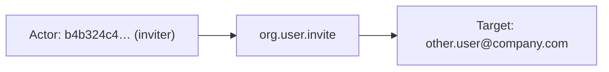
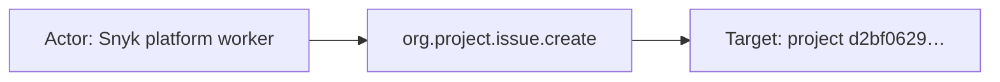

# snyk

## Product Domain

Snyk is a developer security platform that helps organizations find and fix vulnerabilities and misconfigurations across the software development lifecycle. Rather than treating security as a separate gate at deployment, Snyk integrates into developer workflows—IDEs, CI/CD pipelines, source control, and container registries—so teams can identify and remediate risk in code, open-source dependencies, container images, infrastructure as code (IaC), and cloud environments before software reaches production.

The platform is organized around groups, organizations, and projects. A project typically maps to a repository, application, or scan target (for example, a GitHub repo or a container image) and carries metadata such as origin, target file, branch reference, lifecycle stage, business criticality, and remediation settings. Snyk continuously tests these targets and surfaces findings as issues—package vulnerabilities, license violations, code flaws, cloud misconfigurations, and custom policy violations—each with severity, status, risk score, and fix guidance.

From a security and governance perspective, Snyk records administrative and operational activity in audit logs. These events capture changes to users, permissions, groups, API access, project configuration, and issue lifecycle actions (such as creation, ignore, or resolution). Security and AppSec teams use Snyk to prioritize vulnerabilities by effective severity and risk score, track open versus resolved issues across the estate, and maintain an audit trail of platform activity for compliance and incident investigation.

The Elastic Snyk integration polls the Snyk REST API (v2024-04-29) via Elastic Agent CEL input, supporting API token or OAuth2 authentication. It ingests audit logs and vulnerability issues, normalizes them into ECS-aligned fields (including `vulnerability.*` for issue events), and optionally maintains a `latest_issues` transform destination for current-state issue tracking.

## Data Collected (brief)

- **Audit logs** (`snyk.audit_logs`): Platform activity from Snyk organization or group audit APIs, including event type (`event.action`), organization and project IDs, user ID, and change content (before/after values). Configurable filters for user, event type, and project.
- **Issues** (`snyk.issues`): Vulnerability and policy findings for organizations or groups, including issue ID, title, type (package vulnerability, license, code, cloud, config, custom), status (open/resolved), effective severity, risk score, CVE/Snyk problem IDs, dependency coordinates, fixability flags, reachability, and related scan item (project) metadata such as origin, target file, branch, tags, and remediation settings.
- **Latest issues transform** (`snyk.latest_issues`): Derived current-state view of issues from the issues data stream for easier filtering and dashboards.

## Expected Audit Log Entities

The integration has one true audit stream — **`snyk.audit_logs`** — polling Snyk organization/group audit APIs (REST v2024-04-29). **`snyk.issues`** is audit-adjacent vulnerability state (`event.kind: alert`), not user-activity audit. **`snyk.latest_issues`** is a derived transform over issues; it carries no actor/target audit semantics.

Snyk audit events expose a top-level `user_id` (acting user), scope IDs (`org_id`, optional `group_id`, optional `project_id`), and event-specific payloads in flattened `snyk.audit_logs.content.*`. There is no native `actor`/`entity` envelope like Slack or GitLab.

No ECS `user.target.*`, `host.target.*`, `service.target.*`, or `entity.target.*` fields are populated (`target_fields_audit.csv` has no `snyk` row). The package does not use `destination.user.*` or `destination.host.*` de-facto target fields (`destination_identity_hits.csv` has no `snyk` row). Target identity lives under `snyk.audit_logs.content.*`, top-level `snyk.audit_logs.project_id`, and (for issues) `snyk.issues.relationships.*`.

**`event.action` is populated on `snyk.audit_logs`** — pipeline renames vendor `event` → `event.action` (e.g. `org.edit`, `org.user.invite`, `org.project.issue.create`). All 21 pipeline test fixtures and `sample_event.json` carry it. Pipeline also derives `event.type` and `event.category` from `event.action` via regex (L72–110). A secondary human-readable sub-action lives in `snyk.audit_logs.content.action` (e.g. `Returned from analysis`, `Cloned repo: …`) but is **not** mapped to ECS. **`snyk.issues`** and **`snyk.latest_issues`** have no `event.action`; findings are state snapshots, not auditable operations.

### Event action (semantic)

Snyk audit API events use dot-separated operation names as the primary action identifier. The pipeline maps these directly to `event.action`.

| Action (normalized label) | Classification | Confidence | Evidence | Per-stream notes |
| --- | --- | --- | --- | --- |
| `org.edit` | configuration_change | high | `test-snyk-audit.json-expected.json`: org rename (`before`/`after.name`) | Organization metadata change |
| `org.user.invite` | administration | high | Fixture: invitee `content.email`, inviter `user_id` | IAM — user invitation |
| `org.user.invite_link.create` | administration | high | Fixture: `content.url` → `url.*` | IAM — open invite link creation |
| `org.user.add` | administration | high | Fixture: `content.userPublicId`, `content.role: ADMIN` | IAM — user added to org |
| `org.user.invite_link.accept` | administration | high | Fixture: invitee `content.email`, `content.invitingUserId` | IAM — invite link accepted |
| `org.integration.settings.edit` | configuration_change | high | Fixture: `content.before`/`after` integration settings | Org integration configuration |
| `org.sast_settings.edit` | configuration_change | high | Fixture: SAST settings diff | Org SAST configuration |
| `org.target.create` | administration | high | Fixture: `content.targetId` | SCM/container target registration |
| `org.project.add` | administration | high | Fixture: project creation with `project_id` | Project lifecycle |
| `org.project.edit` | configuration_change | high | Fixture: `content.snapshotId` | Project metadata change |
| `org.project.monitor` | data_access | high | Fixture: `content.origin: github`, `content.target` repo metadata | Continuous monitoring enabled |
| `org.project.test` | data_access | high | Fixture: `content.origin: cli` | Manual/on-demand project test |
| `org.project.files.create` | data_access | high | Fixture: `content.action: Cloned repo: …` | Background file import (no `user_id`) |
| `org.project.files.edit` | configuration_change | high | Fixture: `content.action: Modify files - exclude` | Project file-exclusion settings |
| `org.project.files.access` | data_access | high | Fixture: `content.action: Retrieve files` | File retrieval during import |
| `org.project.file.access` | data_access | high | Fixture: single-file access event | File-level access |
| `org.project.issue.create` | detection | high | `sample_event.json`: `content.action: Returned from analysis` | Automated issue analysis completion |
| `org.project.issue.edit` | configuration_change | high | Fixture: `content.issues` count | Bulk issue state change |
| `org.project.issue.access` | data_access | high | Fixture: issue snapshot access | Issue data read |
| `group.service_account.create` | administration | high | Fixture: `content.serviceAccountPublicId`, role permissions | Group-scoped service account creation |
| `Returned from analysis` / `Cloned repo: …` / `Modify files - exclude` / `Retrieve files` | operational_detail | high | `snyk.audit_logs.content.action` in file/issue fixtures | Sub-action detail within parent `event.action`; vendor-only |
| Issue finding state (`open`, `resolved`) | detection | moderate | `snyk.issues.attributes.status` in issues fixtures | **`snyk.issues`** — finding lifecycle state, not audit verb; no `event.action` |
| Issue type (`package_vulnerability`, etc.) | detection | moderate | `snyk.issues.attributes.type` in issues fixtures | **`snyk.issues`** — finding category dimension, not operation name |

**`snyk.issues` / `snyk.latest_issues`:** No meaningful per-event action. These streams poll current issue records (`event.kind: alert`); they describe vulnerability findings, not who performed what operation. If `event.action` were needed for SIEM filtering, `snyk.issues.attributes.status` or `data_stream.dataset` would be weak substitutes — neither represents an auditable verb.

### Event action (ECS candidates)

| ECS / vendor field | Mapped to `event.action` today? | Mapping correct? | Recommended `event.action` value (from fixtures) | Enhancement candidate? | Evidence |
| --- | --- | --- | --- | --- | --- |
| `snyk.audit_logs.event` | yes (renamed) | yes | `org.edit`, `org.user.invite`, `org.project.issue.create`, … (21 distinct values in test fixtures) | no | `audit_logs/default.yml` L68–71: `rename` → `event.action`; all audit fixtures |
| `event.action` | yes | yes | Same as vendor `event` field above | no | Populated in every `test-snyk-audit.json-expected.json` event and `audit_logs/sample_event.json` |
| `event.type` | no (derived) | partial | `user`, `creation`, `change`, `access`, `deletion` | no | Appended from `event.action` regex (L72–96); supplements but does not replace action |
| `event.category` | no (derived) | partial | `configuration`, `file`, `iam` | no | Appended from `event.action` regex (L97–110); category, not verb |
| `snyk.audit_logs.content.action` | no | n/a | `Returned from analysis`, `Cloned repo: …`, `Modify files - exclude`, `Retrieve files` | partial | Human-readable sub-action; retained vendor-only; could supplement `event.action` for file/issue events |
| `snyk.issues.attributes.status` | no | n/a | `open`, `resolved` | partial | Issues pipeline does not set `event.action`; state dimension only |
| `snyk.issues.attributes.type` | no | n/a | `package_vulnerability` | partial | Finding type, not audit operation |
| `event.action` (issues) | no | n/a | — | yes (if action needed) | Not set in issues pipeline or `test-snyk-issues.json-expected.json` |

**Step 2b — per-stream check:**

| Stream | `event.action` in fixtures? | Pipeline maps to `event.action`? | Primary action candidate | Confidence | Evidence |
| --- | --- | --- | --- | --- | --- |
| `snyk.audit_logs` | yes | yes | `snyk.audit_logs.event` → `event.action` | high | All 21 `test-snyk-audit.json-expected.json` events; `sample_event.json`: `org.project.issue.create`; pipeline L68–71 |
| `snyk.issues` | no | no | None — no per-event action | high | `test-snyk-issues.json-expected.json` and `issues/sample_event.json` have no `event.action`; pipeline sets `event.kind: alert` only |
| `snyk.latest_issues` | no | no | None — transform inherits issues semantics | high | Elasticsearch transform over issues; no additional pipeline |

### Actor (semantic)

| Entity | Classification | Entity type (if general) | Confidence | Evidence | Per-stream notes |
| --- | --- | --- | --- | --- | --- |
| Acting Snyk user | user | — | high | Top-level `user_id` present on org edits, IAM events, project tests, integration/SAST settings, target/project lifecycle, and issue access in `test-snyk-audit.json-expected.json` | `snyk.audit_logs` only |
| Invited or affected user (content) | user | — | medium | `content.email`, `content.userPublicId`, `content.invitingUserId` in IAM fixtures; appended to `related.user` but not promoted to `user.target.*` | `snyk.audit_logs` — actor may differ from content user (e.g. `org.user.invite`: inviter in `user.id`, invitee in `content.email`) |
| Automated / system actor | service | Snyk platform worker | medium | Fixtures omit `user_id` for `org.project.files.create/edit/access`, `org.project.issue.create`; `sample_event.json` issue-create also has no `user_id` | `snyk.audit_logs` — background import/scan pipeline; no ECS actor fields populated |
| CLI / integration channel context | general | integration_channel | low | `content.origin: "cli"` on `org.project.test`; `content.origin: "github"` on `org.project.monitor` and `org.integration.settings.edit` | `snyk.audit_logs` — describes invocation channel, not a separate security principal |

**`snyk.issues`:** No audit actor. Findings are scanner output. Scan-item `relationships.importer` may reference a user when enrichment is expanded, but that is scan metadata, not an audit actor.

### Actor (ECS candidates)

| ECS / vendor field | Role | Mapped today? | Mapping correct? | Confidence | Evidence |
| --- | --- | --- | --- | --- | --- |
| `user.id` | Acting Snyk user ID | yes | yes | high | `set` copy_from `snyk.audit_logs.user_id` (`audit_logs/default.yml` L64–67); populated in all fixtures with `user_id` |
| `user.group.id` | Group scope (group-scoped events) | yes | partial | high | `rename`: `snyk.audit_logs.group_id` → `user.group.id` (L52–55); only `group.service_account.create` fixture; group is scope, not actor identity |
| `organization.id` | Org scope | yes | n/a | high | `set` copy_from `snyk.audit_logs.org_id` (L56–59); scope context on every audit event |
| `snyk.audit_logs.user_id` | Canonical vendor actor ID | yes (vendor) | n/a | high | Retained after ECS copy; source of truth for actor |
| `snyk.audit_logs.content.email` | Invitee / affected user email | yes (vendor) | n/a | medium | IAM fixtures; appended to `related.user` (L126–130) but not mapped to `user.target.email` |
| `snyk.audit_logs.content.userPublicId` | Affected user public ID | yes (vendor) | n/a | medium | `org.user.add` fixture; appended to `related.user` (L131–135) |
| `snyk.audit_logs.content.invitingUserId` | Inviter numeric ID (secondary actor ref) | yes (vendor) | n/a | low | `org.user.invite_link.accept` only; vendor-only, not appended to `related.user` |
| `snyk.audit_logs.content.origin` | Invocation channel (cli, github) | yes (vendor) | n/a | low | Context only; not an actor identity field |
| `related.user` | Cross-reference user IDs/emails | yes | partial | high | Appends `user_id`, `content.email`, `content.userPublicId` (L121–135); mixes actor and target user references without role distinction |

### Target (semantic)

| Layer | Description | Entity | Classification | Entity type (if general) | Confidence | Evidence | Per-stream notes |
| --- | --- | --- | --- | --- | --- | --- | --- |
| 1 — Platform / cloud service | Snyk developer-security SaaS platform | Snyk | service | — | medium | API polled at configurable `url` (default `https://api.snyk.io/`); no `cloud.service.name` or `cloud.provider` set in pipeline | Scope/platform layer inferred from integration; not ECS-mapped |
| 2 — Resource / object | Organization | Snyk organization | general | organization | high | `org_id` on every audit fixture; direct target on `org.edit` (`content.before`/`after.name`) | Both scope and rename target |
| 2 — Resource / object | Group | Snyk group | general | group | high | `group_id` → `user.group.id` on `group.service_account.create` | Group-scoped admin events only in fixtures |
| 2 — Resource / object | Project | Snyk project (scan container) | general | project | high | `snyk.audit_logs.project_id` on edit, issue, file, monitor, add events; `relationships.scan_item.data.id` (`type: project`) on issues | Audit and issues share project concept |
| 2 — Resource / object | Snyk import target | SCM/container target | general | target | high | `content.targetId` on `org.target.create`; `content.target` (`branch`, `name`, `owner`, `id`) on `org.project.monitor` | Upstream repo/image before project materialization |
| 2 — Resource / object | User (IAM target) | Snyk org user | user | — | high | `content.email`/`role` on `org.user.invite`; `content.userPublicId`/`role: ADMIN` on `org.user.add`; invitee email on `org.user.invite_link.accept` | Actor ≠ target on invite events |
| 2 — Resource / object | Service account | Snyk service account | general | service_account | high | `content.serviceAccountPublicId` on `group.service_account.create` with embedded role permissions | Created account is event target |
| 2 — Resource / object | Role / permissions | Snyk role | general | role | medium | `content.role`, `content.rolePublicId`, full role object with `groupPermissions`/`orgPermissions` | Assigned or created permission bundle |
| 2 — Resource / object | Integration / org settings | Org configuration | general | configuration | high | `content.before`/`content.after` on `org.integration.settings.edit`, `org.sast_settings.edit` | Settings object, not discrete resource ID |
| 2 — Resource / object | Project files / repository | Repository files | general | file | high | `org.project.files.create/edit/access`, `org.project.file.access`; clone URL in `content.action` | File-ingest during project import |
| 2 — Resource / object | Issues / snapshots (aggregate) | Issue batch / snapshot | general | issue | medium | `content.issues` count on issue edit/access; `content.snapshotId` on `org.project.edit` | Bulk counts, not individual issue IDs |
| 2 — Resource / object | Vulnerability finding | Snyk issue | general | package_vulnerability | high | `snyk.issues.id`, `attributes.type`, `attributes.key`, `vulnerability.id` | `snyk.issues` primary record; not an audit action target |
| 2 — Resource / object | Vulnerable package / dependency | Package coordinate | general | package | high | `attributes.coordinates[].representations[].dependency.package_name/version` (e.g. `expat`, `golang.org/x/crypto/ssh`) | Issues stream only |
| 3 — Content / artifact | Invite link, config diff, request metadata | URL / config diff / request ID | general | invite_link, config_diff, request_id | high (invite); medium (other) | `content.url` → `url.*` on `org.user.invite_link.create`; `content.before`/`after` on settings edits; `content.requestId` on file events; GitHub clone URL embedded in `content.action` | Artifacts enrich Layer 2 targets |

### Target (ECS candidates)

| ECS / vendor field | Layer | Classification | Mapped today? | Mapping correct? | ECS target bucket | Enhancement candidate? | Evidence |
| --- | --- | --- | --- | --- | --- | --- | --- |
| `organization.id` | 2 | general (organization) | yes | partial | `organization.id` / context | partial | Scope on every event; direct rename target on `org.edit` but same field serves both roles |
| `snyk.audit_logs.org_id` | 2 | general (organization) | yes (vendor) | n/a | `organization.id` | yes | Vendor canonical org ID; duplicated in ECS scope field |
| `snyk.audit_logs.project_id` | 2 | general (project) | yes (vendor) | n/a | `entity.target.id` / `resource.id` | yes | Project target on edit/issue/file/monitor events; never copied to ECS `*.target.*` |
| `snyk.audit_logs.content.targetId` | 2 | general (target) | yes (vendor) | n/a | `entity.target.id` | yes | `org.target.create` fixture |
| `snyk.audit_logs.content.target` | 2 | general (target) | yes (vendor) | n/a | `entity.target.*` | yes | GitHub repo metadata on `org.project.monitor` (`elastic/mito`, branch `dev`) |
| `snyk.audit_logs.content.email` | 2 | user | yes (vendor) | n/a | `user.target.email` | yes | Invitee on `org.user.invite`; invitee on `org.user.invite_link.accept`; in `related.user` but not `user.target.*` |
| `snyk.audit_logs.content.userPublicId` | 2 | user | yes (vendor) | n/a | `user.target.id` | yes | Added user on `org.user.add` |
| `snyk.audit_logs.content.serviceAccountPublicId` | 2 | general (service_account) | yes (vendor) | n/a | `entity.target.id` | yes | `group.service_account.create` |
| `snyk.audit_logs.content.role` / `.rolePublicId` | 2 | general (role) | yes (vendor) | n/a | `entity.target.*` | yes | Role assigned or created; vendor-only |
| `snyk.audit_logs.content.before` / `.after` | 3 | general (config_diff) | yes (vendor) | n/a | context-only | partial | Settings diff on org/integration/SAST edits |
| `url.*` | 3 | general (invite_link) | yes | partial | context-only | no | `uri_parts` on `content.url` (L136–139); invite link artifact |
| `snyk.issues.id` | 2 | general (package_vulnerability) | yes (vendor) | n/a | `vulnerability.id` / `entity.target.id` | partial | Issue UUID; partially mirrored via `vulnerability.id` from `attributes.problems` |
| `snyk.issues.relationships.scan_item.data.id` | 2 | general (project) | yes (vendor) | n/a | `entity.target.id` | yes | Project where finding was detected |
| `snyk.issues.relationships.scan_item.data.attributes.target_file` | 2 | general (target) | yes (vendor) | n/a | `file.path` / `entity.target.*` | yes | Manifest path within scan target (when enrichment present) |
| `snyk.issues.relationships.scan_item.data.attributes.target_reference` | 2 | general (target) | yes (vendor) | n/a | `entity.target.*` | yes | Branch/tag reference (when enrichment present) |
| `snyk.issues.relationships.scan_item.data.relationships.target` | 2 | general (target) | yes (vendor) | n/a | `entity.target.id` | yes | Upstream Snyk target entity link (pipeline fixup L163–166) |
| `vulnerability.id` / `vulnerability.severity` | 2 | general (package_vulnerability) | yes | yes | `vulnerability.*` | no | Mapped from `attributes.problems` and `effective_severity_level` (issues pipeline L61–84) |
| `cloud.service.name` | 1 | service | no | n/a | `service.target.name` | yes | Not set; static `snyk` would identify invoked SaaS platform |
| `destination.user.*` / `destination.host.*` | — | — | no | n/a | — | no | Not used |

### Gaps and mapping notes

- **`event.action` well-mapped on audit stream:** Vendor `event` → `event.action` is correct and complete for all audit fixtures. No enhancement needed for primary audit action mapping.
- **`content.action` sub-action not promoted:** Human-readable operational detail (`Returned from analysis`, `Cloned repo: …`, `Modify files - exclude`) stays in `snyk.audit_logs.content.action` only. Could supplement `event.action` on file/issue events if finer-grained filtering is needed — not an ECS gap for the primary verb.
- **Issues stream has no `event.action`:** Finding state (`attributes.status`, `attributes.type`) is not an auditable operation; absence is expected for `event.kind: alert` vulnerability records.
- **Actor-only ECS promotion:** Pipeline copies `user_id` → `user.id` but never maps content user fields to `user.target.*`. On `org.user.invite`, actor (`user.id` = inviter) differs from target (`content.email` = invitee); only inviter appears in `user.*`.
- **`org.user.add` actor/target conflation:** `user_id` equals `content.userPublicId` — both actor and added user share `user.id`. Semantically the admin actor may be absent from the payload.
- **`related.user` mixes roles:** Append processors add actor `user_id`, target `content.email`, and target `content.userPublicId` without distinguishing actor vs target — e.g. `org.user.invite` lists both inviter UUID and invitee email.
- **No official ECS target fields:** Aligns with `target_enhancement_packages.csv` (`snyk`, `moderate_candidate`, all `has_*_target` false, `has_vendor_target_fields: true`). Primary enhancement: promote `snyk.audit_logs.project_id`, `content.targetId`/`content.target`, and IAM `content.email`/`userPublicId` to `entity.target.*` / `user.target.*`.
- **Layer 1 SaaS gap:** No `cloud.provider` or `cloud.service.name` despite SaaS audit semantics.
- **Automated events lack actor:** Background file import and issue-analysis events omit `user_id`; no service-account or system principal field substitutes.
- **`user.group.id` as scope, not actor:** Group ID maps to ECS user field set but represents organizational scope on group events.
- **Issues stream is not audit:** `event.kind: alert` findings describe vulnerable assets (project, package) but carry no caller identity — useful for shared target taxonomy only.
- **No de-facto `destination.*` targets:** Unlike email/auth integrations, Snyk does not map affected users to `destination.user.*`.
- **`content.invitingUserId` orphaned:** Numeric inviter ID on invite-link accept is vendor-only and not appended to `related.user`.

### Per-stream notes

**`snyk.audit_logs`:** Sole true audit stream. Twenty-one pipeline test events plus `sample_event.json` cover org IAM, project lifecycle, file import, integration settings, and service-account creation. `event.action` carries the full Snyk operation name (e.g. `org.project.monitor`, `group.service_account.create`); `event.type`/`event.category` are regex-derived supplements. Target identity remains overwhelmingly vendor-namespaced.

**`snyk.issues`:** Vulnerability/issue state (`event.kind: alert`). No `event.action`. Maps `organization.id`, `vulnerability.*`, and retains full `snyk.issues.*` tree including scan-item and target relationships when API enrichment is present. No actor fields; project/target/package entities mirror audit taxonomy for asset-centric detections.

**`snyk.latest_issues`:** Elasticsearch transform destination for current issue state; inherits issues field semantics with no additional actor/target or action mapping.

## Example Event Graph

Examples below come from **`snyk.audit_logs`** (true Snyk organization audit API events with `event.action`) and **`snyk.issues`** (audit-adjacent vulnerability state snapshots with no `event.action` or audit actor). The `snyk.latest_issues` transform inherits issues semantics and has no per-event graph.

### Example 1: Admin invites user to organization

**Stream:** `snyk.audit_logs` · **Fixture:** `packages/snyk/data_stream/audit_logs/_dev/test/pipeline/test-snyk-audit.json-expected.json`

```
Snyk user (inviter) → org.user.invite → invited user (email)
```

#### Actor

| Field | Value |
| --- | --- |
| id | `b4b324c4-a55c-4cd6-82b8-f96e3b3b8d85` |
| type | user |

**Field sources:**
- `id` ← `user.id` (copy of `snyk.audit_logs.user_id`)

#### Event action

| Field | Value |
| --- | --- |
| action | `org.user.invite` |
| source_field | `event.action` |
| source_value | `org.user.invite` |

#### Target

| Field | Value |
| --- | --- |
| name | `other.user@company.com` |
| type | user |

**Field sources:**
- `name` ← `snyk.audit_logs.content.email` (invitee; not promoted to `user.target.email` today)

Actor is the inviter (`user.id`); target is the invitee email in `content.email`. Both appear in `related.user` without role distinction.

#### Mermaid



### Example 2: Automated issue analysis completes on project

**Stream:** `snyk.audit_logs` · **Fixture:** `packages/snyk/data_stream/audit_logs/sample_event.json`

```
Snyk platform worker → org.project.issue.create → Snyk project
```

#### Actor

| Field | Value |
| --- | --- |
| type | service |
| sub_type | Snyk platform worker |

**Field sources:**
- No `user_id` in fixture — background scan/analysis pipeline; no ECS actor fields populated

#### Event action

| Field | Value |
| --- | --- |
| action | `org.project.issue.create` |
| source_field | `event.action` |
| source_value | `org.project.issue.create` |

Vendor sub-action `Returned from analysis` lives in `snyk.audit_logs.content.action` but is not mapped to ECS.

#### Target

| Field | Value |
| --- | --- |
| id | `d2bf0629-84a7-4b0b-b435-f49a87f0720c` |
| type | general |
| sub_type | project |

**Field sources:**
- `id` ← `snyk.audit_logs.project_id`

#### Mermaid



### Example 3: Open package vulnerability on GitHub project (state snapshot)

**Stream:** `snyk.issues` · **Fixture:** `packages/snyk/data_stream/issues/sample_event.json`

```
(no audit actor) → open finding → vulnerable package on project
```

This stream polls current issue records (`event.kind: alert`); there is no auditable actor or ECS `event.action`. The graph below shows asset-centric detection semantics only.

#### Actor

| Field | Value |
| --- | --- |
| type | service |
| sub_type | Snyk scanner |

**Field sources:**
- No caller identity in fixture; scanner implied by `vulnerability.scanner.vendor: Snyk`

#### Event action

| Field | Value |
| --- | --- |
| action | `open` |
| source_field | `snyk.issues.attributes.status` |
| source_value | `open` |

**Not mapped to ECS today** — finding lifecycle state, not an audit verb.

#### Target

| Field | Value |
| --- | --- |
| id | `bdb0b182-440e-483f-8f42-d4f5477e8349` |
| name | `CVE-2024-32020` |
| type | general |
| sub_type | package_vulnerability |

**Field sources:**
- `id` ← `snyk.issues.id`
- `name` ← `snyk.issues.attributes.title` (also `vulnerability.id` includes `CVE-2024-32020`)
- Scan context: project `snyk/goof` (`snyk.issues.relationships.scan_item.data.attributes.name`), package `git` (`attributes.coordinates[].representations[].dependency.package_name`)

## ES|QL Entity Extraction

**Package type: agent-backed** (`policy_templates`, three data streams in `manifest.yml`; Tier A fixtures on `audit_logs` and `issues`). Router: **`data_stream.dataset`** (`snyk.audit_logs`, `snyk.issues`, `snyk.latest_issues`). Pass 4 is **fill-gaps-only**: detection flags (`actor_exists`, `target_exists`, `action_exists`) run first for query semantics; **mapped columns use column-level preserve** (`<col> IS NOT NULL`) — valid **3-arg**, **5-arg**, or **7-arg** `CASE` only — not `CASE(actor_exists, <col>, …)` / `CASE(target_exists, <col>, …)` and never **4-arg** `CASE(<col> IS NOT NULL, <col>, bare_field, null)` (bare field parses as a boolean condition). Secondary routing on **`event.action`** for IAM targets — on **`org.user.invite`**, promote invitee **`snyk.audit_logs.content.email`** → `user.target.email` (Pass 3); do not map invitee email on **`org.user.invite_link.accept`** where `user.id` already equals the accepting user. Automated audit events without `user_id` → **`service.name`** `"Snyk"` (Pass 3 platform worker); **`snyk.issues`** uses the same scanner literal with no audit actor.

### Dataset inventory

| data_stream.dataset | Stream role | Actor classification(s) | Target classification(s) | Extraction |
| --- | --- | --- | --- | --- |
| `snyk.audit_logs` | platform audit | user, service | user, general (project, target, service_account) | full |
| `snyk.issues` | vulnerability state (`event.kind: alert`) | service | general (finding) | partial |
| `snyk.latest_issues` | transform snapshot | — | — | none |

### Field mapping plan

#### Actor mappings

| Output column | Source field(s) | Condition (dataset + optional) | Confidence | Notes |
| --- | --- | --- | --- | --- |
| `user.id` | `snyk.audit_logs.user_id` → `user.id` | `data_stream.dataset == "snyk.audit_logs"` | high | **ingest-only — no ES|QL**; pipeline `set` copy (`default.yml` L64–67); no alternate query-time source |
| `service.name` | `"Snyk"` | `service.name IS NOT NULL` → preserve; else `data_stream.dataset == "snyk.audit_logs" AND user.id IS NULL` | medium | **column-level preserve**; **semantic literal** — automated worker (Pass 3 example 2; `sample_event.json` issue-create) |
| `service.name` | `"Snyk"` | `service.name IS NOT NULL` → preserve; else `data_stream.dataset == "snyk.issues"` | low | **column-level preserve**; **semantic literal** — scanner (Pass 3 example 3) |
| `entity.type` | `"service"` | `entity.type IS NOT NULL` → preserve; else `data_stream.dataset == "snyk.audit_logs" AND user.id IS NULL` | medium | **column-level preserve**; **semantic literal** — pairs with `service.name` on background jobs |
| `entity.sub_type` | `"Snyk platform worker"` | `entity.sub_type IS NOT NULL` → preserve; else `data_stream.dataset == "snyk.audit_logs" AND user.id IS NULL` | medium | **column-level preserve**; **semantic literal** — Pass 3 example 2 |
| `entity.sub_type` | `"Snyk scanner"` | `entity.sub_type IS NOT NULL` → preserve; else `data_stream.dataset == "snyk.issues"` | low | **column-level preserve**; **semantic literal** — Pass 3 example 3 |

#### Target mappings

| Output column | Source field(s) | Condition (dataset + optional) | Confidence | Notes |
| --- | --- | --- | --- | --- |
| `user.target.email` | `snyk.audit_logs.content.email` | `user.target.email IS NOT NULL` → preserve; else `data_stream.dataset == "snyk.audit_logs" AND event.action == "org.user.invite"` | high | **column-level preserve**; **vendor fallback** — invitee; actor `user.id` ≠ target email (Pass 3 example 1) |
| `entity.target.id` | `snyk.audit_logs.project_id` | `entity.target.id IS NOT NULL` → preserve; else dataset/action guards below | high | **column-level preserve**; **vendor fallback** — project (Pass 3 example 2) |
| `entity.target.id` | `snyk.audit_logs.content.targetId` | `entity.target.id IS NOT NULL` → preserve; else `data_stream.dataset == "snyk.audit_logs" AND event.action == "org.target.create"` | high | **column-level preserve**; **vendor fallback** — SCM target registration |
| `entity.target.id` | `snyk.audit_logs.content.serviceAccountPublicId` | `entity.target.id IS NOT NULL` → preserve; else `data_stream.dataset == "snyk.audit_logs" AND event.action == "group.service_account.create"` | high | **column-level preserve**; **vendor fallback** — created service account |
| `entity.target.id` | `snyk.issues.id` | `entity.target.id IS NOT NULL` → preserve; else `data_stream.dataset == "snyk.issues"` | high | **column-level preserve**; **vendor fallback** — finding UUID |
| `entity.target.name` | `snyk.issues.attributes.title` | `entity.target.name IS NOT NULL` → preserve; else `data_stream.dataset == "snyk.issues"` | high | **column-level preserve**; **vendor fallback** — CVE/finding title (Pass 3 example 3) |
| `entity.target.sub_type` | `snyk.issues.attributes.type` | `entity.target.sub_type IS NOT NULL` → preserve; else `data_stream.dataset == "snyk.issues"` | high | **column-level preserve**; **vendor fallback** — e.g. `package_vulnerability` |

### Detection flags (mandatory — run first)

```esql
| EVAL
  actor_exists = user.id IS NOT NULL OR user.name IS NOT NULL OR user.email IS NOT NULL
    OR host.id IS NOT NULL OR host.ip IS NOT NULL OR host.name IS NOT NULL
    OR service.id IS NOT NULL OR service.name IS NOT NULL
    OR entity.id IS NOT NULL OR entity.name IS NOT NULL,
  target_exists = user.target.id IS NOT NULL OR user.target.name IS NOT NULL OR user.target.email IS NOT NULL
    OR host.target.id IS NOT NULL OR host.target.ip IS NOT NULL OR host.target.name IS NOT NULL
    OR service.target.id IS NOT NULL OR service.target.name IS NOT NULL
    OR entity.target.id IS NOT NULL OR entity.target.name IS NOT NULL,
  action_exists = event.action IS NOT NULL
```

No ingest-time ECS `*.target.*` on Snyk today — `target_exists` is typically false until fallback `EVAL`s run.

**Semantics:** `actor_exists` / `target_exists` / `action_exists` are query-time helpers. Actor/target/classification **`EVAL` blocks use column-level preserve** (`<col> IS NOT NULL`) — not `CASE(actor_exists, <col>, …)` / `CASE(target_exists, <col>, …)` — so e.g. a populated `user.id` does not block `service.name` ← `"Snyk"` when `user.id` is empty on automated audit rows, and one populated `entity.target.id` does not block `entity.target.name` fallbacks (Pass 4 §10).

### Optional classification helpers (when needed)

Set in **fallback** only (column-level preserve on `entity.type`, `entity.sub_type`, `entity.target.sub_type`):

```esql
| EVAL
  entity.type = CASE(
    entity.type IS NOT NULL, entity.type,
    data_stream.dataset == "snyk.audit_logs" AND user.id IS NULL, "service",
    data_stream.dataset == "snyk.issues", "service",
    null
  ),
  entity.sub_type = CASE(
    entity.sub_type IS NOT NULL, entity.sub_type,
    data_stream.dataset == "snyk.audit_logs" AND user.id IS NULL, "Snyk platform worker",
    data_stream.dataset == "snyk.issues", "Snyk scanner",
    null
  ),
  entity.target.sub_type = CASE(
    entity.target.sub_type IS NOT NULL, entity.target.sub_type,
    data_stream.dataset == "snyk.issues", snyk.issues.attributes.type,
    data_stream.dataset == "snyk.audit_logs" AND snyk.audit_logs.project_id IS NOT NULL, "project",
    data_stream.dataset == "snyk.audit_logs" AND event.action == "org.target.create", "target",
    data_stream.dataset == "snyk.audit_logs" AND event.action == "group.service_account.create", "service_account",
    null
  )
```

### Combined ES|QL — actor fields

```esql
| EVAL
  service.name = CASE(
    service.name IS NOT NULL, service.name,
    data_stream.dataset == "snyk.audit_logs" AND user.id IS NULL, "Snyk",
    data_stream.dataset == "snyk.issues", "Snyk",
    null
  )
```

**ES|QL `CASE` arity:** Arguments are **(condition, value)** pairs. With **4** args, the 3rd arg is a **boolean condition**, not a fallback value — `CASE(service.name IS NOT NULL, service.name, "Snyk", null)` would mean “else if `"Snyk"` is truthy, return `null`”. For preserve + one fallback use **3** args: `CASE(service.name IS NOT NULL, service.name, "Snyk")` when a single dataset applies; multi-dataset branches need **5+** args with an explicit `null` default.

### Combined ES|QL — event action

Omitted — `event.action` is populated on every **`snyk.audit_logs`** fixture via ingest rename `snyk.audit_logs.event` → `event.action` (`audit_logs/default.yml` L68–71). **`snyk.issues`** / **`snyk.latest_issues`** have no auditable verb; `snyk.issues.attributes.status` is finding state, not `event.action`.

### Combined ES|QL — target fields

```esql
| EVAL
  user.target.email = CASE(
    user.target.email IS NOT NULL, user.target.email,
    data_stream.dataset == "snyk.audit_logs" AND event.action == "org.user.invite", snyk.audit_logs.content.email,
    null
  ),
  entity.target.id = CASE(
    entity.target.id IS NOT NULL, entity.target.id,
    data_stream.dataset == "snyk.audit_logs" AND snyk.audit_logs.project_id IS NOT NULL, snyk.audit_logs.project_id,
    data_stream.dataset == "snyk.audit_logs" AND event.action == "org.target.create", snyk.audit_logs.content.targetId,
    data_stream.dataset == "snyk.audit_logs" AND event.action == "group.service_account.create", snyk.audit_logs.content.serviceAccountPublicId,
    data_stream.dataset == "snyk.issues", snyk.issues.id,
    null
  ),
  entity.target.name = CASE(
    entity.target.name IS NOT NULL, entity.target.name,
    data_stream.dataset == "snyk.issues", snyk.issues.attributes.title,
    null
  )
```

### Full pipeline fragment (optional)

```esql
FROM logs-*
| EVAL
  actor_exists = user.id IS NOT NULL OR user.name IS NOT NULL OR user.email IS NOT NULL
    OR host.id IS NOT NULL OR host.ip IS NOT NULL OR host.name IS NOT NULL
    OR service.id IS NOT NULL OR service.name IS NOT NULL
    OR entity.id IS NOT NULL OR entity.name IS NOT NULL,
  target_exists = user.target.id IS NOT NULL OR user.target.name IS NOT NULL OR user.target.email IS NOT NULL
    OR host.target.id IS NOT NULL OR host.target.ip IS NOT NULL OR host.target.name IS NOT NULL
    OR service.target.id IS NOT NULL OR service.target.name IS NOT NULL
    OR entity.target.id IS NOT NULL OR entity.target.name IS NOT NULL,
  action_exists = event.action IS NOT NULL
| EVAL
  entity.type = CASE(
    entity.type IS NOT NULL, entity.type,
    data_stream.dataset == "snyk.audit_logs" AND user.id IS NULL, "service",
    data_stream.dataset == "snyk.issues", "service",
    null
  ),
  entity.sub_type = CASE(
    entity.sub_type IS NOT NULL, entity.sub_type,
    data_stream.dataset == "snyk.audit_logs" AND user.id IS NULL, "Snyk platform worker",
    data_stream.dataset == "snyk.issues", "Snyk scanner",
    null
  ),
  service.name = CASE(
    service.name IS NOT NULL, service.name,
    data_stream.dataset == "snyk.audit_logs" AND user.id IS NULL, "Snyk",
    data_stream.dataset == "snyk.issues", "Snyk",
    null
  )
| EVAL
  user.target.email = CASE(
    user.target.email IS NOT NULL, user.target.email,
    data_stream.dataset == "snyk.audit_logs" AND event.action == "org.user.invite", snyk.audit_logs.content.email,
    null
  ),
  entity.target.id = CASE(
    entity.target.id IS NOT NULL, entity.target.id,
    data_stream.dataset == "snyk.audit_logs" AND snyk.audit_logs.project_id IS NOT NULL, snyk.audit_logs.project_id,
    data_stream.dataset == "snyk.audit_logs" AND event.action == "org.target.create", snyk.audit_logs.content.targetId,
    data_stream.dataset == "snyk.audit_logs" AND event.action == "group.service_account.create", snyk.audit_logs.content.serviceAccountPublicId,
    data_stream.dataset == "snyk.issues", snyk.issues.id,
    null
  ),
  entity.target.name = CASE(
    entity.target.name IS NOT NULL, entity.target.name,
    data_stream.dataset == "snyk.issues", snyk.issues.attributes.title,
    null
  ),
  entity.target.sub_type = CASE(
    entity.target.sub_type IS NOT NULL, entity.target.sub_type,
    data_stream.dataset == "snyk.issues", snyk.issues.attributes.type,
    data_stream.dataset == "snyk.audit_logs" AND snyk.audit_logs.project_id IS NOT NULL, "project",
    data_stream.dataset == "snyk.audit_logs" AND event.action == "org.target.create", "target",
    data_stream.dataset == "snyk.audit_logs" AND event.action == "group.service_account.create", "service_account",
    null
  )
| KEEP @timestamp, data_stream.dataset, event.action, user.id, service.name, entity.type, entity.sub_type, user.target.email, entity.target.id, entity.target.name, entity.target.sub_type, snyk.audit_logs.project_id
```

### Streams excluded

- **`snyk.latest_issues`** — Elasticsearch transform over `snyk.issues`; inherits issues field semantics with no additional actor/target or `event.action` mapping.

### Gaps and limitations

- **`user.target.id` on `org.user.add` omitted** — fixture `user_id` equals `content.userPublicId`; mapping would tautologically duplicate actor `user.id` (Pass 2).
- **`org.user.invite_link.accept`** — `user.id` and `content.email` refer to the same accepting user; no separate invitee target branch.
- **`service.target.name` / Layer 1 SaaS** — not emitted; no Pass 3 platform-target example on generic audit rows; `cloud.service.name` not set at ingest.
- **`organization.id` is scope** — not mapped to `entity.target.*`; same field serves org-edit rename target.
- **Role, integration settings, file-ingest targets** — `content.role`, `content.before`/`after`, `content.action` remain vendor-only; extend `entity.target.*` when Tier A fixtures justify guards.
- **`snyk.issues` project/package targets** — `relationships.scan_item.*` and dependency coordinates exist in `issues/sample_event.json` but are omitted here to avoid guessing among multiple `entity.target.id` candidates.
- **`content.action` sub-operations** — vendor-only (`Returned from analysis`, `Cloned repo: …`); not promoted to `event.action`.
- **`user.id`** — **ingest-only — no ES|QL**; `CASE(user.id IS NOT NULL, user.id, user.id, …)` / `CASE(actor_exists, user.id, …)` omitted (Pass 4 tautology rule).
- **`CASE` preserve pattern** — use `CASE(<col> IS NOT NULL, <col>, …)` per column; do not gate fallbacks on `actor_exists` / `target_exists` when another populated column in the same flag would block an empty sibling (Pass 4 §10).
- **`user.name` / `user.email` / `user.domain`** — not indexed on audit stream; actor is `user.id` only.
- **Pass 2 enhancement alignment** — ingest-time promotion of IAM/project fields to `user.target.*` / `entity.target.*` remains preferred; Pass 4 fills gaps without overwriting populated values.
