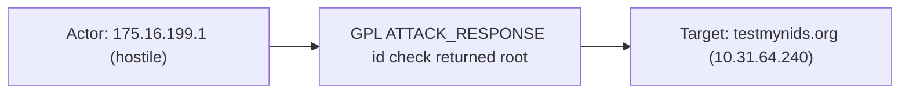

# suricata

## Product Domain

Suricata is an open-source, high-performance network intrusion detection system (NIDS), intrusion prevention system (IPS), and network security monitoring (NSM) engine maintained by the Open Information Security Foundation (OISF). Deployed inline or passively on network segments, Suricata inspects live traffic against signature-based rules (compatible with Snort and Emerging Threats rule sets), protocol parsers, and behavioral heuristics to detect malicious activity, policy violations, and protocol anomalies. In IPS mode it can actively block or drop malicious sessions; in IDS mode it generates alerts for downstream analysis and response.

As an NSM platform, Suricata goes beyond simple signature matching by reconstructing application-layer protocols and emitting rich transaction logs for DNS, HTTP, TLS, SMB, SSH, SMTP, and other protocols. This deep packet inspection enables threat hunting, forensic reconstruction of network sessions, and correlation of alerts with the underlying traffic context. Organizations deploy Suricata at network perimeters, data-center boundaries, and critical internal segments to gain visibility into east-west and north-south traffic.

Suricata is multi-threaded and designed for high-throughput environments, with configurable run modes, CPU affinity, and rule-set management to scale with traffic volume. Security teams use it for real-time threat detection, compliance logging, incident investigation, and feeding SIEM platforms with normalized network security events. The engine's Extensible Event Format (EVE) provides structured JSON output that captures alerts, flows, protocol transactions, file metadata, and performance statistics in a single log stream.

## Data Collected (brief)

The integration collects Suricata's EVE JSON log (`eve.json`) via Elastic Agent logfile input from the Suricata host. A single **eve** data stream ingests all configured EVE event types—typically including `alert` (rule-based security alerts with signature metadata and MITRE mappings), `anomaly`, `flow`, protocol logs (`dns`, `http`, `tls`, `ssh`, `smb`, `smtp`, `dhcp`, `nfs`, `kerberos`), `fileinfo` (extracted file hashes and metadata), and `stats` (engine performance counters). Events are parsed into ECS fields (source/destination, network, DNS, HTTP, TLS, rule, threat) with Suricata-specific fields retained under `suricata.eve.*`.

## Expected Audit Log Entities

The single **eve** data stream ingests Suricata EVE JSON — network security telemetry, not identity-centric audit logs. Event types include **alert** (IDS/IPS rule hits), **flow**, protocol transactions (`dns`, `http`, `tls`, `ssh`, `smb`, `smtp`, …), **fileinfo**, **anomaly**, and **stats** (engine metrics). Alerts and protocol logs are audit-adjacent security events; **stats** is pure engine telemetry with no actor/target endpoints.

Actor and target are inferred from the flow 5-tuple (`src_ip`/`dest_ip` → `source.*`/`destination.*`), well-known ports, rule metadata, and application-layer fields. There is no authenticated user principal; `user_agent.*` reflects client software, not `user.*`. ECS `*.target.*` fields are **not populated** (no row in `target_fields_audit.csv`). `destination.user.*` / `destination.host.*` are **not used** (absent from `destination_identity_hits.csv`). `target_enhancement_packages.csv` classifies suricata as **strong_candidate** with pipeline actor and destination network evidence but no Tier-A ECS target mapping.

**`event.action` is absent from all fixtures and pipelines.** Suricata's richest action signals — IPS disposition (`alert.action`: `allowed`/`blocked`), EVE `event_type`, rule signature name, HTTP method, and flow state — are mapped to `event.type`, `event.kind`, `event.category`, or vendor fields instead. See Event action sections below.

| Stream (EVE `event_type`) | `event.action` in fixtures? | Pipeline maps to `event.action`? | Primary action candidate | Confidence | Evidence |
| --- | --- | --- | --- | --- | --- |
| **alert** | no | no | `alert.action` (`allowed`/`blocked`→`denied`) | high | Appended to `event.type` (`default.yml` L433–446); `event.type: ["allowed"]` in `test-eve-alerts.log-expected.json` |
| **alert** (detection) | no | no | `rule.name` ← `suricata.eve.alert.signature` | high | `rule.name: "ET POLICY curl User-Agent Outbound"` in alert fixtures (`default.yml` L428–431) |
| **dns** | no | no | `suricata.eve.event_type` + `dns.type` (`query`/`answer`) | medium | `event.type: ["protocol"]`, `dns.type: query` in `test-eve-dns-4-1-4.log-expected.json` |
| **http** | no | no | `http.request.method` (+ optional `url.path`) | medium | `http.request.method: GET` in alert/HTTP fixtures (`default.yml` L331–335) |
| **tls**, **ssh**, **smb**, **smtp**, … | no | no | `suricata.eve.event_type` (protocol observation) | medium | `event.type: ["protocol"]` on TLS in `test-eve-small.log-expected.json` |
| **flow** | no | no | `suricata.eve.flow.state` (`new`/`closed`) | medium | Appended as `event.type: start`/`end` (`default.yml` L319–330) |
| **fileinfo** | no | no | file extraction (`suricata.eve.fileinfo.state`) | medium | `file.path` populated; `event_type: fileinfo` not in type-params script (`test-eve-small.log-expected.json`) |
| **stats** | no | no | — (no per-event action) | high | `event.kind: metric`; engine counters only (`test-eve-small.log-expected.json`) |

### Event action (semantic)

What operation or activity does each stream record?

| Action (normalized label) | Classification | Confidence | Evidence | Per-stream notes |
| --- | --- | --- | --- | --- |
| IDS/IPS rule triggered (signature match) | detection | high | `rule.name`, `rule.id` on alert events (e.g. `"ET POLICY curl User-Agent Outbound"`, sid `2013028`) | **alert** — primary security "what happened" |
| IPS traffic allowed | detection | high | Vendor `alert.action: allowed` → `event.type: ["allowed"]` | **alert** in IDS/passive mode |
| IPS traffic blocked/denied | detection | high | Vendor `alert.action: blocked` normalized to `denied` → `event.type` | **alert** in IPS/inline mode (no blocked fixture; pipeline L433–437) |
| Protocol transaction logged | data_access | high | EVE `event_type` drives `event.type: ["protocol"]` via type-params script | **dns**, **tls**, **ssh**, **smb**, **smtp**, **http**, … |
| HTTP request observed | data_access | medium | `http.request.method: GET` with optional `url.path` | **http** events and alerts with HTTP app-layer |
| DNS query / answer | data_access | medium | `dns.type: query` or `answer` with `dns.question.name` | **dns** only |
| Flow session start / end | connection | high | `flow.state: new` → `event.type: start`; `closed` → `end` | **flow** only |
| File metadata extracted | data_access | medium | `file.path`, `file.hash.*` from `suricata.eve.fileinfo.*` | **fileinfo** only |
| Engine performance snapshot | — | high | Counter aggregation under `suricata.eve.stats.*` | **stats** — no per-event verb; `event.kind: metric` |

### Event action (ECS candidates)

| ECS / vendor field | Mapped to `event.action` today? | Mapping correct? | Recommended `event.action` value (from fixtures) | Enhancement candidate? | Evidence |
| --- | --- | --- | --- | --- | --- |
| `event.action` | no | n/a | — | — | Absent from all `sample_event.json` and `*-expected.json` |
| `alert.action` (vendor, removed post-pipeline) | no (→ `event.type`) | partial | `allowed`, `denied` | yes | `default.yml` L433–446 appends to `event.type`, then removes vendor field; `event.type: ["allowed"]` in `test-eve-alerts.log-expected.json` |
| `rule.name` | no | n/a | `"ET POLICY curl User-Agent Outbound"`, `"GPL ATTACK_RESPONSE id check returned root"` | yes | `default.yml` L428–431; alert fixtures |
| `rule.id` | no | n/a | `"2013028"`, `"2100498"` | partial (alternate) | Signature ID; less human-readable than `rule.name` |
| `suricata.eve.event_type` | no (→ `event.kind`/`event.category`/`event.type`) | partial | `alert`, `dns`, `http`, `tls`, `ssh`, `flow`, `fileinfo`, `stats` | partial | Type-params script (`default.yml` L167–273); `fileinfo`/`anomaly` not in params — fall through with minimal ECS typing |
| `http.request.method` | no | n/a | `GET` | partial | `default.yml` L331–335; HTTP/alert fixtures |
| `suricata.eve.flow.state` | no (→ `event.type` `start`/`end`) | partial | `new`, `closed` | partial | `default.yml` L319–330 |
| `dns.type` | no | n/a | `query`, `answer` | partial | DNS pipeline + fixtures (`test-eve-dns-4-1-4.log-expected.json`) |
| `suricata.eve.fileinfo.state` | no (vendor-only) | n/a | `CLOSED` | partial | Retained under vendor namespace on fileinfo events |
| `event.type` / `event.category` | n/a (wrong ECS field for verb) | partial | `allowed`, `protocol`, `access`, `connection`, `start`, `end` | no (keep as type/category) | Currently absorbs action semantics that belong in `event.action` per ECS Event field-set |

### Actor (semantic)

| Entity | Classification | Entity type (if general) | Confidence | Evidence | Per-stream notes |
| --- | --- | --- | --- | --- | --- |
| Flow / protocol initiator | host | — | high | `source.ip`, `source.port`, `source.mac`; ephemeral client port toward service port (e.g. `192.168.86.85:55406 → 192.168.253.112:22` in `sample_event.json`, SSH in `test-eve-small.log-expected.json`) | Default for `flow`, `http`, `tls`, `ssh`, `dns` query, `fileinfo` |
| IDS alert — default side | host | — | high | `source.ip`, `source.port`; outbound client or external attacker in most signatures (e.g. `192.168.1.146 → 89.160.20.112:80` in `test-eve-alerts.log-expected.json`) | `event.kind: alert`, `event.category: intrusion_detection` |
| IDS alert — hostile side | host | — | medium | `suricata.eve.alert.hostile` (`src_ip` / `dest_ip`) marks malicious side; e.g. `hostile: ["src_ip"]` with `175.16.199.1:80 → 10.31.64.240` in `test-eve-metadata.log-expected.json` | Overrides default source=actor assumption when metadata present |
| DNS answer responder | host or service | — | medium | Resolver appears as `source.*` with `source.port: 53` when `dns.type: answer` (e.g. `192.168.86.1:53 → 192.168.86.85` in `test-eve-small.log-expected.json`; query direction reversed in `test-eve-dns-4-1-4.log-expected.json`) | DNS only |
| Geo-enriched external endpoint | host | — | medium | `source.geo.*`, `source.as.*` on public IPs (e.g. `175.16.199.1` China on metadata alert; `89.160.20.112` Sweden on alerts fixture) | Optional enrichment via geoip processors |
| HTTP/TLS client software | general | client_software | medium | `user_agent.original` ← `suricata.eve.http.http_user_agent` (e.g. `curl/7.58.0`, `Debian APT-HTTP/1.3` in alert fixtures); not a security principal | HTTP/alert events only |
| Suricata sensor | — | — | high | `observer.product`/`observer.vendor`/`observer.type` set when `forwarded` tag present (`default.yml`); identifies the IDS sensor, not the traffic actor | All forwarded events |
| Engine telemetry | — | — | high | No actor endpoint on `event_type: stats` — counters only (`test-eve-small.log-expected.json`) | stats stream semantics |

No **user** actor is populated in fixtures; `user.name` / `user.id` are absent from all pipeline expected output.

### Actor (ECS candidates)

| ECS / vendor field | Role | Mapped today? | Mapping correct? | Confidence | Evidence |
| --- | --- | --- | --- | --- | --- |
| `source.ip` | Flow/alert origin host | yes | yes | high | `suricata.eve.src_ip` → `source.address` → `source.ip` (`default.yml` L98–107; all fixtures) |
| `source.port` | Flow/alert origin port | yes | yes | high | `suricata.eve.src_port` → `source.port` (`default.yml` L108–113) |
| `source.mac` | L2 origin | yes | yes | high | `suricata.eve.ether.src_mac` → formatted `source.mac` (`default.yml` L44–65; metadata alert fixture) |
| `source.geo.*`, `source.as.*` | Enriched origin | yes | yes | medium | geoip on `source.ip` (`default.yml` L692–731; metadata/alerts fixtures) |
| `source.packets`, `source.bytes` | Flow volume (origin side) | yes | yes | high | `suricata.eve.flow.pkts_toserver` / `bytes_toserver` (`default.yml` L611–625) |
| `suricata.eve.alert.hostile` | Malicious-side hint | yes (vendor) | n/a | medium | `alert.metadata.hostile` → `suricata.eve.alert.hostile` (`default.yml` L511–514; `test-eve-metadata.log-expected.json`) |
| `user_agent.*` | Client software fingerprint | yes | partial | medium | `user_agent` processor on `suricata.eve.http.http_user_agent` (`default.yml` L688–691); software string, not IAM/user account |
| `suricata.eve.ssh.client.software_version` | SSH client banner | yes (vendor) | n/a | low | Retained under vendor namespace (SSH event in `sample_event.json`) |
| `observer.product` / `observer.vendor` / `observer.type` | Sensor identity | yes | n/a | high | Static when `forwarded` tag (`default.yml` L8–22); not traffic actor |
| `related.ip` | Correlation | yes | yes | high | Appends `source.ip` and `destination.ip` (`default.yml` L748–758) |

### Target (semantic)

| Layer | Description | Entity | Classification | Entity type (if general) | Confidence | Evidence | Per-stream notes |
| --- | --- | --- | --- | --- | --- | --- | --- |
| 1 — Network protocol / service | Application protocol or well-known service on destination port | SSH, DNS, HTTP, TLS, … | service | — | high | `network.protocol` from `suricata.eve.event_type` / `app_proto` script (`default.yml` L167–290); `destination.port` — e.g. `:22` SSH in `sample_event.json`, `:53` DNS in `test-eve-dns-4-1-4.log-expected.json`, `:443` TLS alert in `test-eve-small.log-expected.json` | All protocol and alert events |
| 2 — Host / endpoint | IP/MAC peer receiving or serving traffic | Internal victim, external server, resolver | host | — | high | `destination.ip`, `destination.port`, `destination.mac` ← `dest_ip`/`dest_port`/ether (`default.yml` L114–130); e.g. victim `10.31.64.240` on attack-response alert, `192.168.253.112:22` SSH server | Default for flow, alert, protocol logs |
| 2 — Rule-implied asset class | Signature metadata describing attacked asset type | smtp-server, server | general | server, smtp-server | medium | `suricata.eve.alert.attack_target` ← rule metadata (`default.yml` L461–464; `["smtp-server","server"]` in `test-eve-metadata.log-expected.json`) | Alert only; supplements Layer 2 |
| 3 — Named resource / content | Hostname, URL, DNS name, file, cert | Domain, URL path, file hash | general | hostname, domain, url, file | medium | `destination.domain` ← HTTP hostname or TLS SNI (`default.yml` L341–365; `tls.yml` L214–218); `url.domain`/`url.path`; `dns.question.name`; `tls.client.server_name`; `file.path`/`file.hash.*` on fileinfo (`default.yml` L397–406; fileinfo in `test-eve-small.log-expected.json`) | HTTP, TLS, DNS, fileinfo, alerts with app-layer context |
| 3 — Detection rule | Triggered signature | Suricata rule | general | ids_rule | high | `rule.id`, `rule.name`, `rule.category` ← `suricata.eve.alert.*` (`default.yml` L418–432) | Alert only |

**stats** events have no target entity — engine counters under `suricata.eve.stats.*` only.

### Target (ECS candidates)

| ECS / vendor field | Layer | Classification | Mapped today? | Mapping correct? | ECS target bucket | Enhancement candidate? | Evidence |
| --- | --- | --- | --- | --- | --- | --- | --- |
| `destination.ip` | 2 | host | yes | yes | context-only (network peer) | yes → `host.target.ip` | `suricata.eve.dest_ip` → `destination.ip` (`default.yml` L114–124); victim/server peer on alerts — network semantics, not official ECS target |
| `destination.port` | 1/2 | service/host | yes | yes | context-only | partial → `host.target.port` | `suricata.eve.dest_port` → `destination.port`; well-known ports imply service layer |
| `destination.mac` | 2 | host | yes | yes | context-only | yes → `host.target.mac` | `suricata.eve.ether.dest_mac` → `destination.mac` (metadata alert) |
| `destination.domain` | 3 | general | yes | yes | context-only | partial → `entity.target.name` | HTTP hostname append + TLS SNI set (`default.yml` L341–365; `tls.yml` L214–218) |
| `destination.geo.*`, `destination.as.*` | 2 | host | yes | yes | context-only | no | geoip on `destination.ip` (`default.yml` L698–741) |
| `destination.packets`, `destination.bytes` | 2 | host | yes | yes | context-only | no | Flow counters toward client (`default.yml` L607–625) |
| `network.protocol` | 1 | service | yes | yes | context-only | partial → `service.target.name` | Event-type script + `app_proto` (`default.yml` L167–290) |
| `dns.question.name` | 3 | general | yes | yes | context-only | partial | `suricata.eve.dns.rrname` via `registered_domain` + dns pipeline (`dns.yml`; DNS fixtures) |
| `tls.client.server_name` | 3 | general | yes | yes | context-only | partial | `suricata.eve.tls.sni` (`tls.yml` L209–213) |
| `url.domain`, `url.path`, `url.original` | 3 | general | yes | yes | context-only | partial | HTTP grok/rename (`default.yml` L366–386) |
| `file.path`, `file.size`, `file.hash.*` | 3 | general | yes | yes | context-only | partial → `file`-class target | `suricata.eve.fileinfo.*` (`default.yml` L397–406; fileinfo fixture) |
| `file.name` | 3 | general | yes | yes | context-only | partial | Alert metadata `filename` → `file.name` (`default.yml` L560–564) |
| `rule.id`, `rule.name`, `rule.category` | 3 | general | yes | yes | context-only | no | Alert signature fields (`default.yml` L418–432) |
| `suricata.eve.alert.attack_target` | 2 | general | yes (vendor) | n/a | — | yes → `entity.target.type` or `service.target.name` | Rule metadata array; vendor-only, no ECS target mapping (`default.yml` L461–464) |
| `threat.tactic.id`, `threat.technique.id` | 3 | general | yes | partial | context-only | no | MITRE from rule metadata (`default.yml` L580–605); threat context, not entity target |

### Gaps and mapping notes

- **No ECS `*.target.*` fields** — victim/server endpoints live under `destination.*` as network peers; `target_enhancement_packages.csv` flags suricata as **strong_candidate** for Tier-A target migration (`host.target.ip` / port on alert victims).
- **`destination.*` is network context, not de-facto user/host audit target** — unlike firewall auth logs, Suricata never maps recipient/login-target identity to `destination.user.*`; all destination fields are flow 5-tuple peers.
- **`suricata.eve.alert.hostile` and `suricata.eve.alert.attack_target`** are the richest vendor target/actor hints but remain vendor-only (listed in `vendor_target_special_cases.csv`); no ECS `entity.target.*` equivalent.
- **`user_agent.*` vs `user.*`** — HTTP User-Agent strings (`curl/7.58.0`) populate `user_agent.original` correctly as client software; must not be interpreted as `user` actor.
- **`observer.*`** identifies the Suricata sensor when events are forwarded; it is not the traffic actor or target.
- **DNS direction** — query events treat resolver as `destination.*:53`; answer events reverse roles (`source.port: 53`); actor/target follow packet direction, not semantic "client/server" labels.
- **stats / anomaly without endpoints** — no actor or target; metrics dimensions under `suricata.eve.stats.*` are engine health, not per-flow entities.
- **`event.action` gaps** — `alert.action` (`allowed`/`blocked`) and `rule.name` (signature) are the strongest action candidates but map to `event.type` or `rule.*` instead of `event.action`. Recommended primary mapping: `event.action` ← `alert.action` (IPS disposition) on alerts; alternate `event.action` ← `rule.name` or normalized slug of signature for detection semantics. Protocol streams could use `event.action` ← `suricata.eve.event_type` (e.g. `dns`, `tls`) with `dns.type`/`http.request.method` as secondary detail — currently split across `event.type` and app-layer fields.
- **`event.type` conflates action with classification** — IPS disposition (`allowed`/`denied`) and flow lifecycle (`start`/`end`) are appended to `event.type` per ECS should be `event.action`; `event.type` should retain structural labels (`protocol`, `access`, `connection`, `info`).

### Per-stream notes

All EVE event types share the **eve** data stream and `default.yml` pipeline (with `dns.yml` / `tls.yml` sub-pipelines).

- **alert** — Action: signature rule match + IPS disposition (`allowed`/`denied` in `event.type` today). Adds `rule.*`, `suricata.eve.alert.*` metadata, and optional HTTP/TLS app-layer context. `event.kind: alert`, `event.category: [network, intrusion_detection]`.
- **dns** — Action: DNS query or answer transaction. `event.type: ["protocol"]`; `dns.type` distinguishes query vs answer.
- **http** — Action: HTTP access (`event.type: ["access", "protocol"]`); `http.request.method` and `event.outcome` from status code.
- **tls**, **ssh**, **smb**, **smtp**, … — Action: protocol observation only (`event.type: ["protocol"]`).
- **flow** — Action: session lifecycle (`start`/`end` appended to `event.type` from `flow.state`).
- **fileinfo** — Action: file extraction logged; `file.path`/`file.hash.*` populated. `event_type: fileinfo` not in type-params script — minimal ECS typing.
- **stats** — No per-event action; `event.kind: metric`. Engine counters under `suricata.eve.stats.*` only.

## Example Event Graph

Examples below come from the **eve** data stream (`suricata.eve`) pipeline fixtures. Suricata EVE output is audit-adjacent network security telemetry — flow endpoints stand in for actors and targets; there is no authenticated user principal. **`event.action` is not populated** in any fixture; actions are derived from `rule.name`, `event.type`, or protocol fields. **stats** events are engine metrics only and have no per-event Actor → action → Target chain.

### Example 1: IDS alert on outbound HTTP (curl User-Agent)

**Stream:** `suricata.eve` · **Fixture:** `packages/suricata/data_stream/eve/_dev/test/pipeline/test-eve-alerts.log-expected.json`

```
Host (192.168.1.146) → rule match (ET POLICY curl User-Agent Outbound) → HTTP server (89.160.20.112 / example.net)
```

#### Actor

| Field | Value |
| --- | --- |
| id | 192.168.1.146 |
| type | host |
| ip | 192.168.1.146 |

**Field sources:**
- `id` ← `source.ip`
- `ip` ← `source.ip`

#### Event action

| Field | Value |
| --- | --- |
| action | ET POLICY curl User-Agent Outbound |
| source_field | `rule.name` |
| source_value | ET POLICY curl User-Agent Outbound |

**Not mapped to ECS `event.action` today** — signature name is stored in `rule.name`; IPS disposition (`allowed`) is in `event.type` instead.

#### Target

| Field | Value |
| --- | --- |
| id | 89.160.20.112 |
| name | example.net |
| type | host |
| sub_type | http_service |
| geo | Linköping, Sweden |
| ip | 89.160.20.112 |

**Field sources:**
- `id` ← `destination.ip`
- `name` ← `destination.domain` / `url.domain`
- `ip` ← `destination.ip`
- `geo` ← `destination.geo.city_name`, `destination.geo.country_name`

#### Mermaid (optional)


### Example 2: Attack-response alert (hostile source)

**Stream:** `suricata.eve` · **Fixture:** `packages/suricata/data_stream/eve/_dev/test/pipeline/test-eve-metadata.log-expected.json`

```
Host (175.16.199.1, hostile) → rule match (GPL ATTACK_RESPONSE id check returned root) → victim host (10.31.64.240 / testmynids.org)
```

#### Actor

| Field | Value |
| --- | --- |
| id | 175.16.199.1 |
| type | host |
| geo | Changchun, China |
| ip | 175.16.199.1 |

**Field sources:**
- `id` ← `source.ip`
- `ip` ← `source.ip`
- `geo` ← `source.geo.city_name`, `source.geo.country_name`
- Hostile side confirmed by `suricata.eve.alert.hostile: ["src_ip"]` (vendor metadata overrides default flow-direction assumption).

#### Event action

| Field | Value |
| --- | --- |
| action | GPL ATTACK_RESPONSE id check returned root |
| source_field | `rule.name` |
| source_value | GPL ATTACK_RESPONSE id check returned root |

**Not mapped to ECS `event.action` today** — stored in `rule.name`; IPS disposition is `event.type: ["allowed"]`.

#### Target

| Field | Value |
| --- | --- |
| id | 10.31.64.240 |
| name | testmynids.org |
| type | host |
| sub_type | smtp-server |
| ip | 10.31.64.240 |

**Field sources:**
- `id` ← `destination.ip`
- `name` ← `destination.domain`
- `ip` ← `destination.ip`
- `sub_type` ← `suricata.eve.alert.attack_target` (`["smtp-server","server"]`)

#### Mermaid (optional)



### Example 3: DNS query transaction

**Stream:** `suricata.eve` · **Fixture:** `packages/suricata/data_stream/eve/_dev/test/pipeline/test-eve-dns-4-1-4.log-expected.json`

```
Host (10.0.2.15) → DNS query → google.com
```

#### Actor

| Field | Value |
| --- | --- |
| id | 10.0.2.15 |
| type | host |
| ip | 10.0.2.15 |

**Field sources:**
- `id` ← `source.ip`
- `ip` ← `source.ip`

#### Event action

| Field | Value |
| --- | --- |
| action | query |
| source_field | `dns.type` |
| source_value | query |

**Not mapped to ECS `event.action` today** — `dns.type` holds the verb; `event.type` is `["protocol"]` and `suricata.eve.event_type` is `dns`.

#### Target

| Field | Value |
| --- | --- |
| name | google.com |
| type | general |
| sub_type | dns_name |

**Field sources:**
- `name` ← `dns.question.name` (queried RR name; primary object of the DNS transaction)
- `sub_type` ← `dns.type: query` + `suricata.eve.dns.rrtype: A`

**Scope context (not target):** resolver peer **10.0.2.3:53** (`destination.ip`, `destination.port`) — DNS session endpoint, not the name being looked up.

#### Mermaid (optional)


## ES|QL Entity Extraction

**Package type: agent-backed** (policy template `suricata`, single **eve** data stream per `manifest.yml`; Tier A fixtures in `sample_event.json` and `*-expected.json`). Router: **`data_stream.dataset == "suricata.eve"`** with secondary **`event.kind`**, **`suricata.eve.event_type`**, and **`dns.type`**. Pass 4 is **fill-gaps-only**: detection flags (`actor_exists`, `target_exists`, `action_exists`) run first for query semantics; **mapped columns use column-level preserve** (`<col> IS NOT NULL`), not `CASE(actor_exists, <col>, …)` — e.g. a populated `entity.target.name` must not block `host.target.ip` from `destination.ip` (Pass 4 §10). Ingest does not populate `host.*`, ECS `*.target.*`, or `event.action` today — fallbacks promote **`source.*`** / **`destination.*`** (5-tuple peers) to `host.*` / `host.target.*`, **`network.protocol`** to `service.target.name`, and DNS/signature artifacts to `entity.target.*`. **`stats`** (`event.kind == "metric"`) excluded. No authenticated user principal in any fixture.

### Dataset inventory

| data_stream.dataset | Stream role | Actor classification(s) | Target classification(s) | Extraction |
| --- | --- | --- | --- | --- |
| `suricata.eve` (alert, flow, protocol logs, fileinfo) | NIDS/NSM telemetry | host | host, service, general | partial |
| `suricata.eve` (stats) | engine metrics | — | — | none |

### Field mapping plan

#### Actor mappings

| Output column | Source field(s) | Condition (dataset + optional) | Confidence | Notes |
| --- | --- | --- | --- | --- |
| `host.ip` | `source.ip` | `data_stream.dataset == "suricata.eve" AND event.kind != "metric" AND NOT MV_CONTAINS(suricata.eve.alert.hostile, "dest_ip")` | high | **column-level preserve** (`host.ip IS NOT NULL`); **vendor fallback** — default flow origin (all fixtures) |
| `host.ip` | `destination.ip` | `data_stream.dataset == "suricata.eve" AND MV_CONTAINS(suricata.eve.alert.hostile, "dest_ip")` | medium | **vendor fallback** — hostile side override (`hostile` is keyword array; sparse fixture) |
| `host.id` | `source.ip` | `data_stream.dataset == "suricata.eve" AND event.kind != "metric" AND source.ip IS NOT NULL AND NOT MV_CONTAINS(suricata.eve.alert.hostile, "dest_ip")` | high | **column-level preserve** (`host.id IS NOT NULL`); **vendor fallback** — Pass 3 actor `id` = source endpoint |
| `host.id` | `destination.ip` | `data_stream.dataset == "suricata.eve" AND MV_CONTAINS(suricata.eve.alert.hostile, "dest_ip")` | medium | **vendor fallback** — hostile on destination side |
| `host.mac` | `source.mac` | `data_stream.dataset == "suricata.eve" AND source.mac IS NOT NULL` | high | **column-level preserve** (`host.mac IS NOT NULL`); **vendor fallback** — L2 origin (`test-eve-metadata.log-expected.json`) |

#### Target mappings

| Output column | Source field(s) | Condition (dataset + optional) | Confidence | Notes |
| --- | --- | --- | --- | --- |
| `host.target.ip` | `destination.ip` | `data_stream.dataset == "suricata.eve" AND event.kind != "metric" AND destination.ip IS NOT NULL` | high | **column-level preserve** (`host.target.ip IS NOT NULL`); **de-facto destination.*** — session peer / victim (Pass 2 strong_candidate) |
| `host.target.name` | `destination.domain` | `data_stream.dataset == "suricata.eve" AND destination.domain IS NOT NULL` | high | **column-level preserve** (`host.target.name IS NOT NULL`); **de-facto destination.*** — HTTP hostname / TLS SNI |
| `service.target.name` | `network.protocol` | `data_stream.dataset == "suricata.eve" AND network.protocol IS NOT NULL` | high | **column-level preserve** (`service.target.name IS NOT NULL`); **vendor fallback** — application protocol (e.g. `http`, `ssh`, `dns`) |
| `entity.target.id` | `rule.id` | `data_stream.dataset == "suricata.eve" AND event.kind == "alert" AND rule.id IS NOT NULL` | high | **column-level preserve** (`entity.target.id IS NOT NULL`); **vendor fallback** — triggered signature ID |
| `entity.target.name` | `dns.question.name` | `data_stream.dataset == "suricata.eve" AND suricata.eve.event_type == "dns" AND dns.question.name IS NOT NULL` | high | **column-level preserve** (`entity.target.name IS NOT NULL`); **vendor fallback** — queried RR name (Pass 3; not resolver `destination.ip`) |
| `entity.target.name` | `rule.name` | `data_stream.dataset == "suricata.eve" AND event.kind == "alert" AND rule.name IS NOT NULL` | high | **vendor fallback** — signature artifact on alerts |

#### Event action mappings

| Output column | Source field(s) | Condition (dataset + optional) | Confidence | Notes |
| --- | --- | --- | --- | --- |
| `event.action` | `rule.name` | `data_stream.dataset == "suricata.eve" AND event.kind == "alert" AND rule.name IS NOT NULL` | high | **column-level preserve** (`event.action IS NOT NULL`); **vendor fallback** — signature verb (Pass 3 Example 1–2); absent in fixtures today |
| `event.action` | `dns.type` | `data_stream.dataset == "suricata.eve" AND suricata.eve.event_type == "dns" AND dns.type IS NOT NULL` | medium | **vendor fallback** — `query` / `answer` (`test-eve-dns-4-1-4.log-expected.json`) |
| `event.action` | `http.request.method` | `data_stream.dataset == "suricata.eve" AND suricata.eve.event_type == "http" AND http.request.method IS NOT NULL` | medium | **vendor fallback** — HTTP access verb |

### Detection flags (mandatory — run first)

`actor_exists` omits `user.*` and `service.*` — no IAM principal; `user_agent.*` is client software. `target_exists` checks official `*.target.*` columns only (ingest does not populate them today). **Actor/target/action `EVAL` blocks use column-level preserve** (`<col> IS NOT NULL`) — not `CASE(actor_exists, <col>, …)` / `CASE(target_exists, <col>, …)` — so one populated sibling column does not block fallbacks on empty columns (Pass 4 §10).

**ES|QL `CASE` arity:** Arguments are **(condition, value)** pairs; odd count → last arg is default. Wrong: `CASE(host.ip IS NOT NULL, host.ip, source.ip, null)` (4 args — `source.ip` is a **condition**, not a value). Wrong: `CASE(actor_exists, host.ip, source.ip, null)` (4 args — `source.ip` parses as condition). Right: **3-arg** `CASE(event.action IS NOT NULL, event.action, rule.name)` or **5-arg** `CASE(host.ip IS NOT NULL, host.ip, data_stream.dataset == "suricata.eve" AND source.ip IS NOT NULL, source.ip, null)` or **7-arg** hostile override + default `null`.

```esql
| EVAL
  actor_exists = host.id IS NOT NULL OR host.ip IS NOT NULL OR host.name IS NOT NULL
    OR entity.id IS NOT NULL OR entity.name IS NOT NULL,
  target_exists = host.target.id IS NOT NULL OR host.target.ip IS NOT NULL OR host.target.name IS NOT NULL
    OR service.target.id IS NOT NULL OR service.target.name IS NOT NULL
    OR entity.target.id IS NOT NULL OR entity.target.name IS NOT NULL,
  action_exists = event.action IS NOT NULL
```

### Combined ES|QL — actor fields

```esql
| EVAL
  host.ip = CASE(
    host.ip IS NOT NULL, host.ip,
    data_stream.dataset == "suricata.eve" AND event.kind != "metric" AND MV_CONTAINS(suricata.eve.alert.hostile, "dest_ip"), TO_STRING(destination.ip),
    data_stream.dataset == "suricata.eve" AND event.kind != "metric" AND source.ip IS NOT NULL, TO_STRING(source.ip),
    null
  ),
  host.id = CASE(
    host.id IS NOT NULL, host.id,
    data_stream.dataset == "suricata.eve" AND event.kind != "metric" AND MV_CONTAINS(suricata.eve.alert.hostile, "dest_ip"), TO_STRING(destination.ip),
    data_stream.dataset == "suricata.eve" AND event.kind != "metric" AND source.ip IS NOT NULL, TO_STRING(source.ip),
    null
  ),
  host.mac = CASE(
    host.mac IS NOT NULL, host.mac,
    data_stream.dataset == "suricata.eve" AND source.mac IS NOT NULL, source.mac,
    null
  )
```

### Combined ES|QL — event action

```esql
| EVAL
  event.action = CASE(
    event.action IS NOT NULL, event.action,
    data_stream.dataset == "suricata.eve" AND event.kind == "alert" AND rule.name IS NOT NULL, rule.name,
    data_stream.dataset == "suricata.eve" AND suricata.eve.event_type == "dns" AND dns.type IS NOT NULL, dns.type,
    data_stream.dataset == "suricata.eve" AND suricata.eve.event_type == "http" AND http.request.method IS NOT NULL, http.request.method,
    null
  )
```

### Combined ES|QL — target fields

```esql
| EVAL
  host.target.ip = CASE(
    host.target.ip IS NOT NULL, host.target.ip,
    data_stream.dataset == "suricata.eve" AND event.kind != "metric" AND destination.ip IS NOT NULL, destination.ip,
    null
  ),
  host.target.name = CASE(
    host.target.name IS NOT NULL, host.target.name,
    data_stream.dataset == "suricata.eve" AND destination.domain IS NOT NULL, destination.domain,
    null
  ),
  service.target.name = CASE(
    service.target.name IS NOT NULL, service.target.name,
    data_stream.dataset == "suricata.eve" AND network.protocol IS NOT NULL, network.protocol,
    null
  ),
  entity.target.id = CASE(
    entity.target.id IS NOT NULL, entity.target.id,
    data_stream.dataset == "suricata.eve" AND event.kind == "alert" AND rule.id IS NOT NULL, rule.id,
    null
  ),
  entity.target.name = CASE(
    entity.target.name IS NOT NULL, entity.target.name,
    data_stream.dataset == "suricata.eve" AND suricata.eve.event_type == "dns" AND dns.question.name IS NOT NULL, dns.question.name,
    data_stream.dataset == "suricata.eve" AND event.kind == "alert" AND rule.name IS NOT NULL, rule.name,
    null
  )
```

### Full pipeline fragment (optional)

```esql
FROM logs-*
| EVAL
  actor_exists = host.id IS NOT NULL OR host.ip IS NOT NULL,
  target_exists = host.target.ip IS NOT NULL OR host.target.name IS NOT NULL OR service.target.name IS NOT NULL OR entity.target.id IS NOT NULL OR entity.target.name IS NOT NULL,
  action_exists = event.action IS NOT NULL
| EVAL
  host.ip = CASE(
    host.ip IS NOT NULL, host.ip,
    data_stream.dataset == "suricata.eve" AND event.kind != "metric" AND MV_CONTAINS(suricata.eve.alert.hostile, "dest_ip"), TO_STRING(destination.ip),
    data_stream.dataset == "suricata.eve" AND event.kind != "metric" AND source.ip IS NOT NULL, TO_STRING(source.ip),
    null
  ),
  host.id = CASE(
    host.id IS NOT NULL, host.id,
    data_stream.dataset == "suricata.eve" AND event.kind != "metric" AND MV_CONTAINS(suricata.eve.alert.hostile, "dest_ip"), TO_STRING(destination.ip),
    data_stream.dataset == "suricata.eve" AND event.kind != "metric" AND source.ip IS NOT NULL, TO_STRING(source.ip),
    null
  ),
  host.mac = CASE(
    host.mac IS NOT NULL, host.mac,
    data_stream.dataset == "suricata.eve" AND source.mac IS NOT NULL, source.mac,
    null
  ),
  event.action = CASE(
    event.action IS NOT NULL, event.action,
    data_stream.dataset == "suricata.eve" AND event.kind == "alert" AND rule.name IS NOT NULL, rule.name,
    data_stream.dataset == "suricata.eve" AND suricata.eve.event_type == "dns" AND dns.type IS NOT NULL, dns.type,
    data_stream.dataset == "suricata.eve" AND suricata.eve.event_type == "http" AND http.request.method IS NOT NULL, http.request.method,
    null
  ),
  host.target.ip = CASE(
    host.target.ip IS NOT NULL, host.target.ip,
    data_stream.dataset == "suricata.eve" AND event.kind != "metric" AND destination.ip IS NOT NULL, destination.ip,
    null
  ),
  host.target.name = CASE(
    host.target.name IS NOT NULL, host.target.name,
    data_stream.dataset == "suricata.eve" AND destination.domain IS NOT NULL, destination.domain,
    null
  ),
  service.target.name = CASE(
    service.target.name IS NOT NULL, service.target.name,
    data_stream.dataset == "suricata.eve" AND network.protocol IS NOT NULL, network.protocol,
    null
  ),
  entity.target.id = CASE(
    entity.target.id IS NOT NULL, entity.target.id,
    data_stream.dataset == "suricata.eve" AND event.kind == "alert" AND rule.id IS NOT NULL, rule.id,
    null
  ),
  entity.target.name = CASE(
    entity.target.name IS NOT NULL, entity.target.name,
    data_stream.dataset == "suricata.eve" AND suricata.eve.event_type == "dns" AND dns.question.name IS NOT NULL, dns.question.name,
    data_stream.dataset == "suricata.eve" AND event.kind == "alert" AND rule.name IS NOT NULL, rule.name,
    null
  )
| KEEP @timestamp, data_stream.dataset, event.kind, event.action, host.ip, host.id, host.mac, host.target.ip, host.target.name, service.target.name, entity.target.id, entity.target.name, rule.name, network.protocol
```

### Streams excluded

- **`suricata.eve` where `event.kind == "metric"`** (EVE `event_type: stats`) — engine performance counters under `suricata.eve.stats.*`; no flow endpoints or per-event actor/target/action.

### Gaps and limitations

- **No `user.*` actor** — `user_agent.original` is client software, not IAM principal; columns intentionally omitted.
- **IPS disposition not in `event.action` fallback** — vendor `alert.action` maps to `event.type` (`allowed`/`denied`) at ingest and is removed post-pipeline; `MV_FIRST(event.type)` is a poor verb substitute — prefer ingest mapping to `event.action`.
- **`suricata.eve.alert.hostile`** — keyword array; only `src_ip` hostile in Tier A metadata fixture; `MV_CONTAINS(..., "dest_ip")` branch unverified in-repo.
- **DNS direction** — resolver appears as `destination.*:53` on queries; `dns.question.name` is the semantic target (Pass 3); `host.target.ip` remains resolver peer.
- **`fileinfo` targets** — `file.path` / `file.hash.*` not wired; extend `entity.target.*` when file-centric graphs needed.
- **`host.target.port`** — `destination.port` indexed but omitted (not in mandatory column set).
- **`observer.*`** — Suricata sensor when `forwarded` tag present; not traffic actor or target.
- **`entity.target.type` / `entity.target.sub_type`** — omitted; stream-level `CASE` routing suffices; never emit `target.entity.type` or `actor.entity.type`.
- **Pass 2 enhancement alignment** — ingest-time `host.target.*` ← `destination.*` and `event.action` ← IPS disposition remain preferred; Pass 4 fills gaps without overwriting populated values.
- **Column-level preserve (§10)** — `actor_exists` / `target_exists` / `action_exists` are query-time helpers only; mapped columns use `<col> IS NOT NULL` as the first `CASE` branch so `entity.target.name` from `rule.name` does not block `host.target.ip` ← `destination.ip`. No `CASE(col, col, …)` fallback branches — `host.*` / `*.target.*` are not ingest-populated today; only vendor/ECS peer fields appear in fallbacks.
- **Pass 4 CASE syntax** — all `CASE` use odd-arity defaults (`null`) or paired `(boolean, value)` branches only; column-level **3-arg** / **5-arg** / **7-arg** / **9-arg** preserve (`<col> IS NOT NULL`, not `CASE(actor_exists, <col>, …)` or `CASE(target_exists, <col>, …)`). Never **4-arg** `CASE(<col> IS NOT NULL, <col>, bare_field, null)` or `CASE(actor_exists, host.ip, source.ip, null)` (bare field parses as a condition). Full pipeline fragment aligned with combined `EVAL` blocks (hostile override, multi-fallback `event.action` / `entity.target.name` chains).
