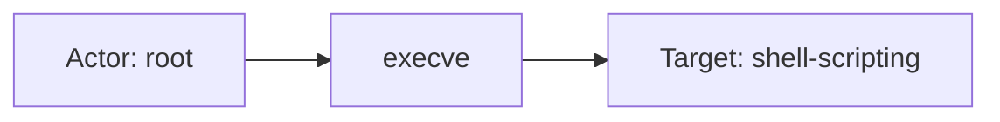
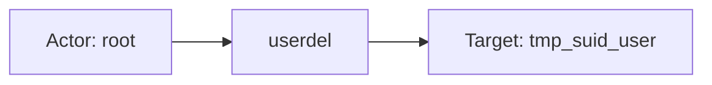
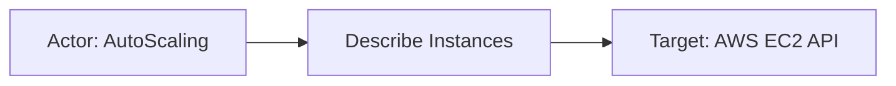

# sysdig

## Product Domain

Sysdig is a cloud-native security platform built on deep container and Kubernetes visibility. Its core technology captures system calls and other telemetry from hosts, containers, and serverless workloads to provide runtime threat detection, forensics, and operational monitoring. Sysdig Secure extends this foundation with cloud security posture management (CSPM), Kubernetes security posture management (KSPM), vulnerability management, and compliance benchmarking across AWS, Azure, GCP, and hybrid environments.

Runtime protection is powered by Falco-compatible policies that detect suspicious process activity, container escapes, credential access, network anomalies, and MITRE ATT&CK–mapped behaviors at the syscall and workload level. Sysdig also ingests cloud audit logs (CloudTrail, GCP Audit Logs, Azure Platform Logs), identity events (Okta), and GitHub activity for agentless threat detection, and supports admission-controller and Kubernetes audit integrations for policy enforcement at deploy time.

From a security operations perspective, Sysdig is a unified CNAPP (Cloud-Native Application Protection Platform) control plane for container and cloud estates. Security teams use it to detect runtime threats in Kubernetes and container workloads, assess cloud misconfigurations against compliance frameworks, prioritize image and host vulnerabilities across pipeline/registry/runtime stages, and correlate alerts with rich workload context (pod, namespace, cluster, image, process tree). Its telemetry is a primary signal for SIEM correlation, threat hunting, vulnerability prioritization, and compliance reporting in cloud-native environments.

## Data Collected (brief)

The integration collects Sysdig logs via Elastic Agent **HTTP Endpoint** (webhook) and **CEL/API** inputs (regional Next Gen and Current APIs, OAuth via API token). Four data streams cover the main Sysdig Secure log types:

| Data stream | Description |
|---|---|
| **alerts** | Runtime and policy alerts pushed via webhook—Falco rule matches, process/container context, Kubernetes labels, cloud metadata, MITRE tags, severity, and policy details |
| **event** | Security events from the Next Gen API—runtime detections (syscall/Falco), cloud audit (CloudTrail, GCP, Azure), identity (Okta), GitHub, admission-controller, and profiling events with process, container, and orchestrator context |
| **cspm** | CSPM compliance results from the Current API—control pass/fail status, severity, resource kind, benchmark policy, remediation metadata, and zone-scoped posture counts |
| **vulnerability** | Vulnerability scan results from the Next Gen API (pipeline, registry, or runtime stage)—image/host metadata, package-vulnerability pairs, CVE/CVSS/EPSS, exploitability, risk accepts, and policy evaluation outcomes |

Events are mapped to ECS fields (process, container, cloud, orchestrator, rule, vulnerability) where applicable, with vendor-specific details retained under `sysdig.*`. Bundled Kibana dashboards visualize security events, alerts, vulnerability findings, and CSPM compliance posture.

## Expected Audit Log Entities

Sysdig Secure does not export a dedicated platform audit log (no console login or API-mutation stream in this integration). The four data streams are **security detections** (`alerts`, `event`), **posture state** (`cspm`), and **vulnerability findings** (`vulnerability`). Runtime syscall/Falco alerts and the Next Gen `event` API carry the richest actor context (OS user, process tree, host, container, Kubernetes). Agentless cloud-audit detections (CloudTrail, GCP Audit Logs, Azure Platform Logs, Okta, GitHub) appear in `event` and webhook `alerts` with principal hints in `message` and vendor `sysdig.*.content.fields.*`, but many cloud principals are not mapped to `user.*`. **No ECS `*.target.*` fields are populated** (`dev/target-fields-audit/out/target_fields_audit.csv` — no rows for this package). **No `destination.user.*` or `destination.host.*` mapping** exists in any pipeline (`destination_identity_hits.csv` — sysdig not listed). Target-fields audit classifies this package as **`moderate_candidate`** with **`fixture_strong=true`** but no pipeline actor/destination identity flags (`dev/target-fields-audit/out/target_enhancement_packages.csv`).

**`event.action` is absent** on all four streams — not present in any `sample_event.json`, `*-expected.json`, or ingest pipeline (`grep event.action` across `packages/sysdig/` returns only `sysdig.event.actions`, a different field). Detection streams carry operation semantics in vendor syscall fields (`evt.type`), cloud API names (`aws.event_name`), and Falco rule names (`rule.name`), but none are copied to `event.action`. CSPM and vulnerability streams are state/finding snapshots with no per-event audit verb.

Evidence: `packages/sysdig/data_stream/*/sample_event.json`, `data_stream/*/_dev/test/pipeline/*-expected.json`, ingest pipelines `alerts/default.yml`, `event/default.yml`, `cspm/default.yml`, `vulnerability/default.yml`.

### Event action (semantic)

Sysdig records **what triggered a detection** (syscall, cloud API call, policy match) and **what Sysdig did in response** (capture), but does not normalize either into ECS `event.action`.

| Action (normalized label) | Classification | Confidence | Evidence | Per-stream notes |
| --- | --- | --- | --- | --- |
| `execve` | detection | high | `sysdig.event.content.fields.evt.type` in `test-event.log-expected.json` (six runtime events); `evt.type=execve` in `message`/`sysdig.content.output` on **`alerts`** fixtures | Underlying Falco/syscall — process execution |
| `open` | detection | high | `evt.type: open` in "Clear Log Activities" fixture (`test-event.log-expected.json`) | File access syscall on `/var/log/enforcer_testjob.log` |
| `dup2` | detection | high | `evt.type=dup2` in **`alerts`** `message`/`output` (reverse-shell fixtures in `test-sysdig.log-expected.json`) | Stdout/stdin redirect — vendor-only on **`alerts`** (not in structured `content.fields`) |
| `DescribeInstances` | api_call | moderate | `rule.name: Describe Instances` on CloudTrail alert (`test-sysdig.log-expected.json`; `event.provider: aws_cloudtrail`); mirrors AWS API name | Agentless cloud-audit detection — API name only in `rule.name`, not `aws.event_name` on **`alerts`** |
| `User Management Event Detected` | detection | high | `rule.name` ← `ruleName` on runtime alert (`test-sysdig.log-expected.json`, `alerts/sample_event.json`) | Falco rule / policy match label — security framing, not syscall name |
| `Clear Log Activities` | detection | high | `rule.name` in `test-event.log-expected.json` | Notable-events policy rule name |
| `capture` | administration | high | `sysdig.event.actions[].type: capture` in `test-event.log-expected.json` | **Sysdig platform response** (forensic capture), not the detected workload action — do not conflate with `event.action` |
| *(no per-event action)* | — | high | `event.kind: state` on **`cspm`**; static `event.category: [configuration]`, `event.type: [info]` (`cspm/default.yml` L298–309) | Posture evaluation snapshot — control pass/fail, not an audit verb |
| *(no per-event action)* | — | high | `event.category: [vulnerability]`, `event.type: [info]` on **`vulnerability`** (`vulnerability/default.yml` L528–535) | Vulnerability finding document — scan stage (`registry`, `runtime`, `pipeline`) is scope, not action |

Do not substitute `event.provider` (`syscall`, `aws_cloudtrail`), `sysdig.event.category` (`runtime`, `remote`), `sysdig.event.type` (`policy`), or `event.category`/`event.type` for `event.action` — they classify event source or ECS taxonomy, not the operation performed.

### Event action (ECS candidates)

| ECS / vendor field | Mapped to `event.action` today? | Mapping correct? | Recommended `event.action` value (from fixtures) | Enhancement candidate? | Evidence |
| --- | --- | --- | --- | --- | --- |
| `event.action` | no | n/a | — | no | Not set in any pipeline or fixture |
| `sysdig.event.content.fields.evt.type` | no | n/a | `execve`, `open` | yes | Vendor syscall name in **`event`** fixtures; retained under vendor namespace (`fields.yml` evt subtree); **`event`** pipeline uses `evt.res` for `event.outcome` only (L321–330) |
| `sysdig.content.fields.evt.type` / `message` `evt.type=` | no | n/a | `execve`, `dup2` | yes | On **`alerts`**, syscall type appears in `message`/`sysdig.content.output` text only — webhook fixture `content.fields` lacks `evt` keys (`test-sysdig.log-expected.json`) |
| `rule.name` ← `ruleName` / `rule_name` | no (maps to `rule.name`) | partial | `User Management Event Detected`, `Describe Instances`, `Clear Log Activities`, `Redirect STDOUT/STDIN to Network Connection in Container` | yes | `alerts/default.yml` L77–78; `event/default.yml` L763–771; populated on all detection fixtures — good **detection-action** candidate but conflates Falco rule label with syscall/API verb |
| `sysdig.event.content.fields.aws.event_name` | no | n/a | *(no CloudTrail fixture)* | yes | Renamed from `eventName` (`event/default.yml` L214–216); canonical CloudTrail API name when agentless cloud events are ingested via **`event`** |
| `sysdig.event.actions[].type` | no | n/a | `capture` | no | Platform forensic response (`event/default.yml` L49–119 → `sysdig.event.actions`); not the detected event action |
| `event.provider` ← `sysdig.source` | no (maps to `event.provider`) | n/a | `syscall`, `aws_cloudtrail` | no | Event **source** channel, not operation verb (`alerts/default.yml` L28–30, `event/default.yml` L1366–1369) |
| `event.outcome` ← `evt.res` | no (maps to `event.outcome`) | yes | `success`, `failure` | no | Result of syscall (`SUCCESS`/`FAILURE`) — outcome, not action (`event/default.yml` L321–330) |
| `event.category` / `event.type` | yes (static/conditional) | partial | `process`, `configuration`, `vulnerability`; `info` | no | ECS taxonomy enrichment — not substitutes for `event.action` |
| `rule.name` ← `sysdig.cspm.control.name` | no (maps to `rule.name`) | partial | `IAM - Defined Users MFA (AWS)` | no | CSPM control identity — posture check label, not audit verb (`cspm/default.yml` L391+) |
| `sysdig.cspm.name` | no (maps to `message`) | n/a | `1.10 Ensure multi-factor authentication (MFA) is enabled…` | no | Benchmark requirement text on **`cspm`** — compliance reference, not action |

**Step 2b — per-stream check:**

| Stream | `event.action` in fixtures? | Pipeline maps to `event.action`? | Primary action candidate | Confidence | Evidence |
| --- | --- | --- | --- | --- | --- |
| `alerts` | no | no | `rule.name` (detection label); alternate: parse `evt.type` from `message`/`sysdig.content.output` | high / moderate | `rule.name` populated on all fixtures; syscall type text-only (`execve`, `dup2`) in `message` |
| `event` | no | no | `sysdig.event.content.fields.evt.type` (runtime); `sysdig.event.content.fields.aws.event_name` (cloud audit) | high / moderate | Structured `evt.type` in six runtime fixtures; `aws.event_name` pipeline support without fixture |
| `cspm` | no | no | *(none — state snapshot)* | high | `event.kind: state`; no vendor operation field |
| `vulnerability` | no | no | *(none — finding snapshot)* | high | `event.category: vulnerability`; scan stage is metadata |

**Recommended enhancement (detection streams):** Copy `sysdig.event.content.fields.evt.type` → `event.action` for runtime **`event`** records; copy `sysdig.event.content.fields.aws.event_name` → `event.action` for cloud-audit **`event`** records; for **`alerts`**, prefer `rule.name` → `event.action` (structured) with optional `evt.type` extraction from `message` as secondary. Keep `rule.name` populated separately — it names the **detection rule**, which differs semantically from the underlying syscall/API verb.

### Actor (semantic)

| Entity | Classification | Entity type (if general) | Confidence | Evidence | Per-stream notes |
| --- | --- | --- | --- | --- | --- |
| Local OS user (runtime) | user | — | high | `user.name`, `user.id`, `user.group.*` ← `sysdig.content.fields.user.*` (`alerts/default.yml`) or `sysdig.event.content.fields.user.*` (`event/default.yml`); `root`/`0` in `alerts/sample_event.json`, `test-sysdig.log-expected.json`, all six runtime fixtures in `test-event.log-expected.json` | **`alerts`**, **`event`** (`event.provider: syscall`) |
| Offending / parent process | general | process | high | `process.name`, `process.executable`, `process.command_line`, `process.pid`, `process.parent.*` (up to four ancestor levels); `sh`/`bash`/`userdel` in `test-event.log-expected.json`; `pname`/`gparent` text in `message` | **`alerts`**, **`event`** — process initiating the suspicious syscall |
| Workload node | host | — | high | `host.name`, `host.hostname`, `host.id`, `host.mac`; `related.hosts` ← labels or `sysdig.machineId`/`sysdig.hostMac` (`alerts/default.yml`, `event/default.yml`); GKE node names in all runtime samples | **`alerts`**, **`event`** |
| Sysdig agent | general | agent | moderate | `agent.id` ← `sysdig.agentId` (`alerts/default.yml`); `58014837` in `test-sysdig.log-expected.json` | **`alerts`** — collector identity, not the security principal |
| CloudTrail / agentless principal (alerts) | user | — | moderate | Principal named in `message` only (e.g. `requesting user=AutoScaling`); **not** mapped to `user.name` (`test-sysdig.log-expected.json`; `event.provider: aws_cloudtrail`, `sysdig.source: aws_cloudtrail`) | **`alerts`** only for CloudTrail fixture; no `source.ip` mapping |
| Cloud audit principal (event API) | user | — | moderate | `sysdig.event.content.fields.aws.user`, `ct.user.value`, `ct.user.accountid`, `sysdig.event.labels.cloud_provider.user` → `related.user` only (`event/default.yml`); pipeline supports but **no CloudTrail/Okta/GitHub fixture** in tests | **`event`** when `event.provider` is `aws_cloudtrail`, `gcp_auditlog`, `azure_platformlogs`, `okta`, `github` |
| Cloud audit source endpoint | host | — | low | `sysdig.event.labels.source.ip` → `source.ip`/`related.ip` when valid IP (`event/default.yml`); `aws.source_ip`/`ct.srcip` → `related.ip` only; CloudTrail alert origin in `message` text (`autoscaling.amazonaws.com`) | **`event`** (labels); **`alerts`** (message text only) |
| CSPM evaluator | service | — | high | Automated posture scan — `observer.vendor: Sysdig`, `observer.product: Sysdig Secure`; `event.kind: state` (`cspm/sample_event.json`, `test-cspm.log-expected.json`) | **`cspm`** — no human actor |
| Vulnerability scanner | service | — | high | `vulnerability.scanner.vendor: Sysdig Secure`; stage in `sysdig.vulnerability.stage` (`registry`, `runtime`, `pipeline` in `test-vulnerability.log-expected.json`) | **`vulnerability`** |
| Image maintainer (build metadata) | user | — | low | `user.name`/`user.domain` dissected from `metadata.labels.maintainer` (`vulnerability/default.yml`); `"NGINX Docker Maintainers"` in `sample_event.json` — build metadata, not scan actor | **`vulnerability`** |

### Actor (ECS candidates)

| ECS / vendor field | Role | Mapped today? | Mapping correct? | Confidence | Evidence |
| --- | --- | --- | --- | --- | --- |
| `user.name`, `user.id`, `user.group.id`, `user.group.name` | Local OS user on runtime detection | yes | yes | high | ← `sysdig.content.fields.user.*` (`alerts/default.yml:187-193`) or `sysdig.event.content.fields.user.*` (`event/default.yml:656-676`); `root`/`0` in fixtures |
| `process.*`, `process.parent.*` | Offending process and ancestor chain | yes | yes | high | ← `proc.*` fields (`alerts/default.yml:155-181`, `event/default.yml:471-633`); full tree in `test-event.log-expected.json` |
| `host.name`, `host.hostname`, `host.id`, `host.mac` | Workload node | yes | yes | high | ← `sysdig.labels.host.hostName`, `sysdig.machineId`, `sysdig.hostMac` (`alerts/default.yml:115-133`, `event/default.yml:1205-1244`) |
| `agent.id` | Sysdig agent | yes | partial | moderate | ← `sysdig.agentId` (`alerts/default.yml:110-113`); collector ID, not security principal |
| `related.user` | Enrichment array for cloud principals | yes | partial | moderate | Appends `aws.user`, `ct.user.value`, `ct.user.accountid`, `labels.cloud_provider.user`, `user.loginname`, `user.loginuid`, `user.name`, `user.uid` (`event/default.yml:237-682`); aggregates actor hints but does not distinguish actor vs target |
| `source.ip` | Cloud-audit request origin | yes (event) | yes | moderate | ← `sysdig.event.labels.source.ip` (`event/default.yml:1287-1291`); not mapped in **`alerts`** pipeline |
| `related.ip` | Source / flow IP enrichment | yes | partial | moderate | ← `aws.source_ip`, `ct.srcip`, `fd.sip`, `labels.source.ip`, sequence `source_ip_address` (`event/default.yml`); network context, not always actor |
| `related.hosts` | Hostname enrichment | yes | partial | moderate | ← `labels.host.host_name`, `ct.request.host` (`event/default.yml:280-285`, `1219-1224`) |
| `cloud.account.id`, `cloud.provider`, `cloud.region`, `cloud.instance.*` | Cloud placement of runtime workload | yes | n/a | moderate | Scope context from labels (`alerts/default.yml:208-262`, `event/default.yml:1045-1203`); not the actor |
| `observer.vendor`, `observer.product` | Sysdig Secure platform | yes | yes | high | Static `Sysdig` / `Sysdig Secure` (`event/default.yml:33-40`, `cspm/default.yml:347-355`, `vulnerability/default.yml:547-555`) |
| `sysdig.content.fields.user.*` / `sysdig.event.content.fields.user.*` | Vendor OS user (canonical) | yes (vendor) | n/a | high | Source for ECS `user.*`; duplicated fields removed post-map (`event/default.yml:1429-1430`) |
| `sysdig.event.content.fields.aws.user`, `.aws.source_ip` | CloudTrail principal / source | yes (vendor) | n/a | moderate | `aws.user` also in `related.user`; no ECS `user.name` copy (`event/default.yml:237-242`) |
| `sysdig.event.content.fields.ct.user.*`, `.ct.srcip` | GCP/Azure/Okta ct.* principal | yes (vendor) | n/a | moderate | → `related.user`/`related.ip` only; not in current test fixtures |
| `sysdig.cspm.control.authors` | Control metadata author string | yes (vendor) | n/a | low | `"Sysdig"` in `test-cspm.log-expected.json` — rule metadata, not acting principal |

### Target (semantic)

| Layer | Description | Entity | Classification | Entity type (if general) | Confidence | Evidence | Per-stream notes |
| --- | --- | --- | --- | --- | --- | --- | --- |
| 1 — Platform / cloud service | Invoked cloud API or identity platform | AWS CloudTrail / EC2 API | service | — | moderate | `event.provider: aws_cloudtrail`; action in `message` ("EC2 instance has been requested", `DescribeInstances` implied); account `414773805239` in `test-sysdig.log-expected.json` | **`alerts`**, **`event`** — agentless cloud-audit detections; `gcp_auditlog`, `azure_platformlogs`, `okta`, `github` supported per `fields.yml` but not fixture-covered |
| 2 — Resource / object | Container/workload under attack | Container / pod | general | container | high | `container.name`, `container.id`, `orchestrator.resource.name`, `container.image.name`; `threatgen`, `shell-scripting`, `cadvisor` in tests | **`alerts`**, **`event`** (runtime) |
| 2 — Resource / object | Node / host path acted upon | Host / mount path | host | — | moderate | `host.name`; sensitive mounts in `sysdig.event.content.fields.container.mounts` and `message` ("Launch Sensitive Mount Container" in `test-event.log-expected.json`) | **`event`** |
| 2 — Resource / object | Local account under modification | OS / IAM user account | user | — | moderate | Account in process args/message (`userdel tmp_suid_user` → `proc.args`/`message` in `test-sysdig.log-expected.json`); CSPM `resource_kind: AWS_USER` in posture tests | **`alerts`**, **`event`** (runtime); **`cspm`** (resource class) |
| 2 — Resource / object | File or FD opened/tampered | File on disk | general | file | moderate | `sysdig.event.content.fields.fd.name` (e.g. `/var/log/enforcer_testjob.log` in "Clear Log Activities" test); **not** mapped to `file.path` | **`event`** |
| 2 — Resource / object | CSPM evaluated resource class | Cloud / K8s / host resource type | general | cloud-resource | high | `sysdig.cspm.control.resource_kind` — `AWS_USER`, `AWS_LAMBDA_FUNCTION`, `microsoft.web/sites`, `storage.googleapis.com/Bucket/IAM_POLICY`, `host`, etc. (`test-cspm.log-expected.json`) | **`cspm`** — aggregate counts only; per-resource IDs via `resource_api_endpoint` URL |
| 2 — Resource / object | CSPM platform scope | Cloud provider / OS target | general | cloud-platform | high | `sysdig.cspm.control.target` — `AWS`, `Azure`, `GCP`, `OCI`, `Linux`, `Kubernetes`, `Windows`, `Docker` (`test-cspm.log-expected.json`) | **`cspm`** — vendor field named `target`; posture scope, not ECS target |
| 2 — Resource / object | Vulnerable asset (image or host) | Container image / VM | general | container-image / host | high | `sysdig.vulnerability.asset_type: containerImage`; `resource.id`/`resource.name`, `host.*`, `cloud.*`, `orchestrator.*` for runtime stage (`vulnerability/default.yml`, `test-vulnerability.log-expected.json`) | **`vulnerability`** |
| 2 — Resource / object | Vulnerable package on asset | Software package | general | software-package | high | `package.name`, `package.version`, `package.path` (e.g. `golang.org/x/net` at `/usr/bin/ctr`) | **`vulnerability`** |
| 3 — Content / artifact | Detection rule / compliance control | Falco rule / CIS control | general | detection-rule | high | `rule.name`, `rule.ruleset`, `rule.description`, `rule.benchmark.name`; MITRE → `threat.technique.*` ("User Management Event Detected", CIS AWS controls in tests) | **`alerts`**, **`event`**, **`cspm`** |
| 3 — Content / artifact | CVE finding | Vulnerability record | general | vulnerability | high | `vulnerability.id`/`vulnerability.cve` (e.g. `CVE-2023-45322`); CVSS under `vulnerability.score.*` | **`vulnerability`** |
| 3 — Content / artifact | Encoded shell / network peer in cmdline | Script payload / remote endpoint | general | script_payload | low | Base64 shell and `0.0.0.0:1337` connect strings in `process.command_line`/`message` (`test-event.log-expected.json`); `fd.sip` → `related.ip` only | **`event`** |

### Target (ECS candidates)

| ECS / vendor field | Layer | Classification | Mapped today? | Mapping correct? | ECS target bucket | Enhancement candidate? | Evidence |
| --- | --- | --- | --- | --- | --- | --- | --- |
| `event.provider` | 1 | service | yes | yes | `service.target.name` | yes | ← `sysdig.source` / `sysdig.event.source`; `aws_cloudtrail`, `syscall`, etc. (`alerts/default.yml:29-30`, `event/default.yml:1366-1369`); identifies invoked platform for agentless detections |
| `container.id`, `container.name`, `container.image.name`, `container.image.hash.all` | 2 | general | yes | yes | `entity.target.id` / `entity.target.name` | yes | Workload under attack (`alerts/default.yml:135-145`, `event/default.yml:243-265`); `threatgen`, `shell-scripting` in fixtures |
| `orchestrator.cluster.name`, `orchestrator.namespace`, `orchestrator.resource.name` | 2 | general | yes | yes | `entity.target.id` | yes | Kubernetes pod scope (`alerts/default.yml:264-278`, `event/default.yml:1246-1274`); `threatgen-c65cf6446-5s8kk` in tests |
| `host.name`, `host.hostname` | 2 | host | yes | partial | `host.target.name` | yes | Node hosting the workload — semantically the attacked host, but mapped as generic `host.*` not `host.target.*` |
| `cloud.account.id`, `cloud.provider`, `cloud.region`, `cloud.instance.*` | — | general | yes | n/a | context-only | no | Cloud placement context (`alerts/default.yml:208-262`); scope, not explicit target entity |
| `sysdig.event.content.fields.fd.name` | 3 | general | yes (vendor) | n/a | context-only | yes | File path target (e.g. `/var/log/enforcer_testjob.log`); vendor-only — **not** mapped to `file.path` |
| `sysdig.event.content.fields.container.mounts` | 2 | host | yes (vendor) | n/a | `host.target.name` | yes | Sensitive mount list in runtime events; vendor-only |
| `sysdig.event.content.fields.aws.event_name` | 2 | general | yes (vendor) | n/a | `entity.target.name` | yes | Cloud API action name; retained under vendor namespace (`fields.yml`); CloudTrail alert action in `message` only for **`alerts`** |
| `sysdig.event.content.resource_kind`, `.resource_name` | 2 | general | yes (vendor) | n/a | `resource.type` / `resource.name` | yes | Renamed from JSON content (`event/default.yml:753-760`); admission/K8s events — not mapped to ECS `resource.*` |
| `sysdig.cspm.control.resource_kind` | 2 | general | yes (vendor) | n/a | `resource.type` | yes | Evaluated resource class (`AWS_USER`, `host`, etc. in `test-cspm.log-expected.json`); listed in `vendor_target_special_cases.csv` |
| `sysdig.cspm.control.target` | 2 | general | yes (vendor) | n/a | context-only | yes | Platform scope (`AWS`, `GCP`, `Kubernetes`, …); vendor field named `target` but posture boundary, not per-resource identity |
| `sysdig.cspm.zone.name` | — | general | yes (vendor) | n/a | context-only | no | Assessment zone boundary (e.g. `"Entire Infrastructure"`) |
| `resource.id`, `resource.name` | 2 | general | yes | yes | `entity.target.id` / `entity.target.name` | yes | ← `sysdig.vulnerability.scope.*` (`vulnerability/default.yml:821-826`); runtime/host-scoped findings |
| `host.*` (vulnerability) | 2 | host | yes | yes | `host.target.name` | yes | Vulnerable host metadata from scan scope (`vulnerability/default.yml:557-616`) |
| `package.name`, `package.version`, `package.path` | 2 | general | yes | yes | context-only | no | Vulnerable package on asset — finding detail, not the primary audit target |
| `vulnerability.id`, `vulnerability.cve`, `vulnerability.score.*` | 3 | general | yes | yes | context-only | no | CVE record on the asset |
| `rule.name`, `rule.id`, `rule.benchmark.name`, `rule.description` | 3 | general | yes | yes | context-only | no | Detection/compliance rule that fired |
| `sysdig.vulnerability.package.vulnerability.risk_accepts[].entity_type` / `.entity_value` | 2 | general | yes (vendor) | n/a | `entity.target.name` | yes | Risk-accept exception scope (e.g. `imageName: nginx:latest` in tests) |
| `related.ip` (`fd.sip`, encoded cmdline peers) | 3 | host | yes | partial | context-only | no | Network peer hints; `related.ip` only — ambiguous actor vs target |

### Gaps and mapping notes

- **`event.action` gap on all streams:** No pipeline maps vendor operation fields to `event.action`. Best candidates: **`event`** runtime → `sysdig.event.content.fields.evt.type` (`execve`, `open`); **`event`** cloud audit → `sysdig.event.content.fields.aws.event_name`; **`alerts`** → `rule.name` (structured) or `evt.type` parsed from `message` (text-only). `sysdig.event.actions.type: capture` is Sysdig's forensic response — not a candidate for `event.action`. Do not map `event.provider`, `event.category`, or `event.type` as action substitutes.
- **No ECS `user.target.*`, `host.target.*`, `service.target.*`, or `entity.target.*`** — target-fields audit confirms zero official target fields; enhancement priority is **`moderate_candidate`** with strong fixtures but no pipeline destination-identity mappings.
- **No `destination.user.*` or `destination.host.*`** anywhere in the package — sysdig absent from `destination_identity_hits.csv`. Do not expect de-facto target user/host under `destination.*`.
- **Cloud audit principals on `alerts`** appear only in `message` text (`requesting user=AutoScaling`); the alerts pipeline does not map to `user.*` or `source.ip`. The **`event`** pipeline maps cloud principals to `related.user` only — enhancement candidate for `user.id`/`user.name` from `sysdig.event.content.fields.aws.user` and `ct.user.*`.
- **`related.user` conflates actor and enrichment** — OS user (`user.name`), login UID, and cloud principals all append to the same array; cannot distinguish actor from target user without field-level logic.
- **`host.name` on runtime events** identifies the node hosting the workload (context for both actor-side process execution and target-side attacked host) — semantically overloaded; `host.target.name` would clarify target role.
- **`sysdig.cspm.control.target`** is a vendor posture-scope field (AWS/GCP/K8s platform), not an ECS target entity — listed in `vendor_target_special_cases.csv` as `entity_target_generic`.
- **CSPM per-resource IDs** are not inline — only `objects_count` aggregates and `resource_api_endpoint` URLs; individual failing resources require a separate API call.
- **File targets** (`fd.name`) and **K8s admission resources** (`resource_kind`/`resource_name`) remain vendor-only — best enhancement sources for `file.path` and `resource.*`.
- **Image maintainer → `user.name`** on vulnerability events is build metadata dissected from OCI labels, not the scan actor — do not treat as security principal.
- **`agent.id` / `observer.*`** represent Sysdig collector/platform identity, not the event actor or target.

### Per-stream notes

#### `alerts` (webhook)

Webhook-delivered runtime and agentless detections. Runtime (`event.provider: syscall`) maps OS user and process actor to ECS; CloudTrail alert (`event.provider: aws_cloudtrail`) carries principal in `message` only. **`event.action` absent** — primary action candidate is `rule.name` (e.g. `User Management Event Detected`, `Describe Instances`); syscall type (`execve`, `dup2`) appears only in `message`/`sysdig.content.output` text. Primary targets are the container/pod (`container.*`, `orchestrator.*`) and implied cloud API action (Layer 1 via `event.provider`).

#### `event` (Next Gen API)

Superset of detection types including runtime syscall, cloud audit, Okta, GitHub, admission-controller. Richest pipeline: full `process.*` tree, `source.ip` from labels, cloud principals in `related.user`. Six runtime fixtures in `test-event.log-expected.json`; no CloudTrail/Okta/GitHub fixtures. **`event.action` absent** — structured `sysdig.event.content.fields.evt.type` (`execve`, `open`) is the best runtime candidate; `aws.event_name` supported in pipeline for cloud audit. `sysdig.event.content.fields.fd.name` holds file-target paths; `resource_kind`/`resource_name` for K8s admission events stay vendor-only. `sysdig.event.actions[].type: capture` records Sysdig forensic capture metadata.

#### `cspm` (Current API)

Posture **state** events (`event.kind: state`), not per-action audit. **Service** actor (Sysdig scanner). **No per-event action** — `rule.name` identifies the compliance control (`IAM - Defined Users MFA (AWS)`), not an operation verb. Targets are resource **classes** (`control.resource_kind`) and platform scope (`control.target`), not individual resource IDs. Compliance control → `rule.*`.

#### `vulnerability` (Next Gen API)

Automated scan findings. **Service** actor (`vulnerability.scanner.vendor`). **No per-event action** — `event.category: vulnerability` classifies the document; `sysdig.vulnerability.stage` (`registry`, `runtime`, `pipeline`) is scan scope. Primary target is the vulnerable asset (`resource.*`, `host.*`, `container.image.*`, `orchestrator.*` by stage). Package and CVE are finding details on that asset. Optional `user.name` from image maintainer label is build metadata only.

## Example Event Graph

Examples below come from the **`event`** (Next Gen API) and **`alerts`** (webhook) detection streams. These are runtime and agentless **security detections**, not Sysdig console audit logs. **`event.action` is absent** on all fixtures — actions are derived from vendor syscall or rule fields. The **`cspm`** and **`vulnerability`** streams are posture/finding state snapshots with no per-event Actor → action → Target chain.

### Example 1: Runtime shell execution in container

**Stream:** `sysdig.event` · **Fixture:** `packages/sysdig/data_stream/event/_dev/test/pipeline/test-event.log-expected.json`

```
OS user root → execve → container shell-scripting
```

#### Actor

| Field | Value |
| --- | --- |
| id | 0 |
| name | root |
| type | user |

**Field sources:**
- `id` ← `user.id` (`sysdig.event.content.fields.user.uid`)
- `name` ← `user.name` (`sysdig.event.content.fields.user.name`)

#### Event action

| Field | Value |
| --- | --- |
| action | execve |
| source_field | `sysdig.event.content.fields.evt.type` |
| source_value | execve |

**Not mapped to ECS `event.action` today.**

#### Target

| Field | Value |
| --- | --- |
| id | shell-scripting-abcdef12-12345 |
| name | shell-scripting |
| type | general |
| sub_type | container |

**Field sources:**
- `id` ← `orchestrator.resource.name`
- `name` ← `container.name` (`sysdig.event.content.fields.container.name`)

#### Mermaid (optional)



### Example 2: User account deletion in workload

**Stream:** `sysdig.alerts` · **Fixture:** `packages/sysdig/data_stream/alerts/_dev/test/pipeline/test-sysdig.log-expected.json`

```
OS user root → userdel → local account (tmp_suid_user)
```

#### Actor

| Field | Value |
| --- | --- |
| id | 0 |
| name | root |
| type | user |

**Field sources:**
- `id` ← `sysdig.content.fields.user.uid`
- `name` ← `sysdig.content.fields.user.name`

#### Event action

| Field | Value |
| --- | --- |
| action | userdel |
| source_field | `sysdig.content.fields.proc.name` |
| source_value | userdel |

**Not mapped to ECS `event.action` today.** Falco rule `User Management Event Detected` (`rule.name`) wraps this syscall; container `threatgen` is runtime scope, not the acted-upon account.

#### Target

| Field | Value |
| --- | --- |
| name | tmp_suid_user |
| type | user |
| sub_type | local_account |

**Field sources:**
- `name` ← `sysdig.content.fields.proc.cmdline` (`userdel tmp_suid_user`); also in `message` (`proc.args=tmp_suid_user`)

**Scope context (not target):** container `threatgen` (`container.id: 6949e5f10829`, `orchestrator.resource.name: threatgen-c65cf6446-5s8kk`); parent process `pwsh` in `message`.

#### Mermaid (optional)



### Example 3: CloudTrail EC2 describe call

**Stream:** `sysdig.alerts` · **Fixture:** `packages/sysdig/data_stream/alerts/_dev/test/pipeline/test-sysdig.log-expected.json`

```
IAM principal AutoScaling → Describe Instances → AWS EC2 API
```

#### Actor

| Field | Value |
| --- | --- |
| name | AutoScaling |
| type | user |
| sub_type | service_account |

**Field sources:**
- `name` ← `message` (`requesting user=AutoScaling`) — principal not mapped to `user.name`

#### Event action

| Field | Value |
| --- | --- |
| action | Describe Instances |
| source_field | `rule.name` |
| source_value | Describe Instances |

**Not mapped to ECS `event.action` today.**

#### Target

| Field | Value |
| --- | --- |
| id | 414773805239 |
| name | aws_cloudtrail |
| type | service |
| sub_type | cloud_api |

**Field sources:**
- `id` ← `cloud.account.id` (`sysdig.labels.cloudProvider.account.id`)
- `name` ← `event.provider` (`sysdig.source: aws_cloudtrail`) — EC2 `DescribeInstances` implied in `message`

#### Mermaid (optional)



## ES|QL Entity Extraction

**Package type: agent-backed** (Elastic Agent HTTP endpoint + CEL/API). Router: **`data_stream.dataset`** (`sysdig.alerts`, `sysdig.event`, `sysdig.cspm`, `sysdig.vulnerability` from `manifest.yml`). **`sysdig.event`** and **`sysdig.alerts`** are security detections with runtime OS-user actors and container/cloud targets; **`sysdig.cspm`** and **`sysdig.vulnerability`** are automated scanner posture/finding snapshots. No ECS `*.target.*` fields are populated at ingest today — Pass 4 is fill-gaps-only enrichment. Detection flags (`actor_exists`, `target_exists`, `action_exists`) run first for query semantics; **mapped columns use column-level preserve** (`<col> IS NOT NULL`), not `CASE(actor_exists, <col>, …)` / `CASE(target_exists, <col>, …)` — e.g. populated `service.name` must not block `user.id` ← `sysdig.content.fields.user.uid` on **`sysdig.alerts`**. `actor_exists` uses the standard user/host/service/entity predicate (not `process.*`); runtime **`sysdig.alerts`** may need vendor `sysdig.content.fields.user.*` fallback when ECS `user.*` is absent in fixtures. **ES|QL `CASE` arity:** arguments are **(condition, value)** pairs; odd count → last arg is default — not **4-arg** `CASE(col IS NOT NULL, col, vendor_field, null)` (3rd arg is a **condition**, not fallback). **Pass 4 (tautology cleanup):** no `CASE(col, col, …)` fallback branches — **`sysdig.event`** runtime `user.id` / `user.name` and **`host.name` / `host.id`** on detection streams are **ingest-only — no ES|QL** (`event/default.yml`, `alerts/default.yml`); **`sysdig.alerts`** keeps vendor `sysdig.content.fields.user.*` only when indexed `user.*` is empty.

### Dataset inventory

| data_stream.dataset | Stream role | Actor classification(s) | Target classification(s) | Extraction |
| --- | --- | --- | --- | --- |
| `sysdig.event` | runtime / cloud detections (Next Gen API) | user, host | general (container, file), host, service | full |
| `sysdig.alerts` | webhook detections | user, host | general (container), service | full |
| `sysdig.cspm` | posture state (Current API) | service | general (resource class) | partial |
| `sysdig.vulnerability` | CVE findings (Next Gen API) | service | general (asset), host | partial |

### Field mapping plan

#### Actor mappings

| Output column | Source field(s) | Condition (dataset + optional) | Confidence | Notes |
| --- | --- | --- | --- | --- |
| `user.id` | `user.id` | `data_stream.dataset == "sysdig.event" AND event.provider == "syscall"` | high | **ingest-only — no ES\|QL** — `sysdig.event.content.fields.user.uid` → `user.id` at ingest |
| `user.id` | `sysdig.content.fields.user.uid` | `data_stream.dataset == "sysdig.alerts" AND event.provider == "syscall"` | medium | **vendor fallback** when `user.id` empty — `sample_event.json` may omit ECS `user.*` |
| `user.name` | `user.name` | `data_stream.dataset == "sysdig.event" AND event.provider == "syscall"` | high | **ingest-only — no ES\|QL** — `sysdig.event.content.fields.user.name` → `user.name` at ingest |
| `user.name` | `sysdig.content.fields.user.name` | `data_stream.dataset == "sysdig.alerts" AND event.provider == "syscall"` | medium | **vendor fallback** when `user.name` empty |
| `host.name` | `host.name` | `data_stream.dataset IN ("sysdig.event", "sysdig.alerts")` | high | **ingest-only — no ES\|QL** — labels / `sysdig.machineId` at ingest |
| `host.id` | `host.id` | `data_stream.dataset IN ("sysdig.event", "sysdig.alerts")` | high | **ingest-only — no ES\|QL** |
| `host.ip` | `source.ip` | `data_stream.dataset == "sysdig.event" AND source.ip IS NOT NULL` | medium | cloud-audit request origin (`event/default.yml`) |
| `service.name` | `"Sysdig Secure"` | `data_stream.dataset IN ("sysdig.cspm", "sysdig.vulnerability")` | high | **semantic literal** — scanner actor |

#### Target mappings

| Output column | Source field(s) | Condition (dataset + optional) | Confidence | Notes |
| --- | --- | --- | --- | --- |
| `entity.target.id` | `container.id` | `data_stream.dataset IN ("sysdig.event", "sysdig.alerts") AND container.id IS NOT NULL` | high | workload under attack |
| `entity.target.id` | `orchestrator.resource.name` | `data_stream.dataset == "sysdig.event" AND container.id IS NULL AND orchestrator.resource.name IS NOT NULL` | high | pod scope when `container.id` absent (Example 1) |
| `entity.target.id` | `resource.id` | `data_stream.dataset == "sysdig.vulnerability"` | high | vulnerable asset scope |
| `entity.target.id` | `cloud.account.id` | `data_stream.dataset == "sysdig.alerts" AND event.provider == "aws_cloudtrail"` | high | cloud account scope (Example 3) |
| `entity.target.name` | `container.name` | `data_stream.dataset IN ("sysdig.event", "sysdig.alerts") AND container.name IS NOT NULL` | high | pass-through / fixture |
| `entity.target.name` | `sysdig.content.fields.container.name` | `data_stream.dataset == "sysdig.alerts" AND container.name IS NULL` | medium | **vendor fallback** |
| `entity.target.name` | `orchestrator.resource.name` | `data_stream.dataset IN ("sysdig.event", "sysdig.alerts") AND orchestrator.resource.name IS NOT NULL` | high | K8s pod name |
| `entity.target.name` | `sysdig.event.content.fields.fd.name` | `data_stream.dataset == "sysdig.event" AND sysdig.event.content.fields.fd.name IS NOT NULL` | high | file path target ("Clear Log Activities") |
| `entity.target.type` | `"container"` | `data_stream.dataset IN ("sysdig.event", "sysdig.alerts") AND (container.id IS NOT NULL OR container.name IS NOT NULL)` | high | classification helper |
| `entity.target.type` | `sysdig.cspm.control.resource_kind` | `data_stream.dataset == "sysdig.cspm"` | high | evaluated resource class (`AWS_USER`, …) |
| `entity.target.type` | `"container-image"` / `"host"` | `data_stream.dataset == "sysdig.vulnerability" AND sysdig.vulnerability.asset_type == "containerImage"` / `== "host"` | high | asset type discriminator |
| `host.target.name` | `host.name` | `data_stream.dataset IN ("sysdig.event", "sysdig.vulnerability") AND host.name IS NOT NULL` | medium | attacked / vulnerable host |
| `service.target.name` | `event.provider` | `data_stream.dataset IN ("sysdig.event", "sysdig.alerts") AND event.provider == "aws_cloudtrail"` | high | cloud API platform (Example 3 — not self-referential actor) |
| `service.target.id` | `cloud.account.id` | `data_stream.dataset == "sysdig.alerts" AND event.provider == "aws_cloudtrail" AND cloud.account.id IS NOT NULL` | high | ties service target to account |

#### Event action mappings

| Output column | Source field(s) | Condition (dataset + optional) | Confidence | Notes |
| --- | --- | --- | --- | --- |
| `event.action` | `sysdig.event.content.fields.evt.type` | `data_stream.dataset == "sysdig.event" AND event.provider == "syscall"` | high | runtime syscall (`execve`, `open`) |
| `event.action` | `sysdig.event.content.fields.aws.event_name` | `data_stream.dataset == "sysdig.event" AND event.provider == "aws_cloudtrail"` | medium | pipeline support; no CloudTrail fixture |
| `event.action` | `rule.name` | `data_stream.dataset IN ("sysdig.event", "sysdig.alerts")` | high | detection label / Falco rule name |
| `event.action` | `process.name` | `data_stream.dataset == "sysdig.alerts" AND event.provider == "syscall" AND process.name IS NOT NULL` | medium | syscall verb when `rule.name` is generic (e.g. `userdel`) |

### Detection flags (mandatory — run first)

`actor_exists` omits `process.*` so cloud-audit alerts without ECS `user.*` still qualify for vendor-less gaps. No indexed `*.target.*` today — `target_exists` is typically false until ingest enhancement. **Actor/target/action `EVAL` blocks use column-level preserve** (`<col> IS NOT NULL`) — not `CASE(actor_exists, <col>, …)` / `CASE(target_exists, <col>, …)` — so one populated sibling column does not block fallbacks on empty columns (Pass 4 §10).

```esql
| EVAL
  actor_exists = user.id IS NOT NULL OR user.name IS NOT NULL OR user.email IS NOT NULL
    OR host.id IS NOT NULL OR host.ip IS NOT NULL OR host.name IS NOT NULL
    OR service.id IS NOT NULL OR service.name IS NOT NULL
    OR entity.id IS NOT NULL OR entity.name IS NOT NULL,
  target_exists = user.target.id IS NOT NULL OR user.target.name IS NOT NULL OR user.target.email IS NOT NULL
    OR host.target.id IS NOT NULL OR host.target.ip IS NOT NULL OR host.target.name IS NOT NULL
    OR service.target.id IS NOT NULL OR service.target.name IS NOT NULL
    OR entity.target.id IS NOT NULL OR entity.target.name IS NOT NULL,
  action_exists = event.action IS NOT NULL
```

### Combined ES|QL — actor fields

```esql
| EVAL
  user.id = CASE(
    user.id IS NOT NULL, user.id,
    data_stream.dataset == "sysdig.alerts" AND event.provider == "syscall", sysdig.content.fields.user.uid,
    null
  ),
  user.name = CASE(
    user.name IS NOT NULL, user.name,
    data_stream.dataset == "sysdig.alerts" AND event.provider == "syscall", sysdig.content.fields.user.name,
    null
  ),
  host.ip = CASE(
    host.ip IS NOT NULL, host.ip,
    data_stream.dataset == "sysdig.event" AND source.ip IS NOT NULL, source.ip,
    null
  ),
  service.name = CASE(
    service.name IS NOT NULL, service.name,
    data_stream.dataset IN ("sysdig.cspm", "sysdig.vulnerability"), "Sysdig Secure",
    null
  )
```

### Combined ES|QL — event action

```esql
| EVAL
  event.action = CASE(
    event.action IS NOT NULL, event.action,
    data_stream.dataset == "sysdig.event" AND event.provider == "syscall" AND sysdig.event.content.fields.evt.type IS NOT NULL, sysdig.event.content.fields.evt.type,
    data_stream.dataset == "sysdig.event" AND event.provider == "aws_cloudtrail" AND sysdig.event.content.fields.aws.event_name IS NOT NULL, sysdig.event.content.fields.aws.event_name,
    data_stream.dataset IN ("sysdig.event", "sysdig.alerts") AND rule.name IS NOT NULL, rule.name,
    data_stream.dataset == "sysdig.alerts" AND event.provider == "syscall" AND process.name IS NOT NULL, process.name,
    null
  )
```

### Combined ES|QL — target fields

```esql
| EVAL
  entity.target.id = CASE(
    entity.target.id IS NOT NULL, entity.target.id,
    data_stream.dataset IN ("sysdig.event", "sysdig.alerts") AND container.id IS NOT NULL, container.id,
    data_stream.dataset == "sysdig.event" AND orchestrator.resource.name IS NOT NULL, orchestrator.resource.name,
    data_stream.dataset == "sysdig.vulnerability", resource.id,
    data_stream.dataset == "sysdig.alerts" AND event.provider == "aws_cloudtrail", cloud.account.id,
    null
  ),
  entity.target.name = CASE(
    entity.target.name IS NOT NULL, entity.target.name,
    data_stream.dataset IN ("sysdig.event", "sysdig.alerts") AND container.name IS NOT NULL, container.name,
    data_stream.dataset == "sysdig.alerts" AND sysdig.content.fields.container.name IS NOT NULL, sysdig.content.fields.container.name,
    data_stream.dataset IN ("sysdig.event", "sysdig.alerts") AND orchestrator.resource.name IS NOT NULL, orchestrator.resource.name,
    data_stream.dataset == "sysdig.event" AND sysdig.event.content.fields.fd.name IS NOT NULL, sysdig.event.content.fields.fd.name,
    null
  ),
  entity.target.type = CASE(
    entity.target.type IS NOT NULL, entity.target.type,
    data_stream.dataset IN ("sysdig.event", "sysdig.alerts") AND (container.id IS NOT NULL OR container.name IS NOT NULL), "container",
    data_stream.dataset == "sysdig.cspm", sysdig.cspm.control.resource_kind,
    data_stream.dataset == "sysdig.vulnerability" AND sysdig.vulnerability.asset_type == "containerImage", "container-image",
    data_stream.dataset == "sysdig.vulnerability" AND sysdig.vulnerability.asset_type == "host", "host",
    null
  ),
  host.target.name = CASE(
    host.target.name IS NOT NULL, host.target.name,
    data_stream.dataset IN ("sysdig.event", "sysdig.vulnerability") AND host.name IS NOT NULL, host.name,
    null
  ),
  service.target.name = CASE(
    service.target.name IS NOT NULL, service.target.name,
    data_stream.dataset IN ("sysdig.event", "sysdig.alerts") AND event.provider == "aws_cloudtrail", event.provider,
    null
  ),
  service.target.id = CASE(
    service.target.id IS NOT NULL, service.target.id,
    data_stream.dataset == "sysdig.alerts" AND event.provider == "aws_cloudtrail" AND cloud.account.id IS NOT NULL, cloud.account.id,
    null
  )
```

### Full pipeline fragment (optional)

```esql
FROM logs-*
| EVAL
  actor_exists = user.id IS NOT NULL OR user.name IS NOT NULL OR user.email IS NOT NULL
    OR host.id IS NOT NULL OR host.ip IS NOT NULL OR host.name IS NOT NULL
    OR service.id IS NOT NULL OR service.name IS NOT NULL
    OR entity.id IS NOT NULL OR entity.name IS NOT NULL,
  target_exists = user.target.id IS NOT NULL OR user.target.name IS NOT NULL OR user.target.email IS NOT NULL
    OR host.target.id IS NOT NULL OR host.target.ip IS NOT NULL OR host.target.name IS NOT NULL
    OR service.target.id IS NOT NULL OR service.target.name IS NOT NULL
    OR entity.target.id IS NOT NULL OR entity.target.name IS NOT NULL,
  action_exists = event.action IS NOT NULL
| EVAL
  user.id = CASE(
    user.id IS NOT NULL, user.id,
    data_stream.dataset == "sysdig.alerts" AND event.provider == "syscall", sysdig.content.fields.user.uid,
    null
  ),
  user.name = CASE(
    user.name IS NOT NULL, user.name,
    data_stream.dataset == "sysdig.alerts" AND event.provider == "syscall", sysdig.content.fields.user.name,
    null
  ),
  host.ip = CASE(
    host.ip IS NOT NULL, host.ip,
    data_stream.dataset == "sysdig.event" AND source.ip IS NOT NULL, source.ip,
    null
  ),
  service.name = CASE(
    service.name IS NOT NULL, service.name,
    data_stream.dataset IN ("sysdig.cspm", "sysdig.vulnerability"), "Sysdig Secure",
    null
  ),
  event.action = CASE(
    event.action IS NOT NULL, event.action,
    data_stream.dataset == "sysdig.event" AND event.provider == "syscall" AND sysdig.event.content.fields.evt.type IS NOT NULL, sysdig.event.content.fields.evt.type,
    data_stream.dataset == "sysdig.event" AND event.provider == "aws_cloudtrail" AND sysdig.event.content.fields.aws.event_name IS NOT NULL, sysdig.event.content.fields.aws.event_name,
    data_stream.dataset IN ("sysdig.event", "sysdig.alerts") AND rule.name IS NOT NULL, rule.name,
    data_stream.dataset == "sysdig.alerts" AND event.provider == "syscall" AND process.name IS NOT NULL, process.name,
    null
  ),
  entity.target.id = CASE(
    entity.target.id IS NOT NULL, entity.target.id,
    data_stream.dataset IN ("sysdig.event", "sysdig.alerts") AND container.id IS NOT NULL, container.id,
    data_stream.dataset == "sysdig.event" AND orchestrator.resource.name IS NOT NULL, orchestrator.resource.name,
    data_stream.dataset == "sysdig.vulnerability", resource.id,
    data_stream.dataset == "sysdig.alerts" AND event.provider == "aws_cloudtrail", cloud.account.id,
    null
  ),
  entity.target.name = CASE(
    entity.target.name IS NOT NULL, entity.target.name,
    data_stream.dataset IN ("sysdig.event", "sysdig.alerts") AND container.name IS NOT NULL, container.name,
    data_stream.dataset == "sysdig.alerts" AND sysdig.content.fields.container.name IS NOT NULL, sysdig.content.fields.container.name,
    data_stream.dataset IN ("sysdig.event", "sysdig.alerts") AND orchestrator.resource.name IS NOT NULL, orchestrator.resource.name,
    data_stream.dataset == "sysdig.event" AND sysdig.event.content.fields.fd.name IS NOT NULL, sysdig.event.content.fields.fd.name,
    null
  ),
  entity.target.type = CASE(
    entity.target.type IS NOT NULL, entity.target.type,
    data_stream.dataset IN ("sysdig.event", "sysdig.alerts") AND (container.id IS NOT NULL OR container.name IS NOT NULL), "container",
    data_stream.dataset == "sysdig.cspm", sysdig.cspm.control.resource_kind,
    data_stream.dataset == "sysdig.vulnerability" AND sysdig.vulnerability.asset_type == "containerImage", "container-image",
    data_stream.dataset == "sysdig.vulnerability" AND sysdig.vulnerability.asset_type == "host", "host",
    null
  ),
  host.target.name = CASE(
    host.target.name IS NOT NULL, host.target.name,
    data_stream.dataset IN ("sysdig.event", "sysdig.vulnerability") AND host.name IS NOT NULL, host.name,
    null
  ),
  service.target.name = CASE(
    service.target.name IS NOT NULL, service.target.name,
    data_stream.dataset IN ("sysdig.event", "sysdig.alerts") AND event.provider == "aws_cloudtrail", event.provider,
    null
  ),
  service.target.id = CASE(
    service.target.id IS NOT NULL, service.target.id,
    data_stream.dataset == "sysdig.alerts" AND event.provider == "aws_cloudtrail" AND cloud.account.id IS NOT NULL, cloud.account.id,
    null
  )
| KEEP @timestamp, data_stream.dataset, event.provider, event.action, user.id, user.name, host.ip, service.name, entity.target.id, entity.target.name, host.target.name, service.target.name
```

### Streams excluded

- None — all four datasets receive at least partial extraction. **`sysdig.cspm`** does not populate per-resource IDs (only `sysdig.cspm.control.resource_kind` class + platform scope).

### Gaps and limitations

- **Cloud audit actor on `sysdig.alerts`** — principal only in `message` (`requesting user=AutoScaling`); no `user.name` fallback without regex parse.
- **`user.target.*` for account-management events** — `tmp_suid_user` is in `proc.cmdline` / `message` only (Example 2); omit `user.target.name` until ingest maps `proc.args`.
- **`related.user` conflation** on **`sysdig.event`** — not used as actor or target source.
- **`sysdig.event.actions[].type: capture`** — Sysdig forensic response; excluded from `event.action`.
- **Image maintainer → `user.name` on `sysdig.vulnerability`** — build metadata from OCI labels; excluded from actor EVAL.
- **`sysdig.cspm.control.target`** — posture platform scope (`AWS`, `Kubernetes`), not per-resource ECS target identity.
- **CloudTrail `aws.event_name` on `sysdig.event`** — pipeline field exists; no fixture — medium confidence only.
- **Pass 4 tautology cleanup** — `user.id` / `user.name` on **`sysdig.event`** and `host.name` / `host.id` on detection streams are ingest-only; actor `EVAL` keeps **`sysdig.alerts`** vendor `sysdig.content.fields.user.*`, `host.ip` ← `source.ip`, and scanner `service.name` literal only.
- **Pass 4 CASE syntax** — mapped columns use column-level `IS NOT NULL` preserve (not `CASE(actor_exists, …)` / `CASE(target_exists, …)`); detection flags remain for documentation and optional downstream filters.
