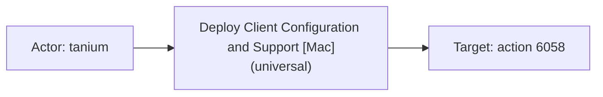
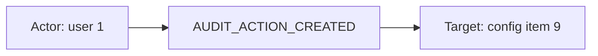
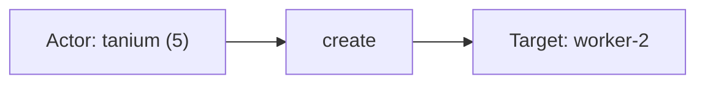

# tanium

## Product Domain (Tanium endpoint management)

Tanium is an enterprise endpoint management and security platform that gives IT and security teams real-time visibility and control over endpoints at scale—from laptops and servers to cloud workloads. The platform uses a distributed architecture built around Tanium Clients installed on managed endpoints and a central Tanium Server that coordinates questions, actions, and reporting across the fleet. Unlike traditional polling-based management tools, Tanium's linear chain model propagates queries and results peer-to-peer, enabling sub-minute visibility across millions of endpoints with minimal infrastructure.

Core capabilities span endpoint inventory and health monitoring, software deployment and patching, configuration management, asset discovery, and integrated security modules such as Tanium Threat Response for detection and response. Administrators define packages and actions to run commands or deploy software on targeted endpoint groups; sensor data and client status reflect whether endpoints are registered, communicating, and healthy. Tanium Connect exports platform data to external destinations (HTTP, TCP, AWS S3) in JSON format, enabling downstream SIEM and analytics pipelines.

From a security operations perspective, Tanium telemetry supports endpoint fleet visibility, change auditing, threat detection correlation, and investigation of endpoint activity. Security teams use action history to audit administrative operations, client status to monitor agent health and connectivity, Discover data to track managed and unmanaged assets, endpoint configuration changes for compliance, reporting for inventory summaries, and Threat Response events for detections with process, file, and intel match context.

The Elastic Tanium integration ingests Tanium Connect exports via Elastic Agent using TCP, HTTP endpoint, AWS S3 polling, or AWS S3/SQS notification modes. Events are normalized into ECS-aligned fields with vendor-specific details under `tanium.*`, and bundled Kibana dashboards cover each data stream.

## Data Collected (brief)

The integration collects Tanium Connect JSON logs into six data streams:

- **Action History** (`tanium.action_history`): Records of Tanium actions/packages deployed to endpoints—action ID and name, issuer, approver, command line, package name, status, and start/expiration timestamps.
- **Client Status** (`tanium.client_status`): Tanium client registration and connectivity state per endpoint—hostname, computer ID, client version, leader/follower status, TLS registration, network locations, and last registration time.
- **Discover** (`tanium.discover`): Asset discovery records for managed and unmanaged hosts—IP/MAC addresses, hostname, OS, open ports, discovery method flags (ARP, ping, nmap, AWS API), managed/unmanageable status, and Tanium computer ID.
- **Endpoint Config** (`tanium.endpoint_config`): Audit events for endpoint configuration changes—action type (e.g., created/updated), config item domain/category/ID, manifest revisions, and acting user.
- **Reporting** (`tanium.reporting`): Inventory/reporting snapshots per computer—hostname, OS platform and version, hardware manufacturer/model, virtualization details, and count metrics.
- **Threat Response** (`tanium.threat_response`): Security detection and response events—event name/ID, severity/priority, affected host, user context, and rich match details including process trees, file hashes, intel/threat IDs, and recorder activity.

All streams support ingestion via **TCP**, **HTTP endpoint**, **AWS S3**, or **AWS S3/SQS** (default S3 bucket prefixes: `action_history`, `client_status`, `discover`, `endpoint_config`, `reporting`, `threat_response`).

## Expected Audit Log Entities

Tanium Connect exports span six data streams that mix **administrative audit records** (`action_history`, `endpoint_config`), **endpoint state/inventory snapshots** (`client_status`, `discover`, `reporting`), and **security detections / TR platform events** (`threat_response`). Only the first two plus parts of `threat_response` carry explicit acting principals; the inventory streams describe managed or discovered endpoints without naming who initiated the Connect export. The integration maps actors and subjects to ECS where pipelines support it; most Tanium-specific identifiers remain under `tanium.*`.

**No ECS `user.target.*`, `host.target.*`, `service.target.*`, or `entity.target.*` fields are populated** (`dev/target-fields-audit/out/target_fields_audit.csv` — no rows for this package). The package does **not** use `destination.user.*` or `destination.host.*` de-facto targets (absent from `destination_identity_hits.csv`). Target-fields audit classifies this package as **`moderate_candidate`** with **`pipeline_actor=true`**, **`pipeline_entity_other=true`**, and **`fixture_strong=true`** (`dev/target-fields-audit/out/target_enhancement_packages.csv`).

**Event action:** `event.action` is populated on **`action_history`**, **`endpoint_config`**, and **TR DB-style rows** on `threat_response` (`create`, `update`, `throttle`). It is **absent** on `threat_response` detection/alert exports (`detect.unmatch`, alert rows), and on all three inventory/state streams (`client_status`, `discover`, `reporting`). Primary gaps: `Event Name` on TR detection exports and `Other Parameters` signal `name` are not copied to `event.action`.

Evidence: all six `packages/tanium/data_stream/*/sample_event.json` files; pipeline fixtures `test-action-history.log-expected.json`, `test-client-status.log-expected.json`, `test-discover.log-expected.json`, `test-endpoint-config.log-expected.json`, `test-reporting.log-expected.json`, `test-threat-response.log-expected.json`, `test-new-default.log-expected.json`, `test-deep.log-expected.json`, `test-match-details-empty-map-value.log-expected.json`; ingest pipelines under `data_stream/*/elasticsearch/ingest_pipeline/`.

### Event action (semantic)

| Action (normalized label) | Classification | Confidence | Evidence | Per-stream notes |
| --- | --- | --- | --- | --- |
| Deploy Tanium action/package | administration | high | `event.action`: `Deploy Client Configuration and Support [Mac](universal)` ← `ActionName` (`action_history/sample_event.json`; `default.yml` L79–83) | Action **name** used as verb — describes what was deployed, not lifecycle state |
| Endpoint config audit created | configuration_change | high | `event.action`: `AUDIT_ACTION_CREATED` ← `json.action` (`endpoint_config/sample_event.json`, `test-endpoint-config.log-expected.json`; `default.yml` L56–60) | Clearest audit-style action label in the integration |
| TR DB row created | administration | high | `event.action`: `create` ← `json.action` on `LiveConnection` row (`test-threat-response.log-expected.json`; `default.yml` L109–113) | CRUD verb on TR platform table exports |
| TR DB row updated | administration | high | `event.action`: `update` (`test-threat-response.log-expected.json`) | Same pipeline path as `create` |
| TR DB row throttled | administration | moderate | `event.action`: `throttle` (`test-threat-response.log-expected.json`) | Rate-limit / throttle operation on TR table |
| Detection event (unmatch) | detection | high | `tanium.threat_response.event.name`: `detect.unmatch` — **not** mapped to `event.action` (`test-threat-response.log-expected.json`, `sample_event.json`; `default.yml` L264–267) | Vendor event type is the natural action candidate |
| Service intel detection | detection | high | `tanium.threat_response.event.name`: `detect.service.intel.created`, `detect.service.intel.modified` (`test-threat-response.log-expected.json`) | Not copied to `event.action` |
| Signal/rule name (Other Parameters) | detection | moderate | `Other Parameters` kv `name=Netsh WLAN Discovery`, `Windows Remote Access Dialer Proxy Execution` in detection fixtures | Human-readable detection title; vendor-only under `tanium.threat_response.other_parameters.name` |
| Intel alert raised | detection | moderate | Alert export sets `event.kind: alert` with `Intel Name` / `Intel Type: openioc` but no `event.action` (`test-new-default.log-expected.json`) | Alert/intel match — no operation verb mapped |
| Client leader/follower status | — | moderate | `tanium.client_status.value`: `Leader` (`client_status/sample_event.json`; `default.yml` L33–36) | State snapshot — not a per-event operation |
| Asset discovery record | — | low | `discover` exports asset state (`Managed: 1`, discovery-method flags) with no action field | Inventory sync — no meaningful per-event action |
| Reporting inventory snapshot | — | low | `reporting` periodic hardware/OS snapshot with no action field | Inventory sync — no meaningful per-event action |

### Event action (ECS candidates)

| ECS / vendor field | Mapped to `event.action` today? | Mapping correct? | Recommended `event.action` value (from fixtures) | Enhancement candidate? | Evidence |
| --- | --- | --- | --- | --- | --- |
| `event.action` | yes (3 streams / TR DB rows) | partial | varies per stream (see per-stream table) | no | Populated on `action_history`, `endpoint_config`, TR DB rows only |
| `tanium.action_history.action.name` / `json.ActionName` | yes (via `event.action`) | partial | `Deploy Client Configuration and Support [Mac](universal)` | no | `copy_from` at `action_history/default.yml` L79–83; action **name** not deployment verb |
| `tanium.action_history.status` / `json.Status` | no | n/a | `Closed` | no | Lifecycle state, not operation verb (`action_history/default.yml` L99–103) |
| `tanium.endpoint_config.action` / `json.action` | yes (via `event.action`) | yes | `AUDIT_ACTION_CREATED` | no | `endpoint_config/default.yml` L56–60; third fixture omits `action` → no `event.action` |
| `tanium.threat_response.action` / `json.action` | yes (via `event.action`) | yes | `create`, `update`, `throttle` | no | `threat_response/default.yml` L109–113; DB-style exports only |
| `tanium.threat_response.event.name` / `json.Event Name` | no | n/a | `detect.unmatch`, `detect.service.intel.created`, `detect.service.intel.modified` | **yes** | Renamed only (`default.yml` L264–267); primary candidate for detection exports |
| `tanium.threat_response.other_parameters.name` | no | n/a | `Netsh WLAN Discovery`, `InfDefaultInstall Proxy Execution` | yes | Parsed from `Other Parameters` kv (`default.yml` L340–346); signal display name |
| `tanium.threat_response.intel_name` / `json.Intel Name` | no | n/a | `ELK - Linux Test ALert 2 /tmp/iambadvirus.vrs` | yes | Alert export action/intel label (`test-new-default.log-expected.json`) |
| `tanium.client_status.value` / `json.Status` | no | n/a | `Leader` | no | Client role state — not an audit operation (`client_status/default.yml` L33–36) |
| `event.type` | no | n/a | `info` (all streams) | no | Static event class — do not substitute for `event.action` |
| `event.category` | no | n/a | `host` (where set) | no | Category on audit streams — not operation verb |

**Per-stream action check:**

| Stream | `event.action` in fixtures? | Pipeline maps to `event.action`? | Primary action candidate | Confidence | Evidence |
| --- | --- | --- | --- | --- | --- |
| `action_history` | yes | yes | `tanium.action_history.action.name` ← `ActionName` | high | `sample_event.json`; `default.yml` L79–83 |
| `endpoint_config` | yes (when `action` present) | yes | `tanium.endpoint_config.action` ← `json.action` | high | `AUDIT_ACTION_CREATED` in fixtures; third fixture lacks `action` |
| `threat_response` | yes (DB rows only) | yes | `tanium.threat_response.action` (DB); **`tanium.threat_response.event.name`** (detections/alerts) | high | `create`/`update`/`throttle` vs absent on `detect.unmatch` / alert fixtures |
| `client_status` | no | no | none — state snapshot (`tanium.client_status.value`) | moderate | `sample_event.json`; no pipeline mapping |
| `discover` | no | no | none — asset inventory sync | low | `sample_event.json`; no action field in vendor JSON |
| `reporting` | no | no | none — inventory snapshot | low | `sample_event.json`; no action field in vendor JSON |

### Actor (semantic)

| Entity | Classification | Entity type (if general) | Confidence | Evidence | Per-stream notes |
| --- | --- | --- | --- | --- | --- |
| Action issuer | user | — | high | `Issuer` → `tanium.action_history.issuer` and `event.provider` (`action_history/default.yml`); fixture: `tanium` (`test-action-history.log-expected.json`, `sample_event.json`). Tanium console account that created/deployed the action. | **`action_history`** only — username string; correlate with Tanium RBAC outside Elastic |
| Action approver | user | — | high | `Approver` → `tanium.action_history.approver`; fixture: `tanium`. Secondary approval principal when workflow requires it. | **`action_history`** only — not mapped to ECS `user.*` |
| Endpoint config auditor | user | — | high | `user.user_id` → `user.id`, `related.user`, `tanium.endpoint_config.user.id`; `persona_id` vendor-only (`endpoint_config/default.yml`); fixtures: user ID `8` on `AUDIT_ACTION_CREATED` (`test-endpoint-config.log-expected.json`, `sample_event.json`). | **`endpoint_config`** — clearest admin-audit stream; third fixture lacks `action` but still has `user.id` |
| Threat Response console operator | user | — | high | `userId`/`userName` → `user.id`/`user.name`, `related.user` (`threat_response/default.yml`); fixture: `tanium` (ID `5`) creating a `LiveConnection` record (`test-threat-response.log-expected.json`). | **`threat_response`** DB-style rows (`table`, `action`, `state`) — not detection exports |
| Endpoint logged-on user (detection context) | user | — | low | `User Domain`/`User Name`/`User Id` → `user.domain`/`user.name`/`user.id` when populated (`threat_response/default.yml`); `detect.unmatch` fixture has empty `User Id`/`User Name` with only `user.domain: xyz`; `detect.service.intel.*` fixtures populate `user.id: 1`, `user.name: tanium`. | **`threat_response`** detection exports — endpoint session or service-account context, not the analyst who triaged the alert |
| Acting process user (recorder/signals) | user | — | moderate | Process tree under `tanium.threat_response.match_details.finding.whats[].artifact_activity.acting_artifact.process.user.*` (e.g. `root`/`0` in `detect.unmatch` fixtures); normalized from nested `user.user.*` in `match_details_whats.yml`. Not promoted to ECS `user.*`. | **`threat_response`** — runtime process owner inside decoded match payloads |
| Tanium Server (connectivity peer) | general | tanium-server | moderate | `ServerNetworkLocation` → `server.ip`, `related.ip` (`client_status/default.yml`); fixture: `81.2.69.192`. Infrastructure endpoint the client registers with — not a human actor. | **`client_status`** only |

`client_status`, `discover`, and `reporting` carry no initiating user or service principal — they are fleet visibility exports. `detect.unmatch` events may have empty user fields aside from `user.domain`.

### Actor (ECS candidates)

| ECS / vendor field | Role | Mapped today? | Mapping correct? | Confidence | Evidence |
| --- | --- | --- | --- | --- | --- |
| `tanium.action_history.issuer` | Action creator (canonical vendor actor) | yes (vendor) | n/a | high | ← `Issuer` (`action_history/default.yml`); fixture `tanium` |
| `event.provider` | Copy of issuer username | yes | partial | moderate | `copy_from: tanium.action_history.issuer` (`action_history/default.yml`); ECS provider names the event source system, not the human actor — semantically overloaded |
| `tanium.action_history.approver` | Approval principal | yes (vendor) | n/a | high | ← `Approver`; fixture `tanium`; no ECS `user.*` mapping |
| `user.id` | Config auditor or TR operator / endpoint user | yes | partial | high | ← `user.user_id` (`endpoint_config/default.yml`); ← `userId` or `User Id` (`threat_response/default.yml`); same ECS field conflates admin actor and endpoint session user depending on event type |
| `user.name` | TR operator or endpoint user | yes | partial | high | ← `userName` or `User Name` (`threat_response/default.yml`); `tanium` on LiveConnection and `detect.service.intel.*` fixtures |
| `user.domain` | Endpoint logon domain | yes | yes | moderate | ← `User Domain` (`threat_response/default.yml`); `xyz` on `detect.unmatch` fixture |
| `related.user` | Enrichment array | yes | partial | high | Appends `user.id`/`user.name` (`endpoint_config/default.yml`, `threat_response/default.yml`); does not distinguish actor vs endpoint-context user |
| `tanium.endpoint_config.user.persona_id` | Tanium persona for config auditor | yes (vendor) | n/a | high | ← `persona_id`; fixture `0`; not mapped to ECS |
| `tanium.endpoint_config.user.id` | Config auditor (vendor copy) | yes (vendor) | n/a | high | Also copied to `user.id` |
| `tanium.threat_response.user.id` / `.name` | TR operator or endpoint user (vendor copy) | yes (vendor) | n/a | high | Also copied to `user.id`/`user.name` when populated |
| `tanium.threat_response.match_details.finding.whats[].artifact_activity.acting_artifact.process.user.*` | Process-tree user identity | yes (vendor) | n/a | moderate | Normalized in `match_details_whats.yml`; `root`/`0` in `detect.unmatch` fixture; not promoted to ECS `user.*` |
| `client.ip` | Managed endpoint client IP | yes | n/a | high | ← `ClientNetworkLocation` (`client_status/default.yml`); endpoint network context, not an actor |
| `server.ip` | Tanium Server registration peer | yes | n/a | moderate | ← `ServerNetworkLocation` (`client_status/default.yml`); infrastructure context |

### Target (semantic)

| Layer | Description | Entity | Classification | Entity type (if general) | Confidence | Evidence | Per-stream notes |
| --- | --- | --- | --- | --- | --- | --- | --- |
| 1 — Platform / cloud service | Tanium module / solution scope | Tanium Endpoint Config solution | service | — | moderate | `module.solution_id` → `tanium.endpoint_config.module.solution_id`; fixture: `01-080-0332` | **`endpoint_config`** — solution/module context for config change |
| 1 — Platform / cloud service | Threat Response platform domain | Tanium Threat Response | service | — | moderate | `finding.domain: threatresponse` under `tanium.threat_response.match_details.finding.*` (`test-new-default.log-expected.json`) | **`threat_response`** alerts/detections |
| 2 — Resource / object | Deployed Tanium action / package | Tanium action | general | tanium-action | high | `ActionId`/`ActionName` → `tanium.action_history.action.*`; `PackageName`, `Status`, timestamps (`action_history/default.yml`); fixture action ID `6058` | **`action_history`** — targeted endpoint group implied, not named in export |
| 2 — Resource / object | Endpoint configuration item | Config item | general | endpoint-config-item | high | `config_item.id`/`domain`/`data_category` → `tanium.endpoint_config.item.*` (`endpoint_config/default.yml`); fixture: `endpoint-config` / `tools` / ID `1` | **`endpoint_config`** |
| 2 — Resource / object | Configuration manifest / saved actions | Config manifest | general | config-manifest | high | `manifest.windows_saved_action_id`, `non_windows_saved_action_id`, `revision`, `service_uuid`, `items[]` → `tanium.endpoint_config.manifest.*` | **`endpoint_config`** — links change to platform saved-action IDs |
| 2 — Resource / object | Managed endpoint (client status) | Managed host | host | — | high | `HostName`/`ComputerId` → `host.name`/`host.id`; `ClientNetworkLocation` → `client.ip` (`client_status/default.yml`); fixture: `dhcp-client02.local` / `4008511043` | **`client_status`** — inventory/state subject |
| 2 — Resource / object | Discovered / managed asset | Host asset | host | — | high | `HostName` → `host.name`; `IpAddress`/`MacAddress` → `source.ip`/`source.mac`; `TaniumComputerId` → `tanium.discover.computer_id` (`discover/default.yml`); fixture: `otelco7_46.test.local` | **`discover`** — managed vs unmanaged via `Managed`, discovery-method flags |
| 2 — Resource / object | Inventory snapshot endpoint | Managed host | host | — | high | `Computer Name` → `host.name`; OS/hardware under `os.*` and `tanium.reporting.*` (`reporting/default.yml`); fixture: `localhost` | **`reporting`** — periodic inventory snapshot |
| 2 — Resource / object | Affected endpoint (detection/alert) | Compromised / monitored host | host | — | high | `Computer Name`/`Computer IP` → `host.name`, `source.ip`, `tanium.threat_response.computer.*` (`threat_response/default.yml`); fixtures: `worker-2`, `hostname.example.com` | **`threat_response`** |
| 2 — Resource / object | Live connection target host | Remote endpoint | host | — | high | Parsed `state.target.hostname`/`eid` → `host.name`, `tanium.threat_response.state.target.*` (`threat_response/default.yml`); fixture: `worker-2`, eid `3` | **`threat_response`** LiveConnection DB events |
| 2 — Resource / object | Threat intel / hunt finding | Intel match | general | threat-intel | high | `intel_id`, `intel_name`, `intel_type`, `hunt_id`, `threat_id`, `finding.id` under `tanium.threat_response.match_details.finding.*` and top-level `tanium.threat_response.intel_*`; alert fixture: OpenIOC intel `715`, hunt `hunt:1000123` | **`threat_response`** |
| 2 — Resource / object | TR alert record | Security alert | general | alert | high | `Alert Id` → `tanium.threat_response.alert_id`, `event.kind: alert` (`test-new-default.log-expected.json`); `Link` to Tanium console | **`threat_response`** |
| 3 — Content / artifact | Action command line | Shell command | general | command | high | `Command` → `process.command_line` (`action_history/default.yml`); fixture deploy script | **`action_history`** |
| 3 — Content / artifact | Matched file artifact | File on disk | general | file | high | `relevant_actions[].target.file.*` — path, hashes, size; hashes → `related.hash`; size → `file.size` (`match_details.yml`, `match_details_whats_actions.yml`); fixture: `/tmp/verybadvirus.vrs` | **`threat_response`** — primary detection artifact |
| 3 — Content / artifact | Acting process (detection) | OS process | general | process | moderate | `acting_artifact.process` tree with `pid`, `arguments`, parent chain, `file.path`; `process.pid` from leaf only (`match_details.yml`); fixture: PID `43181` (`docker-untar`) on `worker-2` | **`threat_response`** — full tree vendor-only under `tanium.threat_response.match_details.*` |

### Target (ECS candidates)

| ECS / vendor field | Layer | Classification | Mapped today? | Mapping correct? | ECS target bucket | Enhancement candidate? | Evidence |
| --- | --- | --- | --- | --- | --- | --- | --- |
| `host.name` | 2 | host | yes | partial | `host.target.name` | **yes** | ← endpoint hostname across `client_status`, `discover`, `reporting`, `threat_response` pipelines; also ← `state.target.hostname` for LiveConnection; inventory subject and affected endpoint share one field — context-only today |
| `host.id` | 2 | host | yes | partial | `host.target.id` | **yes** | ← `ComputerId` (`client_status/default.yml`); fixture `4008511043` |
| `source.ip` | 2 | host | yes | partial | context-only | no | ← `IpAddress` (`discover/default.yml`) or `Computer IP` (`threat_response/default.yml`); endpoint IP identity, not a network-flow peer |
| `source.mac` | 2 | host | yes | yes | context-only | no | ← `MacAddress` (`discover/default.yml`); fixture `00-00-5E-00-53-00` |
| `client.ip` | 2 | host | yes | partial | `host.target.ip` | yes | ← `ClientNetworkLocation` (`client_status/default.yml`); managed client network location |
| `tanium.discover.computer_id` | 2 | host | yes (vendor) | n/a | `host.target.id` | yes | Managed Tanium computer ID when `Managed: 1`; fixture `1558993994` |
| `tanium.threat_response.computer.name` / `.ip` | 2 | host | yes (vendor) | n/a | `host.target.name` / `host.target.ip` | yes | Vendor copies also drive `host.name`/`source.ip` |
| `tanium.threat_response.state.target.hostname` / `.eid` | 2 | host | yes (vendor) | n/a | `host.target.name` / `entity.target.id` | **yes** | Explicit TR live-response target; fixture `worker-2` / eid `3`; vendor `*target*` path flagged in `vendor_target_special_cases.csv` |
| `tanium.threat_response.match_details.finding.whats[].artifact_activity.relevant_actions[].target.file.*` | 3 | general | yes (vendor) | n/a | `entity.target.id` | **yes** | File path, hashes, size; vendor `target.file` subtree; only `file.size` and `related.hash` partially promoted to ECS |
| `file.size` | 3 | general | yes | partial | context-only | yes | `copy_from` first whats target file size (`match_details.yml`); single-value promotion from nested array |
| `related.hash` | 3 | general | yes | yes | context-only | no | MD5/SHA1/SHA256 appended from target file hashes (`match_details_whats_actions.yml`) |
| `process.pid` | 3 | general | yes | partial | context-only | yes | Leaf `acting_artifact.process.pid` only (`match_details.yml`); full process tree remains vendor-only |
| `process.command_line` | 3 | general | yes | yes | context-only | no | ← action `Command` (`action_history/default.yml`) |
| `tanium.action_history.action.id` / `.name` | 2 | general | yes (vendor) | n/a | `entity.target.id` | yes | Action definition target; fixture ID `6058` |
| `tanium.action_history.package_name` | 2 | general | yes (vendor) | n/a | `entity.target.name` | yes | Deployed package name |
| `tanium.endpoint_config.item.*` | 2 | general | yes (vendor) | n/a | `entity.target.id` | yes | Config item domain/category/ID |
| `tanium.endpoint_config.manifest.*` | 2 | general | yes (vendor) | n/a | `entity.target.id` | yes | Saved-action IDs, revision, service UUID |
| `tanium.endpoint_config.module.solution_id` | 1 | service | yes (vendor) | n/a | `service.target.name` | yes | Tanium solution scope |
| `tanium.threat_response.intel_*`, `match_details.finding.hunt_id`, `.threat_id`, `.finding.id` | 2 | general | yes (vendor) | n/a | `entity.target.id` | yes | Threat intel and hunt identifiers |
| `tanium.threat_response.alert_id` | 2 | general | yes (vendor) | n/a | `entity.target.id` | yes | Alert GUID; sets `event.kind: alert` |
| `server.ip` | — | general | yes | n/a | context-only | no | Tanium Server peer on client registration — infrastructure context, not audit target |

### Gaps and mapping notes

- **No ECS `*.target.*` fields and no `destination.user.*` / `destination.host.*`** — target-fields audit confirms zero official target mappings; package is **`moderate_candidate`** with strong fixtures but vendor-heavy target identity under `tanium.*`.
- **`event.action` gaps on `threat_response` detections/alerts** — `Event Name` (`detect.unmatch`, `detect.service.intel.*`) and signal `name` in `Other Parameters` are not mapped; only TR DB `json.action` (`create`/`update`/`throttle`) reaches `event.action`. Alert exports (`test-new-default.log-expected.json`) have no `event.action` despite `event.kind: alert`.
- **`action_history` maps action name, not verb** — `ActionName` → `event.action` is semantically the deployed package/action label; `Status` (`Closed`) stays vendor-only and is lifecycle state, not an operation.
- **`endpoint_config` without `action`** — third fixture has config/manifest/user but no `json.action`, so `event.action` is empty; user ID `8` still present.
- **Inventory streams have no per-event action** — `client_status`, `discover`, and `reporting` are state/inventory sync; do not infer `event.action` from `Status` or `Managed` flags.
- **`Issuer`/`Approver`** remain vendor-only (`tanium.action_history.*`); **`event.provider`** copies issuer username but ECS provider semantics describe the event source system, not the human actor — do not treat as canonical actor mapping.
- **`user.id`/`user.name` conflation** on `threat_response`: same ECS fields hold TR console operators (`userId`/`userName` on LiveConnection rows), endpoint session users (`User Id`/`User Name` on detect exports), and service-account-style IDs (`user.id: 1` on `detect.service.intel.*`) — actor vs endpoint-context user requires `event.action`, `table`, and `Event Name` disambiguation.
- **`host.name` overload** — used for inventory subjects (`client_status`, `discover`, `reporting`), detection affected hosts, and LiveConnection `state.target.hostname`; semantically a target in detection/inventory contexts but stored as generic `host.name`, not `host.target.*`.
- **Process/file targets** in Threat Response stay largely under `tanium.threat_response.match_details.*`; only `process.pid`, `file.size`, and `related.hash` get partial ECS promotion — vendor `relevant_actions[].target.file.*` paths are the best enhancement source (`vendor_target_special_cases.csv`, 13 rows).
- **`tanium.endpoint_config.user.persona_id`** and **`tanium.action_history.approver`** are unmapped admin identity — supplement with Tanium platform audit or identity integrations for full attribution.
- **Action history** does not name targeted computer IDs or groups in the Connect export — endpoint scope lives in Tanium Server outside this integration.
- **`related.user`** aggregates admin and endpoint user IDs without role distinction — useful for correlation, not actor/target separation.

### Per-stream notes

#### `action_history`

Administrative audit of Tanium action deployment. **Action:** `event.action` ← `ActionName` (deployed action/package name). **Actors:** issuer and approver (vendor username strings). **Targets:** action definition (`tanium.action_history.action.*`), package name, and command line (`process.command_line`). No per-endpoint target identity in export payload.

#### `client_status`

Endpoint agent health/state snapshot (`event.kind: state`). **No `event.action`** — client role at `tanium.client_status.value` (`Leader`). **No actor.** **Target:** the managed endpoint at `host.name`/`host.id` with `client.ip` network context. `server.ip` is Tanium Server infrastructure peer, not an audit target.

#### `discover`

Asset discovery record (`event.kind: event`). **No `event.action`** — inventory sync. **No actor.** **Target:** discovered or managed host at `host.name` with `source.ip`/`source.mac`; `tanium.discover.computer_id` when managed. Discovery method flags (`arp`, `nmap`, `aws_api`, etc.) describe how the asset was found.

#### `endpoint_config`

Endpoint configuration change audit. **Action:** `event.action` ← `json.action` (e.g. `AUDIT_ACTION_CREATED`) when present. **Actor:** admin at `user.id` (vendor `user.user_id`). **Targets:** config item (`tanium.endpoint_config.item.*`), manifest/saved-action linkage (`tanium.endpoint_config.manifest.*`), Tanium solution module (`tanium.endpoint_config.module.solution_id`). Events without `action` still carry user ID (third test fixture).

#### `reporting`

Periodic inventory/reporting snapshot. **No `event.action`.** **No actor.** **Target:** endpoint at `host.name` with OS/hardware attributes under `os.*` and `tanium.reporting.*`.

#### `threat_response`

Richest stream — TR platform DB events, detections, and alerts. **Action:** `event.action` on DB rows (`create`/`update`/`throttle`); detection exports use `tanium.threat_response.event.name` (`detect.unmatch`, `detect.service.intel.*`) without ECS `event.action`; alerts set `event.kind: alert` only. **Two actor models:** TR console users on DB rows (`LiveConnection` → `user.id`/`user.name`) vs endpoint/runtime users in detection context (`User Domain`/`User Id`/`User Name`, plus process-tree users under `match_details`). **Targets:** affected host (`host.name`, `source.ip`), explicit live-response target (`tanium.threat_response.state.target.*`), file/process artifacts (`match_details.finding.whats[].*target*`), intel/hunt IDs, and alert records (`tanium.threat_response.alert_id`, `event.kind: alert`).

## Example Event Graph

Examples below come from **`action_history`**, **`endpoint_config`**, and **`threat_response`** — the three streams with explicit administrative or security-operation semantics. They are true audit records (`action_history`, `endpoint_config`) or audit-adjacent TR platform events and detections (`threat_response`). Inventory/state streams (`client_status`, `discover`, `reporting`) are periodic snapshots with no per-event actor or action and are omitted here.

### Example 1: Admin deploys Tanium action package

**Stream:** `tanium.action_history` · **Fixture:** `packages/tanium/data_stream/action_history/sample_event.json`

```
tanium (issuer) → Deploy Client Configuration and Support [Mac](universal) → Tanium action 6058
```

#### Actor

| Field | Value |
| --- | --- |
| id | tanium |
| name | tanium |
| type | user |

**Field sources:**
- `id` ← `tanium.action_history.issuer` (also copied to `event.provider`)
- `name` ← `tanium.action_history.issuer`

#### Event action

| Field | Value |
| --- | --- |
| action | Deploy Client Configuration and Support [Mac](universal) |
| source_field | `event.action` |
| source_value | Deploy Client Configuration and Support [Mac](universal) |

#### Target

| Field | Value |
| --- | --- |
| id | 6058 |
| name | Deploy Client Configuration and Support [Mac](universal) |
| type | general |
| sub_type | tanium-action |

**Field sources:**
- `id` ← `tanium.action_history.action.id`
- `name` ← `tanium.action_history.action.name` (vendor maps `ActionName` to both `event.action` and action metadata — same string, distinct roles: operation label vs. action-definition target)
- Package context ← `tanium.action_history.package_name` (same value in this fixture)

#### Mermaid



### Example 2: Admin creates endpoint configuration item

**Stream:** `tanium.endpoint_config` · **Fixture:** `packages/tanium/data_stream/endpoint_config/sample_event.json`

```
user 1 → AUDIT_ACTION_CREATED → endpoint-config item 9 (tools)
```

#### Actor

| Field | Value |
| --- | --- |
| id | 1 |
| type | user |

**Field sources:**
- `id` ← `user.id` ← `tanium.endpoint_config.user.id` ← vendor `user.user_id`

#### Event action

| Field | Value |
| --- | --- |
| action | AUDIT_ACTION_CREATED |
| source_field | `event.action` |
| source_value | AUDIT_ACTION_CREATED |

#### Target

| Field | Value |
| --- | --- |
| id | 9 |
| name | endpoint-config / tools |
| type | general |
| sub_type | endpoint-config-item |

**Field sources:**
- `id` ← `tanium.endpoint_config.item.id`
- `name` ← `tanium.endpoint_config.item.domain`, `tanium.endpoint_config.item.data_category` (`endpoint-config`, `tools`)

#### Mermaid



### Example 3: TR operator opens live connection to endpoint

**Stream:** `tanium.threat_response` · **Fixture:** `packages/tanium/data_stream/threat_response/_dev/test/pipeline/test-threat-response.log-expected.json` (first event, `LiveConnection` row)

```
tanium (user 5) → create → worker-2
```

#### Actor

| Field | Value |
| --- | --- |
| id | 5 |
| name | tanium |
| type | user |

**Field sources:**
- `id` ← `user.id` ← `tanium.threat_response.user.id`
- `name` ← `user.name` ← `tanium.threat_response.user.name`

#### Event action

| Field | Value |
| --- | --- |
| action | create |
| source_field | `event.action` |
| source_value | create |

#### Target

| Field | Value |
| --- | --- |
| id | 3 |
| name | worker-2 |
| type | host |

**Field sources:**
- `id` ← `tanium.threat_response.state.target.eid`
- `name` ← `host.name` ← `tanium.threat_response.state.target.hostname`

#### Mermaid



## ES|QL Entity Extraction

**Package type: agent-backed** (`policy_templates`, six `data_stream/` directories with Tier A fixtures: `sample_event.json`, `*-expected.json`, ingest pipelines). Router: **`data_stream.dataset`** (`tanium.action_history`, `tanium.client_status`, `tanium.discover`, `tanium.endpoint_config`, `tanium.reporting`, `tanium.threat_response` per `sample_event.json`). Secondary discriminator on **`tanium.threat_response`**: **`tanium.threat_response.table IS NOT NULL`** (TR DB rows vs detection/alert exports). Pass 4 is **fill-gaps-only**: detection flags run first for query semantics; mapped columns use **column-level** `CASE(<col> IS NOT NULL, <col>, …, null)` — not `CASE(actor_exists, user.name, …)` / `CASE(target_exists, host.target.name, …)` when ingest `user.id` or another `*.target.*` column satisfies the flag while the output column is still empty (Pass 4 §10). No ECS `*.target.*` at ingest today — fallbacks promote vendor action/config/TR fields to `entity.target.*` and `host.target.*`. Inventory/state streams excluded (Pass 3: no per-event Actor → action → Target graph).

**ES|QL `CASE` arity:** Arguments are **(condition, value)** pairs; odd count → last arg is default. Wrong: `CASE(user.name IS NOT NULL, user.name, tanium.action_history.issuer, null)` (4 args — `issuer` is a **condition**). Right: **5-arg** `CASE(user.name IS NOT NULL, user.name, data_stream.dataset == "tanium.action_history", tanium.action_history.issuer, null)`. Do not use **4-arg** `CASE(actor_exists, user.name, tanium.action_history.issuer, null)` — `actor_exists` is true from ingest `user.id` on `endpoint_config` / TR DB rows while `user.name` on `action_history` is still empty.

### Dataset inventory

| data_stream.dataset | Stream role | Actor classification(s) | Target classification(s) | Extraction |
| --- | --- | --- | --- | --- |
| `tanium.action_history` | admin action deploy audit | user | general (action definition) | full |
| `tanium.endpoint_config` | endpoint config change audit | user | general (config item) | full |
| `tanium.threat_response` | TR DB / detection / alert | user | host / general | partial |
| `tanium.client_status` | client health snapshot | — | — | none |
| `tanium.discover` | asset discovery inventory | — | — | none |
| `tanium.reporting` | hardware/OS inventory snapshot | — | — | none |

### Field mapping plan

#### Actor mappings

| Output column | Source field(s) | Condition (dataset + optional) | Confidence | Notes |
| --- | --- | --- | --- | --- |
| `user.name` | `user.name` | `data_stream.dataset == "tanium.action_history"` | high | **preserve existing** |
| `user.name` | `tanium.action_history.issuer` | `data_stream.dataset == "tanium.action_history"` | high | **vendor fallback** — fixture: `tanium`; do not use `event.provider` (semantically overloaded) |
| `user.id` | `user.id` | `data_stream.dataset == "tanium.endpoint_config"` | high | **ingest-only — no ES\|QL** — pipeline copies `tanium.endpoint_config.user.id` → `user.id` (fixture: `8`) |
| `user.id` | `user.id` | `data_stream.dataset == "tanium.threat_response" AND tanium.threat_response.table IS NOT NULL` | high | **ingest-only — no ES\|QL** — pipeline copies `tanium.threat_response.user.id` → `user.id` (fixture: `5` on LiveConnection) |
| `user.name` | `user.name` | `data_stream.dataset == "tanium.threat_response" AND tanium.threat_response.table IS NOT NULL` | high | **ingest-only — no ES\|QL** — pipeline copies `tanium.threat_response.user.name` → `user.name` (fixture: `tanium`) |

#### Target mappings

| Output column | Source field(s) | Condition (dataset + optional) | Confidence | Notes |
| --- | --- | --- | --- | --- |
| `entity.target.id` | `entity.target.id` | `data_stream.dataset IN ("tanium.action_history", "tanium.endpoint_config", "tanium.threat_response")` | high | **preserve existing** |
| `entity.target.id` | `tanium.action_history.action.id` | `data_stream.dataset == "tanium.action_history"` | high | **vendor fallback** — fixture: `6058` |
| `entity.target.name` | `entity.target.name` | `data_stream.dataset == "tanium.action_history"` | high | **preserve existing** |
| `entity.target.name` | `tanium.action_history.action.name` | `data_stream.dataset == "tanium.action_history"` | high | **vendor fallback** — same string as `event.action`, distinct role (Pass 3) |
| `entity.target.type` | `entity.target.type` | `data_stream.dataset IN ("tanium.action_history", "tanium.endpoint_config")` | high | **preserve existing** |
| `entity.target.type` | `"tanium-action"` | `data_stream.dataset == "tanium.action_history"` | high | **semantic literal** — action-definition target (Pass 3) |
| `entity.target.type` | `tanium.endpoint_config.item.domain` | `data_stream.dataset == "tanium.endpoint_config"` | high | **vendor fallback** — e.g. `endpoint-config` |
| `entity.target.sub_type` | `entity.target.sub_type` | `data_stream.dataset == "tanium.endpoint_config"` | high | **preserve existing** |
| `entity.target.sub_type` | `tanium.endpoint_config.item.data_category` | `data_stream.dataset == "tanium.endpoint_config"` | high | **vendor fallback** — e.g. `tools` |
| `entity.target.id` | `tanium.endpoint_config.item.id` | `data_stream.dataset == "tanium.endpoint_config"` | high | **vendor fallback** — fixture: `9` |
| `host.target.name` | `host.target.name` | `data_stream.dataset == "tanium.threat_response"` | high | **preserve existing** |
| `host.target.name` | `tanium.threat_response.state.target.hostname` | `data_stream.dataset == "tanium.threat_response" AND tanium.threat_response.state.target.hostname IS NOT NULL` | high | **vendor fallback** — LiveConnection; fixture: `worker-2` |
| `host.target.name` | `host.name` | `data_stream.dataset == "tanium.threat_response" AND tanium.threat_response.event.name IS NOT NULL AND tanium.threat_response.state.target.hostname IS NULL` | medium | **de-facto** — affected endpoint on detection exports |
| `entity.target.id` | `tanium.threat_response.state.target.eid` | `data_stream.dataset == "tanium.threat_response" AND tanium.threat_response.state.target.eid IS NOT NULL` | high | **vendor fallback** — LiveConnection endpoint ID; fixture: `3` |
| `host.target.ip` | `host.target.ip` | `data_stream.dataset == "tanium.threat_response"` | high | **preserve existing** |
| `host.target.ip` | `source.ip` | `data_stream.dataset == "tanium.threat_response" AND source.ip IS NOT NULL` | medium | **de-facto** ← `Computer IP`; fixture: `81.2.69.192` on `detect.unmatch` |

#### Event action mappings

| Output column | Source field(s) | Condition (dataset + optional) | Confidence | Notes |
| --- | --- | --- | --- | --- |
| `event.action` | `event.action` | all audit streams | high | **preserve existing** — populated on `action_history`, `endpoint_config`, TR DB rows |
| `event.action` | `tanium.threat_response.event.name` | `data_stream.dataset == "tanium.threat_response" AND tanium.threat_response.event.name IS NOT NULL AND tanium.threat_response.table IS NULL` | high | **vendor fallback** — `detect.unmatch`, `detect.service.intel.*`; not mapped at ingest (Pass 2 enhancement) |

### Detection flags (mandatory — run first)

Standard `actor_exists` / `target_exists` / `action_exists`. **`user.id` omitted from actor `EVAL`** — ingest populates it on `endpoint_config` and TR DB rows (`table IS NOT NULL`); `actor_exists` preserves. **Only `user.name` has a query-time fallback** (`action_history` ← `tanium.action_history.issuer`). Detection/alert rows may have ingest `user.*` (endpoint session) preserved when `actor_exists`.

```esql
| EVAL
  actor_exists = user.id IS NOT NULL OR user.name IS NOT NULL OR user.email IS NOT NULL
    OR host.id IS NOT NULL OR host.ip IS NOT NULL OR host.name IS NOT NULL
    OR service.id IS NOT NULL OR service.name IS NOT NULL
    OR entity.id IS NOT NULL OR entity.name IS NOT NULL,
  target_exists = user.target.id IS NOT NULL OR user.target.name IS NOT NULL OR user.target.email IS NOT NULL
    OR host.target.id IS NOT NULL OR host.target.ip IS NOT NULL OR host.target.name IS NOT NULL
    OR service.target.id IS NOT NULL OR service.target.name IS NOT NULL
    OR entity.target.id IS NOT NULL OR entity.target.name IS NOT NULL,
  action_exists = event.action IS NOT NULL
```

### Combined ES|QL — actor fields

```esql
| EVAL
  user.name = CASE(
    user.name IS NOT NULL, user.name,
    data_stream.dataset == "tanium.action_history", tanium.action_history.issuer,
    null
  )
```

### Combined ES|QL — event action

```esql
| EVAL
  event.action = CASE(
    event.action IS NOT NULL, event.action,
    data_stream.dataset == "tanium.threat_response" AND tanium.threat_response.event.name IS NOT NULL AND tanium.threat_response.table IS NULL, tanium.threat_response.event.name,
    null
  )
```

### Combined ES|QL — target fields

```esql
| EVAL
  entity.target.id = CASE(
    entity.target.id IS NOT NULL, entity.target.id,
    data_stream.dataset == "tanium.action_history", TO_STRING(tanium.action_history.action.id),
    data_stream.dataset == "tanium.endpoint_config", TO_STRING(tanium.endpoint_config.item.id),
    data_stream.dataset == "tanium.threat_response" AND tanium.threat_response.state.target.eid IS NOT NULL, tanium.threat_response.state.target.eid,
    null
  ),
  entity.target.name = CASE(
    entity.target.name IS NOT NULL, entity.target.name,
    data_stream.dataset == "tanium.action_history", tanium.action_history.action.name,
    null
  ),
  entity.target.type = CASE(
    entity.target.type IS NOT NULL, entity.target.type,
    data_stream.dataset == "tanium.action_history", "tanium-action",
    data_stream.dataset == "tanium.endpoint_config", tanium.endpoint_config.item.domain,
    null
  ),
  entity.target.sub_type = CASE(
    entity.target.sub_type IS NOT NULL, entity.target.sub_type,
    data_stream.dataset == "tanium.endpoint_config", tanium.endpoint_config.item.data_category,
    null
  ),
  host.target.name = CASE(
    host.target.name IS NOT NULL, host.target.name,
    data_stream.dataset == "tanium.threat_response" AND tanium.threat_response.state.target.hostname IS NOT NULL, tanium.threat_response.state.target.hostname,
    data_stream.dataset == "tanium.threat_response" AND tanium.threat_response.event.name IS NOT NULL AND tanium.threat_response.state.target.hostname IS NULL, host.name,
    null
  ),
  host.target.ip = CASE(
    host.target.ip IS NOT NULL, host.target.ip,
    data_stream.dataset == "tanium.threat_response" AND source.ip IS NOT NULL, source.ip,
    null
  )
```

### Full pipeline fragment (optional)

```esql
FROM logs-*
| EVAL
  actor_exists = user.id IS NOT NULL OR user.name IS NOT NULL OR user.email IS NOT NULL
    OR host.id IS NOT NULL OR host.ip IS NOT NULL OR host.name IS NOT NULL
    OR service.id IS NOT NULL OR service.name IS NOT NULL
    OR entity.id IS NOT NULL OR entity.name IS NOT NULL,
  target_exists = user.target.id IS NOT NULL OR user.target.name IS NOT NULL OR user.target.email IS NOT NULL
    OR host.target.id IS NOT NULL OR host.target.ip IS NOT NULL OR host.target.name IS NOT NULL
    OR service.target.id IS NOT NULL OR service.target.name IS NOT NULL
    OR entity.target.id IS NOT NULL OR entity.target.name IS NOT NULL,
  action_exists = event.action IS NOT NULL
| EVAL
  user.name = CASE(
    user.name IS NOT NULL, user.name,
    data_stream.dataset == "tanium.action_history", tanium.action_history.issuer,
    null
  ),
  event.action = CASE(
    event.action IS NOT NULL, event.action,
    data_stream.dataset == "tanium.threat_response" AND tanium.threat_response.event.name IS NOT NULL AND tanium.threat_response.table IS NULL, tanium.threat_response.event.name,
    null
  ),
  entity.target.id = CASE(
    entity.target.id IS NOT NULL, entity.target.id,
    data_stream.dataset == "tanium.action_history", TO_STRING(tanium.action_history.action.id),
    data_stream.dataset == "tanium.endpoint_config", TO_STRING(tanium.endpoint_config.item.id),
    data_stream.dataset == "tanium.threat_response" AND tanium.threat_response.state.target.eid IS NOT NULL, tanium.threat_response.state.target.eid,
    null
  ),
  entity.target.name = CASE(
    entity.target.name IS NOT NULL, entity.target.name,
    data_stream.dataset == "tanium.action_history", tanium.action_history.action.name,
    null
  ),
  entity.target.type = CASE(
    entity.target.type IS NOT NULL, entity.target.type,
    data_stream.dataset == "tanium.action_history", "tanium-action",
    data_stream.dataset == "tanium.endpoint_config", tanium.endpoint_config.item.domain,
    null
  ),
  entity.target.sub_type = CASE(
    entity.target.sub_type IS NOT NULL, entity.target.sub_type,
    data_stream.dataset == "tanium.endpoint_config", tanium.endpoint_config.item.data_category,
    null
  ),
  host.target.name = CASE(
    host.target.name IS NOT NULL, host.target.name,
    data_stream.dataset == "tanium.threat_response" AND tanium.threat_response.state.target.hostname IS NOT NULL, tanium.threat_response.state.target.hostname,
    data_stream.dataset == "tanium.threat_response" AND tanium.threat_response.event.name IS NOT NULL AND tanium.threat_response.state.target.hostname IS NULL, host.name,
    null
  ),
  host.target.ip = CASE(
    host.target.ip IS NOT NULL, host.target.ip,
    data_stream.dataset == "tanium.threat_response" AND source.ip IS NOT NULL, source.ip,
    null
  )
| KEEP @timestamp, data_stream.dataset, event.action, user.id, user.name, entity.target.id, entity.target.name, entity.target.type, host.target.name, host.target.ip
```

### Streams excluded

- **`tanium.client_status`** — Tanium client registration/leader state snapshot (`event.kind: state`); no actor or audit verb; `host.name`/`host.id` are inventory subject, not audit target.
- **`tanium.discover`** — Asset discovery inventory sync; no per-event action or initiating principal.
- **`tanium.reporting`** — Periodic hardware/OS inventory snapshot; no actor or meaningful per-event action.

### Gaps and limitations

- **`user.id` / TR DB `user.name`:** Ingest-only on `endpoint_config` and `threat_response` (TR DB rows) — omitted from actor `EVAL` (no alternate query-time source; tautology if `CASE(..., user.id, ..., user.id, null)`).
- **`threat_response` detection exports:** Ingest `user.id`/`user.name` may hold endpoint session context (`detect.service.intel.*`) — preserved when `actor_exists`; no admin-actor fallback without `table` guard (Pass 3).
- **`event.action` on alerts:** Intel/alert exports (`test-new-default.log-expected.json`) have no `event.action` and no `tanium.threat_response.event.name` — `tanium.threat_response.intel_name` / `other_parameters.name` omitted (low confidence).
- **`endpoint_config` without `action`:** Third fixture has user but no `json.action` — `action_exists` false; no config-audit verb fallback.
- **File/process targets in `match_details`:** Vendor `relevant_actions[].target.file.*` requires nested array extraction — omitted.
- **`tanium.action_history.approver`:** Unmapped admin identity — vendor-only.
- **Action history endpoint scope:** Connect export does not name targeted computer IDs/groups.
- **`host.name` overload on `threat_response`:** Prefer `tanium.threat_response.state.target.hostname` when present (LiveConnection).
- **Inventory streams:** Do not promote `host.name` to `host.target.*` without audit semantics.
- **Pass 2 alignment** — ingest-time `*.target.*` and `event.action` ← `Event Name` remain preferred; Pass 4 fills gaps without overwriting populated values.
- **Pass 4 CASE syntax** — actor/action/target `EVAL` blocks use column-level `CASE(<col> IS NOT NULL, <col>, …, null)` (valid **5-arg** / **7-arg**); detection flags remain query-time helpers only. Pipeline fragment aligned with combined blocks; no **4-arg** `CASE(col IS NOT NULL, col, bare_field, null)` or `CASE(actor_exists/target_exists, col, …)` on mapped columns.
