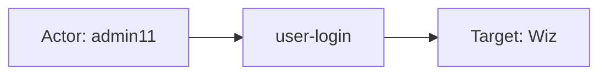
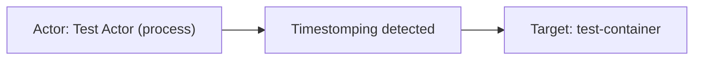
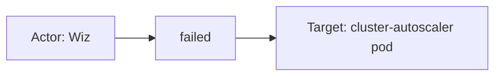

# wiz

## Product Domain

Wiz is a cloud-native application protection platform (CNAPP) that provides unified cloud security across multi-cloud and Kubernetes environments. Rather than treating misconfigurations, vulnerabilities, identities, secrets, network exposure, and runtime threats as separate silos, Wiz builds a security graph that correlates these risk factors to produce a prioritized view of what matters most in the cloud estate. The platform supports AWS, Azure, GCP, and Kubernetes workloads, and is widely used for cloud security posture management (CSPM), cloud workload protection (CWPP), and cloud detection and response (CDR).

Core capabilities span several domains. **Cloud Security Posture Management (CSPM)** evaluates cloud resources against configuration rules and compliance frameworks, surfacing misconfigurations with remediation guidance. **Cloud Vulnerability Management (CNVM)** identifies package- and image-level CVEs on VMs, containers, and serverless assets, enriched with CVSS, EPSS, exploitability, and exposure context. **Issues** represent active, prioritized risks in the environment—aggregating findings from controls, runtime detections, and graph-based analysis into trackable work items with severity, status, and project scope. **Wiz Defend** provides runtime threat detection using Wiz Sensor telemetry, cloud activity, and the security graph to alert on techniques such as defense evasion, privilege escalation, and C2 activity, mapped to MITRE ATT&CK. **Audit logs** record platform activity including logins and mutation API calls within the Wiz portal.

From a security operations perspective, Wiz is a primary source of cloud risk and threat intelligence. Teams use it for misconfiguration remediation workflows, vulnerability prioritization based on runtime validation and internet exposure, incident triage on active issues, and real-time detection correlation via Defend webhooks. The Elastic Wiz integration ingests these signals into Elastic Security for unified search, dashboards, and CDR/misconfiguration/vulnerability workflows.

## Data Collected (brief)

The integration collects six data streams from Wiz via **CEL/GraphQL API** (OAuth service account) or **HTTP Endpoint** (Defend webhooks):

| Data stream | Description |
|---|---|
| **audit** (`wiz.audit`) | Platform audit events—logins, mutation API calls, service account actions, user/service account identity, scopes, source IP, and outcome |
| **issue** (`wiz.issue`) | Active cloud risks—severity, status, affected entity snapshot (resource type, cloud platform, subscription), source rules, projects, notes, and service ticket links |
| **vulnerability** (`wiz.vulnerability`) | CVE findings on cloud assets—CVSS/EPSS scores, package and fixed version, detection method, vulnerable asset context (exposure, OS, IPs), and remediation guidance |
| **cloud_configuration_finding** (`wiz.cloud_configuration_finding`) | CSPM rule evaluation results for changed/non-passing resources—rule metadata, pass/fail outcome, resource identity, and evidence |
| **cloud_configuration_finding_full_posture** (`wiz.cloud_configuration_finding_full_posture`) | Full posture snapshot of all cloud configuration rule results across the estate |
| **defend** (`wiz.defend`) | Real-time runtime detections via webhook—MITRE tactics/techniques, triggering events, process trees, container/Kubernetes context, actor IP with reputation, and affected cloud resources |

Events are normalized to ECS where applicable (cloud, resource, rule, vulnerability, threat fields) with vendor details under `wiz.<data-stream>.*`. Elasticsearch transforms deduplicate latest misconfiguration and vulnerability findings for Elastic Security CDR views.

## Expected Audit Log Entities

Only **`audit`** (`wiz.audit`) is a true platform audit log: Wiz portal logins and mutation GraphQL/API actions with outcome, request ID, and identity context. The other five streams are audit-adjacent — aggregated risk state (**issue**), CVE findings (**vulnerability**), CSPM rule results (**cloud_configuration_finding**, **cloud_configuration_finding_full_posture**), and runtime detections (**defend**) — but actor/target semantics still matter for entity analytics and CDR correlation. No stream populates ECS `user.target.*`, `host.target.*`, `service.target.*`, or `entity.target.*`; no `destination.user.*` / `destination.host.*` in pipelines (`destination_identity_hits.csv` has no wiz row). The target-fields audit classifies wiz as **`moderate_candidate`** with `pipeline_actor=true`, `fixture_strong=true`, and no ECS target tier-A mapping (`dev/target-fields-audit/out/target_enhancement_packages.csv`).

**`event.action` is populated on two of six streams** — **`audit`** (portal/API operation from `json.action`) and **`defend`** (detection lifecycle from `trigger.type`). The four finding/inventory streams record state or evaluation outcomes without a mapped per-event verb; vendor fields below are action candidates.

Evidence: `packages/wiz/data_stream/*/sample_event.json`, `*/_dev/test/pipeline/*-expected.json`, `*/elasticsearch/ingest_pipeline/default.yml`, `*/fields/fields.yml`.

### Event action (semantic)

| Action (normalized label) | Classification | Confidence | Evidence | Per-stream notes |
| --- | --- | --- | --- | --- |
| `user-login` / `login` | authentication | high | `test-audit.log-expected.json`: `event.action: user-login` from vendor `" user Login"`; `sample_event.json`: `login` from `"Login"` | **`audit`** — portal OAuth/interactive login; pipeline lowercases and hyphenates whitespace |
| `created` | detection | high | `test-defend.json-expected.json`: `event.action: created` from `trigger.type: Created` | **`defend`** — new runtime detection alert; not the underlying process technique |
| *(no per-event verb)* | — | high | No `event.action` in issue/vulnerability/CSPM fixtures or pipelines | **`issue`**, **`vulnerability`**, **`cloud_configuration_finding`**, **`cloud_configuration_finding_full_posture`** — state/inventory sync (`event.kind: event`, `alert`, or `state`); action candidates are finding type, status, or rule outcome (see ECS candidates) |

Mutation API audit actions beyond `Login` are implied by `wiz.audit.action` and OAuth `action_parameters.scopes` (e.g. `admin:audit`, `read:issues`) but no non-login audit fixtures exist in the package today.

### Event action (ECS candidates)

| ECS / vendor field | Mapped to `event.action` today? | Mapping correct? | Recommended `event.action` value (from fixtures) | Enhancement candidate? | Evidence |
| --- | --- | --- | --- | --- | --- |
| `json.action` → `event.action` | yes | yes | `user-login`, `login` | no | `audit/default.yml` trim/lowercase/split/join L56–75; original retained in `wiz.audit.action` L81–84 |
| `wiz.audit.action` | no (vendor-only) | n/a | ` user Login`, `Login` | no | Canonical vendor string after pipeline removes intermediate copy |
| `wiz.defend.trigger.type` → `event.action` | yes | yes | `created` | no | `defend/default.yml` rename L371–375, copy L376–380, lowercase/split/join L381–399 |
| `wiz.issue.type` | no | n/a | `THREAT_DETECTION` | yes | `issue/default.yml` rename L404–406; fixture `test-issue.log-expected.json` — issue category, not a verb |
| `wiz.issue.status.value` | no | n/a | `IN_PROGRESS` | partial | Finding workflow state; alternate to `type` if action must reflect status |
| `wiz.vulnerability.status` | no | n/a | `OPEN` | partial | `vulnerability/default.yml` rename L380–382; finding lifecycle state, not scanner operation |
| `wiz.vulnerability.detection_method` | no | n/a | `PACKAGE` | partial | Rename L157–158; describes how CVE was found, not an event verb |
| `wiz.cloud_configuration_finding.result` → `result.evaluation` | no | n/a | `failed` (from vendor `FAIL`) | yes | CSPM pipeline L274–295 maps PASS/FAIL to `result.evaluation`; rule check outcome, not `event.action` today |
| `rule.id` / `rule.name` | no | n/a | `Pod-32`, rule UUID | partial | Identifies which control was evaluated — complements outcome, not a substitute for action |
| `event.type` / `event.category` / `event.outcome` | n/a (downstream) | partial | e.g. `authentication`, `configuration`, `vulnerability`, `threat` | no | Derived categories/outcomes; do not replace `event.action` |

**Step 2b — per-stream check:**

| Stream | `event.action` in fixtures? | Pipeline maps to `event.action`? | Primary action candidate | Confidence | Evidence |
| --- | --- | --- | --- | --- | --- |
| `audit` | yes | yes | `json.action` → normalize → `event.action` | high | `audit/default.yml` L56–75; `test-audit.log-expected.json`, `sample_event.json` |
| `defend` | yes | yes | `wiz.defend.trigger.type` → `event.action` | high | `defend/default.yml` L371–399; `test-defend.json-expected.json` |
| `issue` | no | no | `wiz.issue.type` (`THREAT_DETECTION`) | medium | `issue/default.yml` L404–406; `test-issue.log-expected.json` |
| `vulnerability` | no | no | `wiz.vulnerability.detection_method` or omit (state stream) | low | No pipeline `event.action`; `test-vulnerability.log-expected.json` has `status: OPEN`, `detection_method: PACKAGE` |
| `cloud_configuration_finding` | no | no | `result.evaluation` (`failed`/`passed`) or `rule.id` | medium | `cloud_configuration_finding/default.yml` L274–295; `test-cloud-configuration-finding.log-expected.json` |
| `cloud_configuration_finding_full_posture` | no | no | Same as incremental CSPM | medium | Shared pipeline semantics; `test-cloud-configuration-finding-full-posture.log-expected.json` |

### Actor (semantic)

| Entity | Classification | Entity type (if general) | Confidence | Evidence | Per-stream notes |
| --- | --- | --- | --- | --- | --- |
| Portal interactive user | user | — | high | `json.user.id`/`name` → `user.id`/`user.name` (`audit/default.yml`); `test-audit.log-expected.json`: `admin11` / `123abc` | **`audit`** — canonical human actor when `user` object present |
| OAuth / service-account principal | user | service_account | high | `wiz.audit.service_account.id`/`name`; `action_parameters.user.id` + scopes in `related.user`; `sample_event.json` Login with `serviceAccount.name=elastic`, empty ECS `user.*` | **`audit`** — API/OAuth login when `user` is null; identity stays vendor-only or in `related.user` |
| Client source IP | host | — | medium | `sourceIP` → `source.ip` + `related.ip` (`audit/default.yml`); null in `sample_event.json` Login fixture | **`audit`** — network origin of portal/API session |
| Issue note author | user | — | low | `notes[].user.name`/`email` appended to `related.user` only (`issue/default.yml`); `test-issue.log-expected.json`: `admin`, `root` | **`issue`** — remediation commenter, not actor of underlying detection |
| Wiz CNVM scanner | service | — | high | `observer.vendor: Wiz` set statically (`vulnerability/default.yml`) | **`vulnerability`** — automated scanner; no human/cloud-principal caller |
| Wiz CSPM evaluator | service | — | high | `observer.vendor: Wiz` set statically (`cloud_configuration_finding*/default.yml`) | **`cloud_configuration_finding`**, **`cloud_configuration_finding_full_posture`** — automated rule evaluation |
| Runtime triggering actor | user / general | process, service_account | high | `triggering_event.actor.id`/`name` → `user.id`/`user.name`; type `Process` in `test-defend.json-expected.json` (`Test Actor`) | **`defend`** — immediate runtime/cloud identity tied to triggering event |
| Primary cloud identity (Defend) | user | service_account | high | `wiz.defend.primary_actor.*` vendor-only; Entra ID SP with email in `related.user` (`test-defend.json-expected.json`: `test-actor@wiz.io`) | **`defend`** — graph-level primary actor; richer than ECS `user.*` |
| Process-tree OS user | user | — | medium | `runtime_details.process_tree[].username`/`user_id` → `related.user` (`defend/default.yml`); fixture: `root`, `0` | **`defend`** — local/container OS identity in process tree |
| Assumed IAM role (acting-as) | user | assumed_role | medium | `wiz.defend.triggering_event.actor.acting_as.*` vendor-only; `IAMRole` / `AssumedRole` in pipeline test | **`defend`** — cloud role context for triggering actor |

**No actor identity:** **`issue`** (underlying risk state), **`vulnerability`**, **`cloud_configuration_finding`**, **`cloud_configuration_finding_full_posture`** — no acting user or cloud principal in schema or fixtures. Evaluated cloud identities (e.g. AWS root) are **targets**, not actors.

### Actor (ECS candidates)

| ECS / vendor field | Role | Mapped today? | Mapping correct? | Confidence | Evidence |
| --- | --- | --- | --- | --- | --- |
| `user.id` | Portal user; Defend triggering actor | yes (stream-dependent) | yes (audit user login, defend actor); no (CSPM USER_ACCOUNT — see Gaps) | high | Audit: `json.user.id` copy; Defend: `triggering_event.actor.id` copy |
| `user.name` | Portal user; Defend triggering actor | yes (stream-dependent) | yes (audit, defend); no (CSPM USER_ACCOUNT resource name) | high | Same pipeline sources as `user.id` |
| `source.ip` | Audit client IP | yes | yes | high | `json.sourceIP` → `wiz.audit.source_ip` → `source.ip` |
| `user_agent.*` | Audit browser/client | yes | yes | high | `json.userAgent` → `user_agent` processor |
| `related.user` | OAuth IDs, note authors, Defend actors | yes | partial | high | Audit appends user id/name, OAuth userID/userpoolID/email; issue notes; defend primary + triggering + process-tree users — conflates actor and target contexts |
| `source.geo` / `source.as.*` | Defend actor IP enrichment | yes | partial | high | `triggering_event.actorIP` geoip → `source.geo`; ASN org → `source.as` — **not** copied to `source.ip` |
| `related.ip` | Audit source IP; asset IPs; Defend actor/subject IPs | yes | yes (context) | high | Audit `sourceIP`; vulnerability asset IPs; defend `actorIP` + `subject_resource_ip` |
| `observer.vendor` | Scanner/evaluator identity | yes | yes (context) | high | Static `Wiz` on vulnerability and CSPM streams |
| `wiz.audit.service_account.*` | OAuth/service-account actor | no (vendor-only) | n/a | high | `json.serviceAccount` rename; not promoted to ECS `user.*` when `user` null |
| `wiz.audit.action_parameters.*` | OAuth client, scopes, userpool | no (vendor-only) | n/a | high | Scopes (`read:issues`, `admin:audit`) imply API surface accessed |
| `wiz.defend.primary_actor.*` | Graph primary identity | no (vendor-only) | n/a | high | Entra SP email/name/id; only `related.user` overlap |
| `wiz.defend.triggering_event.actor.acting_as.*` | Assumed-role context | no (vendor-only) | n/a | medium | `IAMRole` in defend pipeline test |
| `cloud.account.id` / `cloud.region` | Tenancy scope | yes | yes (scope) | high | CSPM/vulnerability subscription and region fields — not actors |

### Target (semantic)

| Layer | Description | Entity | Classification | Entity type (if general) | Confidence | Evidence | Per-stream notes |
| --- | --- | --- | --- | --- | --- | --- | --- |
| 1 — Platform / cloud service | Invoked SaaS or cloud platform | Wiz portal/API; EKS/Azure K8s | service | — | high (audit); medium (CSPM) | Audit: `event.action=login`, `event.category=authentication`; CSPM: `cloud.service.name` from `resource.cloudPlatform` (e.g. `eks`) | **`audit`** login targets Wiz session; **`cloud_configuration_finding*`** Layer 1 from cloud platform field |
| 2 — Resource / object | Cloud asset under assessment or attack | VM, Pod, container, IAM root, ClusterRole | host / user / general | cloud_resource, container_workload, iam_identity | high | `resource.*`/`host.*` (CSPM, vulnerability); `wiz.issue.entity_snapshot.*`; `wiz.defend.primary_resource.*` | Type-dependent mapping by stream (see Per-stream notes) |
| 3 — Content / artifact | Finding instance, API call, process/file | CVE+package; CSPM rule; process binary | general | cve_finding, cspm_rule, api_request, process_file | high | `vulnerability.*`/`package.*`; `rule.*` (IAM-006, Pod-32); `http.request.id`; defend process tree → `related.hash` | Layer 3 is the finding/detection artifact on Layer 2 asset |

### Target (ECS candidates)

| ECS / vendor field | Layer | Classification | Mapped today? | Mapping correct? | ECS target bucket | Enhancement candidate? | Evidence |
| --- | --- | --- | --- | --- | --- | --- | --- |
| `cloud.service.name` | 1 | service | yes (CSPM) | yes | `service.target.name` | yes | `resource.cloudPlatform` lowercase → `cloud.service.name: eks` in CSPM fixtures |
| `http.request.id` | 3 | general | yes | yes (correlation id) | context-only | no | Audit `requestId` copy; tracks API call, not business object |
| `wiz.audit.action` / `action_parameters.scopes` | 2 | general | no | n/a | context-only | no | Mutation API target classes implied by scopes; no object ID in fixtures |
| `wiz.issue.entity_snapshot.*` | 2 | general | no | n/a | `entity.target.*` | yes | `ACCESS_ROLE`/`ClusterRole` in `test-issue.log-expected.json`; only `cloud.*`/`url.*` promoted |
| `resource.id` / `resource.name` / `resource.type` | 2 | general | yes (CSPM, vulnerability) | yes | `entity.target.*` | yes | CSPM POD/VM/USER_ACCOUNT; vulnerability provider ARN |
| `host.name` | 2 | host | yes | yes | `host.target.name` | yes | VM assets: CSPM + vulnerability (`test-4` in vulnerability fixture) |
| `device.id` | 2 | host | yes | yes | `host.target.id` | yes | Vulnerability `vulnerable_asset.id` → `device.id` |
| `container.image.name` | 2 | general | yes | yes | `entity.target.name` | yes | When `vulnerable_asset.type=CONTAINER_IMAGE` |
| `user.id` / `user.name` (CSPM USER_ACCOUNT) | 2 | user | yes | **no** | `user.target.*` | yes | AWS root `arn:aws:iam::998231069301:root` mapped to `user.*` — evaluated **target** identity, not actor |
| `vulnerability.id` / `package.*` | 3 | general | yes | yes | context-only | no | CVE and affected package on Layer 2 asset |
| `rule.id` / `rule.name` | 3 | general | yes | yes | context-only | no | CSPM controls (Pod-32, IAM-006); Defend trigger rule |
| `wiz.defend.primary_resource.*` | 2 | general | no | n/a | `entity.target.*` | yes | CONTAINER + K8s/EKS metadata in defend fixture; no ECS `resource.*` |
| `wiz.defend.triggering_event.resources[]` | 2 | general | no | n/a | `entity.target.*` | yes | Same container workload as primary resource |
| `wiz.defend.triggering_event.runtime_details.process_tree[]` | 3 | general | no | n/a | context-only | no | `/usr/bin/touch`, hash in `related.hash` |
| `wiz.cloud_configuration_finding*.evidence.*` | 3 | general | partial | yes | context-only | no | Config path/current/expected values → `result.evidence.*` |
| `targetExternalId` / `targetObjectProviderUniqueId` | 2 | general | no | n/a | `entity.target.id` | yes | Present in full-posture `event.original`; not mapped to ECS |
| `destination.ip` | 2 | host | partial | partial | `host.target.ip` | yes | Defend pipeline maps `subjectResourceIp` → `destination.ip`; not in current defend test fixture |

### Gaps and mapping notes

- **`event.action` gaps on four streams** — `issue`, `vulnerability`, and both CSPM streams have vendor fields naming finding type, status, or rule outcome but no `event.action` mapping; recommended primary candidates per stream in Step 2b table above.
- **No ECS `*.target.*` today** — richest target identity lives under `wiz.*` vendor fields (`entity_snapshot`, `primary_resource`, CSPM `resource.*`) or generic `resource.*`/`host.*`. Enhancement: promote typed targets to `entity.target.*`, `host.target.*`, or `user.target.*` by `resource.type`.
- **CSPM `USER_ACCOUNT` → `user.*` is actor/target conflation** — pipeline copies evaluated IAM root/account to `user.id`/`user.name` (`set_user_id_if_user_account`); semantically a **Layer 2 user target**, not the scanner actor. Should map to `user.target.*`.
- **Audit OAuth login without `user` object** — ECS `user.*` empty while `related.user` holds OAuth userID + userpoolID; canonical actor identity split across vendor (`service_account.*`) and `related.user`.
- **`related.user` mixes roles** — audit OAuth IDs, issue note authors, defend primary + triggering + process-tree identities in one bag without actor/target distinction.
- **Defend actor IP not in `source.ip`** — geo/ASN enrichment under `source.geo`/`source.as` only; `actorIP` also in `related.ip`. `destination.ip` from `subjectResourceIp` is a de-facto **target host IP** candidate but absent from test fixture.
- **Issue stream: no ECS resource mapping** — `entity_snapshot.provider_id`/`external_id` stay vendor-only; only `cloud.provider`/`cloud.region` and parsed `url.*` promoted.
- **No `destination.user.*` / `destination.host.*`** — wiz not in `destination_identity_hits.csv`; only defend sets `destination.ip` (subject resource).
- **Target-fields audit alignment** — `moderate_candidate`: strong vendor targets and audit actor pipeline mappings (`pipeline_actor=true`, `fixture_strong=true`), but no tier-A ECS target fields.

### Per-stream notes

#### `audit`

True platform audit. **`event.action`**: `json.action` normalized to `user-login`/`login` (`authentication` category when action contains `Login`). Actor: interactive `user.*` when present; OAuth/service-account logins use `wiz.audit.service_account.*` + `action_parameters.*` with `related.user` fallback. Target Layer 1: Wiz portal/API session. No explicit Layer 2 object ID in login fixtures; mutation actions implied by `wiz.audit.action` and OAuth scopes.

#### `issue`

Aggregated risk/issue state (`event.kind: event`). **No `event.action`**; candidate `wiz.issue.type: THREAT_DETECTION`. No event actor. Layer 2 target: `wiz.issue.entity_snapshot.*` (e.g. `ACCESS_ROLE` / `ClusterRole`). Note authors in `related.user` only. Contributing sensor rules under `wiz.issue.source_rules[]` (`source_type: WIZ_SENSOR`).

#### `vulnerability`

CNVM finding alert (`event.kind: alert`). **No `event.action`**; finding state in `wiz.vulnerability.status` (`OPEN`). Actor: Wiz scanner (`observer.vendor`). Layer 2: `vulnerable_asset` → `resource.*`, `host.name` (VM), `container.image.name` (image), `device.id`, `cloud.*`. Layer 3: CVE (`vulnerability.id`), package (`package.name`/`version`).

#### `cloud_configuration_finding`

Incremental CSPM rule results (`event.kind: state`). **No `event.action`**; rule outcome in `result.evaluation` (`failed`/`passed` from vendor `FAIL`/`PASS`). Actor: Wiz evaluator. Layer 1: `cloud.service.name` from platform. Layer 2: evaluated resource by type — POD/VM/USER_ACCOUNT → `resource.*` + conditional `host.name` or mis-mapped `user.*`. Layer 3: failing/passing rule (`rule.id`, `result.evaluation`).

#### `cloud_configuration_finding_full_posture`

Full posture snapshot; same pipeline semantics as incremental CSPM. **No `event.action`**. Raw originals include `targetExternalId`/`targetObjectProviderUniqueId` not mapped to ECS. Inventory/state semantics — no acting user.

#### `defend`

Runtime detection webhook alert (`event.kind: alert`). **`event.action`**: `created` from `trigger.type`. Actor: `triggering_event.actor` → ECS `user.*`; richer `primary_actor` vendor-only. Layer 2: `primary_resource` + `triggering_event.resources[]` (container/K8s) — vendor-only. Layer 3: process tree artifacts, Defend trigger `rule.*`, MITRE `threat.tactic.*`/`technique.*`. Optional `destination.ip` for subject resource IP when present in payload.

## Example Event Graph

Examples below come from **`audit`** (true platform audit log), **`defend`** (runtime detection webhook), and **`cloud_configuration_finding`** (CSPM state sync — audit-adjacent). Only `audit` and `defend` populate ECS `event.action` today; the CSPM example derives action from `result.evaluation`.

### Example 1: Portal interactive user login

**Stream:** `wiz.audit` · **Fixture:** `packages/wiz/data_stream/audit/_dev/test/pipeline/test-audit.log-expected.json`

```
Portal user admin11 → user-login → Wiz (service)
```

#### Actor

| Field | Value |
| --- | --- |
| id | 123abc |
| name | admin11 |
| type | user |

**Field sources:**
- `id` ← `user.id`
- `name` ← `user.name`

#### Event action

| Field | Value |
| --- | --- |
| action | user-login |
| source_field | `event.action` |
| source_value | user-login |

#### Target

| Field | Value |
| --- | --- |
| name | Wiz |
| type | service |

**Field sources:**
- `name` ← semantic — SaaS platform being authenticated to; **not indexed** in fixture (`cloud.service.name` absent; `event.category: authentication`)
- `type` ← service — authentication target is the Wiz portal/API, not the user account

**Scope context (not target):** service account `op-us` (`wiz.audit.service_account.name`), request ID `8f7fa6bd-ce32-4f11-91b4-a0377438561e` (`http.request.id`, `event.id`).

#### Mermaid (optional)



### Example 2: Runtime timestomping on container

**Stream:** `wiz.defend` · **Fixture:** `packages/wiz/data_stream/defend/_dev/test/pipeline/test-defend.json-expected.json`

`event.action: created` refers to Wiz creating the detection record, not the runtime verb — reading “process created container” would be incoherent. The underlying behavior is timestomping on the container workload.

```
Runtime process (Test Actor) → Timestomping technique was detected → container test-container
```

#### Actor

| Field | Value |
| --- | --- |
| id | 4e1bd57f-49b2-47a8-a4a7-0e66fe0b770e |
| name | Test Actor |
| type | general |
| sub_type | process |
| geo | London, United Kingdom |
| ip | 81.2.69.192 |

**Field sources:**
- `id` ← `wiz.defend.triggering_event.actor.id` (copied to `user.id` today)
- `name` ← `wiz.defend.triggering_event.actor.name`
- `sub_type` ← `wiz.defend.triggering_event.actor.type` (`Process`)
- `geo` ← `source.geo.city_name`, `source.geo.country_name` (enriched from `wiz.defend.triggering_event.actor_ip`; not copied to `source.ip`)
- `ip` ← `wiz.defend.triggering_event.actor_ip` (also in `related.ip`)

Process tree also shows `username: root` executing `/usr/bin/touch` (`wiz.defend.triggering_event.runtime_details.process_tree`).

#### Event action

| Field | Value |
| --- | --- |
| action | Timestomping technique was detected |
| source_field | `wiz.defend.title` |
| source_value | Timestomping technique was detected |

ECS `event.action: created` is the alert-record lifecycle verb — **not the runtime action** shown here.

#### Target

| Field | Value |
| --- | --- |
| id | da259b23-de77-5adb-8336-8c4071696305 |
| name | test-container |
| type | general |
| sub_type | container_workload |

**Field sources:**
- `id` ← `wiz.defend.primary_resource.id`
- `name` ← `wiz.defend.primary_resource.name`
- `sub_type` ← `wiz.defend.primary_resource.type` (`CONTAINER`) + Kubernetes/EKS context (`kubernetes_cluster_name: prod-cluster`, `region: us-east-1`)

#### Mermaid (optional)



### Example 3: CSPM Pod rule evaluation failed

**Stream:** `wiz.cloud_configuration_finding` · **Fixture:** `packages/wiz/data_stream/cloud_configuration_finding/_dev/test/pipeline/test-cloud-configuration-finding.log-expected.json` (first event)

```
Wiz CSPM evaluator → failed → Pod cluster-autoscaler-azure-cluster-autoscaler-8bc677d64-z2qfx
```

#### Actor

| Field | Value |
| --- | --- |
| name | Wiz |
| type | service |

**Field sources:**
- `name` ← `observer.vendor`

#### Event action

| Field | Value |
| --- | --- |
| action | failed |
| source_field | `result.evaluation` |
| source_value | failed |

**Not mapped to ECS `event.action` today** — derived from vendor `FAIL` normalized to `result.evaluation`.

#### Target

| Field | Value |
| --- | --- |
| id | provider-id-0e814bb7-29e8-5c15-be9c-8da42c67ee99 |
| name | cluster-autoscaler-azure-cluster-autoscaler-8bc677d64-z2qfx |
| type | host |
| sub_type | Pod |

**Field sources:**
- `id` ← `resource.id`
- `name` ← `resource.name`
- `sub_type` ← `resource.sub_type` (`Pod`)

Layer 3 artifact: failing rule `Pod-32` (`rule.id`, `rule.name`).

#### Mermaid (optional)



## ES|QL Entity Extraction

**Package type: agent-backed** (CEL/HTTP Endpoint, six `data_stream/` directories with fixtures). Router: **`data_stream.dataset`** (`wiz.audit`, `wiz.issue`, `wiz.vulnerability`, `wiz.cloud_configuration_finding`, `wiz.cloud_configuration_finding_full_posture`, `wiz.defend`). Full actor/target extraction on **`wiz.audit`** and **`wiz.defend`**; partial on finding/CSPM streams (scanner **service** actor, resource/asset targets). Login auth targets the Wiz platform (**`service.target.name`** semantic literal per Pass 3 Example 1), not the portal user. CSPM **`USER_ACCOUNT`** ingest maps the evaluated IAM identity to **`user.*`** (actor/target conflation) — the detection-flags block excludes that pattern from `actor_exists` so the scanner **`service.name`** literal and **`user.target.*`** copy fallbacks remain reachable; all mapped columns use **column-level preserve** (`<col> IS NOT NULL`) as the first CASE branch — never `CASE(actor_exists, <col>, …)` / `CASE(target_exists, <col>, …)` — so ingest `user.*` on USER_ACCOUNT rows is not inadvertently cleared, and audit `source.ip` fills `host.ip` independently of whether `user.id` is set. `event.action` is **ingest-only** on both `wiz.audit` (from `json.action`) and `wiz.defend` (from `trigger.type`); no ES|QL action block is needed.

### Dataset inventory

| data_stream.dataset | Stream role | Actor classification(s) | Target classification(s) | Extraction |
| --- | --- | --- | --- | --- |
| `wiz.audit` | platform audit | user, host | service | full |
| `wiz.defend` | runtime detection | user, general (process) | general (container) | full |
| `wiz.cloud_configuration_finding` | CSPM state | service | host, user, service | partial |
| `wiz.cloud_configuration_finding_full_posture` | CSPM snapshot | service | host, user, service | partial |
| `wiz.vulnerability` | CVE findings | service | host, general | partial |
| `wiz.issue` | risk state | — | general | partial |

### Field mapping plan

#### Actor mappings

| Output column | Source field(s) | Condition (dataset + optional) | Confidence | Notes |
| --- | --- | --- | --- | --- |
| `user.id` | `wiz.audit.service_account.id` | `data_stream.dataset == "wiz.audit" AND user.id IS NULL` | high | **column-level preserve** (`user.id IS NOT NULL`); **vendor fallback** — OAuth/service-account login when ECS `user.id` absent; portal interactive user is **ingest-only** (`json.user.id` → `user.id`, `audit/default.yml`) |
| `user.name` | `wiz.audit.service_account.name` | `data_stream.dataset == "wiz.audit" AND user.name IS NULL` | high | **column-level preserve** (`user.name IS NOT NULL`); **vendor fallback** — OAuth/service-account login; portal user `user.name` **ingest-only** |
| `user.id` | — | `data_stream.dataset == "wiz.defend"` | high | **ingest-only** — `triggering_event.actor.id` → `user.id` (`defend/default.yml`); **omit from ES\|QL** (no alternate source) |
| `user.name` | — | `data_stream.dataset == "wiz.defend"` | high | **ingest-only** — triggering actor name; **omit from ES\|QL** |
| `host.ip` | `source.ip` | `data_stream.dataset == "wiz.audit" AND source.ip IS NOT NULL` | high | **column-level preserve** (`host.ip IS NOT NULL`); **vendor fallback** — `sourceIP` mapped to `source.ip` at ingest; `host.ip` not set by pipeline |
| `service.name` | `"Wiz"` | `data_stream.dataset IN ("wiz.vulnerability", "wiz.cloud_configuration_finding", "wiz.cloud_configuration_finding_full_posture")` | high | **column-level preserve** (`service.name IS NOT NULL`); **semantic literal** — automated CNVM/CSPM scanner (`observer.vendor: Wiz` in fixtures, Pass 3 Ex. 3) |

#### Target mappings

| Output column | Source field(s) | Condition (dataset + optional) | Confidence | Notes |
| --- | --- | --- | --- | --- |
| `service.target.name` | `"Wiz"` | `data_stream.dataset == "wiz.audit" AND event.action IN ("user-login", "login")` | high | **column-level preserve** (`service.target.name IS NOT NULL`); **semantic literal** — SaaS platform being authenticated to (Pass 3 Ex. 1); `event.action` values confirmed in `test-audit.log-expected.json` and `sample_event.json` |
| `service.target.name` | `cloud.service.name` | `data_stream.dataset IN ("wiz.cloud_configuration_finding", "wiz.cloud_configuration_finding_full_posture") AND cloud.service.name IS NOT NULL` | high | **column-level preserve**; **preserve existing** — Layer 1 cloud platform; confirmed `eks` in CSPM fixture event 2 |
| `entity.target.id` | `wiz.defend.primary_resource.id` | `data_stream.dataset == "wiz.defend" AND wiz.defend.primary_resource.id IS NOT NULL` | high | **vendor fallback** — container `da259b23-…` in defend fixture; `wiz.defend.primary_resource.*` vendor-only (Pass 3 Ex. 2) |
| `entity.target.name` | `wiz.defend.primary_resource.name` | `data_stream.dataset == "wiz.defend" AND wiz.defend.primary_resource.name IS NOT NULL` | high | **vendor fallback** — `test-container` in defend fixture |
| `entity.target.sub_type` | `wiz.defend.primary_resource.type` | `data_stream.dataset == "wiz.defend" AND wiz.defend.primary_resource.type IS NOT NULL` | high | **vendor fallback** — `CONTAINER` in defend fixture |
| `entity.target.id` | `wiz.issue.entity_snapshot.id` | `data_stream.dataset == "wiz.issue" AND wiz.issue.entity_snapshot.id IS NOT NULL` | high | **vendor fallback** — `e507d472-…` in issue fixture |
| `entity.target.name` | `wiz.issue.entity_snapshot.name` | `data_stream.dataset == "wiz.issue" AND wiz.issue.entity_snapshot.name IS NOT NULL` | high | **vendor fallback** — `system:aggregate-to-edit` in issue fixture |
| `entity.target.sub_type` | `wiz.issue.entity_snapshot.native_type` | `data_stream.dataset == "wiz.issue" AND wiz.issue.entity_snapshot.native_type IS NOT NULL` | high | **vendor fallback** — `ClusterRole` in issue fixture |
| `host.target.id` | `device.id` | `data_stream.dataset == "wiz.vulnerability" AND device.id IS NOT NULL` | high | **preserve existing** — `c828de0d-…` confirmed in vulnerability fixture; `vulnerableAsset.id` → `device.id` at ingest |
| `host.target.name` | `host.name` | `data_stream.dataset == "wiz.vulnerability" AND host.name IS NOT NULL` | high | **preserve existing** — `test-4` confirmed in vulnerability fixture for `VIRTUAL_MACHINE` assets |
| `host.target.id` | `resource.id` | `data_stream.dataset IN ("wiz.cloud_configuration_finding", "wiz.cloud_configuration_finding_full_posture") AND resource.type IN ("POD", "VIRTUAL_MACHINE") AND resource.id IS NOT NULL` | high | **preserve existing** — `provider-id-0e814bb7-…` (POD) and `80045425-…` (VM) confirmed in CSPM fixtures |
| `host.target.name` | `resource.name` | `data_stream.dataset IN ("wiz.cloud_configuration_finding", "wiz.cloud_configuration_finding_full_posture") AND resource.type == "POD" AND resource.name IS NOT NULL` | high | **preserve existing** — `cluster-autoscaler-…` confirmed in CSPM fixture event 1 (Pass 3 Ex. 3) |
| `host.target.name` | `host.name` | `data_stream.dataset IN ("wiz.cloud_configuration_finding", "wiz.cloud_configuration_finding_full_posture") AND resource.type == "VIRTUAL_MACHINE" AND host.name IS NOT NULL` | high | **preserve existing** — `annam-vm` confirmed in CSPM fixture events 3–7 |
| `user.target.id` | `user.id` | `data_stream.dataset IN ("wiz.cloud_configuration_finding", "wiz.cloud_configuration_finding_full_posture") AND resource.type == "USER_ACCOUNT" AND user.id IS NOT NULL` | medium | **de-facto destination** — ingest conflation fix at query time; `arn:aws:iam::998231069301:root` confirmed in CSPM fixture event 2; fallback reads from ingest `user.id` |
| `user.target.name` | `user.name` | same | medium | **de-facto destination** — `Root user` confirmed in CSPM fixture event 2 |
| `entity.target.id` | `resource.id` | `data_stream.dataset == "wiz.vulnerability" AND resource.id IS NOT NULL` | high | **preserve existing** — cloud resource ARN correlation; `arn:aws:ec2:…` confirmed in vulnerability fixture |
| `entity.target.name` | `resource.name` | `data_stream.dataset == "wiz.vulnerability" AND resource.name IS NOT NULL` | high | **preserve existing** — `test-4` confirmed in vulnerability fixture |
| `host.target.ip` | `destination.ip` | `data_stream.dataset == "wiz.defend" AND destination.ip IS NOT NULL` | medium | **de-facto destination** — subject resource IP from `subjectResourceIp` → `destination.ip` pipeline; absent from current defend test fixture |

### Detection flags (mandatory — run first)

Tuned **`actor_exists`**: CSPM **`USER_ACCOUNT`** events populate `user.id`/`user.name` for the evaluated cloud IAM identity (actor/target conflation), not a human actor — those rows are excluded from `actor_exists` so the scanner `service.name` literal and `user.target.*` copy fallbacks remain reachable on those events. All mapped-column EVAL blocks use **column-level preserve** — not this flag as the first CASE condition.

```esql
| EVAL
  actor_exists = (
      user.id IS NOT NULL OR user.name IS NOT NULL OR user.email IS NOT NULL
      OR host.id IS NOT NULL OR host.ip IS NOT NULL OR host.name IS NOT NULL
      OR service.id IS NOT NULL OR service.name IS NOT NULL
      OR entity.id IS NOT NULL OR entity.name IS NOT NULL
    )
    AND NOT (
      data_stream.dataset IN ("wiz.cloud_configuration_finding", "wiz.cloud_configuration_finding_full_posture")
      AND resource.type == "USER_ACCOUNT"
    ),
  target_exists = user.target.id IS NOT NULL OR user.target.name IS NOT NULL OR user.target.email IS NOT NULL
    OR host.target.id IS NOT NULL OR host.target.ip IS NOT NULL OR host.target.name IS NOT NULL
    OR service.target.id IS NOT NULL OR service.target.name IS NOT NULL
    OR entity.target.id IS NOT NULL OR entity.target.name IS NOT NULL,
  action_exists = event.action IS NOT NULL
```

**Semantics:** `actor_exists` / `target_exists` / `action_exists` are query-time helpers only — **do NOT use them as the first branch in mapped column CASE expressions**. Every mapped column uses column-level preserve: `CASE(col IS NOT NULL, col, …)`. The CSPM USER_ACCOUNT exclusion in `actor_exists` does not null out ingest `user.*`; it only marks those rows as "no meaningful actor" for downstream logic.

### Combined ES|QL — actor fields

```esql
| EVAL
  user.id = CASE(
    user.id IS NOT NULL, user.id,
    data_stream.dataset == "wiz.audit" AND wiz.audit.service_account.id IS NOT NULL, wiz.audit.service_account.id,
    null
  ),
  user.name = CASE(
    user.name IS NOT NULL, user.name,
    data_stream.dataset == "wiz.audit" AND wiz.audit.service_account.name IS NOT NULL, wiz.audit.service_account.name,
    null
  ),
  host.ip = CASE(
    host.ip IS NOT NULL, host.ip,
    data_stream.dataset == "wiz.audit" AND source.ip IS NOT NULL, source.ip,
    null
  ),
  service.name = CASE(
    service.name IS NOT NULL, service.name,
    data_stream.dataset IN ("wiz.vulnerability", "wiz.cloud_configuration_finding", "wiz.cloud_configuration_finding_full_posture"), "Wiz",
    null
  )
```

**Column notes:**
- `user.id` / `user.name`: portal interactive user (`json.user.id`/`json.user.name`) and defend triggering actor are **ingest-only** — no alternate source; fallback only covers OAuth/service-account rows where ECS `user.*` is null at ingest. 5-arg CASE: preserve → `wiz.audit` guard + `IS NOT NULL` → null default.
- `host.ip`: `source.ip` is indexed at ingest from `sourceIP` on audit events; `host.ip` is not set by the pipeline. Column-level preserve + `IS NOT NULL` guard on source.
- `service.name`: semantic literal `"Wiz"` for scanner/evaluator datasets; 5-arg CASE with null default; no guard needed on literal branch but dataset restriction prevents false assignment.

**ES|QL CASE arity reminder:** `CASE(cond, val, …, default)` — pairs of (boolean condition, return value), first true wins; last odd argument is the default. **4-arg form is wrong** for non-literal fallbacks — `CASE(col IS NOT NULL, col, vendor_field, null)` treats `vendor_field` as a boolean condition. Always use 5-arg: `CASE(col IS NOT NULL, col, dataset_guard AND src IS NOT NULL, src, null)`.

### Combined ES|QL — target fields

```esql
| EVAL
  service.target.name = CASE(
    service.target.name IS NOT NULL, service.target.name,
    data_stream.dataset == "wiz.audit" AND event.action IN ("user-login", "login"), "Wiz",
    data_stream.dataset IN ("wiz.cloud_configuration_finding", "wiz.cloud_configuration_finding_full_posture") AND cloud.service.name IS NOT NULL, cloud.service.name,
    null
  ),
  entity.target.id = CASE(
    entity.target.id IS NOT NULL, entity.target.id,
    data_stream.dataset == "wiz.defend" AND wiz.defend.primary_resource.id IS NOT NULL, wiz.defend.primary_resource.id,
    data_stream.dataset == "wiz.issue" AND wiz.issue.entity_snapshot.id IS NOT NULL, wiz.issue.entity_snapshot.id,
    data_stream.dataset == "wiz.vulnerability" AND resource.id IS NOT NULL, resource.id,
    null
  ),
  entity.target.name = CASE(
    entity.target.name IS NOT NULL, entity.target.name,
    data_stream.dataset == "wiz.defend" AND wiz.defend.primary_resource.name IS NOT NULL, wiz.defend.primary_resource.name,
    data_stream.dataset == "wiz.issue" AND wiz.issue.entity_snapshot.name IS NOT NULL, wiz.issue.entity_snapshot.name,
    data_stream.dataset == "wiz.vulnerability" AND resource.name IS NOT NULL, resource.name,
    null
  ),
  entity.target.sub_type = CASE(
    entity.target.sub_type IS NOT NULL, entity.target.sub_type,
    data_stream.dataset == "wiz.defend" AND wiz.defend.primary_resource.type IS NOT NULL, wiz.defend.primary_resource.type,
    data_stream.dataset == "wiz.issue" AND wiz.issue.entity_snapshot.native_type IS NOT NULL, wiz.issue.entity_snapshot.native_type,
    null
  ),
  host.target.id = CASE(
    host.target.id IS NOT NULL, host.target.id,
    data_stream.dataset == "wiz.vulnerability" AND device.id IS NOT NULL, device.id,
    data_stream.dataset IN ("wiz.cloud_configuration_finding", "wiz.cloud_configuration_finding_full_posture") AND resource.type IN ("POD", "VIRTUAL_MACHINE") AND resource.id IS NOT NULL, resource.id,
    null
  ),
  host.target.name = CASE(
    host.target.name IS NOT NULL, host.target.name,
    data_stream.dataset == "wiz.vulnerability" AND host.name IS NOT NULL, host.name,
    data_stream.dataset IN ("wiz.cloud_configuration_finding", "wiz.cloud_configuration_finding_full_posture") AND resource.type == "POD" AND resource.name IS NOT NULL, resource.name,
    data_stream.dataset IN ("wiz.cloud_configuration_finding", "wiz.cloud_configuration_finding_full_posture") AND resource.type == "VIRTUAL_MACHINE" AND host.name IS NOT NULL, host.name,
    null
  ),
  host.target.ip = CASE(
    host.target.ip IS NOT NULL, host.target.ip,
    data_stream.dataset == "wiz.defend" AND destination.ip IS NOT NULL, destination.ip,
    null
  ),
  user.target.id = CASE(
    user.target.id IS NOT NULL, user.target.id,
    data_stream.dataset IN ("wiz.cloud_configuration_finding", "wiz.cloud_configuration_finding_full_posture") AND resource.type == "USER_ACCOUNT" AND user.id IS NOT NULL, user.id,
    null
  ),
  user.target.name = CASE(
    user.target.name IS NOT NULL, user.target.name,
    data_stream.dataset IN ("wiz.cloud_configuration_finding", "wiz.cloud_configuration_finding_full_posture") AND resource.type == "USER_ACCOUNT" AND user.name IS NOT NULL, user.name,
    null
  )
```

**Column notes:**
- `service.target.name`: two branches — audit login literal `"Wiz"` (3-arg literal branch embedded in multi-branch CASE); CSPM cloud platform passthrough. Both guarded by dataset condition; literal branch uses no `IS NOT NULL` guard (literal cannot be null).
- `entity.target.*`: multi-branch across defend/issue/vulnerability; each branch has its own dataset guard and `IS NOT NULL` check on the source field.
- `host.target.id` / `host.target.name`: CSPM branch restricted to `POD` and `VIRTUAL_MACHINE` resource types confirmed in fixtures; `IS NOT NULL` guards on `resource.id` and `host.name` prevent returning null from truthy conditions.
- `user.target.id` / `user.target.name`: reads from ingest `user.id`/`user.name` (set by `set_user_id_if_user_account` processor); `IS NOT NULL` guard prevents null return; `actor_exists` exclusion flag ensures these rows are not treated as having a human actor.
- `host.target.ip`: medium confidence; `destination.ip` from subject resource IP in defend pipeline but absent from test fixture.

### Full pipeline fragment (optional)

```esql
FROM logs-*
| EVAL
  actor_exists = (
      user.id IS NOT NULL OR user.name IS NOT NULL OR user.email IS NOT NULL
      OR host.id IS NOT NULL OR host.ip IS NOT NULL OR host.name IS NOT NULL
      OR service.id IS NOT NULL OR service.name IS NOT NULL
      OR entity.id IS NOT NULL OR entity.name IS NOT NULL
    )
    AND NOT (
      data_stream.dataset IN ("wiz.cloud_configuration_finding", "wiz.cloud_configuration_finding_full_posture")
      AND resource.type == "USER_ACCOUNT"
    ),
  target_exists = user.target.id IS NOT NULL OR user.target.name IS NOT NULL OR user.target.email IS NOT NULL
    OR host.target.id IS NOT NULL OR host.target.ip IS NOT NULL OR host.target.name IS NOT NULL
    OR service.target.id IS NOT NULL OR service.target.name IS NOT NULL
    OR entity.target.id IS NOT NULL OR entity.target.name IS NOT NULL,
  action_exists = event.action IS NOT NULL
| EVAL
  user.id = CASE(
    user.id IS NOT NULL, user.id,
    data_stream.dataset == "wiz.audit" AND wiz.audit.service_account.id IS NOT NULL, wiz.audit.service_account.id,
    null
  ),
  user.name = CASE(
    user.name IS NOT NULL, user.name,
    data_stream.dataset == "wiz.audit" AND wiz.audit.service_account.name IS NOT NULL, wiz.audit.service_account.name,
    null
  ),
  host.ip = CASE(
    host.ip IS NOT NULL, host.ip,
    data_stream.dataset == "wiz.audit" AND source.ip IS NOT NULL, source.ip,
    null
  ),
  service.name = CASE(
    service.name IS NOT NULL, service.name,
    data_stream.dataset IN ("wiz.vulnerability", "wiz.cloud_configuration_finding", "wiz.cloud_configuration_finding_full_posture"), "Wiz",
    null
  )
| EVAL
  service.target.name = CASE(
    service.target.name IS NOT NULL, service.target.name,
    data_stream.dataset == "wiz.audit" AND event.action IN ("user-login", "login"), "Wiz",
    data_stream.dataset IN ("wiz.cloud_configuration_finding", "wiz.cloud_configuration_finding_full_posture") AND cloud.service.name IS NOT NULL, cloud.service.name,
    null
  ),
  entity.target.id = CASE(
    entity.target.id IS NOT NULL, entity.target.id,
    data_stream.dataset == "wiz.defend" AND wiz.defend.primary_resource.id IS NOT NULL, wiz.defend.primary_resource.id,
    data_stream.dataset == "wiz.issue" AND wiz.issue.entity_snapshot.id IS NOT NULL, wiz.issue.entity_snapshot.id,
    data_stream.dataset == "wiz.vulnerability" AND resource.id IS NOT NULL, resource.id,
    null
  ),
  entity.target.name = CASE(
    entity.target.name IS NOT NULL, entity.target.name,
    data_stream.dataset == "wiz.defend" AND wiz.defend.primary_resource.name IS NOT NULL, wiz.defend.primary_resource.name,
    data_stream.dataset == "wiz.issue" AND wiz.issue.entity_snapshot.name IS NOT NULL, wiz.issue.entity_snapshot.name,
    data_stream.dataset == "wiz.vulnerability" AND resource.name IS NOT NULL, resource.name,
    null
  ),
  entity.target.sub_type = CASE(
    entity.target.sub_type IS NOT NULL, entity.target.sub_type,
    data_stream.dataset == "wiz.defend" AND wiz.defend.primary_resource.type IS NOT NULL, wiz.defend.primary_resource.type,
    data_stream.dataset == "wiz.issue" AND wiz.issue.entity_snapshot.native_type IS NOT NULL, wiz.issue.entity_snapshot.native_type,
    null
  ),
  host.target.id = CASE(
    host.target.id IS NOT NULL, host.target.id,
    data_stream.dataset == "wiz.vulnerability" AND device.id IS NOT NULL, device.id,
    data_stream.dataset IN ("wiz.cloud_configuration_finding", "wiz.cloud_configuration_finding_full_posture") AND resource.type IN ("POD", "VIRTUAL_MACHINE") AND resource.id IS NOT NULL, resource.id,
    null
  ),
  host.target.name = CASE(
    host.target.name IS NOT NULL, host.target.name,
    data_stream.dataset == "wiz.vulnerability" AND host.name IS NOT NULL, host.name,
    data_stream.dataset IN ("wiz.cloud_configuration_finding", "wiz.cloud_configuration_finding_full_posture") AND resource.type == "POD" AND resource.name IS NOT NULL, resource.name,
    data_stream.dataset IN ("wiz.cloud_configuration_finding", "wiz.cloud_configuration_finding_full_posture") AND resource.type == "VIRTUAL_MACHINE" AND host.name IS NOT NULL, host.name,
    null
  ),
  host.target.ip = CASE(
    host.target.ip IS NOT NULL, host.target.ip,
    data_stream.dataset == "wiz.defend" AND destination.ip IS NOT NULL, destination.ip,
    null
  ),
  user.target.id = CASE(
    user.target.id IS NOT NULL, user.target.id,
    data_stream.dataset IN ("wiz.cloud_configuration_finding", "wiz.cloud_configuration_finding_full_posture") AND resource.type == "USER_ACCOUNT" AND user.id IS NOT NULL, user.id,
    null
  ),
  user.target.name = CASE(
    user.target.name IS NOT NULL, user.target.name,
    data_stream.dataset IN ("wiz.cloud_configuration_finding", "wiz.cloud_configuration_finding_full_posture") AND resource.type == "USER_ACCOUNT" AND user.name IS NOT NULL, user.name,
    null
  )
| KEEP @timestamp, data_stream.dataset, event.action, user.id, user.name, host.ip, service.name, service.target.name, entity.target.id, entity.target.name, entity.target.sub_type, host.target.id, host.target.name, host.target.ip, user.target.id, user.target.name
```

### Streams excluded

None — all six datasets produce at least partial actor or target extraction. `wiz.issue` has no actor identity (risk-state aggregation only) but contributes `entity.target.*` target fields.

### Gaps and limitations

- **`event.action` block omitted** — `event.action` is set at ingest on `wiz.audit` (from `json.action`) and `wiz.defend` (from `trigger.type`); both are ingest-only with no alternate source field. No ES|QL action EVAL block is produced. Candidates on the four finding streams (`wiz.issue.type`, `result.evaluation`) are omitted to avoid false positives; documented as Pass 2 enhancement candidates.
- **`user.id` / `user.name` ingest-only on defend** — `triggering_event.actor.id` → `user.id` is set by the defend pipeline; no alternate source at query time. Fallback branch omitted.
- **`user.id` / `user.name` tautology guard** — portal interactive user on audit is also ingest-only; the audit CASE only fires when `user.id IS NULL` (OAuth/service-account login); column-level preserve ensures ingest `user.id` is not overwritten.
- **`wiz.defend.primary_actor.*`** — richer graph-level actor identity (Entra SP name/email); vendor-only; not promoted to ECS `user.*` at ingest or in this ES|QL block. `related.user` contains email/name but mixed with other roles.
- **`destination.ip` / `host.target.ip` on defend** — pipeline maps `subjectResourceIp` → `destination.ip`; field is absent from `test-defend.json-expected.json`; medium confidence, included with `IS NOT NULL` guard.
- **`container.image.name` on vulnerability** — `CONTAINER_IMAGE` asset type maps name to `container.image.name` at ingest; query-time `entity.target.name` covers this via `resource.name` fallback only when `resource.name` is present (not all CONTAINER_IMAGE rows have `resource.name` in fixture).
- **CSPM non-POD/non-VM/non-USER resource types** — `resource.type` values such as `SERVERLESS_FUNCTION`, `BUCKET`, `KUBERNETES_CLUSTER`, etc. are not guarded by current `host.target.*` or `user.target.*` CASE branches; add stream-specific guards per type before extending.
- **No ingest-time `*.target.*` today** — no tier-A ECS target fields set by wiz pipelines; this section is query-time fill-gaps only. When pipelines are updated to emit `entity.target.*` etc., preserve-first CASE branches will automatically defer to ingest values.
