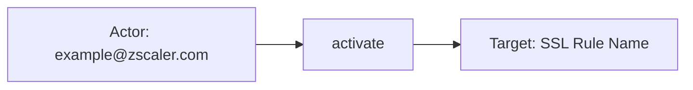
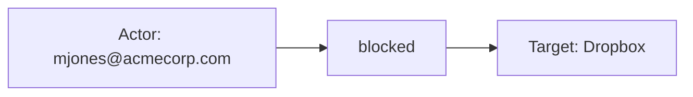
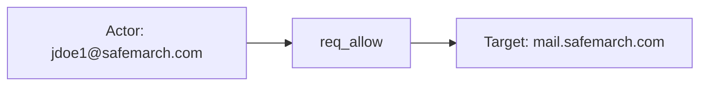

# zscaler_zia

## Product Domain

Zscaler Internet Access (ZIA) is a cloud-native Secure Access Service Edge (SASE) platform and secure web gateway (SWG) that sits inline between users, devices, and workloads and the public internet or SaaS applications. Part of the Zscaler Zero Trust Exchange, ZIA replaces legacy perimeter appliances—on-premises firewalls, proxy servers, and VPN backhaul—with a globally distributed cloud proxy architecture. User and workload traffic is steered to the nearest Zscaler point of presence via Zscaler Client Connector or GRE/IPsec tunnels, where it is terminated, identity-verified, and inspected before being forwarded to its destination.

As a SWG, ZIA enforces URL filtering, SSL/TLS inspection, cloud application control, data loss prevention (DLP), sandboxing, and AI-powered threat protection on outbound web and SaaS traffic. Its cloud firewall and intrusion prevention capabilities extend policy enforcement to non-web protocols, blocking lateral movement and command-and-control activity at the network layer. ZIA is designed for cloud-first and mobile-first enterprises: policies are identity- and context-aware (user, device posture, location, application) rather than tied to a fixed network perimeter, making it a foundational component of modern SASE and zero trust architectures.

From a security operations perspective, ZIA is the primary control point for internet-bound traffic. Security teams rely on ZIA telemetry to monitor web access decisions, detect malware and phishing, investigate DLP incidents, audit administrator activity, and correlate user and device identity with network events. Because ZIA inspects encrypted traffic at scale and applies policy before data reaches endpoints or cloud services, its logs are a critical signal for SIEM correlation, threat hunting, compliance auditing, and incident response across the enterprise estate.

## Data Collected (brief)

The integration collects ZIA logs from the Nanolog Streaming Service (NSS) via Elastic Agent **TCP** or **HTTP Endpoint** inputs, and sandbox analysis reports via a **CEL/API** input (OAuth 2.0). Eight data streams cover the main ZIA log types:

| Data stream | Description |
|---|---|
| **web** | SWG access logs—URL, application, action, threat/DLP verdicts, SSL/TLS details, file metadata, bandwidth and policy rule labels |
| **firewall** | Cloud firewall and IPS events—session allow/block, protocols, threat names, NAT/DNAT, rule labels, byte counts |
| **dns** | DNS resolution logs—queries, responses, categories, DNS gateway rules, client and server endpoints |
| **tunnel** | VPN/IPsec tunnel events—IKE phases, tunnel lifecycle, source/destination IPs, credentials, throughput |
| **endpoint_dlp** | Endpoint DLP incidents—file transfers, DLP dictionary/engine hits, actions taken, channel and severity |
| **audit** | ZIA Admin Portal audit logs—administrator actions, configuration changes, resource, result, and client IP |
| **alerts** | Platform and cloud configuration alerts (e.g., NSS connectivity, service health) |
| **sandbox_report** | Sandbox analysis reports fetched via API—file hashes, classification scores, exploit and networking indicators |

Events arrive as JSON (or syslog for alerts) from NSS or Cloud NSS feeds and are mapped to ECS fields where applicable, with vendor-specific details retained under `zscaler_zia.<data-stream>.*`. Bundled Kibana dashboards visualize web, firewall, DNS, tunnel, endpoint DLP, audit, and sandbox activity.

## Expected Audit Log Entities

Classifications below are grounded in all eight data streams under `packages/zscaler_zia/data_stream/` — `sample_event.json`, pipeline test `*-expected.json` fixtures, `fields/fields.yml`, and `elasticsearch/ingest_pipeline/default.yml`.

Only **audit** is a true ZIA Admin Portal audit log (NSS sourcetype `zscalernss-audit`). **web**, **firewall**, **dns**, **tunnel**, and **endpoint_dlp** are inline traffic or endpoint-incident telemetry (audit-adjacent for identity and policy correlation). **alerts** is operational NSS/platform syslog. **sandbox_report** is a CEL/API-fetched malware analysis artifact, not a live audit event.

No stream populates ECS `user.target.*`, `host.target.*`, `service.target.*`, or `entity.target.*`. The package is classified **strong_candidate** in `dev/target-fields-audit/out/target_enhancement_packages.csv` (actor and target vendor signals present; no official target fields mapped). `destination.user.*` / `destination.host.*` are **not** used — `destination.*` holds network/session peers only (package absent from `destination_identity_hits.csv`).

Six of eight streams map a vendor action field to `event.action` in the ingest pipeline. **dns** and **alerts** do not — vendor request/response actions and syslog message text remain the action candidates.

| Stream | `event.action` in fixtures? | Pipeline maps to `event.action`? | Primary action candidate | Confidence | Evidence |
| --- | --- | --- | --- | --- | --- |
| **audit** | yes | yes | `json.action` → `zscaler_zia.audit.action` → `event.action` | high | `activate`, `sign_out` in `test-audit.log-expected.json`; pipeline `set_event_action_from_audit_action` |
| **web** | yes | yes | `json.action` → `zscaler_zia.web.action` → `event.action` | high | `allowed`, `blocked`, `cautioned` in `test-web.log-expected.json`; drives `event.outcome` |
| **firewall** | yes | yes | `json.action` → `zscaler_zia.firewall.action` → `event.action` | high | `allowed`, `blocked`, `outofrange` in `test-firewall-http-endpoint.log-expected.json`; also appends to `event.type` |
| **dns** | no | no | `json.reqaction` → `zscaler_zia.dns.request.action` (primary); `json.resaction` → `zscaler_zia.dns.response.action` (alternate) | high | `REQ_ALLOW`, `RES_Action` in `test-dns.log-expected.json`; pipeline renames only, no `event.action` set |
| **tunnel** | partial | yes (when `json.event` present) | `json.event` → `zscaler_zia.tunnel.event` → `event.action`; alternate `json.Recordtype` → `zscaler_zia.tunnel.action.type` | high / medium | `ipsec-tunnel-is-up` when `event` populated; IPSec Phase2 records lack `event.action` (`test-tunnel.log-expected.json`) |
| **endpoint_dlp** | yes | yes | `json.actiontaken` → `zscaler_zia.endpoint_dlp.action_taken` → `event.action` | high | `allow` in `test-endpoint-dlp.log-expected.json`; alternate `activitytype` → `zscaler_zia.endpoint_dlp.activity_type` (`email_sent`) |
| **alerts** | no | no | Derive from syslog message pattern (e.g. `connection-lost`) | medium | Grok on `ZscalerNSS:` messages only; no structured action field in `test-alerts.log-expected.json` |
| **sandbox_report** | yes | yes | `json.Summary.Status` → `zscaler_zia.sandbox_report.summary.status` → `event.action` | high | `completed` in `sandbox_report/sample_event.json` from vendor `COMPLETED` |

### Event action (semantic)

What operation or activity does each stream record?

| Action (normalized label) | Classification | Confidence | Evidence | Per-stream notes |
| --- | --- | --- | --- | --- |
| `activate` | configuration_change | high | `audit/sample_event.json`, `test-audit.log-expected.json` | Admin activates a DLP dictionary or similar resource |
| `sign_out` | authentication | high | `test-audit.log-expected.json` (`SIGN_OUT` → lowercase + gsub) | Admin portal logout; `event.category: iam` from category script |
| `allowed` | data_access | high | `web/test-web.log-expected.json`, `web/sample_event.json` | SWG permit decision; sets `event.outcome: success`, `event.type: access` |
| `blocked` | data_access | high | `web/test-web.log-expected.json`, `firewall/test-firewall-http-endpoint.log-expected.json` | SWG or cloud-firewall deny; web sets `event.outcome: failure`; firewall appends `event.type: denied` |
| `cautioned` | data_access | high | `web/test-web.log-expected.json` | SWG caution/warn verdict (e.g. file attachment cautioned) |
| `outofrange` | detection | high | `firewall/sample_event.json`, `test-firewall-http-endpoint.log-expected.json` | Firewall session outside policy range; `event.type: info` |
| `req_allow` | data_access | high | `dns/test-dns.log-expected.json` (`REQ_ALLOW` vendor) | DNS request permitted — vendor-only today |
| `res_action` | data_access | medium | `dns/test-dns.log-expected.json` (`RES_Action` vendor) | DNS response action — vendor-only; separate from request action |
| `ipsec-tunnel-is-up` | configuration_change | high | `tunnel/test-tunnel.log-expected.json` | Tunnel lifecycle status from `json.event`; spaces → hyphens via gsub |
| (IPSec phase record) | configuration_change | medium | `tunnel/test-tunnel.log-expected.json` | `Recordtype: IPSec Phase2` stored in `zscaler_zia.tunnel.action.type` only — not copied to `event.action` |
| `allow` | data_access | high | `endpoint_dlp/sample_event.json`, `test-endpoint-dlp.log-expected.json` | DLP enforcement decision; appends `event.type: allowed` |
| `block` | data_access | high | Pipeline logic in `endpoint_dlp/elasticsearch/ingest_pipeline/default.yml` | Would append `event.type: denied` when present |
| `email_sent` | data_access | high | `endpoint_dlp/test-endpoint-dlp.log-expected.json` | Activity type describing exfil channel — vendor-only (`activity_type`) |
| `connection-lost` | detection | medium | Inferred from alerts grok patterns | NSS feed or cloud-config connectivity failure — not mapped |
| `completed` | detection | high | `sandbox_report/sample_event.json` | Sandbox analysis job finished (`Summary.Status: COMPLETED`) |

### Event action (ECS candidates)

| ECS / vendor field | Mapped to `event.action` today? | Mapping correct? | Recommended `event.action` value (from fixtures) | Enhancement candidate? | Evidence |
| --- | --- | --- | --- | --- | --- |
| `event.action` ← `zscaler_zia.audit.action` | yes | yes | `activate`, `sign_out` | no | `audit/elasticsearch/ingest_pipeline/default.yml` lines 340–359; lowercase + space→hyphen gsub |
| `event.action` ← `zscaler_zia.web.action` | yes | yes | `allowed`, `blocked`, `cautioned` | no | `web/elasticsearch/ingest_pipeline/default.yml` lines 143–167; drives `event.outcome` |
| `event.action` ← `zscaler_zia.firewall.action` | yes | yes | `allowed`, `blocked`, `outofrange` | no | `firewall/elasticsearch/ingest_pipeline/default.yml` lines 126–167; also feeds `event.type` |
| `zscaler_zia.dns.request.action` | no | n/a | `req_allow` (from `REQ_ALLOW`) | yes | `dns/elasticsearch/ingest_pipeline/default.yml` lines 542–544; primary DNS request verdict |
| `zscaler_zia.dns.response.action` | no | n/a | `res_action` (from `RES_Action`) | yes | `dns/elasticsearch/ingest_pipeline/default.yml` lines 579–581; secondary response verdict |
| `event.action` ← `zscaler_zia.tunnel.event` | partial | yes (when present) | `ipsec-tunnel-is-up` | partial | `tunnel/elasticsearch/ingest_pipeline/default.yml` lines 315–339; absent for IPSec Phase2-only records |
| `zscaler_zia.tunnel.action.type` | no | n/a | `ipsec-phase2`, `tunnel-event` (from `Recordtype`) | yes | `tunnel/elasticsearch/ingest_pipeline/default.yml` line 119–121; fallback when `json.event` missing |
| `event.action` ← `zscaler_zia.endpoint_dlp.action_taken` | yes | yes | `allow`, `block` | no | `endpoint_dlp/elasticsearch/ingest_pipeline/default.yml` lines 109–151 |
| `zscaler_zia.endpoint_dlp.activity_type` | no | n/a | `email_sent` | yes | Complementary verb describing what the user did; not copied to `event.action` |
| (derived from alerts message) | no | n/a | `connection-lost` | yes | `alerts/elasticsearch/ingest_pipeline/default.yml` grok only; no `event.action` processor |
| `event.action` ← `zscaler_zia.sandbox_report.summary.status` | yes | yes | `completed` | no | `sandbox_report/elasticsearch/ingest_pipeline/default.yml` lines 391–411 |

### Actor (semantic)

| Entity | Classification | Entity type (if general) | Confidence | Evidence | Per-stream notes |
| --- | --- | --- | --- | --- | --- |
| ZIA administrator | user | — | high | `adminid` → `user.email`/`user.name`/`user.domain`; `related.user` | **audit** only; always the acting admin (`example@zscaler.com`, `foo@example.com` in `test-audit.log-expected.json`) |
| Authenticated end user | user | — | high | `login`/`user` → `user.email`/`user.name`; `related.user` | **web**, **dns**, **firewall** (when `user` contains `@`), **endpoint_dlp** (`TempUser` → `user.name` when not an email) |
| Endpoint / managed device | host | — | high | `devicehostname`/`devicename` → `host.name`/`host.hostname`; `devicetype` → `host.type`; `deviceostype` → `host.os.type` | **web**, **dns**, **firewall**, **endpoint_dlp**; secondary actor context for the user session |
| Device owner (MDM) | user | — | medium | `deviceowner` → `zscaler_zia.*.device.owner` → `related.user` | **web**, **dns**, **firewall**, **endpoint_dlp**; may differ from `login` user (e.g. `jsmith` owner vs `jdoe@safemarch.com` login in `dns/sample_event.json`) |
| VPN credential / tunnel endpoint | user / host | — | medium | `json.user` → IP as `zscaler_zia.tunnel.user_ip` **or** non-IP string → `user.email` via `vpn_credential_name` | **tunnel**; `tunnel/sample_event.json` has IP-only (`user_ip`), no `user.*` populated |
| NSS platform process | service | — | high | Syslog prefix `ZscalerNSS:`; no principal fields | **alerts** only |
| (none) | — | — | high | No user/host/service identity fields in pipeline or fixtures | **sandbox_report** — API-polled analysis result with no submitter principal |

### Actor (ECS candidates)

| ECS / vendor field | Role | Mapped today? | Mapping correct? | Confidence | Evidence |
| --- | --- | --- | --- | --- | --- |
| `user.email` / `user.name` / `user.domain` | Admin or end-user actor | yes | yes | high | **audit**: `adminid` → dissect (`audit/elasticsearch/ingest_pipeline/default.yml`); **web**/**dns**/**firewall**: `login`/`user` URL-decoded then dissect; **endpoint_dlp**: `user` with email-fallback to `user.name` |
| `source.ip` | Admin client or flow origin (context) | yes | partial | high | **audit**: `clientip` → admin workstation/API client, not actor identity; **web**/**dns**/**firewall**: client-side flow IP (`cltip`/`clt_sip`/`csip`), session context not principal |
| `host.name` / `host.hostname` / `host.type` / `host.os.*` | Endpoint actor context | yes | yes | high | Device fields across traffic streams (`devicehostname`, `devicename`, `deviceostype`, etc.) |
| `device.id` | MDM device identifier | yes | yes | high | **web**: `external_devid` → `zscaler_zia.web.external.device.id` → `device.id` (`web/sample_event.json`) |
| `related.user` | Actor enrichment | yes | yes | high | Populated from `user.*` and `*.device.owner` across streams |
| `related.hosts` / `related.ip` | Actor/endpoint enrichment | yes | yes | high | Host names and flow/tunnel IPs appended in all traffic streams |
| `observer.vendor` / `observer.product` / `observer.type` | Inspecting appliance (context) | yes | n/a | high | **firewall** only: statically set `Zscaler` / `ZIA` / `firewall` — observer, not event actor |
| `zscaler_zia.audit.admin_id` | Canonical admin actor | yes (vendor) | n/a | high | Retained when `preserve_duplicate_custom_fields`; removed otherwise after ECS copy |
| `zscaler_zia.*.device.owner` | Device owner principal | yes (vendor) | n/a | medium | Vendor-only identity; copied to `related.user` but not `user.*` |
| `zscaler_zia.tunnel.user_ip` / `zscaler_zia.tunnel.vpn_credential_name` | Tunnel user identity | yes (vendor) | partial | medium | IP stored as endpoint context; credential name copied to `user.email` when non-IP |
| `zscaler_zia.web.login` / `zscaler_zia.dns.login` | Raw login string | yes (vendor) | n/a | high | Duplicate of actor email before ECS mapping; removed unless preserve tag |

### Target (semantic)

| Layer | Description | Entity | Classification | Entity type (if general) | Confidence | Evidence | Per-stream notes |
| --- | --- | --- | --- | --- | --- | --- | --- |
| 1 — Platform / cloud service | Zscaler cloud tenant or inspected SaaS/application | Zscaler Internet Access (`zscaler.net`) | service | — | high | `cloudname` → `cloud.provider` (**web**, **dns**); `cloud.provider: zscaler.net` in fixtures | Scope context; no `cloud.service.name` set |
| 1 — Platform / cloud service | Cloud/SaaS application under SWG policy | Adobe Connect, Google DNS, Skype, etc. | service | — | high | `appname` → `zscaler_zia.web.app.name`; `dnsapp`/`nwapp` → `network.application` | **web**, **dns**, **firewall** |
| 1 — Platform / cloud service | ZIA Admin Portal / Experience Center | ZIA admin API or portal | service | — | high | `auditlogtype`: `ZIA Portal Audit Log`, `EC`; `event.category`/`event.type` from `category` script | **audit** |
| 1 — Platform / cloud service | ZIA Sandbox analysis service | ZIA Cloud Sandbox | service | — | medium | CEL input fetches report; `event.category: malware` | **sandbox_report** |
| 2 — Resource / object | Configuration or policy object changed by admin | DLP dictionary, firewall rule, IAM entity | general | configuration_object | high | `resource` → `rule.name`; `category`/`subcategory` → `rule.ruleset`/`rule.category` | **audit**; IAM categories (`USER_MANAGEMENT`, `ROLE_MANAGEMENT`) imply user/role targets but no ECS entity mapping |
| 2 — Resource / object | Remote network / web destination | Destination host, URL, DNS name | host / general | url, dns_name, network_peer | high | `url.*`, `destination.domain`/`destination.ip`/`destination.port`, `dns.question.name` | **web**, **firewall**, **dns**, **tunnel** |
| 2 — Resource / object | DLP policy rule triggered | DLP / URL / firewall rule labels | general | policy_rule | high | Multiple rule labels → ECS `rule.name` array | **web**, **firewall**, **endpoint_dlp**, **dns** |
| 2 — Resource / object | Sensitive file acted upon | File on endpoint or in transit | general | file | high | `file.path`, `file.hash.*`, `file.name` | **web** (download/upload), **endpoint_dlp**, **sandbox_report** |
| 2 — Resource / object | NSS SIEM feed or cloud-config endpoint | Log feed connection | service | — | high | `zscaler_zia.alerts.log_feed_name`; dissected `destination.ip`/`destination.port` | **alerts** |
| 3 — Content / artifact | Threat / malware indicator | Named threat or file hash | general | threat_indicator, malware_sample | high | `zscaler_zia.web.threat.name`, `zscaler_zia.firewall.threat_name`, `file.hash.*`, `event.risk_score` | **web**, **firewall**, **sandbox_report** |
| 3 — Content / artifact | Exfil channel / destination | Personal cloud, email, network drive | general | exfil_channel | high | `zscaler_zia.endpoint_dlp.destination_type`, `item.destination_name`, `channel` | **endpoint_dlp** |
| 3 — Content / artifact | Before/after config state | Pre/post change JSON blobs | general | config_delta | low | `zscaler_zia.audit.pre_action` / `post_action` retained vendor-only | **audit**; not parsed into ECS target fields |

### Target (ECS candidates)

| ECS / vendor field | Layer | Classification | Mapped today? | Mapping correct? | ECS target bucket | Enhancement candidate? | Evidence |
| --- | --- | --- | --- | --- | --- | --- | --- |
| `rule.name` | 2 | general (policy/config object) | yes | partial | `entity.target.name` or context | yes | **audit**: `resource` copied — semantically a rule/config name, not always a firewall "rule"; **web**/**firewall**/**dns**/**endpoint_dlp**: policy rule labels |
| `rule.category` / `rule.ruleset` | 2 | general (object type) | yes | partial | `entity.target.type` | yes | **audit**: `subcategory`/`category` describe target class (e.g. `DLP_DICTIONARY`, `USER_MANAGEMENT`) |
| `url.domain` / `url.full` / `url.path` | 2 | general (url) | yes | yes | context | no | **web**: `b64url` decoded → `url.original`/`url.full` (`web/sample_event.json`) |
| `destination.domain` / `destination.ip` / `destination.port` | 2 | host / general | yes | yes (network context) | context | no | Remote peer in **web**, **firewall**, **dns**, **tunnel**, **alerts** — network session target, not audit `*.target.*` |
| `dns.question.name` / `dns.answers` | 2 | general (dns_name) | yes | yes | context | no | **dns**: `dns_req` → `dns.question.name`; answer data in `dns.answers` |
| `network.application` | 1 | service | yes | yes | `service.target.name` | yes | **dns**/**firewall**: `dnsapp`/`nwapp` → application/service acted upon |
| `cloud.provider` | 1 | service | yes | partial | context | no | **web**/**dns**: `cloudname` (e.g. `zscaler.net`) — tenant scope, not the remote SaaS target |
| `file.path` / `file.hash.*` / `file.name` | 2–3 | general (file) | yes | yes | `entity.target.name` | yes | **endpoint_dlp**, **web**, **sandbox_report** |
| `event.risk_score` | 3 | general (malware score) | yes | yes | context | no | **sandbox_report**: classification score |
| `zscaler_zia.web.app.name` | 1 | service | yes (vendor) | n/a | `service.target.name` | yes | SaaS app label (e.g. `Adobe Connect` in `web/sample_event.json`); not mapped to ECS |
| `zscaler_zia.audit.resource` | 2 | general (config object) | yes (vendor) | n/a | `entity.target.name` | yes | Canonical admin target; ECS uses overloaded `rule.name` |
| `zscaler_zia.audit.pre_action` / `post_action` | 3 | general (config_delta) | yes (vendor) | n/a | `entity.target.*` | yes | JSON blobs may hold richer target identity; not parsed |
| `zscaler_zia.firewall.threat_name` | 3 | general (threat) | yes (vendor) | n/a | context | no | IPS threat label; vendor-only |
| `zscaler_zia.web.threat.name` | 3 | general (threat) | yes (vendor) | n/a | context | no | Web threat label; vendor-only |
| `zscaler_zia.endpoint_dlp.item.destination_name` | 3 | general (exfil_destination) | yes (vendor) | n/a | `entity.target.name` | yes | Exfil target name; vendor-only |
| `zscaler_zia.endpoint_dlp.destination_type` | 3 | general (exfil_channel) | yes (vendor) | n/a | context | no | e.g. `personal_cloud_storage` in `endpoint_dlp/sample_event.json` |
| `zscaler_zia.alerts.log_feed_name` | 2 | service | yes (vendor) | n/a | `service.target.name` | yes | e.g. `DNS Logs Feed` in `alerts/sample_event.json` |

### Gaps and mapping notes

- **No official ECS target fields** — zero `*.target.*` mappings across all eight pipelines; aligns with target-fields-audit **strong_candidate** classification.
- **`event.action` gaps on dns and alerts** — `reqaction`/`resaction` and syslog connectivity messages are not copied to `event.action`; highest-priority action enhancements.
- **Tunnel action split** — `json.event` (lifecycle status) maps to `event.action` but `Recordtype` (IPSec phase) does not; consider `zscaler_zia.tunnel.action.type` as fallback.
- **Endpoint DLP dual verbs** — `actiontaken` (policy verdict) maps to `event.action`; `activitytype` (e.g. `email_sent`) remains vendor-only and describes the user activity.
- **`rule.name` overload** — audit `resource` and traffic rule labels share ECS `rule.name`; for admin IAM events (`USER_MANAGEMENT`, `ROLE_MANAGEMENT`) the resource may be a user account or role name deserving `entity.target.*` or `user.target.*`, not a firewall-style rule.
- **`source.ip` vs actor** — consistently mapped from client/session IP fields; correct as flow origin but must not be interpreted as the human actor (especially **audit** admin actions where `user.email` is authoritative).
- **`device.owner` → `related.user` only** — device owner identity never promoted to `user.*`; enhancement candidate when owner differs from authenticated `login`.
- **`destination.*` is network context** — unlike email/auth integrations, ZIA uses `destination.ip`/`destination.domain` for remote peers and resolver endpoints, not de-facto audit targets; no `destination.user.*` usage.
- **`cloud.provider` without `cloud.service.name`** — Zscaler tenant (`zscaler.net`) is scope; SaaS targets live in `zscaler_zia.web.app.name` or `url.*` without ECS service-target mapping.
- **Unparsed audit deltas** — `preaction`/`postaction` may encode before/after target state for config changes; highest-value vendor-only enhancement source.
- **Tunnel user ambiguity** — `json.user` is IP in fixtures but pipeline supports VPN credential name → `user.email`; classify per event.
- **Sandbox and alerts lack human actors** — do not infer end-user submitter from sandbox reports or NSS connectivity alerts.

### Per-stream notes

#### audit

Primary admin audit stream. **Action:** `json.action` → `event.action` (`activate`, `sign_out`); normalized lowercase with underscores/hyphens. Pipeline maps `adminid` → `user.*`, `clientip` → `source.ip`, `resource` → `rule.name`, `category`/`subcategory` → `rule.ruleset`/`rule.category`, and sets `event.category`/`event.type` from a category lookup script. Fixtures: Activate DLP dictionary (`DATA_LOSS_PREVENTION_RESOURCE`/`DLP_DICTIONARY`, resource `"SSL Rule Name"`) and SIGN_OUT (`LOGIN`/`LOGIN`, `resource: "None"` dropped). `errorcode` → `error.code` even when `result: SUCCESS`. Interface (`API`, `Unknown`) is admin path context.

#### web

SWG access log. **Action:** `json.action` → `event.action` (`allowed`, `blocked`, `cautioned`); sets `event.outcome` from allow/block. Actor: authenticated user (`login` → `user.*`) plus endpoint (`host.*`, `device.id`). Target layers: SaaS app (`zscaler_zia.web.app.name`), URL/destination (`url.*`, `destination.*`), optional file/threat (`file.*`, `zscaler_zia.web.threat.name`). DLP rule names append to `rule.name`.

#### firewall

Cloud firewall/IPS. **Action:** `json.action` → `event.action` (`allowed`, `blocked`, `outofrange`); `allowed`/`blocked` also append to `event.type`. Actor: user when `user`/`login` populated (`test-firewall.log-expected.json`); `firewall/sample_event.json` is IP-only (`user: Unknown` dropped). Observer statically identifies ZIA firewall. Target: remote endpoint (`destination.*`, `cltdomain` → `destination.domain`), application (`network.application`), IPS threat (`zscaler_zia.firewall.threat_name`).

#### dns

DNS resolution on managed devices. **Action:** `reqaction`/`resaction` → `zscaler_zia.dns.request.action` / `zscaler_zia.dns.response.action` only — **not** mapped to `event.action` (enhancement candidate: primary `req_allow`). Actor: `user`/`login` → `user.*`; device owner in `related.user`. Target: queried name (`dns.question.name`), resolver endpoint (`destination.ip`), DNS application (`network.application`).

#### tunnel

VPN/IPsec lifecycle. **Action:** `json.event` → `event.action` when present (`ipsec-tunnel-is-up`); IPSec Phase2 `Recordtype` events store phase in `zscaler_zia.tunnel.action.type` without `event.action`. Actor: tunnel endpoint IPs (`source.ip`, `zscaler_zia.tunnel.source.*`); optional VPN credential name → `user.email`. Target: tunnel peer (`destination.ip`, `zscaler_zia.tunnel.destination.end.ip`). No user in `tunnel/sample_event.json`.

#### endpoint_dlp

Endpoint DLP incident. **Action:** `actiontaken` → `event.action` (`allow`, `block`); `activitytype` (`email_sent`) is vendor-only activity descriptor. Actor: `user` → `user.name` (non-email usernames supported); `device.owner` → `related.user`. Target: file (`file.path`, `file.hash.*`), exfil destination (`zscaler_zia.endpoint_dlp.item.destination_name`, `destination_type`), DLP rules (`rule.name`).

#### alerts

NSS operational syslog (feed connectivity, cloud-config loss). **Action:** no `event.action`; grok extracts feed name and destination from `ZscalerNSS:` messages — derive `connection-lost` as enhancement candidate. No human actor. Target: SIEM feed name or remote endpoint (`zscaler_zia.alerts.log_feed_name`, `destination.ip`/`destination.port`).

#### sandbox_report

CEL/API sandbox analysis. **Action:** `Summary.Status` → `event.action` (`completed`). No actor. Target: submitted file (`file.hash.*`, `zscaler_zia.sandbox_report.file_properties.*`, `event.risk_score`, classification under `zscaler_zia.sandbox_report.classification.*`).

## Example Event Graph

Examples below come from the **audit** (true ZIA Admin Portal audit log), **web**, and **dns** streams (inline NSS telemetry, audit-adjacent for identity and policy correlation). Values are taken only from pipeline test fixtures under `packages/zscaler_zia/`.

### Example 1: Admin activates DLP dictionary

**Stream:** `zscaler_zia.audit` · **Fixture:** `packages/zscaler_zia/data_stream/audit/sample_event.json`

```
ZIA administrator (example@zscaler.com) → activate → DLP dictionary "SSL Rule Name"
```

#### Actor

| Field | Value |
| --- | --- |
| id | example@zscaler.com |
| name | example |
| type | user |

**Field sources:**
- `id` ← `user.email`
- `name` ← `user.name`

#### Event action

| Field | Value |
| --- | --- |
| action | activate |
| source_field | `event.action` |
| source_value | activate |

#### Target

| Field | Value |
| --- | --- |
| id | SSL Rule Name |
| name | SSL Rule Name |
| type | general |
| sub_type | dlp_dictionary |

**Field sources:**
- `id` ← `rule.name`
- `name` ← `rule.name`
- `sub_type` ← `rule.category` (`DLP_DICTIONARY`)

#### Mermaid (optional)



### Example 2: SWG blocks malware download

**Stream:** `zscaler_zia.web` · **Fixture:** `packages/zscaler_zia/data_stream/web/_dev/test/pipeline/test-web.log-expected.json`

```
End user (mjones@acmecorp.com) → blocked → Dropbox / www.dropbox.com/download
```

#### Actor

| Field | Value |
| --- | --- |
| id | mjones@acmecorp.com |
| name | mjones |
| type | user |

**Field sources:**
- `id` ← `user.email`
- `name` ← `user.name`

#### Event action

| Field | Value |
| --- | --- |
| action | blocked |
| source_field | `event.action` |
| source_value | blocked |

#### Target

| Field | Value |
| --- | --- |
| name | Dropbox |
| type | service |
| sub_type | protected_web_app |

**Field sources:**
- `name` ← `zscaler_zia.web.app.name` (SaaS application); URL context in `url.full` (`https://www.dropbox.com/download`)
- Threat context: `zscaler_zia.web.threat.name` ← `Trojan.GenericKD`; file `malware.exe` in `file.name`

#### Mermaid (optional)



### Example 3: DNS query permitted (vendor action only)

**Stream:** `zscaler_zia.dns` · **Fixture:** `packages/zscaler_zia/data_stream/dns/_dev/test/pipeline/test-dns.log-expected.json`

```
End user (jdoe1@safemarch.com) → req_allow → DNS name mail.safemarch.com
```

#### Actor

| Field | Value |
| --- | --- |
| id | jdoe1@safemarch.com |
| name | jdoe1 |
| type | user |
| ip | 81.2.69.192 |

**Field sources:**
- `id` ← `user.email`
- `name` ← `user.name`
- `ip` ← `source.ip` (client-side flow IP for the DNS session, not the human principal)

#### Event action

| Field | Value |
| --- | --- |
| action | req_allow |
| source_field | `zscaler_zia.dns.request.action` |
| source_value | REQ_ALLOW |

**Not mapped to ECS `event.action` today** — derived from vendor request verdict field.

#### Target

| Field | Value |
| --- | --- |
| name | mail.safemarch.com |
| type | general |
| sub_type | dns_name |
| ip | 175.16.199.0 |

**Field sources:**
- `name` ← `dns.question.name`
- `ip` ← `destination.ip` (DNS resolver/server endpoint)
- `geo` omitted — `destination.geo` (Changchun, CN) describes the resolver location, not the queried name

#### Mermaid (optional)



## ES|QL Entity Extraction

**Package type: agent-backed** — eight NSS/API data streams with Tier A fixtures (`sample_event.json`, `*-expected.json`) and ingest pipelines under `packages/zscaler_zia/data_stream/`. Primary router: **`data_stream.dataset`** (`zscaler_zia.<stream>`). Pass 4 is **fill-gaps-only**: detection flags run first for query semantics; mapped columns use **column-level** `CASE(<col> IS NOT NULL, <col>, fallback, null)` — not `CASE(actor_exists, user.id, …)` when `user.email` alone satisfies `actor_exists` while `user.id` stays empty (Pass 4 §10). **`zscaler_zia.audit`** uses `event.action`-aware portal targets on auth/config events (Pass 3). Traffic streams enrich SaaS/DNS/file/network targets; **`alerts`** and **`sandbox_report`** have no human actor in fixtures.

### Dataset inventory

| data_stream.dataset | Stream role | Actor classification(s) | Target classification(s) | Extraction |
| --- | --- | --- | --- | --- |
| `zscaler_zia.audit` | admin audit | user | general (config object), service (portal) | full |
| `zscaler_zia.web` | SWG access | user, host | service, host/url | partial |
| `zscaler_zia.firewall` | cloud firewall | user, host | host, service | partial |
| `zscaler_zia.dns` | DNS log | user, host | general (dns_name), host (resolver) | partial |
| `zscaler_zia.tunnel` | VPN/IPsec | user, host | host | partial |
| `zscaler_zia.endpoint_dlp` | endpoint DLP | user, host | general (file, exfil) | partial |
| `zscaler_zia.alerts` | platform alerts | — | service | partial |
| `zscaler_zia.sandbox_report` | sandbox API | — | general (file/malware) | partial |

### Field mapping plan

#### Actor mappings

| Output column | Source field(s) | Condition (dataset + optional) | Confidence | Notes |
| --- | --- | --- | --- | --- |
| `user.id` | `user.email` | `data_stream.dataset IN ("zscaler_zia.audit", "zscaler_zia.web", "zscaler_zia.firewall", "zscaler_zia.dns", "zscaler_zia.endpoint_dlp")` | high | preserve existing; fallback id from email when `user.id` empty |
| `user.name` | `user.name` (ingest dissect) | same IN list + `zscaler_zia.tunnel` | high | **ingest-only — no ES|QL**; pipeline sets from `login`/`adminid`/`vpn_credential_name` |
| `user.email` | `user.email` (ingest dissect) | same IN list + `zscaler_zia.tunnel` | high | **ingest-only — no ES|QL**; no alternate query-time source |
| `user.domain` | `user.domain` (ingest dissect) | `data_stream.dataset == "zscaler_zia.audit"` | high | **ingest-only — no ES|QL**; admin `adminid` dissect only |
| `host.name` | `host.name` (ingest) | `data_stream.dataset IN ("zscaler_zia.web", "zscaler_zia.dns", "zscaler_zia.firewall", "zscaler_zia.endpoint_dlp")` | high | **ingest-only — no ES|QL**; `devicehostname`/`devicename` at ingest |
| `host.ip` | `source.ip` | `data_stream.dataset IN ("zscaler_zia.web", "zscaler_zia.dns", "zscaler_zia.firewall", "zscaler_zia.tunnel")` | high | preserve existing; fallback client/session IP when `host.ip` empty |

#### Target mappings

| Output column | Source field(s) | Condition (dataset + optional) | Confidence | Notes |
| --- | --- | --- | --- | --- |
| `service.target.name` | `"ZIA Admin Portal"` | `data_stream.dataset == "zscaler_zia.audit" AND event.action IN ("sign_out", "activate")` | low | semantic literal — portal target (Pass 3); fallback only |
| `entity.target.name` | `rule.name` | `data_stream.dataset == "zscaler_zia.audit"` | high | preserve existing; admin `resource` (e.g. DLP dictionary) |
| `entity.target.sub_type` | `rule.category` | `data_stream.dataset == "zscaler_zia.audit"` | high | preserve existing; e.g. `DLP_DICTIONARY` |
| `service.target.name` | `zscaler_zia.web.app.name` | `data_stream.dataset == "zscaler_zia.web"` | high | vendor fallback — SaaS app (Dropbox) |
| `host.target.name` | `url.domain` | `data_stream.dataset == "zscaler_zia.web" AND url.domain IS NOT NULL` | high | preserve existing; remote web host |
| `host.target.ip` | `destination.ip` | `data_stream.dataset IN ("zscaler_zia.web", "zscaler_zia.firewall", "zscaler_zia.tunnel")` | high | preserve existing; network peer — not `user.target.*` |
| `entity.target.name` | `dns.question.name` | `data_stream.dataset == "zscaler_zia.dns"` | high | preserve existing; queried name (Pass 3) |
| `entity.target.sub_type` | `"dns_name"` | `data_stream.dataset == "zscaler_zia.dns"` | low | semantic literal — Pass 3 classification |
| `entity.target.name` | `file.name` | `data_stream.dataset IN ("zscaler_zia.endpoint_dlp", "zscaler_zia.sandbox_report")` | high | preserve existing |
| `entity.target.name` | `zscaler_zia.endpoint_dlp.item.destination_name` | `data_stream.dataset == "zscaler_zia.endpoint_dlp"` | high | vendor fallback — exfil destination |
| `service.target.name` | `zscaler_zia.alerts.log_feed_name` | `data_stream.dataset == "zscaler_zia.alerts"` | high | vendor fallback — NSS feed |
| `service.target.name` | `network.application` | `data_stream.dataset IN ("zscaler_zia.dns", "zscaler_zia.firewall")` | high | preserve existing; DNS/firewall app label |

#### Event action mappings

| Output column | Source field(s) | Condition (dataset + optional) | Confidence | Notes |
| --- | --- | --- | --- | --- |
| `event.action` | `event.action` | six streams with pipeline mapping | high | preserve existing |
| `event.action` | `TO_LOWER(zscaler_zia.dns.request.action)` | `data_stream.dataset == "zscaler_zia.dns"` | medium | vendor fallback — `REQ_ALLOW` → `req_allow` (Pass 3) |
| `event.action` | `TO_LOWER(REPLACE(zscaler_zia.tunnel.action.type, " ", "-"))` | `data_stream.dataset == "zscaler_zia.tunnel" AND event.action IS NULL` | medium | vendor fallback — IPSec Phase2 when `json.event` absent |

**Detection flags predicate (tuned):** `actor_exists` checks `user.*` and `host.name`/`host.ip` only (no `service.*` actor on ZIA). `target_exists` checks all `*.target.*` namespaces. Omit `user.target.*` / `host.target.id` — package maps none today. **Actor/target/action `EVAL` blocks use column-level preserve** (`<col> IS NOT NULL`) — not `CASE(actor_exists, <col>, …)` / `CASE(target_exists, <col>, …)` — so e.g. populated `user.email` does not block `user.id` ← `user.email` or `entity.target.name` ← `rule.name` on empty siblings (Pass 4 §10).

### Detection flags (mandatory — run first)

```esql
| EVAL
  actor_exists = user.id IS NOT NULL OR user.name IS NOT NULL OR user.email IS NOT NULL OR user.domain IS NOT NULL
    OR host.name IS NOT NULL OR host.ip IS NOT NULL,
  target_exists = user.target.id IS NOT NULL OR user.target.name IS NOT NULL OR user.target.email IS NOT NULL
    OR host.target.id IS NOT NULL OR host.target.ip IS NOT NULL OR host.target.name IS NOT NULL
    OR service.target.id IS NOT NULL OR service.target.name IS NOT NULL
    OR entity.target.id IS NOT NULL OR entity.target.name IS NOT NULL,
  action_exists = event.action IS NOT NULL
```

### Optional classification helpers (when needed)

Set in **fallback** branch only (after column-level `entity.target.* IS NOT NULL` preserve in target `EVAL`):

- `entity.target.type` — `general` (audit, dns, endpoint_dlp), `service` (web)
- `entity.target.sub_type` — `rule.category` on audit; literal `"dns_name"` on dns

### Combined ES|QL — actor fields

```esql
| EVAL
  user.id = CASE(
    user.id IS NOT NULL, user.id,
    data_stream.dataset IN ("zscaler_zia.audit", "zscaler_zia.web", "zscaler_zia.firewall", "zscaler_zia.dns", "zscaler_zia.endpoint_dlp"), user.email,
    null
  ),
  host.ip = CASE(
    host.ip IS NOT NULL, host.ip,
    data_stream.dataset IN ("zscaler_zia.web", "zscaler_zia.dns", "zscaler_zia.firewall", "zscaler_zia.tunnel"), source.ip,
    null
  )
```

Omitted from actor `EVAL` (ingest-only — no alternate query-time source): `user.name`, `user.email`, `user.domain`, `host.name`. Detection flags still preserve them when populated.

### Combined ES|QL — event action

```esql
| EVAL
  event.action = CASE(
    event.action IS NOT NULL, event.action,
    data_stream.dataset == "zscaler_zia.dns" AND zscaler_zia.dns.request.action IS NOT NULL, TO_LOWER(zscaler_zia.dns.request.action),
    data_stream.dataset == "zscaler_zia.tunnel" AND zscaler_zia.tunnel.action.type IS NOT NULL, TO_LOWER(REPLACE(zscaler_zia.tunnel.action.type, " ", "-")),
    null
  )
```

### Combined ES|QL — target fields

```esql
| EVAL
  service.target.name = CASE(
    service.target.name IS NOT NULL, service.target.name,
    data_stream.dataset == "zscaler_zia.audit" AND event.action IN ("sign_out", "activate"), "ZIA Admin Portal",
    data_stream.dataset == "zscaler_zia.web", zscaler_zia.web.app.name,
    data_stream.dataset == "zscaler_zia.alerts", zscaler_zia.alerts.log_feed_name,
    data_stream.dataset IN ("zscaler_zia.dns", "zscaler_zia.firewall") AND network.application IS NOT NULL, network.application,
    null
  ),
  entity.target.name = CASE(
    entity.target.name IS NOT NULL, entity.target.name,
    data_stream.dataset == "zscaler_zia.audit", rule.name,
    data_stream.dataset == "zscaler_zia.dns", dns.question.name,
    data_stream.dataset == "zscaler_zia.endpoint_dlp" AND zscaler_zia.endpoint_dlp.item.destination_name IS NOT NULL, zscaler_zia.endpoint_dlp.item.destination_name,
    data_stream.dataset IN ("zscaler_zia.endpoint_dlp", "zscaler_zia.sandbox_report"), file.name,
    null
  ),
  entity.target.sub_type = CASE(
    entity.target.sub_type IS NOT NULL, entity.target.sub_type,
    data_stream.dataset == "zscaler_zia.audit", rule.category,
    data_stream.dataset == "zscaler_zia.dns", "dns_name",
    null
  ),
  entity.target.type = CASE(
    entity.target.type IS NOT NULL, entity.target.type,
    data_stream.dataset == "zscaler_zia.audit", "general",
    data_stream.dataset == "zscaler_zia.web", "service",
    data_stream.dataset == "zscaler_zia.dns", "general",
    data_stream.dataset == "zscaler_zia.endpoint_dlp", "general",
    null
  ),
  host.target.name = CASE(
    host.target.name IS NOT NULL, host.target.name,
    data_stream.dataset == "zscaler_zia.web" AND url.domain IS NOT NULL, url.domain,
    null
  ),
  host.target.ip = CASE(
    host.target.ip IS NOT NULL, host.target.ip,
    data_stream.dataset IN ("zscaler_zia.web", "zscaler_zia.firewall", "zscaler_zia.tunnel"), destination.ip,
    null
  )
```

### Full pipeline fragment (optional)

```esql
FROM logs-*
| EVAL
  actor_exists = user.id IS NOT NULL OR user.name IS NOT NULL OR user.email IS NOT NULL OR user.domain IS NOT NULL
    OR host.name IS NOT NULL OR host.ip IS NOT NULL,
  target_exists = user.target.id IS NOT NULL OR user.target.name IS NOT NULL OR user.target.email IS NOT NULL
    OR host.target.id IS NOT NULL OR host.target.ip IS NOT NULL OR host.target.name IS NOT NULL
    OR service.target.id IS NOT NULL OR service.target.name IS NOT NULL
    OR entity.target.id IS NOT NULL OR entity.target.name IS NOT NULL,
  action_exists = event.action IS NOT NULL
| EVAL
  user.id = CASE(
    user.id IS NOT NULL, user.id,
    data_stream.dataset IN ("zscaler_zia.audit", "zscaler_zia.web", "zscaler_zia.firewall", "zscaler_zia.dns", "zscaler_zia.endpoint_dlp"), user.email,
    null
  ),
  host.ip = CASE(
    host.ip IS NOT NULL, host.ip,
    data_stream.dataset IN ("zscaler_zia.web", "zscaler_zia.dns", "zscaler_zia.firewall", "zscaler_zia.tunnel"), source.ip,
    null
  ),
  event.action = CASE(
    event.action IS NOT NULL, event.action,
    data_stream.dataset == "zscaler_zia.dns" AND zscaler_zia.dns.request.action IS NOT NULL, TO_LOWER(zscaler_zia.dns.request.action),
    data_stream.dataset == "zscaler_zia.tunnel" AND zscaler_zia.tunnel.action.type IS NOT NULL, TO_LOWER(REPLACE(zscaler_zia.tunnel.action.type, " ", "-")),
    null
  ),
  service.target.name = CASE(
    service.target.name IS NOT NULL, service.target.name,
    data_stream.dataset == "zscaler_zia.audit" AND event.action IN ("sign_out", "activate"), "ZIA Admin Portal",
    data_stream.dataset == "zscaler_zia.web", zscaler_zia.web.app.name,
    data_stream.dataset == "zscaler_zia.alerts", zscaler_zia.alerts.log_feed_name,
    data_stream.dataset IN ("zscaler_zia.dns", "zscaler_zia.firewall") AND network.application IS NOT NULL, network.application,
    null
  ),
  entity.target.name = CASE(
    entity.target.name IS NOT NULL, entity.target.name,
    data_stream.dataset == "zscaler_zia.audit", rule.name,
    data_stream.dataset == "zscaler_zia.dns", dns.question.name,
    data_stream.dataset == "zscaler_zia.endpoint_dlp" AND zscaler_zia.endpoint_dlp.item.destination_name IS NOT NULL, zscaler_zia.endpoint_dlp.item.destination_name,
    data_stream.dataset IN ("zscaler_zia.endpoint_dlp", "zscaler_zia.sandbox_report"), file.name,
    null
  ),
  entity.target.sub_type = CASE(
    entity.target.sub_type IS NOT NULL, entity.target.sub_type,
    data_stream.dataset == "zscaler_zia.audit", rule.category,
    data_stream.dataset == "zscaler_zia.dns", "dns_name",
    null
  ),
  entity.target.type = CASE(
    entity.target.type IS NOT NULL, entity.target.type,
    data_stream.dataset == "zscaler_zia.audit", "general",
    data_stream.dataset == "zscaler_zia.web", "service",
    data_stream.dataset == "zscaler_zia.dns", "general",
    data_stream.dataset == "zscaler_zia.endpoint_dlp", "general",
    null
  ),
  host.target.name = CASE(
    host.target.name IS NOT NULL, host.target.name,
    data_stream.dataset == "zscaler_zia.web" AND url.domain IS NOT NULL, url.domain,
    null
  ),
  host.target.ip = CASE(
    host.target.ip IS NOT NULL, host.target.ip,
    data_stream.dataset IN ("zscaler_zia.web", "zscaler_zia.firewall", "zscaler_zia.tunnel"), destination.ip,
    null
  )
| KEEP @timestamp, data_stream.dataset, event.action, user.email, user.name, user.id, host.ip, entity.target.name, entity.target.sub_type, entity.target.type, service.target.name, host.target.name, host.target.ip, rule.category
```

### Streams excluded

*(none fully excluded — `zscaler_zia.alerts` and `zscaler_zia.sandbox_report` have partial actor/action extraction only)*

### Gaps and limitations

- **Ingest-only actor columns** — `user.name`, `user.email`, `user.domain`, and `host.name` are set by dissect/ingest on all cited streams; no ES|QL `CASE` (Pass 4 #10 — omit identity no-ops). Only `user.id` ← `user.email` and `host.ip` ← `source.ip` have real fallbacks.
- **Column-level preserve (§10)** — `actor_exists` / `target_exists` are query-time helpers only; mapped `CASE` uses `<col> IS NOT NULL` (5-arg preserve+fallback), not `CASE(actor_exists, user.id, user.email, null)` (4-arg — `user.email` parses as a **condition**, not a value).
- **`zscaler_zia.alerts`** — no `event.action` or human actor; omit `connection-lost` literal (grok-only, medium confidence).
- **`device.owner`** — `related.user` only; do not promote to `user.*` when owner differs from `login`.
- **`destination.*` on DNS** — resolver IP is session context (`host.target.ip` optional); semantic target is `dns.question.name` (Pass 3).
- **`rule.name` overload** — audit config resource vs traffic policy labels; guard with `data_stream.dataset`.
- **`user.target.*`** — intentionally omitted; IAM admin events may need ingest mapping (`USER_MANAGEMENT`).
- **`pre_action`/`post_action`** — unparsed JSON deltas; ingest enhancement before richer `entity.target.*`.
- **Sandbox submitter** — no actor principal in fixtures; do not infer end user.
- **DNS `TO_LOWER` on `REQ_ALLOW`** — yields `req_allow`; ingest should mirror audit/web gsub for consistency.
