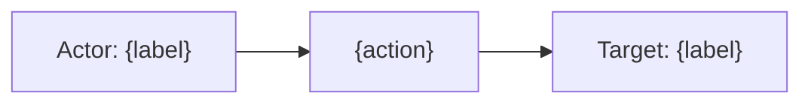

# Sub-agent prompt: Event graph example

Use this prompt when dispatching a sub-agent to append a **simple, readable** Actor → event.action → Target example to an existing domain document.

Pass 2 (`actor-target-classification.md`) is exhaustive. This pass (Pass 3) produces a **short illustrative graph** grounded in real fixture data so readers can quickly understand how a typical event flows.

**Every example must pass Step 3 (common-sense graph test)** — read the one-liner aloud before finishing.

## Variables

| Variable | Description | Example |
| --- | --- | --- |
| `{integration}` | Package name under `packages/` | `citrix_waf` |
| `{output_path}` | Path to the existing domain markdown file | `dev/domain/p1/citrix_waf.md` |
| `{repo_root}` | Absolute path to the integrations repo | `/Users/.../integrations` |

## Scope guardrails

Each sub-agent analyzes **`{integration}` only**.

**Allowed reads:** `packages/{integration}/**`, `{output_path}` (only this file under `dev/domain/p1/`), sibling packages only when named in the target package README.

**Forbidden:** other `dev/domain/p1/*.md` files, other `packages/*/` directories (unless README allows), copying examples or field values from another integration's fixtures or domain doc.

Every graph example must cite a fixture under `packages/{integration}/` **unless** the package is **assets-only** — see [package-capability.md](package-capability.md).

## Package capability (mandatory check)

**Before Step 1**, detect package type:

| Type | Pass 3 output |
| --- | --- |
| **Agent-backed** | Full **Example Event Graph** (1–3 examples) — values from `sample_event.json` / `*-expected.json` only |
| **Assets-only** | **Illustrative patterns only** — alternate section format below; **no** fabricated entity values |
| **Metrics / inventory only** | Intro + "no per-event graph" (existing rule 9) |

**Assets-only integrations** (e.g. `corelight`) have **no** `data_stream/`, **no** `sample_event.json`, and **no** ingest pipelines in this repo. Dashboard JSON is **not** a fixture.

## Entity schema

Each **Actor** and **Target** node uses this shape. Omit optional fields when not available in fixtures — do not invent values.

| Field | Required | Description | Typical ECS / vendor sources |
| --- | --- | --- | --- |
| `id` | preferred | Stable identifier | `user.id`, `host.id`, `resource.id`, ARN, session ID, request ID |
| `name` | optional | Human-readable label | `user.name`, `host.name`, `url.domain`, model name, email |
| `type` | preferred | Entity class | `user`, `host`, `service`, or `general` |
| `sub_type` | optional | Narrower category | e.g. `assumed_role`, `service_account`, `waf_profile`, `foundation_model`, `email_recipient` |
| `geo` | optional | Location string | Compose from `*.geo.city_name`, `country_name`, or `location.lat/lon` — one readable line |
| `ip` | optional | Network address | `source.ip`, `destination.ip`, `host.ip`, `client.ip` (only when it identifies the entity) |

**Event action** node:

| Field | Required | Description |
| --- | --- | --- |
| `action` | yes | The verb — what happened (e.g. `blocked`, `login`, `InvokeModel`, `ListKey`) |
| `source_field` | if `event.action` absent | ECS or vendor field used to derive the action (e.g. `azure.open_ai.operation_name`) |
| `source_value` | if `event.action` absent | Example value from a fixture |

When `event.action` **is** populated in the fixture, set `source_field` to `event.action` and copy the fixture value.

## Prompt template

```
Update {repo_root}/{output_path}:

1. KEEP all existing sections unchanged (`## Product Domain`, `## Data Collected`, `## Expected Audit Log Entities`, …).
2. REMOVE any existing `## Example Event Graph` section (if present).
3. APPEND a new `## Example Event Graph` section as specified below.

Task: For integration "{integration}", produce 1–3 simple **Actor → event.action → Target** examples grounded in real sample/fixture data. This is a summary for human readers — not an exhaustive field audit (Pass 2 already covers that). **Complete Step 3 for each example before moving on.**

---

## Step 1 — Read sources

Scope: **{integration} only**. Do not read other `dev/domain/p1/*.md` files or other `packages/*/` directories.

1. {repo_root}/{output_path} — domain doc + Pass 2 analysis (this file only)
2. Classify package per [package-capability.md](package-capability.md)
3. **Agent-backed:** `packages/{integration}/data_stream/*/sample_event.json` and `*-expected.json`
4. **Assets-only:** `packages/{integration}/kibana/dashboard/*.json` (and search assets) — field names and filter literals from embedded ES|QL only

**Agent-backed:** pick events that tell a clear story; use **actual field values** from fixtures only.

**Assets-only:** do **not** produce Example 1/2/3 with Actor/Target value tables. Use **Step 2b** format instead.

---

## Step 2 — Append section format (agent-backed)

Use this when `packages/{integration}/data_stream/` exists and package fixtures are available.

## Example Event Graph

One short intro sentence: which stream(s) the examples come from and whether they are true audit logs or audit-adjacent.

For each example (1–3), use this structure:

### Example {n}: {short title}

**Stream:** `{dataset}` · **Evidence:** `{path to sample_event.json or *-expected.json}` (Tier A)

```
Actor → event.action → Target
```

#### Actor

| Field | Value |
| --- | --- |
| id | … |
| name | … (omit row if unavailable) |
| type | user \| host \| service \| general |
| sub_type | … (omit row if unavailable) |
| geo | … (omit row if unavailable) |
| ip | … (omit row if unavailable) |

**Field sources:** bullet list mapping each populated value to its ECS/vendor field (e.g. `id ← source.ip`, `geo ← source.geo.city_name, source.geo.country_name`)

#### Event action

| Field | Value |
| --- | --- |
| action | … |
| source_field | `event.action` or vendor/ECS field path |
| source_value | exact value from fixture |

If `event.action` is missing in the fixture, set `action` to the best derived label from `source_field` / `source_value` and note that it is **not mapped to ECS today**.

#### Target

| Field | Value |
| --- | --- |
| id | … |
| name | … (omit row if unavailable) |
| type | user \| host \| service \| general |
| sub_type | … (omit row if unavailable) |
| geo | … (omit row if unavailable) |
| ip | … (omit row if unavailable) |

**Field sources:** same as Actor

#### Mermaid (optional)

When the example is clear, add a one-line mermaid flowchart:



---

## Step 3 — Validate each example (mandatory)

Before writing the next example, **read the one-liner aloud** as a plain sentence:

> “{Actor} did {action} to {target}.”

| If you hear… | Fix |
| --- | --- |
| Same entity on both sides (“user logs in to themselves”) | Re-evaluate target — login/auth usually means accessing a **service/platform**, not the user account again |
| A populated vendor field that duplicates the actor (`entity` = `actor` on auth events) | Do not copy `entity` blindly; ask what was actually accessed |
| Scope metadata presented as target (tenant ID, workspace name, tracking ID) | Move to **Scope context** under field sources; pick the primary acted-upon object |
| Collector/syslog IP as actor on application events | Actor is the HTTP/client principal, not the forwarding host |
| Forced graph on metrics/inventory/sync streams | State “no per-event graph” instead of inventing actor/target |

Then confirm Actor, Target, and Event action **tables and mermaid match the one-liner**.

Typical coherent readings (not exhaustive):

- **login / user_login / access_allowed** → user → **service/system** (e.g. Slack, Prisma Cloud, application client)
- **create user / invite** → admin → **different user**
- **download / upload / delete** → user → **file or resource**
- **API call / InvokeModel** → principal → **model, bucket, or API resource**
- **block / deny / quarantine** → client or policy engine → **URL, message, or flow peer**

When the service name is not indexed (`cloud.service.name` absent), use a **semantic target** and mark **semantic — not indexed in fixture** in field sources (Rule 7).

---

## Step 2b — Append section format (assets-only)

Use when package has **no** `data_stream/` and **no** `sample_event.json` (dashboards/content integrations).

## Example Event Graph (illustrative — no package fixtures)

Intro **must** state:

- **Package type: assets-only** — no Elastic Agent data streams or package test fixtures in-repo
- Data is ingested **outside** this package (per README); bundled dashboards query customer indices
- Patterns below are **field/schema illustrations** from dashboard ES|QL — **not** single indexed documents
- Do **not** use the label `Fixture:` for dashboard JSON files

For each pattern (1–3 max), use:

### Pattern {n}: {short title}

**Log type:** `{event.dataset}` or index pattern from dashboard ES|QL · **Evidence:** `packages/{integration}/kibana/dashboard/{file}.json` (Tier B)

```
Actor (field paths only) → action (field/literal) → Target (field paths only)
```

Example one-liner (no invented IPs or names):

```
host (source.ip) → SSL::Certificate_Expired (notice.note filter literal) → tls service (destination.ip, network.protocol)
```

#### Actor (schema)

| Field | Source in indexed data (not a sample value) |
| --- | --- |
| type | host — from `source.ip` in dashboard ES|QL |

Do **not** populate id, name, ip, geo rows unless a **literal** appears in the dashboard asset (e.g. filter value `SSL::Certificate_Expired`). Never invent endpoint IPs.

#### Event action (schema)

| Field | Source |
| --- | --- |
| action | derived label from dashboard filter or field |
| source_field | e.g. `notice.note`, `dns.response_code` |
| source_value | literal from dashboard JSON only, or "—" |

#### Target (schema)

Same pattern — field paths and filter literals only.

**No mermaid** with fake host labels unless literals exist in dashboard JSON.

**Forbidden for assets-only:** full Actor/Target tables that look like one real event; citing dashboard as `Fixture:`; inventing `data_stream.dataset` from this package's manifest.

---

## Rules

1. **Simplicity over completeness.** One primary actor, one primary action, one primary target per example. Do not list every candidate from Pass 2.
2. **Fixture-grounded values.** Cite a fixture for every id, ip, email, and hostname. Do not invent identifiers. Semantic service/product names are allowed when Rule 7 applies.
3. **Correct actor vs target.** The HTTP client blocking a request is the actor; the protected URL/application is the target. Syslog sender / collector IP is not the actor unless the event is about the collector.
4. **Common-sense graph test (mandatory).** Complete Step 3 for every example before returning. Populated vendor fields are not proof of a good graph — if the one-liner sounds wrong aloud, fix it.
5. **Action from evidence.** Prefer `event.action` when present. Otherwise derive from the strongest vendor operation field (`operation_name`, `citrix.name`, `wiz.audit.action`, etc.) and document `source_field`.
6. **Optional fields.** Omit table rows (not empty placeholders) when the fixture has no value. Do not copy unrelated geo (e.g. ADC syslog sender geo when actor is HTTP client).
7. **Semantic targets when unindexed.** Product/service names (e.g. "Slack", "Salesforce") may be valid targets when the action clearly accesses that platform but no ECS field holds the name (`cloud.service.name` absent). Mark such values **semantic — not indexed in fixture** and cite supporting context fields; do not invent IDs, IPs, or emails.
8. **Multiple examples when streams differ.** e.g. audit stream vs API telemetry vs network log — use separate examples rather than merging semantics.
9. **Metrics / inventory streams.** If no meaningful Actor → action → Target chain exists, state that in intro prose and skip forced examples (or show one note: "no per-event graph — time-bucketed metrics only").
10. **Single-integration scope.** Do not borrow examples, field values, or narrative from other integrations' domain docs or packages.
11. **Assets-only packages.** Use Step 2b only; Tier B evidence; never pretend a dashboard panel is a sample event.

---

Return the file path when done.
```

## Example invocation

Integration: `citrix_waf`  
Output: `dev/domain/p1/citrix_waf.md`

Expected output sketch:

```
Actor (host, ip=175.16.199.1, geo=Changchun, CN)
  → not blocked
  → Target (service, name=vpx247.example.net/FFC/login_post.html, sub_type=protected_web_app)
```

Fixture: `packages/citrix_waf/data_stream/log/sample_event.json`  
Action source: `event.action` ← CEF `act`

Integration: `azure_openai`  
Expected: action derived from `azure.open_ai.operation_name: ListKey` (no `event.action` in fixture)

Integration: `slack`  
Anti-pattern: `Charlie Parker → user_login → Charlie Parker` — tautological; vendor `entity` mirrors `actor` on login.  
Fixed: `Charlie Parker → user_login → Slack (service)` — semantic target; Birdland enterprise noted as scope context only.

## Notes for orchestrator

- Run **after Pass 1** (domain knowledge). Pass 2 is helpful context but not required — sub-agents can read samples directly.
- **Replace** `## Example Event Graph` on re-run; do not duplicate.
- One sub-agent per integration.
- This pass exists because Pass 2 reports are hard to scan — optimize for clarity, not coverage.
- Include [Scope guardrails](#scope-guardrails) in every prompt — do not reference peer domain docs as templates.
- **Always include Step 3 (validate)** in dispatched prompts — creation and quality-sweep runs use the same gate.
- For **quality sweeps** across many integrations: dispatch review/fix tasks (do not regenerate Pass 1/2); apply Step 3 to each existing example; change only examples that fail the read-aloud test.

## Relationship to other passes

| Pass | Prompt | Output |
| --- | --- | --- |
| 1 | `domain-knowledge.md` | Product domain + data streams |
| 2 | `actor-target-classification.md` | Exhaustive actor / action / target + ECS candidates |
| 3 | `event-graph-example.md` | 1–3 simple Actor → action → Target examples |

Pass 3 should **not contradict** Pass 2. If Pass 2 flagged ambiguous mapping, reflect the best interpretation in the graph and note uncertainty in one line under **Field sources**.
