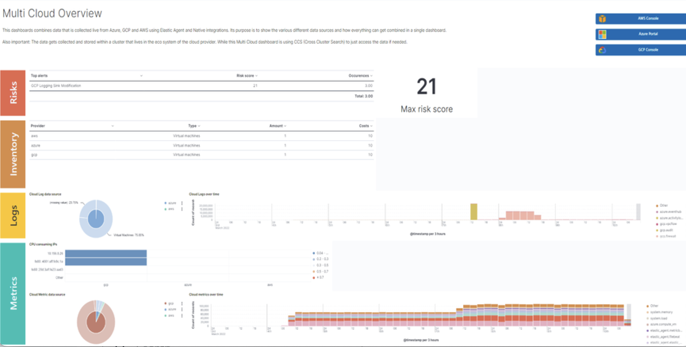
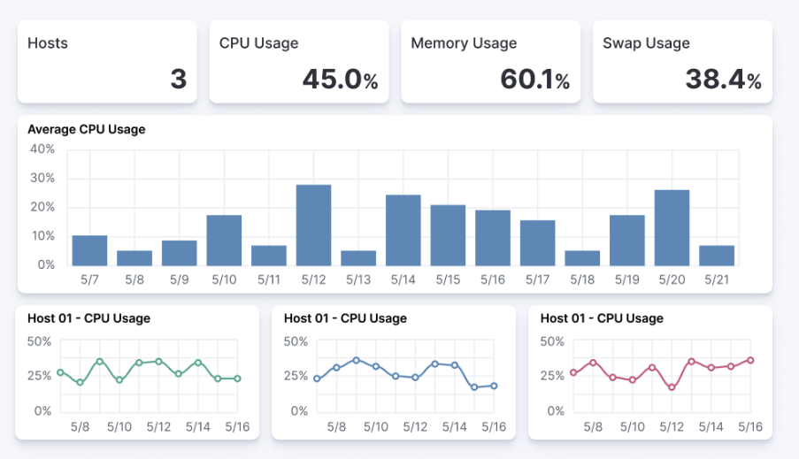
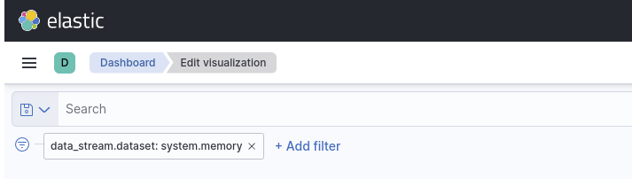

# Dashboard guidelines

A [Kibana dashboard][1] is a set of one or more panels, also referred as visualizations. Panels display data in charts, tables, maps, and more. Dashboards support several types of panels to display your data, and several options to create panels.

The goal of each integration dashboard is to:

* Provide a way to explore ingested data out of the box.
* Provide an overview of the monitored resources through installing the integration.

Each integration package should contain one or more dashboards.

## Dashboard Best Practises

### Building dashboards on stable versions

Avoid building dashboards on SNAPSHOT versions because as long as the release is not stable behavior changes might render your dashboard unusable. The only supported approach is to use a globally released version from [official releases list](https://www.elastic.co/downloads/past-releases#kibana).

### Not too many visualizations per dashboard

Include only necessary visualisation inside a Dashboard and split them up (if possible) to other dashboards. Linking can be done:

* By using a Markdown visualization to improve performance
* Use [drilldowns](https://www.elastic.co/guide/en/kibana/current/drilldowns.html) to connect dashboards where they make sense

### Out of date fields in dashboards

The dashboards must be updated to reflect any changes to field names or types. If a PR updates a field name or type, make sure it is correctly updated in any dashboard the field is being used into.

### Add Visualizations by value, not by reference inside a dashboard

Kibana visualizations can be added in a dashboard by value or by reference. Historically by value did not exist. Switching to value has the advantage that the dashboards are fully self contained and only need a single request to be installed.

To achieve this:

* Migrate existing dashboards from by reference to by value
* Create new dashboards adding visualizations by value

A migration script has been created to help with the migration: [flash1293/legacy_vis_analyzer][2]

### Choose the context of your Dashboard

Should always try to understand as much as possible what kind of context your users need to interact with. So keep the minimal context needed by answering following questions:

* Who is going to use this dashboard?
* How much time will the users have?
* What is the main goal of this dashboard and if there are, what are the secondary ones?
* What kind of charts can help users identify insights in the most immediate and clear way?

### Organisation and hierarchy matters in your dashboards

The positioning of elements in space can define their belonging, with a certain degree this can be applied to dashboards.

* Keep related visualisations close to each other

    
  
* Use Markdown to create blocks of related content

    

* Reading Direction

    Most people are used to reading from top to bottom. Place at the top of your page the most important charts and the ones that could give a brief and immediate summary of the context. A good general suggestion would be to increase the level of detail while you reach the bottom of the dashboard, this way users that are interested in getting all the information can obtain them without requiring too much effort from user that only need a quick glance of the situation.

* Central focal point

    Placing a big chart, especially with big visual shapes such as rectangles, at the center of the dashboard would help reinforce a natural visual focal point that lies in the center of the interface

    

### Use Margins

Kibana dashboards offer the possibility to apply margins between visualisations, we would suggest to always do that.
Margins create separation between charts which is an important visual feature, it helps identifying when two elements belong together or not while, at the same time, they provide more spacing and empty spaces that are always useful in making our interface more clean and elegant.

## Visualisation Best Practises

### Lens vs TSVB visualizations

**Always use Lens**, when possible. It's the best choice to be consistent and up to date and it should always be your first choice when creating new visualizations.

Migrate the dashboards from TSVB to Lens where possible. If it's not possible, please engage with the Kibana team to identify any gaps that prevent full TSVB to Lens dashboard migration.

### Visualizations should contain a filter

Kibana visualizations can define a filter to avoid performance issues querying all `metrics-*` or `logs-*` indices.

It is recommended to set a filter in each visualization at least by the required `data_stream.dataset`. More details about the Elastic data stream naming scheme [here][3].

Avoid using general filters as possible (filters with `-*`).  Combine multiple fields and values inside a filter with AND/OR operators. Although your filter might become more complex, will avoid extra queries.

Example: 

### Do not use “library visualizations”

Do not use the visualisations that show up in the `Analytics > Visualize library`. Instead define visualizations as part of the dashboard. This is the default when creating new panels by clicking “Add new visualization” on the dashboard. If some panels are already saved to the library, you can unlink them and delete them from the library. There are little use cases where library visualizations are preferable. It makes sense e.g. if a given visualization always has to be exactly the same on multiple dashboards or if its users frequently look at the visualization without looking at the whole dashboard.

### Use dashboard-native controls

The **Input controls** visualization type is deprecated in favor of **Controls** embedded into the dashboard itself. The `Controls` dropdown in the Dashboard menu bar should be used. See the [documentation](https://www.elastic.co/guide/en/kibana/master/add-controls.html) page for more information.

### Keep Consistent Color

Use color to distinguish categories, represent quantity/density, and highlight data. When using color in this way, be aware that too many colors in a single chart can create noise and hinder quick comprehension.

[Elastic UI](https://elastic.github.io/eui/#/elastic-charts/creating-charts) can provide guidance for correct color choice.
Colors provided there for visualization have been tested for accessibility contrast and using them you would be sure to properly serve the biggest audience.

If your dashboard is made to identify specific behaviors it might be interesting to consider a color setting that could help pointing it out. Use a neutral color for generic elements and an accent one for the things that you are looking for.

### Titles in Visualisations matter

Titles can have a strong visual impact on dashboards, especially when there are a lot of small charts. Two principles can generally be followed:

* Remove unnecessary or repetitive titles when the information is already explained or written within the chart
* When title is needed make it self explanatory and exhaustive, this way you will be able to remove axis titles and other specifications leaving more space for the charts itself.

### Numbers/Formatting

Reduce the number of decimal places to the absolutely necessary ones to avoid extra calculations.
Use tables whenever you need precise numbers.

[1]: https://www.elastic.co/guide/en/kibana/current/dashboard.html
[2]: https://github.com/elastic/visualizations_integrations_tools
[3]: https://www.elastic.co/blog/an-introduction-to-the-elastic-data-stream-naming-scheme
