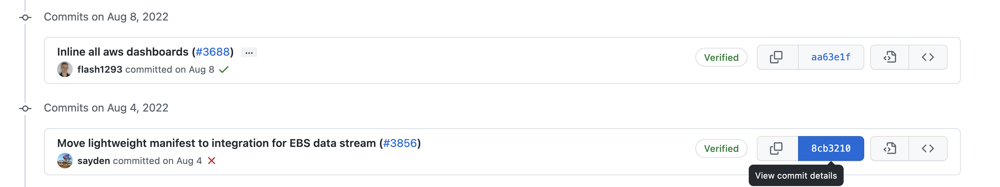
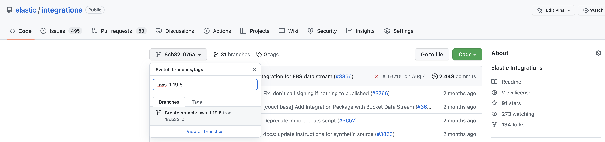

# Developer workflow: release a bug fix for supporting older version of the stack?

In some cases, when we drop the support for an older version of the stack and later on find
out needing to add a bug fix to the old stack version, we have to make some manual changes
to release the bug fix to users. For example: currently the latest AWS package version is
1.23.4. In this [PR](https://github.com/elastic/integrations/pull/3688), we dropped support
for Kibana version 7.x and bumped the AWS package version from 1.19.5 to 1.20.0. But we found
a bug in the EC2 dashboard that needs to be fixed with Kibana version 7.x. So instead of
adding a new AWS package version 1.23.5, we need to fix it between 1.19.5 and 1.20.0.

I will document the manual steps in detail here for future reference till we have automation
in place.

### Step1: Find git commit right before the Kibana version change
For my use case, the commit I need is the one right before this
[PR](https://github.com/elastic/integrations/pull/3688) and click "View commit details":

Then click "Browse files" to go to the actual commit:

### Step2: Create a branch
Create a branch out of the commit and name it `backport-<package_name>-<stack_version>`.
For example: `backport-aws-7.15.0`.

### Step3: Create a PR for the bug fix
Apply bugfixes and open a PR against the `backport-<package_name>-<stack_version>` branch.
For example: I created this [PR](https://github.com/elastic/integrations/pull/4162) to fix
the EC2 dashboard for Kibana 7.x.

Once this PR is merged, this new version of the package is going to be published automatically.
