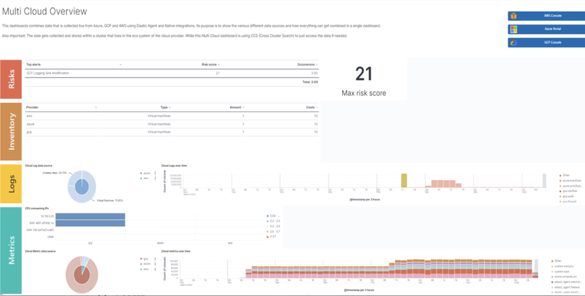

---
mapped_pages:
  - https://www.elastic.co/guide/en/integrations-developer/current/dashboard-guidelines.html
---

# Dashboard guidelines [dashboard-guidelines]

A [Kibana dashboard](docs-content://explore-analyze/dashboards.md) is a set of one or more panels, also referred to as visualizations. Panels display data in charts, tables, maps, and more. Dashboards support several types of panels to display your data, and several options to create panels.

The goal of each integration dashboard is to:

* Provide a way to explore ingested data out of the box.
* Provide an overview of the monitored resources through installing the integration.

Each integration package should contain one or more dashboards.

## Dashboard Best Practices [_dashboard_best_practices]

Following are recommended best practices for designing Kibana dashboards.

### Build dashboards on stable versions [_build_dashboards_on_stable_versions]

Avoid building dashboards on SNAPSHOT versions because as long as the release is not stable behavior changes might render your dashboard unusable. The only supported approach is to use a globally released version from the [official releases list](https://www.elastic.co/downloads/past-releases#kibana).

### Not too many visualizations per dashboard [_not_too_many_visualizations_per_dashboard]

Include only necessary visualizations inside a dashboard, and, when possible, split them across separate dashboards. Linking can be done:

* By using a Markdown visualization to improve performance
* Use [drilldowns](docs-content://explore-analyze/dashboards/drilldowns.md) to connect dashboards where they make sense.

### Out of date fields in dashboards [_out_of_date_fields_in_dashboards]

The dashboards must be updated to reflect any changes to field names or types. If a pull request updates a field name or type, make sure it is correctly updated in any dashboard the field is being used in.

### Add visualizations by value, not by reference [_add_visualizations_by_value_not_by_reference]

Kibana visualizations can be added into a dashboard by value or by reference. Historically, adding by value did not exist. Switching to value has the advantage that the dashboards are fully self contained and only need a single request to be installed.

To achieve this:

* Migrate existing dashboards from `by reference` to `by value`.
* Create new dashboards adding visualizations by value.

A migration script is available to help with the migration: [flash1293/legacy_vis_analyzer](https://github.com/elastic/visualizations_integrations_tools)

### Choose the context of your Dashboard [_choose_the_context_of_your_dashboard]

You should always try to understand as much as possible what kind of context your users need to interact with the dashboard. Keep the minimal context needed by answering the following questions:

* Who is going to use this dashboard?
* How much time will the users have?
* What is the main goal of this dashboard and what are any secondary goals?
* What kind of charts can help users identify insights in the most immediate and clear way?

### Organisation and hierarchy matters in your dashboards [_organisation_and_hierarchy_matters_in_your_dashboards]

Keep the following guidelines in mind when positioning your elements on dashboards:

* Keep related visualizations close to each other.

    

* Use Markdown to create blocks of related content.

    

* Reading Direction

    Most people are used to reading from top to bottom. Place at the top of your page the most important charts and the ones that could give a brief and immediate summary of the context. A good general guidelines is to increase the level of detail as you approach the bottom of the dashboard. This way, users interested in getting all the information can obtain it without requiring too much effort, and other users can gather what they need from only a quick glance at the topmost dashboards.

* Central focal point

    Placing a big chart at the center of a dashboard, especially one with prominent visual shapes such as rectangles, helps to reinforce a natural visual focal point that lies in the center of the interface.

    

### Use Margins [_use_margins]

Kibana dashboards offer the possibility to apply margins between visualizations, and this is highly recommended. Margins create separation between charts, which is an important visual feature, and they help users to identify when two elements belong together. At the same time, the added space makes the interface appear more clean and elegant.

## Visualization Best Practices [_visualization_best_practices]

Following are recommended best practices for designing Kibana vizualizations.

### Lens vs TSVB visualizations [_lens_vs_tsvb_visualizations]

**Always use Lens**, when possible. It’s the best choice to be consistent and up to date.

When possible, migrate dashboards from TSVB to Lens. If it’s not possible, please engage with the Kibana team to identify any gaps that prevent full TSVB to Lens dashboard migration.

### Visualizations should contain a filter [_visualizations_should_contain_a_filter]

Kibana visualizations can define a filter to avoid performance issues when querying all metrics (`metrics-*`) or logs (`logs-*`) indices.

It is recommended to set a filter in each visualization at least by the required `data_stream.dataset`. For more details, refer to the the [Elastic data stream naming scheme](https://www.elastic.co/blog/an-introduction-to-the-elastic-data-stream-naming-scheme).

As much as possible, avoid using general filters, that is filters with `-*`.  Combine multiple fields and values inside a filter with AND/OR operators. Although your filter might become more complex, it will avoid extra queries.

Example:

### Do not use library visualizations [_do_not_use_library_visualizations]

Do not use the visualizations that appear in **Analytics > Visualize library**. Instead, define visualizations as part of the dashboard. This is the default when creating new panels by clicking **Add new visualization** on the dashboard. If some panels are already saved to the library, you can unlink them and delete them from the library

There are some cases where library visualizations are preferable. It makes sense, for example, if a given visualization always has to be exactly the same on multiple dashboards or if its users frequently look at the visualization without looking at the whole dashboard.

## Use dashboard-native controls [_use_dashboard_native_controls]

The **Input controls** visualization type is deprecated in favor of **Controls** embedded into the dashboard itself. The **Controls** dropdown in the Dashboard menu bar should be used. Refer to [Filter dashboard data with controls](docs-content://explore-analyze/dashboards/add-controls.md) for more information.

### Keep Consistent Color [_keep_consistent_color]

Use color to distinguish categories, represent quantity/density, and highlight data. When using color in this way, be aware that too many colors in a single chart can create noise and hinder quick comprehension.

[Elastic UI](https://elastic.github.io/eui/#/elastic-charts/creating-charts) provides guidance for correct color choice. Colors provided there for visualization have been tested for accessibility contrast. By using them, you are sure properly serve the largest possible audience.

If your dashboard is made to identify specific behaviors, it might be interesting to consider a color setting that could help to point those out. Use a neutral color for generic elements and an accented color for the things that you want to highlight.

## Titles in Visualisations matter [_titles_in_visualisations_matter]

Titles can have a strong visual impact on dashboards, especially when there are a lot of small charts. The following principles can generally be adhered to:

* Remove unnecessary or repetitive titles when the information is already explained or written within the chart.
* When a title is needed, make it self explanatory and exhaustive. This way, you will be able to remove axis titles and other specifications leaving more space for the chart itself.
* Do not include the package name as part of each visualization title (e.g., avoid `[<PACKAGE NAME> Logs]`). This was historically done when each visualization was a separate object, but it creates unnecessary repetition in modern dashboard layouts.

