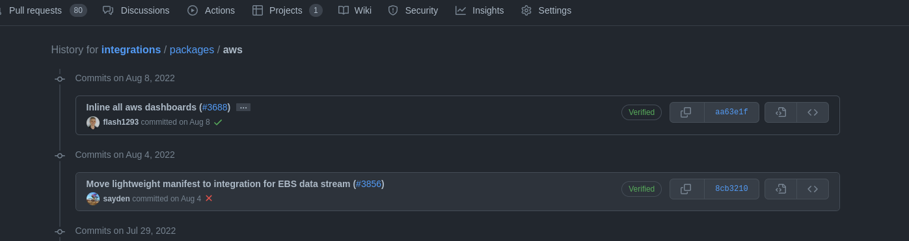
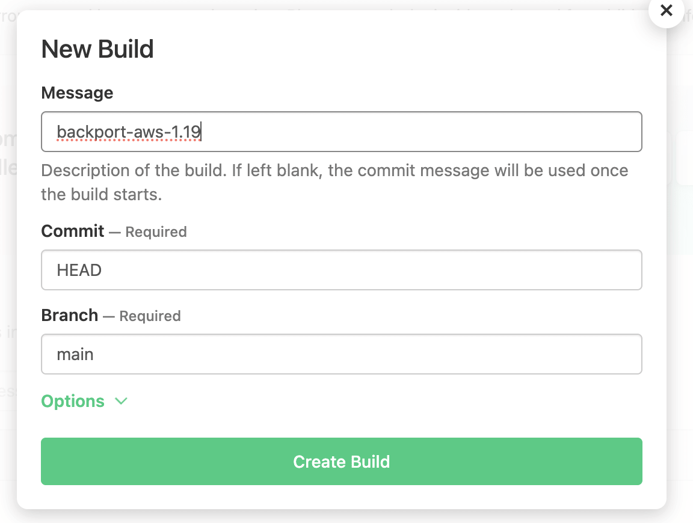
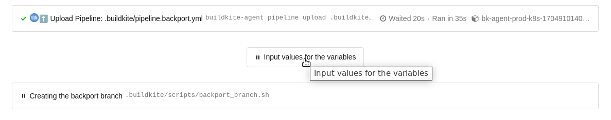

---
mapped_pages:
  - https://www.elastic.co/guide/en/integrations-developer/current/developer-workflow-support-old-package.html
---

# Release a bug fix for supporting older package version [developer-workflow-support-old-package]

Sometimes, when we drop the support for an earlier version of the stack and later on find out needing to add a bug fix to some old package version, we have to make some manual changes to release the bug fix to users. For example: in this [PR](https://github.com/elastic/integrations/pull/3688) (AWS package version 1.23.4), support for Kibana version 7.x was dropped and bumped the AWS package version from 1.19.5 to 1.20.0. But we found a bug in the EC2 dashboard that needs to be fixed with Kibana version 7.x, so instead of adding a new AWS package version 1.23.5, we need to fix it between 1.19.5 and 1.20.0. This means creating a new version (for example, 1.19.6) based on 1.19.5.

**Overview of the process:**

1. Find the git commit that introduced the target package version.
2. Run the **integrations-backport** pipeline to create the backport branch.
3. Create a PR with the bug fix against that backport branch.
4. Update the changelog in `main` to include the new version.

**Detailed steps:**

1. **Find the git commit for the target package version**

    In the example above, the commit to be fixed is the one right before this [PR](https://github.com/elastic/integrations/pull/3688) updating package `aws`:

    * Using the web:

        * Look for the merge commit of the PR

            * [https://github.com/elastic/integrations/commit/aa63e1f6a61d2a017e1f88af2735db129cc68e0c](https://github.com/elastic/integrations/commit/aa63e1f6a61d2a017e1f88af2735db129cc68e0c)
            * It can be found as one of the last messages in the PR 
            * And then show the previous commits for that changeset inside the package folder (e.g. `packages/aws`):
            * [https://github.com/elastic/integrations/commits/aa63e1f6a61d2a017e1f88af2735db129cc68e0c/packages/aws/](https://github.com/elastic/integrations/commits/aa63e1f6a61d2a017e1f88af2735db129cc68e0c/packages/aws/) 

    * Using the command line:

        * Using the helper script `dev/scripts/get_release_commit.sh`, which finds the commit directly from the package name and version:

            Syntax:
            ```bash
            ./dev/scripts/get_release_commit.sh -p <package_name> -v <version>
            ```

            Example:
            ```bash
            $ ./dev/scripts/get_release_commit.sh -p aws -v 1.19.5
            8cb321075afb9b77ea965e1373a03a603d9c9796
            ```

        * Alternatively, using `git log`:

            Syntax:
            ```bash
            git log --grep "#<pr_id>" -- packages/<package_name>
            git log -n 1 <merge_commit>^ -- packages/<package_name>
            ```

            Example:
            ```bash
            $ git log --grep "#3688" -- packages/aws
            commit aa63e1f6a61d2a017e1f88af2735db129cc68e0c
            Author: Joe Reuter <xx@email.de>
            Date:   Mon Aug 8 17:14:55 2022 +0200

                Inline all aws dashboards (#3688)

                * inline all aws dashboards

                * format

                * apply the right format

                * inline again

                * format
            $ git log -n 1 aa63e1f6a61d2a017e1f88af2735db129cc68e0c^ -- packages/aws
            commit 8cb321075afb9b77ea965e1373a03a603d9c9796
            Author: Mario Castro <xx@gmail.com>
            Date:   Thu Aug 4 16:52:06 2022 +0200

                Move lightweight manifest to integration for EBS data stream (#3856)
            ```

2. Run the **integrations-backport** pipeline [https://buildkite.com/elastic/integrations-backport](https://buildkite.com/elastic/integrations-backport) for creating the backport branch. 

    **Pay attention:** if you just run the pipeline it’ll wait for your inputs, nothing will happen without that.

    

    Pipeline’s inputs:

    * **PACKAGE_NAME** (default: "") — enter the package name, as defined in the `name` field of manifest.yml, for example `aws`
    * **PACKAGE_VERSION** (default: "") — enter the package version, for example: 1.19.7, 1.0.0-beta1
    * **BASE_COMMIT** (default: "") — enter the commit from the previous step (for example: 8cb321075afb9b77ea965e1373a03a603d9c9796)
    * **REMOVE_OTHER_PACKAGES** (default: "true") — If set to "true", all packages from the **packages** folder except the target package will be removed from the created branch. This will help to reduce CI time on the backport branch and avoid CI errors unrelated to the package being fixed, since only the affected package needs to be tested and published.
    * **DRY_RUN** (default: "true")

        * **`true`** — Performs checks and a local dry run only. It will:
            * Verify if the package is published
            * Verify if the entered commit exists
            * Verify if the entered commit publishes the expected version
            * Verify if the backport branch already exists
            * Create the local branch and update it with `.buildkite` and `.ci` folders
            * Remove other packages except the defined one (if `REMOVE_OTHER_PACKAGES` is set)

            The branch will **not** be pushed to the upstream repository.

        * **`false`** — Does everything above, plus creates a commit and pushes the local branch to the upstream repository ([https://github.com/elastic/integrations](https://github.com/elastic/integrations)). The branch will be named `backport-<package_name>-<major>.<minor>` (e.g. `backport-aws-1.19`).

3. **Create a PR for the bug fix**

    Create a new branch in your own remote (it is advised **not to use** a branch name starting with `backport-`), and apply bugfixes there. Remember to update the version in the package manifest (update patch version like `1.19.<x+1>`) and add a new changelog entry for this patch version.

    Once ready, open a PR selecting as a base branch the one created above: `backport-<package_name>-<major>.<minor>` (e.g. `backport-aws-1.19`).

    Once this PR is merged, this new version of the package is going to be published automatically following the usual CI/CD jobs. Wait for the package to appear in the [Elastic Package Registry](https://epr.elastic.co/) before proceeding to the next step.

    If it is needed to release a new fix for that version, there is no need to create a new branch. Just create a new PR to merge a new branch onto the same backport branch created previously.

4. **Update changelog in main**

    Once PR has been merged in the corresponding backport branch (e.g. `backport-aws-1.19`) and the package has been published, a new Pull Request should be created manually to update the changelog in the main branch to include the new version published in the backport branch. Make sure to add the changelog entry following the version order.

    In order to keep track, this new PR should have a reference (relates) to the backport PR too in its description.

## Known issues

1. Missing `elastic-package stack shellinit` in backport branch:

    * Example of the error:

        `Error: could not create kibana client: undefined environment variable: ELASTIC_PACKAGE_KIBANA_HOST. If you have started the Elastic stack using the elastic-package tool, please load stack environment variables using 'eval "$(elastic-package stack shellinit)"' or set their values manually`

    * **Solution**: add elastic-package stack shellinit command in `.buildkite/scripts/common.sh`.

        * `eval "$(elastic-package stack shellinit)"`

            Example: [https://github.com/elastic/integrations/blob/0226f93e0b1493d963a297e2072f79431f6cc443/.buildkite/scripts/common.sh#L828](https://github.com/elastic/integrations/blob/0226f93e0b1493d963a297e2072f79431f6cc443/.buildkite/scripts/common.sh#L828)

2. License file not found in backport branch:

    * Example of the error:

        `Error: checking package failed: building package failed: copying license text file: failure while looking for license "licenses/Elastic-2.0.txt" in repository: failed to find repository license: stat /opt/buildkite-agent/builds/bk-agent-prod-gcp-1703092724145948143/elastic/integrations/licenses/Elastic-2.0.txt: no such file or directory`

    * **Solution**: Remove line defining `ELASTIC_PACKAGE_REPOSITORY_LICENSE` environment variable.

        * Example: [https://github.com/elastic/integrations/blob/0daff27f0e0195a483771a50d60ab28ca2830f75/.buildkite/pipeline.yml#L17](https://github.com/elastic/integrations/blob/0daff27f0e0195a483771a50d60ab28ca2830f75/.buildkite/pipeline.yml#L17)


