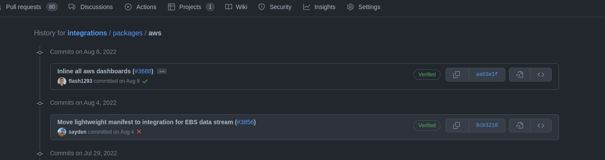

---
mapped_pages:
  - https://www.elastic.co/guide/en/integrations-developer/current/developer-workflow-support-old-package.html
---

# Release a bug fix for supporting older package version [developer-workflow-support-old-package]

Sometimes, when we drop the support for an earlier version of the stack and later on find out needing to add a bug fix to some old package version, we have to make some manual changes to release the bug fix to users. For example: in this [PR](https://github.com/elastic/integrations/pull/3688) (AWS package version 1.23.4), support for Kibana version 7.x was dropped and bumped the AWS package version from 1.19.5 to 1.20.0. But we found a bug in the EC2 dashboard that needs to be fixed with Kibana version 7.x, so instead of adding a new AWS package version 1.23.5, we need to fix it between 1.19.5 and 1.20.0. This means creating a new version (for example, 1.19.6) based on 1.19.5.

**Overview of the process:**

1. Find the git commit that introduced the target package version.
2. Open a PR adding a new entry to `.backports.yml` — CI validates and dry-runs the branch creation, and the branch is created automatically on merge.
3. Create a PR with the bug fix against that backport branch.
4. Update the changelog in `main` to include the new version.

**Detailed steps:**

1. **Find the git commit for the target package version**

    In the example above, the commit to be fixed is the one right before this [PR](https://github.com/elastic/integrations/pull/3688) updating package `aws`:

    * Using the web:

        * Look for the merge commit of the PR

            * [https://github.com/elastic/integrations/commit/aa63e1f6a61d2a017e1f88af2735db129cc68e0c](https://github.com/elastic/integrations/commit/aa63e1f6a61d2a017e1f88af2735db129cc68e0c)
            * It can be found as one of the last messages in the PR 
            * And then show the previous commits for that changeset inside the package folder (e.g. `packages/aws`):
            * [https://github.com/elastic/integrations/commits/aa63e1f6a61d2a017e1f88af2735db129cc68e0c/packages/aws/](https://github.com/elastic/integrations/commits/aa63e1f6a61d2a017e1f88af2735db129cc68e0c/packages/aws/) 

    * Using the command line:

        * Using the helper script `dev/scripts/get_release_commit.sh`, which finds the commit directly from the package name and version:

            Syntax:
            ```bash
            ./dev/scripts/get_release_commit.sh -p <package_name> -v <version>
            ```

            Example:
            ```bash
            $ ./dev/scripts/get_release_commit.sh -p aws -v 1.19.5
            8cb321075afb9b77ea965e1373a03a603d9c9796
            ```

        * Alternatively, using `git log`:

            Syntax:
            ```bash
            git log --grep "#<pr_id>" -- packages/<package_name>
            git log -n 1 <merge_commit>^ -- packages/<package_name>
            ```

            Example:
            ```bash
            $ git log --grep "#3688" -- packages/aws
            commit aa63e1f6a61d2a017e1f88af2735db129cc68e0c
            Author: Joe Reuter <xx@email.de>
            Date:   Mon Aug 8 17:14:55 2022 +0200

                Inline all aws dashboards (#3688)

                * inline all aws dashboards

                * format

                * apply the right format

                * inline again

                * format
            $ git log -n 1 aa63e1f6a61d2a017e1f88af2735db129cc68e0c^ -- packages/aws
            commit 8cb321075afb9b77ea965e1373a03a603d9c9796
            Author: Mario Castro <xx@gmail.com>
            Date:   Thu Aug 4 16:52:06 2022 +0200

                Move lightweight manifest to integration for EBS data stream (#3856)
            ```

2. **Add a new entry to `.backports.yml` and open a PR**

    The backport branch is created automatically when a new entry is merged into `.backports.yml`.

    **Recommended: use the `AddBackportEntry` mage target**

    This target resolves the base commit automatically (combining steps 1 and 2) and inserts the entry in the correct position in the file:

    ```bash
    mage AddBackportEntry <package_name> <base_version>
    ```

    Example:
    ```bash
    $ mage AddBackportEntry aws 1.19.5
    Added: branch=backport-aws-1.19 base_commit=8cb321075afb9b77ea965e1373a03a603d9c9796
    ```

    **Alternatively: add the entry manually**

    Open a PR adding the entry for the branch you need:

    ```yaml
    - package: <package_name>
      branch: backport-<package_name>-<major>.<minor>
      base_version: "<version>"
      base_commit: "<commit_from_step_1>"
      maintained_until: null
      archived: false
    ```

    Example for the `aws` package at version `1.19.5`:

    ```yaml
    - package: aws
      branch: backport-aws-1.19
      base_version: "1.19.5"
      base_commit: "8cb321075afb9b77ea965e1373a03a603d9c9796"
      maintained_until: null
      archived: false
    ```

    Fields:

    * **`package`** — package name as defined in the `name` field of `manifest.yml`
    * **`branch`** — name of the backport branch to create, following the format `backport-<package_name>-<major>.<minor>`
    * **`base_version`** — the package version to branch from (e.g. `1.19.5`, `1.0.0-beta1`)
    * **`base_commit`** — the commit SHA found in the previous step
    * **`maintained_until`** — `null` for a new active branch. Set to a `YYYY-MM-DD` date when the branch has a known end-of-life: the branch is automatically excluded from the checklist and inventory validation once that date passes (strictly before today in UTC). Prefer this over `archived: true` when the end-of-life date is known in advance.
    * **`archived`** — `false` for a new active branch. Set to `true` to immediately exclude the branch from the checklist and inventory validation, with no fixed end-of-life date. Archiving does **not** delete the branch — packages can still be published from it; archiving only removes it from automated tooling.
    * **`remove_other_packages`** — `true` (default): when the branch is created, all packages other than the target are removed from `packages/`. `false`: all packages are kept. The default of `true` keeps the branch lean and avoids running tests for unrelated packages on every PR.

    Once the PR is opened, CI automatically:

    * Validates the new entry schema (`check-backports-inventory`)
    * Runs a **dry run** of the branch creation, which verifies that the package is published, the commit exists, the commit publishes the expected version, and the branch does not already exist — without pushing anything

    The PR requires review from the `elastic/ecosystem` team (they are the CODEOWNERS of `.backports.yml`). Once merged to `main`, the branch `backport-<package_name>-<major>.<minor>` is created and pushed automatically. A comment is posted on the merged PR confirming success or failure of the branch creation.

    By default, the backport branch is created with only the target package in the `packages/` directory — all other packages are removed. This keeps the branch lean and avoids running tests for unrelated packages on every PR opened against it.

3. **Create a PR for the bug fix**

    **Recommended: use `backport_apply.sh`**

    `backport_apply.sh` handles the entire process: cherry-picking the commit, bumping the patch version, writing the changelog entry, syncing package owners, and opening a PR.

    ```bash
    dev/scripts/backport_apply.sh \
      --sha <merge_commit_sha> \
      --package <package_name> \
      --target <branch_or_version> \
      --open-pr
    ```

    Required arguments:

    | Argument | Description |
    |----------|-------------|
    | `--sha` | Merge commit SHA on `main` to cherry-pick (minimum 8 characters; from step 1). |
    | `--package` | Package name as it appears in `manifest.yml`. |
    | `--target` | Version series (e.g. `6.14`) or full branch name (e.g. `backport-aws-6.14`); the branch name is derived automatically from the version series. |

    Common optional flags:

    | Flag | Description |
    |------|-------------|
    | `--open-pr` | Create a GitHub PR after pushing the working branch. |
    | `--dry-run` | Commit locally and skip push and PR creation; use to review the result before opening a PR. |

    What the script does, in order:

    1. Fetches the backport branch and creates a local working branch (`auto-backport/<pkg>-<version>-<sha8>`).
    2. Cherry-picks `<sha>`, auto-resolving version-only conflicts in `manifest.yml`; restores `changelog.yml` to HEAD (it is regenerated in the next step).
    3. Bumps the patch version in `manifest.yml` and inserts a new `changelog.yml` entry (with a placeholder link that is fixed after the PR is opened).
    4. Syncs package owners from `main` as a separate commit — see [Package owner synchronization](#package-owner-synchronization).
    5. Pushes the working branch and opens a PR against the backport branch (with `--open-pr`).
    6. Replaces the placeholder link in `changelog.yml` with the real backport PR URL and pushes a second `Fix changelog link to backport PR` commit.

    If the cherry-pick conflicts on files beyond a version-line difference in `manifest.yml`, the script reports the conflicting files and cleans up. In this case, apply the fix manually (see the alternative path below).

    > **Coming soon:** once the auto-backport workflow lands, checking a branch checkbox in the backport checklist comment will trigger the same process automatically on merge — no manual invocation of `backport_apply.sh` needed. The script remains useful for ad-hoc backports and retries.

    **Alternative: manual cherry-pick**

    Create a new branch in your own remote (do **not** use a name starting with `backport-`), apply the bug fix, bump the patch version in `manifest.yml`, and add a `changelog.yml` entry. Open a PR targeting the backport branch.

    Once this PR is merged, the new version of the package is published automatically. Wait for it to appear in the [Elastic Package Registry](https://epr.elastic.co/) before proceeding to the next step.

    For subsequent fixes to the same version, no new branch is needed — open a new PR against the same backport branch.

4. **Update changelog in main**

    Once PR has been merged in the corresponding backport branch (e.g. `backport-aws-1.19`) and the package has been published, a new Pull Request should be created manually to update the changelog in the main branch to include the new version published in the backport branch. Make sure to add the changelog entry following the version order.

    In order to keep track, this new PR should have a reference (relates) to the backport PR too in its description.

## Package owner synchronization

Backport branches are created from historical commits, so their `manifest.yml` owner field and `.github/CODEOWNERS` entries may be stale from the start and can drift further as packages change hands on `main`. Because GitHub resolves PR reviewers from the CODEOWNERS on the PR's **base branch**, a stale backport branch notifies the wrong team.

Two mechanisms keep owners in sync.

### Automatic sync during apply

When `backport_apply.sh` (or `mage applyBackport`) creates a backport PR, it automatically syncs the package's owners from `main` as a separate commit on top of the cherry-pick:

- **What is synced:** the `owner.github` field in `manifest.yml`, the package's own `.github/CODEOWNERS` line, and any sub-path entries nested under the package (data streams, `kibana/` directory, and other subdirectory overrides).
- **Commit message:** `Sync <package> package owners from main`
- **No-op:** if the owners already match `main`, the commit is skipped silently.
- **Warn-and-continue:** if `main` cannot be fetched, or the package no longer exists on `main`, a warning is printed and the apply continues without syncing. The backport PR is still opened; the CI check below surfaces any remaining mismatch.

### CI check: `check-backport-owners`

A Buildkite step runs on every pull request targeting a `backport-*` branch (triggered when `packages/**` or `.github/CODEOWNERS` changes) and posts a comment on the PR with one of three outcomes:

- **✅ In sync** — `Package owners are in sync with main.` No action needed.
- **Mismatch** — `Package owners are out of sync with main:` followed by a list of packages and the team(s) they should now be owned by. Update `manifest.yml` (`owner.github`) and `.github/CODEOWNERS` for each listed package to match the teams shown.
- **Check failed** — `The backport owner check failed to run` with a link to the build log. This is usually a transient network error fetching `main`; re-run the build.

The step is currently `soft_fail: true` — a mismatch posts a warning comment but does not block merge.

## Backport checklist comment

When you open or update a pull request targeting `main`, the `post-backport-checklist.yml` workflow automatically posts a comment listing the active backport branches for every package touched by that PR. The comment is updated on every push — any manual edits are overwritten. It only appears when at least one package in the PR's diff has active backport branches in `.backports.yml`.

Example comment:

```
## Backport branches

> [!IMPORTANT]
> Only branches for packages touched by this PR's current diff are shown.
> This comment is updated automatically on each push — manual edits will be overwritten.

Active backport branches for the packages touched by this PR:

**aws**
- `backport-aws-1.19` (maintained until 2025-06-30)
- `backport-aws-6.x`

---

> [!TIP]
> If a branch above is no longer required, set `archived: true` in its entry in `.backports.yml` to stop it appearing here.
> If the branch has a known end-of-life date, prefer `maintained_until: "YYYY-MM-DD"` — it will be excluded automatically once that date passes.
```

The comment is currently **informational only** — no checkboxes are rendered and no automation is triggered by it. If you do not intend to backport, you can safely ignore it.

**Suppressing a branch from the checklist:**

To stop a branch appearing in the checklist, update its entry in `.backports.yml`:

- **`archived: true`** — excludes the branch immediately, with no fixed end-of-life date.
- **`maintained_until: "YYYY-MM-DD"`** — excludes the branch automatically once that date passes; preferred when the end-of-life date is known.

Archiving a branch does not delete it. Packages can still be published from an archived branch; archiving only removes the branch from the checklist and inventory validation.

## Known issues

1. Missing `elastic-package stack shellinit` in backport branch:

    * Example of the error:

        `Error: could not create kibana client: undefined environment variable: ELASTIC_PACKAGE_KIBANA_HOST. If you have started the Elastic stack using the elastic-package tool, please load stack environment variables using 'eval "$(elastic-package stack shellinit)"' or set their values manually`

    * **Solution**: add elastic-package stack shellinit command in `.buildkite/scripts/common.sh`.

        * `eval "$(elastic-package stack shellinit)"`

            Example: [https://github.com/elastic/integrations/blob/0226f93e0b1493d963a297e2072f79431f6cc443/.buildkite/scripts/common.sh#L828](https://github.com/elastic/integrations/blob/0226f93e0b1493d963a297e2072f79431f6cc443/.buildkite/scripts/common.sh#L828)

2. License file not found in backport branch:

    * Example of the error:

        `Error: checking package failed: building package failed: copying license text file: failure while looking for license "licenses/Elastic-2.0.txt" in repository: failed to find repository license: stat /opt/buildkite-agent/builds/bk-agent-prod-gcp-1703092724145948143/elastic/integrations/licenses/Elastic-2.0.txt: no such file or directory`

    * **Solution**: Remove line defining `ELASTIC_PACKAGE_REPOSITORY_LICENSE` environment variable.

        * Example: [https://github.com/elastic/integrations/blob/0daff27f0e0195a483771a50d60ab28ca2830f75/.buildkite/pipeline.yml#L17](https://github.com/elastic/integrations/blob/0daff27f0e0195a483771a50d60ab28ca2830f75/.buildkite/pipeline.yml#L17)


