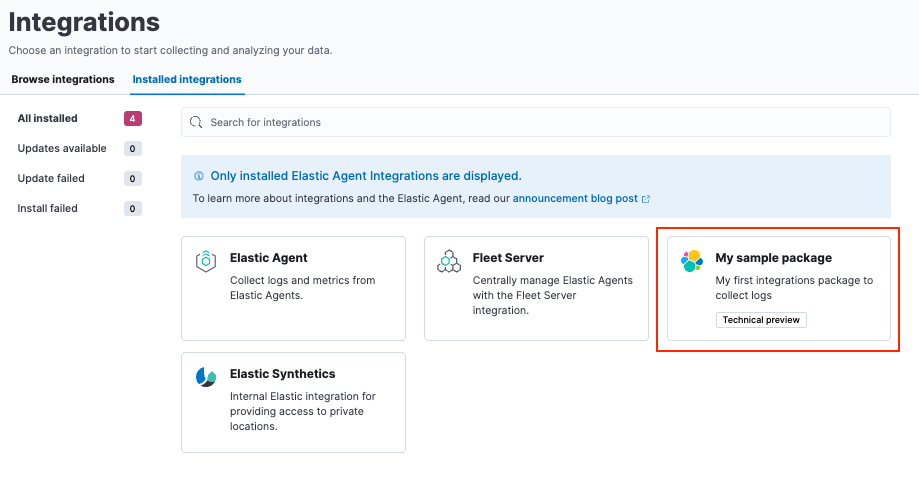
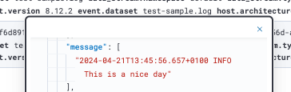

---
mapped_pages:
  - https://www.elastic.co/guide/en/integrations-developer/current/quick-start.html
---

# Quick start: Sample integration [quick-start]

::::{note}
This quick start is designed for users familiar with the {{stack}}. If you’re new to Elastic, [*Build an integration*](/extend/build-new-integration.md) provides an in-depth look at creating a new integration.
::::


This is a quick guide on how you can build your own integration package and upload it to Kibana.

Follow these steps to create an integration package named `sample` and then add a `logs` dataset. The same procedure can be used for a `metrics` dataset, however for your first integration package `logs` is a bit simpler because a custom input is not required.

* [Prerequisites](#qs-prereqs)
* [Step 1: Create the package](#qs-create-package)
* [Step 2: Upload the package to Kibana](#qs-test-upload)
* [Step 3: Create a dataset](#qs-create-dataset)
* [Step 4: Add processing](#qs-add-processing)
* [Step 5: Release a new version](#qs-release-new-version)
* [Step 6: Ingest data](#qs-ingest-data)
* [What’s next?](#qs-whats-next)


## Prerequisites [qs-prereqs]

You’ll need to have a few requirements in place to run this tutorial:

* [elastic-package](https://github.com/elastic/elastic-package) installed on your machine. This is a command line tool, written in Go, used for developing Elastic packages. It can help you lint, format, test, build, and promote your packages. Setup instructions can be found in the elastic-package repository readme.
* A [GitHub repository](https://github.com/) where you can upload your integration package.
* [Docker](https://www.docker.com/) set up and running on your machine.


## Step 1: Create the package [qs-create-package]

1. To start, from inside a Git repository, run the `elastic-package create package` command. This will launch a wizard that will prompt you for some details, and will then build an empty package with all the necessary parts:

    ```console
    elastic-package create package
    ```

2. Respond to prompts as follows:

    * Package type: `integration`
    * Package name: `sample`
    * Version: `0.0.1`
    * License: `Elastic-2.0`
    * Package title: `My sample package`
    * Description: `My first integrations package to collect logs`
    * Categories: `custom`
    * Kibana version constraint: `^8.12.2`
    * Required Elastic subscription: `basic`
    * Github owner: `<your github name>`
    * Owner type: `elastic`

3. After entering the details, the command should return a confirmation that your package has been created.
4. Change into the new `sample` package directory.

    ```console
    cd sample
    ```

5. Validate that the new integration package was created correctly.

    1. Check the linting rules for the package

        ```console
        elastic-package lint
        ```

    2. Format the package to fix linting

        ```console
        elastic-package format
        ```

    3. Build a `.zip` file out of the package assets

        ```console
        elastic-package build
        ```

    4. If you prefer, you can also run the three previous commands as a single batch:

        ```console
        elastic-package check
        ```


## Step 2: Upload the package to Kibana [qs-test-upload]

1. To test that your package can be installed into Kibana, a cluster needs to spin up. For this step you to have a running Docker setup. Run the following command:

    ```console
    elastic-package stack up --version=8.12.2 -v
    ```

    This spins up a cluster with the version 8.12.2 of the {{stack}}. The cluster can be accessed in your browser at [https://localhost:5601](https://localhost:5601) with username `elastic` and password `changeme`.

    ::::{note}
    * If you want to update to the latest {{stack}} version, run `elastic-package stack update --version=8.12.2 -v`.
    * You can also install the package directly into an existing cluster for testing. Steps and customization options for the `install` command are described in this [How To guide](https://github.com/elastic/elastic-package/blob/main/docs/howto/install_package.md) in the `elastic-package` repository.

    ::::

2. After the cluster has finished setting up, open a second terminal window and run the following command to install your package:

    ```console
    elastic-package install
    ```

3. After the command runs, check that your new package appears in Kibana under **Management > Integrations > Installed integrations**.

    


## Step 3: Create a dataset [qs-create-dataset]

You’ve now built an integration package, but it does not contain any assets. For the goal of starting to collect logs, you need to create a dataset, and for it the Elasticsearch mappings and ingest pipelines. If you want to be able to collect data through a managed {{agent}}, you also need to add an agent policy template.

1. Create a new dataset:

    ```console
    elastic-package create data-stream
    ```

2. When prompted, provide the following details:

    * Data stream name: log
    * Data stream title: My log lines
    * Type: logs

        The command creates the required data in the `/data_stream/log` directory. If you pick `log` as data stream name, the dataset is called `sample.log` and the final data stream created will be `logs-sample.log-default` as an example.

3. To not have to worry about mappings, you can pull in all [Elastic Common Schema (ECS) fields](ecs://reference/index.md). To do this, create the file `_dev/build/build.yml` under the root directory and add the following content:

    ```yaml
    dependencies:
      ecs:
        reference: git@v8.6.0
        import_mappings: true
    ```

4. It’s always a good idea to re-check to make sure that your package still builds and works as expected.

    ```console
    elastic-package check
    ```

5. Re-install your package.

    ```console
    elastic-package install
    ```

    This reinstalls the package and create mapping templates for `logs-sample.log-*`. You can also add your own mappings under `data_stream/log/fields/fields.yml` if needed.


## Step 4: Add processing [qs-add-processing]

You can now already ship log files to `logs-sample.log-default` but no processing will happen. So, let’s create a sample log file.

1. Create a file `test-sample.log` with the following contents, and save it anywhere on your local machine.

    ```console
    2024-04-21T13:44:56.657+0100 INFO Hello world
    2024-04-21T13:45:56.657+0100 INFO This is a nice day
    2024-04-21T13:46:56.657+0100 INFO I am working on stuff
    ```

    Each line of the log file will be shipped by {{agent}} as a document with the message field containing the log line. You will set up the dissect processor to take the log line apart into `@timestamp`, `log.level`, and `message`.

2. Next, test your ingest pipeline. In {{kib}} navigate to **Management > Dev Tools** and run the [Simulate pipeline API](https://www.elastic.co/docs/api/doc/elasticsearch/operation/operation-ingest-simulate):

    ```console
    POST /_ingest/pipeline/_simulate
    {
      "pipeline" :
      {
        "description": "logs-sample.log",
        "processors": [
          {
            "dissect" : {
              "field" : "message",
              "pattern" : "%{@timestamp} %{log.level} %{message}"
            }
          }
        ]
      },
      "docs": [
        {
          "_index": "index",
          "_id": "id",
          "_source": {
            "message": "2023-02-21T13:46:56.657+0100 INFO I am working on stuff"
          }
        }
      ]
    }
    ```

    This returns:

    ```console
    {
      "docs": [
        {
          "doc": {
            "_index": "index",
            "_version": "-3",
            "_id": "id",
            "_source": {
              "@timestamp": "2023-02-21T13:46:56.657+0100",
              "message": "I am working on stuff",
              "log": {
                "level": "INFO"
              }
            },
            "_ingest": {
              "timestamp": "2024-04-30T17:51:22.16442471Z"
            }
          }
        }
      ]
    }
    ```

3. Now that you’ve confirmed that the ingest pipeline is working, add it to your dataset by modifying `data_stream/log/elasticsearch/ingest_pipline/default.yml` to:

    ```console
    description: Pipeline for processing sample logs
    processors:
    - dissect:
        field: message
        pattern: "%{@timestamp} %{log.level} %{message}"
    on_failure:
    - set:
        field: error.message
        value: '{{ _ingest.on_failure_message }}'
    ```

4. Now run `elastic-package check` again and then re-upload the package with `elastic-package install`. This installs your new ingest pipeline.
5. Do a quick test run to test the new pipeline. In the **Dev tools** console, run:

    ```console
    POST logs-sample.log-default/_doc
    {
      "message": "2023-02-21T13:46:56.657+0100 INFO I am working on stuff"
    }
    ```

    The response is:

    ```console
    {
      "_index": ".ds-logs-sample.log-default-2024.04.30-000001",
      "_id": "BsUtMI8BQEniT9Md_TYh",
      "_version": 1,
      "result": "created",
      "_shards": {
        "total": 2,
        "successful": 1,
        "failed": 0
      },
      "_seq_no": 0,
      "_primary_term": 1
    }
    ```

6. Now run:

    ```console
    GET logs-sample.log-default/_search
    ```

    The response is:

    ```console
    {
      "took": 1,
      "timed_out": false,
      "_shards": {
        "total": 1,
        "successful": 1,
        "skipped": 0,
        "failed": 0
      },
      "hits": {
        "total": {
          "value": 1,
          "relation": "eq"
        },
        "max_score": 1,
        "hits": [
          {
            "_index": ".ds-logs-sample.log-default-2024.04.30-000001",
            "_id": "BsUtMI8BQEniT9Md_TYh",
            "_score": 1,
            "_source": {
              "@timestamp": "2023-02-21T13:46:56.657+0100",
              "message": "I am working on stuff",
              "event": {
                "agent_id_status": "missing",
                "ingested": "2024-04-30T18:04:31Z"
              },
              "log": {
                "level": "INFO"
              }
            }
          }
        ]
      }
    }
    ```


Now that you can see the dissected message documented, you’re ready to ingest data.


## Step 5: Release a new version [qs-release-new-version]

1. Since your initial `0.0.1` version of the package, many modifications have been made. To build a new package version, open the `sample/manifest.yml` file and change the package version to `0.2.0`:

    ```console
    format_version: 3.1.3
    name: sample
    title: "My sample package"
    version: 0.2.0
    ```

2. You also need to add an entry to your `sample/changelog.yml` file. Make sure to add the new entry at the top of the file:

    ```console
    - version: "0.2.0"
      changes:
        - description: Added sample log processing pipeline
          type: enhancement
          link: http://fake-link
    ```

    ::::{note}
    You can also update the changelog file automatically using the [`elastic-package changelog`](https://github.com/elastic/elastic-package?tab=readme-ov-file#elastic-package-changelog) command.
    ::::

3. Run `elastic-package check` again and then the `elastic-package install` command.

    The `0.1.0` version of the package is updated to version `0.2.0`. Only one version of a package can be installed at a time, but, following these steps, different versions of a package can be rolled out over time.


When developing integrations the following versioning guidelines should be used:

* Patch release (x.y.**Z**): For backward-compatible bug fixes
* Minor release (x.**Y**.z): For backward-compatible new features
* Major release (**X**.y.z): For changes that break backward compatibility


## Step 6: Ingest data [qs-ingest-data]

There are two different ways that you can ingest data, using either standalone {{agent}} or {{agent}} managed by {{fleet}}. For this example, you can use standalone {{agent}} since that won’t require any additional changes to the integration package.

::::{note}
To run these steps using {{fleet}}-managed {{agent}}, you just need to update the files `data_stream/log/agent/stream/stream.yml.hbs` and `data_stream/log/manifest.yml` to provide the correct configuration, which you can find in the {{fleet}} UI.
::::


1. [Download the {{agent}} install package](https://www.elastic.co/downloads/elastic-agent) to your machine.
2. Download the {{agent}} package, extract it, and change into the package directory. You can find the steps for each available platform in [Install standalone {{agents}}](docs-content://reference/fleet/install-standalone-elastic-agent.md).

    You can also download a package directly from the [{{agent}} download site](https://www.elastic.co/downloads/elastic-agent).

3. In the {{agent}} package directory, open the `elastic-agent.yml` configuration file for editing.
4. Replace the contents of `elastic-agent.yml` with the following:

    ```console
    inputs:
      - type: logfile
        streams:
          - data_stream:
              # This must be aligned with the dataset name given
              dataset: test-sample.log
            paths:
              # Path to your log file
              - /<PATH-TO-LOG-FILE>/test-sample.log

    outputs:
      default:
        type: elasticsearch
        hosts: ["https://127.0.0.1:9200"]
        username: "elastic"
        password: "changeme"
        ssl.verification_mode: none
    ```

    Where:

    * `dataset` is set to match the `test-sample.log` file that you created.
    * <PATH-TO-LOG-FILE> is the full path the `test-sample.log` file that you created.

5. Run {{agent}}:

    ```console
    sudo ./elastic-agent -e
    ```

    This will pick up the log file, ship it to {{es}}, and process it with the ingest pipeline.

6. Confirm that your log file is being ingested as expected:

    1. In {{kib}}, open **Discover**.
    2. In the search field, enter `log.file.path.text : *`. The search should return a couple of log entries.
    3. Hover over an entry and click `Enter` to view the cell contents.

        


## What’s next? [qs-whats-next]

You now have your own integration package that you can update with new features and ship to an {{stack}} or share with others.

In the integrations [Contributing Guide](https://github.com/elastic/integrations/blob/main/CONTRIBUTING.md) you can find instructions for adding additional assets to your integrations, such as {{kib}} dashboards.

Let others know about your new integration:

* Promote your Integration with Elastic in the [Elastic Community](https://www.elastic.co/community/).
* Register on [Elastic’s Partner Portal](https://partners.elastic.co/English/register_email.aspx) as a Technology Partner.
