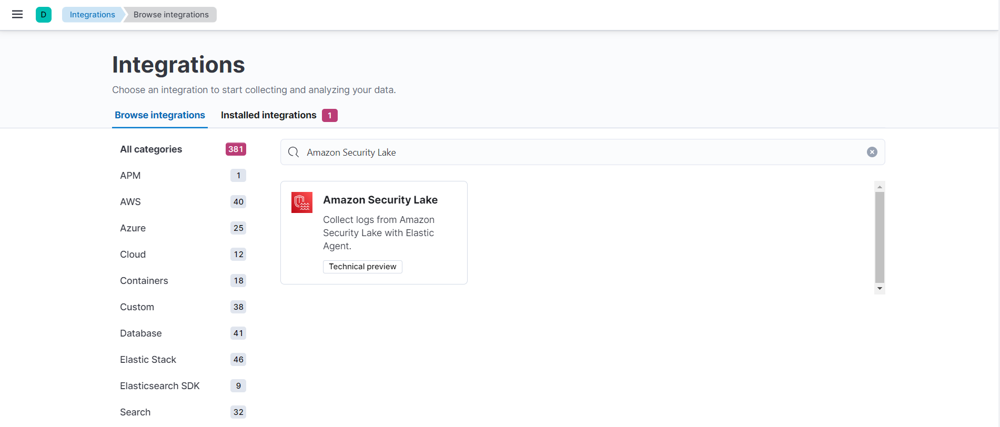
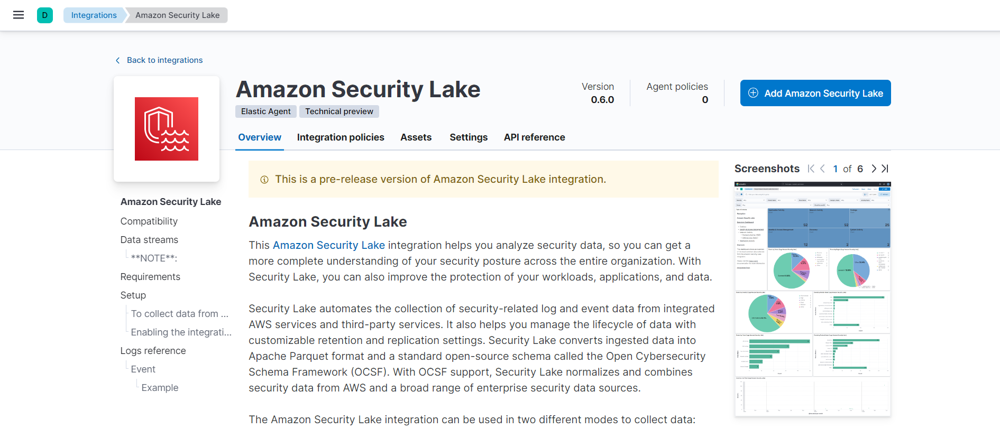

# Amazon Security Lake

This [Amazon Security Lake](https://aws.amazon.com/security-lake/) integration helps you analyze security data, so you can get a more complete understanding of your security posture across the entire organization. With Security Lake, you can also improve the protection of your workloads, applications, and data.

Security Lake automates the collection of security-related log and event data from integrated AWS services and third-party services. It also helps you manage the lifecycle of data with customizable retention and replication settings. Security Lake converts ingested data into Apache Parquet format and a standard open-source schema called the Open Cybersecurity Schema Framework (OCSF). With OCSF support, Security Lake normalizes and combines security data from AWS and a broad range of enterprise security data sources.

The Amazon Security Lake integration currently supports only one mode of log collection:
- AWS S3 polling mode: Amazon Security Lake writes data to S3, and Elastic Agent polls the S3 bucket by listing its contents and reading new files.

## Compatibility

This module follows the OCSF Schema Version **v1.1.0**.

## Data streams

The Amazon Security Lake integration collects logs from both [Third-party services](https://docs.aws.amazon.com/security-lake/latest/userguide/integrations-third-party.html) and [AWS services](https://docs.aws.amazon.com/security-lake/latest/userguide/open-cybersecurity-schema-framework.html) in an event data stream.

### **NOTE**:
- The Amazon Security Lake integration supports events collected from [AWS services](https://docs.aws.amazon.com/security-lake/latest/userguide/internal-sources.html) and [third-party services](https://docs.aws.amazon.com/security-lake/latest/userguide/custom-sources.html).

- Due to the nature and structure of the OCSF schema, this integration has limitations on how deep the mappings run. Some important objects like 'Actor', 'User' and 'Product' have more fleshed-out mappings compared to others which get flattened after the initial 2-3 levels of nesting to keep them maintainable in a YAML format. This will evolve on a need-by-need basis going forward.

## Requirements

- Elastic Agent must be installed.
- Elastic Agent is required to stream data from Amazon Security Lake and ship the data to Elastic, where the events will then be processed via the integration's ingest pipelines.

## Setup

### To collect data from Amazon Security Lake follow the below steps:

1. To enable and start Amazon Security Lake, follow the steps mentioned here: [`https://docs.aws.amazon.com/security-lake/latest/userguide/getting-started.html`](https://docs.aws.amazon.com/security-lake/latest/userguide/getting-started.html).
2. After creating the data lake, follow the steps below to create data subscribers to consume data.
   - Open the [Security Lake console](https://console.aws.amazon.com/securitylake/).
   - By using the AWS Region selector in the upper-right corner of the page, select the Region where you want to create the subscriber.
   - In the navigation pane, choose **Subscribers**.
   - On the Subscribers page, choose **Create subscriber**.
   - For **Subscriber details**, enter **Subscriber name** and an optional Description.
   - For **Log and event sources**, choose which sources the subscriber is authorized to consume.
   - For **Data access method**, choose **S3** to set up data access for the subscriber.
   - For **Subscriber credentials**, provide the subscriber's **AWS account ID** and **external ID**.
   - Choose Create.
3. Above mentioned steps will create and provide the required details such as IAM roles/AWS role ID, external ID and queue URL to configure AWS Security Lake Integration.

### Enabling the integration in Elastic:

1. In Kibana go to Management > Integrations.
2. In "Search for integrations" search bar, type Amazon Security Lake.
   
3. Click on the "Amazon Security Lake" integration from the search results.
4. Click on the Add Amazon Security Lake Integration button to add the integration.
   
5. The integration currently only supports collecting logs via AWS S3.
6. While adding the integration, you have to configure the following details:
   - bucket arn
   - collect logs via S3 Bucket toggled on
   - role ARN
   - external id

**NOTE**:

   - There are other input combination options available, please check [here](https://www.elastic.co/guide/en/beats/filebeat/current/filebeat-input-aws-s3.html).
   - Metrics are not part of the Amazon Security Lake integration.
   - Events are included in the Amazon Security Lake integration.
   - Service checks are not incorporated into the Amazon Security Lake integration.
   - To troubleshoot, ensure that the IAM role in your AWS account has the correct permissions.

## Logs reference

### Event

This is the `Event` dataset.

#### Example

**Exported fields**

| Field | Description | Type |
|---|---|---|
| @timestamp | Event timestamp. | date |
| data_stream.dataset | Data stream dataset. | constant_keyword |
| data_stream.namespace | Data stream namespace. | constant_keyword |
| data_stream.type | Data stream type. | constant_keyword |
| event.dataset | Event dataset. | constant_keyword |
| event.module | Event module. | constant_keyword |
| input.type | Type of filebeat input. | keyword |
| log.offset | Log offset. | long |
| ocsf.access_mask | The access mask in a platform-native format. | long |
| ocsf.action | The normalized caption of action_id. | keyword |
| ocsf.action_id | The action taken by a control or other policy-based system leading to an outcome or disposition. Dispositions conform to an action of 1 'Allowed' or 2 'Denied' in most cases. | integer |
| ocsf.activity_id | The normalized identifier of the activity that triggered the event. | keyword |
| ocsf.activity_name | The event activity name, as defined by the activity_id. | keyword |
| ocsf.actor.authorizations.decision | Authorization Result/outcome, e.g. allowed, denied. | keyword |
| ocsf.actor.authorizations.policy.desc | The description of the policy. | keyword |
| ocsf.actor.authorizations.policy.group.desc | The group description. | keyword |
| ocsf.actor.authorizations.policy.group.domain | The domain where the group is defined. For example, the LDAP or Active Directory domain. | keyword |
| ocsf.actor.authorizations.policy.group.name | The group name. | keyword |
| ocsf.actor.authorizations.policy.group.privileges | The group privileges. | keyword |
| ocsf.actor.authorizations.policy.group.type | The type of the group or account. | keyword |
| ocsf.actor.authorizations.policy.group.uid | The unique identifier of the group. For example, for Windows events this is the security identifier (SID) of the group. | keyword |
| ocsf.actor.authorizations.policy.name | The policy name. For example: IAM Policy. | keyword |
| ocsf.actor.authorizations.policy.uid | A unique identifier of the policy instance. | keyword |
| ocsf.actor.authorizations.policy.version | The policy version number. | keyword |
| ocsf.actor.idp.name | The name of the identity provider. | keyword |
| ocsf.actor.idp.uid | The unique identifier of the identity provider. | keyword |
| ocsf.actor.invoked_by | The name of the service that invoked the activity as described in the event. | keyword |
| ocsf.actor.process.auid | The audit user assigned at login by the audit subsystem. | keyword |
| ocsf.actor.process.cmd_line | The full command line used to launch an application, service, process, or job. | keyword |
| ocsf.actor.process.container.hash.algorithm | The hash algorithm used to create the digital fingerprint, normalized to the caption of 'algorithm_id'. In the case of 'Other', it is defined by the event source. | keyword |
| ocsf.actor.process.container.hash.algorithm_id | The identifier of the normalized hash algorithm, which was used to create the digital fingerprint. | integer |
| ocsf.actor.process.container.hash.value | The digital fingerprint value. | keyword |
| ocsf.actor.process.container.image.labels | The image labels. | keyword |
| ocsf.actor.process.container.image.name | The image name. | keyword |
| ocsf.actor.process.container.image.path | The full path to the image file. | keyword |
| ocsf.actor.process.container.image.tag | The tag used by the container. It can indicate version, format, OS. | keyword |
| ocsf.actor.process.container.image.uid | The unique image ID. | keyword |
| ocsf.actor.process.container.name | The container name. | keyword |
| ocsf.actor.process.container.network_driver | The network driver used by the container. For example, bridge, overlay, host, none, etc. | keyword |
| ocsf.actor.process.container.orchestrator | The orchestrator managing the container, such as ECS, EKS, K8s, or OpenShift. | keyword |
| ocsf.actor.process.container.pod_uuid | The unique identifier of the pod (or equivalent) that the container is executing on. | keyword |
| ocsf.actor.process.container.runtime | The backend running the container, such as containerd or cri-o. | keyword |
| ocsf.actor.process.container.size | The size of the container image. | long |
| ocsf.actor.process.container.tag | The tag used by the container. It can indicate version, format, OS. | keyword |
| ocsf.actor.process.container.uid | The full container unique identifier for this instantiation of the container. | keyword |
| ocsf.actor.process.created_time | The time when the process was created/started. | date |
| ocsf.actor.process.created_time_dt | The time when the process was created/started. | date |
| ocsf.actor.process.egid | The effective group under which this process is running. | keyword |
| ocsf.actor.process.euid | The effective user under which this process is running. | keyword |
| ocsf.actor.process.file.accessed_time | The time when the file was last accessed. | date |
| ocsf.actor.process.file.accessed_time_dt | The time when the file was last accessed. | date |
| ocsf.actor.process.file.accessor.account.name | The name of the account (e.g. GCP Account Name). | keyword |
| ocsf.actor.process.file.accessor.account.type | The account type, normalized to the caption of 'account_type_id'. In the case of 'Other', it is defined by the event source. | keyword |
| ocsf.actor.process.file.accessor.account.type_id | The normalized account type identifier. | integer |
| ocsf.actor.process.file.accessor.account.uid | The unique identifier of the account (e.g. AWS Account ID). | keyword |
| ocsf.actor.process.file.accessor.credential_uid | The unique identifier of the user's credential. For example, AWS Access Key ID. | keyword |
| ocsf.actor.process.file.accessor.domain | The domain where the user is defined. For example: the LDAP or Active Directory domain. | keyword |
| ocsf.actor.process.file.accessor.email_addr | The user's email address. | keyword |
| ocsf.actor.process.file.accessor.full_name | The full name of the person, as per the LDAP Common Name attribute (cn). | keyword |
| ocsf.actor.process.file.accessor.groups.desc | The group description. | keyword |
| ocsf.actor.process.file.accessor.groups.domain | The domain where the group is defined. For example, the LDAP or Active Directory domain. | keyword |
| ocsf.actor.process.file.accessor.groups.name | The group name. | keyword |
| ocsf.actor.process.file.accessor.groups.privileges | The group privileges. | keyword |
| ocsf.actor.process.file.accessor.groups.type | The type of the group or account. | keyword |
| ocsf.actor.process.file.accessor.groups.uid | The unique identifier of the group. For example, for Windows events this is the security identifier (SID) of the group. | keyword |
| ocsf.actor.process.file.accessor.name | The username. For example, janedoe1. | keyword |
| ocsf.actor.process.file.accessor.org.\* | Organization and org unit related to the user. | object |
| ocsf.actor.process.file.accessor.type | The type of the user. For example, System, AWS IAM User, etc. | keyword |
| ocsf.actor.process.file.accessor.type_id | The account type identifier. | integer |
| ocsf.actor.process.file.accessor.uid | The unique user identifier. For example, the Windows user SID, ActiveDirectory DN or AWS user ARN. | keyword |
| ocsf.actor.process.file.accessor.uid_alt | The alternate user identifier. For example, the Active Directory user GUID or AWS user Principal ID. | keyword |
| ocsf.actor.process.file.attributes | The Bitmask value that represents the file attributes. | long |
| ocsf.actor.process.file.company_name | The name of the company that published the file. For example: Microsoft Corporation. | keyword |
| ocsf.actor.process.file.confidentiality | The file content confidentiality, normalized to the confidentiality_id value. In the case of 'Other', it is defined by the event source. | keyword |
| ocsf.actor.process.file.confidentiality_id | The normalized identifier of the file content confidentiality indicator. | integer |
| ocsf.actor.process.file.created_time | The time when the file was created. | date |
| ocsf.actor.process.file.created_time_dt | The time when the file was created. | date |
| ocsf.actor.process.file.creator.account.name | The name of the account (e.g. GCP Account Name). | keyword |
| ocsf.actor.process.file.creator.account.type | The account type, normalized to the caption of 'account_type_id'. In the case of 'Other', it is defined by the event source. | keyword |
| ocsf.actor.process.file.creator.account.type_id | The normalized account type identifier. | integer |
| ocsf.actor.process.file.creator.account.uid | The unique identifier of the account (e.g. AWS Account ID). | keyword |
| ocsf.actor.process.file.creator.credential_uid | The unique identifier of the user's credential. For example, AWS Access Key ID. | keyword |
| ocsf.actor.process.file.creator.domain | The domain where the user is defined. For example: the LDAP or Active Directory domain. | keyword |
| ocsf.actor.process.file.creator.email_addr | The user's email address. | keyword |
| ocsf.actor.process.file.creator.full_name | The full name of the person, as per the LDAP Common Name attribute (cn). | keyword |
| ocsf.actor.process.file.creator.groups.desc | The group description. | keyword |
| ocsf.actor.process.file.creator.groups.domain | The domain where the group is defined. For example, the LDAP or Active Directory domain. | keyword |
| ocsf.actor.process.file.creator.groups.name | The group name. | keyword |
| ocsf.actor.process.file.creator.groups.privileges | The group privileges. | keyword |
| ocsf.actor.process.file.creator.groups.type | The type of the group or account. | keyword |
| ocsf.actor.process.file.creator.groups.uid | The unique identifier of the group. For example, for Windows events this is the security identifier (SID) of the group. | keyword |
| ocsf.actor.process.file.creator.name | The name of the city. | keyword |
| ocsf.actor.process.file.creator.org.\* | Organization and org unit related to the user. | object |
| ocsf.actor.process.file.creator.type | The type of the user. For example, System, AWS IAM User, etc. | keyword |
| ocsf.actor.process.file.creator.type_id | The account type identifier. | integer |
| ocsf.actor.process.file.creator.uid | The unique user identifier. For example, the Windows user SID, ActiveDirectory DN or AWS user ARN. | keyword |
| ocsf.actor.process.file.creator.uid_alt | The alternate user identifier. For example, the Active Directory user GUID or AWS user Principal ID. | keyword |
| ocsf.actor.process.file.desc | The description of the file, as returned by file system. For example: the description as returned by the Unix file command or the Windows file type. | keyword |
| ocsf.actor.process.file.hashes.algorithm | The hash algorithm used to create the digital fingerprint, normalized to the caption of 'algorithm_id'. In the case of 'Other', it is defined by the event source. | keyword |
| ocsf.actor.process.file.hashes.algorithm_id | The identifier of the normalized hash algorithm, which was used to create the digital fingerprint. | integer |
| ocsf.actor.process.file.hashes.value | The digital fingerprint value. | keyword |
| ocsf.actor.process.file.is_system | The indication of whether the object is part of the operating system. | boolean |
| ocsf.actor.process.file.mime_type | The Multipurpose Internet Mail Extensions (MIME) type of the file, if applicable. | keyword |
| ocsf.actor.process.file.modified_time | The time when the file was last modified. | date |
| ocsf.actor.process.file.modified_time_dt | The time when the file was last modified. | date |
| ocsf.actor.process.file.modifier.account.name | The name of the account (e.g. GCP Account Name). | keyword |
| ocsf.actor.process.file.modifier.account.type | The account type, normalized to the caption of 'account_type_id'. In the case of 'Other', it is defined by the event source. | keyword |
| ocsf.actor.process.file.modifier.account.type_id | The normalized account type identifier. | integer |
| ocsf.actor.process.file.modifier.account.uid | The unique identifier of the account (e.g. AWS Account ID). | keyword |
| ocsf.actor.process.file.modifier.credential_uid | The unique identifier of the user's credential. For example, AWS Access Key ID. | keyword |
| ocsf.actor.process.file.modifier.domain | The domain where the user is defined. For example: the LDAP or Active Directory domain. | keyword |
| ocsf.actor.process.file.modifier.email_addr | The image name. For example: elixir. | keyword |
| ocsf.actor.process.file.modifier.full_name | The user's email address. | keyword |
| ocsf.actor.process.file.modifier.groups.desc | The group description. | keyword |
| ocsf.actor.process.file.modifier.groups.domain | The domain where the group is defined. For example, the LDAP or Active Directory domain. | keyword |
| ocsf.actor.process.file.modifier.groups.name | The group name. | keyword |
| ocsf.actor.process.file.modifier.groups.privileges | The group privileges. | keyword |
| ocsf.actor.process.file.modifier.groups.type | The type of the group or account. | keyword |
| ocsf.actor.process.file.modifier.groups.uid | The unique identifier of the group. For example, for Windows events this is the security identifier (SID) of the group. | keyword |
| ocsf.actor.process.file.modifier.name | The username. For example, janedoe1. | keyword |
| ocsf.actor.process.file.modifier.org.\* | Organization and org unit related to the user. | object |
| ocsf.actor.process.file.modifier.type | The type of the user. For example, System, AWS IAM User, etc. | keyword |
| ocsf.actor.process.file.modifier.type_id | The account type identifier. | integer |
| ocsf.actor.process.file.modifier.uid | The unique user identifier. For example, the Windows user SID, ActiveDirectory DN or AWS user ARN. | keyword |
| ocsf.actor.process.file.modifier.uid_alt | The alternate user identifier. For example, the Active Directory user GUID or AWS user Principal ID. | keyword |
| ocsf.actor.process.file.name | The name of the file. For example: svchost.exe. | keyword |
| ocsf.actor.process.file.owner.account.name | The name of the account (e.g. GCP Account Name). | keyword |
| ocsf.actor.process.file.owner.account.type | The account type, normalized to the caption of 'account_type_id'. In the case of 'Other', it is defined by the event source. | keyword |
| ocsf.actor.process.file.owner.account.type_id | The normalized account type identifier. | integer |
| ocsf.actor.process.file.owner.account.uid | The unique identifier of the account (e.g. AWS Account ID). | keyword |
| ocsf.actor.process.file.owner.credential_uid | The unique identifier of the user's credential. For example, AWS Access Key ID. | keyword |
| ocsf.actor.process.file.owner.domain | The domain where the user is defined. For example: the LDAP or Active Directory domain. | keyword |
| ocsf.actor.process.file.owner.email_addr | The user's email address. | keyword |
| ocsf.actor.process.file.owner.full_name | The full name of the person, as per the LDAP Common Name attribute (cn). | keyword |
| ocsf.actor.process.file.owner.groups.desc | The group description. | keyword |
| ocsf.actor.process.file.owner.groups.domain | The domain where the group is defined. For example, the LDAP or Active Directory domain. | keyword |
| ocsf.actor.process.file.owner.groups.name | The group name. | keyword |
| ocsf.actor.process.file.owner.groups.privileges | The group privileges. | keyword |
| ocsf.actor.process.file.owner.groups.type | The type of the group or account. | keyword |
| ocsf.actor.process.file.owner.groups.uid | The unique identifier of the group. For example, for Windows events this is the security identifier (SID) of the group. | keyword |
| ocsf.actor.process.file.owner.name | The username. For example, janedoe1. | keyword |
| ocsf.actor.process.file.owner.org.\* | Organization and org unit related to the user. | object |
| ocsf.actor.process.file.owner.type | The event occurred on a personal device.The type of the user. For example, System, AWS IAM User, etc. | keyword |
| ocsf.actor.process.file.owner.type_id | The account type identifier. | integer |
| ocsf.actor.process.file.owner.uid | The unique user identifier. For example, the Windows user SID, ActiveDirectory DN or AWS user ARN. | keyword |
| ocsf.actor.process.file.owner.uid_alt | The alternate user identifier. For example, the Active Directory user GUID or AWS user Principal ID. | keyword |
| ocsf.actor.process.file.parent_folder | The parent folder in which the file resides. For example: c:\windows\system32. | keyword |
| ocsf.actor.process.file.path | The full path to the file. For example: c:\windows\system32\svchost.exe. | keyword |
| ocsf.actor.process.file.product.feature.\* | The Feature object provides information about the software product feature that generated a specific event. | object |
| ocsf.actor.process.file.product.lang | The two letter lower case language codes, as defined by ISO 639-1. For example: en (English), de (German), or fr (French). | keyword |
| ocsf.actor.process.file.product.name | The name of the feature. | keyword |
| ocsf.actor.process.file.product.path | The installation path of the product. | keyword |
| ocsf.actor.process.file.product.uid | The unique identifier of the feature. | keyword |
| ocsf.actor.process.file.product.url_string | The URL pointing towards the product. | keyword |
| ocsf.actor.process.file.product.vendor_name | The name of the vendor of the product. | keyword |
| ocsf.actor.process.file.product.version | The version of the product, as defined by the event source. For example: 2013.1.3-beta. | keyword |
| ocsf.actor.process.file.security_descriptor | The object security descriptor. | keyword |
| ocsf.actor.process.file.signature.algorithm | The digital signature algorithm used to create the signature, normalized to the caption of 'algorithm_id'. In the case of 'Other', it is defined by the event source. | keyword |
| ocsf.actor.process.file.signature.algorithm_id | The identifier of the normalized digital signature algorithm. | integer |
| ocsf.actor.process.file.signature.certificate.created_time | The time when the certificate was created. | date |
| ocsf.actor.process.file.signature.certificate.created_time_dt | The time when the certificate was created. | date |
| ocsf.actor.process.file.signature.certificate.expiration_time | The expiration time of the certificate. | date |
| ocsf.actor.process.file.signature.certificate.expiration_time_dt | The expiration time of the certificate. | date |
| ocsf.actor.process.file.signature.certificate.fingerprints.algorithm | The hash algorithm used to create the digital fingerprint, normalized to the caption of 'algorithm_id'. In the case of 'Other', it is defined by the event source. | keyword |
| ocsf.actor.process.file.signature.certificate.fingerprints.algorithm_id | The identifier of the normalized hash algorithm, which was used to create the digital fingerprint. | integer |
| ocsf.actor.process.file.signature.certificate.fingerprints.value | The digital fingerprint value. | keyword |
| ocsf.actor.process.file.signature.certificate.issuer | The certificate issuer distinguished name. | keyword |
| ocsf.actor.process.file.signature.certificate.serial_number | The serial number of the certificate used to create the digital signature. | keyword |
| ocsf.actor.process.file.signature.certificate.subject | The certificate subject distinguished name. | keyword |
| ocsf.actor.process.file.signature.certificate.uid | The unique identifier of the certificate. | keyword |
| ocsf.actor.process.file.signature.certificate.version | The certificate version. | keyword |
| ocsf.actor.process.file.signature.created_time | The time when the digital signature was created. | date |
| ocsf.actor.process.file.signature.created_time_dt | The time when the digital signature was created. | date |
| ocsf.actor.process.file.signature.developer_uid | The developer ID on the certificate that signed the file. | keyword |
| ocsf.actor.process.file.signature.digest.algorithm | The hash algorithm used to create the digital fingerprint, normalized to the caption of 'algorithm_id'. In the case of 'Other', it is defined by the event source. | keyword |
| ocsf.actor.process.file.signature.digest.algorithm_id | The identifier of the normalized hash algorithm, which was used to create the digital fingerprint. | integer |
| ocsf.actor.process.file.signature.digest.value | The digital fingerprint value. | keyword |
| ocsf.actor.process.file.size | The size of data, in bytes. | long |
| ocsf.actor.process.file.type | The file type. | keyword |
| ocsf.actor.process.file.type_id | The file type ID. | integer |
| ocsf.actor.process.file.uid | The unique identifier of the file as defined by the storage system, such the file system file ID. | keyword |
| ocsf.actor.process.file.version | The file version. For example: 8.0.7601.17514. | keyword |
| ocsf.actor.process.file.xattributes | An unordered collection of zero or more name/value pairs where each pair represents a file or folder extended attribute. | flattened |
| ocsf.actor.process.group.desc | The group description. | keyword |
| ocsf.actor.process.group.domain | The domain where the group is defined. For example, the LDAP or Active Directory domain. | keyword |
| ocsf.actor.process.group.name | The group name. | keyword |
| ocsf.actor.process.group.privileges | The group privileges. | keyword |
| ocsf.actor.process.group.type | The type of the group or account. | keyword |
| ocsf.actor.process.group.uid | The unique identifier of the group. For example, for Windows events this is the security identifier (SID) of the group. | keyword |
| ocsf.actor.process.integrity | The process integrity level, normalized to the caption of the direction_id value. In the case of 'Other', it is defined by the event source (Windows only). | keyword |
| ocsf.actor.process.integrity_id | The normalized identifier of the process integrity level (Windows only). | integer |
| ocsf.actor.process.lineage | The lineage of the process, represented by a list of paths for each ancestor process. For example: ['/usr/sbin/sshd', '/usr/bin/bash', '/usr/bin/whoami']. | keyword |
| ocsf.actor.process.loaded_modules | The list of loaded module names. | keyword |
| ocsf.actor.process.name | The friendly name of the process, for example: Notepad++. | keyword |
| ocsf.actor.process.namespace_pid | If running under a process namespace (such as in a container), the process identifier within that process namespace. | long |
| ocsf.actor.process.parent_process.auid | The audit user assigned at login by the audit subsystem. | keyword |
| ocsf.actor.process.parent_process.cmd_line | The full command line used to launch an application, service, process, or job. | keyword |
| ocsf.actor.process.parent_process.container.hash.algorithm | The hash algorithm used to create the digital fingerprint, normalized to the caption of 'algorithm_id'. In the case of 'Other', it is defined by the event source. | keyword |
| ocsf.actor.process.parent_process.container.hash.algorithm_id | The identifier of the normalized hash algorithm, which was used to create the digital fingerprint. | integer |
| ocsf.actor.process.parent_process.container.hash.value | The digital fingerprint value. | keyword |
| ocsf.actor.process.parent_process.container.image.labels | The image labels. | keyword |
| ocsf.actor.process.parent_process.container.image.name | The image name. | keyword |
| ocsf.actor.process.parent_process.container.image.path | The full path to the image file. | keyword |
| ocsf.actor.process.parent_process.container.image.tag | The tag used by the container. It can indicate version, format, OS. | keyword |
| ocsf.actor.process.parent_process.container.image.uid | The unique image ID. | keyword |
| ocsf.actor.process.parent_process.container.name | The container name. | keyword |
| ocsf.actor.process.parent_process.container.network_driver | The network driver used by the container. For example, bridge, overlay, host, none, etc. | keyword |
| ocsf.actor.process.parent_process.container.orchestrator | The orchestrator managing the container, such as ECS, EKS, K8s, or OpenShift. | keyword |
| ocsf.actor.process.parent_process.container.pod_uuid | The unique identifier of the pod (or equivalent) that the container is executing on. | keyword |
| ocsf.actor.process.parent_process.container.runtime | The backend running the container, such as containerd or cri-o. | keyword |
| ocsf.actor.process.parent_process.container.size | The size of the container image. | long |
| ocsf.actor.process.parent_process.container.tag | The tag used by the container. It can indicate version, format, OS. | keyword |
| ocsf.actor.process.parent_process.container.uid | The full container unique identifier for this instantiation of the container. | keyword |
| ocsf.actor.process.parent_process.created_time | The time when the process was created/started. | date |
| ocsf.actor.process.parent_process.created_time_dt | The time when the process was created/started. | date |
| ocsf.actor.process.parent_process.egid | The effective group under which this process is running. | keyword |
| ocsf.actor.process.parent_process.euid | The effective user under which this process is running. | keyword |
| ocsf.actor.process.parent_process.file.accessed_time | The time when the file was last accessed. | date |
| ocsf.actor.process.parent_process.file.accessed_time_dt | The time when the file was last accessed. | date |
| ocsf.actor.process.parent_process.file.accessor.account.name | The name of the account (e.g. GCP Account Name). | keyword |
| ocsf.actor.process.parent_process.file.accessor.account.type | The account type, normalized to the caption of 'account_type_id'. In the case of 'Other', it is defined by the event source. | keyword |
| ocsf.actor.process.parent_process.file.accessor.account.type_id | The normalized account type identifier. | integer |
| ocsf.actor.process.parent_process.file.accessor.account.uid | The unique identifier of the account (e.g. AWS Account ID). | keyword |
| ocsf.actor.process.parent_process.file.accessor.credential_uid | The unique identifier of the user's credential. For example, AWS Access Key ID. | keyword |
| ocsf.actor.process.parent_process.file.accessor.domain | The domain where the user is defined. For example: the LDAP or Active Directory domain. | keyword |
| ocsf.actor.process.parent_process.file.accessor.email_addr | The user's email address. | keyword |
| ocsf.actor.process.parent_process.file.accessor.full_name | The full name of the person, as per the LDAP Common Name attribute (cn). | keyword |
| ocsf.actor.process.parent_process.file.accessor.groups.desc | The group description. | keyword |
| ocsf.actor.process.parent_process.file.accessor.groups.domain | The domain where the group is defined. For example, the LDAP or Active Directory domain. | keyword |
| ocsf.actor.process.parent_process.file.accessor.groups.name | The group name. | keyword |
| ocsf.actor.process.parent_process.file.accessor.groups.privileges | The group privileges. | keyword |
| ocsf.actor.process.parent_process.file.accessor.groups.type | The type of the group or account. | keyword |
| ocsf.actor.process.parent_process.file.accessor.groups.uid | The unique identifier of the group. For example, for Windows events this is the security identifier (SID) of the group. | keyword |
| ocsf.actor.process.parent_process.file.accessor.name | The username. For example, janedoe1. | keyword |
| ocsf.actor.process.parent_process.file.accessor.org.\* |  | object |
| ocsf.actor.process.parent_process.file.accessor.type | The type of the user. For example, System, AWS IAM User, etc. | keyword |
| ocsf.actor.process.parent_process.file.accessor.type_id | The account type identifier. | integer |
| ocsf.actor.process.parent_process.file.accessor.uid | The unique user identifier. For example, the Windows user SID, ActiveDirectory DN or AWS user ARN. | keyword |
| ocsf.actor.process.parent_process.file.accessor.uid_alt | The alternate user identifier. For example, the Active Directory user GUID or AWS user Principal ID. | keyword |
| ocsf.actor.process.parent_process.file.attributes | The Bitmask value that represents the file attributes. | long |
| ocsf.actor.process.parent_process.file.company_name | The name of the company that published the file. For example: Microsoft Corporation. | keyword |
| ocsf.actor.process.parent_process.file.confidentiality | The file content confidentiality, normalized to the confidentiality_id value. In the case of 'Other', it is defined by the event source. | keyword |
| ocsf.actor.process.parent_process.file.confidentiality_id | The normalized identifier of the file content confidentiality indicator. | integer |
| ocsf.actor.process.parent_process.file.created_time | The time when the file was created. | date |
| ocsf.actor.process.parent_process.file.created_time_dt | The time when the file was created. | date |
| ocsf.actor.process.parent_process.file.creator.account.name | The name of the account (e.g. GCP Account Name). | keyword |
| ocsf.actor.process.parent_process.file.creator.account.type | The account type, normalized to the caption of 'account_type_id'. In the case of 'Other', it is defined by the event source. | keyword |
| ocsf.actor.process.parent_process.file.creator.account.type_id | The normalized account type identifier. | integer |
| ocsf.actor.process.parent_process.file.creator.account.uid | The unique identifier of the account (e.g. AWS Account ID). | keyword |
| ocsf.actor.process.parent_process.file.creator.credential_uid | The unique identifier of the user's credential. For example, AWS Access Key ID. | keyword |
| ocsf.actor.process.parent_process.file.creator.domain | The domain where the user is defined. For example: the LDAP or Active Directory domain. | keyword |
| ocsf.actor.process.parent_process.file.creator.email_addr | The user's email address. | keyword |
| ocsf.actor.process.parent_process.file.creator.full_name | The full name of the person, as per the LDAP Common Name attribute (cn). | keyword |
| ocsf.actor.process.parent_process.file.creator.groups.desc | The group description. | keyword |
| ocsf.actor.process.parent_process.file.creator.groups.domain | The domain where the group is defined. For example, the LDAP or Active Directory domain. | keyword |
| ocsf.actor.process.parent_process.file.creator.groups.name | The group name. | keyword |
| ocsf.actor.process.parent_process.file.creator.groups.privileges | The group privileges. | keyword |
| ocsf.actor.process.parent_process.file.creator.groups.type | The type of the group or account. | keyword |
| ocsf.actor.process.parent_process.file.creator.groups.uid | The unique identifier of the group. For example, for Windows events this is the security identifier (SID) of the group. | keyword |
| ocsf.actor.process.parent_process.file.creator.name | The name of the city. | keyword |
| ocsf.actor.process.parent_process.file.creator.org.\* |  | object |
| ocsf.actor.process.parent_process.file.creator.type | The type of the user. For example, System, AWS IAM User, etc. | keyword |
| ocsf.actor.process.parent_process.file.creator.type_id | The account type identifier. | integer |
| ocsf.actor.process.parent_process.file.creator.uid | The unique user identifier. For example, the Windows user SID, ActiveDirectory DN or AWS user ARN. | keyword |
| ocsf.actor.process.parent_process.file.creator.uid_alt | The alternate user identifier. For example, the Active Directory user GUID or AWS user Principal ID. | keyword |
| ocsf.actor.process.parent_process.file.desc | The description of the file, as returned by file system. For example: the description as returned by the Unix file command or the Windows file type. | keyword |
| ocsf.actor.process.parent_process.file.hashes.algorithm | The hash algorithm used to create the digital fingerprint, normalized to the caption of 'algorithm_id'. In the case of 'Other', it is defined by the event source. | keyword |
| ocsf.actor.process.parent_process.file.hashes.algorithm_id | The identifier of the normalized hash algorithm, which was used to create the digital fingerprint. | integer |
| ocsf.actor.process.parent_process.file.hashes.value | The digital fingerprint value. | keyword |
| ocsf.actor.process.parent_process.file.is_system | The indication of whether the object is part of the operating system. | boolean |
| ocsf.actor.process.parent_process.file.mime_type | The Multipurpose Internet Mail Extensions (MIME) type of the file, if applicable. | keyword |
| ocsf.actor.process.parent_process.file.modified_time | The time when the file was last modified. | date |
| ocsf.actor.process.parent_process.file.modified_time_dt | The time when the file was last modified. | date |
| ocsf.actor.process.parent_process.file.modifier.account.name | The name of the account (e.g. GCP Account Name). | keyword |
| ocsf.actor.process.parent_process.file.modifier.account.type | The account type, normalized to the caption of 'account_type_id'. In the case of 'Other', it is defined by the event source. | keyword |
| ocsf.actor.process.parent_process.file.modifier.account.type_id | The normalized account type identifier. | integer |
| ocsf.actor.process.parent_process.file.modifier.account.uid | The unique identifier of the account (e.g. AWS Account ID). | keyword |
| ocsf.actor.process.parent_process.file.modifier.credential_uid | The unique identifier of the user's credential. For example, AWS Access Key ID. | keyword |
| ocsf.actor.process.parent_process.file.modifier.domain | The domain where the user is defined. For example: the LDAP or Active Directory domain. | keyword |
| ocsf.actor.process.parent_process.file.modifier.email_addr | The image name. For example: elixir. | keyword |
| ocsf.actor.process.parent_process.file.modifier.full_name | The user's email address. | keyword |
| ocsf.actor.process.parent_process.file.modifier.groups.desc | The group description. | keyword |
| ocsf.actor.process.parent_process.file.modifier.groups.domain | The domain where the group is defined. For example, the LDAP or Active Directory domain. | keyword |
| ocsf.actor.process.parent_process.file.modifier.groups.name | The group name. | keyword |
| ocsf.actor.process.parent_process.file.modifier.groups.privileges | The group privileges. | keyword |
| ocsf.actor.process.parent_process.file.modifier.groups.type | The type of the group or account. | keyword |
| ocsf.actor.process.parent_process.file.modifier.groups.uid | The unique identifier of the group. For example, for Windows events this is the security identifier (SID) of the group. | keyword |
| ocsf.actor.process.parent_process.file.modifier.name | The username. For example, janedoe1. | keyword |
| ocsf.actor.process.parent_process.file.modifier.org.\* |  | object |
| ocsf.actor.process.parent_process.file.modifier.type | The type of the user. For example, System, AWS IAM User, etc. | keyword |
| ocsf.actor.process.parent_process.file.modifier.type_id | The account type identifier. | integer |
| ocsf.actor.process.parent_process.file.modifier.uid | The unique user identifier. For example, the Windows user SID, ActiveDirectory DN or AWS user ARN. | keyword |
| ocsf.actor.process.parent_process.file.modifier.uid_alt | The alternate user identifier. For example, the Active Directory user GUID or AWS user Principal ID. | keyword |
| ocsf.actor.process.parent_process.file.name | The name of the file. For example: svchost.exe. | keyword |
| ocsf.actor.process.parent_process.file.owner.account.name | The name of the account (e.g. GCP Account Name). | keyword |
| ocsf.actor.process.parent_process.file.owner.account.type | The account type, normalized to the caption of 'account_type_id'. In the case of 'Other', it is defined by the event source. | keyword |
| ocsf.actor.process.parent_process.file.owner.account.type_id | The normalized account type identifier. | integer |
| ocsf.actor.process.parent_process.file.owner.account.uid | The unique identifier of the account (e.g. AWS Account ID). | keyword |
| ocsf.actor.process.parent_process.file.owner.credential_uid | The unique identifier of the user's credential. For example, AWS Access Key ID. | keyword |
| ocsf.actor.process.parent_process.file.owner.domain | The domain where the user is defined. For example: the LDAP or Active Directory domain. | keyword |
| ocsf.actor.process.parent_process.file.owner.email_addr | The user's email address. | keyword |
| ocsf.actor.process.parent_process.file.owner.full_name | The full name of the person, as per the LDAP Common Name attribute (cn). | keyword |
| ocsf.actor.process.parent_process.file.owner.groups.desc | The group description. | keyword |
| ocsf.actor.process.parent_process.file.owner.groups.domain | The domain where the group is defined. For example, the LDAP or Active Directory domain. | keyword |
| ocsf.actor.process.parent_process.file.owner.groups.name | The group name. | keyword |
| ocsf.actor.process.parent_process.file.owner.groups.privileges | The group privileges. | keyword |
| ocsf.actor.process.parent_process.file.owner.groups.type | The type of the group or account. | keyword |
| ocsf.actor.process.parent_process.file.owner.groups.uid | The unique identifier of the group. For example, for Windows events this is the security identifier (SID) of the group. | keyword |
| ocsf.actor.process.parent_process.file.owner.name | The username. For example, janedoe1. | keyword |
| ocsf.actor.process.parent_process.file.owner.org.\* |  | object |
| ocsf.actor.process.parent_process.file.owner.type | The event occurred on a personal device.The type of the user. For example, System, AWS IAM User, etc. | keyword |
| ocsf.actor.process.parent_process.file.owner.type_id | The account type identifier. | integer |
| ocsf.actor.process.parent_process.file.owner.uid | The unique user identifier. For example, the Windows user SID, ActiveDirectory DN or AWS user ARN. | keyword |
| ocsf.actor.process.parent_process.file.owner.uid_alt | The alternate user identifier. For example, the Active Directory user GUID or AWS user Principal ID. | keyword |
| ocsf.actor.process.parent_process.file.parent_folder | The parent folder in which the file resides. For example: c:\windows\system32. | keyword |
| ocsf.actor.process.parent_process.file.path | The full path to the file. For example: c:\windows\system32\svchost.exe. | keyword |
| ocsf.actor.process.parent_process.file.product.feature.\* | The Feature object provides information about the software product feature that generated a specific event. | object |
| ocsf.actor.process.parent_process.file.product.lang | The two letter lower case language codes, as defined by ISO 639-1. For example: en (English), de (German), or fr (French). | keyword |
| ocsf.actor.process.parent_process.file.product.name | The name of the feature. | keyword |
| ocsf.actor.process.parent_process.file.product.path | The installation path of the product. | keyword |
| ocsf.actor.process.parent_process.file.product.uid | The unique identifier of the feature. | keyword |
| ocsf.actor.process.parent_process.file.product.url_string | The URL pointing towards the product. | keyword |
| ocsf.actor.process.parent_process.file.product.vendor_name | The name of the vendor of the product. | keyword |
| ocsf.actor.process.parent_process.file.product.version | The version of the product, as defined by the event source. For example: 2013.1.3-beta. | keyword |
| ocsf.actor.process.parent_process.file.security_descriptor | The object security descriptor. | keyword |
| ocsf.actor.process.parent_process.file.signature.algorithm | The digital signature algorithm used to create the signature, normalized to the caption of 'algorithm_id'. In the case of 'Other', it is defined by the event source. | keyword |
| ocsf.actor.process.parent_process.file.signature.algorithm_id | The identifier of the normalized digital signature algorithm. | integer |
| ocsf.actor.process.parent_process.file.signature.certificate.created_time | The time when the certificate was created. | date |
| ocsf.actor.process.parent_process.file.signature.certificate.created_time_dt | The time when the certificate was created. | date |
| ocsf.actor.process.parent_process.file.signature.certificate.expiration_time | The expiration time of the certificate. | date |
| ocsf.actor.process.parent_process.file.signature.certificate.expiration_time_dt | The expiration time of the certificate. | date |
| ocsf.actor.process.parent_process.file.signature.certificate.fingerprints.algorithm | The hash algorithm used to create the digital fingerprint, normalized to the caption of 'algorithm_id'. In the case of 'Other', it is defined by the event source. | keyword |
| ocsf.actor.process.parent_process.file.signature.certificate.fingerprints.algorithm_id | The identifier of the normalized hash algorithm, which was used to create the digital fingerprint. | integer |
| ocsf.actor.process.parent_process.file.signature.certificate.fingerprints.value | The digital fingerprint value. | keyword |
| ocsf.actor.process.parent_process.file.signature.certificate.issuer | The certificate issuer distinguished name. | keyword |
| ocsf.actor.process.parent_process.file.signature.certificate.serial_number | The serial number of the certificate used to create the digital signature. | keyword |
| ocsf.actor.process.parent_process.file.signature.certificate.subject | The certificate subject distinguished name. | keyword |
| ocsf.actor.process.parent_process.file.signature.certificate.uid | The unique identifier of the certificate. | keyword |
| ocsf.actor.process.parent_process.file.signature.certificate.version | The certificate version. | keyword |
| ocsf.actor.process.parent_process.file.signature.created_time | The time when the digital signature was created. | date |
| ocsf.actor.process.parent_process.file.signature.created_time_dt | The time when the digital signature was created. | date |
| ocsf.actor.process.parent_process.file.signature.developer_uid | The developer ID on the certificate that signed the file. | keyword |
| ocsf.actor.process.parent_process.file.signature.digest.algorithm | The hash algorithm used to create the digital fingerprint, normalized to the caption of 'algorithm_id'. In the case of 'Other', it is defined by the event source. | keyword |
| ocsf.actor.process.parent_process.file.signature.digest.algorithm_id | The identifier of the normalized hash algorithm, which was used to create the digital fingerprint. | integer |
| ocsf.actor.process.parent_process.file.signature.digest.value | The digital fingerprint value. | keyword |
| ocsf.actor.process.parent_process.file.size | The size of data, in bytes. | long |
| ocsf.actor.process.parent_process.file.type | The file type. | keyword |
| ocsf.actor.process.parent_process.file.type_id | The file type ID. | integer |
| ocsf.actor.process.parent_process.file.uid | The unique identifier of the file as defined by the storage system, such the file system file ID. | keyword |
| ocsf.actor.process.parent_process.file.version | The file version. For example: 8.0.7601.17514. | keyword |
| ocsf.actor.process.parent_process.file.xattributes | An unordered collection of zero or more name/value pairs where each pair represents a file or folder extended attribute. | flattened |
| ocsf.actor.process.parent_process.group.desc | The group description. | keyword |
| ocsf.actor.process.parent_process.group.domain | The domain where the group is defined. For example, the LDAP or Active Directory domain. | keyword |
| ocsf.actor.process.parent_process.group.name | The group name. | keyword |
| ocsf.actor.process.parent_process.group.privileges | The group privileges. | keyword |
| ocsf.actor.process.parent_process.group.type | The type of the group or account. | keyword |
| ocsf.actor.process.parent_process.group.uid | The unique identifier of the group. For example, for Windows events this is the security identifier (SID) of the group. | keyword |
| ocsf.actor.process.parent_process.integrity | The process integrity level, normalized to the caption of the direction_id value. In the case of 'Other', it is defined by the event source (Windows only). | keyword |
| ocsf.actor.process.parent_process.integrity_id | The normalized identifier of the process integrity level (Windows only). | integer |
| ocsf.actor.process.parent_process.lineage | The lineage of the process, represented by a list of paths for each ancestor process. For example: ['/usr/sbin/sshd', '/usr/bin/bash', '/usr/bin/whoami']. | keyword |
| ocsf.actor.process.parent_process.loaded_modules | The list of loaded module names. | keyword |
| ocsf.actor.process.parent_process.name | The friendly name of the process, for example: Notepad++. | keyword |
| ocsf.actor.process.parent_process.namespace_pid | If running under a process namespace (such as in a container), the process identifier within that process namespace. | long |
| ocsf.actor.process.parent_process.parent_process | The parent process of this process object. It is recommended to only populate this field for the first process object, to prevent deep nesting. | flattened |
| ocsf.actor.process.parent_process.parent_process_keyword |  | keyword |
| ocsf.actor.process.parent_process.pid | The process identifier, as reported by the operating system. Process ID (PID) is a number used by the operating system to uniquely identify an active process. | long |
| ocsf.actor.process.parent_process.sandbox | The name of the containment jail (i.e., sandbox). For example, hardened_ps, high_security_ps, oracle_ps, netsvcs_ps, or default_ps. | keyword |
| ocsf.actor.process.parent_process.session.created_time | The time when the session was created. | date |
| ocsf.actor.process.parent_process.session.created_time_dt | The time when the session was created. | date |
| ocsf.actor.process.parent_process.session.credential_uid | The unique identifier of the user's credential. For example, AWS Access Key ID. | keyword |
| ocsf.actor.process.parent_process.session.expiration_time | The session expiration time. | date |
| ocsf.actor.process.parent_process.session.expiration_time_dt | The session expiration time. | date |
| ocsf.actor.process.parent_process.session.is_remote | The indication of whether the session is remote. | boolean |
| ocsf.actor.process.parent_process.session.issuer | The identifier of the session issuer. | keyword |
| ocsf.actor.process.parent_process.session.mfa |  | boolean |
| ocsf.actor.process.parent_process.session.uid | The unique identifier of the session. | keyword |
| ocsf.actor.process.parent_process.session.uuid | The universally unique identifier of the session. | keyword |
| ocsf.actor.process.parent_process.terminated_time | The time when the process was terminated. | date |
| ocsf.actor.process.parent_process.terminated_time_dt | The time when the process was terminated. | date |
| ocsf.actor.process.parent_process.tid | The Identifier of the thread associated with the event, as returned by the operating system. | long |
| ocsf.actor.process.parent_process.uid | A unique identifier for this process assigned by the producer (tool). Facilitates correlation of a process event with other events for that process. | keyword |
| ocsf.actor.process.parent_process.user.account.name | The name of the account (e.g. GCP Account Name). | keyword |
| ocsf.actor.process.parent_process.user.account.type | The account type, normalized to the caption of 'account_type_id'. In the case of 'Other', it is defined by the event source. | keyword |
| ocsf.actor.process.parent_process.user.account.type_id | The normalized account type identifier. | integer |
| ocsf.actor.process.parent_process.user.account.uid | The unique identifier of the account (e.g. AWS Account ID). | keyword |
| ocsf.actor.process.parent_process.user.credential_uid | The unique identifier of the user's credential. For example, AWS Access Key ID. | keyword |
| ocsf.actor.process.parent_process.user.domain | The domain where the user is defined. For example: the LDAP or Active Directory domain. | keyword |
| ocsf.actor.process.parent_process.user.email_addr | The user's email address. | keyword |
| ocsf.actor.process.parent_process.user.full_name | The full name of the person, as per the LDAP Common Name attribute (cn). | keyword |
| ocsf.actor.process.parent_process.user.groups.desc | The group description. | keyword |
| ocsf.actor.process.parent_process.user.groups.domain | The domain where the group is defined. For example, the LDAP or Active Directory domain. | keyword |
| ocsf.actor.process.parent_process.user.groups.name | The group name. | keyword |
| ocsf.actor.process.parent_process.user.groups.privileges | The group privileges. | keyword |
| ocsf.actor.process.parent_process.user.groups.type | The type of the group or account. | keyword |
| ocsf.actor.process.parent_process.user.groups.uid | The unique identifier of the group. For example, for Windows events this is the security identifier (SID) of the group. | keyword |
| ocsf.actor.process.parent_process.user.ldap_person | The LDAP attributes of the user. | flattened |
| ocsf.actor.process.parent_process.user.name | The username. For example, janedoe1. | keyword |
| ocsf.actor.process.parent_process.user.org.\* | Organization and org unit related to the user. | object |
| ocsf.actor.process.parent_process.user.type | The type of the user. For example, System, AWS IAM User, etc. | keyword |
| ocsf.actor.process.parent_process.user.type_id | The account type identifier. | integer |
| ocsf.actor.process.parent_process.user.uid | The unique user identifier. For example, the Windows user SID, ActiveDirectory DN or AWS user ARN. | keyword |
| ocsf.actor.process.parent_process.user.uid_alt | The alternate user identifier. For example, the Active Directory user GUID or AWS user Principal ID. | keyword |
| ocsf.actor.process.parent_process.xattributes | An unordered collection of zero or more name/value pairs that represent a process extended attribute. | flattened |
| ocsf.actor.process.pid | The process identifier, as reported by the operating system. Process ID (PID) is a number used by the operating system to uniquely identify an active process. | long |
| ocsf.actor.process.sandbox | The name of the containment jail (i.e., sandbox). For example, hardened_ps, high_security_ps, oracle_ps, netsvcs_ps, or default_ps. | keyword |
| ocsf.actor.process.session.created_time | The time when the session was created. | date |
| ocsf.actor.process.session.created_time_dt | The time when the session was created. | date |
| ocsf.actor.process.session.credential_uid | The unique identifier of the user's credential. For example, AWS Access Key ID. | keyword |
| ocsf.actor.process.session.expiration_time | The session expiration time. | date |
| ocsf.actor.process.session.expiration_time_dt | The session expiration time. | date |
| ocsf.actor.process.session.is_remote | The indication of whether the session is remote. | boolean |
| ocsf.actor.process.session.issuer | The identifier of the session issuer. | keyword |
| ocsf.actor.process.session.mfa |  | boolean |
| ocsf.actor.process.session.uid | The unique identifier of the session. | keyword |
| ocsf.actor.process.session.uuid | The universally unique identifier of the session. | keyword |
| ocsf.actor.process.terminated_time | The time when the process was terminated. | date |
| ocsf.actor.process.terminated_time_dt | The time when the process was terminated. | date |
| ocsf.actor.process.tid | The Identifier of the thread associated with the event, as returned by the operating system. | long |
| ocsf.actor.process.uid | A unique identifier for this process assigned by the producer (tool). Facilitates correlation of a process event with other events for that process. | keyword |
| ocsf.actor.process.user.account.name | The name of the account (e.g. GCP Account Name). | keyword |
| ocsf.actor.process.user.account.type | The account type, normalized to the caption of 'account_type_id'. In the case of 'Other', it is defined by the event source. | keyword |
| ocsf.actor.process.user.account.type_id | The normalized account type identifier. | integer |
| ocsf.actor.process.user.account.uid | The unique identifier of the account (e.g. AWS Account ID). | keyword |
| ocsf.actor.process.user.credential_uid | The unique identifier of the user's credential. For example, AWS Access Key ID. | keyword |
| ocsf.actor.process.user.domain | The domain where the user is defined. For example: the LDAP or Active Directory domain. | keyword |
| ocsf.actor.process.user.email_addr | The user's email address. | keyword |
| ocsf.actor.process.user.full_name | The full name of the person, as per the LDAP Common Name attribute (cn). | keyword |
| ocsf.actor.process.user.groups.desc | The group description. | keyword |
| ocsf.actor.process.user.groups.domain | The domain where the group is defined. For example, the LDAP or Active Directory domain. | keyword |
| ocsf.actor.process.user.groups.name | The group name. | keyword |
| ocsf.actor.process.user.groups.privileges | The group privileges. | keyword |
| ocsf.actor.process.user.groups.type | The type of the group or account. | keyword |
| ocsf.actor.process.user.groups.uid | The unique identifier of the group. For example, for Windows events this is the security identifier (SID) of the group. | keyword |
| ocsf.actor.process.user.name | The username. For example, janedoe1. | keyword |
| ocsf.actor.process.user.org.\* |  | object |
| ocsf.actor.process.user.type | The type of the user. For example, System, AWS IAM User, etc. | keyword |
| ocsf.actor.process.user.type_id | The account type identifier. | integer |
| ocsf.actor.process.user.uid | The unique user identifier. For example, the Windows user SID, ActiveDirectory DN or AWS user ARN. | keyword |
| ocsf.actor.process.user.uid_alt | The alternate user identifier. For example, the Active Directory user GUID or AWS user Principal ID. | keyword |
| ocsf.actor.process.xattributes | An unordered collection of zero or more name/value pairs that represent a process extended attribute. | flattened |
| ocsf.actor.session.count | The number of identical sessions spawned from the same source IP, destination IP, application, and content/threat type seen over a period of time. | integer |
| ocsf.actor.session.created_time | The time when the session was created. | date |
| ocsf.actor.session.created_time_dt | The time when the session was created. | date |
| ocsf.actor.session.credential_uid | The unique identifier of the user's credential. For example, AWS Access Key ID. | keyword |
| ocsf.actor.session.expiration_reason | The reason which triggered the session expiration. | keyword |
| ocsf.actor.session.expiration_time | The session expiration time. | date |
| ocsf.actor.session.expiration_time_dt | The session expiration time. | date |
| ocsf.actor.session.is_mfa | Indicates whether Multi Factor Authentication was used during authentication. | boolean |
| ocsf.actor.session.is_remote | The indication of whether the session is remote. | boolean |
| ocsf.actor.session.is_vpn | The indication of whether the session is a VPN session. | boolean |
| ocsf.actor.session.issuer | The identifier of the session issuer. | keyword |
| ocsf.actor.session.mfa |  | boolean |
| ocsf.actor.session.terminal | The Pseudo Terminal associated with the session. Ex, the tty or pts value. | keyword |
| ocsf.actor.session.uid | The unique identifier of the session. | keyword |
| ocsf.actor.session.uid_alt | The alternate unique identifier of the session. e.g. AWS ARN - arn:aws:sts::123344444444:assumed-role/Admin/example-session. | keyword |
| ocsf.actor.session.uuid | The universally unique identifier of the session. | keyword |
| ocsf.actor.user.account.name | The name of the account (e.g. GCP Account Name). | keyword |
| ocsf.actor.user.account.type | The account type, normalized to the caption of 'account_type_id'. In the case of 'Other', it is defined by the event source. | keyword |
| ocsf.actor.user.account.type_id | The normalized account type identifier. | integer |
| ocsf.actor.user.account.uid | The unique identifier of the account (e.g. AWS Account ID). | keyword |
| ocsf.actor.user.credential_uid | The unique identifier of the user's credential. For example, AWS Access Key ID. | keyword |
| ocsf.actor.user.domain | The domain where the user is defined. For example: the LDAP or Active Directory domain. | keyword |
| ocsf.actor.user.email_addr | The user's email address. | keyword |
| ocsf.actor.user.full_name | The full name of the person, as per the LDAP Common Name attribute (cn). | keyword |
| ocsf.actor.user.groups.desc | The group description. | keyword |
| ocsf.actor.user.groups.domain | The domain where the group is defined. For example, the LDAP or Active Directory domain. | keyword |
| ocsf.actor.user.groups.name | The group name. | keyword |
| ocsf.actor.user.groups.privileges | The group privileges. | keyword |
| ocsf.actor.user.groups.type | The type of the group or account. | keyword |
| ocsf.actor.user.groups.uid | The unique identifier of the group. For example, for Windows events this is the security identifier (SID) of the group. | keyword |
| ocsf.actor.user.ldap_person | The LDAP attributes of the user. | flattened |
| ocsf.actor.user.name | The username. For example, janedoe1. | keyword |
| ocsf.actor.user.org.\* | Organization and org unit related to the user. | object |
| ocsf.actor.user.type | The type of the user. For example, System, AWS IAM User, etc. | keyword |
| ocsf.actor.user.type_id | The account type identifier. | integer |
| ocsf.actor.user.uid | The unique user identifier. For example, the Windows user SID, ActiveDirectory DN or AWS user ARN. | keyword |
| ocsf.actor.user.uid_alt | The alternate user identifier. For example, the Active Directory user GUID or AWS user Principal ID. | keyword |
| ocsf.actual_permissions | The permissions that were granted to the in a platform-native format. | long |
| ocsf.analytic.category | The analytic category. | keyword |
| ocsf.analytic.desc | The description of the analytic that generated the finding. | keyword |
| ocsf.analytic.name | The name of the analytic that generated the finding. | keyword |
| ocsf.analytic.related_analytics.category | The analytic category. | keyword |
| ocsf.analytic.related_analytics.desc | The description of the analytic that generated the finding. | keyword |
| ocsf.analytic.related_analytics.name | The name of the analytic that generated the finding. | keyword |
| ocsf.analytic.related_analytics.related_analytics |  | flattened |
| ocsf.analytic.related_analytics.type | The analytic type. | keyword |
| ocsf.analytic.related_analytics.type_id | The analytic type ID. | keyword |
| ocsf.analytic.related_analytics.uid | The unique identifier of the analytic that generated the finding. | keyword |
| ocsf.analytic.related_analytics.version | The analytic version. For example: 1.1. | keyword |
| ocsf.analytic.type | The analytic type. | keyword |
| ocsf.analytic.type_id | The analytic type ID. | keyword |
| ocsf.analytic.uid | The unique identifier of the analytic that generated the finding. | keyword |
| ocsf.analytic.version | The analytic version. For example: 1.1. | keyword |
| ocsf.answers.class | The class of DNS data contained in this resource record. See RFC1035. For example: IN. | keyword |
| ocsf.answers.flag_ids | The list of DNS answer header flag IDs. | keyword |
| ocsf.answers.flags | The list of DNS answer header flags. | keyword |
| ocsf.answers.packet_uid | The DNS packet identifier assigned by the program that generated the query. The identifier is copied to the response. | keyword |
| ocsf.answers.rdata | The data describing the DNS resource. The meaning of this data depends on the type and class of the resource record. | keyword |
| ocsf.answers.ttl | The time interval that the resource record may be cached. Zero value means that the resource record can only be used for the transaction in progress, and should not be cached. | long |
| ocsf.answers.type | The type of data contained in this resource record. See RFC1035. For example: CNAME. | keyword |
| ocsf.api.group.desc | The group description. | text |
| ocsf.api.group.domain | The domain where the group is defined. For example, the LDAP or Active Directory domain. | keyword |
| ocsf.api.group.name | The group name. | keyword |
| ocsf.api.group.privileges | The group privileges. | keyword |
| ocsf.api.group.type | The type of the group or account. | keyword |
| ocsf.api.group.uid | The unique identifier of the group. For example, for Windows events this is the security identifier (SID) of the group. | keyword |
| ocsf.api.operation | Verb/Operation associated with the request. | keyword |
| ocsf.api.request.containers.hash | Commit hash of image created for docker or the SHA256 hash of the container. | flattened |
| ocsf.api.request.containers.image | The container image used as a template to run the container. | flattened |
| ocsf.api.request.containers.name | The container name. | keyword |
| ocsf.api.request.containers.network_driver | The network driver used by the container. For example, bridge, overlay, host, none, etc. | keyword |
| ocsf.api.request.containers.orchestrator | The orchestrator managing the container, such as ECS, EKS, K8s, or OpenShift. | keyword |
| ocsf.api.request.containers.pod_uuid | The unique identifier of the pod (or equivalent) that the container is executing on. | keyword |
| ocsf.api.request.containers.runtime | The backend running the container, such as containerd or cri-o. | keyword |
| ocsf.api.request.containers.size | The size of the container image. | integer |
| ocsf.api.request.containers.tag | The tag used by the container. It can indicate version, format, OS. | keyword |
| ocsf.api.request.containers.uid | The full container unique identifier for this instantiation of the container. | keyword |
| ocsf.api.request.data | The additional data that is associated with the api request. | flattened |
| ocsf.api.request.flags | The list of communication flags, normalized to the captions of the flag_ids values. | keyword |
| ocsf.api.request.uid | The unique request identifier. | keyword |
| ocsf.api.response.code | The numeric response sent to a request. | integer |
| ocsf.api.response.containers.hash | Commit hash of image created for docker or the SHA256 hash of the container. | flattened |
| ocsf.api.response.containers.image | The container image used as a template to run the container. | flattened |
| ocsf.api.response.containers.name | The container name. | keyword |
| ocsf.api.response.containers.network_driver | The network driver used by the container. For example, bridge, overlay, host, none, etc. | keyword |
| ocsf.api.response.containers.orchestrator | The orchestrator managing the container, such as ECS, EKS, K8s, or OpenShift. | keyword |
| ocsf.api.response.containers.pod_uuid | The unique identifier of the pod (or equivalent) that the container is executing on. | keyword |
| ocsf.api.response.containers.runtime | The backend running the container, such as containerd or cri-o. | keyword |
| ocsf.api.response.containers.size | The size of the container image. | integer |
| ocsf.api.response.containers.tag | The tag used by the container. It can indicate version, format, OS. | keyword |
| ocsf.api.response.containers.uid | The full container unique identifier for this instantiation of the container. | keyword |
| ocsf.api.response.data | The additional data that is associated with the api response. | flattened |
| ocsf.api.response.error | Error Code. | keyword |
| ocsf.api.response.error_message | Error Message. | text |
| ocsf.api.response.flags | The list of communication flags, normalized to the captions of the flag_ids values. | keyword |
| ocsf.api.response.message | The description of the event/finding, as defined by the source. | text |
| ocsf.api.service.labels | The list of labels associated with the service. | keyword |
| ocsf.api.service.name | The name of the service. | keyword |
| ocsf.api.service.uid | The unique identifier of the service. | keyword |
| ocsf.api.service.version | The version of the service. | keyword |
| ocsf.api.version | The version of the API service. | keyword |
| ocsf.app.feature.\* | The Feature object provides information about the software product feature that generated a specific event. | object |
| ocsf.app.lang | The two letter lower case language codes, as defined by ISO 639-1. | keyword |
| ocsf.app.name | The CIS benchmark name. | keyword |
| ocsf.app.path | The installation path of the product. | keyword |
| ocsf.app.uid | The unique identifier of the product. | keyword |
| ocsf.app.url_string | The URL pointing towards the product. | keyword |
| ocsf.app.vendor_name | The name of the vendor of the product. | keyword |
| ocsf.app.version | The version of the product, as defined by the event source. | keyword |
| ocsf.app_name | The name of the application that is associated with the event or object. | keyword |
| ocsf.assignee | The details of the user assigned to an Incident. | flattened |
| ocsf.assignee_group | The details of the group assigned to an Incident. | flattened |
| ocsf.attacks.tactics.name | The tactic name that is associated with the attack technique, as defined by ATT&CK MatrixTM. | keyword |
| ocsf.attacks.tactics.uid | The tactic ID that is associated with the attack technique, as defined by ATT&CK MatrixTM. | keyword |
| ocsf.attacks.technique.name | The name of the attack technique, as defined by ATT&CK MatrixTM. For example: Drive-by Compromise. | keyword |
| ocsf.attacks.technique.uid | The unique identifier of the attack technique, as defined by ATT&CK MatrixTM. For example: T1189. | keyword |
| ocsf.attacks.version | The ATT&CK Matrix version. | keyword |
| ocsf.attempt | The attempt number for attempting to deliver the email. | long |
| ocsf.auth_protocol | The authentication protocol as defined by the caption of 'auth_protocol_id'. In the case of 'Other', it is defined by the event source. | keyword |
| ocsf.auth_protocol_id | The normalized identifier of the authentication protocol used to create the user session. | keyword |
| ocsf.authorizations.decision | Authorization Result/outcome, e.g. allowed, denied. | keyword |
| ocsf.authorizations.policy.desc | The description of the policy. | keyword |
| ocsf.authorizations.policy.group.desc | The group description. | keyword |
| ocsf.authorizations.policy.group.domain | The domain where the group is defined. For example, the LDAP or Active Directory domain. | keyword |
| ocsf.authorizations.policy.group.name | The group name. | keyword |
| ocsf.authorizations.policy.group.privileges | The group privileges. | keyword |
| ocsf.authorizations.policy.group.type | The type of the group or account. | keyword |
| ocsf.authorizations.policy.group.uid | The unique identifier of the group. For example, for Windows events this is the security identifier (SID) of the group. | keyword |
| ocsf.authorizations.policy.name | The policy name. For example: IAM Policy. | keyword |
| ocsf.authorizations.policy.uid | A unique identifier of the policy instance. | keyword |
| ocsf.authorizations.policy.version | The policy version number. | keyword |
| ocsf.banner | The initial SMTP connection response that a messaging server receives after it connects to a email server. | keyword |
| ocsf.base_address | The memory address that was access or requested. | keyword |
| ocsf.capabilities | A list of RDP capabilities. | keyword |
| ocsf.category_name | The event category name, as defined by category_uid value: Identity & Access Management. | keyword |
| ocsf.category_uid | The category unique identifier of the event.3 Identity & Access ManagementIdentity & Access Management (IAM) events relate to the supervision of the system's authentication and access control model. Examples of such events are the success or failure of authentication, granting of authority, password change, entity change, privileged use etc. | keyword |
| ocsf.certificate.created_time | The time when the certificate was created. | date |
| ocsf.certificate.created_time_dt | The time when the certificate was created. | date |
| ocsf.certificate.expiration_time | The expiration time of the certificate. | date |
| ocsf.certificate.expiration_time_dt | The expiration time of the certificate. | date |
| ocsf.certificate.fingerprints.algorithm | The hash algorithm used to create the digital fingerprint, normalized to the caption of 'algorithm_id'. In the case of 'Other', it is defined by the event source. | keyword |
| ocsf.certificate.fingerprints.algorithm_id | The identifier of the normalized hash algorithm, which was used to create the digital fingerprint. | keyword |
| ocsf.certificate.fingerprints.value | The digital fingerprint value. | keyword |
| ocsf.certificate.issuer | The certificate issuer distinguished name. | keyword |
| ocsf.certificate.serial_number | The serial number of the certificate used to create the digital signature. | keyword |
| ocsf.certificate.subject | The certificate subject distinguished name. | keyword |
| ocsf.certificate.version | The certificate version. | keyword |
| ocsf.certificate_chain | The list of observed certificates in an RDP TLS connection. | keyword |
| ocsf.cis_benchmark_result.desc | The CIS benchmark description. | keyword |
| ocsf.cis_benchmark_result.name | The CIS benchmark name. | keyword |
| ocsf.cis_benchmark_result.remediation.desc | The description of the remediation strategy. | keyword |
| ocsf.cis_benchmark_result.remediation.kb_article_list | A list of KB articles or patches related to an endpoint. | flattened |
| ocsf.cis_benchmark_result.remediation.kb_articles | The KB article/s related to the entity. | keyword |
| ocsf.cis_benchmark_result.remediation.references | A list of supporting URL/s, references that help describe the remediation strategy. | keyword |
| ocsf.cis_benchmark_result.rule.category | The rule category. | keyword |
| ocsf.cis_benchmark_result.rule.desc | The description of the rule that generated the event. | keyword |
| ocsf.cis_benchmark_result.rule.name | The name of the rule that generated the event. | keyword |
| ocsf.cis_benchmark_result.rule.type | The rule type. | keyword |
| ocsf.cis_benchmark_result.rule.uid | The unique identifier of the rule that generated the event. | keyword |
| ocsf.cis_benchmark_result.rule.version | The rule version. | keyword |
| ocsf.cis_csc.control | The CIS critical security control. | keyword |
| ocsf.cis_csc.version | The CIS critical security control version. | keyword |
| ocsf.class_name | The event class name, as defined by class_uid value: Security Finding. | keyword |
| ocsf.class_uid | The unique identifier of a class. A Class describes the attributes available in an event.2001 Security FindingSecurity Finding events describe findings, detections, anomalies, alerts and/or actions performed by security products. | keyword |
| ocsf.client_dialects | The list of SMB dialects that the client speaks. | keyword |
| ocsf.client_hassh.algorithm | The concatenation of key exchange, encryption, authentication and compression algorithms (separated by ';'). NOTE: This is not the underlying algorithm for the hash implementation. | keyword |
| ocsf.client_hassh.fingerprint.algorithm | The hash algorithm used to create the digital fingerprint, normalized to the caption of 'algorithm_id'. In the case of 'Other', it is defined by the event source. | keyword |
| ocsf.client_hassh.fingerprint.algorithm_id | The identifier of the normalized hash algorithm, which was used to create the digital fingerprint. | keyword |
| ocsf.client_hassh.fingerprint.value | The digital fingerprint value. | keyword |
| ocsf.cloud.account.name | The name of the account (e.g. GCP Account Name). | keyword |
| ocsf.cloud.account.type | The account type, normalized to the caption of 'account_type_id'. In the case of 'Other', it is defined by the event source. | keyword |
| ocsf.cloud.account.type_id | The normalized account type identifier. | keyword |
| ocsf.cloud.account.uid | The unique identifier of the account (e.g. AWS Account ID). | keyword |
| ocsf.cloud.org.name | The name of the organization. For example, Widget, Inc. | keyword |
| ocsf.cloud.org.ou_name | The name of the organizational unit, within an organization. For example, Finance, IT, R&D. | keyword |
| ocsf.cloud.org.ou_uid | The alternate identifier for an entity's unique identifier. For example, its Active Directory OU DN or AWS OU ID. | keyword |
| ocsf.cloud.org.uid | The unique identifier of the organization. For example, its Active Directory or AWS Org ID. | keyword |
| ocsf.cloud.project_uid | The unique identifier of a Cloud project. | keyword |
| ocsf.cloud.provider | The unique name of the Cloud services provider, such as AWS, MS Azure, GCP, etc. | keyword |
| ocsf.cloud.region | The name of the cloud region, as defined by the cloud provider. | keyword |
| ocsf.cloud.zone | The availability zone in the cloud region, as defined by the cloud provider. | keyword |
| ocsf.codes | The list of return codes to the FTP command. | long |
| ocsf.command | The command name. | keyword |
| ocsf.command_responses | The list of responses to the FTP command. | keyword |
| ocsf.command_uid | The command identifier that is associated with this scan event. This ID uniquely identifies the proactive scan command, e.g., if remotely initiated. | keyword |
| ocsf.comment | The user provided comment about why the entity was changed. | keyword |
| ocsf.compliance.control | A Control is prescriptive, prioritized, and simplified set of best practices that one can use to strengthen their cybersecurity posture. e.g. AWS SecurityHub Controls, CIS Controls. | keyword |
| ocsf.compliance.requirements | A list of requirements associated to a specific control in an industry or regulatory framework. e.g. NIST.800-53.r5 AU-10. | keyword |
| ocsf.compliance.standards | Security standards are a set of criteria organizations can follow to protect sensitive and confidential information. e.g. NIST SP 800-53, CIS AWS Foundations Benchmark v1.4.0, ISO/IEC 27001. | keyword |
| ocsf.compliance.status | The resultant status of the compliance check normalized to the caption of the status_id value. In the case of 'Other', it is defined by the event source. | keyword |
| ocsf.compliance.status_code | The resultant status code of the compliance check. | keyword |
| ocsf.compliance.status_detail | The contextual description of the status, status_code values. | text |
| ocsf.compliance.status_id | The normalized status identifier of the compliance check. | integer |
| ocsf.component | The name or relative pathname of a sub-component of the data object, if applicable. | keyword |
| ocsf.confidence | The confidence, normalized to the caption of the confidence_id value. In the case of 'Other', it is defined by the event source. | keyword |
| ocsf.confidence_id | The normalized confidence refers to the accuracy of the rule that created the finding. A rule with a low confidence means that the finding scope is wide and may create finding reports that may not be malicious in nature. | keyword |
| ocsf.confidence_score | The confidence score as reported by the event source. | long |
| ocsf.connection_info.boundary | The boundary of the connection, normalized to the caption of 'boundary_id'. In the case of 'Other', it is defined by the event source.For cloud connections, this translates to the traffic-boundary(same VPC, through IGW, etc.). For traditional networks, this is described as Local, Internal, or External. | keyword |
| ocsf.connection_info.boundary_id | The normalized identifier of the boundary of the connection. For cloud connections, this translates to the traffic-boundary (same VPC, through IGW, etc.). For traditional networks, this is described as Local, Internal, or External. | keyword |
| ocsf.connection_info.direction | The direction of the initiated connection, traffic, or email, normalized to the caption of the direction_id value. In the case of 'Other', it is defined by the event source. | keyword |
| ocsf.connection_info.direction_id | The normalized identifier of the direction of the initiated connection, traffic, or email. | keyword |
| ocsf.connection_info.protocol_name | The TCP/IP protocol name in lowercase, as defined by the Internet Assigned Numbers Authority (IANA). See Protocol Numbers. For example: tcp or udp. | keyword |
| ocsf.connection_info.protocol_num | The TCP/IP protocol number, as defined by the Internet Assigned Numbers Authority (IANA). Use -1 if the protocol is not defined by IANA. See Protocol Numbers. For example: 6 for TCP and 17 for UDP. | keyword |
| ocsf.connection_info.protocol_ver | The Internet Protocol version. | keyword |
| ocsf.connection_info.protocol_ver_id | The Internet Protocol version identifier. | keyword |
| ocsf.connection_info.tcp_flags | The network connection TCP header flags (i.e., control bits). | long |
| ocsf.connection_info.uid | The unique identifier of the connection. | keyword |
| ocsf.connection_uid | The network connection identifier. | keyword |
| ocsf.count | The number of times that events in the same logical group occurred during the event Start Time to End Time period. | long |
| ocsf.create_mask | The original Windows mask that is required to create the object. | keyword |
| ocsf.data_sources | The data sources for the finding. | keyword |
| ocsf.database | The database object is used for databases which are typically datastore services that contain an organized collection of structured and unstructured data or a types of data. | flattened |
| ocsf.databucket | The data bucket object is a basic container that holds data, typically organized through the use of data partitions. | flattened |
| ocsf.dce_rpc.command | The request command (e.g. REQUEST, BIND). | keyword |
| ocsf.dce_rpc.command_response | The reply to the request command (e.g. RESPONSE, BINDACK or FAULT). | keyword |
| ocsf.dce_rpc.flags | The list of interface flags. | keyword |
| ocsf.dce_rpc.opnum | An operation number used to identify a specific remote procedure call (RPC) method or a method in an interface. | long |
| ocsf.dce_rpc.rpc_interface.ack_reason | An integer that provides a reason code or additional information about the acknowledgment result. | long |
| ocsf.dce_rpc.rpc_interface.ack_result | An integer that denotes the acknowledgment result of the DCE/RPC call. | long |
| ocsf.dce_rpc.rpc_interface.uuid | The unique identifier of the particular remote procedure or service. | keyword |
| ocsf.dce_rpc.rpc_interface.version | The version of the DCE/RPC protocol being used in the session. | keyword |
| ocsf.desc | The short description of the incident. | keyword |
| ocsf.device.autoscale_uid | The unique identifier of the cloud autoscale configuration. | keyword |
| ocsf.device.container | The information describing an instance of a container. | flattened |
| ocsf.device.created_time | The time when the device was known to have been created. | date |
| ocsf.device.created_time_dt | TThe time when the device was known to have been created. | date |
| ocsf.device.desc | The description of the device, ordinarily as reported by the operating system. | keyword |
| ocsf.device.domain | The network domain where the device resides. For example: work.example.com. | keyword |
| ocsf.device.first_seen_time | The initial discovery time of the device. | date |
| ocsf.device.first_seen_time_dt | The initial discovery time of the device. | date |
| ocsf.device.groups.desc | The group description. | keyword |
| ocsf.device.groups.name | The group name. | keyword |
| ocsf.device.groups.privileges | The group privileges. | keyword |
| ocsf.device.groups.type | The type of the group or account. | keyword |
| ocsf.device.groups.uid | The unique identifier of the group. For example, for Windows events this is the security identifier (SID) of the group. | keyword |
| ocsf.device.hostname | The devicename. | keyword |
| ocsf.device.hw_info.bios_date | The BIOS date. For example: 03/31/16. | keyword |
| ocsf.device.hw_info.bios_manufacturer | The BIOS manufacturer. For example: LENOVO. | keyword |
| ocsf.device.hw_info.bios_ver | The BIOS version. For example: LENOVO G5ETA2WW (2.62). | keyword |
| ocsf.device.hw_info.chassis | The chassis type describes the system enclosure or physical form factor. Such as the following examples for Windows Windows Chassis Types. | keyword |
| ocsf.device.hw_info.cpu_bits | The cpu architecture, the number of bits used for addressing in memory. For example: 32 or 64. | long |
| ocsf.device.hw_info.cpu_cores | The number of processor cores in all installed processors. For Example: 42. | long |
| ocsf.device.hw_info.cpu_count | The number of physical processors on a system. For example: 1. | long |
| ocsf.device.hw_info.cpu_speed | The speed of the processor in Mhz. For Example: 4200. | long |
| ocsf.device.hw_info.cpu_type | The processor type. For example: x86 Family 6 Model 37 Stepping 5. | keyword |
| ocsf.device.hw_info.desktop_display.color_depth | The numeric color depth. | long |
| ocsf.device.hw_info.desktop_display.physical_height | The numeric physical height of display. | long |
| ocsf.device.hw_info.desktop_display.physical_orientation | The numeric physical orientation of display. | long |
| ocsf.device.hw_info.desktop_display.physical_width | The numeric physical width of display. | long |
| ocsf.device.hw_info.desktop_display.scale_factor | The numeric scale factor of display. | long |
| ocsf.device.hw_info.keyboard_info.function_keys | The number of function keys on client keyboard. | long |
| ocsf.device.hw_info.keyboard_info.ime | The Input Method Editor (IME) file name. | keyword |
| ocsf.device.hw_info.keyboard_info.keyboard_layout | The keyboard locale identifier name (e.g., en-US). | keyword |
| ocsf.device.hw_info.keyboard_info.keyboard_subtype | The keyboard numeric code. | long |
| ocsf.device.hw_info.keyboard_info.keyboard_type | The keyboard type (e.g., xt, ico). | keyword |
| ocsf.device.hw_info.ram_size | The total amount of installed RAM, in Megabytes. For example: 2048. | long |
| ocsf.device.hw_info.serial_number | The device manufacturer serial number. | keyword |
| ocsf.device.hypervisor | The name of the hypervisor running on the device. For example, Xen, VMware, Hyper-V, VirtualBox, etc. | keyword |
| ocsf.device.image.labels | The image labels. | keyword |
| ocsf.device.image.name | The image name. For example: elixir. | keyword |
| ocsf.device.image.path | The full path to the image file. | keyword |
| ocsf.device.image.tag | The image tag. For example: 1.11-alpine. | keyword |
| ocsf.device.image.uid | The unique image ID. For example: 77af4d6b9913. | keyword |
| ocsf.device.imei | The International Mobile Station Equipment Identifier that is associated with the device. | keyword |
| ocsf.device.instance_uid | The unique identifier of a VM instance. | keyword |
| ocsf.device.interface_name | The name of the network interface (e.g. eth2). | keyword |
| ocsf.device.interface_uid | The unique identifier of the network interface. | keyword |
| ocsf.device.ip | The device IP address, in either IPv4 or IPv6 format. | ip |
| ocsf.device.is_compliant | The event occurred on a compliant device. | boolean |
| ocsf.device.is_managed | The event occurred on a managed device. | boolean |
| ocsf.device.is_personal | The event occurred on a personal device. | boolean |
| ocsf.device.is_trusted | The event occurred on a trusted device. | boolean |
| ocsf.device.last_seen_time | The most recent discovery time of the device. | date |
| ocsf.device.last_seen_time_dt | The most recent discovery time of the device. | date |
| ocsf.device.location.city | The name of the city. | keyword |
| ocsf.device.location.continent | The name of the continent. | keyword |
| ocsf.device.location.coordinates | A two-element array, containing a longitude/latitude pair. The format conforms with GeoJSON. | geo_point |
| ocsf.device.location.country | The ISO 3166-1 Alpha-2 country code. For the complete list of country codes see ISO 3166-1 alpha-2 codes. The two letter country code should be capitalized. | keyword |
| ocsf.device.location.desc | The description of the geographical location. | keyword |
| ocsf.device.location.is_on_premises | The indication of whether the location is on premises. | boolean |
| ocsf.device.location.isp | The name of the Internet Service Provider (ISP). | keyword |
| ocsf.device.location.postal_code | The postal code of the location. | keyword |
| ocsf.device.location.provider | The provider of the geographical location data. | keyword |
| ocsf.device.location.region | The alphanumeric code that identifies the principal subdivision (e.g. province or state) of the country. Region codes are defined at ISO 3166-2 and have a limit of three characters. For example, see the region codes for the US. | keyword |
| ocsf.device.mac | The device Media Access Control (MAC) address. | keyword |
| ocsf.device.modified_time | The time when the device was last known to have been modified. | date |
| ocsf.device.modified_time_dt | The time when the device was last known to have been modified. | date |
| ocsf.device.name | The alternate device name, ordinarily as assigned by an administrator. The Name could be any other string that helps to identify the device, such as a phone number; for example 310-555-1234. | keyword |
| ocsf.device.namespace_pid | If running under a process namespace (such as in a container), the process identifier within that process namespace. | integer |
| ocsf.device.network_interfaces.hostname | The hostname associated with the network interface. | keyword |
| ocsf.device.network_interfaces.ip | The IP address associated with the network interface. | ip |
| ocsf.device.network_interfaces.mac | The MAC address of the network interface. | keyword |
| ocsf.device.network_interfaces.name | The name of the network interface. | keyword |
| ocsf.device.network_interfaces.namespace | The namespace is useful in merger or acquisition situations. For example, when similar entities exists that you need to keep separate. | keyword |
| ocsf.device.network_interfaces.subnet_prefix | The subnet prefix length determines the number of bits used to represent the network part of the IP address. The remaining bits are reserved for identifying individual hosts within that subnet. | long |
| ocsf.device.network_interfaces.type | The type of network interface. | keyword |
| ocsf.device.network_interfaces.type_id | The network interface type identifier. | keyword |
| ocsf.device.network_interfaces.uid | The unique identifier for the network interface. | keyword |
| ocsf.device.org.name | The name of the organization. For example, Widget, Inc. | keyword |
| ocsf.device.org.ou_name | The name of the organizational unit, within an organization. For example, Finance, IT, R&D. | keyword |
| ocsf.device.org.ou_uid | The alternate identifier for an entity's unique identifier. For example, its Active Directory OU DN or AWS OU ID. | keyword |
| ocsf.device.org.uid | The unique identifier of the organization. For example, its Active Directory or AWS Org ID. | keyword |
| ocsf.device.os.build | The operating system build number. | keyword |
| ocsf.device.os.country | The operating system country code, as defined by the ISO 3166-1 standard (Alpha-2 code). For the complete list of country codes, see ISO 3166-1 alpha-2 codes. | keyword |
| ocsf.device.os.cpu_bits | The cpu architecture, the number of bits used for addressing in memory. For example, 32 or 64. | long |
| ocsf.device.os.edition | The operating system edition. For example, Professional. | keyword |
| ocsf.device.os.lang | The two letter lower case language codes, as defined by ISO 639-1. | keyword |
| ocsf.device.os.name | The operating system name. | keyword |
| ocsf.device.os.sp_name | The name of the latest Service Pack. | keyword |
| ocsf.device.os.sp_ver | The version number of the latest Service Pack. | keyword |
| ocsf.device.os.type | The type of the operating system. | keyword |
| ocsf.device.os.type_id | The type identifier of the operating system. | keyword |
| ocsf.device.os.version | The version of the OS running on the device that originated the event. For example, "Windows 10", "OS X 10.7", or "iOS 9". | keyword |
| ocsf.device.region | The region where the virtual machine is located. For example, an AWS Region. | keyword |
| ocsf.device.risk_level | The risk level, normalized to the caption of the risk_level_id value. In the case of 'Other', it is defined by the event source. | keyword |
| ocsf.device.risk_level_id | The normalized risk level id. | keyword |
| ocsf.device.risk_score | The risk score as reported by the event source. | long |
| ocsf.device.subnet | The subnet mask. | ip_range |
| ocsf.device.subnet_uid | The unique identifier of a virtual subnet. | keyword |
| ocsf.device.type | The device type. For example, unknown, server, desktop, laptop, tablet, mobile, virtual, browser, or other. | keyword |
| ocsf.device.type_id | The device type ID. | keyword |
| ocsf.device.uid | The unique identifier of the device. For example the Windows TargetSID or AWS EC2 ARN. | keyword |
| ocsf.device.uid_alt | The alternate user identifier. For example, the Active Directory user GUID or AWS user Principal ID. | keyword |
| ocsf.device.vlan_uid | The Virtual LAN identifier. | keyword |
| ocsf.device.vpc_uid | The unique identifier of the Virtual Private Cloud (VPC). | keyword |
| ocsf.device.zone | The network zone or LAN segment. | keyword |
| ocsf.dialect | The negotiated protocol dialect. | keyword |
| ocsf.direction | The direction of the email, as defined by the direction_id value. | keyword |
| ocsf.direction_id | The direction of the email relative to the scanning host or organization. | keyword |
| ocsf.disposition | The event disposition name, normalized to the caption of the disposition_id value. In the case of 'Other', it is defined by the event source. | keyword |
| ocsf.disposition_id | When security issues, such as malware or policy violations, are detected and possibly corrected, then disposition_id describes the action taken by the security product. | keyword |
| ocsf.driver.file.accessed_time | The time when the file was last accessed. | date |
| ocsf.driver.file.accessed_time_dt | The time when the file was last accessed. | date |
| ocsf.driver.file.accessor.account.name | The name of the account (e.g. GCP Account Name). | keyword |
| ocsf.driver.file.accessor.account.type | The account type, normalized to the caption of 'account_type_id'. In the case of 'Other', it is defined by the event source. | keyword |
| ocsf.driver.file.accessor.account.type_id | The normalized account type identifier. | keyword |
| ocsf.driver.file.accessor.account.uid | The unique identifier of the account (e.g. AWS Account ID). | keyword |
| ocsf.driver.file.accessor.credential_uid | The unique identifier of the user's credential. For example, AWS Access Key ID. | keyword |
| ocsf.driver.file.accessor.domain | The domain where the user is defined. For example: the LDAP or Active Directory domain. | keyword |
| ocsf.driver.file.accessor.email_addr | The user's email address. | keyword |
| ocsf.driver.file.accessor.full_name | The full name of the person, as per the LDAP Common Name attribute (cn). | keyword |
| ocsf.driver.file.accessor.groups.desc | The group description. | keyword |
| ocsf.driver.file.accessor.groups.name | The group name. | keyword |
| ocsf.driver.file.accessor.groups.privileges | The group privileges. | keyword |
| ocsf.driver.file.accessor.groups.type | The type of the group or account. | keyword |
| ocsf.driver.file.accessor.groups.uid | The unique identifier of the group. For example, for Windows events this is the security identifier (SID) of the group. | keyword |
| ocsf.driver.file.accessor.name | The username. For example, janedoe1. | keyword |
| ocsf.driver.file.accessor.org.\* |  | object |
| ocsf.driver.file.accessor.type | The type of the user. For example, System, AWS IAM User, etc. | keyword |
| ocsf.driver.file.accessor.type_id | The account type identifier. | keyword |
| ocsf.driver.file.accessor.uid | The unique user identifier. For example, the Windows user SID, ActiveDirectory DN or AWS user ARN. | keyword |
| ocsf.driver.file.accessor.uid_alt | The alternate user identifier. For example, the Active Directory user GUID or AWS user Principal ID. | keyword |
| ocsf.driver.file.attributes | The Bitmask value that represents the file attributes. | long |
| ocsf.driver.file.company_name | The name of the company that published the file. For example: Microsoft Corporation. | keyword |
| ocsf.driver.file.confidentiality | The file content confidentiality, normalized to the confidentiality_id value. In the case of 'Other', it is defined by the event source. | keyword |
| ocsf.driver.file.confidentiality_id | The normalized identifier of the file content confidentiality indicator. | keyword |
| ocsf.driver.file.created_time | The time when the file was created. | date |
| ocsf.driver.file.created_time_dt | The time when the file was created. | date |
| ocsf.driver.file.creator.account.name | The name of the account (e.g. GCP Account Name). | keyword |
| ocsf.driver.file.creator.account.type | The account type, normalized to the caption of 'account_type_id'. In the case of 'Other', it is defined by the event source. | keyword |
| ocsf.driver.file.creator.account.type_id | The normalized account type identifier. | keyword |
| ocsf.driver.file.creator.account.uid | The unique identifier of the account (e.g. AWS Account ID). | keyword |
| ocsf.driver.file.creator.credential_uid | The unique identifier of the user's credential. For example, AWS Access Key ID. | keyword |
| ocsf.driver.file.creator.domain | The domain where the user is defined. For example: the LDAP or Active Directory domain. | keyword |
| ocsf.driver.file.creator.email_addr | The user's email address. | keyword |
| ocsf.driver.file.creator.full_name | The full name of the person, as per the LDAP Common Name attribute (cn). | keyword |
| ocsf.driver.file.creator.groups.desc | The group description. | keyword |
| ocsf.driver.file.creator.groups.name | The group name. | keyword |
| ocsf.driver.file.creator.groups.privileges | The group privileges. | keyword |
| ocsf.driver.file.creator.groups.type | The type of the group or account. | keyword |
| ocsf.driver.file.creator.groups.uid | The unique identifier of the group. For example, for Windows events this is the security identifier (SID) of the group. | keyword |
| ocsf.driver.file.creator.name | The username. For example, janedoe1. | keyword |
| ocsf.driver.file.creator.org.\* |  | object |
| ocsf.driver.file.creator.type | The type of the user. For example, System, AWS IAM User, etc. | keyword |
| ocsf.driver.file.creator.type_id | The account type identifier. | keyword |
| ocsf.driver.file.creator.uid | The unique user identifier. For example, the Windows user SID, ActiveDirectory DN or AWS user ARN. | keyword |
| ocsf.driver.file.creator.uid_alt | The alternate user identifier. For example, the Active Directory user GUID or AWS user Principal ID. | keyword |
| ocsf.driver.file.desc | The description of the file, as returned by file system. For example: the description as returned by the Unix file command or the Windows file type. | keyword |
| ocsf.driver.file.hashes.algorithm | The hash algorithm used to create the digital fingerprint, normalized to the caption of 'algorithm_id'. In the case of 'Other', it is defined by the event source. | keyword |
| ocsf.driver.file.hashes.algorithm_id | The identifier of the normalized hash algorithm, which was used to create the digital fingerprint. | keyword |
| ocsf.driver.file.hashes.value | The digital fingerprint value. | keyword |
| ocsf.driver.file.is_system | The indication of whether the object is part of the operating system. | boolean |
| ocsf.driver.file.mime_type | The Multipurpose Internet Mail Extensions (MIME) type of the file, if applicable. | keyword |
| ocsf.driver.file.modified_time | The time when the file was last modified. | date |
| ocsf.driver.file.modified_time_dt | The time when the file was last modified. | date |
| ocsf.driver.file.modifier.account.name | The name of the account (e.g. GCP Account Name). | keyword |
| ocsf.driver.file.modifier.account.type | The account type, normalized to the caption of 'account_type_id'. In the case of 'Other', it is defined by the event source. | keyword |
| ocsf.driver.file.modifier.account.type_id | The normalized account type identifier. | keyword |
| ocsf.driver.file.modifier.account.uid | The unique identifier of the account (e.g. AWS Account ID). | keyword |
| ocsf.driver.file.modifier.credential_uid | The unique identifier of the user's credential. For example, AWS Access Key ID. | keyword |
| ocsf.driver.file.modifier.domain | The domain where the user is defined. For example: the LDAP or Active Directory domain. | keyword |
| ocsf.driver.file.modifier.email_addr | The user's email address. | keyword |
| ocsf.driver.file.modifier.full_name | The full name of the person, as per the LDAP Common Name attribute (cn). | keyword |
| ocsf.driver.file.modifier.groups.desc | The group description. | keyword |
| ocsf.driver.file.modifier.groups.name | The group name. | keyword |
| ocsf.driver.file.modifier.groups.privileges | The group privileges. | keyword |
| ocsf.driver.file.modifier.groups.type | The type of the group or account. | keyword |
| ocsf.driver.file.modifier.groups.uid | The unique identifier of the group. For example, for Windows events this is the security identifier (SID) of the group. | keyword |
| ocsf.driver.file.modifier.name | The username. For example, janedoe1. | keyword |
| ocsf.driver.file.modifier.org.\* |  | object |
| ocsf.driver.file.modifier.type | The type of the user. For example, System, AWS IAM User, etc. | keyword |
| ocsf.driver.file.modifier.type_id | The account type identifier. | keyword |
| ocsf.driver.file.modifier.uid | The unique user identifier. For example, the Windows user SID, ActiveDirectory DN or AWS user ARN. | keyword |
| ocsf.driver.file.modifier.uid_alt | The alternate user identifier. For example, the Active Directory user GUID or AWS user Principal ID. | keyword |
| ocsf.driver.file.name | The name of the file. For example: svchost.exe. | keyword |
| ocsf.driver.file.owner.account.name | The name of the account (e.g. GCP Account Name). | keyword |
| ocsf.driver.file.owner.account.type | The account type, normalized to the caption of 'account_type_id'. In the case of 'Other', it is defined by the event source. | keyword |
| ocsf.driver.file.owner.account.type_id | The normalized account type identifier. | keyword |
| ocsf.driver.file.owner.account.uid | The unique identifier of the account (e.g. AWS Account ID). | keyword |
| ocsf.driver.file.owner.credential_uid | The unique identifier of the user's credential. For example, AWS Access Key ID. | keyword |
| ocsf.driver.file.owner.domain | The domain where the user is defined. For example: the LDAP or Active Directory domain. | keyword |
| ocsf.driver.file.owner.email_addr | The user's email address. | keyword |
| ocsf.driver.file.owner.full_name | The full name of the person, as per the LDAP Common Name attribute (cn). | keyword |
| ocsf.driver.file.owner.groups.desc | The group description. | keyword |
| ocsf.driver.file.owner.groups.name | The group name. | keyword |
| ocsf.driver.file.owner.groups.privileges | The group privileges. | keyword |
| ocsf.driver.file.owner.groups.type | The type of the group or account. | keyword |
| ocsf.driver.file.owner.groups.uid | The unique identifier of the group. For example, for Windows events this is the security identifier (SID) of the group. | keyword |
| ocsf.driver.file.owner.name | The username. For example, janedoe1. | keyword |
| ocsf.driver.file.owner.org.\* |  | object |
| ocsf.driver.file.owner.type | The type of the user. For example, System, AWS IAM User, etc. | keyword |
| ocsf.driver.file.owner.type_id | The account type identifier. | keyword |
| ocsf.driver.file.owner.uid | The unique user identifier. For example, the Windows user SID, ActiveDirectory DN or AWS user ARN. | keyword |
| ocsf.driver.file.owner.uid_alt | The alternate user identifier. For example, the Active Directory user GUID or AWS user Principal ID. | keyword |
| ocsf.driver.file.parent_folder | The parent folder in which the file resides. For example: c:\windows\system32. | keyword |
| ocsf.driver.file.path | The full path to the file. For example: c:\windows\system32\svchost.exe. | keyword |
| ocsf.driver.file.product.feature.\* | The Feature object provides information about the software product feature that generated a specific event. | object |
| ocsf.driver.file.product.lang | The two letter lower case language codes, as defined by ISO 639-1. For example: en (English), de (German), or fr (French). | keyword |
| ocsf.driver.file.product.name | The name of the product. | keyword |
| ocsf.driver.file.product.path | The installation path of the product. | keyword |
| ocsf.driver.file.product.uid | The unique identifier of the product. | keyword |
| ocsf.driver.file.product.vendor_name | The name of the vendor of the product. | keyword |
| ocsf.driver.file.product.version | The version of the product, as defined by the event source. For example: 2013.1.3-beta. | keyword |
| ocsf.driver.file.security_descriptor | The object security descriptor. | keyword |
| ocsf.driver.file.signature.algorithm | The digital signature algorithm used to create the signature, normalized to the caption of 'algorithm_id'. In the case of 'Other', it is defined by the event source. | keyword |
| ocsf.driver.file.signature.algorithm_id | The identifier of the normalized digital signature algorithm. | keyword |
| ocsf.driver.file.signature.certificate.created_time | The time when the certificate was created. | date |
| ocsf.driver.file.signature.certificate.created_time_dt | The time when the certificate was created. | date |
| ocsf.driver.file.signature.certificate.expiration_time | The expiration time of the certificate. | date |
| ocsf.driver.file.signature.certificate.expiration_time_dt | The expiration time of the certificate. | date |
| ocsf.driver.file.signature.certificate.fingerprints.algorithm | The hash algorithm used to create the digital fingerprint, normalized to the caption of 'algorithm_id'. In the case of 'Other', it is defined by the event source. | keyword |
| ocsf.driver.file.signature.certificate.fingerprints.algorithm_id | The identifier of the normalized hash algorithm, which was used to create the digital fingerprint. | keyword |
| ocsf.driver.file.signature.certificate.fingerprints.value | The digital fingerprint value. | keyword |
| ocsf.driver.file.signature.certificate.issuer | The certificate issuer distinguished name. | keyword |
| ocsf.driver.file.signature.certificate.serial_number | The serial number of the certificate used to create the digital signature. | keyword |
| ocsf.driver.file.signature.certificate.subject | The certificate subject distinguished name. | keyword |
| ocsf.driver.file.signature.certificate.version | The certificate version. | keyword |
| ocsf.driver.file.signature.created_time | The time when the digital signature was created. | date |
| ocsf.driver.file.signature.created_time_dt | The time when the digital signature was created. | date |
| ocsf.driver.file.signature.developer_uid | The developer ID on the certificate that signed the file. | keyword |
| ocsf.driver.file.signature.digest.algorithm | The hash algorithm used to create the digital fingerprint, normalized to the caption of 'algorithm_id'. In the case of 'Other', it is defined by the event source. | keyword |
| ocsf.driver.file.signature.digest.algorithm_id | The identifier of the normalized hash algorithm, which was used to create the digital fingerprint. | keyword |
| ocsf.driver.file.signature.digest.value | The digital fingerprint value. | keyword |
| ocsf.driver.file.size | The size of data, in bytes. | long |
| ocsf.driver.file.type | The file type. | keyword |
| ocsf.driver.file.type_id | The file type ID. | keyword |
| ocsf.driver.file.uid | The unique identifier of the file as defined by the storage system, such the file system file ID. | keyword |
| ocsf.driver.file.version | The file version. For example: 8.0.7601.17514. | keyword |
| ocsf.driver.file.xattributes | An unordered collection of zero or more name/value pairs where each pair represents a file or folder extended attribute. | flattened |
| ocsf.dst_endpoint.container | The information describing an instance of a container. | flattened |
| ocsf.dst_endpoint.domain | The name of the domain. | keyword |
| ocsf.dst_endpoint.hostname | The fully qualified name of the endpoint. | keyword |
| ocsf.dst_endpoint.hw_info | The endpoint hardware information. | flattened |
| ocsf.dst_endpoint.instance_uid | The unique identifier of a VM instance. | keyword |
| ocsf.dst_endpoint.interface_name | The name of the network interface (e.g. eth2). | keyword |
| ocsf.dst_endpoint.interface_uid | The unique identifier of the network interface. | keyword |
| ocsf.dst_endpoint.intermediate_ips | The intermediate IP Addresses. For example, the IP addresses in the HTTP X-Forwarded-For header. | ip |
| ocsf.dst_endpoint.ip | The IP address of the endpoint, in either IPv4 or IPv6 format. | ip |
| ocsf.dst_endpoint.location.city | The name of the city. | keyword |
| ocsf.dst_endpoint.location.continent | The name of the continent. | keyword |
| ocsf.dst_endpoint.location.coordinates | A two-element array, containing a longitude/latitude pair. The format conforms with GeoJSON. | geo_point |
| ocsf.dst_endpoint.location.country | The ISO 3166-1 Alpha-2 country code. For the complete list of country codes see ISO 3166-1 alpha-2 codes. The two letter country code should be capitalized. | keyword |
| ocsf.dst_endpoint.location.desc | The description of the geographical location. | keyword |
| ocsf.dst_endpoint.location.is_on_premises | The indication of whether the location is on premises. | boolean |
| ocsf.dst_endpoint.location.isp | The name of the Internet Service Provider (ISP). | keyword |
| ocsf.dst_endpoint.location.postal_code | The postal code of the location. | keyword |
| ocsf.dst_endpoint.location.provider | The provider of the geographical location data. | keyword |
| ocsf.dst_endpoint.location.region | The alphanumeric code that identifies the principal subdivision (e.g. province or state) of the country. Region codes are defined at ISO 3166-2 and have a limit of three characters. For example, see the region codes for the US. | keyword |
| ocsf.dst_endpoint.mac | The Media Access Control (MAC) address of the endpoint. | keyword |
| ocsf.dst_endpoint.name | The short name of the endpoint. | keyword |
| ocsf.dst_endpoint.namespace_pid | If running under a process namespace (such as in a container), the process identifier within that process namespace. | integer |
| ocsf.dst_endpoint.os | The endpoint operating system. | flattened |
| ocsf.dst_endpoint.port | The port used for communication within the network connection. | long |
| ocsf.dst_endpoint.proxy_endpoint | The network proxy information pertaining to a specific endpoint. This can be used to describe information pertaining to network address translation (NAT). | flattened |
| ocsf.dst_endpoint.subnet_uid | The unique identifier of a virtual subnet. | keyword |
| ocsf.dst_endpoint.svc_name | The service name in service-to-service connections. For example, AWS VPC logs the pkt-src-aws-service and pkt-dst-aws-service fields identify the connection is coming from or going to an AWS service. | keyword |
| ocsf.dst_endpoint.type | The network endpoint type. For example, unknown, server, desktop, laptop, tablet, mobile, virtual, browser, or other. | keyword |
| ocsf.dst_endpoint.type_id | The network endpoint type ID. | integer |
| ocsf.dst_endpoint.uid | The unique identifier of the endpoint. | keyword |
| ocsf.dst_endpoint.vlan_uid | The Virtual LAN identifier. | keyword |
| ocsf.dst_endpoint.vpc_uid | The unique identifier of the Virtual Private Cloud (VPC). | keyword |
| ocsf.dst_endpoint.zone | The network zone or LAN segment. | keyword |
| ocsf.duration | The event duration or aggregate time, the amount of time the event covers from start_time to end_time in milliseconds. | long |
| ocsf.email.cc | The email header Cc values, as defined by RFC 5322. | keyword |
| ocsf.email.delivered_to | The Delivered-To email header field. | keyword |
| ocsf.email.from | The email header From values, as defined by RFC 5322. | keyword |
| ocsf.email.message_uid | The email header Message-Id value, as defined by RFC 5322. | keyword |
| ocsf.email.raw_header | The email authentication header. | keyword |
| ocsf.email.reply_to | The email header Reply-To values, as defined by RFC 5322. | keyword |
| ocsf.email.size | The size in bytes of the email, including attachments. | long |
| ocsf.email.smtp_from | The value of the SMTP MAIL FROM command. | keyword |
| ocsf.email.smtp_to | The value of the SMTP envelope RCPT TO command. | keyword |
| ocsf.email.subject | The email header Subject value, as defined by RFC 5322. | keyword |
| ocsf.email.to | The email header To values, as defined by RFC 5322. | keyword |
| ocsf.email.uid | The email unique identifier. | keyword |
| ocsf.email.x_originating_ip | The X-Originating-IP header identifying the emails originating IP address(es). | ip |
| ocsf.email_auth.dkim | The DomainKeys Identified Mail (DKIM) status of the email. | keyword |
| ocsf.email_auth.dkim_domain | The DomainKeys Identified Mail (DKIM) signing domain of the email. | keyword |
| ocsf.email_auth.dkim_signature | The DomainKeys Identified Mail (DKIM) signature used by the sending/receiving system. | keyword |
| ocsf.email_auth.dmarc | The Domain-based Message Authentication, Reporting and Conformance (DMARC) status of the email. | keyword |
| ocsf.email_auth.dmarc_override | The Domain-based Message Authentication, Reporting and Conformance (DMARC) override action. | keyword |
| ocsf.email_auth.dmarc_policy | The Domain-based Message Authentication, Reporting and Conformance (DMARC) policy status. | keyword |
| ocsf.email_auth.spf | The Sender Policy Framework (SPF) status of the email. | keyword |
| ocsf.email_uid | The unique identifier of the email, used to correlate related email alert and activity events. | keyword |
| ocsf.end_time | The end time of a time period, or the time of the most recent event included in the aggregate event. | date |
| ocsf.end_time_dt | The end time of a time period, or the time of the most recent event included in the aggregate event. | date |
| ocsf.enrichments.data | The enrichment data associated with the attribute and value. The meaning of this data depends on the type the enrichment record. | flattened |
| ocsf.enrichments.name | The name of the attribute to which the enriched data pertains. | keyword |
| ocsf.enrichments.provider | The enrichment data provider name. | keyword |
| ocsf.enrichments.type | The enrichment type. For example, location. | keyword |
| ocsf.enrichments.value | The value of the attribute to which the enriched data pertains. | keyword |
| ocsf.entity.data | The managed entity content as a JSON object. | flattened |
| ocsf.entity.name | The name of the managed entity. | keyword |
| ocsf.entity.type | The managed entity type. | keyword |
| ocsf.entity.uid | The identifier of the managed entity. | keyword |
| ocsf.entity.version | The version of the managed entity. | keyword |
| ocsf.entity_result.data | The managed entity content as a JSON object. | flattened |
| ocsf.entity_result.name | The name of the managed entity. | keyword |
| ocsf.entity_result.type | The managed entity type. | keyword |
| ocsf.entity_result.uid | The identifier of the managed entity. | keyword |
| ocsf.entity_result.version | The version of the managed entity. | keyword |
| ocsf.evidence | The data the finding exposes to the analyst. | flattened |
| ocsf.evidences | Describes various evidence artifacts associated to the activity/activities that triggered a security detection. | flattened |
| ocsf.exit_code | The exit code reported by a process when it terminates. The convention is that zero indicates success and any non-zero exit code indicates that some error occurred. | keyword |
| ocsf.expiration_time | The share expiration time. | date |
| ocsf.expiration_time_dt | The share expiration time. | date |
| ocsf.file.accessed_time | The time when the file was last accessed. | date |
| ocsf.file.accessed_time_dt | The time when the file was last accessed. | date |
| ocsf.file.accessor.account.name | The name of the account (e.g. GCP Account Name). | keyword |
| ocsf.file.accessor.account.type | The account type, normalized to the caption of 'account_type_id'. In the case of 'Other', it is defined by the event source. | keyword |
| ocsf.file.accessor.account.type_id | The normalized account type identifier. | keyword |
| ocsf.file.accessor.account.uid | The unique identifier of the account (e.g. AWS Account ID). | keyword |
| ocsf.file.accessor.credential_uid | The unique identifier of the user's credential. For example, AWS Access Key ID. | keyword |
| ocsf.file.accessor.domain | The domain where the user is defined. For example: the LDAP or Active Directory domain. | keyword |
| ocsf.file.accessor.email_addr | The user's email address. | keyword |
| ocsf.file.accessor.full_name | The full name of the person, as per the LDAP Common Name attribute (cn). | keyword |
| ocsf.file.accessor.groups.desc | The group description. | keyword |
| ocsf.file.accessor.groups.name | The group name. | keyword |
| ocsf.file.accessor.groups.privileges | The group privileges. | keyword |
| ocsf.file.accessor.groups.type | The type of the group or account. | keyword |
| ocsf.file.accessor.groups.uid | The unique identifier of the group. For example, for Windows events this is the security identifier (SID) of the group. | keyword |
| ocsf.file.accessor.ldap_person | The LDAP person object. | flattened |
| ocsf.file.accessor.name | The username. For example, janedoe1. | keyword |
| ocsf.file.accessor.org.name | The name of the organization. For example, Widget, Inc. | keyword |
| ocsf.file.accessor.org.ou_name | The name of the organizational unit, within an organization. For example, Finance, IT, R&D. | keyword |
| ocsf.file.accessor.org.ou_uid | The alternate identifier for an entity's unique identifier. For example, its Active Directory OU DN or AWS OU ID. | keyword |
| ocsf.file.accessor.org.uid | The unique identifier of the organization. For example, its Active Directory or AWS Org ID. | keyword |
| ocsf.file.accessor.type | The type of the user. For example, System, AWS IAM User, etc. | keyword |
| ocsf.file.accessor.type_id | The account type identifier. | keyword |
| ocsf.file.accessor.uid | The unique user identifier. For example, the Windows user SID, ActiveDirectory DN or AWS user ARN. | keyword |
| ocsf.file.accessor.uid_alt | The alternate user identifier. For example, the Active Directory user GUID or AWS user Principal ID. | keyword |
| ocsf.file.attributes | The Bitmask value that represents the file attributes. | long |
| ocsf.file.company_name | The name of the company that published the file. For example: Microsoft Corporation. | keyword |
| ocsf.file.confidentiality | The file content confidentiality, normalized to the confidentiality_id value. In the case of 'Other', it is defined by the event source. | keyword |
| ocsf.file.confidentiality_id | The normalized identifier of the file content confidentiality indicator. | keyword |
| ocsf.file.created_time | The time when the file was created. | date |
| ocsf.file.created_time_dt | The time when the file was created. | date |
| ocsf.file.creator.account.name | The name of the account (e.g. GCP Account Name). | keyword |
| ocsf.file.creator.account.type | The account type, normalized to the caption of 'account_type_id'. In the case of 'Other', it is defined by the event source. | keyword |
| ocsf.file.creator.account.type_id | The normalized account type identifier. | keyword |
| ocsf.file.creator.account.uid | The unique identifier of the account (e.g. AWS Account ID). | keyword |
| ocsf.file.creator.credential_uid | The unique identifier of the user's credential. For example, AWS Access Key ID. | keyword |
| ocsf.file.creator.domain | The domain where the user is defined. For example: the LDAP or Active Directory domain. | keyword |
| ocsf.file.creator.email_addr | The user's email address. | keyword |
| ocsf.file.creator.full_name | The full name of the person, as per the LDAP Common Name attribute (cn). | keyword |
| ocsf.file.creator.groups.desc | The group description. | keyword |
| ocsf.file.creator.groups.name | The group name. | keyword |
| ocsf.file.creator.groups.privileges | The group privileges. | keyword |
| ocsf.file.creator.groups.type | The type of the group or account. | keyword |
| ocsf.file.creator.groups.uid | The unique identifier of the group. For example, for Windows events this is the security identifier (SID) of the group. | keyword |
| ocsf.file.creator.ldap_person | The LDAP person object. | flattened |
| ocsf.file.creator.name | The username. For example, janedoe1. | keyword |
| ocsf.file.creator.org.name | The name of the organization. For example, Widget, Inc. | keyword |
| ocsf.file.creator.org.ou_name | The name of the organizational unit, within an organization. For example, Finance, IT, R&D. | keyword |
| ocsf.file.creator.org.ou_uid | The alternate identifier for an entity's unique identifier. For example, its Active Directory OU DN or AWS OU ID. | keyword |
| ocsf.file.creator.org.uid | The unique identifier of the organization. For example, its Active Directory or AWS Org ID. | keyword |
| ocsf.file.creator.type | The type of the user. For example, System, AWS IAM User, etc. | keyword |
| ocsf.file.creator.type_id | The account type identifier. | keyword |
| ocsf.file.creator.uid | The unique user identifier. For example, the Windows user SID, ActiveDirectory DN or AWS user ARN. | keyword |
| ocsf.file.creator.uid_alt | The alternate user identifier. For example, the Active Directory user GUID or AWS user Principal ID. | keyword |
| ocsf.file.desc | The description of the file, as returned by file system. For example: the description as returned by the Unix file command or the Windows file type. | keyword |
| ocsf.file.hashes.algorithm | The hash algorithm used to create the digital fingerprint, normalized to the caption of 'algorithm_id'. In the case of 'Other', it is defined by the event source. | keyword |
| ocsf.file.hashes.algorithm_id | The identifier of the normalized hash algorithm, which was used to create the digital fingerprint. | keyword |
| ocsf.file.hashes.value | The digital fingerprint value. | keyword |
| ocsf.file.is_system | The indication of whether the object is part of the operating system. | boolean |
| ocsf.file.mime_type | The Multipurpose Internet Mail Extensions (MIME) type of the file, if applicable. | keyword |
| ocsf.file.modified_time | The time when the file was last modified. | date |
| ocsf.file.modified_time_dt | The time when the file was last modified. | date |
| ocsf.file.modifier.account.name | The name of the account (e.g. GCP Account Name). | keyword |
| ocsf.file.modifier.account.type | The account type, normalized to the caption of 'account_type_id'. In the case of 'Other', it is defined by the event source. | keyword |
| ocsf.file.modifier.account.type_id | The normalized account type identifier. | keyword |
| ocsf.file.modifier.account.uid | The unique identifier of the account (e.g. AWS Account ID). | keyword |
| ocsf.file.modifier.credential_uid | The unique identifier of the user's credential. For example, AWS Access Key ID. | keyword |
| ocsf.file.modifier.domain | The domain where the user is defined. For example: the LDAP or Active Directory domain. | keyword |
| ocsf.file.modifier.email_addr | The user's email address. | keyword |
| ocsf.file.modifier.full_name | The full name of the person, as per the LDAP Common Name attribute (cn). | keyword |
| ocsf.file.modifier.groups.desc | The group description. | keyword |
| ocsf.file.modifier.groups.name | The group name. | keyword |
| ocsf.file.modifier.groups.privileges | The group privileges. | keyword |
| ocsf.file.modifier.groups.type | The type of the group or account. | keyword |
| ocsf.file.modifier.groups.uid | The unique identifier of the group. For example, for Windows events this is the security identifier (SID) of the group. | keyword |
| ocsf.file.modifier.ldap_person | The LDAP person object. | flattened |
| ocsf.file.modifier.name | The username. For example, janedoe1. | keyword |
| ocsf.file.modifier.org.name | The name of the organization. For example, Widget, Inc. | keyword |
| ocsf.file.modifier.org.ou_name | The name of the organizational unit, within an organization. For example, Finance, IT, R&D. | keyword |
| ocsf.file.modifier.org.ou_uid | The alternate identifier for an entity's unique identifier. For example, its Active Directory OU DN or AWS OU ID. | keyword |
| ocsf.file.modifier.org.uid | The unique identifier of the organization. For example, its Active Directory or AWS Org ID. | keyword |
| ocsf.file.modifier.type | The type of the user. For example, System, AWS IAM User, etc. | keyword |
| ocsf.file.modifier.type_id | The account type identifier. | keyword |
| ocsf.file.modifier.uid | The unique user identifier. For example, the Windows user SID, ActiveDirectory DN or AWS user ARN. | keyword |
| ocsf.file.modifier.uid_alt | The alternate user identifier. For example, the Active Directory user GUID or AWS user Principal ID. | keyword |
| ocsf.file.name | The name of the file. For example: svchost.exe. | keyword |
| ocsf.file.owner.account.name | The name of the account (e.g. GCP Account Name). | keyword |
| ocsf.file.owner.account.type | The account type, normalized to the caption of 'account_type_id'. In the case of 'Other', it is defined by the event source. | keyword |
| ocsf.file.owner.account.type_id | The normalized account type identifier. | keyword |
| ocsf.file.owner.account.uid | The unique identifier of the account (e.g. AWS Account ID). | keyword |
| ocsf.file.owner.credential_uid | The unique identifier of the user's credential. For example, AWS Access Key ID. | keyword |
| ocsf.file.owner.domain | The domain where the user is defined. For example: the LDAP or Active Directory domain. | keyword |
| ocsf.file.owner.email_addr | The user's email address. | keyword |
| ocsf.file.owner.full_name | The full name of the person, as per the LDAP Common Name attribute (cn). | keyword |
| ocsf.file.owner.groups.desc | The group description. | keyword |
| ocsf.file.owner.groups.name | The group name. | keyword |
| ocsf.file.owner.groups.privileges | The group privileges. | keyword |
| ocsf.file.owner.groups.type | The type of the group or account. | keyword |
| ocsf.file.owner.groups.uid | The unique identifier of the group. For example, for Windows events this is the security identifier (SID) of the group. | keyword |
| ocsf.file.owner.ldap_person | The LDAP person object. | flattened |
| ocsf.file.owner.name | The username. For example, janedoe1. | keyword |
| ocsf.file.owner.org.name | The name of the organization. For example, Widget, Inc. | keyword |
| ocsf.file.owner.org.ou_name | The name of the organizational unit, within an organization. For example, Finance, IT, R&D. | keyword |
| ocsf.file.owner.org.ou_uid | The alternate identifier for an entity's unique identifier. For example, its Active Directory OU DN or AWS OU ID. | keyword |
| ocsf.file.owner.org.uid | The unique identifier of the organization. For example, its Active Directory or AWS Org ID. | keyword |
| ocsf.file.owner.type | The type of the user. For example, System, AWS IAM User, etc. | keyword |
| ocsf.file.owner.type_id | The account type identifier. | keyword |
| ocsf.file.owner.uid | The unique user identifier. For example, the Windows user SID, ActiveDirectory DN or AWS user ARN. | keyword |
| ocsf.file.owner.uid_alt | The alternate user identifier. For example, the Active Directory user GUID or AWS user Principal ID. | keyword |
| ocsf.file.parent_folder | The parent folder in which the file resides. For example: c:\windows\system32. | keyword |
| ocsf.file.path | The full path to the file. For example: c:\windows\system32\svchost.exe. | keyword |
| ocsf.file.product.feature.\* | The Feature object provides information about the software product feature that generated a specific event. | object |
| ocsf.file.product.lang | The two letter lower case language codes, as defined by ISO 639-1. For example: en (English), de (German), or fr (French). | keyword |
| ocsf.file.product.name | The name of the product. | keyword |
| ocsf.file.product.path | The installation path of the product. | keyword |
| ocsf.file.product.uid | The unique identifier of the product. | keyword |
| ocsf.file.product.url_string | The URL pointing towards the product. | keyword |
| ocsf.file.product.vendor_name | The name of the vendor of the product. | keyword |
| ocsf.file.product.version | The version of the product, as defined by the event source. For example: 2013.1.3-beta. | keyword |
| ocsf.file.security_descriptor | The object security descriptor. | keyword |
| ocsf.file.signature.algorithm | The digital signature algorithm used to create the signature, normalized to the caption of 'algorithm_id'. In the case of 'Other', it is defined by the event source. | keyword |
| ocsf.file.signature.algorithm_id | The identifier of the normalized digital signature algorithm. | keyword |
| ocsf.file.signature.certificate.created_time | The time when the certificate was created. | date |
| ocsf.file.signature.certificate.created_time_dt | The time when the certificate was created. | date |
| ocsf.file.signature.certificate.expiration_time | The expiration time of the certificate. | date |
| ocsf.file.signature.certificate.expiration_time_dt | The expiration time of the certificate. | date |
| ocsf.file.signature.certificate.fingerprints.algorithm | The hash algorithm used to create the digital fingerprint, normalized to the caption of 'algorithm_id'. In the case of 'Other', it is defined by the event source. | keyword |
| ocsf.file.signature.certificate.fingerprints.algorithm_id | The identifier of the normalized hash algorithm, which was used to create the digital fingerprint. | keyword |
| ocsf.file.signature.certificate.fingerprints.value | The digital fingerprint value. | keyword |
| ocsf.file.signature.certificate.issuer | The certificate issuer distinguished name. | keyword |
| ocsf.file.signature.certificate.serial_number | The serial number of the certificate used to create the digital signature. | keyword |
| ocsf.file.signature.certificate.subject | The certificate subject distinguished name. | keyword |
| ocsf.file.signature.certificate.version | The certificate version. | keyword |
| ocsf.file.signature.created_time | The time when the digital signature was created. | date |
| ocsf.file.signature.created_time_dt | The time when the digital signature was created. | date |
| ocsf.file.signature.developer_uid | The developer ID on the certificate that signed the file. | keyword |
| ocsf.file.signature.digest.algorithm | The hash algorithm used to create the digital fingerprint, normalized to the caption of 'algorithm_id'. In the case of 'Other', it is defined by the event source. | keyword |
| ocsf.file.signature.digest.algorithm_id | The identifier of the normalized hash algorithm, which was used to create the digital fingerprint. | keyword |
| ocsf.file.signature.digest.value | The digital fingerprint value. | keyword |
| ocsf.file.size | The size of data, in bytes. | long |
| ocsf.file.type | The file type. | keyword |
| ocsf.file.type_id | The file type ID. | keyword |
| ocsf.file.uid | The unique identifier of the file as defined by the storage system, such the file system file ID. | keyword |
| ocsf.file.version | The file version. For example: 8.0.7601.17514. | keyword |
| ocsf.file.xattributes | An unordered collection of zero or more name/value pairs where each pair represents a file or folder extended attribute. | flattened |
| ocsf.file_diff | File content differences used for change detection. For example, a common use case is to identify itemized changes within INI or configuration/property setting values. | keyword |
| ocsf.file_result.accessed_time | The time when the file was last accessed. | date |
| ocsf.file_result.accessed_time_dt | The time when the file was last accessed. | date |
| ocsf.file_result.accessor.account.name | The name of the account (e.g. GCP Account Name). | keyword |
| ocsf.file_result.accessor.account.type | The account type, normalized to the caption of 'account_type_id'. In the case of 'Other', it is defined by the event source. | keyword |
| ocsf.file_result.accessor.account.type_id | The normalized account type identifier. | keyword |
| ocsf.file_result.accessor.account.uid | The unique identifier of the account (e.g. AWS Account ID). | keyword |
| ocsf.file_result.accessor.credential_uid | The unique identifier of the user's credential. For example, AWS Access Key ID. | keyword |
| ocsf.file_result.accessor.domain | The domain where the user is defined. For example: the LDAP or Active Directory domain. | keyword |
| ocsf.file_result.accessor.email_addr | The user's email address. | keyword |
| ocsf.file_result.accessor.full_name | The full name of the person, as per the LDAP Common Name attribute (cn). | keyword |
| ocsf.file_result.accessor.groups.desc | The group description. | keyword |
| ocsf.file_result.accessor.groups.name | The group name. | keyword |
| ocsf.file_result.accessor.groups.privileges | The group privileges. | keyword |
| ocsf.file_result.accessor.groups.type | The type of the group or account. | keyword |
| ocsf.file_result.accessor.groups.uid | The unique identifier of the group. For example, for Windows events this is the security identifier (SID) of the group. | keyword |
| ocsf.file_result.accessor.name | The username. For example, janedoe1. | keyword |
| ocsf.file_result.accessor.org.name | The name of the organization. For example, Widget, Inc. | keyword |
| ocsf.file_result.accessor.org.ou_name | The name of the organizational unit, within an organization. For example, Finance, IT, R&D. | keyword |
| ocsf.file_result.accessor.org.ou_uid | The alternate identifier for an entity's unique identifier. For example, its Active Directory OU DN or AWS OU ID. | keyword |
| ocsf.file_result.accessor.org.uid | The unique identifier of the organization. For example, its Active Directory or AWS Org ID. | keyword |
| ocsf.file_result.accessor.type | The type of the user. For example, System, AWS IAM User, etc. | keyword |
| ocsf.file_result.accessor.type_id | The account type identifier. | keyword |
| ocsf.file_result.accessor.uid | The unique user identifier. For example, the Windows user SID, ActiveDirectory DN or AWS user ARN. | keyword |
| ocsf.file_result.accessor.uid_alt | The alternate user identifier. For example, the Active Directory user GUID or AWS user Principal ID. | keyword |
| ocsf.file_result.attributes | The Bitmask value that represents the file attributes. | long |
| ocsf.file_result.company_name | The name of the company that published the file. For example: Microsoft Corporation. | keyword |
| ocsf.file_result.confidentiality | The file content confidentiality, normalized to the confidentiality_id value. In the case of 'Other', it is defined by the event source. | keyword |
| ocsf.file_result.confidentiality_id | The normalized identifier of the file content confidentiality indicator. | keyword |
| ocsf.file_result.created_time | The time when the file was created. | date |
| ocsf.file_result.created_time_dt | The time when the file was created. | date |
| ocsf.file_result.creator.account.name | The name of the account (e.g. GCP Account Name). | keyword |
| ocsf.file_result.creator.account.type | The account type, normalized to the caption of 'account_type_id'. In the case of 'Other', it is defined by the event source. | keyword |
| ocsf.file_result.creator.account.type_id | The normalized account type identifier. | keyword |
| ocsf.file_result.creator.account.uid | The unique identifier of the account (e.g. AWS Account ID). | keyword |
| ocsf.file_result.creator.credential_uid | The unique identifier of the user's credential. For example, AWS Access Key ID. | keyword |
| ocsf.file_result.creator.domain | The domain where the user is defined. For example: the LDAP or Active Directory domain. | keyword |
| ocsf.file_result.creator.email_addr | The user's email address. | keyword |
| ocsf.file_result.creator.full_name | The full name of the person, as per the LDAP Common Name attribute (cn). | keyword |
| ocsf.file_result.creator.groups.desc | The group description. | keyword |
| ocsf.file_result.creator.groups.name | The group name. | keyword |
| ocsf.file_result.creator.groups.privileges | The group privileges. | keyword |
| ocsf.file_result.creator.groups.type | The type of the group or account. | keyword |
| ocsf.file_result.creator.groups.uid | The unique identifier of the group. For example, for Windows events this is the security identifier (SID) of the group. | keyword |
| ocsf.file_result.creator.name | The username. For example, janedoe1. | keyword |
| ocsf.file_result.creator.org.name | The name of the organization. For example, Widget, Inc. | keyword |
| ocsf.file_result.creator.org.ou_name | The name of the organizational unit, within an organization. For example, Finance, IT, R&D. | keyword |
| ocsf.file_result.creator.org.ou_uid | The alternate identifier for an entity's unique identifier. For example, its Active Directory OU DN or AWS OU ID. | keyword |
| ocsf.file_result.creator.org.uid | The unique identifier of the organization. For example, its Active Directory or AWS Org ID. | keyword |
| ocsf.file_result.creator.type | The type of the user. For example, System, AWS IAM User, etc. | keyword |
| ocsf.file_result.creator.type_id | The account type identifier. | keyword |
| ocsf.file_result.creator.uid | The unique user identifier. For example, the Windows user SID, ActiveDirectory DN or AWS user ARN. | keyword |
| ocsf.file_result.creator.uid_alt | The alternate user identifier. For example, the Active Directory user GUID or AWS user Principal ID. | keyword |
| ocsf.file_result.desc | The description of the file, as returned by file system. For example: the description as returned by the Unix file command or the Windows file type. | keyword |
| ocsf.file_result.hashes.algorithm | The hash algorithm used to create the digital fingerprint, normalized to the caption of 'algorithm_id'. In the case of 'Other', it is defined by the event source. | keyword |
| ocsf.file_result.hashes.algorithm_id | The identifier of the normalized hash algorithm, which was used to create the digital fingerprint. | keyword |
| ocsf.file_result.hashes.value | The digital fingerprint value. | keyword |
| ocsf.file_result.is_system | The indication of whether the object is part of the operating system. | boolean |
| ocsf.file_result.mime_type | The Multipurpose Internet Mail Extensions (MIME) type of the file, if applicable. | keyword |
| ocsf.file_result.modified_time | The time when the file was last modified. | date |
| ocsf.file_result.modified_time_dt | The time when the file was last modified. | date |
| ocsf.file_result.modifier.account.name | The name of the account (e.g. GCP Account Name). | keyword |
| ocsf.file_result.modifier.account.type | The account type, normalized to the caption of 'account_type_id'. In the case of 'Other', it is defined by the event source. | keyword |
| ocsf.file_result.modifier.account.type_id | The normalized account type identifier. | keyword |
| ocsf.file_result.modifier.account.uid | The unique identifier of the account (e.g. AWS Account ID). | keyword |
| ocsf.file_result.modifier.credential_uid | The unique identifier of the user's credential. For example, AWS Access Key ID. | keyword |
| ocsf.file_result.modifier.domain | The domain where the user is defined. For example: the LDAP or Active Directory domain. | keyword |
| ocsf.file_result.modifier.email_addr | The user's email address. | keyword |
| ocsf.file_result.modifier.full_name | The full name of the person, as per the LDAP Common Name attribute (cn). | keyword |
| ocsf.file_result.modifier.groups.desc | The group description. | keyword |
| ocsf.file_result.modifier.groups.name | The group name. | keyword |
| ocsf.file_result.modifier.groups.privileges | The group privileges. | keyword |
| ocsf.file_result.modifier.groups.type | The type of the group or account. | keyword |
| ocsf.file_result.modifier.groups.uid | The unique identifier of the group. For example, for Windows events this is the security identifier (SID) of the group. | keyword |
| ocsf.file_result.modifier.name | The username. For example, janedoe1. | keyword |
| ocsf.file_result.modifier.org.name | The name of the organization. For example, Widget, Inc. | keyword |
| ocsf.file_result.modifier.org.ou_name | The name of the organizational unit, within an organization. For example, Finance, IT, R&D. | keyword |
| ocsf.file_result.modifier.org.ou_uid | The alternate identifier for an entity's unique identifier. For example, its Active Directory OU DN or AWS OU ID. | keyword |
| ocsf.file_result.modifier.org.uid | The unique identifier of the organization. For example, its Active Directory or AWS Org ID. | keyword |
| ocsf.file_result.modifier.type | The type of the user. For example, System, AWS IAM User, etc. | keyword |
| ocsf.file_result.modifier.type_id | The account type identifier. | keyword |
| ocsf.file_result.modifier.uid | The unique user identifier. For example, the Windows user SID, ActiveDirectory DN or AWS user ARN. | keyword |
| ocsf.file_result.modifier.uid_alt | The alternate user identifier. For example, the Active Directory user GUID or AWS user Principal ID. | keyword |
| ocsf.file_result.name | The name of the file. For example: svchost.exe. | keyword |
| ocsf.file_result.owner.account.name | The name of the account (e.g. GCP Account Name). | keyword |
| ocsf.file_result.owner.account.type | The account type, normalized to the caption of 'account_type_id'. In the case of 'Other', it is defined by the event source. | keyword |
| ocsf.file_result.owner.account.type_id | The normalized account type identifier. | keyword |
| ocsf.file_result.owner.account.uid | The unique identifier of the account (e.g. AWS Account ID). | keyword |
| ocsf.file_result.owner.credential_uid | The unique identifier of the user's credential. For example, AWS Access Key ID. | keyword |
| ocsf.file_result.owner.domain | The domain where the user is defined. For example: the LDAP or Active Directory domain. | keyword |
| ocsf.file_result.owner.email_addr | The user's email address. | keyword |
| ocsf.file_result.owner.full_name | The full name of the person, as per the LDAP Common Name attribute (cn). | keyword |
| ocsf.file_result.owner.groups.desc | The group description. | keyword |
| ocsf.file_result.owner.groups.name | The group name. | keyword |
| ocsf.file_result.owner.groups.privileges | The group privileges. | keyword |
| ocsf.file_result.owner.groups.type | The type of the group or account. | keyword |
| ocsf.file_result.owner.groups.uid | The unique identifier of the group. For example, for Windows events this is the security identifier (SID) of the group. | keyword |
| ocsf.file_result.owner.name | The username. For example, janedoe1. | keyword |
| ocsf.file_result.owner.org.name | The name of the organization. For example, Widget, Inc. | keyword |
| ocsf.file_result.owner.org.ou_name | The name of the organizational unit, within an organization. For example, Finance, IT, R&D. | keyword |
| ocsf.file_result.owner.org.ou_uid | The alternate identifier for an entity's unique identifier. For example, its Active Directory OU DN or AWS OU ID. | keyword |
| ocsf.file_result.owner.org.uid | The unique identifier of the organization. For example, its Active Directory or AWS Org ID. | keyword |
| ocsf.file_result.owner.type | The type of the user. For example, System, AWS IAM User, etc. | keyword |
| ocsf.file_result.owner.type_id | The account type identifier. | keyword |
| ocsf.file_result.owner.uid | The unique user identifier. For example, the Windows user SID, ActiveDirectory DN or AWS user ARN. | keyword |
| ocsf.file_result.owner.uid_alt | The alternate user identifier. For example, the Active Directory user GUID or AWS user Principal ID. | keyword |
| ocsf.file_result.parent_folder | The parent folder in which the file resides. For example: c:\windows\system32. | keyword |
| ocsf.file_result.path | The full path to the file. For example: c:\windows\system32\svchost.exe. | keyword |
| ocsf.file_result.product.feature.\* | The Feature object provides information about the software product feature that generated a specific event. | object |
| ocsf.file_result.product.lang | The two letter lower case language codes, as defined by ISO 639-1. For example: en (English), de (German), or fr (French). | keyword |
| ocsf.file_result.product.name | The name of the product. | keyword |
| ocsf.file_result.product.path | The installation path of the product. | keyword |
| ocsf.file_result.product.uid | The unique identifier of the product. | keyword |
| ocsf.file_result.product.vendor_name | The name of the vendor of the product. | keyword |
| ocsf.file_result.product.version | The version of the product, as defined by the event source. For example: 2013.1.3-beta. | keyword |
| ocsf.file_result.security_descriptor | The object security descriptor. | keyword |
| ocsf.file_result.signature.algorithm | The digital signature algorithm used to create the signature, normalized to the caption of 'algorithm_id'. In the case of 'Other', it is defined by the event source. | keyword |
| ocsf.file_result.signature.algorithm_id | The identifier of the normalized digital signature algorithm. | keyword |
| ocsf.file_result.signature.certificate.created_time | The time when the certificate was created. | date |
| ocsf.file_result.signature.certificate.created_time_dt | The time when the certificate was created. | date |
| ocsf.file_result.signature.certificate.expiration_time | The expiration time of the certificate. | date |
| ocsf.file_result.signature.certificate.expiration_time_dt | The expiration time of the certificate. | date |
| ocsf.file_result.signature.certificate.fingerprints.algorithm | The hash algorithm used to create the digital fingerprint, normalized to the caption of 'algorithm_id'. In the case of 'Other', it is defined by the event source. | keyword |
| ocsf.file_result.signature.certificate.fingerprints.algorithm_id | The identifier of the normalized hash algorithm, which was used to create the digital fingerprint. | keyword |
| ocsf.file_result.signature.certificate.fingerprints.value | The digital fingerprint value. | keyword |
| ocsf.file_result.signature.certificate.issuer | The certificate issuer distinguished name. | keyword |
| ocsf.file_result.signature.certificate.serial_number | The serial number of the certificate used to create the digital signature. | keyword |
| ocsf.file_result.signature.certificate.subject | The certificate subject distinguished name. | keyword |
| ocsf.file_result.signature.certificate.version | The certificate version. | keyword |
| ocsf.file_result.signature.created_time | The time when the digital signature was created. | date |
| ocsf.file_result.signature.created_time_dt | The time when the digital signature was created. | date |
| ocsf.file_result.signature.developer_uid | The developer ID on the certificate that signed the file. | keyword |
| ocsf.file_result.signature.digest.algorithm | The hash algorithm used to create the digital fingerprint, normalized to the caption of 'algorithm_id'. In the case of 'Other', it is defined by the event source. | keyword |
| ocsf.file_result.signature.digest.algorithm_id | The identifier of the normalized hash algorithm, which was used to create the digital fingerprint. | keyword |
| ocsf.file_result.signature.digest.value | The digital fingerprint value. | keyword |
| ocsf.file_result.size | The size of data, in bytes. | long |
| ocsf.file_result.type | The file type. | keyword |
| ocsf.file_result.type_id | The file type ID. | keyword |
| ocsf.file_result.uid | The unique identifier of the file as defined by the storage system, such the file system file ID. | keyword |
| ocsf.file_result.version | The file version. For example: 8.0.7601.17514. | keyword |
| ocsf.file_result.xattributes | An unordered collection of zero or more name/value pairs where each pair represents a file or folder extended attribute. | flattened |
| ocsf.finding.created_time | The time when the finding was created. | date |
| ocsf.finding.created_time_dt | The time when the finding was created. | date |
| ocsf.finding.desc | The description of the reported finding. | keyword |
| ocsf.finding.first_seen_time | The time when the finding was first observed. | date |
| ocsf.finding.first_seen_time_dt | The time when the finding was first observed. | date |
| ocsf.finding.last_seen_time | The time when the finding was most recently observed. | date |
| ocsf.finding.last_seen_time_dt | The time when the finding was most recently observed. | date |
| ocsf.finding.modified_time | The time when the finding was last modified. | date |
| ocsf.finding.modified_time_dt | The time when the finding was last modified. | date |
| ocsf.finding.product_uid | The unique identifier of the product that reported the finding. | keyword |
| ocsf.finding.related_events.product_uid | The unique identifier of the product that reported the related event. | keyword |
| ocsf.finding.related_events.type | The type of the related event. For example: Process Activity: Launch. | keyword |
| ocsf.finding.related_events.type_uid | The unique identifier of the related event type. For example: 100701. | keyword |
| ocsf.finding.related_events.uid | The unique identifier of the related event. | keyword |
| ocsf.finding.remediation.desc | The description of the remediation strategy. | keyword |
| ocsf.finding.remediation.kb_article_list | A list of KB articles or patches related to an endpoint. | flattened |
| ocsf.finding.remediation.kb_articles | The KB article/s related to the entity. | keyword |
| ocsf.finding.remediation.references | A list of supporting URL/s, references that help describe the remediation strategy. | keyword |
| ocsf.finding.src_url | The URL pointing to the source of the finding. | keyword |
| ocsf.finding.supporting_data | Additional data supporting a finding as provided by security tool. | flattened |
| ocsf.finding.title | The title of the reported finding. | keyword |
| ocsf.finding.types | One or more types of the reported finding. | keyword |
| ocsf.finding.uid | The unique identifier of the reported finding. | keyword |
| ocsf.finding_info | Describes the supporting information about a generated finding. | flattened |
| ocsf.firewall_rule | The firewall rule that triggered the event. | flattened |
| ocsf.group.desc | The group description. | keyword |
| ocsf.group.name | The group name. | keyword |
| ocsf.group.privileges | The group privileges. | keyword |
| ocsf.group.type | The type of the group or account. | keyword |
| ocsf.group.uid | The unique identifier of the group. For example, for Windows events this is the security identifier (SID) of the group. | keyword |
| ocsf.http_request.args | The arguments sent along with the HTTP request. | keyword |
| ocsf.http_request.http_headers.name | The name of the header. | keyword |
| ocsf.http_request.http_headers.value | The value of the header. | keyword |
| ocsf.http_request.http_method | The HTTP request method indicates the desired action to be performed for a given resource. | keyword |
| ocsf.http_request.referrer | The request header that identifies the address of the previous web page, which is linked to the current web page or resource being requested. | keyword |
| ocsf.http_request.uid | The unique identifier of the http request. | keyword |
| ocsf.http_request.url.categories | The Website categorization names, as defined by category_ids enum values. | keyword |
| ocsf.http_request.url.category_ids | The Website categorization identifies. | keyword |
| ocsf.http_request.url.hostname | The URL host as extracted from the URL. For example, www.example.com from www.example.com/download/trouble. | keyword |
| ocsf.http_request.url.path | The URL path as extracted from the URL. For example, /download/trouble from www.example.com/download/trouble. | keyword |
| ocsf.http_request.url.port | The URL port. For example, 80. | long |
| ocsf.http_request.url.query_string | The query portion of the URL. For example, the query portion of the URL http://www.example.com/search?q=bad&sort=date is q=bad&sort=date. | keyword |
| ocsf.http_request.url.resource_type | The context in which a resource was retrieved in a web request. | keyword |
| ocsf.http_request.url.scheme | The scheme portion of the URL. For example, http, https, ftp, or sftp. | keyword |
| ocsf.http_request.url.subdomain | The subdomain portion of the URL. For example, sub in https://sub.example.com or sub2.sub1 in https://sub2.sub1.example.com. | keyword |
| ocsf.http_request.url.url_string | The URL string. See RFC 1738. For example, http://www.example.com/download/trouble.exe. | keyword |
| ocsf.http_request.user_agent | The request header that identifies the operating system and web browser. | keyword |
| ocsf.http_request.version | The Hypertext Transfer Protocol (HTTP) version. | keyword |
| ocsf.http_request.x_forwarded_for | The X-Forwarded-For header identifying the originating IP address(es) of a client connecting to a web server through an HTTP proxy or a load balancer. | ip |
| ocsf.http_response.code | The numeric code sent from the web server to the requester. | long |
| ocsf.http_response.content_type | The request header that identifies the original media type of the resource (prior to any content encoding applied for sending). | keyword |
| ocsf.http_response.latency | The HTTP response latency. In seconds, milliseconds, etc. | long |
| ocsf.http_response.length | The HTTP response length, in number of bytes. | long |
| ocsf.http_response.message | The description of the event, as defined by the event source. | keyword |
| ocsf.http_response.status | The response status. | keyword |
| ocsf.http_status | The Hypertext Transfer Protocol (HTTP) status code returned to the client. | long |
| ocsf.identifier_cookie | The client identifier cookie during client/server exchange. | keyword |
| ocsf.impact | The impact , normalized to the caption of the impact_id value. In the case of 'Other', it is defined by the event source. | keyword |
| ocsf.impact_id | The normalized impact of the finding. | keyword |
| ocsf.impact_score | The impact of the finding, valid range 0-100. | long |
| ocsf.injection_type | The process injection method, normalized to the caption of the injection_type_id value. In the case of 'Other', it is defined by the event source. | keyword |
| ocsf.injection_type_id | The normalized identifier of the process injection method. | keyword |
| ocsf.is_cleartext | Indicates whether the credentials were passed in clear text.Note: True if the credentials were passed in a clear text protocol such as FTP or TELNET, or if Windows detected that a user's logon password was passed to the authentication package in clear text. | boolean |
| ocsf.is_mfa | Indicates whether Multi Factor Authentication was used during authentication. | boolean |
| ocsf.is_new_logon | Indicates logon is from a device not seen before or a first time account logon. | boolean |
| ocsf.is_remote | The attempted authentication is over a remote connection. | boolean |
| ocsf.is_renewal | The indication of whether this is a lease/session renewal event. | boolean |
| ocsf.kb_article_list.bulletin | The kb article bulletin identifier. | keyword |
| ocsf.kb_article_list.classification | The vendors classification of the kb article. | keyword |
| ocsf.kb_article_list.created_time | The date the kb article was released by the vendor. | long |
| ocsf.kb_article_list.created_time_dt | The date the kb article was released by the vendor. | date |
| ocsf.kb_article_list.is_superseded | The patch is superseded | boolean |
| ocsf.kb_article_list.os | The operating system the kb article applies. | flattened |
| ocsf.kb_article_list.product | The product details the kb article applies. | flattened |
| ocsf.kb_article_list.severity | The severity of the kb article. | keyword |
| ocsf.kb_article_list.size | The size in bytes for the kb article. | long |
| ocsf.kb_article_list.src_url | The kb article link from the source vendor. | keyword |
| ocsf.kb_article_list.title | The title of the kb article. | keyword |
| ocsf.kb_article_list.uid | The unique identifier for the kb article. | keyword |
| ocsf.kernel.is_system | The indication of whether the object is part of the operating system. | boolean |
| ocsf.kernel.name | The name of the kernel resource. | keyword |
| ocsf.kernel.path | The full path of the kernel resource. | keyword |
| ocsf.kernel.system_call | The system call that was invoked. | keyword |
| ocsf.kernel.type | The type of the kernel resource. | keyword |
| ocsf.kernel.type_id | The type id of the kernel resource. | keyword |
| ocsf.kill_chain.phase | The cyber kill chain phase. | keyword |
| ocsf.kill_chain.phase_id | The cyber kill chain phase identifier. | keyword |
| ocsf.lease_dur | This represents the length of the DHCP lease in seconds. This is present in DHCP Ack events. (activity_id = 1) | long |
| ocsf.load_balancer | The Load Balancer object contains information related to the device that is distributing incoming traffic to specified destinations. | flattened |
| ocsf.logon_type | The logon type, normalized to the caption of the logon_type_id value. In the case of 'Other', it is defined by the event source. | keyword |
| ocsf.logon_type_id | The normalized logon type identifier | keyword |
| ocsf.malware.classification_ids | The list of normalized identifiers of the malware classifications. | keyword |
| ocsf.malware.classifications | The list of malware classifications, normalized to the captions of the classification_id values. In the case of 'Other', they are defined by the event source. | keyword |
| ocsf.malware.cves.created_time | The Record Creation Date identifies when the CVE ID was issued to a CVE Numbering Authority (CNA) or the CVE Record was published on the CVE List. Note that the Record Creation Date does not necessarily indicate when this vulnerability was discovered, shared with the affected vendor, publicly disclosed, or updated in CVE. | date |
| ocsf.malware.cves.created_time_dt | The Record Creation Date identifies when the CVE ID was issued to a CVE Numbering Authority (CNA) or the CVE Record was published on the CVE List. Note that the Record Creation Date does not necessarily indicate when this vulnerability was discovered, shared with the affected vendor, publicly disclosed, or updated in CVE. | date |
| ocsf.malware.cves.cvss.base_score | The CVSS base score. | double |
| ocsf.malware.cves.cvss.depth | The CVSS depth represents a depth of the equation used to calculate CVSS score. | keyword |
| ocsf.malware.cves.cvss.metrics.name | The name of the metric. | keyword |
| ocsf.malware.cves.cvss.metrics.value | The value of the metric. | keyword |
| ocsf.malware.cves.cvss.overall_score | The CVSS overall score, impacted by base, temporal, and environmental metrics. | double |
| ocsf.malware.cves.cvss.severity | The Common Vulnerability Scoring System (CVSS) Qualitative Severity Rating. A textual representation of the numeric score. | keyword |
| ocsf.malware.cves.cvss.vector_string | The CVSS vector string is a text representation of a set of CVSS metrics. It is commonly used to record or transfer CVSS metric information in a concise form. For example: 3.1/AV:L/AC:L/PR:L/UI:N/S:U/C:H/I:N/A:H. | keyword |
| ocsf.malware.cves.cvss.version | The CVSS version. | keyword |
| ocsf.malware.cves.cwe_uid | The Common Weakness Enumeration (CWE) unique identifier. For example: CWE-787. | keyword |
| ocsf.malware.cves.cwe_url | Common Weakness Enumeration (CWE) definition URL. | keyword |
| ocsf.malware.cves.modified_time | The Record Modified Date identifies when the CVE record was last updated. | date |
| ocsf.malware.cves.modified_time_dt | The Record Modified Date identifies when the CVE record was last updated. | date |
| ocsf.malware.cves.product.feature.\* | The Feature object provides information about the software product feature that generated a specific event. | object |
| ocsf.malware.cves.product.lang | The two letter lower case language codes, as defined by ISO 639-1. | keyword |
| ocsf.malware.cves.product.name | The name of the product. | keyword |
| ocsf.malware.cves.product.path | The installation path of the product. | keyword |
| ocsf.malware.cves.product.uid | The unique identifier of the product. | keyword |
| ocsf.malware.cves.product.url_string | The URL pointing towards the product. | keyword |
| ocsf.malware.cves.product.vendor_name | The name of the vendor of the product. | keyword |
| ocsf.malware.cves.product.version | The version of the product, as defined by the event source. For example: 2013.1.3-beta. | keyword |
| ocsf.malware.cves.type | The vulnerability type as selected from a large dropdown menu during CVE refinement. | keyword |
| ocsf.malware.cves.uid | The Common Vulnerabilities and Exposures unique number assigned to a specific computer vulnerability. A CVE Identifier begins with 4 digits representing the year followed by a sequence of digits that acts as a unique identifier. For example: CVE-2021-12345. | keyword |
| ocsf.malware.name | The malware name, as reported by the detection engine. | keyword |
| ocsf.malware.path | The filesystem path of the malware that was observed. | keyword |
| ocsf.malware.provider | The provider of the malware information. | keyword |
| ocsf.malware.uid | The malware unique identifier, as reported by the detection engine. For example a virus id or an IPS signature id. | keyword |
| ocsf.message | The description of the event, as defined by the event source. | keyword |
| ocsf.metadata.correlation_uid | The unique identifier used to correlate events. | keyword |
| ocsf.metadata.event_code | The Event ID or Code that the product uses to describe the event. | keyword |
| ocsf.metadata.extension.name | The schema extension name. For example: dev. | keyword |
| ocsf.metadata.extension.uid | The schema extension unique identifier. For example: 999. | keyword |
| ocsf.metadata.extension.version | The schema extension version. For example: 1.0.0-alpha.2. | keyword |
| ocsf.metadata.extensions.name | The schema extension name. For example: dev. | keyword |
| ocsf.metadata.extensions.uid | The schema extension unique identifier. For example: 999. | keyword |
| ocsf.metadata.extensions.version | The schema extension version. For example: 1.0.0-alpha.2. | keyword |
| ocsf.metadata.labels | The list of category labels attached to the event or specific attributes. Labels are user defined tags or aliases added at normalization time. | keyword |
| ocsf.metadata.log_level | The log level of the event. | keyword |
| ocsf.metadata.log_name | The event log name. For example, syslog file name or Windows logging subsystem: Security. | keyword |
| ocsf.metadata.log_provider | The logging provider or logging service that logged the event. For example, Microsoft-Windows-Security-Auditing. | keyword |
| ocsf.metadata.log_version | The event log schema version that specifies the format of the original event. For example syslog version or Cisco Log Schema Version. | keyword |
| ocsf.metadata.logged_time | The time when the logging system collected and logged the event. This attribute is distinct from the event time in that event time typically contain the time extracted from the original event. Most of the time, these two times will be different. | date |
| ocsf.metadata.logged_time_dt | The time when the logging system collected and logged the event. This attribute is distinct from the event time in that event time typically contain the time extracted from the original event. Most of the time, these two times will be different. | date |
| ocsf.metadata.loggers | An array of Logger objects that describe the devices and logging products between the event source and its eventual destination. | flattened |
| ocsf.metadata.modified_time | The time when the event was last modified or enriched. | date |
| ocsf.metadata.modified_time_dt | The time when the event was last modified or enriched. | date |
| ocsf.metadata.original_time | The original event time as reported by the event source. For example, the time in the original format from system event log such as Syslog on Unix/Linux and the System event file on Windows. Omit if event is generated instead of collected via logs. | keyword |
| ocsf.metadata.processed_time | The event processed time, such as an ETL operation. | date |
| ocsf.metadata.processed_time_dt | The event processed time, such as an ETL operation. | date |
| ocsf.metadata.product.cpe_name | The Common Platform Enumeration (CPE) name as described by (NIST) For example, cpe:/a:apple:safari:16.2. | keyword |
| ocsf.metadata.product.feature.\* | The Feature object provides information about the software product feature that generated a specific event. | object |
| ocsf.metadata.product.lang | The two letter lowercase language codes, as defined by ISO 639-1. For example: en (English), de (German), or fr (French). | keyword |
| ocsf.metadata.product.name | The name of the product. | keyword |
| ocsf.metadata.product.path | The installation path of the product. | keyword |
| ocsf.metadata.product.uid | The unique identifier of the product. | keyword |
| ocsf.metadata.product.url_string | The URL pointing towards the product. | keyword |
| ocsf.metadata.product.vendor_name | The name of the vendor of the product. | keyword |
| ocsf.metadata.product.version | The version of the product, as defined by the event source. For example: 2013.1.3-beta. | keyword |
| ocsf.metadata.profiles | The list of profiles used to create the event. | keyword |
| ocsf.metadata.sequence | Sequence number of the event. The sequence number is a value available in some events, to make the exact ordering of events unambiguous, regardless of the event time precision. | long |
| ocsf.metadata.tenant_uid | The audit level at which an event was generated. | keyword |
| ocsf.metadata.uid | The logging system-assigned unique identifier of an event instance. | keyword |
| ocsf.metadata.version | The version of the OCSF schema, using Semantic Versioning Specification (SemVer). For example: 1.0.0. Event consumers use the version to determine the available event attributes. | keyword |
| ocsf.module.base_address | The memory address where the module was loaded. | keyword |
| ocsf.module.file.accessed_time | The time when the file was last accessed. | date |
| ocsf.module.file.accessed_time_dt | The time when the file was last accessed. | date |
| ocsf.module.file.accessor.account.name | The name of the account (e.g. GCP Account Name). | keyword |
| ocsf.module.file.accessor.account.type | The account type, normalized to the caption of 'account_type_id'. In the case of 'Other', it is defined by the event source. | keyword |
| ocsf.module.file.accessor.account.type_id | The normalized account type identifier. | keyword |
| ocsf.module.file.accessor.account.uid | The unique identifier of the account (e.g. AWS Account ID). | keyword |
| ocsf.module.file.accessor.credential_uid | The unique identifier of the user's credential. For example, AWS Access Key ID. | keyword |
| ocsf.module.file.accessor.domain | The domain where the user is defined. For example: the LDAP or Active Directory domain. | keyword |
| ocsf.module.file.accessor.email_addr | The user's email address. | keyword |
| ocsf.module.file.accessor.full_name | The full name of the person, as per the LDAP Common Name attribute (cn). | keyword |
| ocsf.module.file.accessor.groups.desc | The group description. | keyword |
| ocsf.module.file.accessor.groups.name | The group name. | keyword |
| ocsf.module.file.accessor.groups.privileges | The group privileges. | keyword |
| ocsf.module.file.accessor.groups.type | The type of the group or account. | keyword |
| ocsf.module.file.accessor.groups.uid | The unique identifier of the group. For example, for Windows events this is the security identifier (SID) of the group. | keyword |
| ocsf.module.file.accessor.name | The username. For example, janedoe1. | keyword |
| ocsf.module.file.accessor.org.\* |  | object |
| ocsf.module.file.accessor.type | The type of the user. For example, System, AWS IAM User, etc. | keyword |
| ocsf.module.file.accessor.type_id | The account type identifier. | keyword |
| ocsf.module.file.accessor.uid | The unique user identifier. For example, the Windows user SID, ActiveDirectory DN or AWS user ARN. | keyword |
| ocsf.module.file.accessor.uid_alt | The alternate user identifier. For example, the Active Directory user GUID or AWS user Principal ID. | keyword |
| ocsf.module.file.attributes | The Bitmask value that represents the file attributes. | long |
| ocsf.module.file.company_name | The name of the company that published the file. For example: Microsoft Corporation. | keyword |
| ocsf.module.file.confidentiality | The file content confidentiality, normalized to the confidentiality_id value. In the case of 'Other', it is defined by the event source. | keyword |
| ocsf.module.file.confidentiality_id | The normalized identifier of the file content confidentiality indicator. | keyword |
| ocsf.module.file.created_time | The time when the file was created. | date |
| ocsf.module.file.created_time_dt | The time when the file was created. | date |
| ocsf.module.file.creator.account.name | The name of the account (e.g. GCP Account Name). | keyword |
| ocsf.module.file.creator.account.type | The account type, normalized to the caption of 'account_type_id'. In the case of 'Other', it is defined by the event source. | keyword |
| ocsf.module.file.creator.account.type_id | The normalized account type identifier. | keyword |
| ocsf.module.file.creator.account.uid | The unique identifier of the account (e.g. AWS Account ID). | keyword |
| ocsf.module.file.creator.credential_uid | The unique identifier of the user's credential. For example, AWS Access Key ID. | keyword |
| ocsf.module.file.creator.domain | The domain where the user is defined. For example: the LDAP or Active Directory domain. | keyword |
| ocsf.module.file.creator.email_addr | The user's email address. | keyword |
| ocsf.module.file.creator.full_name | The full name of the person, as per the LDAP Common Name attribute (cn). | keyword |
| ocsf.module.file.creator.groups.desc | The group description. | keyword |
| ocsf.module.file.creator.groups.name | The group name. | keyword |
| ocsf.module.file.creator.groups.privileges | The group privileges. | keyword |
| ocsf.module.file.creator.groups.type | The type of the group or account. | keyword |
| ocsf.module.file.creator.groups.uid | The unique identifier of the group. For example, for Windows events this is the security identifier (SID) of the group. | keyword |
| ocsf.module.file.creator.name | The username. For example, janedoe1. | keyword |
| ocsf.module.file.creator.org.\* |  | object |
| ocsf.module.file.creator.type | The type of the user. For example, System, AWS IAM User, etc. | keyword |
| ocsf.module.file.creator.type_id | The account type identifier. | keyword |
| ocsf.module.file.creator.uid | The unique user identifier. For example, the Windows user SID, ActiveDirectory DN or AWS user ARN. | keyword |
| ocsf.module.file.creator.uid_alt | The alternate user identifier. For example, the Active Directory user GUID or AWS user Principal ID. | keyword |
| ocsf.module.file.desc | The description of the file, as returned by file system. For example: the description as returned by the Unix file command or the Windows file type. | keyword |
| ocsf.module.file.hashes.algorithm | The hash algorithm used to create the digital fingerprint, normalized to the caption of 'algorithm_id'. In the case of 'Other', it is defined by the event source. | keyword |
| ocsf.module.file.hashes.algorithm_id | The identifier of the normalized hash algorithm, which was used to create the digital fingerprint. | keyword |
| ocsf.module.file.hashes.value | The digital fingerprint value. | keyword |
| ocsf.module.file.is_system | The indication of whether the object is part of the operating system. | boolean |
| ocsf.module.file.mime_type | The Multipurpose Internet Mail Extensions (MIME) type of the file, if applicable. | keyword |
| ocsf.module.file.modified_time | The time when the file was last modified. | date |
| ocsf.module.file.modified_time_dt | The time when the file was last modified. | date |
| ocsf.module.file.modifier.account.name | The name of the account (e.g. GCP Account Name). | keyword |
| ocsf.module.file.modifier.account.type | The account type, normalized to the caption of 'account_type_id'. In the case of 'Other', it is defined by the event source. | keyword |
| ocsf.module.file.modifier.account.type_id | The normalized account type identifier. | keyword |
| ocsf.module.file.modifier.account.uid | The unique identifier of the account (e.g. AWS Account ID). | keyword |
| ocsf.module.file.modifier.credential_uid | The unique identifier of the user's credential. For example, AWS Access Key ID. | keyword |
| ocsf.module.file.modifier.domain | The domain where the user is defined. For example: the LDAP or Active Directory domain. | keyword |
| ocsf.module.file.modifier.email_addr | The user's email address. | keyword |
| ocsf.module.file.modifier.full_name | The full name of the person, as per the LDAP Common Name attribute (cn). | keyword |
| ocsf.module.file.modifier.groups.desc | The group description. | keyword |
| ocsf.module.file.modifier.groups.name | The group name. | keyword |
| ocsf.module.file.modifier.groups.privileges | The group privileges. | keyword |
| ocsf.module.file.modifier.groups.type | The type of the group or account. | keyword |
| ocsf.module.file.modifier.groups.uid | The unique identifier of the group. For example, for Windows events this is the security identifier (SID) of the group. | keyword |
| ocsf.module.file.modifier.name | The username. For example, janedoe1. | keyword |
| ocsf.module.file.modifier.org.\* |  | object |
| ocsf.module.file.modifier.type | The type of the user. For example, System, AWS IAM User, etc. | keyword |
| ocsf.module.file.modifier.type_id | The account type identifier. | keyword |
| ocsf.module.file.modifier.uid | The unique user identifier. For example, the Windows user SID, ActiveDirectory DN or AWS user ARN. | keyword |
| ocsf.module.file.modifier.uid_alt | The alternate user identifier. For example, the Active Directory user GUID or AWS user Principal ID. | keyword |
| ocsf.module.file.name | The name of the file. For example: svchost.exe. | keyword |
| ocsf.module.file.owner.account.name | The name of the account (e.g. GCP Account Name). | keyword |
| ocsf.module.file.owner.account.type | The account type, normalized to the caption of 'account_type_id'. In the case of 'Other', it is defined by the event source. | keyword |
| ocsf.module.file.owner.account.type_id | The normalized account type identifier. | keyword |
| ocsf.module.file.owner.account.uid | The unique identifier of the account (e.g. AWS Account ID). | keyword |
| ocsf.module.file.owner.credential_uid | The unique identifier of the user's credential. For example, AWS Access Key ID. | keyword |
| ocsf.module.file.owner.domain | The domain where the user is defined. For example: the LDAP or Active Directory domain. | keyword |
| ocsf.module.file.owner.email_addr | The user's email address. | keyword |
| ocsf.module.file.owner.full_name | The full name of the person, as per the LDAP Common Name attribute (cn). | keyword |
| ocsf.module.file.owner.groups.desc | The group description. | keyword |
| ocsf.module.file.owner.groups.name | The group name. | keyword |
| ocsf.module.file.owner.groups.privileges | The group privileges. | keyword |
| ocsf.module.file.owner.groups.type | The type of the group or account. | keyword |
| ocsf.module.file.owner.groups.uid | The unique identifier of the group. For example, for Windows events this is the security identifier (SID) of the group. | keyword |
| ocsf.module.file.owner.name | The username. For example, janedoe1. | keyword |
| ocsf.module.file.owner.org.\* |  | object |
| ocsf.module.file.owner.type | The type of the user. For example, System, AWS IAM User, etc. | keyword |
| ocsf.module.file.owner.type_id | The account type identifier. | keyword |
| ocsf.module.file.owner.uid | The unique user identifier. For example, the Windows user SID, ActiveDirectory DN or AWS user ARN. | keyword |
| ocsf.module.file.owner.uid_alt | The alternate user identifier. For example, the Active Directory user GUID or AWS user Principal ID. | keyword |
| ocsf.module.file.parent_folder | The parent folder in which the file resides. For example: c:\windows\system32. | keyword |
| ocsf.module.file.path | The full path to the file. For example: c:\windows\system32\svchost.exe. | keyword |
| ocsf.module.file.product.feature.\* | The Feature object provides information about the software product feature that generated a specific event. | object |
| ocsf.module.file.product.lang | The two letter lower case language codes, as defined by ISO 639-1. For example: en (English), de (German), or fr (French). | keyword |
| ocsf.module.file.product.name | The name of the product. | keyword |
| ocsf.module.file.product.path | The installation path of the product. | keyword |
| ocsf.module.file.product.uid | The unique identifier of the product. | keyword |
| ocsf.module.file.product.vendor_name | The name of the vendor of the product. | keyword |
| ocsf.module.file.product.version | The version of the product, as defined by the event source. For example: 2013.1.3-beta. | keyword |
| ocsf.module.file.security_descriptor | The object security descriptor. | keyword |
| ocsf.module.file.signature.algorithm | The digital signature algorithm used to create the signature, normalized to the caption of 'algorithm_id'. In the case of 'Other', it is defined by the event source. | keyword |
| ocsf.module.file.signature.algorithm_id | The identifier of the normalized digital signature algorithm. | keyword |
| ocsf.module.file.signature.certificate.created_time | The time when the certificate was created. | date |
| ocsf.module.file.signature.certificate.created_time_dt | The time when the certificate was created. | date |
| ocsf.module.file.signature.certificate.expiration_time | The expiration time of the certificate. | date |
| ocsf.module.file.signature.certificate.expiration_time_dt | The expiration time of the certificate. | date |
| ocsf.module.file.signature.certificate.fingerprints.algorithm | The hash algorithm used to create the digital fingerprint, normalized to the caption of 'algorithm_id'. In the case of 'Other', it is defined by the event source. | keyword |
| ocsf.module.file.signature.certificate.fingerprints.algorithm_id | The identifier of the normalized hash algorithm, which was used to create the digital fingerprint. | keyword |
| ocsf.module.file.signature.certificate.fingerprints.value | The digital fingerprint value. | keyword |
| ocsf.module.file.signature.certificate.issuer | The certificate issuer distinguished name. | keyword |
| ocsf.module.file.signature.certificate.serial_number | The serial number of the certificate used to create the digital signature. | keyword |
| ocsf.module.file.signature.certificate.subject | The certificate subject distinguished name. | keyword |
| ocsf.module.file.signature.certificate.version | The certificate version. | keyword |
| ocsf.module.file.signature.created_time | The time when the digital signature was created. | date |
| ocsf.module.file.signature.created_time_dt | The time when the digital signature was created. | date |
| ocsf.module.file.signature.developer_uid | The developer ID on the certificate that signed the file. | keyword |
| ocsf.module.file.signature.digest.algorithm | The hash algorithm used to create the digital fingerprint, normalized to the caption of 'algorithm_id'. In the case of 'Other', it is defined by the event source. | keyword |
| ocsf.module.file.signature.digest.algorithm_id | The identifier of the normalized hash algorithm, which was used to create the digital fingerprint. | keyword |
| ocsf.module.file.signature.digest.value | The digital fingerprint value. | keyword |
| ocsf.module.file.size | The size of data, in bytes. | long |
| ocsf.module.file.type | The file type. | keyword |
| ocsf.module.file.type_id | The file type ID. | keyword |
| ocsf.module.file.uid | The unique identifier of the file as defined by the storage system, such the file system file ID. | keyword |
| ocsf.module.file.version | The file version. For example: 8.0.7601.17514. | keyword |
| ocsf.module.file.xattributes | An unordered collection of zero or more name/value pairs where each pair represents a file or folder extended attribute. | flattened |
| ocsf.module.function_name | The entry-point function of the module. The system calls the entry-point function whenever a process or thread loads or unloads the module. | keyword |
| ocsf.module.load_type | The load type, normalized to the caption of the load_type_id value. In the case of 'Other', it is defined by the event source. It describes how the module was loaded in memory. | keyword |
| ocsf.module.load_type_id | The normalized identifier of the load type. It identifies how the module was loaded in memory. | keyword |
| ocsf.module.start_address | The start address of the execution. | keyword |
| ocsf.module.type | The module type. | keyword |
| ocsf.name | The name of the data affiliated with the command. | keyword |
| ocsf.nist | The NIST Cybersecurity Framework recommendations for managing the cybersecurity risk. | keyword |
| ocsf.num_\* | The number fields for counting various item scan results. | integer |
| ocsf.observables.name | The full name of the observable attribute. The name is a pointer/reference to an attribute within the event data. For example: file.name. | keyword |
| ocsf.observables.reputation.base_score | The reputation score as reported by the event source. | double |
| ocsf.observables.reputation.provider | The provider of the reputation information. | keyword |
| ocsf.observables.reputation.score | The reputation score, normalized to the caption of the score_id value. In the case of 'Other', it is defined by the event source. | keyword |
| ocsf.observables.reputation.score_id | The normalized reputation score identifier. | keyword |
| ocsf.observables.type | The observable value type name. | keyword |
| ocsf.observables.type_id | The observable value type identifier. | keyword |
| ocsf.observables.value | The value associated with the observable attribute. | keyword |
| ocsf.open_type | Indicates how the file was opened (e.g. normal, delete on close). | keyword |
| ocsf.policy | The policy that was used to scan the device. | flattened |
| ocsf.port | The dynamic port established for impending data transfers. | long |
| ocsf.precision | The NTP precision quantifies a clock's accuracy and stability in log2 seconds, as defined in RFC-5905. | integer |
| ocsf.prev_security_states.state | The security state, normalized to the caption of the state_id value. | keyword |
| ocsf.prev_security_states.state_id | The security state of the managed entity. | integer |
| ocsf.priority | The priority, normalized to the caption of the priority_id value. | keyword |
| ocsf.priority_id | The priority, normalized to the ID of the priority_id value. | integer |
| ocsf.privileges | The list of sensitive privileges, assigned to the new user session. | keyword |
| ocsf.protocol_ver | The Protocol version. | keyword |
| ocsf.proxy.domain | The name of the domain. | keyword |
| ocsf.proxy.hostname | The fully qualified name of the endpoint. | keyword |
| ocsf.proxy.instance_uid | The unique identifier of a VM instance. | keyword |
| ocsf.proxy.interface_name | The name of the network interface (e.g. eth2). | keyword |
| ocsf.proxy.interface_uid | The unique identifier of the network interface. | keyword |
| ocsf.proxy.intermediate_ips | The intermediate IP Addresses. For example, the IP addresses in the HTTP X-Forwarded-For header. | ip |
| ocsf.proxy.ip | The IP address of the endpoint, in either IPv4 or IPv6 format. | ip |
| ocsf.proxy.location.city | The name of the city. | keyword |
| ocsf.proxy.location.continent | The name of the continent. | keyword |
| ocsf.proxy.location.coordinates | A two-element array, containing a longitude/latitude pair. The format conforms with GeoJSON. | geo_point |
| ocsf.proxy.location.country | The ISO 3166-1 Alpha-2 country code. For the complete list of country codes see ISO 3166-1 alpha-2 codes. The two letter country code should be capitalized. | keyword |
| ocsf.proxy.location.desc | The description of the geographical location. | keyword |
| ocsf.proxy.location.is_on_premises | The indication of whether the location is on premises. | boolean |
| ocsf.proxy.location.isp | The name of the Internet Service Provider (ISP). | keyword |
| ocsf.proxy.location.postal_code | The postal code of the location. | keyword |
| ocsf.proxy.location.provider | The provider of the geographical location data. | keyword |
| ocsf.proxy.location.region | The alphanumeric code that identifies the principal subdivision (e.g. province or state) of the country. Region codes are defined at ISO 3166-2 and have a limit of three characters. For example, see the region codes for the US. | keyword |
| ocsf.proxy.mac | The Media Access Control (MAC) address of the endpoint. | keyword |
| ocsf.proxy.name | The short name of the endpoint. | keyword |
| ocsf.proxy.port | The port used for communication within the network connection. | long |
| ocsf.proxy.subnet_uid | The unique identifier of a virtual subnet. | keyword |
| ocsf.proxy.svc_name | The service name in service-to-service connections. For example, AWS VPC logs the pkt-src-aws-service and pkt-dst-aws-service fields identify the connection is coming from or going to an AWS service. | keyword |
| ocsf.proxy.uid | The unique identifier of the endpoint. | keyword |
| ocsf.proxy.vlan_uid | The Virtual LAN identifier. | keyword |
| ocsf.proxy.vpc_uid | The unique identifier of the Virtual Private Cloud (VPC). | keyword |
| ocsf.proxy_connection_info | The connection information from the proxy server to the remote server. | flattened |
| ocsf.proxy_endpoint.container | The information describing an instance of a container. | flattened |
| ocsf.proxy_endpoint.domain | The name of the domain. | keyword |
| ocsf.proxy_endpoint.hostname | The fully qualified name of the endpoint. | keyword |
| ocsf.proxy_endpoint.hw_info | The endpoint hardware information. | flattened |
| ocsf.proxy_endpoint.instance_uid | The unique identifier of a VM instance. | keyword |
| ocsf.proxy_endpoint.interface_name | The name of the network interface (e.g. eth2). | keyword |
| ocsf.proxy_endpoint.interface_uid | The unique identifier of the network interface. | keyword |
| ocsf.proxy_endpoint.intermediate_ips | The intermediate IP Addresses. For example, the IP addresses in the HTTP X-Forwarded-For header. | ip |
| ocsf.proxy_endpoint.ip | The IP address of the endpoint, in either IPv4 or IPv6 format. | ip |
| ocsf.proxy_endpoint.location.city | The name of the city. | keyword |
| ocsf.proxy_endpoint.location.continent | The name of the continent. | keyword |
| ocsf.proxy_endpoint.location.coordinates | A two-element array, containing a longitude/latitude pair. The format conforms with GeoJSON. | geo_point |
| ocsf.proxy_endpoint.location.country | The ISO 3166-1 Alpha-2 country code. For the complete list of country codes see ISO 3166-1 alpha-2 codes. The two letter country code should be capitalized. | keyword |
| ocsf.proxy_endpoint.location.desc | The description of the geographical location. | keyword |
| ocsf.proxy_endpoint.location.is_on_premises | The indication of whether the location is on premises. | boolean |
| ocsf.proxy_endpoint.location.isp | The name of the Internet Service Provider (ISP). | keyword |
| ocsf.proxy_endpoint.location.postal_code | The postal code of the location. | keyword |
| ocsf.proxy_endpoint.location.provider | The provider of the geographical location data. | keyword |
| ocsf.proxy_endpoint.location.region | The alphanumeric code that identifies the principal subdivision (e.g. province or state) of the country. Region codes are defined at ISO 3166-2 and have a limit of three characters. For example, see the region codes for the US. | keyword |
| ocsf.proxy_endpoint.mac | The Media Access Control (MAC) address of the endpoint. | keyword |
| ocsf.proxy_endpoint.name | The short name of the endpoint. | keyword |
| ocsf.proxy_endpoint.namespace_pid | If running under a process namespace (such as in a container), the process identifier within that process namespace. | integer |
| ocsf.proxy_endpoint.os | The endpoint operating system. | flattened |
| ocsf.proxy_endpoint.port | The port used for communication within the network connection. | long |
| ocsf.proxy_endpoint.proxy_endpoint | The network proxy information pertaining to a specific endpoint. This can be used to describe information pertaining to network address translation (NAT). | flattened |
| ocsf.proxy_endpoint.subnet_uid | The unique identifier of a virtual subnet. | keyword |
| ocsf.proxy_endpoint.svc_name | The service name in service-to-service connections. For example, AWS VPC logs the pkt-src-aws-service and pkt-dst-aws-service fields identify the connection is coming from or going to an AWS service. | keyword |
| ocsf.proxy_endpoint.type | The network endpoint type. For example, unknown, server, desktop, laptop, tablet, mobile, virtual, browser, or other. | keyword |
| ocsf.proxy_endpoint.type_id | The network endpoint type ID. | integer |
| ocsf.proxy_endpoint.uid | The unique identifier of the endpoint. | keyword |
| ocsf.proxy_endpoint.vlan_uid | The Virtual LAN identifier. | keyword |
| ocsf.proxy_endpoint.vpc_uid | The unique identifier of the Virtual Private Cloud (VPC). | keyword |
| ocsf.proxy_endpoint.zone | The network zone or LAN segment. | keyword |
| ocsf.proxy_http_request | The HTTP Request from the proxy server to the remote server. | flattened |
| ocsf.proxy_http_response | The HTTP Response from the remote server to the proxy server. | flattened |
| ocsf.proxy_tls | The TLS protocol negotiated between the proxy server and the remote server. | flattened |
| ocsf.proxy_traffic | The network traffic refers to the amount of data moving across a network, from proxy to remote server at a given point of time. | flattened |
| ocsf.query.class | The class of resource records being queried. See RFC1035. For example: IN. | keyword |
| ocsf.query.hostname | The hostname or domain being queried. For example: www.example.com | keyword |
| ocsf.query.opcode | The DNS opcode specifies the type of the query message. | keyword |
| ocsf.query.opcode_id | The DNS opcode ID specifies the normalized query message type. | keyword |
| ocsf.query.packet_uid | The DNS packet identifier assigned by the program that generated the query. The identifier is copied to the response. | keyword |
| ocsf.query.type | The type of resource records being queried. See RFC1035. For example: A, AAAA, CNAME, MX, and NS. | keyword |
| ocsf.query_info | The query info object holds information related to data access within a datastore. | flattened |
| ocsf.query_time | The Domain Name System (DNS) query time. | date |
| ocsf.query_time_dt | The Domain Name System (DNS) query time. | date |
| ocsf.raw_data | The event data as received from the event source. | flattened |
| ocsf.raw_data_keyword | The event data as received from the event source. | keyword |
| ocsf.rcode | The DNS server response code, normalized to the caption of the rcode_id value. In the case of 'Other', it is defined by the event source. | keyword |
| ocsf.rcode_id | The normalized identifier of the DNS server response code. | keyword |
| ocsf.relay.hostname | The hostname associated with the network interface. | keyword |
| ocsf.relay.ip | The IP address associated with the network interface. | ip |
| ocsf.relay.mac | The MAC address of the network interface. | keyword |
| ocsf.relay.name | The name of the network interface. | keyword |
| ocsf.relay.namespace | The namespace is useful in merger or acquisition situations. For example, when similar entities exists that you need to keep separate. | keyword |
| ocsf.relay.subnet_prefix | The subnet prefix length determines the number of bits used to represent the network part of the IP address. The remaining bits are reserved for identifying individual hosts within that subnet. | long |
| ocsf.relay.type | The type of network interface. | keyword |
| ocsf.relay.type_id | The network interface type identifier. | keyword |
| ocsf.relay.uid | The unique identifier for the network interface. | keyword |
| ocsf.remediation.desc | The description of the remediation strategy. | keyword |
| ocsf.remediation.kb_article_list | A list of KB articles or patches related to an endpoint. | flattened |
| ocsf.remediation.kb_articles | The KB article/s related to the entity. | keyword |
| ocsf.remediation.references | A list of supporting URL/s, references that help describe the remediation strategy. | keyword |
| ocsf.remote_display.color_depth | The numeric color depth. | long |
| ocsf.remote_display.physical_height | The numeric physical height of display. | long |
| ocsf.remote_display.physical_orientation | The numeric physical orientation of display. | long |
| ocsf.remote_display.physical_width | The numeric physical width of display. | long |
| ocsf.remote_display.scale_factor | The numeric scale factor of display. | long |
| ocsf.request.flags | The list of communication flags, normalized to the captions of the flag_ids values. In the case of 'Other', they are defined by the event source. | date |
| ocsf.request.uid | The unique request identifier. | keyword |
| ocsf.requested_permissions | The permissions mask that were requested by the process. | long |
| ocsf.resources.cloud_partition | The canonical cloud partition name to which the region is assigned (e.g. AWS Partitions: aws, aws-cn, aws-us-gov). | keyword |
| ocsf.resources.criticality | The criticality of the resource as defined by the event source. | keyword |
| ocsf.resources.data | Additional data describing the resource. | flattened |
| ocsf.resources.group.desc | The group description. | keyword |
| ocsf.resources.group.name | The group name. | keyword |
| ocsf.resources.group.privileges | The group privileges. | keyword |
| ocsf.resources.group.type | The type of the group or account. | keyword |
| ocsf.resources.group.uid | The unique identifier of the group. For example, for Windows events this is the security identifier (SID) of the group. | keyword |
| ocsf.resources.labels | The list of labels/tags associated to a resource. | keyword |
| ocsf.resources.name | The name of the resource. | keyword |
| ocsf.resources.namespace | The namespace is useful when similar entities exist that you need to keep separate. | keyword |
| ocsf.resources.owner.account.name | The name of the account (e.g. GCP Account Name). | keyword |
| ocsf.resources.owner.account.type | The account type, normalized to the caption of 'account_type_id'. In the case of 'Other', it is defined by the event source. | keyword |
| ocsf.resources.owner.account.type_id | The normalized account type identifier. | integer |
| ocsf.resources.owner.account.uid | The unique identifier of the account (e.g. AWS Account ID). | keyword |
| ocsf.resources.owner.credential_uid | The unique identifier of the user's credential. For example, AWS Access Key ID. | keyword |
| ocsf.resources.owner.domain | The domain where the user is defined. For example: the LDAP or Active Directory domain. | keyword |
| ocsf.resources.owner.email_addr | The user's email address. | keyword |
| ocsf.resources.owner.full_name | The full name of the person, as per the LDAP Common Name attribute (cn). | keyword |
| ocsf.resources.owner.groups.desc | The group description. | keyword |
| ocsf.resources.owner.groups.name | The group name. | keyword |
| ocsf.resources.owner.groups.privileges | The group privileges. | keyword |
| ocsf.resources.owner.groups.type | The type of the group or account. | keyword |
| ocsf.resources.owner.groups.type_id | The resource group type identifier. | integer |
| ocsf.resources.owner.groups.uid | The unique identifier of the group. For example, for Windows events this is the security identifier (SID) of the group. | keyword |
| ocsf.resources.owner.ldap_person | The LDAP person object. | flattened |
| ocsf.resources.owner.name | The username. For example, janedoe1. | keyword |
| ocsf.resources.owner.org.name | The name of the organization. For example, Widget, Inc. | keyword |
| ocsf.resources.owner.org.ou_name | The name of the organizational unit, within an organization. For example, Finance, IT, R&D. | keyword |
| ocsf.resources.owner.org.ou_uid | The alternate identifier for an entity's unique identifier. For example, its Active Directory OU DN or AWS OU ID. | keyword |
| ocsf.resources.owner.org.uid | The unique identifier of the organization. For example, its Active Directory or AWS Org ID. | keyword |
| ocsf.resources.owner.type | The type of the user. For example, System, AWS IAM User, etc. | keyword |
| ocsf.resources.owner.type_id | The account type identifier. | integer |
| ocsf.resources.owner.uid | The unique user identifier. For example, the Windows user SID, ActiveDirectory DN or AWS user ARN. | keyword |
| ocsf.resources.owner.uid_alt | The alternate user identifier. For example, the Active Directory user GUID or AWS user Principal ID. | keyword |
| ocsf.resources.region | The cloud region of the resource. | keyword |
| ocsf.resources.type | The resource type as defined by the event source. | keyword |
| ocsf.resources.type_id | The resource type identifier. | integer |
| ocsf.resources.uid | The unique identifier of the resource. | keyword |
| ocsf.resources.version | The version of the resource. For example 1.2.3. | keyword |
| ocsf.response.code | The numeric response sent to a request. | long |
| ocsf.response.error | Error Code. | keyword |
| ocsf.response.error_message | Error Message. | keyword |
| ocsf.response.flags | The list of communication flags, normalized to the captions of the flag_ids values. In the case of 'Other', they are defined by the event source. | keyword |
| ocsf.response.message | The description of the event, as defined by the event source. | keyword |
| ocsf.response_time | The Domain Name System (DNS) response time. | date |
| ocsf.response_time_dt | The Domain Name System (DNS) response time. | date |
| ocsf.risk_level | The risk level, normalized to the caption of the risk_level_id value. In the case of 'Other', it is defined by the event source. | keyword |
| ocsf.risk_level_id | The normalized risk level id. | keyword |
| ocsf.risk_score | The risk score as reported by the event source. | long |
| ocsf.scan.name | The administrator-supplied or application-generated name of the scan. | keyword |
| ocsf.scan.type | The type of scan. | keyword |
| ocsf.scan.type_id | The type id of the scan. | integer |
| ocsf.scan.uid | The application-defined unique identifier assigned to an instance of a scan. | keyword |
| ocsf.schedule_uid | The unique identifier of the schedule associated with a scan job. | keyword |
| ocsf.security_level | The current security level of the entity. | keyword |
| ocsf.security_level_id | The current security level of the entity. | integer |
| ocsf.security_states.state | The security state, normalized to the caption of the state_id value. | keyword |
| ocsf.security_states.state_id | The security state of the managed entity. | integer |
| ocsf.server_hassh.algorithm | The concatenation of key exchange, encryption, authentication and compression algorithms (separated by ';'). NOTE: This is not the underlying algorithm for the hash implementation. | keyword |
| ocsf.server_hassh.fingerprint.algorithm | The hash algorithm used to create the digital fingerprint, normalized to the caption of 'algorithm_id'. In the case of 'Other', it is defined by the event source. | keyword |
| ocsf.server_hassh.fingerprint.algorithm_id | The identifier of the normalized hash algorithm, which was used to create the digital fingerprint. | keyword |
| ocsf.server_hassh.fingerprint.value | The digital fingerprint value. | keyword |
| ocsf.service.labels | The list of labels associated with the service. | keyword |
| ocsf.service.name | The name of the service. | keyword |
| ocsf.service.uid | The unique identifier of the service. | keyword |
| ocsf.service.version | The version of the service. | keyword |
| ocsf.session.created_time | The time when the session was created. | date |
| ocsf.session.created_time_dt | The time when the session was created. | date |
| ocsf.session.credential_uid | The unique identifier of the user's credential. For example, AWS Access Key ID. | keyword |
| ocsf.session.expiration_time | The session expiration time. | date |
| ocsf.session.expiration_time_dt | The session expiration time. | date |
| ocsf.session.is_remote | The indication of whether the session is remote. | boolean |
| ocsf.session.issuer | The identifier of the session issuer. | keyword |
| ocsf.session.mfa |  | boolean |
| ocsf.session.uid | The unique identifier of the session. | keyword |
| ocsf.session.uuid | The universally unique identifier of the session. | keyword |
| ocsf.severity | The event severity, normalized to the caption of the severity_id value. In the case of 'Other', it is defined by the event source. | keyword |
| ocsf.severity_id | The normalized identifier of the event severity. The normalized severity is a measurement the effort and expense required to manage and resolve an event or incident. Smaller numerical values represent lower impact events, and larger numerical values represent higher impact events. | long |
| ocsf.share | The SMB share name. | keyword |
| ocsf.share_type | The SMB share type, normalized to the caption of the share_type_id value. In the case of 'Other', it is defined by the event source. | keyword |
| ocsf.share_type_id | The normalized identifier of the SMB share type. | keyword |
| ocsf.size | The memory size that was access or requested. | long |
| ocsf.smtp_hello | The value of the SMTP HELO or EHLO command sent by the initiator (client). | keyword |
| ocsf.src_endpoint.container | The information describing an instance of a container. | flattened |
| ocsf.src_endpoint.domain | The name of the domain. | keyword |
| ocsf.src_endpoint.hostname | The fully qualified name of the endpoint. | keyword |
| ocsf.src_endpoint.hw_info | The endpoint hardware information. | flattened |
| ocsf.src_endpoint.instance_uid | The unique identifier of a VM instance. | keyword |
| ocsf.src_endpoint.interface_name | The name of the network interface (e.g. eth2). | keyword |
| ocsf.src_endpoint.interface_uid | The unique identifier of the network interface. | keyword |
| ocsf.src_endpoint.intermediate_ips | The intermediate IP Addresses. For example, the IP addresses in the HTTP X-Forwarded-For header. | ip |
| ocsf.src_endpoint.ip | The IP address of the endpoint, in either IPv4 or IPv6 format. | ip |
| ocsf.src_endpoint.location.city | The name of the city. | keyword |
| ocsf.src_endpoint.location.continent | The name of the continent. | keyword |
| ocsf.src_endpoint.location.coordinates | A two-element array, containing a longitude/latitude pair. The format conforms with GeoJSON. | geo_point |
| ocsf.src_endpoint.location.country | The ISO 3166-1 Alpha-2 country code. For the complete list of country codes see ISO 3166-1 alpha-2 codes. The two letter country code should be capitalized. | keyword |
| ocsf.src_endpoint.location.desc | The description of the geographical location. | keyword |
| ocsf.src_endpoint.location.is_on_premises | The indication of whether the location is on premises. | boolean |
| ocsf.src_endpoint.location.isp | The name of the Internet Service Provider (ISP). | keyword |
| ocsf.src_endpoint.location.postal_code | The postal code of the location. | keyword |
| ocsf.src_endpoint.location.provider | The provider of the geographical location data. | keyword |
| ocsf.src_endpoint.location.region | The alphanumeric code that identifies the principal subdivision (e.g. province or state) of the country. Region codes are defined at ISO 3166-2 and have a limit of three characters. For example, see the region codes for the US. | keyword |
| ocsf.src_endpoint.mac | The Media Access Control (MAC) address of the endpoint. | keyword |
| ocsf.src_endpoint.name | The short name of the endpoint. | keyword |
| ocsf.src_endpoint.namespace_pid | If running under a process namespace (such as in a container), the process identifier within that process namespace. | integer |
| ocsf.src_endpoint.os | The endpoint operating system. | flattened |
| ocsf.src_endpoint.port | The port used for communication within the network connection. | long |
| ocsf.src_endpoint.proxy_endpoint | The network proxy information pertaining to a specific endpoint. This can be used to describe information pertaining to network address translation (NAT). | flattened |
| ocsf.src_endpoint.subnet_uid | The unique identifier of a virtual subnet. | keyword |
| ocsf.src_endpoint.svc_name | The service name in service-to-service connections. For example, AWS VPC logs the pkt-src-aws-service and pkt-dst-aws-service fields identify the connection is coming from or going to an AWS service. | keyword |
| ocsf.src_endpoint.type | The network endpoint type. For example, unknown, server, desktop, laptop, tablet, mobile, virtual, browser, or other. | keyword |
| ocsf.src_endpoint.type_id | The network endpoint type ID. | integer |
| ocsf.src_endpoint.uid | The unique identifier of the endpoint. | keyword |
| ocsf.src_endpoint.vlan_uid | The Virtual LAN identifier. | keyword |
| ocsf.src_endpoint.vpc_uid | The unique identifier of the Virtual Private Cloud (VPC). | keyword |
| ocsf.src_endpoint.zone | The network zone or LAN segment. | keyword |
| ocsf.src_url | A Url link used to access the original incident. | keyword |
| ocsf.start_time | The start time of a time period, or the time of the least recent event included in the aggregate event. | date |
| ocsf.start_time_dt | The start time of a time period, or the time of the least recent event included in the aggregate event. | date |
| ocsf.state | The normalized state of a security finding. | keyword |
| ocsf.state_id | The normalized state identifier of a security finding. | keyword |
| ocsf.status | The event status, normalized to the caption of the status_id value. In the case of 'Other', it is defined by the event source. | keyword |
| ocsf.status_code | The event status code, as reported by the event source. For example, in a Windows Failed Authentication event, this would be the value of 'Failure Code', e.g. 0x18. | keyword |
| ocsf.status_detail | The status details contains additional information about the event outcome. | keyword |
| ocsf.status_id | The normalized identifier of the event status. | keyword |
| ocsf.stratum | The stratum level of the NTP server's time source, normalized to the caption of the stratum_id value. | keyword |
| ocsf.stratum_id | The normalized identifier of the stratum level, as defined in RFC-5905. | integer |
| ocsf.table | The table object represents a table within a structured relational database or datastore, which contains columns and rows of data that are able to be create, updated, deleted and queried. | flattened |
| ocsf.time | The normalized event occurrence time. | date |
| ocsf.time_dt | The normalized event occurrence time. | date |
| ocsf.timezone_offset | The number of minutes that the reported event time is ahead or behind UTC, in the range -1,080 to +1,080. | long |
| ocsf.tls.alert | The integer value of TLS alert if present. The alerts are defined in the TLS specification in RFC-2246. | long |
| ocsf.tls.certificate.created_time | The time when the certificate was created. | date |
| ocsf.tls.certificate.created_time_dt | The time when the certificate was created. | date |
| ocsf.tls.certificate.expiration_time | The expiration time of the certificate. | date |
| ocsf.tls.certificate.expiration_time_dt | The expiration time of the certificate. | date |
| ocsf.tls.certificate.fingerprints.algorithm | The hash algorithm used to create the digital fingerprint, normalized to the caption of 'algorithm_id'. In the case of 'Other', it is defined by the event source. | keyword |
| ocsf.tls.certificate.fingerprints.algorithm_id | The identifier of the normalized hash algorithm, which was used to create the digital fingerprint. | keyword |
| ocsf.tls.certificate.fingerprints.value | The digital fingerprint value. | keyword |
| ocsf.tls.certificate.issuer | The certificate issuer distinguished name. | keyword |
| ocsf.tls.certificate.serial_number | The serial number of the certificate used to create the digital signature. | keyword |
| ocsf.tls.certificate.subject | The certificate subject distinguished name. | keyword |
| ocsf.tls.certificate.version | The certificate version. | keyword |
| ocsf.tls.certificate_chain | The Chain of Certificate Serial Numbers field provides a chain of Certificate Issuer Serial Numbers leading to the Root Certificate Issuer. | keyword |
| ocsf.tls.cipher | The negotiated cipher suite. | keyword |
| ocsf.tls.client_ciphers | The client cipher suites that were exchanged during the TLS handshake negotiation. | keyword |
| ocsf.tls.extension_list.data | The data contains information specific to the particular extension type. | flattened |
| ocsf.tls.extension_list.type | The TLS extension type. For example: Server Name. | keyword |
| ocsf.tls.extension_list.type_id | The TLS extension type identifier. See The Transport Layer Security (TLS) extension page. | keyword |
| ocsf.tls.handshake_dur | The amount of total time for the TLS handshake to complete after the TCP connection is established, including client-side delays, in milliseconds. | long |
| ocsf.tls.ja3_hash.algorithm | The hash algorithm used to create the digital fingerprint, normalized to the caption of 'algorithm_id'. In the case of 'Other', it is defined by the event source. | keyword |
| ocsf.tls.ja3_hash.algorithm_id | The identifier of the normalized hash algorithm, which was used to create the digital fingerprint. | keyword |
| ocsf.tls.ja3_hash.value | The digital fingerprint value. | keyword |
| ocsf.tls.ja3s_hash.algorithm | The hash algorithm used to create the digital fingerprint, normalized to the caption of 'algorithm_id'. In the case of 'Other', it is defined by the event source. | keyword |
| ocsf.tls.ja3s_hash.algorithm_id | The identifier of the normalized hash algorithm, which was used to create the digital fingerprint. | keyword |
| ocsf.tls.ja3s_hash.value | The digital fingerprint value. | keyword |
| ocsf.tls.key_length | The length of the encryption key. | long |
| ocsf.tls.sans.name | Name of SAN (e.g. The actual IP Address or domain.) | keyword |
| ocsf.tls.sans.type | Type descriptor of SAN (e.g. IP Address/domain/etc.) | keyword |
| ocsf.tls.server_ciphers | The server cipher suites that were exchanged during the TLS handshake negotiation. | keyword |
| ocsf.tls.sni | The Server Name Indication (SNI) extension sent by the client. | keyword |
| ocsf.tls.version | The TLS protocol version. | keyword |
| ocsf.total | The total number of items that were scanned; zero if no items were scanned. | integer |
| ocsf.traffic.bytes | The total number of bytes (in and out). | long |
| ocsf.traffic.bytes_in | The number of bytes sent from the destination to the source. | long |
| ocsf.traffic.bytes_out | The number of bytes sent from the source to the destination. | long |
| ocsf.traffic.packets | The total number of packets (in and out). | long |
| ocsf.traffic.packets_in | The number of packets sent from the destination to the source. | long |
| ocsf.traffic.packets_out | The number of packets sent from the source to the destination. | long |
| ocsf.transaction_uid | The unique identifier of the transaction. This is typically a random number generated from the client to associate a dhcp request/response pair. | keyword |
| ocsf.tree_uid | The tree id is a unique SMB identifier which represents an open connection to a share. | keyword |
| ocsf.type | The type the event. | keyword |
| ocsf.type_id | The normalized event type identifier. | integer |
| ocsf.type_name | The event type name, as defined by the type_uid. | keyword |
| ocsf.type_uid | The event type ID. It identifies the events semantics and structure. The value is calculated by the logging system as: class_uid \* 100 + activity_id. | keyword |
| ocsf.unmapped | The attributes that are not mapped to the event schema. The names and values of those attributes are specific to the event source. | flattened |
| ocsf.url.categories | The Website categorization names, as defined by category_ids enum values. | keyword |
| ocsf.url.category_ids | The Website categorization identifies. | keyword |
| ocsf.url.hostname | The URL host as extracted from the URL. | keyword |
| ocsf.url.path | The URL path as extracted from the URL. | keyword |
| ocsf.url.port | The URL port. | long |
| ocsf.url.query_string | The query portion of the URL. | keyword |
| ocsf.url.resource_type | The context in which a resource was retrieved in a web request. | keyword |
| ocsf.url.scheme | The scheme portion of the URL. | keyword |
| ocsf.url.subdomain | The subdomain portion of the URL. | keyword |
| ocsf.url.url_string | The URL string. See RFC 1738. | keyword |
| ocsf.user.account.name | The name of the account (e.g. GCP Account Name). | keyword |
| ocsf.user.account.type | The account type, normalized to the caption of 'account_type_id'. In the case of 'Other', it is defined by the event source. | keyword |
| ocsf.user.account.type_id | The normalized account type identifier. | integer |
| ocsf.user.account.uid | The unique identifier of the account (e.g. AWS Account ID). | keyword |
| ocsf.user.credential_uid | The unique identifier of the user's credential. For example, AWS Access Key ID. | keyword |
| ocsf.user.domain | The domain where the user is defined. For example: the LDAP or Active Directory domain. | keyword |
| ocsf.user.email_addr | The user's email address. | keyword |
| ocsf.user.full_name | The full name of the person, as per the LDAP Common Name attribute (cn). | keyword |
| ocsf.user.groups.desc | The group description. | keyword |
| ocsf.user.groups.domain | The domain where the group is defined. For example, the LDAP or Active Directory domain. | keyword |
| ocsf.user.groups.name | The group name. | keyword |
| ocsf.user.groups.privileges | The group privileges. | keyword |
| ocsf.user.groups.type | The type of the group or account. | keyword |
| ocsf.user.groups.uid | The unique identifier of the group. For example, for Windows events this is the security identifier (SID) of the group. | keyword |
| ocsf.user.ldap_person.cost_center | The cost center associated with the user. | keyword |
| ocsf.user.ldap_person.created_time | The timestamp when the user was created. | date |
| ocsf.user.ldap_person.created_time_dt | The date when the user was created. | date |
| ocsf.user.ldap_person.deleted_time | The timestamp when the user was deleted. | date |
| ocsf.user.ldap_person.deleted_time_dt | The date when the user was deleted. | date |
| ocsf.user.ldap_person.email_addrs | A list of additional email addresses for the user. | keyword |
| ocsf.user.ldap_person.employee_uid | The employee identifier assigned to the user by the organization. | keyword |
| ocsf.user.ldap_person.given_name | The given or first name of the user. | keyword |
| ocsf.user.ldap_person.hire_time | The timestamp when the user was or will be hired by the organization. | date |
| ocsf.user.ldap_person.hire_time_dt | The date when the user was or will be hired by the organization. | date |
| ocsf.user.ldap_person.job_title | The user's job title. | keyword |
| ocsf.user.ldap_person.labels | The labels associated with the user. For example in AD this could be the userType, employeeType. | keyword |
| ocsf.user.ldap_person.last_login_time | The last time when the user logged in. | date |
| ocsf.user.ldap_person.last_login_time_dt | The last date when the user logged in. | date |
| ocsf.user.ldap_person.ldap_cn | The LDAP and X.500 commonName attribute, typically the full name of the person. For example, John Doe. | keyword |
| ocsf.user.ldap_person.ldap_dn | The X.500 Distinguished Name (DN) is a structured string that uniquely identifies an entry, such as a user, in an X.500 directory service For example, cn=John Doe,ou=People,dc=example,dc=com. | keyword |
| ocsf.user.ldap_person.leave_time | The timestamp when the user left or will be leaving the organization. | date |
| ocsf.user.ldap_person.leave_time_dt | The date when the user left or will be leaving the organization. | date |
| ocsf.user.ldap_person.location.city | The name of the city. | keyword |
| ocsf.user.ldap_person.location.continent | The name of the continent. | keyword |
| ocsf.user.ldap_person.location.coordinates | A two-element array, containing a longitude/latitude pair. The format conforms with GeoJSON. | geo_point |
| ocsf.user.ldap_person.location.country | The ISO 3166-1 Alpha-2 country code. For the complete list of country codes see ISO 3166-1 alpha-2 codes. The two letter country code should be capitalized. | keyword |
| ocsf.user.ldap_person.location.desc | The description of the geographical location. | keyword |
| ocsf.user.ldap_person.location.is_on_premises | The indication of whether the location is on premises. | boolean |
| ocsf.user.ldap_person.location.isp | The name of the Internet Service Provider (ISP). | keyword |
| ocsf.user.ldap_person.location.postal_code | The postal code of the location. | keyword |
| ocsf.user.ldap_person.location.provider | The provider of the geographical location data. | keyword |
| ocsf.user.ldap_person.location.region | The alphanumeric code that identifies the principal subdivision (e.g. province or state) of the country. Region codes are defined at ISO 3166-2 and have a limit of three characters. For example, see the region codes for the US. | keyword |
| ocsf.user.ldap_person.manager.account.name | The name of the account (e.g. GCP Account Name). | keyword |
| ocsf.user.ldap_person.manager.account.type | The account type, normalized to the caption of 'account_type_id'. In the case of 'Other', it is defined by the event source. | keyword |
| ocsf.user.ldap_person.manager.account.type_id | The normalized account type identifier. | integer |
| ocsf.user.ldap_person.manager.account.uid | The unique identifier of the account (e.g. AWS Account ID). | keyword |
| ocsf.user.ldap_person.manager.credential_uid | The unique identifier of the user's credential. For example, AWS Access Key ID. | keyword |
| ocsf.user.ldap_person.manager.domain | The domain where the user is defined. For example: the LDAP or Active Directory domain. | keyword |
| ocsf.user.ldap_person.manager.email_addr | The user's email address. | keyword |
| ocsf.user.ldap_person.manager.full_name | The full name of the person, as per the LDAP Common Name attribute (cn). | keyword |
| ocsf.user.ldap_person.manager.groups.desc | The group description. | keyword |
| ocsf.user.ldap_person.manager.groups.domain | The domain where the group is defined. For example, the LDAP or Active Directory domain. | keyword |
| ocsf.user.ldap_person.manager.groups.name | The group name. | keyword |
| ocsf.user.ldap_person.manager.groups.privileges | The group privileges. | keyword |
| ocsf.user.ldap_person.manager.groups.type | The type of the group or account. | keyword |
| ocsf.user.ldap_person.manager.groups.uid | The unique identifier of the group. For example, for Windows events this is the security identifier (SID) of the group. | keyword |
| ocsf.user.ldap_person.manager.name | The username. For example, janedoe1. | keyword |
| ocsf.user.ldap_person.manager.org.\* | Organization and org unit related to the user. | object |
| ocsf.user.ldap_person.manager.type | The type of the user. For example, System, AWS IAM User, etc. | keyword |
| ocsf.user.ldap_person.manager.type_id | The account type identifier. | integer |
| ocsf.user.ldap_person.manager.uid | The unique user identifier. For example, the Windows user SID, ActiveDirectory DN or AWS user ARN. | keyword |
| ocsf.user.ldap_person.manager.uid_alt | The alternate user identifier. For example, the Active Directory user GUID or AWS user Principal ID. | keyword |
| ocsf.user.ldap_person.modified_time | The timestamp when the user entry was last modified. | date |
| ocsf.user.ldap_person.modified_time_dt | The date when the user entry was last modified. | date |
| ocsf.user.ldap_person.office_location | The primary office location associated with the user. This could be any string and isn't a specific address. | keyword |
| ocsf.user.ldap_person.surname | The last or family name for the user. | keyword |
| ocsf.user.name | The username. For example, janedoe1. | keyword |
| ocsf.user.org.\* | Organization and org unit related to the user. | object |
| ocsf.user.type | The type of the user. For example, System, AWS IAM User, etc. | keyword |
| ocsf.user.type_id | The account type identifier. | integer |
| ocsf.user.uid | The unique user identifier. For example, the Windows user SID, ActiveDirectory DN or AWS user ARN. | keyword |
| ocsf.user.uid_alt | The alternate user identifier. For example, the Active Directory user GUID or AWS user Principal ID. | keyword |
| ocsf.user_result.account.name | The name of the account (e.g. GCP Account Name). | keyword |
| ocsf.user_result.account.type | The account type, normalized to the caption of 'account_type_id'. In the case of 'Other', it is defined by the event source. | keyword |
| ocsf.user_result.account.type_id | The normalized account type identifier. | keyword |
| ocsf.user_result.account.uid | The unique identifier of the account (e.g. AWS Account ID). | keyword |
| ocsf.user_result.credential_uid | The unique identifier of the user's credential. For example, AWS Access Key ID. | keyword |
| ocsf.user_result.domain | The domain where the user is defined. For example: the LDAP or Active Directory domain. | keyword |
| ocsf.user_result.email_addr | The user's email address. | keyword |
| ocsf.user_result.full_name | The full name of the person, as per the LDAP Common Name attribute (cn). | keyword |
| ocsf.user_result.groups.desc | The group description. | keyword |
| ocsf.user_result.groups.name | The group name. | keyword |
| ocsf.user_result.groups.privileges | The group privileges. | keyword |
| ocsf.user_result.groups.type | The type of the group or account. | keyword |
| ocsf.user_result.groups.uid | The unique identifier of the group. For example, for Windows events this is the security identifier (SID) of the group. | keyword |
| ocsf.user_result.name | The username. For example, janedoe1. | keyword |
| ocsf.user_result.org.name | The name of the organization. For example, Widget, Inc. | keyword |
| ocsf.user_result.org.ou_name | The name of the organizational unit, within an organization. For example, Finance, IT, R&D. | keyword |
| ocsf.user_result.org.ou_uid | The alternate identifier for an entity's unique identifier. For example, its Active Directory OU DN or AWS OU ID. | keyword |
| ocsf.user_result.org.uid | The unique identifier of the organization. For example, its Active Directory or AWS Org ID. | keyword |
| ocsf.user_result.type | The type of the user. For example, System, AWS IAM User, etc. | keyword |
| ocsf.user_result.type_id | The account type identifier. | keyword |
| ocsf.user_result.uid | The unique user identifier. For example, the Windows user SID, ActiveDirectory DN or AWS user ARN. | keyword |
| ocsf.user_result.uid_alt | The alternate user identifier. For example, the Active Directory user GUID or AWS user Principal ID. | keyword |
| ocsf.verdict | The verdict assigned to an Incident finding. | keyword |
| ocsf.verdict_id | The normalized verdict of an Incident. | integer |
| ocsf.version | The version number of the NTP protocol. | keyword |
| ocsf.vulnerabilities.cve.created_time | The Record Creation Date identifies when the CVE ID was issued to a CVE Numbering Authority (CNA) or the CVE Record was published on the CVE List. Note that the Record Creation Date does not necessarily indicate when this vulnerability was discovered, shared with the affected vendor, publicly disclosed, or updated in CVE. | date |
| ocsf.vulnerabilities.cve.created_time_dt | The Record Creation Date identifies when the CVE ID was issued to a CVE Numbering Authority (CNA) or the CVE Record was published on the CVE List. Note that the Record Creation Date does not necessarily indicate when this vulnerability was discovered, shared with the affected vendor, publicly disclosed, or updated in CVE. | date |
| ocsf.vulnerabilities.cve.cvss.base_score | The CVSS base score. For example: 9.1. | double |
| ocsf.vulnerabilities.cve.cvss.depth | The CVSS depth represents a depth of the equation used to calculate CVSS score. | keyword |
| ocsf.vulnerabilities.cve.cvss.metrics.name | The name of the metric. | keyword |
| ocsf.vulnerabilities.cve.cvss.metrics.value | The value of the metric. | keyword |
| ocsf.vulnerabilities.cve.cvss.overall_score | The CVSS overall score, impacted by base, temporal, and environmental metrics. For example: 9.1. | double |
| ocsf.vulnerabilities.cve.cvss.severity | The Common Vulnerability Scoring System (CVSS) Qualitative Severity Rating. A textual representation of the numeric score. | keyword |
| ocsf.vulnerabilities.cve.cvss.vector_string | The CVSS vector string is a text representation of a set of CVSS metrics. It is commonly used to record or transfer CVSS metric information in a concise form. For example: 3.1/AV:L/AC:L/PR:L/UI:N/S:U/C:H/I:N/A:H. | keyword |
| ocsf.vulnerabilities.cve.cvss.version | The CVSS version. For example: 3.1. | keyword |
| ocsf.vulnerabilities.cve.cwe | The Common Weakness Enumeration (CWE) object describes the type of weakness identified in the vulnerability. | flattened |
| ocsf.vulnerabilities.cve.cwe_uid | The Common Weakness Enumeration (CWE) unique identifier. For example: CWE-787. | keyword |
| ocsf.vulnerabilities.cve.cwe_url | Common Weakness Enumeration (CWE) definition URL. For example: https://cwe.mitre.org/data/definitions/787.html. | keyword |
| ocsf.vulnerabilities.cve.desc | The description of the vulnerability. | keyword |
| ocsf.vulnerabilities.cve.epss | The Exploit Prediction Scoring System (EPSS) object describes the estimated probability a vulnerability will be exploited. | flattened |
| ocsf.vulnerabilities.cve.fix_available | Indicates if a fix is available for the reported vulnerability. | boolean |
| ocsf.vulnerabilities.cve.modified_time | The Record Modified Date identifies when the CVE record was last updated. | date |
| ocsf.vulnerabilities.cve.modified_time_dt | The Record Modified Date identifies when the CVE record was last updated. | date |
| ocsf.vulnerabilities.cve.product.feature.\* | The Feature object provides information about the software product feature that generated a specific event. | object |
| ocsf.vulnerabilities.cve.product.lang | The two letter lower case language codes, as defined by ISO 639-1. For example: en (English), de (German), or fr (French). | keyword |
| ocsf.vulnerabilities.cve.product.name | The name of the product. | keyword |
| ocsf.vulnerabilities.cve.product.path | The installation path of the product. | keyword |
| ocsf.vulnerabilities.cve.product.uid | The unique identifier of the product. | keyword |
| ocsf.vulnerabilities.cve.product.url_string | The URL pointing towards the product. | keyword |
| ocsf.vulnerabilities.cve.product.vendor_name | The name of the vendor of the product. | keyword |
| ocsf.vulnerabilities.cve.product.version | The version of the product, as defined by the event source. For example: 2013.1.3-beta. | keyword |
| ocsf.vulnerabilities.cve.references | Supporting reference URLs. | keyword |
| ocsf.vulnerabilities.cve.title | The title of the cve. | keyword |
| ocsf.vulnerabilities.cve.type | The vulnerability type as selected from a large dropdown menu during CVE refinement. | keyword |
| ocsf.vulnerabilities.cve.uid | The Common Vulnerabilities and Exposures unique number assigned to a specific computer vulnerability. A CVE Identifier begins with 4 digits representing the year followed by a sequence of digits that acts as a unique identifier. For example: CVE-2021-12345. | keyword |
| ocsf.vulnerabilities.cwe.caption | The caption assigned to the Common Weakness Enumeration unique identifier. | keyword |
| ocsf.vulnerabilities.cwe.src_url | URL pointing to the CWE Specification. | keyword |
| ocsf.vulnerabilities.cwe.uid | The Common Weakness Enumeration unique number assigned to a specific weakness. | keyword |
| ocsf.vulnerabilities.kb_articles | The KB article/s related to the entity. | keyword |
| ocsf.vulnerabilities.packages.architecture | Architecture is a shorthand name describing the type of computer hardware the packaged software is meant to run on. | keyword |
| ocsf.vulnerabilities.packages.epoch | The software package epoch. Epoch is a way to define weighted dependencies based on version numbers. | long |
| ocsf.vulnerabilities.packages.license | The software license applied to this package. | keyword |
| ocsf.vulnerabilities.packages.name | The software package name. | keyword |
| ocsf.vulnerabilities.packages.release | Release is the number of times a version of the software has been packaged. | keyword |
| ocsf.vulnerabilities.packages.version | The software package version. | keyword |
| ocsf.vulnerabilities.references | Supporting reference URLs. | keyword |
| ocsf.vulnerabilities.related_vulnerabilities | List of vulnerabilities that are related to this vulnerability. | keyword |
| ocsf.vulnerabilities.severity | The event severity, normalized to the caption of the severity_id value. In the case of 'Other', it is defined by the event source. | keyword |
| ocsf.vulnerabilities.title | The title of the vulnerability. | keyword |
| ocsf.vulnerabilities.vendor_name | The vendor who identified the vulnerability. | keyword |
| ocsf.web_resources.data | Details of the web resource, e.g, file details, search results or application-defined resource. | flattened |
| ocsf.web_resources.desc | Description of the web resource. | keyword |
| ocsf.web_resources.labels | The list of labels/tags associated to a resource. | keyword |
| ocsf.web_resources.name | The name of the web resource. | keyword |
| ocsf.web_resources.type | The web resource type as defined by the event source. | keyword |
| ocsf.web_resources.uid | The unique identifier of the web resource. | keyword |
| ocsf.web_resources.url_string | The URL pointing towards the source of the web resource. | keyword |
| ocsf.web_resources_result.data | Details of the web resource, e.g, file details, search results or application-defined resource. | flattened |
| ocsf.web_resources_result.desc | Description of the web resource. | keyword |
| ocsf.web_resources_result.labels | The list of labels/tags associated to a resource. | keyword |
| ocsf.web_resources_result.name | The name of the web resource. | keyword |
| ocsf.web_resources_result.type | The web resource type as defined by the event source. | keyword |
| ocsf.web_resources_result.uid | The unique identifier of the web resource. | keyword |
| ocsf.web_resources_result.url_string | The URL pointing towards the source of the web resource. | keyword |
| process.group.id |  | keyword |
| process.group.name |  | keyword |
| process.parent.user.domain |  | keyword |
| process.parent.user.email |  | keyword |
| process.parent.user.full_name |  | keyword |
| process.parent.user.group.id |  | keyword |
| process.parent.user.group.name |  | keyword |
| process.user.domain |  | keyword |
| process.user.email |  | keyword |
| process.user.full_name |  | keyword |
| process.user.group.id |  | keyword |
| process.user.group.name |  | keyword |
