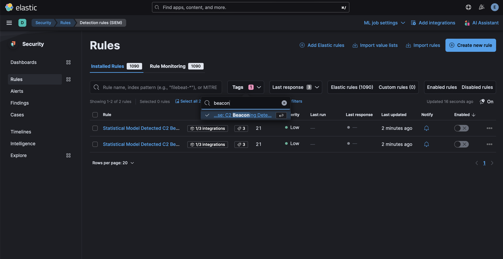
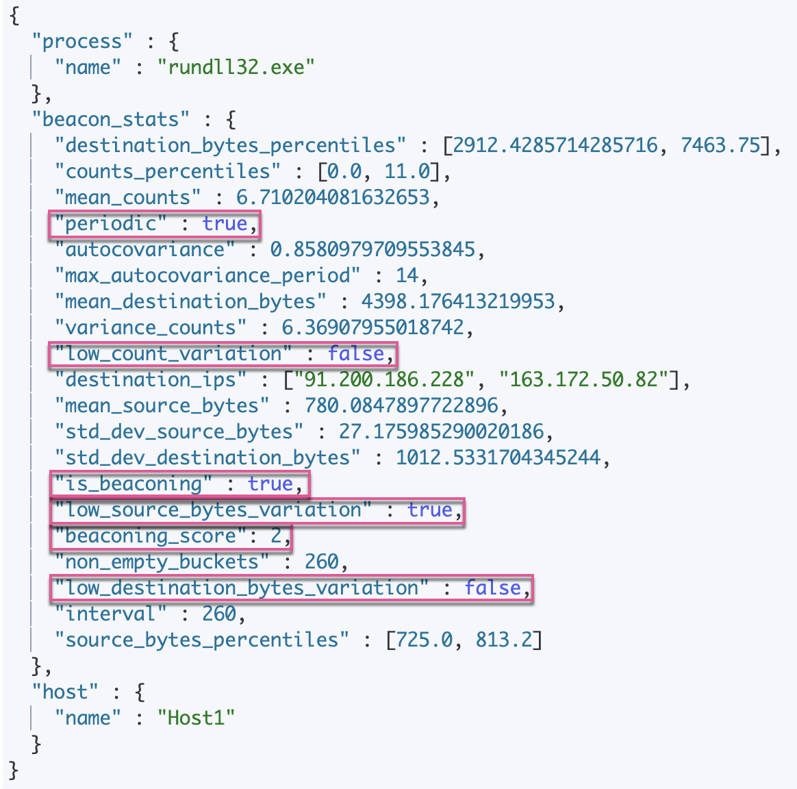

# Network Beaconing Identification

The Network Beaconing Identification package consists of a framework to identify beaconing activity in your environment. The framework surfaces significant indicators of compromise (IoCs) for threat hunters and analysts to use as a starting point for an investigation in addition to helping them monitor network traffic for beaconing activities. 
This package is licensed under Elastic License 2.0. 

For more detailed information refer to the following blog:
- [Identifying beaconing malware using Elastic](https://www.elastic.co/security-labs/identifying-beaconing-malware-using-elastic)

## Installation
1. **Add the Integration Package**: Install the package via **Management > Integrations > Network Beaconing Identification**. Configure the integration name and agent policy. Click Save and Continue.
1. **Check the health of the transform**: The transform is scheduled to run every hour. This transform creates the index `ml_beaconing-<VERSION>`. To check the health of the transform go to Management > Stack Management > Data > Transforms under `logs-beaconing.pivot_transform-default-<VERSION>`.
1. **Data view configuration for Dashboards**: For the dashboards to work as expected, the following settings need to be configured in Kibana:
    - Ensure the pivot transform is installed and running.
    - Go to **Management > Stack Management > Kibana > Data Views**. Click on **Create a data view** with the following settings:
        - Name: `ml_beaconing`
        - Index pattern: `ml_beaconing.all`
        - Select **Show Advanced settings** and enable **Allow hidden and system indices**
	    - Custom data view ID: `ml_beaconing`

*In Security > Rules, filtering with the “Use Case: C2 Beaconing Detection” tag*

## Transforms

To inspect the installed assets, you can navigate to **Stack Management > Data > Transforms**.

| Transform name            | Purpose| 	Source index  | Destination index       | Alias |
|---------------------------|--------|----------------|-------------------------|------------|
| beaconing.pivot_transform |	Flags beaconing activity in your environment| 	logs-*        | 	ml_beaconing-[version] | ml_beaconing.all |

When querying the destination index to enquire about beaconing activities, we advise using the alias for the destination index (`ml_beaconing.all`). In the event that the underlying package is upgraded, the alias will aid in maintaining the previous findings.

**Note**: If you want to modify any of the package components, you can install the package manually by following [these steps](https://github.com/elastic/detection-rules/blob/main/docs/experimental-machine-learning/beaconing.md).

## Dashboards

The **Network Beaconing Identification** has three dashboards: 
* **Network Beaconing**: The main dashboard to monitor beaconing activity
* **Beaconing Drilldown**: Drilldown into relevant event logs and some statistics related to the beaconing activity
* **Hosts Affected Over Time By Process Name**: Monitor the spread of beaconing processes across hosts in your environment

## Feature Details

This feature uses a [transform](https://www.elastic.co/guide/en/elasticsearch/reference/8.11/transforms.html) to categorize network data by host and process name, then runs scripted metric aggregations on the host-process name pairs. For a given time window, the scripted metric aggregation checks each pair for the following:

* Signals repeating at regular intervals, accounting for minor variations in those intervals.
* Low variation of bytes sent from source to destination.
* Low variation of bytes sent from destination to source.

The transform, which runs every hour, also filters out common, known applications and IPs to reduce false positives. The transform outputs information about the detection, process, and host indicators, for example:

   

The values highlighted above are typical of beaconing behavior and can help with your investigation.

## Exceptionlist customizations

There are two places where you can customize which processes are on an exceptionlist for this detection. The first is in the transforms: these contain processes which are common, and thus it is beneficial for the transform's performance and data processing to keep some processes here. You can read more on how to customize the transforms in the next section.

We also provide a default exceptionlist in the rules, which you can [inspect and customize in the UI](https://www.elastic.co/guide/en/security/current/detections-ui-exceptions.html). The source can be viewed [here](https://github.com/elastic/detection-rules/tree/main/rules/integrations/beaconing).

## Further customizations

Advanced users can also tune the scripted metric aggregation's parameters, such as jitter percentage or time window. Navigate to Transforms on your Elastic cluster and find the transform installed by this package (search `beaconing`). You can browse the source of the transform there by clicking on the `.json` tab; the source code of the latest version can also be viewed [here](https://github.com/elastic/integrations/blob/main/packages/beaconing/elasticsearch/transform/pivot_transform/transform.yml#L364).

To overwrite the default parameters: stop the transform installed by the package, clone the transform, change the parameters of the cloned transform, then start the cloned transform. The configurable parameters are:

* `number_buckets_in_range`: The number of time buckets into which the time window is split. Using more buckets improves estimates for various statistics, but also increases resource usage.
* `time_bucket_length`: The length of each time bucket. A higher value indicates a longer time window. Set this to a higher value to check for very low-frequency beacons.
* `number_destination_ips`: The number of destination IPs to collect in results. Setting this to a higher value increases resource usage.
* `max_beaconing_bytes_cov`: The maximum coefficient of variation in the payload bytes for the low source and destination bytes variance test. Higher values increase the chance of flagging traffic as beaconing, increasing [recall](https://en.wikipedia.org/wiki/Precision_and_recall) while reducing [precision](https://en.wikipedia.org/wiki/Precision_and_recall).
* `max_beaconing_count_rv`: The maximum relative variance in the bucket counts for the high-frequency beacon test. As with `max_beaconing_bytes_cov`, tuning this parameter involves a tradeoff between recall and precision.
* `truncate_at`: The lower and upper fraction of bucket values discarded when computing `max_beaconing_bytes_cov` and `max_beaconing_count_rv`. This allows you to ignore occasional changes in traffic patterns. However, if you retain too small a fraction of the data, these tests will be unreliable.
* `min_beaconing_count_autocovariance`: The minimum autocorrelation of the signal for the low-frequency beacon test. Lowering this value generally increases recall for malicious command and control beacons, while reducing precision.
* `max_jitter`: The maximum amount of [jitter](https://en.wikipedia.org/wiki/Jitter) assumed to be possible for a periodic beacon, as a fraction of its period.

You can also make changes to the transform query. The default query looks for beaconing activity over a 6-hour time range, but you can change it.

Beaconing is not used exclusively by malware. Many legitimate, benign processes also exhibit beacon-like activity. To reduce false positives, default filters in the transform query exclude known beaconing processes and IPs that fall into two groups:

* The source IP is local and the destination is remote.
* The destination IP is in a block of known Microsoft IP addresses.

You can create additional filters in the transform to meet the needs of your environment.