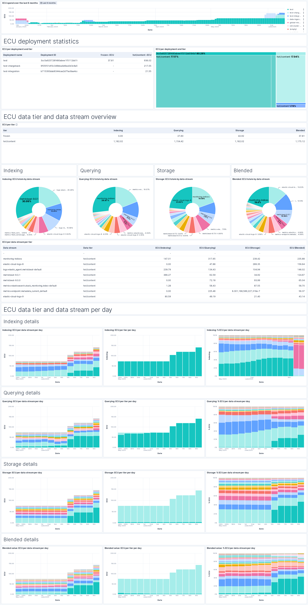

# Chargeback

_Technical preview: This integration is being developed by Elastic's Customer Engineering team. Please report any issues to the Elastician who shared this integration with you._

The Chargeback integration provides FinOps visibility into Elastic usage across tenants. By integrating data from the [**Elasticsearch Service Billing**](https://www.elastic.co/docs/reference/integrations/ess_billing/) and [**Elasticsearch**](https://www.elastic.co/docs/reference/integrations/elasticsearch/) integrations, it enables the determination of value provided by each deployment, data stream, and tier accross the organisation. This allows Centre of Excellence (CoE) teams to accurately allocate costs back to the appropriate tenant.

## What is FinOps?

FinOps is an operational framework and cultural practice aimed at maximizing the business value of cloud usage. It facilitates timely, data-driven decision-making and promotes financial accountability through collaboration among engineering, finance, and business teams.

## Purpose

The Chargeback integration assists organisations in addressing a crucial question:

> **"How is my organisation consuming the Elastic solution, and to which tenants can I allocate these costs?"**

The integration provides a breakdown of Elastic Consumption Units (ECUs) per:

- Deployment
- Data tier
- Data stream
- Day

Currently, Chargeback calculations consider only Elasticsearch data nodes. Contributions from other assets, like Kibana or ML nodes, are assumed to be shared proportionally among tenants. To incorporate indexing, querying, and storage in a weighted manner, a blended value is created using the following default weights (modifiable):
- Indexing: `20` (applicable only to the hot tier)
- Querying: `20`
- Storage: `40`

This default weighting means storage contributes most to the blended cost calculation, with indexing considered only on the hot tier. Adjust these weights based on your organisation's needs and best judgment.

Chargeback is also present based on a configured rate and unit. These are used to display cost in the local currency, for instance `EUR`, with a rate of `0.85`.

All configuration values can be updated, as follows:

```
POST chargeback_conf_lookup/_update/config
{
  "doc": {
    "conf_ecu_rate": 0.85,
    "conf_ecu_rate_unit": "EUR",
    "conf_indexing_weight": 50,
    "conf_query_weight": 20,
    "conf_storage_weight": 40
  }
}
```

Chargeback data can be viewed in the `[Chargeback] Cost and Consumption breakdown` dashboard.



## Requirements

To use this integration, the following prerequisites must be met:

-	The monitoring cluster (the central cluster where all logs and metrics are collected across your organisation’s deployments) must be running Elasticsearch version 8.18.0+, as this integration makes use of the `ES|QL LOOKUP JOIN` feature introduced in that version.
- The [**Elasticsearch Service Billing**](https://www.elastic.co/docs/reference/integrations/ess_billing/) (v1.4.1+) must be installed, and either deployed to a user-managed Elastic Agent or configured to run agentlessly.
-	The [**Elasticsearch**](https://www.elastic.co/docs/reference/integrations/elasticsearch/) integration (v1.16.0+) must be installed. Deployment to an Elastic Agent is not required (i.e. no integration policy is needed). This is because the integration is only used to access and install its built-in assets.
-	The transform named `logs-elasticsearch.index_pivot-default-{VERSION}` must be running. This transform is provided by the Elasticsearch integration and is responsible for processing usage data from all relevant* deployments. `{VERSION}` refers to the version of the **Elasticsearch** integration that was installed (e.g. 1.16.0). The transform must be manually started in order for [usage data](https://www.elastic.co/docs/reference/integrations/elasticsearch/#indices-and-data-streams-usage-analysis) to be processed and available.

This integration must be installed on the **Monitoring cluster**, which is the designated cluster for aggregating usage and billing data across all deployments in your organisation. These deployments are referred to as the relevant deployments, and each of them must have their usage data shipped to the monitoring cluster for chargeback calculations.