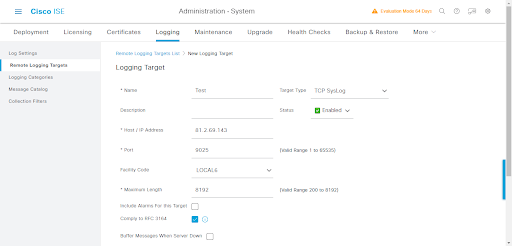

# Cisco ISE

The Cisco ISE integration collects and parses data from [Cisco Identity Services Engine](https://www.cisco.com/c/en/us/products/security/identity-services-engine/index.html) (ISE) using TCP/UDP.

## Compatibility

This module has been tested against `Cisco ISE server version 3.1.0.518`.

## Requirements

- Enable the integration with the TCP/UDP input.
- Sign in to Cisco ISE Portal.
- Configure Remote Syslog Collection Locations.
  - **Procedure**
      1. In Cisco ISE Administrator Portal, go to **Administration** > **System** > **Logging** > **Remote Logging Targets**.
      2. Click **Add**.
      
      3. Enter all the **Required Details**.
      4. Set the maximum length to **8192**.
      5. Click **Submit**. 
      6. Go to the **Remote Logging Targets** page and verify the creation of the new target.

## Note
- It is recommended to have **8192** as Maximum Message Length. Segmentation for certain logs coming from Cisco ISE might cause issues with field mappings. 

## Logs

Reference link for Cisco ISE Syslog: [Here](https://www.cisco.com/c/en/us/td/docs/security/ise/syslog/Cisco_ISE_Syslogs/m_SyslogsList.html) 

### log

This is the `log` dataset.

An example event for `log` looks as following:

```json
{
    "@timestamp": "2022-03-02T09:04:59.136Z",
    "agent": {
        "ephemeral_id": "6c81deb9-5835-43f1-9d1f-edc94dec6ba1",
        "hostname": "docker-fleet-agent",
        "id": "9d2542b5-1b01-47d2-90e4-99e17586d095",
        "name": "docker-fleet-agent",
        "type": "filebeat",
        "version": "7.17.0"
    },
    "cisco_ise": {
        "log": {
            "acs": {
                "session": {
                    "id": "cisco-ise-host/435083133/41"
                }
            },
            "calling_station": {
                "id": "00-23-DF-00-00-01"
            },
            "category": {
                "name": "CISE_Failed_Attempts"
            },
            "config_version": {
                "id": 1364
            },
            "cpm": {
                "session": {
                    "id": "0a0009ccoostm1inlLcfqsSLF7kj1Hc9FdzP6sk8dQsKOpPav_o"
                }
            },
            "device": {
                "type": "Device Type#All Device Types"
            },
            "dtls_support": "Unknown",
            "eap": {
                "tunnel": "PEAP"
            },
            "endpoint": {
                "mac": {
                    "address": "00-23-DF-00-00-01"
                }
            },
            "failure": {
                "reason": "12309 PEAP handshake failed"
            },
            "ipsec": "IPSEC#Is IPSEC Device#No",
            "ise": {
                "policy": {
                    "set_name": "Default"
                }
            },
            "location": "Location#All Locations",
            "message": {
                "code": "5440",
                "description": "RADIUS: Endpoint abandoned EAP session and started new",
                "id": "0000000581"
            },
            "model": {
                "name": "Unknown"
            },
            "nas": {
                "ip": "81.2.69.193",
                "port": {
                    "id": "G0/25",
                    "number": 1,
                    "type": "Wireless - IEEE 802.11"
                }
            },
            "network": {
                "device": {
                    "groups": [
                        "IPSEC#Is IPSEC Device#No",
                        "Location#All Locations",
                        "Device Type#All Device Types"
                    ],
                    "name": "testDevice",
                    "profile": "Cisco"
                }
            },
            "openssl": {
                "error": {
                    "message": "SSL alert: code=0x246=582 ; source=local ; type=fatal ; message=\"protocol version.ssl/statem/statem_srvr.c:1686 error:14209102:SSL routines:tls_early_post_process_client_hello:unsupported protocol [error=337678594 lib=20 func=521 reason=258]\"",
                    "stack": " 140449742526208:error:14209102:SSL routines:tls_early_post_process_client_hello:unsupported protocol:ssl/statem/statem_srvr.c:1686:"
                }
            },
            "request": {
                "latency": 16
            },
            "response": {
                "RadiusPacketType": "Drop"
            },
            "segment": {
                "number": 0,
                "total": 1
            },
            "selected": {
                "access": {
                    "service": "Default Network Access"
                }
            },
            "step": [
                "11001",
                "11017",
                "11117",
                "15049",
                "15008",
                "11507",
                "12500",
                "11006",
                "11001",
                "11018",
                "12301",
                "12300",
                "11006",
                "11001",
                "11018",
                "12302",
                "12318",
                "12800",
                "12805",
                "12814",
                "12817",
                "12309",
                "12307",
                "12305",
                "11006",
                "5440"
            ],
            "step_latency": "25=9051"
        }
    },
    "client": {
        "ip": "81.2.69.193"
    },
    "cloud": {
        "availability_zone": "\u003c!DOCTYPE html PUBLIC \"-//W3C//DTD XHTML 1.0 Transitional//EN\" \"http://www.w3.org/TR/xhtml1/DTD/xhtml1-transitional.dtd\"\u003e\r\n\u003chtml xmlns=\"http://www.w3.org/1999/xhtml\"\u003e\r\n    \u003chead\u003e\r\n        \u003cmeta content=\"text/html; charset=utf-8\" http-equiv=\"Content-Type\" /\u003e\r\n        \u003cmeta content=\"no-cache\" http-equiv=\"Pragma\" /\u003e\r\n        \u003ctitle\u003eWaiting...\u003c/title\u003e\r\n        \u003cscript type=\"text/javascript\"\u003e\r\n            var pageName = '/';\r\n            top.location.replace(pageName);\r\n        \u003c/script\u003e\r\n    \u003c/head\u003e\r\n    \u003cbody\u003e\u003c/body\u003e\r\n\u003c/html\u003e\r\n",
        "instance": {
            "id": "\u003c!DOCTYPE html PUBLIC \"-//W3C//DTD XHTML 1.0 Transitional//EN\" \"http://www.w3.org/TR/xhtml1/DTD/xhtml1-transitional.dtd\"\u003e\r\n\u003chtml xmlns=\"http://www.w3.org/1999/xhtml\"\u003e\r\n    \u003chead\u003e\r\n        \u003cmeta content=\"text/html; charset=utf-8\" http-equiv=\"Content-Type\" /\u003e\r\n        \u003cmeta content=\"no-cache\" http-equiv=\"Pragma\" /\u003e\r\n        \u003ctitle\u003eWaiting...\u003c/title\u003e\r\n        \u003cscript type=\"text/javascript\"\u003e\r\n            var pageName = '/';\r\n            top.location.replace(pageName);\r\n        \u003c/script\u003e\r\n    \u003c/head\u003e\r\n    \u003cbody\u003e\u003c/body\u003e\r\n\u003c/html\u003e\r\n",
            "name": "\u003c!DOCTYPE html PUBLIC \"-//W3C//DTD XHTML 1.0 Transitional//EN\" \"http://www.w3.org/TR/xhtml1/DTD/xhtml1-transitional.dtd\"\u003e\r\n\u003chtml xmlns=\"http://www.w3.org/1999/xhtml\"\u003e\r\n    \u003chead\u003e\r\n        \u003cmeta content=\"text/html; charset=utf-8\" http-equiv=\"Content-Type\" /\u003e\r\n        \u003cmeta content=\"no-cache\" http-equiv=\"Pragma\" /\u003e\r\n        \u003ctitle\u003eWaiting...\u003c/title\u003e\r\n        \u003cscript type=\"text/javascript\"\u003e\r\n            var pageName = '/';\r\n            top.location.replace(pageName);\r\n        \u003c/script\u003e\r\n    \u003c/head\u003e\r\n    \u003cbody\u003e\u003c/body\u003e\r\n\u003c/html\u003e\r\n"
        },
        "machine": {
            "type": "\u003c!DOCTYPE html PUBLIC \"-//W3C//DTD XHTML 1.0 Transitional//EN\" \"http://www.w3.org/TR/xhtml1/DTD/xhtml1-transitional.dtd\"\u003e\r\n\u003chtml xmlns=\"http://www.w3.org/1999/xhtml\"\u003e\r\n    \u003chead\u003e\r\n        \u003cmeta content=\"text/html; charset=utf-8\" http-equiv=\"Content-Type\" /\u003e\r\n        \u003cmeta content=\"no-cache\" http-equiv=\"Pragma\" /\u003e\r\n        \u003ctitle\u003eWaiting...\u003c/title\u003e\r\n        \u003cscript type=\"text/javascript\"\u003e\r\n            var pageName = '/';\r\n            top.location.replace(pageName);\r\n        \u003c/script\u003e\r\n    \u003c/head\u003e\r\n    \u003cbody\u003e\u003c/body\u003e\r\n\u003c/html\u003e\r\n"
        },
        "provider": "openstack",
        "service": {
            "name": "Nova"
        }
    },
    "data_stream": {
        "dataset": "cisco_ise.log",
        "namespace": "ep",
        "type": "logs"
    },
    "destination": {
        "ip": "81.2.69.145"
    },
    "ecs": {
        "version": "8.5.0"
    },
    "elastic_agent": {
        "id": "9d2542b5-1b01-47d2-90e4-99e17586d095",
        "snapshot": false,
        "version": "7.17.0"
    },
    "event": {
        "action": "radius",
        "agent_id_status": "verified",
        "category": [
            "authentication",
            "session"
        ],
        "dataset": "cisco_ise.log",
        "ingested": "2022-11-28T06:02:24Z",
        "kind": "event",
        "sequence": 75131,
        "timezone": "+00:00",
        "type": [
            "info",
            "start"
        ]
    },
    "host": {
        "hostname": "cisco-ise-host"
    },
    "input": {
        "type": "udp"
    },
    "log": {
        "level": "notice",
        "source": {
            "address": "172.19.0.6:50562"
        },
        "syslog": {
            "priority": 181,
            "severity": {
                "name": "notice"
            }
        }
    },
    "message": "2022-03-02 09:04:59.136 +00:00 0000075131 5440 NOTICE RADIUS: Endpoint abandoned EAP session and started new, ConfigVersionId=1364, Device IP Address=81.2.69.193, DestinationIPAddress=81.2.69.145, UserName=testDevice1, AcsSessionID=cisco-ise-host/435083133/41, SelectedAccessService=Default Network Access, RequestLatency=16, FailureReason=12309 PEAP handshake failed, Step=11001, Step=11017, Step=11117, Step=15049, Step=15008, Step=11507, Step=12500, Step=11006, Step=11001, Step=11018, Step=12301, Step=12300, Step=11006, Step=11001, Step=11018, Step=12302, Step=12318, Step=12800, Step=12805, Step=12814, Step=12817, Step=12309, Step=12307, Step=12305, Step=11006, Step=5440, NetworkDeviceName=testDevice, NetworkDeviceGroups=IPSEC#Is IPSEC Device#No, NetworkDeviceGroups=Location#All Locations, NetworkDeviceGroups=Device Type#All Device Types, EapTunnel=PEAP, OpenSSLErrorMessage=SSL alert: code=0x246=582 ; source=local ; type=fatal ; message=\"protocol version.ssl/statem/statem_srvr.c:1686 error:14209102:SSL routines:tls_early_post_process_client_hello:unsupported protocol [error=337678594 lib=20 func=521 reason=258]\", OpenSSLErrorStack= 140449742526208:error:14209102:SSL routines:tls_early_post_process_client_hello:unsupported protocol:ssl/statem/statem_srvr.c:1686:, User-Name=testDevice1, NAS-IP-Address=81.2.69.193, NAS-Port=1, Calling-Station-ID=00-23-DF-00-00-01, NAS-Port-Type=Wireless - IEEE 802.11, NAS-Port-Id=G0/25, CPMSessionID=0a0009ccoostm1inlLcfqsSLF7kj1Hc9FdzP6sk8dQsKOpPav_o, EndPointMACAddress=00-23-DF-00-00-01, ISEPolicySetName=Default, StepLatency=25=9051, TLSCipher=, TLSVersion=, DTLSSupport=Unknown, Model Name=Unknown, Network Device Profile=Cisco, Location=Location#All Locations, Device Type=Device Type#All Device Types, IPSEC=IPSEC#Is IPSEC Device#No, Response={RadiusPacketType=Drop; },",
    "related": {
        "hosts": [
            "cisco-ise-host"
        ],
        "ip": [
            "81.2.69.193",
            "81.2.69.145"
        ],
        "user": [
            "testDevice1"
        ]
    },
    "tags": [
        "forwarded",
        "cisco_ise-log"
    ],
    "user": {
        "name": [
            "testDevice1"
        ]
    }
}
```

**Exported fields**

| Field | Description | Type |
|---|---|---|
| @timestamp | Event timestamp. | date |
| cisco_ise.log.acct.authentic |  | keyword |
| cisco_ise.log.acct.delay_time |  | long |
| cisco_ise.log.acct.input.octets |  | long |
| cisco_ise.log.acct.input.packets |  | long |
| cisco_ise.log.acct.output.octets |  | long |
| cisco_ise.log.acct.output.packets |  | long |
| cisco_ise.log.acct.request.flags |  | keyword |
| cisco_ise.log.acct.session.id |  | keyword |
| cisco_ise.log.acct.session.time |  | long |
| cisco_ise.log.acct.status.type |  | keyword |
| cisco_ise.log.acct.terminate_cause |  | keyword |
| cisco_ise.log.acme-av-pair.audit-session-id |  | keyword |
| cisco_ise.log.acme-av-pair.service-type |  | keyword |
| cisco_ise.log.acs.instance |  | keyword |
| cisco_ise.log.acs.session.id |  | keyword |
| cisco_ise.log.active_session.count |  | long |
| cisco_ise.log.ad.admin |  | keyword |
| cisco_ise.log.ad.domain.controller |  | keyword |
| cisco_ise.log.ad.domain.name |  | keyword |
| cisco_ise.log.ad.error.details |  | keyword |
| cisco_ise.log.ad.forest |  | keyword |
| cisco_ise.log.ad.hostname |  | keyword |
| cisco_ise.log.ad.ip |  | ip |
| cisco_ise.log.ad.log |  | keyword |
| cisco_ise.log.ad.log_id |  | keyword |
| cisco_ise.log.ad.organization_unit |  | text |
| cisco_ise.log.ad.site |  | keyword |
| cisco_ise.log.ad.srv.query |  | keyword |
| cisco_ise.log.ad.srv.record |  | keyword |
| cisco_ise.log.adapter_instance.name |  | keyword |
| cisco_ise.log.adapter_instance.uuid |  | keyword |
| cisco_ise.log.admin.interface |  | keyword |
| cisco_ise.log.admin.session |  | keyword |
| cisco_ise.log.airespace.wlan.id |  | long |
| cisco_ise.log.allow.easy.wired.session |  | keyword |
| cisco_ise.log.allowed_protocol.matched.rule |  | keyword |
| cisco_ise.log.assigned_targets |  | keyword |
| cisco_ise.log.auth.policy.matched.rule |  | keyword |
| cisco_ise.log.authen_method |  | keyword |
| cisco_ise.log.authentication.identity_store |  | keyword |
| cisco_ise.log.authentication.method |  | keyword |
| cisco_ise.log.authentication.status |  | keyword |
| cisco_ise.log.average.radius.request.latency |  | long |
| cisco_ise.log.average.tacacs.request.latency |  | long |
| cisco_ise.log.avpair.disc.cause |  | long |
| cisco_ise.log.avpair.disc.cause_ext |  | long |
| cisco_ise.log.avpair.elapsed_time |  | long |
| cisco_ise.log.avpair.pre_session_time |  | long |
| cisco_ise.log.avpair.priv_lvl |  | long |
| cisco_ise.log.avpair.start_time |  | date |
| cisco_ise.log.avpair.stop_time |  | date |
| cisco_ise.log.avpair.task_id |  | keyword |
| cisco_ise.log.avpair.timezone |  | keyword |
| cisco_ise.log.called_station.id |  | keyword |
| cisco_ise.log.calling_station.id |  | keyword |
| cisco_ise.log.category.name |  | keyword |
| cisco_ise.log.cisco_av_pair.coa-push |  | boolean |
| cisco_ise.log.cisco_av_pair.cts-device-capability |  | keyword |
| cisco_ise.log.cisco_av_pair.cts-environment-data |  | keyword |
| cisco_ise.log.cisco_av_pair.cts-environment-version |  | keyword |
| cisco_ise.log.cisco_av_pair.cts-pac-opaque |  | keyword |
| cisco_ise.log.class |  | keyword |
| cisco_ise.log.client.latency |  | long |
| cisco_ise.log.cmdset |  | keyword |
| cisco_ise.log.component |  | keyword |
| cisco_ise.log.config_change.data |  | keyword |
| cisco_ise.log.config_version.id |  | long |
| cisco_ise.log.connectivity |  | keyword |
| cisco_ise.log.cpm.session.id |  | keyword |
| cisco_ise.log.currentid.store_name |  | keyword |
| cisco_ise.log.delta.radius.request.count |  | long |
| cisco_ise.log.delta.tacacs.request.count |  | long |
| cisco_ise.log.detailed_info |  | text |
| cisco_ise.log.details |  | keyword |
| cisco_ise.log.device.name |  | keyword |
| cisco_ise.log.device.registration_status |  | keyword |
| cisco_ise.log.device.type |  | keyword |
| cisco_ise.log.dtls_support |  | keyword |
| cisco_ise.log.eap.authentication |  | keyword |
| cisco_ise.log.eap.chaining_result |  | keyword |
| cisco_ise.log.eap.tunnel |  | keyword |
| cisco_ise.log.eap_key.name |  | keyword |
| cisco_ise.log.enable.flag |  | keyword |
| cisco_ise.log.endpoint.coa |  | keyword |
| cisco_ise.log.endpoint.mac.address |  | keyword |
| cisco_ise.log.endpoint.policy |  | keyword |
| cisco_ise.log.endpoint.profiler |  | keyword |
| cisco_ise.log.endpoint.purge.id |  | keyword |
| cisco_ise.log.endpoint.purge.rule |  | keyword |
| cisco_ise.log.endpoint.purge.scheduletype |  | keyword |
| cisco_ise.log.ep.identity_group |  | keyword |
| cisco_ise.log.ep.mac.address |  | keyword |
| cisco_ise.log.error.message |  | keyword |
| cisco_ise.log.event.timestamp |  | date |
| cisco_ise.log.failure.flag |  | boolean |
| cisco_ise.log.failure.reason |  | keyword |
| cisco_ise.log.feed_service.feed.name |  | keyword |
| cisco_ise.log.feed_service.feed.version |  | keyword |
| cisco_ise.log.feed_service.host |  | keyword |
| cisco_ise.log.feed_service.port |  | keyword |
| cisco_ise.log.feed_service.query.from_time |  | date |
| cisco_ise.log.feed_service.query.to_time |  | date |
| cisco_ise.log.file.name |  | keyword |
| cisco_ise.log.first_name |  | keyword |
| cisco_ise.log.framed.ip |  | ip |
| cisco_ise.log.framed.mtu |  | long |
| cisco_ise.log.groups.process_failure |  | boolean |
| cisco_ise.log.guest.user.name |  | keyword |
| cisco_ise.log.identity.group |  | keyword |
| cisco_ise.log.identity.policy.matched.rule |  | keyword |
| cisco_ise.log.identity.selection.matched.rule |  | keyword |
| cisco_ise.log.ipsec |  | keyword |
| cisco_ise.log.is_third_party_device_flow |  | boolean |
| cisco_ise.log.ise.policy.set_name |  | keyword |
| cisco_ise.log.last_name |  | keyword |
| cisco_ise.log.local_logging |  | keyword |
| cisco_ise.log.location |  | keyword |
| cisco_ise.log.log_details |  | flattened |
| cisco_ise.log.log_error.message |  | keyword |
| cisco_ise.log.log_severity_level |  | keyword |
| cisco_ise.log.logger.name |  | keyword |
| cisco_ise.log.message.code |  | keyword |
| cisco_ise.log.message.description |  | text |
| cisco_ise.log.message.id |  | keyword |
| cisco_ise.log.message.text |  | keyword |
| cisco_ise.log.misconfigured.client.fix.reason |  | keyword |
| cisco_ise.log.model.name |  | keyword |
| cisco_ise.log.nas.identifier |  | keyword |
| cisco_ise.log.nas.ip |  | ip |
| cisco_ise.log.nas.port.id |  | keyword |
| cisco_ise.log.nas.port.number |  | long |
| cisco_ise.log.nas.port.type |  | keyword |
| cisco_ise.log.network.device.groups |  | keyword |
| cisco_ise.log.network.device.name |  | keyword |
| cisco_ise.log.network.device.profile |  | keyword |
| cisco_ise.log.network.device.profile_id |  | keyword |
| cisco_ise.log.network.device.profile_name |  | keyword |
| cisco_ise.log.object.internal.id |  | keyword |
| cisco_ise.log.object.name |  | keyword |
| cisco_ise.log.object.type |  | keyword |
| cisco_ise.log.objects.purged |  | keyword |
| cisco_ise.log.openssl.error.message |  | keyword |
| cisco_ise.log.openssl.error.stack |  | keyword |
| cisco_ise.log.operation.id |  | keyword |
| cisco_ise.log.operation.status |  | keyword |
| cisco_ise.log.operation.type |  | keyword |
| cisco_ise.log.operation_counters.counters |  | flattened |
| cisco_ise.log.operation_counters.original |  | text |
| cisco_ise.log.operation_message.text |  | keyword |
| cisco_ise.log.original.user.name |  | keyword |
| cisco_ise.log.policy.type |  | keyword |
| cisco_ise.log.port |  | keyword |
| cisco_ise.log.portal.name |  | keyword |
| cisco_ise.log.posture.assessment.status |  | keyword |
| cisco_ise.log.privilege.level |  | long |
| cisco_ise.log.probe |  | keyword |
| cisco_ise.log.profiler.server |  | keyword |
| cisco_ise.log.protocol |  | keyword |
| cisco_ise.log.psn.hostname |  | keyword |
| cisco_ise.log.radius.flow.type |  | keyword |
| cisco_ise.log.radius.packet.type |  | keyword |
| cisco_ise.log.radius_identifier |  | long |
| cisco_ise.log.radius_packet.type |  | keyword |
| cisco_ise.log.request.latency |  | long |
| cisco_ise.log.request.received_time |  | date |
| cisco_ise.log.request_response.type |  | keyword |
| cisco_ise.log.response |  | flattened |
| cisco_ise.log.segment.number |  | long |
| cisco_ise.log.segment.total |  | long |
| cisco_ise.log.selected.access.service |  | keyword |
| cisco_ise.log.selected.authentication.identity_stores |  | keyword |
| cisco_ise.log.selected.authorization.profiles |  | keyword |
| cisco_ise.log.sequence.number |  | long |
| cisco_ise.log.server.name |  | keyword |
| cisco_ise.log.server.type |  | keyword |
| cisco_ise.log.service.argument |  | keyword |
| cisco_ise.log.service.name |  | keyword |
| cisco_ise.log.service.type |  | keyword |
| cisco_ise.log.session.timeout |  | long |
| cisco_ise.log.severity.level |  | long |
| cisco_ise.log.software.version |  | keyword |
| cisco_ise.log.state |  | text |
| cisco_ise.log.static.assignment |  | boolean |
| cisco_ise.log.status |  | keyword |
| cisco_ise.log.step |  | keyword |
| cisco_ise.log.step_data |  | keyword |
| cisco_ise.log.step_latency |  | keyword |
| cisco_ise.log.sysstats.acs.process.health |  | flattened |
| cisco_ise.log.sysstats.cpu.count |  | long |
| cisco_ise.log.sysstats.process_memory_mb |  | long |
| cisco_ise.log.sysstats.utilization.cpu |  | double |
| cisco_ise.log.sysstats.utilization.disk.io |  | double |
| cisco_ise.log.sysstats.utilization.disk.space |  | keyword |
| cisco_ise.log.sysstats.utilization.load_avg |  | double |
| cisco_ise.log.sysstats.utilization.memory |  | double |
| cisco_ise.log.sysstats.utilization.network |  | keyword |
| cisco_ise.log.tls.cipher |  | keyword |
| cisco_ise.log.tls.version |  | keyword |
| cisco_ise.log.total.authen.latency |  | long |
| cisco_ise.log.total.failed_attempts |  | long |
| cisco_ise.log.total.failed_time |  | long |
| cisco_ise.log.tunnel.medium.type |  | keyword |
| cisco_ise.log.tunnel.private.group_id |  | keyword |
| cisco_ise.log.tunnel.type |  | keyword |
| cisco_ise.log.type |  | keyword |
| cisco_ise.log.undefined_52 |  | keyword |
| cisco_ise.log.usecase |  | keyword |
| cisco_ise.log.user.type |  | keyword |
| cisco_ise.log.workflow |  | flattened |
| client.ip | IP address of the client (IPv4 or IPv6). | ip |
| client.port | Port of the client. | long |
| client.user.name | Short name or login of the user. | keyword |
| client.user.name.text | Multi-field of `client.user.name`. | match_only_text |
| cloud.account.id | The cloud account or organization id used to identify different entities in a multi-tenant environment. Examples: AWS account id, Google Cloud ORG Id, or other unique identifier. | keyword |
| cloud.availability_zone | Availability zone in which this host is running. | keyword |
| cloud.image.id | Image ID for the cloud instance. | keyword |
| cloud.instance.id | Instance ID of the host machine. | keyword |
| cloud.instance.name | Instance name of the host machine. | keyword |
| cloud.machine.type | Machine type of the host machine. | keyword |
| cloud.project.id | Name of the project in Google Cloud. | keyword |
| cloud.provider | Name of the cloud provider. Example values are aws, azure, gcp, or digitalocean. | keyword |
| cloud.region | Region in which this host is running. | keyword |
| container.id | Unique container id. | keyword |
| container.image.name | Name of the image the container was built on. | keyword |
| container.labels | Image labels. | object |
| container.name | Container name. | keyword |
| data_stream.dataset | Data stream dataset. | constant_keyword |
| data_stream.namespace | Data stream namespace. | constant_keyword |
| data_stream.type | Data stream type. | constant_keyword |
| destination.ip | IP address of the destination (IPv4 or IPv6). | ip |
| destination.port | Port of the destination. | long |
| ecs.version | ECS version this event conforms to. `ecs.version` is a required field and must exist in all events. When querying across multiple indices -- which may conform to slightly different ECS versions -- this field lets integrations adjust to the schema version of the events. | keyword |
| event.category | This is one of four ECS Categorization Fields, and indicates the second level in the ECS category hierarchy. `event.category` represents the "big buckets" of ECS categories. For example, filtering on `event.category:process` yields all events relating to process activity. This field is closely related to `event.type`, which is used as a subcategory. This field is an array. This will allow proper categorization of some events that fall in multiple categories. | keyword |
| event.created | event.created contains the date/time when the event was first read by an agent, or by your pipeline. This field is distinct from @timestamp in that @timestamp typically contain the time extracted from the original event. In most situations, these two timestamps will be slightly different. The difference can be used to calculate the delay between your source generating an event, and the time when your agent first processed it. This can be used to monitor your agent's or pipeline's ability to keep up with your event source. In case the two timestamps are identical, @timestamp should be used. | date |
| event.dataset | Event dataset. | constant_keyword |
| event.kind | This is one of four ECS Categorization Fields, and indicates the highest level in the ECS category hierarchy. `event.kind` gives high-level information about what type of information the event contains, without being specific to the contents of the event. For example, values of this field distinguish alert events from metric events. The value of this field can be used to inform how these kinds of events should be handled. They may warrant different retention, different access control, it may also help understand whether the data coming in at a regular interval or not. | keyword |
| event.module | Event module. | constant_keyword |
| event.original | Raw text message of entire event. Used to demonstrate log integrity or where the full log message (before splitting it up in multiple parts) may be required, e.g. for reindex. This field is not indexed and doc_values are disabled. It cannot be searched, but it can be retrieved from `_source`. If users wish to override this and index this field, please see `Field data types` in the `Elasticsearch Reference`. | keyword |
| event.sequence | Sequence number of the event. The sequence number is a value published by some event sources, to make the exact ordering of events unambiguous, regardless of the timestamp precision. | long |
| event.type | This is one of four ECS Categorization Fields, and indicates the third level in the ECS category hierarchy. `event.type` represents a categorization "sub-bucket" that, when used along with the `event.category` field values, enables filtering events down to a level appropriate for single visualization. This field is an array. This will allow proper categorization of some events that fall in multiple event types. | keyword |
| host.architecture | Operating system architecture. | keyword |
| host.containerized | If the host is a container. | boolean |
| host.domain | Name of the domain of which the host is a member. For example, on Windows this could be the host's Active Directory domain or NetBIOS domain name. For Linux this could be the domain of the host's LDAP provider. | keyword |
| host.hostname | Hostname of the host. It normally contains what the `hostname` command returns on the host machine. | keyword |
| host.id | Unique host id. As hostname is not always unique, use values that are meaningful in your environment. Example: The current usage of `beat.name`. | keyword |
| host.ip | Host ip addresses. | ip |
| host.mac | Host mac addresses. | keyword |
| host.name | Name of the host. It can contain what `hostname` returns on Unix systems, the fully qualified domain name, or a name specified by the user. The sender decides which value to use. | keyword |
| host.os.build | OS build information. | keyword |
| host.os.codename | OS codename, if any. | keyword |
| host.os.family | OS family (such as redhat, debian, freebsd, windows). | keyword |
| host.os.kernel | Operating system kernel version as a raw string. | keyword |
| host.os.name | Operating system name, without the version. | keyword |
| host.os.name.text | Multi-field of `host.os.name`. | text |
| host.os.platform | Operating system platform (such centos, ubuntu, windows). | keyword |
| host.os.version | Operating system version as a raw string. | keyword |
| host.type | Type of host. For Cloud providers this can be the machine type like `t2.medium`. If vm, this could be the container, for example, or other information meaningful in your environment. | keyword |
| input.type | Input type | keyword |
| log.level | Original log level of the log event. If the source of the event provides a log level or textual severity, this is the one that goes in `log.level`. If your source doesn't specify one, you may put your event transport's severity here (e.g. Syslog severity). Some examples are `warn`, `err`, `i`, `informational`. | keyword |
| log.logger | The name of the logger inside an application. This is usually the name of the class which initialized the logger, or can be a custom name. | keyword |
| log.offset | Log offset | long |
| log.source.address | Source address from which the log event was read / sent from. | keyword |
| log.syslog.priority | Syslog numeric priority of the event, if available. According to RFCs 5424 and 3164, the priority is 8 \* facility + severity. This number is therefore expected to contain a value between 0 and 191. | long |
| log.syslog.severity.name | The Syslog numeric severity of the log event, if available. If the event source publishing via Syslog provides a different severity value (e.g. firewall, IDS), your source's text severity should go to `log.level`. If the event source does not specify a distinct severity, you can optionally copy the Syslog severity to `log.level`. | keyword |
| message | For log events the message field contains the log message, optimized for viewing in a log viewer. For structured logs without an original message field, other fields can be concatenated to form a human-readable summary of the event. If multiple messages exist, they can be combined into one message. | match_only_text |
| network.protocol | In the OSI Model this would be the Application Layer protocol. For example, `http`, `dns`, or `ssh`. The field value must be normalized to lowercase for querying. | keyword |
| related.hosts | All hostnames or other host identifiers seen on your event. Example identifiers include FQDNs, domain names, workstation names, or aliases. | keyword |
| related.ip | All of the IPs seen on your event. | ip |
| related.user | All the user names or other user identifiers seen on the event. | keyword |
| service.type | The type of the service data is collected from. The type can be used to group and correlate logs and metrics from one service type. Example: If logs or metrics are collected from Elasticsearch, `service.type` would be `elasticsearch`. | keyword |
| source.ip | IP address of the source (IPv4 or IPv6). | ip |
| tags | List of keywords used to tag each event. | keyword |
| user.full_name | User's full name, if available. | keyword |
| user.full_name.text | Multi-field of `user.full_name`. | match_only_text |
| user.name | Short name or login of the user. | keyword |
| user.name.text | Multi-field of `user.name`. | match_only_text |
