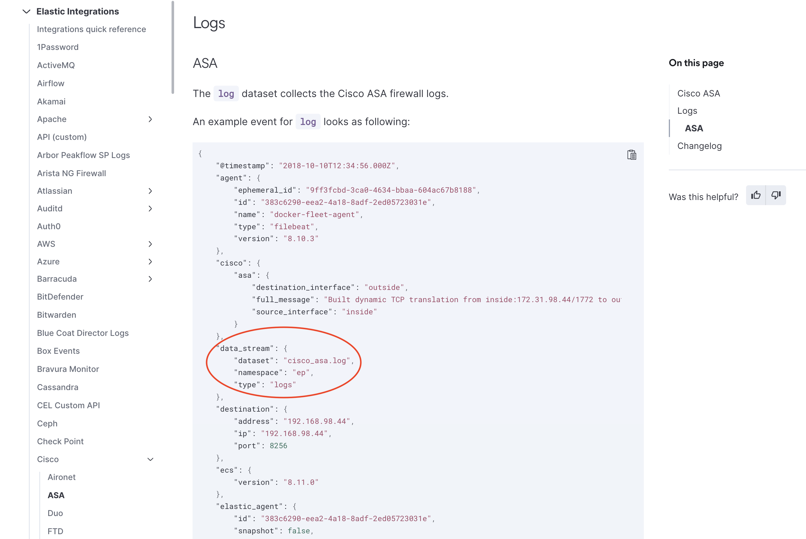
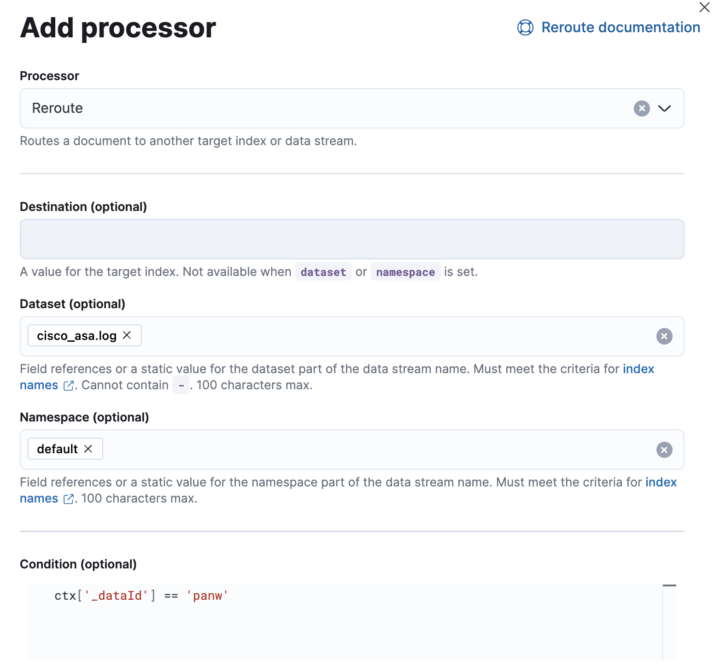

# Cribl

The Cribl integration offers users a way to ingest logs from either of Cribl's Elastic outputs into Elastic's Fleet integration data streams. This enables Cribl users to leverage the power of the Elastic Common Schema to unlock predefined dashboards, alerts and more.

## Instructions

1. Install the relevant integration assets in Kibana

    In order to make the most of your data, install Fleet integration assets to load index templates, ingest pipelines, and dashboards into Kibana. In Kibana, navigate to **Management** > **Integrations** in the sidebar.

    Find the relevant integration(s) by searching or browsing the catalog. For example, the Cisco ASA integration.

    

    Navigate to the **Settings** tab and click **Install Cisco ASA assets**. Confirm by clicking **Install Cisco ASA** in the popup.
    
    

2. Update reroute rule logic

    In order to specify the routing logic to be able to direct your events from Cribl to an Elastic integration datastream, setup a custom ingest pipeline for the Cribl integration.

    1. Identify the name of the Elastic dataset

        Review the relevant [integration documentation](https://docs.elastic.co/integrations) to determine the correct es_datastream_name value. The data stream components can be found in the example event for each integration.

        

    2. Add informational field to Cribl Source

        Configure the Cribl Source to specify the source of the data in the `_dataId` field.

        

        See [Cribl Data Onboarding](https://docs.cribl.io/stream/data-onboarding/) for more information on configuring sources.

    3. Create custom pipeline
    
        In Kibana, navigate to **Management** > **Stack Management** in the side bar. Under the **Ingest** header, select **Ingest Pipelines**. Click **Create pipeline** > **New pipeline**. 
    
        **Custom pipeline configuration**
        1. The pipeline **Name** must be `logs-cribl@custom`.

        2. **Add a processor**

            1. Set the **Dataset** to the value identified in the step above (`cisco_asa.log` for our example). 

            2. Set the **Namespace** to `default`.

            3. Fill in the conditional to specify the Cribl `_dataId` source field. 

            

3. Configure an Elastic destination in Cribl

    Cribl offers two options for sending data to Elastic, the Elastic Cloud ouput for cloud environments, and the Elasticsearch output for self-managed. Consult the or the [Cribl Elastic Cloud documentation](https://docs.cribl.io/stream/destinations-elastic-cloud/) or [Cribl Elasticsearch documentation](https://docs.cribl.io/stream/destinations-elastic/) for more details on how to configure.

    **Destination settings**

    1. Set **Cloud Id** for the Cloud destination or **Bulk API URLs** for the Elasticaearch destination to point to your Elastic cluster.

    2. Set **Index or Data Stream** to `logs-cribl-default`.

    3. **API key** should be a Base64 encoded Elastic API key, which can be created in Kibana by following the instructions under API Keys. If you are using an API key with “Restrict privileges”, be sure to review the Indices privileges to provide at least "auto_configure" & "write" permissions for the logs-* index, which you will be using for these Fleet integration data streams.

    