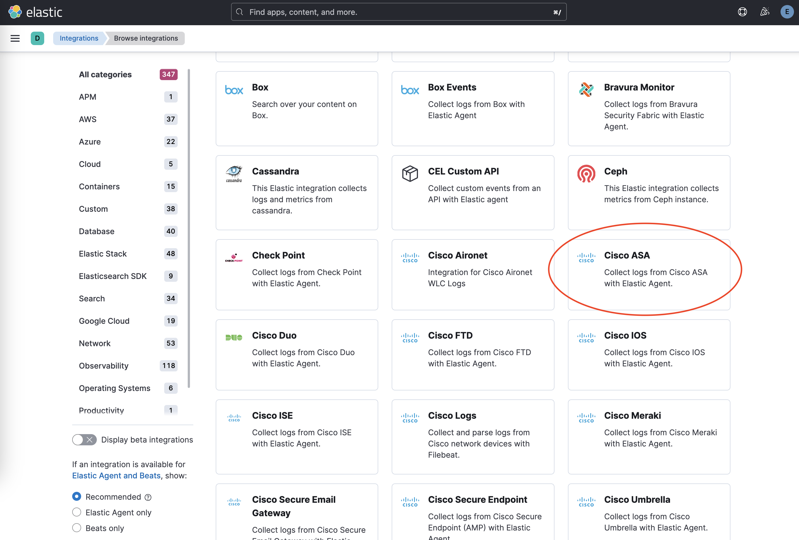
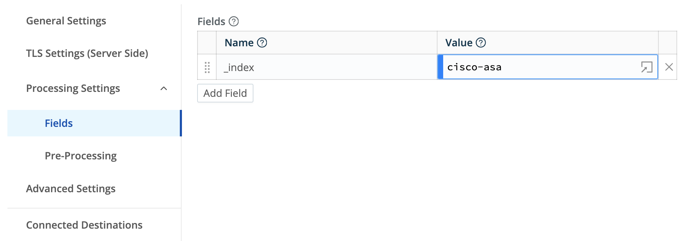
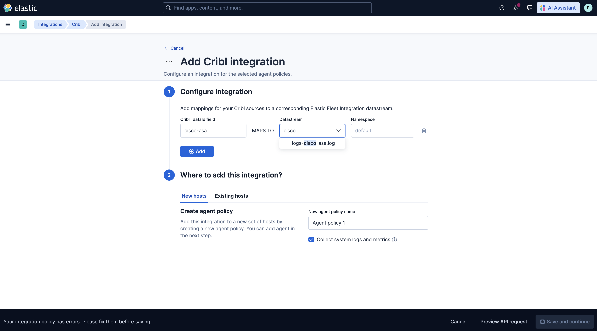

# Cribl

The Cribl integration offers users a way to ingest logs from either of Cribl's Elastic outputs into Elastic's Fleet integration data streams. This enables Cribl users to leverage the power of the Elastic Common Schema to unlock predefined dashboards, alerts and more.

## Instructions

1. Install the relevant integration assets in Kibana

    In order to make the most of your data, install Fleet integration assets to load index templates, ingest pipelines, and dashboards into Kibana. In Kibana, navigate to **Management** > **Integrations** in the sidebar.

    Find the relevant integration(s) by searching or browsing the catalog. For example, the Cisco ASA integration.

    

    Navigate to the **Settings** tab and click **Install Cisco ASA assets**. Confirm by clicking **Install Cisco ASA** in the popup.
    
    

2. Configuring the Cribl integration

    1. Add informational field to Cribl Source

        Configure the Cribl Source to specify the source of the data in the `_dataId` field.

        

        See [Cribl Data Onboarding](https://docs.cribl.io/stream/data-onboarding/) for more information on configuring sources.

    2. Configure the Cribl integration in Kibana

        Map each `_dataId` configured in the step above to the pre-installed Fleet integration's datastream. 

        

        Note: The Cribl integration does not require Elastic Agent, but a policy must be configured when setting up the Cribl integration.

4. Configure an Elastic destination in Cribl

    Cribl offers two options for sending data to Elastic, the Elastic Cloud output for cloud environments, and the Elasticsearch output for self-managed. Consult [Cribl Elastic Cloud documentation](https://docs.cribl.io/stream/destinations-elastic-cloud/) or [Cribl Elasticsearch documentation](https://docs.cribl.io/stream/destinations-elastic/) for more details on how to configure.

    **Destination settings**

    1. Set **Cloud Id** for the Cloud destination or **Bulk API URLs** for the Elasticsearch destination to point to your Elastic cluster.

    2. Set **Index or Data Stream** to `logs-cribl-default`.

    3. **API key** should be a Base64 encoded Elastic API key, which you can create in Kibana by following the instructions under **Management** > **Stack Management** > **Security** > **API Keys**. If you are using an API key with “Restrict privileges”, be sure to review the Indices privileges to provide at least "auto_configure" and "write" permissions for the logs-* index, which you will be using for these Fleet integration data streams.