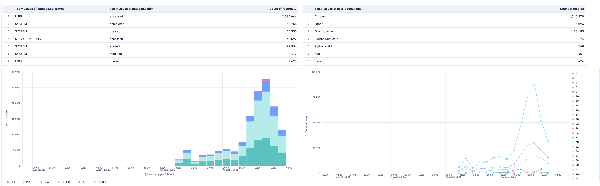

# Datadog Audit Logs

## Overview

The Datadog Audit Logs integration collects Datadog audit trail events from an
Amazon S3 bucket written by [Datadog Log Archives](https://docs.datadoghq.com/logs/log_configuration/archives/).
It maps audit activity to ECS and provides a dashboard for investigating changes
to Datadog resources and accounts.

### Compatibility

This integration supports Elastic Stack 8.19.0 or later and 9.1.0 or later.
It requires Datadog Log Archives configured with an Amazon S3 destination.

### How it works

Datadog writes gzipped NDJSON audit events to a date-partitioned S3 prefix
(`dt=YYYYMMDD/hour=HH/archive_*.json.gz`). Elastic Agent reads the objects using
the AWS S3 input and sends one audit event per line to the `datadog.audit` data
stream.

S3 object-created notifications can be delivered to Amazon SQS for near-real-time
collection. If no queue URL is configured, the integration polls the bucket at
the configured interval.

## What data does this integration collect?

The integration collects all Datadog audit surfaces, including API requests,
workflow activity, Agent configuration changes, dashboards, organization
management, MCP server calls, and audit-trail queries. Configure a Datadog Logs
Archive with the query `source:audit` to limit the archive to audit events.

## What do I need to use this integration?

- An Elastic deployment with Fleet and Elastic Agent.
- A Datadog account with [Datadog Log Archives](https://docs.datadoghq.com/logs/log_configuration/archives/)
  configured to write audit logs to an S3 bucket.
- An AWS identity that can read the archive objects.

The identity needs these permissions:

- `s3:GetObject` on the archive prefix.
- `s3:ListBucket` on the bucket when polling is enabled.
- `sqs:ReceiveMessage`, `sqs:DeleteMessage`, and `sqs:GetQueueAttributes` on the
  queue when SQS notifications are enabled.

Use an IAM role (`role_arn`) instead of static access keys when possible.

## How do I deploy this integration?

For general instructions on installing integrations and deploying Elastic Agent,
refer to the [Getting started](https://www.elastic.co/guide/en/starting-with-the-elasticsearch-platform-and-its-solutions/current/getting-started-observability.html) guide.
This integration supports Fleet-managed Elastic Agent. Agentless deployment is
not supported.

### Configure Datadog Log Archives

1. In Datadog, create a Logs Archive with the query `source:audit` and an Amazon
   S3 destination. Datadog writes gzipped NDJSON objects to the archive.
2. Configure an S3 event notification for `s3:ObjectCreated:*` that delivers to
   an SQS queue when using SQS mode.
3. In Fleet, add the Datadog Audit Logs integration and configure the S3 bucket
   ARN, archive prefix, AWS region, and credentials.
4. Select SQS mode and provide the queue URL for near-real-time collection. For
   polling mode, leave the queue URL empty and set the polling interval.

### Validate the integration

Generate a Datadog audit event and confirm that it appears in the
`logs-datadog.audit-*` data stream. In Kibana Discover, filter for
`data_stream.dataset: datadog.audit` and verify that `event.action` and
`datadog.event.name` are populated.

## Troubleshooting

### No events arrive

- Confirm that the Datadog archive query is `source:audit` and that objects are
  being written to the configured bucket and prefix.
- Verify `s3:GetObject` and, for polling mode, `s3:ListBucket` permissions.
- For SQS mode, verify the S3 notification, queue URL, and SQS permissions.
- Check the Elastic Agent logs for AWS authentication or object-processing errors.

### Events are delayed

Use SQS mode for near-real-time delivery. Polling re-lists the bucket on every
interval and may become slower as the archive volume increases.

## Performance and scaling

SQS mode is recommended for production and supports scaling across multiple
Elastic Agents. Scope the S3 prefix to the Datadog archive and use the
`number_of_workers` setting to increase object-processing concurrency when the
archive produces a high volume of events. Start with the default settings and
measure agent CPU, memory, S3 request rate, and event ingestion latency before
increasing concurrency.

## Reference

### Notable fields

| Field | Description |
|---|---|
| `datadog.event.name` | Datadog product surface (`Request`, `Workflows`, `Dashboard`, …) |
| `datadog.action` | Raw Datadog verb (`accessed`, `modified`, `created`, …) |
| `event.action` | Composite `<surface>_<verb>`, e.g. `dashboard_modified` |
| `datadog.route.path` | Templated API route — aggregate on this, not `url.path`, which contains IDs |
| `datadog.actor.type` | `USER`, `SYSTEM`, or `SERVICE_ACCOUNT` |
| `datadog.auth_method` | `SESSION`, `SYSTEM`, `API_AND_APP_KEY`, `OAUTH_TOKEN` |
| `datadog.threat_intel.*` | Datadog's Spur-sourced IP enrichment, including VPN/proxy tunnel detail |
| `datadog.asset.new_value` / `.prev_value` | `flattened` before/after blobs for configuration changes |
| `datadog.metadata` | `flattened` catch-all for surface-specific metadata |
| `related.user` | Every actor identifier in the event, including API key and OAuth client IDs |

`datadog.asset.new_value`, `datadog.asset.prev_value`, `datadog.metadata`, and
`datadog.threat_intel` are `flattened`. They are queryable in KQL and DSL by
subkey, but not in ES|QL, which returns an error for `flattened` fields. Stable
dimensions are lifted into typed sibling fields for that reason.

### ECS field reference

**Exported fields**

| Field | Description | Type |
|---|---|---|
| @timestamp | Date/time when the event originated. This is the date/time extracted from the event, typically representing when the event was generated by the source. If the event source has no original timestamp, this value is typically populated by the first time the event was received by the pipeline. Required field for all events. | date |
| aws.s3.bucket.arn | The AWS S3 bucket ARN. | keyword |
| aws.s3.bucket.name | The AWS S3 bucket name. | keyword |
| aws.s3.object.key | The AWS S3 Object key. | keyword |
| data_stream.dataset | The field can contain anything that makes sense to signify the source of the data. Examples include `nginx.access`, `prometheus`, `endpoint` etc. For data streams that otherwise fit, but that do not have dataset set we use the value "generic" for the dataset value. `event.dataset` should have the same value as `data_stream.dataset`. Beyond the Elasticsearch data stream naming criteria noted above, the `dataset` value has additional restrictions:   \* Must not contain `-`   \* No longer than 100 characters | constant_keyword |
| data_stream.namespace | A user defined namespace. Namespaces are useful to allow grouping of data. Many users already organize their indices this way, and the data stream naming scheme now provides this best practice as a default. Many users will populate this field with `default`. If no value is used, it falls back to `default`. Beyond the Elasticsearch index naming criteria noted above, `namespace` value has the additional restrictions:   \* Must not contain `-`   \* No longer than 100 characters | constant_keyword |
| data_stream.type | An overarching type for the data stream. Currently allowed values are "logs" and "metrics". We expect to also add "traces" and "synthetics" in the near future. | constant_keyword |
| datadog.action |  | keyword |
| datadog.action_name |  | keyword |
| datadog.actor.type |  | keyword |
| datadog.agent.flavor |  | keyword |
| datadog.agent.install_method_tool |  | keyword |
| datadog.agent.remote_updates_enabled |  | boolean |
| datadog.agent.version |  | keyword |
| datadog.api_key.id |  | keyword |
| datadog.application_key.id |  | keyword |
| datadog.asset.id |  | keyword |
| datadog.asset.name |  | keyword |
| datadog.asset.new_value | Dynamic Datadog asset snapshot after change. | flattened |
| datadog.asset.path |  | keyword |
| datadog.asset.prev_value | Dynamic Datadog asset snapshot before change. | flattened |
| datadog.asset.type |  | keyword |
| datadog.asset.version_uuid |  | keyword |
| datadog.auth_method |  | keyword |
| datadog.bundle_id |  | keyword |
| datadog.client.name |  | keyword |
| datadog.client.version |  | keyword |
| datadog.configuration_type |  | keyword |
| datadog.connection_id |  | keyword |
| datadog.emitted_source |  | keyword |
| datadog.event.name |  | keyword |
| datadog.event.uuid |  | keyword |
| datadog.event_name |  | keyword |
| datadog.fqn |  | keyword |
| datadog.http.level |  | keyword |
| datadog.integration_name |  | keyword |
| datadog.mcp.request_id |  | keyword |
| datadog.mcp_call |  | boolean |
| datadog.metadata | Dynamic Datadog metadata blob. | flattened |
| datadog.notable_event |  | boolean |
| datadog.oauth_client.id |  | keyword |
| datadog.oauth_client.name |  | keyword |
| datadog.org.id |  | long |
| datadog.previewable_event |  | boolean |
| datadog.request_endpoint |  | keyword |
| datadog.request_id |  | keyword |
| datadog.route.path |  | keyword |
| datadog.run_as_user.id |  | keyword |
| datadog.run_as_user.is_service_account |  | boolean |
| datadog.run_as_user.name |  | keyword |
| datadog.session_id |  | keyword |
| datadog.source.as.domain |  | keyword |
| datadog.source.as.route |  | keyword |
| datadog.source.as.type |  | keyword |
| datadog.tags |  | keyword |
| datadog.threat_intel | Flattened threat intel values derived from nested Datadog result objects. | flattened |
| datadog.tool.name |  | keyword |
| datadog.track |  | keyword |
| datadog.usage.duration |  | long |
| datadog.user.created |  | date |
| datadog.workflow.created_at |  | date |
| datadog.workflow.id |  | keyword |
| datadog.workflow.instance_id |  | keyword |
| datadog.workflow.name |  | keyword |
| datadog.workflow.parent_id |  | keyword |
| datadog.workflow.parent_instance_id |  | keyword |
| datadog.workflow.step_execution_id |  | keyword |
| datadog.workflow.step_name |  | keyword |
| datadog.workflow.trigger |  | keyword |
| ecs.version | ECS version this event conforms to. `ecs.version` is a required field and must exist in all events. When querying across multiple indices -- which may conform to slightly different ECS versions -- this field lets integrations adjust to the schema version of the events. | keyword |
| error.message | Error message. | match_only_text |
| event.action | The action captured by the event. This describes the information in the event. It is more specific than `event.category`. Examples are `group-add`, `process-started`, `file-created`. The value is normally defined by the implementer. | keyword |
| event.category | This is one of four ECS Categorization Fields, and indicates the second level in the ECS category hierarchy. `event.category` represents the "big buckets" of ECS categories. For example, filtering on `event.category:process` yields all events relating to process activity. This field is closely related to `event.type`, which is used as a subcategory. This field is an array. This will allow proper categorization of some events that fall in multiple categories. | keyword |
| event.dataset | Name of the dataset. If an event source publishes more than one type of log or events (e.g. access log, error log), the dataset is used to specify which one the event comes from. It's recommended but not required to start the dataset name with the module name, followed by a dot, then the dataset name. | keyword |
| event.id | Unique ID to describe the event. | keyword |
| event.kind | This is one of four ECS Categorization Fields, and indicates the highest level in the ECS category hierarchy. `event.kind` gives high-level information about what type of information the event contains, without being specific to the contents of the event. For example, values of this field distinguish alert events from metric events. The value of this field can be used to inform how these kinds of events should be handled. They may warrant different retention, different access control, it may also help understand whether the data is coming in at a regular interval or not. | keyword |
| event.module | Name of the module this data is coming from. If your monitoring agent supports the concept of modules or plugins to process events of a given source (e.g. Apache logs), `event.module` should contain the name of this module. | keyword |
| event.original | Raw text message of entire event. Used to demonstrate log integrity or where the full log message (before splitting it up in multiple parts) may be required, e.g. for reindex. This field is not indexed and doc_values are disabled. It cannot be searched, but it can be retrieved from `_source`. If users wish to override this and index this field, please see `Field data types` in the `Elasticsearch Reference`. | keyword |
| event.outcome | This is one of four ECS Categorization Fields, and indicates the lowest level in the ECS category hierarchy. `event.outcome` simply denotes whether the event represents a success or a failure from the perspective of the entity that produced the event. Note that when a single transaction is described in multiple events, each event may populate different values of `event.outcome`, according to their perspective. Also note that in the case of a compound event (a single event that contains multiple logical events), this field should be populated with the value that best captures the overall success or failure from the perspective of the event producer. Further note that not all events will have an associated outcome. For example, this field is generally not populated for metric events, events with `event.type:info`, or any events for which an outcome does not make logical sense. | keyword |
| event.type | This is one of four ECS Categorization Fields, and indicates the third level in the ECS category hierarchy. `event.type` represents a categorization "sub-bucket" that, when used along with the `event.category` field values, enables filtering events down to a level appropriate for single visualization. This field is an array. This will allow proper categorization of some events that fall in multiple event types. | keyword |
| host.name | Name of the host. It can contain what hostname returns on Unix systems, the fully qualified domain name (FQDN), or a name specified by the user. The recommended value is the lowercase FQDN of the host. | keyword |
| host.os.full | Operating system name, including the version or code name. | keyword |
| host.os.full.text | Multi-field of `host.os.full`. | match_only_text |
| http.request.method | HTTP request method. The value should retain its casing from the original event. For example, `GET`, `get`, and `GeT` are all considered valid values for this field. | keyword |
| http.response.status_code | HTTP response status code. | long |
| input.type | Input type | keyword |
| log.level | Original log level of the log event. If the source of the event provides a log level or textual severity, this is the one that goes in `log.level`. If your source doesn't specify one, you may put your event transport's severity here (e.g. Syslog severity). Some examples are `warn`, `err`, `i`, `informational`. | keyword |
| log.offset | Log offset | long |
| organization.id | Unique identifier for the organization. | keyword |
| organization.name | Organization name. | keyword |
| organization.name.text | Multi-field of `organization.name`. | match_only_text |
| related.hosts | All hostnames or other host identifiers seen on your event. Example identifiers include FQDNs, domain names, workstation names, or aliases. | keyword |
| related.ip | All of the IPs seen on your event. | ip |
| related.user | All the user names or other user identifiers seen on the event. | keyword |
| source.as.number | Unique number allocated to the autonomous system. The autonomous system number (ASN) uniquely identifies each network on the Internet. | long |
| source.as.organization.name | Organization name. | keyword |
| source.as.organization.name.text | Multi-field of `source.as.organization.name`. | match_only_text |
| source.geo.city_name | City name. | keyword |
| source.geo.continent_code | Two-letter code representing continent's name. | keyword |
| source.geo.continent_name | Name of the continent. | keyword |
| source.geo.country_iso_code | Country ISO code. | keyword |
| source.geo.country_name | Country name. | keyword |
| source.geo.location | Longitude and latitude. | geo_point |
| source.geo.region_iso_code | Region ISO code. | keyword |
| source.geo.region_name | Region name. | keyword |
| source.geo.timezone | The time zone of the location, such as IANA time zone name. | keyword |
| source.ip | IP address of the source (IPv4 or IPv6). | ip |
| url.domain | Domain of the url, such as "www.elastic.co". In some cases a URL may refer to an IP and/or port directly, without a domain name. In this case, the IP address would go to the `domain` field. If the URL contains a literal IPv6 address enclosed by `[` and `]` (IETF RFC 2732), the `[` and `]` characters should also be captured in the `domain` field. | keyword |
| url.full | If full URLs are important to your use case, they should be stored in `url.full`, whether this field is reconstructed or present in the event source. | wildcard |
| url.full.text | Multi-field of `url.full`. | match_only_text |
| url.path | Path of the request, such as "/search". | wildcard |
| user.email | User email address. | keyword |
| user.full_name | User's full name, if available. | keyword |
| user.full_name.text | Multi-field of `user.full_name`. | match_only_text |
| user.id | Unique identifier of the user. | keyword |
| user.name | Short name or login of the user. | keyword |
| user.name.text | Multi-field of `user.name`. | match_only_text |
| user_agent.device.name | Name of the device. | keyword |
| user_agent.name | Name of the user agent. | keyword |
| user_agent.original | Unparsed user_agent string. | keyword |
| user_agent.original.text | Multi-field of `user_agent.original`. | match_only_text |
| user_agent.os.full | Operating system name, including the version or code name. | keyword |
| user_agent.os.full.text | Multi-field of `user_agent.os.full`. | match_only_text |
| user_agent.os.name | Operating system name, without the version. | keyword |
| user_agent.os.name.text | Multi-field of `user_agent.os.name`. | match_only_text |
| user_agent.os.version | Operating system version as a raw string. | keyword |
| user_agent.version | Version of the user agent. | keyword |

### Dashboard

