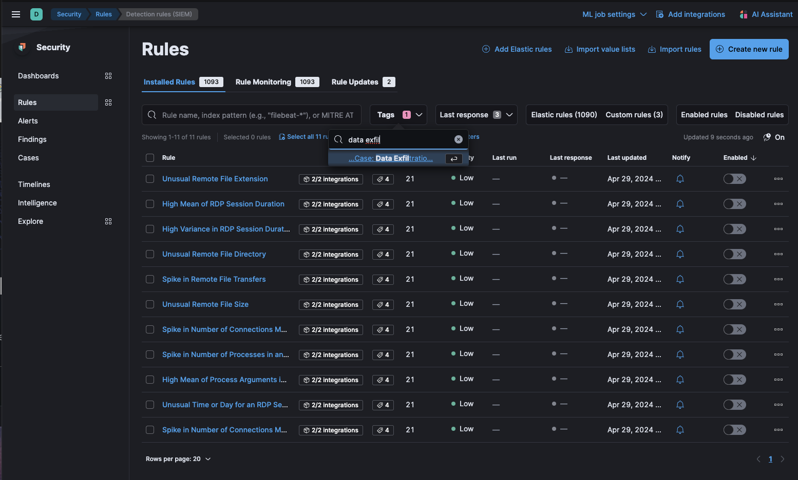
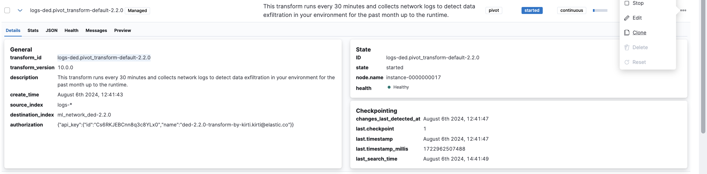
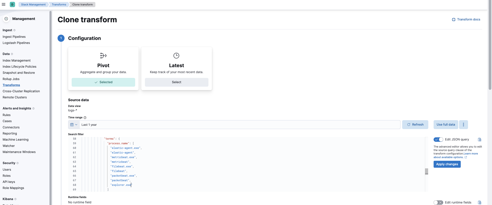
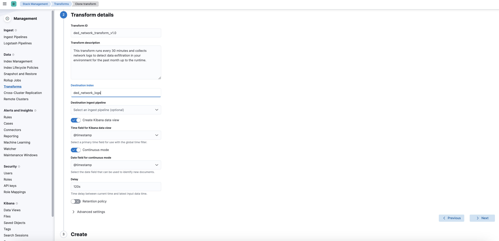
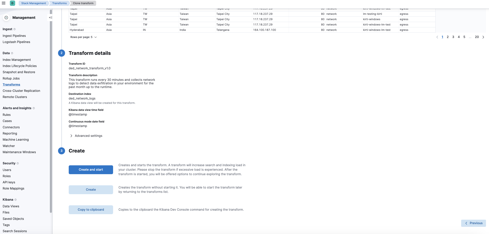

# Data Exfiltration Detection

The Data Exfiltration Detection (DED) package contains assets for detecting data exfiltration in network and file data. Data Exfiltration Detection package currently supports only unidirectional flows and does not yet accommodate bi-directional flows. This package requires a Platinum subscription. Please ensure that you have a Trial or Platinum level subscription installed on your cluster before proceeding. This package is licensed under [Elastic License 2.0](https://www.elastic.co/licensing/elastic-license).

For more detailed information refer to the following blog:
- [Detect data exfiltration activity with Kibana’s new integration](https://www.elastic.co/blog/detect-data-exfiltration-activity-with-kibanas-new-integration)

## Installation
1. **Upgrading**: If upgrading from a version below v2.0.0, see the section v2.0.0 and beyond.
1. **Add the Integration Package**: Install the package via **Management > Integrations > Add Data Exfiltration Detection**. Configure the integration name and agent policy. Click Save and Continue.
1. **Install assets**: Install the assets by clicking **Settings > Install Data Exfiltration Detection assets**.
1. **Check the health of the transform**: The transform is scheduled to run every 30 minutes. This transform creates the index `ml_network_ded-<VERSION>`. To check the health of the transform go to **Management > Stack Management > Data > Transforms** under `logs-ded.pivot_transform-default-<FLEET-TRANSFORM-VERSION>`. Follow the instructions under the header `Customize Data Exfiltration Detection Transform` below to adjust filters based on your environment's needs.
1. **Create data views for anomaly detection jobs**: The anomaly detection jobs under this package rely on two indices. One has file events (`logs-endpoint.events.file-*`), and the other index (`ml_network_ded.all`) collects network logs from a transform. Before enabling the anomaly detection jobs, create a data view with both index patterns.
    1. Go to **Stack Management > Kibana > Data Views** and click **Create data view**.
    1. Enter the name of your respective index patterns in the **Index pattern** box, i.e., `logs-endpoint.events.file-*, ml_network_ded.all`, and copy the same in the **Name** field.
    1. Select `@timestamp` under the **Timestamp** field and click on **Save data view to Kibana**.
    1. Use the new data view (`logs-endpoint.events.file-*, ml_network_ded.all`) to create anomaly detection jobs for this package.
1. **Add preconfigured anomaly detection jobs**: In **Machine Learning > Anomaly Detection**, when you create a job, you should see an option to `Use preconfigured jobs` with a card for **Data Exfiltration Detection**. When you select the card, you will see a pre-configured anomaly detection job that you can enable depending on what makes the most sense for your environment. **_Note_**: In the Machine Learning app, these configurations are available only when data exists that matches the query specified in the [ded-ml file](https://github.com/elastic/integrations/blob/main/packages/ded/kibana/ml_module/ded-ml.json#L10). For example, this would be available in `logs-endpoint.events.*` if you used Elastic Defend to collect events.
1. **Data view configuration for Dashboards**: For the dashboard to work as expected, the following settings need to be configured in Kibana. 
    1. You have started the above anomaly detection jobs.
    1. You have **read** access to `.ml-anomalies-shared` index or are assigned the `machine_learning_user` role. For more information on roles, please refer to [Built-in roles in Elastic](https://www.elastic.co/guide/en/elasticsearch/reference/current/built-in-roles.html). Please be aware that a user who has access to the underlying machine learning results indices can see the results of _all_ jobs in _all_ spaces. Be mindful of granting permissions if you use Kibana spaces to control which users can see which machine learning results. For more information on machine learning privileges, refer to [setup-privileges](https://www.elastic.co/guide/en/machine-learning/current/setup.html#setup-privileges).
    1. After enabling the jobs, go to **Management > Stack Management > Kibana > Data Views**.  Click on **Create data view** with the following settings:
        - Name: `.ml-anomalies-shared`
        - Index pattern : `.ml-anomalies-shared`
        - Select **Show Advanced settings** enable **Allow hidden and system indices**
        - Custom data view ID: `.ml-anomalies-shared`
1. **Enable detection rules**: You can also enable detection rules to alert on Data Exfiltration activity in your environment, based on anomalies flagged by the above ML jobs. As of version 2.0.0 of this package, these rules are available as part of the Detection Engine, and can be found using the tag `Use Case: Data Exfiltration Detection`. See this [documentation](https://www.elastic.co/guide/en/security/current/prebuilt-rules-management.html#load-prebuilt-rules) for more information on importing and enabling the rules.

*In Security > Rules, filtering with the “Use Case: Data Exfiltration Detection” tag*

## Transform

To inspect the installed assets, you can navigate to **Stack Management > Data > Transforms**.

| Transform name      | Purpose                                      | 	Source index  | Destination index         | Alias              |
|---------------------|----------------------------------------------|----------------|---------------------------|--------------------|
| ded.pivot_transform | 	Collects network logs from your environment | 	logs-*        | 	ml_network_ded-[version] | ml_network_ded.all |

When querying the destination index (`ml_network_ded-<VERSION>`) for network logs, we advise using the alias for the destination index (`ml_network_ded.all`). In the event that the underlying package is upgraded, the alias will aid in maintaining the previous findings. 

## Customize Data Exfiltration Detection Transform

To customize filters in the Data Exfiltration Detection transform, follow the below steps. You can use these instructions to add or remove filters for fields such as `process.name`, `source.ip`, `destination.ip`, and others.
1. Go to **Stack Management > Data > Transforms > `logs-ded.pivot_transform-default-<FLEET-TRANSFORM-VERSION>`**.
1. Click on the **Actions** bar at the far right of the transform and select the **Clone** option.

1. In the new **Clone transform** window, go to the **Search filter** and update any field values you want to add or remove. Click on the **Apply changes** button on the right side to save these changes. **Note:** The image below shows an example of filtering a new `process.name` as `explorer.exe`. You can follow a similar example and update the field value list based on your environment to help reduce noise and potential false positives.

1. Scroll down and select the **Next** button at the bottom right. Under the **Transform details** section, enter a new **Transform ID** and **Destination index** of your choice, then click on the **Next** button.

1. Lastly, select the **Create and Start** option. Your updated transform will now start collecting data. **Note:** Do not forget to update your data view based on the new **Destination index** you have just created.

## Dashboard

After the data view for the dashboard is configured, the **Data Exfiltration Detection Dashboard** is available under **Analytics > Dashboard**. This dashboard gives an overview of anomalies triggered for the data exfiltration detection package.

### Anomaly Detection Jobs

| Job | Description                                                                                |
|---|--------------------------------------------------------------------------------------------|
| ded_high_sent_bytes_destination_geo_country_iso_code | Detects data exfiltration to an unusual geo-location (by country iso code).                |
| ded_high_sent_bytes_destination_ip | Detects data exfiltration to an unusual geo-location (by IP address).                      |
| ded_high_sent_bytes_destination_port | Detects data exfiltration to an unusual destination port.                                  |
| ded_high_sent_bytes_destination_region_name | Detects data exfiltration to an unusual geo-location (by region name).                     |
 | ded_high_bytes_written_to_external_device | Detects data exfiltration activity by identifying high bytes written to an external device. |
 | ded_rare_process_writing_to_external_device | Detects data exfiltration activity by identifying a writing event started by a rare process to an external device. |
 | ded_high_bytes_written_to_external_device_airdrop | Detects data exfiltration activity by identifying high bytes written to an external device via Airdrop.|

## v2.0.0 and beyond

v2.0.0 of the package introduces breaking changes, namely deprecating detection rules from the package. To continue receiving updates to Data Exfiltration Detection, we recommend upgrading to v2.0.0 after doing the following:
- Delete existing ML jobs: Navigate to **Machine Learning > Anomaly Detection** and delete jobs corresponding to the following IDs:
    - high-sent-bytes-destination-geo-country_iso_code
    - high-sent-bytes-destination-ip
    - high-sent-bytes-destination-port
    - high-sent-bytes-destination-region_name
    - high-bytes-written-to-external-device
    - rare-process-writing-to-external-device
    - high-bytes-written-to-external-device-airdrop

Depending on the version of the package you're using, you might also be able to search for the above jobs using the group `data_exfiltration`.
- Uninstall existing rules associated with this package: Navigate to **Security > Rules** and delete the following rules:
    - Potential Data Exfiltration Activity to an Unusual ISO Code
    - Potential Data Exfiltration Activity to an Unusual Region
    - Potential Data Exfiltration Activity to an Unusual IP Address
    - Potential Data Exfiltration Activity to an Unusual Destination Port
    - Spike in Bytes Sent to an External Device
    - Spike in Bytes Sent to an External Device via Airdrop
    - Unusual Process Writing Data to an External Device 

Depending on the version of the package you're using, you might also be able to search for the above rules using the tag `Data Exfiltration`.
- Upgrade the Data Exfiltration Detection package to v2.0.0 using the steps [here](https://www.elastic.co/guide/en/fleet/current/upgrade-integration.html)
- Install the new rules as described in the [Enable detection rules](#enable-detection-rules) section below.

In version 2.1.1, the package ignores data in cold and frozen data tiers to reduce heap memory usage, avoid running on outdated data, and to follow best practices.

## Licensing

Usage in production requires that you have a license key that permits use of machine learning features.
